<!-- Slide number: 1 -->

SR50A-70/2.15
规格参数介绍

### Notes:

<!-- Slide number: 2 -->
| 型号 |  |  | SR50A\-70/2\.15 |  |  |
| --- | --- | --- | --- | --- | --- |
| 机器人类型 |  |  | 多关节型机器人 |  |  |
| 控制轴数 |  |  | 6轴 |  |  |
| 安装形式 |  |  | 地面 |  |  |
| 动作范围 | J1轴 | ±180° | 最大动作速度 | J1轴 | 165°/s |
|  | J2轴 | \+90°, \-135° |  | J2轴 | 160°/s |
|  | J3轴 | 联合：\+255°,\-180°  单轴：\+185°,\-80° |  | J3轴 | 188°/s |
|  | J4轴 | ±360° |  | J4轴 | 260°/s |
|  | J5轴 | ±125° |  |  |  |
|  |  |  |  | J5轴 | 260°/s |
|  | J6轴 | ±360° |  |  |  |
|  |  |  |  | J6轴 | 365°/s |
| 可搬运重量（手腕部） |  |  | 70kg |  |  |
| 手腕部允许 负载转动惯量 | J4轴 | 30kg·m² | 手腕部允许 转矩 | J4轴 | 308N·m |
|  | J5轴 | 30kg·m² |  | J5轴 | 308N·m |
|  | J6轴 | 12kg·m² |  | J6轴 | 150N·m |
| 重复定位精度 |  |  | ±0\.05mm |  |  |
| 最大臂展 |  |  | 2158mm |  |  |
| 机器人质量 |  |  | 530kg |  |  |
| 防护等级（手腕） |  |  | IP65 |  |  |

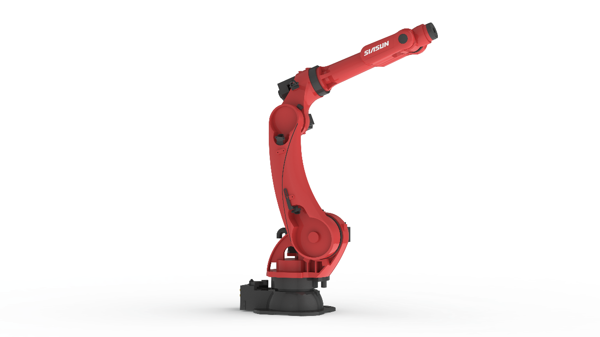

### Notes:

<!-- Slide number: 3 -->
SR50A-70/2.15 控制柜

| 机型 | SR50A\-70/2\.15 |  |
| --- | --- | --- |
| 控制器型号 | SRC M6 | SRC ME6 |
| 示教盒 | STB2A\-H |  |
| 输入功率 | 5\.1kW |  |
| 电柜体积 （宽×深×高） | 710mm×550mm×776\.5mm | 710mm×569mm×1200mm |
| 输入电源 | 三相四线 AC380V 50/60HZ |  |
| 总线通信 | 支持RS485、DeviceNet主从站、PROFINET从站、Modbus\-TCP（主/从站）、EtherCAT从站、CC\-Link从站、EtherNet/IP从站、TCP/IP（离线接口库） |  |
| 电柜I/O接口 | 标准NPN型16DI/16DO，可选配PNP型，最高可扩展至64DI/64DO |  |
| 工作环境温度 | 0°\~45°（工作环境温度超过 45°需加冷却设备） |  |
| 电柜防护等级 | IP54 |  |

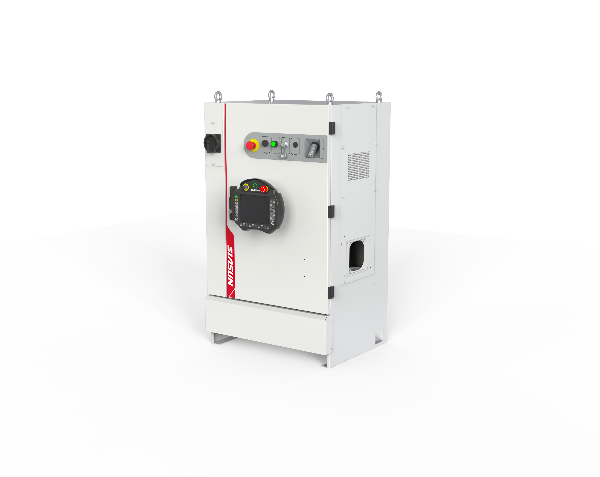
 SRC M6&ME6

<!-- Slide number: 4 -->
机器人互联电缆

动力电缆、码盘线缆

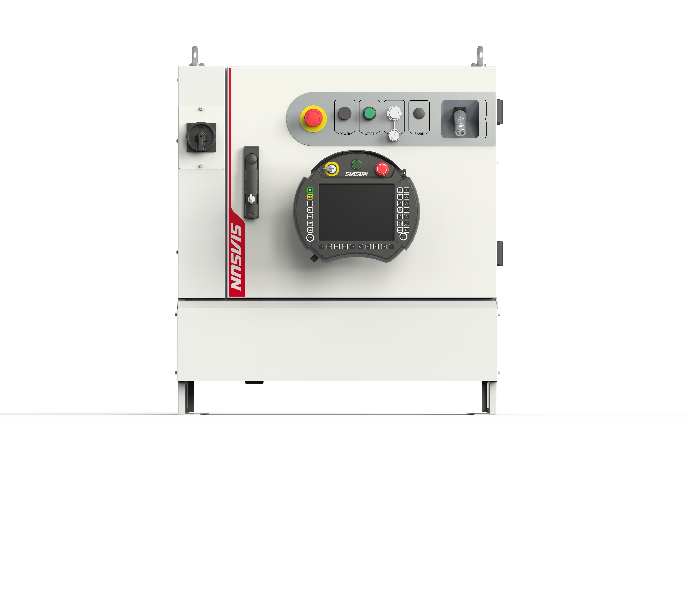
| 配置 | 长度 | 拖链/非拖链 |
| --- | --- | --- |
| 标配 | 7m | 拖链 |
| 选配 | 14m | 拖链 |
|  | 20m | 拖链 |
|  | 25m | 拖链 |
|  | 30m | 拖链 |

<!-- Slide number: 5 -->
工作范围

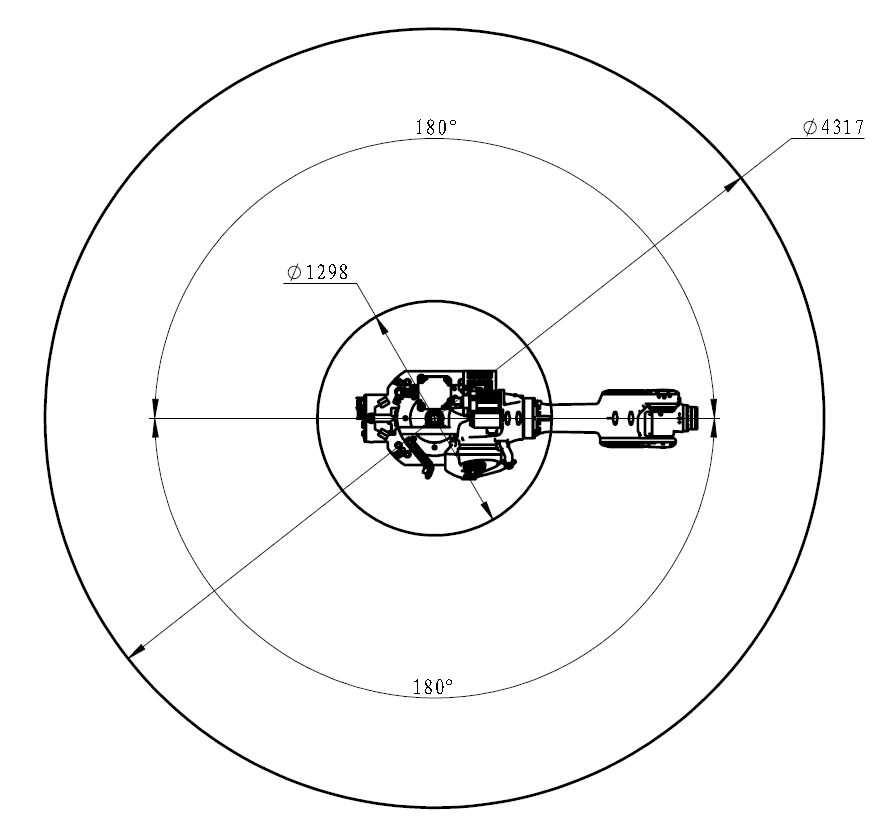

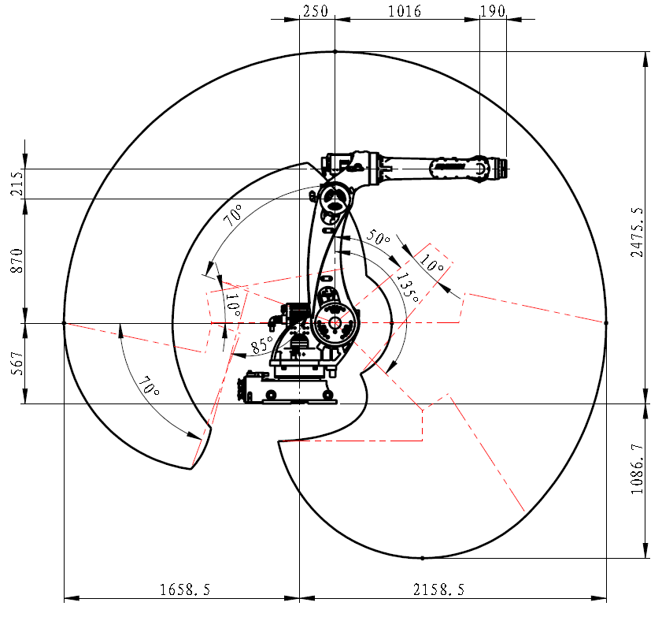

<!-- Slide number: 6 -->
底座安装接口

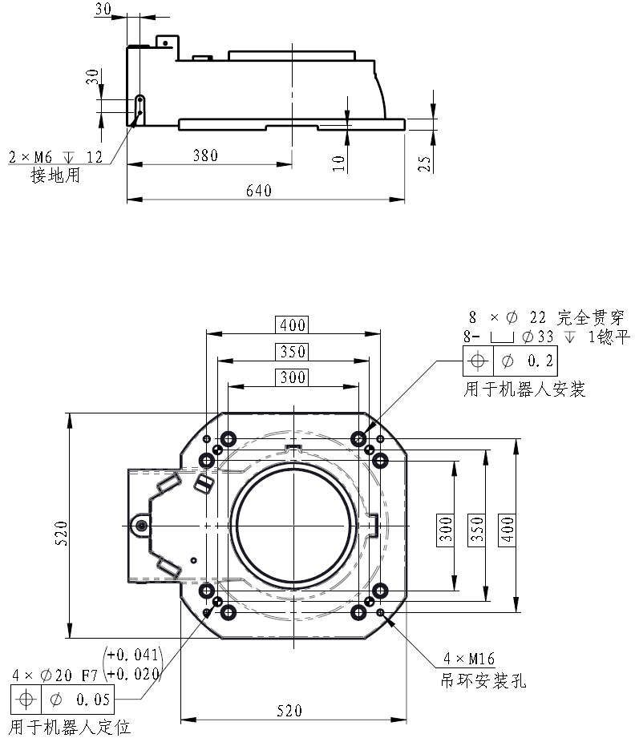

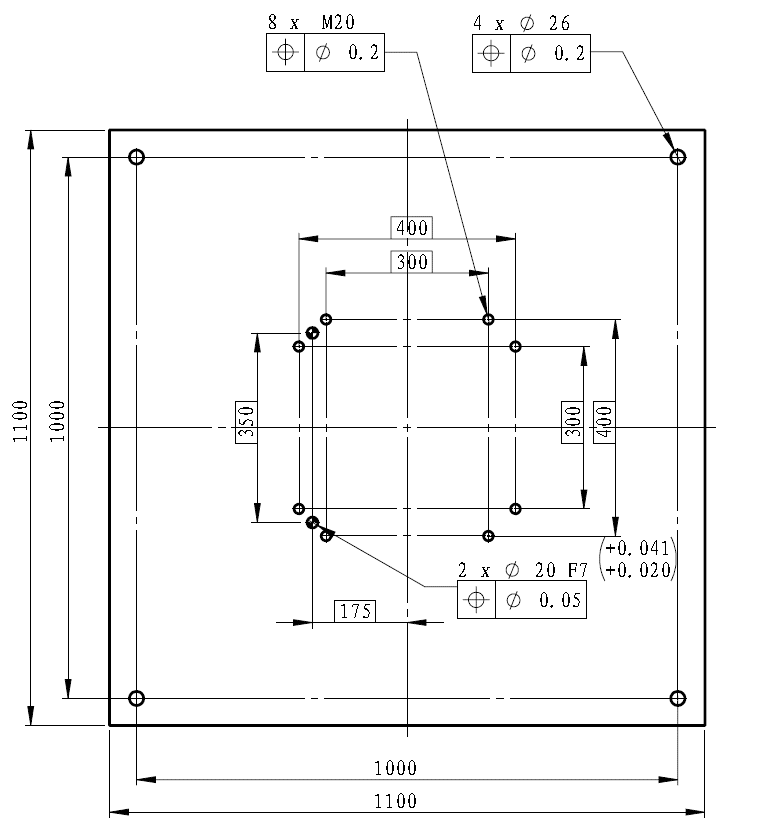
| 名称和型号 | 数量 |
| --- | --- |
| 固定螺钉：M20ⅹ50(GB/T70\.1 12\.9级） | 8 |
| 弹簧垫片：弹簧垫圈20（GB/T93\) | 8 |
| 定位销：圆柱销20ⅹ40（GB/T120\.2\) | 2 |

<!-- Slide number: 7 -->
末端法兰接口

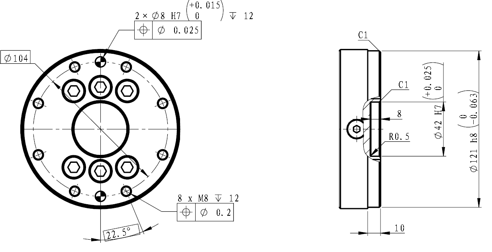
| 名称和型号 | 数量 |
| --- | --- |
| 固定螺钉：M8 (GB/T 70\.1 12\.9级） | 8 |
| 定位销：圆柱销Φ8（GB/T120\.2\) | 1 |

<!-- Slide number: 8 -->
其它接口

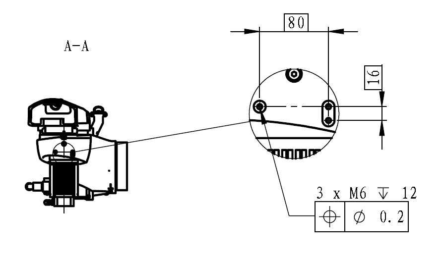

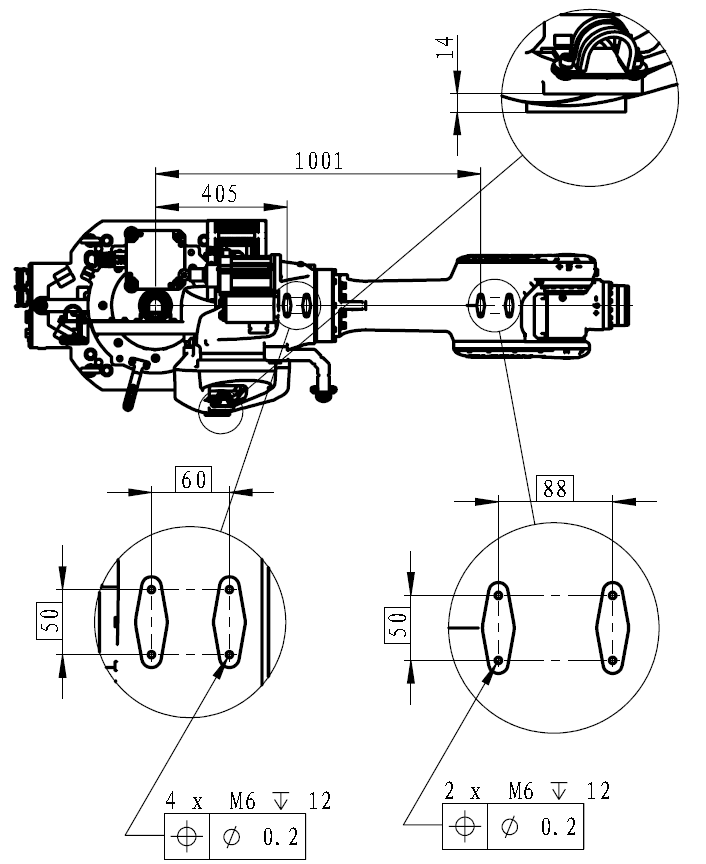

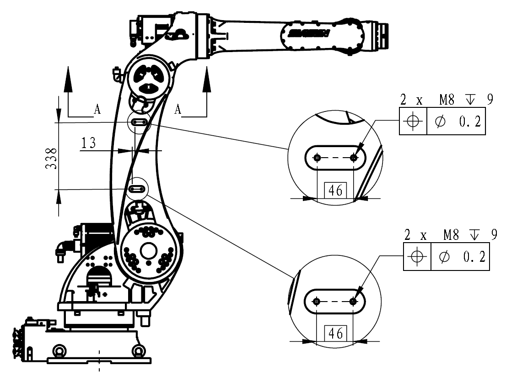

<!-- Slide number: 9 -->
其它接口

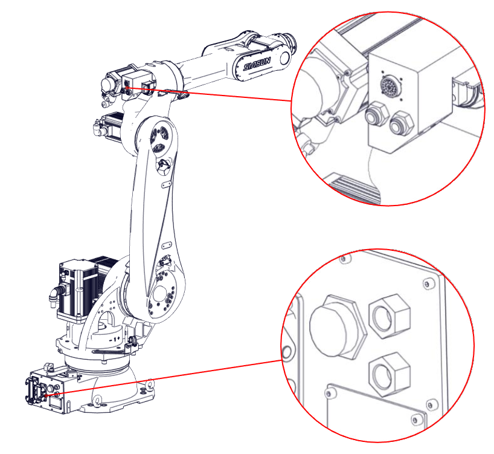
| 项目 | 规格 |
| --- | --- |
| 预装信号线（1\-3轴） | 32芯，单芯线径0\.2mm² |
| J1轴气管接头 | 2\*内螺纹Rc3/8 |
| J3轴气管接头 | 2\*∅12mm |

<!-- Slide number: 10 -->
负载曲线

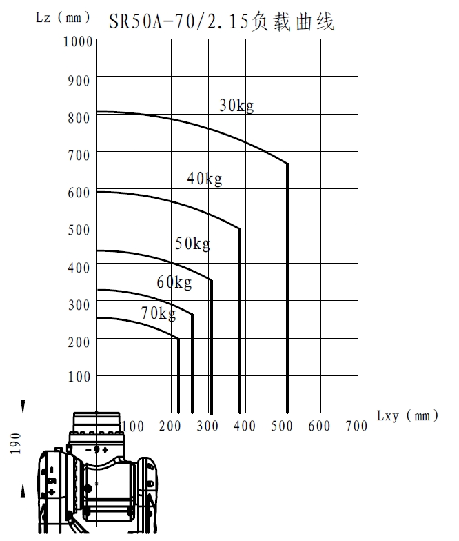

<!-- Slide number: 11 -->
起重机搬运

吊装姿态（不带叉车脚）
吊装姿态（带叉车脚）

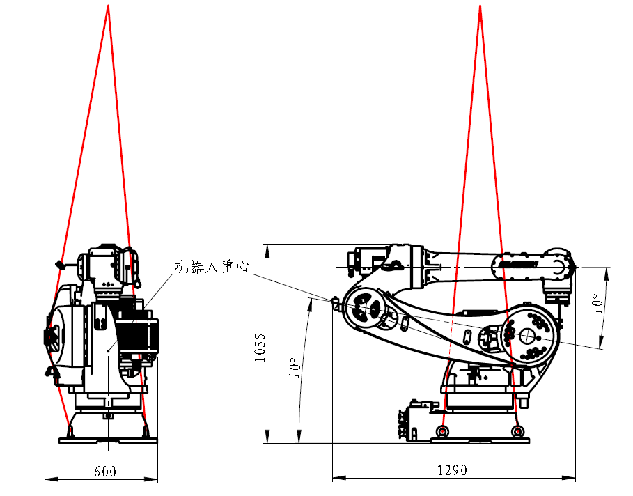

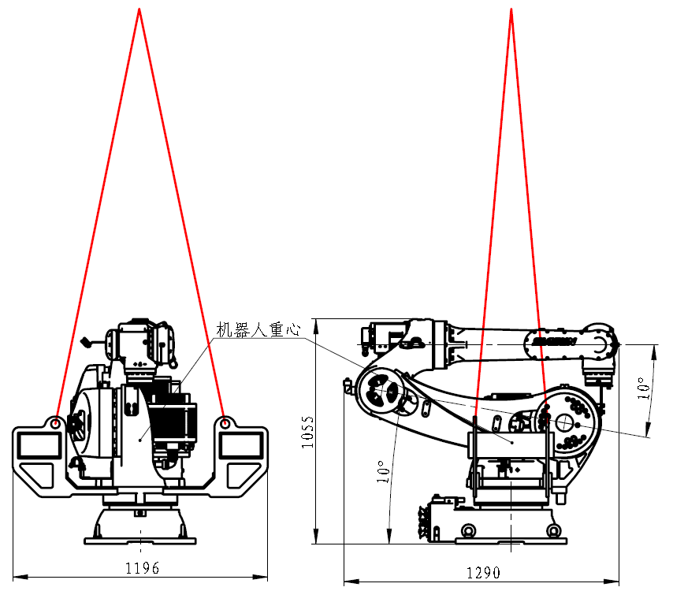
| 各轴关节值 | 1轴 | 2轴 | 3轴 | 4轴 | 5轴 | 6轴 |
| --- | --- | --- | --- | --- | --- | --- |
| 关节值 | 0° | \+80° | \-80° | 0° | 0° | \-90° |
| 各轴关节值 | 1轴 | 2轴 | 3轴 | 4轴 | 5轴 | 6轴 |
| --- | --- | --- | --- | --- | --- | --- |
| 关节值 | 0° | \+80° | \-80° | 0° | 0° | \-90° |

<!-- Slide number: 12 -->
叉车搬运

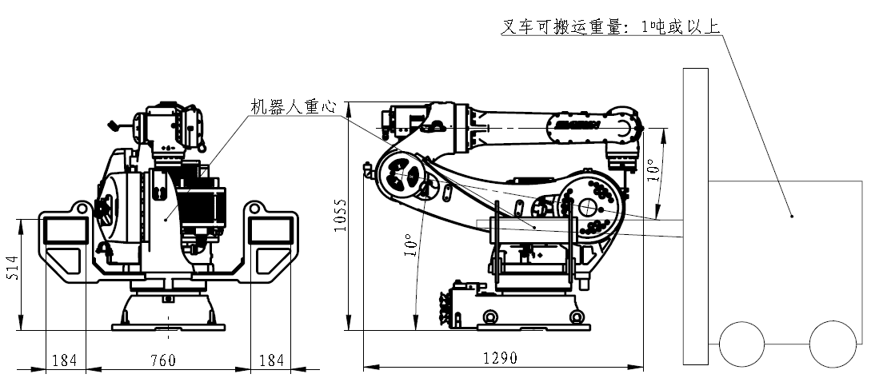
| 各轴关节值 | 1轴 | 2轴 | 3轴 | 4轴 | 5轴 | 6轴 |
| --- | --- | --- | --- | --- | --- | --- |
| 关节值 | 0° | \+80° | \-80° | 0° | 0° | \-90° |

<!-- Slide number: 13 -->
历史修订记录

| 文件版本 | 修订日期 | 主要变化 |
| --- | --- | --- |
| A/1 | 202５年3月6日 | 增加ME6控制柜，TCP/IP（离线接口库）总线通讯方式，互联线缆名称变更，功率参数变更 |

<!-- Slide number: 14 -->

### Notes: