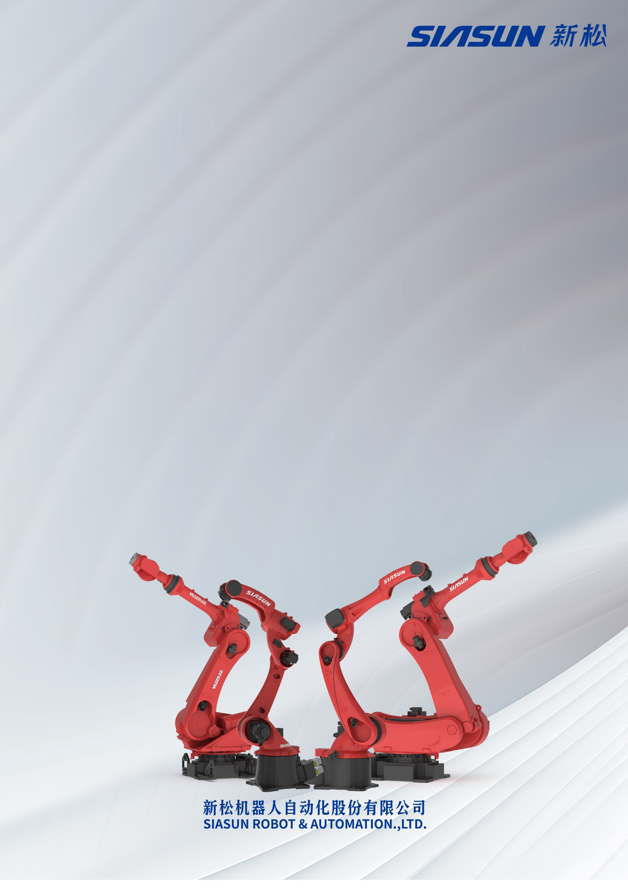

| S:\品牌与公共关系部\1.LOGO\SIASUN+新松透明底.png |
| --- |
| 新松机器人安全手册 |
| 工业机器人 技术资料 |

|  |
| --- |

文件历次修订记录

| **文件版本** | **修订日期** | **修订人** | **主要变化** |
| --- | --- | --- | --- |
| V1\.0 | 2023年11月10日 | 丛宇 | 初版编制。 |
| V1\.1 | 2023年11月27日 | 丛宇 | 修改封面背景。 |
| V1\.2 | 2024年3月7日 | 陈睿 | 新增SR50A\-50/2\.15机器人相关内容。 |
| V1\.3 | 2024年6月11日 | 王达 | 新增C6控制器的内容 |
| V1\.4 | 2024年6月18日 | 龙腾飞 | 新增SR500A机器人相关内容 |
| V1\.5 | 2024年6月24日 | 苗翔迪 | 新增M6控制柜相关内容 |
| V1\.6 | 2024年7月3日 | 陈睿 | 新增SP120A\-120/2\.50，SR25A\-25/1\.80SR25A\-35/1\.80机器人相关内容。 |
| V1\.7 | 2024年9月4日 | 陈睿 | 新增SR50A\-70/2\.15机器人相关内容 |
| V1\.8 | 2024年11月13日 | 刘然 | 新增SR210\-120/3\.05机器人相关内容 |
| V1\.9 | 2024年12月13日 | 刘然 | 新增SR270\-270/2\.70机器人相关内容及L6控制柜相关内容 |

目录

文件历次修订记录 1

1 紧急安全信息概述 1

2 紧急安全系统 2

2\.1 停止系统 2

2\.1\.1 急停按钮位置 2

2\.2 灭火 5

2\.3 控制系统电源的断开 6

2\.3\.1 主断路器位置 6

2\.4 对工作人员的救援 9

2\.4\.1 救援受困工作人员的步骤 9

2\.5 紧急释放机器人抱闸 10

2\.5\.1 释放机器人抱闸方法 10

2\.5\.2 使用按钮释放抱闸 10

2\.5\.3 按钮盒机器人释放抱闸 12

2\.6 从紧急停止状态下恢复 16

3 一般安全信息 17

4 机器人系统概述 18

4\.1 应用环境 18

4\.2 机器人系统配置 18

4\.3 机器人培训 19

5 集成安全说明 19

5\.1 概述 19

5\.2 机器人的外围设备 20

5\.3 电源及线缆连接 20

5\.4 其他安全措施 20

5\.5 末端执行器及其他设备 21

6 安全防护设备 21

6\.1 停止方式 21

6\.2 紧急停止 22

6\.3 模式选择开关 22

6\.4 3档安全开关 DEADMAN 25

6\.5 安全防护外设 25

6\.5\.1 安全门和安全锁 25

6\.5\.2 其他防护设备 26

6\.6 安全围栏内操作 26

6\.7 进入安全围栏 26

7 集成过程中的安全 27

7\.1 安装 27

7\.2 调试 27

7\.2\.1 限定工作空间及人员 27

7\.2\.2 安全措施的检查 28

7\.2\.3 机器人系统的变更 28

7\.3 编程 28

7\.4 测试程序 28

7\.5 故障排查 29

7\.6 启动自动运行 29

7\.7 维护 29

7\.8 拆卸机器人 30

7\.9 其他注意事项 30

1. 紧急安全信息概述

本章用来介绍机器人控制系统发生紧急情况时的安全使用信息，在使用新松工业机器人时，务必使用与产品相关的电气，机械，操作手册，以及相关的应用说明手册。

**注意：本手册务必与机器人控制系统放在一起！同时，也需要放在工程师、操作人员可以方便获取的地方。**

对新松机器人进行维护、维修、安装等工作的人员：

1. 请接受新松提供的培训，并且具备机械安装，电气装配、维护、维修等相关知识。
2. 在安装和维修机器人之前，请阅读机器人的各种手册。

**警告：解除抱闸的轴，手臂有可能因为重力原因下落，此外，由于2轴有平衡缸，还有负载，所以无法根据机器人当前姿态正确预测机器人下落还是上升，因此，在解除抱闸时，请做好适当的预防措施，比如使用吊车等起重设备来支撑机器人，以免释放抱闸时，机器人移动，对工作人员造成二次伤害。**

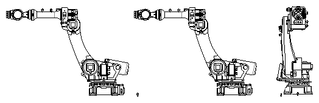

图 1‑1 2轴释放抱闸吊装方法

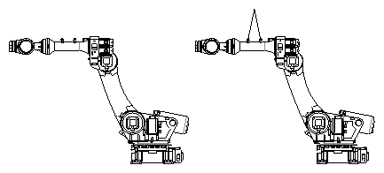

图 1‑2 3轴释放抱闸吊装方法

# 紧急安全系统

## 停止系统

在机器人使用过程中，如果发现下列情况，请立即按下任何紧急停止按钮：操作机器人运行时，机器人运行区域内，有工作人员。

1. 机器人运行过程中，对工作人员造成伤害或者对设备造成损害。

### 急停按钮位置

机器人使用现场可以根据客户实际需要，在任意位置增加外部急停按钮。

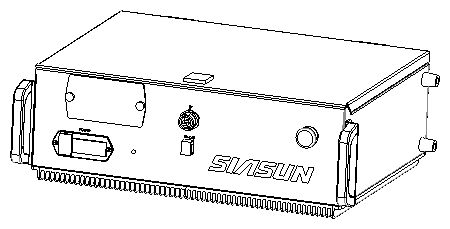

急停按钮

图 2‑1 SRC C5控制器

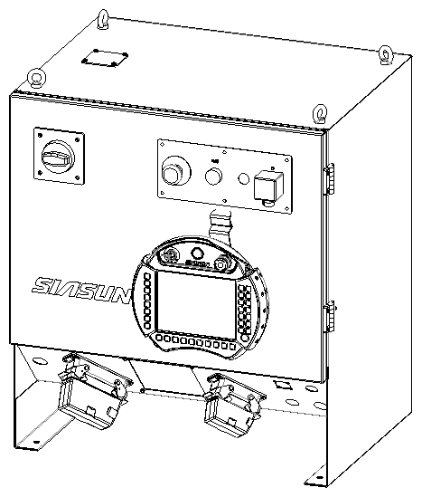

急停按钮

图 2‑2 SRC M5控制器

急停按钮

图 2‑3 SRC E5控制器

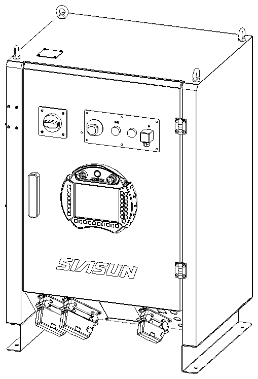

急停按钮

图 2‑4 SRC G5控制器

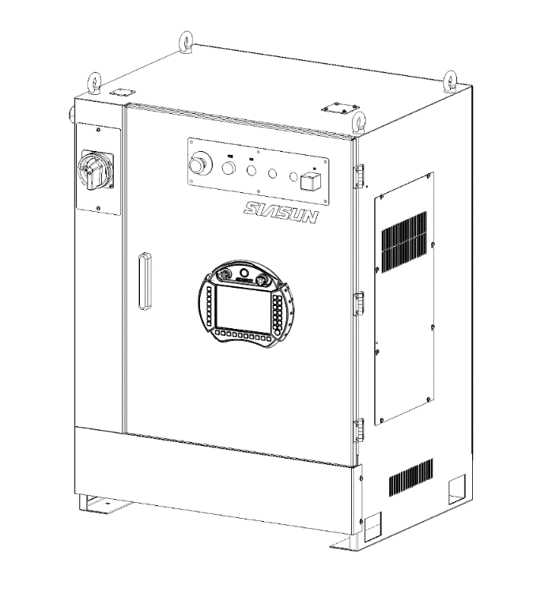

急停按钮

图 2‑5 SRC L5控制器

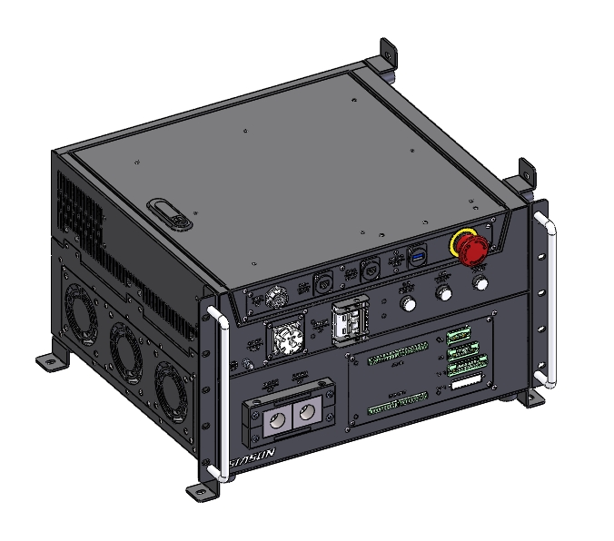

急停按钮

图 2‑6 SRC C6控制器

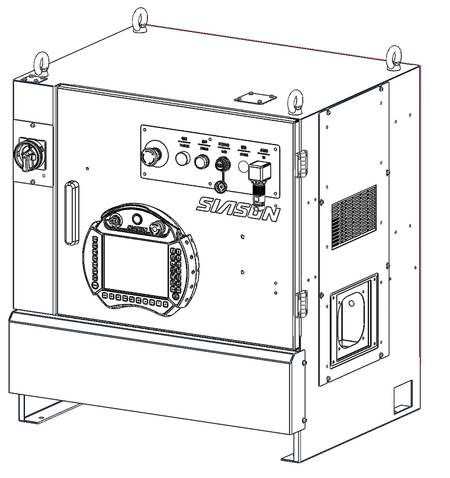

急停按钮

图 2‑7 SRC M6控制器

急停按钮

图 2‑8 SRC L6控制器

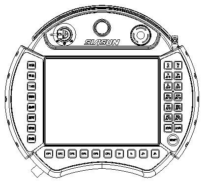

急停按钮

图 2‑9 示教器

**注意：增加外部急停的方法，请查看《新松机器人电气使用及维护手册》。**

## 灭火

控制系统如果发生火灾，需要使用干粉灭火器进行灭火。

## 控制系统电源的断开

每个控制系统都有一个主断路器，为了确保控制系统完全断电，请断开所有有关的主断路器（如外部电源、焊机等配套设备）。有厂内电源开关的位置，可以参考厂内相关的文档。

### 主断路器位置

主电源开关

图 2‑10 SRC C5控制器

主断路器

图 2‑11 SRC M5控制器

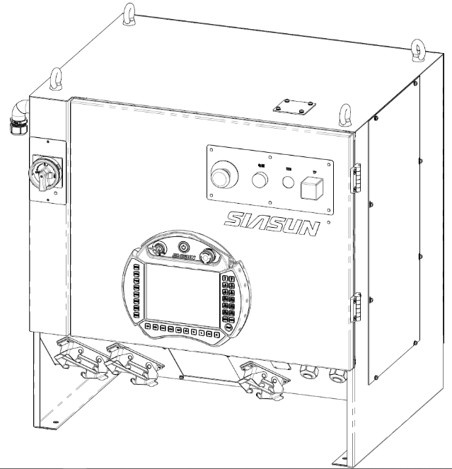

主断路器

图 2‑12 SRC E5控制器

主断路器

图 2‑13 SRC G5控制器

主断路器

图 2‑14 SRC C6控制器

主断路器

图 2‑15 SRC L5控制器

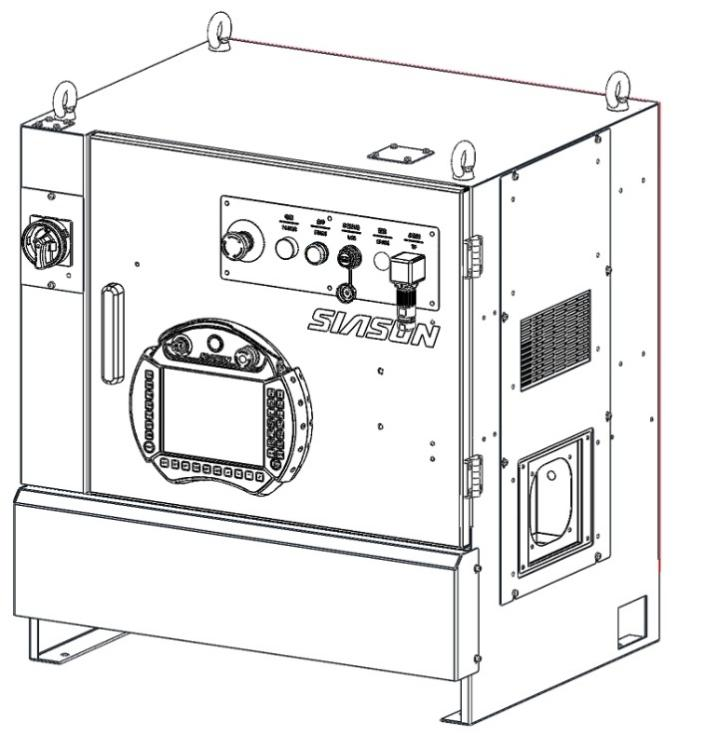

主断路器

图 2‑16 SRC M6控制器

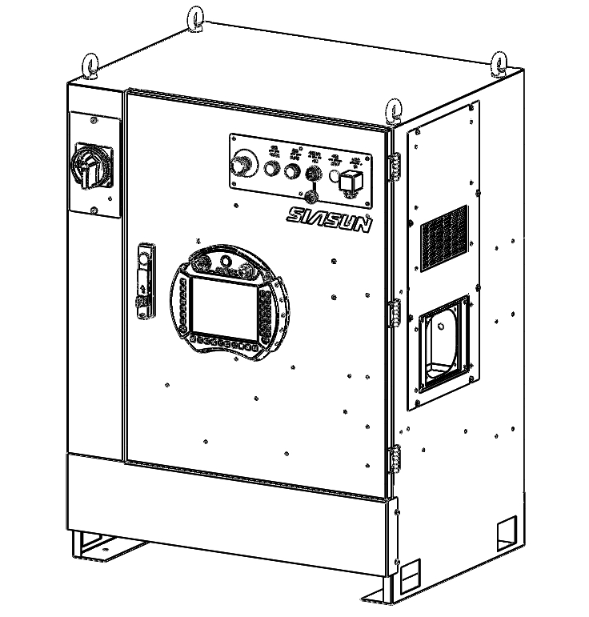

主断路器

图 2‑17 SRC L6控制器

**警告：如果控制模块的电源来自外部，要确保外部供电电源全部关断，才能关闭整个控制系统的电源。**

## 对工作人员的救援

如果有工作人员受困于机器人，要避免机器人对该工作人员造成二次伤害。

释放机器人的电机抱闸后，小负载的机器人可以手动移动机器人的各轴。大负载的机器人需要吊车等起重设备。释放电机抱闸要务必准备好相应的设备。

**警告：释放抱闸后机器人可能会因为自身重力或弹簧缸弹力而出现下沉或上升，在释放抱闸前，需要先确保机器人不会因为下沉或上升动作而对人和设备产生伤害，避免增加任何风险。**

### 救援受困工作人员的步骤

1. 请立即按下任何可以接触到的紧急停止按钮。
2. 确保工作人员不会因为之后的救援工作造成伤害（主要是防止机器人等设备意外运动伤人）。
3. 移动机器人，救出受困人员并进行医疗。（移动方法见2\.5章节）
4. 所有人员离开机器人工作区域，避免再次发生伤害。

## 紧急释放机器人抱闸

在紧急情况下，可以通过机器人本体上解抱闸按钮及安装解抱闸按钮盒，手动释放机器人各轴的抱闸。

小负载的机器人，可以通过手动松抱闸来移动机器人，大负载的机器人需要使用吊车等起重设备。

**警告：释放抱闸后机器人可能会因为自身重力或弹簧缸弹力而出现下沉或上升，在释放抱闸前，需要先确保机器人不会因为下沉或上升动作而对人和设备产生伤害，避免增加任何风险。**

### 释放机器人抱闸方法

使用本体上的释放抱闸按钮释放抱闸前，机器人应连接控制器，且控制器处于通电状态。

部分机型释放抱闸使用抱闸盒，见2\.5\.3章节。两者对应的机型不同，详情见下面章节。

**警告：**

1. **释放抱闸时，请务必按下机器人的急停按钮。**
2. **释放抱闸后的机器人即使有类似的起重设备进行支撑，也可能会因为自身的重力、弹簧缸弹力而出现一定的下沉或上升，在释放抱闸前，需要先确保机器人运动不会对人员和设备产生伤害，避免增加任何风险。**

### 使用按钮释放抱闸

**注意：使用本体的按钮释放抱闸前，机器人应连接控制器，且控制器处于通电状态，急停按钮必须被按下。**

释放抱闸按钮在机器人的基座上，根据机器人的型号不同，按钮的位置也有所不同。一个按钮唯一对应一个轴。抱闸按钮单元已用金属板进行保护。按住内部抱闸释放面板上的对应按钮不动，即可释放待定机器人轴的抱闸，释放该按钮后，抱闸将恢复工作。

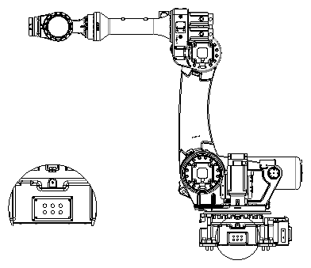

图 2‑18 SR210A\-210/2\.65、SR210A\-210/3\.05\-DW机器人释放抱闸按钮位置

**警告：新松机器人各轴定义如下，操作解除按钮时要准确对应各轴，避免误操作导致危险发生。**

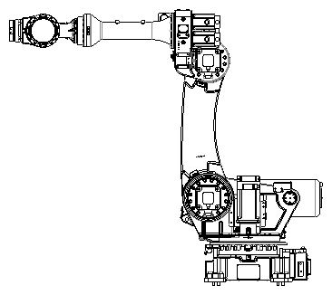

1轴

2轴

3轴

4轴

5轴

6轴

图 2‑19 6轴机器人各轴定义

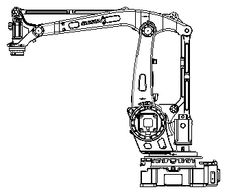

1轴

2轴

3轴

4轴

图 2‑20 4轴机器人各轴定义

### 按钮盒机器人释放抱闸

SR12A\-12/1\.46、SR25A\-20/1\.80、SR25A\-12/2\.01、SR25A\-25/1\.80、SR25A\-35/1\.80、SR50A\-50/2\.15、SR50A\-70/2\.15、SR210\-120/3\.05、SP120A\-120/2\.50、SR270A\-270/2\.70、SR500A\-360/2\.83、SR500A\-500/2\.52机器人释放抱闸需要使用抱闸盒，抱闸盒上的按钮对应机器人的6个轴的抱闸。使用抱闸盒前需要将控制器断电。

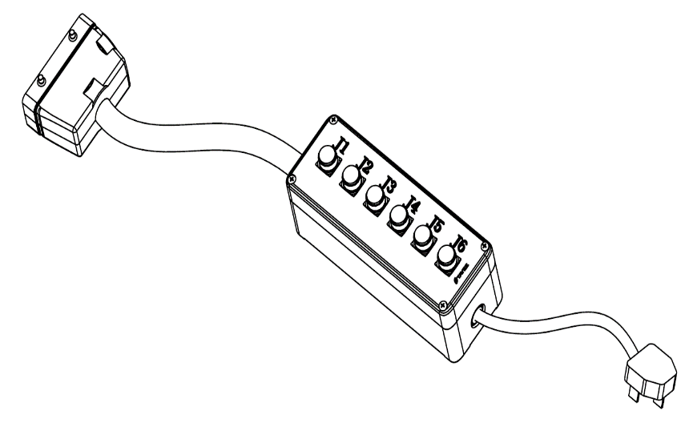

与机器人

重载相连

接AC220V

50/60Hz电源

图 2‑21 抱闸盒图样

**SR12A\-12/1\.46系列机器人解抱闸步骤：**

1. 将抱闸盒的重载线与机器人的RM1相连；

抱闸盒接口位置

图 2‑22 解抱闸盒的接口位置

1. 连接AC220V 50/60Hz电源；
2. 在解抱闸过程中，需操作人员确保本体各轴松抱闸状态下，不造成砸落危险，才可进行解抱闸操作，详情了解第一章；
3. 进行解抱闸分别按下J1、J2、J3、J4、J5、J6时所对应1轴、2轴、3轴、4轴、5轴、6轴依次被解开。

**SR25A\-20/1\.80、SR25A\-12/2\.01、SR25A\-25/1\.80、SR25A\-35/1\.80系列机器人解抱闸步骤：**

1. 将抱闸盒的重载线与机器人的RM1相连；

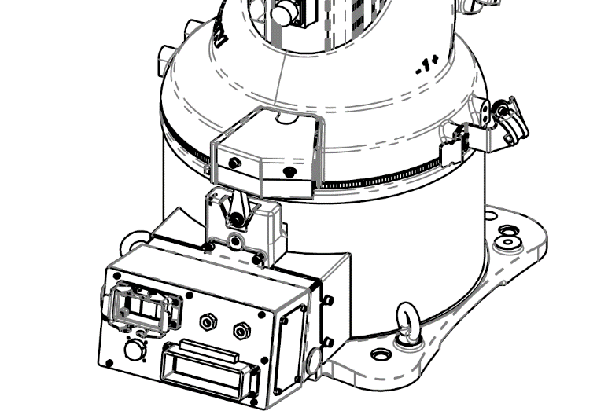

抱闸盒接口位置

图 2‑23 解抱闸盒的接口位置

1. 连接AC220V 50/60Hz电源；
2. 在解抱闸过程中，需操作人员确保本体各轴松抱闸状态下，不造成砸落危险，才可进行解抱闸操作，详情了解第一章；
3. 进行解抱闸分别按下J1、J2、J3、J4、J5、J6时所对应1轴、2轴、3轴、4轴、5轴、6轴依次被解开；

**SR50A\-50/2\.15、SR50A\-70/2\.15系列机器人解抱闸步骤：**

1. 将抱闸盒的重载线与机器人的RM1相连；

 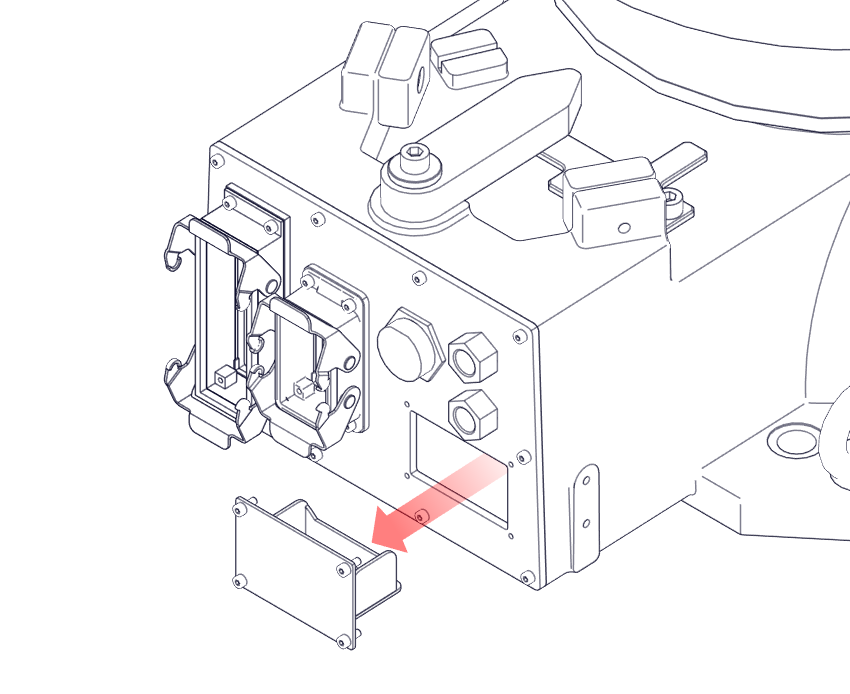

抱闸盒接口位置

图 2‑24 解抱闸盒的接口位置

1. 连接AC220V 50/60Hz电源；
2. 在解抱闸过程中，需操作人员确保本体各轴松抱闸状态下，不造成砸落危险，才可进行解抱闸操作，详情了解第一章；
3. 进行解抱闸分别按下J1、J2、J3、J4、J5、J6时所对应1轴、2轴、3轴、4轴、5轴、6轴依次被解开；

**SR500A\-360/2\.83、SR500A\-500/2\.52系列机器人解抱闸步骤：**

1. 将抱闸盒的重载线与机器人的RM1相连；

 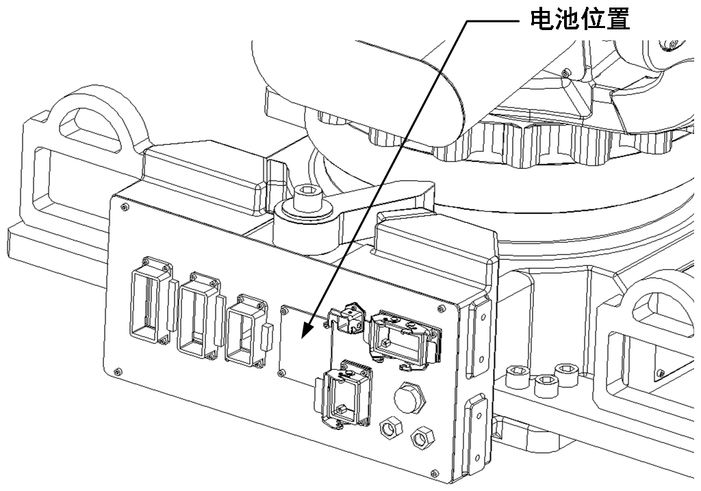

抱闸盒接口位置

图 2‑25 解抱闸盒的接口位置

1. 连接AC220V 50/60Hz电源；
2. 在解抱闸过程中，需操作人员确保本体各轴松抱闸状态下，不造成砸落危险，才可进行解抱闸操作，详情了解第一章；
3. 进行解抱闸分别按下J1、J2、J3、J4、J5、J6时所对应1轴、2轴、3轴、4轴、5轴、6轴依次被解开；

**SP120A\-120/2\.50系列机器人解抱闸步骤：**

1. 将抱闸盒的重载线与机器人的RM1相连；

 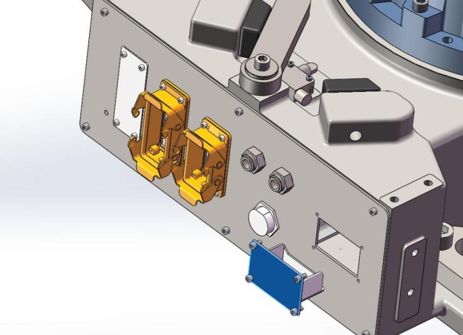

抱闸盒接口位置

图 2‑26 解抱闸盒的接口位置

1. 连接AC220V 50/60Hz电源；
2. 在解抱闸过程中，需操作人员确保本体各轴松抱闸状态下，不造成砸落危险，才可进行解抱闸操作，详情了解第一章；
3. 进行解抱闸分别按下J1、J2、J3、J4时所对应1轴、2轴、3轴、4轴依次被解开；

**SR210\-120/3\.05系列机器人解抱闸步骤：**

1. 将抱闸盒的重载线与机器人的RM3相连；

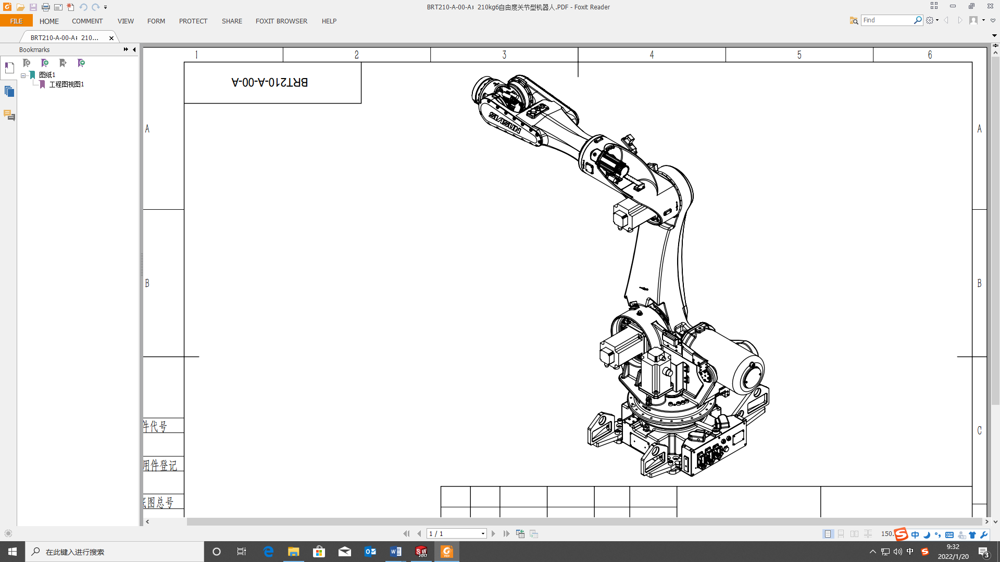

抱闸盒接口位置

图 2‑27 解抱闸盒的接口位置

1. 连接AC220V 50/60Hz电源；
2. 在解抱闸过程中，需操作人员确保本体各轴松抱闸状态下，不造成砸落危险，才可进行解抱闸操作，详情了解第一章；
3. 进行解抱闸分别按下J1、J2、J3、J4、J5、J6时所对应1轴、2轴、3轴、4轴、5轴、6轴依次被解开；

**SR270\-270/2\.70系列机器人解抱闸步骤：**

1. 将抱闸盒的重载线与机器人的RM3相连；

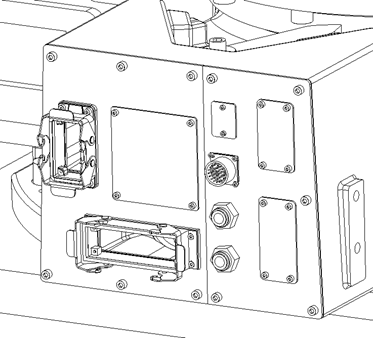

抱闸盒接口位置

图 2‑28 解抱闸盒的接口位置

1. 连接AC220V 50/60Hz电源；
2. 在解抱闸过程中，需操作人员确保本体各轴松抱闸状态下，不造成砸落危险，才可进行解抱闸操作，详情了解第一章；
3. 进行解抱闸分别按下J1、J2、J3、J4、J5、J6时所对应1轴、2轴、3轴、4轴、5轴、6轴依次被解开；

## 从紧急停止状态下恢复

从紧急停止状态下恢复，虽然操作简单，但对于安全的确认工作却十分重要。要确保整个系统所有的安全问题都被排查后，才可以进行恢复运行的工作。

**步骤：**

1. 排除导致急停按钮按下的原因
2. 确定引起急停动作的设备状态并重置。
3. 向右边旋转急停按钮。

图 2‑29 急停按钮

1. 按示教器的RESET按钮。
2. 重新启动设备。

图 2‑30 开始、RESET键

# 一般安全信息

**我们会在安全手册中列举尽可能全面的安全信息，但不能将工业现场能遇到的所有情况都描述到，所以当遇到手册所没有描述的操作时，请不要进行这些操作。**

使用新松工业机器人集成系统时，集成商和客户都有责任为工作人员设计完善可靠的防护措施（软硬件集成），来保证现场工作人员的人身安全。

工业机器人的工作特性与一般的机械设备不同，因为机器人及末端执行器有可能随时运动到它能够到达的任何位置，所以在集成系统现场要考虑任何有可能发生危险的情况，并做好相应的防护工作。

当集成商在集成机器人系统时，请了解关于机器人集成系统相关的安全标准或咨询与安全有关的专业公司或人员，来确定机器人集成系统是否符合安全标准。

机器人系统的集成商或客户需要为使用机器人系统的工作人员进行相关的安全培训，让工作人员熟悉了解机器人系统已知的安全风险，并且规定好正确的安全工作程序，来保护现场的工作人员，我们希望所有的需要进入集成系统现场的工作人员都要参与新松公司组织的安全培训。

**警告 注意 注释**

本手册包括一些安全事项，目的是为了保障作业人员的人身安全和设备的安全，在正文中表示为“警告”、“注意”。相关补充说明以“注释”来描述。在用户使用之前，必须熟读这些“警告”、“注意”和“注释”中所叙述的事项。

**警告**

如果错误操作，有可能导致作业人员死亡或者严重人身伤害。

**注意**

如果错误操作，有可能导致人员轻微伤害设备损坏。

**注释**

除了警告和注意之外的补充内容。

# 机器人系统概述

## 应用环境

工业机器人适用于大多数工业环境，但是请不要在下列环境中使用工业机器人：

1. 在易燃的、易爆的环境中使用机器人。
2. 在放射性环境中使用机器人。
3. 在水中或液体中使用机器人。
4. 用机器人来进行人或者动物的转运。
5. 爬上机器人进行作业。
6. 在不符合安全标准的环境下使用工业机器人。

## 机器人系统配置

下列设备是机器人本身安全设备：

1. 机器人本体
2. 控制器
3. 示教器

用户必须根据现实工况配置下列设备：

1. 完全围住机器人，只能通过配有安全锁的安全门进入内部的安全围栏。
2. 带有安全锁和复位装置的安全门。

以下设备，需要客户自行考虑安全措施：

1. 末端执行器
2. 工件
3. 其他外围设备

机器人操作工作分为以下三种：

1. 进行日常的机器人电源的启动、关断工作，不进入安全围栏内部。
2. 对机器人进行示教编程工作，需要进入安全围栏内部工作。
3. 进入安全围栏内对机器人进行编程、维护、维修、更换等工作。

如果需要在安全围栏内工作，必须经过新松公司的机器人使用培训。

在对机器人进行操作、编程、维护等工作时，作业人员必须注意安全，至少应穿戴以下安全防护进行作业：

1. 适于作业内容的工作服
2. 安全鞋
3. 安全帽

一般操作人员不可以进入围栏进行作业。

示教和维护的工程师可以进入安全围栏内进行工作，工作内容包括：安装、调试、设置、维护、维修机器人。**要在安全护栏内作业，必须经过机器人使用的专业培训并考核合格。**

## 机器人培训

对机器人编程，示教，维修，机械电气调试等工作的操作人员和工程师，必须接受机器操作和维修的培训。

1. 根据相关的安全标准进行安全培训。
2. 对机器人进行手动、编程、示教、自动运行等培训。
3. 对机器人的硬件配置、功能、设定、接口、U盘应用等进行培训。
4. 对机器人的常见问题的维护、维修、零点的标定、机器人的安装方法等进行培训。

**警告：使用工业机器人前，必须对使用、维护、机械电气调试、维修机器人的工作人员进行培训，否则会造成难以预知的危险，造成严重的人身伤害和设备损坏。**

# 集成安全说明

本章对集成机器人系统的各项配置及注意事项进行说明。

## 概述

设计机器人集成系统时，一定要考虑到各种可预知的安全风险，避免故障的发生。同时也要考虑到即使在电气、机械、软件、气压、液压等系统发生故障时，也能确保整体安全，不要伤害到工作人员、同时也不能损伤其他设备。

对工作人员的操作舒适感，压力等也要进行考虑，避免工作人员在过分疲劳的情况下，使用机器人系统设备。

## 机器人的外围设备

除机器人本体外的其他设备，需要满足如下要求:

1. 机器人系统需要安装符合安全标准的安全围栏或光栅等防护装置，以免工作人员误入机器人工作范围，造成伤害或死亡。
2. 需要在机器人及末端执行器运行的最大范围外，留出安全空间。
3. 机器人系统的操作面板需要安装在安全围栏外面，非常容易操作的位置，而且在该位置上进行任何操作，都不会对工作人员造成危害。
4. 需要考虑机器人维护、维修时的额外空间，还需要考虑维护、维修人员在工作时的紧急避险的通道，这些空间要有充分的大小。
5. 机器人安装在地面上时，需要根据手册来选择钢板或者底座。
6. 如果不得不使用T2模式操作机器人，请务必保持工作人员在机器人的末端执行器最远可达位置外至少1米的距离。
7. 运输机器人及控制器时，需要按照手册所指示的运输姿态及运输方式运输。

## 电源及线缆连接

需要按照《新松机器人电气使用及维护手册》的要求安装互联线缆、电源、地线等。

机器人集成系统要考虑突然断电的情况，应该避免由于电源的突然通、断引发的各种危险状况发生，例如：

1. 末端执行器的状态变化导致的工件脱落。
2. 机器人外围安全设备的失效等。

请使用正确的断电方法对机器人系统进行断电，断电方法要考虑到工作人员的安全状况，需要对电源做好保护,以免工作人员对电源误开、关。

如果意外断电，要保证机器人及外围设备不会发生危险。

**警告：机器人必须通过正确的PE接地连接。没有PE连接，有可能会发生触电。**

## 其他安全措施

机器人集成系统的操作位置应该很容易了解安全围栏内的情况，了解系统的各种状态，发生危险时，可以迅速停止机器人系统。

在进行换油、更换零件等维修设备工作时，要建立这些工作的安全工作步骤。

当机器人系统有多个机器人联合运动时，要保证其中一台发生报警而停机后，其他联动设备也可以一起停止，以保证设备安全。

当通过远程设备，如PLC来远程控制机器人工作时，务必要使用一种方法，比如钥匙开关，使机器人集成系统在人工本地控制时，任何远程信号都不能触发机器人及周边设备运动，引发危险。

急停或开启安全门后，需要重新启动机器人系统之前，务必要在指定位置进行人工干预和复位后，才能启动机器人系统，不能使机器人集成系统在拔出急停按钮或关闭安全门后，马上自动启动运行。

请保证机器人工作空间的光照，以保证工作人员的工作安全。

## 末端执行器及其他设备

当集成商添加末端执行器、工件、外围设备时，请务必认真负责的考虑这些设备是否能够达到要求的安全等级，避免使用风险。

**末端执行器、工件：**

1. 当机器人系统断电时，末端执行器的上的工件不会掉落造成危险。
2. 工件本身的形状、温度等是否会对工作人员造成伤害，是否需要增加防护 等。

**其他设备：**

1. 使用气管、油管等管路时，要确保管路可以承受气压、油压，也要保证管路意外破裂时，对于外部要有防护措施。
2. 设计上要避免由于安装错误、连接不良导致的错误，可以增加标识等。
3. 在有可能引起燃爆的环境中，要设计防爆的方案来防止重大爆炸危险的发生。
4. 如果使用激光设备，如激光焊接时，务必要防止激光在人们意识不到的情况下发出，并在周围安装防护设备。

# 安全防护设备

## 停止方式

**停止类别0（STOP0）：**立即切断机器人伺服电源，同时各轴制动器制动，使机器人在一瞬间停止。由于断开伺服电源后， 各轴动作的轨迹得不到控制，机器人会偏离预先定义的运行轨迹，是一种不受控的停止方式。

**停止类别1（STOP1）：**机器人基本会按照预定的轨迹执行减速，同时控制器和安全系统按照预见设定的时间切断伺服电源，是一种受控的停止方式。

**停止类别2（STOP2）：**机器人基本会按照预定的轨迹执行减速，停止后不切断伺服电源，各轴电机仍处于通电状态。

**警告：被控停止距离大和时间大于断电停止距离和时间。在控制停止时，需要对整个机器人系统进行评估。**

表 6‑1 机器人停止方式

| **模式** | **急停按钮** | **外部急停** | **安全门打开** | **伺服断电** |
| --- | --- | --- | --- | --- |
| **远程** | 停止1 | 停止1 | 停止1 | 停止0 |
| **自动** | 停止1 | 停止1 | 停止1 | 停止0 |
| **T1** | 停止1 | 停止1 | 无效 | 停止0 |
| **T2** | 停止1 | 停止1 | 无效 | 停止0 |

控制停止与断电停止的区别：

1. 在控制停止时，机器人停在程序路径上，该功能可以使机器人在停止过程中，不偏离轨迹，影响其他设备。
2. 控制停止的物理冲击小于断电停止，该功能对于机器人本体及末端执行器的影响较小。
3. 控制停止的距离和时间比断电停止的时间和距离长。

## 紧急停止

机器人系统有以下急停装置：

1. 紧急停止按钮（控制器、示教器）
2. 外部紧急停止（需要输入信号接入）

当外部紧急停止按钮被按下时机器人立即停止，外部紧急停止输入信号从指定的远程输入端子接入，信号的接入点在控制柜内部，具体见电气手册。

## 模式选择开关

示教器左上方的钥匙开关可以选择合适的机器人运行模式。可以通过拔出钥匙，来锁定当前模式。

图 6‑1模式开关

**T1(低速手动)模式：**

在机器人进行示教和手动测试时，所选择的模式，在这种模式下，机器人的TCP被限制在安全速度以下。

**正、反向运动：**

程序可以通过正向运动或反向运动手动运行。

**正、反向运动时的速度：**

正、反向运动时，即使把程序速度调整至100，TCP点速度仍然是安全速度以下。

**安全门：**

在T1或者T2模式，可以在安全门开启的情况下手动操作机器人。必须在DEADMAN被按下的情况下，才可以运动机器人，DEADMAN没有按下时，机器人不能运动。

**保持该模式：**

拔出开关钥匙即可保持在示教(T1\\T2\)模式。

**T2(100%手动全速)模式：**

T2模式是用来确认机器人在正常速度下的运动。由于T1模式下，速度受到限制，不能完全模拟全速下的机器人运动。所以有时候需要T2模式来确认机器人全速的动作和节拍。

**正、反向运动：**

程序可以通过正向运动或反向运动手动运行。

**注意：如果不是特殊需要的情况下，请不要在T2模式下，反向连续运行程序，以免由于速度过快，发生意想不到的危险。造成设备损坏或人员伤亡。**

**正、反向运动时的速度：**

正、反向运动时，机器人速度与实际速度相同，没有受到特别的限制。切换到T2模式时，机器人速度会降到最大执行速度的30%，需要手动提高速度。

**安全门：**

在T1或者T2模式，可以在安全门开启的情况下手动操作机器人。必须在DEADMAN被按下的情况下，才可以运动机器人，DEADMAN没有按下时，机器人不能运动。

**保持该模式：**

拔出开关钥匙即可保持在示教(T1\\T2\)模式。

**警告：**

1. **T2模式是比较危险的测试方式，如果不是不得不使用T2模式，请不要使用T2模式运行机器人。**
2. **机器人启动前，必须确认机器人运动范围内没有人员，并且对按下正向运动后，机器人发生的任何行为要有深入的了解。**

**执行模式:**

执行模式是机器人在自动化生产时使用的一种模式。

**程序执行:**

机器人程序仅仅可以通过示教的上电、启动、暂停、复位来控制。

**机器人速度:**

机器人速度可以是全速。

**手动运动:**

机器人不能被手动运动。

**安全门:**

需要关闭安全门才可以启动机器人。开启安全门，机器人会停止。

**保持该模式:**

拔出开关钥匙即可保持该模式。

**远程模式:**

远程模式是机器人在自动化生产时使用的一种模式。

**程序执行:**

机器人程序需要通过外部设备进行上电、启动、暂停、复位来控制。

**机器人速度:**

机器人速度可以是全速。

**手动运动:**

机器人不能被手动运动。

**安全门:**

需要关闭安全门才可以启动机器人。开启安全门，机器人会停止。

**保持该模式:**

拔出开关钥匙即可保持该模式。

## 3档安全开关 DEADMAN

3档位置开关按到中间，即为有效，可以操作机器人运动，在两边的位置均为无效，机器人不会运动。

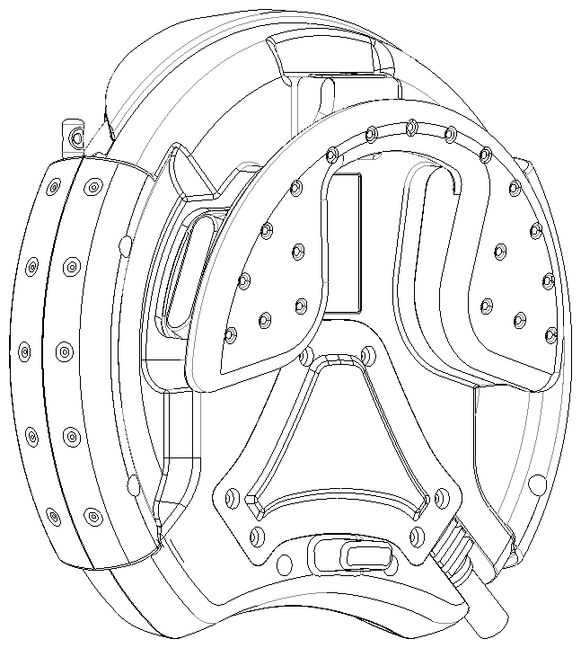

DEADMAN

图 6‑2 DEADMAN位置

## 安全防护外设

安全防护设备包括：

1. 安全围栏（永久固定）
2. 带安全锁的安全门
3. 安全插头，插座等保护装置
4. 其他

**警告：机器人系统外围，必须安装安全围栏并将机器人完全闭合围住，不能有任何空隙可供人员通过，机器人在没有安全围栏的防护下运行，会造成工作人员严重伤害甚至死亡。**

### 安全门和安全锁

当安全门开启时，要使机器人系统无法自动或远程启动，从而保护内部的工作人员。

关闭安全门不可以使机器人系统直接自动启动，应该在人工干预或者人工复位后，才能启动机器人系统。

安全门要配备符合安全标准的安全锁和安全插销。

为了安全，安全锁和安全插销必须选择合适的配置。

当机器人系统在自动运行时，这个门必须被锁住，当开启安全门时，整个系统必须发出报警信号，并停止运行或者紧急停止。

### 其他防护设备

集成商需要设计保护装置，并把他们集成到系统中：

1. 运动部件在操作人员可触及的范围内，无法启动，只有操作者离开运动部件运动范围时，才能被启动。
2. 启动时，只能通过人为的行为来触发，比如钥匙，按钮等。

## 安全围栏内操作

当工作人员必须进入安全围栏内进行作业时，需要注意以下项：

1. 进入安全围栏前，需要停止机器人及外围设备的动作，并通过可提示状态的指示灯或接口确定机器人或其他设备是否处于停止的安全状态。
2. 要将示教模式转换成手动示教，不经现场控制人员允许，不要在外面启动任何设备。
3. 在安全围栏内调试机器人，要给自己留有足够躲避机器人动作的空间，不可以背对着墙来示教机器人，以免自身受到伤害。
4. 在示教过程中移动机器人，请眼睛始终注视机器人的移动。
5. 离开安全围栏，关闭安全门时，请先确认安全围栏内是否还有工作人员。
6. 不要设备上，尤其是可动结构上留下工具。

**警告：**

1. **需要根据具体项目情况， 制定进入安全围栏的一般程序，如果不按照安全程序进入安全围栏，会造成人员严重伤害或者死亡。**
2. **当安全围栏内有工作人员进行维护、维修工作时，要注意设置提示，以免无关人员误入围栏，造成严重伤害或死亡。**

## 进入安全围栏

**注意：只有进行示教或者维护、维修时，才可以进入安全围栏。日常操作不要进入安全围栏。**

**当机器人在自动运行时：**

1. 按下停止按钮，或者外部停止信号，停止机器人，确定机器人及其它设备处于停止并安全的状态。
2. 将工作模式调整到T1。
3. 拔下模式锁定的钥匙。
4. 打开安全门，使安全锁打开，并将安全门上锁，保持打开状态，以防止意外关闭。
5. 进入安全门。

**注意：模式钥匙和门锁钥匙必须在安全围栏内部。**

# 集成过程中的安全

本章介绍一般的安全注意事项。

为了保护调试、维护、维修、机械电气调试等工作人员的人身安全，机器人集成系统必须设计各项安全措施。

**警告：**

1. **进入安全围栏必须遵守集成系统要求的进入安全门的程序，不可以随意进出，如果进入安全门操作不当，会引起严重的人身伤害。**
2. **要避免与当时作业无关的人员进入安全围栏，否则会造成严重的人身伤害。**

## 安装

安装机器人需要符合安全的安装标准，使用前，也需要对安全措施进行确认，确定安全措施是否正常运行。

## 调试

在机器人系统安装后的测试过程中，必须遵守下列程序，这些程序也适用于修改后的机器人或机器人系统。

机器人修改软件硬件或者维修后，可能会对机器人操作产生不利影响，要及时进行测试。

### 限定工作空间及人员

在调试，投入现场使用前，如果没有适当相应的防护措施，则在运行前，必须有限制工作空间的方法，以免有人员进入发生危险。

在调试，测试工作过程中，如果没有适当相应的防护措施，则不可以使人员进入限定空间中。

### 安全措施的检查

在使用机器人系统前，需要检查如下安全措施：

1. 机器人的安装是否牢固，电气连接及电气参数是否正确，外围设备的连接是否正确。
2. 示教器上的钥匙开关是否有效。
3. 确定上电后，驱动器是否有效，各轴是否可以运动（开始时，要降低速度）。
4. 系统中所有的急停按钮和安全门等安全开关回路是否有效。
5. 是否可以实现示教、编程、再现示教动作等基础操作。

### 机器人系统的变更

当机器人系统软、硬件有变化时，重新开始运行机器人前要确定：

重新检查、校核变更的软、硬件。

重新对各项功能进行测试，以保证程序正常运行。

## 编程

最好可以在安全围栏外部进行编程工作，如果必须进入围栏编程，则要遵守以下安全要求：

1. 编程工程师进入安全围栏前，应先确认围栏内部有内有可能会引起危险的情况。
2. 要确定安全门开启后，其安全模式是否时有效执行。
3. 请在手动模式下操作机器人（在手动模式下拔出钥匙），并且尽可能使用T1模式。
4. 在使用示教器时，需要深入了解每次操作之后，机器人或周围设备会进行怎样的动作，然后再进行手动操作。
5. 确保机器人系统在人工进行作业时，不会对任何造成危险的远程信号做出响应。
6. 在完成编程，进行验证无误后，需要到安全围栏外进行自动运行。
7. 自动运行机器人系统前，请确定安全措施处于有效的运行状态。

**警告：与编程工作无关的人员，请勿进入安全围栏，以免造成严重伤害或死亡。**

## 测试程序

完成编程后，需要测试程序是否可以正常运行，验证过程中，务必注意工作区域内是否还有其他工作人员逗留，并遵守以下事项：

1. 第一次运行示教程序，需要使用低速运行，并观察运行过程中，机器人是否有危险动作。
2. 之后运行每一次都缓慢提速，持续观察机器人是否有危险动作。
3. 每一次的提速，都要进行仔细的观察，并且在运行前，制定安全操作作业的工作步骤。
4. 机器人系统中其他的可运行设备，也需要具备相同的安全等级。
5. 工程师本人必须退到安全围栏外面。

## 故障排查

排查故障应该尽可能在安全围栏外，如果要进入围栏内，请遵守以下规则：

1. 维护、维修人员请接受新松公司专门的维护机器人的培训，才可以进行维护、维修新松机器人。
2. 确保安全围栏内的所有设备均处于维护、维修状态，无法自动或被外部启动开启动作，并且建立维护、维修的专门工作步骤，来保证工作人员的安全。

**警告：维修、维护、排查机器人故障时，务必要断开上位的机器人电源，因为控制器的断路器如果有一端带电，或控制器、机器人本体带电，容易造成触电伤害。**

## 启动自动运行

当机器人需要自动运行时，要遵守以下规则：

1. 要保证所有与机器人系统有关的安全措施都实施到位后，才可以启动机器人系统。
2. 务必确保安全围栏内没有任何工作人员，并用按照安全的工作步骤启动机器人系统。

**警告：在自动启动机器人前，请务必确保安全围栏内部没有人员，如果有人员留在安全围栏内部，并启动机器人系统，会导致严重的人身伤害或死亡。**

## 维护

维护机器人可以按照《新松机器人电气使用及维护手册》中的点检项目进行。维护机器人的工程师需要进行相关的培训，并了解维护机器人的风险，尽可能在安全围栏外维护机器人。

进入机器人系统工作区域进行维修：

1. 将整个机器人系统断电，并保护好电源（可以对电源上锁），不要在维修过程中重新开启电源。
2. 如果需要不断开整个系统的电源来进行维护、维修，需要进入前检查整个系统的安全性，如果系统有变更，请先进行测试后，再进入。
3. 进入安全围栏，要遵守进入安全围栏的规章程序。
4. 维护、维修完成后，需要检查各项安全功能是否有效，并将无效的安全功能恢复到有效状态。

**警告：如果维护机器人，务必要断开机器人上位的主断路器，以免造成触电危险。**

## 拆卸机器人

如果需要拆卸机器人，需要联系新松公司进行技术支持。

**警告：拆卸机器人需要联系我们公司售后部门。尤其是带有弹簧缸的机器人拆卸，会不小心导致机器人被弹簧缸的力量带动，造成人员的严重伤害。因此，要由我们公司的售后工作人员进行拆卸。**

## 其他注意事项

有些机器人的轴没有刹车，这样在断电时，没有刹车的轴就会受到重力或外力影响而移动。

在上述操作中，请注意他们的运动，特别是腕关节的运动。

**请阅读各项《新松机器人电气使用及维护手册》的第一章安全部分。**