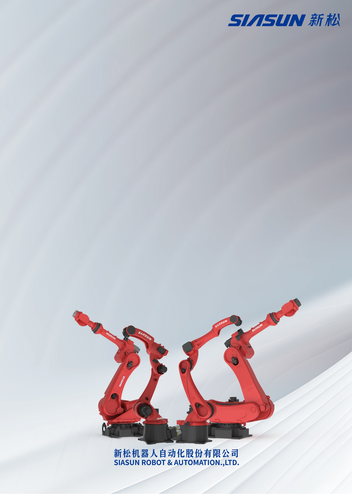
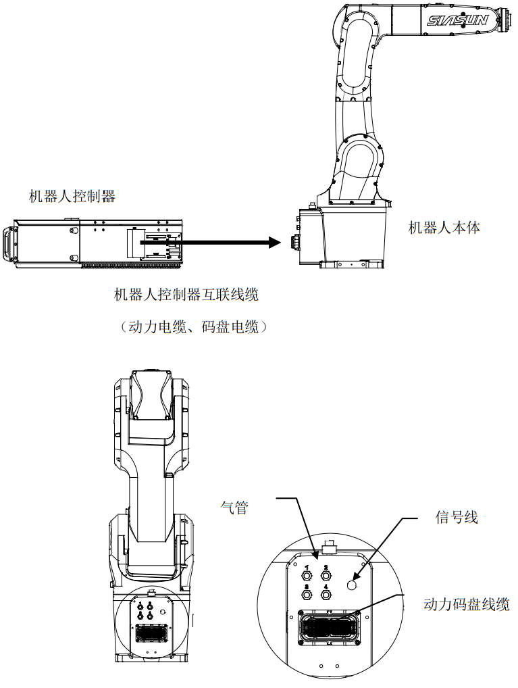
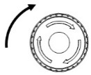
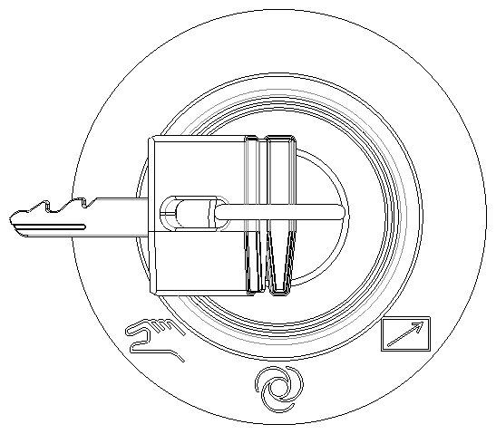
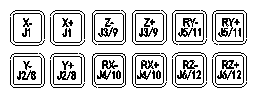
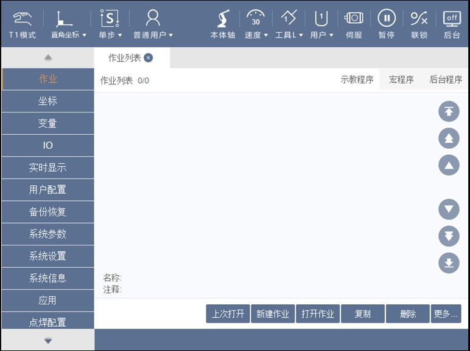
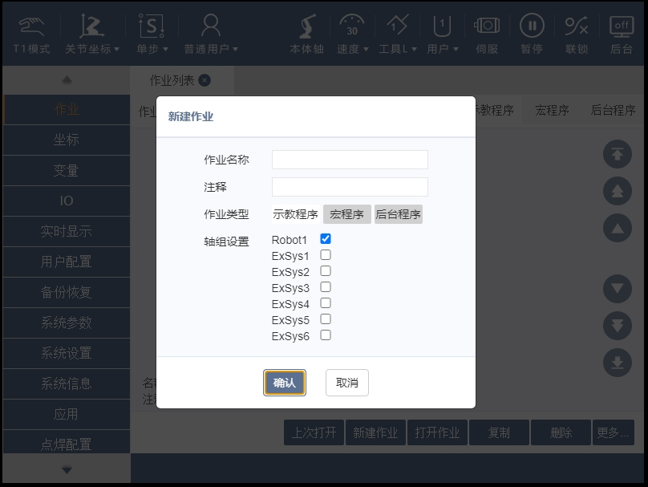
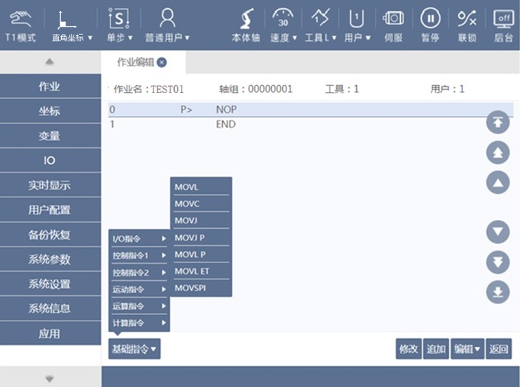
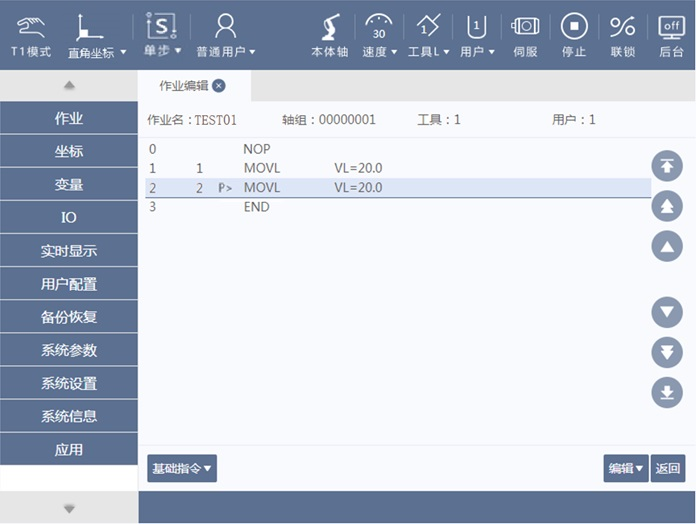

| S:\品牌与公共关系部\1.LOGO\SIASUN+新松透明底.png |
| --- |
| 新松 SN系列工业机器人快速安装手册 |
| 工业机器人 技术资料 |

|  |
| --- |

文件历次修订记录

| **文件版本** | **修订日期** | **修订人** | **主要变化** |
| --- | --- | --- | --- |
| V1\.0 | 2023年12月5日 | 石卓 | 初版编写。 |
| V1\.1 | 2024年4月15日 | 高岩 | 机器人升级版本**SN7B\-7/0\.90** |
|  |  |  |  |
|  |  |  |  |
|  |  |  |  |
|  |  |  |  |

目录

[文件历次修订记录 2](#_Toc150271281)

[**1** **概述** 4](#_Toc150271282)

[**1\.1** 手册说明 4](#_Toc150271283)

[**1\.2** 安全须知 4](#_Toc150271284)

[**2** **安装准备** 4](#_Toc150271285)

[**2\.1** 产品开箱 4](#_Toc150271286)

[**2\.2** 机器人系统基本构成 6](#_Toc150271287)

[**3** **设备安装** 8](#_Toc150271288)

[**3\.1** 设备搬运与安装 8](#_Toc150271289)

[**3\.2** 电气连接 9](#_Toc150271291)

[**3\.2\.1** 使用互联线缆连接机器人本体与控制柜。 9](#_Toc150271292)

[**3\.2\.2** 将示教器线缆连接至控制柜门上的专用接口。 10](#_Toc150271294)

[**3\.2\.3** 连接输入电源线缆。 10](#_Toc150271296)

[**4** **设备基本操作** 10](#_Toc150271297)

[**4\.1** 接通、切断主电源 10](#_Toc150271298)

[**4\.2** 急停按钮 11](#_Toc150271301)

[**4\.3** 示教模式简单操作 11](#_Toc150271306)

1. 概述
	1. 手册说明

本手册为新松机器人的快速入门指导，仅包含标准机器人安装和使用的基础知识，旨在迅速提升客户对机器人系统的了解，**更多安装维护、系统操作、报警信息相关内容请查阅专项说明书或咨询我司销售人员。**

* 1. 安全须知

**在进行操作前，请务必仔细阅读和理解《新松机器人安全手册》的全部内容，并严格遵循所有的安全规定。**

1. 安装准备
	1. 产品开箱

开箱前请确认产品外包装是否完好。

开箱后请对照发货清单确认机器人配件是否齐全，型号是否与订单一致。发货清单通常包含以下项目：

1. 机器人本体
2. 控制柜
3. 示教器及其线缆
4. 机器人互联线缆，包含动力线及码盘线
5. 其它选配货物

**若发现包装破损或配件漏发、错发，请及时与供应商联系。**

**为降低设备运输途中的颠簸产生的冲击，部分机型装有防坠落工装，该工装需在设备运行前拆除。**

* 1. 机器人系统基本构成
1. **机器人本体（以SN7B\-7/0\.90为例）**

|  |
| --- |

**2）控制柜（以SRC C5柜为例）**

| 示教器接口急停按钮接口面板（密封）示教器热插拔按钮（选配）电源开关 |
| --- |

**3）示教器**

| 上电按钮\\LED指示灯模式选择开关图形用户界面, 文本  描述已自动生成急停按钮各项功能切换按钮外部轴T1\\T2模式启动按钮速度倍率暂停按钮正\\反向运动轴运动键报警复位按钮示教器线缆DEADMAN |
| --- |

**4）互联线缆（以SN7B\-7/0\.90为例）**

| 互联线（动力线、编码器线）控制柜侧本体侧**注：部分机型仅有一根动力线。** |
| --- |

1. 设备安装
	1. 设备搬运与安装

机器人本体及控制柜的搬运可采用起重机或叉车，具体方法详见《新松××系列工业机器人安装及维护手册》、《新松机器人电气使用及维护手册》中“搬运与安装”章节。

| **警告****在使用吊车或者叉车搬运机器人本体及控制柜时，要小心轻放，避免强烈碰撞。****在机器人安装较大负载时，机器人重心会发生变化，需要拆除负载后搬运。****机器自带的叉车脚只能用于使用叉车搬运机器人，不能用于固定安装机器人。****使用吊环或叉车脚前，需要注意检查这些构件是否固定牢固，如果没有固定牢固，请拧紧固定螺丝。** |
| --- |

* 1. 电气连接
		1. 使用互联线缆连接机器人本体与控制柜。

**每个重载连接器附近均贴有编码标识，且连接器有防错插设计，连接时请注意对应关系和方向。**

|  |
| --- |

* + 1. 将示教器线缆连接至控制柜门上的专用接口

**注意将连接器两端配合标记对齐后再连接。**

|  |
| --- |

* + 1. 控制器安全回路连接

控制器安全回路位于控制柜后接口板的EXT1端子排（下图以C5控制柜为例）。如需连接外部急停或安全门，请详细阅读《新松机器人电气使用及维护手册》安全回路连接章节，并按照指导操作。如无需连接安全门，请使用短接线将对应安全端口短接（不推荐）。

| 安全回路接口 |
| --- |

* + 1. 连接输入电源线缆

机器人上位控制装置如果采用漏电断路器对机器人进行供电控制，选配漏电断路器需要满足漏电断路器的灵敏度电流≥300mA，否则有可能造成漏电断路器的误动作。推荐断路器详见《新松机器人电气使用及维护手册》。

C5系统出厂提供标配电源电缆，只需要将控制线缆的插头插入控制器的插座即可。

| 在此处插入电源插头即可连接输入电源 |
| --- |

1. 设备基本操作
	1. 接通、切断主电源

将控制柜前门上的主电源开关旋转到**\[ON]**的位置，此时主电源接通。设备进行初始化诊断，示教器屏幕上显示启动画面。

将控制柜前门上的主电源开关旋转到**\[OFF]**的位置，此时主电源被切断。

* 1. 急停按钮

| 急停按钮急停按钮 |
| --- |

机器人示教器和控制柜上均装有急停按钮。当按下急停按钮时，无论机器人当前状态如何，都会触发急停状态。急停状态下机器人伺服下电无法移动，示教器屏幕上显示急停启动。

**急停恢复方法：**

1. 排除导致急停按钮按下的原因。
2. 向右旋转急停按钮，至急停按钮弹起。
3. 按示教器的报警复位按钮，示教器屏幕上的报警显示消失。
	1. 手动模式简单操作
	2. 复位控制柜和示教器的急停按钮，关闭安全围栏，按报警复位按钮复位相关报警。
	3. 将示教器的模式选择开关旋至手动模式。
	4. 通过按钮，将运动模式调节为。
	5. 通过按钮或者点击屏幕坐标图标，选择手动机器人的坐标系至。
	6. 通过按钮，将轴组类型设定为。
	7. 通过按钮或点击屏幕速度图标，将速度调节至或以下。
	8. 按下示教盒顶部上电按钮，示教盒伺服上电图标由变为，表示伺服上电完毕。
	9. 将示教盒背面的**\[DEADMAN]**按钮按至中间位置，示教盒伺服上电图标由变为 ，表示伺服使能完毕。
	10. 按住**\[DEADMAN]**按钮的同时按住各轴运动键按钮，可控制机器人单轴运动。
	11. 通过按钮或者点击屏幕坐标图标，选择手动机器人的坐标系至。
	12. 按住**\[DEADMAN]**按钮的同时按住各轴运动键按钮，可控制机器人末端按下图直角坐标系运动。

|  |
| --- |

* 1. 新建简单作业

按照以下步骤，可新建一个两点间匀速直线运动的简单作业。

1. 在手动模式下，点击屏幕左侧的作业菜单，进入作业列表。

1. 在新建作业界面，输入作业名称TEST01，选择作业类型为示教程序，轴组设置勾选Robot1，按确认按钮。**注意：输入作业名称时，要在键入TEST01后先按\[前往]再按\[确定]，才能输入成功。**

TEST01

1. 在屏幕中依次选择基础指令——运动指令——MOVL，在弹出的指令框中输入“VL\=20”，并按确认，记录机器人第一个位置点。

1. 手动示教机器人移动一小段距离，然后再次重复上一步骤，记录机器人第二个位置点。

* 1. 单步执行作业

TEST01作业编辑好后，可在手动模式下单步执行该作业测试点位及轨迹。

1. 在手动T1模式下，通过按钮，将执行模式设置为。
2. 通过按钮或点击屏幕速度图标，将速度调节至或以下。
3. 按下示教盒顶部上电按钮，示教盒伺服上电图标由变为，表示伺服上电完毕。
4. 将示教盒背面的**\[DEADMAN]**按钮按至中间位置，示教盒伺服上电图标由变为 ，表示伺服使能完毕。
5. 按住**\[DEADMAN]**按钮的同时按动或按钮，机器人会自上而下或自下而上逐条执行程序。每执行完一条程序机器人暂停，光标停在该指令上。执行过程中松开任意键机器人停止。