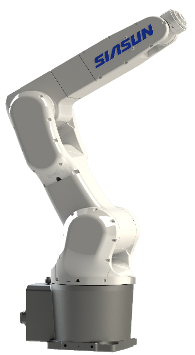
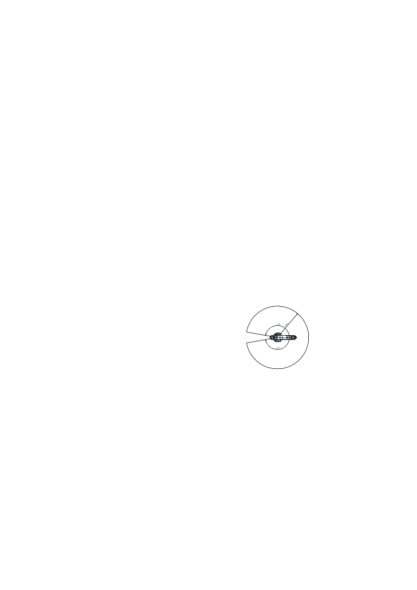
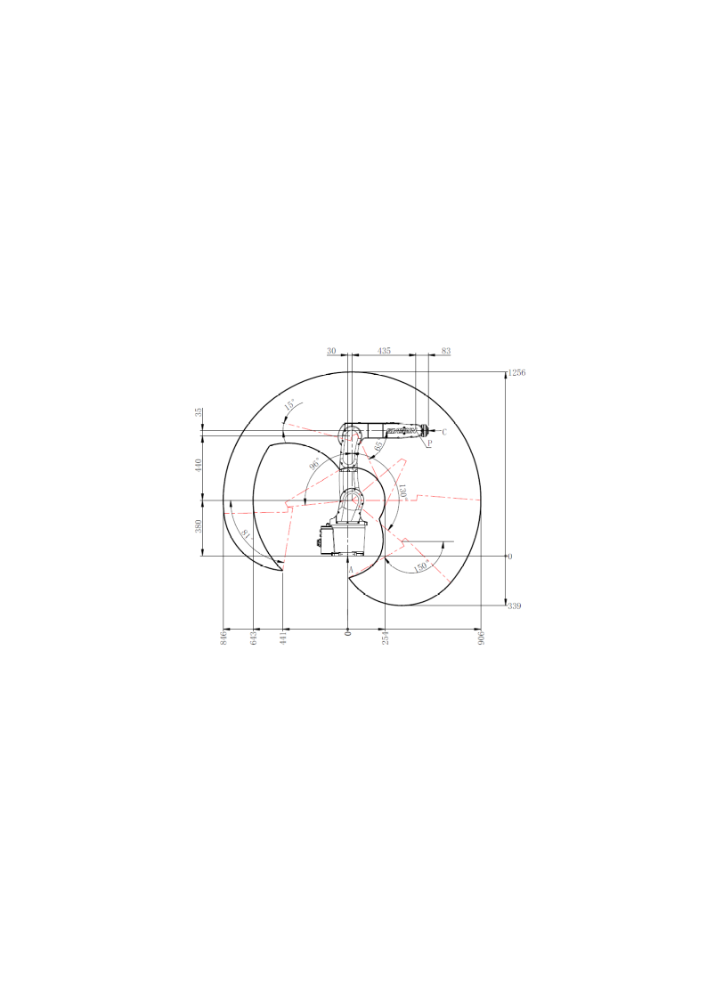
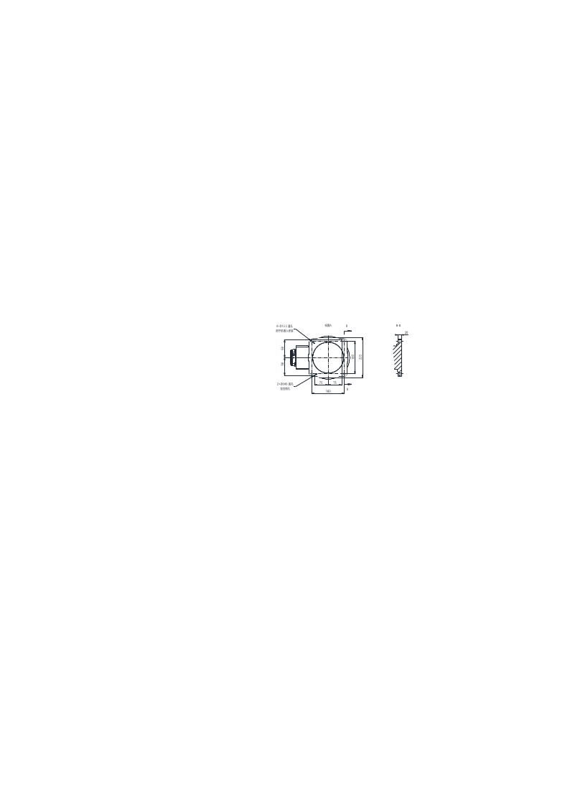
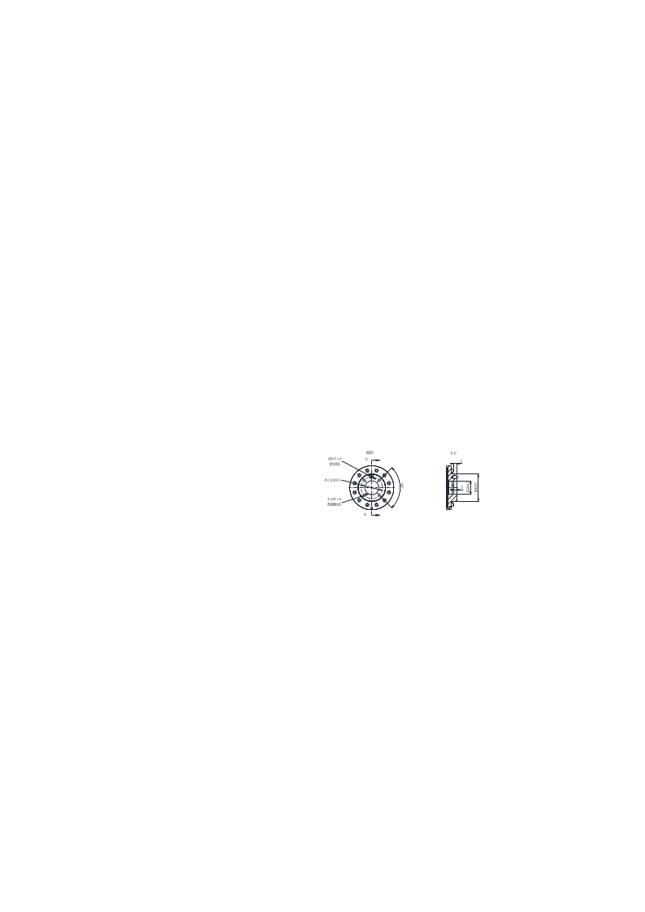
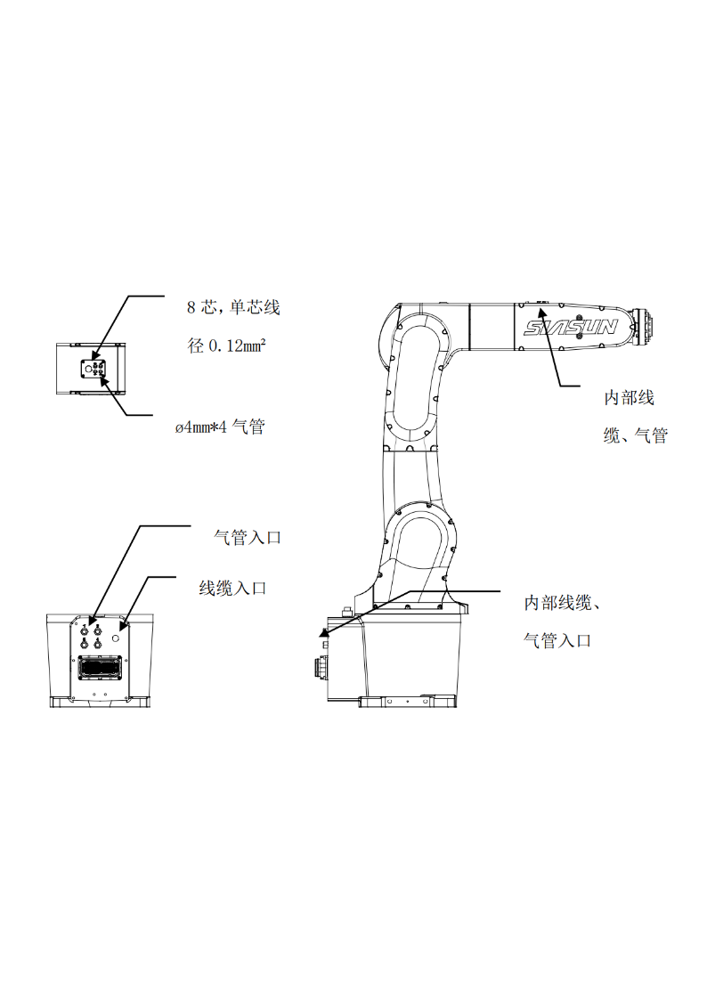
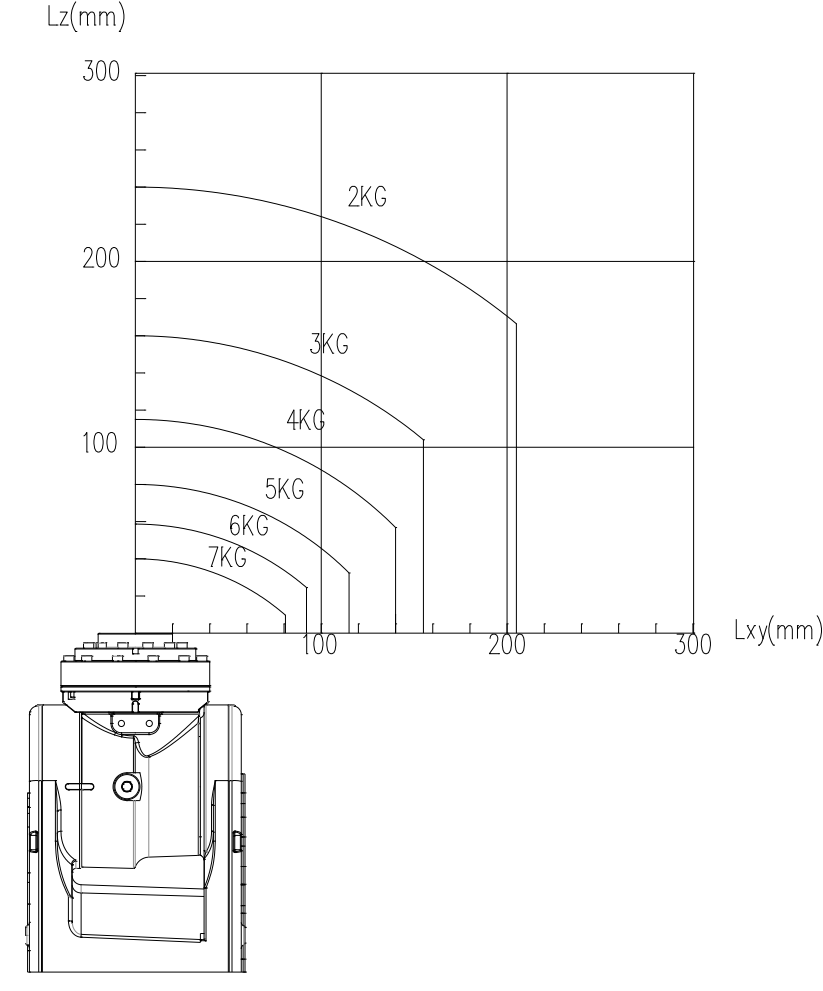
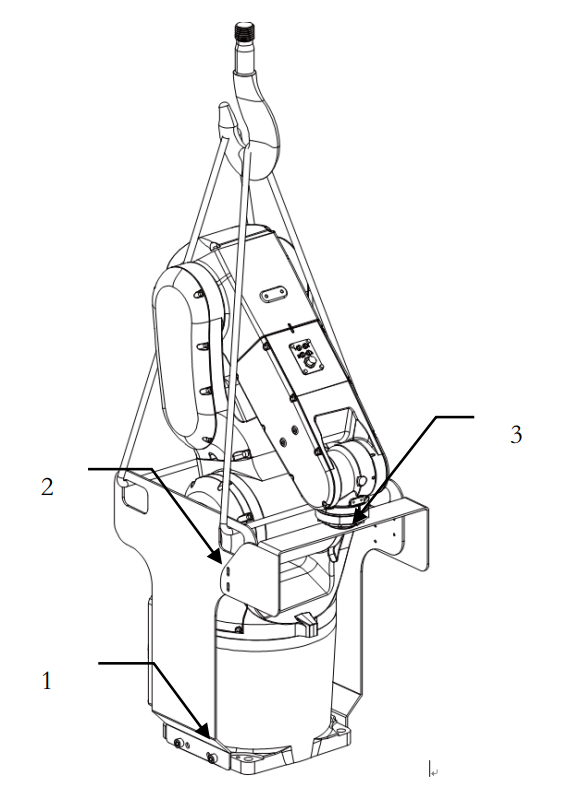

<!-- Slide number: 1 -->

SN7B-7/0.90
规格参数介绍

### Notes:

<!-- Slide number: 2 -->

| 型号                    |      |                                               | SN7B\-7/0\.90   |      |           |
| ----------------------- | ---- | --------------------------------------------- | --------------- | ---- | --------- |
| 机器人类型              |      |                                               | 多关节型机器人  |      |           |
| 控制轴数                |      |                                               | 6轴             |      |           |
| 安装形式                |      |                                               | 地面、倒装      |      |           |
| 动作范围                | J1轴 | ±170°                                       | 最大动作速度    | J1轴 | 267°/s   |
|                         | J2轴 | ＋96°，－130°                               |                 | J2轴 | 223°/s   |
|                         | J3轴 | 联合：＋291°，－150°  单轴：\+165°，\-65° |                 | J3轴 | 315°/s   |
|                         | J4轴 | ±170°                                       |                 | J4轴 | 400°/s   |
|                         | J5轴 | ±120°                                       |                 |      |           |
|                         |      |                                               |                 | J5轴 | 400°/s   |
|                         | J6轴 | ±360°                                       |                 |      |           |
|                         |      |                                               |                 | J6轴 | 600°/s   |
| 可搬运重量（手腕部）    |      |                                               | 7kg             |      |           |
| 手腕部允许 负载转动惯量 | J4轴 | 0\.75kg·m²                                  | 手腕部允许 转矩 | J4轴 | 24N·m    |
|                         | J5轴 | 0\.26kg·m²                                  |                 | J5轴 | 15\.2N·m |
|                         | J6轴 | 0\.067kg·m²                                 |                 | J6轴 | 9\.7N·m  |
| 重复定位精度            |      |                                               | ±0\.02mm       |      |           |
| 最大臂展                |      |                                               | 906mm           |      |           |
| 机器人质量              |      |                                               | 52kg            |      |           |
| 防护等级                |      |                                               | IP67（手腕）    |      |           |

### Notes:

<!-- Slide number: 3 -->

SN7B-7/0.90 控制柜

| 机型                    | SN7B\-7/0\.90                                                                       |                                                                                     |
| ----------------------- | ----------------------------------------------------------------------------------- | ----------------------------------------------------------------------------------- |
| 控制器型号              | SRC C5                                                                              | SRC C6                                                                              |
| 示教盒                  | STBT5A                                                                              | STB2A\-H                                                                            |
| 输入功率                | 350W                                                                                | 600W                                                                                |
| 电柜体积 （宽×深×高） | 505mm×385mm×216mm                                                                 | 430mm×400mm×255mm                                                                 |
| 输入电源                | 单相 AC220V 50/60Hz                                                                 |                                                                                     |
| 总线通信                | 支持RS232,DeviceNet主站、PROFINET从站或Modbus\-TCP（主/从站）、TCP/IP（离线接口库） | 支持RS485,DeviceNet主站、PROFINET从站或Modbus\-TCP（主/从站）、TCP/IP（离线接口库） |
| 电柜I/O接口             | 标准NPN型16DI/16DO，可选配PNP型，最高可扩展至64DI/64DO                              | 标准NPN型16DI/16DO，可选配PNP型                                                     |
| 工作环境温度            | 0°\~45°（工作环境温度超过 45°需加冷却设备）                                      |                                                                                     |
| 电柜防护等级            | IP32                                                                                | IP20                                                                                |

<!-- Slide number: 6 -->

底座安装接口

| 名称和型号                            | 数量 |
| ------------------------------------- | ---- |
| 固定螺钉：M12ⅹ40(GB/T70\.1 12\.9级） | 4    |
| 弹簧垫片：弹簧垫圈12（GB/T93\)        | 4    |
| 定位销：圆柱销6ⅹ40（GB/T120\.2\)     | 2    |

<!-- Slide number: 7 -->

末端法兰接口

<!-- Slide number: 8 -->

其它接口

<!-- Slide number: 9 -->

负载曲线

<!-- Slide number: 10 -->

起重机搬运

机器人本体重量是52kg
使用承受力100kg以上的吊绳。

| 各轴关节值 | 1轴 | 2轴  | 3轴    | 4轴 | 5轴    | 6轴 |
| ---------- | --- | ---- | ------ | --- | ------ | --- |
| 关节值     | 0° | 15° | \-60° | 0° | \-45° | 0° |

<!-- Slide number: 11 -->

历史修订记录

| 文件版本 | 修订日期      | 主要变化                                               |
| -------- | ------------- | ------------------------------------------------------ |
| A/1      | 202５年3月6日 | 总线通讯增加TCP/IP（离线接口库）方式，互联线缆名称变更 |

<!-- Slide number: 12 -->

### Notes:
