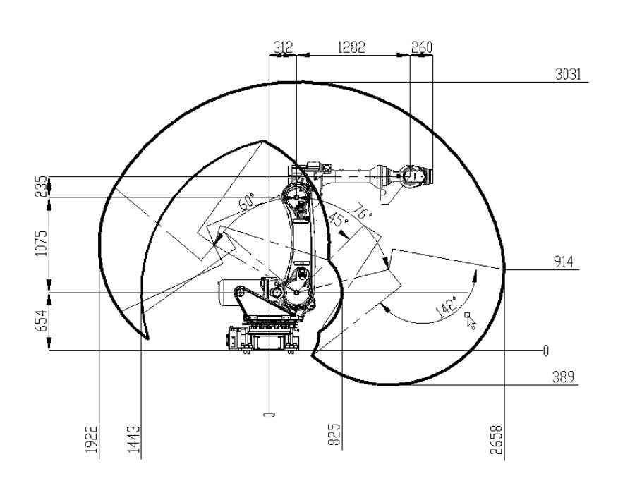

# **SR210A-210/2.65**

# **Technical Specifications**

| Robot Type                   |                                  | Articulated Robot                                                                                            |                            |                                  |                                                        |
|---------------------------------|----------------------------------|-----------------------------------------------------------------------------------------------------------------|----------------------------|----------------------------------|--------------------------------------------------------|
| Control Axes                 |                                  | 6                                                                                                               |                            |                                  |                                                        |
| Mounting Configuration       |                                  | Floor                                                                                                           |                            |                                  |                                                        |
| Range of Motion           | J1 J2 J3 J4 J5 J6 | ±180° -76°~ +60° -78°~ +165° ±355°(spot welding±180°) ±125° ±360°(spot welding±180°) | Maximum Moving Speed | J1 J2 J3 J4 J5 J6 | 100°/s 90°/s 85°/s 120°/s 120°/s 190°/s |
| Payload(wrist)                  |                                  | 210kg                                                                                                           |                            |                                  |                                                        |
| Allowable Inertia (GD²/4) | J4 J5 J6                   | 120kg·m² 120kg·m² 70kg·m²                                                                                 | Allowable Moment        | J4 J5 J6                   | 1274N·m 1274N·m 686N·m                           |
| Repeatability                   |                                  | ±0.06mm                                                                                                         |                            |                                  |                                                        |
| Maximum working radius    |                                  | 2658mm                                                                                                          |                            |                                  |                                                        |
| Body Weight                  |                                  | 1400kg                                                                                                          |                            |                                  |                                                        |
| Protection level (wrist)  |                                  | IP67                                                                                                            |                            |                                  |                                                        |

# **Robot Controller**

| Controller Model              | SRC M6                                                                                                                                                                                                        |  |
|----------------------------------|------------------------------------------------------------------------------------------------------------------------------------------------------------------------------------------------------------------|--|
| Control System                | ARM-based Economic Control System                                                                                                                                                                       |  |
| Teach Pendant                 | STB2A-H                                                                                                                                                                                                          |  |
| Input Power                   | 8kW                                                                                                                                                                                                              |  |
| Cabinet Dimensions (W×D×H) | 710mm×550mm×776.5mm                                                                                                                                                                                              |  |
| Power Supply                  | three-phase four-wire AC380V 50/60Hz                                                                                                                                                                    |  |
| Bus Communication             | RS485, DeviceNet Master/Slave, PROFINET Slave, Modbus-TCP (Master/Slave), SlaveTCP/IP(Offline EtherCAT Slave, CC-Link Slave, EtherNet/IP API Library Applicability) |  |
| I/O Interface                 | Standard NPN type 16DI/16DO (PNP type optional,expandable up to 64DI/64DO)                                                                                                            |  |
| Operating Temperature         | 0°~45°(Cooling required if ambient temperature exceeds 45°C)                                                                                                                                   |  |
| Protection Rating             | IP54                                                                                                                                                                                                             |  |

SR02400401-A/1

### **ROBOTS MAKE A BETTER WORLD**

### **Robot Interconnection Cable**

### **Power Cable , Encoder Cable**

| Standard | 7m  | Drag Chain Cable |  |
|----------|-----|------------------------|--|
|          | 14m | Drag Chain Cable |  |
|          | 20m | Drag Chain Cable |  |
| Optional | 25m | Drag Chain Cable |  |
|          | 30m | Drag Chain Cable |  |

SR02400401-A/1

# **Motion range of robot**

### **Base Mounting Interface**

SR02400401-A/1

8

8

2

### **ROBOTS MAKE A BETTER WORLD**

SR02400401-A/1

### **End Effector Flange**

| Fixation Screw Hex Socket Head Cap Screw     | GB/T 70.1 M10 Grade 12.9 | 6 |  |
|----------------------------------------------------------------|--------------------------------------|---|--|
| Lock Washer Spring Lock Washer                     | GB/T 93 Φ10                    | 6 |  |
| Positioning Pin Internal Thread Cylindrical Pin | GB/T 120.2 Φ10                 | 1 |  |

# **Other Interfaces**

### **Load Curve**

SR02400401-A/1

### **Handle with crane**

SR02400401-A/1

### **ROBOTS MAKE A BETTER WORLD**

**WeChat Service Account WeChat Subscription WeChat Video Account tiktok**

**Account**

