|  |
| --- |

|  |
| --- |
| **新松机器人通用操作手册** |
| **工业机器人 技术资料** |

****

**感谢您使用新松机器人产品**

**在使用机器人之前，务必仔细阅读机器人安全使用须知，并在理解该内容的基础上使用机器人。**

**本公司致力于不断提升产品品质，本手册中与产品有关的规格和信息如有改动，恕不另行通知。**

**本手册中所有陈述、信息和建议均已经过慎重处理，但不保证完全正确。本公司对于因使用本手册而造成的直接或间接损失不负任何责任。**

**用户必须对其应用任何产品负全部责任，需谨慎使用本手册及产品。**

**本手册所有内容的解释权属沈阳新松机器人自动化有限公司。**

****

| * **本手册未对任何一方授权许可，不得以任何方式复制和拷贝其中的全部或部分内容。** * **本机的外观及规格如需改良而变更，恕不另行通知。** |
| --- |

**版权所有：沈阳新松机器人自动化有限公司**

**产品服务热线：400 800 8666**

**地址：辽宁省沈阳市全运路33号**

**新松微信服务号：siasunrobot**

**电子邮箱：market@siasun.com**

# 安全须知

在使用机器人之前，务必熟读并理解本章节所载的内容。

使用新松工业机器人之前，必须充分考虑作业人员和系统的安全措施。并请用户通过说明书充分理解其规格。

使用前（安装、转运、保养、检修），请务必熟读并全部掌握本说明书和其他附属资料，在熟知全部设备知识、安全知识及注意事项后再开始使用。但是使用人员即使完全按照手册中给出的所有安全信息进行，新松公司也无法保证使用人员不会收到任何伤害。

1. 使用者的定义

使用人员定义如下所示。

**—操作者**

 进行机器人的电源ON/OFF操作。

 从操作面板启动机器人程序。

**—程序员/示教作业者**

 通过示教器，进行机器人的操作。

 在安全区域内进行机器人的示教等。

**—维修人员**

 通过示教器，进行机器人的操作。

 在安全区域进行机器人的示教等。

 进行机器人的维护（修理、调整、更换）作业。

操作人员不能安全区域内进行作业。

程序员和维修人员可以在安全区域内进行作业。

安全区域内的作业包括：搬运、设置、示教、调整、维修等。

| **要在安全区域内进行作业，必须接受过机器人的专业培训。** |
| --- |

在进行机器人的操作、编辑、维护时，操作者、程序人员、维修人员必须注意安全，至少应穿戴以下物品进行作业。

— 适合于作业内容的工作服

—安全鞋

—安全帽

—防护眼镜

1. 安全标识

本手册会在需要提示安全事项的地方做出明显的提示说明，以此来提醒设计或作业人员保证自身、同事及设备安全，我们在文中使用“危险”“警告”、“注意”、“注释”来描述这些安全注意事项，用户在使用机器人前，必须熟读理解这些安全注意事项所描述的内容，并必须严格遵守。

| 标识 | 定义 |
| --- | --- |
| 危险警告 | 如果错误操作，有可能导致作业人员死亡或严重人身伤害的紧急危险情况。 |
| 注意 | 如果错误操作，有可能导致作业人员死亡或者严重人身伤害的危险情况。 |
|  | 如果错误操作，有可能导致设备损坏或人员受伤。 |
| **注释** | 除了警告和注意之外的补充内容。 |

1. 使用人员的安全事项
2. 务必在机器人安装前划分出安全区域。机器人系统的周围务必要设置安全围栏和安全警示牌，并且安装安全门，工作人员则必须通过打开安全门，才能进入围栏内，安全围栏要完全封闭机器人，使工作人员不能通过除安全门外的其他地方进入安全围栏内部，防止闲杂人等进入以及防止机器人伤人。调试、操作机器人请在安全围栏外进行。
3. 外围设备均需要接上符合相关标准的地线。
4. 将外围设备尽可能地设计在机器人的运动范围外。
5. 应根据现场实际情况，在电源处安装安全锁具，使机器人只可以通过特定人员接通电源。
6. 可燃性、爆炸性、辐射性环境下，请不要使用机器人。
7. 不可以在机器人上攀爬。
8. 在机器人系统运行的过程中，即使机器人处于或者看起来是停止运动的状态时，也有可能是机器人在等待启动运动的信号或者其他信号，使机器人或者周边设备处于一个即将运动的状态。在这种机器人随时可以启动的状态下，需要将机器人系统视为正在运动中。为了确保工作人员的安全，可以安装指示灯或响声，来让工作人员了解机器人系统正在处于运行状态中。
9. 如果需要单独调试机器人周围的设备时，请务必断开机器人的电源后，在执行操作。
10. 连接安全信号、停止运行等与机器人外部设备通讯的信号后，请务必确认这些信号是否可以有效控制机器人的停止（外部急停、安全门等信号），错误连接可能会造成严重的人身伤害。
11. 请不要带手套操作示教器。
12. 请定期备份机器人系统的各项参数、变量、作业等信息，预防意外的数据丢失情况。
13. 在机器人安装完成后的首次运行时，请务必以低速运动机器人，逐渐加快运动速度，并确认机器人是否有异常状态。
14. 在操作机器人运动前，请务必确认安全护栏内部是否还有操作人员。检测机器人系统是否还存在潜在的危险，请在排除全部的危险后，在操作机器人。
15. 搬运、安装机器人时，请务必按照新松所示的方法正确进行，避免由于错误的搬运、安装方法造成机器人、控制器翻倒、掉落，导致的工作人员重伤或者设备损坏。
16. 机器人上方不能有悬挂物，以防掉落砸坏机器人等设备。
17. 严禁倚靠电控柜，或者随意触动按钮，以防机器人产生未预料的动作，引起人身伤害或者设备损坏。
18. 拆分机器人时，注意机器人上可能掉落的零件砸伤人员。
19. 严禁搬动机器人各轴，否则可能造成人身伤害和设备损坏。
20. 在进行电控柜与机器人、外围设备间的配线及配管时须采取防护措施，如将管、线或电缆从坑内穿过或加保护盖予以遮盖，以免被人踩坏或被叉车辗压而坏。
21. 通过软件设定的动作范围及负载条件切勿超出产品规格表中的规定值，设置不当可能造成人员伤害或机器损坏。

| 危险**在任何情况下，都不要站在机器人臂下方，以防机器人异常运动或者其他人连接使能而造成事故。** |
| --- |

* 安全围栏外操作的安全

日常启动、停止机器人集成设备时，可以在安全围栏的外面开关机器人系统的电源，并通过示教器或者机器人系统的人机接口来执行启动、停止机器人系统等操作。

1. 不需要操作机器人时，应该关断机器人的电源，或者按下急停按钮。
2. 机器人系统在设计时，要设置外部急停按钮，通过该按钮，可以紧急停止机器人的运动。请在操作人员伸手可以触碰的范围内，设置急停按钮。
3. 启动机器人系统前应观察安全围栏内是否有意外进入的工作人员，而且请务必设置安全围栏和带有安全锁的安全门。

表(a)表示安全围栏外的作业。各个机器人作业者可以执行在此表中的有\[〇]标示的作业项目。

表(a)安全围栏外的作业

| 作业内容 | 操作者 | 程序员/示教作业者 | 维修/维护人员 |
| --- | --- | --- | --- |
| 控制装置电源的ON/OFF | 〇 | 〇 | 〇 |
| 运行模式的选择（T1，T2） |  | 〇 | 〇 |
| 遥控/本地模式的选择 |  | 〇 | 〇 |
| 以示教器选择程序 |  | 〇 | 〇 |
| 以外部设备选择程序 |  | 〇 | 〇 |
| 以操作盘开始程序 | 〇 | 〇 | 〇 |
| 以示教器开始程序 |  | 〇 | 〇 |
| 以操作盘复位报警 |  | 〇 | 〇 |
| 以示教器复位报警 |  | 〇 | 〇 |
| 以示教器的数据设定 |  | 〇 | 〇 |
| 以示教器的示教 |  | 〇 | 〇 |
| 以操作盘的紧急停止 | 〇 | 〇 | 〇 |
| 以示教器的紧急停止 | 〇 | 〇 | 〇 |
| 操作盘的维修 |  |  | 〇 |
| 示教器的维修 |  |  | 〇 |

* 编程示教时的安全

对机器人进行示教、编程的程序人员，不允许进入机器人的工作范围内进行工作，所以要非常注意自身的人身安全。

1. 示教机器人时，请确认机器人及周围的集成设备不存在危险或者异常状态。
2. 如果需要进入机器人的运动范围内，请务必事先确定急停按钮、机器人及集成设备的安全开关的状态和位置。
3. 现场示教的工作人员有义务确保机器人的运动范围内，没有其他工作人员。
4. 新松机器人在示教器上，提供急停按钮及用来选择执行模式、示教模式和远程的钥匙切换开关。在自动运行情况下，开启安全门，机器人会停止运行。
5. 我司示教器上除了急停开关，还配有三档使能开关:DEADMAN.
6. 急停按钮：只要按下急停按钮，机器人就会紧急停止。
7. DEADMAN:设有三个档的开关，开关处于中间时，机器人可以进行手动运动，松开或者握紧开关，机器人紧急停止。
8. 示教人员必须在DEADMAN在中间位置时，才可以使机器人运动，运动前应排除危险状态。
9. TI\\T2示教模式状态下，DEADMAN有效。
10. 使用示教器或者人机接口启动机器人时，应充分确保机器人运动范围内没有人员且无异常，再执行。
11. 在示教、调试、编程结束后，请按照低速单步、低速连续运行至少一次、中速连续运行一次、正常速度连续运行循环一次后，如果没有错误的地方，就可以自动运行了。
12. 进行自动运行时，工作人员需要全部到安全护栏外进行工作。
* 维修、保养时的安全

为了确保维修人员的安全，应充分注意下列事项。

1. 切勿在机器人运转过程中进入机器人的运动范围。
2. 维修、保养机器人时，尽可能关断机器人电源，并使用安全锁。如果需要开启电源维修、维护机器人，请务必按下急停按钮，并做好警示标识。
3. 在进入机器人安全围栏内工作时，要仔细了解机器人集成系统是否存在危险，确定系统的状态，小心谨慎的工作。
4. 要维护气动系统或元件时，应先将气压降为0，再进行作业。
5. 当机器人运动范围有人时，千万不要自动运行机器人。
6. 在狭小的地方多人维护时，要确保不要堵住其他的人的逃生通道。
7. 维修作业时，需要有另一个人在急停按钮附近，随时按下急停按钮，保证工作人员的安全。
8. 更换机器人部件时，请向新松公司售后部门咨询。千万不可以自行判断更换，这样会导致意外的事故，造成严重的后果。
9. 更换机器人部件时，不可以使异物进入机器人。
10. 检查维护机器人的控制柜内部时，应先断电15分钟以上，以确保驱动器不在高压充电状态，通电灯熄灭再进行。
11. 更换部件时，请一定使用新松公司提供的标准部件，不可以自行选择其他厂家的部件，这样做会导致机器人的损坏，而且很有可能引发火灾。
12. 当维护机器人完成后，需要启动机器人前，要确定安全围栏内部没有工作人员，同时确定机器人系统整体没有异常。
13. 在更换电机或抱闸时，要使用吊车等方式来固定机器人，以免机器人不会由于失去抱闸而下落，之后再进行作业。
14. 工作完毕后，要擦除留到地面上的油脂、润滑剂等，以免有人滑倒或者引发火灾。
15. 机器人的伺服电机、控制柜的内部、减速机、抱闸电阻等原件会发热，请勿在发热状态下触摸，如果需要触摸，请带好耐热手套等安全保护工具。
16. 在维护、维修设备时，请不要站在机器人上，以免发生危险。在登高作业时，确保手脚台安全，并戴好安全带。
17. 在更换维修时拆下来的部件，应该全部装回原位，如果发现不够或者有部分剩余，应重新检查是否安装正确。
18. 部件更换完毕后，请务必进行测试运行，并且工作人员在安全围栏外面。
19. 集成设备及工具的安全
20. 集成设备需要配置传感器、限位开关等装置，通过信号来识别外部设备的不同状态，确保危险时，机器人停止运动。当集成设备或者工具发生故障时，机器人也需要同时停止运动。
21. 当机器人与外部集成设备同时运行时，需要设置干涉区，以保证机器人与集成设备的运行安全。
22. 机器人的集成设备需要在不会受到油、水、粉尘等影响的环境下工作。
23. 机器人机械部分内部的线缆，需要遵守以下的事项，以免造成意想不到的危险。
24. 机械内部的线缆应使用装配好的接口。
25. 机械外部安装线缆时，应注意对机器人运动时的影响。
26. 机械露在外部有线缆时，请勿对露在外部线缆进行改造。
27. 将外部设备安装在机器人上时，应避免与机器人进行干涉。
28. 请不要在正常停止机器人时，使用急停按钮，这样做会使机器人受到损害。一般情况下，请先停止机器人运动，在使用急停按钮对机器人进行断电。
29. 机器人本体安全
* 操作时的注意事项
1. 当工作人员操作机器人时，应使机器人的运动速度调整到足够的慢，这样可以在发生危险时，工作人员有足够的时间做出反应，避免意外的发生。
2. 当操作机器人时，需要深入了解每次操作所带来的结果，每次按键后，机器人会做出怎样的动作后，再操作机器人。
* 编程有关注意事项
1. 多台机器人运动范围重叠时，请务必对机器人干涉的运动范围做好干涉区，保证机器人的运动过程中，不会互相碰撞发生损坏。
2. 示教程序机器人要设置原点，并使机器人的起点与终点都停在程序的原点上，使工作人员可以直接观察到程序的结束。
* 有关机械的注意事项

机器人的运动范围内要保持整洁，使用环境应该不会受到油、水、尘埃等影响。

* 末端执行器的安全

末端执行器应配备限位开关和传感器，通过信号使控制系统了解末端执行器所处的位置和状态，同时进行控制，防止危险的发生。

* 机器人的停止方法
1. 停止类别0（STOP0）

立即切断机器人伺服电源，同时各轴制动器制动，使机器人在一瞬间停止。由于断开伺服电源后， 各轴动作的轨迹得不到控制，机器人会偏离预先定义的运行轨迹，是一种不受控的停止方式。

1. 停止类别1（STOP1）

机器人基本会按照预定的轨迹执行减速，同时控制器和安全系统按照预见设定的时间切断伺服电源，是一种受控的停止方式。

1. 停止类别2（STOP2）

机器人基本会按照预定的轨迹执行减速，停止后不切断伺服电源，各轴电机仍处于通电状态。

1. 危险、警告、注意标签
2. 电击警示标识

图(a) 电击警示标识

**内容：**贴有此标签处有高压、电击危险，应予注意。

1. 高温警示标识

图(b) 高温警示标识

**内容：**贴有此标签处会发热，应予注意。在发热状态下必须接触设备时，应佩戴耐热手套等防护用具。

1. 禁止脚踩标识

图(c) 禁止脚踩标识

**内容：**贴有此标签处，不要将脚搭放在机器人上，或爬到机器人上面。踩踏会造成设备不良影响，也可能造成作业人员伤害事故。

1. 机器人伤人警示标识

图(d) 机器人伤人警示标识

**内容：**贴有此标签，在机器人动作范围内作业有受到机器人伤害的危险。

1. 禁止拆卸标识

图(e)禁止拆卸标识

**内容：**贴有此标签的部位禁止用户对其进行拆卸。应由专业人员使用专业工具进行拆卸。

1. 禁止擅自解抱闸标识

图(f)禁止擅自解抱闸标识

**内容：**贴有此标签之处，禁止擅自解抱闸。

目录

[安全须知 I](#_Toc12230)

[1 概述 8](#_Toc28231)

[1\.1 机器人运行环境 8](#_Toc5753)

[1\.2 机器人软件 9](#_Toc12464)

[1\.2\.1 对机器人设定 9](#_Toc12249)

[1\.2\.2 手动运动机器人 9](#_Toc30311)

[1\.2\.3 程序 9](#_Toc3662)

[1\.2\.4 测试程序运行 10](#_Toc7382)

[1\.2\.5 自动运行程序 11](#_Toc25530)

[1\.3 机器人本体 11](#_Toc6150)

[1\.4 控制器 11](#_Toc32491)

[1\.4\.1 示教器硬件 16](#_Toc8913)

[1\.4\.2 示教器窗口 22](#_Toc16777)

[1\.4\.3 通讯 34](#_Toc18835)

[1\.4\.4 I/O 35](#_Toc14994)

[1\.4\.5 远程I/O 35](#_Toc27443)

[1\.4\.6 机器人动作 35](#_Toc12707)

[1\.4\.7 急停按钮 36](#_Toc27594)

[1\.4\.8 外部轴 36](#_Toc4512)

[2 机器人各项设定 37](#_Toc27953)

[2\.1 I/O 37](#_Toc21876)

[2\.1\.1 数字I/O 38](#_Toc17718)

[2\.1\.2 组I/O 41](#_Toc28676)

[2\.1\.3 远程I/O 44](#_Toc26188)

[2\.1\.4 模拟量I\\O 48](#_Toc12428)

[2\.1\.5 总线IO映射 50](#_Toc22260)

[2\.1\.6 自定义组IO 50](#_Toc28405)

[2\.1\.7 逻辑IO分配 50](#_Toc30001)

[2\.2 设置坐标系 53](#_Toc26612)

[2\.2\.1 坐标系和轴运动键 55](#_Toc28347)

[2\.2\.2 设定工具坐标系 58](#_Toc12005)

[2\.2\.3 设定用户坐标系 65](#_Toc23517)

[2\.2\.4 设定外部工具坐标系 68](#_Toc3010)

[2\.2\.5 设定世界坐标系 71](#_Toc6681)

[2\.3 位置偏移 71](#_Toc3504)

[2\.4 设置原点 73](#_Toc11524)

[2\.4\.1 原位设定与标定 73](#_Toc7915)

[2\.4\.2 原位范围 74](#_Toc24319)

[2\.4\.3 外部轴原位记录使能配置 74](#_Toc3354)

[2\.5 各轴软限位 75](#_Toc26804)

[2\.6 无限回转 77](#_Toc20825)

[2\.7 干涉区 79](#_Toc23936)

[2\.7\.1 轴干涉区 79](#_Toc32120)

[2\.7\.2 空间形状标定 80](#_Toc19510)

[2\.7\.3 空间干涉属性 90](#_Toc8253)

[2\.8 执行开关 93](#_Toc16086)

[2\.9 负载参数 100](#_Toc16557)

[2\.10 循环方式 104](#_Toc22837)

[2\.11 碰撞保护 105](#_Toc20647)

[2\.12 系统信息 109](#_Toc5542)

[2\.12\.1 系统版本 109](#_Toc14680)

[2\.12\.2 系统库 110](#_Toc22561)

[2\.12\.3 内存 110](#_Toc30804)

[2\.12\.4 升级、卸载 111](#_Toc4997)

[2\.12\.5 系统时间 112](#_Toc14924)

[2\.12\.6 重启 113](#_Toc22998)

[2\.13 应用配置 114](#_Toc2246)

[2\.14 规划库 115](#_Toc14266)

[2\.15 型号配置 115](#_Toc2625)

[2\.16 抑振参数 116](#_Toc31865)

[2\.17 外部速度控制 117](#_Toc4250)

[2\.18 自定义报警 118](#_Toc23365)

[2\.19 Interlock 120](#_Toc20425)

[2\.20 报警码输出配置 121](#_Toc30627)

[2\.21 用户权限配置 122](#_Toc10007)

[2\.22 柜体配置 124](#_Toc15905)

[2\.23 安全设置 125](#_Toc31109)

[2\.24 节能功能 126](#_Toc13250)

[2\.24\.1 节能开关 126](#_Toc13827)

[2\.24\.2 节能参数配置 127](#_Toc31175)

[2\.25 SOCKET通讯 128](#_Toc30360)

[2\.25\.1 TCP指令 128](#_Toc28860)

[2\.25\.2 STR指令 130](#_Toc5562)

[2\.26 其他设定 133](#_Toc31987)

[2\.26\.1 示教条件设定 133](#_Toc21340)

[2\.26\.2 本体方位 134](#_Toc16341)

[2\.26\.3 用户名 134](#_Toc12161)

[2\.26\.4 运动参数 135](#_Toc29866)

[2\.26\.5 控制参数 136](#_Toc3668)

[2\.26\.6 文件数量扩展 138](#_Toc21714)

[2\.26\.7 示教器型号配置 139](#_Toc6679)

[3 程序的说明 140](#_Toc18044)

[3\.1 程序的各项信息 141](#_Toc14690)

[3\.1\.1 程序名 141](#_Toc29278)

[3\.1\.2 程序类型 141](#_Toc25741)

[3\.1\.3 作业管理可以对作业进行常规的操作 142](#_Toc7)

[3\.2 行号、参数 142](#_Toc15162)

[3\.3 运动指令 143](#_Toc30126)

[3\.3\.1 运动类型 144](#_Toc856)

[3\.3\.2 位置信息 152](#_Toc24508)

[3\.3\.3 移动速度 160](#_Toc17687)

[3\.3\.4 连续轨迹 162](#_Toc17761)

[3\.4 计算类（变量计算）指令 164](#_Toc5029)

[3\.5 I/O指令 177](#_Toc23270)

[3\.5\.1 数字I/O、组I/O指令 177](#_Toc20653)

[3\.5\.2 模拟I/O指令 185](#_Toc10154)

[3\.6 跳转指令 186](#_Toc26860)

[3\.6\.1 标签指令 186](#_Toc17639)

[3\.6\.2 返回指令 187](#_Toc14942)

[3\.6\.3 无条件跳转指令 188](#_Toc17328)

[3\.6\.4 条件转移指令 191](#_Toc6344)

[3\.7 延时指令 201](#_Toc31685)

[3\.8 偏移指令 202](#_Toc19376)

[3\.9 中断指令 207](#_Toc21045)

[3\.10 坐标系指令 214](#_Toc30982)

[4 程序的示教 216](#_Toc15846)

[4\.1 动作设计 216](#_Toc18943)

[4\.1\.1 动作指令 216](#_Toc16758)

[4\.1\.2 原点设定 217](#_Toc17403)

[4\.2 开机并手动控制 217](#_Toc3352)

[4\.2\.1 启动机器人 217](#_Toc23919)

[4\.2\.2 3种运行模式 217](#_Toc20563)

[4\.2\.3 机器人轴运动 219](#_Toc22299)

[4\.3 示教程序 226](#_Toc17109)

[4\.3\.1 新建作业 226](#_Toc25637)

[4\.3\.2 作业界面的设置 232](#_Toc25776)

[4\.3\.3 示教动作指令 233](#_Toc16328)

[4\.3\.4 逻辑控制指令 235](#_Toc14788)

[4\.3\.5 指令集指令 236](#_Toc1463)

[4\.4 指令的编辑 236](#_Toc8475)

[4\.4\.1 修改运动指令 237](#_Toc2664)

[4\.4\.2 修改逻辑、控制指令 238](#_Toc12418)

[4\.5 作业管理 240](#_Toc6880)

[4\.6 作业变换 242](#_Toc32175)

[4\.6\.1 作业偏移变换 244](#_Toc1978)

[4\.6\.2 作业镜像变换 246](#_Toc18851)

[4\.6\.3 作业关节变换 247](#_Toc15737)

[5 程序的运行 248](#_Toc26680)

[5\.1 程序的停止和恢复 248](#_Toc31850)

[5\.1\.1 通过急停来停止和恢复 249](#_Toc19700)

[5\.1\.2 通过暂停键停止和恢复的方法 252](#_Toc5284)

[5\.1\.3 通过报警来停止程序 252](#_Toc12184)

[5\.2 程序的执行 253](#_Toc28387)

[5\.2\.1 如何启动程序运行 253](#_Toc3587)

[5\.2\.2 机器人按程序运行 254](#_Toc12619)

[5\.2\.3 从暂停恢复启动 257](#_Toc15977)

[5\.3 循环停止 257](#_Toc1892)

[5\.4 对程序进行测试 259](#_Toc7138)

[5\.4\.1 测试前需要确定的设置 260](#_Toc3785)

[5\.4\.2 单步测试程序 261](#_Toc26851)

[5\.4\.3 连续运行测试程序 263](#_Toc13910)

[5\.4\.4 程序确认和监控 265](#_Toc7719)

[5\.5 I/O的手动控制 265](#_Toc3046)

[5\.5\.1 I/O的手动输出 265](#_Toc20992)

[5\.6 路径恢复 266](#_Toc5341)

[5\.6\.1 路径恢复的条件 266](#_Toc823)

[5\.6\.2 路径恢复类别 267](#_Toc28681)

[5\.7 自动运行 269](#_Toc11231)

[6 状态显示 271](#_Toc13229)

[6\.1 示教器的LED 271](#_Toc25541)

[6\.2 作业界面 271](#_Toc20649)

[6\.3 变量 272](#_Toc22374)

[6\.4 位置变量的值 275](#_Toc19487)

[6\.4\.1 位置变量显示形式 276](#_Toc16277)

[6\.4\.2 位置变量获取 276](#_Toc27397)

[6\.4\.3 位置变量的用途 276](#_Toc10028)

[6\.5 实时显示 277](#_Toc1923)

[6\.6 系统IO 278](#_Toc30598)

[6\.7 报警日志 279](#_Toc17941)

[6\.8 指令信息 281](#_Toc18838)

[6\.9 操作日志 282](#_Toc20664)

[7 备份、恢复资料 282](#_Toc10447)

[7\.1 参数备份恢复 282](#_Toc12480)

[7\.2 位置变量备份/恢复 283](#_Toc7744)

[7\.3 作业上传/下载 284](#_Toc25595)

[7\.4 远程备份 286](#_Toc19849)

[7\.5 文件 289](#_Toc28751)

[8 应用与操作 290](#_Toc31390)

[8\.1 通讯设备的设置 290](#_Toc4349)

[8\.1\.1 Devicenet 290](#_Toc18030)

[8\.1\.2 Profinet 293](#_Toc13090)

[8\.1\.3 ModbusTCP 298](#_Toc8675)

[8\.1\.4 EtherNet/IP 306](#_Toc25400)

[8\.1\.5 离线编程接口 309](#_Toc12768)

[8\.1\.6 视觉通讯 309](#_Toc7073)

[8\.2 预约功能 309](#_Toc29729)

[8\.3 外部轴配置 315](#_Toc9346)

[8\.3\.1 系统轴数配置 315](#_Toc13357)

[8\.3\.2 总线设备配置 316](#_Toc30582)

[8\.3\.3 轴配置及多驱配置 318](#_Toc6322)

[8\.3\.4 系统配置 321](#_Toc28131)

[8\.3\.5 变1、2、3标定 322](#_Toc5393)

[8\.3\.6 滑台标定与设定 325](#_Toc30458)

[8\.3\.7 转台设定 327](#_Toc10200)

[8\.3\.8 转轴设定 328](#_Toc15012)

[8\.3\.9 外部轴参数的设定 328](#_Toc22140)

[8\.3\.10 共享外部轴功能 333](#_Toc30956)

[8\.3\.11 外部轴手自动功能 337](#_Toc6048)

[8\.3\.12 参数调节 339](#_Toc12712)

[8\.4 零位 340](#_Toc10390)

[8\.4\.1 零位标定 342](#_Toc28684)

[8\.4\.2 零位设定 344](#_Toc6400)

[8\.4\.3 码盘清除 344](#_Toc24320)

[8\.5 设置机器人IP 345](#_Toc6936)

[8\.6 语言设置 346](#_Toc2672)

[8\.7 更换CFast卡 347](#_Toc10169)

[9 附录 352](#_Toc19293)

[9\.1 基础指令表 352](#_Toc30118)

[9\.1\.1 I/O类指令 352](#_Toc24605)

[9\.1\.2 控制类1 359](#_Toc10744)

[9\.1\.3 控制类2 369](#_Toc8466)

[9\.1\.4 运动类指令 376](#_Toc11378)

[9\.1\.5 运算类指令 381](#_Toc11325)

[9\.1\.6 计算类指令 385](#_Toc11082)

[9\.1\.7 通讯指令 399](#_Toc17993)

[9\.1\.8 指令集 405](#_Toc12937)

[10 报警信息 406](#_Toc25854)

[10\.1 报警 406](#_Toc6965)

[10\.2 警告 649](#_Toc13884)

[10\.3 提示信息 685](#_Toc30932)

[修订记录 710](#_Toc20467)

# **概述**

本章主要介绍机器人的RC软件、机械臂和控制柜。新松机器人主要由这三个部分组成。

| 控制柜机械臂 |
| --- |

图 1‑1工业机器人组成

**RC软件：**

控制器内嵌入了控制机器人专用的RC软件。作业人员可以通过示教器上的按钮、菜单、指令、图标等接口，控制机器人进行现场所需的各种操作。机器人RC软件可以通过通讯对机器人外围设备，比如夹具、相机、安全设备等进行控制或信息采集。也可以对外围设备的输入或输出进行控制，比如外部传感器。

**机器人：**

机器人本体机械部分通过添加末端执行机构，完成现场作业。

**控制柜：**

机器人的控制柜可以为机器人本体的运行提供动力电源。

机器人控制柜内嵌控制软件，可以对示教器及外部设备进行控制。

外部设备，是指除了控制柜外，可以通过远程I\\O或总线通讯来控制的机器人的外围设备。例如：

1. 从控制柜以外的设备，对机器人的运行进行控制。
2. 控制柜通过I\\O或者现场总线来操作的末端执行机构及传感器。

## 机器人运行环境

在接近0℃的低温环境下，在休息日或者夜间低于0℃的环境下长时间让机器人停止运行的情况，在开始运转时，因为驱动部分旋转抵抗很大，可能会发生报警。此时，建议低速运行几分钟进行暖机。

## 机器人软件

为了使机器人可以完成现场环境下的各种作业，RC软件可以做到的工作有如下几点：

1. 设置机器人的各个项目以及输入项目所需的参数。
2. 编写机器人作业所需的程序。
3. 测试工作人员所编写的程序。
4. 自动运行测试完成的程序。
5. 对机器人的各项状态提供显示，以及检测界面。

### 对机器人设定

RC软件通过示教器，可以对工作人员操作所需各个项目进行设定。

RC软件也可以对除机器人本体和控制器外的外部装置，例如夹手、传感器等进行相应的操作，可以对现场自动运行所需的远程I\\O、坐标系、现场总线、外部轴、安全设备等，进行事先的设定。

### 手动运动机器人

工作人员可以通过示教器控制机器人进行手动运行，可以单轴运动机器人，也可以使用坐标系进行多轴的联动运动，使机器人运动到预期的目标位置和姿态上。

**手动T1与T2模式下，使用坐标系移动机器人速度是相同的都是在安全速度下运动。在这种方式下，以直线方式移动最大速度为250mm/s、旋转Rx/Ry/Rz最大速度为30**°/s**，以关节方式移动最大速度为关节设定最大速度的20%。**

当示教机器人时，编辑动作指令，是通过手动运动机器人到达目标位置后，点击对应的运动指令，记录当前所在位置的值实现的。

### 程序

机器人运行的程序，是通过动作指令、IO指令、运算指令、计算指令、跳转指令等指令组合而成的。按照需求以及顺序输入这些指令，即可完成机器人现实作业的程序。编辑程序需要用户权限为高级/超级用户，普通用户无法编辑程序。

程序的构成如下：

**动作指令：**

记录机器人从初始位置到目标位置，按照特定的轨迹进行动作的指令。

**数据的运算或计算：**

RC软件可以存储实型、整型、字节型、位置型变量，通过这些指令可以对这些变量进行赋值及计算。

**I\\O指令：**

可以使用与I\\O相关的指令，发送或接收信号给外围设备，实现机器人与外围设备的信息、数据、状态等传输。

**跳转指令：**

通过与跳转相关的指令，来在特定条件下，改变机器人的运行流程。

**等待指令：**

当机器人程序执行到等待指令时，如果相关条件没有达成，则程序在这条指令上进行等待。

**程序调用指令：**

在程序执行过程中调用子程序。

| 运动点逻辑指令各项功能行号码作业名等信息 |
| --- |

图 1\-2机器人程序

### 测试程序运行

测试程序的运行,是指当机器人各项配置设定完成,程序编程也完成后,对机器人的设定及编程进行手动的模拟运行测试，用以确定机器人可以按照预期正确运行，完成设计所需各项功能。通过对程序进行测试运行，可以发现各种情况下的问题，从而不断的优化程序。所以在程序进行自动执行前，请务必对程序进行测试运行。

### 自动运行程序

自动运行程序，代表机器人可以自动化运行作业。在自动运行中，可以执行如下操作:

1. 启动指定的程序。
2. 进行报警恢复和再启动步骤。

## 机器人本体

机器人本体主要由手臂的机械部分以及由伺服驱动的轴构成。通常工业机器人有6个关节。机器人对加载在腕端法兰上的末端执行器进行操作。

| **C:\Users\wangshen\Desktop\操作说明增加项\SR210D5.jpg** |
| --- |

图 1\-3各轴的方向

## 控制器

机器人控制器由电源、控制单元、驱动器、用户接口、IO接口等构成。

用户对控制器进行操作时，需要使用示教器。

控制器通过CPU主板，对包括外部轴在内的所有伺服电机驱动器进行控制。

机器人的设定、数据及程序，被储存在CF或TF卡中。

控制器可以通过IO模块或者现场总线进行输入和输出信号来获得和外部设备的通讯。

部分控制器支持示教器热插拔功能，具体使用方法查看《新松机器人电气使用及维护手册》。

| 示教器接口急停电源开关接口面板 |
| --- |

图 1\-4 SRC C5机器人控制器

| 电源指示灯示教器接口示教器重载连接器电源开关急停按钮图 1\-5 SRC M5机器人控制器 | |
| --- | --- |
| 电源开关示教器示教器接口电源指示灯急停按钮 |

图 1‑6 SRC E5机器人控制器

| 示教器示教器接口电源指示灯急停按钮电源开关图 1\-7 SRC L5机器人控制器 |
| --- |
| 重载连接器电源开关急停按钮电源指示灯示教器接口示教器 | |

图 1\-8 SRC G5机器人控制器

| C:\Users\miaoxiangdi\AppData\Roaming\LarkShell\sdk_storage\409e8086ec761b170551fcd94e84b802\resources\images\img_v3_02c5_61a7842d-6df6-4d99-b960-adf61bc6a70g.jpg电源开关急停按钮示教器示教器接口启动按钮电源指示灯 |
| --- |

图 1\-9 SRC M6机器人控制器

| C:\Users\mashuang\AppData\Roaming\LarkShell\sdk_storage\480b3eac5cdd350f2e17294954a3b020\resources\images\img_v3_02dn_7878838c-2927-4850-94a5-ddbb462f823g.png指示灯急停启动按钮示教器接口电源开关 |
| --- |

图 1\-10 SRC C6机器人控制器

|  |
| --- |

图 1\-11 SRC L6机器人控制器

|  |
| --- |

图 1\-12 SRC ME6机器人控制器

### 示教器硬件

示教器是控制软件与用户之间的主要的接口装置，并可以对机器人进行操作。示教器与控制器之间通过线缆相连。

示教器可以进行的操作有：

1. 手动运动机器人。
2. 程序的创建与编程。
3. 程序的测试执行。
4. 自动执行程序。
5. 确认各种状态。

示教器由如下设备组成：

1. 8英寸LED触摸显示屏。
2. 1个LED显示灯。
3. 功能按键。

**注意：**

1. **同时按下触摸屏上的多个部位时，系统有时会识别与所按下的位置不同的位置，因而请务必按触摸屏上的某一处；**
2. **触摸屏会因故障而识别与所按下的位置不同的位置，与安全相关的操作，请勿通过触摸屏进行；**
3. **请使用手指、或者触摸屏操作用的笔来操作触摸屏。用作笔记的笔等前端锐利的器具来操作时，有可能导致触摸屏故障；**

此外，示教器还有3个开关：

表格 1\-1示教器开关

| 开关 | 功能 |
| --- | --- |
| 模式选择开关 | 可以在示教模式，自动运行模式和远程模式间切换。**注释：示教模式包括T1和T2模式，默认为T1模式。** |
| DEADMAN | 3档位置开关按到中间，即为有效，可以操作机器人运动，在两边的位置均为无效，机器人不会运动。 |
| 急停按钮 | 无论机器人处于任何状态，机器人均会停止运动。 |

| 急停按钮选择模式式开关DEADMAN |
| --- |

图 1‑13示教器开关

**示教模式:**可以对程序进行示教工作。对已经编辑的作业进行修改。也可对各项功能进行设置。

**执行模式：**可以自动运行已编辑的程序。

**远程模式：**可以通过外部输入、输出信号，对机器人进行远程逻辑控制。如伺服上电、调用主作业、启动、暂停等操作。

| 上电按钮\\LED指示灯模式选择开关正\\反向运动外部轴暂停按钮T1\\T2模式各项功能切换按钮速度倍率报警复位按钮轴运动键急停按钮启动按钮 |
| --- |

图 1‑14示教器按键布局

示教器按钮包括：

1. 与启动和停止有关的按钮。
2. 与轴运动和坐标系运动有关的按钮。
3. 与执行有关的按钮。
4. 特定的功能键。

表格 1\-2示教器按钮说明

| 按键 | 功能 |
| --- | --- |
|  | 机器人在执行模式下,启动选定程序的按钮。 |
| 停止按钮在任何模式下，都能使运行中的程序停止。 |
|  | 机器人T1和T2模式的切换。  | **警告：****T2模式下，机器人的运动速度可以到达全速，如果不是不得不使用T2模式，请不要使用T2模式，以保证示教工程师的人身安全。** | | --- | |
|  | 机器人本体轴和外部轴之间的控制切换。当前使用的是轴组类型，可以在示教器上的图标显示出来。 |
|  | 用来切换手动时的坐标系。坐标系在关节\-直角\-工具\-用户坐标系之间切换。 |
|  | 手动或自动运行时，在单步\-单循环\-自动三种循环方式间切换。  | **注意：****由于循环方式在手动和自动运行时，都有效，所以请在手动或自动运行前，进行确认。** | | --- | |
|  | 机器人可以在手动时，通过联锁键切换是否执行或跳过逻辑指令。  | **注意：****请在正向运动前，对联锁状态进行确认，确定是否在正向运动时，执行逻辑指令。** | | --- | |
|  | 显示与机器人运行相关的各项数据。如：关节值、Rpy、码盘值等。 |
|  | 特别的功能键，当机器人需要专用软件包时使用。 |
|  | 更改机器人的运行速度。 |
|  | 在示教模式下，通过轴运动键可以对轴或机器人进行单轴或多轴同时运动。仅仅是轴操作键和DEADMAN同时按下时，机器人进行运动。机器人按已选的坐标系及速度倍率进行运动。在运动机器人前，请确认坐标系及速度。 |
|  | 控制机器人外部轴7轴的运动。 |
|  | 当正向运动和DEADMAN被同时按下时，机器人会按程序示教的运动点和指令进行运行。运动前请确认联锁的功能是否有效。当联锁功能开启时，机器人执行逻辑指令和运动指令。当联锁功能无效时，机器人仅执行运动指令。同时请确认机器人的循环模式，确认机器人程序是否是单步执行或连续执行。机器人会按照所选择的速度运动，运动前请确定好机器人的运行速度。尤其是T2模式。  | **警告：****T2模式下，机器人的运动速度可以到达全速，如果不是不得不使用T2模式，请不要使用T2模式，以保证示教工程师的人身安全。** | | --- | |
| 当反向运动和DEADMAN被同时按下时，机器人会按程序示教的运动点反向运动。机器人会按照所选择的速度运动，运动前请确定好机器人的运行速度。尤其是T2模式。 |
|  | 对机器人报警进行复位。如果报警没有被解除，则机器人会继续报警，直到报警被解除并复位。 |
|  | 对机器人模式进行示教\\执行\\远程模式切换。 |
| 在示教模式下，使用示教器进行编程，可以进行手动的轴操作，及程序的正反向运动。示教模式下的机器人不能被启动或外部启动信号启动。 |
| 在执行模式下，可以本地启动，进行选定程序的自动运行。执行模式不能被外部启动信号启动。 |
| 在远程模式下，可以通过远程I\\O信号，对机器人进行外部控制。在远程模式下，机器人示教器上的启动信号无效。 |
|  | 伺服上电按钮，执行模式下按下该键，伺服被上电。手动模式下，伺服被准备好。在急停或部分报警时，伺服电源会被切断下电。当伺服被上电时，伺服图标会显示为上电状态。 |
| 上电按钮同时该键也是LED显示灯。程序运行时，显示绿色。程序暂停时，显示黄色。当报警无法启动时，显示红色。 |

### 示教器窗口

示教器窗口上方是状态栏，下方有提示栏，包含了机器人各种常用功能的状态信息。

 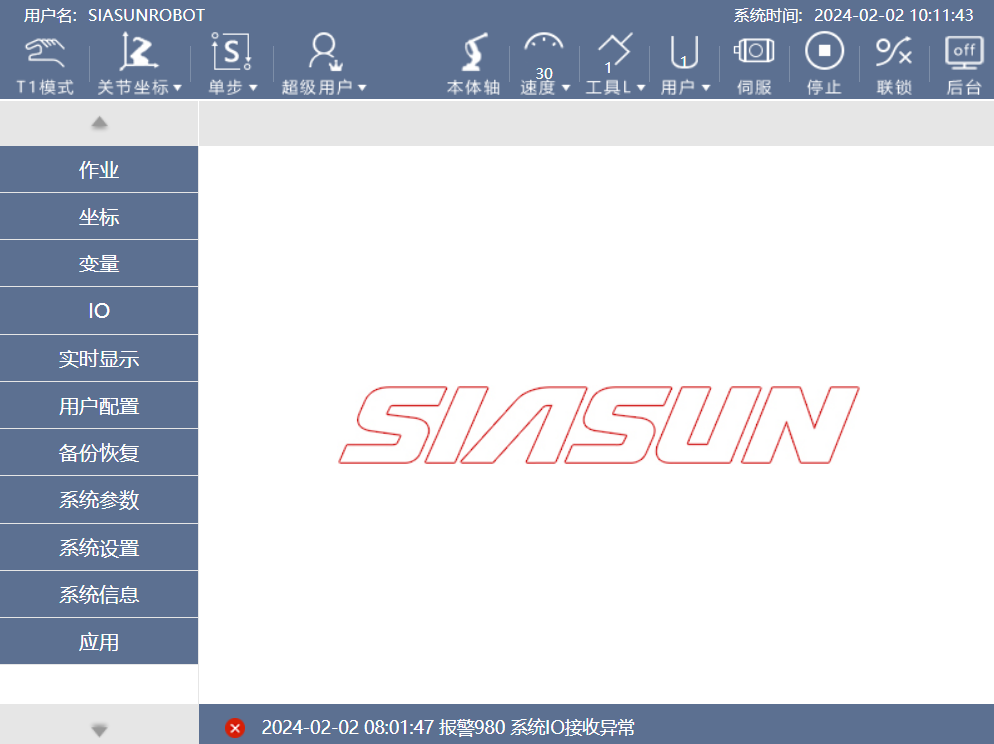

菜单栏

报警显示区

状态栏

主显示区

图 1\-15示教器窗口

**作业编辑界面**

在作业示教界面，可以进行指令的写入，复制，粘贴，删除，修改等常规操作。

另外，可以通过旁边的翻页进行页面的滚动。

 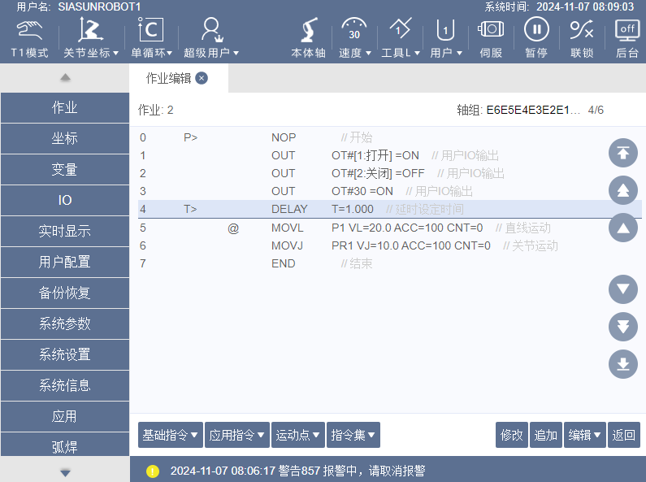

指令位置与实际位置相同

指令含义

作业显示

界面

作业指令菜单

翻页按钮

删除，复制等常规功能

菜单

图 1\-16示教程序编辑窗口

**编辑光标与执行光标：**

光标分为编辑光标与执行光标。

执行光标记录作业运行的指令位置，执行光标只随作业指令的执行而改变；编辑光标记录用户编辑操作后的指令位置。

当连续打开同名作业时，可以自动恢复此作业的上一次执行光标和编辑光标位置，以便提示用户此作业的指令执行状况和指令编辑状况；只要连续打开的作业属于非同名（即不同名字），则编辑光标、执行光标全部恢复成作业首行即NOP行。

 当执行光标与编辑光标重合时，观察作业只显示执行光标，如图所示；当执行光标与编辑光标位置不一致时，才会观察到作业页面的编辑光标与执行光标，如图所示。

 

编辑光标

执行光标

图 1\-17编辑光标与执行光标

作业启动（包括自动运行，正、反向运行）时编辑光标与执行光标必须一致，否则作业无法启动，会出现信息弹框并提示用户选择从编辑光标处启动作业还是执行光标处启动作业。

当前作业的执行光标与编辑光标一致。此时用户触发正、反向按键时，作业立即可以启动并执行。

机器人运动到该位置时，该指令上会显示@图标，表示机器人实际位置为该指令位置。

当前作业的执行光标与编辑光标不一致。此时用户触发正、反向按键时，作业没有启动并观察出现提示弹框“当前作业的编辑光标与执行光标不一致，作业禁止启动”。选择“确认”后作业将会从编辑光标处启动；选择“取消”后作业将从执行光标处启动。”，当选择“确认”后，执行光标会自动移至编辑光标处，即两光标重合；当选择“取消”后，需要手动移动编辑光标至执行光标处，即确保两光标重合。无论选择如何，需要再次触发【正、反向按键】后作业才能正式从编辑光标或者执行光标处启动。同理，执行模式下启动作业也是如此。

图1\-18弹出提示画面

**翻页按钮：**

编辑界面右侧三种翻页按钮，可以对作业进行翻页操作。

表格 1\-3翻页按钮介绍

| 按钮 | 说明 |
| --- | --- |
|  | 光标移动到作业第一行、光标移动到作业的最后一行。 |
|  | 页面向上或向下翻一页，光标位置不变。 |
|  | 光标向上或向下移动一行。 |

**状态栏：**

机器人屏幕上方的状态栏，会显示和机器人状态有关的各项内容或数据。

后台作业状态

运行模式

联锁状态

运动坐标系

程序运行状态

循环模式

伺服状态

用户等级

轴组状态

用户坐标系

速度倍率

工具坐标系

表格 1\-4状态栏含义

| 图标 | 含义 |
| --- | --- |
|  | 机器人当前执行模式的状态显示图标。分别为T1\\T2模式、执行模式、远程模式。  | **警告：****T2模式下，机器人的运动速度可以到达全速，如果不是不得不使用T2模式，请不要使用T2模式，以保证示教工程师的人身安全。** | | --- | |
|  | 用来切换手动时的坐标系。坐标系在轴\-直角\-工具\-用户坐标系间切换。 |
|  | 程序循环方式：单步执行、自动执行单循环一次执行。这三种模式在自动\\手动运行时，都有效。  | **注意：****由于循环方式在手动和自动运行时，都有效，所以请在手动或自动运行前，进行确认。** | | --- | |
|  | 不同的用户等级可以开放不同的使用权限，密码是：高级用户**“00001111”**，超级用户**“12341111”**。系统用户，是为开发人员设计的，不需要客户使用。  | **注释：****当输入内容完成时，需要先按软键盘右下方的【前往】按钮，才可以将内容确实输入到参数框中。** | | --- | |
|  | 当手动运动机器人时,切换本体轴和外部轴时,图标进行相应的变更。 |
|  | 速度倍率显示的图标，当速度倍率变更时，对应数值变更。 |
|  | 工具、外部工具图标，工具坐标系文件号变更时，图标上的数字相应的变更。  | **注意：****工具坐标系号的改变，对机器人程序运动轨迹有影响，请在手动或自动执行程序前，进行确认。** | | --- | |
|  | 用户坐标系图标，用户坐标系文件号变更时，图标上的数字相应的变更。  | **注意：****用户坐标系号的改变，在一些情况下，如偏移指令，对机器人程序运动轨迹有影响，请在手动或自动执行程序前，进行确认。** | | --- | |
|  | 伺服状态的图标：表示伺服下电、伺服上电、伺服使能。 |
|  | 程序的运行状态图标，分别表示程序的启动\-暂停\-停止。 |
|  | 后台作业状态图标，ON表示后台在启动的状态，OFF表示后台的停止状态。 |
|  | 显示作业在手动模式下，是否执行逻辑指令。两个都是圆圈时，代表正向运动执行逻辑指令和运动指令。一个圆圈，一个叉时，代表正向运动时不执行逻辑指令，只执行运动指令。  | **注意：****请在正向运动前，对联锁状态进行确认，确定是否在正向运动时，执行逻辑指令。** | | --- | |

**主菜单栏介绍：**

主菜单位于界面左侧，是机器人各种操作的界面入口。

表格 1\-5机器人主菜单介绍

| 图标 | 说明 |
| --- | --- |
|  | 进入作业列表界面，可进行新建程序，打开程序，作业管理作。同时，可以看到现有的作业列表和作业类型。 |
|  | 可以对机器人的各种坐标系进行查看、标定、设定等操作。 |
|  | 可以对各种类型的变量进行查看、写入等操作。 |
|  | 可以对输入、输出量进行查看、手动输出状态、组IO配置、远程IO映射、总线IO设置等操作。 |
|  | 显示机器人关节值、码盘值、姿态值、IO状态等数据。 |
|  | 进入用户配置界面，对各项条件进行配置，包括示教、原点、外部设备通讯、干涉区、中断操作等功能的配置。 |
|  | 对机器人的作业、参数等数据进行备份或恢复。 |
|  | 对机器人系统参数进行配置的界面。 |
|  | 机器人的系统设置界面。 |
|  | 显示机器人的系统版本、系统库、内存等信息。 |
|  | 各项应用菜单。 |

**文字输入操作：**

当点击触屏上需要输入字母或参数的地方，屏幕下方会弹出软件盘。可以通过软件盘输入所需要的内容。

| **注意：**1. **当输入内容完成时，需要先按软件右下方的【前往】按钮，才可以将内容确实输入到参数框中。** 2. **输入的内容，以第一次触发\[前往]按键前的内容为准。第一次触发\[前往]按键后，后续编辑内容无效。** 3. **触发\[前往]按键前，请仔细确认所编辑的内容。若已经触发\[前往]按钮后，还需更改所编辑的内容，则需要单击软键盘上的\[取消]按键。** |
| --- |

**报警界面：**

点击屏幕下方的报警栏，机器人会弹出报警界面。可以显示报警信息。

 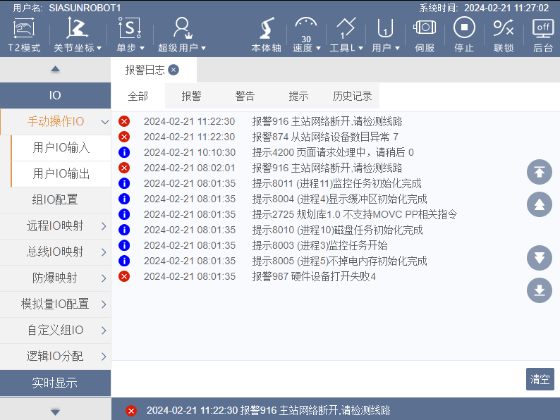

点击报警信息

图1\-19报警界面

表格1\-6报警界面图标介绍

| 报警提示栏 | 显示报警、警告、提示信息。 |
| --- | --- |
|  | 机器人报警、警告、提示图标。 |

**菜单树结构：**

菜单树结构见下表。

表格1\-7主菜单列表

| 一级主菜单 | 二级主菜单 | 三级主菜单 | 用户等级 |
| --- | --- | --- | --- |
| 作业 | 上次打开 |  | 普通用户 |
| 新建作业 |  | 高级用户 |
| 打开作业 |  | 普通用户 |
| 复制 |  | 高级用户 |
| 删除 |  | 高级用户 |
| 更多 | 作业属性 | 普通用户 |
| 变换 | 高级用户 |
| 登记/注销 | 高级用户 |
| 坐标 | 用户坐标 | 标定 | 高级用户 |
| 外部标定 | 高级用户 |
| 设定 | 高级用户 |
| 外部设定 | 高级用户 |
| 工具坐标 | 5点标定 | 高级用户 |
| 20点标定 | 高级用户 |
| 姿态标定 | 高级用户 |
| 设定 | 高级用户 |
| 工件坐标 | 标定 | 高级用户 |
| 设定 | 高级用户 |
| 外部工具 | 标定 | 高级用户 |
| 设定 | 高级用户 |
| 世界坐标 | 设定 | 高级用户 |
| 当前坐标 |  | 普通用户 |
| 变量 | 用户整型 |  | 高级用户 |
| 用户实型 |  | 高级用户 |
| 用户字节 |  | 高级用户 |
| 字符串变量 |  | 高级用户 |
| 位置变量 |  | 高级用户 |
| 系统整型 |  | 高级用户 |
| 系统实型 |  | 高级用户 |
| IO | 手动操作IO | 用户IO输入 | 高级用户 |
| 用户IO输出 | 高级用户 |
| 组IO配置 |  | 高级用户 |
| 远程IO映射 | 输入 | 高级用户 |
| 输出 | 高级用户 |
| 总线IO映射 | 输入IO映射 | 高级用户 |
| 输出IO映射 | 高级用户 |
| 防爆映射 | 输入 | 高级用户 |
| 输出 | 高级用户 |
| 防爆开关 | 高级用户 |
| 等待时间 | 高级用户 |
| 模拟量IO配置 | 输入 | 高级用户 |
| 输出 | 高级用户 |
| 自定义组IO | 输入 | 高级用户 |
| 输出 | 高级用户 |
| 逻辑IO分配 | 输入IO分配 | 高级用户 |
| 输出IO分配 | 高级用户 |
| 实时显示 | 实时显示 |  | 普通用户 |
| 用户IO输入 |  | 普通用户 |
| 用户IO输出 |  | 普通用户 |
| 系统IO输入 |  | 普通用户 |
| 系统IO输出 |  | 普通用户 |
| 报警日志 |  | 普通用户 |
| 指令信息 |  | 普通用户 |
| 操作日志 |  | 普通用户 |
| 用户配置 | 示教条件 |  | 普通用户 |
| 外部通讯设置 | DevNet | 高级用户 |
| 串口 | 高级用户 |
| EtherCAT | 高级用户 |
| 开关配置 | 高级用户 |
| LAN开关配置 | 高级用户 |
| LAN IP设置 | 高级用户 |
| Modbus从站配置 | 高级用户 |
| Modbus主站配置 | 高级用户 |
| EtherCAT NT151 | 高级用户 |
| 原位记录 | 原位 | 高级用户 |
| 范围 | 高级用户 |
| 外部轴 | 高级用户 |
| 预约 | 预约设置 | 高级用户 |
| 预约状态 | 普通用户 |
| 干涉区 | 轴干涉 | 高级用户 |
| 空间形状标定 | 高级用户 |
| 空间干涉属性 | 高级用户 |
| 本体方位 |  | 高级用户 |
| 用户名 |  | 高级用户 |
| 设置IP |  | 高级用户 |
| 语言 |  | 高级用户 |
| 碰撞保护 | 示教灵敏度 | 高级用户 |
| 执行灵敏度 | 高级用户 |
| 负载参数 | 负载设定 | 高级用户 |
| 附加负载 | 高级用户 |
| 循环方式 |  | 超级用户 |
| 抑振参数 |  | 超级用户 |
| 前馈摩擦 |  | 超级用户 |
| 规划库 |  | 超级用户 |
| 外部轴速度控制 |  | 高级用户 |
| 自定义报警 |  | 高级用户 |
| Interlock |  | 高级用户 |
| 报警码输出配置 |  | 高级用户 |
| 用户权限配置 | 修改密码 | 高级用户 |
| 重置密码 | 普通用户 |
| 权限注销 | 高级用户 |
| 备份恢复 | 参数 |  | 高级用户 |
| 位置变量 |  | 高级用户 |
| 作业上传 |  | 高级用户 |
| 作业下载 |  | 高级用户 |
| 卸载USB |  | 高级用户 |
| 系统参数 | 运动参数 | 直线配置 | 超级用户 |
| 速度 | 超级用户 |
| 减速比 | 超级用户 |
| 码盘数 | 超级用户 |
| 控制参数 | 软限位 | 高级用户 |
| 安全保护 | 超级用户 |
| 转矩限值 | 超级用户 |
| 杆长补偿 | 超级用户 |
| 无限回转 | 高级用户 |
| 证书 | 剩余时间 | 高级用户 |
| 授权 | 超级用户 |
| 证书设置 | 超级用户 |
| 系统设置 | 应用配置 |  | 超级用户 |
| 型号配置 |  | 超级用户 |
| 总线设备 |  | 超级用户 |
| 总线属性 |  | 超级用户 |
| 总线优化 |  | 超级用户 |
| 零位 | 校零 | 超级用户 |
| 零位设定 | 超级用户 |
| 码盘清除 | 超级用户 |
| 系统轴数 |  | 超级用户 |
| 执行开关 |  | 高级用户 |
| 安全设置 |  | 超级用户 |
| 外部轴 | 轴配置 | 高级用户 |
| 系统配置 | 高级用户 |
| 变1标定 | 高级用户 |
| 变2标定 | 高级用户 |
| 变3标定 | 高级用户 |
| 变1设定 | 高级用户 |
| 变2设定 | 高级用户 |
| 变3设定 | 高级用户 |
| 滑台标定 | 高级用户 |
| 滑台设定 | 高级用户 |
| 变换矩阵 | 高级用户 |
| 转台设定 | 高级用户 |
| 转轴设定 | 高级用户 |
| 共享外部轴 | 高级用户 |
| 外部轴手自动 | 高级用户 |
| 柜体配置 |  | 超级用户 |
| 文件数量扩展 |  | 超级用户 |
| 系统信息 | 系统版本 |  | 普通用户 |
| 系统库 |  | 超级用户 |
| 内存 |  | 普通用户 |
| 升级 |  | 超级用户 |
| 卸载 |  | 超级用户 |
| 系统时间 |  | 高级用户 |
| 重启 |  | 普通用户 |
| 应用 |  |  | 超级用户 |

### 通讯

为总线通讯而配置的接口有：

1. RS232,通讯接口位于主板COM接口；
2. DeviceNet，MCB板位于X5接口，SCB板位于P5接口；
3. Profinet，通讯接口位于主板LAN1接口；
4. Modbus TCP，通讯接口位于主板LAN5接口；
5. EtherCAT，通讯接口位于主板LAN3接口；

| **注意：****上述介绍的为M5控制器接口含义。使用其它控制器时，请查看《新松机器人电气使用及维护手册》。** |
| --- |

### I/O

机器人输入、输出信号，即I/O信号，可通过用户I/O信号在机器人控制软件和外部设备之间进行数据的传输。

I/O的类型有：

1. 用户I/O信号。
2. 组I/O信号。
3. 模拟I/O。

用户I/O分为硬件直连线IO和总线通讯IO，共支持4096位输入与4096位输出。

硬件直连线IO，根据不同的控制柜有8位输入与8位输出，有16位输入与16位输出，可通过增加模块进行扩展，具体数量随硬件配置不同而不同，其中华太模块最多支持64位输出、64位输入。具体内容可查看《新松机器人电气使用及维护手册》。

### 远程I/O

远程I/O是机器人与外围设备之间进行通讯的信号，这些信号的需要被定义成专用的信号，通过软件界面来设定。

1. 调用主作业。
2. 启动或停止程序。
3. 取消报警。
4. 其他信号的交互。

### 机器人动作

把机器人的工具中心点（TCP点）从当前位置，移动到目标位置的运动，作为一个指令来处理，这样就可以完成机器人动作的编辑。机器人软件会自动处理相关的轨迹、加速度、速度、位置信息。

使机器人的运动有两种方式：手动通过按钮来控制和通过程序来执行动作。

可用通过示教器上的按钮手动控制机器人运动，机器人的动作由选择的坐标系和速度来确定。

机器人按照程序自动执行时，机器人的动作是通过程序指令中所给定的位置数据、运动类型、速度、加速度来确定。

动作类型有J（轴）运动、L（直线）运动、C（圆弧）运动，J运动时，TCP点在两个示教点之间不规则运动，运动轨迹是重复相同的轨迹。L运动时，TCP点按照两个示教点之间的直线进行运动。C运动时，TCP点在3个示教点之间的圆弧进行运动。

机器人运行时，可以开启或关闭连续轨迹，即在目标点并不停止，而是从目标点的附近快速滑过。

### 急停按钮

机器人具有如下急停按钮：

1. 示教器和控制柜上的急停按钮。
2. 用户自行配置的外部急停按钮。

当按下急停按钮时，机器人不管出于任何状态，都会触发急停状态，外部急停按钮的接口端子位于机器人的控制柜内部控制单元或接口面板。

### 外部轴

新松控制系统除了可以控制机器人本体的6轴外，还可以控制最多6个外部轴（其中1个外部轴支持2个电机驱动）（详见8\.3外部轴配置说明）。

1. 通常情况下，机器人和外部轴进行J运动。
2. 在特定情况下，机器人也可以与外部轴进行L运动或C运动。

# **机器人各项设定**

使用机器人系统之前，需要对各项功能进行一定设置。

## I/O

机器人的I/O，即输入、输出信号，是机器人与外部设备，如末端执行器等，进行通讯的信号。新松机器人配有用户I/O和安全专用I/O供用户使用。

**用户I/O：**

用户I/O是由客户定义和使用的I/O。

1. 数字I/O OUT\#\<\>和IN\#\<\>
2. 组I/O OG\#\<\>和IG\#\<\>、OGH\#\<\>和IGH\#\<\>、OGFA\#\<\>和IGFA\#\<\>
3. 模拟I/O AOUT\#\<\>和AIN\#\<\>

这些IO\#后边\<\>内是信号的号码和组号码。

**安全专用I/O：**

1. 安全门。
2. 外部急停。
3. 急停输出。

这些I/O的接口端子在控制柜内部或者控制柜外部，安全专用I/O具体位置可以查看《新松机器人电气使用及维护手册》。

**I/O的分配和映射：**

机器人用户I/O通常被称为逻辑信号，在程序的执行过程中，逻辑信号被控制系统根据指令进行处理。

而实际的I/O信号线是物理信号，这些物理信号要在I/O模块上进行接线。也可以通过工业总线来进行映射I/O。

**I/O的指令编号：**

I/O的指令编号，指的是I/O在指令中和物理对应的编号。

数字输入信号：IN 1、IN 2…

数字输出信号：OUT 1、OUT 2…

模拟输入信号：AIN R1、AIN R2…

模拟输出信号：AOUT A01、AOUT A02…

### 数字I/O

数字I/O，是I/O模块与外部设备进行输入、输出信息交换的数字信号，分别有4096位，数字信号的状态有ON和OFF两种状态。

**I/O信号的查看：**

在主菜单【实时显示】\-【用户I/O输出、输入】中，可以进行I/O信号的状态查看。

 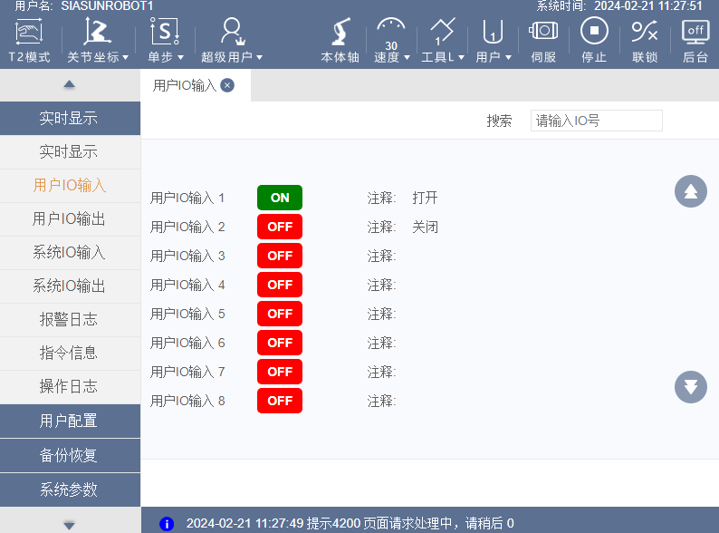

图2\-1用户I/O输入查看

| **注释：可以查看IO的注释（注释在手动操作IO界面设置）。****搜索：可以通过界面右上方的搜索，来查找所需要的I\\O。** |
| --- |

**I/O信号的强制输出：**

在菜单【I/O】\-【手动输出】\-【用户输出】中，模拟为U时，点击界面中ON或者OFF按钮，来改变I/O状态，进行用户I/O的强制输出。

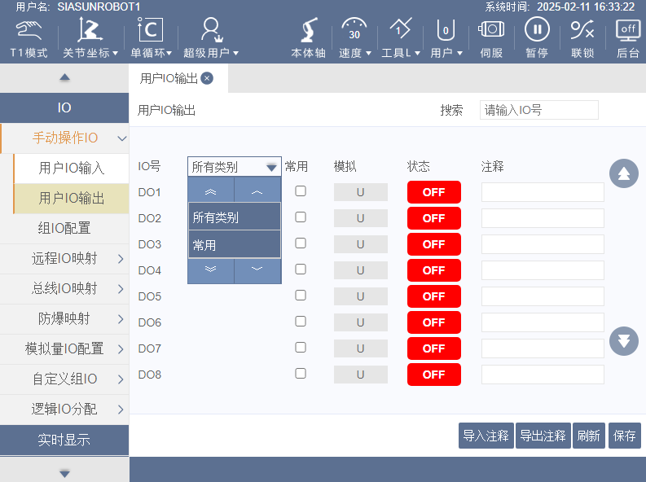

图 2\-2用户I/O的强制输出界面

**所有类别**：可以归类查看已经分配完的IO类别。如常用、各项应用。

**常用**：常用对应的IO号选择后，在所有类别里面选择常用后，IO号的列表会变成常用，其他类的信号不显示。

| **注释：可以添加注释，用来描述这位I/O的含义。****搜索：可以通过界面右上方的搜索，来查找所需要的I/O号。****导入注释：机器人控制器需要插入u盘，且u盘中有对应的注释文本，点导入注释。****导出注释：机器人控制器需要插入u盘，点导出注释，导出的注释是文本格式，可以编辑。导出的注释文本名称为digitalOutputComment.txt。****刷新：对当前界面进行刷新。** |
| --- |

| **警告：****通过示教器对I/O信号进行强制输出时，能够改变外围设备的状态，在某些情况下会给整个系统带来不良影响。所以请深入了解I/O信号改变带来的影响后，再进行强制I/O输出。** |
| --- |

**I/O信号的模拟输入/输出：**

模拟输入/输出功能时指改变成为模拟状态后，可以改变IO界面输入输出状态，只有在手动模式才可以改变状态，改变状态后不对外输出。自动模式下，模拟信号位，不接收外部信号，也不能对外输出。如需要机器人与外部进行IO交互，请切换到非模拟状态。

**用户IO模拟输入：**

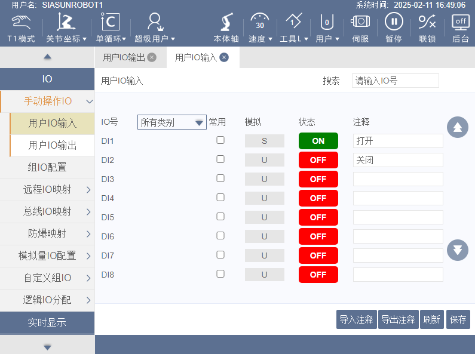

图2\-3用户I/O的IO模拟输入界面

**模拟：**S为设为模拟状态，U不是模拟状态。

**状态：**模拟为S时，才能在这个界面改变状态ON/OFF，并且这个状态只能在手动模式下更改。把模拟S变成U时，IO状态会恢复回原来的状态。模拟为U时，不能改变状态。自动运行时，无法改变模拟S的状态。

| **注释：可以添加注释，用来描述这位I/O的含义。****搜索：可以通过界面右上方的搜索，来查找所需要的I/O号。****导入注释：机器人控制器需要插入u盘，且u盘中有对应的注释文本，点导入注释。****导出注释：机器人控制器需要插入u盘，点导出注释，导出的注释是文本格式，可以编辑。导出的注释文本名称为digitalIutputComment.txt。****刷新：对当前界面进行刷新。** |
| --- |

**用户IO模拟输出：**

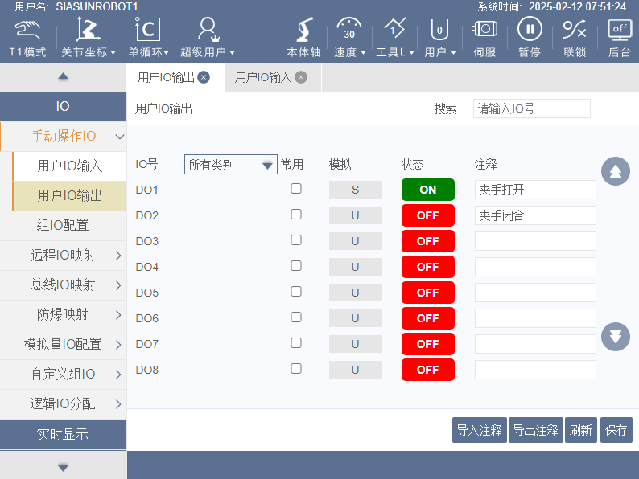

图 2\-4用户I/O的IO模拟输出界面

**模拟：**模拟为S时，改变IO状态。

**状态：**改变的IO状态，只在手动模式下更改，自动运行时，模拟状态无效，会恢复到改变前的原有状态，无法通过指令改变模拟位状态。

### 组I/O

#### 8位或16位组I\\O

组I/O（IG\#,OG\#等），是用8位或者16位I/O信号进行数据交换的一组数字信号。定义成一组的组I/O指令可以接收和发送10进制数字给外围设备，这些10进制数可以转换成2进制数，通过I/O信号来发送和接收。新松机器人支持8组自由分配的8位组I/O和256组16位组I/O。大多数情况下，需要机器人与PLC进行数据交互时，使用组I/O。

**组I/O的配置：**

8位组I/O,需要对I/O进行配置。16位组I/O不需要配置。

**输出的执行：**

可以通过执行程序来进行组I/O的输出执行。

**步骤：**

点击【I/O】\-【组I/O配置】菜单，打开组I/O配置界面。配置完成之后按保存键保存。

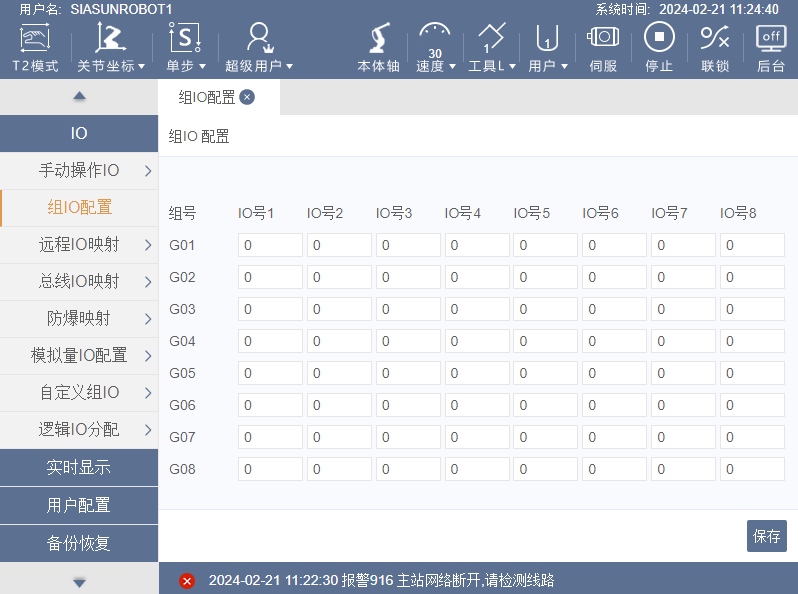

图 2\-5组I/O配置界面

每一组I/O对应8位I/O点，I/O号从1到8代表二进制数字，从高位到低位。在I/O号下面写入对应的I/O点。

| **注意：****组I/O分配是对输入、输出同时进行的分配,就是说配置好一组组I/O后，输入和输出该组I/O，用的都是相同的OUT\\IN逻辑编号。** |
| --- |

1. 8位组IO输出：OG\#1、OG\#2
2. 8位组IO输入：IG\#1、IG\#2

例如：指令OUT G\#1\=139，相当于输出二进制数10001011。

表格 2\-1组IO输入映射IO举例1

| 组号 | IO号1 | IO号2 | IO号3 | IO号4 | IO号5 | IO号6 | IO号7 | IO号8 |
| --- | --- | --- | --- | --- | --- | --- | --- | --- |
| G01 | 1 | 2 | 3 | 4 | 5 | 6 | 7 | 8 |

如果进行如上的IO分配的话，机器人IO实际输出如下(输入也是一样)：

OUT\#1\=ON OUT\#2\=OFF OUT\#3\=OFF OUT\#4\=OFF OUT\#5\=ON OUT\#6\=OFF OUT\#7\=ON OUT\#8\=ON

| **注释****IO号1到IO号8是从高位到低位。** |
| --- |

表格 2\-2组IO输入映射IO举例2

| 组号 | IO号1 | IO号2 | IO号3 | IO号4 | IO号5 | IO号6 | IO号7 | IO号8 |
| --- | --- | --- | --- | --- | --- | --- | --- | --- |
| G01 | 8 | 7 | 6 | 5 | 4 | 3 | 2 | 1 |

如果进行如上的IO分配的话，机器人IO实际输出如下(输入也是一样)：

OUT\#8\=ON OUT\#7\=OFF OUT\#6\=OFF OUT\#5\=OFF OUT\#4\=ON OUT\#3\=OFF OUT\#2\=ON OUT\#1\=ON

表格 2\-3组IO输入映射IO举例3

| 组号 | IO号1 | IO号2 | IO号3 | IO号4 | IO号5 | IO号6 | IO号7 | IO号8 |
| --- | --- | --- | --- | --- | --- | --- | --- | --- |
| G01 | 25 | 31 | 6 | 9 | 3 | 2 | 4 | 1 |
| 配置的信号不需要连续，不需要从大到小，上面的配置有效。 | | | | | | | | |

表格 2\-4组IO输入映射IO举例4

| 组号 | IO号1 | IO号2 | IO号3 | IO号4 | IO号5 | IO号6 | IO号7 | IO号8 |
| --- | --- | --- | --- | --- | --- | --- | --- | --- |
| G01 | 0 | 0 | 0 | 9 | 3 | 2 | 4 | 1 |
| 一组信号最多8位，可以小于8位，上面的配置有效。 | | | | | | | | |

表格 2\-5组IO输入映射IO举例（无效）

| 组号 | IO号1 | IO号2 | IO号3 | IO号4 | IO号5 | IO号6 | IO号7 | IO号8 |
| --- | --- | --- | --- | --- | --- | --- | --- | --- |
| G01 | 0 | 7 | 0 | 9 | 3 | 2 | 4 | 0 |
| 但是，配置时只能高位空缺，不能在中间或者低位空缺，下面的配置无效。 | | | | | | | | |

表格 2\-6组IO输入映射IO举例（重复配置）

| 组号 | IO号1 | IO号2 | IO号3 | IO号4 | IO号5 | IO号6 | IO号7 | IO号8 |
| --- | --- | --- | --- | --- | --- | --- | --- | --- |
| G01 | 0 | 7 | 1 | 2 | 2 | 3 | 4 | 5 |
| 同一组中，配置不能重复。假如低位的2信号与高位2信号状态瞬时有差别，低位的2信号状态将覆盖高位的2信号状态，这样系统无法区分。 | | | | | | | | |

表格 2\-7组IO输入映射IO举例（范围超界）

| 组号 | IO号1 | IO号2 | IO号3 | IO号4 | IO号5 | IO号6 | IO号7 | IO号8 |
| --- | --- | --- | --- | --- | --- | --- | --- | --- |
| G01 | 0 | 0 | 0 | 0 | 3 | 2 | 4 | 1 |
| 指令不检测组I\\O输出范围超界，示教指令为OUT G\#1\=25,25转换为二进制00011001，后4位IO的状态正常输出为1001，前4位不做任何处理。 | | | | | | | | |

16位组I/O指令为

1. 16位组IO输出：OGH\#1、OGH\#2
2. 16位组IO输入：IGH\#1、IGH\#2

16位的组IO不需要进行分配，而是直接按1\-16,17\-32,33\-48,49\-64…的I/O点，顺序分成16位IO组信号（最多256组）。分别对应输出的OGH\#1,2,3,4,…,256,和输入的IGH\#1,2,3,4, …,256。可以直接在程序里编辑使用该指令，使用其中一组信号时，系统将其中16位IO自动分配成组IO，得到的值转换成10进制数。

8位组I/O支持常数范围是从0到255；16位组I/O，支持范围从0到65535。

| **注意:****请勿将用于其他用处的I/O，使用在组I/O中。比如远程I/O，或其他信号的I/O。尤其注意的是16位的组I/O不需要配置，所以不要重复使用了在程序中已使用的或远程已配置的I/O。** |
| --- |

#### 32位组I\\O

32位组I\\O用途与8位或16位组I\\O相同。float或int型数据传至32位输入组IO，或将输入的32位组IO数据赋值给整型或float型数据中。32位组IO的第一组是IO位的1\-32，第二组32位组IO为33\-64，第三组32位组IO为65\-96，以此类推，最多支持128组。

### 远程I/O

机器人自动运行过程不仅可以通过示教器按钮来实现，还可以通过外围设备控制实现，这就是控制器的远程控制功能。示教器的模式选择开关旋转到远程时，远程功能才有效。

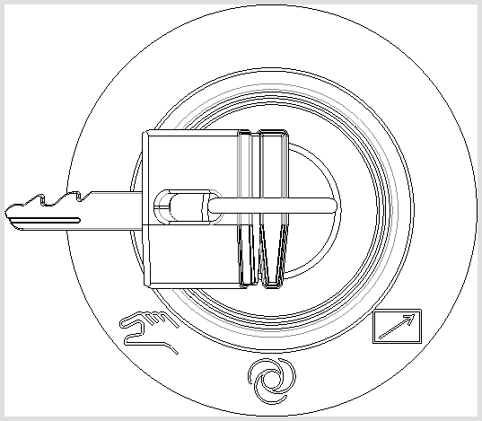

远程模式

图 2\-6示教器模式选择开关

用户可以根据自己的需要进行重新配置。

例如：外部启动信号有默认IO地址，如果用户需要输入IO地址10来进行外部启动时，可以在远程IO配置中外部启动后输入10，并按保存。当系统检测到输入信号10的上升沿后，就启动运行程序。

| **注意:**1. **配置到远程I/O上的I/O被当成系统I/O进行处理，该信号不可以在程序中使用，也不可以再配置到组I/O中。如果客户进行了以上操作，在程序执行时将报警。** 2. **远程模式下，示教器停止键和V\-键、V\+键有效，其他按键都无效。示教器界面的内容可供用户查看。** |
| --- |

#### 远程输入的映射

在菜单中打开【IO】\-【远程IO映射】\-【输入】。即可打开远程输入配置界面。配置完成后，点击保存。

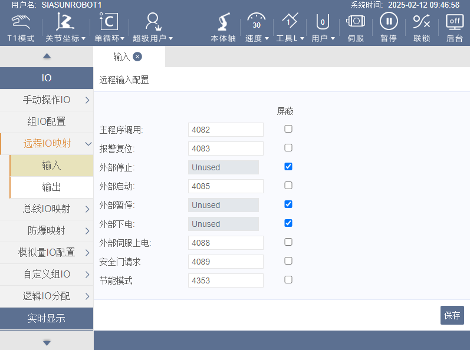

图 2‑7远程输入配置

信号说明：

**主程序调用:**此信号用来打开机器人设置好的主程序，此信号由上升沿触发。

**报警复位：**机器人报警复位信号，此信号由上升沿触发。

**外部停止：**使机器人瞬间停止，不掉电。

**外部启动信号：**使用此信号来通过外围设备启动机器人程序，此信号由上升沿触发。

**外部暂停信号：**使用此信号来暂停机器人，此信号0为有效。

**外部下电：**使机器人瞬间停止并下动力电。

**外部伺服上电：**使用此信号来对机器人进行伺服上电操作，此信号由上升沿触发。

**安全门请求：**收到外部请求信号后机器人暂停。

**节能模式：**由外部IO信号（上升沿触发）来控制系统进入节能状态，而不采用由RC自动（计时方式）控制节能动作。如果切换屏蔽，则远程模式的节能控制与自动模式下一致，即采用计时方式节能下电。

**屏蔽**：可以把远程IO输入的某项功能进行屏蔽。勾选进行屏蔽，IO地址框变成Unused。

如需要把外部暂停功能屏蔽，需要在该功能后的对话框进行勾选，并在前面的对话框选择常闭。

| **提示：****不进行屏蔽时，原配置的IO信号地址不发生变化，会保持原有的地址。** |
| --- |

| **注意:****远程I/O使用的信号,不可以在指令或者组I/O中进行输入或输出,如果使用,程序会弹出报警。** |
| --- |

#### 远程输出的映射

在菜单中打开【IO】\-【远程IO映射】\-【输出】。即可打开远程输入配置界面。配置完成后，点击保存。

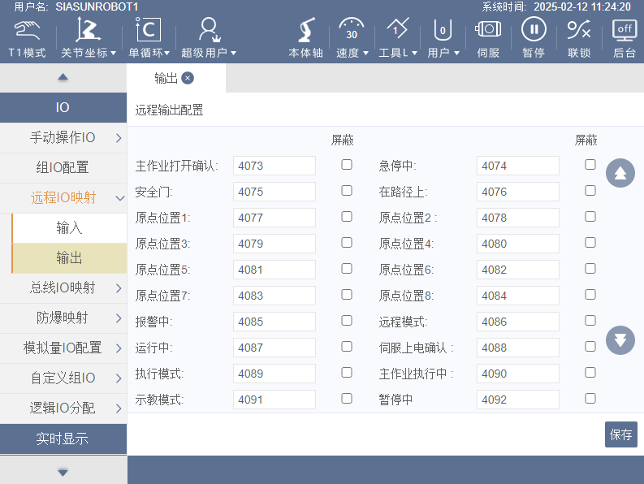

图 2‑8远程输出配置界面1

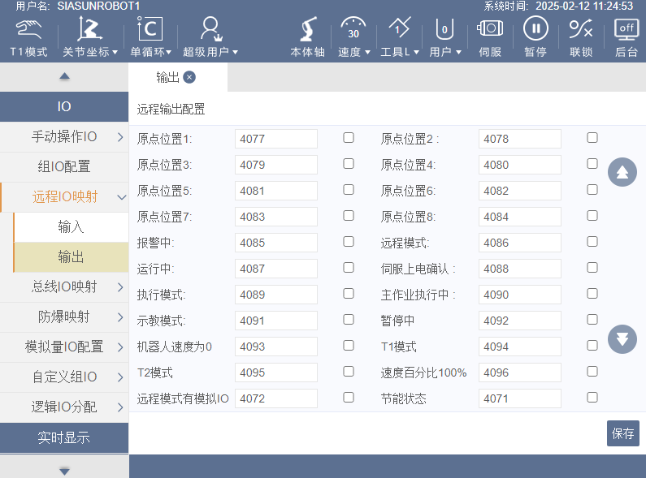

图 2\-9远程输出配置界面2

**信号说明**

**主作业打开确认:**当主作业打开时，发出上升沿信号。

**急停中:**当急停输入信号触发时，发出上升沿信号。

**安全门:**当安全门信号断开时，发出上升沿信号。

**在路径上:**当机器人在程序执行的轨迹路径上时，发出此信号。

**原点位置:**当机器人在原点位置时，发出此信号。

**报警中:**机器人有报警时，发出此信号。

**远程模式:**当机器人处于远程模式时，发出此信号。

**运行中:**当机器人程序在自动执行时，发出此信号。

**伺服上电确认:**当机器人伺服上电后，发出此信号。

**执行模式:**机器人在执行模式时，发出对应的信号。

**主作业执行中:**当机器人主作业在处于自动运行状态下，发出此信号。

**示教模式:**机器人在示教模式时，发出对应的信号。

**暂停中：**机器人收到暂停信号后，进行暂停时对外输出信号。

**机器人速度为0：**机器人暂停后，实际速度为0时，对外输出信号。

**T1模式：**机器人在T1模式时，发出对应的信号。

**T2模式：**机器人在T2模式时，发出对应的信号。

**速度百分比100%：**机器人速度百分比为100时，发出对应的信号。

**远程模式有模拟IO：**在远程模式下，有模拟IO时，发出对应的信号。

**节能状态：**远程模式和执行模式下，作业执行中，机器人处于节能下电时远程输出IO状态ON，其他情况为OFF。

### 模拟量I\\O

模拟量输入输出功能是指通过IO模块将外部设备输入的电压或者电流的模拟量值转换为数字量输出到机器人端，使得机器人端能够看到电压电流值代表的实际含义，或者将实际的数字量数据通过I\\O模块转换为电流或电压输出给外部设备。通过界面的配置以及指令实现该功能。

**模拟量输入配置**：点击主菜单【IO】\-【模拟量IO配置】\-【输入】。

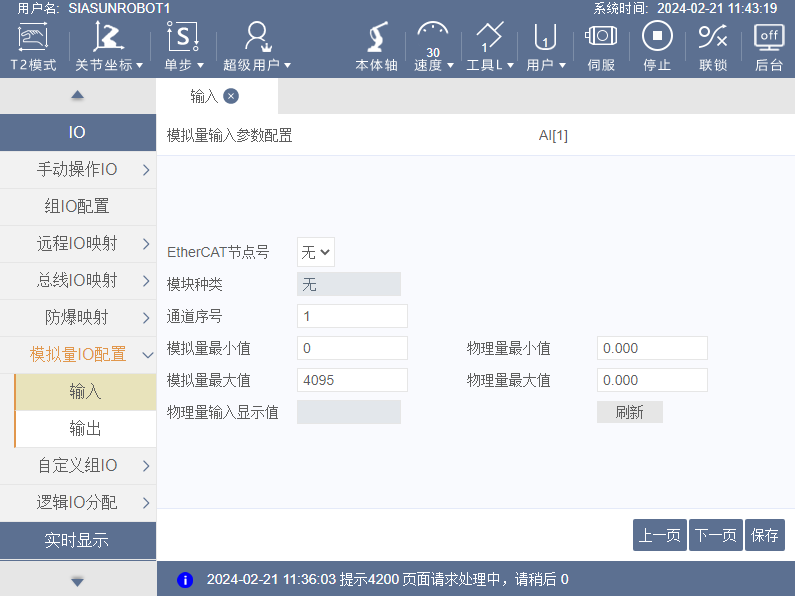

图 2‑10模拟量输入设置页面

EtherCAT节点号：根据实际连接的模拟量输入模块确定，与总线设备配置中的EtherCAT节点一致（详见8\.3\.2总线设备配置说明）。

模块种类：根据选择的节点号，显示该节点连接的模块型号，不可以修改。

通道序号：对应模块中的通道号。

模拟量最小值：模拟量模块支持的最小值，模拟量最小值不能大于或等于模拟量最大值。

模拟量最大值：模拟量模块支持的最大值，模拟量最大值不能小于或等于模拟量最小值。

物理量最小值：外围设备支持的最小值，物理量最小值不能大于或等于物理量最大值。

物理量最大值：外围设备支持的最大值，物理量最大值不能小于或等于物理量最小值。

物理量输入显示值：外围设备输入实时显示值。

刷新：刷新物理量输入显示值。

上一页：向前翻页。

下一页：向后翻页。

保存：上述参数配置好后，若数据无误，点击保存，则数据写入，若数据有误，点击保存时提示报警。

注：修改完参数后，先点【保存】按钮，然后再点【刷新】按钮，物理量实时显示值才是修改完参数后对应的数值。

**模拟量输出配置**：点击主菜单【IO】\-【模拟量IO配置】\-【输出】。

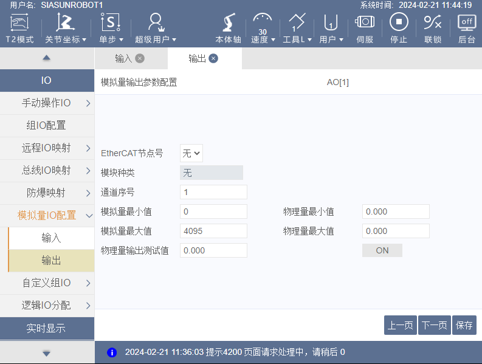

图 2‑11模拟量输出设置页面

EtherCAT节点号：根据实际连接的模拟量输出模块确定，与总线设备配置中的EtherCAT节点一致（详见8\.3\.2总线设备配置说明）。

模块种类：根据选择的节点号，显示该节点连接的模块型号，不可以修改。

通道序号：对应模块中的通道号。

模拟量最小值：模拟量模块支持的最小值，模拟量最小值不能大于或等于模拟量最大值。

模拟量最大值：模拟量模块支持的最大值，模拟量最大值不能小于或等于模拟量最小值。

物理量最小值：外围设备支持的最小值，物理量最小值不能大于或等于物理量最大值。

物理量最大值：外围设备支持的最大值，物理量最大值不能小于或等于物理量最小值。

物理量输出测试值：测试输出给外围设备的物理量值。

ON：发送物理量输出测试值。

OFF：发送物理量最小值（关闭输出测试）。

上一页：向前翻页。

下一页：向后翻页。

保存：上述参数配置好后，若数据无误，点击保存，则数据写入，若数据有误，点击保存时提示报警。

注：修改完参数后，先点【保存】按钮，然后再点【ON】按钮，测试输出给外围设备的物理量值才是修改完参数后对应的数值。

### 总线IO映射

总线IO映射是配置通讯后，设置映射起始地址与通讯长度。具体请查看《新松机器人电气使用及维护手册》。

防爆映射

防爆映射功能是为防爆机器人的防爆功能而设计的。

### 自定义组IO

自定义组IO，目前只能在弧焊应用无协议焊机功能上使用。不能在其它情况下使用。

### 逻辑IO分配

逻辑IO分配是将机器人的用户IO进行分配，目前支持1\-4096位，将其分配给外部应用使用，通过分配界面，给各类应用分配不同的IO段。这样就可以通过已经分配好的IO与各应用对应上，从而更有效的使用。

#### 输入IO分配,

点击主菜单【IO】\-【逻辑IO分配】\-【输入IO分配】。

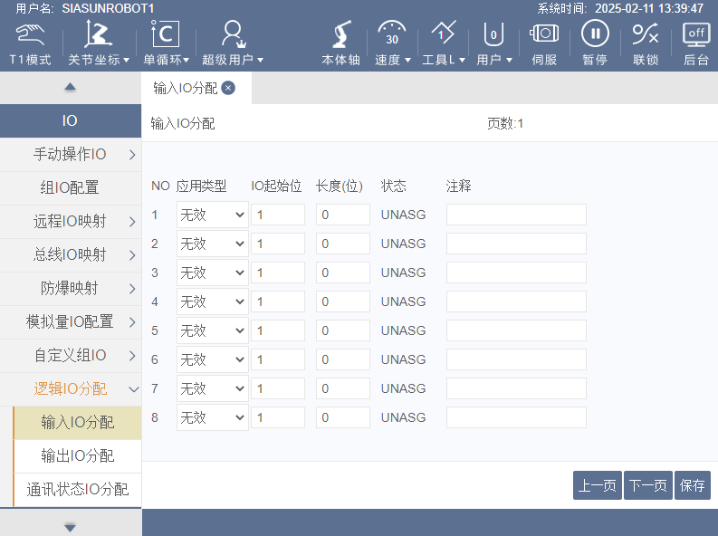

图 2‑12逻辑IO输入配置页面

**参数说明:**

**应用类型：**通过下拉框进行选择，可选择的有通讯状态、弧焊、点焊搬运、涂胶（已配置的应用才会在下拉框中显示）。

**IO起始位：**填写起始位，设置范围是1\-4096。默认值为1。

**长度：**将用户IO分配到各个通讯类型上的数据长度，单位为“位”。默认值为0。

**状态：**分配完成后，点击保存，该行状态显示由UNASG变PEND，重启后更新位ACTIV。默认状态显示UNASG。 IO分配需要控制器重启后生效。

**注释：**可填写分配的含义，默认注释为空。

#### 输出IO分配

点击主菜单【IO】\-【逻辑IO分配】\-【输出IO分配】。

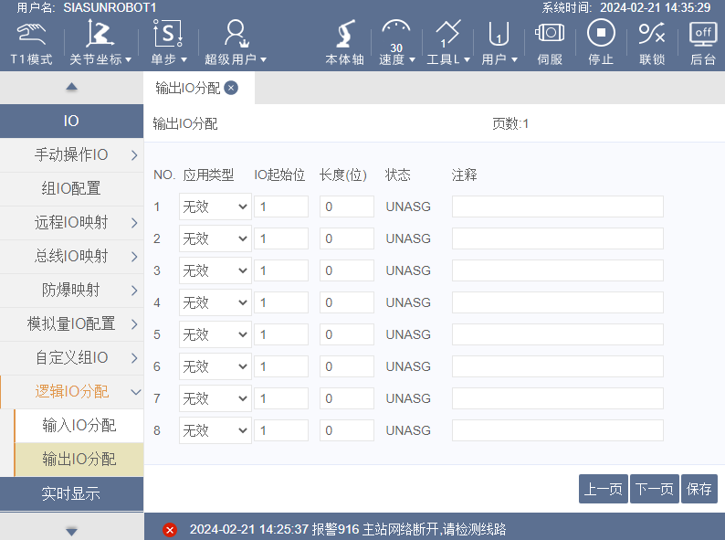

图 2‑13逻辑IO输出配置页面

**参数说明：**

**应用类型：**通过下拉框进行选择，可选择的有通讯状态、弧焊、点焊搬运、涂胶、螺柱焊（已配置的应用才会在下拉框中显示）。

**IO起始位：**填写起始位，设置范围是1\-4096。默认值为1。

**长度：**将用户IO分配到各个通讯类型上的数据长度，单位为“位”。默认值为0。

**状态：**分配完成后，点击保存，该行状态显示由UNASG变PEND，重启后更新位ACTIV。默认状态显示UNASG。 IO分配需要控制器重启后生效。

**注释：**可填写分配的含义，默认注释为空。

**输出IO分配：**点击主菜单【IO】\-【逻辑IO分配】\-【输出IO分配】。

#### 通讯状态IO分配

 通讯状态IO分配功能，是把输入IO分配的通讯状态进行分解。用于查看机器人与外部设备的通讯状态；可通过该界面把机器人与不同的外部设备通讯状态分开显示；可通过该界面把有问题的通讯设备进行屏蔽，这样不影响其它功能使用；

例：机器人输入IO分配的通讯状态同时配置3个设备通讯，其中某个设备通讯断开，我们无法通过输入IO分配界面查看出哪个设备的通讯发生断开。我们需要查看哪个设备断开可以通过通讯状态IO分配进行查看，序号1配置设备1，序号2配置设备2，序号3配置设备3，这样任何设备通讯断开时，都可以查看到，同时也可以对某个设备的通讯进行屏蔽。

点击主菜单【IO】\-【逻辑IO分配】\-【通讯状态IO分配】。

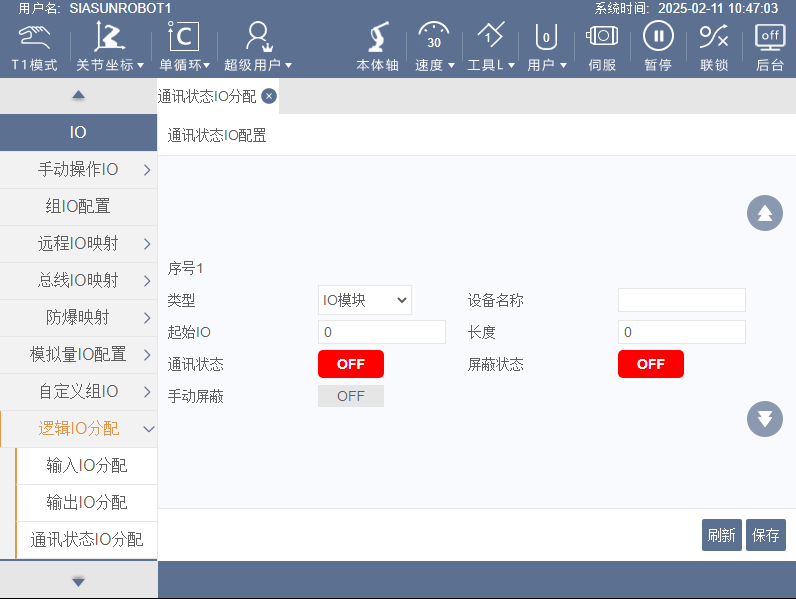

图 2‑14通讯状态IO分配

**序号：**共有16个，可以通过上下键进行切换。

**类型：**通过下拉框进行选择，可选择的有IO模块、基础自定义、应用（已配置的应用才会在下拉框中显示）。

**设备名称：**可以输入名称。

**起始IO：**填写起始位，设置范围是1\-4096。默认值为0。

**长度：**输入IO长度，单位为“位”。默认值为0。

**通讯状态：**显示当前通讯状态。

**手动屏蔽：**屏蔽开关ON/OFF，屏蔽后配置的该段IO无效。

**屏蔽状态：**显示当前屏蔽状态。

## 设置坐标系

坐标系是为了确定机器人的位置和姿态而在机器人或空间上定义的位置坐标系统。坐标系有关节坐标系、直角坐标系、工具坐标系和用户坐标系。

**关节坐标系：**

关节坐标系是机器人在各轴关节上的坐标系。可以使机器人各轴单独运动。

| **C:\Users\wangshen\Desktop\操作说明增加项\SR210D5.jpg** |
| --- |

图 2‑15关节坐标系

**三种笛卡尔坐标系：**

新松机器人有三种笛卡尔坐标系：直角坐标系，工具坐标系，用户坐标系。通过空间上直角坐标系原点到工具的笛卡尔坐标系原点（TCP点）的坐标系x、y、z和空间上直角坐标系X轴，Y轴，Z轴周围的工具侧的笛卡尔坐标系的回转角Rx、Ry、Rz来定义机器人的位置和姿态。

| 绕X轴旋转绕Y轴旋转绕Z轴旋转各轴旋转之后 |
| --- |

图 2‑16（Rx、Ry、Rz）含义

**直角坐标系：**

新松机器人直角坐标系。原点定义在1轴轴线与2轴所在水平面的交点上。

机器人的TCP平行机器人X\\Y\\Z轴运动。

**工具坐标系：**

工具坐标系是定义工具中心点（TCP）的位置和姿态。工具坐标系需要用户自己进行标定或者设定。未标定之前，工具坐标系默认在6轴法兰坐标系。

|  |
| --- |

图 2‑17直角、工具坐标系

**用户坐标系：**

用户坐标系，是用户对每个作业的空间进行定义的一种笛卡尔坐标系。它用于位置存储的示教和执行、位置补偿指令的执行等。默认的用户坐标系在直角坐标系上（与直角坐标系相同）。

|  |
| --- |

图 2‑18用户坐标系

| **警告：****如果示教程序改变了工具或者用户坐标系，必须重新示教程序的各个程序点，并重新进行手动验证，以免造成人身伤害或设备损坏。** |
| --- |

**外部工具坐标系：**

当工具装在机器人以外的位置时，标定的工具坐标系称为外部坐标系，标定方法同用户坐标系。

### 坐标系和轴运动键

**关节坐标系：**

使用关节坐标系可以单独运动机器人的各轴。

表格 2\-8关节坐标系下机器人的运动

| 轴名称 | 轴操作键 | 动作 |
| --- | --- | --- |
| 1轴 |  | J1轴左右转动。 |
| 2轴 |  | J2轴前后运动。 |
| 3轴 |  | J3轴上下运动。 |
| 4轴 |  | J4轴旋转。 |
| 5轴 |  | J5轴上下运动。 |
| 6轴 |  | J6轴旋转。 |

**直角坐标系：**

在直角坐标系下，机器人TCP点会平行于机器人X\\Y\\Z轴进行移动。同时机器人可以以TCP点为中心，TCP点不变的情况下，改变姿态。

表格 2\-9直角坐标系下机器人的运动

| 轴名称 | 轴操作键 | 动作 |
| --- | --- | --- |
| X轴 |  | TCP平行于X轴移动。 |
| Y轴 |  | TCP平行于Y轴移动。 |
| Z轴 |  | TCP平行于Z轴移动。 |
| Rx轴 |  | TCP沿X轴旋转，改变姿态。 |
| Ry轴 |  | TCP沿Y轴旋转，改变姿态。 |
| Rz轴 |  | TCP沿Z轴旋转，改变姿态。 |

**工具坐标系：**

在工具坐标系下，机器人TCP点会平行于工具定义的X\\Y\\Z轴进行移动。同时机器人可以以TCP点为中心，TCP点不变的情况下，改变姿态。

表格 2\-10工具坐标系下机器人的运动

| 轴名称 | 轴操作键 | 动作 |
| --- | --- | --- |
| X轴 |  | TCP平行于X轴移动。 |
| Y轴 |  | TCP平行于Y轴移动。 |
| Z轴 |  | TCP平行于Z轴移动。 |
| Rx轴 |  | TCP沿X轴旋转，改变姿态。 |
| Ry轴 |  | TCP沿Y轴旋转，改变姿态。 |
| Rz轴 |  | TCP沿Z轴旋转，改变姿态。 |

| **注释****工具坐标系各轴的方向会随着腕端的改变而移动。但工具坐标下机器人的运动方向会以工具本身为准，不会随机器人的位置，姿态变换而变化。** |
| --- |

**用户坐标系：**

在用户坐标系下，机器人TCP点会平行于在空间定义的X\\Y\\Z轴进行移动。同时机器人可以以TCP点为中心，TCP点不变的情况下，改变姿态。

表格 2\-11直角坐标系下机器人的运动

| 轴名称 | 轴操作键 | 动作 |
| --- | --- | --- |
| X轴 |  | TCP平行于X轴移动。 |
| Y轴 |  | TCP平行于Y轴移动。 |
| Z轴 |  | TCP平行于Z轴移动。 |
| Rx轴 |  | TCP沿X轴旋转，改变姿态。 |
| Ry轴 |  | TCP沿Y轴旋转，改变姿态。 |
| Rz轴 |  | TCP沿Z轴旋转，改变姿态。 |

### 设定工具坐标系

工具坐标，是表示工具中心点（TCP）和工具姿态的一种笛卡尔坐标系。通常情况下，以TCP为原点，将工具方向为Z轴。在没有标定工具坐标系之前，工具坐标系默认为法兰坐标系。

工具坐标系，由工具坐标系中心点（TCP）的位置值（x，y，z）和工具姿态值（Rx，Ry，Rz）来确定。

工具的中心点（TCP）通过相对于6轴法兰中心的x，y，z距离值来定义。工具的姿态是通过法兰坐标系的x，y，z轴的旋转角度Rx，Ry，Rz来确定。

工具中心点（TCP）标定后，示教时，直线轨迹是根据TCP的位置进行的。使用工具坐标进行姿态变换时，也是按照工具坐标的姿态进行，即TCP按照工具坐标的轴进行旋转。

|  |
| --- |

图 2‑19工具坐标系

| **注意：****在关节坐标系下使用轴运动键单轴运动轴时，轴运动关节值不会随着工具坐标系或用户坐标系的变化而变化，但程序自动运行或手动正向运动时，机器人的位置和姿态都会受到工具和用户坐标系的影响。** |
| --- |

坐标系的TCP由下面的方法确定：

工具坐标系设定。

工具坐标原点标定有两种方法：5点法、20点法。

20点法与5点法的区别：20点法改变机器人原零位。

20点法与5点法相同点：可以标定出机器人工具坐标原点，使用同一个工具坐标系号标定时,后标定的值会覆盖先标定的值。

**20点工具坐标系标定：**

20点法可以确定

1\.工具中心点，即工具坐标原点相对于法兰中心点的x，y，z值。

2\.更新机器人零位。

| **注意：在标定前，请确认机器人零位，各轴零位偏差基于标签位置要小于5°，否则20点标定后计算时会出现标定失败。零位补偿最大值是5度。外部标定针尖要高于直角坐标原点（一轴与二轴交叉的点）。** |
| --- |

**20点法标定步骤：**

* 1. 点击主菜单中的【坐标】\-【工具坐标】\-【20点标定】，进入标定界面。通过翻页键可以选择需要标定的工具号。

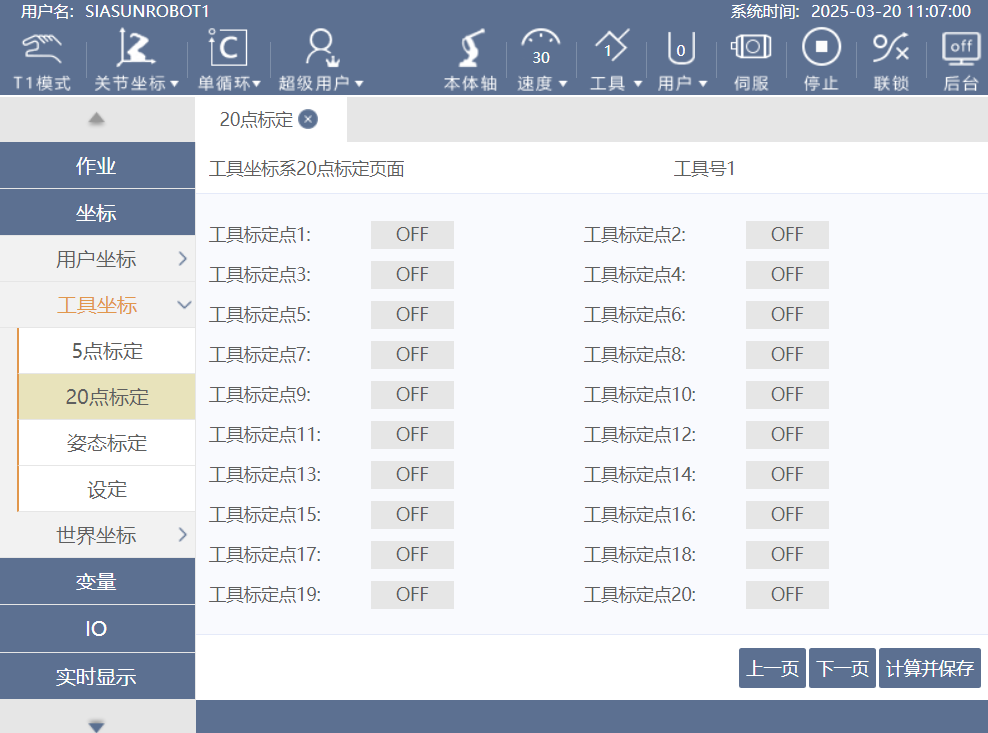

图 2‑20 20点工具标定界面

* 1. 标定工具需要，选择标定针与选择一个固定的参考点（针尖）。如图2\-20所示，工具标定针安装到机器人上，标定参考针固定到机器人外，保证标定的时候位置固定。

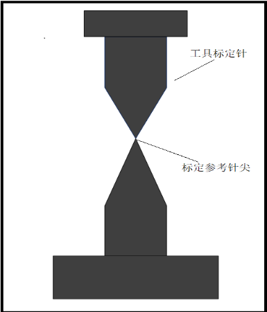

图 2‑21标定工具

* 1. 依次以20个不同姿态对准参考点，并点击OFF，当OFF变成ON后，此点即被成功标定，点击ON，当ON变OFF后，此点即被取消。工具坐标一共8个。编号显示在界面右上方的工具号上。
	2. 每个点的选择，20个点差异越大越好。建议20个点的选择，使用直角坐标系进行标定，第1点工具针姿态垂直向下，第2\-4点走Rx\+每30°选一个点，回到垂直，第5\-7点走Rx\-每30°选一个点，回到垂直，第8\-10点走Ry\+每30°选一个点，回到垂直，第11\-13点走Ry\-每30°选一个点，回到垂直，第14\-17点走Rz\+每40°选一个点，回到垂直，第18\-20点走Rz\-每50°选一个点。

图 2‑22 1\-7点标定示意图

* 1. 保存标定结果，松开使能按键，点击【计算并保存】会弹出【是否修改机器人零位并计算此工具TCP值】，点击确认，会提示标定成功，同时零点更新完成。

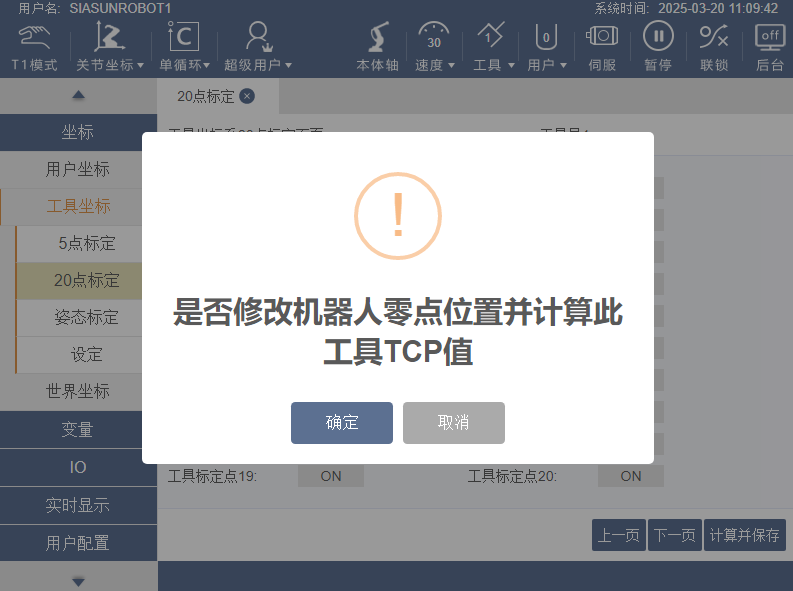

图 2‑23修正零位与TCP确认界面

* 1. 标定的结果，显示在对应文件号的设定界面，为Px、Py、Pz的值。

| **注意**1. **标定点不完整，点击【计算并保存】会弹出【标定数据不完整，无法计算数据或保存】，请补充没有标定的点或重新标定。** 2. **点击取消，标定结果不保存，零位不更新，标定的位置与状态不变。** 3. **20点标定会改变零位，保存后会对零位进行更新，从而影响原程序位置点。保存前请确认。** 4. **使用20点标定，之前标定的文件号中点位数据清空，由ON变成OFF。** 5. **标定点状态保存，在页面关闭后，重新打开，状态为关闭前的状态。标定并计算结果完成后，ON也不变成OFF。** |
| --- |

**5点法进行标定：**

5点法可以确定工具中心点，即工具坐标原点相对于法兰中心点的x，y，z值。使用手动运动机器人，使机器人工具中心点以5种不同的姿态指向同一点。系统将自动计算TCP位置值。请在示教时，尽量使5个不同方向的姿态来接近目标点。

**注意：**

**目标点要高于直角坐标原点（一轴与二轴交叉的点）。**

5点法标定之后 ，只能确定工具的TCP点（x，y，z），此时工具的姿态值(Rx，Ry，Rz)是默认的（0,0,0）。

|  |
| --- |

图 2‑24通过5点法进行标定工具TCP

**5点法标定步骤：**

1. 点击主菜单中的【坐标】\-【工具坐标】\-【标定】，进入工具坐标系标定界面。通过翻页键可以选择需要标定的工具号。

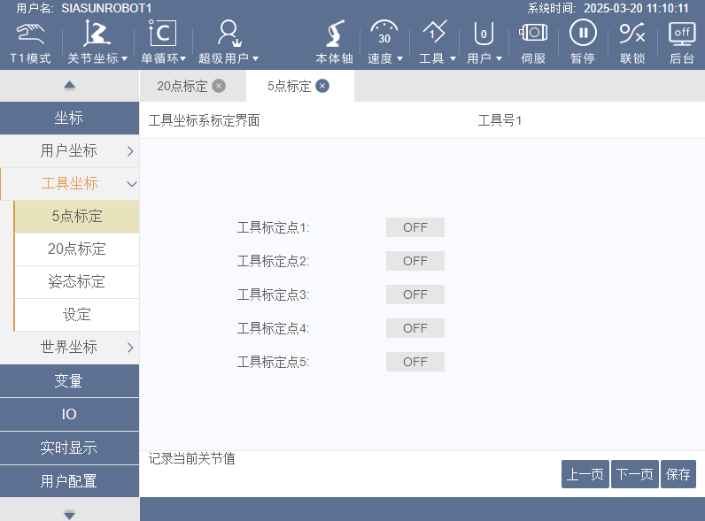

图 2‑25工具坐标系标定界面

1. 依次以五个不同姿态接近同一个目标点，并点击OFF，当OFF变成ON后，此点即被成功标定，按保存结束标定。按下一页可以进行另一工具坐标的标定，工具坐标一共8个。编号显示在界面右上方的工具号上。
2. 标定的结果，显示在对应文件号的设定界面，为Px、Py、Pz的值。

**工具姿态标定：**

先使用5点法标定工具TCP，然后标定姿态。标定工具姿态在空间的任意一点，再沿着X轴平行方向标定工具的X方向，最后在工具Z轴正方向XZ平面上的一点标定工具Z正方向。

|  |
| --- |

图 2‑26标定用具坐标系方向

**姿态标定步骤：**

| **注意：****如果标定好的坐标号之前有标定过工具坐标，那么这个工具坐标的姿态值有可能不****为（0,0,0），请到工具设定中，重新改为（0,0,0），之后再进行重新标定姿态。** |
| --- |

1. 点击主菜单上的【坐标】\-【工具坐标】\-【标定】。按上、下一页选择希望的工具号。

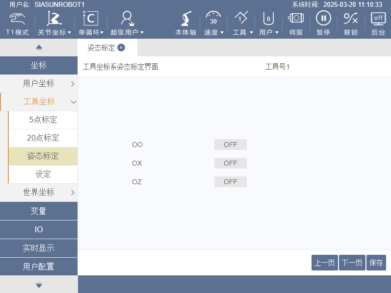

图 2‑27工具坐标系姿态标定界面

1. 首先标定TCP在空间上的选定点，再标定工具坐标X轴正方向上的一点和Z轴正方向XZ平面上的一点。在三个点处,点击OFF/ON，进行标定。
2. 标定结束后，按保存。
3. 标定的结果，显示在对应文件号的设定界面，为Rx、Ry、Rz的值。

| **注意：****同一坐标的TCP和姿态需要在同一个工具号下进行标定。** |
| --- |

**工具坐标系的设定步骤：**

1. 点击主菜单【坐标】\-【工具坐标】\-【设定】。显示工具坐标系设置界面，按上、下一页选择希望设置的工具号。

. 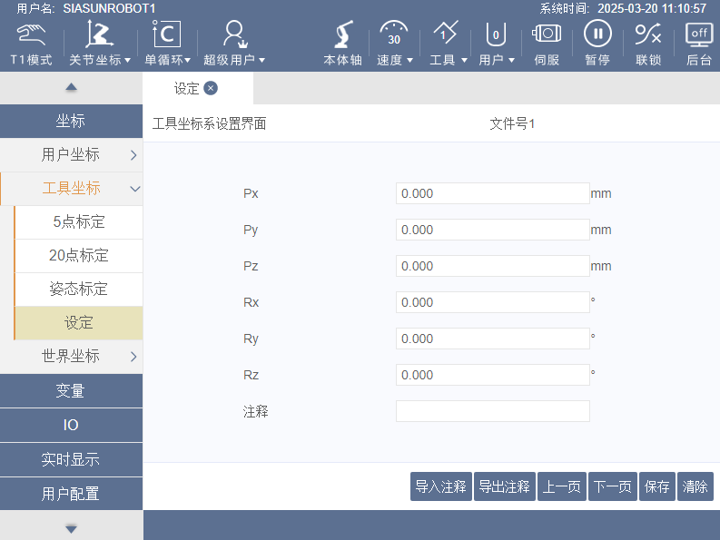

图 2‑28工具坐标系的设置界面

1. 依次填入X、Y、Z、Rx、Ry、Rz值，完成后点击保存。

注释：可以添加注释。

导入注释：可以把U盘中的注释内容导入到该页面中。

导出注释：可以把该页面中的注释内容导出到U盘中。

清除：可将当前文件号的数据清除。

**作业中工具坐标系的选择：**

作业中可以选择工具坐标系号，选择方法为通过指令选择。**SET TF\#\<坐标系号\>**为工具坐标系选择指令。

**SET TF\#\<坐标系号\>**指令可以出现在作业的顶端，也可以出现在作业的中间和末端。该指令执行后，系统的当前工具坐标系号则被改变，工具坐标系号的改变不仅对自动执行的作业有影响，示教模式下的操作也要使用新设定的坐标系进行示教。

| **注意：*** + 1. **如果客户使用1个工具坐标系，作业中可以没有SET TF\#\<坐标系号\>指令；如果客户使用多个工具坐标系，为了避免工具坐标系的混乱，建议每个作业的顶端增加SET TF指令，使得每个作业的每条指令使用的工具坐标系都在作业的执行过程中得到明确，避免因当前工具坐标系号不对，造成执行作业时的机器人轨迹错误。** 		2. **使用多个工具坐标系的情况下，添加和插入指令前需要确定当前工具坐标系号为客户想要 使用的工具坐标系号。** 		3. **改变作业中的工具坐标系号（SET TF\#后的号），需要确认是否该指令后所有的点都使用该工具坐标系文件，并对该指令后使用新工具坐标系号的所有点使用正向运动进行验证。具体的验证方法为：确认或更改当前工具坐标系号为新设定的工具坐标系号，再使用正向运动键验证SET TF\#指令后的示教点。** |
| --- |

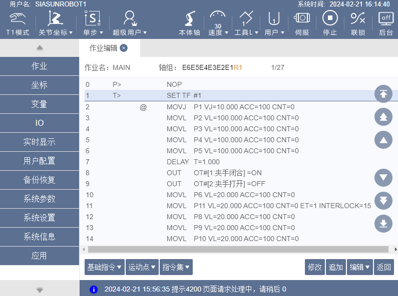

图 2‑29工具坐标系在程序中变更

### 设定用户坐标系

用户坐标系是用户对每个作业空间进行标定的一种笛卡尔坐标系。其中用户坐标系0默认为世界坐标系且不可修改。

用户坐标系是通过相对于机器人直角坐标系原点的位置（x，y，z）和X轴，Y轴，Z轴的旋转角(Rx,Ry,Rz)来定义。用户坐标系数量为0\-8（可扩展至128），可根据情况进行切换。

| **注意：****在关节坐标系下使用轴运动键单轴运动轴时，轴运动关节值不会随着工具坐标系或用户坐标系的变化而变化，但程序自动运行或手动正向运动时，机器人的位置和姿态都会受到工具和用户坐标系的影响。** |
| --- |

|  |
| --- |

图 2‑30用户坐标系

**3点法示教：**

对空间的原点，X轴方向的点、XY平面上的点进行3点进行示教。

|  |
| --- |

图 2‑31 3点法示教用户坐标系

**直接设置**

在设置界面直接输入相对于直角坐标系下的用户坐标系的位置与姿态。

**用户坐标系标定步骤：**

1. 点击主菜单【坐标】\-【用户坐标】\-【标定】。打开用户坐标系标定界面。通过上、下一页来选择用户坐标的编号。

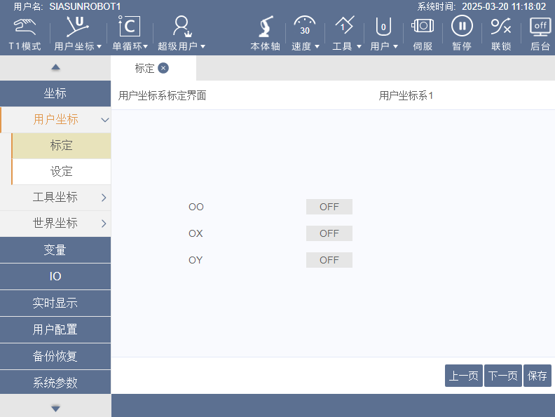

图 2‑32用户坐标系标定界面

1. 移动机器人到用户坐标的原点、X轴上的点，XY平面上的点，依次点击位置对应的OFF，记录当前位置，3点都显示为ON后，点击保存，标定完成。

**用户坐标系设定步骤：**

1. 点击主菜单【坐标】\-【用户坐标】\-【设定】。打开用户坐标系设置界面。按上、下一页选择用户坐标系编号。

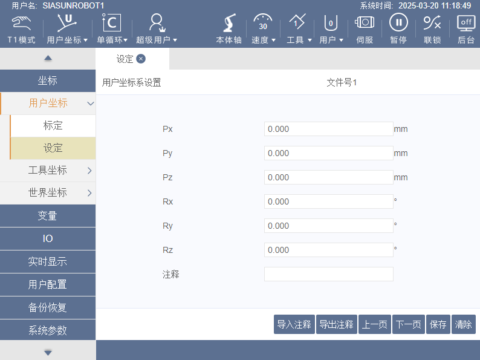

图 2‑33用户坐标系设置界面

1. 在对应的位置填入正确的参数，按保存即可设定好用户坐标系。同时标定好的用户坐标系也可以在这里进行查看。

注释：可以添加注释。

导入注释：可以把U盘中的注释内容导入到该页面中。

导出注释：可以把该页面中的注释内容导出到U盘中。

**作业中的用户坐标系号选择：**

作业中可以选择用户坐标系号，选择方法为通过指令选择。SET UF\#\<坐标系号\>为用户坐标系选择指令。

SET UF\#\<坐标系号\>指令可以出现在作业的顶端，也可以出现在作业的中间和末端。

该指令执行后，系统的当前用户坐标系号则被改变，用户坐标系号的改变不仅对自动执行的作业有影响，示教模式下的轴操作或指令的记录也使用的是新设定的用户坐标系。

| **注意：**1. **如果客户使用1个用户坐标系，作业中可以没有SET UF\#\<坐标系号\>指令；如果客户使用多个用户坐标系，为了避免用户坐标系的混乱，建议每个作业的顶端增加SET UF指令使得每个作业的每条指令使用的用户坐标系都在作业的执行过程中得到明确，避免因当前用户坐标系号不对造成执行作业时的机器人轨迹错误。** 2. **使用多个用户坐标系的情况下，添加和插入指令前需要确定当前用户坐标系号为客户想要使用的用户坐标系号。** 3. **改变作业中的用户坐标系号（SET UF\#后的号），需要确认是否该指令后所有的点都使用该用户坐标系文件，并对该指令后使用新用户坐标系号的所有点使用正向运动进行验证。具体的验证方法为：确认或更改当前用户坐标系号为新设定的用户坐标系号，再使用正向运动键验证SET UF\#指令后的示教点。** |
| --- |

### 设定外部工具坐标系

通常情况下，都是在机器人法兰盘上安装夹具，然后对工件进行取放等一些操作。但有些特殊情况，需要将工具安装到机器人外部，机器人夹取工件到外部工具上进行加工。例如打磨，一般砂带机都安装在地面上，与机器人分开，机器人夹取工件到砂带上进行打磨。

**实现外部工具标定需要做一下几项：**

1. 对机器人进行工具坐标系标定，5点法标定（详见2\.2\.2设定工具坐标系说明）。
2. 需要已标定的工具坐标系TCP点去标定外部工具坐标系。
3. 以机器人TCP点对上外部TCP标定外部工具的00点。
4. 外部工具标定。

**外部工具坐标系标定步骤：**

与用户标定方式相同，使用相同标定界面，用户坐标标定界面与外部TCP标定界面都使用用户坐标系标定界面。

按照路径【坐标】\-【用户坐标】\-【标定】可以打开外部工具标定界面。

可通过下一页、上一页进行切换。

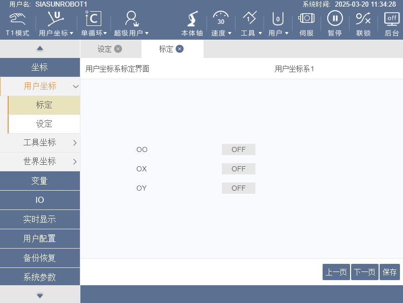

图 2‑34 外部工具标定页面

**外部工具系设定步骤：**

按照路径【坐标】\-【用户坐标】\-【设定】可以打开外部工具设定界面。

外部工具设定页面直接输入外部工具数值设定。

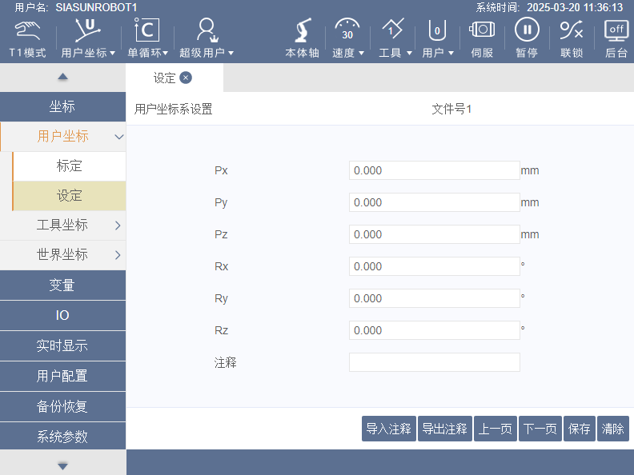

图 2‑35 外部工具设定页面

标定完成后，如果使用外部TCP，需要通过状态栏点击切换外部坐标系。切换成外部工具坐标系后，状态栏的图标由用户会变成用户E，切换外部工具坐标系可以在这个对话框进行选择。这个窗口可以对用户坐标系与外部TCP坐标系切换。

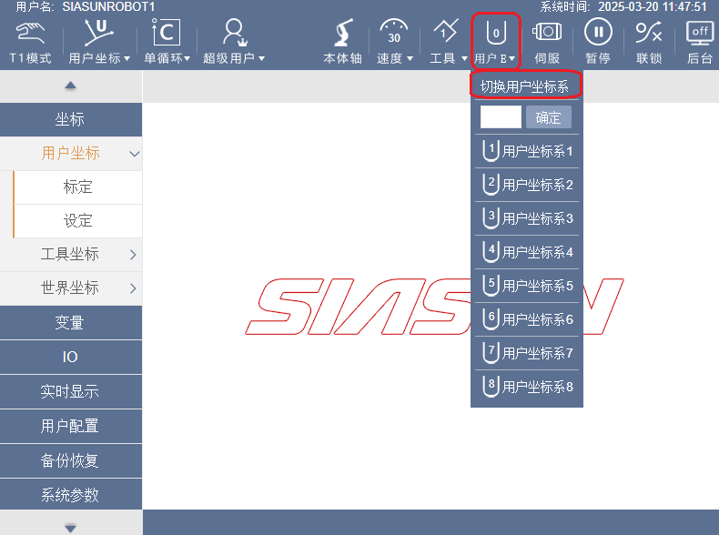

图 2‑36 外部工具切换画面

**示教操作机器人：**

需要把坐标系切换到用户坐标系。

切换到外部工具时：按X/Y/Z键，机器人本体TCP按照外部TCP的X/Y/Z方向运动；

按Rx/Ry/Rz键，机器人本体TCP绕着外部TCP的原点旋转；

**外部TCP所用指令说明：**

指令格式：

MOVL P2 VL\=1000 ACC\=100 CNT\=0 ET

P2：位置变量号，保存记录目标点位置信息。

VL：当前轨迹的运行速度。

ACC：当前轨迹的加速度百分比。

CNT：当前轨迹的终点与下一点是否连续。

ET:有ET代表外部工具有效，根据位置信息里面的用户坐标系号而确认的所使用哪个外部工具号。

**机器人自动运行：**

自动运行时按照当前P里的用户坐标系号使用带ET的运动指令进行规划。

### 设定世界坐标系

**世界坐标系设定步骤：**

按照路径【坐标】\-【世界坐标】\-【设定】可以打开世界坐标设定界面。

世界坐标设定页面直接输入世界坐标数值设定。设定完世界坐标系后，机器人在直角坐标系下会已新设定的世界坐标系方向移动。

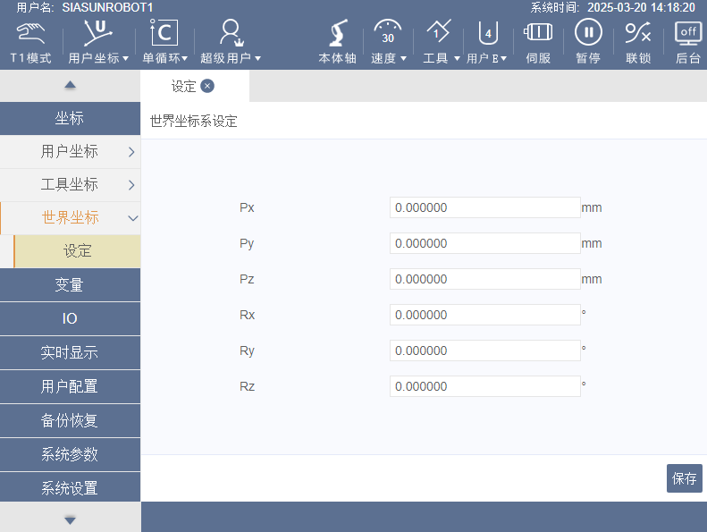

图 2‑37世界坐标设定页面

## 位置偏移

可以通过该界面对全局位置变量PR的运行位置进行偏移。支持本地/运行/执行模式下机器人停止时修改。

点击主菜单【变量】\-【位置偏移】，进入位置偏移配置界面，可配置28个位置偏移文件。

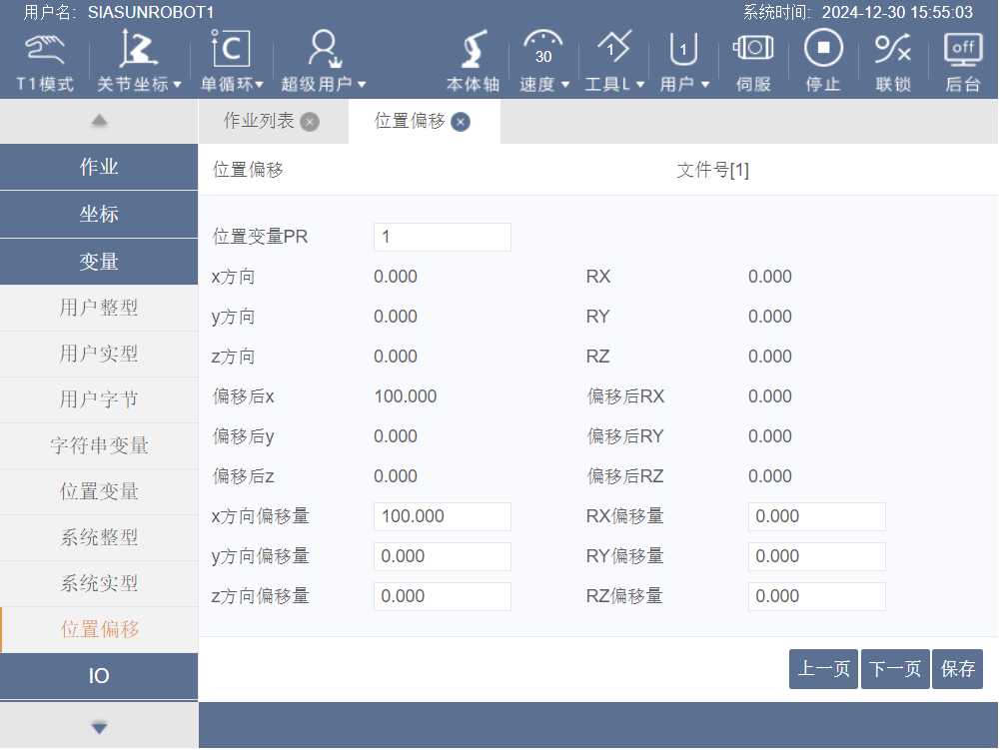

图 2‑38位置偏移界面

位置变量PR：如图所示，填入1，即对应【变量】—【位置变量】中的全局位置变量PR1；位置变量PR范围：0—5630；

x/y/z方向和RX/RY/RZ：不允许修改，为位置变量的值，这里面只作为显示。分别对应全局位置变量PR1中的X/Y/Z和Rx/Ry/Rz（若全局位置变量发生变化，需要关闭再打开该页面才可刷新页面中的数据）；

偏移后x/y/z和偏移后RX/RY/RZ：如图所示，分别对应全局位置变量PR1中的X/Y/Z和Rx/Ry/Rz加上最后的各方向偏移量后的值（同上，若全局位置变量发生变化，需要关闭再打开该页面才可刷新页面中的数据）；

x/y/z方向偏移量和RX/RY/RZ偏移量：输入偏移量并保存后，运动至页面中的全局位置变量时，会实际运动到偏移后的位置。x/y/z方向偏移量范围：\-10000\.0\-10000\.0；RX/RY/RZ偏移量范围：\-360\.0\-360\.0；

例：位置偏移界面不输入值，运行作业时，机器人会运行到位置变量PR1的实际值。位置偏移界面输入值X\=100，运行作业时，机器人会运行位置变量PR1的基础上X方向加100。

**注意：**

1. **点击保存后P变量x/y/z方向的实时显示不会立刻刷新为最新值，需要关闭界面后重新进入当前界面或者切换一下其他全局位置变量PR后再切换回当前变量后才会刷新；**
2. **位置偏移界面在机器人运动中无法修改，需要机器人暂停状态才能进行界面参数修改与保存。**

**执行模式和远程模式下均可打开该界面并操作，需要超级用户权限。**

## 设置原点

原点是机器人在程序中经常使用的固定位置。原点通常是在外围设备的干涉区外，有一定运动空间的安全位置。

|  |
| --- |

图 2‑39原点位置

当机器人位于原点位置时，会输出一个信号给外围设备，这个信号可以在远程IO中配置。

### 原位设定与标定

**原为设定与标定步骤：**

1. 点击主菜单【用户配置】\-【原位记录】\-【原位】，进入原位设定与标定界面，最多可以设置8个原位。

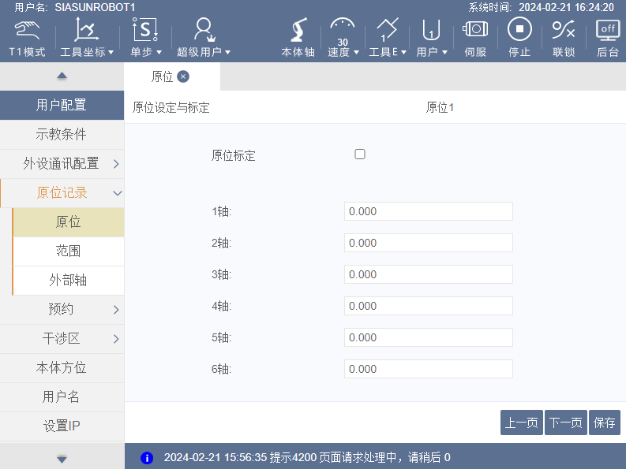

当前原位序号

直接设定

标定

图 2‑40原位设定与标定界面

1. 点击原位标定后的确定方框，即将机器人当前位置的各轴关节值设置成原位。
2. 也可以通过在界面直接输入各轴关节值，来设定原点位置。
3. 按保存键保存。
4. 通过上一页/下一页，选择不同的原位序号。

### 原位范围

1. 点击主菜单【用户配置】\-【原位记录】\-【范围】，进入原点位置有效范围设置页面。

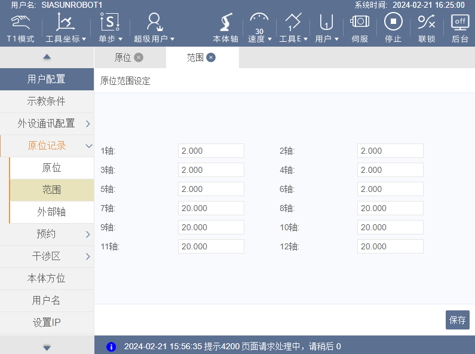

图 2‑41原位设定与标定界面

1. 在对应轴的输入框后面可设置各轴原点有效范围的值，原位有限范围的阈值为0\-50°，例：若原位1的2轴原点值为20°，2轴范围设为2°时，则机器人2轴处于18°\-22°范围内时，2轴即在原点范围内。

### 外部轴原位记录使能配置

1. 点击主菜单【用户配置】\-【原位记录】\-【外部轴】，进入外部轴原位使能界面。

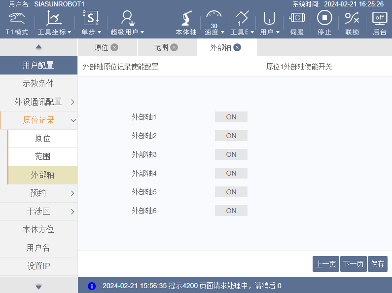

图 2‑42外部轴原位记录使能配置界面

1. 当系统配有外部轴时，后面选择ON/OFF。
2. ON为不屏蔽该外部轴，原位检测该外部轴位置。
3. OFF为屏蔽该外部轴，原位不检测该外部轴位置。该轴在任何位置不影响原位判断。

## 各轴软限位

各轴的软限位，是控制系统通过软件，来限制机器人各轴的运动范围的一种功能。机器人软限位默认值出厂已经设置好，如果需要改变，则可以通过此功能进行变更。

| **注释：****机器人软限位设置，只能将机器人的运动范围比默认的小，不能扩大机器人的运动范围。** |
| --- |

**最大值：**

表示机器人轴运动范围的最大值。

**最小值：**

表示机器人轴运动范围的最小值。

**进入软限位界面步骤：**

* 1. 点击主菜单【系统参数】\-【控制参数】\-【软限位】，进入软限位界面。

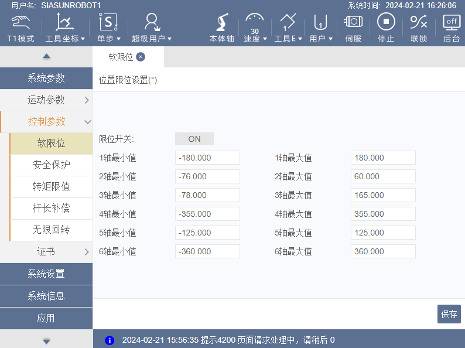

图 2‑43软限位界面

* 1. 输入希望的各轴最大、最小值。
	2. 点击保存并重启机器人。

| **警告****要使软限位设定值生效，务必重新启动机器人，以免造成意外的伤害和损失。** |
| --- |

**限位开关：**

机器人刚到现场，或者调试时，容易使机器人的轴超出软件限位而报警，导致机器人无法运动。所以要释放开软限位。

**使能或释放软限位步骤：**

* 1. 点击主菜单【系统参数】\-【控制参数】\-【软限位】，进入限位开关界面。

图 2‑44限位开关界面

* 1. 点击限位开关ON\\OFF，即可使能或释放软限位。

| **注释：****使能是使软限位有效，释放是使软限位无效。** |
| --- |

| **警告：****释放软限位后，机器人只能向限位内运动，操作者向限位外运动时报警，必须谨慎、慢速操作机器人，以免发生碰撞，同时操作结束后，要重新使软限位有效。** |
| --- |

## 无限回转

无限回转功能是指在机器人机械结构允许的情况下，支持本体轴（目前只支持四轴或六轴，具体可支持轴号由机器人型号决定）或外部轴（变位机类型），向一个方向持续性的运转。如需该功能请确认配置清单，当前支持无限回转变位机品牌松下、清能RC/RD、禾川X6/Y7。

目前支持无限回转的机器人型号（型号后边的数字代表可开启无限回转对应的轴）：

SR10AL（第6轴）、SR25A\-12\-2\.01\-N3(第6轴)、SR25A\-12\-2\.01\-N4(第6轴)、SR25A\-20\-1\.80\-N2(第6轴)、SR25A\-20\-1\.80\-N3(第6轴)、SR25A\-25\-1\.80\-N2(第6轴)、SR25A\-35\-1\.80\-N2(第6轴)、SR50A\-50\-2\.15\-N2(第6轴)、SR50\-50\-2\.15\-M4(第6轴)、SR50A\-70\-2\.15\-N2(第6轴)、SR50\-80\-2\.15\-M4(第6轴)、SP120A\-120\-2\.50\-N4（第4轴）、SP120\-120\-2\.50\-H7（第4轴）、SP160\-160\-3\.05\-N3（第4轴）、SR210A\-210\-2\.65\-H3（第4轴和第6轴）、SR210A\-210\-2\.65\-H7（第4轴和第6轴）、SR210A\-210\-2\.65\-M2（第4轴和第6轴）、SR210A\-210\-3\.05\-H7\-DW（第4轴和第6轴）。

**无限回转配置步骤：**

1. 点击主菜单【系统参数】\-【控制参数】\-【无限回转】，进入无限回转开关配置界面。

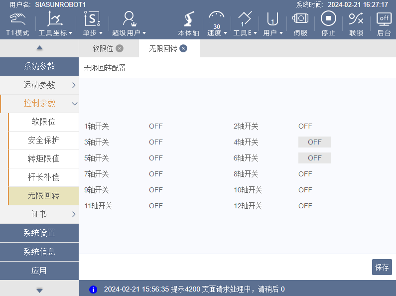

图2‑45无限回转开关配置界面

1. 选择开启无限回转的轴，将后面的开关置on，点击【保存】按钮。

**无限回转说明：**

1. OFF表示未开启无限回转，ON表示开启无限回转。每个轴根据配置确定是否开启无限回转。目前对于本体轴，部分型号的四轴或六轴支持无限回转，其他轴不支持修改。外部轴配置为变位机类型支持无限回转，其他外部轴不支持。
2. 开启无限回转功能，例如将6轴开关由off置on，配置完成后，点击保存按钮，此时会提示是否保存配置，点击确认。之后等待提示重启机器人的提示信息出现后，重启机器人，配置才会生效。
3. 关闭无限回转功能时，例如将6轴由ON置OFF，由于机器人可能已经转过很多圈，保存配置时会清除码盘多圈值，该操作提示是否已经将6轴零位标签对齐（确认/取消），按下确认后，再选择退出，此时将清除多圈码盘值之后等待提示重启机器人的提示信息出现后，重启机器人，配置才会生效。

| **注意：**1. **打开或关闭无限回转开关，退出配置界面并保存后，务必等待界面出现重启的提示信息后，再重新启动机器人，这个过程需要几秒钟时间，否则改完不出现提示信息就重启机器人会导致驱动器参数更改不成功，对后续的运动过程产生影响。** 2. **将要关闭某轴的无限回转功能之前，必须手动将该轴的关节值转动至零位标签对齐，否则操作不生效。更改完成同样等待重启机器人的提示信息出现后，需要重新启动机器人，配置才能生效。** 3. **关闭无限回转功能之后，由于对应的轴多圈码盘已经清除，之前示教的作业运动位置有可能发生改变，在自动运行前需要进行重新确认。** |
| --- |

**关闭无限回转的正确步骤：**

1. 在示教模式下，选择关节坐标系，手动将想要关闭无限回转功能轴的零位标签对齐。
2. 进入无限回转功能配置界面，将六轴无限回转开关由**ON变OFF**，待界面提示重启机器人后重新启动机器人。

## 干涉区

干涉区功能通常用于机器人打磨、上下料、汽车点焊生产线等应用。干涉区分为空间形状干涉区和轴干涉区，机器人运动过程中判断控制点TCP在干涉区内部或外部，并对外部设备输出高低电平信号。

### 轴干涉区

在机器人、基座、工装轴的正侧和负侧，由各工作区域的最大值和最小值设定。判断各轴当前值是在区域内侧或外侧，并将该状态作为信号输出。如果某轴最大最小数值为0时，此轴不判断。新松机器人共有8个轴干涉区可以设置。

**轴干涉区设置步骤：**

1. 点击主菜单【用户配置】\-【干涉区】\-【轴干涉】，进入轴干涉区配置界面。上、下一页改变干涉区号。

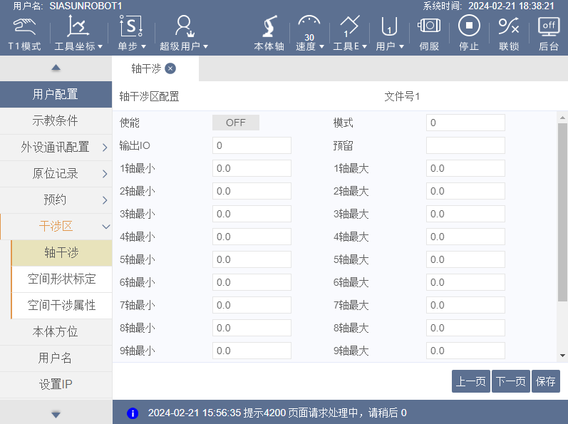

图 2‑46轴干涉区配置界面

1. 在界面里输入各项参数，保存即可完成轴干涉区的配置。

**参数说明：**

**使能：**

通过使能来激活此干涉区号。

**模式：**

轴干涉的模式供分为4种，根据不同的值代表不同的意义；

1：机器人在干涉区内时，对应的输出信号输出ON。

2：机器人在干涉区外时，对应的输出信号输出ON。

3:机器人在干涉区内时，对应的输出信号输出ON，机器人暂停并报警。

4:机器人在干涉区外时，对应的输出信号输出ON，机器人暂停并报警。

**最小值：**

表示机器人关节运动的下限值。

**最大值：**

表示机器人关节运动的上限值。

**输出I\\O:**

表示当机器人在限定条件下，所发出的信号值。

### 空间形状标定

空间干涉区是通过判断机器人末端TCP与干涉区之间的位置关系，对外部设备输出高低电平信号，并根据设置的模式对机器人运动进行相应的控制。目前新松机器人支持立方体干涉区、圆台干涉区、球体干涉区三种形状的干涉区设定。并支持通过若干个独立形状的干涉区进行叠加、并列，从而获得较为复杂的干涉区。最多可设置16个立方体干涉区。

**空间形状干涉区标定步骤：**

点击主菜单【用户配置】\-【干涉区】\-【空间形状标定】，进入空间干涉区配置界面。上、下一页改变干涉区号。

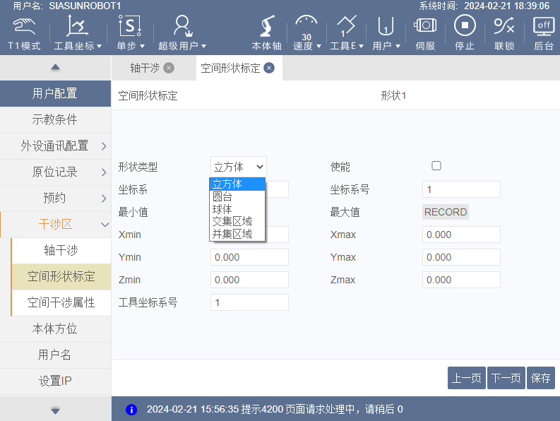

图 2‑47立方体干涉区设置界面

**立方体干涉区标定步骤：**

立方体干涉区通过两点确定立方体三维空间，记录点P1为接近点即最小值，P2是远离点即最大值点，立方体的各边平行于当前坐标的X、Y、Z轴，这样就通过P1点、P2点在空间确定了唯一一个立方体三维空间。

|  |
| --- |

图 2‑48立方体干涉区

1. 点击【用户配置】\-【干涉区】\-【空间形状标定】，进入空间干涉区形状配置界面，形状类型选择立方体。上、下一页选择干涉区号。

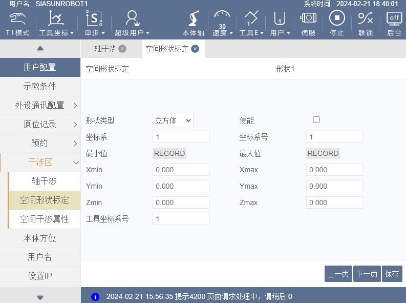

图 2‑49立方体干涉区配置界面

1. 输入各项参数后，点击保存。

**参数说明：**

**坐标系：**

立方体是通过哪个坐标系来确定位置。

1：世界坐标系。

2：用户坐标系。

| **注意：****设置最小值或最大值前请先设置坐标系。** |
| --- |

**使能：**

配置该干涉区是否使能，勾选代表使能（有效），不勾选无效.

**坐标系号：**

坐标系号：形状标定基于的坐标系文件号，坐标系为世界系，设置为1；坐标系为用户系，设置范围1\-8。

| **警告：****如果使用用户坐标系来确定立方体干涉区，那么该用户坐标系号内的值如果发生改变，则立方体干涉区也会发生改变，有可能发生意外的后果，导致严重人身伤害或设备损坏。** |
| --- |

**工具坐标系号：**

用于配置该区域对应的机器人末端tcp点。对应标定干涉区时使用的工具坐标系。

**最小值，最大值：**

用于标定立方体干涉区范围，按下record，记录当前tcp位置,分别显示至Xmin\-Zmax位置。可直接输入立体干涉区范围。

最小值:Xmin，Ymin，Zmin是相对于直角坐标或者用户坐标的位置。

最大值：Xmax，Ymax，Zmax是相对于直角坐标或者用户坐标的位置。

| **注意：****设置最大、最小值之前，请先设置坐标系。** |
| --- |

**圆台干涉区标定步骤：**

1. 点击【用户配置】\-【干涉区】\-【空间形状标定】，进入空间干涉区形状配置界面，形状类型选择圆台。上、下一页选择干涉区号。

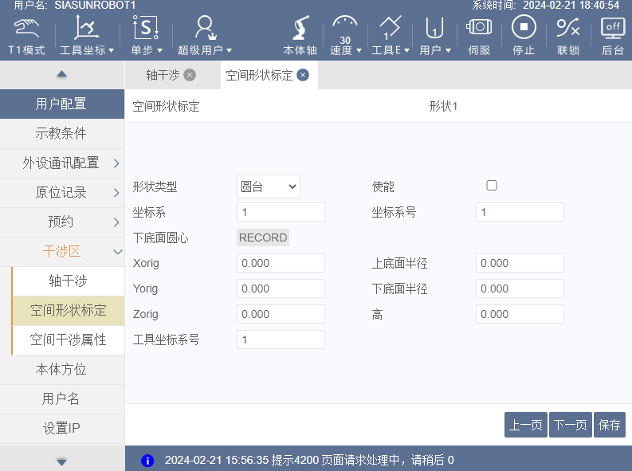

图 2‑50圆台干涉区配置界面

1. 输入各项参数后，点击保存。

|  |
| --- |

图 2‑51圆台干涉区

**参数说明：**

**使能：**

配置该干涉区是否使能，勾选代表使能（有效），不勾选无效。

**坐标系：**

立方体是通过哪个坐标系来确定位置。

1：世界坐标系。

2：用户坐标系。

| **注意：****设置最小值或最大值前请先设置坐标系。** |
| --- |

**坐标系号：**

坐标系号：形状标定基于的坐标系文件号，坐标系为世界系，设置为1；坐标系为用户系，设置范围1\-8。

| **警告：****如果使用用户坐标系来确定立方体干涉区，那么该用户坐标系号内的值如果发生改变，则立方体干涉区也会发生改变，有可能发生意外的后果，导致严重人身伤害或设备损坏。** |
| --- |

**工具坐标系号：**

用于配置该区域对应的机器人末端tcp点。对应标定干涉区时使用的工具坐标系。

**下底面圆心：**

标定圆台形状下底面圆心位置，按下record，记录tcp当前位置。

**Xorig\-Zorig：**

手动输入下底面圆心位置。

**上底面半径：**

设置圆台上底面半径，设置为0，则形状为正立圆锥。

**下底面半径**：

设置圆台下底面半径，设置为0，则形状为倒立圆锥。

**高度：**

设置圆台高度，该项不允许设置为0。

**球体干涉区标定步骤：**

1. 点击【用户配置】\-【干涉区】\-【空间形状标定】，进入空间干涉区形状配置界面，形状类型选择球体。上、下一页选择干涉区号。

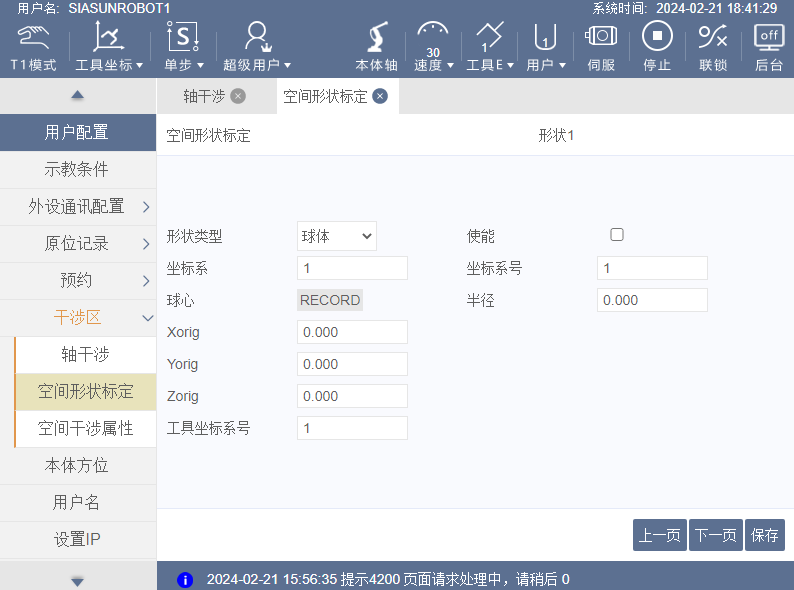

图 2‑52球体干涉区配置界面

1. 输入各项参数后，点击保存。

|  |
| --- |

图 2‑53球体干涉区

**参数说明：**

**使能：**

配置该干涉区是否使能，勾选代表使能（有效），不勾选无效。

**坐标系：**

立方体是通过哪个坐标系来确定位置。

1：世界坐标系。

2：用户坐标系。

| **注意：****设置最小值或最大值前请先设置坐标系。** |
| --- |

**坐标系号：**

坐标系号：形状标定基于的坐标系文件号，坐标系为世界系，设置为1；坐标系为用户系，设置范围1\-8。

| **警告：****如果使用用户坐标系来确定立方体干涉区，那么该用户坐标系号内的值如果发生改变，则立方体干涉区也会发生改变，有可能发生意外的后果，导致严重人身伤害或设备损坏。** |
| --- |

**工具坐标系号：**

用于配置该区域对应的机器人末端tcp点。对应标定干涉区时使用的工具坐标系。

**球心**：

标定球心位置，按下record，记录tcp当前位置。

**Xorig\-Zorig：**

手动输入球心位置。

**半径：**

设置球体半径。

| **警告：**1. **用来确定机器人干涉区的用户坐标系内的值改变也会带来干涉区的改变，使用时请务必注意，以免造成意外的人身伤害或损失。** 2. **当两个机器人或设备因为干涉区互相卡死时，或手动使用机器人进入或离开干涉区前，请将与之互通干涉信号的机器人或外围设备按下急停，以免机器人移动时，干涉信号改变，使等待干涉信号的外围设备或机器人移动，造成人员伤亡。** |
| --- |

除了以上三种空间干涉区外，新松机器人还支持空间干涉区之间的交集与并集。

**交集区域标定步骤：**

1. 点击【用户配置】\-【干涉区】\-【空间形状标定】，进入空间干涉区形状配置界面，形状类型选择交集区域。上、下一页选择干涉区号。

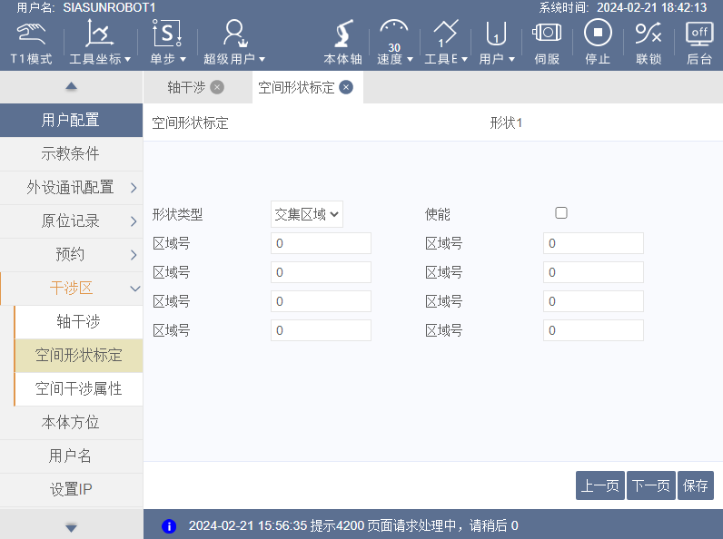

图 2‑54交集干涉区配置界面

1. 输入各项参数后，点击保存。

**参数说明：**

**使能：**

配置该干涉区是否使能，勾选代表使能（有效），不勾选无效。

**区域号：**

配置的形状文件号，最多支持八个形状，在交集界面输入的形状文件号，其对应的形状只能是立方体、圆台或球体三类基本形状。配置完成，该文件号下的形状为8个配置的形状的交集，置0表示没有配置。

举例1:

形状1：配置为立方体

形状2：配置为立方体

形状3：配置为交集，区域号分别设置为1 和 2，则形状3的最终起作用的区域为形状1和形状2的相交部分，并把形状1与形状2里面的使能勾选上，如下图所示：

|  |
| --- |

图2\-55举例1

举例2:

形状4：配置为圆台

形状5：配置为球体

形状6：配置为圆台

形状7：配置为交集，区域号分别设置为4、5、6，则形状7的最终起作用的区域为形状4、形状5和形状6的相交部分，并把形状4、5、6里面的使能勾选上，如图下图所示：

|  |
| --- |

图2\-56举例2

**并集区域标定步骤：**

1. 点击【用户配置】\-【干涉区】\-【空间形状标定】，进入空间干涉区形状配置界面，形状类型选择并集区域。上、下一页选择干涉区号。

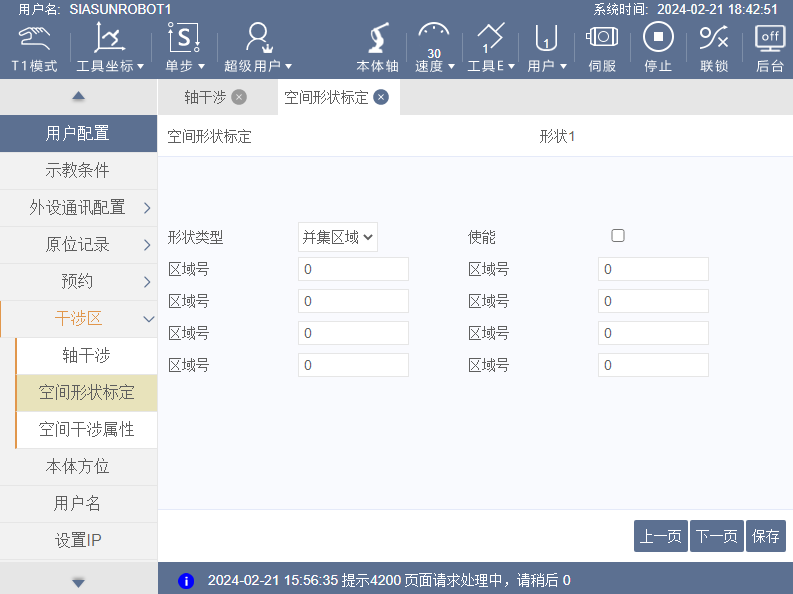

图 2‑57并集干涉区配置界面

1. 输入各项参数后，点击保存。

**参数说明：**

**使能：**

配置该干涉区是否使能，勾选代表使能（有效），不勾选无效。

**区域号：**

配置的形状文件号，最多支持八个形状，在交集界面输入的形状文件号，其对应的形状可以是立方体、圆台、球体三类基本形状以及交集类型的形状。配置完成，该文件号下的形状为8个配置的形状的并集，置0表示没有配置。

举例3:

形状1：配置为立方体

形状2：配置为立方体

形状3：配置为交集，区域号分别设置为1 和 2，则形状3的最终起作用的区域为形状1和形状2的相交部分，并把形状1与形状2里面的使能勾选上，如图2\-60所示；

形状4：配置为圆台

形状5：配置为球体

形状6：配置为圆台

形状7：配置为交集，区域号分别设置为4、5、6，则形状7的最终起作用的区域为形状4、形状5和形状6的相交部分，并把形状4、5、6里面的使能勾选上，如图2\-58所示；

形状8：配置为并集，区域号分别设置为3、5、7，并把形状3、5、7里面的使能勾选上，则形状8的最终区域为3、5、7的全部形状。

|  |
| --- |

图2\-58举例3

### 空间干涉属性

空间干涉属性用于配置该干涉区系统的输出信号、干涉类型、工作模式。

**空间干涉区设置步骤：**

1. 点击【用户配置】\-【干涉区】\-【空间干涉属性】，进入空间干涉区属性配置界面。上、下一页选择干涉区号。

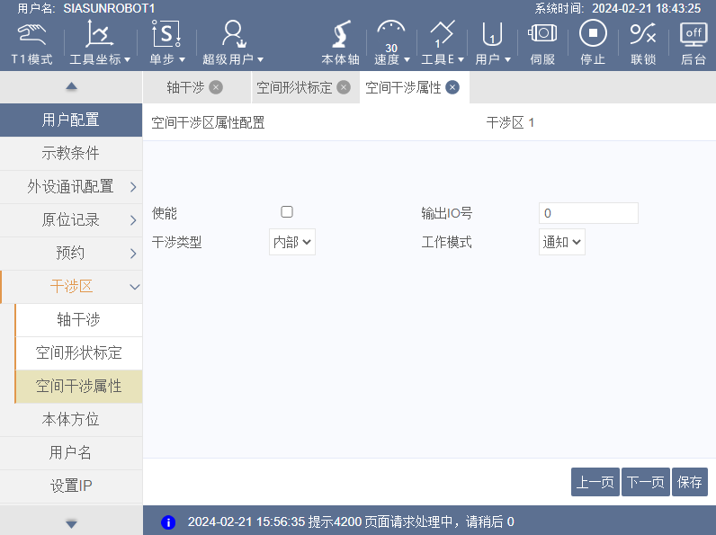

图 2‑59空间干涉区属性配置界面

1. 输入各项参数后，点击保存。

**参数说明：**

**干涉区号：**

范围1\-16，与形状号一一对应，即共支持16个干涉区，干涉区的形状和属性分别在两个界面配置。

**使能：**

配置该干涉区属性是否生效，勾选生效，不勾选无效。只有形状和属性的使能开关同时打开，该干涉区才会生效。

**输出IO**：

配置该干涉区的输出IO号，配合干涉类型，可输出设置IO信号的状态。

**干涉类型：**

可选择内部干涉和外部干涉两种。

如图2\-62所示：

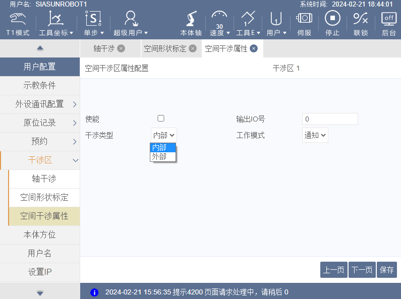

图 2‑60干涉区类型配置界面

**内部：**对应形状的内部为干涉区域。

**外部：**对应形状外部为干涉区域。

**工作模式：**

工作模式支持通知、停止两种。

如图2\-61所示：

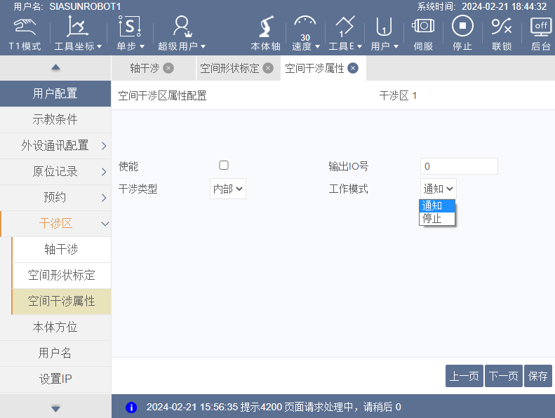

图 2‑61工作模式配置界面

**通知型**：机器人TCP进入干涉区，输出IO置0。

**停止型**：机器人TCP进入干涉区。输出IO置0，同时机器人停止运动，报警2290：禁止进入干涉区。

举例：

形状1：配置为立方体

形状2：配置为立方体

形状3：配置为交集，区域号分别设置为1 和 2，则形状3的最终起作用的区域为形状1和形状2的相交部分，勾选使能项。

干涉区3：勾选使能项，输出io配置为20，干涉区类型内部，工作模式通知

则当机器人tcp进入下图阴影区域，则20号输出IO置0，未进入阴影区域，20号输出IO为1。

| **注意：**1. **必须同时在空间形状标定界面和空间干涉属性界面中配置对应文件号下配置，使能开关同时勾选该干涉区才有效。** 2. **干涉区生效后，机器人会开始监控tcp位置，对输出IO产生相应输出和报警，停止型工作模式，触发暂停后，需要首先关闭干涉区系统的使能，取消报警，才能继续移动机器人。** |
| --- |

## 执行开关

点击主菜单【系统设置】\-【执行开关】进行执行开关界面。ON为激活该开关，OFF为关闭。

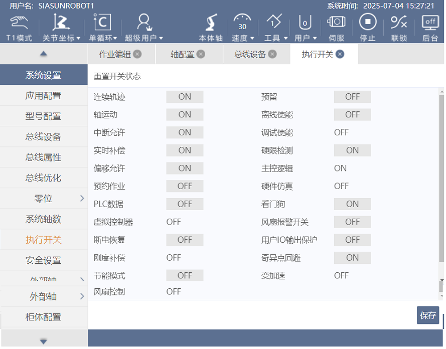

图 2‑62执行开关重置界面

**执行开关说明：**

**连续轨迹：**

当设为ON时，运动指令与运动指令之间为连续运行。

未开连续轨迹，机器人精确到达目标位置点。在目标点前后有减速与加速过程。

开启连续轨迹，机器人不会精确到达目标位置点。在目标位置点附近的快速划过。

|  |
| --- |

图 2‑63连续轨迹

| **注释：****连续轨迹开启后，有一些情况是打断运动连续的。**1. **基础指令部分打断连续的有：**  **END****CALL SUB****CALL \#20\=ON SUB1** **CALL IG\#1 \=00 SUB1****RET****DELAY T \=1\.0****WAIT IN\#30 \=0 T\=1\.000****WAIT OT\#30 \=0 T\=1\.000****WAIT IG\#1 \=00 T\=1\.000****WAIT OG\#1 \=00 T\=1\.000****WAIT IGH\#1 \=00 T\=1\.000****WAIT OGH\#1 \=00 T\=1\.000****SET TF \#1****GOTO L10****MACRO 1****AMENDOFF****子程序****不同类型的运动指令是不能相互连续的。如：****类型1：基本运动指令：MOVJ/MOVL/MOVC****类型2：变位机运动指令：SMOVL/SMOVC****类型3：外部TCP运动指令：MOVL ET****类型4：其他运动指令：MOVPOS****例1：MOVJ 接 OUT 接 SMOVL，不连续。****例2：SMOVC 接OUT 接 SMOVL，连续。****基础指令包含：I/O指令，控制指令1、控制指令2、运动指令，运算指令，计算指令。**1. **基础指令和应用指令之间不能连续。除了WEAVE ON指令。如：**  **例1：基础运动指令之间有应用指令，打断连续。****例2：应用运动指令之间有基础指令，打断连续。****应用指令为配置完各应用所带的指令。如：弧焊指令、点焊指令、码垛指令…** |
| --- |

| **警告：****连续轨迹功能在复合段的轨迹半径会随着机器人运行速度的改变而改变，在首次打开连续轨迹功能之后和再连续轨迹功能打开时更改机器人运行速度这两种情况下，必须重新验证一遍作业，验证过程中需要注意安全，防止机器人的轨迹变化造成碰撞。** |
| --- |

**轴运动：**

设定为OFF时，自动运行时机器人不运动，机器人本体不随运动指令的执行而运动，实时显示当前的关节值随运动指令的执行而变化，系统计算的运动时间与运行时间与机器人本体运行时一致；系统伺服下电后，实时显示关节值将恢复为当前机器人本体的关节值，再次启动示教作业，如果不是从作业的第一行开始执行，屏幕显示的运动时间、运行时间与作业的实际路径规划时间不一致。轴运动禁止与示教模式无关，示教模式下的轴操作、正\\反向运动不受轴运动禁止设置的影响。远程模式下，如果轴运动设为禁止状态，不允许外部启动作业。

| **注意：****轴运动设置发生改变后，必须重新启动控制柜，设置才能生效；如果不重启控制柜，系统的执行过程与设置前一致。** |
| --- |

**离线使能：**

设置为ON时，远程模式将接收上位机PC信号。

**中断允许：**

设置中断功能是否使能。

**调试使能：**

调试使能设置为ON，系统将记录一些调试数据到CF卡；调试使能设置为OFF，系统不记录数据到CF卡。该开关主要针对控制器软件开发人员。系统用户下才允许设置。

**实时补偿：**

设置实时补偿功能是否使能。

**硬限检测：**

当碰到硬限开关时，硬限位报警，伺服下电。如果想伺服上电，必须先释放硬限位开关，因为硬限位一直处于报警状态。但是硬限位报警，伺服不能上电。想要解除这种故障，可以屏蔽硬限位开关检测。进入执行开关界面，移动光标到硬限位上，按确认键切换设置为ON或OFF。ON表示检测硬限位开关，OFF表示不检测硬限位开关。

| **警告：****释放硬限位开关并解除故障后，必须再次进入执行开关，将硬限位设置为ON。以免硬限位开关无效导致机器人碰撞造成的人身伤害或设备损坏。** |
| --- |

**偏移允许：**

设置示教点整体偏移功能是否使能。

**主控逻辑：**

将主控逻辑关闭时，系统上电逻辑即被关闭，系统不能正常上电，并处于危险中。系统用户下才允许设置。

| **警告：****除非专业人士指导，不允许关闭主控逻辑。以免造成意想不到的危险，造成人身伤害或设备损坏。** |
| --- |

**预约作业：**

设置预约功能是否使能。

**硬件仿真：**

对于某些项目应用环境，只有IO模块、RC控制器、示教器、操作面板，没有机器人和控制柜，但需要模拟机器人通讯、上电、启动、暂停、急停等操作，使之与全实物环境下的标准总线型机器人系统执行作业的方式一致，就可通过将“硬件仿真”开关设置为ON来实现。仿真模式下，系统参数、用户参数等配置与全实物环境下的标准机器人配置相同。“硬件仿真”开关设置为OFF，为全实物环境模式。系统用户下才允许设置。

**PLC数据：**

开关为on，实时力矩写入系统整型变量，关节值及姿态值写入系统实型变量。若开关为off，则力矩、关节值以及姿态值没有写入到系统变量中，系统变量保持原有数据，不更新。系统变量数组存储位置对应如下，其中系统整形1\-18为原有的系统变量占用，如果现场用到此功能，作业运行前务必将此开关打开。

使用方法如下： 【执行模式】\-【选择】 \-【下一屏】\-【执行开关 】\-【PLC 数据开关】。

表格2\-12 plc数据说明\-系统变量含义

| 系统变量号 | 数据说明 |
| --- | --- |
| 系统整型1： | 传感器1：堆垛号 |
| 系统整型2： | 传感器1：线体号 |
| 系统整型3： | 传感器1：机器码 |
| 系统整型4： | 传感器1：订单号 |
| 系统整型5： | 系统模式，1：示教 2：执行 |
| 系统整型6： | 启动 |
| 系统整型7： | 报警：伺服下电报警标志位 |
| 系统整型8： | 远程模式标志位 |
| 系统整型9： | 伺服上电标志位 |
| 系统整型10： | 警告：伺服不下电报警标志位 |
| 系统整型11： | 桶送丝机启动信号 |
| 系统整型12： | 当前规划的段标志 |
| 系统整型13： | 1轴关节值的1000倍 |
| 系统整型14： | 2轴关节值的1000倍 |
| 系统整型15： | 3轴关节值的1000倍 |
| 系统整型16： | 4轴关节值的1000倍 |
| 系统整型17： | 5轴关节值的1000倍 |
| 系统整型18： | 6轴关节值的1000倍 |
| 系统整型19： | 预留 |
| 系统整型20： | 预留 |
| 系统整型21： | 1轴实际转矩 |
| 系统整型22： | 2轴实际转矩 |
| 系统整型23： | 3轴实际转矩 |
| 系统整型24： | 4轴实际转矩 |
| 系统整型25： | 5轴实际转矩 |
| 系统整型26： | 6轴实际转矩 |
| 系统整型27： | 7轴实际转矩 |
| 系统整型28： | 8轴实际转矩 |
| 系统整型29： | 9轴实际转矩 |
| 系统整型30： | 10轴实际转矩 |
| 系统整型31： | 11轴实际转矩 |
| 系统整型32： | 12轴实际转矩 |
| 系统实型1： | 世界坐标系位置值P.x |
| 系统实型2： | 世界坐标系位置值P.y |
| 系统实型3： | 世界坐标系位置值P.z |
| 系统实型4： | 世界坐标系姿态值R.x |
| 系统实型5： | 世界坐标系姿态值R.y |
| 系统实型6： | 世界坐标系姿态值R.z |
| 系统实型7： | 用户坐标系位置值P.x |
| 系统实型8： | 用户坐标系位置值P.y |
| 系统实型9： | 用户坐标系位置值P.z |
| 系统实型10： | 用户坐标系姿态值R.x |
| 系统实型11： | 用户坐标系姿态值R.y |
| 系统实型12： | 用户坐标系姿态值R.z |
| 系统实型13： | 机器人系位置值P.x |
| 系统实型14： | 机器人系位置值P.y |
| 系统实型15： | 机器人系位置值P.z |
| 系统实型16： | 机器人系姿态值R.x |
| 系统实型17： | 机器人系姿态值R.y |
| 系统实型18： | 机器人系姿态值R.z |
| 系统实型19： | 1轴关节值 |
| 系统实型20： | 2轴关节值 |
| 系统实型21： | 3轴关节值 |
| 系统实型22： | 4轴关节值 |
| 系统实型23： | 5轴关节值 |
| 系统实型24： | 6轴关节值 |
| 系统实型25： | 7轴关节值 |
| 系统实型26： | 8轴关节值 |
| 系统实型27： | 9轴关节值 |
| 系统实型28： | 10轴关节值 |
| 系统实型29： | 11轴关节值 |
| 系统实型30： | 12轴关节值 |
| 系统实型31： | TCP速度（规划） |
| 系统实型32： | TCP速度（实际） |

**看门狗：**

设置为ON时，主板死机后会进行自检，间隔一段时间后会重启。

**虚拟控制器：**

在没有机器人硬件时，可以在电脑上测试软件功能。主要为开发人员设计的，请操作者谨慎使用。系统用户下才允许设置。

| **警告：****除非专业人士指导，不允许开启虚拟控制器。以免造成意想不到的危险，造成人身伤害或设备损坏。** |
| --- |

**风扇报警开关：**

设置为ON时，风扇出现问题时会在示教盒端显示报警信息。

设置为OFF时，示教盒端不会显示风扇的报警。

**断电恢复：**

断电恢复功能开启后，机器人重启后，会恢复重启前打开的作业与最后一次打开的界面。（如最后打开的界面为作业，只恢复作业。）

**用户IO输出保护：**

该功能开启后，在手动IO输出界面中需在上电使能状态才能输出。若未开启此功能，则无需上电即可输出。

**刚度补偿：**

开关默认是关闭状态,切换开关状态需要系统处于下电状态。

开关打开后，机器人零位设定值会有些许变化，已经示教完的作业实际位置会发生变化。当负载设定更改后,机器人零位设定值也会有些许变化。系统用户下才允许设置。

**奇异点回避：**

将奇异点回避使能开关打开或程序中添加奇异点SAON指令后，奇异点回避功能才会有效。程序执行SAON，该开关同步变成ON。执行SAOFF，该开关变成OFF。

**节能模式：**

设置节能模式是否使能。

**变加速：**

设置变加速功能是否使能。

变加速功能会根据当前臂型、臂展、轨迹状态、速度状态、加速度状态等，由动力学离线计算一个最大加速度。该数值可能相对于缺省加速度向上调整，也可能向下调整，其根据当前实际状态决定。变加速功能动力学计算并未参考当前真实电机电流，而是基于理论动力学模型进行评估，其功能适用于PS等离线仿真过程。变加速功能不能解决诸如油温、时间导致的摩擦不一致，造成实际电机最大出力不同的问题。

变加速功能支持的机型有：SR12A\-12/1\.46\-N4\-XX\-D、SR12A\-12\-1\.46\-N4、SP120A\-120/2\.50\-N4、SR210A\-210\-2\.65\-M2、SR210A\-210\-2\.65\-H3、SR500A\-360/2\.83\-H2、SR270A\-270\-2\.70\-N2、SP180A\-180\-3\.15\-N2。当前机型不支持变加速功能时，执行开关页面无法设置变加速开启。

**注意：外部轴、奇异点规避范围内及使用外部TCP情况暂不支持变加速功能。**

**风扇控制：**

设置风扇是否使能。

该风扇是在电机上，开关开启后机器人在执行模式运行作业会控制风扇旋转，作业暂停后有延迟5s左右控制风扇停止旋转，示教模式下风扇不旋转。（根据选型配置决定是否有风扇）。

## 负载参数

负载参数是设定安装在机器人的负载相关的信息。如质量、质心、转动惯量等参数。输入合适的负载信息可以带来如下效果。

减小机器人抖动，提高机器人动作循环时间。

设定好负载参数，可以更好的配合动力学技术的发挥。如重力补偿、碰撞检测功能。

如果负载信息和实际有过大的偏差，则有可能导致抖动过大，错误报警等结果。

动力学相关功能的使用需要准确设置机器人末端负载的参数，可以手动将负载参数输入。

负载仅是指安装在机器人法兰盘末端的工具，其他位置无法辨识。

**界面说明：**

在主菜单【用户配置】\-【负载参数】菜单下有负载设定、负载辨识、附加负载。

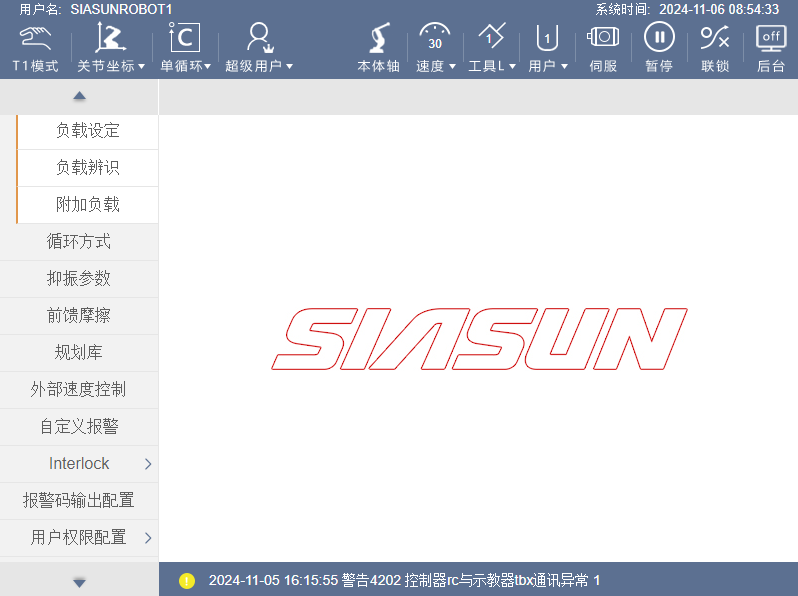

图 2‑64负载设定菜单

**负载设定界面：**

进行负载参数的输入，如果用户已知负载的动力学参数，可以直接在此界面进行设置。

**负载辨识界面**

负载参数未知情况下，用于进行负载辨识以及显示辨识计算的负载参数，并供用户对辨识结果进行舍弃或存储。负载辨识功能是通过机器人执行一段特定的轨迹辨识计算出机器人末端负载的动力学参数，包括质量、质心和惯性张量。

**附加负载设定界面：**

附加负载页面，可输入1轴和3轴的负载质量和质心位置。

**负载设定步骤：**

1. 点击【用户配置】\-【负载参数】\-【负载设定】,进入负载设定配置界面，可设定的负载文件号共16个。

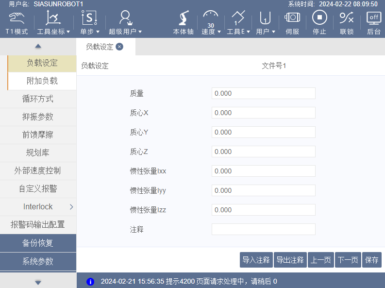

图 2‑65负载设定配置界面

1. 进入负载设定界面，进行负载参数的配置，配置完成后点击**【**保存**】**按钮保存界面配置。界面配置参数含义如下：

**质量（kg）：**

负载的质量；

**质心X（mm）：**

负载质心在机械接口坐标系下的X坐标；

**质心Y（mm）：**

负载质心在机械接口坐标系下的Y坐标；

**质心Z（mm）：**

负载质心在机械接口坐标系下的Z坐标；

**惯性张量Ixx（kg\*mm2）：**

负载基于质心，对齐机械接口坐标系的惯量矩Ixx；

**惯性张量Iyy（kg\*mm2）：**

负载基于质心，对齐机械接口坐标系的惯量矩Iyy；

**惯性张量Izz（kg\*mm2）：**

负载基于质心，对齐机械接口坐标系的惯量矩Izz；

**注释；**

可以填写注释，作为备注信息，在作业中调取负载文件时，可在文件号后显示注释信息；

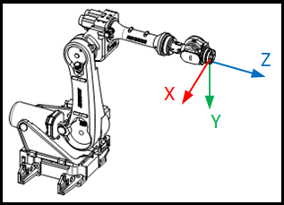

图 2‑66负载设定\-机械接口坐标系方向

| **注意：**1. **这里输入的负载参数是以六轴法兰盘默认的工具坐标系为基准，方向与默认的法兰坐标系保持一致。** 2. **完成负载设定后，保存的当前打开文件号为有效的负载参数。倘若已经配置了文件号1和文件号2两个负载设定，然后翻页至文件号3，但文件号3没有配置，参数都是0，点击保存按钮。此时1号文件和2号文件数据虽能保存，但是真正有效的为文件号3（当前文件号界面）。** |
| --- |

**负载辨识操作步骤:**

1. 点击【用户配置】\-【负载参数】\-【负载辨识】,进入负载辨识配置界面。共支持16个文件。 页面共划分为三个区域，其中**区域1**为负载辨识结果显示区，**区域2**为负载辨识操作按钮区，**区域3**为辨识轨迹显示区。

**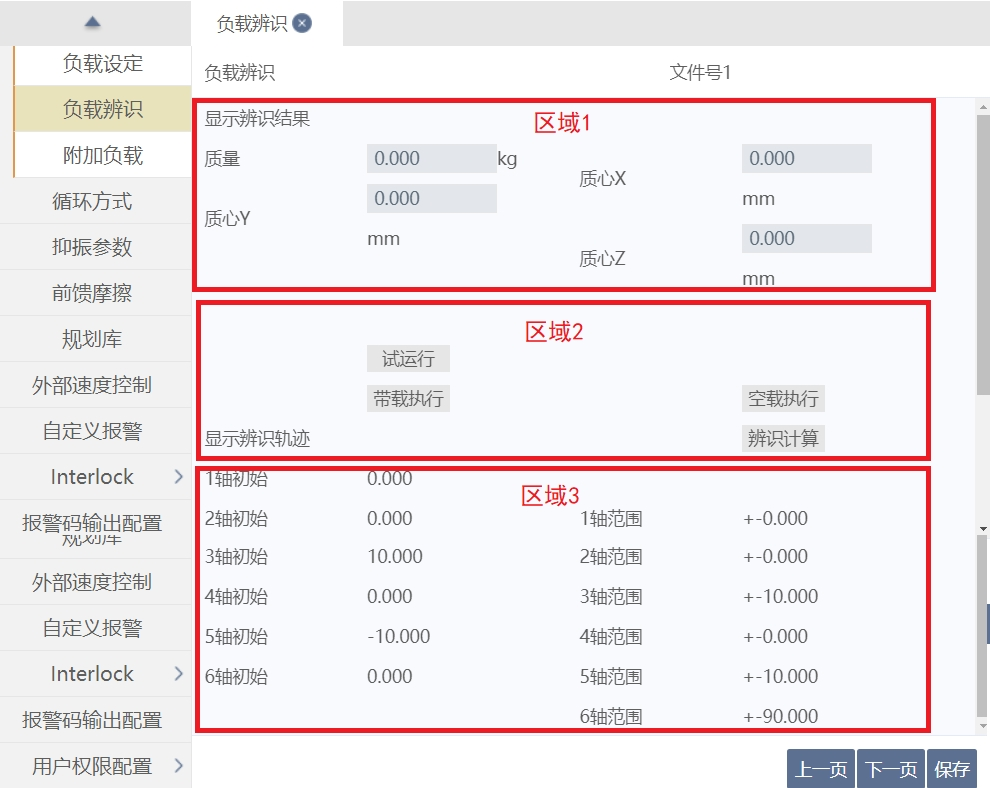**

图 2‑67负载辨识界面

1. 试运行：检测机器人辨识轨迹，示教模式机器人上电后，点击试运行，查看机器人轨迹。在轨迹执行过程中，请全程握紧Deadman。轨迹分为三段，执行完成会有提示。
2. 空载执行：需要机器人不带负载运行，示教模式机器人上电后，按【空载执行】键，弹出提示信息，按【确认】键确认，给出提示“轨迹执行”，开始轨迹执行功能。在轨迹执行过程中，请全程握紧Deadman。轨迹分为三段，执行过程分别给出提示750“轨迹执行完成，轨迹1”，750“轨迹执行完成，轨迹2”，750“轨迹执行完成，轨迹3”。**该步骤需要在系统用户下才能操作该功能，在出厂前已经做完，不需要客户操作。如果1轴、3轴有附加负载，请重新进行该步骤**。
3. 带载执行：示教模式机器人上电后，按【带载执行】键，弹出提示信息，按【确认】键。在轨迹执行过程中，请全程握紧Deadman。轨迹执行完成后，点击【辨识计算】，弹出提示信息，按【确认】键，提示“辨识计算执行”，开始辨识计算功能，计算完成后提示738“辨识计算完成”。
4. 辨识完成后结果显示在区域1，用户选择是否存储即可。可在负载设定中查看对应文件号中的辨识值。

**附加负载:**

可以通过直接输入法，输入机器人本体的1轴和3轴负载。

**附加负载设定步骤：**

1. 点击【用户配置】\-【负载参数】\-【附加负载】,进入本体附加负载配置界面。

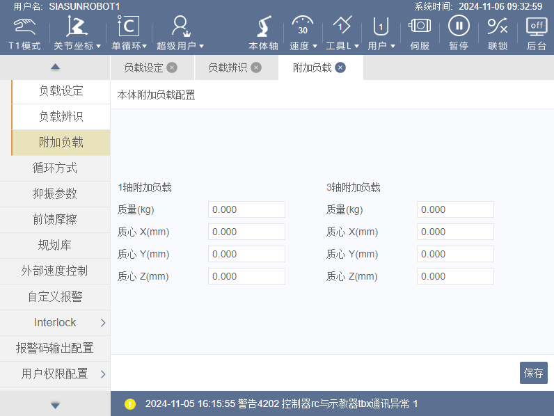

图 2‑68本体附加负载配置界面

1. 可以通过输入数值，确认1轴和3轴负载的质量和质心位置。

注意：

1轴基准坐标系，建立在腰座与J1减速机配合面处，Z为旋转轴，X指向前。

3轴基准坐标系，建立在J3减速机与转接板配合面处，Z为旋转轴，X指向上。

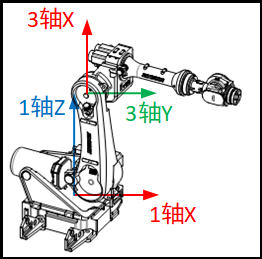

图 2‑69本体附加负载质心方向

## 循环方式

机器人运行方式为三种：自动（AUTO）、单循环（CYCLE）、单步（STEP）。示教模式、执行模式下用户均可通过状态栏的下拉列表或者【循环】实体按键进行各自模式下进行运行方式的选择。也可以通过循环方式设定来选择。

**循环方式设置步骤：**

1. 点击主菜单【用户配置】\-【循环方式】进入循环方式默认值设定界面。

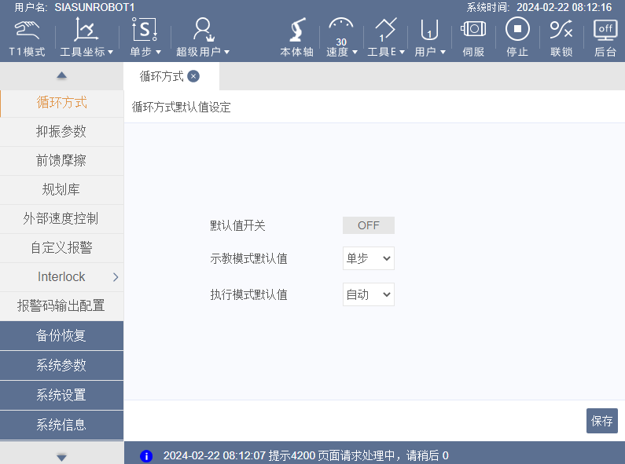

图 2‑70界面循环方式设定界面

1. 设置完参数后，点击【保存】保存。

**参数说明：**

* + - 1. 默认值开关on为有效、off为无效。
			2. 当默认值开关为off时，机器人模式切换后恢复其模式下的前一次运行方式。例如：当前示教模式下前一次运行方式为单步，执行模式下当前运动方式为自动方式，用户由执行模式切换到示教模式后，恢复其示教模式的运行方式为前一次的单步方式。反之，由示教模式切换至执行模式时，恢复执行模式下运行方式为前一次的自动运行方式。
			3. 当默认值开关为on时，机器人在模式切换后恢复当前模式下已经设定的运行方式。

## 碰撞保护

碰撞功能是根据力矩的变化检测机器人在运动过程中是否发生了碰撞，并根据用户选择的处理方式，进行碰撞之后的处理。该功能有效的前提是机器人需要支持动力学功能。

碰撞保护分为：全局灵敏度与自学习功能。

**全局灵敏度配置步骤：**

1. 点击【用户配置】\-【碰撞保护】\-【全局灵敏度】,进入全局灵敏度界面。

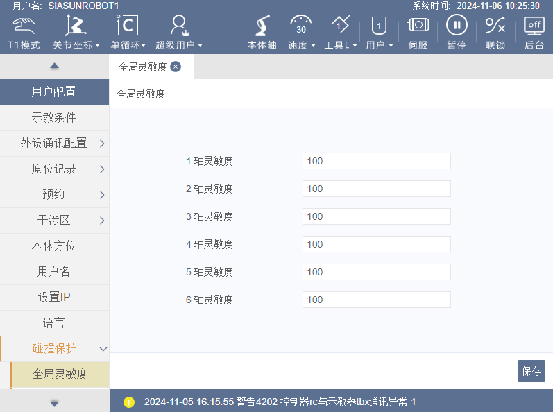

图 2‑71全局灵敏度界面

1. 全局灵敏度配置界面示意图如图所示，灵敏度参数范围为0\-100，100表示检测阈值最高。
2. 灵敏度参数范围为0\-100，100表示检测阈值最高，0为灵敏度最高，100为灵敏度最低。

**自学习：**

该功能一共三个选项，关闭、自学习和检测。

**关闭**：禁用自学习碰撞检测功能，不执行任何碰撞检测相关的数据采集或分析；

**自学习**：运行目标速度下的轨迹，采集数据；

**检测**：运行目标速度下的轨迹时，检测是否发生了碰撞。

**自学习配置步骤：**

1. 点击【用户配置】\-【碰撞保护】\-【自学习】,进入自学习设置界面。

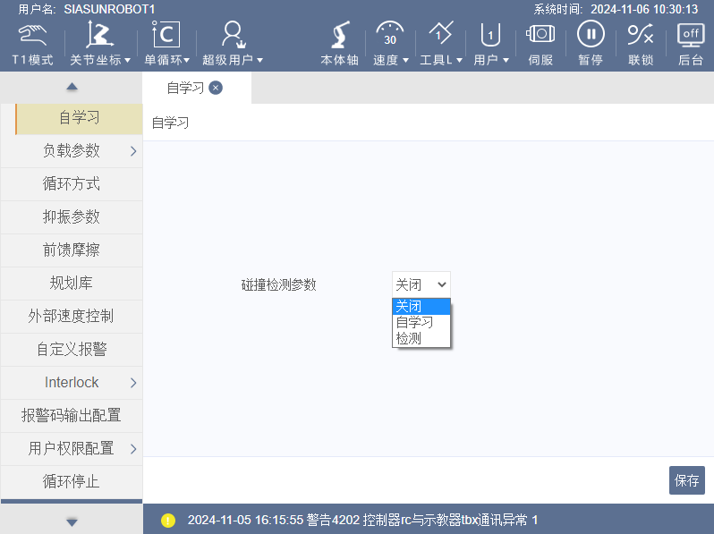

图 2‑72自学习设置界面

1. 当选择【自学习】选项时，界面上会新增【计算】按钮。在轨迹学习完成后，需要点击【计算】按钮来进行下一步操作。学习过程必须在完成轨迹示教和节拍调试之后进行。一旦学习完成，将不允许对速度进行修改或插入、追加、修改任何指令。如果需要进行这些修改，则必须重新开始学习过程。

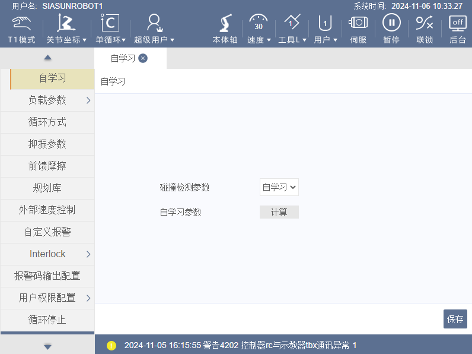

图 2‑73自学习设置界面

1. 若要进行碰撞检测，必须先完成自学习。如果不先进行自学习就执行碰撞检测指令，机器人会报警提示。此外，在碰撞检测过程中所使用的轨迹、速度及其调用关系等必须与自学习过程完全一致。
2. 当选择【检测】选项时，执行自学习完成的作业时，如果遇到碰撞，机器人会报警并停止。

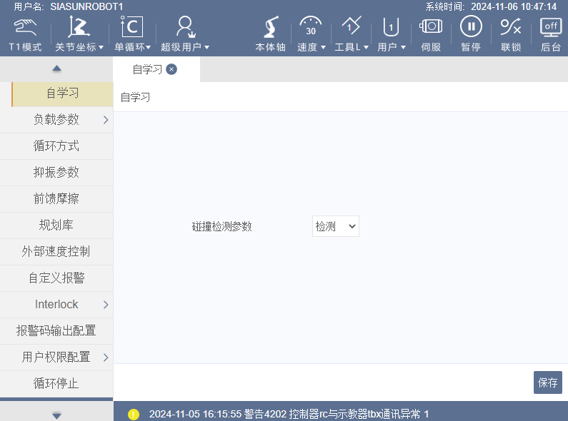

图 2‑74自学习设置界面

通过【基础指令】\-【控制指令1】\-【DYNAMIC】\-【COLLISION】\-【ON】或【OFF】，使用碰撞检测指令。

表格2\-13 碰撞检测指令及参数说明

| COLLISION | 功能 | 自学习碰撞检测指令 |
| --- | --- | --- |
| 格式 | COLLISION NO\= \<参数1\> ADJ\=\<参数2\> |
| 说明 | 参数1：检测区域编号，全局唯一标识符，自动分配，无法更改，范围是1\-32767，为了避免数据量过大，如果检测数据存储超过10M时，不允许再插入该指令；该编号只可查看，不可修改；插入、追加会按顺序查找未使用的检测区域编号 ； |
| 参数2：微调百分比，用于调整检测到碰撞时的电机力矩大小。范围是0\-100，表示在原有基础上增加的力矩百分比。0\-100敏感度由大到小。 |
| 举例 | COLLISION NO\=10 ADJ\=10 |
| COLLISION OFF | 功能 | 自学习碰撞检测关闭指令 |
| 格式 | COLLISION OFF |
| 说明 | 关闭碰撞检测功能 |
| 举例 | COLLISION OFF |

**自学习流程：**

* + - 1. 对需要进行碰撞检测的轨迹作业，插入自学习碰撞检测指令，并根据不同区域的特点设置相应的灵敏度阈值，以实现分段检测。
			2. 进行热机准备。
			3. 在【自学习】菜单中，选择碰撞检测参数为【自学习】，并点击保存。
			4. 执行上述编辑好的作业，至少完成一次自学习过程（如果学习次数较少，在检测过程中可能会遇到误报警的情况。为了提高准确性，建议多次重复学习过程）。
			5. 完成学习后，在【自学习】菜单中点击【计算】按钮以完成整个学习流程。

**注意：在学习过程中，如果触发了暂停、急停或切换模式等操作，可能会导致该检测区域的学习失败（如果是该区域的首次学习，在该区域停止机器人会导致学习失败；如果该区域已经不是第一次学习，在该区域停止机器人则不会导致学习失败）。因此，请尽量避免触发这些操作。**

**检测流程：**

* + - 1. 进行热机准备。
			2. 在【自学习】菜单中，选择碰撞检测参数为【检测】，并点击保存。
			3. 执行上述作业，如果遇到碰撞，机器人会报警并停止。

**注意：**

**在学习过程中，如果触发了暂停、急停或切换模式等操作，将会导致当前检测区域的碰撞检测功能被关闭，直至进入下一个检测区域时才会重新开启。**

## 系统信息

系统信息，存储机器人系统相关信息。方便技术支持和售后服务了解系统当前软件版本等信息，方便对机器人进行软件升级等。

### 系统版本

点击主菜单【系统信息】\-【系统版本】,进入到查看软件版本与机器人型号等信息界面。

**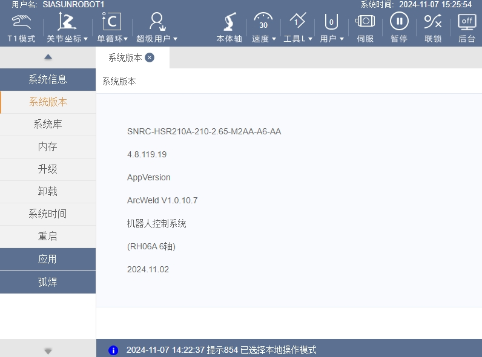**

图 2‑75系统版本界面

### 系统库

点击主菜单【系统信息】\-【系统库】,进入到查看软件版本库界面。

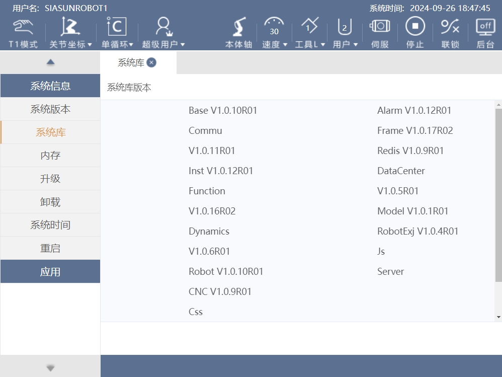

图 2‑76系统库版本界面

### 内存

内存中存储有系统参数、用户参数、作业、变量、外部轴等。

点击主菜单**【**系统信息**】\-【**内存**】**进入内存界面。

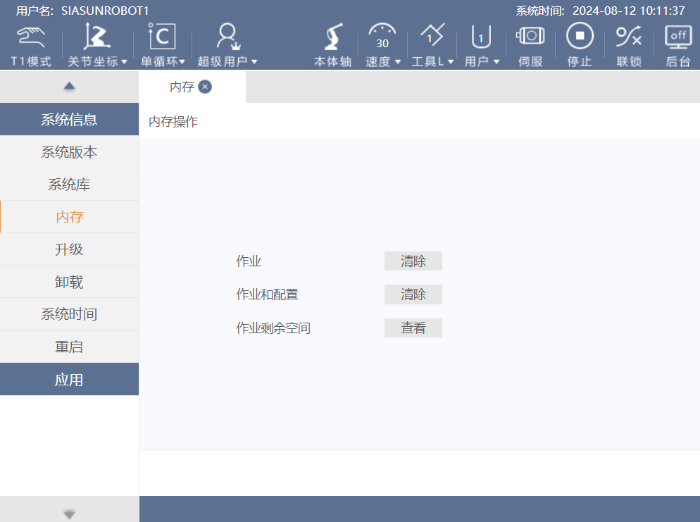

图 2‑77内存操作界面

在点击【清除】，提示确认，点击【确认】，会把对应的功能进行初始化。

| **注意：**1. **作业清除，会把所有作业都清除。作业清除后，无法找回，在清除内存前，请把需要保存的内容进行备份。** 2. **作业和配置清除，会清除作业、作业堆栈、应用、系统参数（用户配置的内容、外部轴等信息都会清空）。在清除内存前，请把需要保存的内容进行备份。** |
| --- |

作业剩余空间查看，可查看作业可用剩余空间。

### 升级、卸载

当机器人需要软件版本升级或者变更时，可以通过U盘对软件进行升级。把软件升级包存到U盘里。 通过点击升级就可以对软件升级。

**机器人软件升级步骤：**

将升级包导入U盘，U盘插入主板，进入超级用户，【系统信息】\-【升级】，进入升级界面，提示：系统挂载成功，点击升级，弹出程序升级中，请勿重启弹窗提示，升级完成后会弹出程序升级完成，请重启界面，关机重启即可，U盘自动卸载。若提示升级失败，则需重启后再次进行升级操作即可。

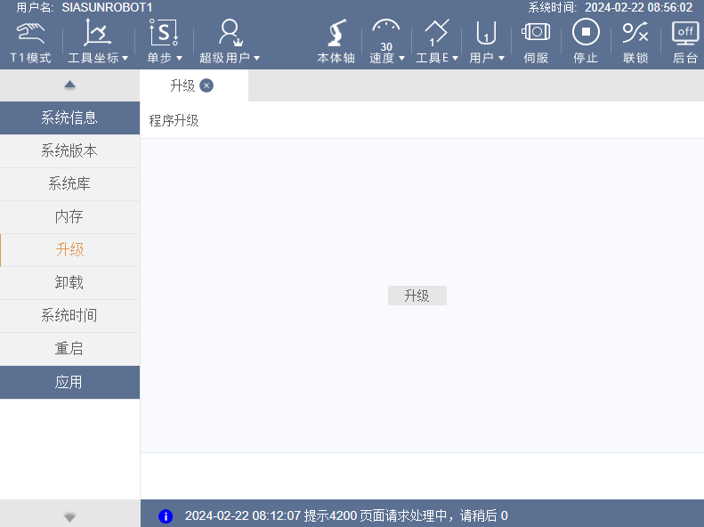

图 2‑78软件升级界面

机器人当前分为两种类型主板：E3845、ARM。他们的升级包名称不同，E3845升级包名称为bootforE3845\.gz，ARM升级包名称为bootforE3845\_ARM.gz。

升级前机器人系统会提前进行备份，备份压缩文件为bootforE3845\_bak.gz，备份内容为cf卡中ram文件夹，首次备份自动生成，再次升级时会进行覆盖。恢复备份文件只需将备份压缩文件重命名为bootforE3845\.gz/bootforE3845\_ARM.gz,通过U盘升级即可。

### 系统时间

点击主菜单**【**系统信息**】\-【**系统时间**】**,进入到设置系统时间的界面。

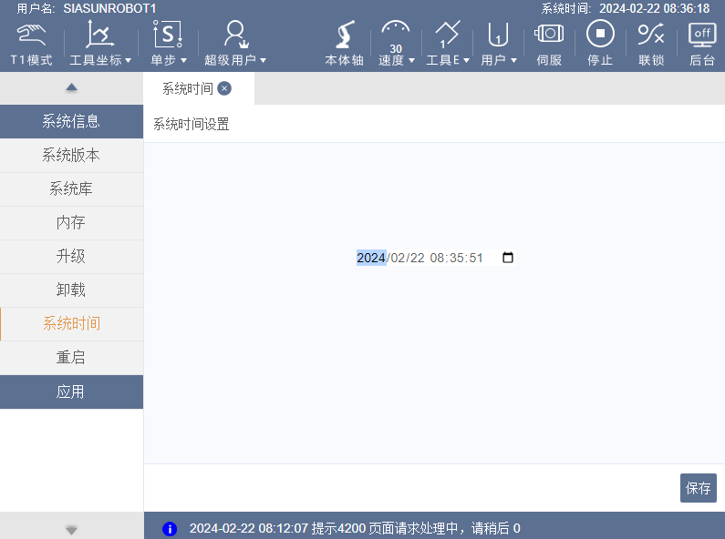

图 2‑79系统时间设置界面

### 重启

重启功能使机器人控制器重启，又名软启动，系统中的伺服、IO模块等不会重启。

点击主菜单【系统信息】\-【重启】，进入到重启界面。

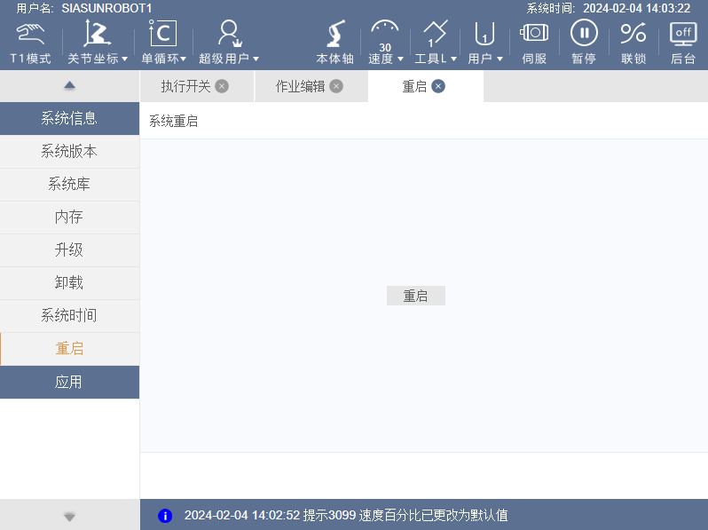

图 2‑80重启功能界面

点击“重启”按键。弹框提示 “断电恢复”功能是否开启，如果需要系统重启后，恢复断电前的作业、最后打开的操作界面，需要点击“取消”，在执行开关中使“断电恢复”开关为ON，如果不需要系统重启后，恢复断电前界面，使“断电恢复”开关为OFF；

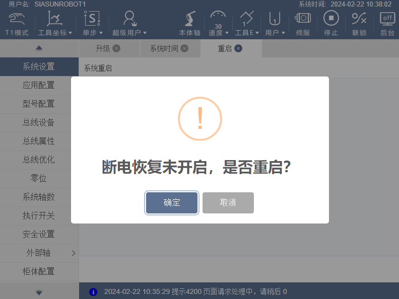

图 2‑81断电恢复开启状态界面

点击【确认】按键。控制器开始重启，并弹框提示“机器人重启中，请稍后”。

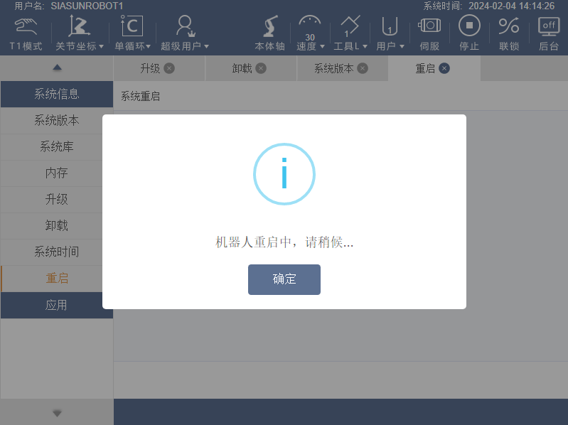

图 2‑82控制器重启中界面

如果系统动力电已上电，则无法进行重启，并会弹出提示框如下。

| **注意：****机器人上电的状态是无法通过这个界面发生重启的。会弹出对话框“系统处于上电状态，禁止重启”。如需要重启，请让机器人处于下电状态。** |
| --- |

## 应用配置

点击主菜单【系统设置】\-【应用配置】，输入密码：sysiasun，进入应用配置界面，可查看机器人选择了哪些应用，在系统用户下才允许修改应用配置项。此参数项出厂前已配置好，无需用户更改，如需更改请联系售后人员。

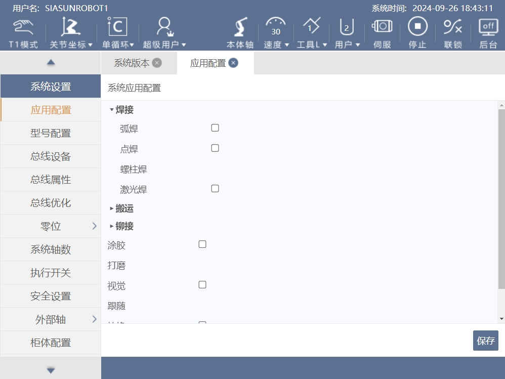

图 2‑83系统应用配置界面

## 规划库

**规划库版本**

每个应用自动分配对应的规划库，点到应用的名称上会显示该应用所用的规划库，目前是规划库1和规划库2。不同规划库的应用不可以同时配置。应用配置好后，规划库会自动变更，不需要操作者人为去变更。

**模型库版本**

用于出厂标定配置，不需要更改。

**注：模型库2\.0切换到1\.0，之前编辑的作业无效，运动时会发生报警。模型库1\.0切换到2\.0，之前编辑的作业可以使用。**

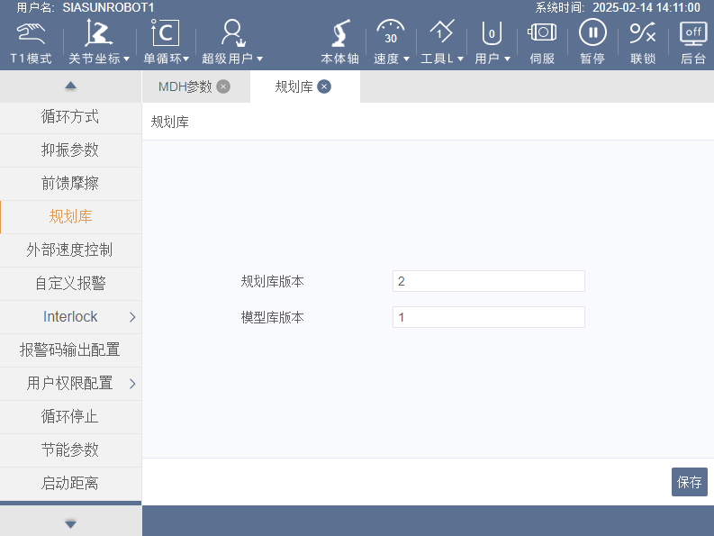

图 2‑84规划库设置界面

## 型号配置

点击主菜单【系统设置】\-【型号配置】，输入密码：sysiasun，进入机器人型号配置界面，可查看及重新选择此机器人的型号，选择好型号后，点击保存，会提示重启，重启后自动清除系统参数。保存或重启之前确认之前的系统配置，或提前做系统参数的备份。

此参数项出厂前已配置好，无需用户更改。注：此参数型号一定与实际连接的本体型号一致。

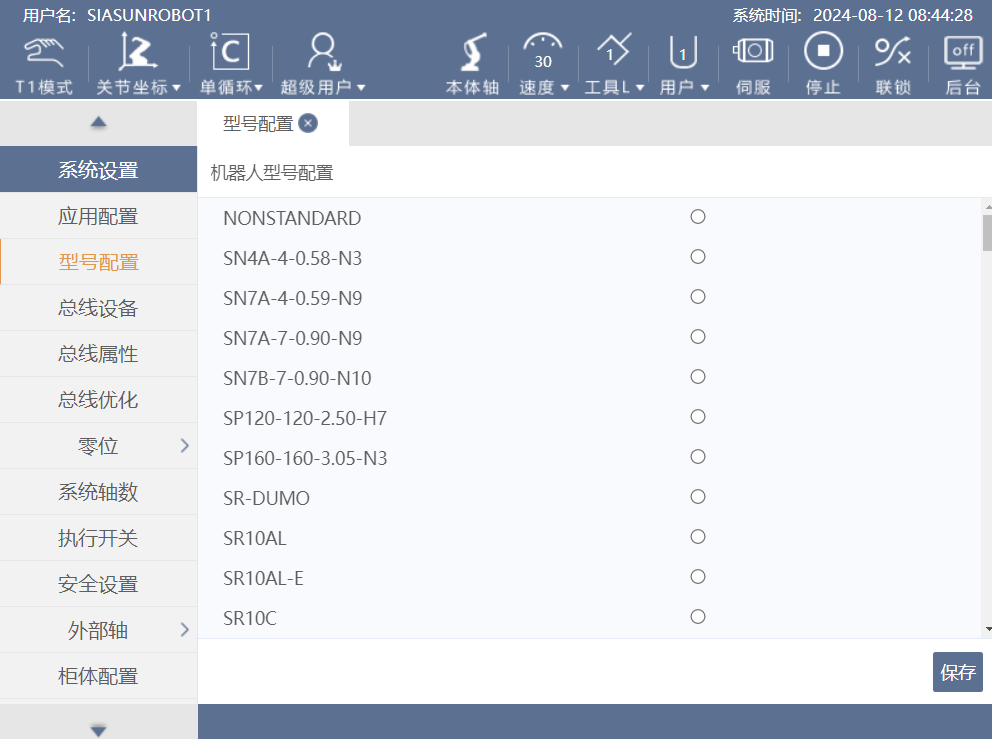

图 2‑85机器人型号配置界面

## 抑振参数

该功能主要是调整机器人使用特殊功能运行时的抖动，通过调整该参数可以减小运行抖动。

点击主菜单【用户配置】\-【抑振参数】，进入抑振参数配置界面。

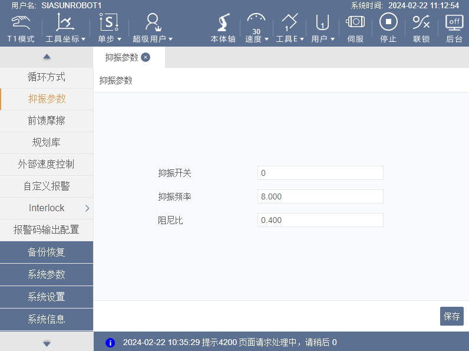

图 2‑86抑振参数配置界面

参数说明：

抑振开关：是否打开抑振功能；参数范围0或1。0为关闭软抑振，1为打开软抑振。

抑振频率：频率越大，机器人加加速度越大，机器人速度越快，相应越抖。频率越小，速度越慢，抖动越小。参数范围 1\-30。加加速度和抑振频率成正比。切换机器人型号，该值会根据型号进行切换。不需要修改。

阻尼比：机器人本体的阻尼比，参数范围 0\.01\-0\.99。默认值为0\.4，不建议修改。

| **注意：****该功能配置完成后，需要重启，重启后生效。****抑振开关，在规划库为1\.0时软抑振有效、抑振频率、阻尼比有效。在规划库为2\.0时软抑振无效，抑振频率与阻尼比有效。** |
| --- |

## 外部速度控制

实现外部控制机器人运行速度百分比（执行模式/远程模式有效）。

功能描述：

* 1. 在PLC端修改速度百分比，可以通过组IO传输数值来控制机器人的速度变化,组IO数值为0\-255,值为0时，该数据无效，不修改机器人速度，值大于100时，机器人已100执行。值大于100时，机器人报警。
	2. 在机器人端输出速度百分比，可以通过组IO传输数据来实现在PLC端显示，传输数值为0\-100。机器人设定的速度位0\.5等小于1的小数档时，给PLC发送1。

可以单独功能使用，只使用PLC端修改速度百分比，不使用机器人对外发送速度百分比。只使用外机器人对外发送速度百分比，不使用PLC端修改速度百分比。

开关打开后。自动运行时有效（执行/远程）。不允许通过示教盒进行速度调节操作。手动模式无效，通过示教盒修改速度百分比。

点击主菜单【用户配置】\-【外部速度控制】，可对这项功能进行配置。

图 2‑87外部速度控制配置界面

使能开关：ON为使用外部控制，OFF不使用外部控制。

输入组IO配置：值为0\-8，为组IO的组号，0为无效。如：IG\=50时，机器人的运行速度为50%。

输出组IO配置：值为0\-8，为组IO的组号，0为无效。如：机器人的运行速度为50%时，OG\=50（详见2\.1\.2组I/O说明）。

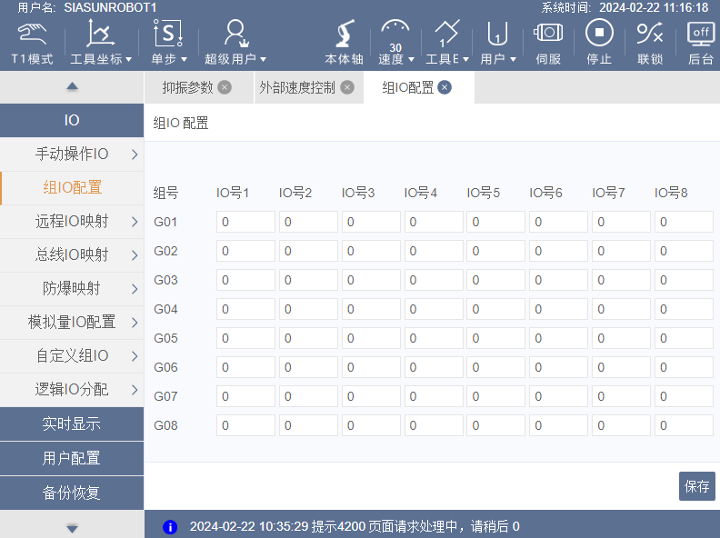

图 2‑88组IO配置界面

## 自定义报警

用户自定义报警功能，用户可以根据自身需求，满足条件时，通过执行报警指令，发送相应的报警通知。用户自定义报警总条目有160条，每条可进行报警级别与报警信息及弹窗的设置。

点击主菜单【用户配置】\-【自定义报警】，可对这项功能进行配置。

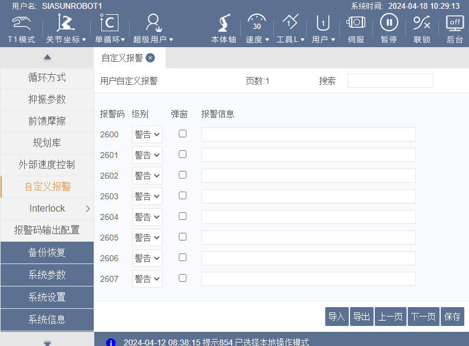

图 2‑89组IO配置界面

级别：共三种，分别为警告/报警/提示。警告类，机器人不下电暂停；报警类，机器人立即下电停止；提示类，机器人继续运行；

弹窗：勾选后，执行报警指令会有弹窗提示；不勾选，会在报警栏提示（无弹窗提示）；

报警信息：报警信息可输入任意字符，长度为62字节，当进行相应报警时，示教器会显示报警LOG日志，其内容即为用户设置好的报警信息内容；

报警取消：按复位可以对报警进行取消，任何级别报警都可以取消掉；

报警指令：如图2\-87所示，选择自定义报警指令；

**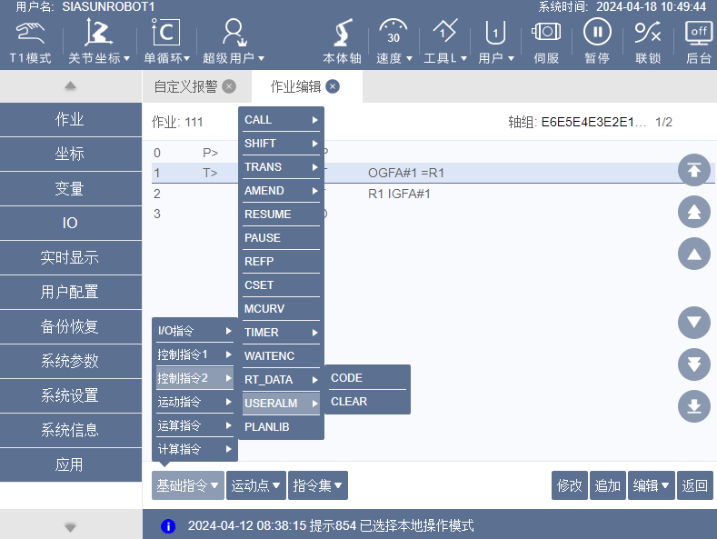**

图 2‑90组IO配置界面

表格2\-14 自定义报警指令及参数说明

| USERALMCODE\=常数 | 功能 | 用户自定义报警触发指令； |
| --- | --- | --- |
| 格式 | USERALM CODE\=\<参数1\> ； |
| 说明 | 参数1：自定义报警序号，范围2600\-2759； |
| 举例 | USERALM CODE \= 2600； |
| USERALMCLEAR | 功能 | 清除所有弹窗； |
| 格式 | USERALM CLEAR ； |
| 说明 | 无参数说明； |
| 举例 | USERALM CLEAR； |

## Interlock

在所有运动指令后增加一个参数Interlock，进行干涉区的判断，在执行该运动时，如果指令中设置的干涉区未满足，则报警停止运动。

指令中的INTERLOCK参数值作为文件号，对应1\-32个文件。

 每个文件中最多可设置8个干涉区，每个干涉区可以通过刷新按键，显示当前状态下该文件各干涉区的请求/释放状态；

 干涉区可以设置50个干涉区，其请求编号（必须设置为奇数），释放自动对应为其\+1的编号，干涉区间请求与释放的编号不能相同；

 点击主菜单【用户配置】\-【Interlock】\-【区域设置】，可对这项功能进行配置。

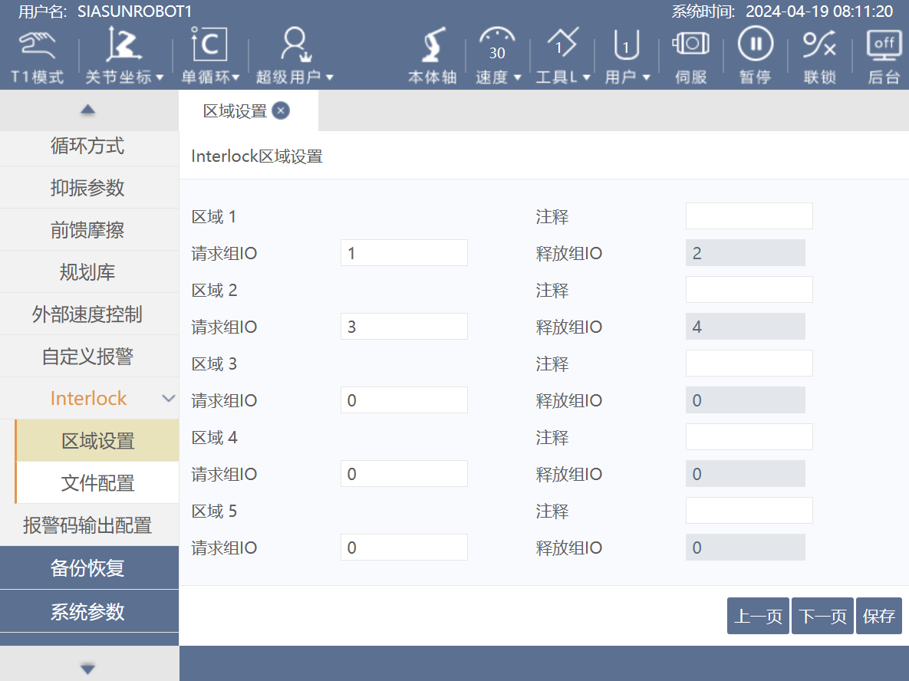

图 2‑91 Interlock区域设置界面

区域：虚拟区域，指的是到位后通过IO信号来定义区域。

注释：每个区域可以输入注释。

请求组IO：请求进入。（外部会给机器人发送对应的16位组IO组成的数值）

释放组IO：完成后释放。（完成后该组IO的数值会存到I451中）

点击主菜单【用户配置】\-【Interlock】\-【文件配置】，可对这项功能进行配置。

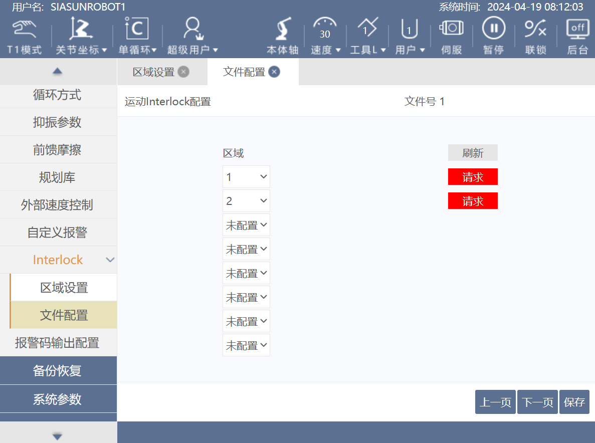

图 2‑92 Interlock文件配置界面

区域：选择区域号。

请求/已释放：显示当前状态。

刷新：刷新请求状态。

当执行运动指令时，其参数INTERLOCK中对应的运动干涉区配置必须均是请求状态才可以继续执行，否则报警；

干涉区的请求与释放是指令集调用请求与释放；

 在指令集调用的子作业中编辑WAIT IGH\# \= I451 INTERLOCK指令可以对干涉区进行请求与释放，当WAIT条件满足时，根据其组IO的值，判断某个区域为请求或释放；

## 报警码输出配置

可以对外输出报警码。以组IO的形式对外输出，组IO号可以自行配置；

点击主菜单【用户配置】\-【报警码输出配置】，可对这项功能进行配置。

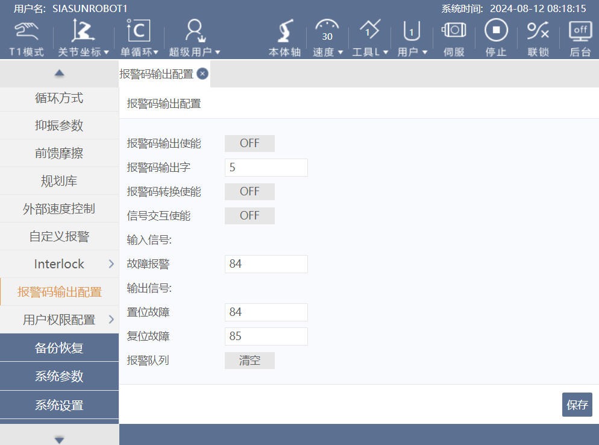

图 2‑93报警码输出配置界面

报警码输出使能：ON,表示可以输出报警码；OFF，表示不输出报警码；

报警码输出字：以16位信号组成的字进行输出，填写16位组IO的第几组。

举例：报警码输出字，填写3，表示：使用的是第3组用户输出16位组IO,由33\-48位信号组成。

报警码转换使能：ON，表示基础报警输出1，基础警告输出2；OFF，表示报警码是多少输出多少。

信号交互使能：ON，表示报警和复位都为外设交互信号；OFF，表示不和外部设备交互。

故障报警：输入信号，外部反馈信号。

置位故障：输出信号，报警标志位，表示发生了报警。

复位故障：输出信号，报警消除反馈信号。

报警队列：清空，清空历史记录，断电不保持。

## 用户权限配置

可以修改机器人密码，可以重置密码，可以在一段时间不操作机器人的情况，对用户权限自动注销。

**修改密码步骤：**

点击主菜单【用户配置】\-【用户权限配置】\-【修改密码】，可对当前权限的密码进行修改。

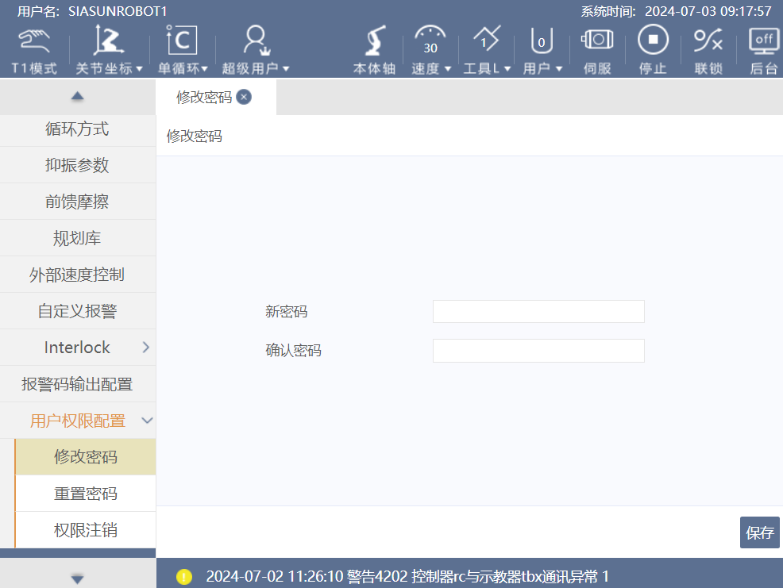

图 2‑94修改密码界面

新密码：输入新的密码。

确认密码：再次输入新的密码。

**重置密码步骤：**

点击主菜单【用户配置】\-【用户权限配置】\-【重置密码】，可对当前界面进行配置。

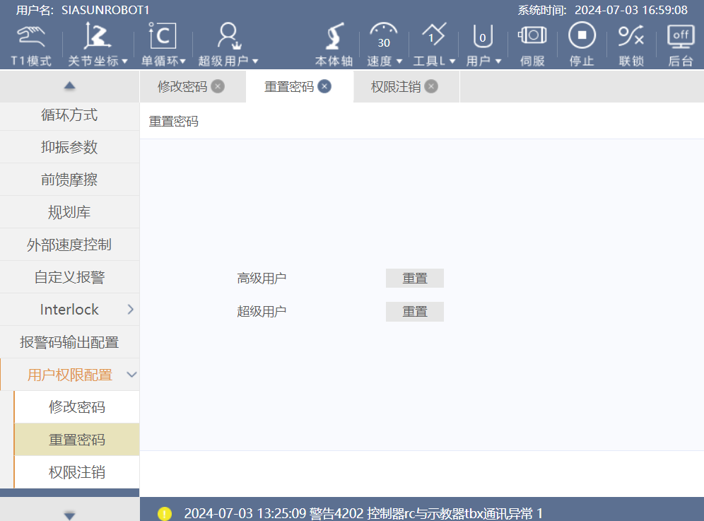

图 2‑95重置密码界面

点击重置就会把对应的用户权限密码进行重置，恢复到出厂时的密码。

| **注释：****普通/高级用户不能重置高级/超级用户密码，如想重置，需要联系新松售后人员。****超级用户可以直接重置高级用户密码，不能重置超级用户密码，如想重置，需要联系新松售后人员。** |
| --- |

**权限注销步骤：**

点击主菜单【用户配置】\-【用户权限配置】\-【权限注销】，可对当前界面进行配置。在不操作示教器的情况，达到设置的时间后，用户权限恢复到普通用户权限。

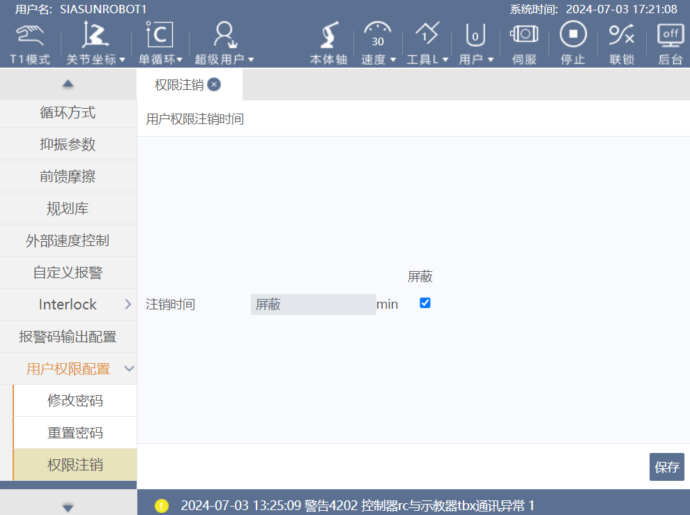

图 2‑96权限注销界面

注销时间：可以填写时间，单位min。

屏蔽：不使用该功能。

| **注释：****在不操作一下项时，达到设定的时间后，用户权限被注销，变成普通用户。****示教器硬按键、示教器打开新的窗口、关闭窗口、对设置的参数进行保存。** |
| --- |

## 柜体配置

点击主菜单【系统设置】\-【柜体配置】，输入密码：sysiasun，进入机器人柜体型号配置界面，可查看及重新选择此机器人的柜体型号，此参数项出厂前已配置好，无需用户更改。注：此参数型号一定与实际的柜体型号一致。

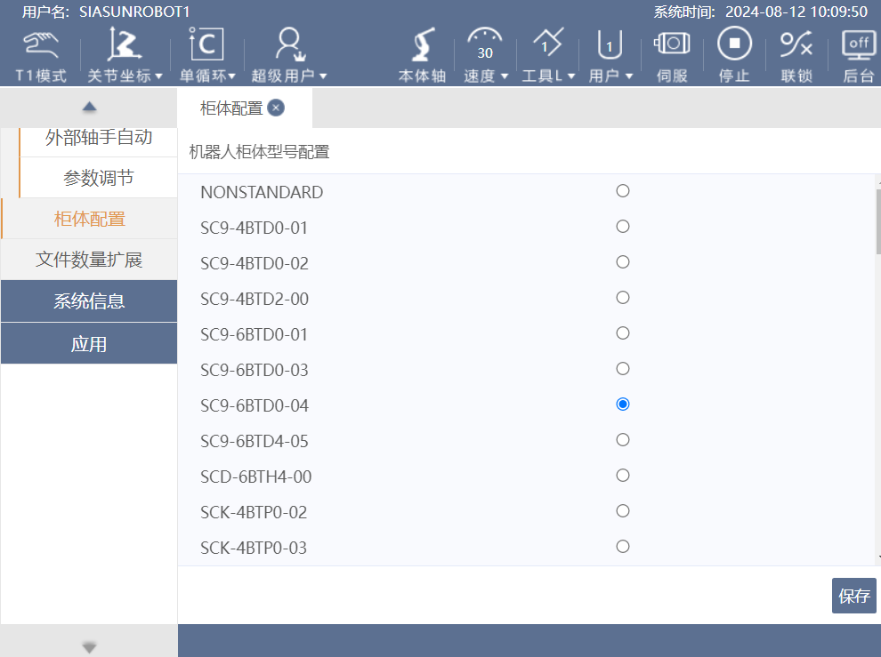

图 2‑97机器人柜体型号配置界面

## 安全设置

主要用于安全门及上下电逻辑参数配置。其中驱动器报闸延时与延时急停时间默认不可配置；

点击主菜单【系统设置】\-【安全设置】，对该项进行设置。通常使用默认参数就可以。

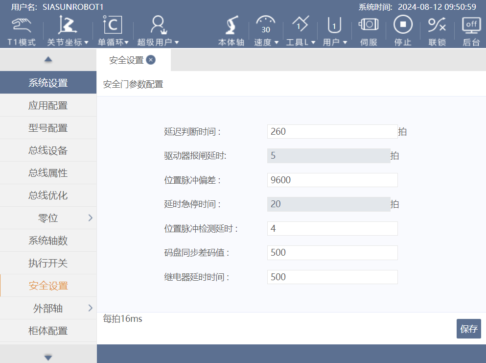

图 2‑98安全设置界面

延迟判断时间：延迟判断时间为0\-999999之间整数。安全门延迟判断时间若小于30拍，则限定在30。

位置脉冲偏差：位置脉冲偏差范围为0\-999999之间整数。

位置脉冲检测延时：位置脉冲偏差范围为0\-999999之间整数。

码盘同步差码值：码盘同步差码值范围为0\-999999之间整数。松开deadman时，enco与enci同步的差码判断值，初始没有赋值时强制为500。

继电器延时时间：继电器延时时间范围为0\-700之间整数。

## 节能功能

浅度节能功能指RC软件根据机械臂的动作运动状态自动控制伺服驱动器进行动力电的上/下，以及抱闸的相应抱死/释放动作，以达到在机械臂不运动时尽量使其处于下励磁抱闸抱死状态，以节省能源。

### 节能开关

 系统设置\-执行开关中增加浅度节能的开关。节能开关OFF，则浅度节能功能关闭。

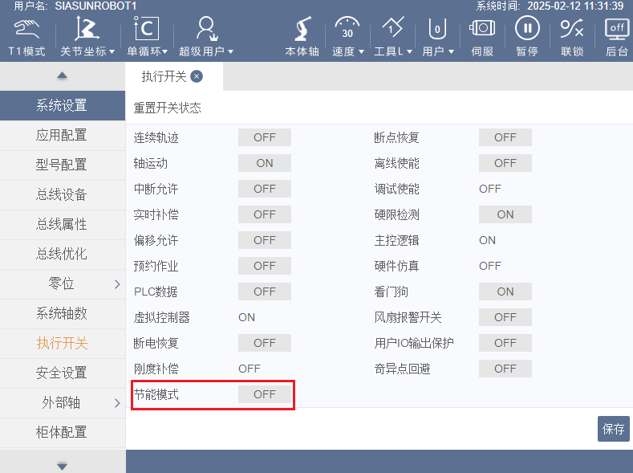

图 2‑99节能功能开关界面

**节能模式：**ON/OFF，节能功能总开关。

**示教模式：**下无论节能开关ON还是OFF，机器人上电、下电操作没有变化。

**执行模式：**节能开关ON时，机器人带电静止（包括机器人作业运行中由逻辑指令delay、wait、goto循环等延时指令），静止超出设定时间后，RC控制伺服驱动器下动力电并抱闸抱死，进入节能状态，此过程中作业是正常向下执行的，并直到机械臂下次运动开始，RC控制机械臂上电并释放抱闸，然后继续按规划输出进行动作。

**远程模式：**节能开关ON时，远程IO输入节能信号配置后，可由外部IO的输入信号上升沿触发，直接进入节能状态；不触发信号时，不进入节能状态；屏蔽后，与执行模式下该功能一致。

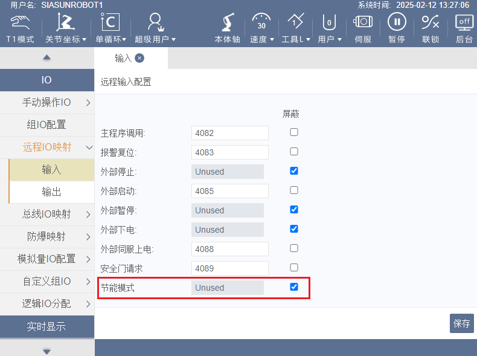

图 2‑100远程IO节能模式

### 节能参数配置

点击主菜单【用户配置】\-【节能参数】，进入节能参数设置页面。可设置机器人静止时间。

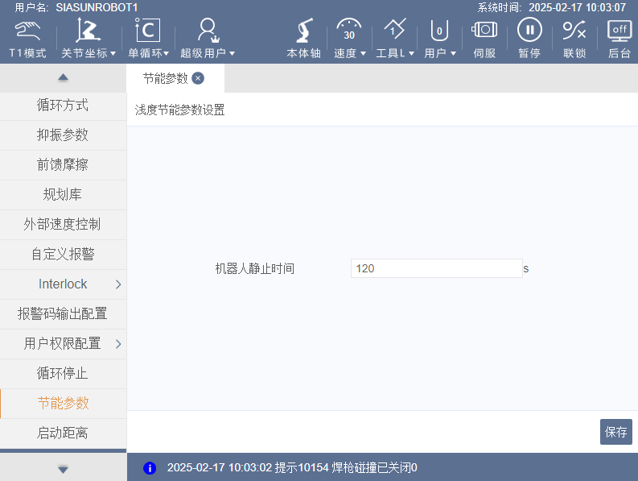

图 2‑101节能参数

机器人静止时间表示机器人静止(不动)时间限值，超过该时间后机器人自动节能下电。机器人静止时间单位为秒（s），范围60\-100000(s)。

**注：示教模式、执行模式、远程模式下，节能开关OFF时所有操作保持原样不变；节能开关ON时，如下表所示：**

表格2\-15 节能开关ON时参数说明

| 模式 | 上电动作 | 下电 |
| --- | --- | --- |
| 示教模式 | 1\.保持原有上电方式2\.servon按钮\-\>deadman | 1\.deadman松开、2\.报警下电。 |
| 执行模式 | 1\.servon按钮、作业运行中节能下电，到运动指令会自动上电。 | 1\.节能下电（静止计时触发）2\.报警下电（包括急停）、3\.模式切换下电 |
| 远程模式外部IO | 1\.外部IO\-\>Exsvon(IO信号)2\.作业运行中节能下电，到运动指令会自动上电。 | 1\.节能下电（静止计时或节能IO沿触发）、2\.报警下电（包括急停）3\.模式切换下电 |

## SOCKET通讯

### TCP指令

TCP 指令用于通过 TCP 协议与外部设备进行通信，包括创建连接、关闭连接、发送数据和接收数据。这些指令封装了底层 SOCKET 功能，支持数据的收发操作。

表格2\-16 指令列表及说明

| 指令名称 | 功能描述 | 示例格式 |
| --- | --- | --- |
| TCPCREATE | 创建一个 TCP 连接 | TCPCREATE NAME\=SS IP\=192\.168\.0\.1 PORT\=1234 TIMEOUT\=5 RET\=I2 |
| TCPCLOSE | 关闭一个已创建的 TCP 连接 | TCPCLOSE NAME\=SS |
| TCPSEND | 向指定的 TCP 连接发送数据 | TCPSEND NAME\=SS STR\=LS\#1 ENDS\=结束符RET\=I2TCPSEND NAME\=SS STR\= LS\#1 LEN\=128 ENDS\=结束符RET\=I2TCPSEND NAME\=SS STR\= LS\#1 LEN\=I2 ENDS\=结束符RET\=I3 |
| TCPRECV | 从指定的 TCP 连接接收数据 | TCPRECV NAME\=SS STR\= LS\#1 LEN\=128 TIMEOUT\=5 RET\=I2TCPRECV NAME\=SS STR\= LS\#1 LEN\=I2 TIMEOUT\=5 RET\=I3TCPRECV NAME\=SS STR\=LS\#1 ENDS\=结束符 TIMEOUT\=5 RET\=I3 |

参数说明：

**NAME**：连接名称，用于唯一标识一个 TCP 连接，多个连接可以用多个NAME。

**IP**：目标服务器的 IP 地址。

**PORT**：目标服务器的端口号。

**TIMEOUT**：超时时间（秒）。

**STR**：局部字符串变量编号，用于存储发送或接收的数据。

**LEN**：发送或接收的数据长度。带有I 样式（例如：LEN\=I2）为从用户整型中取值且字符长度不能为0。

ENDS:结束符; 指令的“END”参数为结束符，结束符可以为：无、;(半角分号)、\\n(换行)、\\r(回车)、\\r\\n(回车换行)、\\n\\r(换行回车)、,(半角逗号)。添加或修改指令的时候在此参数位置增加下拉框，可以选择结束符类型。

当发送数据时，自动在字符串结尾处发送对应的结束符；当接收数据时，判断是否收到对应的结束符，收到则认为接收完毕。

**RET**：整型变量，用于存储指令执行结果（\-1 表示失败，大于等于 1 表示成功）。

使用示例：

创建 TCP 连接：

TCPCREATE NAME\=SS IP\=192\.168\.0\.1 PORT\=1234 TIMEOUT\=5 RET\=I2

创建一个名为 SS 的 TCP 连接，目标 IP 为 192\.168\.0\.1，端口为 1234超时时间为 5 秒。执行结果存储在变量 I2 中。

发送数据：

TCPSEND NAME\=SS STR\= LS \#1 RET\=I2

通过连接 SS 发送存储在局部字符串变量 LS \#1 中的数据。发送结果存储在变量 I2 中。

接收数据：

TCPRECV NAME\=SS STR\= LS \#1 LEN\=128 TIMEOUT\=5 RET\=I2

通过连接 SS 接收数据，存储在局部字符串变量 LS \#1 中，最大接收长度为 128 字节，超时时间为 5 秒。接收结果存储在变量 I2 中。

### STR指令

指令概述：

STR 指令用于对字符串进行操作，包括比较、查找、截取、拼接、转换等。这些指令配合 TCP 指令，用于处理 TCP 收发的数据。

表格2\-17 指令列表及说明

| 指令名称 | 功能描述 | 示例格式 |
| --- | --- | --- |
| STRCMP | 比较两个字符串是否相等 | STRCMP STR\=LC\#1 STR\=LC\#2 RET\=I2STRCMP STR\=LC\#1 STR\=LC\#2 LEN\=128 RET\=I2STRCMP STR\=LC\#1 STR\=LC\#2 LEN\=I2 RET\=I3 |
| STRLEN | 获取字符串的长度 | STRLEN STR\=LC\#1 RET\=I2 |
| STRFIND | 在字符串中查找子字符串 | STRFIND STR\=LC\#1 BEGIN\=0 STR\=LC\#2 RET\=I2STRFIND STR\=LC\#1 BEGIN\=I2 STR\=LC\#2 RET\=I3 |
| STRSUB | 截取字符串的子串 | STRSUB STR\=LC\#1 BEGIN\=I2 END\=I3 RET\=LC\#2 |
| STRSPLIT | 按分隔符分割字符串 | STRSPLIT DEST\=LC\#1 BEGIN\=I2 STR\=LC\#2 IDX\=3 RET\=I3STRSPLIT DEST\=LC\#1 BEGIN\=0 STR\=LC\#2 IDX\=3 RET\=I3 |
| STRSET | 局部与全局字符串变量互转 | STRSET LS\=LS\#1 S\=S\#1STRSET S\=S\#1 LS\=LS\#1 |
| STRCLR | 清空字符串 | STRCLR LS\=LS\#1STRCLR S\=S\#1 |
| STRCAT | 拼接两个字符串 | STRCAT DEST\=LC\#1 STR\=LC\#2 |
| STRCPY | 复制字符串 | STRCPY DEST\=LC\#1 SRC\=LC\#2 |
| STR2I | 将字符串转换为整型 | STR2I STR\=LC\#1 RET\=I2 |
| STR2R | 将字符串转换为实型 | STR2R STR\=LC\#1 RET\=R1 |
| I2STR | 将整型转换为字符串 | I2STR I2 RET\=LC\#1 |
| R2STR | 将实型转换为字符串 | R2STR R1 RET\=LC\#1 |
| STRPRINT | 字符串打印 | STRPRINT S\=S\#1STRPRINT LS\=LS\#1 |

参数说明：

**STR**：局部字符串变量编号，用于存储字符串数据。

**BEGIN**：起始索引（从 0 开始）。带有I 样式（例如：BEGIN\=I2）为从用户整型中取值。

**LEN**：字符串长度。带有I 样式（例如：LEN\=I2）为从用户整型中取值且字符长度不能为0。

**IDX**：分割后从局部变量中该索引位置开始存储分割后的字符串。

**RET**：整型或实型变量，用于存储指令执行结果。

**DEST**：目标字符串变量编号。

**SRC**：源字符串变量编号。

STRPRINT：将字符串以提示信息的方式推动到示教盒

使用示例：

字符串比较：

STRCMP STR\= LS \#1 STR\= LS \#2 RET\=I2

比较局部字符串变量 LS \#1 和 LS \#2 的内容是否相等。

比较结果存储在变量 I2 中（1 表示相等，0 表示不相等）。

获取字符串长度：

STRLEN STR\= LS \#1 RET\=I2

获取局部字符串变量 LS \#1 的长度，结果存储在变量 I2 中。

字符串查找：

STRFIND STR\= LS \#1 BEGIN\=0 STR\= LS \#2 RET\=I2

在字符串 LS \#1 中查找子字符串 LS \#2，从索引 0 开始查找。

查找结果存储在变量 I2 中（\-1 表示未找到，\>\=0 表示起始索引）。

字符串截取：

STRSUB STR\=LC\#1 BEGIN\=I2 END\=I3 RET\= LS\#2

从字符串 LS \#1 中截取从索引 I2 到 I3 的子串，结果存储在 LS \#2 中。

字符串分割：

STRSPLIT DEST\=LC\#1 BEGIN\=0 STR\= LS \#2 IDX\=3 RET\=I3

在字符串LS \#1中从设置BEGIN索引位置开始分割字符串，分割后的结果将按照设置的IDX局部变量的id的起始值，把分割后的数据从id位置依次存储到局部变量中。

字符串拼接：

STRCAT DEST\= LS\#1 STR\= LS\#2

将字符串 LS\#2 拼接到 LS\#1 的末尾。

字符串复制：

STRCPY DEST\= LS\#1 SRC\= LS\#2

将字符串LS\#2 的值复制到LS\#1 。

字符串转换：

STR2I STR\= LS\#1 RET\=I2

将字符串 LC\#1 转换为整型，结果存储在变量 I2 中。

STR2R STR\= LS\#1 RET\=R1

将字符串 LC\#1 转换为整型，结果存储在变量 R1 中。

 I2STR I2 RET\= LS\#1

将整型 I2 转换为字符串，结果存储在局部变量 LS\#1 中。

R2STR R1 RET\=LC\#1

将实型 R1 转换为字符串，结果存储在局部变量LS\#1 中。

## 其他设定

### 示教条件设定

点击主菜单【用户配置】\-【示教条件】，进入示教条件设置页面。可设置手动运行加速时间和是否执行逻辑指令的使能开关，设置好相关参数后，点击【保存】键，设置参数有效，如图2\-102所示。

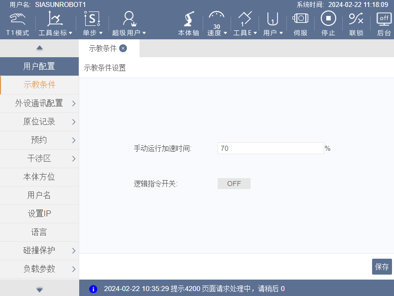

图 2‑102示教条件设置界面

手动运行加速时间：范围为20\-150，手动运行机器人的减速快慢，20%为最快，150%最慢，通常我们使用默认值为70%。

逻辑指令开关：

ON，代表手动运行作业时执行程序中的所有指令。

OFF，代表手动运行作业时执行运动指令，其它指令不执行。

### 本体方位

点击主菜单【用户配置】\-【本体方位】，进入底座安装方向设置页面。可设置机器人底座的安装角度，设置好相关参数后，点击【保存】键，设置成功后，会改变机器人动力学补偿结果，如图所示。

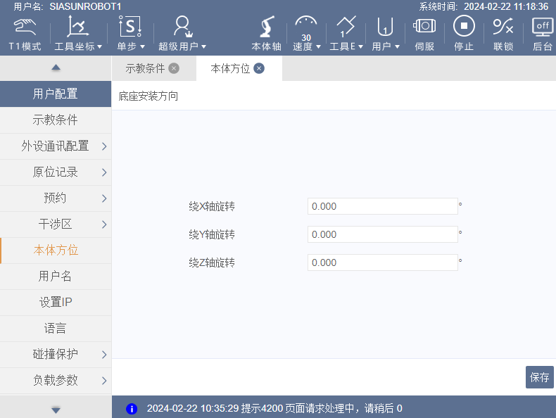

图 2‑103底座安装方向设置界面

### 用户名

点击主菜单【用户配置】\-【用户名】，进入用户名设置页面。可显示和更改机器人用户名，设置好相关参数后，点击【保存】键，设置参数有效，如图所示。

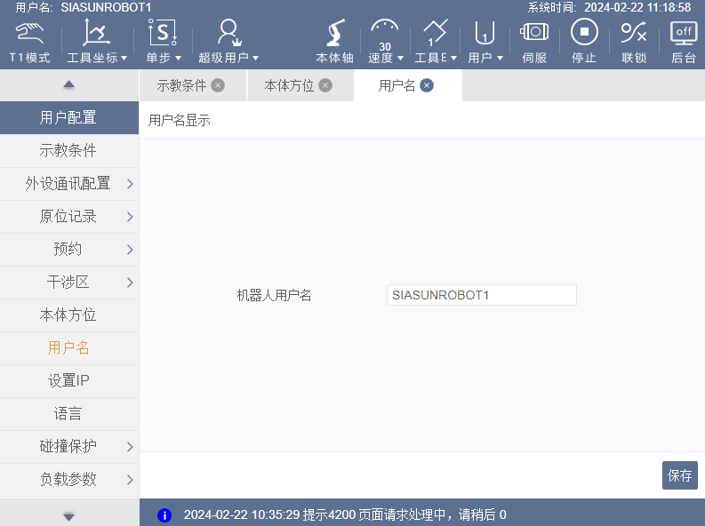

图 2‑104用户名设置界面

### 运动参数

点击主菜单【系统参数】\-【运动参数】，运动参数项中的参数为出厂默认设置，无需用户设置。运动参数中包含直线配置、速度、减速比和码盘数相关参数。

**直线配置：**

直线配置中显示有直线最大速度、直线最大加速度、直线最大加加速度，如图所示：

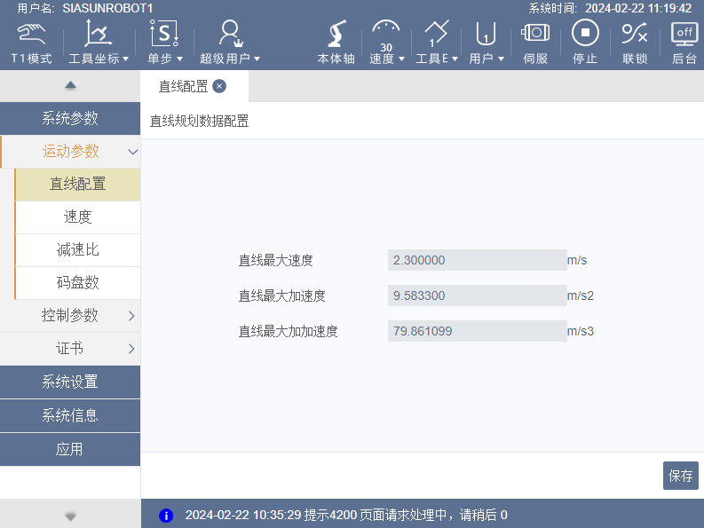

图 2‑105直线规划数据显示画面

**速度：**

速度中包含机器人本体轴1\-6轴的最大速度、1\-6轴的最大加速度、1\-6轴的加加速度，如图所示：

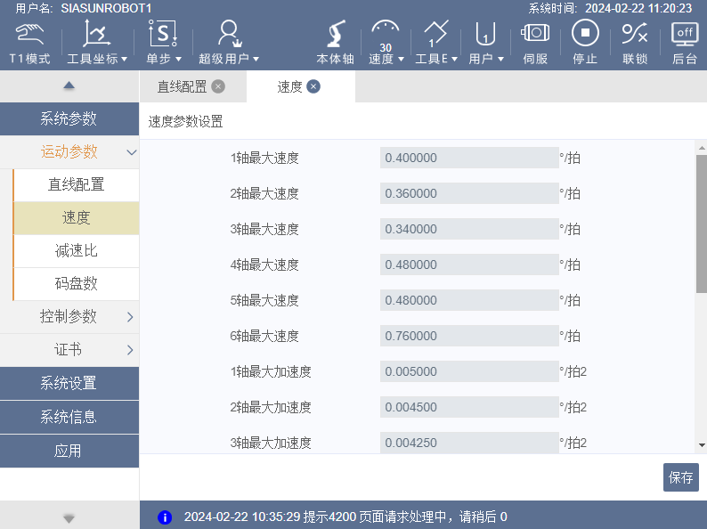

图 2‑106速度参数显示画面

**减速比:**

减速比中包含机器人本体轴1\-6轴的各轴减速比，如图所示：

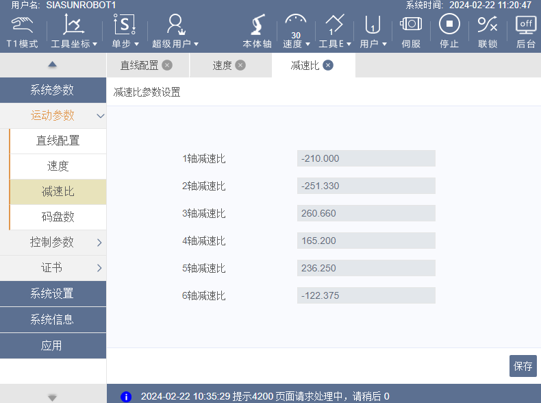

图 2‑107减速比显示画面

**码盘数:**

码盘数中包含机器人本体轴1\-6轴的各轴每圈码盘数，如图所示：

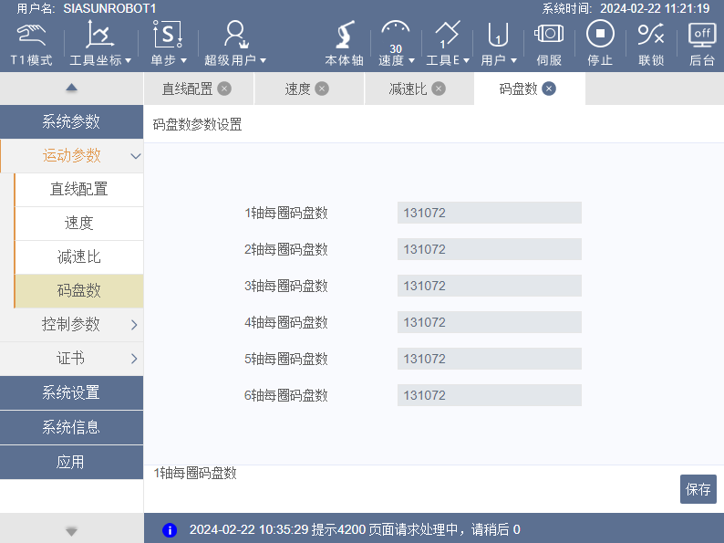

图 2‑108码盘数显示画面

### 控制参数

点击主菜单【系统参数】\-【控制参数】。控制参数中包含软限位、安全保护、转矩限值、杆长补偿和无限回转。

**安全保护：**

安全保护可设置机器人本体轴1\-6轴的各轴跟踪差及速度限值，如图所示：

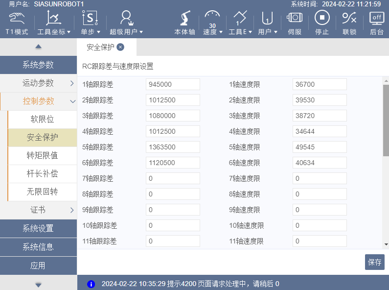

图 2\-109 RC跟踪差与速度限设置

**转矩限值：**

转矩限值可设置机器人本体轴1\-6轴的各轴转矩安全值，如图所示：

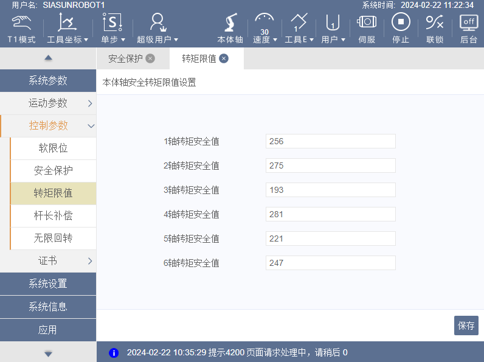

图 2‑110本体轴安全转矩限值设置

**杆长补偿：**

杆长补偿可设置杆长长度及杆长补偿值，如图2\-111所示：

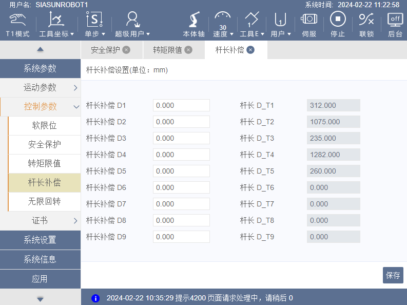

图 2‑111杆长及杆长补偿设置

**MDH参数：**

为出厂前标定的值，需要把模型库版本切换成2\.0才生效，该值生效时会提高工具坐标系标定结果。模型库选择2\.0后MDH参数界面设置的值才有效，该值是通过出厂标定得来的。如图所示：

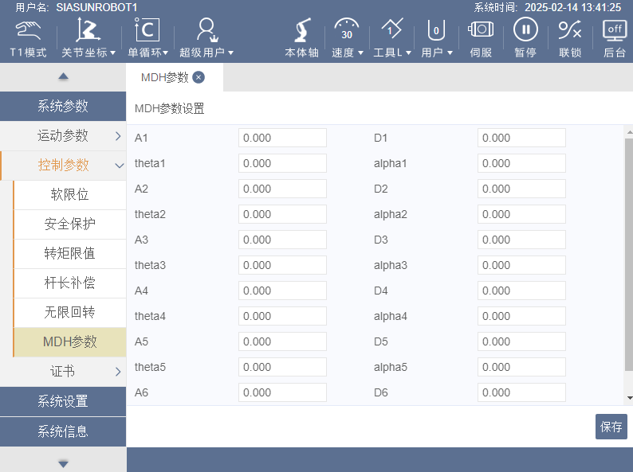

图 2‑112 MDH参数设置

该界面的参数项对应出厂标定软件界面的1\-6轴的值。

### 文件数量扩展

可以扩展工具坐标系/用户坐标系/负载的文件数量。工具坐标系默认支持8个文件可配置，用户坐标系默认支持8个文件可配置，负载文件数量默认是16个。这三个文件数量支持扩展，工具数量最大扩展到32个，用户数量最大扩展到128，负载数量最大扩展到32。更改完数量需要保存，保存后会清空工具与负载的原有数据，最后需要重启机器人。

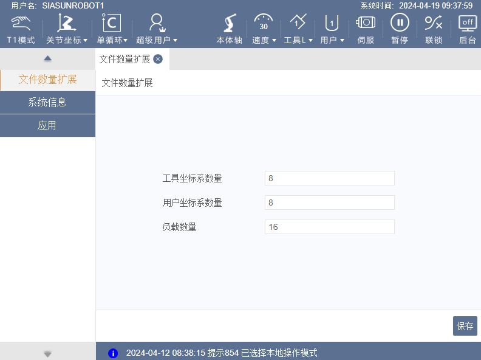

图 2‑113文件数量扩展界

### 示教器型号配置

可以选择示教器的型号，只有ARM版系统的时候才会出现该选项，ARM版本系统支持两种示教器型号，由于两款示教器键位差异（参考《新松机器人电气使用及维护手册》），可以根据实际使用的示教器型号进行选择。

点击主菜单【系统设置】\-【下一页】\-【示教器型号配置】，可对这项功能进行配置。

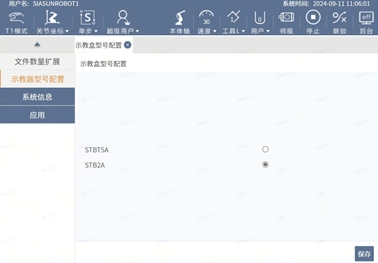

图 2‑114示教器型号配置界面

# **程序的说明**

机器人的程序，由工作人员编辑的各种指令即附加信息构成，这些指令可以使机器人完成希望的作业。

| **注释：****本章对程序本身进行说明，如何创建和示教程序的每步操作由下一章进行说明。** |
| --- |

**作业编辑界面：**

打开选中的程序后，进入作业编辑界面。

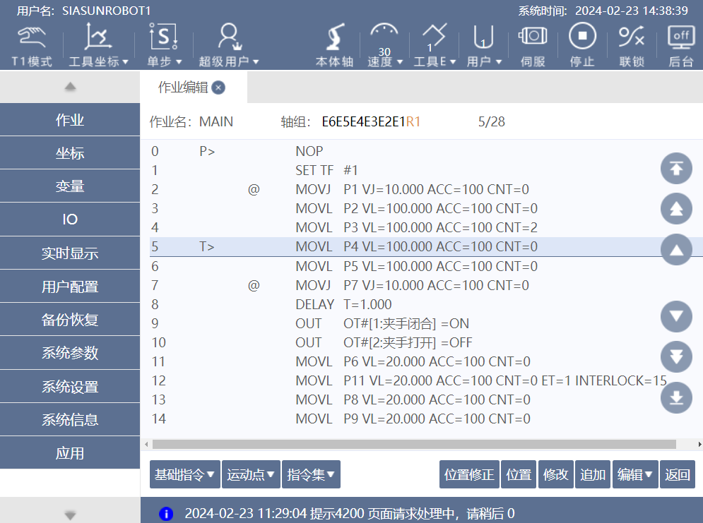

运动点

逻辑指令

作业名等信息

行号

@代表指令位置是机器人当前实际位置

指令菜单

图 3\-1作业编辑界面

**程序由如下信息构成：**

1. 指令的行号。
2. 指示机器人从当前位置以预期方式移动到目标位置的运动指令。
3. 还有一些机器人的程序指令。
4. I/O类，向外部设备收发I\\O信号的指令。
5. 对机器人内部变量（包括位置变量）赋值，计算，运算的指令。
6. 在一些条件成立时，改变程序流程的指令（IF,GOTO,CALL,RET）。
7. 使程序进程推迟的等待指令(WAIT,DELAY)。
8. 使机器人在一定条件下中断当前运动，并执行希望程序的中断指令。
9. 其他指令。

## 程序的各项信息

在作业列表中，可以看到每一个程序名称和对程序进行的操作。

点击主菜单【作业】,就可以打开作业列表，作业列表的排列顺序以程序名中的首字符为准，首字符为数字时排在最前面，首字符为字母时排在首字符为数字的后面。

 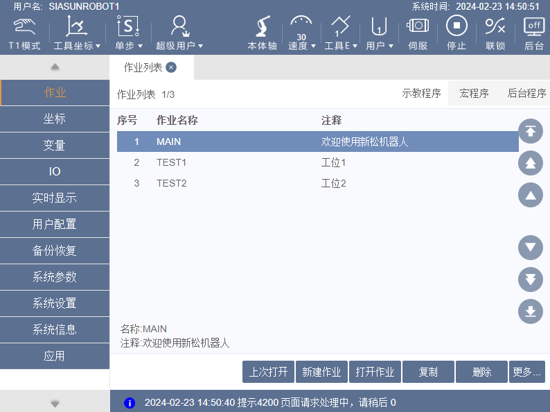

作业管理菜单

选择程序类型

程序列表

图 3\-2作业列表界面

在作业列表中，列出了已经创建的程序。根据程序类型的不同，列在不同的列表中。在列表中可以查看共建立了多少个作业。

同时也可以在这个界面进行【上次打开】，【新建作业】，【打开作业】等作业管理操作。

### 程序名

每个程序都有一个程序名，不能重复命名，程序名中最多支持32个字符，可用数字或字母进行命名，程序名中不能包含特殊字符。可以为程序添加中文/英文字母/字母等注释，最多支持36个字符。

### 程序类型

可以按照作业类型查看机器人程序。

1. 主程序：由用户指定的程序作为主程序，是可以从示教器或外部设备直接启动的程序。
2. 示教程序：机器人执行时，按照示教程序来执行动作和逻辑控制指令。
3. 宏程序：是指通过宏指令启动的作业。
4. 后台程序：在后台进行的程序，开启后可以时刻监控状态，并完成逻辑控制指令。

| **注释：****主作业可以在\[作业管理]中，将已经创建的示教程序设置为主作业。其他作业需要在新建作业时，对程序类型进行设定。** |
| --- |

### 作业管理可以对作业进行常规的操作

1. 作业属性：可对该作业进行，查看创建及修改时间，作业名称重新编辑，作业注释添加及修改，作业轴组查看及修改，作业是/否写保护。
2. 变换：可对作业进行整体的偏移/镜像。
3. 主作业登记/注销：可以设置已选定的作业为主作业或取消该作业为主作业。
4. 复制、删除:对已选定的作业进行复制、删除操作。
5. 打开作业：可以打开已选定的作业。
6. 新建作业：创建新的作业。
7. 上次打开：可以打开你上次进入的作业，并且光标位置不变。（控制柜下电后无效）

## 行号、参数

**行号：**

表示程序指令行的编号。

行号会自动添加到我们在程序上写入的指令前，在删除，插入等变换程序指令时，行号自动改变，使整个程序的行号至始至终都从1\.2\.3…。

**参数：**

参数是编程指令中需要用户添加并使用的数据。当使用指令菜单键插入指令时，大多数指令需要工程师自己选择/输入参数值。

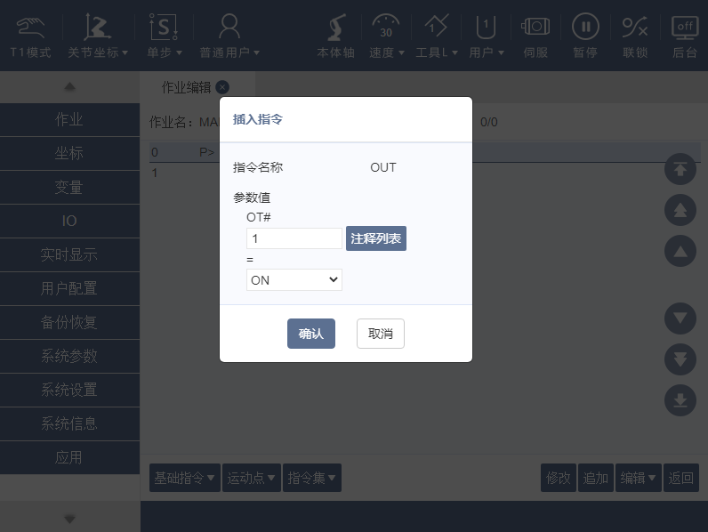

指令菜单

指令，可通过注释列表选择

指令参数

图 3\-3带有参数的指令输入

在示教程序中，指令需要通过菜单点击选择，并不是直接写代码编程，所以指令选择后，相关的参数会通过指令界面填写，用户需要根据实际情况自行添加参数即可。

## 运动指令

运动指令，是使机器人以操作人员指定的速度和运动方式，从当前位置移动到目标位置，并进行记录的一种指令。一条运动指令会记录以下信息。

**运动指令：**

|  |
| --- |

1. 运动类型：指机器人（或TCP）向指定位置运动时的运行轨迹。
2. 位置变量：存储位置信息的变量参数,分为局部变量与全局变量。
3. 运动速度：机器人直线或者轴的移动速度。
4. 加速度百分比：执行运动语句的加速度参数。
5. 连续轨迹：是否在目标点停止或者在目标点附近快速滑过。

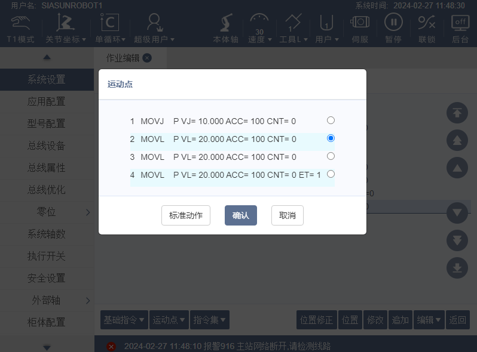

图 3\-4运动点菜单

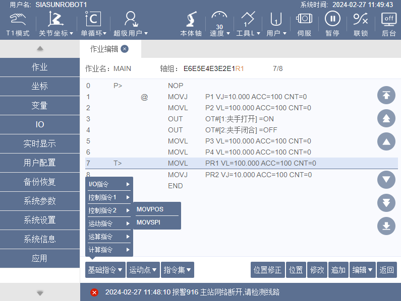

图 3‑5运动指令菜单

### 运动类型

运动类型是机器人向目标点运动的移动轨迹。运动类型包括：不进行轨迹、姿态控制的关节运动、进行轨迹、姿态控制的直线运动、圆弧运动。在指令中表示的为P/PR，P为单个程序中的位置信息存储，PR为所有程序中的位置信息存储。

关节运动 J

直线运动 L

圆弧运动 C

#### 关节运动

关节运动是机器人移动到目标位置的一种方法，是机器人所有轴同时加速到达程序指定速度，然后同时减速，达到目标点的一种方法，轴运动的轨迹一般非线性。轴运动的速度是电机额定转速的百分比，在示教时输入。使用**MOVJ**指令进行编程。

|  |
| --- |

图 3‑6轴运动轨迹

**MOVJ P指令：**

功能说明：两点之间以关节插补方式进行运动；

格式：MOVJ P\<参数1\> VJ\=\<参数2\> ACC\=\<参数3\> CNT\=\<参数4\>

参数说明：

\<参数1\>含义：位置变量号,范围1\-7500。

\<参数2\>含义：关节运动的运行速度，单位%，范围1\-100。

\<参数3\>含义：最大加速度百分比，单位：%，范围：1\-120,120%为最大加速度。

\<参数4\>含义：轨迹连续，可输入值：0和1,0为轨迹不连续，1为轨迹连续。

举例说明：MOVJ P1 VJ\=10 ACC\=100 CNT\=0。

#### 直线运动

直线运动是以直线方式，使机器人的TCP点从运动的开始点到目标点移动的一种运动方法。直线运动的速度单位为mm/s，在示教点后添加速度参数。使用**MOVL**指令进行编程。

|  |
| --- |

图 3‑7直线运动轨迹

机器人的TCP点可以在轴的方向上进行旋转运动。使工具的姿态从开始姿态以TCP点为中心进行旋转。移动方式通过直线运动进行控制。

**MOVL P 指令：**

功能说明：两点之间以直线插补方式进行运动。

格式：MOVL P\<参数1\> VL\=\<参数2\> ACC\=\<参数3\> CNT\=\<参数4\>

参数说明：

\<参数1\>含义：位置变量号,范围1\-7500。

\<参数2\>含义：直线运动的运行速度，单位mm/s，范围受机器人型号限制。

\<参数3\>含义：最大加速度百分比，单位：%，范围：1\-120,120%为最大加速度。

\<参数4\>含义：轨迹连续，范围：0\-100,0为轨迹不连续，100最远离目标的点。

举例说明：MOVL P1 VL\=600 ACC\=20 CNT\=100

**MOVL P ET指令：**

功能说明：外部TCP指令, 通常情况下，都是在机器人法兰盘上安装夹具，然后对工件进行取放等一些操作。但有些特殊情况，需要将工具安装到机器人外部，机器人夹取工件到外部工具上进行加工。例如打磨，一般砂带机都安装在地面上，与机器人分开，机器人夹取工件到砂带上进行打磨。

设置说明：使用外部TCP指令时，需要提前对外部工具TCP进行配置，具体配置请参照2\.2\.4章节。

格式：MOVL P\<参数1\> VL\=\<参数2\> ACC\=\<参数3\> CNT\=\<参数4\> ET

参数说明：

\<参数1\>含义：位置变量号,范围1\-7500。

\<参数2\>含义：直线运动的运行速度，单位mm/s，范围受机器人型号限制。

\<参数3\>含义：最大加速度百分比，单位：%，范围：1\-120,120%为最大加速度。

\<参数4\>含义：轨迹连续，范围：0\-100,0为轨迹不连续，100最远离目标的点。

举例说明：MOVL P1 VL\=600 ACC\=100 CNT\=50 ET

**注：外部TCP使能，只对工具坐标系的轴运动有效，对其他轴操作无效，对自动执行的指令也无效。即使外部TCP没有使能，如果示教了MOVL P2 VL\=1000 ACC\=100 CNT\=100 ET指令，也执行外部TCP运动规划轨迹。**

#### 圆弧运动

圆弧运动时机器人TCP点在3个点上进行圆弧运动的一种移动方式。需要对经过点和目标点进行示教。圆弧运动的速度是mm/s。使用**MOVC**指令进行编程。

|  |
| --- |

图 3‑8圆弧动作

**MOVC 指令：**

功能说明：三点之间以圆弧插补方式进行运动。

格式：MOVC P\<参数1\> VC\=\<参数2\> ACC\=\<参数3\> CNT\=\<参数4\>

参数说明：

\<参数1\>含义：位置变量号,范围1\-7500。

\<参数2\>含义：圆弧运动的运行速度，单位mm/s，范围受机器人型号限制。

\<参数3\>含义：最大加速度百分比，单位：%，范围：1\-120,120%为最大加速度。

\<参数4\>含义：轨迹连续，范围：0\-100,0为轨迹不连续，100最远离目标的点。

举例说明：

MOVL P1 VL\=600 ACC\=100 CNT\=50 圆弧起始点。

MOVC P2 VC\=100 ACC\=100 CNT\=0 圆弧过程点

MOVC P3 VC\=100 ACC\=100 CNT\=0 圆弧结束点

**走圆弧时，需要示教3个位置点，每相邻两个点之间示教的圆弧角度须小于180°，否则圆弧不准。**

**圆弧规范：**

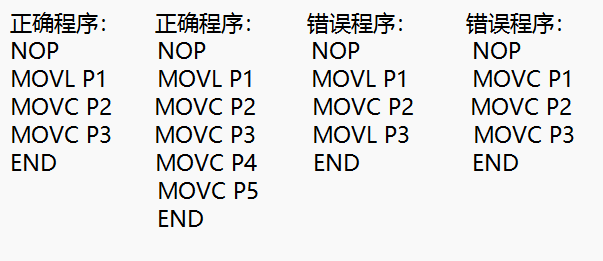

执行下面的程序，不停止时，轨迹走虚线部分，如果在P2点停止，会走实线部分。如果停止也想走实线部分，需要以方式2的程序形式编辑。

方式1

方式2

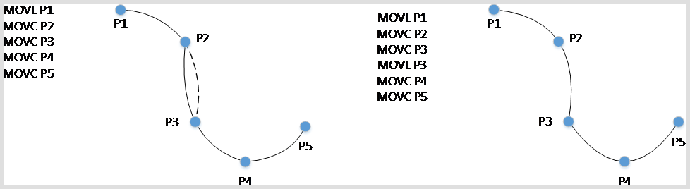
#### 小圆指令

可用于实现整圆类型的轨迹规划和参数化的应用执行。

**CIRA指令：**

功能说明：通过小圆指令，示教圆心点可以实现整圆的轨迹。

格式：ARCCIRA P/PR\<参数1\> VC\=\<参数2\> ACC\=\<参数3\> CNT\=\<参数4\> R\=\<参数5\> OFFSET\=\<参数6\> OVER\=\<参数7\> UF\=\<参数8\> FIFL\=\<参数9\>

\<参数1\>含义：圆心点位置，局部/全局位置变量号；

\<参数2\>含义：圆弧的速度，最大限值为2000，单位mm；

\<参数3\>含义：最大加速度百分比，单位：%，范围：1\-120；

\<参数4\>含义：逼近等级，在该指令中默认是0，不接受其他值；

\<参数5\>含义：目标圆的半径，单位是mm，范围：0\.1\-100；

\<参数6\>含义：起点偏移量（单位是mm）：OFFSET\>0，表示起始点在圆外；OFFSET\=\=0，表示起始点在圆上；OFFSET\<0，表示起始点在圆内；(\-100,100\)；

\<参数7\>含义：终点偏移量；过焊量，单位是mm ；范围：(\-100,100\)；通过R，将OVER的单位转换成角度，如果偏移角度大于60度，则应该报警，即OVER（°）\<60°,

\<参数8\>含义：用户坐标系号，1\-128，用来确认圆平面；

\<参数9\>含义：焊接文件号，1\-32；

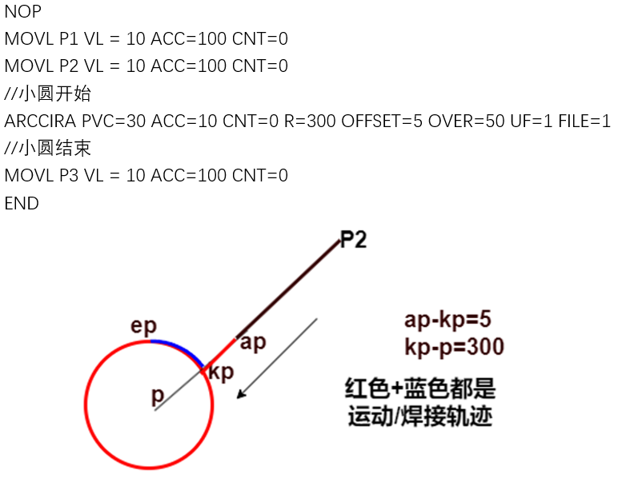

图 3‑9小圆轨迹示意图

| **注意：小圆指令限定“过焊弧度”不大于60度；可以为负角度，代表不画满圆，弧度超过了60度，会有报警。速度为20时，小圆半径R\>\=5mm。示教模式下，在正向运动和联锁（ON）条件下：MOVCIRA/ARCCIRA正常执行画圆；在正向运动和非连锁（OFF）/ 反向条件下：MOVCIRA/ARCCIRA实际执行的是移动指令,移动到圆心 MOVL P。** |
| --- |

#### 螺旋线运动

**MOV SPI指令：**

功能说明：该指令的功能是实现机器人末端的运动轨迹为等距螺旋线。轨迹如下图：

| https://gss1.bdstatic.com/9vo3dSag_xI4khGkpoWK1HF6hhy/baike/c0%3Dbaike80%2C5%2C5%2C80%2C26/sign=f39c4e31c695d143ce7bec711299e967/2934349b033b5bb578d182cc38d3d539b600bcfa.jpg |
| --- |

图3\-10螺旋运动

格式：MOV SPI\<参数1\> VL\=\<参数2\> D\=\<参数3\> SD\=\<参数4\> RTYPE\=\<参数5\> REFP\<参数6\>

参数说明：

\<参数1\>含义：示教点位为螺旋线的圆心坐标位置。

\<参数2\>含义：螺旋线运动的运行速度，单位mm/s，范围受机器人型号限制。

\<参数3\>含义：螺旋线间距，单位mm，范围0\.1\-500。

\<参数4\>含义：螺旋线的停止距离，该值为停止位置点距离圆心的半径值，单位mm，范围0\.1\-1000。

\<参数5\>含义：范围0,1。姿态是否随着旋转同步变化。0\-变；1\-不变。

\<参数6\>含义：指令示教点位为螺旋线圆心坐标位置的正上方，即圆心的Z\+方向（保证螺旋线运动的平面为XY平面）。

举例说明：

NOP

1 MOVJ P1 VL\=600 ACC\=100 CNT\=0

2 MOV SPI VL\=500\.0 D\=100\.0 SD\=120\.0 RTYPE\=0

3 REFP 1

END

作业详解：

MOVJ指令当前示教点为螺旋线的起始位置点，VJ\=50为运动至该起点的速度也可用MOVL指令等。

MOV SPI为螺旋线指令，当前示教点为螺旋线圆心位置点，VL\=500\.0为螺旋线运动线速度，D\=100\.0为螺旋线间距，SD\=120\.0为螺旋线停止位置距离圆心的半径值，姿态会跟随变化。

REFP指令为参考点，当前示教点为圆心位置的Z\+方向。

| **注意：该指令支持暂停、中断、偏移。该指令有较大的姿态变化，请谨慎使用！** |
| --- |

#### 奇异点回避指令

大多数的6轴机器人,手腕姿势的奇异点(J5\=0\)在作业区域的几乎所有位置都有可能发生。机器人通过这些手腕的奇异点或者附近时,由于如下的理由,动作性能是不合适的。

手腕轴的J4轴与J6轴将在短时间内进行回转量大的动作。

限制手腕轴的速度,结果工具中心点的速度将会减慢。

奇异点回避功能可以在执行作业时，回避手腕的奇异点。可以实现手腕轴不会发生过度的回转,能够平顺地通过手腕的奇异点。

**SA奇异点回避指令：**

功能说明：在功能开启后，作业后面的路径奇异点回避功能有效。

格式：SA ON/OFF

参数说明：选择ON/OFF

举例说明：

SA ON

MOVL P1 VL\=600 ACC\=100 CNT\=50

MOVL P2 VL\=600 ACC\=100 CNT\=50

SA OFF

| **注意：**1. **清空堆栈后,默认自动执行《SA OFF》指令,关闭当前奇异点回避状态。** 2. **正反向运动不会通过奇异点,而是运动停留在奇异点前,并报警“3102接近奇异点,无法前进”。** 3. **SHITF/TRANS等偏移运动无法通过奇异点,而是运动停留在奇异点前,并报警“3102接近奇异点,无法前进”。** 4. **外部TCP运动无法通过奇异点,而是运动停留在奇异点前,并报警“3102接近奇异点,无法前进”。** 5. **跟随应用无法通过奇异点,而是运动停留在奇异点前,并报警“3102接近奇异点,无法前进”。** |
| --- |

### 位置信息

位置信息存储机器人的位置和姿势。在对动作指令进行示教时,位置信息同时被写入程序。

位置信息包含基于关节坐标系的关节坐标值、和通过作业空间内的工具位置和姿势来表示的直角坐标值。标准设定下将直角坐标值作为位置来使用。

**位置变量分为P与PR两种类型：**

位置变量P是局部变量：在同一个程序中P变量的序号是相同的，不同程序中P变量序号相同，位置信息也不同。P（1\-7500）是标准的位置存储变量，对动作指令进行示教时，自动记录位置信息。位置号码是用来参照位置变量的号码。位置号码在每次为程序示教动作指令时都被自动配置。第一次配置P1,第二次配置P2,以此类推。

位置变量PR是全局变量：在程序中PR变量的序号是唯一，在任何程序中使用相同的变量号，位置信息是相同的。PR（1\-5630）是用来存储位置信息的变量。

| **注意：****可以在运动指令上，点击位置按键来查看与修改P/PR位置变量的信息，PR的位置信息也可以通过位置变量界面查看与修改。** |
| --- |

**笛卡尔坐标值：**

笛卡尔坐标值有4个要素来定义。工具中心点基于直角坐标系的位置、工具的姿态方向、机器人形态、所使用的笛卡尔坐标系。

| **注释：****机器人本体的直角、工具、用户坐标系，都是一种空间笛卡尔坐标系，新松机器人操作系统位置变量记录所基于直角坐标系，坐标系原点默认在机器人一轴轴线与二轴圆心交汇处。** |
| --- |

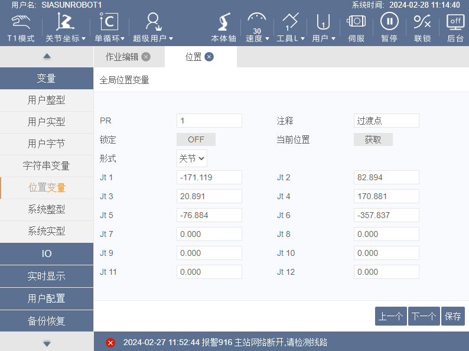

图 3‑11关节坐标系下位置变量

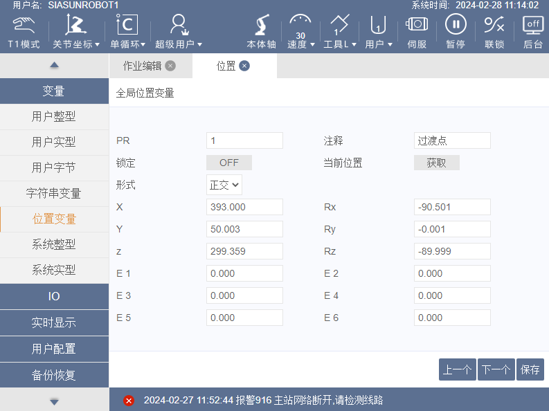

图 3‑12用户坐标系下的位置变量

**参数设置：**

**位置变量号：**

是指在程序中，使用的位置变量编号，在程序中用PR表示，范围1\-5630。

**注释：**

可以为该变量添加中文/英文字母/数字等注释，最多支持36个字符。添加完注释后，作业用到该变量后会自动把注释带入到指令中。显示的形式如下：

MOVJ PR\[2：终点]VJ\=10 ACC\=100 CNT\=0；

**锁定：**

锁定为on时，该位置变量不能被修改，锁定为off时，该位置变量可以被修改。

**当前位置：**

点击【获取】健，可将机器人的当前位置保存到位置变量中，若该位置变量的形式为关节，则将机器人的当前关节值保存到位置变量中；若该位置变量的形式为正交，则将机器人的笛卡尔坐标保存到位置变量中。

**形式：**

可以切换关节/正交两种位置变量的显示形式。

**位置和姿态：**

位置（x，y，z），用3D坐标值来表示TCP点在直角坐标系下的位置。

姿态（Rx，Ry，Rz），以直角坐标系中的X,Y,Z轴旋转角度来表示，如图3‑16所示。

|  |
| --- |

图 3‑13直角、工具、用户坐标系

**确定坐标系号：**

新松机器人有1\-8个工具坐标系号以及1\-8个用户坐标系号，示教时或执行之前，要核实所使用的坐标系号码，确保在执行作业时，所使用的坐标系与示教时的坐标系是同一个号码。

**工具坐标系号（TF）：**

新松机器人支持8个工具坐标系，使用1\-8个号码来确定，机器人默认的工具坐标系就是机械接口的6轴法兰坐标系。

**用户坐标系号UF）：**

新松机器人支持8个用户坐标系，使用1\-8个号码来确定，机器人默认的用户坐标系就是机器人的直角坐标系。

**坐标系的位置值：**

点击主菜单【坐标】\-【用户、工具坐标】\-【设定】，按上、下一页选择坐标系号，可以看到机器人的用户、工具坐标的详细值。

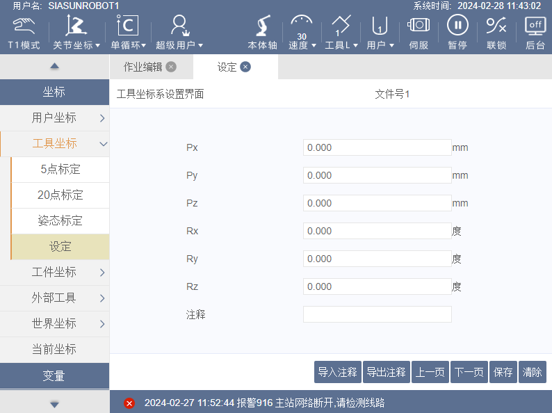

图 3‑14工具坐标系详细值

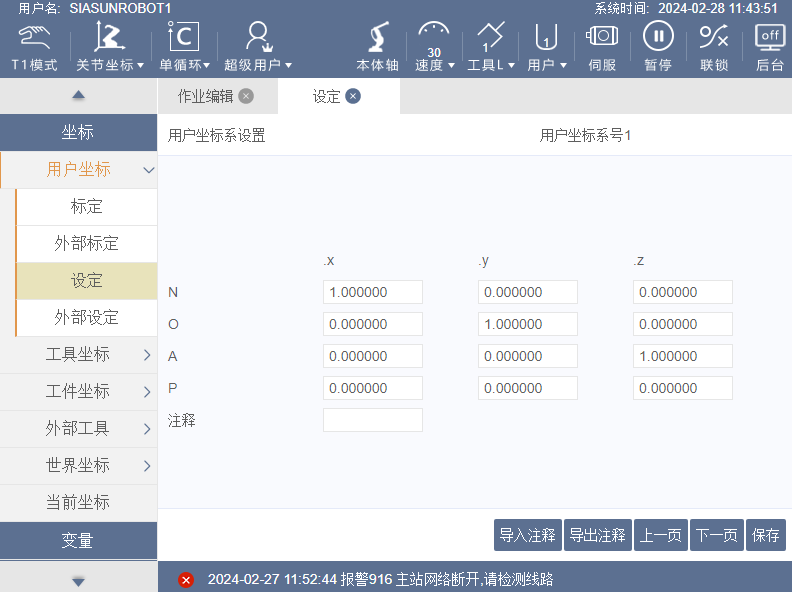

图 3‑15用户坐标系详细值

| **注释：****用户坐标系详细值采用的是T6矩阵形式来记录。** |
| --- |

**关节坐标值：**

关节坐标的位置值由各关节的旋转角度值来确定。

**本体轴：**

J1,J2,J3,J4,J5,J6

**外部轴：**

E1,E2,E3,E4,E5,E6

| **C:\Users\wangshen\Desktop\操作说明增加项\SR210D5.jpg** |
| --- |

图 3‑16关节坐标系

**关节值资料：**

在主菜单【实时显示】\-【实时显示】中，可以查看当前的关节值。

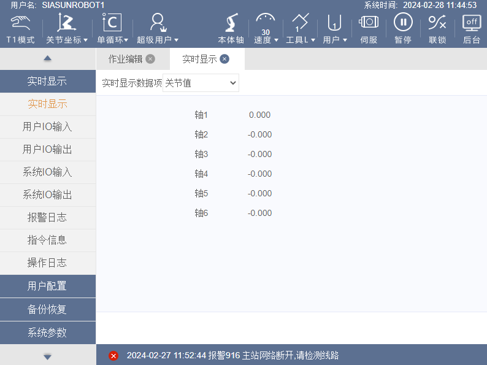

图 3‑17机器人关节值

**位置变量：**

位置变量查看/编辑方式：

PR可以在主菜单【变量】\-【位置变量】中查看/编辑。

PR/P可在作业编辑中选择哪条程序的位置，点击位置，进行查看与编辑。

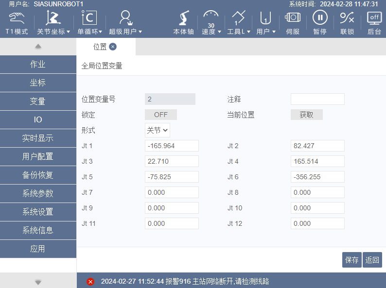

图 3‑18关节坐标系下位置变量

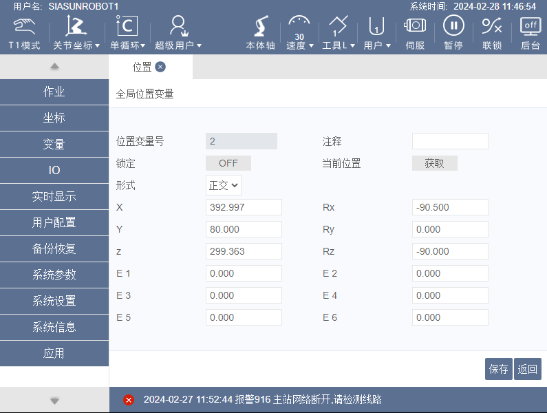

图 3‑19直角坐标系下的位置变量

**参数设置：**

**位置变量号：**

是指在程序中，使用的位置变量编号，在程序中用PR表示，范围1\-5630。

**注释：**

可以为该变量添加中文/英文字母/字母等注释，最多支持36个字符。并把注释信息直接显示到指令中。

**锁定：**

锁定为on时，该位置变量不能被修改，锁定为off时，该位置变量可以被修改。

**当前位置：**

点击【获取】健，可将机器人的当前位置保存到位置变量中，若该位置变量的形式为关节，则将机器人的当前关节值保存到位置变量中；若该位置变量的形式为直角，则将机器人的笛卡尔坐标保存到位置变量中。

**形式：**

可以切换直角/关节两种位置变量的显示形式。

位置变量包含6个子变量PX.1,PX.2,PX.3,PX.4,PX.5,PX.6。分别对应的位置和姿态值（x，y，z，Rx，Ry，Rz）或对应6个轴的关节值（J1、J2、J3、J4、J5、J6）。可以使用指令，将变量值直接赋给这6个子变量。

**位置变量赋值指令：**

**GETTP PR1：**

通过该指令，可以获取该指令之后一条运动点的位置姿态值。并记录在PR1里。

**GETCP PR1：**

通过该指令，可以获取机器人在当前停止位置的位置姿态值。并记录在PR1里。

 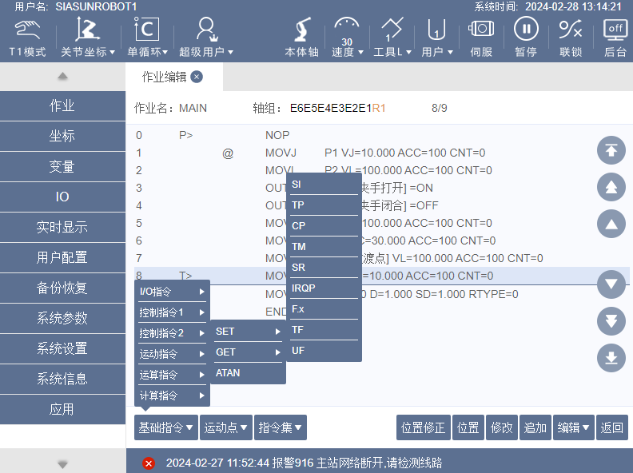

GET TP

GET CP

图 3‑20 GET CP\\TP指令

表格 3\-1 GET CP\\TP指令及参数说明

| GETTP | 功能 | 获取该指令的下一条运动指令中的示教位置将其存到位置变量中，如果下一条不是运动指令则报警并停止运行。 | |
| --- | --- | --- | --- |
| 格式 | GETTP PR\<参数1\> | |
| 说明 | 参数1 | \<位置变量号\>,范围1\-5630； |
| 举例 | GETTP PR1MOVL PR1 VL\=600 ACC\=20 CNT\=100 | |
| GETCP | 功能 | 将机器人当前位置赋值到位置变量中，要确定机器人已经停止运动，否则获取的位置不准确。 | |
| 格式 | GETCP PR\<参数1\> | |
| 说明 | 参数1 | \<位置变量号\>,范围1\-5630； |
| 举例 | GETCP PR1 | |

**位置变量计算指令**

可以通过常规计算指令，对位置变量进行各分量的单独运算或赋值。

 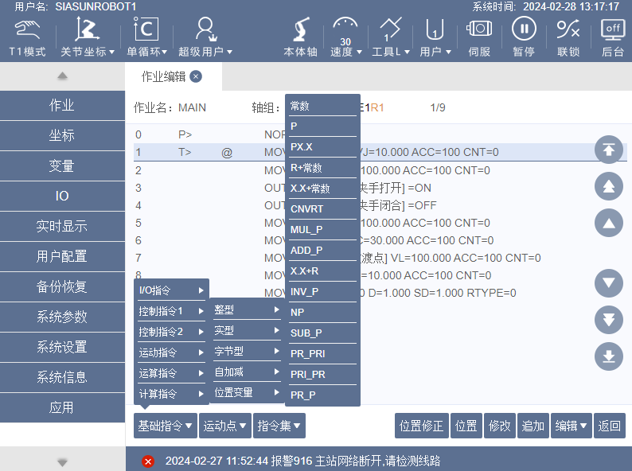

位置变量

图 3‑21位置变量计算指令

**位置变量分量值赋值：**

SET PX.X R：

将实型变量R赋值给位置变量的分量PX.X。

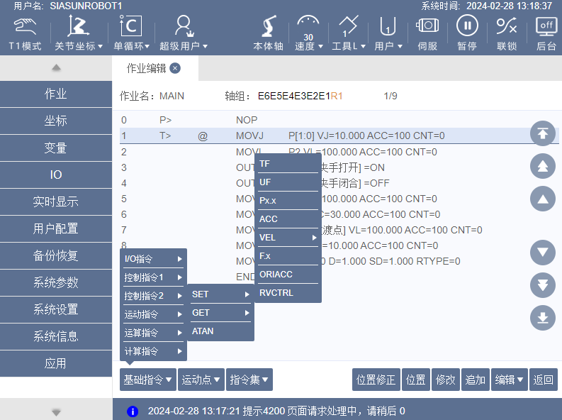

图 3‑22位置分量赋值指令

表格 3\-2位置分量赋值指令及参数说明

| SET PX.X | 功能 | 赋值运算，将实型变量赋值给位置变量的分量。 | |
| --- | --- | --- | --- |
| 格式 | SET PR\<参数1\>.\<参数2\>\<参数3\> | |
| 说明 | 参数1 | \<位置变量号\>，范围：1\-5630； |
| 参数2 | \<位置变量分量\>，范围1\-12：1:X 2:Y 3:Z 4:RX 5:RY 6:RZ 7:E1 8:E2 9:E3 10：E4 11：E5 12：E6 |
| 参数3 | R\<变量号\>，范围1\-520； |
| 举例 | SET PR1\.1 R1 | |

### 移动速度

在程序中可以确定机器人的移动速度。在程序自动执行过程中，移动速度受到指定的百分比，以及移动速度的单位和指定的运动方式影响而不同。

**VJ MOVJ P1 VJ\=10 ACC\=100 CNT\=0**

动作类型为关节运动时，运动速度VJ表示最大移动速度的百分之几。

**VL MOVL P1 VL\=600 ACC\=20 CNT\=100**

动作类型为直线运动时，单位为mm/s。

 .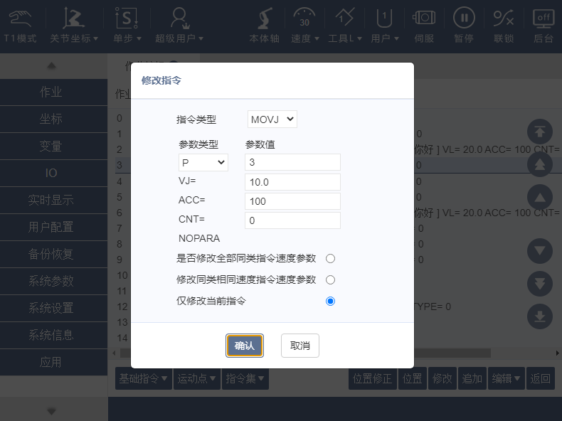

输入速度

图 3‑23运动指令速度输入

**VJ/VL/VC：**

在指令中修改机器人的速度。只修改当前指令的速度，修改全部同类型指令速度（当前作业光标及光标一下的），修改同类型相同速度指令速度（当前作业光标及光标一下的）。

**ACC：**

在指令中修改加速度的百分比。

**CNT：**

修改机器人的连续轨迹等级。

**SET ACC：**

在程序中修改加速度的百分比。

**SET VEL：**

在程序中修改执行速度的百分比。

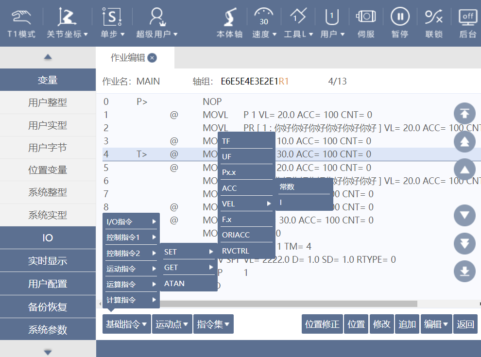

修改加速度及速度指令

图 3‑24修改加速度和速度百分比指令

表格 3\-3设置加速度、速度指令及参数说明

| SET ACC | 功能 | 设置加速度百分比。 | |
| --- | --- | --- | --- |
| 格式 | SET ACC \<参数1\> | |
| 说明 | 参数1 | 常数，范围1\-120；最终加速度\=最大加速度\*参数1； |
| 举例 | SET ACC 80 | |
| SET VEL | 功能 | 设置速度百分比。 | |
| 格式 | SET VEL \<参数1\> | |
| 说明 | 参数1 | 常数，范围0\-100；\<整型用户变量号\> ,范围1\-520；最终速度\=指令速度 \*参数1； |
| 举例 | SET VEL 80SET VEL I10 | |

### 连续轨迹

机器人到达指定位置有两种定位方法：

非连续轨迹；

连续轨迹；

连续轨迹的开启和关闭需要在执行开关中配置，点击主菜单【系统设置】\-【执行开关】。

 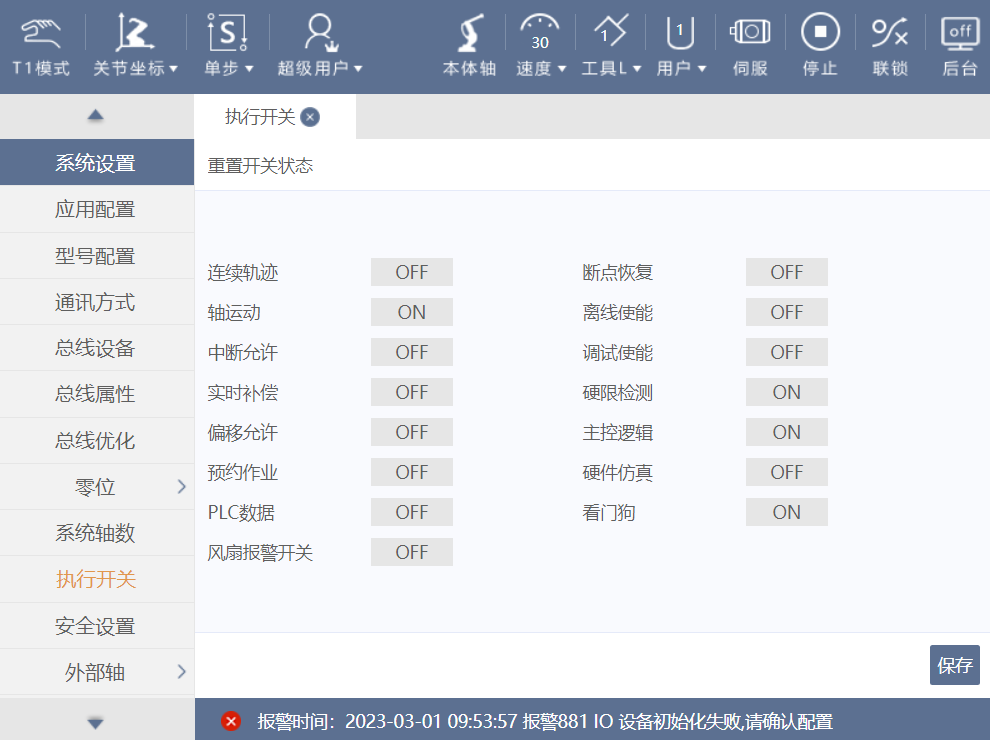

连续轨迹开关

图 3‑25执行开关界面

**非连续轨迹：**

连续轨迹关闭时，机器人在目标点完全停止住，再向下一点移动。

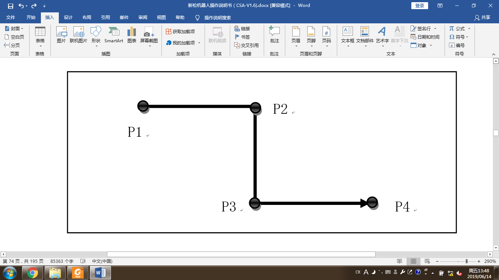

图 3‑26没有开启连续轨迹

**连续轨迹：**

连续轨迹开关开启时。

CNT定位类型：

MOVL P1 V\=200 ACC\=100 CNT\=（0\-100）

根据CNT定位类型,机器人靠近目标位置,但是不在该位置停止而向下一个位置动作。

机器人靠近目标位置到什么程度,由0\-100之间的值来定义。

指定0时,机器人在最到达目标位置停止在运动。指定100时,机器人在目标位置附近不减速而马上向着下一个点开始动作,并通过最过远离目标位置的点。

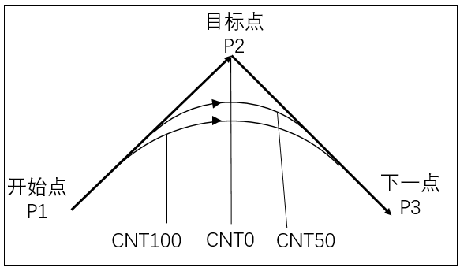

图 3‑27连续轨迹开启时的轨迹

| **注意：****当开启连续轨迹时，一些逻辑指令，如OUT等可以连续运行的指令，会在机器人从快要到达示教点的减速段开始执行。** |
| --- |

## 计算类（变量计算）指令

新松机器人操作系统中变量类型主要有：整型I、实型R、字节型B、字符串变量Str、位置变量PR。通过计算类指令，可以对这些变量进行赋值、基本数学计算等操作。

变量的赋值可以在程序中使用指令进行，也可以在变量界面进行写入和查看。

这些变量在多个程序中，可以同时使用，用来传递数据信息。

变量的用处为：

记录工件数。

记录作业完成次数。

机器人和外围设备之间传递位置信息与相关数据等。

| **注意：****用户变量在机器人断开电源后，仍然可以保存。** |
| --- |

表格 3\-4用户变量

| 数据形式 | 变量号码 | 说明 |
| --- | --- | --- |
| 整型 | I1\-I520 | 变量值的保存范围：\-2147483648\-2147483648； |
| 实型 | R1\-R520 | 变量值的保存范围：\-9999\.999\-9999\.999，精确到小数点后3位； |
| 字节型 | B1\-B100 | 变量值的保存范围：0\-255； |
| 字符串 | Str1\-Str256 | 变量值的保存范围: 可输入长度512个字符； |
| 位置变量 | PR1\-PR5630 | 可以记录关节坐标下的位置值（J1\-J6）或直角坐标系下的位置值（X、Y、Z、Rx、Ry、Rz），如果有外部轴，还可以记录外部轴的位置； |

**整型、实型、字节型数据设置：**

1. 点击主菜单【变量】，选择需要的用户变量形式。

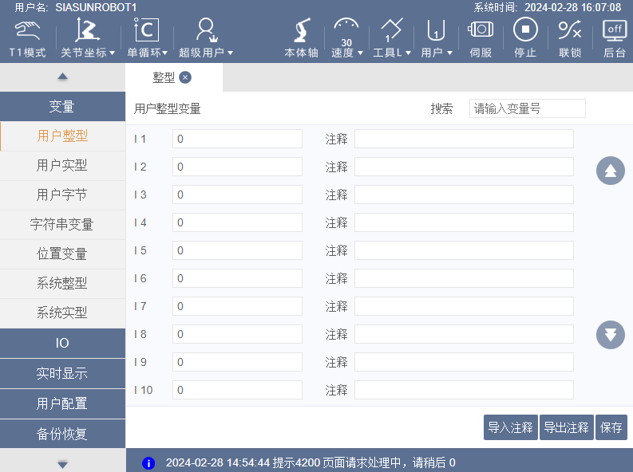

输入变量数据

可搜索变量号

输入注释

图 3‑28用户变量设定界面

1. 点击需要输入的变量数据参数框，输入数据。
2. 点击保存并退出。

**用户变量在程序中的指令：**

**整型变量的指令：**

整型变量的指令菜单。

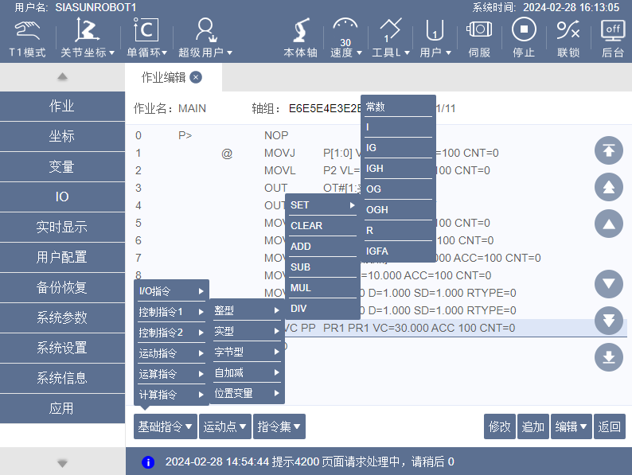

图 3‑29整型计算指令菜单

表格 3\-5整型变量计算指令及参数说明

| 整型 SET | 功能 | 赋值运算，将参数2的值赋给参数1。 | |
| --- | --- | --- | --- |
| 格式 | SET \<参数1\>\<参数2\> | |
| 说明 | 参数1 | I\<变量号\>：整型用户变量,范围1\-520；OG\#\<变量号\>：8位组IO输出，范围1\-8；OGH\#\<变量号\>：16位组IO输出，范围1\-256； |
| 参数2 | 常数，范围\-2147483648–2147483648；I\<变量号\>：整型用户变量，范围1\-520；IG\#\<变量号\>：8位组IO输入，范围1\-8；IGH\#\<变量号\>：16位组IO输入，范围1\-256；IGFA\#\<变量号\>：32位组IO输入，范围1\-128；R\<变量号\>：实型用户变量，范围1\-520； |
| 举例 | SET I1\=100SET I1 I2SET I1 IG\#1SET I1 IGH\#2SET I1 IGFA\#1SET OG\#1 I1SET OGH\#2 I1SET I1 R2 | |
| 整型 CLEAR | 功能 | 清零运算，从参数1到参数2全部清零。 | |
| 格式 | CLEAR I\<参数1\> I\<参数2\> | |
| 说明 | 参数1 | \<整型用户变量号\>,范围1\-520； |
| 参数2 | \<整型用户变量号\>,范围1\-520； |
| 举例 | CLEAR I1 I520 | |
| 整型 ADD | 功能 | 加法运算，参数1与参数2相加，结果存在参数1中。 | |
| 格式 | ADD I\<参数1\> I\<参数2\> | |
| 说明 | 参数1 | \<整型用户变量号\>,范围1\-520； |
| 参数2 | \<整型用户变量号\>,范围1\-520； |
| 举例 | ADD I1 I2 | |
| 整型 SUB | 功能 | 减法运算，参数1与参数2相减，结果存在参数1中。 | |
| 格式 | SUB I\<参数1\> I\<参数2\> | |
| 说明 | 参数1 | \<整型用户变量号\>,范围1\-520； |
| 参数2 | \<整型用户变量号\>,范围1\-520； |
| 举例 | SUB I1 I2 | |
| 整型 MUL | 功能 | 乘法运算，参数1与参数2相乘，结果存在参数1中。 | |
| 格式 | MUL I\<参数1\> I\<参数2\> | |
| 说明 | 参数1 | \<整型用户变量号\>,范围1\-520； |
| 参数2 | \<整型用户变量号\>,范围1\-520； |
| 举例 | MUL I1 I2 | |
| 整型 DIV | 功能 | 除法运算，参数1与参数2相除，结果存在参数1中。 | |
| 格式 | DIV I\<参数1\> I\<参数2\> | |
| 说明 | 参数1 | \<整型用户变量号\>,范围1\-520； |
| 参数2 | \<整型用户变量号\>,范围1\-520； |
| 举例 | DIV I1 I2 | |

**实型变量的指令：**

实型变量的指令菜单。

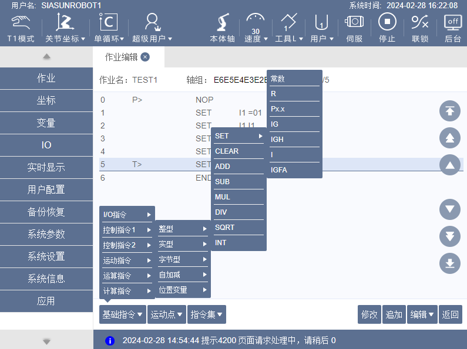

图 3‑30实型计算指令菜单

表格 3\-6实型变量计算指令及参数说明

| 实型 SET | 功能 | 赋值运算，将参数2的值赋给参数1。 | | | |
| --- | --- | --- | --- | --- | --- |
| 格式 | SET \<参数1\>\<参数2\> | | | |
| 说明 | 参数1 | | | R\<变量号\>：实型用户变量,范围1\-520； |
| 参数2 | | | 常数，范围\-9999\.999\-9999\.999R\<变量号\>：实型用户变量，范围1\-520；P\<位置变量号\>.\<位置变量分量\>，\<位置变量号\>：范围1\-5630，\<位置变量分量\>：范围1\-12；IG\#\<变量号\>：8位组IO输入，范围1\-8；IGH\#\<变量号\>：16位组IO输入，范围1\-64；I\<变量号\>：整型用户变量,范围1\-520；IGFA\#\<变量号\>：32位组IO输入，范围1\-32； |
| 举例 | SET R1\=100SET R1 R2SET R1 P1\.1SET R1 IG\#1SET R1 IGH\#2SET R1 I1SET R1 IGFA\#2 | | | |
| 实型 CLEAR | 功能 | 清零运算，从参数1到参数2全部清零。 | | | |
| 格式 | CLEAR R\<参数1\> R\<参数2\> | | | |
| 说明 | 参数1 | | | \<实型用户变量号\>,范围1\-520； |
| 参数2 | | | \<实型用户变量号\>,范围1\-520； |
| 举例 | CLEAR R1 R520 | | | |
| 实型 ADD | 功能 | 加法运算，参数1与参数2相加，结果存在参数1中。 | | | |
| 格式 | ADD R\<参数1\> R\<参数2\> | | | |
| 说明 | 参数1 | | | \<实型用户变量号\>,范围1\-520； |
| 参数2 | | | \<实型用户变量号\>,范围1\-520； |
| 举例 | ADD R1 R2 | | | |
| 实型 SUB | 功能 | 减法运算，参数1与参数2相减，结果存在参数1中。 | | | |
| 格式 | SUB R\<参数1\> R\<参数2\> | | | |
| 说明 | 参数1 | | | \<实型用户变量号\>,范围1\-520； |
| 参数2 | | | \<实型用户变量号\>,范围1\-520； |
| 举例 | SUB R1 R2 | | | |
| 实型 MUL | 功能 | 乘法运算，参数1与参数2相乘，结果存在参数1中。 | | | |
| 格式 | MUL R\<参数1\> R\<参数2\> | | | |
| 说明 | 参数1 | | | \<实型用户变量号\>,范围1\-520； |
| 参数2 | | | \<实型用户变量号\>,范围1\-520； |
| 举例 | MUL R1 R2 | | | |
| 实型 DIV | 功能 | 除法运算，参数1与参数2相除，结果存在参数1中。 | | | |
| 格式 | DIV R\<参数1\> R\<参数2\> | | | |
| 说明 | 参数1 | | | \<实型用户变量号\>,范围1\-520； |
| 参数2 | | | \<实型用户变量号\>,范围1\-520； |
| 举例 | DIV R1 R2 | | | |
| 实型SQRT | 功能 | 开方运算，将参数2进行开方运算，将结果存在参数1中。 | | | |
| 格式 | SQRT R\< 参数1\> R\< 参数2\> | | | |
| 说明 | 参数1 | | \<实型用户变量号\>,范围1\-520； | |
| 参数2 | | \<实型用户变量号\>,范围1\-520； | |
| 举例 | SQRT R1 R2 | | | |
| 实型INT | 功能 | 强制类型转换指令，将参数2的实型数据强制转换成整型数据并保存在参数1中。 | | | |
| 格式 | INT I\<参数1\> R\<参数2\> | | | |
| 说明 | 参数1 | \<整型用户变量号\>,范围1\-520； | | |
| 参数2 | \<实型用户变量号\>,范围1\-520； | | |
| 举例 | INTI1 R2 | | | |

**字节型变量的指令：**

字节型变量的指令菜单。

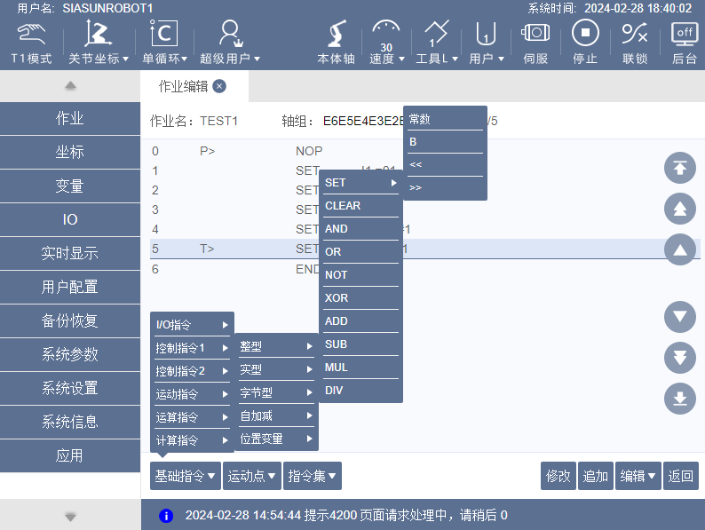

图 3‑31字节型计算指令菜单

表格 3\-7字节型计算指令及参数说明

| 字节型 SET | 功能 | 赋值运算，将参数2的值赋给字节型参数1 | |
| --- | --- | --- | --- |
| 格式 | SET \<参数1\>\<参数2\> | |
| 说明 | 参数1 | B\<变量号\>：字节型用户变量,范围1\-100 |
| 参数2 | ·\=常数，范围0\-255·B\<变量号\>：字节型用户变量，范围1\-100·\<\<常数，左移位数，范围1\-8·\>\>常数，右移位数，范围1\-8 |
| 举例 | SET B1\=100SET B1 B2SET B1 \<\<1SET B1 \>\>1 | |
| 字节型 CLEAR | 功能 | 清零运算，从参数1到参数2全部清零。 | |
| 格式 | CLEAR B\<参数1\> B\<参数2\> | |
| 说明 | 参数1 | \<字节型用户变量号\>,范围1\-100； |
| 参数2 | \<字节型用户变量号\>,范围1\-100； |
| 举例 | CLEAR B1 B100 | |
| 字节型 AND | 功能 | 按位与运算，参数1与参数2按位求与，结果存在参数1中。 | |
| 格式 | AND B\<参数1\> B\<参数2\> | |
| 说明 | 参数1 | \<字节型用户变量号\>,范围1\-100； |
| 参数2 | \<字节型用户变量号\>,范围1\-100； |
| 举例 | AND B1 B2 | |
| 字节型 OR | 功能 | 按位或运算，参数1与参数2按位求或，结果存在参数1中。 | |
| 格式 | OR B\<参数1\> B\<参数2\> | |
| 说明 | 参数1 | \<字节型用户变量号\>,范围1\-100； |
| 参数2 | \<字节型用户变量号\>,范围1\-100； |
| 举例 | OR B1 B2 | |
| 字节型 NOT | 功能 | 按位反运算，参数2按位求反，结果存在参数1中。 | |
| 格式 | NOT B\<参数1\> B\<参数2\> | |
| 说明 | 参数1 | \<字节型用户变量号\>,范围1\-100； |
| 参数2 | \<字节型用户变量号\>,范围1\-100； |
| 举例 | NOT B1 B2 | |
| 字节型 XOR | 功能 | 按位异或运算，参数1与参数2按位求异或，结果存在参数1中。 | |
| 格式 | XOR B\<参数1\> B\<参数2\> | |
| 说明 | 参数1 | \<字节型用户变量号\>,范围1\-100； |
| 参数2 | \<字节型用户变量号\>,范围1\-100； |
| 举例 | XOR B1 B2 | |
| 字节型 ADD | 功能 | 加法运算，参数1与参数2相加，结果存在参数1中。 | |
| 格式 | ADD B\<参数1\> B\<参数2\> | |
| 说明 | 参数1 | \<字节型用户变量号\>,范围1\-100； |
| 参数2 | \<字节型用户变量号\>,范围1\-100； |
| 举例 | ADD B1 B2 | |
| 字节型 SUB | 功能 | 减法运算，参数1与参数2相减，结果存在参数1中。 | |
| 格式 | SUB B\<参数1\> B\<参数2\> | |
| 说明 | 参数1 | \<字节型用户变量号\>,范围1\-100； |
| 参数2 | \<字节型用户变量号\>,范围1\-100； |
| 举例 | SUB B1 B2 | |
| 字节型 MUL | 功能 | 乘法运算，参数1与参数2相乘，结果存在参数1中。 | |
| 格式 | MUL B\<参数1\> B\<参数2\> | |
| 说明 | 参数1 | \<字节型用户变量号\>,范围1\-100； |
| 参数2 | \<字节型用户变量号\>,范围1\-100； |
| 举例 | MUL B1 B2 | |
| 字节型 DIV | 功能 | 除法运算，参数1与参数2相除，结果存在参数1中。 | |
| 格式 | DIV B\<参数1\> B\<参数2\> | |
| 说明 | 参数1 | \<字节型用户变量号\>,范围1\-100； |
| 参数2 | \<字节型用户变量号\>,范围1\-100； |
| 举例 | DIV B1 B2 | |

**用户变量的自加减指令：**

用户变量的自加减指令菜单。

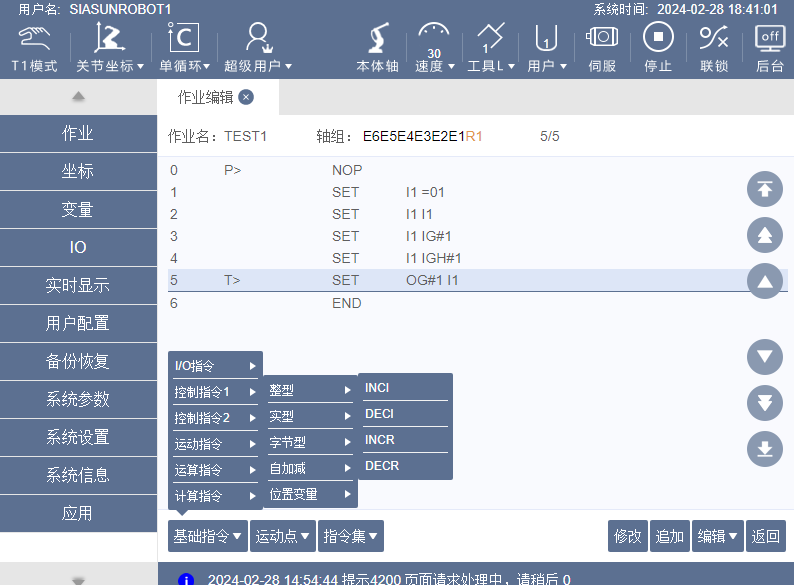

图 3‑32变量的自加减菜单

表格 3\-8用户变量自加减指令及说明

| 自加减 INCI | 功能 | 自加1。 | |
| --- | --- | --- | --- |
| 格式 | INC I\<参数1\> | |
| 说明 | 参数1 | \<整型用户变量号\>,范围1\-520； |
| 举例 | INC I1 | |
| 自加减 DECI | 功能 | 自减1。 | |
| 格式 | DEC I\<参数1\> | |
| 说明 | 参数1 | \<整型用户变量号\>,范围1\-520； |
| 举例 | DEC I1 | |
| 自加减 INCR | 功能 | 自加1。 | |
| 格式 | INC R\<参数1\> | |
| 说明 | 参数1 | \<实型用户变量号\>,范围1\-520； |
| 举例 | INC R1 | |
| 自加减 DECR | 功能 | 自减1。 | |
| 格式 | DEC R\<参数1\> | |
| 说明 | 参数1 | \<实型用户变量号\>,范围1\-520； |
| 举例 | DEC R1 | |

**字符串变量的指令：**

字符串变量的指令菜单。

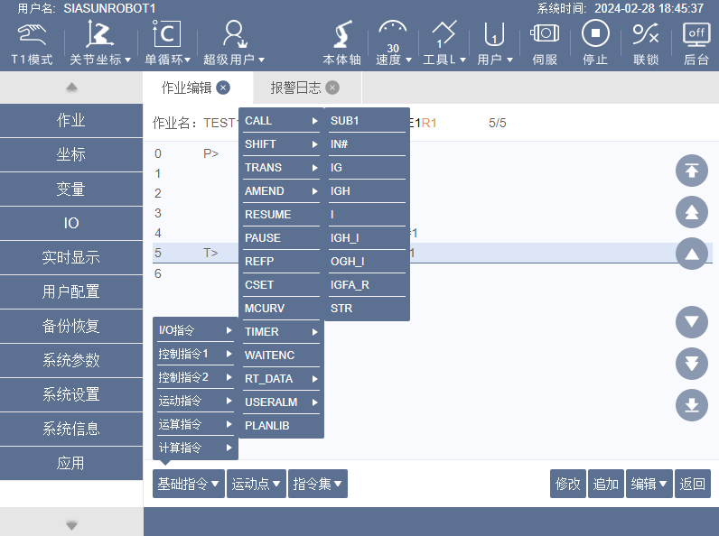

图 3‑33字符串变量有关指令菜单

表格 3‑9字符串变量指令及说明

| 调用程序CALL STR | 功能 | 通过字符串调用程序(需要让字符串内容与要调用的程序名称相同)。 | |
| --- | --- | --- | --- |
| 格式 | CALL STR\<参数1\> | |
| 说明 | 参数1 | \<字符串变量号\>,范围1\-60； |
| 举例 | CALL STR1 | |

**位置变量的指令：**

位置变量的指令菜单。

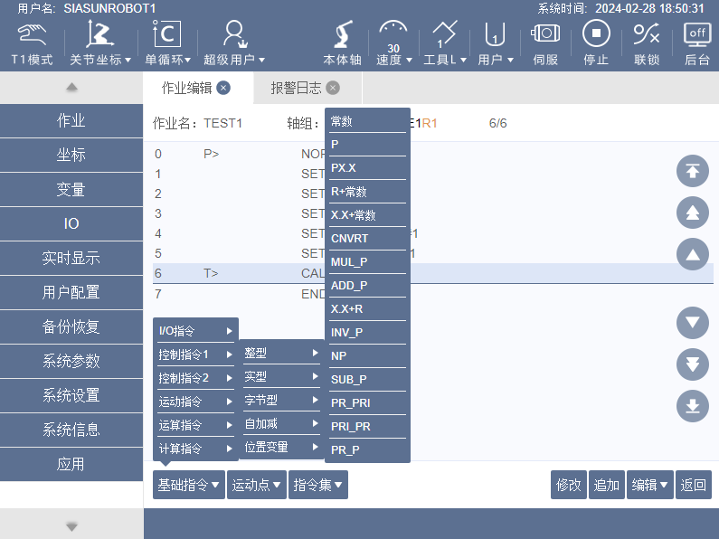

图 3‑34位置变量的计算指令菜单

表格 3\-10位置变量计算指令及参数说明

| 位置变量常数 | 功能 | 赋值运算，将实型常数赋值给位置变量的分量。 | |
| --- | --- | --- | --- |
| 格式 | SET PR\<参数1\>. \<参数2\>\<参数3\> | |
| 说明 | 参数1 | \<位置变量号\>，范围：1\-5630； |
| 参数2 | \<位置变量分量\>，范围1\-12：1:X 2:Y 3:Z 4:RX 5:RY 6:RZ 7:E1 8:E2 9:E3 10：E4 11：E5 12：E6； |
| 参数3 | \=常数，范围\-9999\.999\-10000；注：可输入范围为\-9999\.999\-9999\.999，但实际支持范围X、Y、Z为\-5000\.0\-5000\.0，RX、RY、RZ为\-180\-180，外部轴E1\-E6范围\-9999\.999\-9999\.999； |
| 举例 | SET PR1\.1\=100\.6 | |
| 位置变量P | 功能 | 赋值运算，将参数2的位置变量赋值给参数1中的位置变量。 | |
| 格式 | SET PR\<参数1\> PR\<参数2\> | |
| 说明 | 参数1 | \<位置变量号\>，范围：1\-5630； |
| 参数2 | \<位置变量号\>，范围：1\-5630； |
| 举例 | SET PR1 PR2 | |
| 位置变量PX.X | 功能 | 赋值运算，将参数3的位置变量分量值赋值给参数1中的位置变量分量值。 | |
| 格式 | SET PR\<参数1\>.\<参数2\> P\<参数3\>.\<参数4\> | |
| 说明 | 参数1 | \<位置变量号\>，范围：1\-5630； |
| 参数2 | \<位置变量分量\>，范围：1\-12； |
| 参数3 | \<位置变量号\>，范围：1\-5630； |
| 参数4 | \<位置变量分量\>，范围：1\-12； |
| 举例 | SET PR1\.2 PR2\.2 | |
| 位置变量R\+常数 | 功能 | 赋值运算，将实型变量值\+常量值后赋值给位置变量分量。 | |
| 格式 | SET PR\<参数1\>.\<参数2\> R\<参数3\>\+\<参数4\> | |
| 说明 | 参数1 | \<位置变量号\>，范围：1\-5630； |
| 参数2 | \<位置变量分量\>，范围：1\-12； |
| 参数3 | \<实型变量号\>，范围：1\-520； |
| 参数4 | \<实型变量\>，范围：\-9999\.999\-9999\.999；注：实型变量可输入范围为\-9999\.999\-9999\.999，但位置变量各分量实际支持范围X、Y、Z为\-5000\.0\-5000\.0，RX、RY、RZ为\-180\-180，外部轴E1\-E6范围\-9999\.999\-9999\.999； |
| 举例 | SET PR1\.1 R1\+100\.900 | |
| 位置变量X.X\+常数 | 功能 | 赋值运算，将参数3的位置变量的分量值参数4加上常数，赋值给参数1中的位置变量的分量值参数2。 | |
| 格式 | SET PR\<参数1\>.\<参数2\> PR\<参数3\>.\<参数4\>\+\<参数5\> | |
| 说明 | 参数1 | \<位置变量号\>，范围：1\-5630； |
| 参数2 | \<位置变量分量\>，范围：1\-12； |
| 参数3 | \<位置变量号\>，范围：1\-5630； |
| 参数4 | \<位置变量分量\>，范围：1\-12； |
| 参数5 | \<实型变量\>，范围：\-9999\.999\-9999\.999；注：实型变量可输入范围为\-9999\.999\-9999\.999，但位置变量各分量实际支持范围X、Y、Z为\-5000\.0\-5000\.0，RX、RY、RZ为\-180\-180，外部轴E1\-E6范围\-9999\.999\-9999\.999； |
| 举例 | SET PR1\.1 PR2\.1\+100\.900 | |
| 位置变量CNVRT | 功能 | 转换运算，将参数2的位置转换成直角坐标系的位置变量后存储在参数1的位置变量中。 | |
| 格式 | CNVRT PR\<参数1\> PR\<参数2\> F\#\<参数3\> | |
| 说明 | 参数1 | \<位置变量号\>，范围：1\-5630； |
| 参数2 | \<位置变量号\>，范围：1\-5630； |
| 参数3 | \<坐标系号\>,2:直角坐标系; |
| 举例 | CNVRT PR1 PR2 F\#2 将PR2在用户坐标系下的位置转换到直角坐标系下的位置后存储到PR1中。 | |
| 位置变量MUL\_P | 功能 | 乘法运算，将参数1与参数2相乘，并将结果存储到参数3。 | |
| 格式 | MUL\_P PR\<参数1\> PR\<参数2\> PR\<参数3\> | |
| 说明 | 参数1 | \<位置变量号\>，范围：1\-5630； |
| 参数2 | \<位置变量号\>，范围：1\-5630； |
| 参数3 | \<位置变量号\>，范围：1\-5630； |
| 举例 | MUL\_P PR1 PR2 PR3 | |
| 位置变量X.X\+R | 功能 | 赋值运算，将参数3的位置变量分量值加上一个实型变量值后赋值给参数1中位置变量分量。 | |
| 格式 | SET PR\<参数1\>.\<参数2\> PR\<参数3\>.\<参数4\>\+R\<参数5\> | |
| 说明 | 参数1 | \<位置变量号\>，范围：1\-5630； |
| 参数2 | \<位置变量分量\>，范围：1\-12； |
| 参数3 | \<位置变量号\>，范围：1\-5630； |
| 参数4 | \<位置变量分量\>，范围：1\-12； |
| 参数5 | \<实型变量号\>，范围1\-520； |
| 举例 | SET PR1\.1 PR1\.1\+R1 | |
| 位置变量ADD\_P | 功能 | 加法运算，将参数1与参数2相加，并将结果存储到参数3。 | |
| 格式 | MUL\_P PR\<参数1\> PR\<参数2\> PR\<参数3\> | |
| 说明 | 参数1 | \<位置变量号\>，范围：1\-5630； |
|  | 参数2 | \<位置变量号\>，范围：1\-5630； |
|  | 参数3 | \<位置变量号\>，范围：1\-5630； |
| 举例 | ADD\_P PR1 PR2 PR3 | |
| 位置变量INV\_P | 功能 | PR1等于PR2的逆运算。 | |
| 格式 | INV\_P PR\<参数1\> PR\<参数2\> | |
| 说明 | 参数1 | \<位置变量号\>，范围：1\-5630； |
|  | 参数2 | \<位置变量号\>，范围：1\-5630； |
| 举例 | INV\_P PR1 PR2 | |

## I/O指令

I/O类指令，可以改变对外部设备输出信号的状态，或者读取输入设备状态的指令。

数字I/O、组I/O指令。

模拟I/O指令。

### 数字I/O、组I/O指令

**OUT指令：**

OUT为直接输出。

OUT\_P为距离输出，信号指令在距离上一个目标位置一定距离时下发，单位mm。

如：MOVL P1 ,OUT\_P OT\#1\=ON D\=1\.0，是该信号距离P1点位1mm时输出该信号。

OUT\_T为时间输出，信号指令在距离上一个目标位置一定时间下发，单位s。

如：MOVL P1 ,OUT\_T OT\#1\=ON T\=1\.0，是该信号离P1点位剩余1s时输出该信号。

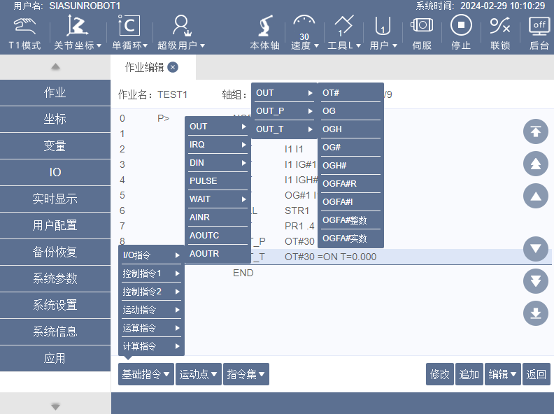

图 3‑35 OUT指令菜单

表格 3\-11 OUT指令及参数说明

| OUT OT\# | 功能 | IO输出，单个IO。 | |
| --- | --- | --- | --- |
| 格式 | OUT \#\<参数1\>\=\<参数2\> | |
| 说明 | 参数1 | \<IO号\>，IO号范围1\-4096； |
| 参数2 | \<IO状态\>，OFF代表断开机器人输出信号，ON代表接通机器人输出信号； |
| 举例 | OUT OT\#1 \=ONOUT OT\#2 \=OFF | |
| OUT OG | 功能 | IO输出，8位组IO。 | |
| 格式 | OUT OG\#\<参数1\>\=\<参数2\> | |
| 说明 | 参数1 | \<8位组IO号\>，组IO号范围1\-8； |
| 参数2 | \<组IO数值\>，常数范围0\-255，组IO的信号可通过界面进行配置（详键3\.1\.2 组I/O说明）； |
| 举例 | OUT OG\#1 \=100 | |
| OUT OGH | 功能 | IO输出，16位组IO。 | |
| 格式 | OUT OGH\#\<参数1\>\=\<参数2\> | |
| 说明 | 参数1 | \<16位组IO号\>，组IO号范围1\-256； |
|  | 参数2 | \<16位组IO号\>，无需配置，1到16为第一组，17到32为第二组，总共支持256组，常数范围0\-65535； |
| 举例 | OUT OGH\#1 \=10000 | |
| OUT OGFA\#R | 功能 | IO输出，实型变量赋值OGFA给32位组IO。 | |
| 格式 | OUT OGFA\#\<参数1\>\=R\<参数2\> | |
| 说明 | 参数1 | \<32位组IO号\>，组IO号范围1\-128，OGFA为32位组IO，无需配置，1到32为第一组，33到64为第二组，总共支持128组； |
| 参数2 | \<实型变量号\>，实型变量R的范围1\-520； |
| 举例 | OUT OGFA\#2 \= R1 | |
| OUT OGFA\#I | 功能 | IO输出，整型变量赋值OGFA给32位组IO。 | |
| 格式 | OUT OGFA\#\<参数1\>\=I\<参数2\> | |
| 说明 | 参数1 | \<32位组IO号\>，组IO号范围1\-128，OGFA为32位组IO，无需配置，1到32为第一组，33到64为第二组，总共支持128组； |
| 参数2 | \<整型变量号\>，整型变量I的范围1\-520； |
| 举例 | OUT OGFA\#2 \= I1 | |
| OUT OG\# | 功能 | IO输出，整型变量赋值给8位组IO。 | |
| 格式 | OUT OG\#\<参数1\>\=I\<参数2\> | |
| 说明 | 参数1 | \<8位组IO号\>，组IO号范围1\-8,G为8位组IO，组IO中的IO位号可以通过界面配置； |
| 参数2 | \<整型变量号\>，整型变量I的范围1\-520； |
| 举例 | OUT OG\#1 \=I100 | |
| OUT OGH\# | 功能 | IO输出，整型变量赋值给16位组IO。 | |
| 格式 | OUT OGH\#\<参数1\>\=I\<参数2\> | |
| 说明 | 参数1 | \<16位组IO号\>，无需配置，1到16为第一组，17到32为第二组，总共支持256组，常数范围0\-65535； |
| 参数2 | \<整型变量号\>，整型变量I的范围1\-520； |
| 举例 | OUT OGH\#1 \=I100 | |
| OUT OGFA\#整数 | 功能 | IO输出，将整数赋值OGFA给32位组IO。 | |
| 格式 | OUT OGFA\#\<参数1\>\=\<参数2\> | |
| 说明 | 参数1 | \<32位组IO号\>，组IO号范围1\-128，OGFA为32位组IO，无需配置，1到32为第一组，33到64为第二组，总共支持128组； |
| 参数2 | 整数； |
| 举例 | OUT OGFA\#2 \= 100 | |
| OUT OGFA\#实数 | 功能 | IO输出，将实数赋值OGFA给32位组IO。 | |
| 格式 | OUT OGFA\#\<参数1\>\=\<参数2\> | |
| 说明 | 参数1 | \<32位组IO号\>，组IO号范围1\-128，OGFA为32位组IO，无需配置，1到32为第一组，33到64为第二组，总共支持128组； |
| 参数2 | 实数； |
| 举例 | OUT OGFA\#2 \= 99\.999 | |
| OUT\_P | 功能 | IO输出，路径中输出IO，根据距离输出。 | |
| 格式 | OUT\_P OT\#\<参数1\>\=\<参数2\> D\=\<参数3\> | |
| 说明 | 参数1 | \<IO号\>，IO号范围1\-4096； |
| 参数2 | \<IO状态\>，0代表断开机器人输出信号，1代表接通机器人输出信号； |
| 参数3 | 正数时，信号指令是基于上一个目标位置，向下一个位置行走，达到距离时下发；负数时，信号指令是基于向上一个目标位置行走，剩余距离时下发；单位mm，范围\-1000\-1000； |
| 举例 | MOVL P1 VL\=600 ACC\=20 CNT\=100OUT\_P OT\#1 \=1 D\=1\.0 P1向下一点走1mm的位置输出MOVL P2 VL\=600 ACC\=20 CNT\=100 | |
| OUT\_T | 功能 | IO输出，路径中输出IO，根据时间输出。 | |
| 格式 | OUT\_T OT\#\<参数1\>\=\<参数2\> T\=\<参数3\> | |
| 说明 | 参数1 | \<IO号\>，IO号范围1\-4096； |
| 参数2 | \<IO状态\>，0代表断开机器人输出信号，1代表接通机器人输出信号； |
| 参数3 | 正数时，信号指令是基于上一个目标位置，向下一个位置行走，达到时间时下发；负数时，信号指令是基于向上一个目标位置行走，剩余时间时下发；单位s，范围\-30\-30； |
| 举例 | MOVL P1 VL\=600 ACC\=20 CNT\=100OUT\_T OT\#1 \=1 T\=1\.0 P1向下一点走1s时输出MOVL P2 VL\=600 ACC\=20 CNT\=100 | |

**DIN指令：**

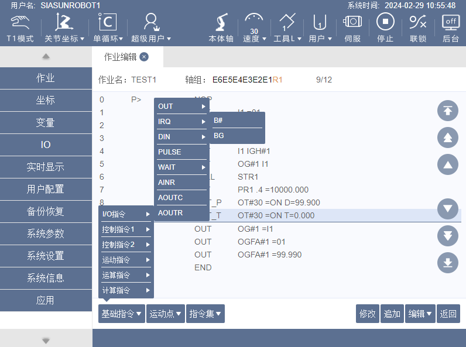

图 3‑36 DIN指令菜单

表格 3\-12 DIN指令及参数说明

| DIN B\# | 功能 | 将输入IO位状态赋值给字节变量。输入信号为ON则变量为1，输入信号为OFF则变量为0。 | |
| --- | --- | --- | --- |
| 格式 | DIN B\<参数1\> IN\#\<参数2\> | |
| 说明 | 参数1 | \<字节型用户变量号\>，范围1\-100； |
| 参数2 | \<IO号\>，范围1\-4096； |
| 举例 | DIN B1 IN\#1 | |
| DIN BG | 功能 | 将输入组IO状态赋值给字节变量。 | |
| 格式 | DIN B \<参数1\> IG\#\<参数2\> | |
| 说明 | 参数1 | \<字节型用户变量号\>，范围1\-100； |
| 参数2 | \<输入组号\>，范围1\-8； |
| 举例 | DIN B1 IG\#1 | |

**PULSE指令：**

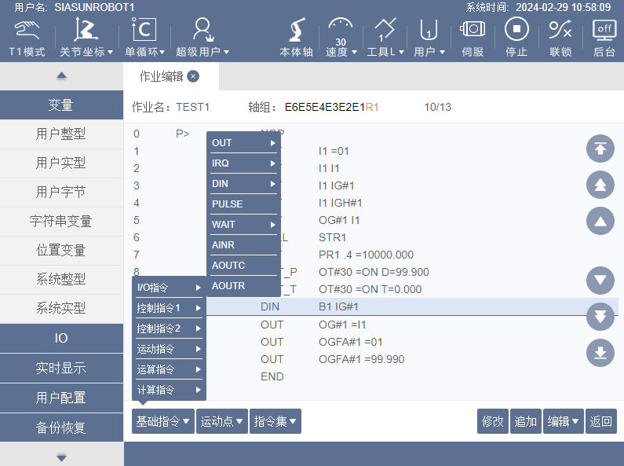

图 3‑37 PULSE指令

表格 3\-13 PULSE指令及参数说明

| PULSE | 功能 | 输出IO状态，并保持一定时间后复位。 | |
| --- | --- | --- | --- |
| 格式 | PULSE OT\#\<参数1\>\=\<参数2\> T\=\<参数3\> | |
| 说明 | 参数1 | \<IO号\>，IO号范围1\-4096； |
| 参数2 | \<IO状态\>，OFF代表断开机器人输出信号，ON代表接通机器人输出信号； |
| 参数3 | 含义：等待时间。表示保持信号的时间，过了该时间信号复位，单位：s，范围0\-999\.000； |
| 举例 | PULSE OT\#30 \=ON T\=1把30号用户IO置为ON，并保持1秒钟后复位为OFF. 如果30信号本来就是ON状态，不会将30信号先置为OFF，再置为ON，而是直接从指令执行开始时计时1秒，计时结束后将30信号置为OFF，并且一直保持OFF状态，直到执行到对30信号的其它处理指令； | |

**WAIT指令：**

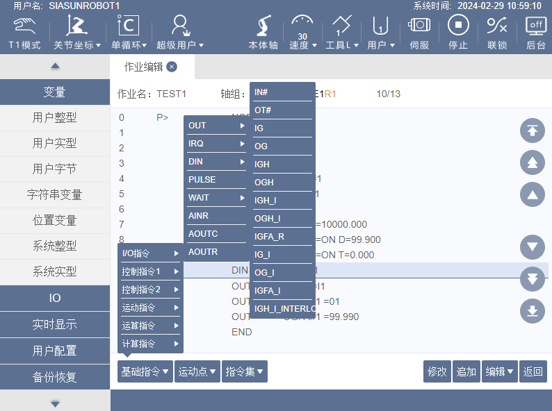

图 3‑38 WAIT指令菜单

表格 3\-14 WAIT指令及参数菜单

| WAIT | 功能 | 等待条件满足。 | |
| --- | --- | --- | --- |
| 格式 | WAIT \<参数1\>\=\<参数2\> T\=\<参数3\> | |
| 说明 | 参数1 | \<等待条件\>IN\#\<输入号\>，范围1\-4096；OUT\#\<输出号\>，范围1\-4096；IG\<8位组输入号\>，范围1\-8；OG\<8位组输出号\>，范围1\-8；IGH\<16位组输入号\>，范围1\-256；OGH\<16位组输出号\>，范围1\-256；IGH\_I\<16位组输出号\>，范围1\-256；OGH\_I\<16位组输出号\>，范围1\-256；IGFA\_R\<32位组输出号\>，范围1\-128；IG\_I\<8位组输出号\>，范围1\-8；OG\_I\<8位组输出号\>，范围1\-8；IGFA\_I\<32位组输出号\>，范围1\-128；IGH\_I\_INTERLOCK\<16位组输出号\>，范围1\-256； |
| 参数2 | \<等待条件的值\>IN\#\=\<输入信号值\>，OFF信号为低电平时，条件满足；ON入信号为高电平时，条件满足；OUT\#\=\<输出信号值\>，OFF信号为低电平时，条件满足；ON入信号为高电平时，条件满足；IG\=\<8位组输入的值\>，范围1\-255；OG\=\<8位组输出号的值\>，范围1\-255；IGH\=\<16位组输入号的值\>，范围1\-65535；OGH\=\<16位组输出号的值\>，范围1\-65535；IGH\_I\=\<16位组输入号的值\>，范围1\-520；OGH\_I\=\<16位组输出号的值\>，范围1\-520；IGFA\_R\=\<32位组输入号的值\>,范围1\-520；IG\_I\=I\<8位组输出号\>，范围1\-520；OG\_I\=I\<8位组输出号\>，范围1\-520；IGFA\_I\=I\<32位组输出号\>，范围1\-520；IGH\_I\_INTERLOCK\=I\<16位组输出号\>，范围1\-520； |
| 参数3 | \<等待持续时间\>正数表示等待到设置时间就不再等待继续向下执行；范围\-1\-999，单位：s，负数只能输入\-1，表示一直等待，直到条件被等到。 |
| 举例 | WAIT IN\#1\=ON T\=\-1WAIT OT\#1\=OFF T\=10WAIT IG\#1\=100 T\=\-1WAIT OG\#1\=100 T\=10WAIT IGH\#1\=10000 T\=\-1WAIT OGH\#1\=10000 T\=10WAIT IGH\#1\=I1 T\=10WAIT OGH\#1\=I1 T\=10WAIT IGFA\#1\=R1 T\=\-1WAIT IG\#5\=I5 T\=10WAIT OG\#5\=I5 T\=10WAIT IGFA\#4\=I5 T\=10WAIT INTERLOCK IGH\#1\=I1 T\=10 | |

| **注意：****当参数T为\-1时，表示机器人一直等待，当参数T为其他数值时，表示机器人在等待对应时间后，开始运行下一步程序。** |
| --- |

### 模拟I/O指令

模拟量输入、输出信号，是连续的信号，一般表示电压、电流等数据。

**模拟IO指令:**

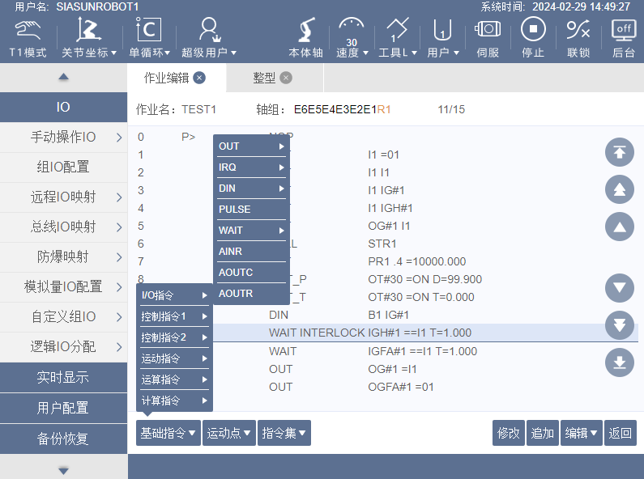

图 3‑39 WAIT指令菜单

表格 3\-15模拟量指令及参数说明

| AINR | 功能 | 将AI模块的指定通道的AI值存入实型变量R中。 | |
| --- | --- | --- | --- |
| 格式 | AIN R\<参数1\> AI\<参数2\> | |
| 说明 | 参数1 | R变量号，范围1\-520。； |
| 参数2 | 模拟量输入文件号，范围1\-40； |
| 举例 | AIN R1 AI1 把模拟量输入文件1的值存在R1中； | |
| AOUT（C） | 功能 | AO模块的指定文件按照指定的AO变量的值进行输出。 | |
| 格式 | AOUT AO\<参数1\> \= \<参数2\> | |
| 说明 | 参数1 | 输出文件号，范围1\-40； |
| 参数2 | 常数； |
| 举例 | AOUT AO1 \=5\.0 把常数5通过输出文件1进行输出； | |
| AOUT（R） | 功能 | 将R变量的值通过指定的AO文件输出。 | |
| 格式 | AOUT AO\<参数1\> \=R\<参数2\> | |
| 说明 | 参数1 | 输出文件号，范围1\-40； |
| 参数2 | 实型变量号，范围1\-520； |
| 举例 | AOUT AO1 R1 把变量R1的值通过输出文件1进行输出； | |

## 跳转指令

跳转指令，是使程序执行时不会向下一行移动，而是跳转到指定的行包含：

标签指令；

返回指令；

无条件跳转指令；

条件转移指令；

### 标签指令

**LABEL L10：**

L10就是表示程序转移的目标标签，数字可以由用户自己定义。

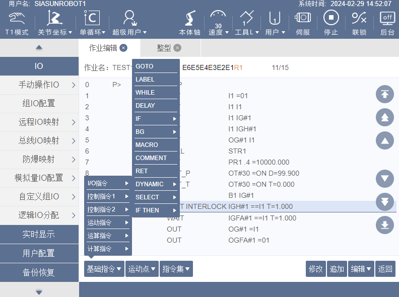

图 3‑40 LABEL指令菜单

表格 3\-16 LABEL指令菜单

| LABEL | 功能 | 标签，标明指令条件满足时，要跳转到的指令位置。 | |
| --- | --- | --- | --- |
| 格式 | L\<参数项\> | |
| 说明 | 参数项 | 含义：用于区别其它标签，是整数类型。范围1\-999； |
| 举例 | NOPGOTO L50 //无条件跳转至L50位置MOVL P1 VL\=600 ACC\=20 CNT\=0 //跳过此条运动指令，此条指令不会被执行L50 //标明位置MOVL P2 VL\=600 ACC\=20 CNT\=100 //此指令会作为第一条运动指令执行MOVL P3 VL\=600 ACC\=20 CNT\=100 //此指令会作为第二条运动指令执行END | |

### 返回指令

**RET指令：**

写在程序最后，当程序执行完毕后，可以返回到调用这个程序的源程序。

图 3‑41 RET指令菜单

表格 3\-17 RET指令说明

| RET | 功能 | 从子作业返回主作业。子作业中最后一行必须有这条指令，若没有则进入子作业后程序将在子作业内循环。主作业中最后一行不能有这条指令。一个作业不能即做主作业又做子作业。 |
| --- | --- | --- |
| 格式 | RET |
| 说明 | 无参数； |
| 举例 | //此作业只能是子作业NOPDELAY T\=2RET //返回母作业，并且从调用子作业的位置向下继续执行END |

### 无条件跳转指令

无条件跳转指令，程序执行到无条件跳转指令后，一定会跳转到希望执行的程序。

**GOTO指令：**

GOTO L10

程序跳转到指定标签处。

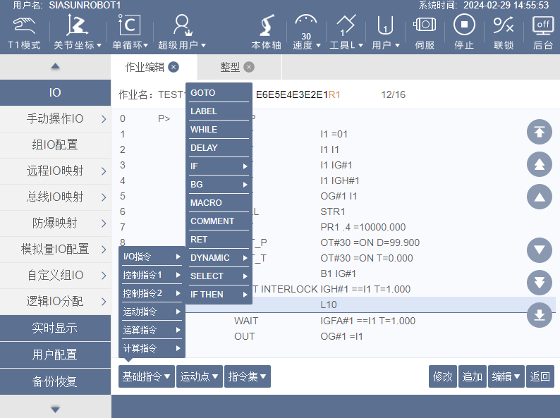

图 3‑42 GOTO指令菜单

表格 3\-18 GOTO指令及参数说明

| GOTO | 功能 | 无条件跳转到标签处执行。 | |
| --- | --- | --- | --- |
| 格式 | GOTO L\<参数项\> | |
| 说明 | 参数项 | 含义：标签号,范围1\-999； |
| 举例 | NOPGOTO L50 //无条件跳转至L50位置MOVL P1 VL\=600 ACC\=20 CNT\=0 //跳过此条运动指令，不会被执行L50 //标明位置MOVL P2 VL\=600 ACC\=20 CNT\=0 //此指令会作为第一条运动指令执行MOVL P3 VL\=600 ACC\=20 CNT\=0 //此指令会作为第二条运动指令执行END | |

**CALL指令：**

CALL (程序名)

执行该指令，程序会执行调用子程序的第一行，被调用程序执行结束时，会返回源程序，并继续执行后边的程序。

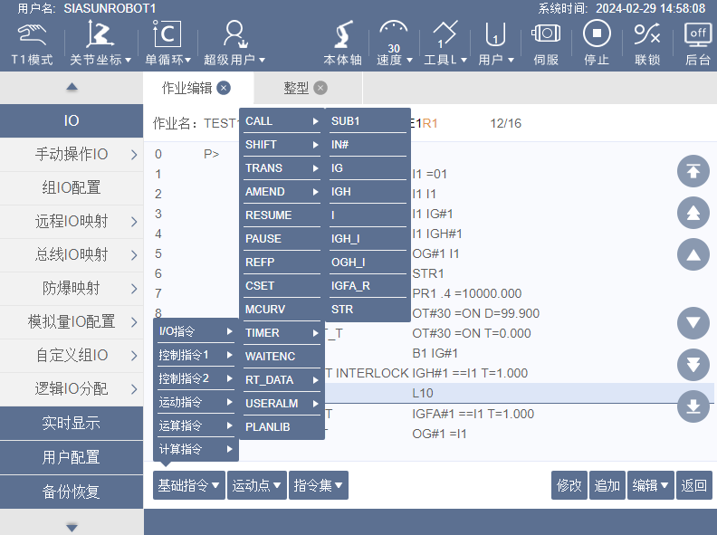

图 3‑43 CALL指令菜单

表格 3\-19 CALL调用自作业指令及参数说明

| CALL | 功能 | 调用子作业。 | |
| --- | --- | --- | --- |
| 格式 | CALL \<调用条件\>\<子作业名\> | |
| 说明 | 调用条件 | 无条件直接调用子作业：IN\#\<输入信号\>\=\<状态值\>，范围1\-4096，状态值为ON或OFF；IG\#\<8位组输入组号\>\=常数，组号范围1\-8，常数范围0\-255；IGH\#\<16位组输入组号\>\=常数，组号范围1\-256，常数范围0\-65535；I\<整形变量号\>\=常数，整形变量范围1\-520，常数范围\-2147483648\-2147483648；IGH\#\<16位组输入组号\>\=I，组号范围1\-256，I变量范围1\-520；OGH\#\<16位组输入组号\>\=I，组号范围1\-256，I变量范围1\-520；IGFA\#\<32位组输入组号\>\=R，组号范围1\-256，R变量范围1\-520；STR\<字符串变量组号\>，组号范围1\-256； |
| 举例 | CALL SUB1CALL IN\#1\=1 SUB1CALL IG\#1\=100 SUB1CALL IGH\#20\=2000 SUB1CALL I1\= \=50 SUB1CALL IGH\#2\=I1 SUB1CALL OGH\#3\=I2 SUB1CALL IGFA\#4\=R1 SUB1CALL STR同时须新建另一作业SUB1：NOPDELAY T\=2RET //返回母作业，并且从CALL指令的下一条指令继续执行END | |

### 条件转移指令

当满足一定条件后，程序会跳转到目标行。

**IF (I/O或变量)（运算符）（值）跳转到（标签行）指令：**

IF指令之后，通过IO或者变量与希望值进行比较，当条件满足时，进行跳转。

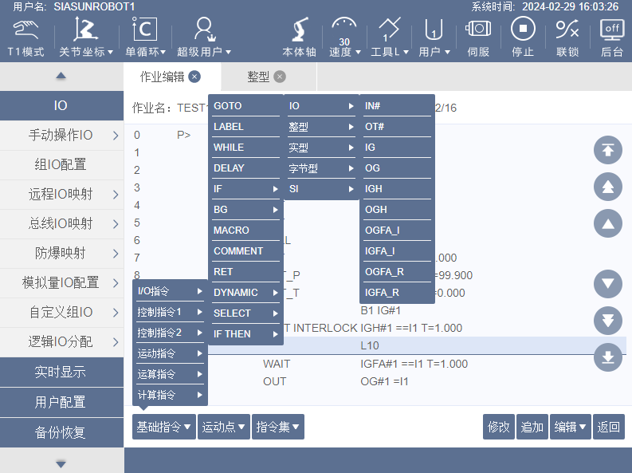

图 3‑44 IF I\\O条件指令菜单

表格 3\-20 IF I\\O指令及参数说明

| IF IO | 功能 | 如果IO信号满足条件，则作业跳转到标签处执行，否则继续执行下一行。 | |
| --- | --- | --- | --- |
| 格式 | IF \<参数1\> \= \<参数2\> L\<参数3\> | |
| 说明 | 参数1 | \<条件转移判断信号类型\>IN\#\<输入号\>，范围1\-4096；OT\#\<输出号\>，范围1\-4096；IG\<8位组输入号\>，范围1\-8；OG\<8位组输出号\>，范围1\-8；IGH\<16位组输入号\>，范围1\-256；OGH\<16位组输出号\>，范围1\-256；OGFA\_I\<32位组输入号\>，范围1\-128；IGFA\_I\<32位组输入号\>，范围1\-128；OGFA\_R\<32位组输入号\>，范围1\-128；IGFA\_R\<32位组输入号\>，范围1\-128； |
| 参数2 | \<条件转移判断信号的值\>IN\#\=\<输入信号状态\>，0为输入信号为低电平时，条件满足；1为输入信号为高电平时，条件满足；OUT\#\=\<输出信号状态\>，0为输入信号为低电平时，条件满足；1为输入信号为高电平时，条件满足；IG\=\<8位组输入的值\>，范围0\-255；OG\=\<8位组输出号的值\>，范围0\-255；IGH\=\<16位组输入号的值\>，范围0\-65535；OGH\=\<16位组输出号的值\>，范围0\-65535；OGFA\=I\<变量号\>，范围1\-520；IGFA\=I\<变量号\>，范围1\-520；OGFA\=R\<变量号\>，范围1\-520；IGFA\=R\<变量号\>，范围1\-520； |
| 参数3 | 含义：标签号，范围1\-999； |
| 举例 | IF IN\#1\=1 L1IF OT\#1\=1 L1IF IG\#1\=100 L1IF OG\#1\=100 L1IF IGH\#1\=2000 L1IF OGH\#1\=2000 L1 | |

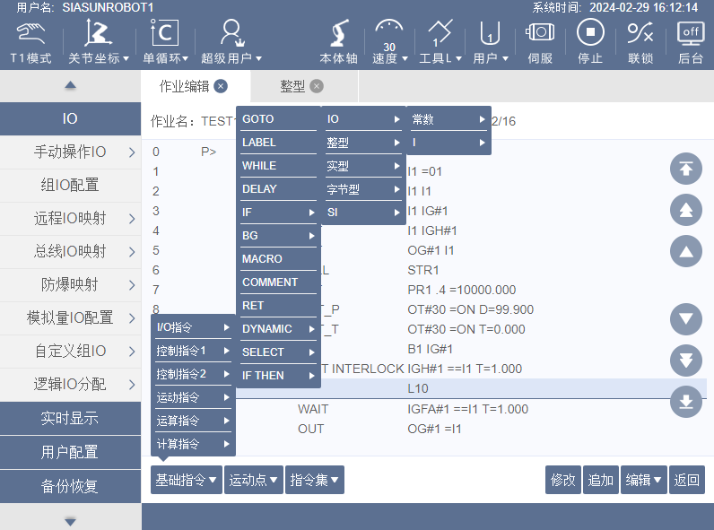

图 3‑45 IF整数\\实数\\字节型条件指令菜单

表格 3\-21 IF整型变量条件指令及参数说明

| IF I | 功能 | 如果整型变量满足比较条件，则作业跳转到标签处执行，否则继续执行IF指令的下一行指令。 | |
| --- | --- | --- | --- |
| 格式 | IF \<参数1\>\<比较符\>\<参数2\> L\<参数3\> | |
| 说明 | 参数1 | I\<整型变量号\>，范围1\-520； |
| 比较符 | \=\=：相等；；\>：大于\<：小于；\<\>：不等于； |
| 参数2 | \<常数\>，范围\-2147483648～2147483648或I\<整型变量\>，范围1\-520； |
| 参数3 | 含义：标签号，范围1\-999； |
| 举例 | IF I1\= \=100 L1IF I1＞100 L1IF I1＜100 L1IF I1＜＞100 L1IF I1\= \=I2 L1IF I1＞I2 L1IF I1＜I2 L1IF I1＜＞I2 L1 | |

表格 3‑22 IF实型变量条件指令及参数说明

| IF R | 功能 | 如果实型变量满足比较条件，则作业跳转到标签处执行，否则继续执行IF指令的下一行指令。 | |
| --- | --- | --- | --- |
| 格式 | IF \<参数1\>\<比较符\>\<参数2\> L\<参数3\> | |
| 说明 | 参数1 | R\<实型变量号\>，范围1～520； |
| 比较符 | \=\=：相等；\>：大于；\<：小于；\<\>：不等于； |
| 参数2 | \<常数\>，范围\-9999\.999～9999\.999或R\<实型变量\>，范围1\-520； |
| 参数3 | 含义：标签号，范围1\-999； |
| 举例 | IF R1\= \=100 L1IF R1＞100 L1IF R1＜100 L1IF R1＜＞100 L1IF R1\= \=R2 L1IF R1＞R2 L1IF R1＜R2 L1IF R1＜＞R2 L1 | |

表格 3‑23 IF字节型变量条件指令及参数说明

| IF B | 功能 | 如果字节型变量满足比较条件，则作业跳转到标签处执行，否则继续执行IF指令的下一行指令。 | |
| --- | --- | --- | --- |
| 格式 | IF \<参数1\>\<比较符\>\<参数2\> L\<参数3\> | |
| 说明 | 参数1 | B\<字节型变量号\>，范围1\-100； |
| 比较符 | \=\=：相等；\>：大于；\<：小于；\<\>：不等于； |
| 参数2 | B\<字节型变量\>，范围1\-100； |
| 参数3 | 含义：标签号，范围1\-999； |
| 举例 | IF B1\= \=B2 L1IF B1＞B2 L1IF B1＜B2 L1IF B1＜＞B2 L1 | |

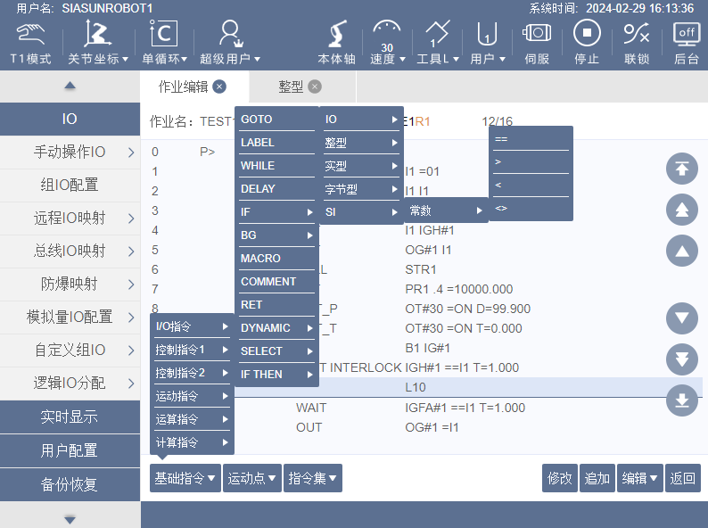

图 3‑46 IF系统整型指令菜单

表格 3‑24 IF系统整型指令及参数说明

| IF SI | 功能 | 如果系统整型变量满足条件，则作业跳转到标签处执行，否则继续执行下一行。 | |
| --- | --- | --- | --- |
| 格式 | IF SI\<参数1\>\<比较符\>\<参数2\> L\<参数3\> | |
| 说明 | 参数1 | \<系统整型变量号\>，范围1\-100； |
| 比较符 | \=\=：相等；\>：大于；\<：小于；\<\>：不等于； |
| 参数2 | 常数，范围\-99999\-99999； |
| 参数3 | 含义：标签号, 范围1\-999； |
| 举例 | IF SI2\=\=20 L2 | |

**SELECT/ELSE条件选择指令：**

一个SELECT程序段以SELECT指令为起始，以第一个非\=/ELSE指令结束，所以一个SELECT程序段只能包含一个SELECT指令；程序段可以没有ELSE指令，故可以连续编辑两条SELECT指令即代表两个不同SELECT功能程序段。

一个SELECT程序段仅在SELECT指令处执行，如果不从行SELECT开头的指令执行则不执行select逻辑，直接向后执行。当SELECT程序段内多个指令条件满足时，仅执行第一个满足条件的逻辑，后面逻辑跳过。

SELECT程序段内不能添加其他指令，在插入\=\=/ELSE指令时，如果其上一行不是SELECT或\=\=指令则无法插入；插入之后如果删除SELECT指令，则剩余指令无功能实现，直接向后执行作业。

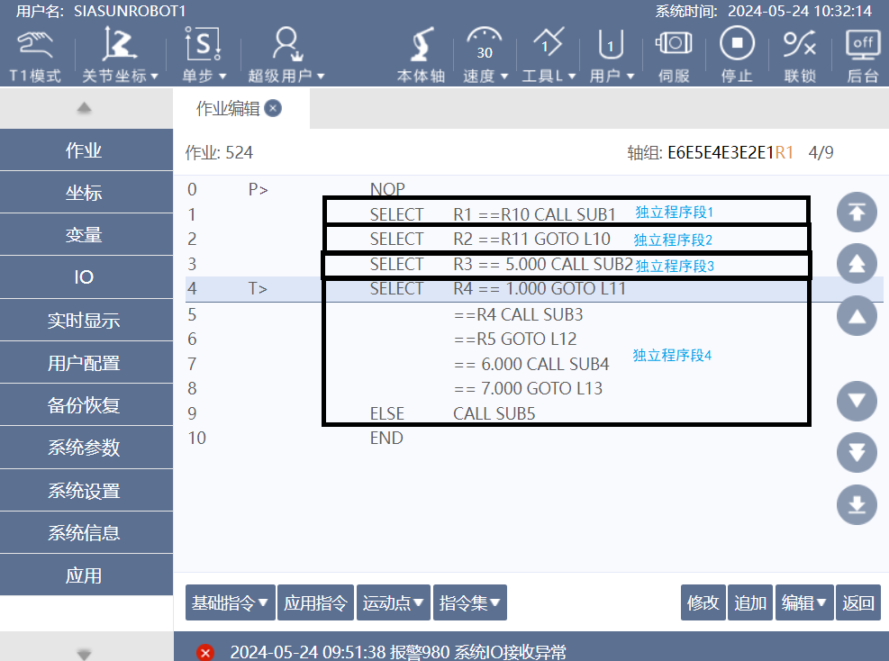

图 3‑47 程序段划分及指令形式

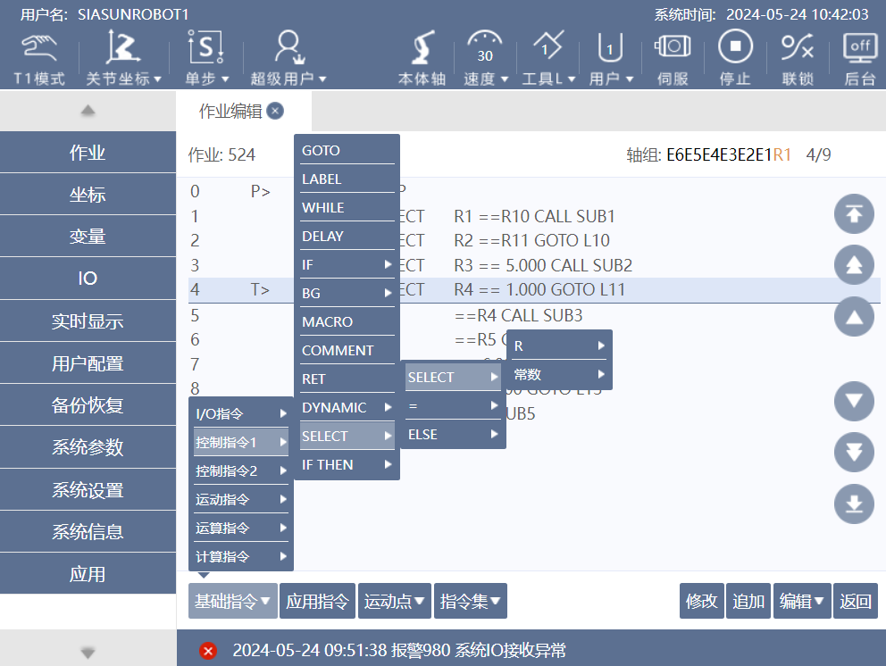

图 3‑48 SELECT指令菜单

表格 3‑25 SELECT指令及参数说明

| SELECT | 功能 | 条件选择指令由多个寄存器比较指令构成。条件选择指令,将寄存器的值与一个或几个值进行比较,选择比较正确的语句,执行处理。如果寄存器的值与其中一个值一致,则执行与该值相对应的跳跃指令或者子程序调用指令。如果寄存器的值与任何一个值都不一致,则执行与ELSE(其它)相对应的跳跃指令或者子程序调用指令。 | | |
| --- | --- | --- | --- | --- |
| 格式 | SELECT R\<参数1\>\=\=\<参数2\> CALL/GOTO\<参数3\> | | |
| 说明 | 参数1 | R\<变量号\>：用户实型变量,范围1\-520； | |
| 参数2 | 常数，范围\-9999\.999\-10000；R\<变量号\>：用户实型变量，范围1\-520； | |
| 参数3 | CALL SUB1作业名称；GOTO L10跳转标签； | |
| 举例 | SELECT R1 \=\= R10 CALL SUB1SELECT R2 \=\= R11 GOTO L10SELECT R3\=\= 5\.000 CALL SUB2SELECT R4 \=\= 1\.000 GOTO L11\=\= R4 CALL SUB3\=\= R5 GOTO L12\=\= 6\.000 CALL SUB4\=\= 7\.000 GOTO L13 | | |
| ELSE | 功能 | 上一条必须是SELECT指令，SELECT不满足条件时，执行ELSE指令。 | | |
| 格式 | ELSE CALL/GOTO \<参数项\> | | |
| 说明 | 参数项 | | ·CALL SUB1作业名称；·GOTO L10跳转标签； |
| 举例 | ELSE CALL SUB5 ELSE GOTO L1 | | |

**IF THEN/ELSE IF/ELSE/ENDIF指令：**

功能为组合使用实现多条件跳转功能；满足条件时,执行由IF\_THEN指令和ELSE/ELSE IF指令(没有ELSE指令的话为ENDIF指令)包围的行。不满足条件时,执行由ELSE指令和ENDIF指令来包围的行，（无ELSE时，不执行IF THEN指令和ENDIF指令包围的行。

**IF THEN指令：**

必须与ENDIF指令组合使用，满足条件执行IF THEN之后的指令。有ELSE/ELSE IF指令的话,不执行ELSE/ELSE IF指令和ENDIF指令之间的部分。不能在IF THEN和ENDIF指令之间添加IF THEN指令。

**ELSE IF指令：**

必须与IF THEN和ENDIF组合使用，如果IF THEN的条件不满足，且ELSE IF的条件满足，执行ELSE IF之后的指令。如果IF THEN的条件不满足，且ELSE IF的条件不满足，执行ENDIF之后的指令。该指令不能添加在ELSE指令后。

**ELSE 指令：**

必须与IF THEN和ENDIF组合使用，如果IF THEN/ELSE IF 的条件不满足，执行ELSE之后的指令。

**ENDIF指令：**

与IF THEN组合使用，表示IF THEN/ELSE IF/ELSE指令的完成。

| **注释：**1. **IF THEN指令执行时依次判断其条件以及之后的ELSE IF THEN指令条件是否满足，如果满足ELSE IF条件或需要执行ELSE时，直接将光标跳至ELSE IF/ELSE指令后，直接执行相应指令；** 2. **当执行ELSE IF/ELSE指令时，直接将光标跳至ENDIF；** 3. **ENDIF指令结束整个IF THEN区间；** 4. **当从IF THEN 区间内开始执行或跳转至区间内时正常执行其余指令，当执行到ELSE IF/ELSE指令时，直接将光标跳至ENDIF；** 5. **IF THEN暂不支持嵌套使用，如果需要多层嵌套应用，可调用子作业，在子作业中编辑新的IF THEN区间；** 6. **IF THEN指令执行时向下搜索必须有ENDIF指令，否则报警；ELSE指令后不能有ELSE IF指令；** 7. **IF THEN 指令支持反向运动执行，ELSE IF/ELSE/ENDIF指令反向运动时报警；** |
| --- |

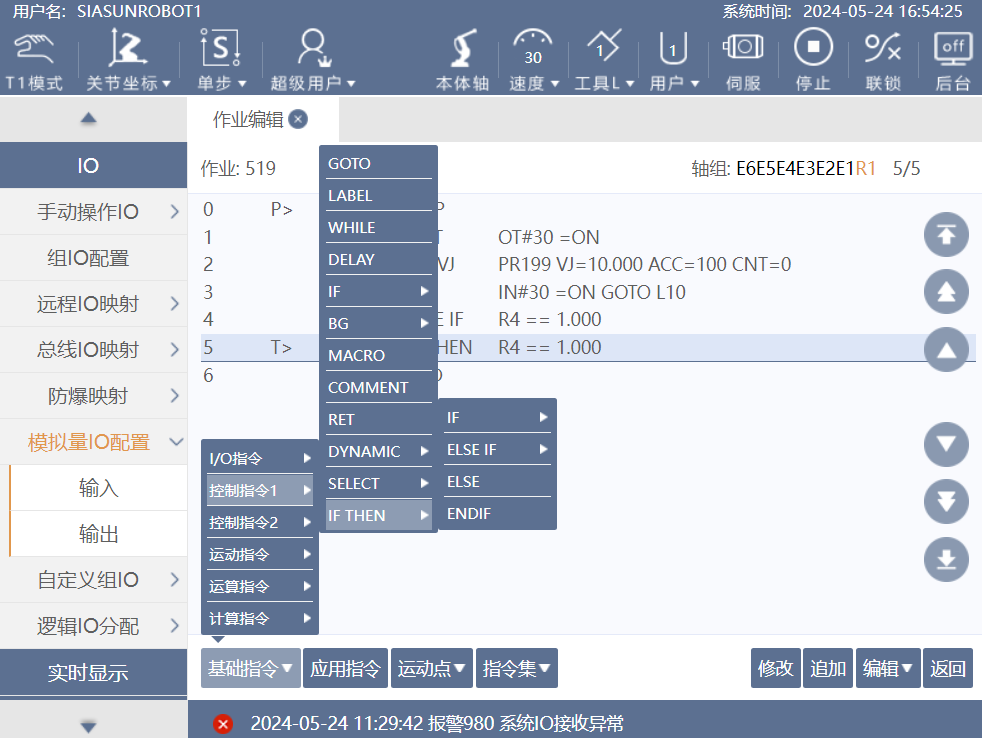

图 3‑49 IF THEN指令菜单

表格 3‑26 IF THEN/ELSE IF/ELSE/ENDIF指令及参数说明

| IF THEN | 功能 | 满足条件向下执行，遇到ELSE IF/ELSE跳到ENDIF上；不满足条件跳到ELSE IF/ELSE/ENDIF指令上。 | |
| --- | --- | --- | --- |
| 格式 | IF THEN \<参数1\>\=\<参数2\> | |
| 说明 | 参数1 | R\<变量号\>：实型变量,范围1\-520；R\<变量号\>：实型变量,范围1\-520；IN\#\<输入号\>，范围1\-4096；IGH\<16位组输入号\>，范围1\-256；IGH\_I\<16位组输出号\>，范围1\-256；IGFA\_I\<32位组输出号\>，范围1\-128；IGFA\_R\<32位组输出号\>，范围1\-128； |
| 参数2 | 常数，范围\-9999\.999\-10000；R\<变量号\>：实型变量,范围1\-520；ON/OFF；IGH\=常数，范围1\-65535；IGH\_\= I整形变量，范围1\-520；IGFA\= I整形变量,范围1\-520；IGFA\= R实型变量,范围1\-520； |
| 举例 | IF THEN R4 \= 1\.000IF THEN R4 \=\=R11IF THEN IN\#30 \= ONIF THEN IGH\#1 \= 2IF THEN IGH\#1 \=\=l1IF THEN IGFA\#1 \=\=l1IF THEN IGFA\#1 \=\=R11 | |
| ELSE IF | 功能 | 前面必须有IF THEN，当IF THEN不满足条件时，跳到ELSE IF上判断ELSE IF是否满足条件，满足条件向下执行，不满足条件跳到下一个ELSE IF上判断或者跳到ENDIF上。 | |
| 格式 | ELSE IF \<参数1\>\=\<参数2\> | |
| 说明 | 参数1 | R\<变量号\>：实型变量,范围1\-520；R\<变量号\>：实型变量,范围1\-520；IN\#\<输入号\>，范围1\-4096；IGH\<16位组输入号\>，范围1\-256；IGH\_I\<16位组输出号\>，范围1\-256；IGFA\_I\<32位组输出号\>，范围1\-128；IGFA\_R\<32位组输出号\>，范围1\-128； |
| 参数2 | 常数，范围\-9999\.999\-10000；R\<变量号\>：实型变量,范围1\-520；ON/OFF；IGH\=常数，范围1\-65535；IGH\_\= I整形变量，范围1\-520；IGFA\= I整形变量,范围1\-520；IGFA\= R实型变量,范围1\-520； |
| 举例 | ELSE IF R4 \= \= 1\.000ELSE IF R4 \=\=R11ELSE IF IN\#30 \=ONELSE IF IGH\#1 \=00ELSE IF IGH\#1 \=\=l1ELSE IF IGFA\#1 \=\=l1ELSE IF IGFA\#1 \=\=R11 | |
| ELSE | 功能 | 可在IF THEN/ELSE IF后使用。IF THEN/ELSE IF满足条件时，执行到ELSE上后跳转到ENDIF指令上；IF THEN/ELSE IF不满足条件时，跳到ELSE上向下执行. | |
| 格式 | ELSE | |
| ENDIF | 功能 | 与IF THEN组合使用，表示IF THEN/ELSE IF THEN/ELSE指令的完成。 | |
| 格式 | ENDIF | |

## 延时指令

**DELAY(时间)：**

使程序在指定的时间内等待（单位s）。

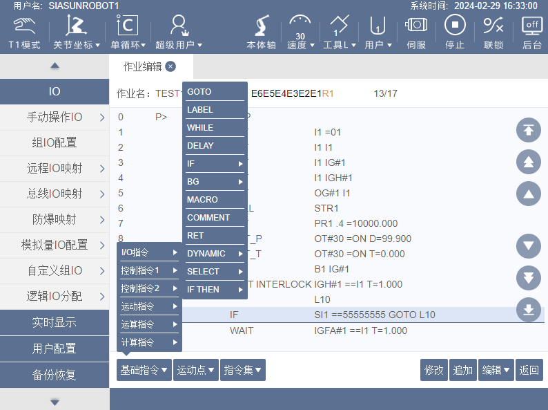

图 3‑50 DELAY指令菜单

表格 3‑27 DELAY指令及参数说明

| DELAY | 功能 | 延时一段时间。在延时时间内机器人无任何动作。 | |
| --- | --- | --- | --- |
| 格式 | DELAY T\=\<参数项\> | |
| 说明 | 参数项 | 含义：延时的时间；单位：s；范围：0\-999； |
| 举例 | NOPMOVJ P1 VJ\=10 DELAY T\=0\.500 MOVJ P2 VJ\=5 DELAY T\=2\.000 END | |

## 偏移指令

偏移指的是工件的各点从特定的位置开始以相同的距离移动。

偏移量例如下图所示，工件的各点均以L（X\\Y\\Z三个坐标量位移）的距离，从一个位置，偏移到另一个位置。如果经常性的会有这种类型的位置偏移，那么使用偏移功能可以免去示教的工作量。

|  |
| --- |

图 3‑51偏移量的图示

下图的示例中，机器人以L的距离，每次偏移到达目标位置。仅仅在第一条线的位置示教，其他点偏移就能实现。

|  |
| --- |

图 3‑52偏移示例

使用偏移指令，需要在【系统设置】\-【执行开关】中打开偏移允许。

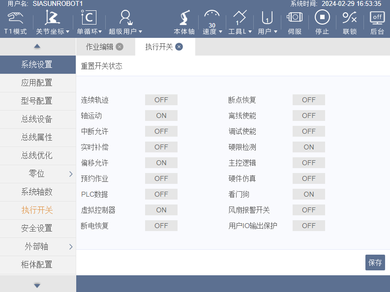

打开偏移允许

图 3‑53执行开关

**偏移指令：**

在控制类2—SHIFT中可以打开偏移指令。

**SHIFTON PR1 F\#2**

**…**

**SHIFTOFF**

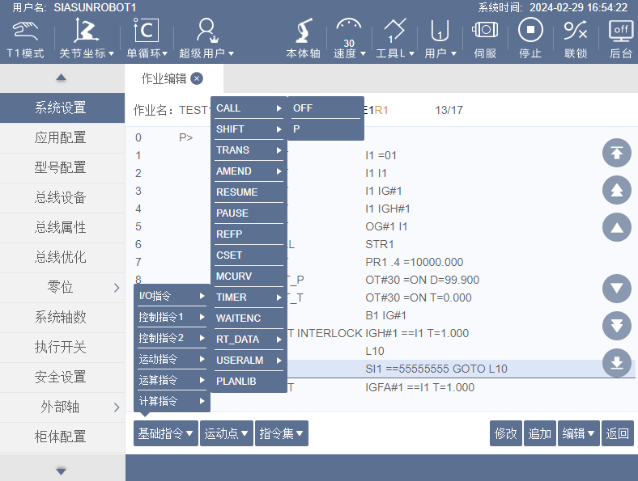

图 3‑54偏移指令菜单

表格 3‑28 偏移指令及参数说明

| SHIFT P | 功能 | 以设定的坐标系按位置变量中的值进行偏移。 | |
| --- | --- | --- | --- |
| 格式 | SHIFTON PR\<参数1\> F\#\<参数2\> | |
| 说明 | 参数1 | 位置变量号，范围1\-5630 |
| 参数2 | 范围2\-4。坐标系类型，2：直角坐标系 3：工具坐标系 4：用户坐标系 |
| 举例 | 例1：NOPMOVJ P10 VJ\=10SET R1\=100 //给变量R1赋值100SET PR1\.1 R1 //将R1存储的数值赋到位置变量PR1的X方向上SHIFTON PR1 F\#2 //使SHIFTON和SHIFTOFF之间的运动指令沿直角坐标系X正方向偏移100mmMOVJ P11 VJ\=10 //此条指令沿直角坐标系X正方向偏移100mmSHIFTOFF //结束偏移END例2：NOPMOVJ P10 VJ\=10SET R2\=\-100 //给变量R2赋值\-100（正负表示方向）SET PR1\.3 R2 //将R2存储的数值赋到位置变量PR1的Z方向上SHIFTON PR1 F\#2 //使SHIFTON和SHIFTOFF之间的运动指令沿直角坐标系Z负方向偏移100mmMOVJ P11 VJ\=10 //此条指令沿直角坐标系Z负方向偏移100mmSHIFTOFF //结束偏移END | |
| SHIFT OFF | 功能 | 停止所有偏移。 | |
| 格式 | SHIFTOFF | |
| 说明 | 无参数 | |
| 举例 | SHIFTOFF | |

PR1：

代表位置和姿态的偏移量。使用偏移指令时，PR内的6个子变量里的值分别代表6个偏移量。

F\#2：

数字2,3,4,分别代表直角、工具、用户。选择的坐标系代表偏移量基于哪个坐标系进行偏移。

需要偏移的位置点要写在SHIFTON和SHIFTOFF之间。两条指令之外的点不进行偏移。

| **注意：****如果有SHIFTON 指令，那么程序中一定要有SHIFTOFF指令，否则循环之后，下次一从头执行程序时，偏移依然有效。** |
| --- |

在直角坐标系下进行偏移时，偏移量内需要存储位置、姿态值。

在工具坐标系下进行偏移时，偏移按照当前选定的工具号进行。

在用户坐标系下进行偏移时，偏移按照当前选定的用户号进行。

| **警告**1. **当使用偏移指令时，请注意当前坐标系号是否是预期的坐标系号，以免由于坐标系号与预期不同，造成不按预期的偏移，造成设备损坏或人员伤亡。** 2. **当使用的坐标系的值改变时，偏移位置也会随之改变，使用时请注意核实，以免坐标系值改变，造成不按预期位置偏移，造成设备损坏或人员伤亡。** |
| --- |

**程序点偏移的程序示例：**

在SHIFT ON、SHIFT OFF之间的示教点是会被偏移的点。

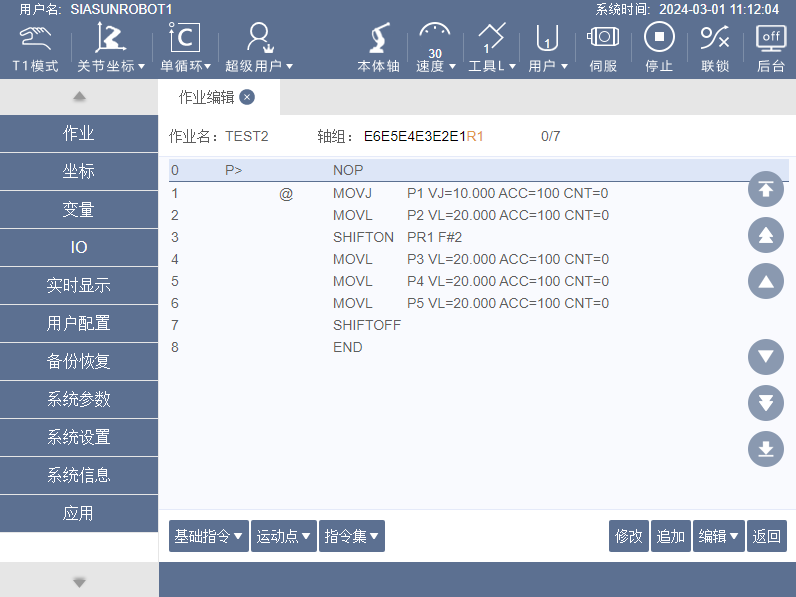

P3、P4、P5点为偏移点

图 3‑55偏移程序示例

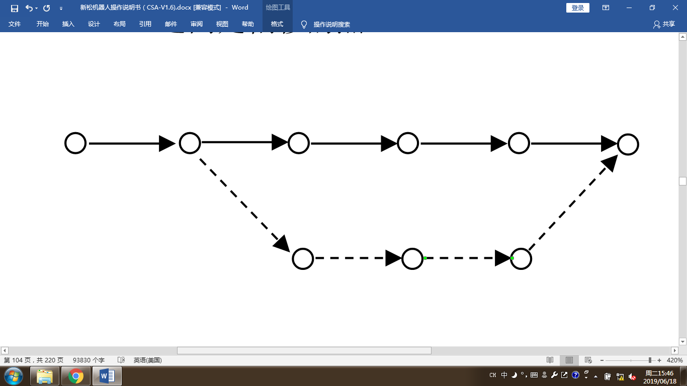

图 3‑56偏移点的移动

**偏移量的确定：**

偏移量就是位置点需要偏移时的在该坐标系上X、Y、Z、Rx、Ry、Rz的增量。一般偏移时使用的坐标系有：直角坐标系，工具坐标系，用户坐标系。

**坐标系：**

|  |
| --- |

图 3‑57三种笛卡尔坐标系

**偏移量的写入：**

偏移量的写入一般使用位置变量指令。

偏移量时机器人现在位置与需要的预期位置的X、Y、Z、Rx、Ry、Rz的差，一般的时候角度的偏移量为0。

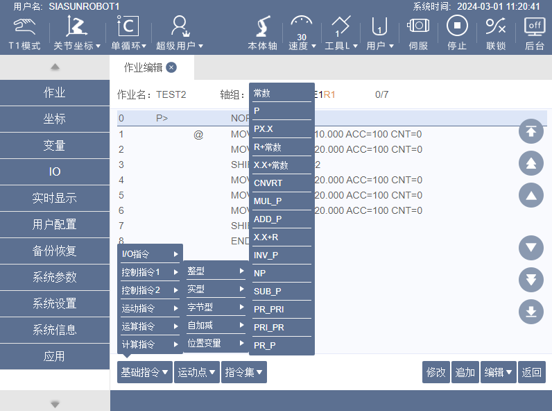

图 3‑58使用位置变量指令写入偏移量

写入的偏移量，可以在【变量】\-【位置变量】菜单中查看与写入。

图 3‑59位置变量的查看

| **注意：****当使用一个位置变量作为偏移量时，这个变量中的每个分量值代表示教位置点在指令对应坐标系方向上的偏移量，并不代表需要移动的预期位置点各个分量。** |
| --- |

## 中断指令

机器人自动执行时只能同时执行一个作业，并且作业指令顺序执行，前一条指令执行完毕后，后一条指令才开始执行。也就是说，机器人的运动过程由操作者设计好，并且固定顺序。但是，在实际应用中，有时需要机器人处理一些不知道什么时间发生的异常情况，这就是中断功能。中断功能指的是中断机器人正在执行的示教作业，跳转到设定好的中断程序中执行。如图3\-42所示：

|  |
| --- |

图 3‑60中断过程

中断程序执行需要在【系统设置】\-【执行开关】中开启中断允许。

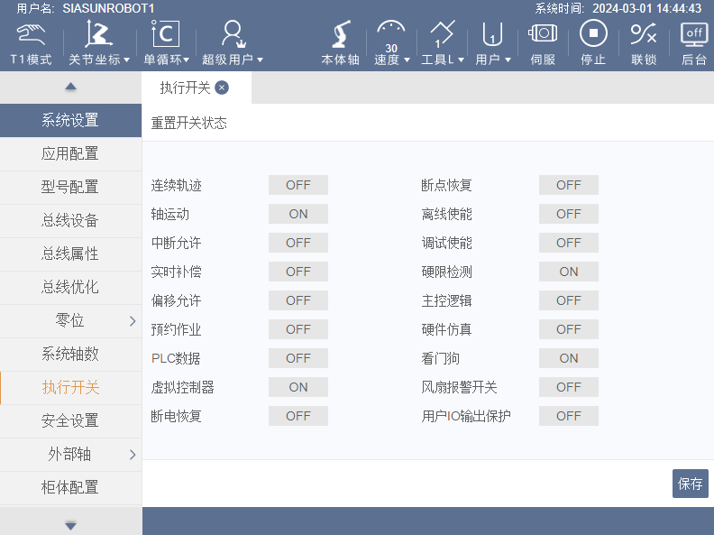

中断允许

图 3‑61执行开关

**IRQON指令：**

**IRQON LEV\=(等级) (中断条件) （希望执行的中断程序）**

**……**

**IRQOFF**

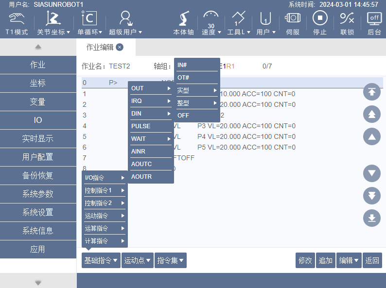

图 3‑62中断指令菜单

表格 3‑29中断指令及参数说明

| IRQ ON | 功能 | 当触发条件满足瞬间，执行中断程序。 | | |
| --- | --- | --- | --- | --- |
| 格式 | IRQON LEV\<参数1\>\<参数2\>\<比较符\>\<参数3\>\<参数4\> | | |
| 说明 | 参数1 | | \<优先级\>：低优先级中断程序再执行时，可以继续触发高优先级中断程序执行；高优先级中断程序在执行时，不能触发执行低优先级中断程序。优先级范围1\-100,1为最高优先级； |
| 参数2 | | \<触发条件\>:IN\#\<输入信号\>，范围1\-5630；OT\#\<输出信号\>，范围1\-5630；R\<实型变量号\>，范围1\-520；I\<整型变量号\>，范围1\-520；触发条件从不满足到满足的瞬间，可以触发执行中断程序；如果触发条件一直满足，则不能执行中断程序； |
| 比较符 | | IN\#\<输入信号\>，对应的比较符为‘\=’；OT\#\<输出信号\>，对应的比较符为‘\=’；R\<实型变量号\>，对应的比较符为‘\=\=’、‘＞’、‘＜’、‘＜＞’；I\<整型变量号\>，对应的比较符为‘\=\=’、‘＞’、‘＜’、‘＜＞’； |
| 参数3 | | IN\#\<输入信号\>，ON或OFF ；OT\#\<输出信号\>， ON或OFF；R\<实型变量号\>，可以为常数也可为另外一个实型变量，常数范围为\-9999\.999～9999\.999，实型变量号的范围为1\-520；I\<整型变量号\>，可以为常数也可为另外一个整型变量，常数范围为\-2147483648～2147483648，整型变量号的范围为1\-520； |
| 参数4 | | 触发条件满足瞬间将执行的程序名；在IRQON和IRQOFF之间，程序属于中断程序，不能用CALL指令调用；在此之外，程序不再属于中断程序，可以被CALL指令调用； |
| 举例 | IRQON LEV\=1 IN\#10\=1 SUB1IRQON LEV\=1 OT\#10\=1 SUB1IRQON LEV\=1 R1\= \=10\.500 SUB1IRQON LEV\=1 R1＞R2 SUB1IRQON LEV\=1 I1\= \=10 SUB1IRQON LEV\=1 I1＞I2 SUB1 | | |
| IRQ OFF | 功能 | 关闭指定优先级的中断。 | | |
| 格式 | IRQOFF LEV\=\<参数项\> | | |
| 说明 | 参数项 | 含义：中断的优先级；范围：1\-100； | |
| 举例 | IRQOFF LEV\=34 | | |

**中断的触发条件：**

中断触发条件是作业执行到中断检测范围时检测到中断条件触发的瞬间。中断触发条件可以为输入/输出的ON、OFF状态，即中断检测的是输入输出信号的上升沿、下降沿；中断触发条件也可以为用户变量为某一个值，中断检测的是用户变量变为指定值的瞬间。

示教模式下,示教条件里正向运动，检测到中断条件触发，不触发中断，中断程序不能被执行，中断触发的状态也不保持。也就是说，中断触发时，中断程序必须立刻能够执行，否则中断触发失败，系统再次检测到中断信号上升沿，中断能够再次触发。

**中断的优先级：**

在同一段程序中可以同时检测多个中断信号，例如：

|  |
| --- |

图 3‑63中断优先级

在下面程序段中就同时检测两个中断。如何区分两个中断呢？如何区分中断开始与中断结束的对应关系呢？中断开始指令(IRQON）、中断结束指令(IRQOFF)都带有一个参数：

 **IRQON LEV\=\<参数\> IN\#4\=ON SUB1**

 **IRQOFF LEV\=\<参数\>**

**LEV\=后面的参数就是中断优先级，例如：**

 **NOP**

 **…………**

仅检测优先级5的中断信号

 **IRQON LEV\=5 ...**

 **…………**

 **IRQON LEV\=1\...**

优先级1、优先级5的中断信号都检测

 **…………**

 **IRQOFF LEV\=5**

仅检测优先级1的中断信号

 **…………**

 **IRQOFF LEV\=1**

 **…………**

 **END**

| **注释**1. **如果一个程序段同时检测多个中断信号，当进入低优先级中断程序后，高优先级中断触发，继续跳转到高优先级中断程序中；当进入高优先级中断程序后，低优先级中断触发，不进行跳转，高优先级中断程序执行完成后，也不跳转到低优先级中断程序中。** 2. **中断只能在DELAY、WAIT、运动指令上触发，当中断触发时，其它指令都先执行完毕，再跳转到中断程序；这3种指令是立刻跳转。** |
| --- |

**中断程序名：**

中断程序名是中断发生时跳转的程序名，一个中断优先级对应一个中断程序。中断程序同普通示教的子程序一样，如果需要从中断程序中返回到原示教作业，中断程序最后是RESUME指令。不允许通过CALL指令调用已经被指定了的中断程序。

**RESUME指令：**

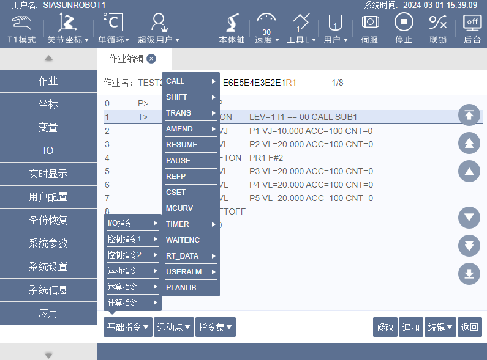

图 3‑64 RESUME指令菜单

如果执行到RESUME指令，则从中断程序返回原程序，被中断的运动指令不再继续执行；如果没有RESUME指令，则从中断程序返回原程序，继续向被中断的目标点运动。

RESUME指令只对中断运动指令的情况有效；中断DELAY或WAIT指令时，返回原程序后都重新执行相应指令。

RESUME指令只能用在中断程序中，在非中断程序中不执行RESUME指令。

中断功能没有使能时，RESUME指令不执行。

**中断功能失效条件：**

下列操作将会自动关闭已经打开的所有中断：

1. 进行了修改、删除、插入操作。
2. 进行了作业的复制、重命名、删除操作。
3. 切断控制电源。
4. 清空作业堆栈。

| **注意：****执行开关中中断功能未使能时，IRQON指令不执行，IRQOFF指令正常执行。** |
| --- |

**中断程序示例：**

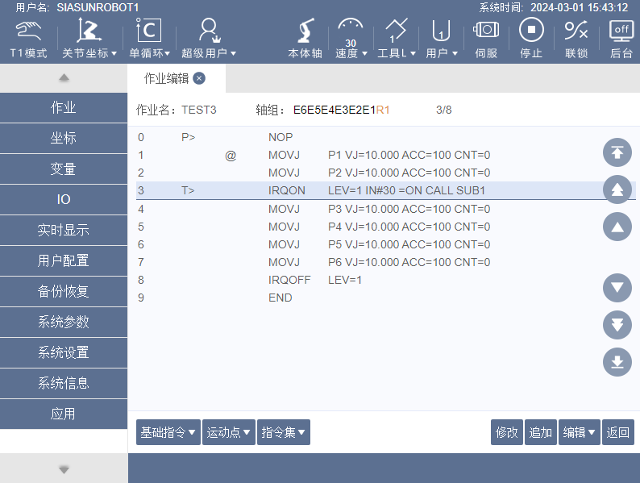

图 3‑65中断指令示例

从第二个运动点到第八个运动点过程中，一旦接收到输入信号30，产生上升沿时，机器人立即停止并跳转到zd中断作业中继续运行。

 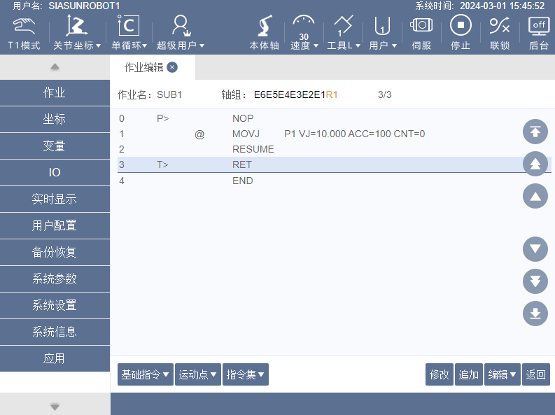

RESUME指令

图 3‑66中断程序示例

当机器人进入中断程序后，从停止的位置执行中断程序，并在结尾后，返回源程序。如果结尾使用RESUME指令，那么机器人返回到源程序后，不继续执行刚刚中断了的点，而是在中断之后的下一点继续执行。如果没有使用RESUME指令，则机器人返回时，继续执行刚刚中断了的那条运动指令。

| **注意：****在源程序和中断作业之间来回跳转的过程中，要使跳转两个点之间，没有干涉，以免发生碰撞。** |
| --- |

## 坐标系指令

坐标系指令可以改变后续的运动点的工具和用户坐标系。

**SET TF\\UF指令：**

工具坐标系选择指令，可以在程序执行过程中改变工具坐标系号码。用户坐标系选择指令，可以在程序执行过程中改变用户坐标系号码。

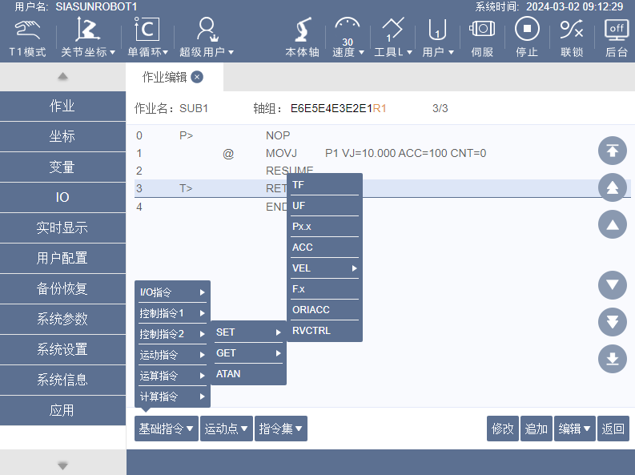

图 3‑67坐标选择系指令

表格 3\-30 SET TF\\US指令说明

| SET TF | 功能 | 设置工具坐标系号。该指令执行后，系统的当前工具坐标系号则被改变，工具坐标系号的改变不仅对自动执行的作业有影响，示教模式下的轴操作也使用的是新设定的工具坐标系。 | |
| --- | --- | --- | --- |
| 格式 | SET TF \#\<参数1\> | |
| 说明 | 参数1 | 工具坐标系文件号，范围1\-8； |
| 举例 | SET TF\#1 | |
| SET UF | 功能 | 设置用户坐标系号。该指令执行后，系统的当前用户坐标系号则被改变，用户坐标系号的改变不仅对自动执行的作业有影响，示教模式下的轴操作也使用的是新设定的用户坐标系。 | |
| 格式 | SET UF \#\<参数1\> | |
| 说明 | 参数1 | 用户坐标系文件号，范围1\-8； |
| 举例 | SET UF\#1 | |

| **注意：****使用坐标变更指令后，之后的运动点的位置或指令（如偏移等）都是基于改变后的工具坐标系号来运动的。用户坐标系号码变更对一般的位置点没有影响，但是对偏移等需要使用用户坐标系号的指令之后的运动位置，是有影响的。需要在使用前明确，以免发生位置不按预期移动，发生碰撞或人身伤害。** |
| --- |

# **程序的示教**

本章对能够使机器人进行运动的程序的创建和修改进行说明。

程序指令，是指控制系统发给本体或外围设备的一系列控制指令。这些指令可以指示机器人或外围设备按指令进行动作。比如

1. 使机器人按照预期的轨迹在空间内移动。
2. 对工件进行抓取搬运。
3. 对外围设备发出信号。
4. 对外围设备输入的信号进行处理。

程序创建前，要对程序进行一些概要性的设计，要考虑机器人完成作业最有效的方法。

通过机器人的菜单和指令来创建程序，在示教机器人位置时，先通过手动方法将机器人移动到希望的位置，再通过指令记录位置点。

程序创建后，有需要对程序进行修改时，根据菜单指令修改程序。

## 动作设计

### 动作指令

**抓取工件位置：**

抓取工件位置要在该位置定位完成后，进行抓取。

**在工件周围运动：**

机器人在工件周围运行时，可以开启连续轨迹。开启后，机器人不在示教点上停留，而是在点附近滑过，可以加快机器人运行周期。

|  |
| --- |

图 4\-1在工件周围移动

| **注释：****上图为机器人未开启连续轨迹时的移动轨迹，当机器人开启连续时，机器人会在运动点附近快速划过，但运动轨迹在运动点附近会有很小的改变，需要进行测试验证，轨迹是否会和周围工件产生干涉。** |
| --- |

**机器人姿态：**

机器人示教时，应尽量采用平顺的姿态规划轨迹。最初的点选择正确的姿态，可以确保后续的点可以由较小的变化达到目标点。示教时可以采取关节或直线坐标进行手动移动机器人，并达到正确位置和姿态，进行示教。程序示教完成后，需要手动慢速正向运动程序，确保程序的轨迹正确。

### 原点设定

原点位置是机器人所有程序执行的基础位置，这个位置是和周围所有外围设备没有干涉的安全位置。可以在远程I\\O中设定输出点（详见2\.4设置原点说明）。

## 开机并手动控制

### 启动机器人

**启动步骤：**

1. 正确接好电源后，启动机器人。
2. 开机后，可以根据示教器上方的状态栏了解机器人各种状态。

### 3种运行模式

示教器左上方的钥匙开关可以选择合适的机器人运行模式。

| 执行模式示教模式远程模式 |
| --- |

图 4\-2模式开关

1. **T1(低速手动)模式：**

在机器人进行示教和手动测试时，所选择的模式，在这种模式下，机器人的TCP被限制在安全速度250mm/s以下。

1. **正、反向运动**

程序可以通过正向运动或反向运动手动运行。

1. **正、反向运动时的速度**

正、反向运动时，即使把程序速度调整至100，TCP点速度仍然是安全速度以下。

1. **安全门**

在T1或者T2模式，可以在安全门开启的情况下手动操作机器人。必须在DEADMAN被按下的情况下，才可以运动机器人，DEADMAN没有按下时，机器人不能运动。

1. **保持该模式**

拔出开关钥匙即可保持在示教(T1\\T2\)模式。

1. **T2(100%手动全速)模式：**

T2模式是用来确认机器人在正常速度下的运动。由于T1模式下，速度受到限制，不能完全模拟全速下的机器人运动。所以有时候需要T2模式来确认机器人全速的动作和节拍。

1. **正、反向运动**

程序可以通过正向运动或反向运动手动运行。

| **注意：****如果不是特殊需要的情况下，请不要在T2模式下，反向连续运行程序，以免由于速度过快，发生意想不到的危险。造成设备损坏或人员伤亡。** |
| --- |

1. **正、反向运动时的速度**

正向运动时，机器人速度与实际速度相同，没有受到特别的限制。

反向运动时，最大速度250mm/s。

切换到T2模式时，出于安全考虑机器人速度百分比会变为**30%**，需要手动提高速度。

1. **安全门**

在T1或者T2模式，可以在安全门开启的情况下手动操作机器人。必须在安全开关被按下的情况下，才可以运动机器人，安全按钮没有按下时，机器人不能运动。

1. **保持该模式**

拔出开关钥匙即可保持在示教(T1\\T2\)模式。

| **警告：**1. **T2模式是比较危险的测试方式，如果不是不得不使用T2模式，请不要使用T2模式运行机器人。** 2. **机器人启动前，必须确认机器人运动范围内没有人员，并且对按下正向运动后，对机器人发生的任何行为要有深入的了解。** |
| --- |

1. **执行模式**

执行模式是机器人在自动化生产时使用的一种模式。

1. **程序执行**

机器人程序仅仅可以通过示教的上电、启动、暂停、复位来控制。

1. **速度**

机器人速度可以是全速。

1. **手动运动**

机器人不能被手动运动。

1. **远程模式**

远程模式是机器人在自动化生产时使用的一种模式。

1. **机器人速度**

机器人速度可以是全速。

### 机器人轴运动

机器人可以通过示教器右侧的轴运动键进行手动运动。在机器人进行程序示教时，需要将机器人移动到目标位置。

| **警告：**1. **为了在示教过程中，保障工程师的人身安全，请在整个示教过程中，将机器人设置为手动模式，拔下模式钥匙，保持安全门是开启并且无法被关闭的状态，以免误按开始按钮，或意外收到外部启动信号而启动机器人。** 2. **尽可能使用T1模式进行示教，以免由于机器人运动速度太快，造成人员伤亡或设备损坏。** |
| --- |

| 伺服上电按钮轴运动键 |
| --- |

图 4\-3手动轴运动键

使用轴运动键控制机器人和下列两个要素有关：

机器人速度；

机器人的坐标系；

| **注释：****使用轴运动机器人之前,需要使用伺服上电按钮,将伺服状态准备好。** |
| --- |

**速度倍率：**

速度倍率是设置机器人运动时最大速度的百分比。显示在机器人上方的状栏。

 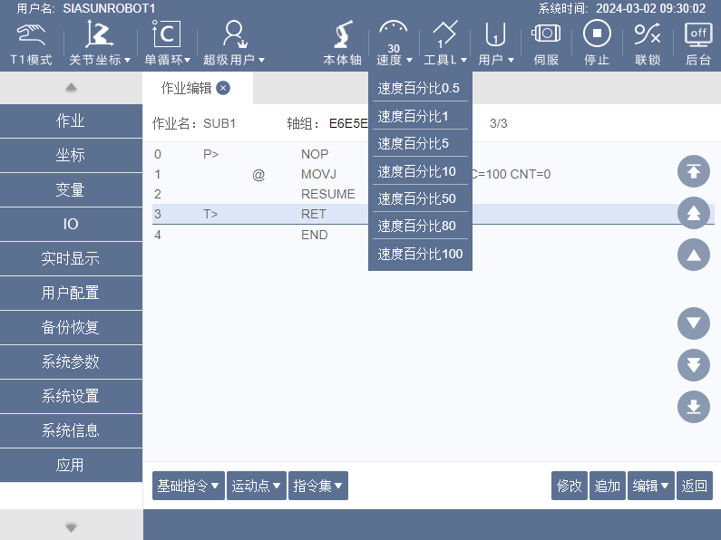

速度显示

图 4\-4速度倍率显示

手动倍率可以通过示教器触屏来点击修改，可以通过按键来修改，最小速度倍率为0\.2。

表格 4\-1手动倍率切换

| 手动倍率 | 0\-0\.2\-0\.5\-1\-5\-10\-30\-50\-80\-100倍率 |
| --- | --- |

|  |
| --- |

图 4\-5修改速度倍率位置

**手动运动的坐标系：**

机器人手动运动一共有4种坐标系可以选择。分别是关节坐标系\-直角坐标系\-工具坐标系\-用户坐标系。

**关节坐标系下手动运动：**

使用轴运动键，可以使机器人按照每个轴的方向单轴运行。箭头方向即是机器人按下对应的轴运动键后的轴转动方向。

| **C:\Users\wangshen\Desktop\操作说明增加项\SR210D5.jpg** |
| --- |

图 4\-6关节坐标系

**直角坐标系下手动运动：**

在直角坐标系运动中，机器人TCP点会沿着平行于坐标轴方向X,Y,Z运动，同时，旋转时，机器人TCP也会绕着平行于直角坐标系X,Y,Z轴的平行线旋转。

在直角坐标系下，当按下机器人示教器对应的方向键按钮后，机器人TCP会按照对应的箭头平行的方向移动，或TCP为中心绕着直角坐标系轴的平行线进行进行旋转。

| TCP点沿直角坐标系方向平行线移动ZYX |
| --- |

图 4\-7直角坐标系

**Y**

**工具坐标系下手动运动：**

在工具坐标系下手动运动机器人，TCP点沿着机器人定义的工具坐标系的X,Y,Z进行运动。此外，工具坐标系还可以使机器人绕着工具坐标系的X,Y,Z轴旋转。

在工具坐标系下，按下示教器的轴运动键后，机器人TCP会按照工具坐标指向的方向运动，或按照工作坐标方向以TCP为中心进行旋转。

|  |
| --- |

图 4\-8工具坐标系

**用户坐标系下手动运动：**

在用户坐标系下手动运动机器人，TCP点沿着机器人定义的用户坐标系的X,Y,Z轴的平行线进行运动。此外，用户坐标系还可以使机器人TCP绕着用户坐标系的X,Y,Z轴的平行线旋转。

在用户坐标系下，按下示教器的轴运动键后，机器人TCP会按照用户坐标指向的方向运动，或按照用户坐标轴方向的平行线以TCP为中心进行旋转。

|  |
| --- |

图 4\-9用户坐标系

**坐标系的切换：**

机器人坐标系可以在示教器上方的状态栏中选择。可以通过触屏的图标选择。

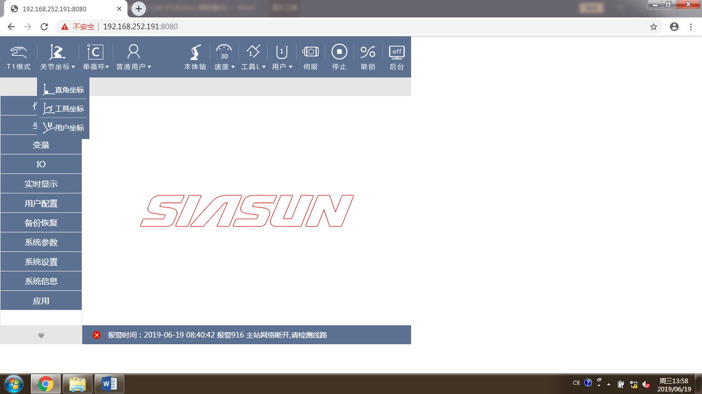

坐标系选择

图 4\-10坐标系选择

也可以通过示教器上的坐标按钮选择。

|  |
| --- |

图 4\-11坐标按钮

表格 4\-2坐标系切换

| 坐标系切换 | 关节坐标系\-直角坐标系\-工具坐标系\-用户坐标系 |
| --- | --- |

**使用外部轴：**

按示教器的轴组键，可以切换运动外部轴。7轴可以直接在示教器上运动。8\-12轴可以在切换后，用轴运动键运动。在示教器屏幕上可以显示轴组状态。

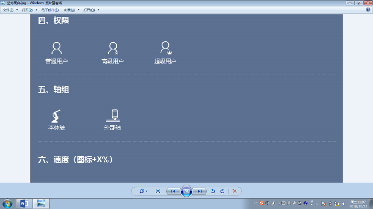 

图 4\-12外部轴本体轴显示图标

使用轴运动键可以控制外部轴，如图4\-13所示。

| 伺服上电轴组8\-12轴运动键7轴运动键 |
| --- |

图 4\-13轴组和轴运动键

**使用轴运动键移动机器人条件：**

在手动启动机器人前，请确定机器人包括末端执行机构运动范围内，没有任何人或任何物品。

**使用轴运动键移动机器人步骤：**

1. 通过【坐标】按钮或者点击图标，选择手动机器人的坐标系。
2. 通过【V\+\\V\-】或速率图标，调节速率。
3. 左手拿住示教器，并将DEADMAN按到中间位置，并在机器人运动期间始终按住该开关。
4. 按住DEADMAN的同时，按住轴运动键按钮，控制机器人按照预期的方向运动。

| **警告：****在手动运行时，为了避免危险情况发生而希望紧急停止机器人时，可松开DEADMAN键或按下急停按钮即可。** |
| --- |

**奇异点说明：**

机器人运动学中，有3个奇异点，需要特别对待。他们分别是顶部奇异点、延伸奇异点、腕部奇异点。这些奇异点，并没有办法规划轨迹。所以机器人在奇异点附近，会停止运动并报警。示教时可以使用关节坐标进行规划。

**顶部奇异点：**

关节中心点为4、5、6轴交点时，当其位于一轴轴线上方时机器人处于顶部奇异点。

**延伸奇异点：**

当J2\-J3延长线经过腕关节中心点时，机器人处于延伸奇异点。

**腕部奇异点：**

当4轴与6轴平行，即5轴关节值为0附近时，机器人处于腕部奇异点。

## 示教程序

**新建程序：**

新建一个程序，并记录程序名。

**设定程序信息：**

设定程序类型和外部轴组关系。

**示教动作和逻辑指令：**

对机器人程序进行示教。

### 新建作业

新建一个示教程序。

**新建程序步骤：**

1. 点击【新建作业】，可以打开新建作业界面。

 

新建作业按钮

图 4\-14新建作业界面

1. 在新建界面选择作业类型。若选择作业类型为示教程序，则需要设置轴组信息。

 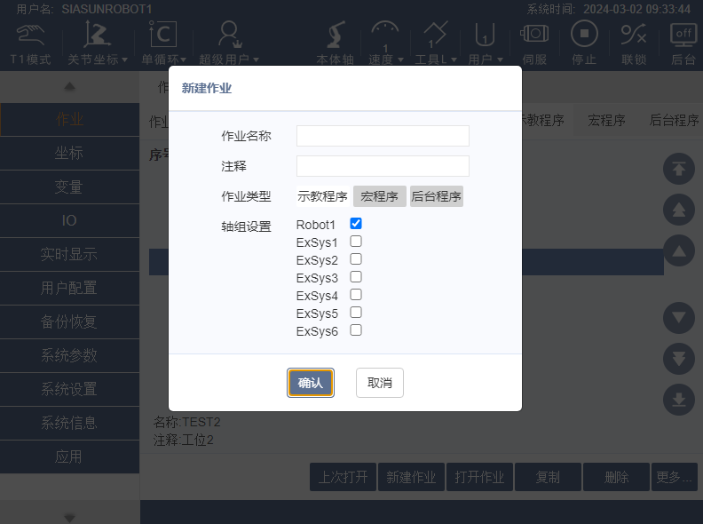

轴组设置信息

可输入作业注释

图4\-15新建作业界面

1. 对轴组设置进行选择。新松机器人最多支持12个轴，其中机器人本体轴最多6个轴，以及最多6个外部轴。外部轴系统需要根据现场应用在软件中单独配置。新建作业时，轴组设置界面中的Robot1表示机器人本体，轴组Robot2位目前预留，不进行设置。ExSys1\-6与所配置的外部轴系统号对应。ExSys1对应外部轴系统号1,以此类推。

只有轴组信息配置正确，示教作业在正反向运动检查和自动执行时，机器人的运动才正确，否则可能发生机器人某轴不动，或运动异常。

作业创建完成后，在示教器界面数据信息区显示的“轴组”后的8组字母与数字组合即为8位轴组信息，从右到左依次对应Robot1、Robot2、ExSys1\-6,轴组开关为√时，其对应数据位显示为橘黄色，轴组开关没有为√时，只有机器人本体为橘黄色。

 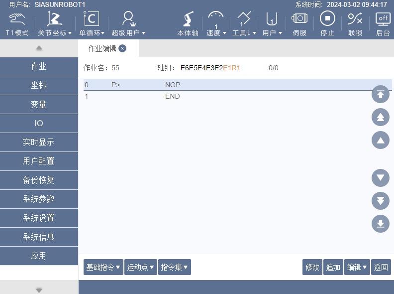

轴组对应信息

图 4\-16轴组对应的数据信息

作业名：支持大写字母、数字和下划线，作业名不能超过32个字符。

注释：可输入注释，并显示在作业名后，注释不能超过36个字符。

| **注释：**1. **输入作业名后，要按【前往】键，在按【确定】键，才能输入作业名。** 2. **输入的内容，以第一次触发\[前往]按键前的内容为准。第一次触发\[前往]按键后，后续编辑内容无效。** 3. **建议：触发【前往】按键前，请仔细确认所编辑的内容。若已经触发【前往】按钮后，还需更改所编辑的内容，则需要单击软键盘上的【取消】按键。** |
| --- |

**新建宏作业：**

在新建作业界面中，选择作业类型中的宏作业，即可新建宏作业。宏作业受到如下限制：

1. 宏作业名采用MACRO\+1\-99999999…的固定格式，后面的数字将与示教程序中MARCO指令后面的参数对应，并通过控制类1—MARCO指令进行调用。
2. 宏作业中不能包含运动指令以及运动相关的指令（中断、偏移、获取位置点、设置工具、用户坐标系）、CALL、WAIT、IRQ等指令，否则使用调用宏指令是会报警。
3. 宏作业通过宏指令MACRO调用，其菜单位置为【基础指令】\-【控制指令1】 \-【MACRO】宏指令参数范围为1\-99999999…的整数。如MACRO 100指令将调用名为“MACRO100”的作业。

**新建后台作业：**

在新建作业界面中，选择作业类型中的后台作业，即可新建后台作业。

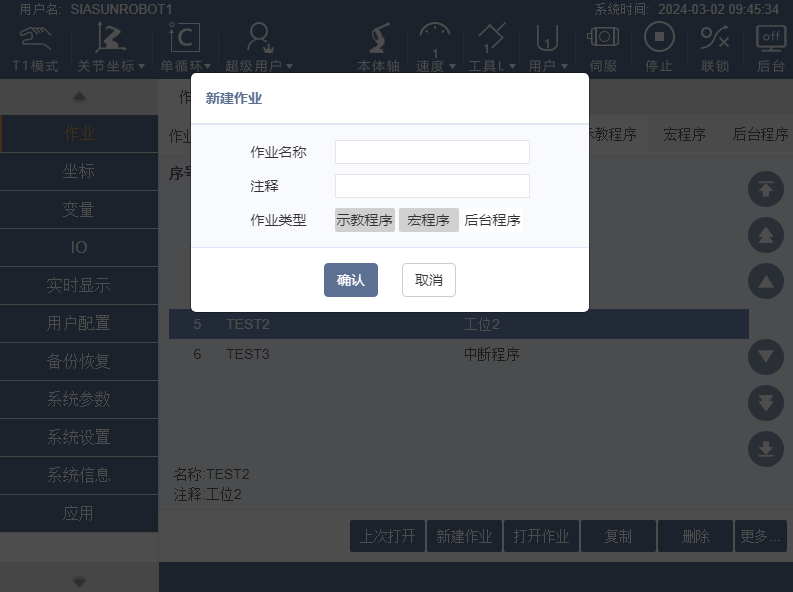

图 4\-17建立后台作业

后台程序不能处理动作指令和与动作有关的指令（如：中断、偏移、获取位置点、设置工具、用户坐标系等）。在启动后台时，系统会检查后台程序，如果有无法处理的指令，报警2237指令非法，行号:n。后台程序不能启动。

后台程序可以新建多个，最多允许同时允许8个后台程序，后台程序可以调用其它的后台程序，最多可以调用10级。后台程序启动前需要进行后台配置。后台作业配置成功后，作业名会变成橘黄色。后台作业有两种启动方式：开关启动、前台作业指令启动。若关机前通过菜单启动过后台作业，则开机后自动启动后台作业，若关机前通过菜单停止了后台作业，则开机后不会自动启动后台作业。后台作业图标为ON状态，表示机器人后台作业启动成功，OFF状态，表示后台程序处于关闭状态。

| **注释：**1. **后台作业不能调用示教程序，调用等级与示教程序一样，最多支持10级调用；** 2. **后台作业指令条数最多不超过200条（包括被调用的子后台作业中的指令条数）；** 3. **跳转标签指令必须加在跳转条件之后，否则启动后台时报警。** |
| --- |

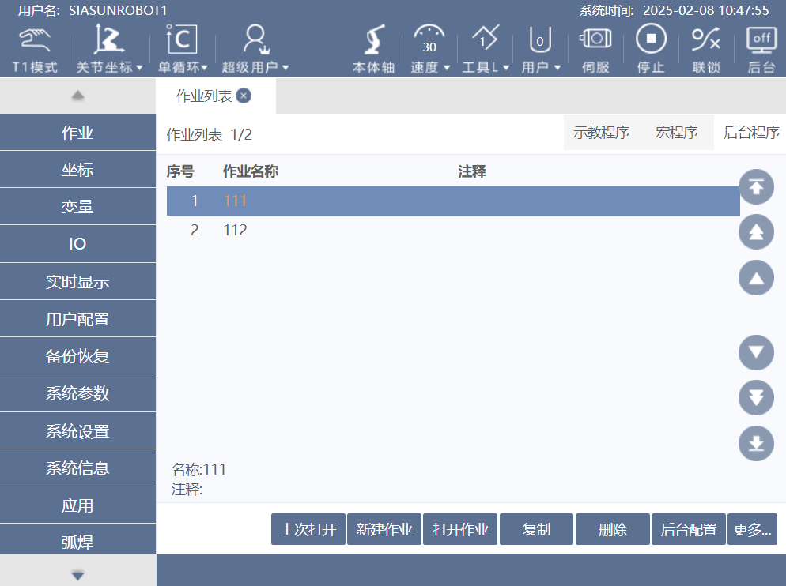

后台作业状态图标

在此设置需要启动的后台作业。设置完成后，作业名会变橘色

成橘色

图 4\-18后台程序列表

查看后台程序后，可以通过后台配置对后台程序进行设置与启动和关闭。通过设为后台指令，来选择需要启动的后台程序。

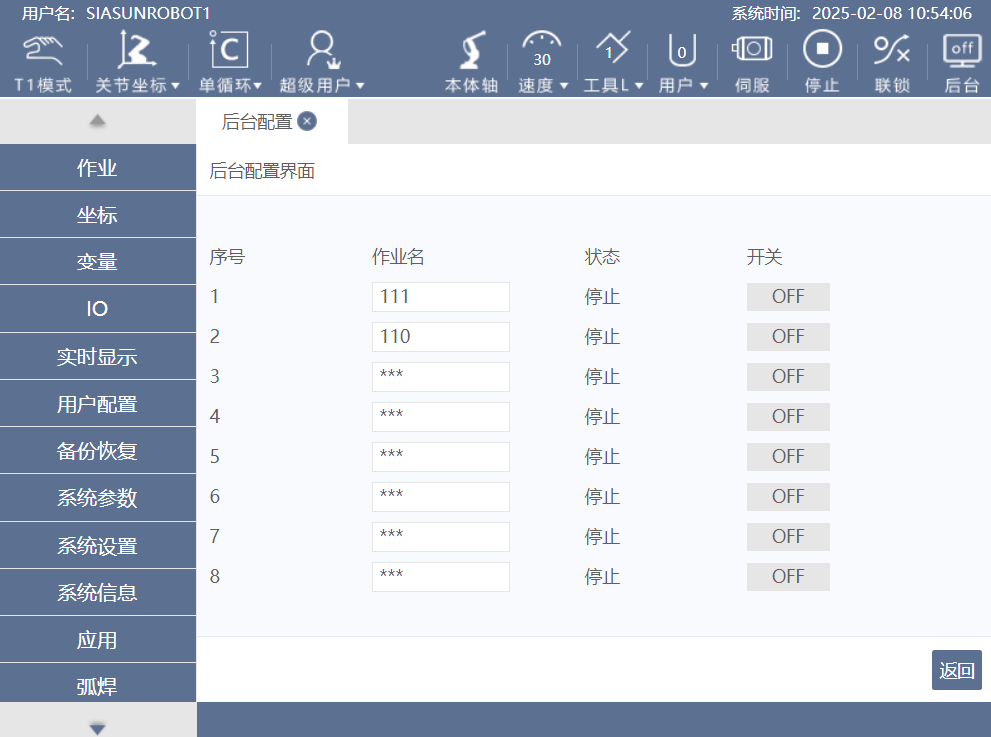

图 4\-19后台配置界面

作业名：输入后台程序名称。（如上图，作业中可以使用START BG\#1开启/关闭后台作业）

状态：显示当前运行状态。

开关：查看与强制后台启动/关闭。

启动的后台程序，如果不关闭，则一直为启动状态，和机器人模式无关，和机器人示教程序是否启动无关，和机器人是否伺服上电无关。不希望后台程序执行时，可以通过菜单关闭后台程序，后台程序关闭后屏幕右上角的图标显示OFF。如果下电前后台程序处于启动状态，则下电重启后后台程序自动启动运行。

后台程序的关闭与再启动除了使用菜单外，还可以在前台作业（示教程序）中使用指令控制，指令为：

**START BG:启动后台；**

**STOP BG:关闭后台；**

分别对应再启动和关闭后台作业。当前台作业执行到该控制指令时，后台作业关闭或再启动。使用指令控制后台作业的关闭与再启动，前台作业执行前，必须使用菜单启动后台程序，如果没有使用菜单启动，当前台作业执行到控制后台程序指令时将报错。

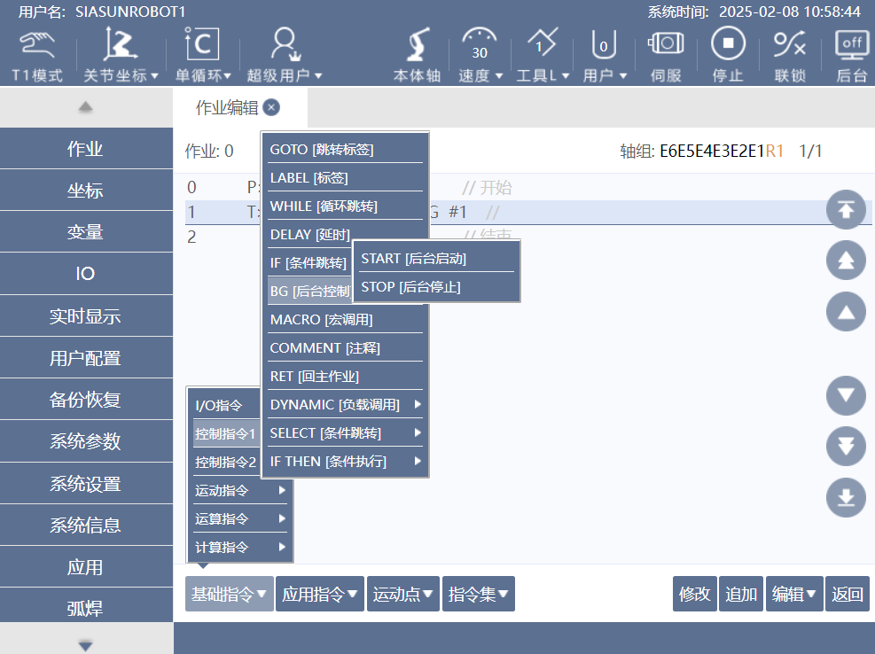

图 4\-20后台指令菜单

表格 4\-3后台指令说明

| START BG | 功能 | 启动后台程序。 |
| --- | --- | --- |
| 格式 | START BG\#（1\-8） |
| 说明 | 启动后台程序（1\-8） |
| 举例 | NOPSTART BG\#1启动后台作业MOVJ P1 VJ\=10DELAY T\=1MOVJ P2 VJ\=10DELAY T\=1STOP BG\#1停止后台作业END |
| STOP BG | 功能 | 关闭后台程序。 |
| 格式 | STOP BG\#（1\-8） |
| 说明 | 关闭后台程序1\-8 |
| 举例 | NOPSTART BG\#2启动后台作业MOVJ P1 VJ\=10DELAY T\=1MOVJ P2 VJ\=10DELAY T\=1STOP BG\#2停止后台作业END |

### 作业界面的设置

示教前，需要设置示教作业所需要的各项功能。

 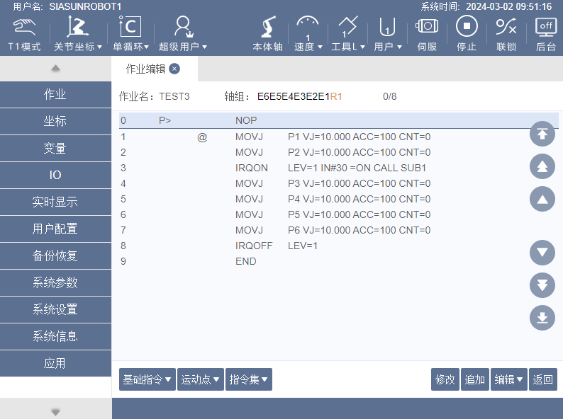

设置轴组

设定速度

确定工具和用户坐标系号

选择是否执行逻辑指令

选择循环模式

选择坐标系

示教选择T1模式

图4\-21需要设置的功能项

**模式选择：**

在工程师示教时，请始终保持机器人处于T1模式。

| **警告****为了在示教过程中，保障工程师的人身安全，请在整个示教过程中，将机器人设置为示教模式，拔下模式钥匙，保持安全门开启并且无法关闭状态，以免误按开始按钮，或外收到外部启动信号而启动机器人。** |
| --- |

**坐标系选择：**

选择坐标系关系到机器人以怎样的轨迹和方式做单轴或多轴联动动作。

**选择循环模式：**

选择不同的循环模式，机器人正向运动时，循环的模式是不同的。

单步：每按一下正向运动并按住后，机器人仅仅执行一条运动指令或逻辑指令。

单循环：按住正向运动后，机器人连续执行运动或逻辑指令，直到作业结束。

自动：按住正向运动后，机器人连续执行运动或逻辑指令，并一直循环指令作业。

| **注意：****反向运动时，机器人根据设定可以连续或单步执行程序，但是不能执行逻辑指令。** |
| --- |

**选择轴组：**

选择机器人按下轴运动键后，示教器控制本体轴或者外部轴。

**确定速度：**

确定机器人轴运动时的速度。

**选择坐标系号：**

选择机器人运动时的工具、用户坐标系编号。

**联锁：**

确定机器人是否执行逻辑指令，或者仅仅执行动作指令，跳过逻辑指令。

O/o图标表示正向运动时，机器人执行运动指令和逻辑指令。

O/x图标表示正向运动时，机器人仅仅执行运动指令，不执行逻辑指令。

### 示教动作指令

动作指令，是以指定的运动类型和速度，使机器人从当前位置移动到目标位置的指令。

点击【运动点】进入。

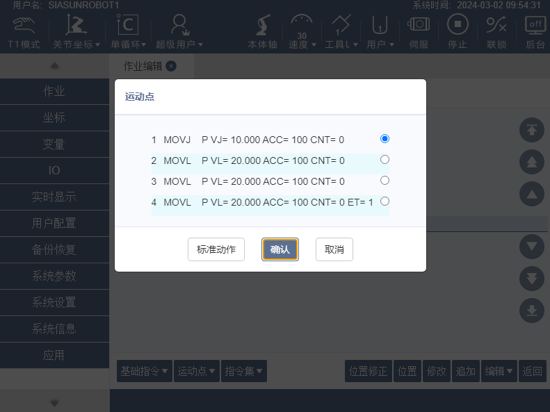

图 4\-22运动指令菜单1

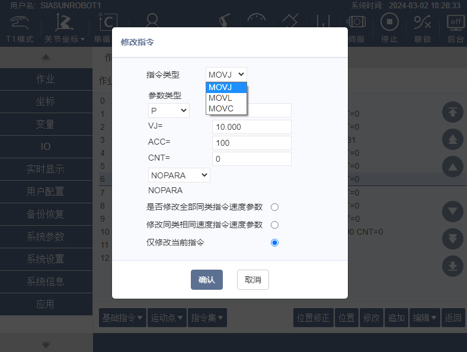

图 4‑23运动指令菜单2

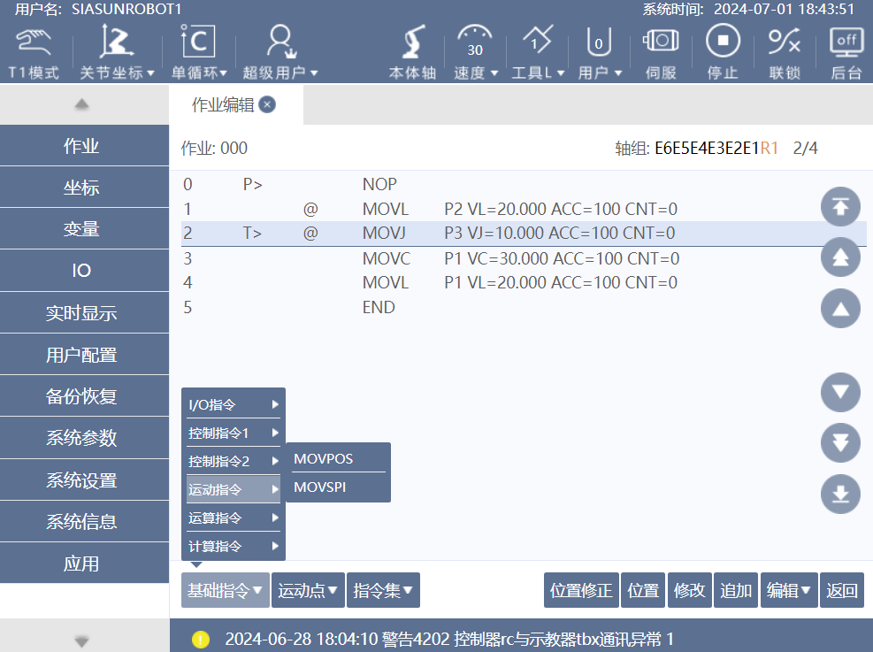

图 4‑24运动指令菜单3

在菜单中选择希望的运动类型，需要改变运动参数可选择要修改的指令点击右下方【修改】。

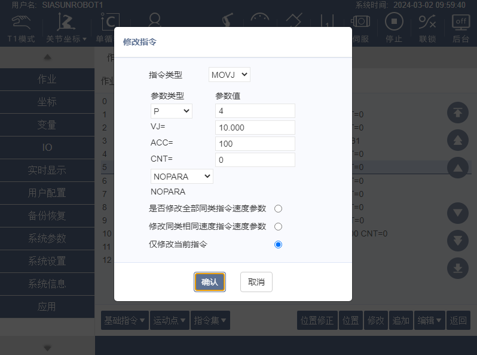

图 4‑25输入运动指令参数

输入参数点击确定。

### 逻辑控制指令

逻辑控制指令是机器人除了运动指令之外的总称，包含：

I/O类指令；

控制类1指令；

控制类2指令；

运算类指令；

计算类指令；

这些指令，可以直接在示教器点击相应的菜单进行调用，写入参数即可添加。

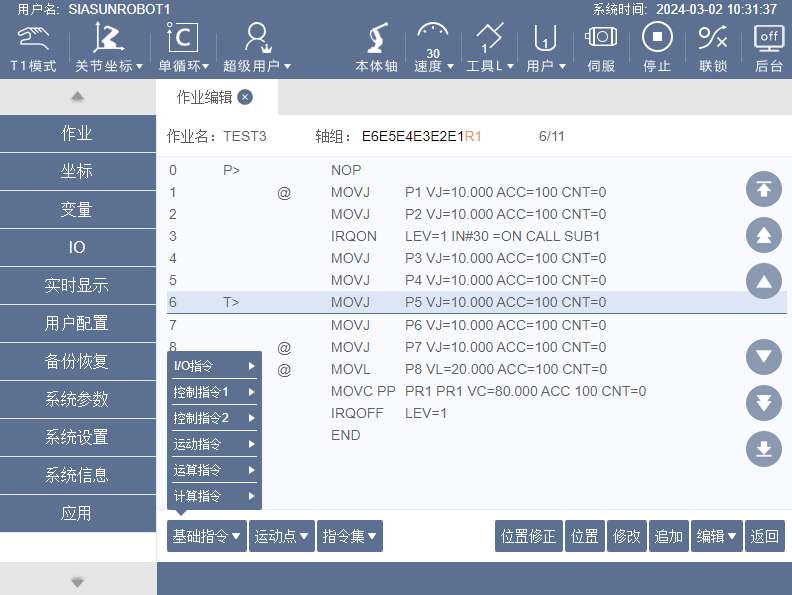

图 4‑26指令菜单逻辑控制指令

### 指令集指令

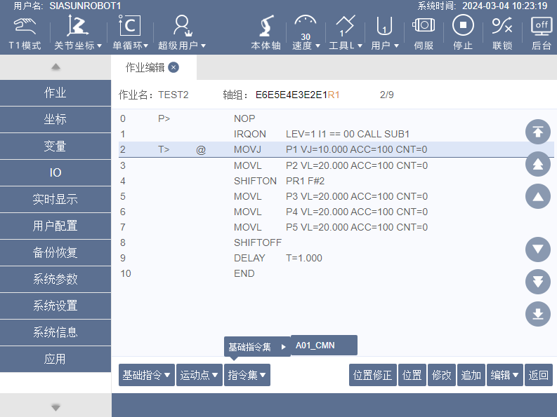

图 4‑27指令菜单基础指令集

## 指令的编辑

编辑菜单可以对已经编辑完成的指令进行删除、复制、剪切等操作。

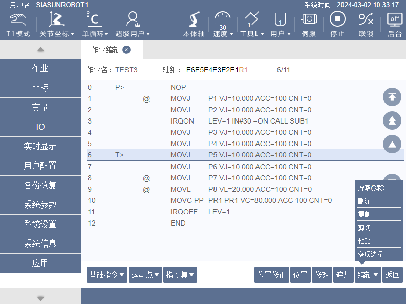

图 4‑28程序指令编辑菜单

1. 修正位置：可修改当前指令位置为机器人当前实际位置。
2. 位置：可查看并修改机器人当前的位置信息。
3. 修改：下面会介绍。
4. 追加：连续编辑同一个指令时，可点击追加，会直接在下方添加上次使用的指令。
5. 屏蔽/解除：对本条指令进行屏蔽（本条指令不执行）/解除屏蔽。
6. 删除：把所选指令删除。
7. 复制：对所选指令进行复制。
8. 剪切：对所选指令进行剪切。
9. 粘贴：对复制/剪切的指令进行粘贴。
10. 多项选择：可以同时选择多条指令，对他们进行整体编辑。

### 修改运动指令

修改运动指令，可以修改运动指令类型、局部/全局变量、变量号、相关参数、获取当前位置、也可以查看与修改位置值。光标在需要修改的运动指令上点击【修改】，弹出修改界面，即修改该运动指令。

 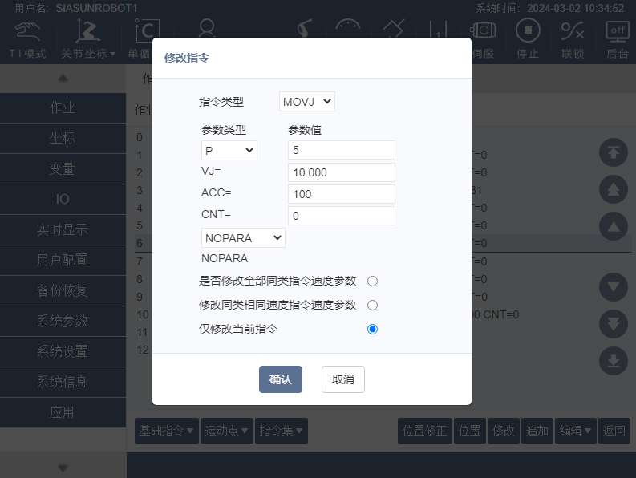

修改相同速度指令的速度

修改全部同类指令的速度

图 4‑29修改指令界面

1. 指令类型可修改MOVJ/MOVL…。
2. 可修改P/PR。
3. 可修改速度。
4. 可修改ACC加速度百分比。
5. 可修改CNT连续轨迹等级。
6. 可修改NOPARA/INTERLOCK,干涉区判别与否。
7. 可修改是否为外部TCP。（关节运动无）
8. 如果需要修改所有相同运动类型指令的速度，请进行选择。
9. 如果需要修改同类型相同速度的指令，请进行选择。
10. 如果仅修改当前指令速度，请进行选择。

### 修改逻辑、控制指令

1. 修改逻辑控制指令，即可对指令的参数进行修改。光标在需要修改的指令，然后点击【修改】，弹出修改指令界面。

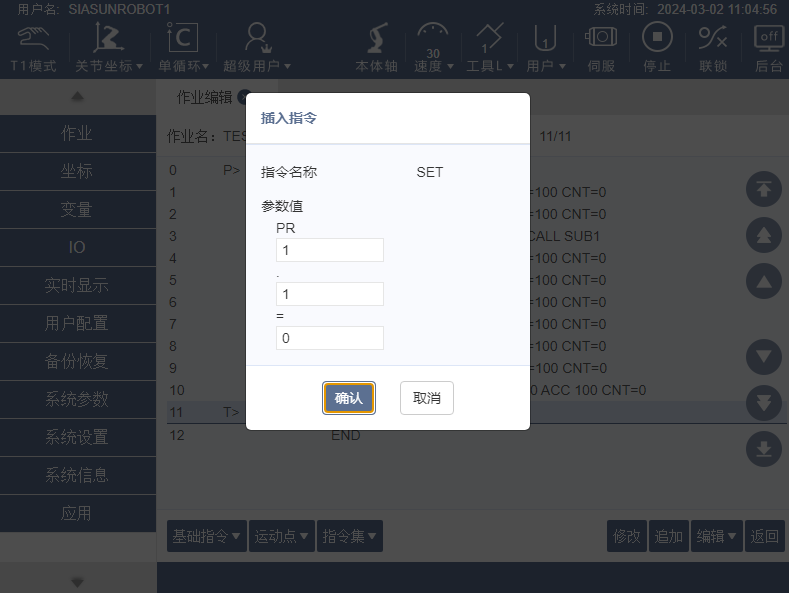

图 4‑30修改指令

弹出菜单后，即可修改逻辑指令的参数。

1. 2DELAY延时指令支持延时时间批量修改,修改DELAY延时指令时，会弹出如下对话框。

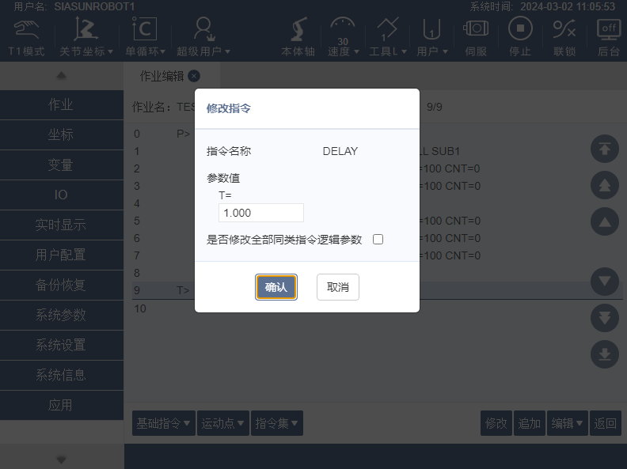

图 4‑31修改DELAY指令

如果不勾选“是否修改全部同类指令逻辑参数”，则只是修改当前这一条延时指令的延时时间，修改的结果为输入的延时时间。如果勾选“是否修改全部同类指令逻辑参数”，则修改当前行以下的所有延时指令的延时时间，修改完成后光标位置停在最后一条DELAY语句的位置，修改的结果为输入的延时时间。

## 作业管理

作业管理就是对作业的信息进行设定的功能。在作业列表界面，打开作业管理菜单。

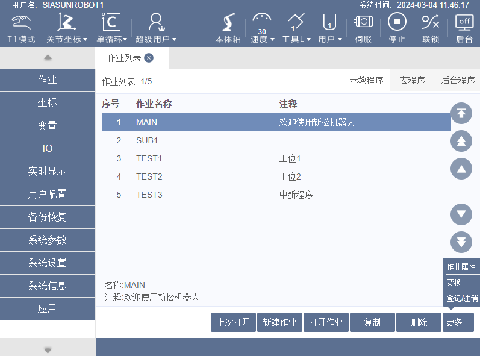

图 4‑32作业管理界面

1. **上次打开：**

打开前一次打开的作业。

若机器人第一次开机或重启后无作业打开前提下，用户单击【上次打开】按键，示教器会出现弹框“无打开作业的记录”。

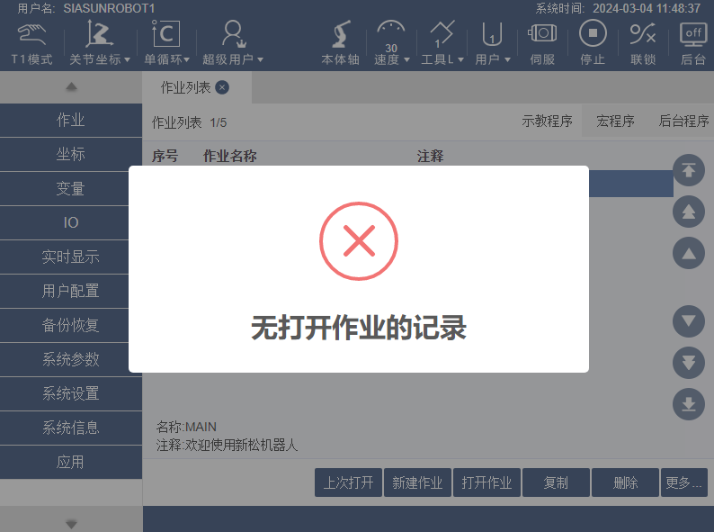

图 4‑33无打开作业的记录提示

1. **打开作业：**

打开当前选择的作业。

1. **复制：**

可以复制选定的作业。

1. **删除：**

可以删除选定的作业。

1. **作业属性：**

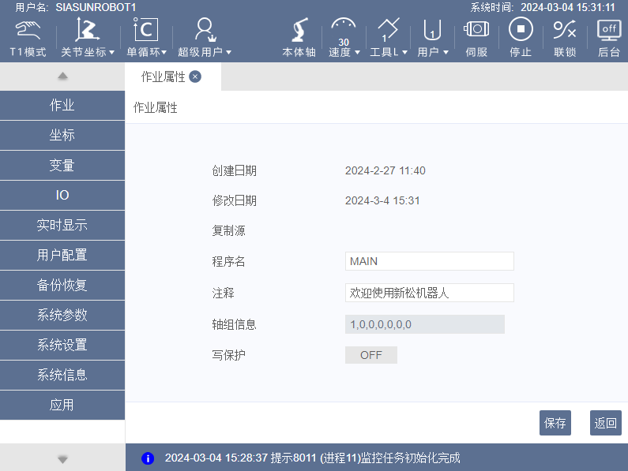

图 4‑34作业属性界面

1. **创建时间：**

可以查看该程序是什么时间创建的。

1. **修改时间：**

可以查看该程序最后一次修改的时间。

1. **复制源：**

可以查看该程序是否通过其它程序复制而来的。如果是，会显示通过哪个程序复制的该程序。如果不是则不显示。

1. **程序名：**

显示程序名称

1. **注释：**

可以查看与编辑注释。

1. **轴组信息：**

可以查看程序建立包含哪些轴组。

1. **写保护：**

该状态有ON/OFF。

ON:表示保护作业。被保护的作业不能进行修改,可以保护作业的安全,在作业名前会显示个锁头标识。

OFF：表示不保护作业或解除保护的作业。

1. **变换：**

对作业里面位置进行整体变换（详见4\.6作业变换说明）。

1. **登记/注销：**

登记：将作业登记为主作业，作业登记为主作业后作业名变为橘黄色，且被登记的主作业被移到作业列表中的第一个位置。

注销：取消主作业。

 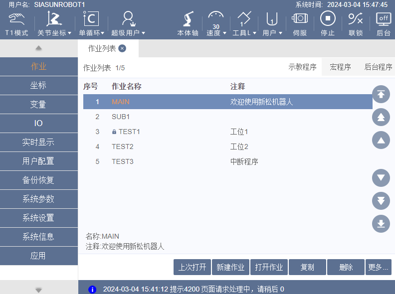

主作业

图 4‑35主作业在界面中的表示

| **注意：**1. **已经保护的作业，不能进行重命名、复制和删除等操作。** 2. **已经登记为主作业的作业，不能进行重命名和删除。** 3. **正在运行的后台作业，不能进行重命名、复制和删除操作。** |
| --- |

## 作业变换

作业变换是，对所选择的作业位置点变换。

作业变换方式有3种：偏移、镜像、关节。

**作业变换步骤：**

点击主菜单【作业】\-【更多】\-【变换】，进入作业变换设置界面。

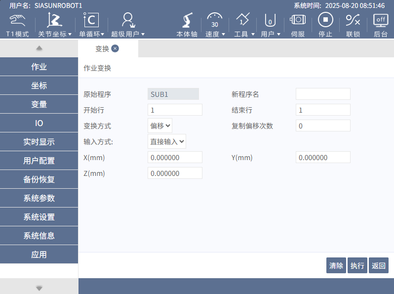

图 4‑36作业变换配置界面

1. **原始程序：**

为作业列表选中的程序名

1. **新程序名：**

如填写新程序名，则变换成功后会生成一个该名的新作业；若不填写新程序名，则执行变换时会覆盖原程序。

1. **开始行，结束行：**

为需要执行变换的作业行数，开始行最小为1；结束行填写的行数若大于原程序最大行数则视作变换至原作业最后一条指令。

1. **变换方式：**

可选择偏移、镜像、关节三种方式进行变换。

1. **清除：**

点击清除会将当前页面所有数据恢复至默认值。

1. **执行：**

点击执行按钮开始变换作业，变换完成时会提示变换成功，若出现错误会提示变换失败。

| **注意：**1. **无法对使用全局位置变量PR的指令位置进行位置变换，变换后的作业中，带有全局位置变量PR的序号与位置不发生变化。** 2. **生成新作业后，局部变量号重新排列，会出现与之前变量编号不一致。** |
| --- |

1. **外部轴：**

只有在作业关节变换时，外部轴才会参与到作业转换中。其它转换，外部轴不直接参与作业转换，转换后外部轴保持原作业位置，不发生位置变换。

### 作业偏移变换

复制偏移次数：假设原作业中有P1、P2两组运动指令，当复制偏移数量为1，生成作业中包含运动指令点P1、P2、P3、P4,其中P1、P2与原作业中位置点相同，P3、P4基于P1、P2及输入的偏移值偏移后的点；当复制偏移数量为2，即生成作业中包含运动指令点P1、P2、P3、P4、P5、P6，P3、P4基于P1、P2及输入的偏移值偏移后的点，P5、P6基于P1、P2及输入的偏移值\*复制偏移数量，偏移后的点；复制偏移无法变换原作业；复制偏移不支持旋转变换。**注：使用复制偏移功能，在点击执行时会进行逻辑判断，程序逻辑不对的会有提示，执行不成功。**

输入方式：可选直接输入，示教输入。

图 4‑37作业偏移\-直接输入配置界面

直接输入：可在XYZ中直接填入需要平移的距离，实现位置平移转换。

XYZ：输入方式为直接输入时，可以直接输入平移距离，单位为mm。

外部轴不发生位置变换。

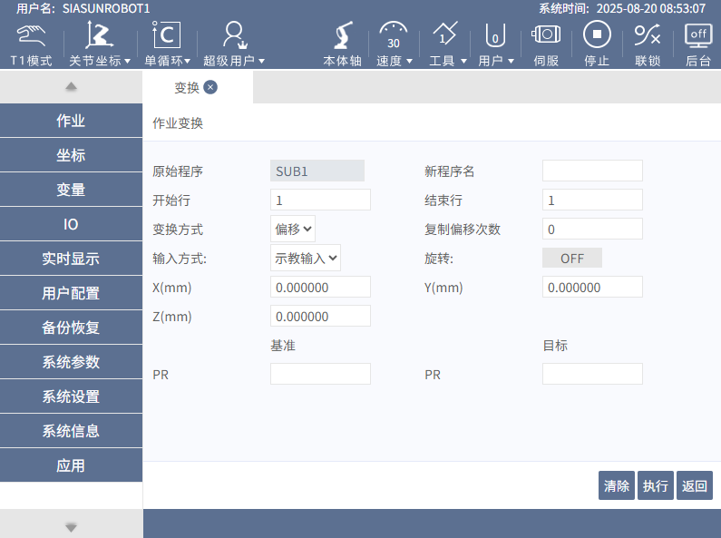

图 4‑38作业偏移\-示教输入配置界面

示教输入：旋转关闭状态，可在XYZ中直接填入或基准目标PR位置变量，实现位置平移转换。

通过填入基准、目标位置的变量号计算得出偏移距离XYZ，也可在计算结果基础上手动更改偏移距离。

基准目标PR：为偏移基准点与偏移目标点的位置变量号，机器人通过两者相对距离进行偏移。

PR变量的数据类型为RPY。

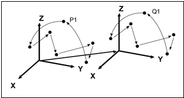

图 4‑39平移变换，不发生旋转图示

目标点，外部轴如果移动，变换后外部轴不发生位置变换，外部轴移动的位置距离对应会转换到机器人世界坐标系下(如P2\)，机器人本体移动（如P1）,作业转换后。

* + - 1. 滑台标定后，机器人本体会发生P1\+P2的位置变换，外部轴位置不发生变化。
			2. 滑台没有标定，机器人本体会发生P1的位置变换，外部轴位置不发生变化。
			3. 轴类型为其它时，机器人本体会发生P1的位置变换，外部轴位置不发生变化。

示教输入，打开旋转开关，机器人可根据设置2个坐标系发生位置与姿态转换。

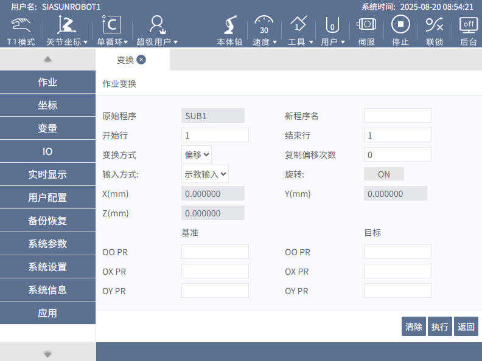

图 4‑40作业偏移\-示教输入\-旋转ON配置界面

基准建立坐标系的三个参考点，这3个点分别记录到不同的位置变量P里，目标建立坐标系的三个参考点，这3个点分别记录到不同的位置变量P里，机器人通过两个坐标系的相对位置进行偏移（详见2\.2\.3设定用户坐标系说明）。

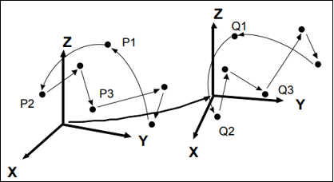

图 4‑41偏移变换姿态偏移转换示图

目标坐标系，外部轴如果移动，变换后外部轴不发生位置变换，机器人本体会根据两个坐标系进行位置转换。

### 作业镜像变换

镜像变换：可根据用户坐标系，选择镜像面，实现作业转换。

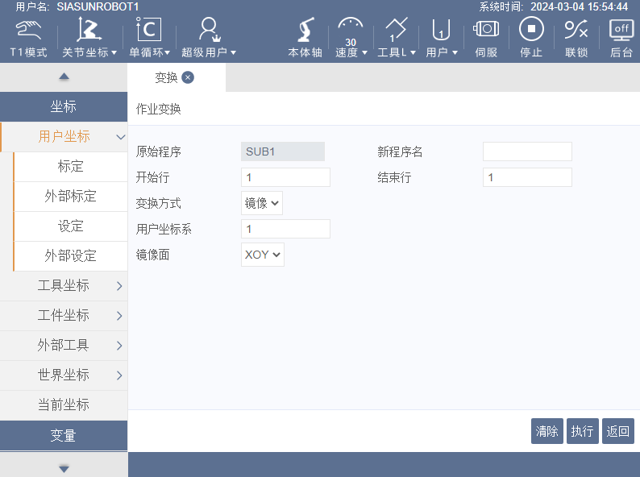

图 4‑42镜像变换配置界面

用户坐标系：输入范围为1\-8，选择参照的用户坐标系。

镜像面：选择镜像变换参考的镜像面。

镜像变换方式如图4\-42所示，将示教好的位置以面对称的方式变换到其他位置。

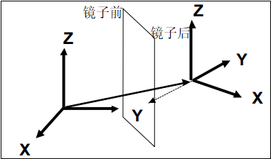

图 4‑43镜像变换配置界面

### 作业关节变换

关节变换：可根据关节角度，实现作业转换。

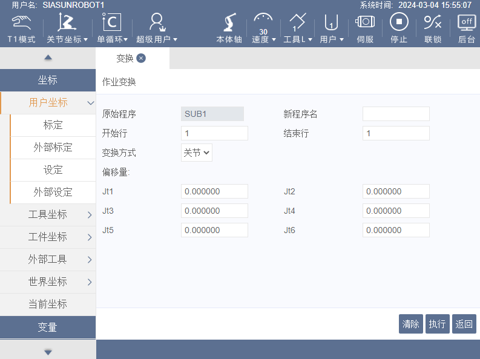

图 4‑44关节变换配置界面

偏移量Jt：需要进行关节偏移的偏移角度。Jt的最大数量与系统配置的外部轴数量相关。

| **注意：**1. **宏程序、后台程序无法执行变换。** 2. **每次打开页面会显示上一次执行成功的数据。** 3. **新作业名若与作业列表已有程序名重复则会变换失败。** 4. **关节变换时若超过关节软限位则会变换失败。** 5. **当新作业名为空时，若变换失败，则原作业保持不变。** 6. **镜像变换通常要求工具坐标系Z轴为工具方向，镜像变换对工具坐标系的X、Z轴进行镜像。** |
| --- |

# **程序的运行**

本章对程序的手动测试、自动运行进行说明。

## 程序的停止和恢复

程序的停止即停止执行中的程序。机器人可以通过暂停和急停来进行人为的停止。也有因为报警而发生的停止。

机器人运行动作中发生停止时的减速方式有两种：

1. 瞬间停止：机器人迅速停止动作。
2. 减速停止：机器人减速后，停止动作。

人为停止程序的方法有如下几种：

1. 按下示教器上的停止按键。
2. 按下示教器、控制器上的急停按钮、控制器切断电源。
3. 外部控制停止，远程IO映射中输入的外部暂停、外部停止、外部下电。
4. 按下外接的外部急停按钮、打开安全门。

### 通过急停来停止和恢复

通过按下控制器、示教器、外部急停按钮，都会使机器人停止。

**急停方式：**

按下机器人急停按钮，机器人会立刻停止。

| 开机旋钮急停按钮急停按钮 |
| --- |

图5\-1 机器人急停按钮

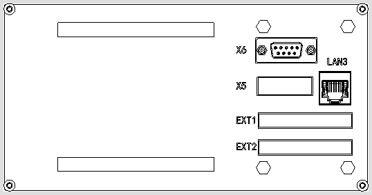

SRC C5\-A控制器后面板EXTI端口5、6、7、8为外部急停双回路接口

图5\-2 外部急停双回路接口

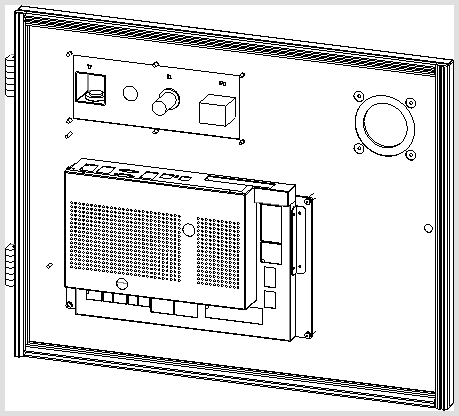

P12

M5\-B\\G5\-A控制器柜门里面板P12端子排端口1、2、3、4为外部急停双回路接口。

图5\-3 外部急停双回路接口

| C:\Users\miaoxiangdi\AppData\Roaming\LarkShell\sdk_storage\409e8086ec761b170551fcd94e84b802\resources\images\img_v3_02c5_61a7842d-6df6-4d99-b960-adf61bc6a70g.jpg示教器急停电源开关急停按钮启动按钮 |
| --- |

图 5\-4 SRC M6机器人控制器

| C:\Users\mashuang\AppData\Roaming\LarkShell\sdk_storage\480b3eac5cdd350f2e17294954a3b020\resources\images\img_v3_02dn_7878838c-2927-4850-94a5-ddbb462f823g.png指示灯启动按钮急停示教器接口按钮电源开关 |
| --- |

图 5\-5 SRC C6机器人控制器

**恢复方式：**

排除导致急停按钮按下的原因：

1. 向右边旋转急停按钮。

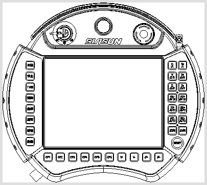

图5\-6 急停按钮

1. 按示教器的RESET（报警解除）按键、远程控制IO的报警复位信号。示教器画面上的报警显示消失。示教器上的报警灯消失。

|  |
| --- |

图 5‑7 RESET键

### 通过暂停键停止和恢复的方法

按下暂停键，机器人减速停止。

**暂停方式 ：**

1. 按下示教器上的停止键。

|  |
| --- |

图 5‑8停止键

1. 外部控制停止，远程IO映射中输入的外部暂停。

**恢复方法：**

再开始程序，暂停即被解除。

### 通过报警来停止程序

机器人在执行程序或者示教时，检测到异常状态，或者从外部急停传来信号，则发生报警，并停止机器人，等待报警解除。

**显示报警：**

报警信息会显示在机器人下方的报警信息栏中，点击报警信息会打开机器人报警界面。同时示教器LED灯变成红色。

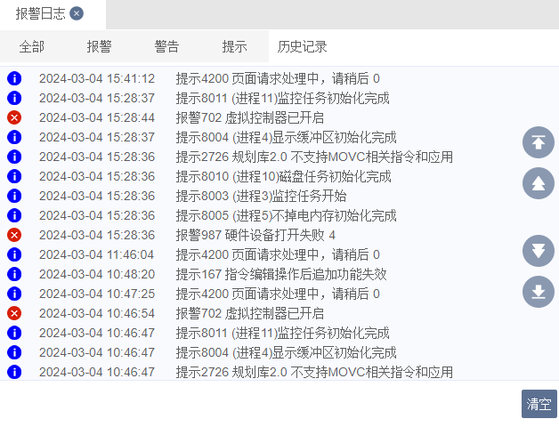

图 5\-9报警界面

报警日志可以显示报警的全部信息，以规定颜色区分重要程度。

表5\-1 报警重要程度对应LED灯颜色表

| **颜色** | **重要程度** |
| --- | --- |
| 蓝色 | 提示信息 |
| 黄色 | 警告 |
| 红色 | 报警 |

**解除报警：**

按示教器的RESET（报警解除）按键、远程控制IO的报警复位信号。示教器画面上的报警显示消失。示教器上的报警灯消失。

## 程序的执行

执行程序，就是机器人重复运行已经编辑好的程序，机器人会按照程序指定的指令，进行执行。执行程序分为3种循环方式：单步、单循环、自动（无限循环）。

### 如何启动程序运行

三种方式可以开启程序执行：

1. 手动模式：通过示教器上的正向运动或反向运动即可手动执行程序。
2. 执行模式：通过示教器上的开始按钮，可以自动开启程序运行。（**M6/C6控制柜/ARM板卡，先按示教器上的开始按钮，再按控制柜上的启动按钮，可以自动开启程序运行。**）
3. 远程模式：通过远程I\\O，使用外围设备，远程控制机器人启动程序。

|  |
| --- |

图 5\-10 模式选择开关

机器人示教器上有模式选择钥匙，在不同的模式下，使用对应的启动方式。

|  |
| --- |

图 5\-11开始键、正向反向运动键

### 机器人按程序运行

当机器人正向运动执行作业时，程序会按照从上到下的顺序执行指令，运动指令会指示机器人按怎样的运动方式到达预期的位置。

在启动机器人进行动作前，务必对机器人的一些要素进行确认，以保证机器人按照预期的轨迹和速度进行运动，同时确认机器人是否按照希望的逻辑和循环方式运行。

机器人速度：机器人运动的速度\=指令速度×速度倍率/100。手动TI模式最大速度为250mm/s。

机器人坐标系：确认当前所选择的坐标系、检查程序中有切换坐标系的指令都是正确的。（在不同坐标系下执行程序，机器人的运动会发生变化。）

逻辑指令是否被执行:在手动正向运动机器人时,通过联锁图标查看连锁功能是否打开。打开连锁，执行逻辑指令、运动指令。不开连锁，不执行逻辑指令，只执行运动指令。

确定机器人的循环状态：单步运行时，机器人启动后只执行一条指令。单循环时，机器人启动后连续执行，直到作业结束。自动运行时，机器人启动后连续循环执行作业。

| 确定循环模式确定速度确定坐标系联锁图标 |
| --- |

图 5‑12手动运行程序界面

**速度倍率：**

机器人的速度是根据示教器指定速度的比率来运行。

当倍率为100%时，机器人会按照程序指令的速度运行。

通过示教器上的加减速按钮，可以改变运行速度，通过触屏点击图标也可以改变速度，通过SET VEL指令可以改变速度。

|  |
| --- |

图 5\-13机器人加减速

| **警告:****在T1和T2模式下，机器人在相同的速度倍率的情况下，实际运行的速度是不同的。T1模式最大的速度TCP不超过安全速度，T2模式下，机器人是按照实际运行最大速度的百分比进行动作。请确认在周围无人，没有无关物品的情况下，进行运动机器人，以免造成严重的人身伤亡或设备损坏。** |
| --- |

**坐标系的确定：**

在执行机器人程序前，请确认机器人的坐标系，要使机器人执行时所使用的坐标系与示教时使用的坐标系保持一致，否则机器人本体位置会因为坐标系的不同而变化。

1. **工具坐标系号码（TF）：**

工具坐标系可定义8个工具坐标系，由1\-8号进行区分。可根据情况进行切换，切换方式：示教器上直接选择、程序里添加SET TF 1\-8。

1. **用户坐标系号码（UF）：**

用户坐标系可定义8个用户坐标系，由1\-8号进行区分。可根据情况进行切换,切换方式：示教器上直接选择、程序里添加SET UF 1\-8。

| **警告：**1. **机器人程序启动时，会按照示教器上方的坐标系图标所选择的坐标系进行运动，如果选择的坐标系不是示教时所对应的坐标系号，那么机器人程序运行时，机器人本体移动的位置与姿势会和示教时不同，请务必确定好坐标系号之后，再进行移动。** 2. **如果在一个程序中使用不同的坐标系进行了程序的示教，可以在程序示教位置前增加SET TF或SET UF指令，手动运行程序时，需要将联锁打开，开启逻辑指令执行模式，就可以在程序运行时，切换到所需要的坐标系文件号运行。** |
| --- |

|  |
| --- |

图 5‑14工具、用户坐标系的选择

### 从暂停恢复启动

当机器人正向运行中断后，重新按正向运动，即可继续按程序运动。

当机器人自动运行暂停后，重新按启动按钮，或外部启动，即可继续按照程序运动。

## 循环停止

远程模式下，通过该界面配置的IO信号可以暂停机器人，通过远程IO界面配置的外部启动信号启动，将会按设置的指定作业从首行开始运行。

**循环停止操作步骤：**

点击主菜单【用户配置】\-【下翻页】\-【循环停止】，进入循环停止配置界面。

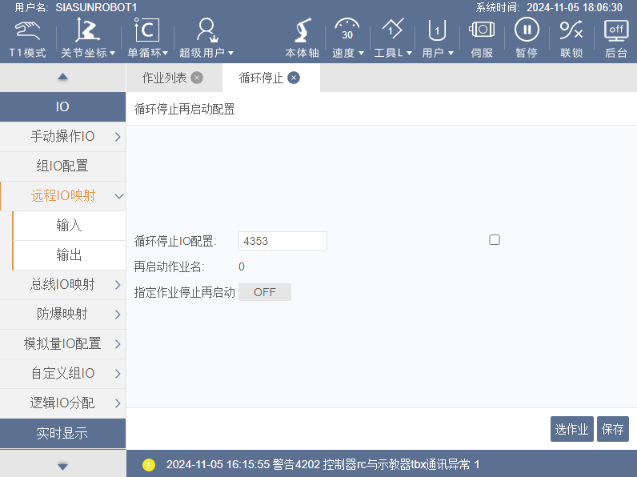

图 5‑15循环停止配置界面

**循环停止IO配置：**范围1\-4096，□选择√后表示循环停止再启动功能关闭。

**再启动作业名配置：**

通过页面右下角【选作业】按钮，会出现作业列表弹框如下图，选择需要通过启动直接运行的作业名，点击确认\-保存，完成页面配置。循环停止再启动的作业配置列表包含所有已经建立的示教程序，不包含宏程序、后台程序。注意：如果指定某子作业SUB（子作业含有RET），则当循环停止再启动执行该子作业到结尾时自动停止，会有2242提示（子作业不能返回），所以配置成子作业后只能执行到RET位置，并报警子作业不能返回。

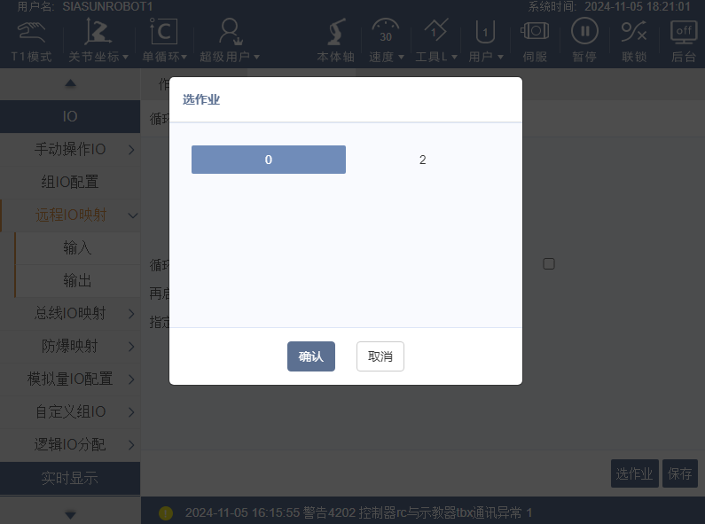

图 5‑16再启动作业名\-选择作业界面

**指定作业停止再启动开关：**

开关为ON时，通过循环停止信号停止程序后，再启动按照已经配置的作业名从首行开始执行；开关为OFF时，通过循环停止信号停止程序后，再启动按照当前执行的作业从首行开始执行。

| **注意：**1. **循环停止再启动为远程模式下功能。远程模式下，对于外部启动作业、预约启动作业，无论哪种作业运行形式，以循环停止方式触发暂停后，再启动机器人就会按照指定作业重头运行；以普通停止(硬按键暂停、外部暂停)触发暂停后，再启动机器人就会继续当前作业。本地模式该功能不支持。** 2. **远程模式下没有作业打开的前提下，直接启动作业仍然会报2002提示（子作业不存在）。** 3. **远程模式下外部循环停止中，触发启动作业会报2228（外部循环停止中，禁止启动程序），需要先把外部循环停止信号关闭后再启动。** 4. **暂停类型目前以首次暂停触发方式为准，如果暂停后还进行其他方式暂停触发，暂停类型仍保持不变。例如：远程模式下机器人运行过程中本地按键暂停机器人后，然后又触发循环停止，再启动作业时按照普通暂停后继续运行当前作业。** 5. **循环停止IO配置成1281表示循环停止再启动功能关闭。** 6. **清除内存时循环停止IO恢复默认1281；循环停止再启动作业名配置清空。** |
| --- |

## 对程序进行测试

测试程序，是指机器人在现场自动执行之前，确定机器人的动作以及逻辑。测试程序对机器人安全运转有着非常重要的意义。

程序测试分为两个步骤：

1. 使用示教器，循环方式选择单步，手动（按正向运动）进行测试。主要验证位置点。
2. 使用示教器，循环方式选择单循环，手动运行（选择手动模式并打开连锁开关）或自动运行（选择执行模式并选择低速），进行测试。验证位置连贯性、整体逻辑。

可以通过示教器上循环状态图标的下拉菜单进行选择循环方式，或可以通过示教器上循环按键来切换循环方式。机器人的循环方式分为3种：

1. 单步，机器人单步执行每条指令。
2. 单循环，机器人连续运动一个循环。
3. 自动，机器人一直连续循环运行。

可以通过联锁图标，来改变机器人是否执行逻辑指令。

1. o/o是联锁开关开启状态，逻辑指令与运动指令都执行。
2. o/x是联锁开关，关闭状态，逻辑指令不执行、运动指令执行。

要通过外部启动来测试机器人，则需要选择远程模式。

此外，机器人如果需要和外部设备进行I\\O通讯，并控制外围设备，则需要确定外围设备好用，I\\O都处于有效状态，并没有报警显示。

联锁图标

| 切换循环模式 |
| --- |

图 5‑17循环模式、连锁图标

| **警告：****测试机器人前请确保选定的坐标系号和示教时所使用的坐标系号是否保持一致。** |
| --- |

### 测试前需要确定的设置

表格 5‑2测试需要确认的项目

| 设定项目 | 说明 |
| --- | --- |
| 循环状态 | 运行前请确认机器人执行的循环状态：单步，机器人单步执行每条指令。单循环，按住【正向运动】，机器人连续运动一个循环。自动，按住【正向运动】，机器人一直连续循环运行。  | 警告：联锁开启并且连续执行时，逻辑指令也是连续执行。请在手动运行时注意确认，以免周围的设备因信号触发运动，造成设备损坏或人员伤亡。 | | --- | |
| 联锁 | 联锁状态，代表机器人在手动运行时，是否跳过逻辑指令：o/o是联锁指令开启状态，逻辑指令都执行。o/x代表逻辑指令不执行。 |

|  |
| --- |

图 5‑18机器人连续按钮

 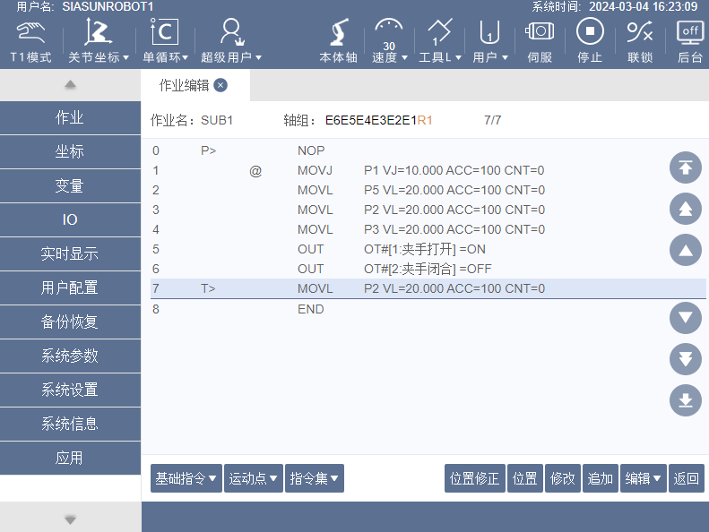

逻辑指令就

是除了运动

指令外的所有指令

联锁图标

图 5‑19逻辑指令

测试前确认项目后，机器人可以：

1. 按程序顺序，自上到下，按照程序的逻辑执行每一条指令，并按照逻辑指令改变机器人状态和程序执行顺序。
2. 只执行运动指令，逻辑控制指令自动跳过，机器人动作逐条执行，如果有不加条件的CALL子程序也会进入到子程序中执行。

机器人逻辑指令是否执行需要通过联锁开关是否打开来确认。

| **注意：****调用子作业不加条件的CALL指令，在执行运动指令时是有效的。可以在执行该指令时，调用子作业进行执行。** |
| --- |

### 单步测试程序

单步测试程序，机器人逐条执行程序，执行完一条程序后，机器人暂停，光标会停在这条指令上，再次执行后，光标会自动跳到下一条语句执行。

**设定机器人运行方式：**

通过机器人示教器界面的按钮，可以改变机器人的运行方式。

| 设定机器人循环方式设定坐标系、速度 |
| --- |

图 5‑20单步运行设置与执行

程序可以通过正向或反向运动来进行。

**正向运动：**

正向运动，指的是按从上到下的顺序正向执行机器人程序指令。需要同时按住机器人的安全开关【DEADMAN】和【正向】键，松开任意键机器人停止。

机器人从程序光标所在行执行，完成后暂停。但是，在子程序的末尾按下【正向】键，机器人将返回上一层主程序，并会运动到CALL指令上，再次正向，向下运动。

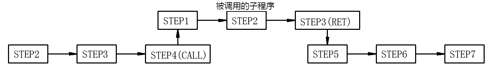

图 5‑21单步运行设置与执行

| **警告：****运行机器人前，需要确认机器人运动范围内，没有人员以及不必要的设备，以免发生意想不到的问题，造成人员伤亡或设备损坏。** |
| --- |

**反向运动：**

反向运动，指的是机器人逆向执行程序。需要同时按住机器人的安全开关【DEADMAN】和【反向】键**，**松开任意键机器人停止。

反向运动，机器人只执行运动指令，不执行逻辑指令（与联锁开关状态无关）。重新打开一个子程序，反向运行是无法返回上一级程序的。

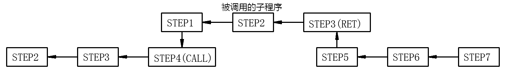

图 5‑22程序反向运动示意图

| **注意：****反向运动时，机器人根据设定可以连续或单步执行程序，但是不能执行逻辑指令。** |
| --- |

| **警告：****运行机器人前，需要确认机器人运动范围内，没有人员以及不必要的设备，以免发生意想不到的问题，造成人员伤亡或设备损坏。** |
| --- |

当机器人在进行圆弧运动时，中间停下来，在机器人的位置点没动的情况下，继续按下【正向】和【反向】键，机器人仍进行原始的圆弧运动。但是，在机器人的位置点移动的情况下，继续按下【正向】键，机器人的运动轨迹会重新规划。

**单步执行的步骤：**

1. 确定机器人运动范围内，没有人员。
2. 选择机器人单步运行方式。
3. 确定机器人执行时的各种状态。
4. 将光标移动到程序的开始。
5. 按上电按钮，对机器人上电，并一直按下【DEADMAN】不松开。
6. 运行程序：按住安全开关\[DEADMAN]和【正向】或【反向】、单步执行程序。
7. 在执行完一行程序后，程序暂停，再按【正向】或【反向】，继续执行。
8. 完成后，松开DEANMAN按钮。

### 连续运行测试程序

连续运行测试，是指机器人按程序顺序，连续运行程序。

选择单循环、自动运行方式，来进行连续测试。

使用示教器手动进行连续运行程序时，按下【DEADMAN】和【正向】，程序会从当前行开始执行。

机器人自动运行连续测试程序时，使用示教器上的【开始】或远程启动来使机器人程序执行。

| **警告：****运行机器人前，需要确认机器人运动范围内，没有人员以及不必要的设备，以免发生意想不到的问题，造成人员伤亡或设备损坏。** |
| --- |

**使用示教器手动连续测试步骤：**

1. 查看机器人运动范围内没有人。
2. 选择单循环或自动运行方式。
3. 确定机器人执行时的速度、坐标系号、联锁等状态。
4. 按上电按钮，给机器人伺服上电。
5. 在按下【DEADMAN】的状态下，同时按【正向】，连续执行程序。在程序结束之前，一直按住【DEADMAN】与【正向】。如果松开任意一键，程序在执行的中途暂停。

**使用开始按钮或远程启动进行连续测试步骤：**

1. 确定机器人运行范围内没有人。
2. 选择单循环或自动的循环方式。
3. 确定各项设置（循环模式、速度、坐标系号）是否正确。
4. 将执行模式改为执行或者远程。

 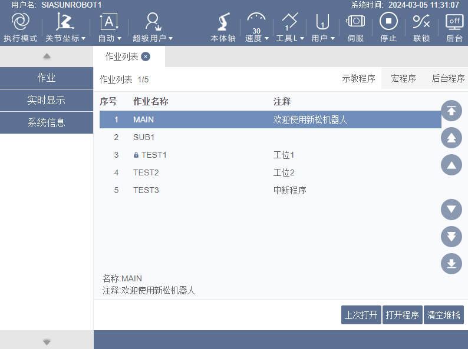

清空堆栈

图 5‑23执行模式下作业列表

| **注意：****堆栈内存放作业名、行号、光标、在路径上标志、补偿标志位、偏移、中断等信息。清空后，与这些信息有关的限制或记录将被取消。请避免因为这些限制被取消后，造成的机器人不按预期移动造成的危险。以免发生人员伤害或设备损坏。** |
| --- |

1. 将光标移动到第一行。
2. 按【开始】或远程启动执行程序。

### 程序确认和监控

当程序在运行时，示教器上的作业界面，即是对程序运行过程监控的主要媒体。在作业执行画面上，光标随着作业的执行而移动到正在执行的行，执行模式下，作业不能被编辑。

 

程序的执行界面

程序执行信息显示

图 5‑24程序的执行

## I/O的手动控制

I/O手动控制，是机器人在未执行程序时，对外部设备进行信号交换。

### I/O的手动输出

强制对I/O信号进行输出，手动改变I/O的ON/OFF状态。

**I/O的手动输出步骤：**

在强制输出之前，机器人已经配置好相应的I\\0。

1. 点击主菜单【I/O】\-【手动操作IO】\-【用户IO输出】，进入用户输出设置界面。

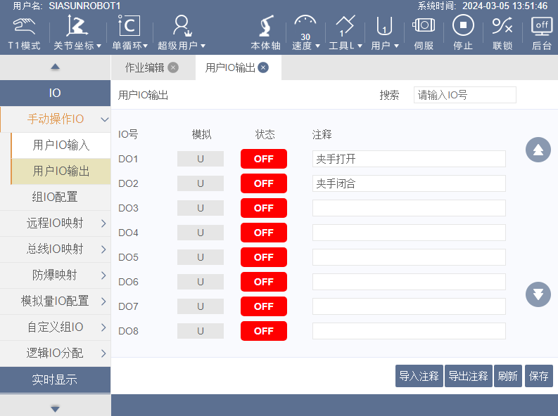

图 5‑25用户输出界面

1. 点击ON/OFF开关，改变I\\O状态。

| **警告：****通过手动输出，信号会发送到所连接的外部设备。在变更信号状态时，应确定信号连接到什么设备上，会引起外围设备的怎样变化。否则，会导致人员伤亡或设备损伤。** |
| --- |

## 路径恢复

原始路径恢复功能,是在程序动作的暂停中机器人移动的情况下,为在重新开始时首先恢复到暂停时位置的一种功能。

譬如,在暂停后通过点动等方式使得机器人移动的情况下,由于在程序再继续运行时首先使其返回通过点动移动前的位置,继续进行之后的动作,所以可以使其以与原先的轨迹相同的方式进行后续的动作。

### 路径恢复的条件

当前有暂停作业，暂停处可以是示教模式正向运动时的暂停，也可以是执行或远程模式下执行作业后的暂停。暂停后移动机器人与暂停点直线距离超出用户设定距离后支持路径恢复。设定界面如下。

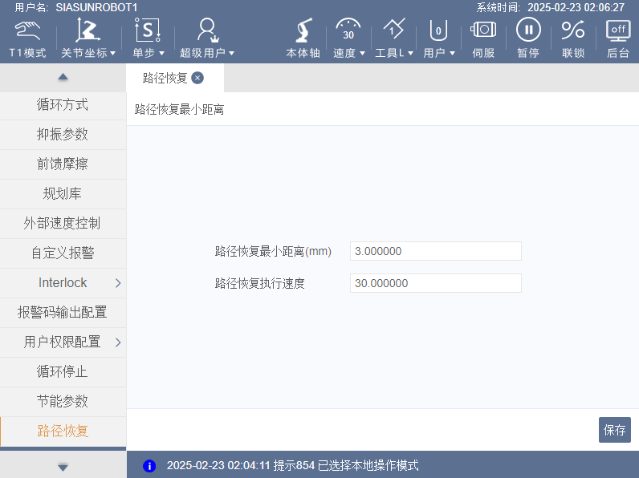

图 5‑26路径恢复设置界面

**路径恢复最小距离：**机器人实际位置与暂停处位置小于这个距离（TCP距离）时，机器人会直接从当前位置启动，不回到暂停处在继续运行。单位mm。

**路径恢复执行速度：**机器人执行路径恢复时的直线速度。单位mm/s

路径恢复支持断电恢复功能。断电恢复开关为使能时，重启机器人不会清除断点位置，才支持启动前的路径恢复。

用户在暂停后如果对任意作业进行了编辑操作，此时不再支持路径恢复。

### 路径恢复类别

停止后,手动移动机器人/正向运动关闭连锁/反向运动，再启动/连锁打开正向运动

图 5‑27示教器上提示信息

**选择直接启动：**机器人会直接运行。

**选择暂停处启动：**机器人会以直线运动方式先运动到程序的停止位置，在向下运行。

**取消：**取消本次操作。

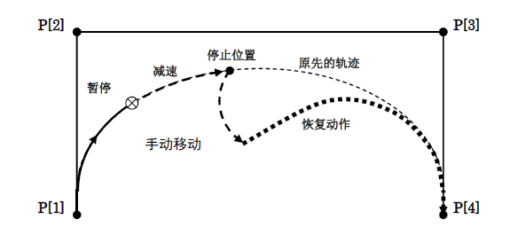

图 5‑28选择直接启动时轨迹

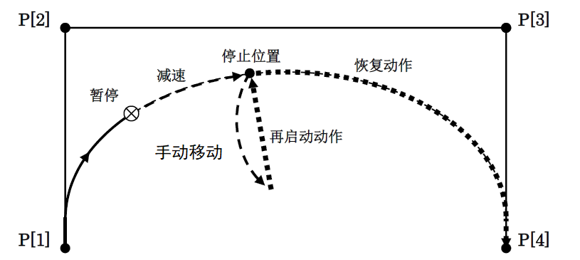

图 5‑29选择暂停处启动时轨迹

**停止后,移动程序中执行光标让光标位置发生变化后，再启动/连锁打开正向运动。**

**选择直接启动：**会从光标位置开始运行。

**选择暂停处启动：**光标会回到停止时的位置，继续执行。

**停止后,移动程序中执行光标位置在移回原位置，再启动。无弹窗可以直接运行。**

**多次暂停再启动**

路径恢复启动时，动作中暂停后移动机器人时,选择路径恢复，没有回到暂停处时，再暂停，在移动机器人，再路径恢复，机器人还是会运动到最初的暂停位置上。

**停止后,打开其它作业，移动机器人/不移动机器人，再启动/连锁打开正向运动。**

**选择暂停处启动：**会提示，若进行断点恢复请移至暂停作业。选择暂停的作业后，可以进行路径恢复。

**选择直接启动：**机器人从当前作业开始执行。

**对作业进行编辑后，不支持路径恢复。**

**清空堆栈后，光标TP一致的前提下，机器人可以直接启动。**

**调用主作业默认情况堆栈，机器人可以直接启动。**

| **注意：断电恢复功能使能后，重启机器人也支持路径恢复功能，可以按以上逻辑执行。连锁打开正向运动更新暂停处位置，连锁关闭正向运动不更新暂停处位置，反向运动不更新暂停处位置。恢复到路径上后，在路径上的信号才会输出。** |
| --- |

## 自动运行

通过程序的自动运行，由本地的启动按钮或外部远程I/O控制自动启动程序，由此来实现生产线的自动。

| 完全闭合的安全围栏 |
| --- |

图 5‑30机器人系统的自动运行

**自动执行前注意事项：**

1. 1机器人各项设置完成。
2. 2机器人处于执行或远程模式下。
3. 3作业空间内没有人。没有其他物体。

**自动执行操作步骤：**

1. 通过钥匙选择模式，选择执行模式或者远程模式。
2. 在执行模式下按下开始按键。

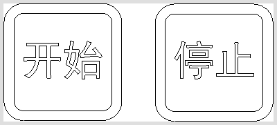

图 5‑31开始停止按钮和模式选择开关

1. 远程模式，根据远程I/O的配置，使用外部启动信号，启动机器人。
2. 在执行模式下，可以使用暂停按键停止机器人。
3. 在远程模式下，可以使用外部暂停停止机器人。

| **注意****在远程模式下，通过外部信号启动时，是需要一些前提条件的，这些前提条件需要考虑时序问题，目的是保证机器人启动后不会发生事故。** |
| --- |

**堆栈：**

堆栈中存放打开过的作业名、行号、光标、在路径上标志、补偿标志位、偏移、中断等程序信息。机器人正常启动前会判断机器人当前位置与程序中光标所在行的位置是否在同一个位置，如不在同一个位置则无法启动并会有相关提示信息。所以请谨慎使用清空堆栈功能。【清空堆栈】按钮在执行模式中，作业列表的右下角，如图5\-32所示。

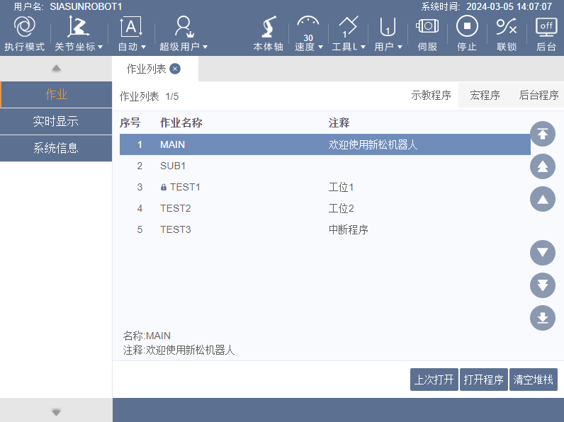

清空堆栈

图 5‑32清空堆栈按钮

| **注意：****堆栈中存放有作业名、行号、光标、在路径上标志、补偿标志位、偏移、中断等信息。清空后，与这些信息有关的限制或记录将被取消。请避免因为这些限制被取消后，造成的机器人不按预期移动造成的危险。以免发生人员伤害或设备损坏。** |
| --- |

# **状态显示**

机器人示教器可以对机器人本身的各种状态和数据进行显示。

## 示教器的LED

|  |
| --- |

图 6\-1示教器LED

表格 6\-1 LED状态

| LED颜色 | 说明 |
| --- | --- |
| 黄色 | 机器人处于暂停状态。 |
| 绿色 | 机器人的程序处于运行状态。 |
| 红色 | 机器人处于报警状态。 |

## 作业界面

执行中的程序指令信息会显示在作业界面上。

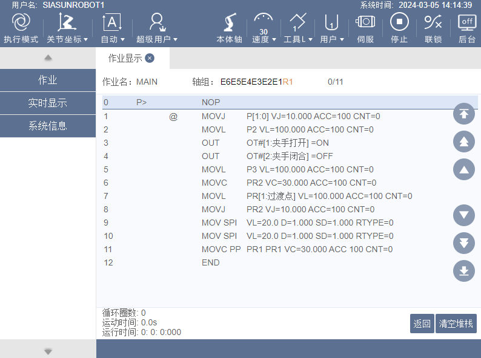

程序执行信息显示

作业内容

图 6\-2作业显示界面

## 变量

可以在示教器变量界面查看、写入需要的变量值。这些变量都是全局变量。

点击主菜单【变量】选择希望查看的变量值。

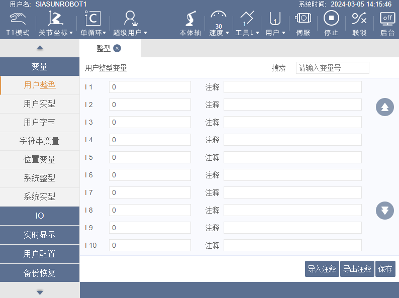

变量类型选择

可添加注释

查找变量的号

图 6\-3用户整形变量界面

用户整形变量共有520个，I1\-I520,存储值的范围是\-2147483648–2147483648。

| **注释：可以添加注释。****搜索：可以通过界面右上方的搜索变量号。****导入注释：机器人控制器需要插入u盘，且u盘中有对应的注释文本，点导入注释。****导出注释：机器人控制器需要插入u盘，点导出注释，导出的注释是文本格式，可以编辑。导出的注释文本名称为intVarComment.txt。** |
| --- |

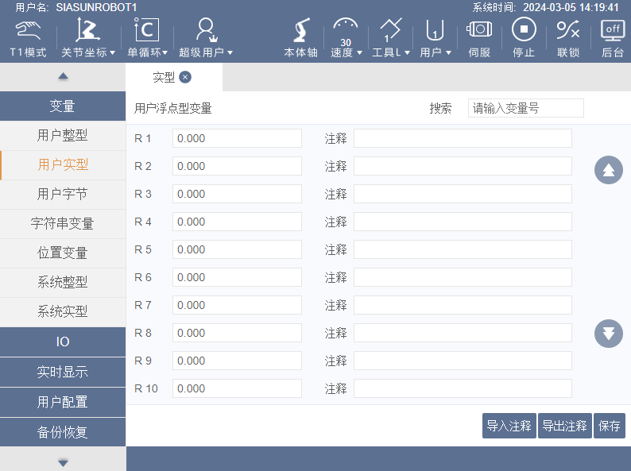

变量类型选择

可添加注释

查找变量的号

图 6‑4 用户实型变量界面

用户实型变量共有520个，R1\-R520，存储值的范围是\-9999\.999\-9999\.999，小数点后可以保存3位。

| **注释：可以添加注释。****搜索：可以通过界面右上方的搜索变量号。****导入注释：机器人控制器需要插入u盘，且u盘中有对应的注释文本，点导入注释。****导出注释：机器人控制器需要插入u盘，点导出注释，导出的注释是文本格式，可以编辑。导出的注释文本名称为floatVarComment.txt。** |
| --- |

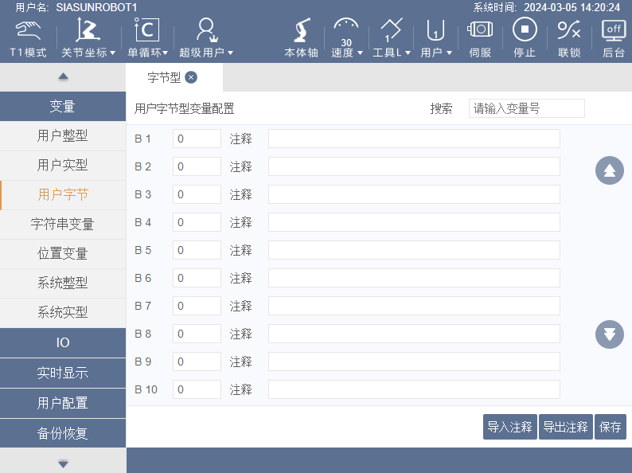

变量类型选择

可添加注释

查找变量的号

图 6‑5 用户字节型变量界面

用户字节型变量共有100个，B1\-B100，存储值的范围是0\-255。

| **注释：可以添加注释。****搜索：可以通过界面右上方的搜索变量号。****导入注释：机器人控制器需要插入u盘，且u盘中有对应的注释文本，点导入注释。****导出注释：机器人控制器需要插入u盘，点导出注释，导出的注释是文本格式，可以编辑。导出的注释文本名称为byteVarComment.txt。** |
| --- |

 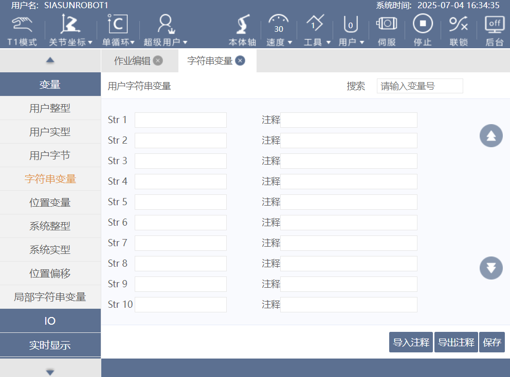

变量类型选择

可添加注释

查找变量的号

图 6‑6字符串变量界面

字符串变量共有256个，Str1\-Str256，输入长度的范围是0\-512个字符。

| **注释：可以添加注释。****搜索：可以通过界面右上方的搜索变量号。****导入注释：机器人控制器需要插入u盘，且u盘中有对应的注释文本，点导入注释。****导出注释：机器人控制器需要插入u盘，点导出注释，导出的注释是文本格式，可以编辑。导出的注释文本名称为stringVarComment.txt。** |
| --- |

## 位置变量的值

位置变量，是用来储存位置信息的变量。共有5630个位置变量。

位置变量界面，可以查看位置变量里面的值，可以把机器人当前位置存储到位置变量中。

在菜单中点击【变量】\-【位置变量】，打开位置变量界面。

图 6‑7位置变量界面（关节值）

**参数说明：**

1. PR：

对话框输入号码，查找位置变量号。

1. 注释：

可以对该变量进行备注，并能显示到作业使用的变量中。

1. 锁定：

来对该位置变量进行保护。

1. 当前位置：

可以通过获取，把机器人当前位置存储到该位置变量中。

1. 形式：

关节或正交，关节表示存储的值为关节值。正交表示存储的值为直角坐标值。

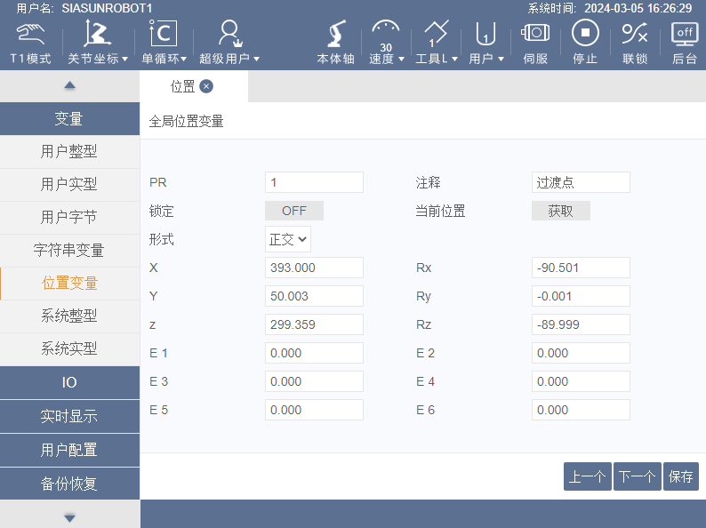

图 6‑8位置变量界面（坐标值）

### 位置变量显示形式

如果作业中记录该位置的指令为：

**MOVL PR/P3…**

那么，PR/P3的值就是直角坐标值，因为是使用直线运动指令记录的。

如果是使用运动指令为：

**MOVJ PR/P1…**

那么，PR/P1的值就是关节值。

### 位置变量获取

如果从位置变量界面直接在【当前位置】\-【获取】，这样位置变量所显示的值为原始坐标系下的值。之前如果位置变量为空的，这样获取出的值为直角坐标系下的值。可以通过形式进行关节与正交进行存储形式转换。

### 位置变量的用途

位置变量可在程序中通过MOVJ PR、MOVL PR、 SHIFT ON PRn F\#N、TRANSON PRn F\#4等，具体指令用途可查看指令表。

带位置变量的运动指令，不受位置变量存储的形式所限制，均可执行。

如MOVJ PR/P1存储的位置，也可以使用MOVL PR/P1形式运动。

如MOVL PR/P2存储的位置，也可以使用MOVJ PR/P2形式运动。

## 实时显示

通过示教器上**【**数据**】**按键或者主菜单里进入实时显示界面，可以查看机器人当前位置值、IO状态等。可以同时显示4个参数，需要使用者根据自己想看的参数进行选择，选择完成后，关闭实时显示，下次打开后还会显示上次选择的界面。选择某个参数后可以切换，不可以关闭该选项。重启后需要重新选择。

点击主菜单【实时显示】\-【实时显示】或【数据】按键，即能打开实时显示界面。

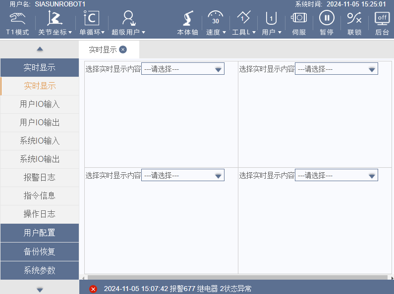

图 6‑9实时显示界面

**参数说明：**

1. **关节值：**

显示机器人当前各关节的角度值，单位是度。

1. **码盘输入值：**

码盘输入是从驱动器读上来的驱动器的实际码盘值。

1. **码盘输出值：**

码盘输出是指机器人下发给驱动器的码盘值。

1. **码盘跟踪差：**

显示机器人码盘输入值和输出值之间的差值。

1. **世界位置的T6阵 ：**

在世界坐标系下，机器人位置的T6阵，N、O、A为矩阵，P代表位置，单位是mm。

1. **用户Rpy：**

在用户坐标系下，TCP点的位置和姿态值，位置单位为mm，姿态单位为度。

1. **当前位置T6阵：**

机器人的当前位置在直角坐标系下的T6阵。

1. **当前位置的Rpy：**

机器人当前位置的TCP点在直角坐标系下的位置与姿态值。

1. **速度值：**

显示机器人运动时每个轴的实时速度。

1. **转矩值：**

显示机器人运动时每个轴的转矩值。

1. **输入电压：**

用来检查电机外部输入电压。（根据特殊项目制定，想要使用这项功能需要提前质询。）

1. **输出电压：**

用来检查电机输出电压。（根据特殊项目制定，想要使用这项功能需要提前质询。）

1. **伺服温度：**

500kg型号有效，其它型号无效。

1. **外部轴码盘真实值：**

显示外部轴的编码器值。（配置外部轴后有效）

1. **工具角度：**

显示TCP点在直角坐标系的位置和当前工具坐标系Z方向的夹角，角度1：工具在O\-YZ面投影与Y轴夹角；角度2：工具在O\-XZ面投影与X轴夹角；角度3：工具在O\-XY面投影与X轴夹角；角度4：工具与O\-XY面夹角；

1. **理论转矩值：**

机器人出厂前测试时使用，转矩的规划值。

## 系统IO

系统IO分为输入与输出，主要是可通过界面查看到IO状态。

点击主菜单【实时显示】\-【系统IO输入/输出】即能打开界面。

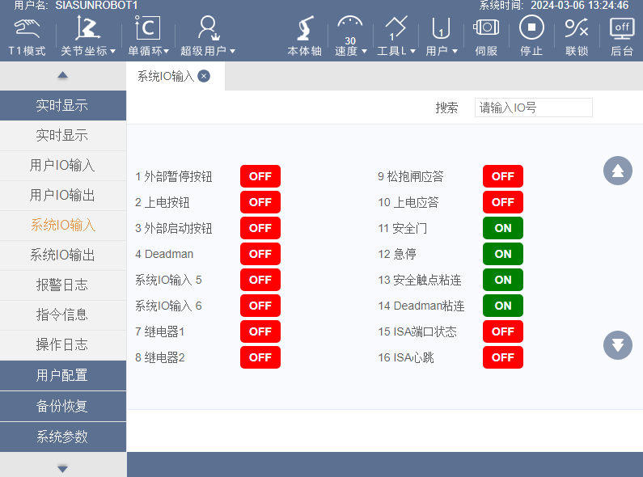

图 6‑10系统IO输入界面

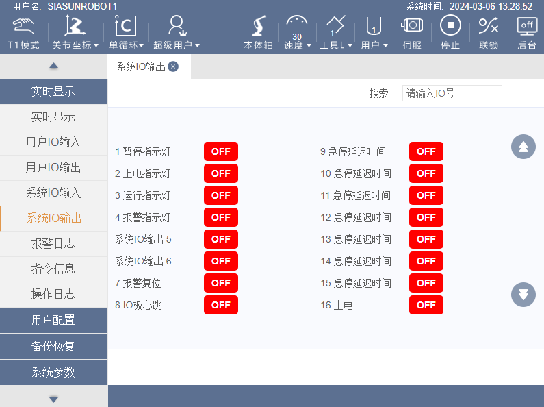

图 6‑11系统IO输出界面

可以通过这个界面查看系统IO状态，存在含义的系统IO会显示代表的含义。

## 报警日志

点击屏幕下方的报警提示栏，或在主菜单中依次点击【实时显示】\-【报警日志】可以打开报警日志。报警日志（报警、警告、提示）统一由底部报警信息栏显示。

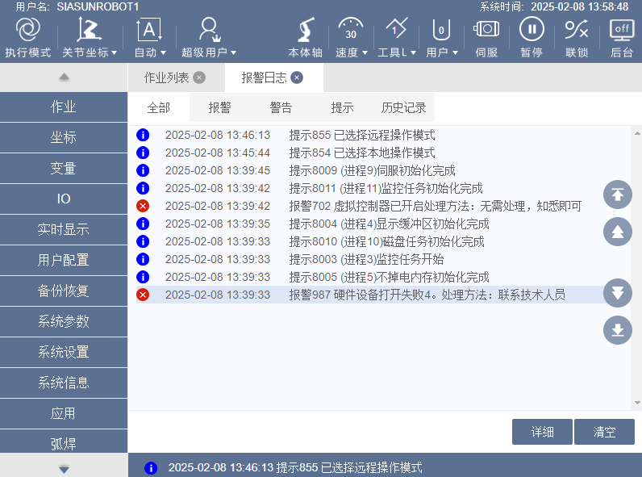

图 6‑12报警日志

报警类型以标签显示型式，包含：

1. 全部：全部信息（报警、警告、提示）按照时间由新到旧显示；
2. 报警、警告、提示：各分类信息按照时间由新到旧显示；
3. 历史记录：全部信息（报警、警告、提示）按照时间由新到旧显示；

点击【详细】按钮，会弹出所选报警的详细内容对话框；

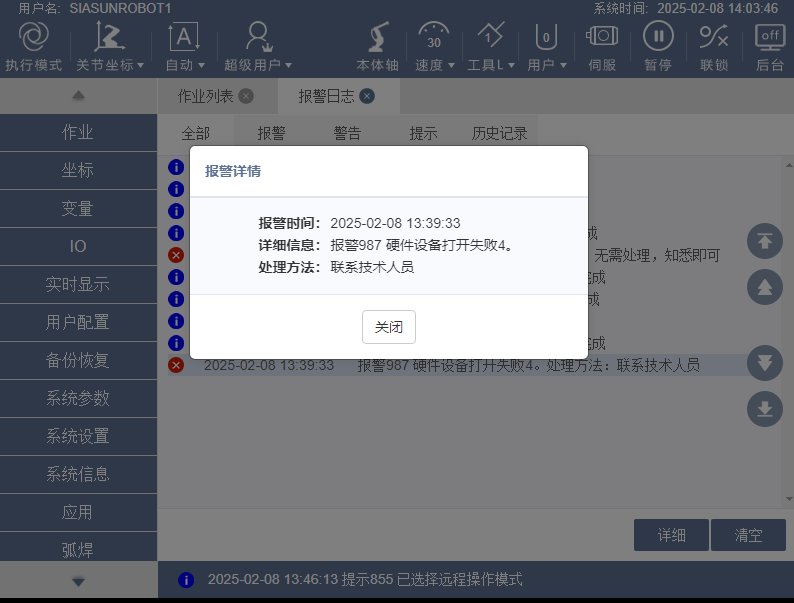

图 6‑13报警日志\-详细弹窗

点击【清空】按钮，清除底部报警栏中的信息，清除打开的报警页面中的全部、报警、警告、信息中的信息，历史记录不清空；且该按钮操作同时会触发RESET，如果有新的报警信息会报出。

| **注意：****清空按钮点击后，会使报警复位，同时报警只记录在历史记录中。** |
| --- |

## 指令信息

点击主菜单【实时显示】\-【指令信息】即能打开实时显示指令界面。

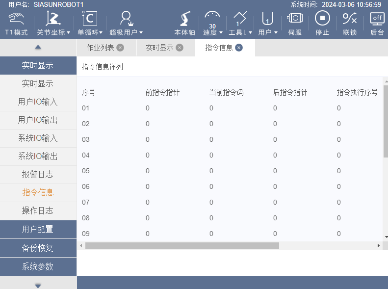

图 6‑14实时显示指令信息界面1

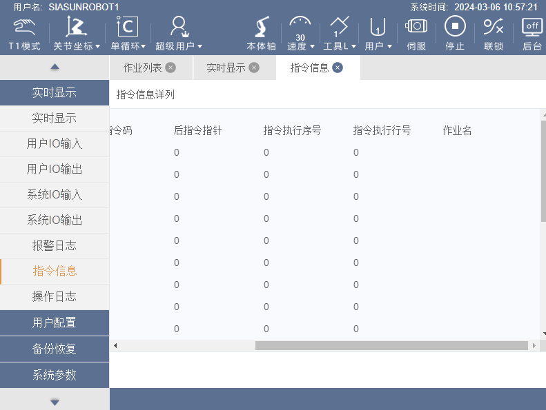

图 6‑15实时显示指令信息界面2

通过指令信息界面，可以查看到当前执行的作业情况。

## 操作日志

可以查看历史的操作记录。最多可存储500条记录，采用循环保存方式，保存最新的500条记录。

操作记录包含以下内容：作业编辑、伺服上电、启动、暂停、急停、坐标系切换、手动操作、模式切换、零位、参数编辑、备份恢复、内存清除等；

可以通过U盘对操作记录进行备份（详见7\.备份、恢复资料介绍）。

点击主菜单【实时显示】\-【操作日志】即能打开操作日志界面。

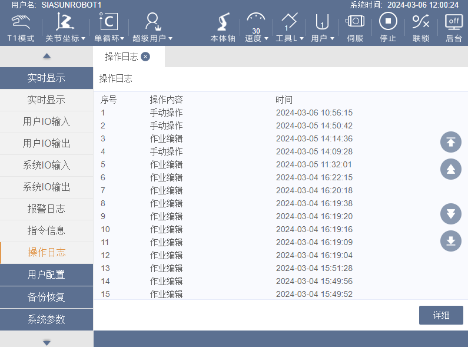

图 6‑16操作日志界面

通过操作日志界面，可以查看到历史都进行了哪些操作。

# **备份、恢复资料**

可以将机器人控制系统中存储的系统参数、用户参数、动态参数（外部轴参数）、操作日志、报警日志、位置变量、作业，通过控制器上的USB口存储到U盘中保存与查看。

## 参数备份恢复

参数中对系统参数、用户参数、动态参数、操作日志、报警日志进行备份和恢复。

**参数备份恢复步骤：**

1. 插好U盘。

| **注意：****请使用新松公司出厂提供的U盘，以免存储过程中发生数据丢失，同时避免对板卡的伤害。U盘必须为FAT32格式。在备份和恢复时会提示备份是否成功，如没插U盘或搜索到U盘，会提示系统处于卸载状态。** |
| --- |

1. 点击主菜单【备份恢复】\-【参数】，进入参数恢复界面。
2. 对参数进行备份和恢复。

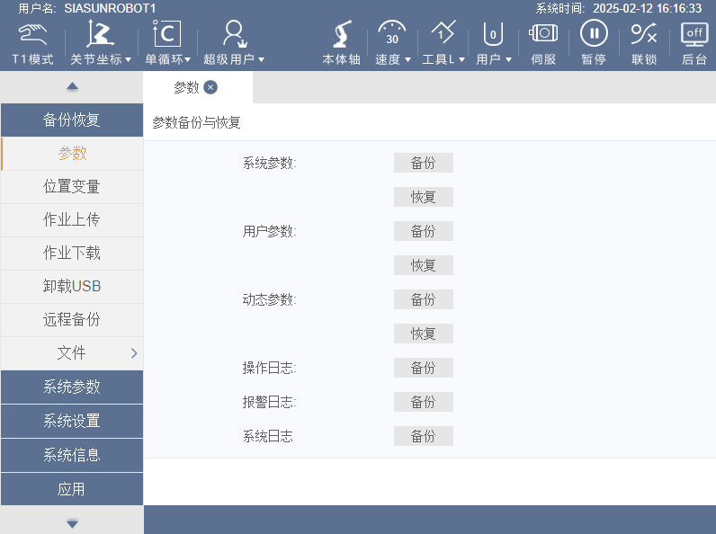

图 7\-1参数备份恢复界面

| **注意：****系统参数备份到U盘中，在pc上显示的文件名为SysSram.bak；****用户参数备份到U盘中，在pc上显示的文件名为UserSram.bak；****动态参数备份到U盘中，在pc上显示的文件名为DynamicSram.bak；****操作日志备份到U盘中，在pc上显示的文件名为op.txt；****报警日志备份到U盘中，在pc上显示的文件名为alarm.txt；****系统日志备份到U盘中，使用该功能需要打开调试使能，在pc上显示的文件夹名称为系统时间，文件夹内是一些txt文件,内容为机器人的运行参数；** **机器人参数备份后请确认一下U盘中是否存在这些文件，文件大小不能为0，查看所备份的这些文件是否成功！****恢复参数需要满足以下条件，应用、型号、轴数相同才能恢复。** |
| --- |

## 位置变量备份/恢复

**位置变量参数备份恢复步骤：**

1. 插好U盘。
2. 点击主菜单【备份恢复】\-【位置变量】，进入位置变量界面。
3. 对位置变量进行备份和恢复。

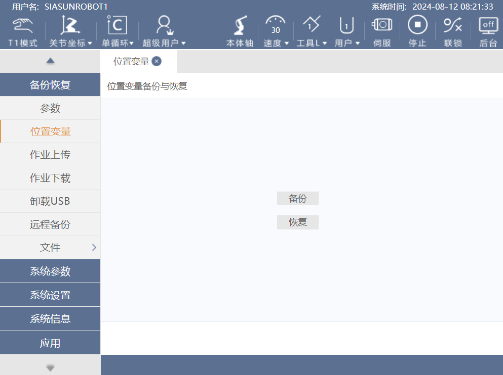

图 7‑2位置变量备份恢复界面

| **注意：****位置变量备份到U盘中，在pc上显示的文件名为Position.bak。****机器人参数备份后请确认一下U盘中是否存在这个文件，文件大小不能为0，查看所备份的这些文件是否成功！** |
| --- |

## 作业上传/下载

**作业上传步骤：**

1. 插好U盘
2. 点击主菜单【备份恢复】\-【作业上传】，进入作业备份界面，会显示机器人所有作业，包含示教程序、宏程序、后台程序。
3. 选择作业名，点击【上传】对单个作业进行备份。（点击上传后会有提示，是否上传该作业，点击确认，会提示文件上传成功。如U盘中已有该文件，会提示是否覆盖，点击确认后会提示成功覆盖上传。）
4. 整体上传是将机器人作业整体打包备份。备份作业需选择【整体上传】按钮。（点击上传后会有提示，是否上传全部作业，点击确认后，提示作业已备份重复备份，点击确认，提示作业文件备份完成。如这个U盘已经整体上传过，提示U盘已存作业文件，是否覆盖，点击确认，就会把以前的都覆盖掉，确认后操作。）

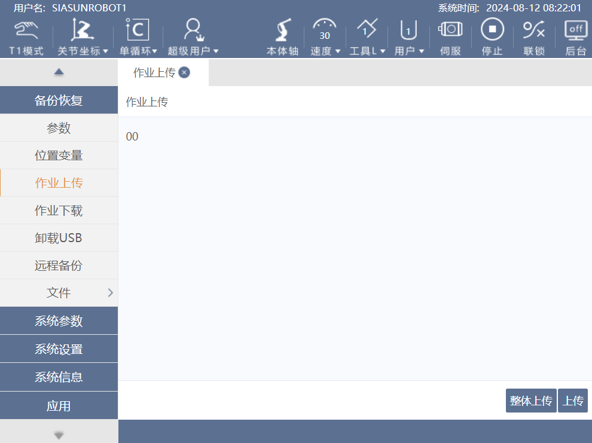

图 7‑3作业备份界面

| **注意：****作业上传，示教程序在pc上显示的文件名为作业名.JOB，宏程序显示.mac，后台程序显示.sp。****作业整体上传，在pc上显示的文件名为jobSave.bak；****机器人参数备份后请确认一下U盘中是否存在这些文件，文件大小不能为0，查看所备份的这些文件是否成功！** |
| --- |

**作业下载步骤：**

1. 插好U盘
2. 点击主菜单【备份恢复】\-【作业下载】，进入作业恢复界面。
3. 选择作业名，点击【下载】对单个作业进行恢复。（点击下载，提示是否下载该作业，点击确认，提示下载完成。如机器人里有这个作业名，提示下载作业已存在，是否覆盖，确认后提示已成功覆盖。）
4. 整体下载是将U盘中通过机器人整体上传的作业整体下载到机器人中。恢复作业需选择【整体下载】按钮。（点击整体下载，提示是否全部覆盖机器人作业，点击确认，提示作业文件恢复完成，请卸载后重启。）
5. 下载后机器人原有程序都将被U盘中的程序覆盖，机器人以前有的所有程序都将丢失，请确认后使用。

| **注意：****作业下载需要满足以下条件，应用、型号、轴数相同才能下载成功。** |
| --- |

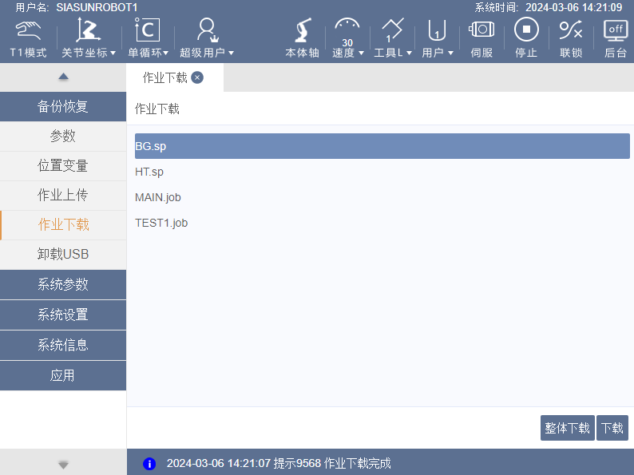

图 7‑4作业恢复界面

## 远程备份

PLC触发一键备份输入IO时，RC把参数和作业直接通过FTP协议传输给上位机服务器，并置位备份中输出IO，备份结束后，根据备份成功或失败置位对应输出IO。备份文件以机器人名\+时间组成。

**远程备份功能设置项目：**

1. 远程备份功能需要将网线插到LAN1口；
2. 点击主菜单【用户配置】\-【设置IP】**，**进入配置界面，设置远程备份IP地址与子网掩码。

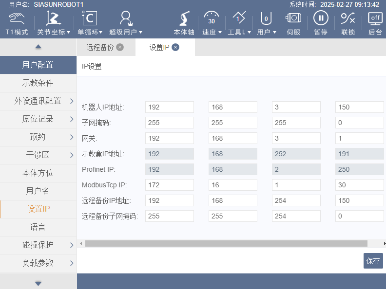

图 7‑5远程备份设置IP界面

点击主菜单【备份恢复】\-【远程备份】，进入配置界面。

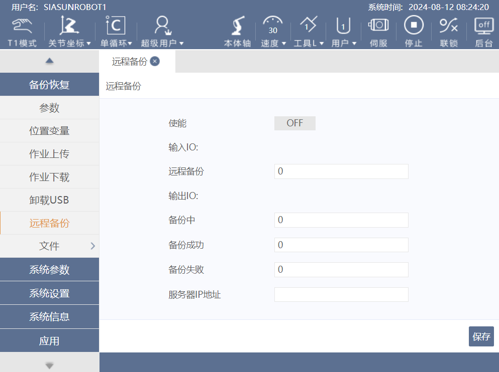

图 7\-6远程备份界面

**参数说明：**

1. **使能：**

是否开启远程备份功能。

1. **远程备份：**

输入IO号，PLC控制该输入IO的置位和复位。

1. **备份中：**

RC将参数和作业通过FTP协议传输给服务器，将该输出IO置1，在备份成功或者失败后，将该输出IO复位。

1. **备份成功：**

RC将参数和作业通过FTP协议传输给服务器后，如果备份成功，将该输出IO置位。

1. **备份失败**：

RC将参数和作业通过FTP协议传输给服务器后，如果备份失败，将该输出IO置位。

1. **IP地址：**

服务器IP地址，格式如“192\.168\.254\.100”

**服务器安装:**

除了设置IP地址界面以及远程备份界面，服务器端需要安装FileZilla\_Server软件，并更换安装目录下的FileZilla Server.xml文档，方便用户不用重新配置各个界面，需要根据现场配置相应的界面如下：

点击【编辑】\-【设置】\-【被动模式设置】，如图7\-7所示，其中使用下列IP为服务器端IP地址。

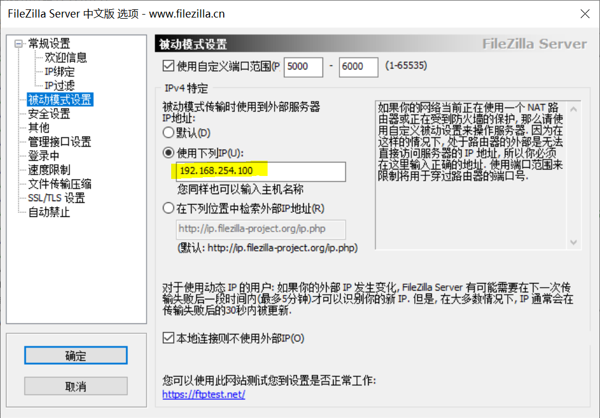

图 7‑7 服务器软件设置

点击【编辑】\-【设置】\-【管理接口设置】，如图7\-8所示，其中“允许连接到管理界面的IP”为机器人的IP地址，可以配置多个机器人IP地址，中间以空格分开。

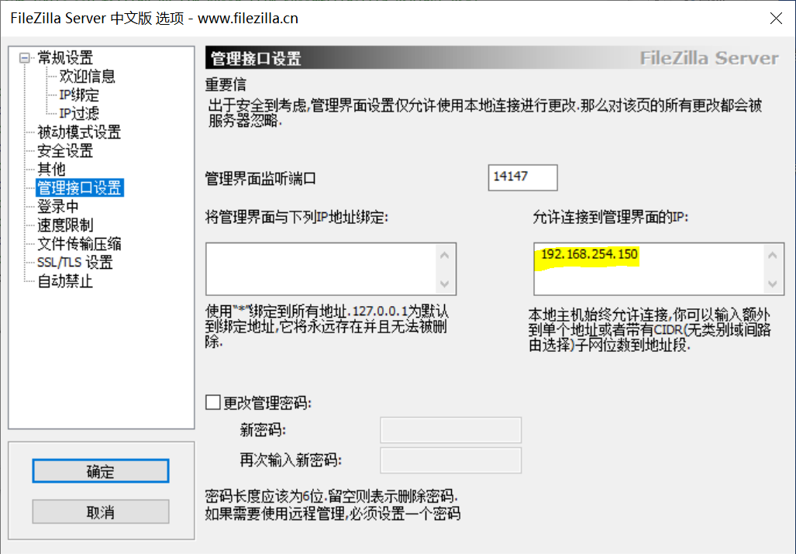

图 7\-8 管理接口设置界面

点击【编辑】\-【用户】\-【shared folders】，如图7\-9所示，其中共享文件夹里的路径为文件存储服务器的本地地址，该文件夹需要用户自己先在服务器上建立。

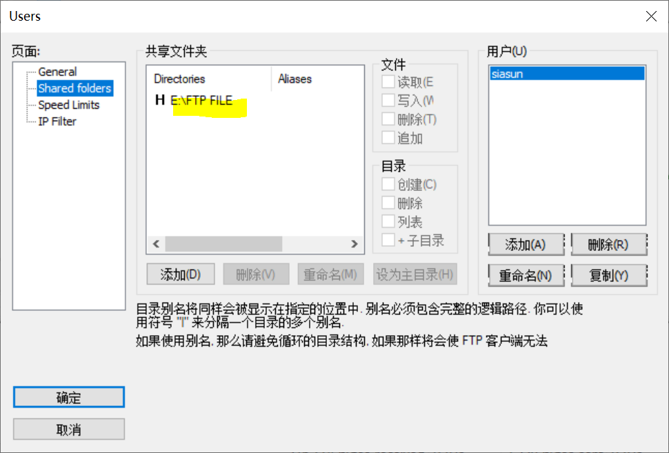

图 7\-9 Users设置界面

点击【编辑】\-【组】\-【shared folders】，如图7\-10所示，其中共享文件夹里的路径为文件存储服务器的本地地址，组与用户要设置相同的路径，该文件夹需要用户自己先在服务器上建立。

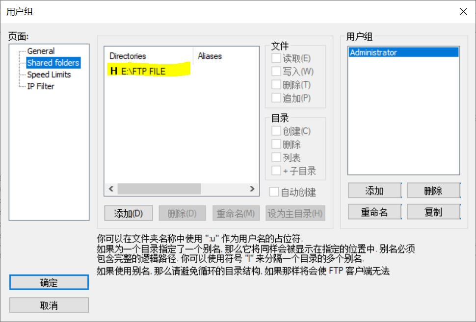

图 7\-10用户组设置界面

## 文件

PS文件，可以通过U盘来实现PS文件导入/导出功能。目前PS文件为Robot System File.txt。export.txt文件存储系统相关参数，包括世界坐标系参数、工具坐标系参数、外部具坐标系参数、外部轴配置参数、用户坐标系参数、转台配置参数、变位机配置参数、组IO配置参数、负载配置参数等。

点击主菜单【备份恢复】\-【文件】\-【PS文件】，进入PS文件导入/导出界面。

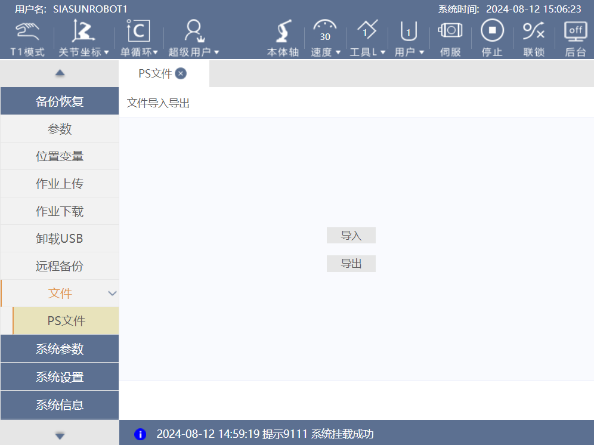

图 7\-11 PS文件导入/导出界面

导入：可以把export.txt文件导入到机器人系统中。

导出：可以把机器人内部参数存到U盘中，生成export.txt文件。

# **应用与操作**

## 通讯设备的设置

机器人的通讯配置方式及接口有以下几种:

1. Devicenet；
2. Profinet；
3. Ethernet/IP；
4. Modbus TCP；
5. 离线编程；
6. 视觉通讯；

### Devicenet

**开关配置步骤：**

【用户配置】\-【外设通讯配置】\-【开关配置】进入到开关配置界面中；

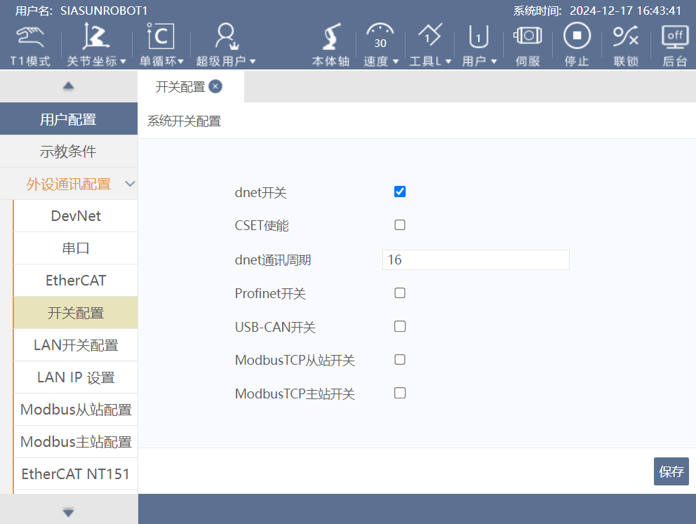

图 8\-1开关配置界面

dnet开关勾选，保存即完成开关配置，Dnet通讯周期单位为ms，需设置为16的倍数，为通讯间隔时间，随从站数量增加而增加。

**DeviceNet配置步骤：**

【用户配置】\-【外设通讯配置】\-【DevNet】进入到DeviceNet开关配置界面中；

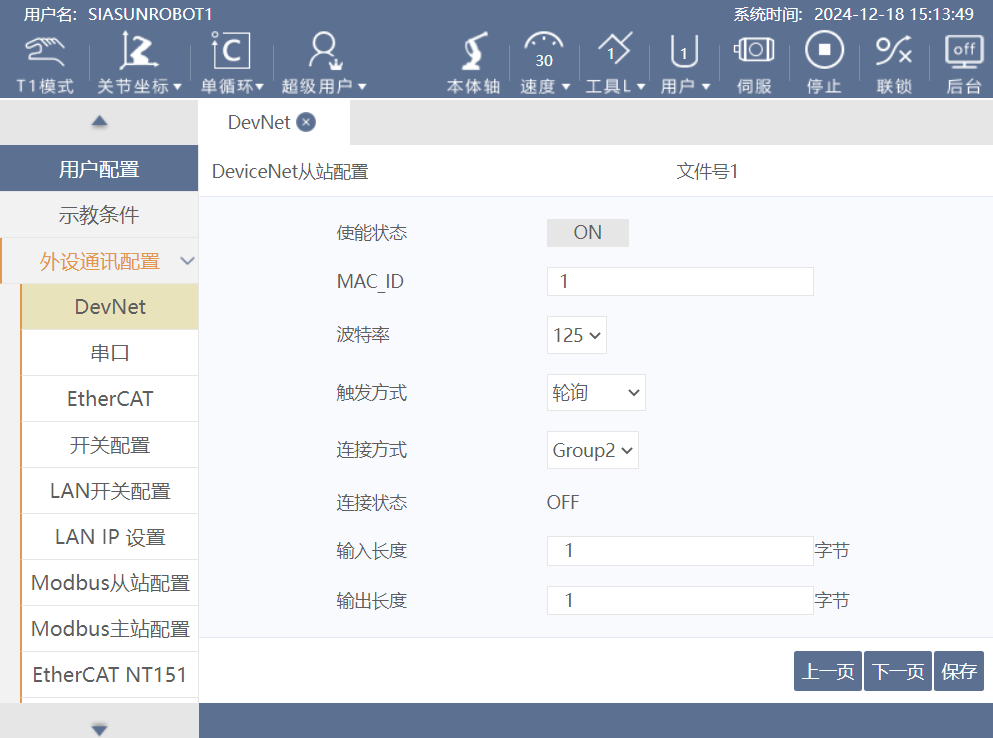

图 8\-2开关配置界面

**参数说明：**

1. 使能状态：

使能为ON： 与配置的从站进行连接，通讯执行。

使能为OFF：配置的从站不进行连接。

1. MAC\_ID:DeviceNet从站的ID，支持1\~64。
2. 波特率：与从站的通讯速率，支持125、250、500；
3. 触发方式：支持位选通、轮询、多点轮询；推荐配置为轮询。
4. 连接方式：UCMM、Group2、Group3；根据所用网关模块进行选择，anybus网关选择UCMM方式，赫优讯网关选择Group2方式。
5. 连接状态：查看连接状态，无法设置。ON为DeviceNet建立通讯连接，OFF为DeviceNet通讯连接断开。
6. 输入长度： DeviceNet从站\-\>机器人控制器的数据长度，单位为字节。
7. 输出长度：机器人控制器\-\>DeviceNet从站的数据长度，单位为字节。

用户可根据项目通讯需要，在网关模块DeviceNetSlave侧或DeviceNet从站设备侧进行相应修改。

需要配置多个DeviceNet从站时，可按下一页进行从站配置切换，最多支持8个DeviceNet从站。

**总线IO映射配置步骤：**

【IO】\-【总线IO映射】\-【输入/输出IO映射】进入到IO映射界面配置中；

图 8\-2开关配置界面

**参数说明：**

1. 通信类型：选择DEVICENET;
2. 总线ID：机器人DeviceNet主站带多个从站时，总线ID用于区分这些从站。设置值必须与从站配置中的MAC\_ID相同。默认设置为0；
3. 总线起始：默认为1，不用修改；
4. IO起始字：配置用户IO起始的地址 (16位1个字),设置值范围:1\~256。如：输入3，表示机器人从33位IO开始通讯。

**说明：**

**每增加1即IO映射偏移会增加16位（一个“字”）。比如输入3时，数据偏移两组。所以，串口通讯数据的输入和输出从第三个16位第一个点开始，即串口通讯数据从OUT\\IN\=33开始 。若输入4时，串口通讯数据从OUT\\IN\=49开始，以此类推。**

**由于前两组 IO 地址一般留给用户 IO 模块，所以一般情况下从第三组开始，本地 IO 配置为 3。**

1. 长度：将用户IO映射到DeviceNet通讯上的数据长度，设置时与DeviceNet从站设置的输入输出长度一致，单位为“字”。例如DeviceNet从站设置的输入输出长度都为32个字节，此处设置为16个字。

| **注意:**所有设置项保存后，重启机器人控制柜后生效。 |
| --- |

### Profinet

在Profinet通讯中，新松机器人可以做主、从站，现有机器人系统支持的Profinet通信是通过Profinet开关控制的，其数据的传输通过IO映射方式实现，目前profinet通讯数据量最多支持512个字节。现支持Smart200、S7\-1200、S7\-1500系列西门子PLC，其他机型暂未验证。需要Profinet通讯时根据实际的通讯情况对机器人进行以下配置；

| **注意:**机器人控制器的不同LAN口网线，不能同时连接在同一台交换机上。 |
| --- |

**Profinet从站配置：**

1. 【用户配置】→【用户名】进入用户名配置界面（此用户名要与PLC端设置的Profinet设备名称一致，出厂机器人端默认设为SIASUN001）；

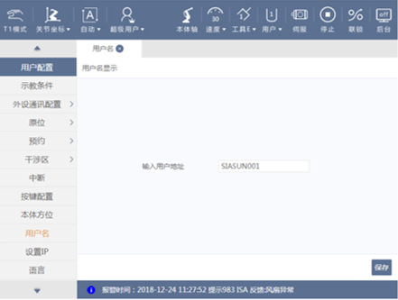

图8\-7 用户名配置界面

1. 登录超级用户，【用户配置】\-【外设通讯配置】\-【开关配置】进入系统开关配置界面，勾选Profinet从站开关并保存；

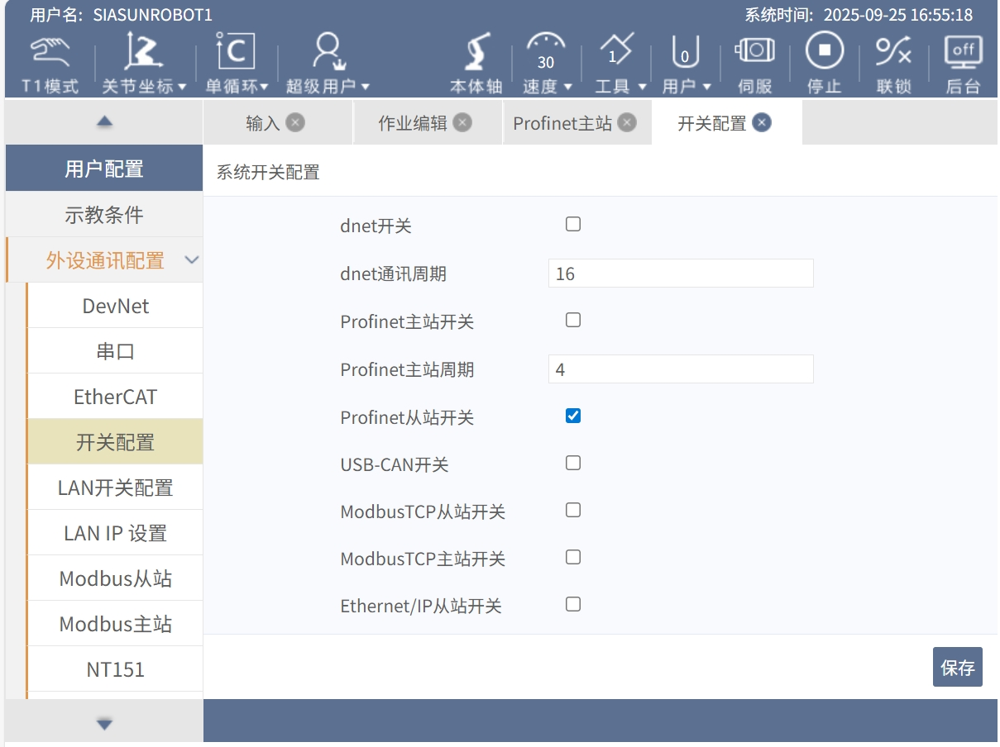

图8\-8 开关配置界面

1. 【用户配置】\-【外设通讯配置】\-【profinet从站配】进入profinet从站配置界面，配置参数并保存；

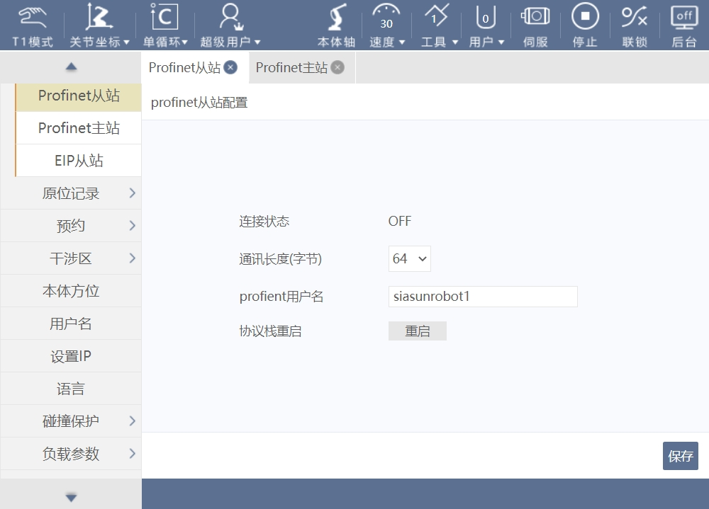

图8\-9 profinet从站配置界面

1. 连接状态：ON/OFF显示，显示当前连接状态；
2. 通讯长度：可选8\-512 默认64 单位byte，需要与主站中设置保持一致；
3. Profinet用户名：主站指定的从站用户名，需手动设置为主站配置的用户名（主站与从站的用户名需要相同）；
4. 协议栈重启：点击后，可手动执行协议栈反初始化。（重启profinet通讯协议）；
5. 【IO】\-【总线IO映射】\-【输入/输出IO映射】进入输入/输出IO映射界面，配置相关参数并保存；

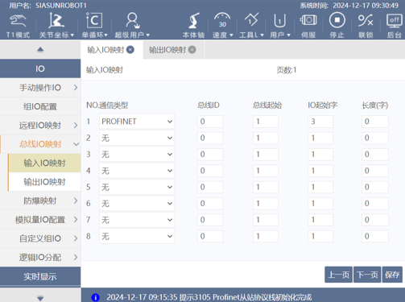

图8\-10 输入IO映射配置界面

1. 通信类型：选择PROFINET;
2. 总线ID：默认为0，不用修改；
3. 总线起始：默认为1，不用修改；
4. IO起始字：配置用户IO起始的地址 (16位1个字),设置值范围:1\-256。如：输入3，表示机器人从用户输入/输出33位开始通讯。
5. 长度：将用户IO映射到Profinet通讯上的数据长度，设置时与profinet从站配置页面的通讯长度一致，注意：总线IO映射页面长度单位为字，从站配置页面通讯长度单位为byte；

| **注意:**所有设置项重启机器人控制柜后生效。 |
| --- |

**Profinet主站配置：**

1. 登录超级用户，【用户配置】\-【外设通讯配置】\-【开关配置】进入系统开关配置界面，勾选Profinet主站开关并保存；

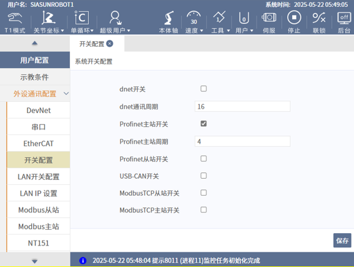

图8\-11 开关配置界面

1. 【用户配置】\-【外设通讯配置】\-【profinet主站配置】进入profinet主站配置界面，配置参数并保存；

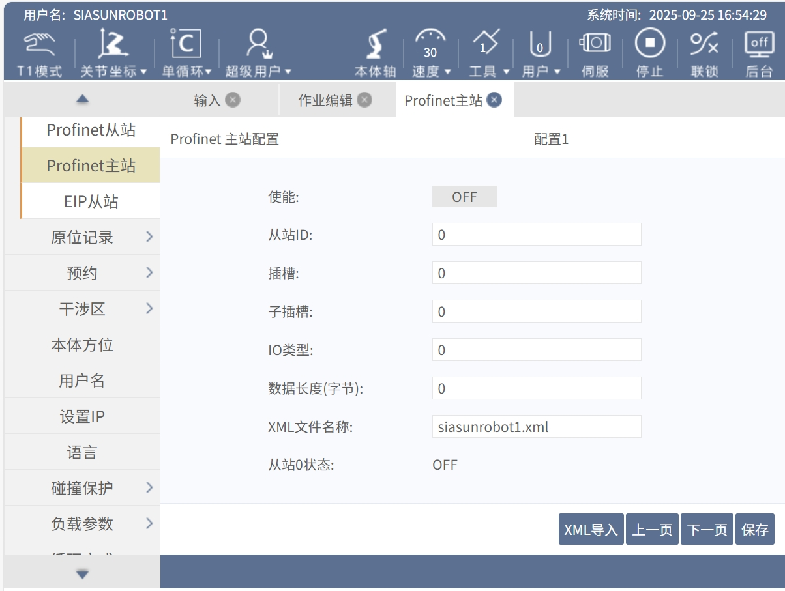

图8\-12 profinet主站配置界面

1. 使能：针对当前配置号的使能开关；
2. 从站ID：对应设备编号；
3. 插槽：对应博图组态侧插槽号；
4. 子插槽：对应博图组态侧插子槽号，若没有就填1（一般都是1）；
5. IO类型：0为输入，1为输出；
6. 数据长度的（字节）：填写单个插槽对应的数据长度；
7. XML文件名称：填写需要导入的xml文件名称；
8. 从站状态：显示当前从站ID号对应的链接状态；

配置从站信息，并导入XML文件，XML文件通过U盘导入，按导入按钮时，会根据配置项里填写的XML文件名称去寻找U盘中的XML文件并将其导入；

1. 【IO】\-【总线IO映射】\-【输入/输出IO映射】进入输入/输出IO映射界面，配置相关参数并保存；

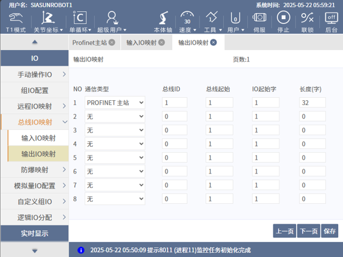

图8\-13 输入IO映射配置界面

配置总线输入输出IO映射，总线ID号要与pn配置号相同，配置完成后重启机器人，配置完毕，主站配置支持博图V19以上版本进行配置；

| **注意:**所有设置项重启机器人控制柜后生效。 |
| --- |

### ModbusTCP

在ModbusTCP通讯中，新松机器人可以做主、从站。现有机器人系统支持的ModbusTCP通信是通过ModbusTCP开关控制的，其数据的传输通过IO映射方式实现，目前ModbusTCP通讯数据量主站最多支持123字，从站最多支持512字节。需要ModbusTCP通讯时根据实际的通讯情况对机器人进行以下配置；

| **注意:**机器人控制器的不同LAN口网线，不能同时连接在同一台交换机上。 |
| --- |

**ModbusTCP从站配置：**

1. 登陆超级用户，【用户配置】\-【外设通讯配置】\-【开关配置】进入到开关配置界面中，需要ModbusTCP从站开关进行勾选。

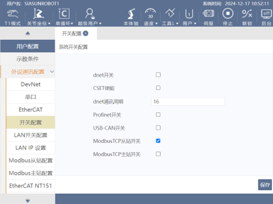

图8\-14 开关配置界面

1. 【用户配置】\-【外设通讯配置】\-【ModbusTCP从站配置】进入到ModbusTCP从站配置配置界面中；

**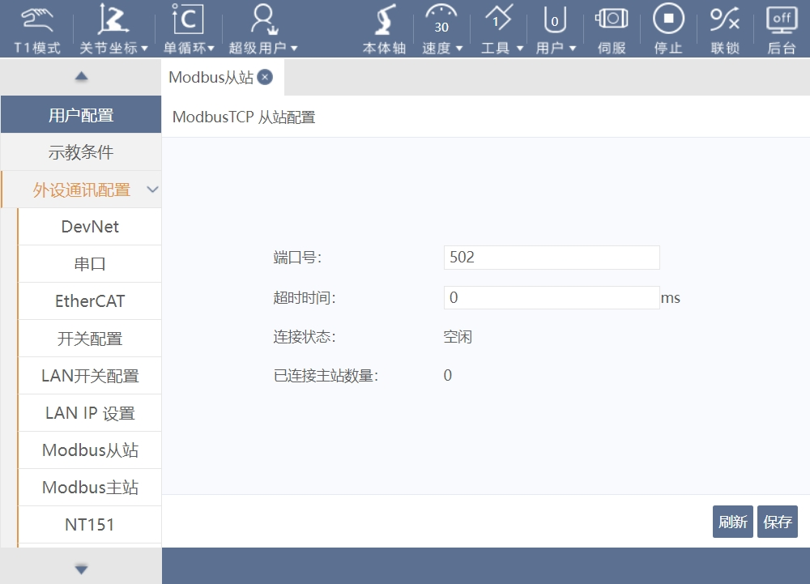**

图8\-15 ModbusTCP从站配置界面

1. 端口号：设置端口号，输入与主站一致的端口号，默认值502，建议使用默认值；
2. 超时时间：超时时间为0，不检测超时；超时时间不为0，若出现超时则断开所有连接。默认值为0，建议使用默认值；
3. 连接状态：查看连接状态；
4. 已连接主站数量：显示连接了几个主站，最多支持4个主站连接；
5. 【用户配置】\-【设置IP】进入IP配置界面，设置ModbusTCP IP的地址(机器人ModbusTCP从站使用的IP地址)；

注意：ModbusTCP的IP地址与其他IP不能使用同一个IP段。

图8\-16 IP配置界面

1. 【IO】\-【总线IO映射】\-【输入/输出IO映射】进入IO映射配置界面；

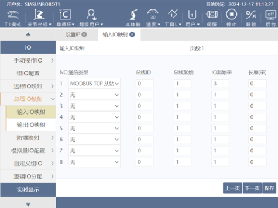

图8\-17 IO映射配置界面

1. 通信类型：选择ModbusTCP从站;
2. 总线ID：默认为0，不用修改；
3. 总线起始：默认为1，不建议修改，如果修改会导致Modbus地址变化；
4. IO起始字：配置用户IO起始的地址 (16位1个字),设置值范围:1\~256。如：输入3，表示机器人从用户输入/输出33位开始通讯。
5. 长度：将用户IO映射到modbusTcp从站上的数据长度，设置时与ModbusTCP主站设置的数据长度一致，单位为字；

**注：所有设置项重启机器人控制柜后生效；**

1. 新松机器人从站格式信息：
2. 新松E3845控制器使用LAN5(ModbusTCP)网口；
3. 新松arm控制器使用LAN网口；
4. 默认IP地址为：172\.16\.1\.30；
5. Modbus TCP通讯的port默认值：502；
6. 数据传输格式：32位浮点值遵从Big\-endian byte swap（Float BA DC）数据格式；
7. 新松机器人目前仅支持指令码如下：

| Decimal Code | Hexadecimal Code | Function |
| --- | --- | --- |
| 01 | 0x01 | Read Coils |
| 02 | 0x02 | Read Discrete Inputs |
| 03 | 0x03 | Read Holding Registers |
| 04 | 0x04 | Read Input Registers |
| 05 | 0x05 | Write Single Coil |
| 06 | 0x06 | Write Single Register |
| 16 | 0x10 | Write Multiple Registers |
| 23 | 0x17 | Read/Write Multiple Registers |

1. 支持下表功能码及地址关系使用方法(用户IO起始字1时)：

| 机器人用户I/O(布尔) | modbus功能码(DEC) | modbus总线地址 | modbus数据格式 |
| --- | --- | --- | --- |
| 用户输出1\-2000 | 02 | 0\-1999 | 布尔 |
| 用户输出1\-4096 | 04 | 0\-255 | 字 |
| 用户输出1\-4096 | 03 | 256\-511 | 字 |
| 用户输出1\-4096 | 23(只读) | 256\-511 | 字 |
| 用户输入1\-2000 | 01 | 0\-1999 | 布尔 |
| 用户输入1\-2000 | 05 | 0\-1999 | 布尔 |
| 用户输入1\-4096 | 03 | 0\-255 | 字 |
| 用户输入1\-4096 | 06 | 0\-255 | 字 |
| 用户输入1\-4096 | 16 | 0\-255 | 字 |
| 用户输入1\-4096 | 23 | 0\-255 | 字 |

异常报警：地址错误报警地址异常；功能码错误报警功能码异常；

1. 测试新松机器人从站通讯：

以下测试过程只针对模拟外部设备与新松机器人通过ModbusTCP通讯建立连接及数据间交互写数据是否成功（同理读数据通过更改配置即可），具体项目应用根据实际情况更改配置和编写相关作业。（客户可通过此过程验证机器人端功能是否可用）；

1. 安装ModbusPollSetup64Bit软件，打开如下图；

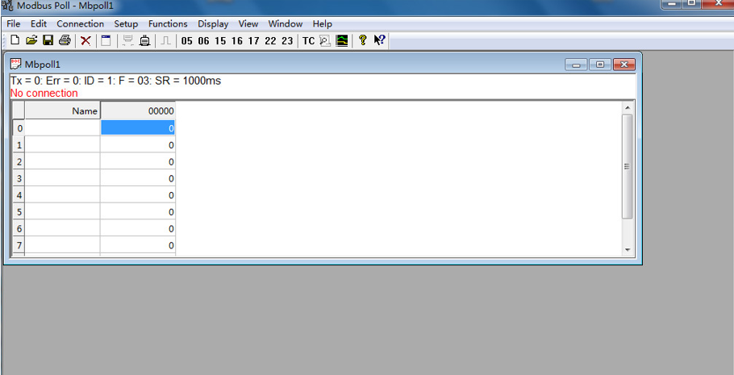

图8\-18 ModbusPollSetup64Bit软件界面

1. 按照新松机器人从站要求进行格式信息配置，进入Setup，配置如下图：

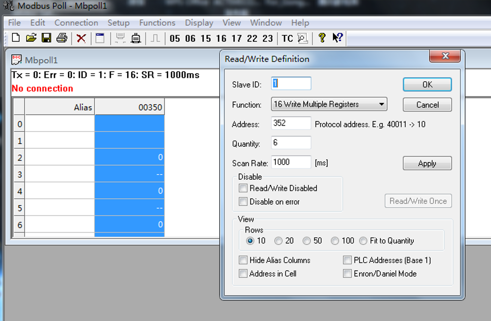

图8\-19 ModbusPollSetup64Bit软件SETUP界面

1. 按照新松机器人从站要求格式信息（5）配置，选中00350数据所在列，更改配置如下图:

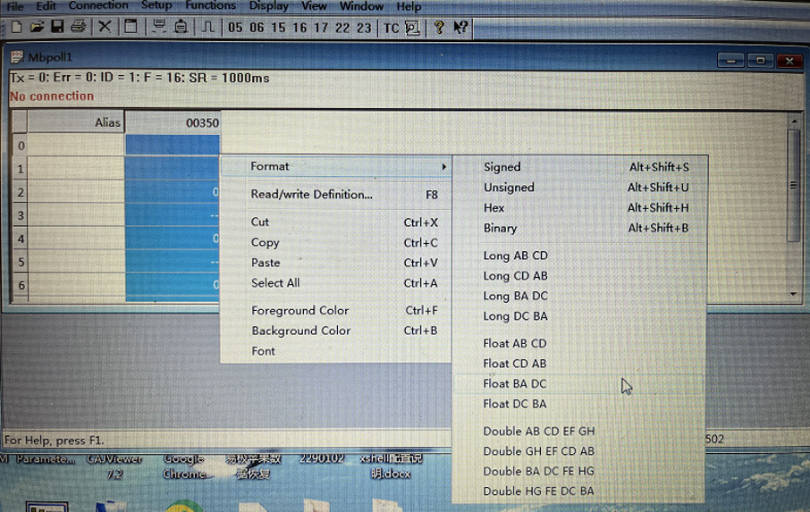

图8\-20 ModbusPollSetup64Bit软件更改格式界面

1. 以上配置完成后，进入Connection界面，配置连接界面信息，完成后，点击OK，即可建立连接成功，如下图：

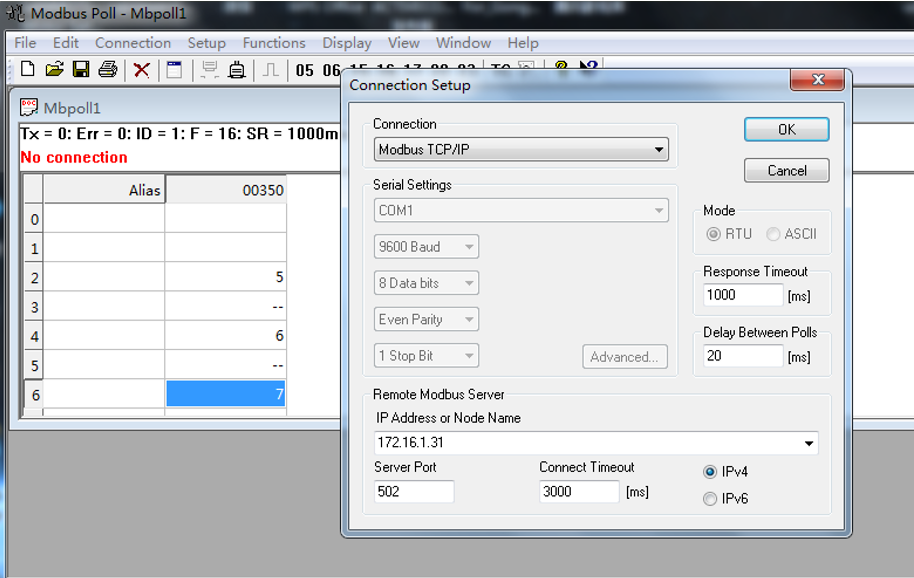

图8\-21 ModbusPollSetup64Bit软件建立连接设置界面

| **注意:**所有设置项重启机器人控制柜后生效。 |
| --- |

**ModbusTCP主站配置：**

1. 登录超级用户，【用户配置】\-【外设通讯配置】\-【开关配置】进入到开关配置界面中，需要ModbusTCP主站开关进行勾选。

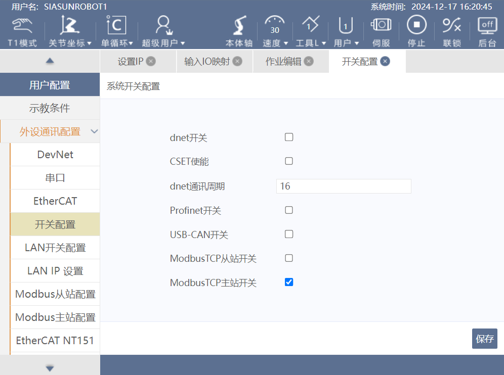

图8\-22 开关配置界面

1. 【用户配置】\-【外设通讯配置】\-【ModbusTCP主站】进入ModbusTCP主站配置界面进行配置。

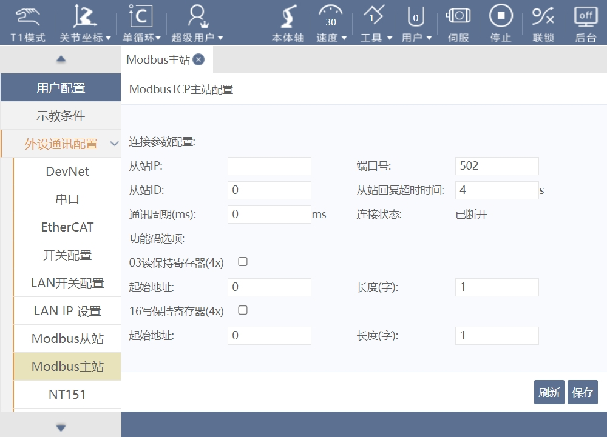

图8\-23 ModbusTCP主站配置界面

1. 从站IP地址：输入ModbusTCP从站IP地址
2. 端口号：输入与从站一致的端口号，主站与从站需要输入相同的端口号, Modbus默认端口号为502。
3. 从站ID：输入从站ID，从站没有ID可输入任意数。
4. 从站回复超时时间：主站发送请求，从站超过该设定时间未回复则认为连接超时。
5. 通讯周期间隔：每经过设定时间进行请求数据，每次请求数据进行一个或多个开启的功能码命令请求。
6. 连接状态：显示当前连接状态，点击下方刷新按钮进行状态刷新
7. 03读保持寄存器：进行0x03功能码请求使能，开启使能可循环发送03功能码请求命令，关闭则停止发送。
8. 16写保持寄存器：进行0x16功能码请求使能，开启使能可循环发送16功能码请求命令，关闭则停止发送。
9. 起始地址：对应功能码请求的起始地址。
10. 长度：对应功能码请求的数据长度。
11. 【IO】\-【总线IO映射】\-【输入/输出IO映射】进入IO映射配置界面；

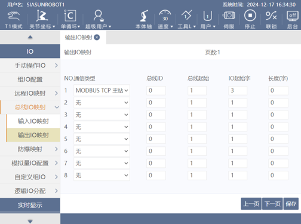

图8\-24 IO映射配置界面

1. 通信类型：选择ModbusTCP主站;
2. 总线ID：默认为0，不用修改；
3. 总线起始：默认为1，不用修改；
4. IO起始字：需要Modbus映射到用户IO的起始IO号；
5. 长度：需要映射的数据长度，以字为单位；

**注：所有设置项重启机器人控制柜后生效；若连接中断，恢复连接后可自动重连。连接前需检测IP地址与端口号是否有重复。**

### EtherNet/IP

在EtherNet/IP通讯中，新松机器人可以作从站。现有机器人系统支持的EtherNet/IP通信是通过EtherNet/IP开关控制的，其数据的传输通过IO映射方式实现，目前EtherNet/IP通讯数据量最多支持128个字节。需要EtherNet/IP通讯时根据实际的通讯情况对机器人进行以下配置；

| **注意:**机器人控制器的不同LAN口网线，不能同时连接在同一台交换机上。 |
| --- |

**EtherNet/IP从站配置：**

1. 登陆超级用户，【用户配置】\-【外设通讯配置】\-【开关配置】进入到开关配置界面中，需要EtherNet/IP从站开关进行勾选。

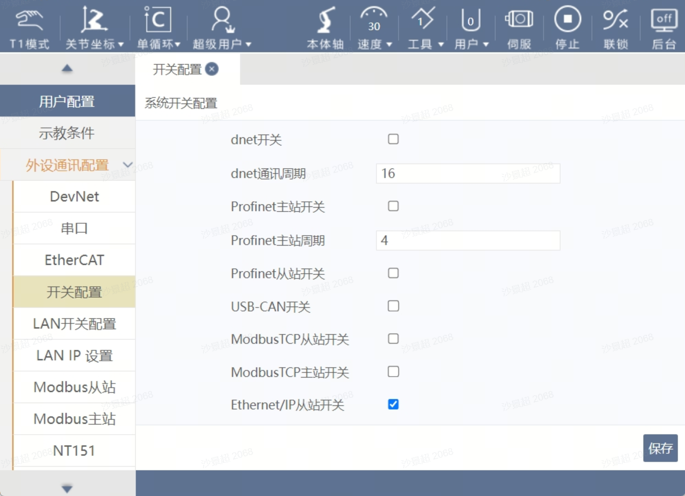

图8\-25 开关配置界面

1. 【用户配置】\-【外设通讯配置】\-【EIP从站】进入到EtherNet/IP从站配置界面中进行配置，配置字节长度1\-128；

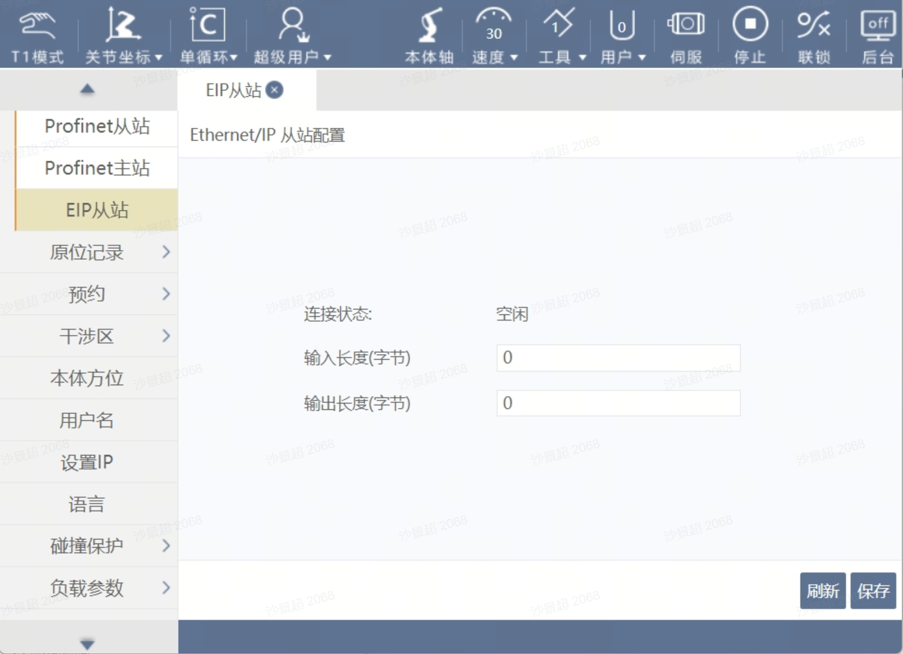

图8\-26 EtherNet/IP从站配置界面

1. 【IO】\-【总线IO映射】\-【输入/输出IO映射】进入IO映射配置界面；

图8\-27 IO映射配置界面

1. 【用户配置】\-【设置IP】进入IP配置界面，设置EtherNet/IP的地址(机器人EtherNet/IP从站使用的IP地址)；

注意：EtherNet/IP的IP地址与其他IP不能使用同一个IP段。

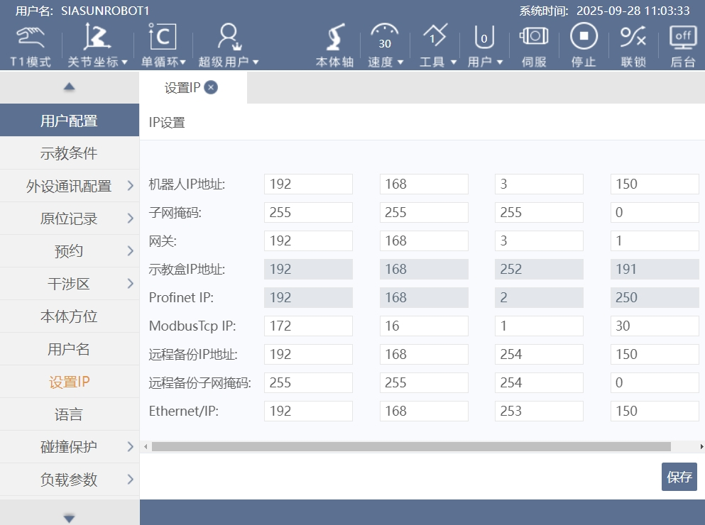

图8\-28 IP设置界面

1. 重启，从站配置完成
2. 配置主站，以汇川PLC为例，导入[eds](#_附件)文件

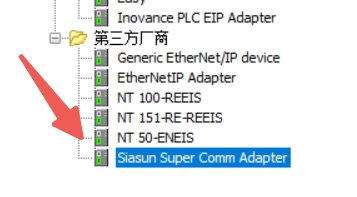

图8\-29 主站配置实际操作示意

| **注意:**所有设置项重启机器人控制柜后生效。 |
| --- |

### 离线编程接口

参考《新松机器人离线编程接口库使用手册》。

### 视觉通讯

连接LAN2，设置机器人IP，配置出视觉应用，配置视觉应用参数，根据不同的视觉品牌，查看不同的视觉相关指导文件，参考《新松机器人视觉应用使用手册》。

## 预约功能

使用预约功能，需要设计专用的控制台（多个）对应多个工位，每个控制台有启动按钮，每个按钮对应一个作业，机器人会以用户按下按钮的先后顺序，去启动对应按钮的机器人作业。

当一个机器人需要对应三个工位进行作业时：

在工位1的作业记录为JOB1；

在工位2的作业记录为JOB2；

在工位3的作业记录为JOB3；

当工位1工件准备完毕后，即可按下1工位的启动按钮，机器人执行JOB1。在执行JOB1的过程中，可以陆续准备工位2与工位3的工件，并按照顺序按下工位2和工位3的启动按钮。这时候工位1的作业依然在执行过程中，但会按照按启动按钮的顺序预约工位2，工位3的作业，并按这个顺序执行JOB2,JOB3。

**预约功能需要注意的事项与流程：**

1. 支持本地自动、远程模式。
2. 需要具备的前提条件为，预约作业开关需要打开，配置机器人原点位置。

**操作步骤与执行流程：**

需要机器人在原点位置（详见2\.4原点设置说明），机器人上电，在点击预约按钮机器人会进入对应的预约程序，对应的程序会运行一个循环，在机器人没有停止时，在次按其它预约按钮，对应的程序会被预约上，会按照预约的先后顺序执行。

执行当前预约程序时，在次按这个程序的预约，这样的预约不生效，可以预约其它程序，不能预约当前执行的程序。预约没有执行完的程序，暂停后也不能直接执行其它预约程序，必须把原有程序执行完，或把预约状态清除，机器人回原点位置，才能进行执行其它预约程序。

机器人执行预约程序中途停止时，不关闭这个预约程序（与模式切换无关），在次上电\-按预约，就可以从当前停止的位置继续运行。机器人执行预约程序中途停止时，关闭了这个预约程序，再上电按预约，机器人无法执行预约程序（提示：请手动切换回预约作业），我们需要手动打开之前的预约作业，如果没有在之间打开过其它程序，就可以从当前停止的位置继续运行。如果打开过其它程序，预约程序就需要从程序头执行。

该工位被预约后，没有执行前，再次按下该工位的预约按钮，该工位预约则被取消。

**预约功能开关：**

使用预约功能需要在执行开关界面开启使能。点击【系统设置】\-【执行开关】进入执行开关界面。

 

预约开关

图 8‑30执行开关界面

| **注意：**1. **当预约作业开关变成ON时，机器人预约功能有效，可以正常使用，作业开关为OFF时，机器人预约功能无效。** 2. **使用预约功能启动作业后，作业仅单循环执行一次既停止。** 3. **预约功能每个作业都需要从原点开始启动，所以使用预约功能时，需要设置原点位置，并使每个作业的开始与结束位置都停在原点位置上。** |
| --- |

**预约作业名与输入输出配置：**

在预约配置界面设置各个工位的作业名，及启动时的输入、输出信号，这样可以通过工位上的启动按钮启动作业。

点击【用户配置】\-【预约】\-【预约设置】，进入预约功能设置界面。

图 8‑31预约功能设置界面

可按照工位实际编号，输入作业名、启动作业的输入、输出信号、原位号。设置完成后，按【保存】按钮保存**。**

**原位：**填写范围0\-8，代表原位序号。

填写0，代表该程序预约，不判断机器人当前是否在原位。

填写1\-8，代表该程序预约，判断机器人当前位置是否为对应的原位位置，如果不在原位位置，不允许机器人启动。

| **注意：****当进行某预约作业的作业名、输入IO、输出IO、原位配置时，需要该行信息全部配置完整，否则该预约作业配置无效（重新打开页面可观察到参数恢复默认\*\*\*或0）。****0表示该预约作业执行前不进行原位比较。1\-8表示当前预约作业执行前应进行机器人当前位置与原位x(页面配置原位号)比较，若在原位范围内则允许该预约作业执行，否则不执行。** |
| --- |

清除预约设置可以清除掉设置的全部作业名，输入及输出。点击【用户配置】\-【预约】\-【预约设置】,预约设置后面的【全部清除】按钮，会出现弹框，确认后执行清除预约设置操作，取消后保持不变。

 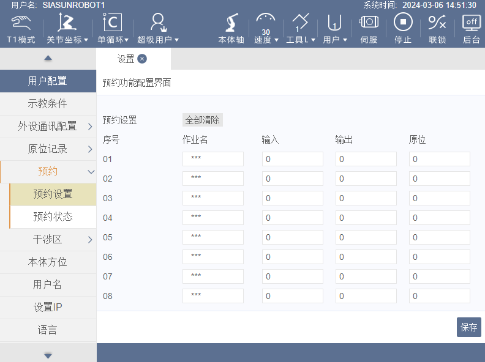

图 8\-32预约设置全部清除功能

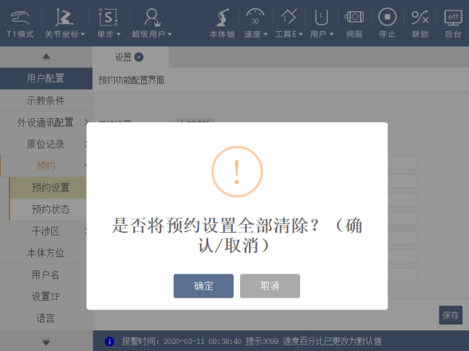

图 8‑33预约设置全部清除确认弹框

**预约功能的规程：**

1. 在执行中的作业，其对应工位的启动按钮需要常亮，作为提示。
2. 当机器人在执行作业的过程中，按下其他工位的启动按钮，那么其它工位的作业将被预约，进入等待运行的状态。
3. 预约作业的启动按钮会闪烁，作为提示。
4. 按下正在执行的作业，不会对该作业进行重复预约。
5. 在执行中停止机器人，需要按下暂停操作。

**作业预约状态：**

可以在预约状态界面，查看现阶段机器人预约的状态。点击【用户配置】\-【预约】\-【预约状态】，进入预约状态界面。如图8\-34所示。

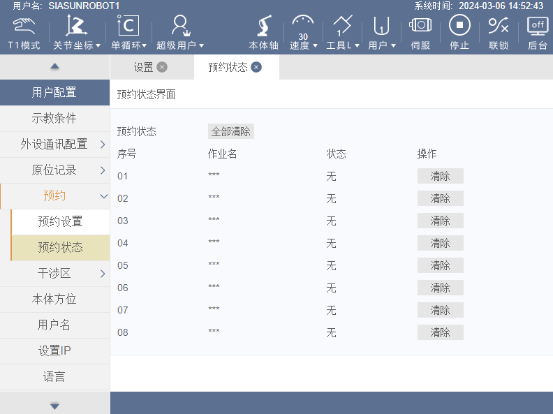

图 8‑34预约状态界面

用户可查看当前预约的作业名与状态。

**预约状态的清除：**

【清除】按钮，可以清除单个作业对应的预约状态。

【全部清除】按钮，可以全部清除已经按下预约启动按钮的作业状态。

图 8‑35预约状态清除功能

用户通过【全部清除】按键，会出现弹框，确认后执行清除已经按下预约启动按钮的作业状态操作，取消后保持不变。

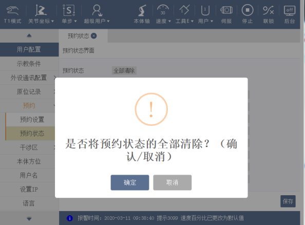

图 8‑36预约状态全部清除确认弹框

【清除】按钮，可以清除掉该序号行预约作业状态。

用户通过【清除】按键可以逐条清除该序号行预约状态，会出现弹框，确认后执行清除本条预约作业状态操作，取消后保持不变。

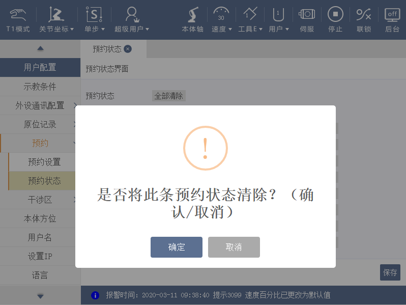

图 8\-37预约状态清除确认弹框

**预约功能中的暂停操作：**

当机器人被预约启动，程序在执行中，收到下列暂停信号，会暂停机器人动作。

**暂停的两种方式：**

1. 通过示教器上停止按键来暂停；
2. 远程I\\O外部暂停信号来暂停；

| **注意：****使用预约功能，请务必在控制台上，连接外部暂停功能，以保证在每个工位可以暂停机器人。** |
| --- |

恢复启动，需要当前无暂停信号，没有手动打开过其它程序，机器人在暂停的工位上，如机器人没在上电状态，需要给上电信号，按预约启动按钮，机器人就可以从暂停的位置启动作业。

## 外部轴配置

新松机器人控制软件最多支持6个外部轴系统，每个外部轴的使用，都是基于外部轴系统的。每个使用的外部轴系统最少由一个外部轴节点、最多3个外部轴节点组成，每个滑台外部轴系统只能包含一个外部轴节点，变位机外部轴系统可以包含1\-3个外部轴节点。

要使用外部轴，需要进行以下几项配置：

1. 系统轴数配置；
2. 总线设备通讯配置；
3. 轴配置；
4. 系统配置；

### 系统轴数配置

把需要添加的外部轴，配置到系统中。

**系统轴数配置步骤：**

1. 点击主菜单【系统设置】\-【系统轴数】进入系统轴数界面，在外部轴轴数位置填写增加的轴数。

| **注意：*** + - 1. **外部轴数不包含多驱配置中的从动电机数量，如现有工作站的配置为6轴本体机器人外加3台电机，对应的EtherCAT节点分别为7、8、9。其中EtherCAT 7和EtherCAT 8为同一外部轴方向多驱系统的主电机和从电机，EtherCAT 9为另外一个外部轴方向，此时外部轴轴数输入2。** 			2. **改变机器人系统轴数，会导致已经编好的程序被清除。因为系统轴数不一样，所以之前的程序无法使用，之前备份过的也无法恢复。所以要先把系统轴数配置完成后，在去做程序。** |
| --- |

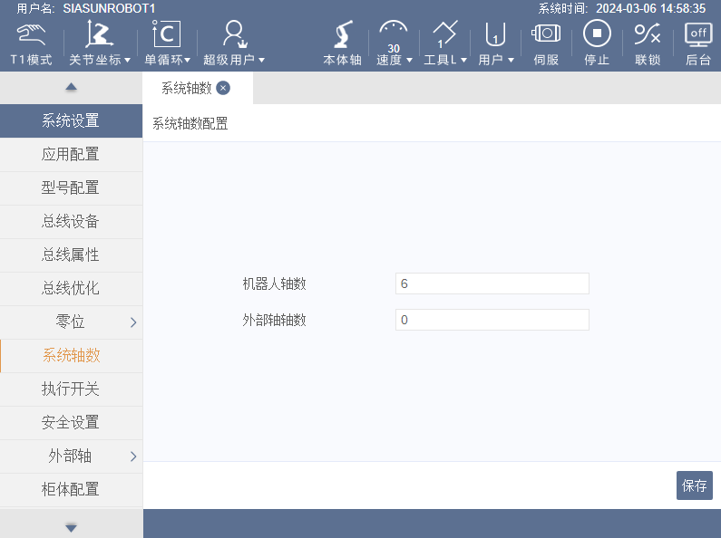

图 8\-38系统轴数配置界面

1. 改变外部轴轴数，点击保存，会提示系统轴数已变更，请重启。

### 总线设备配置

总线设备配置是机器人整体硬件的通讯配置，包含驱动器、IO板，这些设备是通过网线进行连接的，我们在配置时，需要打开控制柜，查看网线连接设备顺序，根据连接顺序与所使用的设备品牌名称进行配置。所以我们添加外部轴时，需要把外部轴驱动器与机器人进行通讯配置。我们会把一个驱动器规定为一个通讯节点。通讯的最后一个节点为用户IO板，所以用户添加的外部轴驱动器通讯节点应该在IO板之前，本体驱动器之后。

**总线设备配置步骤：**

1. 点击主菜单【系统设置】\-【总线设备】输入密码“sysiasun”。进入总线设备界面。

图 8\-39总线设备配置界面

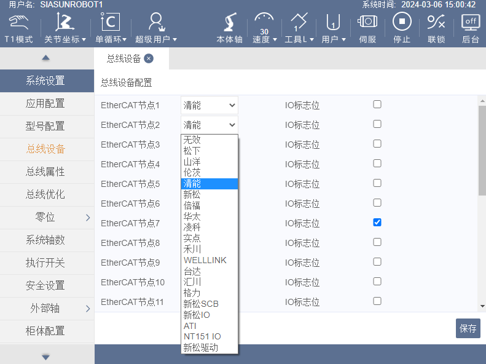

图 8‑40 总线设备配置界面

1. 确定好系统通讯顺序与使用品牌，选择驱动器品牌，选择IO模块品牌。如图8\-40所示为6轴机器人，无外部轴，本体驱动器是清能的。

举例：如现有工作站的配置为6轴本体，机器人外加3台电机，对应的EtherCAT节点分别为7、8、9。其中EtherCAT 7和EtherCAT 8为同一外部轴方向多驱系统的主电机和从电机，所用电机品牌为清能，EtherCAT 9为另外一个外部轴方向，所用电机品牌为松下。进行总线配置如图8\-41所示：

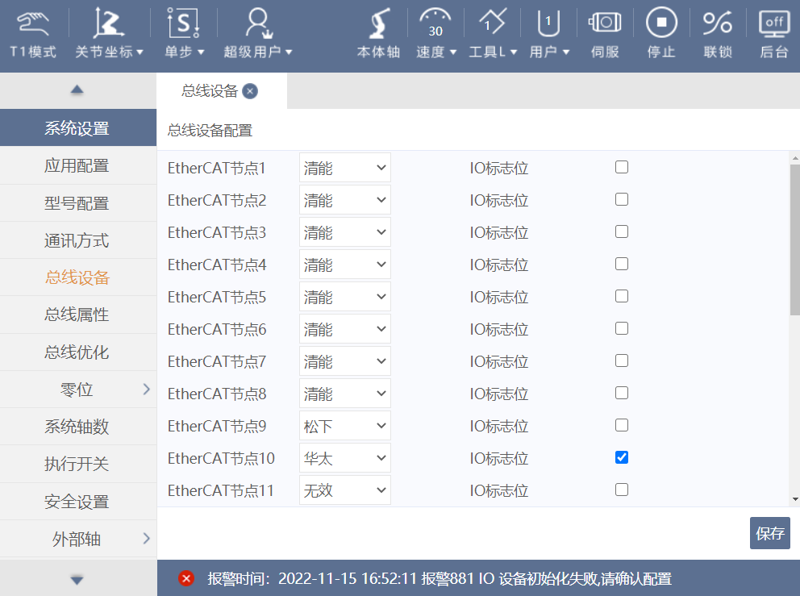

图 8\-41总线设备配置界面

1. 点击保存后，重启生效。

### 轴配置及多驱配置

对外部轴系统进行配置。轴配置界面有外部轴号1\-6个界面，添加了几个外部轴，就需要配置几个界面，从外部轴号1开始按顺序配置。

点击主菜单【系统设置】\-【外部轴】\-【轴配置】，进入到轴配置界面。

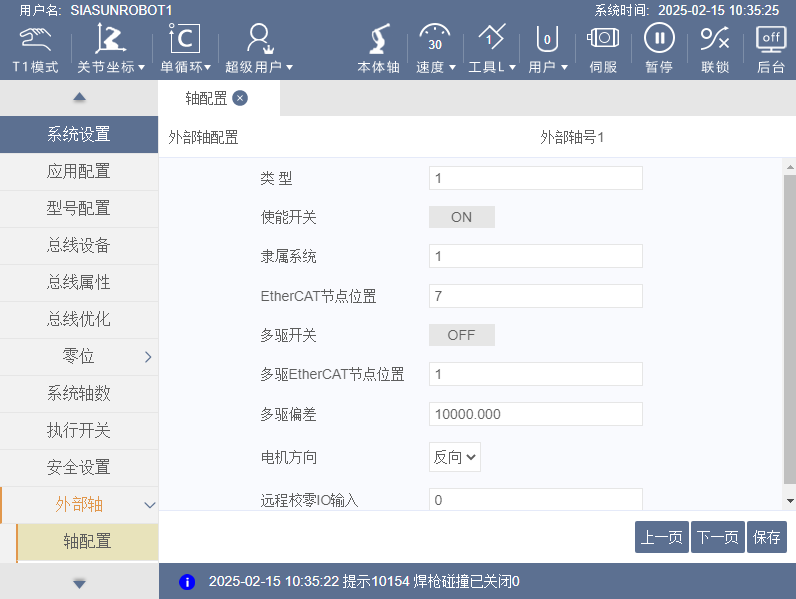

图 8\-42轴配置界面

**参数说明：**

1. **外部轴号：**

此外部轴号为逻辑轴编号，从1开始编号，如果本体轴为6轴系统，则外部轴1代表第7轴的轴属性；如果本体轴为4轴系统，则外部轴1代表第5轴的轴属性；编号2依此类推。

举例：若系统中有多驱配置，如现有工作站的配置为6轴本体机器人外加3台电机，对应的EtherCAT节点分别为7、8、9。其中EtherCAT 7和EtherCAT 8为同一外部轴方向多驱系统的主电机和从电机，EtherCAT 9为另外一个外部轴方向，则EtherCAT 7对应外部轴号1代表第7轴的外部轴属性，EtherCAT 9对应外部轴号2代表第8轴的外部轴属性。进行轴配置如上图8\-42后连接如图8\-43所示：

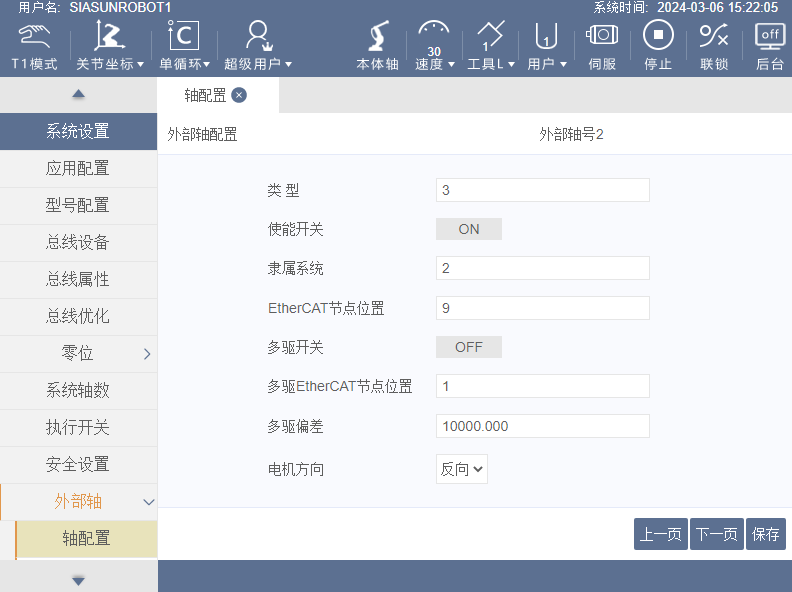

图 8\-43轴配置界面

1. **类型：**

选择此外部轴的类型。外部轴分为几种类型，分别为：1\.NONE、2\.滑台、3\.变位机、4\.转台、5\.转轴。选择不同的号码对应不同的类型。

点击类型参数框后，信息栏会提示编号对应的类型。请根据实际情况选择对应的类型。

NONE：独立外部轴使用。

滑台：机器人的滑台或理解为电机带着直线导轨行走，又叫移动基座轴。

变位机：机器人本体外，带工件旋转的轴，可以由多个轴组成一个系统，又叫旋转工装轴。

转台：带着机器人或工件单独旋转轴的台面。

转轴：机器人本体上在加一个旋转轴，与本体其它轴含义相同，为机器人扩展轴。

1. **使能开关：**

对轴运动进行屏蔽，OFF代表此轴被屏蔽，不能被运动。ON代表此轴有效，可以运动。

1. **隶属系统：**

外部轴可以是一个轴独立的，外部轴也可以由多个轴组成一个系统，所以独立的轴就依次向后排序填写不同的系统，多个轴组成的就需要把这几个轴都填写成一个系统。需要区分外部轴系统和外部轴的概念，一个外部轴系统可以由一个或多个外部轴组成。该参数描述的是该外部轴属于哪个外部轴系统。

| **注意：****每个外部轴号不允许在多个外部轴系统内出现。** |
| --- |

1. **EtherCAT节点位置：**

此处为外部轴电机物理节点，与总线设备配置中的EtherCAT节点保持一致，若外部轴连接在EtherCAT节点7上，则此处填写7。

| **注意：****新系统中轴配置页面中EtherCAT节点位置外部轴号1中默认是7，外部轴号2号默认是8，依此类推外部轴号6中默认是12。若配置中有多驱配置，一定注意后面若有不需要配置的外部轴号页面中的EtherCAT节点不能与前面配置好的外部轴号页面中的EtherCAT节点相同，若不需要配置的外部轴号中的EtherCAT节点，必须配置超出本体轴数。** |
| --- |

1. **多驱开关：**

若此外部轴方向为多个电机驱动，则将此处开关置ON，若为单个电机驱动，则将此处置OFF。当多驱开关置ON时，下面的‘多驱EtherCAT节点位置’、‘多驱偏差’、‘电机方向’这三个参数项才有效。

1. **多驱EtherCAT节点位置**

此处为多驱配置中从动电机的物理节点号，与总线设备配置中的EtherCAT参数一一对应，当多驱开关置ON时，此参数设置的值才有效。此处填写与‘EtherCAT节点位置’中的电机相同驱动方向的第二台电机的EtherCAT节点号。

1. **多驱偏差**

用于校验该外部轴下多个电机运行码盘差，超过该保护值后会报警下电保护。默认为10000\.000，参数范围为0\-131072。

| **注释：****多驱数目配置完毕后运行使用前务必对该外部轴下的多驱动器电机单独进行清除码盘操作。在运行过程中，如果出现“899\-多驱电机同步异常”，需要按照入校处理措施进行处理。** |
| --- |

1. **电机方向**

若两台电机同向转动时驱动方向一致时此处选择正向，若两台电机异向转动时驱动方向一致则此选择反向。

| **注意：****此参数项只有多驱开关置ON时才有效，此参数关系到多驱配置中的从动电机的运动方向，请谨慎配置。** |
| --- |

1. **远程校零IO输入**

根据输入信号，可以对该轴进行码盘清除和校零。

### 系统配置

每个外部轴单独配置外，还需要对外部轴系统进行整体配置。

点击主菜单【系统设置】\-【外部轴】\-【系统配置】，进入外部轴系统属性配置界面。分别对每一个外部轴系统进行设置，按上、下一页来选择希望配置的外部轴系统，一共支持6个外部轴系统，所有6个外部轴系统号。

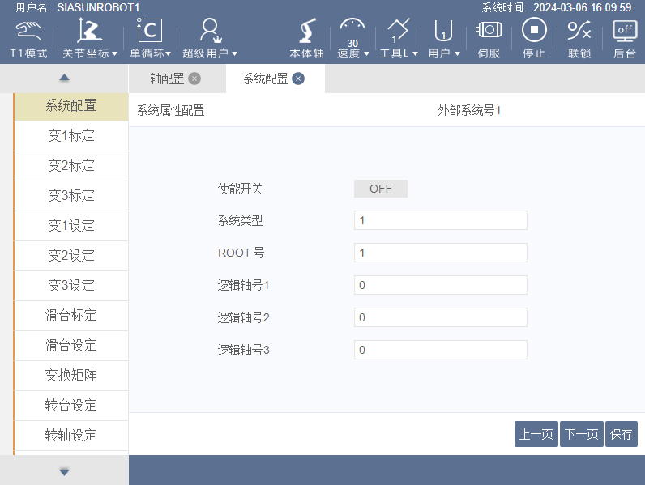

图 8‑44系统配置界面

**参数说明：**

1. **使能状态：**

开关作用，1代表ON，使用该外部轴系统。0代表OFF，禁止使用该外部轴系统。若禁止使用外部轴系统，则正反向运动和执行模式下执行作业时，外部轴将不会运动，但轴运动操作外部轴时，没有禁止运动，外部轴可进行手动操作轴运动。

1. **系统类型：**

选择此外部轴系统的类型，选择不同的号码对应不同的类型。

点击系统类型的参数框后，信息提示栏会提示类型的号码，按照号码填入对应的类型即可。

类型为：NONE、变位机、滑台、转台、转轴（详见8\.3\.3轴配置及多驱配置说明）。

1. **ROOT号：**

设置滑台或者变位机系统时，需要对滑台或者变位机进行标定。如果系统是滑台系统，那么ROOT号码就是该滑台标定的坐标系号。如果该系统是变位机，那么ROOT号码对应的就是变位机PosSys号码,例如ROOT号1对应PosSys1，ROOT号2对应PosSys2，ROOT号3对应PosSys3。

1. **逻辑轴号1、2、3：**

由于一个外部轴系统可能最多由3个外部轴组成，该值表示该外部轴系统处于逻辑轴1位置的逻辑轴号。逻辑轴2、3的定义同逻辑轴1，填写实际外部轴的轴号。

例如，一个变位机外部轴系统由轴7和轴8两个外部轴组成，则逻辑轴号1的值为7，逻辑轴号2的值为8。由于该外部轴系统只由2个轴组成，所以逻辑轴号3的值为0。

| **注意：****此处需注意逻辑轴号与物理轴号的区分。****物理轴号是指外部轴电机实际连接的EtherCAT节点。****逻辑轴号指当有多驱配置时，抛开多驱配置中从动电机后，个轴系统对应的外部轴号。****举例：如现有工作站的配置为6轴本体机器人外加3台电机，对应的EtherCAT节点分别为7、8、9，且隶属于同一外部轴系统。其中EtherCAT 7和EtherCAT 8为同一外部轴方向多驱系统的主电机和从电机，EtherCAT 9为另外一个外部轴方向。此时EtherCAT 7和EtherCAT 8对应的是逻辑轴号的外部轴7，EtherCAT 9对应的是逻辑轴号的外部轴8，系统配置中外部系统号1的逻辑轴号1为7，逻辑轴号2为8，逻辑轴号3为0。** |
| --- |

### 变1、2、3标定

标定变位机前请先建立工具坐标系，确定出工具TCP点（详见2\.2\.2设定工具坐标系说明）。默认的变位机坐标系与机器人直角坐标系重合，在使用变位机前必须标定变位机坐标系。若是多轴变位机，则每个轴都需要标定或设定坐标系，变位机各轴坐标系的Z轴垂直于变位机的各个面。坐标系创建完成后，各轴变位机绕其坐标系的Z轴进行转动。

假设有一个二轴变位机，对应机器人系统的第7、8轴，在关节坐标系下轴运动变位机时（轴运动切换到外部轴），按下【X\+（J1）】键，变位机一轴绕第一轴变位机坐标系的Z轴正向转动，按下【X\-（J1）】键，变位机一轴绕第一轴变位机坐标系的Z轴负向转动，按下【Y\+（J2）】键，变位机二轴绕第二轴变位机坐标系的Z轴正向转动，按下【Y\-（J2）】键，变位机二轴绕第二轴变位机坐标系的Z轴负向转动，关节坐标系下轴运动变位机，机器人各关节不动。

在直角坐标系下，轴运动变位机，按下【X\+（J1）】键，变位机一轴绕第一轴变位机坐标系的Z轴正向转动，按下【X\-（J1）】键，变位机一轴绕第一轴变位机坐标系的Z轴负向转动，同时机器人各关节运动以保证工具TCP点相对于变位机法兰盘上某参照点不动；按下【Y\+（J2）】键，变位机二轴绕第二轴变位机坐标系的Z轴正向转动，按下【Y\-（J2）】键，变位机二轴绕第二轴变位机坐标系的Z轴负向转动，同时机器人各关节运动以保证工具TCP点相对于变位机法兰盘上某参照点不动。

**变1、2、3标定里分别有变位机号1、2、3，他们的含义：**

目前支持三个变位机坐标系系统，变1标定、变2标定、变3标定，一个变位机系统最多支持三个逻辑轴，分为变位机号1、2、3，标定时需要标定每个逻辑轴的坐标系，同时标定过程中，其他非标定的逻辑轴禁止运动。

逻辑轴顺序定义：第一个逻辑轴位置只受自身关节值影响，第二个逻辑轴受第一个逻辑轴运动影响，第三个逻辑轴受第一个和第二个逻辑轴位置影响。需要注意的是，变位机系统与其物理结构相关，如果物理结构上一个变位机系统含两个及其以上轴，则在系统配置时必须将这两个或以上的轴定义在一个变位机系统中。

**变位机标定操作步骤：**

1. 点击主菜单【系统设置】\-【外部轴】\-【变1标定】,进入变位机标定界面。按上、下一页选择变位机号。

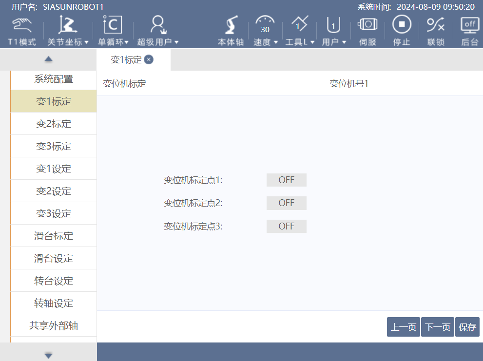

图 8\-45变位机标定界面

1. 变位机标定方法：将工具中心点对准变位机上的参考点，标定第一点，该点的状态随即切换至ON。切换为关节坐标和外部轴系统，正方向运动改变当前标定节点变位机角度（其他非标定节点禁止运动），旋转角度大于20度，切换回直角坐标和本体轴系统再移动机器人本体，使用直角坐标改变机器人XYZ坐标值，（不可改变机器人Rx，Ry，Rz坐标值），使工具中心点仍对准参考点，依次标定其余两点，按保存，变位机被标定。

**验证变位机坐标系标定成功的方法：**

前提是已正确标定出工具坐标系和变位机坐标系。

1. 变位机上找一参考点，移动机器人TCP点对准该参考点；
2. 示教模式下切换到直角坐标系，按下示教器【外部轴】键切换到外部轴；
3. 先伺服上电，同时按下Deadman键和轴运动键（变位机所对应的轴）进行变位机轴运动，若机器人TCP点始终对准变位机上的参考点，则变位机坐标系标定正确。
4. 滑台标定尽量选择较远的距离，否则影响精度。

| **注意：****变位机标定过程中改变变位机位置时必须正方向转动变位机至不同的5个点。如果是一轴变位机，标定时变位机号请选择1。如果是2轴变位机，则标定第一个逻辑轴时，变位机号选择1且标定过程中只能运动第一个逻辑轴，逻辑轴1标定完成的坐标系即为该变位机系统的ROOT系。标定第二个逻辑轴时，变位机号选择2且运动过程中只能运动第二个逻辑轴，逻辑轴2标定完成的坐标系即为该变位机系统的TA2A1系，即外部轴系统2号逻辑轴相对于1号逻辑轴坐标系位置和方向。必须按照逻辑轴1、2、3的顺序标定。** |
| --- |

**变1、2、3设定：**

若已知变位机坐标系相对于机器人直角坐标系的变换关系，则可以直接设定变位机坐标系。其含义与标定一致，只是实现的方式不同。

**变位机系统坐标系设置步骤：**

1. 点击主菜单【系统设置】\-【外部轴】\-【变1设定】,进入变位机设定界面。

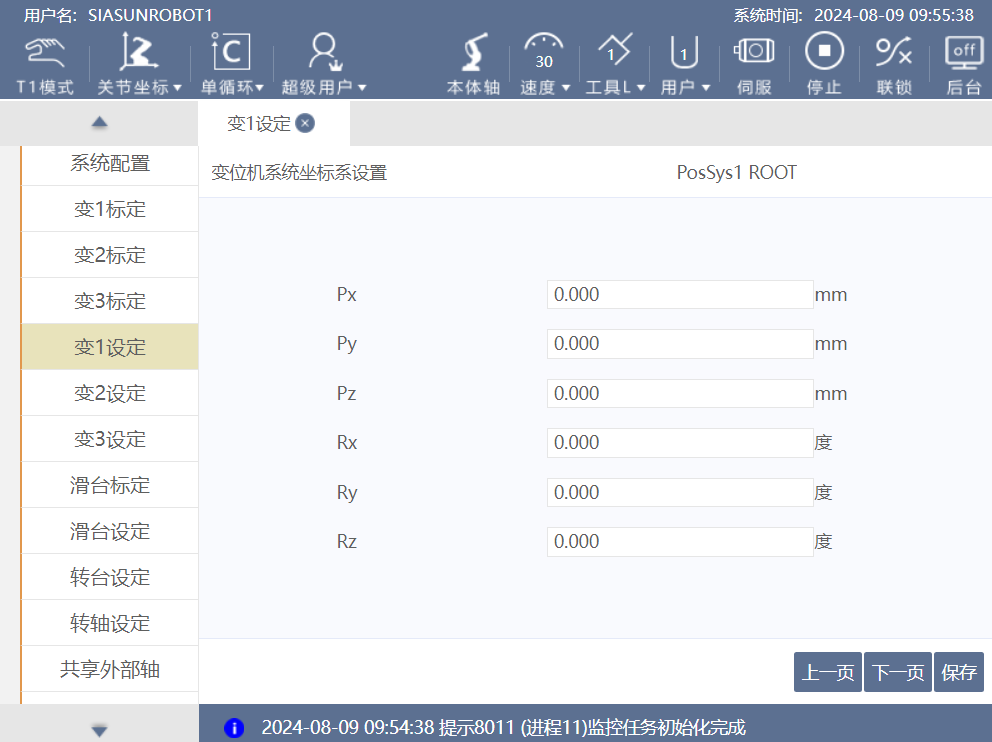

图 8‑46变位机系统坐标系设置界面

1. 按照给定值，设定变为坐标系，按保存键。

由于显示屏大小限制，默认为ROOT设置，按翻页键（上、下一页），完成“ROOT”\- “TA2A1”\- “TA3A2”的切换。

**ROOT：**外部轴系统1号逻辑轴相对于世界坐标系的位置和方向。

**TA2A1：**外部轴系统2号逻辑轴相对于1号逻辑轴坐标系位置和方向。

**TA3A2：**外部轴系统3号逻辑轴相对于2号逻辑轴坐标系位置和方向。

### 滑台标定与设定

滑台坐标系标定前请先标定工具坐标系，确定出工具TCP点（详见2\.2\.2设定工具坐标系说明）。当前基于滑台的应用，通常是将机器人坐立在滑台上，机器人与滑台联动完成一组动作来实现具体的功能。默认的滑台坐标系在滑台零位上，与机器人直角坐标系重合，使用滑台前必须标定滑台坐标系。标定完成后滑台的运动方向为滑台坐标系的X轴方向。

假设某机器人系统的第8轴为滑台，在关节坐标系下轴运动滑台时，按下滑台所对应的轴运动键【Y\+（J2）】键，滑台沿滑台坐标系X轴正向运动，按下【Y\-（J2）】键，滑台沿其滑台坐标系X轴负向运动，关节坐标系下轴运动滑台，机器人各关节不动。在直角坐标系下，轴运动滑台，按下滑台所对应的轴运动键【Y\+（J2）】键，滑台沿滑台坐标系X轴正向运动，同时机器人各关节运动以保证工具TCP点相对于空间某参照点不动；按下【Y\-（J2）】键，滑台沿其滑台坐标系X轴负向运动，同时机器人各关节运动以保证工具TCP点相对于空间某参照点不动。

**滑台坐标系的标定操作步骤：**

1. 点击主菜单【系统设置】\-【外部轴】\-【滑台标定】,进入滑台标定界面。滑台号1\-6，最多可标定6个坐标系。

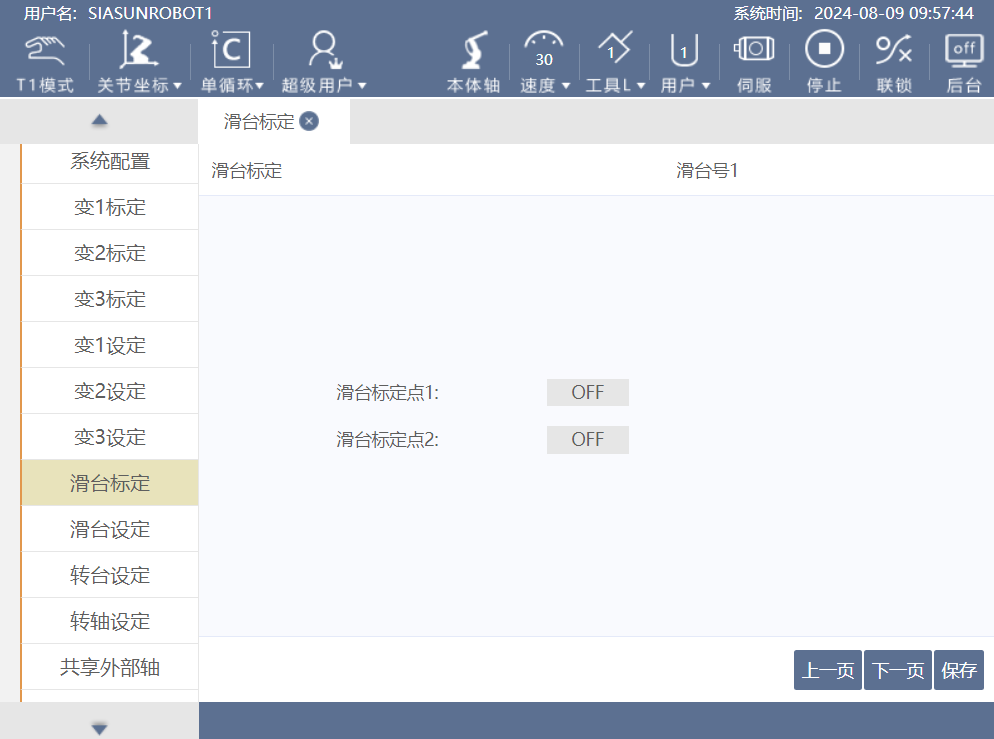

图 8‑47滑台标定界面

1. 将工具中心点对准滑台上的参考点，按OFF键标定第一点，该点的状态随即切换至ON。改变滑台位置，切换关节坐标和外部轴系统正方向移动要标定的滑台轴一段距离，其它外部轴不动，然后切换回直角坐标和本体轴系统使用直角坐标系改变机器人XYZ坐标值，（不可改变机器人Rx，Ry，Rz坐标值），使工具中心点仍对准滑台上的参考点，标定第二点，按\[保存]，滑台被标定。

| **注意：****标定过程中改变滑台位置时必须正方向运动滑台到第二个点。****滑台标定尽量选择较远的距离，否则影响精度。** |
| --- |

**验证滑台坐标系****标定成功的方法：**

前提是已正确标定出工具坐标系和滑台坐标系。

1. 空间任意找一参考点，移动机器人TCP点对准该参考点；
2. 示教模式下切换到直角坐标系，按下示教器\[轴组]键切换到外部轴；
3. 先伺服上电，同时按下Deadman键和轴运动键（滑台所对应的轴）进行滑台轴运动，若机器人TCP点始终对准空间上的参考点，则滑台坐标系标定正确。

**滑台坐标系的设定步骤：**

若已知滑台坐标系相对于机器人直角坐标系的变换关系，则可以直接设定滑台坐标系。其含义与标定一致，只是实现的方式不同。

1. 点击主菜单【系统设置】\-【外部轴】\-【滑台设定】,进入滑台设定界面。

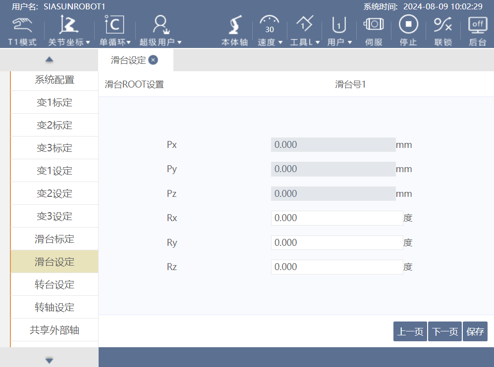

图 8‑48滑台设置界面

1. 输入设置值，按保存。

### 转台设定

若已知转台坐标系相对于机器人直角坐标系的变换关系，则可以直接设定转台坐标系。默认的转台坐标系与机器人直角坐标系重合，在使用转台时根据情况设定转台坐标系。转台号有1\-6，根据外部轴是转台，依次根据轴号进行设定。当前基于转台的应用，通常是将工件过机器人固定在转台上，机器人与转台联动完成一组动作来实现具体的功能。

点击主菜单【系统设置】\-【外部轴】\-【转台设定】,进入转台设定界面。

图 8‑49转台系统坐标设置界面

### 转轴设定

若已知转轴坐标系相对于机器人直角坐标系的变换关系，则可以直接设定转轴坐标系。默认的转轴坐标系与机器人直角坐标系重合，在使用转轴时根据情况设定转轴坐标系。转轴号有1\-6，根据外部轴是转轴，依次根据转轴号进行设定。当前基于转轴的应用，通常是将机器人固定在转轴上、或将转轴安装到机器人末端，机器人与转转联动完成一组动作来实现具体的功能。

点击主菜单【系统设置】\-【外部轴】\-【转轴设定】,进入转轴设定界面。

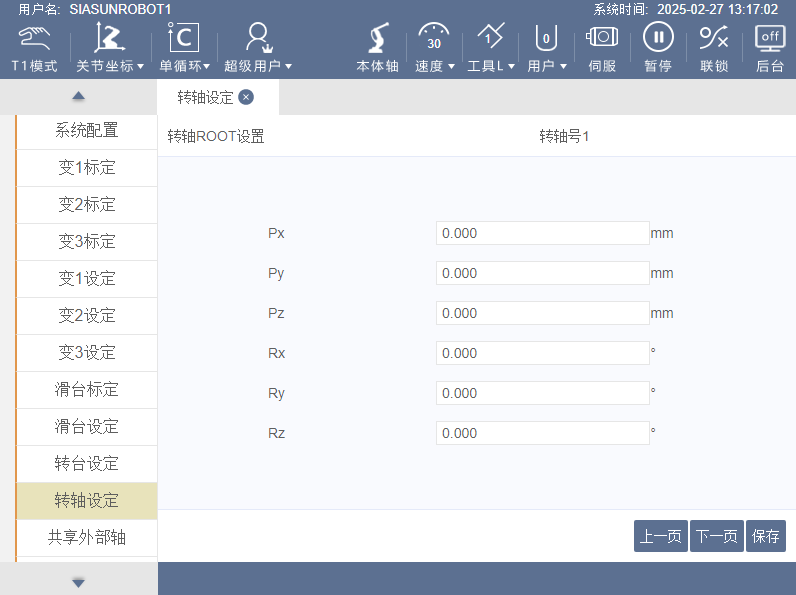

图 8‑50转轴设置界面

### 外部轴参数的设定

**减速比的设定步骤：**

点击主菜单【系统参数】\-【运动参数】\-【减速比】,进入设定减速比界面。

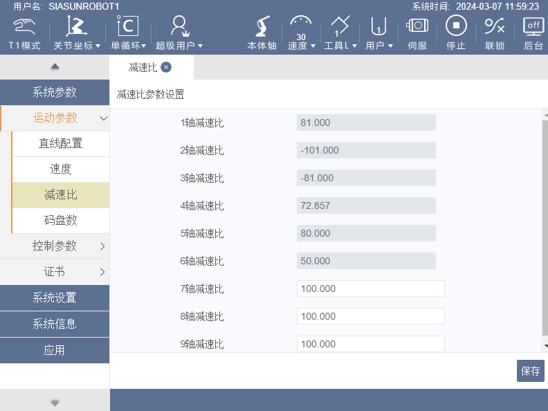

图 8‑51减速比的设定界面

减速比的设定依据是外部轴机械设计者提供的设计减速比，如果为滑台，还要提供齿轮齿条传动的末端传动齿轮的半径。

减速比参数的数值大小将影响关节值代表的实际含义。机器人本体的关节值单位为°，代表机器人本体各轴末端旋转的角度。

外部轴如果为滑台，关节值单位为mm，如果为转台，单位为°。

滑台外部轴减速比的单位为（°/mm），表示滑台每移动1mm，电机转过的角度，如果客户提供的是齿轮齿条传动的齿轮转速比R（电机转动R°传动齿条的齿轮转过1°），则在示教器中设定的减速比应按下面公式计算为：

减速比\=$\\frac{R×360(°）}{2πr（mm）}$

（r为齿轮半径，单位mm)转台外部轴的减速比没有单位，表示外部转台转过1°电机转过的角度。

外部轴减速比的正负符号可以根据外部轴实际运动方向确定，更改减速比的符号，外部轴运动方向相反。

**最大速度的设定步骤：**

点击主菜单【系统参数】\-【运动参数】\-【速度】,进入最大速度设定界面。

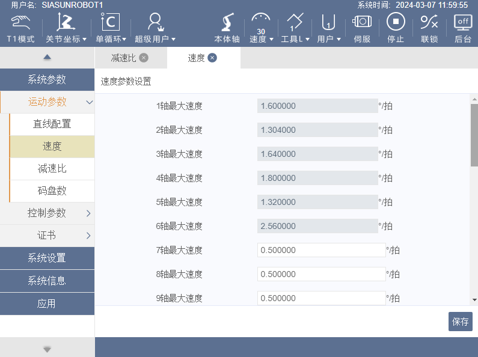

图 8‑52最大速度设定界面

外部轴的最大速度设定依据是设计的外部轴末端最大运行速度（°/s）。

最大速度的计算公式为：

最大速度\=$\\frac{设计的外部轴末端最大运行速度\\left（°/s\\right）\*4}{1000}$

如果客户提供的外部轴末端的最大运行速度为齿轮齿条传动的直线速度A(m/s)，则末端传动齿条的齿轮的最大转速（单位°/s）为：

最大转速\=$\\frac{A\\left(\\frac{m}{s}\\right)\*360°}{2πr（r为齿轮半径，单位为m）}$

再按照上面的最大速度计算公式计算即可，即最大速度设定值应该为：

最大速度设定值\=$\\frac{A\\left(\\frac{m}{s}\\right)\*360°\*4}{2πr\\left（m\\right）\*1000}$

**最大加速度的设定步骤：**

点击主菜单【系统参数】\-【运动参数】\-【速度】,进入最大速度设定界面。

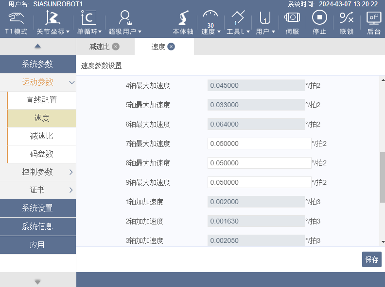

图 8‑53最大加速度、加加速度设定界面

最大加速度根据最大速度的一定比例设置。

最大速度设定完成后，最大加速度通常设定为最大速度的1/40。可以根据加速的快慢要求及减速的震动要求，加大或减小最大加速度的值。如最大加速度设定为最大速度的1/80，加减速时间长，相应的冲击小，运行的比较平稳。

客户提高外部轴的加速度，最大不能超过最大速度的1/20。

加速度与加加速度设置完成后，参数调节界面里的加速时间会发生变化。

**每圈码盘圈数的设定步骤：**

点击主菜单【系统参数】\-【控制参数】\-【安全保护】,进入安全保护限设置界面。

**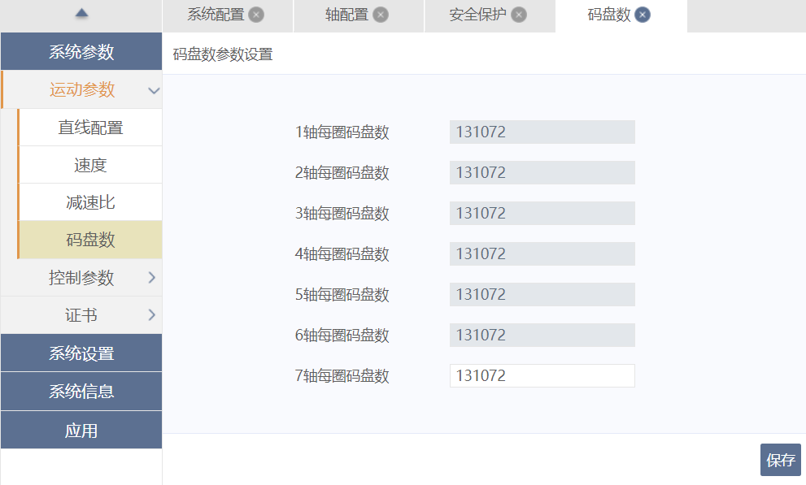**

图 8‑54每圈码盘线数的设定界面

使用新松的外部轴电机，每圈码盘线数设定为131072\. 推荐使用新松提供的外部轴电机，相关驱动系统的设置都与系统匹配。

**RC速度限参数的设定步骤：**

点击主菜单【系统参数】\-【控制参数】\-【安全保护】,进入安全保护设置界面。

图 8‑55速度限设定界面

RC速度限的计算方法如下：

外部轴RC速度限\=$\\frac{1\.2\*示教器中设定的最大速度（°/系统节拍时间)\*减速比\*131072（每圈码盘线数）}{360（°）}$

其中最大速度为机器参数中的最大速度，减速比为机器参数中的减速比。360表示圆周的360度。

**跟踪差的设定步骤：**

点击主菜单【系统参数】\-【控制参数】\-【安全保护】,进入安全保护设置界面。

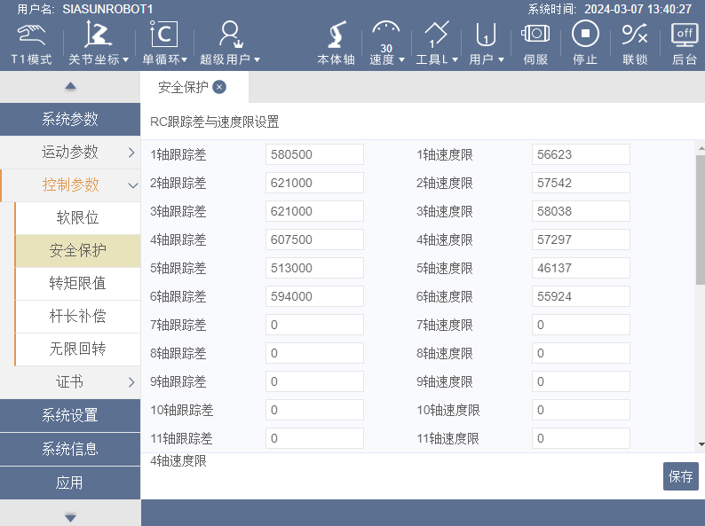

图 8‑56跟踪差设定界面

跟踪差设定，进入这个界面，把外部轴的跟踪差值设大一些（为了让机器人先动起来）。需要机器人满负载最大速度自动运行，轴的活动范围尽可能大些，查看实时显示里的外部轴跟踪差值，机器人运行几个循环的过程中，把外部轴的跟踪差最大值记录下来，填写到跟踪差设定界面。

**外部轴校零：**

使用零位单轴校零的方式实现（详见8\.4零位说明）。外部轴的零位可以标定在任意位置， 校零前先清除外部轴驱动器码盘圈数。

外部轴校零后，记录零位码盘值、贴零位标签或记号用以在机械件上记录零位位置，便于在零位丢失时找回零位。

**外部轴软限位设定：**

点击主菜单【系统参数】\-【控制参数】\-【软限位】,进入位置限位设置界面。

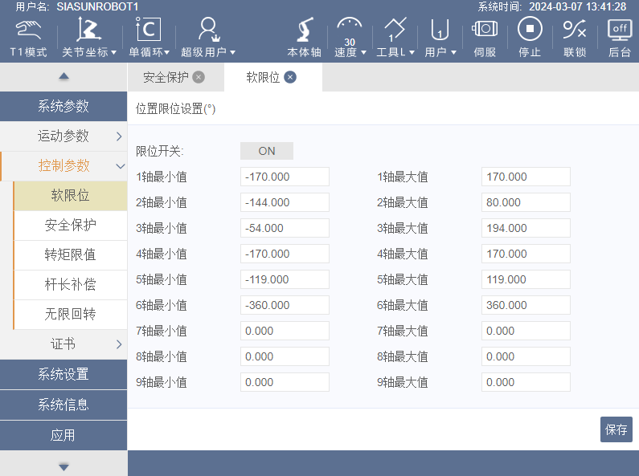

图 8‑57外部轴软限位设定界面

需要把外部轴校零工作完成后，再做此项工作。查看实时显示的关节值，坐标系选择关节坐标系，移动外部轴到达它的最大行程处，查看关节值，把关节值填写到这个位置。保存后生效。

### 共享外部轴功能

**系统轴数的配置：**

正确设置主控和从控机器人外部轴轴数。共享外部轴安装在哪台机器人上，该机器人为主控。主控和从控机器人都需要把共享的外部轴，设置到系统轴数中。

如：机器人本体是6轴，1个外部轴为共享外部轴，主控机器人与从控机器人系统轴数都需要配置成：机器人轴数为6，外部轴轴数为1。

如图8\-61所示：

图 8‑58 系统轴数配置界面

**总线设备配置：**

主控机器人总线设备配置，需要按照硬件设备连接顺序配置，添加外部轴驱动器厂商和2个倍福模块。

从控机器人总线设备配置，需要按照硬件设备连接顺序配置，添加1个倍福模块节点。

从控机器人最后一个节点需要网线连接到主控机器人的倍福模块上。主控机器人安装2个倍福模块，从控机器人控制柜不需要安装倍福模块。

如：机器人本体是6轴，1个外部轴为共享外部轴。

主控机器人总线设备配置如下：

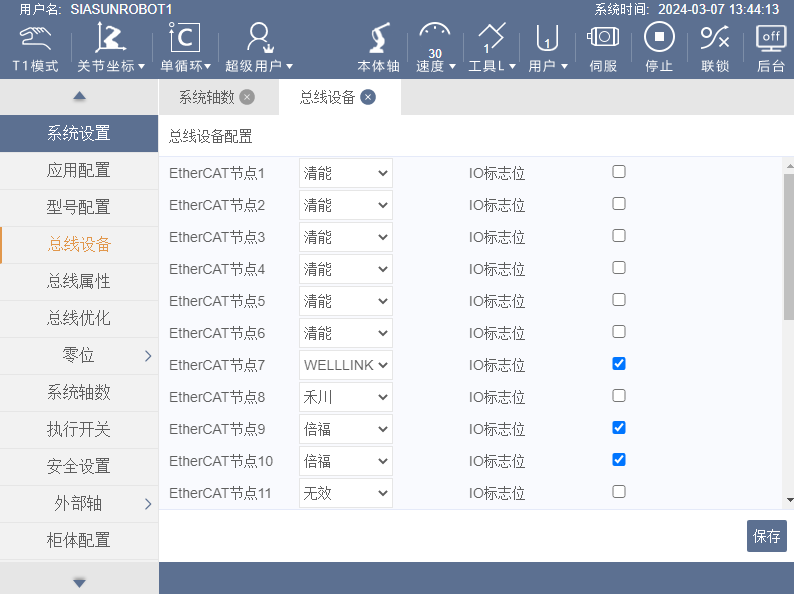

图 8‑59主控机器人总线设备配置界面

从控机器人总线设备配置如图8\-60所示：

图 8‑60从控机器人总线设备配置界面

**共享外部轴参数配置：**

主控和从控机器人都需要配置减速比、零位、跟踪差、速度限、软限位。且共享的外部轴参数需要一致。

**外部轴系统配置：**

路径是主菜单【系统设置】\-【外部轴】\-【系统配置】。主控与从控机器人都需要对共享外部轴，进行系统配置（详见8\.3\.4系统配置说明）。

**共享外部轴配置：**

路径是主菜单【系统设置】\-【外部轴】\-【共享外部轴】。配置完成后，点击【保存】按钮保存配置。配置界面如图8\-61所示。

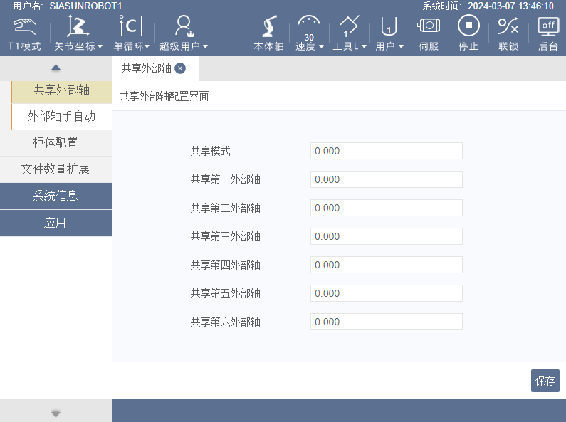

图 8‑61共享外部轴配置界面

**参数说明：**

共享模式：

0：关闭功能

1：共享外部轴使能

4：模拟量IO：机器人内部协议（传送机器人当前位置的RPY值）

共享第一外部轴：即第7轴

0：不共享该轴的数据

1：主控机器人填写1

2：从控机器人填写2

主控机器人共享数据代表通过网桥向外发送该轴的enci；

从控机器人共享数据代表通过网桥接收该轴的enci；

**确认主控与从控机器人连接成功：**

查看主控机器人和从控机器人的共享外部轴关节值是否一致，一致后，操作主控机器人运动共享的外部轴，查看从控机器人关节值是否跟随主控机器人变化，并且关节值保持一致。表示连接成功、数据正常。

主控与从控机器人关节值不一致，并且从控机器人关节值不为零，请检查两台机器人共享外部轴的减速比配置是否一致。表示连接成功、数据异常。

主控与从控机器人关节值不一致，并且从控机器人关节值为零，表示连接不成功。

**标定共享外部轴：**

主控机器人与从控机器人都需要进行共享外部轴的标定。标定从控机器人时，需要主控机器人移动共享外部轴来辅助从控机器人标定（详见8\.3\.5变1、2、3标定、8\.3\.6滑台标定与设定说明）。

**使用方法与注意事项：**

从控机器人在与共享外部轴联动时，联动轨迹的起点要求从控机器人和外部轴同步。

从控机器人和共享外部轴没有联动运动，从控机器人和外部轴没有运动约束。

从机器人和共享外部轴是否有联动运动，通过作业轴组控制。

联动控制，则作业轴组选择包含共享外部轴系统；

不需要联动控制，则作业轴组不能选择包含共享外部轴的系统。

起点同步由示教程序保证，机器人控制软件无法保证同步。程序示例如图8\-62所示：

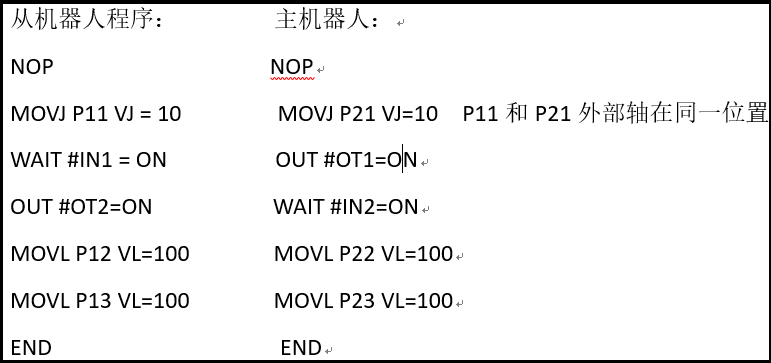

图 8‑62起点同步程序示例

### 外部轴手自动功能

**功能说明：**

1. 在运行作业时，希望对某不在当前作业系统内的外部轴进行轴运动时，根据实际情况，进行轴运动速度的分档调节。
2. 实现实质为外部轴进行轴运动时，根据不同的输入IO，来切换不同的正反向轴运动速度，每个速度的档位均由用户自行配置，目前根据需求分为高中低三个档位供用户选择。

**使用前提条件：**

* + - 1. 系统存在所需手动控制的外部轴
			2. 外部轴轴配置页面，外部轴系统页面配置完成，功能正常。
			3. 本功能所需的输入输出IO均可正常使用。

**外部轴手自动配置步骤：**

1. 点击主菜单【系统设置】\-【外部轴】\-【外部轴手自动】，进入外部轴手自动功能配置界面。

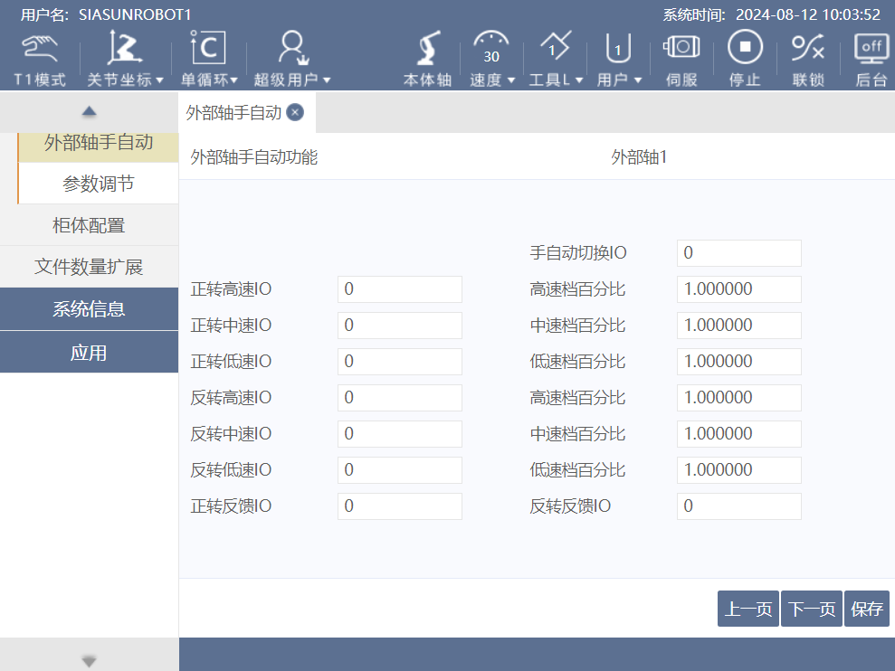

图 8‑63外部轴手自动功能配置界面

1. 配置完界面参数后，点击【保存】按钮保存。

**参数说明：**

* + - 1. 外部轴1，通常为第7轴，以此类推是对不同外部轴的设计。
			2. 手自动切换IO：在执行作业情况下，能够运行手动外部轴功能的可配置输入IO号（类似功能开关）。
			3. 对于外部轴进行轴运动，分为正转轴运动和反转轴运动两种：

正转运动时根据不同需要，对正转运动时的轴运动速度设置了高中低三档，分别可配置不同的输入IO（类似于不同的档位）。高中低速的数值百分比由用户设置，正常由0\-100数字构成，代表与轴运动最大速度的百分比。

反转运动同样具有高中低三档，分别可配置不同的输入IO，速度数值用户可自行配置。

* + - 1. 正转反馈IO、反转反馈IO：轴运动进行时，对用户的可配置输出IO。

| **注意：****在配置完外部轴配置和外部轴系统的前提下，进行该页面配置** |
| --- |

**举例：**

假设对8轴进行手动控制，正反转速度按10%、50%、100%分档：

1. 在手动外部轴页面的第2页进行配置，翻到外部轴2；
2. 设置手自动切换IO号：配置1；
3. 正转高速IO号：配置10。正转中速IO号：配置11。正转低速IO号：配置12；
4. 反转高速IO号：配置13。反转中速IO号：配置14。反转低速IO号：配置15；
5. 正反转高中低速度百分比分别填写100、50、10；
6. 正转反馈IO：配置10 反转反馈IO：配置13；

**补充说明：**

1. 操作时保证在自动运行情况下，执行作业轴组不包含所操作轴的情况下，且手动切换的输入IO使能情况下进行操作。未满足上述任意条件，该功能均无效。
2. 高中低档对应的输入IO，同时只能按下一个按键。
3. 软限位根据需要自行调节好，本功能为确保作业正常执行，会在手动外部轴即将到达软限位时，封闭按键，需要自行反向手动转回。

### 参数调节

**功能说明：**

可以通过示教器调节外部轴驱动器的参数。在配置了外部轴后该界面才可以进行查看及设置。进入该界面可以把驱动器上的参数读取到该界面中，可以通过该界面进行修改。保存后生效。

点击主菜单【系统设置】\-【外部轴】\-【参数调节】，进入参数调节功能配置界面。

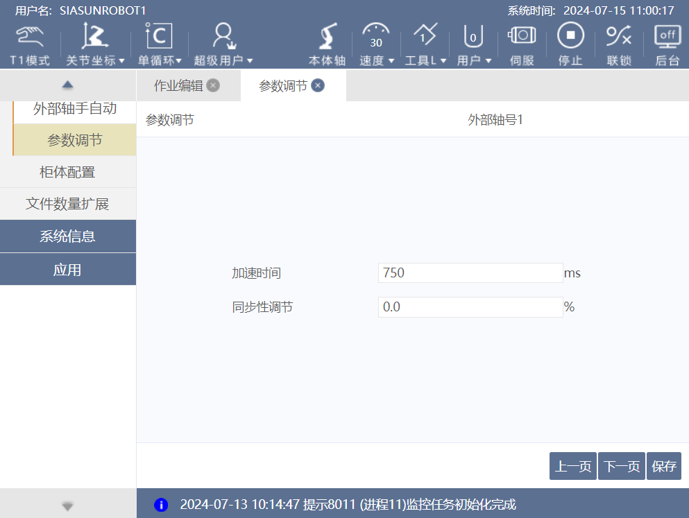

图 8‑64外部轴参数调节配置界面

**加速时间：**

针对外部轴抖动问题通过调节加速时间来解决，如果抖动就调大加速时间，直到不抖动为止。加速时间默认值为750ms可设置范围（100\-5000ms）建议每次调节50ms。改变该值，运动参数中速度界面里，对应的加速度与加加速度会同步变化。同理，改变运动参数中速度界面里的加速度与加加速度，该页面里的值也会发生变化。

**同步性调节：**

针对不同步问题通过调节界面中的同步性调节来解决，如果外部轴比本体轴慢，减小同步性调节百分比，如果外部轴比本体轴快，增大同步性调节百分比。同步性调节默认值是通过驱动器参数读上来的，可设置范围（0\.0\-100\.0%）建议每次调节1%，外部轴与本体轴同步性接近后再每次调节0\.1%。

## 零位

零位的含义：机器人进行位置运算使用关节值等相对数值，相对数值的基准就是零位码盘值。将电机的哪个位置（编码器数值）设定为零位码盘值的过程就是校零。零位码盘值设定的合适位置应该尽可能与软件中使用的虚拟模型对应上，即保证一些平行和垂直的关系。

机器人现在的位置，通过各轴的脉冲编码器计数值来确定。

重新校零即改变软件的计算基准，结果是导致已经示教好的作业的本体实际位置点发生改变。

工厂出货时，已经对机器人零位进行零位标定，所以在日常操作中并不需要进行零位标定。但是下列情况，则需要零位标定。

机器人在哪个位置进行校零不明确的，可根据《新松工业机器人安装及维护手册》进行操作。

**注意：在教零时，需要松开使能按键。**

表8\-1 下列情况需要重新校零

| 以下情况需要重新校零 | 所用的方法 |
| --- | --- |
| 改变机器人与控制柜的组合后 | 零位设定，不论机器人在什么位置，直接输入数值。 |
| 存储内存被删除、更换主板或更换CF卡。 | 零位设定，不论机器人在什么位置，直接输入数值。 |
| 驱动器码盘报警，码盘圈数清零后。 | 对准工具（机械）校零位置或零位标签，进行码盘清除。 |
| 拆装、更换电机、减速机、机械传动部件后。 | 对零位标签/对准工具（机械）校零位置的方式用单轴校零/全轴校零。使用专业的校零工具，进行单轴校零/全轴校零。 |
| 当机器人发生碰撞后，造成编码器和轴角度偏移时。 | 对零位标签/对准工具（机械）校零位置的方式用单轴校零/全轴校零。使用专业的校零工具，进行单轴校零/全轴校零。 |
| 本体内码盘电池没电或码盘供电线路有过断开时，驱动器因为码盘圈数丢失报警。（注：电池电压下降时，系统会发生报警通知客户。） | 解除报警后，对准工具（机械）校零位置或零位标签，进行码盘清除。 |

表8\-2 零位标定的种类

| 零位标定操作 | 含义及内容 |
| --- | --- |
| 全轴校零 | 把机器人全部轴一起进行零位校准。通过零位标签/对准工具（机械）校零位置，将机器人所有轴移动到对齐位置。 |
| 单轴校零 | 把机器人单个轴进行零位校准。通过零位标签/对准工具（机械）校零位置，将机器人所有轴移动到对齐位置。 |
| 零位设定 | 把本体上的零位码盘标签的数值，填写到零位设定中。 |

零位码盘标签放在机器人本体一轴上，格式如下：

表8\-3零位标签

| 本体号 | SN0000001 |
| --- | --- |
| 控制柜号 | SN0000001 |
| 零位码盘数值 | |
| 1轴 | 10000 |
| 2轴 | 10005 |
| 3轴 | 22222 |
| 4轴 | 33333 |
| 5轴 | 44444 |
| 6轴 | 55555 |

### 零位标定

**全轴校零步骤：**

1. 移动机器人到零位标签对齐的位置。

| **注意：****因为一些型号机器人4轴、6轴可移动范围为360度，移动4、6轴前需要确定4轴的当前位置，4轴应该向“使零位标签对齐且旋转角度不要差360度”的方向旋转。** |
| --- |

1. 点击主菜单【系统设置】\-【零位】\-【校零】进入校零界面，在校零方式处选择全轴校零，点击【校零】并再次确认校零，即可完成校准工作。

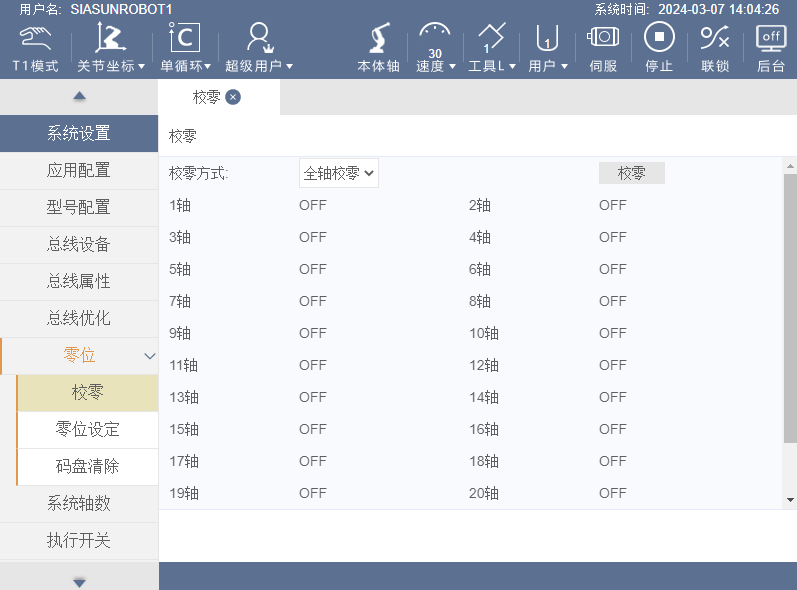

图 8‑65校零界面

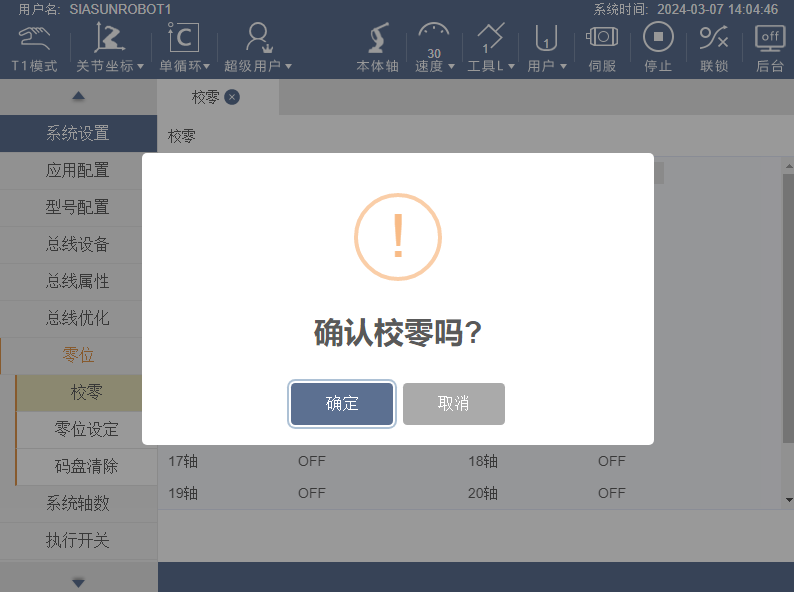

图 8‑66校零界面

1. 校零成功后，需要重新启动机器人。进入【系统设置】\-【零位】\-【零位设定】界面,记录下零位码盘,方便下次进行零位设定。

| **注意：****一些特殊机型较完零后个别轴关节值不是0。可在表9\-4查看特殊机型。****其它机型校零后关节值都为0。****校零成功后，需要重新启动机器人，设置才能生效。** |
| --- |

**单轴校零步骤：**

| **注意****由于机器人部分结构采用的是随动结构，所以在单轴校零的时候要按从小到大的顺序单轴校零，例如需要对4、5、6轴进行单轴校零，则需先对4轴单轴校零，在对5轴进行校零、最后对6轴进行校零，不按照从小到大的顺序单轴校零，可能造成零位不准。** |
| --- |

1. 将需要校零的轴，手动调整至零位标签对齐。
2. 点击主菜单【系统设置】\-【零位】\-【校零】进入校零界面，选择单轴校零，点击需要校准的轴后面的OFF按钮，变成ON后，点击【校零】并再次确认校零后即可单轴校零。

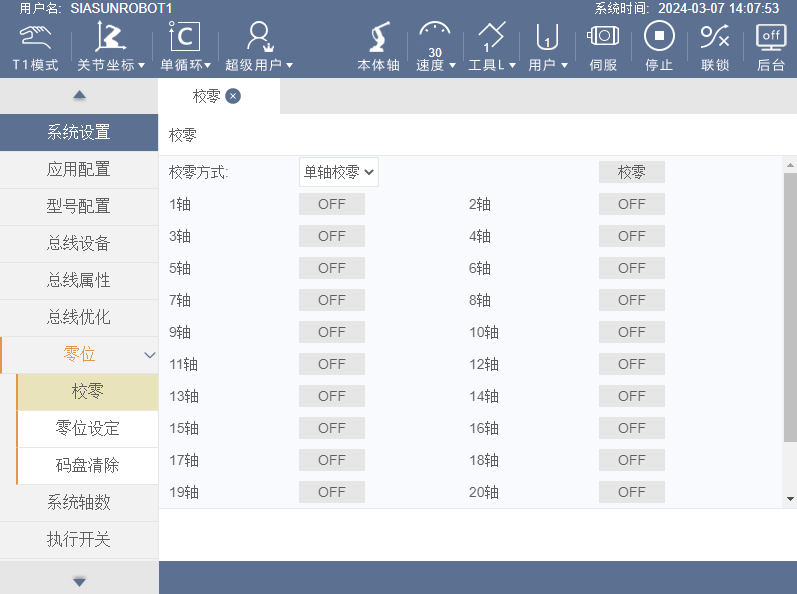

图 8‑67单轴校零界面

1. 校零成功后，需要重新启动机器人，进入【系统设置】\-【校零】\-【零位设定】界面,记录下零位码盘,更新到零位标签上，方便下次进行零位设定。

| **注意：****校零成功后，需要重新启动机器人，设置才能生效。** |
| --- |

### 零位设定

零位设定需要将零位标签的码盘数值对应输入。

**零位设定步骤：**

1. 查看机器人腰座上的零位码盘值标签。
2. 进入【系统设置】\-【校零】\-【零位设定】界面，按照码盘标签上的码盘值来输入。

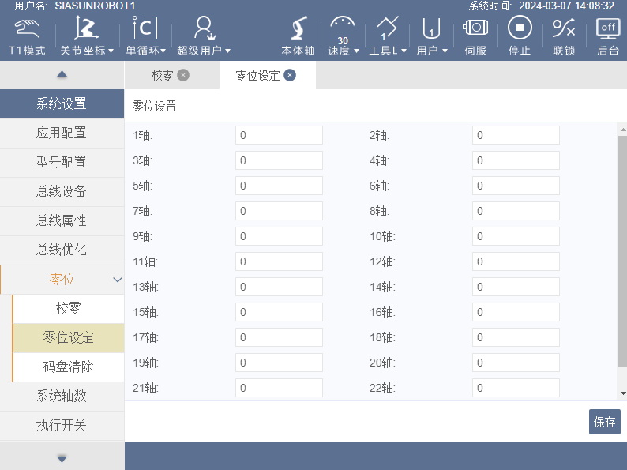

图 8‑68零位设置

1. 输入完成并按【保存】，重启机器人。

### 码盘清除

有时会遇到驱动器因故导致码盘丢失报警的情况。造成驱动器码盘报警的原因可能为本体码盘电池没电、不正确的更换电池等，在这种情况下，需要结合零位标签、零位设定等多种方法，恢复机器人的原来零位。

码盘清除是把电机的码盘圈数清除，码盘清除分为：单轴清除、全部所有轴清除。

**码盘清除操作步骤：**

1. 首先需要将机器人运行到各轴零位标签对齐的位置，按照下面方法清除电机的码盘圈数：点击主菜单【系统设置】\-【零位】\-【码盘清除】，进入码盘清除界面。

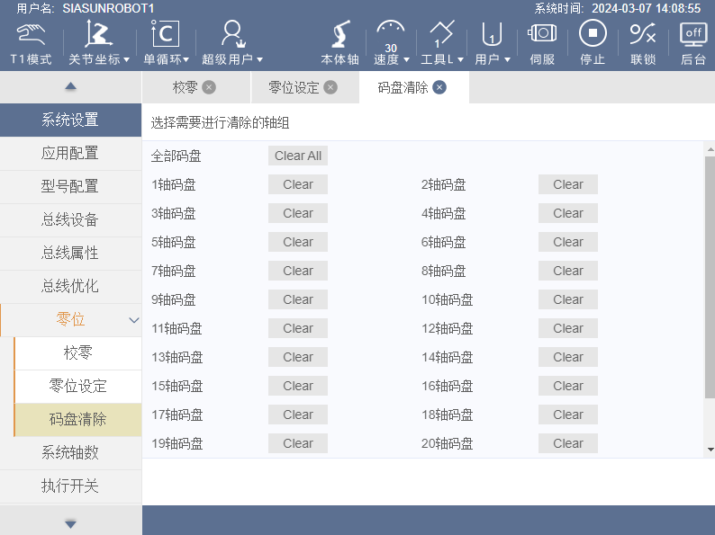

图 8‑69码盘清除界面

1. 选择要清除的轴或者全部，并点击Clear All或Clear。【Clear All】或【Clear】按钮后，会提示“是否清除全部码盘”或“是否清除轴n码盘”（n为对应的轴），再次点击【确定】按钮，会清除相应的码盘值。
2. 重启机器人后生效。

| **注意：****由于机器人部分结构采用的是随动结构，所以在单轴码盘清除的时候要按从小到大的顺序，例如需要对4、5、6轴进行单轴码盘清除，则需先对4轴单轴清除码盘，在对5轴进行码盘清除、最后对6轴进行码盘清除，不按照从小到大的顺序码盘清除，会造成零位不准。如对6轴进行码盘清除，需要把4,5轴移动到零位。如对5轴进行清除码盘，需要把4轴移动到零位。** |
| --- |

## 设置机器人IP

机器人控制器连接上位机、离线软件、视觉系统、PLC等，需要设置机器人IP。

**设置机器人IP步骤：**

1. 点击主菜单【用户配置】\-【设置IP】，进入设置IP界面。

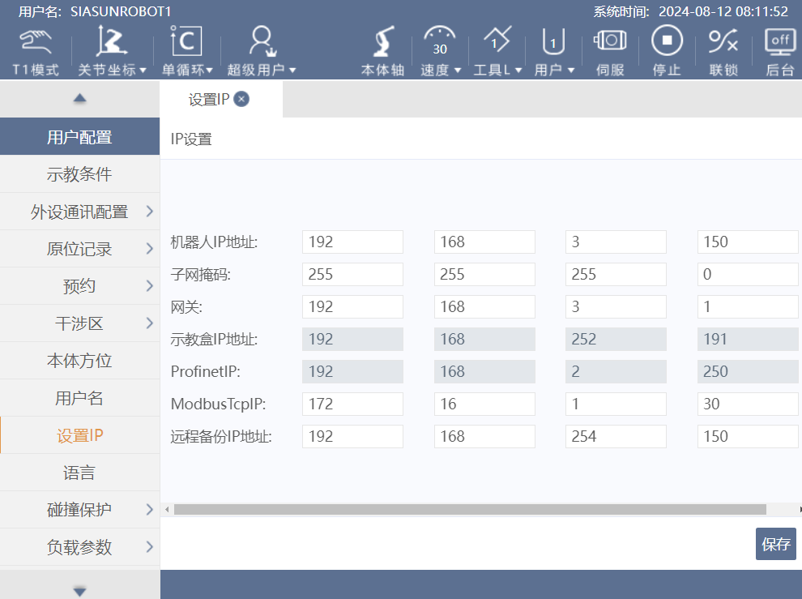

图 8‑70设置机器人IP界面

1. 填好机器人IP，按保存。

## 语言设置

目前新松机器人示教器支持中文、英文两种语言。

**设置语言操作步骤：**

1. 点击主菜单【用户配置】\-【语言】,进入语言类型配置界面。

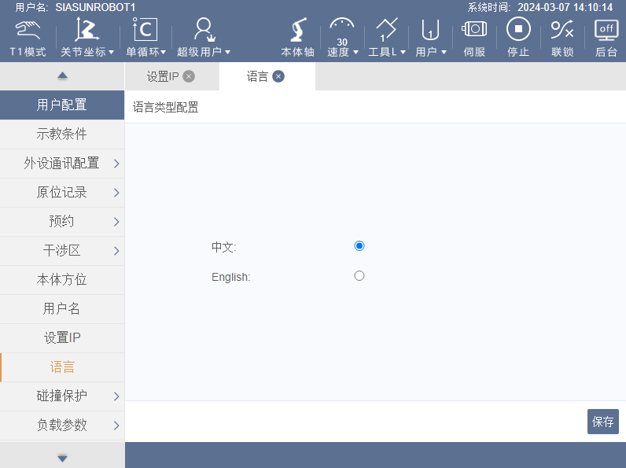

图 8‑71语言类型配置界面

1. 选择所需语言后，按【保存】按钮保存。然后示教器会自动切换到用户选择的语言。

| **注意：****应用类显示界面目前暂不支持英文语言。** |
| --- |

## 更换CFast卡

当机器人需要软件版本升级或者变更时，需要更换CF卡。在更换CFast卡之前，需要配置机器人信息，新卡插入机器人后，需要进行相应的配置。

**机器人备份信息步骤：**

1. 更换机器人CFast之前,应先对机器人各项参数进行备份.将原厂自带U盘插入USB接口.点击主菜单【备份恢复】。将此菜单下的各项子菜单内容全部进行备份，并将作业单独上传。

| **注意：****备份信息请使用新松原厂自带的U盘，以保证数据安全，同时保证板卡安全。** |
| --- |

1. 插入U盘后，第一次打备份子菜单，会提示系统挂载成功。

| 按这里弹出CFast卡USB接口 |
| --- |

图 8‑72主板接口位置

1. 然后分别备份【参数】【位置变量】【作业上传】这三个界面的全部内容 (建议最好全部备份) 。

 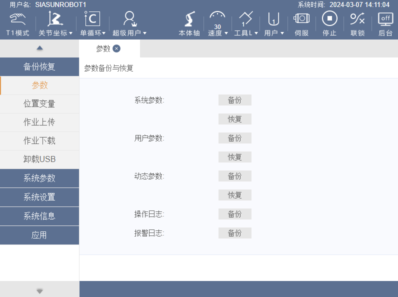

图 8‑73机器人各项备份界面

| **注意：****参数、位置变量、作业上传这三个界面的参数建议全部备份。** |
| --- |

1. 点击【作业上传】，按作业名分别上传每个作业（建议作业最好单个备份）。

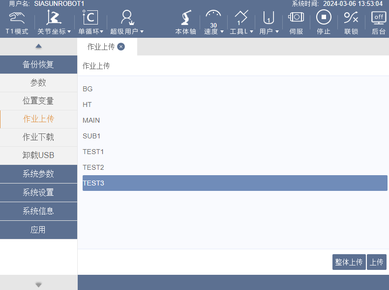

图 8‑74机器人上传作业菜单

1. 进入【系统设置】\-【校零】\-【零位设定】界面，记录机器人零位码盘值（建议拍照存档）。

图 8‑75机器人零位位置界面

1. 点击【系统设置】\-【应用配置】，输入密码“sysiasun”，进入应用配置界面，查看之前是否配置过应用（建议拍照存档）。

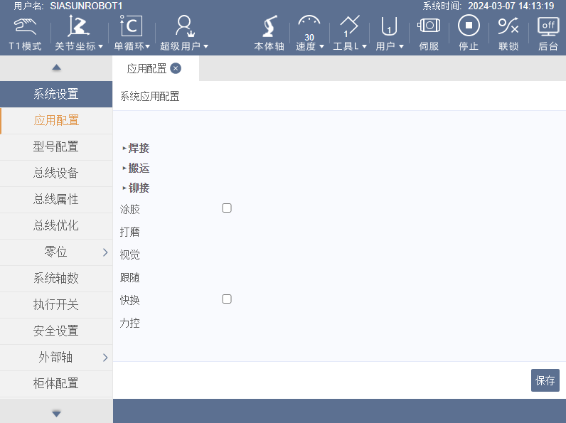

图 8‑76应用配置界面

1. 点击【系统设置】\-【型号配置】，输入密码“sysiasun”，进入机器人型号配置界面。查看对应的型号。（建议拍照存档）

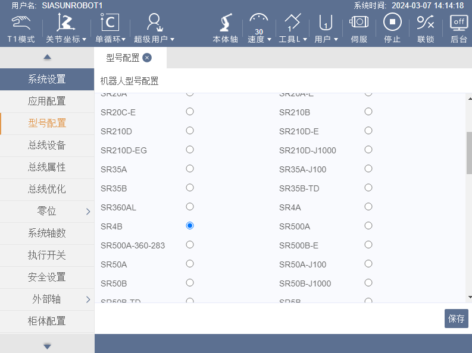

图 8‑77机器人型号配置界面

**机器人更换CFast卡步骤：**

1. 将机器人电源关闭，打开控制柜门，将CFast卡拔出，并插入新卡。开机进入【超级用户】。
2. 清除内存。
3. 将之前备份好参数的U盘插入主板，点击主菜单【备份恢复】，进入【参数】界面，单击系统参数的【恢复】按钮恢复系统参数。看到系统参数恢复成功提示后，重新启动机器人。重启后请查看机器人型号，是否与之前备份的型号一致。一致为系统参数恢复成功。

图 8‑78系统参数恢复界面

1. 点击主菜单【系统设置】\-【柜体配置】，输入密码“sysiasun”，进入机器人控制柜型号配置界面。选择对应的型号，点击【保存】。提示成功后，重新启动机器人。

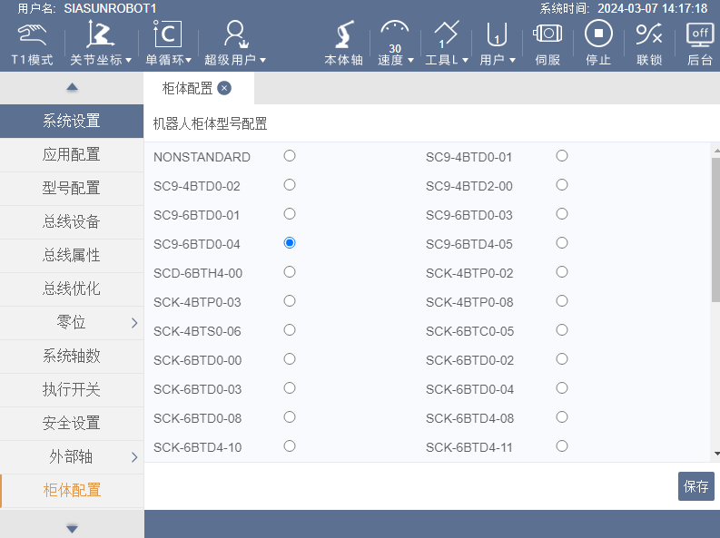

图 8‑79控制柜型号配置界面

1. 点击主菜单【备份恢复】，进入【参数】界面，单击用户参数的【恢复】按钮恢复用户参数。看到用户参数恢复成功提示后，重新启动机器人。

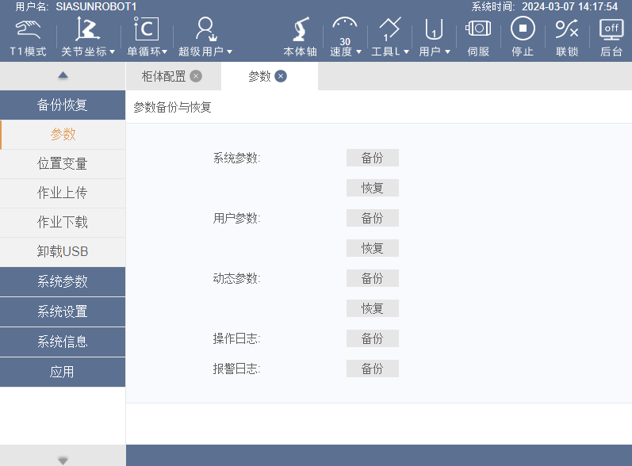

图 8‑80用户参数恢复界面

1. 最后恢复动态参数、恢复位置变量、单个恢复作业，并重启机器人。

| **注意：以上步骤全部完成后，先查看一下机器人零位，查看与机器人本体上的标签数值是否相同。恢复作业后，要手动、慢速仔细检查每一行指令，在自动运行之前一定要确保安全。** |
| --- |

# **附录**

## 基础指令表

### I/O类指令

| OUT OT\# | 功能 | IO输出，单个IO | | | | | | |
| --- | --- | --- | --- | --- | --- | --- | --- | --- |
| 格式 | OUT \#\<参数1\>\=\<参数2\> | | | | | | |
| 说明 | 参数1 | | | | \<IO号\>，IO号范围1\-4096 | | |
| 参数2 | | | | \<IO状态\>，OFF代表断开机器人输出信号，ON代表接通机器人输出信号 | | |
| 举例 | OUT OT\#1 \=ONOUT OT\#2 \=OFF | | | | | | |
| OUT OG | 功能 | IO输出，8位组IO | | | | | | |
| 格式 | OUT OG\#\<参数1\>\=\<参数2\> | | | | | | |
| 说明 | 参数1 | | | | \<8位组IO号\>，组IO号范围1\-8 | | |
| 参数2 | | | | \<组IO数值\>，常数范围0\-255，组IO的信号可通过界面进行配置，详细信息请参照本手册中2\.1\.2 组I/O章节 | | |
| 举例 | OUT OG\#1 \=100 | | | | | | |
| OUT OGH | 功能 | IO输出，16位组IO | | | | | | |
| 格式 | OUT OGH\#\<参数1\>\=\<参数2\> | | | | | | |
| 说明 | 参数1 | | | | \<16位组IO号\>，组IO号范围1\-256 | | |
|  | 参数2 | | | | \<16位组IO号\>，无需配置，1到16为第一组，17到32为第二组，总共支持256组，常数范围0\-65535 | | |
| 举例 | OUT OGH\#1 \=10000 | | | | | | |
| OUT OGFA\#R | 功能 | IO输出，实型变量赋值OGFA给32位组IO | | | | | | |
| 格式 | OUT OGFA\#\<参数1\>\=R\<参数2\> | | | | | | |
| 说明 | 参数1 | | | | \<32位组IO号\>，组IO号范围1\-128，OGFA为32位组IO，无需配置，1到32为第一组，33到64为第二组，总共支持128组 | | |
| 参数2 | | | | \<实型变量号\>，实型变量R的范围1\-520 | | |
| 举例 | OUT OGFA\#2 \= R1 | | | | | | |
| OUT OGFA\#I | 功能 | IO输出，整型变量赋值OGFA给32位组IO | | | | | | |
| 格式 | OUT OGFA\#\<参数1\>\=I\<参数2\> | | | | | | |
| 说明 | 参数1 | | | | \<32位组IO号\>，组IO号范围1\-128，OGFA为32位组IO，无需配置，1到32为第一组，33到64为第二组，总共支持128组 | | |
| 参数2 | | | | \<整型变量号\>，整型变量I的范围1\-520 | | |
| 举例 | OUT OGFA\#2 \= I1 | | | | | | |
| OUT OG\# | 功能 | IO输出，整型变量赋值给8位组IO | | | | | | |
| 格式 | OUT OG\#\<参数1\>\=I\<参数2\> | | | | | | |
| 说明 | 参数1 | | | | \<8位组IO号\>，组IO号范围1\-8,G为8位组IO，组IO中的IO位号可以通过界面配置 | | |
| 参数2 | | | | \<整型变量号\>，整型变量I的范围1\-520 | | |
| 举例 | OUT OG\#1 \=I100 | | | | | | |
| OUT OGH\# | 功能 | IO输出，整型变量赋值给16位组IO | | | | | | |
| 格式 | OUT OGH\#\<参数1\>\=I\<参数2\> | | | | | | |
| 说明 | 参数1 | | | | \<16位组IO号\>，无需配置，1到16为第一组，17到32为第二组，总共支持256组，常数范围0\-65535 | | |
| 参数2 | | | | \<整型变量号\>，整型变量I的范围1\-520 | | |
| 举例 | OUT OGH\#1 \=I100 | | | | | | |
| OUT OGFA\#整数 | 功能 | IO输出，将整数赋值OGFA给32位组IO | | | | | | |
| 格式 | OUT OGFA\#\<参数1\>\=\<参数2\> | | | | | | |
| 说明 | 参数1 | | | | \<32位组IO号\>，组IO号范围1\-128，OGFA为32位组IO，无需配置，1到32为第一组，33到64为第二组，总共支持128组 | | |
| 参数2 | | | | 整数 | | |
| 举例 | OUT OGFA\#2 \= 100 | | | | | | |
| OUT OGFA\#实数 | 功能 | IO输出，将实数赋值OGFA给32位组IO | | | | | | |
| 格式 | OUT OGFA\#\<参数1\>\=\<参数2\> | | | | | | |
| 说明 | 参数1 | | | | \<32位组IO号\>，组IO号范围1\-128，OGFA为32位组IO，无需配置，1到32为第一组，33到64为第二组，总共支持128组 | | |
| 参数2 | | | | 实数 | | |
| 举例 | OUT OGFA\#2 \= 99\.999 | | | | | | |
| OUT I\# | 功能 | IO输出，整形变量里的值为IO号。 | | | | | | |
| 格式 | OUT I\#\<参数1\>\=\<参数2\> | | | | | | |
| 说明 | 参数1 | | | | \<整型变量号\>，整型变量I的范围1\-520 | | |
| 参数2 | | | | 状态，ON/OFF | | |
| 举例 | OUT I\#2 \= ON | | | | | | |
| OUT\_P OTOGOGHOG\#OGH\#OGFA\#ROGFA\#I | 功能 | IO输出，路径中输出IO，根据距离输出。下面只介绍OT，其它类型选项与上面介绍的OUT指令使用方式相同。 | | | | | | |
| 格式 | OUT\_P OT\#\<参数1\>\=\<参数2\> D\=\<参数3\> | | | | | | |
| 说明 | 参数1 | | | | \<IO号\>，IO号范围1\-4096 | | |
| 参数2 | | | | \<IO状态\>，0代表断开机器人输出信号，1代表接通机器人输出信号 | | |
| 参数3 | | | | 正数时，信号指令是基于上一个目标位置，向下一个位置行走，达到距离时下发。负数时，信号指令是基于向上一个目标位置行走，剩余距离时下发。单位mm，范围\-1000\-1000 | | |
| 举例 | MOVL P1 VL\=600 ACC\=20 CNT\=100OUT\_P OT\#1 \=1 D\=1\.0 P1向下一点走1mm的位置输出MOVL P2 VL\=600 ACC\=20 CNT\=100 | | | | | | |
| OUT\_TOTOGOGHOG\#OGH\#OGFA\#ROGFA\#I | 功能 | IO输出，路径中输出IO，根据时间输出；下面只介绍OT，其它类型选项与上面介绍的OUT指令使用方式相同。 | | | | | | |
| 格式 | OUT\_T OT\#\<参数1\>\=\<参数2\> T\=\<参数3\> | | | | | | |
| 说明 | 参数1 | | | | \<IO号\>，IO号范围1\-4096 | | |
| 参数2 | | | | \<IO状态\>，0代表断开机器人输出信号，1代表接通机器人输出信号 | | |
| 参数3 | | | | 正数时，信号指令是基于上一个目标位置，向下一个位置行走，达到时间时下发。负数时，信号指令是基于向上一个目标位置行走，剩余时间时下发。单位s，范围\-30\.0\-30\.0 | | |
| 举例 | MOVL P1 VL\=600 ACC\=20 CNT\=100OUT\_T OT\#1 \=1 T\=1\.0 P1向下一点走1s时输出MOVL P2 VL\=600 ACC\=20 CNT\=100 | | | | | | |
| IRQ ON | 功能 | 当触发条件满足瞬间，执行中断程序。 | | | | | | |
| 格式 | IRQON LEV\<参数1\>\<参数2\>\<比较符\>\<参数3\>\<参数4\> | | | | | | |
| 说明 | 参数1 | | | | | \<优先级\>：低优先级中断程序再执行时，可以继续触发高优先级中断程序执行；高优先级中断程序在执行时，不能触发执行低优先级中断程序。优先级范围1\-100,1为最高优先级。 | |
| 参数2 | | | | | \<触发条件\>:IN\#\<输入信号\>，范围1\-5630OT\#\<输出信号\>，范围1\-5630R\<实型变量号\>，范围1\-520I\<整型变量号\>，范围1\-520触发条件从不满足到满足的瞬间，可以触发执行中断程序；如果触发条件一直满足，则不能执行中断程序。 | |
| 比较符 | | | | | IN\#\<输入信号\>，对应的比较符为‘\=’OT\#\<输出信号\>，对应的比较符为‘\=’R\<实型变量号\>，对应的比较符为‘\=\=’、‘＞’、‘＜’、‘＜＞’I\<整型变量号\>，对应的比较符为‘\=\=’、‘＞’、‘＜’、‘＜＞’ | |
| 参数3 | | | | | IN\#\<输入信号\>，ON或OFF OT\#\<输出信号\>， ON或OFFR\<实型变量号\>，可以为常数也可为另外一个实型变量，常数范围为\-9999\.999\-9999\.999，实型变量号的范围为1\-520I\<整型变量号\>，可以为常数也可为另外一个整型变量，常数范围为\-2147483648\-2147483648，整型变量号的范围为1\-520 | |
| 参数4 | | | | | 触发条件满足瞬间将执行的程序名。在IRQON和IRQOFF之间，程序属于中断程序，不能用CALL指令调用；在此之外，程序不再属于中断程序，可以被CALL指令调用。 | |
| 举例 | IRQON LEV\=1 IN\#10\=1 SUB1IRQON LEV\=1 OT\#10\=1 SUB1IRQON LEV\=1 R1\= \=10\.500 SUB1IRQON LEV\=1 R1＞R2 SUB1IRQON LEV\=1 I1\= \=10 SUB1IRQON LEV\=1 I1＞I2 SUB1 | | | | | | |
| IRQ OFF | 功能 | 关闭指定优先级的中断。 | | | | | | |
| 格式 | IRQOFF LEV\=\<参数项\> | | | | | | |
| 说明 | 参数项 | | 含义：中断的优先级。范围：1\-100。 | | | | |
| 举例 | IRQOFF LEV\=34 | | | | | | |
| DIN B\# | 功能 | 将输入IO位状态赋值给字节变量。输入信号为ON则变量为1，输入信号为OFF则变量为0。 | | | | | | |
| 格式 | DIN B\<参数1\> IN\#\<参数2\> | | | | | | |
| 说明 | 参数1 | | | | | | \<字节型用户变量号\>，范围1\-100 |
| 参数2 | | | | | | \<IO号\>，范围1\-4096 |
| 举例 | DIN B1 IN\#1 | | | | | | |
| DIN BG | 功能 | 将输入组IO状态赋值给字节变量。 | | | | | | |
| 格式 | DIN B \<参数1\> IG\#\<参数2\> | | | | | | |
| 说明 | 参数1 | | | | | | \<字节型用户变量号\>，范围1\-100 |
| 参数2 | | | | | | \<输入组号\>，范围1\-8 |
| 举例 | DIN B1 IG\#1 | | | | | | |
| PULSE | 功能 | 输出IO状态，并保持一定时间后复位 | | | | | | |
| 格式 | PULSE OT\#\<参数1\>\=\<参数2\> T\=\<参数3\> | | | | | | |
| 说明 | 参数1 | | | | | \<IO号\>，IO号范围1\-4096 | |
| 参数2 | | | | | \<IO状态\>，OFF代表断开机器人输出信号，ON代表接通机器人输出信号 | |
| 参数3 | | | | | 含义：等待时间。表示保持信号的时间，过了该时间信号复位，单位：s，范围0\-999\.000 | |
| 举例 | PULSE OT\#30\=ON T\=1把30号用户IO置为ON，并保持1秒钟后复位为OFF. 如果30信号本来就是ON状态，不会将30信号先置为OFF，再置为ON，而是直接从指令执行开始时计时1秒，计时结束后将30信号置为OFF，并且一直保持OFF状态，直到执行到对30信号的其它处理指令 | | | | | | |
| WAIT | 功能 | 等待条件满足。 | | | | | | |
| 格式 | WAIT \<参数1\>\=\<参数2\> T\=\<参数3\> | | | | | | |
| 说明 | 参数1 | | | \<等待条件\>IN\#\<输入号\>，范围1\-4096OUT\#\<输出号\>，范围1\-4096IG\<8位组输入号\>，范围1\-8OG\<8位组输出号\>，范围1\-8IGH\<16位组输入号\>，范围1\-256OGH\<16位组输出号\>，范围1\-256IGH\_I\<16位组输出号\>，范围1\-256OGH\_I\<16位组输出号\>，范围1\-256IGFA\_R\<32位组输出号\>，范围1\-128IG\_I\<8位组输出号\>，范围1\-8OG\_I\<8位组输出号\>，范围1\-8IGFA\_I\<32位组输出号\>，范围1\-128IGH\_I\_INTERLOCK\<16位组输出号\>，范围1\-256I\<整形变量号\>，范围1\-520 | | | |
| 参数2 | | | \<等待条件的值\>IN\#\=\<输入信号值\>，OFF信号为低电平时，条件满足；ON入信号为高电平时，条件满足;OUT\#\=\<输出信号值\>，OFF信号为低电平时，条件满足；ON入信号为高电平时，条件满足；IG\=\<8位组输入的值\>，范围1\-255OG\=\<8位组输出号的值\>，范围1\-255IGH\=\<16位组输入号的值\>，范围1\-65535OGH\=\<16位组输出号的值\>，范围1\-65535IGH\_I\=\<16位组输入号的值\>，范围1\-520OGH\_I\=\<16位组输出号的值\>，范围1\-520IGFA\_R\=\<32位组输入号的值\>,范围1\-520IG\_I\=I\<8位组输出号\>，范围1\-520OG\_I\=I\<8位组输出号\>，范围1\-520IGFA\_I\=I\<32位组输出号\>，范围1\-520IGH\_I\_INTERLOCK\=I\<16位组输出号\>，范围1\-520I\#\=\<整形变量号\>，OFF信号为低电平时，条件满足；ON入信号为高电平时，条件满足; | | | |
| 参数3 | | | \<等待持续时间\>正数表示等待到设置时间就不再等待继续向下执行；范围\-1～999，单位：S，负数只能输入\-1，表示一直等待，直到条件被等到。 | | | |
| 举例 | WAIT IN\#1\=ON T\=\-1WAIT OT\#1\=OFF T\=10WAIT IG\#1\=100 T\=\-1WAIT OG\#1\=100 T\=10WAIT IGH\#1\=10000 T\=\-1WAIT OGH\#1\=10000 T\=10WAIT IGH\#1\=I1 T\=10WAIT OGH\#1\=I1 T\=10WAIT IGFA\#1\=R1 T\=\-1WAIT IG\#5\=I5 T\=10WAIT OG\#5\=I5 T\=10WAIT IGFA\#4\=I5 T\=10WAIT INTERLOCK IGH\#1\=I1 T\=10WAIT I\#1\=ON T\=\-1 | | | | | | |
| AINR | 功能 | 将AI模块的指定通道的AI值存入实型变量R中 | | | | | | |
| 格式 | AIN R\<参数1\> AI\<参数2\> | | | | | | |
| 说明 | 参数1 | R变量号，范围1\-520。 | | | | | |
| 参数2 | 模拟量输入文件号，范围1\-40 | | | | | |
| 举例 | AIN R1 AI1 把模拟量输入文件1的值存在R1中。 | | | | | | |
| AOUT（C） | 功能 | AO模块的指定文件按照指定的AO变量的值进行输出 | | | | | | |
| 格式 | AOUT AO\<参数1\> \= \<参数2\> | | | | | | |
| 说明 | 参数1 | 输出文件号，范围1\-40。 | | | | | |
| 参数2 | 常数 | | | | | |
| 举例 | AOUT AO1 \=5\.0 把常数5通过输出文件1进行输出。 | | | | | | |
| AOUT（R） | 功能 | 将R变量的值通过指定的AO文件输出。 | | | | | | |
| 格式 | AOUT AO\<参数1\> \=R\<参数2\> | | | | | | |
| 说明 | 参数1 | 输出文件号，范围1\-40。 | | | | | |
| 参数2 | 实型变量号，范围1\-520 | | | | | |
| 举例 | AOUT AO1 R1 把变量R1的值通过输出文件1进行输出。 | | | | | | |

### 控制类1

| GOTO | 功能 | 无条件跳转到标签处执行 | | | |
| --- | --- | --- | --- | --- | --- |
| 格式 | GOTO L\<参数项\> | | | |
| 说明 | 参数项 | | 含义：标签号,范围1\-999 | |
| 举例 | NOPGOTO L50 //无条件跳转至L50位置MOVJ P1 VJ\=10 //跳过此条运动指令，不会被执行L50 //标明位置MOVJ P2 VJ\=5 //此指令会作为第一条运动指令执行MOVJ P3 VJ\=5 //此指令会作为第二条运动指令执行END | | | |
| LABEL | 功能 | 标签，标明指令条件满足时，要跳转到的指令位置 | | | |
| 格式 | L\<参数项\> | | | |
| 说明 | 参数项 | | | 含义：用于区别其它标签，是整数类型。范围1\-999 |
| 举例 | NOPGOTO L50 //无条件跳转至L50位置MOVJ P1 VJ\=10 //跳过此条运动指令，此条指令不会被执行L50 //标明位置MOVJ P2 VJ\=5 //此指令会作为第一条运动指令执行MOVJ P3 VJ\=5 //此指令会作为第二条运动指令执行END | | | |
| WHILE | 功能 | 如果条件满足跳转到标签处执行，否则继续执行下一行。达到条件后计数变量重新开始计数。当执行到这条程序时，自动计数，达到条件后内部计数会自动清零，无法手动清除。暂停不清除计数。其它方式再次执行程序后计数清除。 | | | |
| 格式 | WHILE N \<\<参数1\> L\<参数2\> | | | |
| 说明 | 参数1 | | | 含义：整数 |
| 参数2 | | | 含义：整数类型 |
| 举例 | NOPMOVJ P1 VJ\=10WHILE N\<5 L30 //当循环次数小于5次时，跳转到L30位置MOVJ P2 VJ\=20 //当循环次数大于等于5次时，才会执行此步骤L30MOVJ P3 VJ\=10END | | | |
| DELAY | 功能 | 延时一段时间。在延时时间内机器人无任何动作。 | | | |
| 格式 | DELAY T\=\<参数项\> | | | |
| 说明 | 参数项 | | | 含义：延时的时间。单位：s范围：0～999\.000 |
| 举例 | NOPMOVJ P1 VJ\=10 DELAY T\=0\.500 //16ms每拍时，延时0\.512秒；4ms每拍时，延时0\.5秒MOVJ P2 VJ\=5 DELAY T\=2\.000 END | | | |
| IF IO | 功能 | 如果IO信号满足条件，则作业跳转到标签处执行，否则继续执行下一行。 | | | |
| 格式 | IF \<参数1\> \= \<参数2\> L\<参数3\> | | | |
| 说明 | 参数1 | | | \<条件转移判断信号类型\>IN\#\<输入号\>，范围1\-4096OT\#\<输出号\>，范围1\-4096IG\<8位组输入号\>，范围1\-8OG\<8位组输出号\>，范围1\-8IGH\<16位组输入号\>，范围1\-256OGH\<16位组输出号\>，范围1\-256OGFA\_I\<32位组输入号\>，范围1\-128IGFA\_I\<32位组输入号\>，范围1\-128OGFA\_R\<32位组输入号\>，范围1\-128IGFA\_R\<32位组输入号\>，范围1\-128 |
| 参数2 | | | \<条件转移判断信号的值\>IN\#\=\<输入信号状态\>，0为输入信号为低电平时，条件满足；1为输入信号为高电平时，条件满足OUT\#\=\<输出信号状态\>，0为输入信号为低电平时，条件满足；1为输入信号为高电平时，条件满足IG\=\<8位组输入的值\>，范围0\-255OG\=\<8位组输出号的值\>，范围0\-255IGH\=\<16位组输入号的值\>，范围0\-65535OGH\=\<16位组输出号的值\>，范围0\-65535OGFA\=I\<变量号\>，范围1\-520IGFA\=I\<变量号\>，范围1\-520OGFA\=R\<变量号\>，范围1\-520IGFA\=R\<变量号\>，范围1\-520 |
| 参数3 | | | 含义：标签号，范围1\-999 |
| 举例 | IF IN\#1\=1 L1IF OT\#1\=1 L1IF IG\#1\=100 L1IF OG\#1\=100 L1IF IGH\#1\=2000 L1IF OGH\#1\=2000 L1 | | | |
| IF I | 功能 | 如果整型变量满足比较条件，则作业跳转到标签处执行，否则继续执行IF指令的下一行指令。 | | | |
| 格式 | IF \<参数1\>\<比较符\>\<参数2\> L\<参数3\> | | | |
| 说明 | 参数1 | | | I\<整型变量号\>，范围1\-520 |
| 比较符 | | | \=\=：相等\>：大于\<：小于\<\>：不等于 |
| 参数2 | | | \<常数\>，范围\-2147483648～2147483648或I\<整型变量\>，范围1\-520 |
| 参数3 | | | 含义：标签号，范围1\-999 |
| 举例 | IF I1\= \=100 L1IF I1＞100 L1IF I1＜100 L1IF I1＜＞100 L1IF I1\= \=I2 L1IF I1＞I2 L1IF I1＜I2 L1IF I1＜＞I2 L1 | | | |
| IF R | 功能 | 如果实型变量满足比较条件，则作业跳转到标签处执行，否则继续执行IF指令的下一行指令。 | | | |
| 格式 | IF \<参数1\>\<比较符\>\<参数2\> L\<参数3\> | | | |
| 说明 | 参数1 | | | R\<实型变量号\>，范围1\-520 |
| 比较符 | | | \=\=：相等\>：大于\<：小于\<\>：不等于 |
| 参数2 | | | \<常数\>，范围\-9999\.999～9999\.999或R\<实型变量\>，范围1\-520 |
| 参数3 | | | 含义：标签号，范围1\-999 |
| 举例 | IF R1\= \=100 L1IF R1＞100 L1IF R1＜100 L1IF R1＜＞100 L1IF R1\= \=R2 L1IF R1＞R2 L1IF R1＜R2 L1IF R1＜＞R2 L1 | | | |
| IF B | 功能 | 如果字节型变量满足比较条件，则作业跳转到标签处执行，否则继续执行IF指令的下一行指令。 | | | |
| 格式 | IF \<参数1\>\<比较符\>\<参数2\> L\<参数3\> | | | |
| 说明 | 参数1 | | | B\<字节型变量号\>，范围1\-100 |
| 比较符 | | | \=\=：相等\>：大于\<：小于\<\>：不等于 |
| 参数2 | | | B\<字节型变量\>，范围1\-100 |
| 参数3 | | | 含义：标签号，范围1\-999 |
| 举例 | ·IF B1\= \=B2 L1·IF B1＞B2 L1·IF B1＜B2 L1·IF B1＜＞B2 L1 | | | |
| IF SI | 功能 | 如果系统整型变量满足条件，则作业跳转到标签处执行，否则继续执行下一行。 | | | |
| 格式 | IF SI\<参数1\> \=\= \<参数2\> L\<参数3\> | | | |
| 说明 | 参数1 | | | \<系统整型变量号\>，范围1\-100 |
| 参数2 | | | 常数，范围\-99999～99999 |
| 参数3 | | | 含义：标签号, 范围1\-999 |
| 举例 | IF SI2\=\=20 L2 | | | |
| START BG | 功能 | 启动后台程序 | | | |
| 格式 | START BG | | | |
| 说明 | 前提是使用菜单启动的后台程序，没有通过菜单关闭，这样才能通过指令开启后台程序，可用STOP BG停止的后台程序。 | | | |
| 举例 | NOPSTART BG //启动后台作业MOVJ P1 VJ\=10DELAY T\=1MOVJ P2 VJ\=10DELAY T\=1STOP BG //停止后台作业END | | | |
| STOP BG | 功能 | 关闭后台程序 | | | |
| 格式 | STOP BG | | | |
| 说明 | 通过这条指令关闭后台程序 | | | |
| 举例 | NOPSTART BG //启动后台作业MOVJ P1 VJ\=10DELAY T\=1MOVJ P2 VJ\=10DELAY T\=1STOP BG //停止后台作业END | | | |
| MACRO | 功能 | 宏程序调用宏程序里只能编写逻辑语句，不能添加运动相关语句与延时语句。 | | | |
| 格式 | MACRO \<参数项\> | | | |
| 说明 | 参数项 | | | 宏指令参数，范围1\-999 |
| 举例 | MACRO 1将调用程序名为MACRO1的程序。 | | | |
| COMMENT | 功能 | 加入注释，不影响程序运行，仅供查看 | | | |
| 格式 | ；\<注释内容\> | | | |
| 说明 | 注释内容 | | | 分号后输入注释内容，示教器可添加中英文及符合注释等。 |
| 举例 | ；JOB FINISH；等待气缸到位 | | | |
| RET | 功能 | 从子作业返回主作业。子作业中最后一行必须有这条指令，若不加这条指令，执行到子程序中END处机器人将停止，不会返回上一级程序。主作业中最后一行不能有这条指令，一个作业不能即做主作业又做子作业。 | | | |
| 格式 | RET | | | |
| 说明 | 无参数 | | | |
| 举例 | //此作业只能是子作业NOPDELAY T\=2RET //返回母作业，并且从调用子作业的位置向下继续执行END | | | |
| DYNAMICPAYLOAD | 功能 | 调用负载参数文件号。 | | | |
| 格式 | PAYLOAD \#\<参数项\> | | | |
| 说明 | 参数项：为负载参数的文件号，参数范围（1\-16）。 | | | |
| 举例 | PAYLOAD \#1调用负载参数文件号1。 | | | |
| DYNAMICSETSENS | 功能 | 设置灵敏度指令，设置每个单独轴的灵敏度。 | | | |
| 格式 | SETSENS Axes\=\<参数项1\>,Value \=\<参数项2\> | | | |
| 说明 | 参数项1 | 参数 Axes表示机器人系统轴号，根据机器人实际的系统轴数确定参数范围，N轴系统就是(0\-N)，参数范围最大为（0\-12）。当轴号参数填写为0时，该指令表示设置所有轴灵敏度。 | | |
| 参数项2 | Value表示灵敏度值，参数范围为（0\-250），0为无效，靠电机转矩达到数值后停止。数值越小越灵敏。设置这个值时需要考虑机器人的运行速度。 | | |
| 举例 | SETSENS Axes\=1,Value \= 100 设置1轴灵敏度为100 SETSENS Axes\=0,Value \= 1 设置1\-6轴灵敏度均为1 | | | |
| DYNAMICCOLL\_ON | 功能 | 开启碰撞检测功能自动执行程序时，想要开启碰撞检测功能，需要添加指令。 | | | |
| 格式 | COLL\_ON | | | |
| 说明 | 使用之前，需要在碰撞保护功能的执行灵敏度页面进行设置或在程序中通过SETSENS指令设置灵敏度后才能使用。 | | | |
| 举例 | COLL\_ONMOVJ P1 VJ\=99 AMOVJ P2 VJ\=99 BMOVJ P3 VJ\=99 C COLL\_OFFMOVJ P4 VJ\=99 DA,B,C点碰撞保护功能检测，D点不检测。 | | | |
| COLLISION | 功能 | 自学习碰撞检测指令 | | | |
| 格式 | COLLISION NO\= \<参数1\> ADJ\=\<参数2\> | | | |
| 说明 | 参数1：检测区域编号； | | | |
| 参数2：微调百分比 | | | |
| 举例 | COLLISION NO\=10 ADJ\=10 | | | |
| COLLISION OFF | 功能 | 自学习碰撞检测关闭指令 | | | |
| 格式 | COLLISION OFF | | | |
| 说明 | 关闭碰撞检测功能 | | | |
| 举例 | COLLISION OFF | | | |
| DYNAMICCOLL\_OFF | 功能 | 关闭碰撞检测功能 | | | |
| 格式 | COLL\_OFF | | | |
| 说明 | 关闭已打开的碰撞检测功能 | | | |
| 举例 | COLL\_OFF | | | |
| SELECT | 功能 | 条件选择指令由多个寄存器比较指令构成。条件选择指令,将寄存器的值与一个或几个值进行比较,选择比较正确的语句,执行处理。如果寄存器的值与其中一个值一致,则执行与该值相对应的跳跃指令或者子程序调用指令。如果寄存器的值与任何一个值都不一致,则执行与ELSE(其它)相对应的跳跃指令或者子程序调用指令。 | | | |
| 格式 | SELECT R\<参数1\>\=\=\<参数2\> CALL/GOTO\<参数3\> | | | |
| 说明 | 参数1 | R\<变量号\>：用户实型变量,范围1\-520 | | |
| 参数2 | 常数，范围\-9999\.999\-10000R\<变量号\>：用户实型变量，范围1\-520 | | |
| 参数3 | CALL SUB1作业名称GOTO L10跳转标签 | | |
| 举例 | SELECT R1 \=\= R10 CALL SUB1SELECT R2 \=\= R11 GOTO L10SELECT R3\=\= 5\.000 CALL SUB2SELECT R4 \=\= 1\.000 GOTO L11\=\= R4 CALL SUB3\=\= R5 GOTO L12\=\= 6\.000 CALL SUB4\=\= 7\.000 GOTO L13 | | | |
| ELSE | 功能 | 上一条必须是SELECT指令，SELECT不满足条件时，执行ELSE指令。 | | | |
| 格式 | ELSE CALL/GOTO \<参数项\> | | | |
| 说明 | 参数项 | | | CALL SUB1作业名称GOTO L10跳转标签 |
| 举例 | ELSE CALL SUB5 ELSE GOTO L1 | | | |
| IF THEN | 功能 | 满足条件向下执行，遇到ELSE IF/ELSE跳到ENDIF上；不满足条件跳到ELSE IF/ELSE/ENDIF指令上； | | | |
| 格式 | IF THEN \<参数1\>\=\<参数2\> | | | |
| 说明 | 参数1 | R\<变量号\>：实型变量,范围1\-520R\<变量号\>：实型变量,范围1\-520IN\#\<输入号\>，范围1\-4096IGH\<16位组输入号\>，范围1\-256IGH\_I\<16位组输出号\>，范围1\-256IGFA\_I\<32位组输出号\>，范围1\-128IGFA\_R\<32位组输出号\>，范围1\-128 | | |
| 参数2 | 常数，范围\-9999\.999\-10000R\<变量号\>：实型变量,范围1\-520ON/OFFIGH\=常数，范围1\-65535IGH\_\= I整形变量，范围1\-520IGFA\= I整形变量,范围1\-520IGFA\= R实型变量,范围1\-520 | | |
| 举例 | IF THEN R4 \= \= 1\.000R4 \= \= 1\.000IF THEN R4 \=\=R11IF THEN IN\#30 \=ONIF THEN IGH\#1 \=00IF THEN IGH\#1 \=\=l1IF THEN IGFA\#1 \=\=l1IF THEN IGFA\#1 \=\=R11 | | | |
| ELSE IF | 功能 | 前面必须有IF THEN，当IF THEN不满足条件时，跳到ELSE IF上判断ELSE IF是否满足条件，满足条件向下执行，不满足条件跳到下一个ELSE IF上判断或者跳到ENDIF上。 | | | |
| 格式 | ELSE IF \<参数1\>\=\<参数2\> | | | |
| 说明 | 参数1 | R\<变量号\>：实型变量,范围1\-520R\<变量号\>：实型变量,范围1\-520IN\#\<输入号\>，范围1\-4096IGH\<16位组输入号\>，范围1\-256IGH\_I\<16位组输出号\>，范围1\-256IGFA\_I\<32位组输出号\>，范围1\-128IGFA\_R\<32位组输出号\>，范围1\-128 | | |
| 参数2 | 常数，范围\-9999\.999\-10000R\<变量号\>：实型变量,范围1\-520ON/OFFIGH\=常数，范围1\-65535IGH\_\= I整形变量，范围1\-520IGFA\= I整形变量,范围1\-520IGFA\= R实型变量,范围1\-520 | | |
| 举例 | ELSE IF R4 \= \= 1\.000ELSE IF R4 \=\=R11ELSE IF IN\#30 \=ONELSE IF IGH\#1 \=00ELSE IF IGH\#1 \=\=l1ELSE IF IGFA\#1 \=\=l1ELSE IF IGFA\#1 \=\=R11 | | | |
| ELSE | 功能 | 可在IF THEN/ELSE IF后使用。IF THEN/ELSE IF满足条件时，执行到ELSE上后跳转到ENDIF指令上；IF THEN/ELSE IF不满足条件时，跳到ELSE上向下执行； | | | |
| 格式 | ELSE | | | |
| ENDIF | 功能 | 与IF THEN组合使用，表示IF THEN/ELSE IF THEN/ELSE指令的完成 | | | |
| 格式 | ENDIF | | | |

### 控制类2

| CALL | 功能 | 调用子作业 | | | |
| --- | --- | --- | --- | --- | --- |
| 格式 | CALL \<调用条件\>\<子作业名\> | | | |
| 说明 | 调用条件 | | | 无条件直接调用子作业IN\#\<输入信号\>\=\<状态值\>，范围1\-1280，状态值为0或1IG\#\<8位组输入组号\>\=常数，组号范围1\-8，常数范围0\-255IGH\#\<16位组输入组号\>\=常数，组号范围1\-64，常数范围0\-65535I\<整形变量号\>\=常数，整形变量范围1\-520，常数范围\-99999～99999IGH\#\<16位组输入组号\>\=I变量，组号范围1\-64，I变量范围1\-520OGH\#\<16位组输入组号\>\=I变量，组号范围1\-64，I变量范围1\-520OGFA\#\<32位组输入号\>\=R变量，组号范围1\-128, R变量范围1\-520STR\<字符串变量\>\=参数，常数范围0\-60 |
| 举例 | CALL SUB1CALL IN\#1\=1 SUB1CALL IG\#1\=100 SUB1CALL IGH\#20\=2000 SUB1CALL I1\= \=50 SUB1CALL STR1 调用字符串变量对应的程序同时须新建另一作业SUB1：NOPDELAY T\=2RET //返回母作业，并且从CALL指令的下一条指令继续执行END | | | |
| SHIFT P | 功能 | 以设定的坐标系按位置变量中的值进行偏移 | | | |
| 格式 | SHIFTON PR\<参数1\> F\#\<参数2\> | | | |
| 说明 | 参数1 | | | 位置变量号，参数范围（1\-5630）。 |
| 参数2 | | | 范围2\-6。坐标系类型，2：直角坐标系 3：工具坐标系 4：用户坐标系 5：摆动坐标系（REFP指令建立的坐标系） 6：变位机坐标系 |
| 举例 | 例1：NOPMOVJ P11 VJ\=10SET R1\=100 //给变量R1赋值100SET PR1\.1 R1 //将R1存储的数值赋到位置变量PR1的X方向上SHIFTON PR1 F\#2 //使SHIFTON和SHIFTOFF之间的运动指令沿直角坐标系X正方向偏移100mmMOVJ P12 VJ\=10 //此条指令沿直角坐标系X正方向偏移100mmSHIFTOFF //结束偏移END例2：NOPMOVJ P11 VJ\=10SET R2\=\-100 //给变量R2赋值\-100（正负表示方向）SET PR1\.3 R2 //将R2存储的数值赋到位置变量PR1的Z方向上SHIFTON PR1 F\#2 //使SHIFTON和SHIFTOFF之间的运动指令沿直角坐标系Z负方向偏移100mmMOVJ P12 VJ\=10 //此条指令沿直角坐标系Z负方向偏移100mmSHIFTOFF //结束偏移END | | | |
| SHIFT OFF | 功能 | 停止所有偏移。 | | | |
| 格式 | SHIFTOFF | | | |
| 说明 | 无参数 | | | |
| 举例 | SHIFTOFF | | | |
| TRANS P | 功能 | 变换用户坐标系，在TRANSON和TRANSOFF之间的示教点会随着坐标系的变换而移动。目前的实际应用为，视觉查看物体，物体每次的方向、位置不同，需要在物体内的多个点工作。 | | | |
| 格式 | TRANSON PR\<参数1\> F\#\<参数2\> | | | |
| 说明 | 参数1 | | | 位置变量号，参数范围（1\-5630）。 |
| 参数2 | | | 范围2\-6。坐标系类型， 4：用户坐标系。其它无效。 |
| 举例 | TRANSON PR1 F\#4注意：TRANS 仅支持基于用户坐标系的变换。 | | | |
| TRANS OFF | 功能 | 关闭坐标系变换功能 | | | |
| 格式 | TRANSOFF | | | |
| 说明 | 无参数 | | | |
| 举例 | TRANSOFF | | | |
| AMEND ON | 功能 | 打开实时补偿功能。需要加补偿时使用此指令实时纠正机器人位置，弧焊应用电弧跟踪时使用此指令。绝对规划的位置，相对上一拍的位置。 | | | |
| 格式 | AMENDON F\#\<参数1\> M\=\<参数2\> | | | |
| 说明 | 参数1 | | | 坐标系类型,参数范围（2\-6），坐标系类型，2：直角坐标系 3：工具坐标系 4：用户坐标系 5、6目前不支持 |
| 参数2 | | | 补偿类型，1：绝对，2：相对 |
| 举例 | AMENDON F\#4 M\=2 | | | |
| AMEND OFF | 功能 | 关闭实时补偿功能 | | | |
| 格式 | AMENDOFF | | | |
| 说明 | 无参数 | | | |
| 举例 | AMENDOFF | | | |
| AMEND GET | 功能 | 从应用获取纠偏量赋值给位置变量 | | | |
| 格式 | AMEND GET PR\<参数项\> | | | |
| 说明 | 参数项 | | | \<位置变量号\>,范围1\-5630 |
| 举例 | AMEND GET PR1 | | | |
| AMEND SET | 功能 | 将位置变量赋值给amend规划 | | | |
| 格式 | AMEND SET PR\<参数项\> | | | |
| 说明 | 参数项 | | | \<位置变量号\>,范围1\-5630 |
| 举例 | AMEND SET PR1 | | | |
| RESUME | 功能 | 标志中断返回后，跳过被中断的运动目标点。这条指令添加在中断子程序RET上一条，返回中断程序上一级程序后，当前为运动指令时，跳过不执行这个位置，执行下一条指令。 | | | |
| 格式 | RESUME | | | |
| 说明 | 无参数 | | | |
| 举例 | 中断指令调用的作业：NOPDELAY T\=2RESUME //中断时，如果机器人正在前往目标点P，则返回被中断的作业后，不会再前往目标点P，而是执行目标点P运动指令的下一条指令。RET END | | | |
| PAUSE | 功能 | 机器人暂停 | | | |
| 格式 | PAUSE无参数 | | | |
| 说明 | 机器人执行到这个位置暂停 | | | |
| 举例 | PAUSE | | | |
| REFP | 功能 | 记录参考点位置 | | | |
| 格式 | REFP \<序号\> | | | |
| 说明 | REFP指令记录时，同时记录机器人当前位置到指令中，位置点的用途根据序号不同进行区分。一个作业中可以记录多条REFP 1，不同的REFP 1中记录不同的位置点，但是在计算时使用最后一次执行的REFP 1中的位置点，之前的被覆盖。序号范围1到161：用于摆弧坐标系Z方向标定2：用户摆弧坐标系X方向标定 | | | |
| 举例 | REFP 1 | | | |
| MCURV | 功能 | 执行离线运动指令使用离线编程软件时使用 | | | |
| 格式 | MCURV | | | |
| 说明 | 无参数 | | | |
| 举例 | MCURV | | | |
| TIMERSTART | 功能 | 计时器开始，可以记录天数、秒数，存在计时器文件中。可以把记录的时间分别给到实型变量中。 | | | |
| 格式 | TIMERST \#\<参数项\> | | | |
| 说明 | 参数项 | | | 计时器编号，范围1\-8 |
| 举例 | TIMERST \#1 计时开始，时间存在1号文件。TIMERGT R1 R2 \#1 获取1号文件里面的时间，存在变量中。 | | | |
| TIMER GET | 功能 | 获取计时器时间，将其赋值给实型用户变量 | | | |
| 格式 | TIMERGT R\<参数1\>R\<参数2\>R\<参数3\> \# \<参数4\> | | | |
| 说明 | 参数1 | | | \<实型用户变量号\>,范围1\-520，记录值为计时器天数 |
| 参数2 | | | \<实型用户变量号\>,范围1\-520，记录值为计时器小时 |
| 参数3 | | | \<实型用户变量号\>,范围1\-520，记录值为计时器秒数 |
| 参数4 | | | 计时器编号,范围1\-8 |
| 举例 | TIMERGT R1 R2 R3 \#1 | | | |
| TIMER STOP | 功能 | 计时器停止 | | | |
| 格式 | TIMERSTP\#\<参数项\> | | | |
| 说明 | 参数项 | | | 计时器编号，范围1\-8 |
| 举例 | TIMERSTP \#1 | | | |
| TIMER RESET | 功能 | 计时器复位 | | | |
| 格式 | TIMERT\#\<参数项\> | | | |
| 说明 | 参数项 | | | 计时器编号，范围1\-8 |
| 举例 | TIMERT \#1 复位计数器1号文件 | | | |
| WAITENC | 功能 | ENCO与ENCI的差值在参数指定范围内，系统认为机器人处于静止状态，可继续执行下一条指令，否则作业将停在该指令上一直等待。 | | | |
| 格式 | WAITENC\<\<参数1\> | | | |
| 说明 | 参数项 | | ENCO与ENCI的差值范围，范围0\-999999的整数 | |
| 举例 | WAITENC\<10 | | | |
| UFCALIB | 功能 | 根据检测点求板件的用户坐标系。前四个参数是位置变量，将这四个位置变量通过运算得出工件坐标系，将得出结果存入到输入参数指定的用户坐标系中。PR\<参数1\>指向PR\<参数2\>是用户坐标系X\+方向;PR\<(参数3\>指向PR\<参数4\>是用户坐标系Y\+方向。 | | | |
| 格式 | UFCALIB PR\<参数1\> PR\<参数2\> PR\<参数3\> PR\<参数4\> \#\<参数5\> | | | |
| 说明 | 参数1 | PR变量，范围（1\-5630） | | |
| 参数2 | PR变量，范围（1\-5630） | | |
| 参数3 | PR变量，范围（1\-5630） | | |
| 参数4 | PR变量，范围（1\-5630） | | |
| 参数5 | 用户坐标系号，范围（1\-10） | | |
| 举例 | UFCALIB PR1 PR2 PR3 PR4 \#1 | | | |
| UTRANS | 功能 | 将原工件坐标系和偏移后的新工件坐标系通过运算得出trans指令所需变量。将两个工件坐标系运算得出结果，将结果传给参数3的位置变量号中。 | | | |
| 格式 | UTRANS \#\<参数1\> \#\<参数2\> PR\<参数3\> | | | |
| 说明 | 参数1 | 范围（1\-10） | | |
| 参数2 | 范围（1\-10） | | |
| 参数3 | 范围1\-5630 | | |
| 举例 | UTRANS \#1 \#1 PR1 | | | |
| RT\_DATAGET DATA | 功能 | 获得相应实时点位数据，存放至P变量，并给出是否是新数据标志，输出到整形变量中。1\-代表更新，0\-不更新。与离线接口库搭配使用（怎样实时）软件内部程序会实时监测离线下发的点位数据。 | | | |
| 格式 | GET RTP\<参数1\> P\<参数2\> I\<参数3\> | | | |
| 说明 | 参数1 | | | 目前范围只能输入1 参数含义：实时数据通道 |
| 参数2 | | | 范围1\-5630 |
| 参数3 | | | 范围1\-520 |
| 举例 | GET RTP1 P2 I1 | | | |
| RT\_DATERTON | 功能 | 开启实时数据线程。参数为累计多少周期相同Counter\-最大重点计数值即报警\-实时数据功能启停异常。0：无限制 此指令需要和离线接口库配合使用，目前仅支持离线接口库发送的实时位置点数据。 | | | |
| 格式 | RTON Ct\<参数\> | | | |
| 说明 | 参数项 | | | 范围（0\-1000） |
| 举例 | RTON Ct0 | | | |
| RT\_DATERTOFF | 功能 | 关闭实时数据线程。与RTON指令相对应，与离线接口库配合使用。 | | | |
| 举例 | RTOFF | | | |
| USERALMCODE | 功能 | 自定义报警弹出 | | | |
| 格式 | USERALM CODE\=\<参数1\> | | | |
| 说明 | 参数项 | | | 范围（2600\-2759） |
| 举例 | USERALM CODE\=2600 这条指令执行完，会有2600报警提示信息。 | | | |
| USERALMCLEAR | 功能 | 自定义报警清空 | | | |
| 格式 | USERALM CLEAR | | | |
| 说明 | 参数项 | | | 无 |
| 举例 | USERALM CLEAR 对当前所有的报警弹窗进行关闭。 | | | |
| PLANLIB | 功能 | 切换规划库 | | | |
| 格式 | PLANLIB TYPE\=\<参数1\> | | | |
| 说明 | 参数项 | | | 范围（1,2） |
| 举例 | PLANLIB TYPE\=1 | | | |

### 运动类指令

| MOVJ P/PR | 功能 | 两点之间以关节插补方式进行运动。 | | |
| --- | --- | --- | --- | --- |
| 格式 | MOVJ P\<参数1\> VJ\=\<参数2\> ACC\=\<参数3\> CNT\=\<参数4\> | | |
| 说明 | 参数1 | | 位置变量号,P范围1\-7500位置变量号,PR范围1\-5630 |
| 参数2 | | 关节运动的运行速度，单位%，范围1\-100。 |
| 参数3 | | 最大加速度百分比，单位：%，范围：1\-120,120%为最大加速度。 |
| 参数4 | | 轨迹连续，可输入值：0和1,0为轨迹不连续，1为轨迹连续。 |
| 举例 | NOP //作业开始MOVJ P1 VJ\=10 ACC\=100 CNT\=0//运动点1，以最大速度的10%从其它位置运行到此点。MOVJ P1 VJ\=10 ACC\=100 CNT\=0//运动点2，以最大速度从上一点运行到此点。END //作业结束，如执行方式为自动，则作业重复执行。 | | |
| MOVL P/PR | 功能 | 两点之间以直线插补方式进行运动。 | | |
| 格式 | MOVL P\<参数1\> VL\=\<参数2\> ACC\=\<参数3\> CNT\=\<参数4\> | | |
| 说明 | 参数项1 | | 位置变量号,P范围1\-7500位置变量号,PR范围1\-5630 |
| 参数项2 | | 直线运动的运行速度，单位mm/s，范围受机器人型号限制。 |
| 参数项3 | | 最大加速度百分比，单位：%，范围：1\-120,120%为最大加速度。 |
| 参数项4 | | 轨迹连续，范围：0\-100,0为轨迹不连续，100最远离目标的点。 |
| 举例 | NOPMOVL P1 VL\=600 ACC\=20 CNT\=100//走MOVL指令时，5轴姿态不能在±0\.5°之内，更不能经过0°MOVL P1 VL\=600 ACC\=20 CNT\=100//机器人TCP点以600mm/s速度运行直线到这个位置END | | |
| MOVC P/PR | 功能 | 三点之间以圆弧插补方式进行运动。 | | |
| 格式 | MOVC P\<参数1\> VC\=\<参数2\> ACC\=\<参数3\> CNT\=\<参数4\> | | |
| 说明 | 参数项1 | | 位置变量号,P范围1\-7500位置变量号,PR范围1\-5630 |
| 参数项2 | | 圆弧运动的运行速度，单位mm/s，范围受机器人型号限制。 |
| 参数项3 | | 最大加速度百分比，单位：%，范围：1\-120,120%为最大加速度。 |
| 参数项4 | | 轨迹连续，范围：0\-100,0为轨迹不连续，100最远离目标的点。 |
| 举例 | NOPMOVJ P1 VJ\=10 ACC\=100 CNT\=0 //第1运动点必须是MOVJ或MOVL，第一点为圆弧的起始点。MOVC P2 VC\=100 ACC\=100 CNT\=0 //圆弧的中间点，走圆弧时，至少要有2个连续的MOVC指令。MOVC P3 VC\=100 ACC\=100 CNT\=0指令间示教的角度须小于180°，否则圆弧不准。END | | |
| MOVL ET | 功能 | 外部TCP指令, 通常情况下，都是在机器人法兰盘上安装夹具，然后对工件进行取放等一些操作。但有些特殊情况，需要将工具安装到机器人外部，机器人夹取工件到外部工具上进行加工。例如打磨，一般砂带机都安装在地面上，与机器人分开，机器人夹取工件到砂带上进行打磨。 | | |
| 格式 | MOVL P/PR\<参数1\> VL\=\<参数2\> ACC\<参数3\> CNT\<参数4\> ET | | |
| 说明 | 参数1 | | 位置变量号,P范围1\-7500位置变量号,PR范围1\-5630 |
| 参数2 | | 直线运动的运行速度，单位mm/s，范围受机器人型号限制，可以通过3\.21\.4章节的直线配置界面进行限值的查看。 |
| 参数3 | | 含义：最大加速度百分比，单位：%范围：1\-120,120%为最大加速度。 |
| 参数4 | | 含义：轨迹连续范围：0\-100,0为轨迹不连续，100最远离目标的点。 |
| 举例 | MOVL P1 VL\=500 CP\=1 ACC 120 ET | | |
| MOVC ET | 功能 | 外部TCP指令, 通常情况下，都是在机器人法兰盘上安装夹具，然后对工件进行取放等一些操作。但有些特殊情况，需要将工具安装到机器人外部，机器人夹取工件到外部工具上进行加工。例如打磨，一般砂带机都安装在地面上，与机器人分开，机器人夹取工件到砂带上进行打磨。 | | |
| 格式 | MOVC P/PR\<参数1\> VC\=\<参数2\> ACC\<参数3\> CNT\<参数4\> ET\# | | |
| 说明 | 参数1 | | 位置变量号,P范围1\-7500位置变量号,PR范围1\-5630 |
| 参数2 | | 直线运动的运行速度，单位mm/s，范围受机器人型号限制，可以通过3\.21\.4章节的直线配置界面进行限值的查看。 |
| 参数3 | | 含义：最大加速度百分比，单位：%范围：1\-120,120%为最大加速度。 |
| 参数4 | | 含义：轨迹连续范围：0\-100,0为轨迹不连续，100最远离目标的点。 |
| 举例 | MOVL P1 VL\=500 CP\=1 ACC 120 ETMOVC PR1 VC\=500 CP\=1 ACC 120 ETMOVC PR2 VC\=500 CP\=1 ACC 120 ET | | |
| CIRA | 功能 | 通过小圆指令，示教圆心点可以实现整圆的焊接。 | | |
| 格式 | MOVCIRA P/PR参数1 VC\=参数2 ACC\=参数3 CNT\=参数4 R\=参数5 OFFSET\=参数6 OVER\=参数7 UF\=参数8 | | |
| 说明 | 参数1 | | 圆心点位置，局部/全局位置变量号。 |
| 参数2 | | 圆弧的速度，最大限值为2000，单位mm。 |
| 参数3 | | 最大加速度百分比，单位：%，范围：1\-120 |
| 参数4 | | 逼近等级，在该指令中默认是0，不接受其他值 |
| 参数5 | | 目标圆的半径，单位是mm，范围：0\.1\-100 |
| 参数6 | | 起点偏移量（单位是mm）：OFFSET\>0，表示起始点在圆外；OFFSET\=\=0，表示起始点在圆上；OFFSET\<0，表示起始点在圆内；(\-100,100\) |
| 参数7 | | 终点偏移量；过焊量，单位是mm ；范围：(\-100,100\)；通过R，将OVER的单位转换成角度，如果偏移角度大于60度，则应该报警，即OVER（°）\<60°, |
| 参数8 | | 用户坐标系号，1\-128，用来确认圆平面； |
| 举例 | MOVCIRA P1 VC\=100 ACC\=100 CNT\=0 R\=100 OFFSET\=0 OVER\=80 UF\=1 | | |
| MOVJ/MOVL/MOVC INTERLOCK | 功能 | 进行干涉区的判断，在执行该运动时，如果指令中设置的干涉区未满足，则报警停止运动 | | |
| 格式 | MOVJ/MOVL/MOVC P/PR\<参数1\> VJ/VL/VC\=\<参数2\> ACC\<参数4\> CNT\<参数4\> INTERLOCK\<参数5\> | | |
| 说明 | 参数1 | | 位置变量号,P范围1\-7500位置变量号,PR范围1\-5630 |
| 参数2 | | VJ:关节运动的运行速度，单位%，范围1\-100。VL:直线运动运行速度,单位：mm/s,范围：受机器人型号限制。VC:直线运动运行速度,单位：mm/s,范围：受机器人型号限制。 |
| 参数3 | | 含义：最大加速度百分比，单位：%范围：1\-120,120%为最大加速度。 |
| 参数4 | | 含义：轨迹连续范围：0\-100,0为轨迹不连续，100最远离目标的点。 |
| 参数5 | | 含义：INTERLOCK干涉区请求文件号范围：1\-32 |
| 举例 | MOVJ P1 VJ\=50 ACC\=100 CNT\=1 INTERLOCK\=1MOVL P2 VL\=500 ACC\=120 CNT\=100 INTERLOCK\=1MOVC P3 VC\=500 ACC\=120 CNT\=100 INTERLOCK\=1MOVC P4 VC\=500 ACC\=120 CNT\=100 INTERLOCK\=1 | | |
| MOVSPI | 功能 | 该指令的功能是实现机器人末端的运动轨迹为等距螺旋线。该指令只适用于水平多关节机器人，其他类型机器人暂不支持。 | | |
| 格式 | MOV SPI\<参数1\> VL\=\<参数2\>D\=\<参数3\>SD\=\<参数4\>RTYPE\=\<参数5\> | | |
| 说明 | 参数1 | | 示教点位为螺旋线的圆心坐标位置 |
| 参数2 | | 螺旋线运动的运行速度，单位mm/s，范围0\.1\-2000 |
| 参数3 | | 螺旋线间距，单位mm，范围0\.1\-500 |
| 参数4 | | 螺旋线的停止距离，该值为停止位置点距离圆心的半径值，单位mm，范围0\.1\-1000 |
| 参数5 | | 范围0,1。姿态是否随着旋转同步变化。0\-变；1\-不变。 |
| 举例 | NOP1 MOVL P1 VL\=500 ACC\=120 CNT\=100 2 MOV SPI VL\=500\.0 D\=100\.0 SD\=120\.0 RTYPE\=13 REFP 1ENDMOVL指令当前示教点为螺旋线的起始位置点，VL\=50为运动至该起点的速度也可用MOVJ指令或MOVL P指令MOVJ P指令等。MOV SPI为螺旋线指令，当前示教点为螺旋线圆心位置点，VL\=500\.0为螺旋线运动线速度，D\=100\.0为螺旋线间距，SD\=120\.0为螺旋线停止位置距离圆心的半径值，RTYPE\=1为行走时姿态不变。REFP 1指令为参考点，当前示教点为圆心位置的Z\+方向。 | | |
| SA | 功能 | 奇异点回避功能开启/关闭。 | | |
| 格式 | SA \<参数1\> | | |
| 说明 | 参数1 | ON:开启奇异点回避功能OFF：关闭奇异点回避功能 | |
| 举例 | NOP1 SA ON2 MOVL P1 VL\=500 ACC\=120 CNT\=100 3 MOVL P2 VL\=500 ACC\=120 CNT\=1004 SA OFFEND | | |

### 运算类指令

| SET TF | 功能 | 设置工具坐标系号。该指令执行后，系统的当前工具坐标系号则被改变，工具坐标系号的改变不仅对自动执行的作业有影响，示教模式下的轴操作也使用的是新设定的工具坐标系。 | |
| --- | --- | --- | --- |
| 格式 | SET TF \#\<参数1\> | |
| 说明 | 参数1 | 工具坐标系文件号，范围1\-8 |
| 举例 | SET TF \#1 | |
| SET UF | 功能 | 设置用户坐标系号。该指令执行后，系统的当前用户坐标系号则被改变，用户坐标系号的改变不仅对自动执行的作业有影响，示教模式下的轴操作也使用的是新设定的用户坐标系。 | |
| 格式 | SET UF \#\<参数1\> | |
| 说明 | 参数1 | 用户坐标系文件号，范围1\-8 |
| 举例 | SET UF \#1 | |
| SET PX.X | 功能 | 赋值运算，将实型变量赋值给位置变量的分量 | |
| 格式 | SET PR\<参数1\>.\<参数2\>\<参数3\> | |
| 说明 | 参数1 | \<位置变量号\>，范围：1\-5630 |
| 参数2 | \<位置变量分量\>，范围1\-12：1:X 2:Y 3:Z 4:RX 5:RY 6:RZ 7:E1 8:E2 9:E310：E411：E512：E6 |
| 参数3 | R\<变量号\>，范围1\-520 |
| 举例 | SET PR1\.1 R1 | |
| SET ACC | 功能 | 设置加速度百分比 | |
| 格式 | SET ACC \<参数1\> | |
| 说明 | 参数1 | 常数，范围1\-120最终加速度\=最大加速度\*参数1 |
| 举例 | SET ACC 80 | |
| SET VEL | 功能 | 设置速度百分比 | |
| 格式 | SET VEL \<参数1\> | |
| 说明 | 参数1 | 常数，范围0\-100\<整型用户变量号\> ,范围1\-520最终速度\=指令速度 \*参数1 |
| 举例 | SET VEL 80SET VEL I2 | |
| SET F.X | 功能 | 将位置变量赋给指定类型坐标系的第几号文件。通过位置变量设定坐标系。位置变量不包含外部轴数据，同时位置变量为姿态值，不能为关节值。 | |
| 格式 | SET \#\<参数1\> F\#\<参数2\> P\<参数3\> | |
| 说明 | 参数1 | 坐标系文件号。范围(1\-8\)。 |
| 参数2 | 坐标系类型，范围3\-6。 3：工具坐标系。4：用户坐标系。 5：摆动坐标系（REFP指令建立的坐标系） 6：变位机坐标系 |
| 参数3 | 位置变量号，范围1\-5630。 |
| 举例 | SET \#2 F\#4 P4 将位置变量4赋给用户坐标系第2个文件号。 | |
| SET ORIACC | 功能 | 设置姿态加速度百分比 | |
| 格式 | SET ORIACC\<参数1\> | |
| 说明 | 参数1 | 范围(1\-150\) |
| 举例 | SET ORIACC 100 | |
| SETRSCTRL | 功能 | 设置转角速度控制方式：0：快速1：慢速。参数不同机器人内部对于姿态变化的速度规划不一样。机器人默认以快速方式规划，在规划库为2时，个别姿态会出现超速。慢速方式规划时，机器人转角速度会慢。应用完该指令后，接下来的所有指令都变成该类型规划，把该指令删除后，还是为该类型规划。需要改变规划方式时，需要使用该指令变更。 | |
| 格式 | SET RVCTRL\=\<参数1\> | |
| 说明 | 参数1 | 值的范围（0,1）0：快速，1：慢速 |
| 举例 | SET RVCTRL\=1 | |
| GET SI | 功能 | 获取系统整型变量中的值，赋给用户整型变量 | |
| 格式 | GET I\<参数1\> SI\<参数2\> | |
| 说明 | 参数1 | \<整型用户变量号\>，范围1\-520 |
| 参数2 | \<系统整型变量号\>，范围1\-100 |
| 举例 | GET I1 SI1 | |
| GETTP | 功能 | 获取该指令的下一条运动指令中的示教位置将其存到位置变量中，这条指令下需要加运动指令，但是不能加位置变量型位置指令。 | |
| 格式 | GETTP PR\<参数1\> | |
| 说明 | 参数1 | \<位置变量号\>,范围1\-5630 |
| 举例 | GETTP PR1MOVL VL\=100 | |
| GETCP | 功能 | 将机器人当前位置赋值到位置变量中，要确定机器人已经停止运动，否则获取的位置不准确 | |
| 格式 | GETCP PR\<参数1\> | |
| 说明 | 参数1 | \<位置变量号\>,范围1\-5630 |
| 举例 | GETCP PR1 | |
| GET TM | 功能 | 计算两个位置变量的转换矩阵，将计算结果放到参数1中 | |
| 格式 | GET TM PR\<参数1\> P\<参数2\> | |
| 说明 | 参数1 | \<位置变量号\>,范围1\-5630 |
| 参数2 | \<位置变量号\>,范围1\-5630 |
| 举例 | GET TM PR1 PR2 | |
| GET SR | 功能 | 获取系统实型变量中的值，赋给用户实型变量 | |
| 格式 | GET R\<参数1\>SR\<参数2\> | |
| 说明 | 参数1 | \<实型用户变量号\>,范围1\-520 |
| 参数2 | \<系统实型变量号\>，范围1\-100 |
| 举例 | GET R1 SR1 | |
| GET IRQP | 功能 | 获取中断发生瞬间的机器人当前位置的规划值或实际值赋值给位置变量PR（需要在程序中做中断，然后在中断程序中使用此指令） | |
| 格式 | IRQP\<参数1\> LEV\=\<参数2\> P\<参数3\> | |
| 说明 | 参数1 | 此参数只能为1或2。1：规划值；2：实际值 |
| 参数2 | 中断等级，需要与调用作业的中断等级一致 |
| 参数3 | \<位置变量号\>,范围1\-5630 |
| 举例 | IRQP1 LEV\=1 PR10进入中断程序中添加该指令 | |
| GET F.X | 功能 | 将指定的坐标系类型文件在世界坐标系下的表示储存到位置变量中。将坐标系的值获取至PR变量中。 | |
| 格式 | GET PR\<参数1\>\#\<参数2\> F\<参数3\> | |
| 说明 | 参数1 | 位置变量号。范围1\-5630。 |
| 参数2 | 坐标系文件号，范围（1\-8）。 |
| 参数3 | 坐标系类型。范围3\-6。 3：工具坐标系。 4：用户坐标系。 5：摆动坐标系（REFP指令建立的坐标系）。 6：变位机坐标系。目前不支持1,2。 |
| 举例 | GET PR4 \#2 F\#6 即将外部工具坐标系第2号文件储存到位置变量4中 | |
| GRT TF | 功能 | 获取工具坐标系号。该指令执行后，系统的当前工具坐标系号则被改变，工具坐标系号的改变不仅对自动执行的作业有影响，示教模式下的轴操作也使用的是新设定的工具坐标系。 | |
| 格式 | GET TF I\<参数1\> | |
| 说明 | 参数1 | I\<变量号\>：用户整形变量，范围1\-520 |
| 举例 | GET TF I1 | |
| GET UF | 功能 | 获取用户坐标系号。该指令执行后，系统的当前用户坐标系号则被改变，用户坐标系号的改变不仅对自动执行的作业有影响，示教模式下的轴操作也使用的是新设定的用户坐标系。 | |
| 格式 | GET UF I\<参数1\> | |
| 说明 | 参数1 | I\<变量号\>：用户整形变量，范围1\-520 |
| 举例 | GET UF I1 | |
| GET COORD | 功能 | 获取机器人当前位置赋值到位置变量中，要确定机器人已经停止运动，否则获取的位置不准确，可以存储位置变量的形式有关节和正交形式。 | |
| 格式 | GET COORD PR\<参数1\> COORD\<参数2\> | |
| 说明 | 参数1 | PR\<变量号\>：全局位置变量，范围1\-5630 |
| 参数2 | 坐标类型，范围1或2。1为关节。2为正交。 |
| 举例 | GET COORD PR1 COORD\=1 将机器人当前位置以关节形式存储到位置变量1中。GET COORD PR2 COORD\=2 将机器人当前位置以正交形式存储到位置变量2中。 | |
| ATAN | 功能 | 计算参数2的反正切值，计算结果保存在参数1中。 | |
| 格式 | ATAN R\<参数1\>R\<参数2\> | |
| 说明 | 参数1：实型变量，范围（1\-520） | |
| 参数2：实型变量，范围（1\-520） | |
| 计算结果为角度值，范围\[\-90\.0～90\.0] | |
| 举例 | ATAN R1 R2 | |

### 计算类指令

| 整型 SET | 功能 | 赋值运算，将参数2的值赋给参数1 | |
| --- | --- | --- | --- |
| 格式 | SET \<参数1\>\<参数2\> | |
| 说明 | 参数1 | I\<变量号\>：整型用户变量,范围1\-520OG\#\<变量号\>：8位组IO输出，范围1\-8OGH\#\<变量号\>：16位组IO输出，范围1\-64 |
| 参数2 | 常数，范围\-99999\-99999I\<变量号\>：整型用户变量，范围1\-520IG\#\<变量号\>：8位组IO输入，范围1\-8IGH\#\<变量号\>：16位组IO输入，范围1\-64IGFA\#\<变量号\>：32位组IO输入，无需配置，1到32为第一组， 33到64为第二组，以此类推，为总共支持32组·R\<变量号\>：用户实型变量，范围1\-520 |
| 举例 | SET I1\=100SET I1 I2SET I1 IG\#1SET I1 IGH\#2SET I1 IGFA\#1SET OG\#1 I1SET OGH\#2 I1SET I1 R2 (小数点后舍去，R2\=1\.9 I1\=1\) | |

| 整型N | 功能 | 将1个整型变量赋值到N个整型变量中 | |
| --- | --- | --- | --- |
| 格式 | SET I\<参数1\> N\=\<参数2\> I\<参数3\> | |
| 说明 | 参数1 | 整型用户变量号，范围1\-520 |
| 参数2 | 数值，范围1\-520 |
| 参数3 | 整型用户变量号，范围1\-520 |
| 举例 | SET I1 N\=10 I11 把I11的值赋值给I1\-I10。 | |
| 整型NI | 功能 | 将N个整型变量赋值到N个整型变量中 | |
| 格式 | SET I\<参数1\> I\<参数2\> N\=\<参数3\> | |
| 说明 | 参数1 | 整型用户变量号，范围1\-520 |
| 参数2 | 整型用户变量号，范围1\-520 |
| 参数3 | 数值，范围1\-260 |
| 举例 | SET I1 I11 N\=10 把I11\-I20的值分别赋值给I1\-I10。 | |

| 整型CLEAR | 功能 | 清零运算，从参数1到参数2全部清零。 | |
| --- | --- | --- | --- |
| 格式 | CLEAR I\<参数1\> I\<参数2\> | |
| 说明 | 参数1 | \<整型用户变量号\>,范围1\-520 |
| 参数2 | \<整型用户变量号\>,范围1\-520 |
| 举例 | CLEAR I1 I100 | |
| 整型 ADD | 功能 | 加法运算，参数1与参数2相加，结果存在参数1中。 | |
| 格式 | ADD I\<参数1\> I\<参数2\> | |
| 说明 | 参数1 | \<整型用户变量号\>,范围1\-520 |
| 参数2 | \<整型用户变量号\>,范围1\-520 |
| 举例 | ADD I1 I2 | |
| 整型 SUB | 功能 | 减法运算，参数1与参数2相减，结果存在参数1中。 | |
| 格式 | SUB I\<参数1\> I\<参数2\> | |
| 说明 | 参数1 | \<整型用户变量号\>,范围1\-520 |
| 参数2 | \<整型用户变量号\>,范围1\-520 |
| 举例 | SUB I1 I2 | |
| 整型 MUL | 功能 | 乘法运算，参数1与参数2相乘，结果存在参数1中。 | |
| 格式 | MUL I\<参数1\> I\<参数2\> | |
| 说明 | 参数1 | \<整型用户变量号\>,范围1\-520 |
| 参数2 | \<整型用户变量号\>,范围1\-520 |
| 举例 | MUL I1 I2 | |
| 整型 DIV | 功能 | 除法运算，参数1除以参数2，结果存在参数1中。 | |
| 格式 | DIV I\<参数1\> I\<参数2\> | |
| 说明 | 参数1 | \<整型用户变量号\>,范围1\-520 |
| 参数2 | \<整型用户变量号\>,范围1\-520 |
| 举例 | DIV I1 I2 | |
| 实型 SET | 功能 | 赋值运算，将参数2的值赋给参数1 | |
| 格式 | SET \<参数1\>\<参数2\> | |
| 说明 | 参数1 | R\<变量号\>：实型用户变量,范围1\-520 |
| 参数2 | 常数，范围\-9999\.999\-9999\.999R\<变量号\>：实型用户变量，范围1\-520PR\<位置变量号\>.\<位置变量分量\>，\<位置变量号\>：范围1\-5630，\<位置变量分量\>：范围1\-12IG\#\<变量号\>：8位组IO输入，范围1\-8IGH\#\<变量号\>：16位组IO输入，范围1\-64IGFA\#\<变量号\>：32位组IO输入，无需配置，1到32为第一组， 33到64为第二组，以此类推，为总共支持32组I\<变量号\>：整型用户变量,范围1\-520 |
| 举例 | SET R1\=100SET R1 R2SET R1 PR1\.1SET R1 IG\#1SET R1 IGH\#2SET R1 IGFA\#2SET R1 I1 | |

| 实型N | 功能 | 将1个实型变量赋值到N个实型变量中 | |
| --- | --- | --- | --- |
| 格式 | SET R\<参数1\> N\<参数2\> R\<参数3\> | |
| 说明 | 参数1 | 实型用户变量号，范围1\-520 |
| 参数2 | 数值，范围1\-520 |
| 参数3 | 实型用户变量号，范围1\-520 |
| 举例 | SET R1 N\=10 R11 把R11的值赋值给R1\-R10。 | |
| 实型NR | 功能 | 将N个实型变量赋值到N个实型变量中 | |
| 格式 | SET R\<参数1\> R\<参数2\> N\<参数3\> | |
| 说明 | 参数1 | 实型用户变量号，范围1\-520 |
| 参数2 | 实型用户变量号，范围1\-520 |
| 参数3 | 数值，范围1\-260 |
| 举例 | SET R1 R11 N10 把R11\-R20的值分别赋值给R1\-R10。 | |

| 实型CLEAR | 功能 | 清零运算，从参数1到参数2全部清零。 | | | |
| --- | --- | --- | --- | --- | --- |
| 格式 | CLEAR R\<参数1\> R\<参数2\> | | | |
| 说明 | 参数1 | | | \<实型用户变量号\>,范围1\-520 |
| 参数2 | | | \<实型用户变量号\>,范围1\-520 |
| 举例 | CLEAR R1 R520 | | | |
| 实型 ADD | 功能 | 加法运算，参数1与参数2相加，结果存在参数1中。 | | | |
| 格式 | ADD R\<参数1\> R\<参数2\> | | | |
| 说明 | 参数1 | | | \<实型用户变量号\>,范围1\-520 |
| 参数2 | | | \<实型用户变量号\>,范围1\-520 |
| 举例 | ADD R1 R2 | | | |
| 实型 SUB | 功能 | 减法运算，参数1与参数2相减，结果存在参数1中。 | | | |
| 格式 | SUB R\<参数1\> R\<参数2\> | | | |
| 说明 | 参数1 | | | \<实型用户变量号\>,范围1\-520 |
| 参数2 | | | \<实型用户变量号\>,范围1\-520 |
| 举例 | SUB R1 R2 | | | |
| 实型 MUL | 功能 | 乘法运算，参数1与参数2相乘，结果存在参数1中。 | | | |
| 格式 | MUL R\<参数1\> R\<参数2\> | | | |
| 说明 | 参数1 | | | \<实型用户变量号\>,范围1\-520 |
| 参数2 | | | \<实型用户变量号\>,范围1\-520 |
| 举例 | MUL R1 R2 | | | |
| 实型 DIV | 功能 | 除法运算，参数1除以参数2，结果存在参数1中。 | | | |
| 格式 | DIV R\<参数1\> R\<参数2\> | | | |
| 说明 | 参数1 | | | \<实型用户变量号\>,范围1\-520 |
| 参数2 | | | \<实型用户变量号\>,范围1\-520 |
| 举例 | DIV R1 R2 | | | |
| 实型SQRT | 功能 | 开方运算，将参数2进行开方运算，将结果存在参数1中。 | | | |
| 格式 | SQRT R\< 参数1\> R\< 参数2\> | | | |
| 说明 | 参数1 | | \<实型用户变量号\>,范围1\-520 | |
| 参数2 | | \<实型用户变量号\>,范围1\-520 | |
| 举例 | SQRT R1 R2 | | | |
| 实型INT | 功能 | 强制类型转换指令，将参数2的浮点型数据强制转换成整型数据并保存在参数1中。 | | | |
| 格式 | INT I\<参数1\> R\<参数2\> | | | |
| 说明 | 参数1 | \<整型用户变量号\>,范围1\-520 | | |
| 参数2 | \<实型用户变量号\>,范围1\-520 | | |
| 举例 | INT I1 R2 | | | |
| 字节型SET | 功能 | 赋值运算，将参数2的值赋给字节型参数1 | | | |
| 格式 | SET \<参数1\>\<参数2\> | | | |
| 说明 | 参数1 | | | B\<变量号\>：字节型用户变量,范围1\-100 |
| 参数2 | | | 常数，范围0\-255B\<变量号\>：字节型用户变量，范围1\-100\<\<常数，左移位数，范围1\-8\>\>常数，右移位数，范围1\-8 |
| 举例 | SET B1\=100SET B1 B2SET B1 \<\<1SET B1 \>\>1 | | | |

| 字节型N | 功能 | 将1个字节型变量赋值到N个字节型变量中 | |
| --- | --- | --- | --- |
| 格式 | SET B\<参数1\> N\=\<参数2\> B\<参数3\> | |
| 说明 | 参数1 | 字节型用户变量号，范围1\-100 |
| 参数2 | 数值，范围1\-100 |
| 参数3 | 字节型用户变量号，范围1\-100 |
| 举例 | SET B1 N\=10 B11 把B11的值赋值给B1\-B10。 | |
| 字节型NB | 功能 | 将N个字节型变量赋值到N个字节型变量中 | |
| 格式 | SET B\<参数1\> B\<参数2\> N\=\<参数3\> | |
| 说明 | 参数1 | 字节型用户变量号，范围1\-100 |
| 参数2 | 字节型用户变量号，范围1\-100 |
| 参数3 | 数值，范围1\-50 |
| 举例 | SET B1 B11 N\=10 把B11\-B20的值分别赋值给B1\-B10。 | |

| 字节型CLEAR | 功能 | 清零运算，从参数1到参数2全部清零。 | |
| --- | --- | --- | --- |
| 格式 | CLEAR B\<参数1\> B\<参数2\> | |
| 说明 | 参数1 | \<字节型用户变量号\>,范围1\-100 |
| 参数2 | \<字节型用户变量号\>,范围1\-100 |
| 举例 | CLEAR B1 B100 | |
| 字节型AND | 功能 | 按位与运算，参数1与参数2按位求与，结果存在参数1中。 | |
| 格式 | AND B\<参数1\> B\<参数2\> | |
| 说明 | 参数1 | \<字节型用户变量号\>,范围1\-100 |
| 参数2 | \<字节型用户变量号\>,范围1\-100 |
| 举例 | AND B1 B2 | |
| 字节型 OR | 功能 | 按位或运算，参数1与参数2按位求或，结果存在参数1中。 | |
| 格式 | OR B\<参数1\> B\<参数2\> | |
| 说明 | 参数1 | \<字节型用户变量号\>,范围1\-100 |
| 参数2 | \<字节型用户变量号\>,范围1\-100 |
| 举例 | OR B1 B2 | |
| 字节型NOT | 功能 | 按位反运算，参数2按位求反，结果存在参数1中。 | |
| 格式 | NOT B\<参数1\> B\<参数2\> | |
| 说明 | 参数1 | \<字节型用户变量号\>,范围1\-100 |
| 参数2 | \<字节型用户变量号\>,范围1\-100 |
| 举例 | NOT B1 B2 | |
| 字节型XOR | 功能 | 按位异或运算，参数1与参数2按位求异或，结果存在参数1中。 | |
| 格式 | XOR B\<参数1\> B\<参数2\> | |
| 说明 | 参数1 | \<字节型用户变量号\>,范围1\-100 |
| 参数2 | \<字节型用户变量号\>,范围1\-100 |
| 举例 | XOR B1 B2 | |
| 字节型ADD | 功能 | 加法运算，参数1与参数2相加，结果存在参数1中。 | |
| 格式 | ADD B\<参数1\> B\<参数2\> | |
| 说明 | 参数1 | \<字节型用户变量号\>,范围1\-100 |
| 参数2 | \<字节型用户变量号\>,范围1\-100 |
| 举例 | ADD B1 B2 | |
| 字节型SUB | 功能 | 减法运算，参数1与参数2相减，结果存在参数1中。 | |
| 格式 | SUB B\<参数1\> B\<参数2\> | |
| 说明 | 参数1 | \<字节型用户变量号\>,范围1\-100 |
| 参数2 | \<字节型用户变量号\>,范围1\-100 |
| 举例 | SUB B1 B2 | |
| 字节型MUL | 功能 | 乘法运算，参数1与参数2相乘，结果存在参数1中。 | |
| 格式 | MUL B\<参数1\> B\<参数2\> | |
| 说明 | 参数1 | \<字节型用户变量号\>,范围1\-100 |
| 参数2 | \<字节型用户变量号\>,范围1\-100 |
| 举例 | MUL B1 B2 | |
| 字节型DIV | 功能 | 除法运算，参数1与参数2相除，结果存在参数1中。 | |
| 格式 | DIV B\<参数1\> B\<参数2\> | |
| 说明 | 参数1 | \<字节型用户变量号\>,范围1\-100 |
| 参数2 | \<字节型用户变量号\>,范围1\-100 |
| 举例 | DIV B1 B2 | |
| 自加减INCI | 功能 | 自加1，执行一次后这个变量的值自动加1，结果存在这个变量中。 | |
| 格式 | INC I\<参数1\> | |
| 说明 | 参数1 | \<整型用户变量号\>,范围1\-520 |
| 举例 | INC I1 | |
| 自加减DECI | 功能 | 自减1，执行一次后这个变量的值自动减1，结果存在这个变量中。 | |
| 格式 | DEC I\<参数1\> | |
| 说明 | 参数1 | \<整型用户变量号\>,范围1\-520 |
| 举例 | DEC I1 | |
| 自加减INCR | 功能 | 自加1，执行一次后这个变量的值自动加1，结果存在这个变量中。 | |
| 格式 | INC R\<参数1\> | |
| 说明 | 参数1 | \<实型用户变量号\>,范围1\-520 |
| 举例 | INC R1 | |
| 自加减 DECR | 功能 | 自减1，执行一次后这个变量的值自动减1，结果存在这个变量中。 | |
| 格式 | DEC R\<参数1\> | |
| 说明 | 参数1 | \<实型用户变量号\>,范围1\-520 |
| 举例 | DEC R1 | |
| 位置变量1常数 | 功能 | 赋值运算，将实型常数赋值给位置变量的分量 | |
| 格式 | SET PR\<参数1\>. \<参数2\>\<参数3\> | |
| 说明 | 参数1 | \<位置变量号\>，范围：1\-5630 |
| 参数2 | \<位置变量分量\>，范围1\-12：1:X 2:Y 3:Z 4:RX 5:RY 6:RZ 7:E1 8:E2 9:E310：E411：E512：E6 |
| 参数3 | 常数，范围\-9999\.999～9999\.999但实际支持范围X、Y、Z为\-5000\.0～5000\.0，RX、RY、RZ为\-180～180，外部轴E1\~E6范围\-9999\.999～9999\.999 |
| 举例 | SET PR1\.1\=100 | |
| 位置变量1P | 功能 | 赋值运算，将参数2的位置变量赋值给参数1中的位置变量想清空位置变量，可用这种方式。 | |
| 格式 | SET PR\<参数1\> PR\<参数2\> | |
| 说明 | 参数1 | \<位置变量号\>，范围：1\-5630 |
| 参数2 | \<位置变量号\>，范围：1\-5630 |
| 举例 | SET PR1 PR2 | |
| 位置变量1PX.X | 功能 | 赋值运算，将参数3的位置变量分量值赋值给参数1中的位置变量分量值 | |
| 格式 | SET PR\<参数1\>.\<参数2\> PR\<参数3\>.\<参数4\> | |
| 说明 | 参数1 | \<位置变量号\>，范围：1\-5630 |
| 参数2 | \<位置变量分量\>，范围：1\-12 |
| 参数3 | \<位置变量号\>，范围：1\-5630 |
| 参数4 | \<位置变量分量\>，范围：1\-12 |
| 举例 | SET PR1\.2 PR2\.2 | |
| 位置变量1R\+常数 | 功能 | 赋值运算，将实型变量值\+常数值得出结果后赋值给位置变量分量 | |
| 格式 | SET PR\<参数1\>.\<参数2\> R\<参数3\>\+\<参数4\> | |
| 说明 | 参数1 | \<位置变量号\>，范围：1\-5630 |
| 参数2 | \<位置变量分量\>，范围：1\-12 |
| 参数3 | \<实型变量号\>，范围：1\-520 |
| 参数4 | \<实型变量\>，范围：\-9999\.999～9999\.999注：实型变量可输入范围为\-9999\.999～9999\.999，但位置变量各分量实际支持范围X、Y、Z为\-5000\.0～5000\.0，RX、RY、RZ为\-180～180，外部轴E1\-E6范围\-9999\.999～9999\.999 |
| 举例 | SET PR1\.1 R1\+100\.911 | |
| 位置变量1X.X\+常数 | 功能 | 赋值运算，将参数3的位置变量的分量值（参数4）加上常数，赋值给参数1中的位置变量的分量值（参数2）。 | |
| 格式 | SET PR\<参数1\>.\<参数2\> PR\<参数3\>.\<参数4\>\+\<参数5\> | |
| 说明 | 参数1 | \<位置变量号\>，范围：1\-5630 |
| 参数2 | \<位置变量分量\>，范围：1\-12 |
| 参数3 | \<位置变量号\>，范围：1\-5630 |
| 参数4 | \<位置变量分量\>，范围：1\-12 |
| 参数5 | \<实型常量\>，范围：\-9999\.999～9999\.999注：实型常量可输入范围为\-9999\.999～9999\.999，但位置变量各分量实际支持范围X、Y、Z为\-5000\.0～5000\.0，RX、RY、RZ为\-180\-180，外部轴E1\-E6范围\-9999\.999～9999\.999 |
| 举例 | SET PR1\.1 PR2\.1\+100\.911 | |
| 位置变量1CNVRT | 功能 | 转换运算，将参数2的位置转换成直角坐标系的位置变量后存储在参数1的位置变量中 | |
| 格式 | CNVRT PR\<参数1\> PR\<参数2\> F\#\<参数3\> | |
| 说明 | 参数1 | \<位置变量号\>，范围：1\-5630 |
| 参数2 | \<位置变量号\>，范围：1\-5630 |
| 参数3 | \<坐标系号\>,2:直角坐标系 |
| 举例 | CNVRT PR1 PR2 F\#2 将PR2在用户坐标系下的位置转换到直角坐标系下的位置后存储到PR1中。 | |
| 位置变量1MUL\_P | 功能 | 乘法运算，将参数1与参数2相乘，并将结果存储到参数3 | |
| 格式 | MUL\_P PR\<参数1\> PR\<参数2\> PR\<参数3\> | |
| 说明 | 参数1 | \<位置变量号\>，范围：1\-5630 |
| 参数2 | \<位置变量号\>，范围：1\-5630 |
| 参数3 | \<位置变量号\>，范围：1\-5630 |
| 举例 | MUL\_P PR1 PR2 PR3 含义P3\=P1\*P2 | |
| 位置变量1ADD\_P | 功能 | 加法运算，将参数1与参数2相加，并将结果存储到参数3 | |
| 格式 | MUL\_P PR\<参数1\> PR\<参数2\> PR\<参数3\> | |
| 说明 | 参数1 | \<位置变量号\>，范围：1\-5630 |
| 参数2 | \<位置变量号\>，范围：1\-5630 |
| 参数3 | \<位置变量号\>，范围：1\-5630 |
| 举例 | ADD\_P PR1 PR2 PR3 | |
| 位置变量1X.X\+R | 功能 | 赋值运算，将参数3的位置变量分量值加上一个实型变量值，计算出的结果，赋值给参数1中位置变量分量。 | |
| 格式 | SET PR\<参数1\>.\<参数2\> PR\<参数3\>.\<参数4\>\+R\<参数5\> | |
| 说明 | 参数1 | \<位置变量号\>，范围：1\-5630 |
| 参数2 | \<位置变量分量\>，范围：1\-12 |
| 参数3 | \<位置变量号\>，范围：1\-5630 |
| 参数4 | \<位置变量分量\>，范围：1\-12 |
| 参数5 | \<实型变量号\>，范围1\-520 |
| 举例 | SET PR1\.1 PR1\.1\+R1 | |
| 位置变量1INV\_P | 功能 | PR2等于PR1的逆运算 | |
| 格式 | INV\_P PR\<参数1\> PR\<参数2\> | |
| 说明 | 参数1 | \<位置变量号\>，范围：1\-5630 |
| 参数2 | \<位置变量号\>，范围：1\-5630 |
| 举例 | INV\_P PR1 PR2 | |
| 位置变量1NP | 功能 | 将N个位置变量赋值到N个位置变量中。指令有三个参数，PR参数1、PR参数2、参数3\-N；具体实现为将PR参数2至PR参数2\+N\-1范围内的位置变量数据批量赋值给PR参数1至PR参数1\+N\-1的位置变量中。 | |
| 格式 | SET PR\<参数1\> PR\<参数2\> N\<参数3\> | |
| 说明 | 参数1 | \<位置变量号\>，范围：1\-5630 |
| 参数2 | \<位置变量号\>，范围：1\-5630 |
| 参数3 | 数值，范围（1\-1000） |
| 举例 | SET PR1 PR21 N10上述指令含义为把PR21\-PR30里面的变量对应赋值到PR1\-PR10中。 | |
| 位置变量1SUB\_PR | 功能 | PR变量相减指令\-将参数PR1与参数PR2相减赋值给参数3 | |
| 格式 | SUB PR\<参数1\> PR\<参数2\> PR\<参数3\> | |
| 说明 | 参数1 | \<位置变量号\>，范围：1\-5630 |
| 参数2 | \<位置变量号\>，范围：1\-5630 |
| 参数3 | \<位置变量号\>，范围：1\-5630 |
| 举例 | SUB\_P PR1 PR2 PR3 PR1\-PR2\=PR3 | |
| 位置变量1PR\_PRI | 功能 | 赋值运算，把PRI变量赋值给PR变量，I为整形变量。 | |
| 格式 | SET PR\<参数1\> PR\_\<参数2\> | |
| 说明 | 参数1 | \<位置变量号\>，范围：1\-5630 |
| 参数2 | \<I整形变量\>，I的范围：1\-520，I的值不能大于5630\. |
| 举例 | SET PR1 PR\_I1 I1\=5时，该指令为SET PR1 PR5 | |
| 位置变量1PRI\_PR | 功能 | 赋值运算，把P变量赋值给PRI变量，I为整形变量。 | |
| 格式 | SET PR\_\<参数1\> PR\<参数2\> | |
| 说明 | 参数1 | \<I整形变量\>，I的范围：1\-520，I的值不能大于5630\. |
| 参数2 | \<位置变量号\>，范围：1\-5630 |
| 举例 | SET PR\_I1 PR1 I1\=5时，该指令为 SET PR5 PR1 | |
| 位置变量1PR\_P | 功能 | 赋值运算，将局部位置变量参数2的位置，赋值给全局位置变量参数1中的位置。 | |
| 格式 | SET PR\<参数1\> PR\<参数2\> | |
| 说明 | 参数1 | 全局变量\<位置变量号\>，范围：1\-5630 |
| 参数2 | 局部变量\<位置变量号\>，范围：1\-7500 |
| 举例 | SET PR1 PR2 | |

| 位置变量1N | 功能 | 将1个位置变量赋值到N个位置变量中 | | | | |
| --- | --- | --- | --- | --- | --- | --- |
| 格式 | SET PR\<参数1\> N\=\<参数2\> PR\<参数3\> | | | | |
| 说明 | 参数1 | | | | 位置变量号，范围1\-5630 |
| 参数2 | | | | 数值，范围1\-5630 |
| 参数3 | | | | 位置变量号，范围1\-5630 |
| 举例 | SET PR1 N\=10 PR11 把PR11的值赋值给PR1\-PR10。 | | | | |
| 位置变量1PR | 功能 | 根据三个位置点计算出圆心，计算出的圆心值赋值给PR的X、Y、Z分量里，RX、RY、RZ里面的值保持原有的值，不发生变化。 | | | | |
| 格式 | SET PR\<参数1\> PR\<参数2\> PR\<参数3\> PR\<参数4\> | | | | |
| 说明 | 参数1 | | | | 位置变量号，范围1\-5630 |
| 参数2 | | | | 位置变量号，范围1\-5630 |
| 参数3 | | | | 位置变量号，范围1\-5630 |
| 参数4 | | | | 位置变量号，范围1\-5630 |
| 举例 | SET PR1 PR2 PR3 PR4 利用PR1，PR2，PR3三个位置点计算出圆心，该圆心位置存储到PR4的X、Y、Z分量里。 | | | | |
| 位置变量2PR COORD | 功能 | 全局位置变量转换存储形式 | | | | |
| 格式 | CONVERT PR\<参数1\> COORD\=\<参数2\> | | | | |
| 说明 | 参数1 | | | 位置变量号，范围1\-5630 | |
| 参数2 | | | 坐标类型，范围1或2。1为关节。2为正交。 | |
| 举例 | CONVERT PR1 COORD\=1 对PR1的值转换成关节形式存储。CONVERT PR2 COORD\=2 对PR2的值转换成正交形式存储。 | | | | |
| 位置变量2P COORD | 功能 | 局部位置变量转换存储形式 | | | | |
| 格式 | CONVERT P\<参数1\> COORD\=\<参数2\> | | | | |
| 说明 | 参数1 | | | 位置变量号，范围1\-12000 | |
| 参数2 | | | 坐标类型，范围1或2。1为关节。2为正交。 | |
| 举例 | CONVERT P1 COORD\=1 对PR1的值转换成关节形式存储。CONVERT P2 COORD\=2 对PR2的值转换成正交形式存储。 | | | | |
| 位置变量2P\_PR | 功能 | 赋值运算，把PR变量赋值给P变量，即全局PR变量赋值给局部P变量 | | | | |
| 格式 | SET P\<参数1\> \=PR\<参数2\> | | | | |
| 说明 | 参数1 | | P局部变量号，范围1\-12000 | | |
| 参数2 | | PR全局变量号，范围1\-5630 | | |
| 举例 | SET P1\=PR1 上述指令含义为把PR1赋值给P1 | | | | |
| 位置变量2 N P\_PR | 功能 | 赋值运算，即将N个全局PR位置变量赋值到N个局部P位置变量中。具体实现为将 PR \<参数2\> 至 PR\<参数2\+N\-1\> 范围内的全局位置变量数据批量赋值给 P \<参数1 \>至 P \<参数1\+N\-1 \>的局部位置变量 中。 | | | | |
| 格式 | SET P\<参数1\> PR\<参数2\> N\=\<参数3\> | | | | |
| 说明 | 参数1 | P局部变量号，范围1\-12000 | | | |
| 参数2 | PR全局变量号，范围1\-5630 | | | |
| 参数3 | N数值，范围1\-1000 | | | |
| 举例 | SET P1 PR1 N\=2上述指令含义为把PR1、PR2赋值给P1、P2\. | | | | |
| 位置变量2P\_PRI | 功能 | 赋值运算，即全局PR(整形变量值Ix)赋值给局部Px | | | | |
| 格式 | SET P\<参数1\> \=PR\_I\<参数2\> | | | | |
| 说明 | 参数1 | P局部变量号，范围1\-12000 | | | |
|  | 参数2 | 整型变量号,范围1\-520 | | | |
| 举例 | SET P1\=PR\_I1 I1\=5时上述指令含义为把PR5赋值给P1 | | | | |
| 位置变量2PI\_PRI | 功能 | 赋值运算，即全局PR(整形变量值Ix)赋值给局部P(整形变量值Ix) | | | | |
| 格式 | SET PI\<参数1\> \=PR\_I\<参数2\> | | | | |
| 说明 | 参数1 | 整型变量号,范围1\-520 | | | |
| 参数2 | 整型变量号,范围1\-520 | | | |
| 举例 | SET PI1\=PR\_I2 I1\=5，I2\=6时上述指令含义为PR6赋值给P5\. | | | | |
| 位置变量2PI\_PR | 功能 | 赋值运算，即全局PR赋值给局部P(整形变量值Ix) | | | | |
| 格式 | SET PI\<参数1\> \=PR\<参数2\> | | | | |
| 说明 | 参数1 | 整型变量号,范围1\-520 | | | |
| 参数2 | PR全局变量号，范围1\-5630 | | | |
| 举例 | SET PI1\=PR2 I1\=5时上述指令含义为PR2赋值给P5\. | | | | |
| 位置变量2N PR\_P | 功能 | 赋值运算，即将N个局部P位置变量赋值到N个全局PR位置变量中。具体实现为将 P \<参数2\> 至 P\<参数2\+N\-1\> 范围内的局部位置变量数据批量赋值给 PR \<参数1 \>至 PR \<参数1\+N\-1 \>的全局位置变量 中。 | | | | |
| 格式 | SET PR\<参数1\> P\<参数2\> N\=\<参数3\> | | | | |
| 说明 | 参数1 | PR全局变量号，范围1\-5630 | | | |
| 参数2 | P局部变量号，范围1\-12000 | | | |
| 参数3 | N数值，范围1\-1000 | | | |
| 举例 | SET PR1 P3 N\=2上述指令含义为把P3、P4赋值给PR1、PR2\. | | | | |
| 位置变量2PR\_PI | 功能 | 赋值运算，即局部P(整形变量值Ix)赋值给全局PR | | | | |
| 格式 | SET PR\<参数1\> \=PI\<参数2\> | | | | |
| 说明 | 参数1 | PR全局变量号，范围1\-5630 | | | |
| 参数2 | 整型变量号,范围1\-520 | | | |
| 举例 | SET PR3\=P I1 I1\=5时上述指令含义为P5赋值给PR3\. | | | | |
| 位置变量2PRI\_PI | 功能 | 赋值运算，即局部P(整形变量值Ix)赋值给全局P(整形变量值Ix) | | | | |
| 格式 | SET PR\_I\<参数1\> \=PI\<参数2\> | | | | |
| 说明 | 参数1 | 整型变量号,范围1\-520 | | | |
| 参数2 | 整型变量号,范围1\-520 | | | |
| 举例 | SET PR\_I2\=PI1I1\=5，I2\=6时上述指令含义为P5赋值给PR6\. | | | | |
| 位置变量2PRI\_P | 功能 | 赋值运算，即局部P赋值给全局PR(整形变量值Ix) | | | | |
| 格式 | SET PR\_I\<参数1\> \=P\<参数2\> | | | | |
| 说明 | 参数1 | 整型变量号,范围1\-520 | | | |
| 参数2 | P局部变量号，范围1\-12000 | | | |
| 举例 | SET PR\_I2\=P5I2\=6时上述指令含义为P5赋值给PR6\. | | | | |

### 通讯指令

| TCPCREATE | 功能 | 创建一个 TCP 连接 | |
| --- | --- | --- | --- |
| 格式 | TCPCREATE NAME\=\<参数1\> IP\=\<参数2\> PORT\=\<参数3\> TIMEOUT\=\<参数4\> RET\=\<参数5\> | |
| 说明 | 参数1 | 连接名称 |
| 参数2 | 目标服务器的 IP 地址 |
| 参数3 | 目标服务器的端口号 |
| 参数4 | 超时时间（秒） |
| 参数5 | 整型变量，用于存储指令执行结果（\-1 表示失败，大于等于 1 表示成功） |
| 举例 | TCPCREATE NAME\=SS IP\=192\.168\.0\.1 PORT\=1234 TIMEOUT\=5 RET\=I2 | |
| TCPCLOSE NAME | 功能 | 关闭连接 | |
| 格式 | TCPCLOSE NAME\=\<参数\> | |
| 参数 | 连接名称 | |
| 举例 | TCPCLOSE NAME 22 | |
| TCPSEND 完整发送 | 功能 | 通过连接名称发送存储在局部字符串变量中的数据。发送结果存储在变量中。 | |
| 格式 | TCPSEND NAME\=\<参数1\> STR\=LS\#\<参数2\> ENDS\=\<参数3\> RET\=\<参数4\> | |
| 说明 | 参数1 | 连接名称 |
| 参数2 | 局部字符串变量编号，用于存储发送的数据。 |
| 参数3 | 结束符 |
| 参数4 | 整型变量，用于存储指令执行结果（\-1 表示失败，大于等于 1 表示成功）。 |
| 举例 | TCPSEND NAME\=22 STR\=LS\#1 ENDS\=结束符 RET\=I1通过连接 22 发送存储在局部字符串变量 LS\#1 中的数据。发送结果存储在变量 I1中。 | |
| TCPSEND | 功能 | 通过连接名称发送存储在局部字符串变量中的数据。发送结果存储在变量中。 | |
| 格式 | TCPSEND NAME\=\<参数1\> STR\=LS\#\<参数2\> LEN\=\<参数3\> ENDS\=结束符RET\=\<参数4\> | |
| 说明 | 参数1 | 连接名称 |
| 参数2 | 局部字符串变量编号，用于存储发送的数据。 |
| 参数3 | 发送数据长度。带有I 样式（例如：LEN\=I2）为从用户整型中取值且字符长度不能为0。 |
| 参数4 | 整型变量，用于存储指令执行结果（\-1 表示失败，大于等于 1 表示成功）。 |
| 举例 | TCPSEND NAME\=22 STR\=LS\#1 LEN\=64 ENDS\=结束符 RET\=I2通过连接 22 发送存储在局部字符串变量 LS\#1 中的数据(数据长度为64\)。发送结果存储在变量 I1中。TCPSEND NAME\=22 STR\=LC\#1 LEN\=I1 ENDS\=结束符 RET\=I3 | |
| TCPRECV | 功能 | 通过连接名称接收数据，存储在局部字符串变量中，最大接收长度为多少字节，超时时间为多少秒。接收结果存储在变量中。 | |
| 格式 | TCPRECV NAME\=\<参数1\> STR\=LS\#\<参数2\> LEN\=\<参数3\> TIMEOUT\=\<参数4\> RET\=\<参数5\> | |
| 说明 | 参数1 | 连接名称 |
| 参数2 | 局部字符串变量编号，用于存储接收的数据。 |
| 参数3 | 接收的数据长度。带有I 样式（例如：LEN\=I2）为从用户整型中取值且字符长度不能为0。 |
| 参数4 | 设置超时时间 |
| 参数5 | 整型变量，用于存储指令执行结果（\-1 表示失败，大于等于 1 表示成功）。 |
| 举例 | TCPRECV NAME\=22 STR\=LS\#1 LEN\=64 TIMEOUT\=5 RET\=I1TCPRECV NAME\=22 STR\=LS\#1 LEN\=I1 TIMEOUT\=5 RET\=11通过连接22接收数据，存储在局部字符串变量 LS\#1 中，接收长度为64/I1字节，超时时间为 5 秒。接收结果存储在变量 I2 中。 | |
| TCPRECV | 功能 | 通过连接名称接收数据，存储在局部字符串变量中，接收结束符前的数据，超时时间为多少秒。接收结果存储在变量中。 | |
| 格式 | TCPRECV NAME\=\<参数1\> STR\=LS\#\<参数2\> ENDS\= \<参数3\> TIMEOUT\=\<参数4\> RET\=\<参数5\> | |
| 说明 | 参数1 | 连接名称 |
| 参数2 | 局部字符串变量编号，用于存储接收的数据。 |
| 参数3 | 结束符可以为：无、;(半角分号)、\\n(换行)、\\r(回车)、\\r\\n(回车换行)、\\n\\r(换行回车)、,(半角逗号)。 |
| 参数4 | 设置超时时间 |
| 参数5 | 整型变量，用于存储指令执行结果（\-1 表示失败，大于等于 1 表示成功）。 |
| 举例 | TCPRECV NAME\=22 STR\=LS\#1 ENDS\= ； TIMEOUT\=5 RET\=I1通过连接22接收数据，存储在局部字符串变量 LS\#1 中，接收到结束符的数据，超时时间为 5 秒。接收结果存储在变量 I2 中。 | |
| STRCMP | 功能 | 比较两个字符串是否相等 | |
| 格式 | STRCMP STR\=LS\#\<参数1\> STR\=LS\#\<参数2\> LEN\=\<参数3\> RET\=\<参数4\> | |
| 说明 | 参数1 | 局部字符串变量编号1\-1024。 |
| 参数2 | 局部字符串变量编号1\-1024。 |
| 参数3 | 字符串长度。带有I 样式（例如：LEN\=I2）为从用户整型中取值且字符长度不能为0。 |
| 参数4 | 整型或实型变量，用于存储指令执行结果。 |
| 举例 | STRCMP STR\=LS\#1 STR\=LS\#2 RET\=I1STRCMP STR\=LS\#1 STR\=LS\#2 LEN\=128 RET\=I2STRCMP STR\=LS\#1 STR\=LS\#2 LEN\=I2 RET\=I3比较局部字符串变量 LS\#1 和 LS\#2 的内容是否相等。比较结果存储在变量 I2 中（1 表示相等，0 表示不相等）。 | |
| STRLEN | 功能 | 获取字符串的长度 | |
| 格式 | STRLEN STR\=LS\#\<参数1\> RET\=\<参数2\> | |
| 说明 | 参数1 | 局部字符串变量编号。 |
| 参数2 | 整型或实型变量，用于存储指令执行结果。 |
| 举例 | STRLEN STR\=LS\#1 RET\=I2 获取局部字符串变量 LS\#1 的长度，结果存储在变量 I2 中。 | |
| STRFIND | 功能 | 在字符串中查找子字符串 | |
| 格式 | STRFIND STR\=LS\#\<参数1\> BEGIN\=\<参数2\> STR\=LS\#\<参数3\> RET\=\<参数4\> | |
| 说明 | 参数1 | 局部字符串变量编号。 |
| 参数2 | 数字/I变量 |
| 参数3 | 局部字符串变量编号。 |
| 参数4 | 整型或实型变量，用于存储指令执行结果。 |
| 举例 | STRFIND STR\=LS\#1 BEGIN\=0 STR\=LS\#2 RET\=I2STRFIND STR\=LS\#1 BEGIN\=I1 STR\=LS\#2 RET\=I2在字符串 LS\#1 中查找子字符串 LS\#2，从索引 0 开始查找。查找结果存储在变量 I2 中（\-1 表示未找到，\>\=0 表示起始索引）。 | |
| STRSUB | 功能 | 截取字符串的子串 | |
| 格式 | STRSUB STR\=LS\#\<参数1\> BEGIN\=\<参数2\> END\=\<参数3\> RET\=\<参数4\> | |
| 说明 | 参数1 | 局部字符串变量编号 |
| 参数2 | 起始索引（从 0 开始）。带有I 样式（例如：BEGIN\=I2）为从用户整型中取值。 |
| 参数3 | 整型变量 |
| 参数4 | 整型或实型变量，用于存储指令执行结果。 |
| 举例 | STRSUB STR\=LS\#1 BEGIN\=I2 END\=I3 RET\=LS\#2从字符串 LS\#1 中截取从索引 I2 到 I3 的子串，结果存储在 LS\#2 中。 | |
| STRSPLIT | 功能 | 按分隔符分割字符串 | |
| 格式 | STRSPLIT DEST\=LS\#\<参数1\> BEGIN\=\<参数2\> STR\=LS\#\<参数3\> IDX\=\<参数4\> RET\=\<参数5\> | |
| 说明 | 参数1 | 目标字符串变量编号 |
| 参数2 | 起始索引（从 0 开始）。带有I 样式（例如：BEGIN\=I2）为从用户整型中取值。 |
| 参数3 | 局部字符串变量编号，用于存储字符串数据。 |
| 参数4 | 分割后从局部变量中该索引位置开始存储分割后的字符串。 |
| 参数5 | 整型或实型变量，用于存储指令执行结果。 |
| 举例 | STRSPLIT DEST\=LS\#1 BEGIN\=I2 STR\=LS\#2 IDX\=3 RET\=I3STRSPLIT DEST\=LS\#1 BEGIN\=0 STR\=LS\#2 IDX\=3 RET\=I3在字符串 LC\#1 中从设置BEGIN索引位置开始分割字符串，分割后的结果将按照设置的IDX局部变量的id的起始值，把分割后的数据从id位置依次存储到局部变量中。 | |
| STRSET | 功能 | 全局赋值给局部字符串变量 | |
| 格式 | STRSET DEST\=LS\#\<参数1\> SRC\=S\#\<参数2\> | |
| 说明 | 参数1 | 局部字符串变量编号，用于存储字符串数据。 |
| 参数2 | 全局字符串变量编号，用于存储字符串数据。 |
| 举例 | STRSET LS\=LS\#1 S\=S\#1全局字符串1给到局部字符串1中。 | |
| STRSET | 功能 | 局部赋值给全局字符串变量 | |
| 格式 | STRSET DEST\=S\#\<参数1\> SRC\=LS\#\<参数2\> | |
| 说明 | 参数1 | 全局字符串变量编号，用于存储字符串数据。 |
| 参数2 | 局部字符串变量编号，用于存储字符串数据。 |
| 举例 | STRSET S\=S\#1 LS\=LS\#1局部字符串1给到全局字符串1中。 | |
| STRCAT | 功能 | 拼接两个字符串 | |
| 格式 | STRCAT DEST\=LS\#\<参数1\> STR\=LS\#\<参数2\> | |
| 说明 | 参数1 | 局部字符串变量编号 |
| 参数2 | 局部字符串变量编号 |
| 举例 | STRCAT DEST\=LS\#1 STR\=LS\#2将字符串 LS\#2 拼接到 LS\#1 的末尾。 | |
| STRCPY | 功能 | 复制字符串 | |
| 格式 | STRCPY DEST\=LS\#\<参数1\> SRC\=LS\#\<参数2\> | |
| 说明 | 参数1 | 目标字符串变量编号 |
| 参数2 | 源字符串变量编号 |
| 举例 | STRCPY DEST\=LS\#1 SRC\=LS\#2将字符串 LS\#2 的值复制到 LS\#1 | |
| S2I/S2R/I2S/R2S | 功能 | 字符串转换 | |
| 格式 | STR2I STR\=LS\#/I/R\<参数1\> RET\=\<参数2\> | |
| 说明 | 参数1 | 整形/实型/局部字符串变量编号 |
| 参数2 | 整形/实型/局部字符串变量编号 |
| 举例 | STR2I STR\=LS\#1 RET\=I2将字符串 LS\#1 转换为整型，结果存储在变量 I2 中。STR2R STR\=LS\#1 RET\=R1将字符串 LS\#1 转换为整型，结果存储在变量 R1 中。I2STR I2 RET\=LS\#1将整型 I2 转换为字符串，结果存储在局部变量 LS\#1 中。R2STR R1 RET\=LS\#1将实型 R1 转换为字符串，结果存储在局部变量 LS\#1 中。 | |
| CLR LS/S | 功能 | 清空字符串变量 | |
| 格式 | STRCLR STR\=LS/S\#\<参数1\> | |
| 说明 | 参数1 | 局部/全局字符串变量编号 |
| 举例 | STRCLR STR\=LS\#1 清空局部字符串1中的值STRCLR STR\=S\#1 清空全局字符串1中的值 | |
| PRINT | 功能 | 字符串打印，将字符串以提示信息的方式推动到示教盒 | |
| 格式 | STRPRINT STR\=LS/S\#\<参数1\> | |
| 说明 | 参数1 | 局部/全局字符串变量编号 |
| 举例 | STRPRINT STR\=LS\#1 STRPRINT STR\=S\#1 | |
| PR2LSTR | 功能 | 全局位置变量赋值给局部字符串变量 | |
| 格式 | PR2LSTR LS\#1 PR1 SEP | |
| 说明 | 参数1 | 局部字符串变量编号 |
| 参数2 | 全局位置变量号，范围1\-5630 |
| 参数3 | 分隔符 |
| 举例 | PR2LSTR STR\=LS\#1 PR\=1 SEP\=; PR1赋值给LS\#1 | |
| LSTR2PR | 功能 | 局部字符串变量赋值给全局位置变量 | |
| 格式 | LSTR2PR PR1 LS\#1 SEP | |
| 说明 | 参数1 | 全局位置变量号，范围1\-5630 |
| 参数2 | 局部字符串变量号 |
| 参数3 | 分隔符 |
| 举例 | LSTR2PR PR\=1 STR\=LS\#1 SEP\=; LS\#1赋值给PR1 | |
| PR2STR | 功能 | 全局位置变量赋值给全局字符串变量 | |
| 格式 | PR2STR S\#1 PR1 SEP | |
| 说明 | 参数1 | 全局字符串变量号 |
| 参数2 | 全局位置变量号，范围1\-5630 |
| 参数3 | 分隔符 |
| 举例 | PR2STR STR\=S\#1 PR\=1 SEP\=; PR1赋值给S\#1 | |
| STR2PR | 功能 | 全局字符串变量赋值给全局位置变量 | |
| 格式 | STR2PR PR1 S\#1 SEP | |
| 说明 | 参数1 | 全局位置变量号，范围1\-5630 |
| 参数2 | 全局字符串变量号 |
| 参数3 | 分隔符 |
| 举例 | STR2PR PR\=1 STR\=S\#1 SEP\=; S\#1赋值给PR1 | |

### 指令集

| A01\_CMNHomePos | 功能 | 调用指令集作业 | |
| --- | --- | --- | --- |
| 格式 | A01\_CMN HomePos（原位作业） | |
| A01\_CMNUserRequest | 功能 | 调用不同类型的指令集作业 | |
| 格式 | A01\_CMN UserRequest\<参数1\> UserNo\<参数2\> | |
| 说明 | 参数1 | AllocateZone类型ReleaseZone类型Request类型Finish类型 |
| 参数2 | 区域号（赋到I451）范围：1\-5000区域号（赋到I451）范围：1\-5000区域号（赋到I452）范围：1\-5000区域号（赋到I452）范围：1\-5000 |
| 举例 | A01\_CMN UserRequest AllocateZone UserNo\=1A01\_CMN UserRequest ReleaseZone UserNo\=1A01\_CMN UserRequest Request UserNo\=2A01\_CMN UserRequest Finish UserNo\=2 | |
| A01\_CMNJobOrder | 功能 | 调用指令集作业 | |
| 格式 | A01\_CMN JobOrder JobNo\=\<参数1\> | |
| 参数 | 工作任务号，范围：1\-16，赋值到I453变量中。(PLC返回值存到I454中)可添加注释 | |
| 举例 | A01\_CMN JobOrder JobNo\=2 将2赋值到I453中 | |
| A01\_CMNDCP | 功能 | 调用指令集作业 | |
| 说明 | InvalidProgNo用户报警号（赋到R503）可添加注释 | |
| 举例 | A01\_CMN DCP InvalidProgNo | |

# **报警信息**

## 报警

下面列出的报警发生时，伺服驱动器会掉电，不允许直接启动。如果想伺服上电，必须保证系统没有报警，并按取消键取消报警。报警会列入到错误信息中。

| **报警码** | **报警信息** | **报警原因** | **解决措施** |
| --- | --- | --- | --- |
| 101 | 节能自动触发上电失败 | 系统处在节能模式 | 检查上电操作，仍失败软件联系技术人员 |
| 109 | LAN网络断开，请检查线路 | 网络连接状态为断开 | 检查通讯线路 |
| 111 | Modbus TCP 从站断开连接 | 从站被动或者主动关闭连接 | 检查主站及网络连接 |
| 112 | Modbus TCP 主站连接已断开 | 通讯连接建立失败 | 1. 检查主站配置 2. 检查从站配置 3. 检查线路 |
| 230 | HASH表错,数值解析错误 | 作业的HASH发生错误 | 致命错误，请联系设计人员 |
| 232 | 位姿规划参数不能为零:类型 | 直线配置界面中的最大速度设置为0 | 进入直线配置界面，将最大速度修改为合理值。 |
| 234 | 关节规划参数不能为零:类型 | 关节规划时，速度、加速度、加加速度不能为零，设置值过小。1：加加速度 2：加速度 3：速度 | 检查加加速度or加速度or速度页面配置 |
| 237 | 抑振规划暂停速度处理超时 | 软件内部错误 | 联系技术人员 |
| 238 | 快停速度值大小不匹配 |  | 联系技术人员 |
| 242 | 插补函数处理异常 | 软件内部错误 | 联系技术人员 |
| 244 | 抑振规划暂停处理异常 | 软件内部错误 | 联系技术人员 |
| 314 | 输出数据超界 (串口) | 输出数据超过252字节 | 串口指令长度超范围，请检查发送的指令格式 |
| 614 | 不支持的运动规划类型 | 运动类型不是MOVJ、MOVL、MOVC | 致命错误，请联系设计人员 |
| 615 | 安全门打开 | 安全门打开 | 查看安全门 |
| 621 | 本体轴硬限位 | 本体轴（1\.2\.3）到达硬限位 | 1\.关闭硬限位，取消报警移动机器人 |
| 622 | 外部轴硬限位SCB\-P11 | 外部轴到达硬限位 | 1. 检查引脚对应的外部轴是否到达硬限位 2. 关闭硬限位开关，取消报警移动机器人 |
| 623 | 限位线缆损坏，请检查相关线缆 | 1046信号为1，但是所有的限位开关都不为1 | 检查线缆 |
| 624 | SD数据发生变化 |  | 联系技术人员 |
| 642 | 上电应答复位失败 | 未收到硬件应答 | 排查控制柜，重新尝试上电，仍失败请联系技术人员 |
| 645 | 抱闸应答复位失败 | 未收到抱闸应答 | 排查控制柜，重新尝试上电，仍失败请联系技术人员 |
| 646 | 驱动器上使能失败 | 驱动器上使能失败 | 排查控制柜，重新尝试上电，仍失败请联系技术人员 |
| 651 | 驱动器异常下使能 |  | 联系技术人员 |
| 664 | 驱动器下使能失败 | 驱动器下使能失败 | 排查控制柜，重新尝试上电，仍失败请联系技术人员 |
| 677 | 继电器,状态异常 | 状态异常 | 联系技术人员更换硬件 |
| 678 | 接触器,触点异常 | 触点异常 | 联系技术人员更换硬件 |
| 679 | 模式继电器错误 |  | 联系技术人员 |
| 680 | FPGA锁存状态异常 |  | 联系技术人员 |
| 700 | 奇异点回避计算失败，故障码 |  | 联系技术人员 |
| 701 | 奇异点回避类型设置错误 | 软件内部错误 | 联系技术人员 |
| 702 | 虚拟控制器已开启 | 提示用户虚拟控制器开启 | 无需处理，知悉即可 |
| 703 | 外部轴配置EtherCAT节点号与IO节点冲突，请检查 | 配置冲突 | 检查配置 |
| 704 | 外部轴配置多驱EtherCAT节点号与IO节点冲突，请检查 | 配置冲突 | 检查配置 |
| 710 | 无效的数值字符串 | 软件内部错误 | 联系技术人员 |
| 720 | 触发2级碰撞报警.轴: | 速度过快，2级报警触发，子码为发生报警的轴号 | 关闭碰撞保护开关，取消报警，将机器人移走 |
| 721 | 模式标志位错误 | 代码内部错误：模式变量既不是示教模式也不是执行模式。 | 系统出现错误，需重新启动 |
| 754 | 机器人发生碰撞 |  | 取消报警，将机器人移走 |
| 755 | 动态加速度计算错误 |  | 联系技术人员 |
| 813 | 813 Alam: axis | 某ID的驱动器产生报警 | 检查伺服驱动器报警原因，予以排除 |
| 814 | 当前姿态下速度不可达:轴 | 主控板检测出速度超过设定限制值 | 1. 检查主板参数中（RC参数）速度限设定值。 2. 检查减速比。 3. 检查驱动器参数。 4. 降低报警位置点指令速度。 5. 改变当前指令类型，变成关节运动指令。 |
| 815 | 跟踪差超界:轴 | 主控板检测出跟踪差超过设定限制值 | 1、检查主板参数中（RC参数）速度限设定值。2、检查减速比。3、检查驱动器参数。 |
| 818 | 位置脉冲偏差过大: 轴 | 机器人轴不动超过一定时间系统会检查该轴的静态差码，当差码超过设置的数值时，报警 | 尝试加大差码设定值，当超过最大设定值时仍然报警时联系新松人员。差码设定值在超级用户下进入功能\-设置\-下一屏\-安全门中的“位置脉冲偏差”参数 |
| 850 | 远程/本地旋转开关处于故障中 | 远程模式信号、本地模式信号同时为ON | 检查远程/本地模式开关的硬件线路 |
| 853 | 请选择本地/远程操作模式 | 示教器模式开关位于中间 | 检查示教器模式开关 |
| 858 | 减速比、关节限位检测到错误 | 系统初始化时检测到配置文件参数与系统存储参数不匹配 | 联系技术人员 |
| 859 | 关节值超界 | 关节值超过软限位 | 1. 查看是否需要调整软限位。 2. 关闭限位开关将机器人运动到限位内。 3. 作业变换时报警则调整转换参数。 |
| 860 | 驱动器未转换到READY状态 | 1\.RDY硬件接线有故障2\. 驱动器控制权问题 | 排查：1\.RDY硬件接线是否有故障；2\. 检查驱动器控制权 |
| 861 | 已超限,无法继续向超限方向移动该轴 |  | 只能向离开限位方向运动 |
| 868 | 离线外部下电中 | 离线外部急停启动 | 检查离线外部急停信号是否给入 |
| 870 | 码盘限设置错误 | 码盘限设置超范围 | 请检查机器参数中的码盘限设置 |
| 871 | 驱动器位置指令未生效 | 驱动器状态字之位置使能未切换到正常状态 | 联系技术人员 |
| 872 | 减速比被更改，请联系技术人员 | 更改了减速比 | 致命错误，请联系设计人员 |
| 873 | 从站状态异常,请确认配置 | 在规定时间内总线启动启动失败 | 确认系统轴数与总线设备等相关配置是否正确 |
| 874 | 从站网络设备数目异常, | 配置的从站节点数目与实际网络扫描出的从站数不匹配 | 是否有网线断开出现。网线断开出现。 |
| 875 | 主站网络异常断开,MAXERRORARGNUM | 主站的扫描出未与总线连接 | 致命错误，请联系设计人员 |
| 876 | 主站网络扫描错误 | 总线驱动程序启动失败 | 致命错误，请联系设计人员 |
| 877 | 从站节点注册异常: | 总线对应从站初始化错误 | 致命错误，请联系设计人员 |
| 878 | 主站配置激活失败 | 总线主站配置激活失败 | 致命错误，请联系设计人员 |
| 879 | 从站设备不可用: | 读取初始化失败从站的信息 | 致命错误，请联系设计人员 |
| 881 | IO 设备初始化失败,请确认配置 | 总线IO板初始化失败 | 确认“总线设备”中IO板相关配置是否正确 |
| 885 | Ethercat IO模块配置异常, 请确认配置 | 未正确匹配IO模块型号 | 确认“总线设备”中IO板相关配置是否正确 |
| 888 | 驱动器初始化失败,请确认配置 | 总线驱动器初始化失败 | 确认“总线设备”中驱动器的相关配置是否正确 |
| 890 | 通讯线程堵塞 | 1. 上层软件通讯线程堵塞，造成通讯数据没有给差了多拍后才给驱动器发送出去； 2. 上层软件发送数据后，驱动器没有给返数据； 3. 上层软件通讯线程连续多次赌拍。 | 1. 若报警仅偶然出现，则可忽略，若一直报警，查看是否有其他报警，并联系技术人员。 2. 查看驱动器的网线物理连接是否有虚连，或者驱动器是否有损坏。 3. 联系技术人员 |
| 891 | 加速度过大或机械异常:轴 | 加速度过大或机械异常 | 1\.查看转矩限设置是否正确2\.若转矩限设置没有问题，则联系技术人员 |
| 892 | 位置点分量 | 位置变量分量X赋值超过了允许范围。 | 1. 检查位置分量X赋值指令。 2. 检查位置分量相关通讯协议。 |
| 895 | 松抱闸应答异常丢失 | 内部错误，松抱闸信号丢失 | 1. 重新进行上电操作 2. 尝试几次失败后则联系技术人员 |
| 897 | 总线设备驱动配置异常:设备 | 配置与实际不相符 | 1\.检查“总线设备配置”页面配置 |
| 899 | 多驱电机同步异常:设备 | 多驱电机运行过程中码盘差值，超过配置的“多驱差码”保护值。 | 修改对应外部轴中“多驱差码”值，比原配置值增大500左右后，上电上使能持续一段时间，使多驱电机恢复同步。 |
| 903 | 外部下电中 | 外部急停启动 | 查看外部急停信号源是否给入 |
| 909 | Profinet通信断开，请检查! | 通信断开 | 检查网线、网络配置等与通讯相关事宜 |
| 910 | 防爆气路系统异常，请检查 | 针对防爆机器人，压力开关17、18都为OFF状态。 | 请联系设计人员 |
| 916 | 主站网络断开,请检测线路 | 1. Ether CAT通讯断开。 2. 内部错误。 | 检查硬件通讯线路。 |
| 917 | 防爆模式已关闭，请勿将机器人在爆炸性环境中使用 | 防爆开关关闭，模式切换，deadman由ON至OFF时 | 仅提示用户知悉 |
| 919 | EtherCAT通讯任务请求下电: | 驱动器报警下电 | 检查驱动器 |
| 920 | 急停启动 | 急停按钮被按下 | 抬起按钮后复位 |
| 921 | 前瞻缓存仅支持MOVL/MOVJ | 软件内部错误 | 联系技术人员 |
| 922 | 急停按钮触点粘连，请检查急停按钮 | 急停按钮触点粘连 | 请检查急停按钮 |
| 923 | 安全门触点粘连，请检查安全门 | 安全门触点粘连，请检查安全 | 安全门触点粘连，请检查安全 |
| 924 | DEADMAN触点粘连，请检查DEADMAN | DEADMAN触点粘连，请检查DEADMAN | DEADMAN触点粘连，请检查DEADMAN |
| 925 | 前瞻缓存不支持指数抑振规划 | 软件内部错误 | 联系技术人员 |
| 926 | 外部急停启动 |  | 检查远程IO映射输入中外部急停信号 |
| 930 | 数组索引越界 | 软件内部错误 | 联系技术人员 |
| 980 | 系统IO接收异常 | 连续出现FPGA反馈异常警告状态，可能是主板接触不良或者内部错误引发 | 请停止机器人，联系售后人员进行主板检测，必要时更换主板。 |
| 981 | ISA FPGA 端口异常 | 连续出现FPGA反馈状态与机器人心跳状态不匹配，可能是主板接触不良或者内部错误引发。 | 请停止机器人，联系售后人员进行主板检测，必要时更换主板。 |
| 982 | 系统IO心跳输出异常 | 向FPGA发送IO状态出错，内部错误引发 | 机器人内部错误，请停止机器人，并联系售后人员 |
| 986 | SCB板卡报警 | 1\.SIMSCB急停报警2\.SIMSCB安全门报警3\.SIMSCB限位报警 | 检查以上几项故障 |
| 987 | 硬件设备打开失败 | 软件内部错误 | 联系技术人员 |
| 996 | 示教盒连接异常 | RC与示教器通讯断开 | 请检查示教器连接情况 |
| 997 | 短接插异常短接 | 短接插异常短接 | 请电器人员检查短接插 |
| 1101 | TCP连接失败 |  | 联系技术人员 |
| 1102 | TCP关闭失败 |  | 联系技术人员 |
| 1103 | 局部字符串变量异常 |  | 联系技术人员 |
| 1104 | TCP服务端连接未创建 |  | 联系技术人员 |
| 1105 | TCP连接被关闭 |  | 联系技术人员 |
| 1106 | TCP通信超时 |  | 联系技术人员 |
| 1107 | 系统内存不足 |  | 联系技术人员 |
| 1108 | 字符串操作失败 |  | 联系技术人员 |
| 1109 | TCP发送数据长度错误 |  | 联系技术人员 |
| 1201 | 失速转矩过载:SV | 山洋驱动器报警，\[参数]为报警驱动器对应轴号 | \[清除报警]可复位，对应驱动器报警代码42，反复出现请联系新松客服人员 |
| 1202 | 三相主电路电源存在断线:SV | 山洋驱动器报警，\[参数]为报警驱动器对应轴号 | \[清除报警]可复位，对应驱动器报警代码63，反复出现请联系新松售后人员 |
| 1203 | 主电路的DC电压过高:SV | 山洋驱动器报警，\[参数]为报警驱动器对应轴号 | \[清除报警]可复位，对应驱动器报警代码61，反复出现请联系新松售后人员 |
| 1204 | 再生负载率过大:SV | 山洋驱动器报警，\[参数]为报警驱动器对应轴号 | \[清除报警]可复位，对应驱动器报警代码43，反复出现请联系新松售后人员 |
| 1205 | 主电路的DC电压过低:SV | 山洋驱动器报警，\[参数]为报警驱动器对应轴号 | \[清除报警]可复位，对应驱动器报警代码62，反复出现请联系新松售后人员 |
| 1206 | 检测出驱动器环境温度过高:SV | 山洋驱动器报警，\[参数]为报警驱动器对应轴号 | \[清除报警]可复位，对应驱动器报警代码51，反复出现请联系新松售后人员 |
| 1207 | 防浪涌电阻过热:SV | 山洋驱动器报警，\[参数]为报警驱动器对应轴号 | \[清除报警]可复位，对应驱动器报警代码52，反复出现请联系新松售后人员 |
| 1208 | 动态制动器电阻过热:SV | 山洋驱动器报警，\[参数]为报警驱动器对应轴号 | \[清除报警]可复位，对应驱动器报警代码53，反复出现请联系新松售后人员 |
| 1209 | 检测出驱动器模块过热:SV | 山洋驱动器报警，\[参数]为报警驱动器对应轴号 | \[清除报警]可复位，对应驱动器报警代码56，反复出现请联系新松售后人员 |
| 1210 | 内置再生电阻过热:SV | 山洋驱动器报警，\[参数]为报警驱动器对应轴号 | \[清除报警]可复位，对应驱动器报警代码54，反复出现请联系新松售后人员 |
| 1211 | 外置再生电阻过热:SV | 山洋驱动器报警，\[参数]为报警驱动器对应轴号 | \[清除报警]可复位，对应驱动器报警代码55，反复出现请联系新松售后人员 |
| 1212 | 5伏电压过低:SV | 山洋驱动器报警，\[参数]为报警驱动器对应轴号 | \[清除报警]不可复位，对应驱动器报警代码73，反复出现请联系新松售后人员 |
| 1213 | 控制电源的电压过低:SV | 山洋驱动器报警，\[参数]为报警驱动器对应轴号 | \[清除报警]可复位，对应驱动器报警代码71，反复出现请联系新松售后人员 |
| 1214 | 12伏电压过低:SV | 山洋驱动器报警，\[参数]为报警驱动器对应轴号 | \[清除报警]可复位，对应驱动器报警代码72，反复出现请联系新松售后人员 |
| 1215 | 电流检测值异常:SV | 山洋驱动器报警，\[参数]为报警驱动器对应轴号 | \[清除报警]可复位，对应驱动器报警代码22，反复出现请联系新松售后人员 |
| 1216 | 电流检测电路异常:SV | 山洋驱动器报警，\[参数]为报警驱动器对应轴号 | \[清除报警]可复位，对应驱动器报警代码23，反复出现请联系新松售后人员 |
| 1217 | 电流检测电路的通信异常:SV | 山洋驱动器报警，\[参数]为报警驱动器对应轴号 | \[清除报警]可复位，对应驱动器报警代码24，反复出现请联系新松售后人员 |
| 1218 | CPU周边参数异常:SV | 山洋驱动器报警，\[参数]为报警驱动器对应轴号 | \[清除报警]不可复位，对应驱动器报警代码E8，反复出现请联系新松售后人员 |
| 1219 | 系统编码错误:SV | 山洋驱动器报警，\[参数]为报警驱动器对应轴号 | \[清除报警]不可复位，对应驱动器报警代码E9，反复出现请联系新松售后人员 |
| 1220 | 驱动电流异常:SV | 山洋驱动器报警，\[参数]为报警驱动器对应轴号 | \[清除报警]可复位，对应驱动器报警代码21，反复出现请联系新松售后人员 |
| 1221 | CPU中ROM地址异常:SV | 山洋驱动器报警，\[参数]为报警驱动器对应轴号 | \[清除报警]不可复位，对应驱动器报警代码E3，反复出现请联系新松售后人员 |
| 1222 | 驱动器EEPROM异常:SV | 山洋驱动器报警，\[参数]为报警驱动器对应轴号 | \[清除报警]不可复位，对应驱动器报警代码E1，反复出现请联系新松售后人员 |
| 1223 | 初始化超时:SV | 山洋驱动器报警，\[参数]为报警驱动器对应轴号 | \[清除报警]不可复位，对应驱动器报警代码F2，反复出现请联系新松售后人员 |
| 1224 | EEPROM全域检测异常:SV | 山洋驱动器报警，\[参数]为报警驱动器对应轴号 | \[清除报警]不可复位，对应驱动器报警代码E2，反复出现请联系新松售后人员 |
| 1225 | 系统参数超出设定范围:SV | 山洋驱动器报警，\[参数]为报警驱动器对应轴号 | \[清除报警]不可复位，对应驱动器报警代码E5，反复出现请联系新松售后人员 |
| 1226 | 系统参数匹配异常:SV | 山洋驱动器报警，\[参数]为报警驱动器对应轴号 | \[清除报警]不可复位，对应驱动器报警代码E6，反复出现请联系新松售后人员 |
| 1227 | 电机参数异常:SV | 山洋驱动器报警，\[参数]为报警驱动器对应轴号 | \[清除报警]不可复位，对应驱动器报警代码E7，反复出现请联系新松售后人员 |
| 1228 | 电机码超出设定范围:SV , | 山洋驱动器报警，\[参数]为报警驱动器对应轴号 | \[清除报警]不可复位，对应驱动器报警代码EA，反复出现请联系新松售后人员 |
| 1229 | 传感器码超出设定范围:SV | 山洋驱动器报警，\[参数]为报警驱动器对应轴号 | \[清除报警]不可复位，对应驱动器报警代码EB，反复出现请联系新松售后人员 |
| 1230 | 电机参数不能自动设定:SV | 山洋驱动器报警，\[参数]为报警驱动器对应轴号 | \[清除报警]不可复位，对应驱动器报警代码EE，反复出现请联系新松售后人员 |
| 1231 | 电机参数自动设定结果异常:SV | 山洋驱动器报警，\[参数]为报警驱动器对应轴号 | \[清除报警]不可复位，对应驱动器报警代码EF，反复出现请联系新松售后人员 |
| 1232 | 电机动力线断线:SV | 山洋驱动器报警，\[参数]为报警驱动器对应轴号 | \[清除报警]可复位，对应驱动器报警代码C3，反复出现请联系新松售后人员 |
| 1233 | CS检查故障:SV | 山洋驱动器报警，\[参数]为报警驱动器对应轴号 | \[清除报警]可复位，对应驱动器报警代码44，反复出现请联系新松售后人员 |
| 1234 | 串行编码器通信异常:SV | 山洋驱动器报警，\[参数]为报警驱动器对应轴号 | \[清除报警]不可复位，对应驱动器报警代码84，反复出现请联系新松售后人员 |
| 1235 | 编码器初始处理异常:SV | 山洋驱动器报警，\[参数]为报警驱动器对应轴号 | \[清除报警]不可复位，对应驱动器报警代码85，反复出现请联系新松售后人员 |
| 1236 | CS信号错误:SV | 山洋驱动器报警，\[参数]为报警驱动器对应轴号 | \[清除报警]不可复位，对应驱动器报警代码86，反复出现请联系新松售后人员 |
| 1237 | CS信号线断线:SV | 山洋驱动器报警，\[参数]为报警驱动器对应轴号 | \[清除报警]不可复位，对应驱动器报警代码87，反复出现请联系新松售后人员 |
| 1238 | 绝对值编码器旋转溢出:SV | 山洋驱动器报警，\[参数]为报警驱动器对应轴号 | \[清除报警]不可复位，对应驱动器报警代码A0，反复出现请联系新松售后人员 |
| 1239 | 多圈值故障:SV | 山洋驱动器报警，\[参数]为报警驱动器对应轴号 | \[清除报警]不可复位，对应驱动器报警代码A1，反复出现请联系新松售后人员 |
| 1240 | 编码器内部EEPROM使用错误:SV | 山洋驱动器报警，\[参数]为报警驱动器对应轴号 | \[清除报警]不可复位，对应驱动器报警代码A4，反复出现请联系新松售后人员 |
| 1241 | 单圈系数异常:SV | 山洋驱动器报警，\[参数]为报警驱动器对应轴号 | \[清除报警]不可复位，对应驱动器报警代码A5，反复出现请联系新松售后人员 |
| 1242 | 多圈系数异常:SV | 山洋驱动器报警，\[参数]为报警驱动器对应轴号 | \[清除报警]不可复位，对应驱动器报警代码A6，反复出现请联系新松售后人员 |
| 1243 | 电机编码器温度过高:SV | 山洋驱动器报警，\[参数]为报警驱动器对应轴号 | \[清除报警]不可复位，对应驱动器报警代码A9，反复出现请联系新松售后人员 |
| 1244 | 多圈数据生成异常:SV | 山洋驱动器报警，\[参数]为报警驱动器对应轴号 | \[清除报警]不可复位，对应驱动器报警代码AC，反复出现请联系新松售后人员 |
| 1245 | 未设置编码器内部EEPROM数据:SV | 山洋驱动器报警，\[参数]为报警驱动器对应轴号 | \[清除报警]不可复位，对应驱动器报警代码AD，反复出现请联系新松售后人员 |
| 1246 | 旋转变压器输出异常:SV | 山洋驱动器报警，\[参数]为报警驱动器对应轴号 | \[清除报警]不可复位，对应驱动器报警代码AE，反复出现请联系新松售后人员 |
| 1247 | 旋转变压断线:SV | 山洋驱动器报警，\[参数]为报警驱动器对应轴号 | \[清除报警]不可复位，对应驱动器报警代码AF，反复出现请联系新松售后人员 |
| 1248 | 脉冲编码器信号线断线:SV | 山洋驱动器报警，\[参数]为报警驱动器对应轴号 | \[清除报警]不可复位，对应驱动器报警代码81，反复出现请联系新松售后人员 |
| 1249 | 全闭环编码器断线:SV | 山洋驱动器报警，\[参数]为报警驱动器对应轴号 | \[清除报警]可复位，对应驱动器报警代码83，反复出现请联系新松售后人员 |
| 1250 | 加速度错误:SV | 山洋驱动器报警，\[参数]为报警驱动器对应轴号 | \[清除报警]不可复位，对应驱动器报警代码A2，反复出现请联系新松售后人员 |
| 1251 | 超速:SV | 山洋驱动器报警，\[参数]为报警驱动器对应轴号 | \[清除报警]不可复位，对应驱动器报警代码A3，反复出现请联系新松售后人员 |
| 1252 | 位置数据错误:SV | 山洋驱动器报警，\[参数]为报警驱动器对应轴号 | \[清除报警]不可复位，对应驱动器报警代码AA，反复出现请联系新松售后人员 |
| 1253 | PROT0连续接收到无效帧错误:SV | 山洋驱动器报警，\[参数]为报警驱动器对应轴号 | \[清除报警]可复位，对应驱动器报警代码10，反复出现请联系新松售后人员 |
| 1254 | PROT1连续接收到无效帧错误:SV | 山洋驱动器报警，\[参数]为报警驱动器对应轴号 | \[清除报警]可复位，对应驱动器报警代码11，反复出现请联系新松售后人员 |
| 1255 | PROT0连续接收到CRC错误:SV | 山洋驱动器报警，\[参数]为报警驱动器对应轴号 | \[清除报警]可复位，对应驱动器报警代码12，反复出现请联系新松售后人员 |
| 1256 | PROT1连续接收到CRC错误:SV | 山洋驱动器报警，\[参数]为报警驱动器对应轴号 | \[清除报警]可复位，对应驱动器报警代码13，反复出现请联系新松售后人员 |
| 1257 | PROT0发送错误:SV | 山洋驱动器报警，\[参数]为报警驱动器对应轴号 | \[清除报警]可复位，对应驱动器报警代码14，反复出现请联系新松售后人员 |
| 1258 | PROT1发送错误:SV | 山洋驱动器报警，\[参数]为报警驱动器对应轴号 | \[清除报警]可复位，对应驱动器报警代码15，反复出现请联系新松售后人员 |
| 1259 | 通讯超时:SV | 山洋驱动器报警，\[参数]为报警驱动器对应轴号 | \[清除报警]可复位，对应驱动器报警代码1A，反复出现请联系新松售后人员 |
| 1260 | PROT0掉线错误:SV | 山洋驱动器报警，\[参数]为报警驱动器对应轴号 | \[清除报警]可复位，对应驱动器报警代码18，反复出现请联系新松售后人员 |
| 1261 | PROT1掉线错误:SV | 山洋驱动器报警，\[参数]为报警驱动器对应轴号 | \[清除报警]可复位，对应驱动器报警代码19，反复出现请联系新松售后人员 |
| 1262 | 实效转矩过大:SV | 山洋驱动器报警，\[参数]为报警驱动器对应轴号 | \[清除报警]可复位，对应驱动器报警代码41，反复出现请联系新松售后人员 |
| 1263 | 安全转矩切断输入时序异常:SV | 山洋驱动器报警，\[参数]为报警驱动器对应轴号 | \[清除报警]可复位，对应驱动器报警代码25，反复出现请联系新松售后人员 |
| 1264 | 安全转矩切断电路故障:SV | 山洋驱动器报警，\[参数]为报警驱动器对应轴号 | \[清除报警]可复位，对应驱动器报警代码26，反复出现请联系新松售后人员 |
| 1265 | 超过平均转速:SV | 山洋驱动器报警，\[参数]为报警驱动器对应轴号 | \[清除报警]可复位，对应驱动器报警代码45，反复出现请联系新松售后人员 |
| 1266 | 电机转速超过最高速度的120%:SV | 山洋驱动器报警，\[参数]为报警驱动器对应轴号 | \[清除报警]可复位，对应驱动器报警代码C1，反复出现请联系新松售后人员 |
| 1267 | 转矩指令与加速度方向不匹配:SV | 山洋驱动器报警，\[参数]为报警驱动器对应轴号 | \[清除报警]可复位，对应驱动器报警代码C2，反复出现请联系新松售后人员 |
| 1268 | 动作模式不适于模型跟随:SV | 山洋驱动器报警，\[参数]为报警驱动器对应轴号 | \[清除报警]可复位，对应驱动器报警代码C5，反复出现请联系新松售后人员 |
| 1269 | 位置指令超过0X201D设定值:SV | 山洋驱动器报警，\[参数]为报警驱动器对应轴号 | \[清除报警]可复位，对应驱动器报警代码D2，反复出现请联系新松售后人员 |
| 1270 | 位置指令输入超出处理范围:SV | 山洋驱动器报警，\[参数]为报警驱动器对应轴号 | \[清除报警]可复位，对应驱动器报警代码D3，反复出现请联系新松售后人员 |
| 1271 | 位置偏差计数器超过设定值:SV | 山洋驱动器报警，\[参数]为报警驱动器对应轴号 | \[清除报警]可复位，对应驱动器报警代码D1，反复出现请联系新松售后人员 |
| 1272 | CPU定义处理异常:SV | 山洋驱动器报警，\[参数]为报警驱动器对应轴号 | \[清除报警]不可复位，对应驱动器报警代码F1，反复出现请联系新松售后人员 |
| 1273 | 退出测试模式报警:SV | 山洋驱动器报警，\[参数]为报警驱动器对应轴号 | \[清除报警]可复位，对应驱动器报警代码DF，反复出现请联系新松售后人员 |
| 1274 | 电机和编码器参数改变完成:SV | 山洋驱动器报警，\[参数]为报警驱动器对应轴号 | \[清除报警]不可复位，对应驱动器报警代码DE，反复出现请联系新松售后人员 |
| 1286 | 时钟同步异常保护:SV | 松下驱动器报警，\[参数]为报警驱动器对应轴号 | \[清除报警]可复位，对应驱动器报警代码80\.0，反复出现请联系新松售后人员 |
| 1287 | 参数设定异常保护:SV | 松下驱动器报警，\[参数]为报警驱动器对应轴号 | \[清除报警]可复位，对应驱动器报警代码81\.0，反复出现请联系新松售后人员 |
| 1288 | PDO分配异常保护:SV | 松下驱动器报警，\[参数]为报警驱动器对应轴号 | \[清除报警]可复位，对应驱动器报警代码85\.0，反复出现请联系新松售后人员 |
| 1289 | 控制动作异常:SV | 松下驱动器报警，\[参数]为报警驱动器对应轴号 | \[清除报警]可复位，对应驱动器报警代码88\.0，反复出现请联系新松售后人员 |
| 1290 | 控制电源电压不足保护:SV | 松下驱动器报警，\[参数]为报警驱动器对应轴号 | \[清除报警]可复位，对应驱动器报警代码11\.0，反复出现请联系新松售后人员 |
| 1291 | 过电压保护:SV | 松下驱动器报警，\[参数]为报警驱动器对应轴号 | \[清除报警]可复位，对应驱动器报警代码12\.0，反复出现请联系新松售后人员 |
| 1292 | 主电源电压不足保护:SV | 松下驱动器报警，\[参数]为报警驱动器对应轴号 | \[清除报警]可复位，对应驱动器报警代码13\.0，反复出现请联系新松售后人员 |
| 1293 | 过电流保护:SV | 松下驱动器报警，\[参数]为报警驱动器对应轴号 | \[清除报警]不可复位，对应驱动器报警代码14\.0，反复出现请联系新松售后人员 |
| 1294 | 过热保护:SV | 松下驱动器报警，\[参数]为报警驱动器对应轴号 | \[清除报警]不可复位，对应驱动器报警代码15\.0，反复出现请联系新松售后人员 |
| 1295 | 转矩异常保护:SV | 松下驱动器报警，\[参数]为报警驱动器对应轴号 | \[清除报警]可复位，对应驱动器报警代码16\.0，反复出现请联系新松售后人员 |
| 1296 | 回生过载保护:SV | 松下驱动器报警，\[参数]为报警驱动器对应轴号 | \[清除报警]不可复位，对应驱动器报警代码18\.0，反复出现请联系新松售后人员 |
| 1297 | 编码器通信异常保护:SV | 松下驱动器报警，\[参数]为报警驱动器对应轴号 | \[清除报警]不可复位，对应驱动器报警代码21\.0，反复出现请联系新松售后人员 |
| 1298 | 编码器通信数据异常保护:SV | 松下驱动器报警，\[参数]为报警驱动器对应轴号 | \[清除报警]不可复位，对应驱动器报警代码23\.0，反复出现请联系新松售后人员 |
| 1299 | 位置偏差过大保护:SV | 松下驱动器报警，\[参数]为报警驱动器对应轴号 | \[清除报警]可复位，对应驱动器报警代码24\.0，反复出现请联系新松售后人员 |
| 1300 | 混合偏差过大保护:SV | 松下驱动器报警，\[参数]为报警驱动器对应轴号 | \[清除报警]不可复位，对应驱动器报警代码25\.0，反复出现请联系新松售后人员 |
| 1301 | 过速度保护:SV | 松下驱动器报警，\[参数]为报警驱动器对应轴号 | \[清除报警]可复位，对应驱动器报警代码26\.0，反复出现请联系新松售后人员 |
| 1302 | 指令异常保护:SV | 松下驱动器报警，\[参数]为报警驱动器对应轴号 | \[清除报警]不可复位，对应驱动器报警代码27\.0，反复出现请联系新松售后人员 |
| 1303 | 脉冲再生限制保护:SV | 松下驱动器报警，\[参数]为报警驱动器对应轴号 | \[清除报警]可复位，对应驱动器报警代码28\.0，反复出现请联系新松售后人员 |
| 1304 | 计数器溢出保护:SV | 松下驱动器报警，\[参数]为报警驱动器对应轴号 | \[清除报警]不可复位，对应驱动器报警代码29\.0，反复出现请联系新松售后人员 |
| 1305 | 安全输入保护:SV | 松下驱动器报警，\[参数]为报警驱动器对应轴号 | \[清除报警]可复位，对应驱动器报警代码30\.0，反复出现请联系新松售后人员 |
| 1306 | 输入功能异常保护:SV | 松下驱动器报警，\[参数]为报警驱动器对应轴号 | \[清除报警]不可复位，对应驱动器报警代码33\.0，反复出现请联系新松售后人员 |
| 1307 | 电机可移动范围异常保护:SV | 松下驱动器报警，\[参数]为报警驱动器对应轴号 | \[清除报警]可复位，对应驱动器报警代码34\.0，反复出现请联系新松售后人员 |
| 1308 | EEPROM参数异常保护:SV | 松下驱动器报警，\[参数]为报警驱动器对应轴号 | \[清除报警]不可复位，对应驱动器报警代码36\.0，反复出现请联系新松售后人员 |
| 1309 | EEPROM确认代码异常保护:SV | 松下驱动器报警，\[参数]为报警驱动器对应轴号 | \[清除报警]不可复位，对应驱动器报警代码37\.0，反复出现请联系新松售后人员 |
| 1310 | 驱动禁止输入保护:SV | 松下驱动器报警，\[参数]为报警驱动器对应轴号 | \[清除报警]可复位，对应驱动器报警代码38\.0，反复出现请联系新松售后人员 |
| 1311 | 绝对式系统关闭保护:SV | 松下驱动器报警，\[参数]为报警驱动器对应轴号 | \[清除报警]不可复位，对应驱动器报警代码40\.0，反复出现请联系新松售后人员 |
| 1312 | 绝对式计数器溢出保护:SV | 松下驱动器报警，\[参数]为报警驱动器对应轴号 | \[清除报警]不可复位，对应驱动器报警代码41\.0，反复出现请联系新松售后人员 |
| 1313 | 绝对式过速保护:SV | 松下驱动器报警，\[参数]为报警驱动器对应轴号 | \[清除报警]不可复位，对应驱动器报警代码42\.0，反复出现请联系新松售后人员 |
| 1314 | 增量式编码器异常保护:SV | 松下驱动器报警，\[参数]为报警驱动器对应轴号 | \[清除报警]不可复位，对应驱动器报警代码43\.0，反复出现请联系新松售后人员 |
| 1315 | 绝对式回转计数异常保护:SV | 松下驱动器报警，\[参数]为报警驱动器对应轴号 | \[清除报警]不可复位，对应驱动器报警代码44\.0，反复出现请联系新松售后人员 |
| 1316 | 绝对式多回转计数异常保护:SV | 松下驱动器报警，\[参数]为报警驱动器对应轴号 | \[清除报警]不可复位，对应驱动器报警代码45\.0，反复出现请联系新松售后人员 |
| 1317 | 绝对式状态异常保护:SV | 松下驱动器报警，\[参数]为报警驱动器对应轴号 | \[清除报警]不可复位，对应驱动器报警代码47\.0，反复出现请联系新松售后人员 |
| 1318 | 增量式编码器Z相保护:SV | 松下驱动器报警，\[参数]为报警驱动器对应轴号 | \[清除报警]不可复位，对应驱动器报警代码48\.0，反复出现请联系新松售后人员 |
| 1319 | 增量式编码器CS相保护:SV | 松下驱动器报警，\[参数]为报警驱动器对应轴号 | \[清除报警]不可复位，对应驱动器报警代码19\.0，反复出现请联系新松售后人员 |
| 1320 | 外部光栅尺异常保护:SV | 松下驱动器报警，\[参数]为报警驱动器对应轴号 | \[清除报警]不可复位，对应驱动器报警代码50\.0，反复出现请联系新松售后人员 |
| 1321 | 外部光栅尺ST异常保护:SV | 松下驱动器报警，\[参数]为报警驱动器对应轴号 | \[清除报警]不可复位，对应驱动器报警代码51\.0，反复出现请联系新松售后人员 |
| 1322 | 相位结线异常保护:SV | 松下驱动器报警，\[参数]为报警驱动器对应轴号 | \[清除报警]不可复位，对应驱动器报警代码55\.0，反复出现请联系新松售后人员 |
| 1323 | 同期建立初始化异常保护:SV | 松下驱动器报警，\[参数]为报警驱动器对应轴号 | \[清除报警]不可复位，对应驱动器报警代码84\.0，反复出现请联系新松售后人员 |
| 1324 | 强制报警输入保护:SV | 松下驱动器报警，\[参数]为报警驱动器对应轴号 | \[清除报警]可复位，对应驱动器报警代码87\.0，反复出现请联系新松售后人员 |
| 1325 | 命令异常保护:SV | 松下驱动器报警，\[参数]为报警驱动器对应轴号 | \[清除报警]可复位，对应驱动器报警代码91\.0，反复出现请联系新松售后人员 |
| 1326 | 编码器数据复原异常保护:SV | 松下驱动器报警，\[参数]为报警驱动器对应轴号 | \[清除报警]不可复位，对应驱动器报警代码92\.0，反复出现请联系新松售后人员 |
| 1327 | 参数设定异常保护:SV | 松下驱动器报警，\[参数]为报警驱动器对应轴号 | \[清除报警]不可复位，对应驱动器报警代码93\.0，反复出现请联系新松售后人员 |
| 1328 | 原点复位异常:SV | 松下驱动器报警，\[参数]为报警驱动器对应轴号 | \[清除报警]可复位，对应驱动器报警代码94\.0，反复出现请联系新松售后人员 |
| 1329 | 电机自动识别异常保护:SV | 松下驱动器报警，\[参数]为报警驱动器对应轴号 | \[清除报警]不可复位，对应驱动器报警代码95\.0，反复出现请联系新松售后人员 |
| 1330 | 通信IC初始化异常:SV | 松下驱动器报警，\[参数]为报警驱动器对应轴号 | \[清除报警]不可复位，对应驱动器报警代码98\.0，反复出现请联系新松售后人员 |
| 1301 | 过速度保护:SV |  | 驱动器报警代码26\.0，反复出现请联系新松售后人员 |
| 1302 | 指令异常保护:SV |  | 驱动器报警代码27\.0，反复出现请联系新松售后人员 |
| 1333 | 上电位置控制溢出:SV ,位置实际值溢出 | 位置实际值或位置目标值超出了允许的最大范围 | 3\. 执行"编码器多圈清零"命令，并确保电机运行范围不超出允许的最大范围 4\. 若需要在大范围内运行电机，可通过伺服参数0x2000开启无限位置控制功能 |
| 1334 | EtherCAT总线同步异常:SV | 1. 伺服参数0x20D3设置不合理 2. EtherCAT主站同步模式配置错误 | 1\.正确设置伺服参数0x20D3 2\.EtherCAT主站正确配置同步模式 |
| 1335 | 位置规划运行错误:SV | 位置规划参数设置不合理,比如位置目标值,规划目标减速度(0x6084\) | 正确设置位置规划参数 |
| 1336 | 驱动器抱闸电路异常:SV | 1. 驱动器抱闸输出短路 2. 驱动器抱闸输出电流过大导致过热 3. 驱动器抱闸输出断路 4\.驱动器内部检测电路异常 | 1\.检查驱动器抱闸输出接线并确保接线正确可靠 2\.更换驱动器 |
| 1337 | 多轴同步异常:SV | 驱动器内部电路异常 | 更换驱动器 |
| 1338 | EtherCAT PDO配置错误:SV | PDO配置错误 | 更正EtherCAT PDO配置 |
| 1339 | 驱动器旋变电路异常:SV | 1. 驱动器内部旋变电路异常 2. 驱动器旋变参数设置与实际旋变不匹配 | 1. 正确设置驱动器旋变参数 2. 更换驱动器 |
| 1340 | 控制模式设定错误:SV | 伺服使能时,控制器设定了驱动器不支持的控制模式(各产品支持的控制模式,详见对象字典0x6502\) | 伺服使能前,控制器先设定正确的控制模式 |
| 1341 | 驱动器短路:SV | 1\.驱动器UVW输出线缆发生短路或对地短路2\.电机UVW发生短路或对地短路3\.驱动器内部发生短路或对地短路4\.驱动器受干扰导致误报此故障 | 1\.电缆的UVW相间、 UVW与接地之间发生短路时，处理或更换线缆。2\.电机的UVW相间、UVW与接地之间发生短路时，更换电机。3\.断开驱动器输出UVW接线，仍发生故障时，更换驱动器。4\.通过规范接线和布线，增加接地线截面积，加套磁环等措施改善设备电磁环境。 |
| 1342 | 驱动器输出对地短路:SV | 1\.驱动器UVW输出线缆发生对地短路2\.电机UVW发生对地短路3\.驱动器内部发生短路或对地短路 | 1\.电缆的 UVW与接地之间发生短路时，处理或更换线缆。2\.电机的UVW与接地之间发生短路时，更换电机。3\.断开驱动器输出UVW接线，仍发生故障时，更换驱动器。 |
| 1343 | 驱动器UV短路:SV | 驱动损坏 | 维修或更换驱动器； |
| 1344 | 驱动器VW短路:SV | 驱动损坏 | 维修或更换驱动器； |
| 1345 | 驱动器WU短路:SV | 驱动损坏 | 维修或更换驱动器； |
| 1346 | AD采样电路异常:SV | 驱动器损坏 | 维修或更换驱动器； |
| 1347 | EEPROM数据异常:SV | 参数CRC校验错误； | 检查驱动器硬件； |
| 1348 | 栈空间溢出:SV | 驱动器固件运行错误，栈空间溢出 | 维修或更换驱动器 |
| 1349 | 参数未初始化:SV | 驱动损坏 | 维修或更换驱动器 |
| 1350 | 编码器数据异常:SV | 1\.编码器接线错误；2\.编码器线缆损坏；3\.编码器损坏； 4\.编码器参数设置错误 | 1\.检查编码器接线；2\.检查编码器线缆； 3\.更换编码器； 4\.检查编码器参数 |
| 1351 | 转子(磁极)定位错误:SV | 驱动损坏 | 维修或更换驱动器 |
| 1352 | 驱动器内部故障:SV | 1\.驱动器硬件异常 2\.参数设置异常 | 1\.更换或维修驱动器 2\.检查参数设置 |
| 1353 | 电机抱闸输出异常:SV | 驱动损坏 | 维修或更换驱动器 |
| 1354 | 充电继电器异常:SV | 驱动器硬件异常 | 更换或维修驱动器 |
| 1355 | 能耗制动接线错误:SV | 1\.制动电阻接线不正确2\.驱动器硬件异常 | 1\.检查制动电阻接线2\.更换或维修驱动器 |
| 1356 | AD校正系数异常:SV | AD校正系数设置错误 | 重新设置AD校正系数 |
| 1357 | 可编程器件固件匹配错误:SV | 驱动损坏 | 维修或更换驱动器 |
| 1358 | 控制板与功率板匹配错误:SV | 驱动损坏 | 维修或更换驱动器 |
| 1359 | 电机接线相序错误:SV | 驱动损坏 | 维修或更换驱动器 |
| 1360 | 驱动器始化失败:SV | 驱动损坏 | 维修或更换驱动器 |
| 1361 | 编码器内部通信异常:SV | 1\.编码器接线错误； 2\.编码器线缆损坏； 3\.编码器损坏；4\.编码器参数设置错误 | 1\.检查编码器接线； 2\.检查编码器线缆； 3\.更换编码器； 4\.检查编码器参数 |
| 1362 | 编码器内部故障:SV | 1\.编码器接线错误；2\.编码器线缆损坏；3\.编码器损坏；4\.编码器参数设置错误 | 1\.检查编码器接线；2\.检查编码器线缆；3\.更换编码器；4\.检查编码器参数 |
| 1363 | 编码器类型变更:SV | 编码器类型发生变化； | 重启驱动器或软复位 |
| 1364 | 驱动器过流U:SV | 1\.驱动器U相输出短路；2\. 负载过大；3\.电缆绝缘损坏；4\.电机绝缘不良；5\.驱动器U相过流检测电路故障； | 1\.检查U相接线；2\.降低负载；3\.检查U相电缆，必要时更换；4\.测量电机绝缘，必要时维修更换；5\.维修或更换驱动器； |
| 1365 | 驱动器过流V:SV | 1\.驱动器V相输出短路； 2\. 负载过大； 3\.电缆绝缘损坏； 4\.电机绝缘不良； 5\.驱动器V相过流检测电路故障； | 1\.检查V相接线；2\.降低负载；3\.检查V相电缆，必要时更换；4\.测量电机绝缘，必要时维修更换；5\.维修或更换驱动器； |
| 1366 | 驱动器过流W:SV | 1\.驱动器W相输出短路；2\.负载过大；3\.电缆绝缘损坏；4\.电机绝缘不良；5\.驱动器W相过流检测电路故障； | 1\.检查W相接线；2\.降低负载；3\.检查W相电缆，必要时更换；4\.测量电机绝缘，必要时维修更换；5\.维修或更换驱动器； |
| 1367 | 直流母线过压:SV | 1\.制动回路容量不足 2\.制动电阻容量不足 3\.基本电源模块故障 | 1\.降低启停频率；增加加/减速时间常数；减小负载惯量；加大驱动器和电机容量； 2\.加大制动电阻功率； 3\.维修或更换基本电源模块； |
| 1368 | 24V控制电源欠压:SV | 24V控制电源电压过低 | 检查控制电源电压 |
| 1369 | 看门狗溢出:SV | 内部堆栈溢出； | 1\.重新上电； 2\.维修或更换驱动器； |
| 1370 | 驱动器持续过载:SV | 1\.机械故障；2\.电机负载过大；3\.电机故障；4\.驱动器故障； | 1\.检查机械传动部分，改善机械传动性能；2\.检查电机负载，或加大电机驱动模块容量；3\.检查编码器或编码器线缆；4\.维修或更换电机；5\.维修或更换驱动器； |
| 1371 | 编码器接线错误:SV | 1\.编码器接线错误； 2\.编码器线缆损坏； 3\.编码器损坏； | 1\.检查编码器接线； 2\.检查编码器线缆； 3\.更换编码器； |
| 1372 | CPU过载:SV | 1\.控制指令超过CPU负载能力2\.驱动器损坏。 | 1\.降低控制指令操作频率；2\.更换或维修驱动器。 |
| 1373 | 驱动器输出缺相:SV | 1\.电机动力线断线 2\.电机损坏 3\.驱动器损坏 | 1\.检查电机接线 2\.更换或维修电机 3\.更换或维修驱动器 |
| 1374 | 编码器操作异常故障:SV | 1\.编码器接线错误；2\.编码器线缆损坏；3\.编码器损坏；4\.编码器参数设置错误 | 1\.检查编码器接线；2\.检查编码器线缆；3\.更换编码器；4\.检查编码器参数 |
| 1375 | 驱动器瞬时过载:SV | 1\.输出侧短路；； 2\.因干扰误动作； 3\.控制参数不合理； 4\.驱动器损坏； | 1\.检查输出侧电缆接线。 2\.接线可靠接地； 3\.重新调整控制参数； 4\.维修或更换驱动器； |
| 1376 | 编码器外部通信发送异常:SV | 1\.编码器接线错误；2\.编码器线缆损坏；3\.编码器损坏；4\.编码器参数设置错误 | 1\.检查编码器接线；2\.检查编码器线缆；3\.更换编码器；4\.检查编码器参数 |
| 1377 | 编码器外部通信接收异常:SV | 1\.编码器接线错误； 2\.编码器线缆损坏； 3\.编码器损坏； 4\.编码器参数设置错误 | 1\.检查编码器接线； 2\.检查编码器线缆； 3\.更换编码器； 4\.检查编码器参数 |
| 1378 | 驱动器硬件过流:SV | 1\.编码器接线错误；2\.编码器线缆损坏；3\.编码器损坏；4\.编码器参数设置错误 | 1\.检查编码器接线；2\.检查编码器线缆；3\.更换编码器；4\.检查编码器参数 |
| 1379 | 输入缺相故障:SV | 1\.输入电源缺相；2\.驱动器输入缺相检测电路损坏； | 1\.检查电源电路，主电路在接通状态下某一相电压过低或使用了单相电源；2\.维修或更换驱动器； |
| 1380 | 直流母线欠压:SV | 1\.电源电路输入电压过低； 2\.直流母线绝缘不良； 3\.负载过大； 4\.驱动器线缆绝缘不良； 5\.驱动器损坏 | 1\.检查电源电路； 2\.检查直流母线绝缘； 3\.降低负载； 4\.检查驱动器线缆； 5\.维修或更换驱动器； |
| 1381 | 逆变功率模块过热:SV | 1\.驱动器散热不良；2\.环境温度过热；3\.逆变负载过大；4\.驱动器输出线缆绝缘不良；5\.驱动器损坏； | 1\.检查驱动器散热系统，确认散热孔畅通，散热风扇运行正常；或增加外部散热措施；2\.保持环境温度正常。3\.更换更大容量的逆变器4\.检查输出线缆，必要时更换；5\.维修或更换驱动器； |
| 1382 | 逆变功率模块过冷:SV | 驱动器损坏 | 维修或更换驱动器 |
| 1383 | 能耗制动过载:SV | 1\.制动回路容量不足；2\.驱动器损坏； | 1\.降低启停频率；增加加/减速时间常数；减小负载惯量；加大驱动器和电机容量；2\.维修或更换驱动器； |
| 1384 | 电机持续过载:SV | 1\.电机机械卡死； 2\.超过电机额定转矩运行时间过长； 3\.电机不稳定震荡； 4\.电机输入缺相； | 1\.检查机械传动部分，查看是否有堵转现象； 2\.检查负载，降低加减速度，或更换更大容量的驱动器和电机 4\.检查电机动力线缆和接线； |
| 1385 | 能耗制动电阻过热:SV | 1\.环境温度过高；2\.启动停止频繁；3\. 制动电阻容量不足； | 1\.增加外部散热措施；2\.延长加减速时间；3\.更换更大功率的制动电阻； |
| 1386 | 整流功率模块过热:SV | 1. 驱动器散热不良； 2. 环境温度过高； 3. 驱动器损坏； | 1. 检查驱动器散热系统，确认散热孔畅通，散热风扇运行正常； 2. 保持环境温度正常； 3. 维修或更换驱动器； |
| 1387 | 电机U相瞬时过载:SV | 1. 转子补偿角设置不正确； 2. 电机加速度过大； 3. 控制参数设置不当； 4. 电机故障； 5. 驱动器损坏 | 1. 转子补偿角设置，必要时重新检测。 2. 适当降低电机加减速度； 3. 优化电机控制参数 4. 维修或更换电机 5. 维修或更换驱动器。 |
| 1388 | 电机V相瞬时过载:SV | 1\.转子补偿角设置不正确；2\.电机加速度过大；3控制参数设置不当；4电机故障；5驱动器损坏； | 1\.转子补偿角设置，必要时重新检测。2\.适当降低电机加减速度；3\.优化电机控制参数4\.维修或更换电机5\.维修或更换驱动器。 |
| 1389 | 电机W相瞬时过载:SV | 1. 转子补偿角设置不正确； 2. 电机加速度过大； 3. 控制参数设置不当； 4. 电机故障； 5. 驱动器损坏； | 1. 转子补偿角设置，必要时重新检测。 2. 适当降低电机加减速度； 3. 优化电机控制参数 4. 维修或更换电机 5. 维修或更换驱动器。 |
| 1390 | 硬件STO1触发:SV | 外部急停输入 | 查找外围故障 |
| 1391 | 硬件STO2触发:SV | 外部急停输入 | 查找外围故障 |
| 1392 | STO配线异常:SV | .STO配线错误 | 检查STO配线 |
| 1393 | 驱动器外部故障:SV | 当前轴之外的其它轴故障。 | 检查其它轴，确定并排除故障。 |
| 1394 | 参数数据异常:SV | 1\. 参数范围超限；2\. 位置单位设置错误； | 1\.检查参数设置是否超出设定的参数范围；2\.检查位置单位设置； |
| 1395 | 位置跟随误差过大:SV | 1. 编码器接线错误或连接器接触不良； 2. 控制参数不合适； 3. 外部负载波动或干扰过大； | 1. 检查编码器接线； 2. 重新调整控制参数； 3. 增加抗干扰措施； |
| 1396 | 位置控制溢出:SV | 反馈位置或位置指令超过32位有符号数； | 编码器清零后软复位或重启驱动器 |
| 1397 | 速度跟随误差过大:SV | 1. 编码器接线错误或连接器接触不良； 2. 控制参数不合适； 3. 外部负载波动或干扰过大； | 1. 检查编码器接线； 2. 重新调整控制参数； 3. 增加抗干扰措施； |
| 1398 | 控制周期参数设置错误:SV | EtherCAT通讯周期小于伺服控制周期 | 调整EtherCAT通讯周期或伺服控制周期，使通讯周期大于伺服控制周期。 |
| 1399 | EtherCAT过程数据错误:SV | 驱动器损坏 | 维修或更换驱动器 |
| 1400 | 写EEPROM失败:SV | 驱动器损坏 | 维修或更换驱动器 |
| 1401 | 寻原点失败:SV | 驱动器损坏 | 维修或更换驱动器 |
| 1402 | EtherCAT总线指令非法:SV | 在伺服使能且EtherCAT主站获得控制权的前提下，如果EtherCAT通讯状态未处于OP状态； | 主站误操作，故障复位； |
| 1403 | DriveStarter通讯异常:SV | 1\. 串口通讯线受到干扰； 2\.串口通讯线未可靠接地或接触不良。 | 1\.检查R485线缆是否连接正常。 2\.检查RS485转换器是否损坏。 |
| 1404 | EtherCAT总线通讯异常:SV | 1\. EtherCAT网线断开；2．以太帧丢失超过参数“EtherCAT通讯超时检测设定”设定值； | 1\.检查总线接线；2\.检查线缆接头是否压接正确； |
| 1405 | 位置硬超限:SV | 驱动器外接的位置限位开关触发； | 1\.检查位置指令规划范围； |
| 1406 | 正向软限位:SV | 位置反馈值超过（正向软限位值\+定位完成阈值）； | 1\.如果不需要正向软限位功能，将正向软限位去掉；2\. 检查位置指令规划范围； |
| 1407 | 负向软限位:SV | 位置反馈值超过（负向软限位值\-定位完成阈值）； | 1\.如果不需要反向软限位功能，将反向软限位去掉； 2\. 检查位置指令规划范围； |
| 1408 | 上电位置偏差过大:SV | 驱动器上电时，与上一次掉电保存位置不一致，超过设定阈值。 | 检查机械位置是否改变，确认机械零点无异常后可清除。 |
| 1409 | 非法更改伺服参数:SV | 修改伺服参数超过了限制值。 | 在伺服参数可修改范围内修改参数值。 |
| 1410 | 编码器电池欠电压故障:SV | 编码器电池电压过低。 | 更换编码器电池。 |
| 1411 | 电机超速:SV | 1\.反馈速度超过预设定速度，误差超过设定阈值。2\.编码器异常。 | 1\.优化电机参数和控制参数；2\. 检查编码器设置和编码器接线。 |
| 1412 | 电压限幅跟随误差过大:SV | 1. 电机负载变化过快，变化范围过大。 2. 驱动器损坏。 | 1\.降低电机负载变化率； 2\. 维修或更换驱动器。 |
| 1413 | 编码器超速故障:SV | 1\.反馈速度超过编码器最大允许转速。2\.编码器参数或电机控制参数设置不当。3\.编码器异常 | 1\.适当降低电机运行速度。2\.检查编码器参数和电机控制参数设置。3\.检查编码器和编码器接线。 |
| 1414 | EEPROM版本变更:SV | 变更了EEPROM版本。 | 重新启动驱动器或软复位。 |
| 1415 | 电机过载告警:SV | 1. 电机负载率超过了设定阈值，缺省值为80%。 2. 电机负载过大。 | 1. 检查机械，是否有润滑不良或卡堵现象。 2. 更换功率更大的电机。 |
| 1416 | 能耗制动过载告警:SV | 能耗制动电阻功率过小。 | 更换更大功率的能耗制动电阻。 |
| 1417 | 转速限制告警:SV | 由于驱动器输入电源电压过低而导致电机转速被限制。 | 检查输入电源电压。 |
| 1418 | 直流母线欠压告警:SV | 直流母线电压过低。 | 检查直流母线电压。 |
| 1419 | 历史故障记录异常告警:SV | 1. 历史故障记录异常。 2. 驱动器损坏。 | 1. 重新启动驱动器或软复位。 2. 维修或更换驱动器。 |
| 1420 | 不支持设定控制模式:SV | 驱动器控制模式设定超过允许范围。 | 重新设定参数0x6060。 |
| 1421 | 更改了重上电有效参数:SV | 更改了重新上电有效的参数 | 重启驱动器或软复位。 |
| 1422 | CPU过载告警:SV | 驱动器内部故障 | 更换或维修驱动器。 |
| 1423 | 编码器电池欠电压告警:SV | 检测到编码器电池电压过低。 | 更换编码器电池。 |
| 1424 | 驱动器内部告警:SV | 驱动器未经过出厂测试。 | 更换驱动器。 |
| 1425 | 机械原定未标定:SV | 机械原点未标定 | 重新标定机械原点。 |
| 1426 | 驱动器未准备好:SV | 驱动器内部故障 | 维修或更换驱动器 |
| 1427 | 电源单元模块通讯异常:SV,位置目标值溢出 | 位置目标值的变化超出了允许的最大范围 | 1. 执行"编码器多圈清零"命令，并确保电机运行范围不超出允许的最大范围 2. 若需要在大范围内运行电机, 可通过伺服参数0x2000 使能无限位置控制模式 |
| 1428 | 编码器外部通信接收告警:SV | 1\.电机编码器接线异常(比如断线,未采用屏蔽双绞线,与电机动力线耦合在一起) 2\.驱动器地线未可靠连接 3\.驱动器周围存在强干扰源 | 1\.检查电机编码器接线并确保接线规范正确 2\.编码器线缆,电机动力线缆增加磁环 3\.可靠的连接驱动器地线 4\.移除驱动器周围强干扰源,或者驱动器与周围强干扰源分开供电 5\.驱动器动力输入电源增加进线滤波器 |
| 1429 | 编码器外部通信发送告警:SV | 1\.电机编码器接线异常(比如断线,未采用屏蔽双绞线,与电机动力线耦合在一起) 2\.驱动器地线未可靠连接 3\.驱动器周围存在强干扰源 | 1\.检查电机编码器接线并确保接线规范正确 2\.编码器线缆,电机动力线缆增加磁环 3\.可靠的连接驱动器地线 4\.移除驱动器周围强干扰源,或者驱动器与周围强干扰源分开供电 5\.驱动器动力输入电源增加进线滤波器 |
| 1430 | 编码器内部通信告警:SV | 1\.编码器发生故障 2\.电机编码器接线异常(比如断线,未采用屏蔽双绞线，与电机动力线耦合在一起) 3\.驱动器地线未可靠连接 4\.驱动器周围存在强干扰源 | 1\.检查电机编码器接线并确保接线规范正确 2\.编码器线缆,电机动力线缆增加磁环 3\.可靠的连接驱动器地线 4\.更换电机编码器 5\.移除驱动器周围强干扰源,或者驱动器与周围强干扰源独自供电 6\.驱动器动力输入电源增加进线滤波器 |
| 1431 | 软限位告警:SV | 位置实际值或者位置目标值超出了伺服参数0x2004和0x2005的范围 | 1. 适当增大伺服参数0x2004和0x2005设定值 2. 将电机运行到伺服参数0x2004和0x2005的范围内 3. 减小位置目标设定值,确保其在伺服参数0x2004和0x2005的范围内 4. 若不想使用该功能,可通过伺服参数0x2000,禁止软限位检测功能 |
| 1432 | AD校正系数无效告警:SV | 驱动器尚未进行AD校正 | 重置驱动器AD校正系数 |
| 1433 | 位置规划参数异常告警:SV | 位置规划参数设置不合理 | 正确设置位置规划参数 |
| 1434 | 上电位置偏差过大告警:SV | 驱动器掉电后,电机位置发生了偏移 | 1. 驱动器执行故障复位命令 2. 驱动器重新上电或软复位 |
| 1435 | 电机侧短路或对地短路:SV | 1. 电机电缆短路/接地故障 2. 电机电缆电容充电电流过高。 | 1. 检查电机电缆。 2. 检查电机电缆的长度。3\.使用较短或电容较低的电机电缆。 |
| 1436 | 电机侧短路:SV | 电机电缆短路 | 检查电机电缆是否短路。 |
| 1437 | 电机负载率过大:SV | 电机热过载，例如由于不允许的连续电流或频繁或过长的加速过程。 | 检查驱动器大小。检查警告阈值或错误阈值中的设置。 |
| 1438 | 电机功率负载率过大错误:SV | 电源部分过载。 | 检查驱动器大小。 |
| 1439 | 电机功率负载率过大警告:SV | 电源部分过载。 | 检查驱动器大小。 |
| 1440 | 驱动器负载率过高故障:SV | 由于频繁和过长的加速过程，设备利用率 （ixt） 过高。 | 加速过程太长。检查驱动器大小。• 降低变频器0x6073的最大电流。• 在质量惯性大的情况下，将逆变器的最大电流0x6073降低到 150%。 |
| 1441 | 驱动器负载率过高警告:SV | 由于频繁和过长的加速过程，设备利用率 （ixt） 过高。 | 检查驱动器尺寸。 |
| 1442 | 达到电机电流极值:SV | 达到极限电机电流。 | • 降低逆变器的最大电流。0x6073 • 优化电流控制器。0x2942 |
| 1443 | 输出电流大于最大电流:SV | 参数化最大电机电流0x6073 \>最大设备电流 0x2DDF：002 | 降低最大电机电流。0x6073 |
| 1444 | 到达最大电流值警告:SV | 已达到最大设备电流。（显示0x2DDF：002） | • 选择较平坦的速度坡道。• 减少负载。• 更动态地设置 Imax 控制器。0x2B08 |
| 1445 | 持续到达最大电流值故障 :SV | 轴的最大电流（以 0x2DDF：002 显示）连续达到太频繁。 | • 选择较平坦的速度坡道。• 减少负载。• 更动态地设置 Imax 控制器。 |
| 1446 | 直流母线过压:SV | 直流母线电压已超过过电压的误差阈值，这是由于制动能量过高或电源电压过高造成的。误差阈值（以 0x2540：006 显示）由额定电源电压的设置产生，单位为 0x2540：001 | • 降低负载曲线的动态性能。• 检查电源电压tage.• 检查制动能量管理设置。• 0x2541：001 \= \[0]：将制动电阻连接到动力单元并激活集成制动斩波器 |
| 1447 | 直流母线欠压:SV | 直流母线电压已降至欠压误差阈值以下。误差阈值（以 0x2540：003 显示）由额定电源电压的设置产生，单位为 0x2540：001。 | • 检查电源电压tage.• 检查直流母线电压。• 检查电源设置。• 检查保险丝。 |
| 1448 | 温度过高:SV | 电源单元的散热器温度（显示在 0x2D84：001、004、006 中）已超过固定误差阈值 （100 °C）。• 环境温度过高。• 风扇或通风槽被污染。• 风扇有缺陷。 | •检查电源电压。•为设备提供充分的冷却。在100%负载的情况下，60℃至\+70°C为典型的散热器温度显示在0x2D84:001、004、006中。•清洁风扇和通风槽。如果需要，更换风扇。•降低开关频率0x2939 |
| 1449 | 温度检测模块异常:SV | 用于动力装置温度监测的传感器有缺陷。温度监测功能失效会带来过热的危险！ | 硬件错误：由于必须更换设备，因此必须联系制造商。 |
| 1450 | 电机温度过高:SV | 连接到端子 X109/T1 和 X109/T2 的电机温度传感器测量电机温度过高。• 电机过热，电流过大。• 由于频繁和过长的加速过程导致电机过热 | • 检查驱动器尺寸。• 检查电机温度传感器和接线。警告（可配置） |
| 1451 | 电机温度感应器异常:SV | 电机 PTC 错误。 | 连接 PTC 或关闭监控。 |
| 1452 | 24V供电异常:SV | 24V 电压故障或过低。 | • 检查可选的外部 24V 电压tage 电源（端子 X3/24E），如果连接。• 检查电源电压tage |
| 1453 | 看门狗重启:SV | 内部错误 | 重新启动设备。如果错误仍然存在，请与制造商联系。 |
| 1454 | 下载参数过程中发生错误:SV | 检测到参数集中的CRC错误。供应商、产品代码或 OBD 修订版不同。参数集未知。 | 重新创建参数集。重复参数集下载。 |
| 1455 | 参数设定值异常:SV | 参数集中的未知索引。 | 重新创建参数集 |
| 1456 | 定位错误:SV | • 极点位置识别过程中偏差过大。• 与变频器相比，额定电机电流过高或过低。 | • 检查电机数据的设置。• 确保电机在磁极位置识别过程中处于静止状态。• 确保电机和变频器在功率方面相互匹配。 |
| 1457 | 编码器反馈错误:SV | 编码器电缆有缺陷。编码器有缺陷。 | 检查编码器电缆。检查编码器。如果未使用编码器，请关闭监控。 |
| 1458 | 码盘通讯异常:SV | 与编码器的通信受到干扰。 | 检查电源电压tage 编码器。（0x2C42：002）检查编码器电缆。 |
| 1459 | 电机飞车码盘读取失败:SV | 由于电机旋转得太快，无法接受绝对编码器位置。 | 让电机滑行。 |
| 1460 | EtherCAT DC模式未生效:SV | EtherCAT DC 模式未激活。（DC\=分布式时钟） | 激活 DC 模式。 |
| 1461 | EtherCAT通讯异常:SV | EtherCAT 通信错误 | •检查 EtherCAT 总线电缆。•选择更长的PDI看门狗时间。 |
| 1462 | Sync Manager 地址异常:SV | EtherCAT主站的同步管理器设置不正确。 | •检查总线上的设备。 •检查总线上设备的布线或顺序。 •从项目树中移除 i700 伺服逆变器并重新扫描总线。 •检查 i700 伺服逆变器的设备说明。 |
| 1463 | Sync Manager 实际大小异常:SV | EtherCAT主站的同步管理器设置不正确。 | •检查总线上的设备。 •检查总线上设备的布线或顺序。•从项目树中移除 i700 伺服逆变器并重新扫描总线。 •检查 i700 伺服逆变器的设备说明 |
| 1464 | Sync Manager 设定异常:SV | EtherCAT主站的同步管理器设置不正确。 | •检查总线上的设备。 •检查总线上设备的布线或顺序。 •从项目树中移除 i700 伺服逆变器并重新扫描总线。 •检查 i700 伺服逆变器的设备说明 |
| 1465 | PDO mapping索引未知:SV | PDO 映射中的未知索引。 | 检查 PDO 映射 |
| 1466 | PDO mapping索引不能定位:SV | 索引不能映射为 PDO | 检查 PDO 映射 |
| 1467 | PDO mapping值大于64 :SV | 已超过 PDO 映射对象的最大数量 （\> 64）。 | 减少“自由映射”中的映射对象数量。 |
| 1468 | PDO mapping错误 :SV | PDO 映射有问题 | 检查 PDO 映射 |
| 1469 | Sync控制器异常:SV | •EtherCAT Sync0 信号失败。•PDO发送或接收太晚。 | •检查 EtherCAT 主站配置是否设置了 DC 模式。•重新启动 EtherCAT 配置。•选择在用户轮班时间之外的稍后接收时刻。•同步错误计数器 \- 增加监视限制 （0x10F1：2） |
| 1470 | EtherCAT超时:SV | 在 EtherCAT 状态从“运行前”更改为“安全运行”期间： • EtherCAT Sync0 信号出现故障。• EtherCAT Sync0 信号抖动过高。 | •检查 EtherCAT 主站配置是否存在直流偏差。•重新启动 EtherCAT 配置 |
| 1471 | 内部严重错误:SV | 内部错误 | 重新启动设备。如果错误仍然存在，请与制造商联系。 |
| 1472 | 通讯相关内部严重错误:SV | 内部错误 | 重新启动设备。如果错误仍然存在，请与制造商联系。 |
| 1473 | 抱闸异常:SV | 由于短路或电缆断裂导致的制动故障。 | 检查刹车。检查接线。 |
| 1474 | 内部严重错误2 :SV | 内部错误 | 重新启动设备。如果错误仍然存在，请与制造商联系。 |
| 1475 | 电机定位时转动过大:SV | 在磁极位置识别过程中，电机移动过大。 | 在 0x2C62 中检查控制器设置。 |
| 1476 | STO禁止:SV | “安全扭矩关闭 （STO）”已通过安全激活。尽管控制器仍处于启用状态，但移动会中断。 | 再次启用“安全扭矩关闭 （STO）”或禁用控制器。如果发生错误跳闸，请检查端子 X1 的接线。 |
| 1477 | 超速:SV | 电机转速已达到 0x2D44：001 中设置的超速误差阈值。 | 调整最大电机转速0x6080和警告阈值或错误阈值0x2D44：001。 |
| 1478 | 不允许改变参数:SV | 尝试编写对当前正在运行的标识或当前激活的测试模式有影响的参数。 | 在识别完成或再次停用测试模式之前，请勿更改参数。 |
| 1479 | 不允许改变参数2 :SV | 尝试编写对当前正在运行的标识有影响的参数。 | 在识别完成之前不要更改参数。 |
| 1480 | 电机缺相:SV | 检测到多个电机相位故障。 | • 检查逆变器和电机之间的接线。• 如果发生错误跳闸，请调整电机相位故障检测的设置。 |
| 1481 | 电机缺U相:SV | 检测到电机相位 U 故障。 | • 检查逆变器和电机之间的接线。• 如果发生错误跳闸，请调整电机相位故障检测的设置。• 0x2D45：002（电流阈值） • 0x2D45：003（电压阈值） |
| 1482 | 电机缺V相:SV | 检测到电机相位 V 故障。 | • 检查逆变器和电机之间的接线。• 如果发生错误跳闸，请调整电机相位故障检测的设置。• 0x2D45：002（电流阈值） • 0x2D45：003（电压阈值） |
| 1483 | 电机缺W相:SV | 检测到电机相位 W 故障。 | • 检查逆变器和电机之间的接线。• 如果发生错误跳闸，请调整电机相位故障检测的设置。• 0x2D45：002（电流阈值） • 0x2D45：003（电压阈值） |
| 1484 | 转子定位错误:SV | 已尝试识别旋转变压器故障。但选择不带反馈系统的V/f控制作为控制模式。 | 仅当将解析器用作反馈系统时，才能识别解析器错误。（0x2C00 \= 1 或 2） |
| 1485 | 速度过低:SV | 电流速度太低，无法识别旋转变压器错误。 | 以更高的速度重复识别。 |
| 1486 | 转子定位错误2 :SV | 已尝试识别旋转变压器故障。但是有一个编码器可以用作反馈系统。 | 仅当将解析器用作反馈系统时，才能识别解析器错误。 |
| 1487 | 超时:SV | 电流速度太低，无法识别旋转变压器错误。 | 以更高的速度重复识别。 |
| 1488 | 数量问题:SV | 电流速度太低，无法识别旋转变压器错误。 | 以更高的速度重复识别。 |
| 1489 | 干扰发生:SV | 逆变器错误识别的结果不合理。 | 检查电机电缆的屏蔽。将防护罩与尽可能大的表面连接。 |
| 1490 | 确认失败:SV | 极点位置识别已中止。识别过程中发生错误或控制器已被禁用。 | 重复极点位置识别。 |
| 1491 | 未能读取编码器值:SV | 仅当控制器被禁止时，才允许读取和接受 HIPERFACE® 数据。 | 在读出之前禁用控制器。 |
| 1492 | 编码器绝对值异常:SV | 尝试读出 HIPERFACE® 数据，尽管没有连接 HIPERFACE® 编码器。0x2C40中未选择 HIPERFACE® 编码器。 | 连接 HIPERFACE® 编码器。必须在0x2C40中选择 HIPERFACE® 编码器。 |
| 1493 | 编码器不匹配1 :SV | HIPERFACE®编码器的类型代码既不存储在固件中，也不对应于0x2C41：002下设置的类型代码。 | 在 0x2C41：002 下输入正确的类型代码。 |
| 1494 | 编码器不匹配2 :SV | HIPERFACE®编码器具有未存储在固件中的类型代码。因此，无法检测到任何数据。 | 使用支持的类型代码连接编码器。 |
| 1495 | manual control 模式通讯超时:SV | 在手动接线控制超过超时时间的操作过程中，目标数据的写入失败。（0x2836：005） | 增加超时。（0x2836：005）重新启动手动点动对话框。 |
| 1496 | 内部错误3 :SV | 在电机自动识别过程中，发生了错误。 | • 设置电机数据，使其符合电机铭牌上的数据。• 检查电机接线。 |
| 1497 | 接地保护失败:SV | 对品牌保护的审查失败了。 | 输入正确的 PIN 码。将设备替换为 OEM 设备并重新编程引脚。 |
| 1501 | EEPROM信息初始化:SV | 驱动器对应轴号初始化 | 请检测是否允许轴运动。 |
| 1502 | 驱动器信息初始化:SV | 驱动器对应轴号初始化 | 请检测是否允许轴运动。 |
| 1503 | 对象字典链表初始化:SV | 对应轴号初始化 | 请检测是否允许轴运动。 |
| 1504 | 轴状态标志寄存器初始化:SV |  | 联系技术人员 |
| 1505 | 轴伺服参数初始化:SV |  | 联系技术人员 |
| 1506 | 轴重上电有效伺服参数初始化:SV |  | 联系技术人员 |
| 1507 | 轴内部数据记录初始化:SV |  | 联系技术人员 |
| 1508 | 轴电子铭牌选择初始化:SV | 对应轴号初始化 | 请检测是否允许轴运动。 |
| 1509 | 系统编码器初始化:SV | 对应轴号初始化 | 请检测是否允许轴运动。 |
| 1510 | 轴电机参数初始化:SV | 对应轴号初始化 | 请检测是否允许轴运动。 |
| 1511 | 轴基值参数初始化:SV | 对应轴号初始化 | 请检测是否允许轴运动。 |
| 1512 | 轴电机参数标幺值初始化:SV | 对应轴号初始化 | 请检测是否允许轴运动。 |
| 1513 | 轴驱动器参数初始化:SV | 对应轴号初始化 | 请检测是否允许轴运动。 |
| 1514 | 轴单位转换系数初始化:SV | 对应轴号初始化 | 请检测是否允许轴运动。 |
| 1515 | 轴控制周期初始化:SV | 对应轴号初始化 | 请检测是否允许轴运动。 |
| 1516 | 轴内部最高转速初始化:SV | 对应轴号初始化 | 请检测是否允许轴运动。 |
| 1517 | 轴故障保护阈值参数初始化:SV | 对应轴号初始化 | 请检测是否允许轴运动。 |
| 1518 | 轴伺服参数内部转换初始化:SV | 对应轴号初始化 | 请检测是否允许轴运动。 |
| 1519 | 轴内部过程数据初始化:SV | 对应轴号初始化 | 请检测是否允许轴运动。 |
| 1520 | 轴自适配调节器参数初始化:SV | 对应轴号初始化 | 请检测是否允许轴运动。 |
| 1521 | 轴调节器限幅值初始化:SV | 对应轴号初始化 | 请检测是否允许轴运动。 |
| 1522 | 轴滤波器类型初始化:SV | 对应轴号初始化 | 请检测是否允许轴运动。 |
| 1523 | 轴滤波器参数初始化:SV | 对应轴号初始化 | 请检测是否允许轴运动。 |
| 1524 | 轴PP控制模式初始化:SV | 对应轴号初始化 | 请检测是否允许轴运动。 |
| 1525 | 轴故障历史记录初始化:SV | 对应轴号初始化 | 请检测是否允许轴运动。 |
| 1526 | ADC应用初始化:SV | 对应轴号初始化 | 请检测是否允许轴运动。 |
| 1527 | PWM应用初始化:SV | 对应轴号初始化 | 请检测是否允许轴运动。 |
| 1528 | EtherCAT初始化:SV | 对应轴号初始化 | 请检测是否允许轴运动。 |
| 1529 | 版本信息初始化:SV | 对应轴号初始化 | 请检测是否允许轴运动。 |
| 1530 | EEPROM信息初始化:SV | 对应轴号初始化 | 请检测是否允许轴运动。 |
| 1531 | DriveStarter栈地址初始化:SV | 对应轴号初始化 | 请检测是否允许轴运动。 |
| 1532 | 伺服信息初始化:SV | 对应轴号初始化 | 请检测是否允许轴运动。 |
| 1533 | 历史故障记录初始化:SV | 对应轴号初始化 | 请检测是否允许轴运动。 |
| 1534 | 伺服参数上电初始化:SV | 对应轴号初始化 | 请检测是否允许轴运动。 |
| 1535 | 伺服参数版本初始化:SV | 对应轴号初始化 | 请检测是否允许轴运动。 |
| 1536 | 伺服参数读取初始化:SV | 对应轴号初始化 | 请检测是否允许轴运动。 |
| 1537 | 重上电有效参数初始化:SV | 对应轴号初始化 | 请检测是否允许轴运动。 |
| 1538 | 主回路类型初始化:SV | 对应轴号初始化 | 请检测是否允许轴运动。 |
| 1539 | 对象字典链表初始化:SV | 对应轴号初始化 | 请检测是否允许轴运动。 |
| 1540 | EtherCAT主功能初始化:SV | 对应轴号初始化 | 请检测是否允许轴运动。 |
| 1541 | EtherCAT中断初始化:SV | 对应轴号初始化 | 请检测是否允许轴运动。 |
| 1542 | EtherCAT主站选择初始化:SV | 对应轴号初始化 | 请检测是否允许轴运动。 |
| 1543 | I/O操作初始化:SV | 对应轴号初始化 | 请检测是否允许轴运动。 |
| 1544 | 系统编码器初始化:SV | 对应轴号初始化 | 请检测是否允许轴运动。 |
| 1545 | 上电位置偏差初始化:SV | 对应轴号初始化 | 请检测是否允许轴运动。 |
| 1546 | 电子铭牌初始化:SV | 对应轴号初始化 | 请检测是否允许轴运动。 |
| 1547 | 调节器参数初始化:SV | 对应轴号初始化 | 请检测是否允许轴运动。 |
| 1548 | 电机参数初始化:SV | 对应轴号初始化 | 请检测是否允许轴运动。 |
| 1549 | 电机参数转换初始化:SV | 对应轴号初始化 | 请检测是否允许轴运动。 |
| 1550 | AD校正系数初始化:SV | 对应轴号初始化 | 请检测是否允许轴运动。 |
| 1551 | 电流AD转换系数初始化:SV | 对应轴号初始化 | 请检测是否允许轴运动。 |
| 1552 | 固件版本匹配初始化:SV | 对应轴号初始化 | 请检测是否允许轴运动。 |
| 1553 | AD校正系数检查:SV | 对应轴号初始化 | 请检测是否允许轴运动。 |
| 1554 | 驱动器额定电流初始化:SV | 对应轴号初始化 | 请检测是否允许轴运动。 |
| 1555 | 驱动器最大电流初始化:SV | 对应轴号初始化 | 请检测是否允许轴运动。 |
| 1556 | 驱动器动力电源初始化:SV | 对应轴号初始化 | 请检测是否允许轴运动。 |
| 1557 | 电压AD转换系数初始化:SV | 对应轴号初始化 | 请检测是否允许轴运动。 |
| 1558 | 驱动器故障保护阈值初始化:SV | 对应轴号初始化 | 请检测是否允许轴运动。 |
| 1559 | 位置调节器限幅初始化:SV | 对应轴号初始化 | 请检测是否允许轴运动。 |
| 1560 | 速度调节器输入限幅初始化:SV | 对应轴号初始化 | 请检测是否允许轴运动。 |
| 1561 | 速度调节器输出限幅初始化:SV | 对应轴号初始化 | 请检测是否允许轴运动。 |
| 1562 | 电流调节器输出限幅初始化:SV | 对应轴号初始化 | 请检测是否允许轴运动。 |
| 1563 | 控制周期初始化:SV | 对应轴号初始化 | 请检测是否允许轴运动。 |
| 1564 | 电机瞬时过载参数初始化:SV | 对应轴号初始化 | 请检测是否允许轴运动。 |
| 1565 | 制动电阻过载参数初始化:SV | 对应轴号初始化 | 请检测是否允许轴运动。 |
| 1566 | 驱动器瞬时过载参数初始化:SV | 对应轴号初始化 | 请检测是否允许轴运动。 |
| 1567 | 驱动器持续过载参数初始化:SV | 对应轴号初始化 | 请检测是否允许轴运动。 |
| 1568 | 滤波器初始化:SV | 对应轴号初始化 | 请检测是否允许轴运动。 |
| 1569 | 伺服参数内部转换初始化:SV | 对应轴号初始化 | 请检测是否允许轴运动。 |
| 1570 | 系统中断配置初始化:SV | 对应轴号初始化 | 请检测是否允许轴运动。 |
| 1571 | 系统配置结束初始化:SV | 对应轴号初始化 | 请检测是否允许轴运动。 |
| 1572 | 主电源输入异常:SV | 主电源选择三相交流电，实际接入电源存在缺相现象 | 检查三相交流电源确保输入电源正常 |
| 1573 | CPU1看门狗溢出:SV | 驱动器内部原因 | 1. 重启驱动器 2. 更换驱动器 |
| 1574 | CPU2看门狗溢出:SV | 驱动器内部原因 | 1. 重启驱动器 2. 更换驱动器 |
| 1575 | 第一编码器数据溢出:SV | 编码器多圈实际值的变化超出允许范围 | 1\. 保证编码器多圈实际值的变化不超出允许范围2\. 如需单方向运行，可以使能无限位置控制 |
| 1576 | 第二编码器数据溢出:SV | 编码器多圈实际值的变化超出允许范围 | 1. 保证编码器多圈实际值的变化不超出允许范围 2. 如需单方向运行，可以使能无限位置控制 |
| 1577 | CPU1工作异常:SV | 驱动器内部原因 | 1. 重启驱动器 2. 更换驱动器 |
| 1578 | CPU2工作异常:SV | 驱动器内部原因 | 1. 重启驱动器 2. 更换驱动器 |
| 1579 | CPU1内存异常:SV | 驱动器内部原因 | 1. 重启驱动器 2. 更换驱动器 |
| 1580 | CPU2内存异常:SV | 驱动器内部原因 | 1. 重启驱动器 2. 更换驱动器 |
| 1581 | CPU内存冲突:SV | 驱动器内部原因 | 1. 重启驱动器 2. 更换驱动器 |
| 1582 | 第一编码器数据异常:SV | 1. 编码器发生故障 2. 编码器接线错误 3. 驱动器内部原因 | 1. 更换编码器 2. 检查编码器接线，并确保接线正确 3. 重启驱动器 4. 更换驱动器 |
| 1583 | 第一编码器通信异常:SV | 1. 编码器发生故障 2. 电机编码器接线异常（比如断线） 3. 电机编码器接线受到干扰（比如未采用屏蔽双绞线；与电机动力线耦合在一起；驱动器地线未可靠连接等） 4. 驱动器周围存在强干扰源 | 1. 更换编码器 2. 检查电机编码器接线并确保接线规范正确 3. 编码器线缆，电机动力线缆增加磁环 4. 可靠的连接驱动器地线 5. 移除驱动器周围强干扰源,或者驱动器与周围强干扰源独自供电 |
| 1584 | 第一编码器通信超时:SV | 1. 编码器发生故障 2. 电机编码器接线异常（比如断线） | 1. 更换编码器 2. 检查电机编码器接线并确保接线规范正确 |
| 1585 | 第一编码器内部异常1:SV | 编码器内部状态发生异常 | 1. 执行编码器清零操作 2. 重启驱动器 |
| 1586 | 第二编码器数据异常:SV | 1. 编码器发生故障 2. Hiperface 编码器故障 3. 编码器接线错误 4. 驱动器内部原因 | 1. 更换编码器 2. 检查编码器接线，并确保接线正确 3. 对于Hiperface编码器，重新校正编码器正余弦AD系数 4. 重启驱动器 5. 更换驱动器 |
| 1587 | 第二编码器通信异常:SV , | 1. 编码器发生故障 2. 电机编码器接线异常（比如断线） 3. 电机编码器接线受到干扰（比如未采用屏蔽双绞线；与电机动力线耦合在一起；驱动器地线未可靠连接等） 4. 驱动器周围存在强干扰源 | 1. 更换编码器 2. 检查电机编码器接线并确保接线规范正确 3. 编码器线缆，电机动力线缆增加磁环 4. 可靠的连接驱动器地线 5. 移除驱动器周围强干扰源,或者驱动器与周围强干扰源独自供电 6. 驱动器动力输入电源增加进线滤波器 |
| 1588 | 第二编码器通信超时:SV | 1. 编码器发生故障 2. 电机编码器接线异常（比如断线） | 1. 更换编码器 2. 检查电机编码器接线并确保接线规范正确 |
| 1589 | 第二编码器内部异常1:SV , | 编码器内部状态发生异常 | 1\. 执行编码器清零操作 2\. 重启驱动器 |
| 1590 | 控制编码器超速:SV | 1. 驱动器调节器参数设置不合理导致速度跟踪超调较大 2. 编码器数据传输受到干扰 3. 编码器损坏 | 1. 优化调节器参数以提高速度跟踪性能 2. 加强编码器线缆的抗干扰措施,比如增加磁环，使用屏蔽双绞线缆，可靠接地等 3. 更换编码器 |
| 1591 | 驱动器输出缺相:SV | 1. 驱动器U，V，W 输出存在断线或接线不良等现象 2. 电机阻抗过大 3. 驱动器内部电流采样电路异常 | 1. 检查电机U，V，W 接线并确保接线可靠 2. 更换电机 3. 更换驱动器 4. 如不需要可以通过参数0x20A1\.Byte0关闭驱动器输出缺相检测功能 |
| 1592 | 电机失速:SV | 1. 驱动器调节器参数设置不合理导致速度跟踪超调较大 2. 参数0x20A0设置过小 3. 编码器接线不良 4. 编码器数据传输受到干扰 5. 编码器损坏 6. 驱动器内部电路异常 | 1. 优化调节器参数以提高速度跟踪性能 2. 适当增大参数0x20A0设置值 3. 检查编码器线缆连接情况并确保接线可靠 4. 加强编码器线缆的抗干扰措施，比如增加磁环，使用屏蔽双绞线缆，可靠接地等 5. 更换编码器 6. 更换驱动器 |
| 1593 | 协处理器通讯异常:SV | 1\. 驱动器地线未可靠连接 2\. 驱动器周围存在强干扰源 | 1\. 编码器线缆，电机动力线缆增加磁环 2\. 可靠的连接驱动器地线 3\. 移除驱动器周围强干扰源，或者驱动器与周围强干扰源独自供电 4\. 驱动器动力输入电源增加进线滤波器 |
| 1594 | 编码器AB信号变化异常:SV | 1. 电机编码器接线异常（比如断线，虚焊） 2. 编码器线受到干扰 | 1. 检查电机编码器接线并确保接线规范正确 2. 编码器线缆，电机动力线缆增加磁环 |
| 1595 | 电流跟随误差过大:SV | 1. 电机机械负载存在卡死现象导致电机无法运动 2. 驱动器调节器参数设置不合理导致电流跟踪性能不理想 3. 驱动器内部电路异常 | 1. 检查机械负载传动方式，确保无卡死等现象 2. 优化调节器参数以提高电流跟踪性能 3. 更换驱动器 4. 如不需要可以通过参数0x20A1\.Byte0关闭电流跟随误差过大故障检测 |
| 1596 | 位置目标值异常:SV | 1. 位置目标值设置过大 2. 最大加速度设置过小 | 合理规划位置目标值及加速度参数 |
| 1597 | 第一编码器上电数据溢出:SV | 上电时编码器多圈实际值的变化超出允许范围 | 1. 保证上电时电机实际值与上一次断电时的位置变化不超出允许范围 2. 如需单方向运行，可以通过参数0x2000开启无限位置控制 |
| 1598 | 位置目标值溢出:SV | 位置目标值的变化超出了允许的最大范围 | 1. 执行"编码器多圈清零"命令，并确保电机运行范围不超出允许的最大范围 2. 若需要在大范围内运行电机, 可通过伺服参数0x2000 使能无限位置控制模式 |
| 1599 | 电机抱闸异常:SV | 1. 电机抱闸本身出现异常 2. 电机在高速运行时突然停止 3. 电机抱闸线路存在短路现象 | 1. 更换电机抱闸 2. 检查电机抱闸线路 |
| 1600 | 控制电源欠压:SV | 1. 控制电源异常 2. 控制电源接线错误，比如接线不良 3. 控制电源负载过大 4. 驱动器内部电路异常 | 1. 检查控制电源接线并确保接线可靠 2. 检查控制电源负载，确保控制电源的容量能满足所有工况下的负载消耗 3. 更换控制电源 4. 更换驱动器 |
| 1601 | 正向硬线位开关触发:SV | 限位开关输入触发 | 检查限位开关状态并确保限位开关未触发 |
| 1602 | 负向硬线位开关触发:SV | 限位开关输入触发 | 检查限位开关状态并确保限位开关未触发 |
| 1603 | 急停输入开关触发:SV | 配置为“急停开关”的DI被触发 | 1. 确认配置为“急停开关”的DI未处于触发状态 2. 如不需要可以通过参数0x20A1\.Bit6禁止此故障检测 |
| 1604 | 转矩监测饱和故障:SV | 实际转矩电流超过了故障限制值 | 1. 适当增加参数0x20A7和0x20A8的设置值 2. 如不需要该故障，可以将0x20A7设置为0屏蔽该故障 |
| 1605 | 速度跟随误差过大:SV | 1. 电机机械负载存在卡死现象导致电机无法运动 2. 上位机速度目标值规划加速度过高 3. 伺服参数0x20A3 和0x20A4 设置过小 4. 驱动器调节器参数设置不合理导致位置跟踪性能不理想 5. 驱动器内部电路异常 | 1. 检查机械负载传动方式，确保无卡死等现象 2. 适当降低上位机速度目标值规划加速度 3. 适当增大伺服参数0x20A3和0x20A4设定值 4. 优化调节器参数以提高速度跟踪性能 5. 更换驱动器 |
| 1606 | 全闭环位置偏差过大:SV | 1. 电机机械负载存在卡死现象导致电机无法运动 2. 上位机位置目标值规划加速度过高 3. 伺服参数0x2012 设置过小 4. 驱动器调节器参数设置不合理导致位置跟踪性能不理想 | 1. 检查机械负载传动方式，确保无卡死等现象 2. 适当降低上位机位置目标值规划加速度 3. 适当增大伺服参数0x2012设定值 4. 优化调节器参数以提高位置跟踪性能 |
| 1607 | 寻原点失败:SV | 1. 寻原点参数设置不合理（0x6098，0x6099，0x609A） 2. 寻原点启动时，电机已处于限位开关触发状态 3. 寻原点过程中切换至非HM 模式 4. 寻原点开始时，电机处于运行状态 5. 寻原点方法设置错误 6\. 寻原点距离过长 | 1. 正确设置寻原点参数（0x6098，0x6099，0x609A） 2. 寻原点启动时，确保电机未处于限位开关触发状态 3. 寻原点过程中请勿切换运行模式 4. 寻原点开始时，电机应处于静止状态 |
| 1608 | EtherCAT通讯周期错误:SV | 1. 位置控制模式下，EtherCAT通讯周期小于位置控制周期 2. 速度控制模式下，EtherCAT通讯周期小于速度控制周期 3. 转矩控制模式下，EtherCAT通讯周期小于转矩控制周期 4. EtherCAT通讯周期设置不是250us的2的整数次幂 | 1. 确保位置控制模式下，EtherCAT通讯周期大于位置控制周期 2. 确保速度控制模式下，EtherCAT通讯周期大于速度控制周期 3. 确保转矩控制模式下，EtherCAT通讯周期大于转矩控制周期 4. 确保EtherCAT通讯周期设置是250us的2的整数次幂 |
| 1609 | 位置规划运行错误:SV | 位置规划参数设置不合理 | 正确设置位置规划参数 |
| 1610 | EtherCAT非法同步模式:SV | 1. 驱动器EtherCAT通讯同步模式与上位机同步模式设置不匹配 2. 上位机同步模式配置为DC SYNC0模式但又未开启DC时钟 3. EtherCAT同步模式既不是DC SYNC0模式，也不是Free Run模式，即0x1C32\.01设定值错误 | 1. 确保驱动器和上位机同步模式设置一致 2. 若同步模式配置为DC SYNC0模式必须开启DC时钟 3. 避免同步模式设置为DCSYNC0模式和Free Run模式以外的其他模式 |
| 1611 | 位置目标值超出设定范围:SV | 位置指令值超出了允许设定范围 | 避免位置指令值超出参数0x607B的范围 |
| 1612 | 散热器过热:SV | 1. 电机负载过大 2. 驱动器内部温度采样电路异常 3. 驱动器运行环境温度超出了允许工作范围 | 1. 减小电机实际机械负载 2. 降低环境温度，比如改善机柜散热条件 3. 更换驱动器 |
| 1613 | 限位开关异常:SV | 1. 电机正向运行时，检测到负限位开关触发 2. 电机反向运行时，检测到正限位开关触发 | 检测接线和参数设置，确保限位开关的极性定义与接线正确 |
| 1614 | 接口编码器分辨率变更:SV | 驱动器当前接口编码器分辨率与上次掉电时保存的接口编码器分辨率不一致 | 重启驱动器 |
| 1615 | 第一编码器过热:SV | 1. 驱动器内部温度采样电路异常 2. 驱动器运行环境温度超出了允许工作范围 | 1. 降低环境温度，比如改善机柜散热条件 2. 更换驱动器 |
| 1616 | 第一编码器电池欠电压故障:SV | 1. 编码器未外接电池或电池接线不良 2. 编码器电池欠电压 | 1. 检查编码器电池接线并确保接线可靠 2. 更换电池 3. 执行编码器多圈清零命令 4. 若不想使用该功能,可通过修改伺服参数0x201B禁止编码器电池低电压检出功能 |
| 1617 | 第二编码器过热:SV | 1. 驱动器内部温度采样电路异常 2. 驱动器运行环境温度超出了允许工作范围 | 1. 降低环境温度，比如改善机柜散热条件 2. 更换驱动器 |
| 1618 | 第二编码器电池欠电压故障:SV | 1. 编码器未外接电池或电池接线不良 2. 编码器电池欠电压 | 1. 检查编码器电池接线并确保接线可靠 2. 更换电池 3. 执行编码器多圈清零命令 4. 若不想使用该功能,可通过修改伺服参数0x201B禁止编码器电池低电压检出功能 |
| 1619 | 控制模式设定错误:SV | 1. 伺服使能时，控制器设定了驱动器不支持的控制模式 2. PP控制模式下，开启了无限位置控制模式 3. 控制模式切换错误 | 1. 伺服使能前，控制器先设定正确的控制模式 2. 请勿在PP控制模式下开启无限位置控制模式 3. 仅支持CPS/CSV/CST之间，以及CSP/HM之间切换 |
| 1620 | 上电位置偏差过大:SV | 1. 驱动器掉电后，电机位置发生了偏移 2. 对于带电池的电机编码器，未外接电池或电池欠电压 | 1. 对于带电池的电机编码器,确保已接入电池且电池电压正常 2. 可通过参数0x20AC修改上电位置偏差过大检测阈值 |
| 1621 | 第一编码器加速度异常故障:SV | 编码器加速度超出允许范围 | 1. 合理规划加速度 2. 设置合理的伺服参数0x2037 |
| 1622 | 电机堵转:SV | 1. 机械负载存在卡死现象或堵转现象 2. 电机抱闸未释放 | 1\. 排查机械卡死情况2\. 检测抱闸回路是否正常 |
| 1623 | 电机过热:SV | 1. 驱动器内部温度采样电路异常 2. 电机运行环境温度超出了允许工作范围 | 1. 降低环境温度，比如改善电机散热条件 2. 更换电机或驱动器 |
| 1624 | 增量式编码器Z信号异常:SV | 1. 电机编码器接线异常（比如断线，虚焊） 2. 编码器线受到干扰 | 1\. 检查电机编码器接线并确保接线规范正确 2\. 编码器线缆，电机动力线缆增加磁环 |
| 1625 | 写EEPROM数据异常:SV | 1\. 驱动器内部电路异常 2\. 驱动器受到干扰 | 1\.更换驱动器2\.驱动器重新上电，加强驱动器抗干扰措施 |
| 1626 | 读EEPROM数据异常:SV | 1\. 驱动器内部电路异常 2\. 驱动器受到干扰 | 1\.更换驱动器2\.驱动器重新上电，加强驱动器抗干扰措施 |
| 1627 | 能耗制动电路异常:SV | 1. 能耗制动电路异常 2. 能耗制动电路收到干扰 | 1. 更换驱动器 2. 加强驱动器抗干扰措施 |
| 1628 | 抱闸控制电路异常:SV | 1. 电机抱闸输出开路 2. 电机抱闸输出短路 3. 电机抱闸24V电源欠压 4. 电机抱闸输出过载 5. 驱动器内部抱闸电路异常 | 1. 检查抱闸电路接线是否正常 2. 检查电机抱闸24V供电电压是够正常 3. 更换驱动器 |
| 1629 | CPU过热:SV | 1. 驱动器内部温度采样电路异常 2. 驱动器运行环境温度超出了允许工作范围 | 1. 降低环境温度 2. 重启或更换驱动器 |
| 1630 | CPU1过载:SV | 1. 驱动器运行受到干扰 2. 驱动器内部电路异常 3\. 调试软件功能使用过多 | 1\.规范驱动器外围布线,增加抗干扰措施 2\.更换驱动器 3\.关闭部分调试软件功能的使用 |
| 1631 | CPU2过载:SV | 1\. 驱动器运行受到干扰 2\. 驱动器内部电路异常 3\. 调试软件功能使用过多 | 1\. 规范驱动器外围布线,增加抗干扰措施 2\. 更换驱动器 3\. 关闭部分调试软件功能的使用 |
| 1632 | CPU1握手失败:SV | 驱动器内部原因 | 重启或更换驱动器 |
| 1633 | DriverMaster通讯超时:SV | 1\. 驱动器调试线缆断开或接触不良2\. 驱动器调试串口通讯受到干扰 | 1\. 检查驱动器调试线缆接线并确保连接可靠2\. 更换隔离型串口调试线缆 3\. 加强调试线缆的抗干扰措施，比如增加磁环，调试电脑可靠接地，调试电脑与驱动器分开供电 |
| 1634 | ESC内部访问错误:SV | 驱动器内部原因 | 重启或更换驱动器 |
| 1635 | 伺服使能未准备好:SV | 驱动器收到伺服ON命令时，出现以下情况 1. 正常模式下，虚拟编码器且实际电机控制 2. 电机转速高于30r/min 3. STO未解除 4. 直流母线充电继电器未闭合 | 伺服ON前确保以下情况 1. 确保驱动器选择实际编码器和实际电机控制 2. 电机处于静止状态 3. STO处于解除状态 4. 直流母线充电继电器处于闭合状态 |
| 1636 | CPU2握手失败:SV | 驱动器内部原因 | 重启或更换驱动器 |
| 1637 | CPU1主任务超时:SV | 驱动器内部原因 | 重启或更换驱动器 |
| 1638 | 主电源掉电:SV | 1\. 伺服ON时主电源断电 2\. 伺服ON时主电源接线出现接触不良现象 | 检查主电源供电状态及接线，确保伺服ON时主电源供电稳定 |
| 1639 | CPU内部错误:SV | 驱动器内部原因 | 重启或更换驱动器 |
| 1640 | 位置实际值溢出:SV | 位置实际值或位置目标值超出了允许的最大范围 | 1. 执行"编码器多圈清零"命令，并确保电机运行范围不超出允许的最大范围 2. 若需要在大范围内运行电机，可通过伺服参数0x2000开启无限位置控制功能 |
| 1641 | 第二编码器上电数据溢出:SV | 上电时编码器多圈实际值的变化超出允许范围 | 1. 保证上电时电机实际值与上一次断电时的位置变化不超出允许范围 2. 如需单方向运行，可以通过参数0x2000开启无限位置控制 |
| 1642 | 第一编码器内部异常2:SV | 编码器内部状态发生异常 | 1\. 执行编码器清零操作 2\. 重启驱动器 |
| 1643 | 第二编码器内部异常2:SV | 编码器内部状态发生异常 | 1\. 执行编码器清零操作 2\. 重启驱动器 |
| 1644 | 第一编码器内部异常3:SV | 编码器内部状态发生异常 | 1\. 执行编码器清零操作 2\. 重启驱动器 |
| 1645 | 第二编码器内部异常3:SV | 编码器内部状态发生异常 | 1\. 执行编码器清零操作 2\. 重启驱动器 |
| 1646 | 第二编码器加速度异常故障:SV | 编码器加速度超出允许范围 | 1. 合理规划加速度 2. 设置合理的伺服参数0x2037 |
| 1647 | STO1电路诊断异常:SV | STO1/STO2 接线不良 | 检查 STO1/STO2接线并确保接线可靠 |
| 1648 | STO2电路诊断异常:SV | STO1/STO2 接线不良 | 检查 STO1/STO2接线并确保接线可靠 |
| 1649 | 霍尔信号异常:SV | 1\. 霍尔信号接线存在异常 2\. 霍尔信号接线受到干扰 | 1\. 检查霍尔信号接线确保接线正确 2\. 霍尔信号接线增加磁环，与电机动力线分开布线 |
| 1650 | 编码器AB信号欠相异常:SV | 1. 编码器接线异常 2. 编码器接线受到干扰 | 1. 检查编码器接线确保接线正确 2. 编码器接线增加磁环，与电机动力线分开布线 |
| 1651 | 第2位置跟随误差过大:SV | 1. 电机机械负载存在卡死现象导致电机无法运动 2. 上位机位置目标值规划加速度过高 3. 伺服参数0x21F7 设置过小 4. 驱动器调节器参数设置不合理导致位置跟踪性能不理想 5. 驱动器内部电路异常 | 1. 检查机械负载传动方式，确保无卡死等现象 2. 适当降低上位机位置目标值规划加速度 3. 适当增大伺服参数0x21F7设定值 4. 优化调节器参数以提高位置跟踪性能 5. 更换驱动器 |
| 1652 | 系统参数异常:SV | 1、控制电源电压瞬时下降；2、升级驱动器软件之后，部分参数的范围有改动，导致之前存储的参数超出上下限 | 1、确保电源电压在规格范围内，恢复出厂参数（P20\.06设置为1）；2、如果升级了软件，请先恢复出厂参数 |
| 1653 | 产品型号选择故障:SV | 1、编码器连接线损坏或连接松动；2、无效的电机型号或驱动器型号 | 1、检查编码器接线是否正常，确保接线牢固；2、更换成有效的电机型号或驱动器型号 |
| 1654 | 参数存储中故障:SV | 1、参数读写过于频繁；2、参数存储设备故障；3、控制电源不稳定；4、驱动器故障 | 1、上位装置用通信修改参数并写入EEPROM操作过于频繁。请检查通信程序是否存在频繁修改参数并写入EEPROM的指令；2、检查控制电接线，同时确保控制电源电压在规格范围内 |
| 1655 | FPGA故障:SV | 软件版本异常 | 查看软件版本号是否正常 |
| 1656 | 产品匹配故障:SV | 1、编码器连接线损坏或连接松动；2、使用不支持的外部接口如编码器等；3、电机型号与驱动器型号功率不匹配；4、不存在的产品型号编码 | 1、检查编码器接线是否良好；2、更换不匹配的产品；3、选择正确的编码器类型或更换其他类型的驱动器；例如设置的电机型号的功率等级大于驱动器的功率等级，或者设置的电机型号的功率等级比驱动器的功率等级差了两级以上会报出这个故障 |
| 1657 | 程序异常:SV | 1、系统参数异常；2、驱动器内部故障 | EEPROM故障，恢复出厂参数（P20\.06设置为1），重上电 |
| 1658 | 编码器初始化失败:SV | 上电时检测到编码器信号异常 | 检查编码器接线，或更换编码器线缆 |
| 1659 | 对地短路检测故障:SV | 1、UVW接线错误；2、电机损坏；3、驱动器故障 | 1、检测线缆UVW是否与地短路，如果是则更换线缆；2、检测电机线电阻以及对地电阻是否正常，如异常更换电机 |
| 1660 | 过流故障A:SV | 1、指令输入与接通伺服同步或指令输入过快；2、外接制动电阻过小或短路；3、电机电缆接触不良；4、电机电缆接地；5、电机UVW电缆短路；6、电机烧坏；7、软件检测出功率晶体管过电流 | 1、检查指令输入时序，伺服接通“rdy”后输入指令 ；2、测量制动电阻阻值是否满足规格，按说明书要求重新选择合理制动电阻；3、检查线缆连接器是否松脱，确保连接器紧固；4、检查电机UVW线与电机接地线之间的绝缘电阻绝缘不良时更换电机；5、检查电机电缆连接UVW是否短路，正确连接电机电缆；6、检查电机各线缆间电阻阻值是否相同，不同则更换电机；7、减小负载。提升驱动器、电机容量，延长加减速时间 |
| 1661 | 过流故障B:SV | 1、指令输入与接通伺服同步或指令输入过快2、外接制动电阻过小或短路3、电机电缆接触不良4、电机电缆接地5、电机UVW电缆短路6、电机烧坏；7、软件检测出功率晶体管过电流 | 1、检查指令输入时序，伺服接通“rdy”后输入指令；2、测量制动电阻阻值是否满足规格，按说明书要求重新选择合理制动电阻；3、检查线缆连接器是否松脱，确保连接器紧固；4、检查电机UVW线与电机接地线之间的绝缘电阻绝缘不良时更换电机；5、检查电机电缆连接UVW是否短路，正确连接电机电缆；6、检查电机各线缆间电阻阻值是否相同，不同则更换电机；7、减小负载。提升驱动器、电机容量，延长加减速时间 |
| 1662 | 绝对值编码器圈数异常:SV | 增量式编码器：1、Z信号接收异常，Z信号线接线不良或编码器故障导致Z信号丢失；绝对式编码器：2、绝对式编码器电池供电不足；3、参数P06\.47\=1(设置为绝对式系统)，未进行编码器初始化操作；4、在驱动器断电期间，编码器电机端接线有拔插 | 1、手动旋转电机轴，如果依然报故障，则检查编码器接线，重新接线或更换电缆，或更换编码器， 重新上电；2、需要确定电池是否正常,若电池电压不足，请更换电池；3、将 P20\.06 \=7初始化圈数，重新上电；4、将 P20\.06 \=7初始化圈数，重新上电 |
| 1663 | 编码器通讯异常:SV | 1、通信式编码器断线；2、编码器未接地；3、通信校验异常 | 1、检查编码器接线，或者更换编码器线缆；2、检查编码器是否接地良好 |
| 1664 | 编码器数据异常:SV | 1、串行编码器断线或接触不良；2、串行编码器存储数据读写异常 | 检查接线，或者更换编码器线缆 |
| 1665 | 编码器电池电压过低异常:SV | 编码器电池电压低于P06\.48设定的阀值，并且P06\.47的十位设置为1 | 更换编码器电池 |
| 1666 | 速度偏差过大:SV | 速度指令和实际测得的速度的绝对差值超过P06\.45设定的阀值 | 1、将P06\.45的设定值提高；2、将内部位置指令的加减速时间延长，或者调节增益提高系统的响应；3、将速度偏差过大阈值功能置为无效，即P06\.45\=0 |
| 1667 | 转矩饱和超时:SV | 转矩长时间处于饱和状态，持续时间超过P06\.46设定的阀值 | 1、提高参数P06\.46设定时长；2、检查UVW是否断线 |
| 1668 | 控制电欠压:SV | 控制电输入接线不良，或输入电源故障 | 1、检查输入电源及接线2、更换驱动器 |
| 1669 | 飞车故障:SV | 由于接线等错误，导致控制回路发散，导致电机飞车失速 | 1、检查UVW以及编码器接线2、检查驱动器、电机，如有必要请更换，并联系厂家检测 |
| 1670 | 过电压:SV | 1、电源电压超过允许范围，AC280V；2、制动电阻断线，制动电阻不匹配，导致无法吸收再生能量；3、负载惯量超出允许范围；4、驱动器损坏 | 1、输入正确的电压范围；2、检查是否已连接外置电阻。测量外置电阻的阻值是否已经断开，确保接线正确，如果是电阻已烧毁，则建议更换功率更大的外置电阻（可联系厂家获取相关建议）；3、延长加减速时间，或者根据负载惯量重新选择合适的驱动器和电机 |
| 1671 | 欠电压:SV | 1、电源电压下降；2、发生瞬时停电；3、欠压保护阈值（P06\.36）设置偏高；4、驱动器损坏（注：这个故障默认不存储记录，可通过P07\.22设定是否存储 ） | 1、提升电源电压容量，确保电源电压稳定；2、确认电源电压正常的情况下，检查欠压保护阈值（P06\.36）设置是否偏高 |
| 1672 | 电流采样故障:SV | 驱动器内部电流采样故障 | 更换伺服驱动器 |
| 1673 | AI采样电压过大:SV | 1、AI接线错误；2、外部输入电压偏高 | 正确连接AI输入，将输入电压设定在±10V以内 |
| 1674 | 过速:SV | 未上使能情况下：1、驱 动器型号对不上2、编 码器接线错误上使能情况下：1、速度指令超过了最高转速设定值；2、UVW相序错误；3、速度响应严重超调；4、驱动器故障 | 未上使能情况下：1、联系厂家2、确认编码器接线正确上使能情况下：1、降低速度指令；2、检查UVW相序是否正确；3、调整速度环增益，减少超调；4、更换驱动器 |
| 1675 | 电角度辨识失败:SV | 1、负载或惯量太大；2、编码器接线有误 | 1、减小负载或加大电流环增益；2、更换编码器线缆 |
| 1676 | 惯量辨识失败故障:SV | 1、负载或惯量太大，电机不能按照规定的曲线运行；2、辨识过程中出现其他故障导致辨识终止 | 1、减小负载或加大电流环增益；2、保证辨识过程正常 |
| 1677 | DI端子参数设置故障:SV | 1、不同的物理DI端子重复分配了同一DI功能；2、物理DI端子与通信控制的DI功能同时存在分配 | 1、P04\.01～P04\.09中有同一功能配置到多个物理DI端子的的情况；2、P04\.01～P04\.09中分配的功能，与P09\.05～P09\.08中相应的二进制位同时启用，请参考P09\.05～P09\.08的使用方法；重新分配DI功能 |
| 1678 | DO端子参数设置故障:SV | 不同的DO重复分配了同一输出 | P04\.21～P04\.29中有同一功能配置到多个DO的的情况，重新分配DO功能 |
| 1679 | 伺服ON指令无效故障:SV | 伺服内部ON时，比如按键点动，按键惯量辨识,依然通过DI给定伺服使能 | 改变不当的操作方式 |
| 1680 | 分频脉冲输出过速:SV | 超过了硬件允许的脉冲输出上限 | 更改分频输出设置功能码，使得在伺服工作的整个速度范围内，分频输出脉冲频率不会超限 |
| 1681 | 位置偏差过大故障:SV | 1、伺服电机的UVW接线；2、伺服驱动器增益较低；3、位置指令脉冲的频率较高；4、位置指令加速过大；5、位置偏差超出位置偏差过大故障值(P00\.19\)设置的值过小；6、伺服驱动器/电机故障；7、抱闸松开异常，电机堵转或者被外力驱动，如机械卡死、碰撞，重力或别的外力拖动。 | 1、确认电机主电路电缆的接线，重新接线；2、确认伺服驱动器增益是否过低，提高增益；3、尝试降低指令频率后再运行 降低位置指令频率、指令加速度或调整电子齿轮比；4、降低指令加速度后再运行 加入位置指令加减速时间参数等平滑功能；5、确认位置偏差故障值 (P00\.19\) 是否合适，正确设定(P00\.19）值；6、后台查验运行图形，若有输入没反馈请更换伺服驱动器7、检查接线和抱闸电源，确认抱闸是否正常，确认电机没有堵转或被外力驱动。 |
| 1682 | 主回路输入缺相:SV | 1、三相输入线缆接触不良；2、缺相故障,即在主电源ON状态下,R\\S\\T相的某一相电压过低的状态持续了1秒以上3、1KW及以上的驱动器，电源使用的是单相220VAC输入 | 1、检查三相电源输入的线缆是否连接稳固（注意安全，不要带电操作）；2、测量三相电源各相的电压，确保输入电源三相平衡或者确保输入电源电压符合规格3、将参数P06\.30设置为1，屏蔽此报警 |
| 1683 | 驱动器输出缺相:SV | 1、电机UVW接线不良；2、电机损坏，出现断路 | 1、检查UVW接线；2、更换伺服电机 |
| 1684 | 驱动器过载:SV | 带载运行超过驱动器反时限曲线，原因如下：1、电机UVW线或编码器线不良或者连接松动；2、电机堵转或者被外力驱动，如机械卡死、碰撞，重力或别的外力拖动，或者机械制动器（抱闸）没有打开就运行；3、多台驱动器配线时，误将别的同一台电机UVW线和编码器线连接到不同的驱动器上；4、负载过大，驱动器或电机选型偏小；5、可能缺相或相序接错；6、驱动器或电机损坏 | 1、确认电机UVW线和编码器接线是否存在问题；2、确认电机没有堵转或被外力驱动，确认机械制动器（抱闸）已经打开；3、确认多台驱动器和电机没有出现交叉配线，即没有出现一台电机UVW线和编码器线连接到不同的驱动器上；4、延长加减速时间，重新选择合适的驱动器或电机；5、检查电机输出的UVW是否接错，是否对地短路；6、更换驱动器或者电机注：出现此故障，断电重启后必须要等待10min以上再次动作电机。 |
| 1685 | 电机过载:SV | 带载运行超过驱动器反时限曲线，原因如下：1、电机UVW线或编码器线不良或者连接松动；2、电机堵转或者被外力驱动，如机械卡死、碰撞，重力或别的外力拖动，或者机械制动器（抱闸）没有打开就运行；3、多台驱动器配线时，误将别的同一台电机UVW线和编码器线连接到不同的驱动器上；4、负载过大，驱动器或电机选型偏小；5、可能缺相或相序接错；6、驱动器或电机损坏 | 1、确认电机UVW线和编码器接线是否存在问题；2、确认电机没有堵转或被外力驱动，确认机械制动器（抱闸）已经打开；3、确认多台驱动器和电机没有出现交叉配线，即没有出现一台电机UVW线和编码器线连接到不同的驱动器上；4、延长加减速时间，重新选择合适的驱动器或电机；5、检查电机输出的UVW是否接错，是否对地短路；6、更换驱动器或者电机注：出现此故障，断电重启后必须要等待10min以上再次动作电机。 |
| 1686 | 电子齿轮设定错误:SV | 电子齿轮比超过规格范围\[编码器分辨率/10000000,编码器分辨率/2\.5] | 设定正确的齿轮比范围 |
| 1687 | 散热器过热:SV | 1、风扇损坏；2、环境温度过高；3、过载后通过关闭电源对过载故障复位，并持续多次；4、伺服驱动器的安装方向、与其它伺服驱动器的间隔不合理；5、伺服驱动器故障；6、驱动器或电机损坏 | 1、运行时风扇是否运转，更换风扇或驱动器；2、测量环境温度 改善伺服驱动器的冷却条件，降低环境温度；3、查看故障记录，是否有报过载故障，变更故障复位方法，过载后等待30s后再复位。驱动器、电机选用功率过小，提高驱动器、电机容量，加大加减速时间，降低负载；4、确认伺服驱动器的设置状态，根据伺服驱动器的安装标准进行安装；5、断电5分钟后重启是否依然报故障，重启后如果仍报故障请更换伺服驱动器 |
| 1688 | 脉冲输入异常:SV | 1、输入频率大于脉冲输入最大频率设定值；2、输入脉冲受到干扰 | 1、更改最大允许频率，参数P06\.38；2、后台软件查看指令是否异常，检查线路接地情况，确保线路可靠接地，信号采用双绞屏蔽线，输入线和动力线分开布线 |
| 1689 | 全闭环位置偏差过大:SV | 1、外部编码器异常；2、相关设置过于保守 | 1、确认外部编码器线连接是否正确，更换外部编码器；2、全闭环偏差过大，保护功能设置有误确认相关参数的设置 重新设置相关参数 |
| 1690 | 用户强制故障:SV | 通过DI功能32（FORCE\_ERR）强制进入故障状态 | 正常的DI功能输入，配置了DI功能32且输入有效。断开输入即可解除故障 |
| 1691 | 绝对位置复位故障:SV | 绝对位置编码器绝对位置复位故障 | 联系厂家获取技术支持 |
| 1692 | 主电源断开:SV | 停电或主电源线路异常。（注：这个故障默认不存储记录，可通过P07\.22设定是否存储 ） | 检查输入主电源是否有瞬间掉电,提升电源电压容量 |
| 1693 | 写入定制版程序后第一次启动:SV | 在已经有标准程序的驱动器下载入定制版程序之后第一次启动 | 恢复出厂值，以便载入定制参数 |
| 1694 | CAN总线关闭:SV | CAN总线断开或者接收或发送异常 | 检查接线，重新连接 |
| 1695 | 异常的NMT命令:SV | 伺服ON时收到NMT停止命令或复位命令 | NMT 节点复位，不要在伺服ON时停止或复位CAN节点 |
| 1696 | CAN总线故障:SV | CAN总线断开或者接收或发送异常 | 检查接线，重新连接。 |
| 1697 | 节点保护或者心跳超时:SV | 节点保护和心跳监控到达设定的间没有收到相应的应答 | 检查节点是否在线，NMT 节点复位 |
| 1698 | 同步失效:SV | CANOpen IP模式下与上位机同步失效 | NMT 节点复位，或者 6040 发送故障复位命令 |
| 1699 | CANOpen 轨迹缓冲区下溢:SV | CANOpen IP 或 CSP模式时，同步时钟丢失2次以上 | 检查通信线路是否有干扰，确认上位机正常运行。NMT 节点复位，或者 6040 发送故障复位命令 |
| 1700 | CANOpen 轨迹缓冲区上溢:SV | CANOpen IP 或 CSP模式时，同步时钟过快，或者实际的时钟频率与配置值不一致 | 检查通信线路是否有干扰，确认上位机正常运行，确认时钟频率与配置值一致。NMT 节点复位，或者 6040 发送故障复位命令 |
| 1701 | 从站初始化失败:SV | EtherCAT从站初始化失败 | 尝试重新刷入XML配置文件,然后重上电 |
| 1702 | 同步失败:SV | EtherCAT同步失败 | NMT 节点复位，或者 6040 发送故障复位命令 |
| 1703 | EtherCAT 通讯中断:SV | 通讯连续丢失最大次数超过设定值 | 请检查网线是否插紧，或者更换使用带屏蔽的网线。可尝试P09\.16值设大 |
| 1704 | 指令给定异常:SV | CSP模式运行速度指令超过电机最大速度 | NMT 节点复位，或者 6040 发送故障复位命令 |
| 1705 | 使能时无控制模式:SV | 伺服使能，6060h为不支持的控制模式 | NMT 节点复位，或者 6040 发送故障复位命令 |
| 1706 | 欠电压警告:SV | 母线电压较低时输出的警告状态 | 1、检查输入主电源是否正常；2、调低欠压检测点参数P06\.36 |
| 1707 | 驱动器过载警告:SV | 带载运行超过驱动器反时限曲线，原因如下：1、电机UVW线或编码器线不良或者连接松动；2、电机堵转或者被外力驱动，如机械卡死、碰撞，重力或别的外力拖动，或者机械制动器（抱闸）没有打开就运行；3、多台驱动器配线时，误将别的同一台电机UVW线和编码器线连接到不同的驱动器上；4、负载过大，驱动器或电机选型偏小；5、可能缺相或相序接错；6、驱动器或电机损坏 | 1、确认电机UVW线和编码器接线是否存在问题；2、确认电机没有堵转或被外力驱动，确认机械制动器（抱闸）已经打开；3、确认多台驱动器和电机没有出现交叉配线，即没有出现一台电机UVW线和编码器线连接到不同的驱动器上；4、延长加减速时间，重新选择合适的驱动器或电机；5、检查电机输出的UVW是否接错，是否对地短路；6、更换驱动器或者电机 |
| 1708 | 电机过载警告:SV | 带载运行超过驱动器反时限曲线，原因如下：1、电机UVW线或编码器线不良或者连接松动；2、电机堵转或者被外力驱动，如机械卡死、碰撞，重力或别的外力拖动，或者机械制动器（抱闸）没有打开就运行；3、多台驱动器配线时，误将别的同一台电机UVW线和编码器线连接到不同的驱动器上；4、负载过大，驱动器或电机选型偏小；5、可能缺相或相序接错；6、驱动器或电机损坏 | 1、确认电机UVW线和编码器接线是否存在问题；2、确认电机没有堵转或被外力驱动，确认机械制动器（抱闸）已经打开；3、确认多台驱动器和电机没有出现交叉配线，即没有出现一台电机UVW线和编码器线连接到不同的驱动器上；4、延长加减速时间，重新选择合适的驱动器或电机；5、检查电机输出的UVW是否接错，是否对地短路；6、更换驱动器或者电机 |
| 1709 | 需要重新接通电源的参数变更:SV | 变更了需要重新接通电源方可生效的参数 | 重新上电 |
| 1710 | 伺服未准备好:SV | 伺服未准备好时伺服ON | 检测到伺服READY时 再给使能 |
| 1711 | 写E2PROM频繁操作警告:SV | 程序非正常频繁操作EEPROM | 减少EEPROM写入操作频率，可以改用不存储EEPROM的通信写指令 |
| 1712 | 正向超程警告提示:SV | 1、Pot和Not同时有效,一般在工作台上不会同时出现的；2、伺服轴在某方向上出现超程状态，可自动解除 | 正向限位开关被触发，检查运行模式，给负向指令或人工转动电机，离开正向限位，会自动清除警告 |
| 1713 | 负向超程警告提示:SV | 1、Pot和Not同时有效,一般在工作台上不会同时出现的；2、伺服轴在某方向上出现超程状态，可自动解除 | 负向限位开关被触发 检查运行模式，给正向指令或人工转动电机，离开负向限位，会自动清除警告 |
| 1714 | 位置指令过速:SV | 1、电子齿轮比设置过大；2、脉冲频率过高 | 1、减少设定的电子齿轮比；2、减少输入脉冲频率 |
| 1715 | 绝对值编码器角度初始化警告:SV | 编码器角度重新初始化时偏离过大(大于7\.2度电角度)警告 | 更换电机 |
| 1716 | 能耗制动过载:SV | 能耗制动功率过载1、制动电阻接线错误或接触不良；2、使用内置电阻的情况有可能出现默认短接线脱落情况；3、制动电阻容量不足；4、制动电阻阻值过大导致长时间制动；5、输入电压超过规定；6、制动电阻阻值、容量、或发热时间常数设置错误；7、伺服驱动器故障 | 1、检查制动电阻接线是否正常；2、检查内置电阻接线是否正常；3、增大制动电阻容量；4、减少制动电阻阻值；5、减少输入的电压值；6、按规格设定合适的参数；7、更换伺服驱动器 |
| 1717 | 外接再生泄放电阻过小:SV | 1、外接再生泄放电阻小于驱动器要求的最小值；2、参数设置错误 | 1、按规格配置外接再生泄放电阻的功率；2、查看参数P00\.21～P00\.24参数是否正确 |
| 1718 | 紧急停止:SV | 触发了紧急停止 | 正常的DI功能输入，配置了DI功能30且输入有效。断开输入即可解除警告 |
| 1719 | 原点回归错误:SV | 1、搜索原点的时间超过了P08\_95的设定值；2、P08\.90参数设置为3、4或 5，且碰到限位；3、不以限位为原点时，两次碰到限位 | 1、 加大P08\.95设定值；2、回原点搜索速度过快导致，减小回原点搜索的速度P08\.92，P08\.93 |
| 1720 | 编码器电池欠压:SV | 编码器电池电压低于P06\.48设定的阀值 | 检查更换编码器电池 |
| 1721 | 限位对齐警告:SV | 同步周期位置模式下运行中碰到限位，导致位置反馈和指令没有对齐 | 发反向指令退出限位区域，会自动清除警告(安全防范，禁止人工转动电机) |
| 1722 | EEPROM 信息初始化失败:SV | 初始化失败 | 请进行复位，或重启系统，反复出现请联系新松售后人员 |
| 1723 | EEPROM 版本更新初始化失败:SV | 初始化失败 | 请进行复位，或重启系统，反复出现请联系新松售后人员 |
| 1724 | 从站模块地址初始化失败:SV | 初始化失败 | 请进行复位，或重启系统，反复出现请联系新松售后人员 |
| 1725 | 设备型号读取初始化失败:SV | 初始化失败 | 请进行复位，或重启系统，反复出现请联系新松售后人员 |
| 1726 | 设备型号配置初始化失败:SV | 初始化失败 | 请进行复位，或重启系统，反复出现请联系新松售后人员 |
| 1727 | 维护日期初始化失败:SV | 初始化失败 | 请进行复位，或重启系统，反复出现请联系新松售后人员 |
| 1728 | 设备序列号初始化失败:SV | 初始化失败 | 请进行复位，或重启系统，反复出现请联系新松售后人员 |
| 1729 | 设备名称初始化失败:SV | 初始化失败 | 请进行复位，或重启系统，反复出现请联系新松售后人员 |
| 1730 | 上电位置偏差标志初始化失败:SV | 初始化失败 | 请进行复位，或重启系统，反复出现请联系新松售后人员 |
| 1731 | 编码器保存值初始化失败:SV | 初始化失败 | 请进行复位，或重启系统，反复出现请联系新松售后人员 |
| 1732 | 故障配置版本初始化失败:SV | 初始化失败 | 请进行复位，或重启系统，反复出现请联系新松售后人员 |
| 1733 | 机械原点标定标志初始化失败:SV | 初始化失败 | 请进行复位，或重启系统，反复出现请联系新松售后人员 |
| 1734 | 接口编码器初始化失败:SV | 初始化失败 | 请进行复位，或重启系统，反复出现请联系新松售后人员 |
| 1735 | 板级测试标志初始化失败:SV | 初始化失败 | 请进行复位，或重启系统，反复出现请联系新松售后人员 |
| 1736 | 整机测试标志初始化失败:SV | 初始化失败 | 请进行复位，或重启系统，反复出现请联系新松售后人员 |
| 1737 | 伺服参数版本初始化失败:SV | 初始化失败 | 请进行复位，或重启系统，反复出现请联系新松售后人员 |
| 1738 | 用户备注信息初始化失败:SV | 初始化失败 | 请进行复位，或重启系统，反复出现请联系新松售后人员 |
| 1739 | 伺服参数数量初始化失败:SV | 初始化失败 | 请进行复位，或重启系统，反复出现请联系新松售后人员 |
| 1740 | 电机型号初始化失败:SV | 初始化失败 | 请进行复位，或重启系统，反复出现请联系新松售后人员 |
| 1741 | 编码器原点偏移值初始化失败 :SV | 初始化失败 | 请进行复位，或重启系统，反复出现请联系新松售后人员 |
| 1742 | AD校正系数初始化失败:SV | 初始化失败 | 请进行复位，或重启系统，反复出现请联系新松售后人员 |
| 1743 | 故障历史记录初始化失败:SV | 初始化失败 | 请进行复位，或重启系统，反复出现请联系新松售后人员 |
| 1744 | 运行统计信息初始化失败:SV | 初始化失败 | 请进行复位，或重启系统，反复出现请联系新松售后人员 |
| 1745 | COE通讯参数1初始化失败:SV | 初始化失败 | 请进行复位，或重启系统，反复出现请联系新松售后人员 |
| 1746 | COE通讯参数2初始化失败:SV | 初始化失败 | 请进行复位，或重启系统，反复出现请联系新松售后人员 |
| 1747 | COE通讯参数3初始化失败:SV | 初始化失败 | 请进行复位，或重启系统，反复出现请联系新松售后人员 |
| 1748 | COE通讯参数4初始化失败:SV | 初始化失败 | 请进行复位，或重启系统，反复出现请联系新松售后人员 |
| 1749 | COE通讯参数5初始化失败:SV | 初始化失败 | 请进行复位，或重启系统，反复出现请联系新松售后人员 |
| 1750 | COE通讯参数6初始化失败:SV | 初始化失败 | 请进行复位，或重启系统，反复出现请联系新松售后人员 |
| 1751 | COE通讯参数7初始化失败:SV | 初始化失败 | 请进行复位，或重启系统，反复出现请联系新松售后人员 |
| 1752 | COE通讯参数8初始化失败:SV | 初始化失败 | 请进行复位，或重启系统，反复出现请联系新松售后人员 |
| 1753 | COE通讯参数9初始化失败:SV | 初始化失败 | 请进行复位，或重启系统，反复出现请联系新松售后人员 |
| 1754 | 故障配置数据初始化失败:SV | 初始化失败 | 请进行复位，或重启系统，反复出现请联系新松售后人员 |
| 1755 | 伺服参数内容重新初始化失败:SV | 初始化失败 | 请进行复位，或重启系统，反复出现请联系新松售后人员 |
| 1756 | 伺服参数版本重新初始化失败:SV | 初始化失败 | 请进行复位，或重启系统，反复出现请联系新松售后人员 |
| 1757 | 伺服参数数量重新初始化失败:SV | 初始化失败 | 请进行复位，或重启系统，反复出现请联系新松售后人员 |
| 1758 | COE通信对象初始化失败:SV | 初始化失败 | 请进行复位，或重启系统，反复出现请联系新松售后人员 |
| 1759 | CiA402对象初始化失败:SV | 初始化失败 | 请进行复位，或重启系统，反复出现请联系新松售后人员 |
| 1760 | CoolDrive对象初始化失败:SV | 初始化失败 | 请进行复位，或重启系统，反复出现请联系新松售后人员 |
| 1761 | ESC芯片错误:SV | 初始化失败 | 请进行复位，或重启系统，反复出现请联系新松售后人员 |
| 1762 | ESC芯片初始化失败:SV | 初始化失败 | 请进行复位，或重启系统，反复出现请联系新松售后人员 |
| 1763 | EtherCAT中断初始化失败:SV | 初始化失败 | 请进行复位，或重启系统，反复出现请联系新松售后人员 |
| 1764 | EtherCAT PDO 映射初始化失败:SV | 初始化失败 | 请进行复位，或重启系统，反复出现请联系新松售后人员 |
| 1765 | 电机电压等级设定失败:SV | 初始化失败 | 请进行复位，或重启系统，反复出现请联系新松售后人员 |
| 1766 | 电机极对数设定失败:SV | 初始化失败 | 请进行复位，或重启系统，反复出现请联系新松售后人员 |
| 1767 | 电机额定功率设定失败:SV | 初始化失败 | 请进行复位，或重启系统，反复出现请联系新松售后人员 |
| 1768 | 电机额定转速设定失败:SV | 初始化失败 | 请进行复位，或重启系统，反复出现请联系新松售后人员 |
| 1769 | 电机最高转速设定失败:SV | 初始化失败 | 请进行复位，或重启系统，反复出现请联系新松售后人员 |
| 1770 | 电机额定电流设定失败:SV | 初始化失败 | 请进行复位，或重启系统，反复出现请联系新松售后人员 |
| 1771 | 电机最大电流设定失败:SV | 初始化失败 | 请进行复位，或重启系统，反复出现请联系新松售后人员 |
| 1772 | 电机额定转矩设定失败:SV | 初始化失败 | 请进行复位，或重启系统，反复出现请联系新松售后人员 |
| 1773 | 电机最大转矩设定失败:SV | 初始化失败 | 请进行复位，或重启系统，反复出现请联系新松售后人员 |
| 1774 | 电机线电阻设定失败:SV | 初始化失败 | 请进行复位，或重启系统，反复出现请联系新松售后人员 |
| 1775 | 电机线电感设定失败:SV | 初始化失败 | 请进行复位，或重启系统，反复出现请联系新松售后人员 |
| 1776 | 电机反电势系数设定失败:SV | 初始化失败 | 请进行复位，或重启系统，反复出现请联系新松售后人员 |
| 1777 | 电机转动惯量设定失败:SV | 初始化失败 | 请进行复位，或重启系统，反复出现请联系新松售后人员 |
| 1778 | 电机类型设定失败:SV | 初始化失败 | 请进行复位，或重启系统，反复出现请联系新松售后人员 |
| 1779 | 电机转矩常数设定失败:SV | 初始化失败 | 请进行复位，或重启系统，反复出现请联系新松售后人员 |
| 1780 | 功率板匹配错误:SV | 初始化失败 | 请进行复位，或重启系统，反复出现请联系新松售后人员 |
| 1781 | 控制板匹配错误:SV | 初始化失败 | 请进行复位，或重启系统，反复出现请联系新松售后人员 |
| 1782 | IO初始化失败:SV | 初始化失败 | 请进行复位，或重启系统，反复出现请联系新松售后人员 |
| 1783 | CPU2初始化失败:SV | 初始化失败 | 请进行复位，或重启系统，反复出现请联系新松售后人员 |
| 1784 | 编码器初始化失败:SV | 初始化失败 | 请进行复位，或重启系统，反复出现请联系新松售后人员 |
| 1785 | 位置控制初始化失败:SV | 初始化失败 | 请进行复位，或重启系统，反复出现请联系新松售后人员 |
| 1786 | 调节器参数初始化失败:SV | 初始化失败 | 请进行复位，或重启系统，反复出现请联系新松售后人员 |
| 1787 | 过电流:SV | 条件：主回路电流值超越伺服驱动器瞬间最大电流峰值的1\.5 倍。1\. 驱动器输出短路。2\. 电机接线异常。3\. IGBT 异常。4\. 控制参数设定异常。5\. 控制命令设定异常。 | 1\. 检查电机与驱动器接线状态或导线本体是否短路，并防止金属导体外露。根据说明书之配线说明检查电机连接至驱动器的接线顺序。2\. 如果发现散热片温度异常，请送回经销商或原厂检修。检查设定值是否远大于出厂默认值，建议先回复至原出厂默认值，再逐量修正。3\. 检查控制输入命令的变动是否过于剧烈，如果过于剧烈请修正输入命令变动率或开启滤波功能。异警重置。 |
| 1788 | 过电压:SV | 条件：主回路电压值高于规格电压值。1\. 主回路输入电压高于额定容许电压值。2\. 电源输入错误 (非正确电源系统)。3\. 驱动器硬件故障。4\. 回生电阻选用错误或未接外部回生电阻。 | 1\. 用电压计测定主回路输入电压是否在额定容许电压值以内 (参照附录A规格)，若超过设定值，请使用正确电压源或串接稳压器；用电压计测定电源系统是否与规格定义相符，若有不符请使用正确电压源或串接变压器。2\. 当电压计测定主回路输入电压在额定容许电压值以内仍然发生此错误，请送回经销商或原厂检修。3\. 确认回生电阻的连接状况并重新计算回生电阻值，重新正确设定P1\.052及P1\.053 的参数值。异警重置。 |
| 1789 | 低电压:SV | 条件：1\. 主回路电压值低于规格电压值。此异警的异常种类预设为警告(Warning)，若欲设为异警 (Alarm)，可将P2\.066 \[Bit 9]设为1。2\. DC Bus 电压值小于P4\.024× √2。原因：1\. 主回路输入电压低于额定容许电压值。2\. 主回路无输入电压。3\. 电源输入错误 (非正确电源系统)。 | 1\. 重新确认电压接线并检查主回路输入电压接线是否正常。2\. 重新确认电源开关并用电压计测定主回路电压是否正常。3\. 用电压计测定电源系统是否与规格定义相符，检查是否使用正确电压源或串接变压器。依照P2\.066 \[Bit 2]的设定来排除AL003：1\. P2\.066 \[Bit 2]设定为0，电压回复后，需通过DI.ARST 清除异警。2\. P2\.066 \[Bit 2]设定为1，电压回复后，异警自动清除。 |
| 1790 | 电机匹配异常:SV | 条件：驱动器所对应的电机错误。原因：1\. 电机匹配错误。2\. 电机编码器松脱。3\. 电机编码器损坏或异常。 | 1\. 换上与之匹配之电机。2\. 检查并重新安装电机编码器接头。3\. 若发现是电机编码器异常，请更换电机。重上电清除。 |
| 2236 | 指令指针错,行号: | 说明读取指令时，铁电中存储的数据发生读取错误 | 请联系设计人员 |
| 2237 | 指令非法,行号: | 后台程序、宏程序有些指令禁止使用。 | 删除后台程序、宏程序中指定行号的指令。 |
| 2238 | 指令不存在,行号: | 说明读取指令时，铁电中存储的数据发生读取错误 | 请联系设计人员 |
| 2239 | 后台作业不存在 | 需要启动的后台作业不存在 | 1、新建相应的后台作业。 2、关闭后台作业。 |
| 2251 | RET指令输入出错 | 后台程序中子作业、主作业的RET输入错误。 | 检查后台作业逻辑 |
| 2256 | 作业内存出现错误 | 宏程序必须为子作业，如果没有RET，则执行时报错。 | 检查宏程序逻辑 |
| 2257 | 机器人已经授权，请重启机器人 | 机器人授权成功提示 | 无需处理知悉即可 |
| 2258 | 宏程序不存在 | 插入宏指令，但是没有建相应的宏程序。 | 1、编辑相应宏程序 |
| 2299 | 机器人在干涉区,启动 | 机器人在抢占类型的干涉区内启动 | 关闭干涉区属性配置界面内的使能开关 |
| 2610 | 指令缓存未创建,错误码 |  | 联系技术人员 |
| 2611 | 规划缓存未创建,错误码: | 规划缓存指针为空 | 联系技术人员 |
| 2612 | 插补缓存未创建,错误码: | 插补缓存指针为空 | 联系技术人员 |
| 2613 | 清除缓存错误,错误码: | 清空缓存指针为空 | 联系技术人员 |
| 2614 | 规划线程错误,错误码: | 规划调度出错 | 联系技术人员 |
| 2615 | 插补线程错误,错误码: | 插补调度出错 | 联系技术人员 |
| 2616 | 转换线程错误,错误码: | 转换调度出错 | 联系技术人员 |
| 2617 | 指令执行错误,错误码: | 指令执行出错 | 联系技术人员 |
| 2620 | 规划任务错误,子码: | 规划算法出错 | 联系技术人员 |
| 2621 | 插补任务错误,子码: | 插补算法出错 | 联系技术人员 |
| 2622 | 转换任务错误,子码: | 转换算法出错 | 联系技术人员 |
| 2680 | 指令缓存复位错误,错误码: | 指令复位出错 | 联系技术人员 |
| 2681 | 规划线程复位错误,错误码: | 规划状态复位出错 | 联系技术人员 |
| 2682 | 插补线程复位错误,错误码: | 插补状态复位出错 | 联系技术人员 |
| 2683 | 转换线程复位错误,错误码: | 转换状态复位出错 | 联系技术人员 |
| 2684 | 指令缓存长度获取错，错误码: | 指令缓存操作出错 | 联系技术人员 |
| 2685 | 指令缓存成员获取错误，错误码: | 指令缓存操作出错 | 联系技术人员 |
| 2686 | 指令等待可执行状态超时 | 指令可执行状态出错 | 联系技术人员 |
| 2687 | 执行线程等待其他线程资源销毁完成超时,码值 | 销毁规划库资源出错 | 联系技术人员 |
| 2860 | 离线应用需要在本地模式下实行 |  | 切换至本地模式 |
| 3093 | Modbus TCP从站连接超时，连接已断开 | 从站连接断开 | 检查从站超时时间设置；检查从站的网线连接情况 |
| 3094 | Modbus TCP从站接收错误指令码 | 从站接收了不受支持的指令码 | 主站发送从站支持的指令码 |
| 3103 | Modbus TCP从站接收地址无效 | 主站发送的地址超出了从站设置的范围 | 检查从站的地址设置范围；检查主站的发送地址 |
| 3104 | Modbus TCP从站数据异常 | 从站初始化异常 | 重启机器人，重新进行初始化 |
| 3120 | 关节 ,速度超界 | 指定关节速度超界。 | 检查关节速度设定值； |
| 3513 | 系统出错，出现空指针, | 报警 | 未知 |
| 3610 | 执行模式下示教位置不可达 | 点位信息无法规划出来路径 | 调整示教位置点 |
| 3624 | 设备已使用,须进行保养,请联系厂家 | 设备保养时间到 | 联系厂家 |
| 3626 | 规划段赋值超过允许范围 | 软件内部错误 | 联系技术人员 |
| 3777 | 码盘开关配置失败 | 码盘开关打开失败 | 联系技术人员 |
| 4031 | 通讯方式设置异常 | 通讯方式配置界面中的各通讯类型标志位全为0 | 正确设置通讯类型 |
| 4045 | 该变量号已锁定，请更改 |  | 位置信息中进行解锁操作 |
| 4081 | 机器人控制柜参数文件不存在 | CF卡内配置文件ROBOTTYPE有问题 | 查看并确认当前控制柜型号文件txt在ROBOTTYPE存在，重启 |
| 4096 | 系统出错，出现空指针 |  | 1\.查看本体参数文件及控制柜文件路径是否正确；2\.联系技术人员，查看本体及控制柜文件 |
| 4097 | 机器人型号文件数据错误 | 机器人型号对应的参数文件损坏。 | 联系技术人员，更换参数文件。 |
| 4099 | 机器人型号参数文件不存在, |  | 联系技术人员，拷贝参数文件。 |
| 8013 | 参数检测出错，请确认参数设置 | 设定的限位或减速比超过软件默认值一定比例。 | 1\.检查限位、减速比的设定值；2。联系售后人员。 |
| 8100 | 回生错误:SV | 条件：回生过程中发生错误。原因：1\. 回生电阻选用错误或未接外部回生电阻。2\. 不使用回生电阻，但使用者未将回生电阻容量参数 (P1\.053\) 设为零。3\.参数设定错误 (P1\.052、P1\.053\)。 | 1\. 确认回生电阻的连接状况并重新计算回生电阻值，重新正确设定P1\.052 及P1\.053 的参数值，若异警仍未解除，请将驱动器送回原厂。2\. 若不使用回生电阻，请将回生电阻容量 (P1\.053\) 设定为零。3\. 重新正确设定并确认回生电阻值 (P1\.052\) 与回生电阻容量 (P1\.053\)的设定值。异警重置。 |
| 8101 | 过负荷:SV | 条件：电机及驱动器过负荷。原因：1\. 超过驱动器额定负荷且连续使用。2\. 控制系统参数设定不当。3\. 电机、位置检出器接线错误。4\. 电机的位置检出器不良。 | 1\. 可将驱动器状态显示 (P0\.002\) 设定为12 后，监视平均负载率\[%]是否持续超过100%以上。如果持续超过100%以上 (请参考附录A 负载比例与运行时间曲线图)，则需提高电机容量或降低负载。2\. 检查机械系统是否摆振或加减速设定过快。3\. 检查U、V、W 及电机编码器接线是否正确。4\. 送回经销商或原厂检修。异警重置。 |
| 8102 | 速度控制误差过大:SV | 条件：速度命令与速度回授之间的误差大于容许设定值 (P2\.034\)。原因：1\. 速度输入命令变动过剧。2\. 速度控制误差警告条件 (P2\.034\) 设定不当。3\. U、V、W 及电机编码器的接线错误。 | 1\. 用信号检测计检测输入之模拟电压信号是否异常，可以调整输入信号变动率或开启滤波功能。2\. 检查速度控制误差警告条件 (P2\.034\) 的参数数值设定是否合理。3\. 检查U、V、W 及电机编码器的接线是否正确。异警重置。 |
| 8103 | 异常脉冲控制命令:SV | 条件：脉波命令的输入频率超过硬件接口容许值。原因：脉波命令频率高于额定输入频率。 | (a) 用脉波频率检测计检测输入频率是否超过额定输入频率，并正确输入脉波频率。(b) 确认脉波命令信号线是否正常，确实将脉波命令信号线与电源或大电流之线路分开，避免产生干扰。异警重置。 |
| 8104 | 位置控制误差过大:SV | 条件：位置命令与位置回授之间的误差大于容许设定值 (P2\.035\)。原因：1\. 最大位置误差参数设定过小。2\. 增益值设定过小。3\. 扭矩限制或速度限制过低。4\. 外部负载过大。5\. 电子齿轮比比例设定不当。6\. 动力线松脱。7\. 速度限制过低。 | 1\. 确认位置控制误差过大警告条件 (P2\.035\) 的最大位置误差设定值，若有需要，请加大设定值。2\. 依实际使用状况，确认增益值是否适当。3\. 不需要速度与扭力限制功能时，请关闭参数P1\.002；反之，请检查内部速度限制 (P1\.009 \~ P1\.011\) 与内部扭力限制 (P1\.012 \~ P1\.014\)设定值是否正确。4\. 检查外部负载，若有需要请减低外部负载或重新评估电机容量。5\. 依实际使用状况，确认P1\.044 和P1\.045 的比例是否适当，并设定正确数值。6\. 检查动力线是否松脱。7\. 检查最大速度限制 (P1\.055\) 设定值是否过低。异警重置。 |
| 8105 | 回生状态下电压异常:SV | 条件：回生过程中发生错误。原因：1\. 回生电阻选用错误或未接外部回生电阻，在回生状态下，回生电压维持在400V 一段时间。2\. 不使用回生电阻，但使用者未将回生电阻容量 (P1\.053\) 设为零。 | 1\. 确认回生电阻的连接状况并重新计算回生电阻值，重新正确设定P1\.052及P1\.053的参数值，若异警仍未解除，请将驱动器送回原厂。2\. 若不使用回生电阻，请将回生电阻容量 (P1\.053\) 设定为零。异警重置。 |
| 8106 | 位置检出器异常:SV | 条件：位置检出器产生脉波信号异常。原因：1\. 位置检出器接线错误。2\. 位置检出器接头松脱。3\. 位置检出器接线不良。4\. 因干扰而导致编码器通讯断线。5\. 位置检出器损坏。 | 1\. 确认接线是否符合说明书内之建议线路并正确接线。2\. 检视驱动器上CN2 与位置检出器接头有无松脱并重新安装。3\. 检查检出器与驱动器上CN2 及电机两端，是否有发生接线不良或线材断线毁损的状况，若有请更换接头与线材。4\. 请监看编码器通讯错误率P0\.002 \= \-80，若此数值会持续累加，表示有干扰，请检查以下项目：(a) 确认电机接地端是否确实接地，请将动力线的接地端 (黄绿色) 与驱动器的散热片 (Heat Sink) 连接。(b) 确认编码器信号线是否正常，确实将编码器信号线与电源或大电流之线路分开，避免产生干扰。(c) 检查位置检出器之线材是否有使用隔离网。5\. 若以上检查皆已完成，仍无法排除异警，请更换电机。重上电清除。 |
| 8107 | 校正异常:SV | 条件：执行电气校正时，校正值超越容许值。原因：1\. 模拟输入接点无正确归零。2\. 检测组件损坏。 | 1\. 测量模拟输入接点之电压准位是否同接地电位。2\. 电源重置检测；如果重置仍异常，将驱动器送回经销商或原厂检修。移除CN1 接线并执行自动更正后清除。 |
| 8108 | 紧急停止:SV | 紧急停止开关按下。 | 确认紧急开关是否为关闭状态。DI.EMGS 解除即自动清除此异警。 |
| 8109 | 反向极限异常:SV | 条件：反向极限开关被触发。原因：1\. 反向极限开关被触发。2\. 伺服系统稳定度不够。 | 1\. 确认反向极限开关为关闭状态。2\. 确认参数设定值或是重新评估电机容量。脱离极限后自动清除。 |
| 8110 | 正向极限异常:SV | 条件：正向极限开关被触发。原因：1\. 正向极限开关被触发。2\. 伺服系统稳定度不够。 | 1\. 确认正向极限开关为关闭状态。2\. 确认参数设定值或是重新评估电机容量。脱离极限后自动清除。 |
| 8111 | IGBT温度异常:SV | 条件：IGBT 温度异常。原因：1\. 超过驱动器额定负载且连续使用。2\. 驱动器输出短路。 | 1\. 检查是否负载过大或电机电流过高，请试着提高电机容量或降低负载。2\. 检查驱动器输出接线是否正确。异警重置。 |
| 8112 | 内存异常:SV | 条件：内存 (EEPROM) 存取异常。原因：1\. 参数数据写入异常或参数设定超出容许范围。2\. 送电时，ROM 中数据毁损或ROM 中无数据。 | 按下面板SHIFT 键显示EXGABX \= 1，2，3G \= 参数的群组码AB \= 参数的编号16 进制码若面板显示E320A，代表该参数为P2\.010；若显示E3610，代表该参数为P6\.016，请检查该笔参数。1\. 按下面板SHIFT 键显示参数代码；若此异警发生于送电时，代表某一参数值超出设定范围，可在更正后重新送电。若此异警发生于正常操作的过程中，代表写入该笔参数时发生错误，可用DI.ARST 清除。2\. 按下面板SHIFT 键显示E100X 或E0001；若此异警发生于送电时，通常是ROM 中数据毁损或ROM 中无数据，请送回经销商或原厂检修。若开机即发生，请重置参数后再重新送电；若运转中发生，请进行异警重置。 |
| 8113 | 位置检出器输出异常:SV | 条件：检出器输出脉波频率高于硬件最大输出频率。原因：1\. 检出器脉波分辨率设定过高。2\. 编码器线遭受噪声干扰或线材折损导致通讯异常。3\. 编码器异常。 | 1\. 请正确设定参数，P1\.076 与P1\.046 均须符合以下条件：P1\.076 \> 电机转速且电机转速60× P1\.046 × 4 \< 19\.8 × 1062\. 监看编码器通讯错误率P0\.002 \= \-80，若此数值会持续累加，表示有干扰，请检查以下项目：(a) 确认电机接地端是否确实接地，请将动力线的接地端 (黄绿色) 与驱动器的散热片 (Heat Sink) 连接。(b) 确认编码器信号线是否正常，确实将编码器信号线与电源或大电流之线路分开，避免产生干扰。(c) 位置检出器之线材使用隔离网。3\. 检查异常状态记录 (P4\.000 \~ P4\.004\) 确认是否伴随编码器异警(AL011、AL024、AL025、AL026\) 出现错误。若发生错误，请针对该异警进行检查与排除。4\. 若不需使用OA/OB 脉波，可将P2\.065 \[Bit 13]设为1，关闭位置检出器输出异常 (AL018\) 侦测。a. 异警重置。b. 请联络经销商。 |
| 8114 | 串行通讯过时:SV | 条件：RS\-485 通讯异常。原因：1\. Modbus 通讯逾时设定 (P3\.004\) 的参数设置不当。2\. 驱动器长时间未接收通讯命令 (请参考P3\.004\)。 | 1\. 检查与通讯逾时相关参数的设定，并正确设定其参数数值。2\. 检查通讯线是否松脱或断线，并确保接线正确。异警重置。 |
| 8115 | 主回路电源异常:SV | 条件：主回路电源RST 电源线可能松脱或没有输入电。此异警的异常种类预设为警告 (Warning)，若欲设为异警 (Alarm)，可通过P2\.066 \[Bit 12]设定。原因：主回路电源异常。 | 检查RST 电源线是否松脱或没有输入电。1\.5 kW (含) 以下A3 驱动器需三相皆无输入电，才会产生此异警；2 kW (含) 以上A3 驱动器，只要单相无电，则会产生此异警。请确实接入电源，若电源正常仍无法排除该异警，请将A3 驱动器送回经销商或原厂检修。异警重置。 |
| 8116 | 预先过负载警告:SV | 预先过负载警告。 | 1\. 确定是否已经过载使用，请参考AL006 异警处置。2\. 确认电机过负载输出警告准位 (P1\.056\) 的参数设定是否过小。若设定过小，请将参数P1\.056 之设定值调大，或是使设定值大于100，以取消此警告功能。异警重置。 |
| 8117 | 编码器初始磁场错误:SV | 条件：编码器磁场位置U、V、W 错误。原因：编码器初始磁场错误 (磁场位置U、V、W 错误)。 | 1\. 确认电机接地端是否确实接地，请将动力线的接地端 (黄绿色) 与驱动器的散热片 (Heat Sink) 连接。2\. 确认编码器信号线是否正常，确实将编码器信号线与电源或大电流之线路分开，避免产生干扰。3\. 检查位置检出器之线材是否有使用隔离网。4\. 若使用直线电机请检查接线噪声干扰，转接盒噪声滤波请详见P1\.074、CN5 位置反馈信号接头噪声滤波详见PM.003。5\. 检查直线电机霍尔组件接线，并且通过示波器的地址 (Address) 输入0x1B42F 来观察霍尔组件相序。若以上处置皆无改善，请将电机送回经销商或原厂检修。重上电清除。 |
| 8118 | 编码器内部错误:SV | 条件：编码器内部存储器异常及内部计数器异常。原因：1\. 编码器内部错误 (内部存储器异常及内部计数器异常)。2\. 上电时，电机因机构惯性或其它因素而转动。 | 1\. 确认电机接地端是否确实接地，请将动力线的接地端 (黄绿色) 与驱动器的散热片 (Heat Sink) 连接。2\. 确认编码器信号线是否正常，确实将编码器信号线与电源或大电流之线路分开，避免产生干扰。3\. 检查位置检出器之线材是否有使用隔离网。4\. 确保电机轴心在上电的瞬间保持静止。重上电清除。 |
| 8119 | 编码器内部数据可靠度错误:SV | 条件：内部数据连续三次异常。原因：1\. 外部干扰导致。2\. 编码器硬件故障。 | 针对干扰请确认以下项目：1\. 确认电机接地端是否确实接地，请将动力线的接地端 (黄绿色) 与驱动器的散热片 (Heat Sink) 连接。2\. 确认编码器信号线是否正常，确实将编码器信号线与电源或大电流之线路分开，避免产生干扰。3\. 检查位置检出器之线材是否有使用隔离网。4\. 可通过面板设定P0\.002 \= \-80，来监看编码器线的通讯错误率。若数值大于0 并持续增加，请再次仔细查明处置1 \~ 3 点。若数值为0，请将电机送回经销商或原厂检修。重上电清除。 |
| 8120 | 编码器内部重置错误:SV | 条件：编码器芯片异常重置。原因：编码器芯片重置。 | 1\. 检查并确认编码器信号线是否有接触不良状况。2\. 检查编码器电源是否稳定，并确实使用含隔离网线材。3\. 检查编码器操作温度是否高于95°C，排除升温原因后，待其降温再操作。以上情况若无改善，请将电机送回经销商或原厂检修。重上电清除。 |
| 8121 | 编码器高电压错误:SV | 条件：电池电压高于规范 (\> 3\.8V) 或编码器信号错误。原因：1\. 电池电压过高。2\. 编码器内部错误。3\. 建议采用台达原厂电池 | 1\. 检查驱动器是否有充电电路，如将CN2 的1 号脚位 (5V) 误接到BAT\+，将导致驱动器的5V 电源对电池进行充电。2\. 检查电池安装是否异常 (电压偏高\> 3\.8V)。3\. 确认电机接地端是否确实接地，请将动力线的接地端 (黄绿色) 与驱动器的散热片 (Heat Sink) 连接。4\. 确认编码器信号线是否正常，确实将编码器信号线与电源或大电流之线路分开，避免产生干扰。5\. 检查位置检出器之线材是否有使用隔离网。若以上处置皆无改善，请将驱动器及电机送回经销商或原厂检修。重上电清除。 |
| 8122 | 编码器格雷码错误:SV | 一圈绝对位置错误。 | 重新上电使电机运转，确认异警是否重现。若仍出现异警，则须更换编码器。重上电清除。 |
| 8123 | 编码器圈数计数错误:SV | 条件：编码器圈数计数发生异常。原因：编码器内部信号发生异常，造成圈数错误。 | 请将电机送回经销商或原厂检修。 |
| 8124 | 电机数据异常:SV | 电机内部数据存取错误。 | 请将电机送回原厂检查。 |
| 8125 | 电机碰撞错误:SV | 条件：当电机撞击硬设备，达到P1\.057 的扭矩设定并经过P1\.058 的设定时间。原因：1\. 确认电机防撞保护功能 (P1\.057\) 是否被启动，如果被误开，请将参数值设为0。2\. 确认P1\.057 设定值是否过低及P1\.058 的时间设定是否过短。请依照实际的扭力设定P1\.057 的数值，数值太低容易导致误动作，太高则失去保护功能。 | 重新上电使电机运转，确认异警是否重现。若仍出现异警，则须更换编码器。异警重置。 |
| 8126 | 电机动力线断线:SV | 条件：电机动力线 (U、V、W) 及地线 (GND) 接线错误或断线。原因：电机动力线 (U、V、W) 及地线 (GND) 接线错误或断线。断线侦测保护功能由参数P2\.065 \[Bit 9]设定开启或关闭，预设为关闭。错线侦测保护功能由参数P2\.065 \[Bit 8]设定开启或关闭，预设为关闭。 | 检查电机动力线 (U、V、W) 及地线 (GND) 是否断线，请依手册正确配线并确实接地。重上电清除。 |
| 8127 | 编码器振动异常:SV | 条件：编码器内部发生振动异常。原因：编码器内部信号或机构异常，编码器回传错误信号。 | 请确认电机振动范围是否在2\.5 G 以内。若确认振动规格在规范内，请将电机送回经销商或原厂检修。异警重置或重上电清除。 |
| 8128 | 转接盒26 PIN端断线:SV | 条件：转接盒26 PIN 端断线或编码器异常。原因：1\. 转接盒26 PIN 端配线错误或断线。2\. 编码器异常。 | 1\. 将断线部分连接上后，再重上电清除。请联络经销商。【1\. 当转接盒状态为Switch mode 时：(a) 旋钮开关位于X1 (A, B pulse)，请检查转接盒26 PIN 端之PIN 1 \~ 6 是否有断线。(b) 旋钮开关位于X2 (A\-Sin B\-Cos)，请检查转接盒26 PIN 端之PIN 8 \~ 13 是否有断线。2\. 当转接盒状态为Drive mode 时：(a) PM.003\.X \= 0，请检查转接盒26 PIN 端之PIN 1 \~ 6 是否有断线。(b) PM.003\.X \= 1，请检查转接盒26 PIN 端之PIN 8 \~ 13 是否有断线。】2\. 若伺服系统未接转接盒，但依然发生AL033，请将电机送回原厂检修。 |
| 8129 | 编码器内部通讯异常:SV | 条件：1\. 绝对型编码器芯片内部通讯异常。2\. 其他类型编码器内部异常。原因：编码器内部通讯异常。 | 1\. 检查电池线路是否接反、松脱。若松脱，请重新接上电池接线并重新上电。2\. 检查电池电压是否为正常值。3\. 绝对型位置检出器芯片内部通讯异常，请更换电机。重上电清除。 |
| 8130 | 编码器温度超过保护上限:SV | 条件：编码器温度超过上限值100°C。原因：编码器温度超过100°C。 | 将 P0\.002 设定为\-124 以读取温度，查看显示温度是否低于100°C。若温度超过上限，请加强散热来降低温度。若与电机实际温差大于30°C 以上，请将电机送回原厂检修。使电机温度传感器显示低于100°C 后，再重上电清除。 |
| 8131 | 编码器异警状态错误:SV | 条件：编码器内部发生状态异常。原因：编码器发出异警信号，但驱动器读回编码器异警状态却没有错误。 | 1\. 确认电机接地端是否确实接地，请将动力线的接地端 (黄绿色) 与驱动器的散热片 (Heat Sink) 连接。2\. 确认编码器信号线是否正常，确实将编码器信号线与电源或大电流之线路分开，避免产生干扰。3\. 编码器线材请使用含隔离网之线材，并且将隔离网线拉出以正确接地。4\. 检查电机转速，请确保电机转速在额定范围内。若无改善，请将电机送回经销商或原厂检修。异警重置或重上电清除。 |
| 8132 | 全闭环位置控制误差过大:SV | 条件：全闭环位置控制误差过大。原因：1\. P1\.073 设定值过小。2\. 连接器是否松脱或连接机构时发生问题。3\. 若经由计算后，电机转一圈时全闭环所对应的A/B Pulse 数不是整数，但P1\.072 参数仅能填写整数值，对于长时间运转下，电机端与辅助端之间的位置误差量会愈来愈大，需要设定P1\.085 来避免跳AL040。 | 1\. 检查P1\.073 的设定，若设定值过小，请加大设定值。2\. 检查连接器是否松脱或是连接机构时发生问题。3\. 检查P1\.085 的设定值是否合理。异警重置。 |
| 8133 | CN5 断线:SV | CN5 通讯断线。 | 1\. 检查并重新确认CN5 通讯线路（确认5V 电源工作正常）。2\. 若不使用CN5，请检查P1\.074\.X、PM.003\.U 设定值是否为0。异警重置。 |
| 8134 | 模拟量速度电压输入过高:SV | 模拟速度电压超过参数P1\.083 的设定准位。 | 检查并确认模拟速度电压来源是否有问题。检查参数P1\.083 的设定值，若无使用此功能请设定为0。异警重置。 |
| 8135 | 驱动器功能使用率警告:SV | 条件：开启过多驱动器的电机控制功能。原因：驱动器功能使用率报警。 | 1\. 检查目前已开启的滤波器，并评估是否有开启之必要。2\. 将P2\.066 \[Bit 4]设为1 可关闭显示此异警。1\. 关闭不需使用之滤波器，如低通平滑滤波 (P1\.006 \~ P1\.008\)、Movingfilter (P1\.068\)、低频抑振 (P1\.025 \~ P1\.028\)、挠性补偿 (P1\.089 \~P1\.094\)、Notch filter (第一组到第五组)、摩擦力补偿百分比 (P1\.062\)与电机防撞保护功能 \- 扭力百分比 (P1\.057\)。2\. 将P2\.066 \[Bit 4]设为1 后重新送电。 |
| 8136 | 电子齿轮比设定错误:SV | 条件：电子齿轮比设定超出范围 (1/4 \~ 262144\) 时，重新上电后会出现此异警。原因：伺服上电后发现电子齿轮比设定错误。 | 检查电子齿轮比设定是否在正常范围内 (1/4 \~ 262144\)。若设定错误，请修正电子齿轮比并重新上电。设定正确后，重上电清除。 |
| 8137 | 位置检出器输出异常:SV | 条件：检出器输出脉波频率高于硬件最大输出频率。原因：1\. 检出器脉波分辨率设定过高。2\. 编码器线遭受噪声干扰或线材折损导致通讯异常。3\. 编码器异常。 | 1\. 请正确设定参数，P1\.076 与P1\.046 均须符合以下条件：P1\.076 \> 电机转速且电机转速60× P1\.046 × 4 \< 19\.8 × 1062\. 监看编码器通讯错误率P0\.002 \= \-80，若此数值会持续累加，表示有干扰，请检查以下项目：(a) 确认电机接地端是否确实接地，请将动力线的接地端 (黄绿色) 与驱动器的散热片 (Heat Sink) 连接。(b) 确认编码器信号线是否正常，确实将编码器信号线与电源或大电流之线路分开，避免产生干扰。(c) 编码器线材请使用含隔离网之线材，并且将隔离网线拉出以正确接地。3\. 检查异常状态记录 (P4\.000 \~ P4\.004\) 确认是否伴随编码器异警(AL011、AL024、AL025、AL026\) 出现错误。若发生错误，请针对该异警进行检查与排除。4\. 若不需使用OA/OB 脉波，可将P2\.065 \[Bit 13]设为1，关闭检出器输出异常侦测。\-\-1\. 异警重置。2\. 请联络经销商。 |
| 8138 | 电机参数识别完成:SV | 使用电机参数识别精灵且完成识别。 | 重上电清除。 |
| 8139 | 电机参数自动侦测错误:SV | 条件：使用电机参数识别精灵功能异常。原因：电机执行电机参数识别精灵功能期间，当摩擦力过大导致电机无法运转，或解析、磁极距输入错误时 (输入的数值过大)，即显示此异警。 | 1\. 检查PM.003、PM.004 及PM.045 是否依照规格正确设定。2\. 检查电机是否可正常运转。3\. 检查电机与机构摩擦力是否过大。4\. 检查回授信号是否异常。可通过软件示波器，通道类型选择\[回授位置PUU]，监看回授数值是否正确。5\. 检查是否有干扰导致漏脉波。6\. 若有干扰源存在，请依照以下说明进行检查：(a) 确认电机接地端是否确实接地，请将动力线的接地端 (黄绿色) 与驱动器的散热片(Heat Sink) 连接。(b) 回授信号之线材使用隔离网，确实将信号线与电源或大电流之线路分开，避免产生干扰。异警重置。 |
| 8140 | 初始磁场侦测错误:SV | 条件：1\. 侦测期间，电机移动距离大于1/3 的电机磁极对或磁极距，导致初始磁场侦测未完成。2\. 当伺服Servo On 后，伺服将自动进行磁场侦测。若4 秒内未侦测完成，即显示此异警。3\. 电机尚未解除煞车或运转不平顺，或机构的止付螺丝未移除，导致机台无法运行。原因：当用户选择不安装霍尔组件时 (设定不使用霍尔组件，PM.003\.Y \= 0\)，伺服Servo On 后会自动侦测磁场。伺服无法侦测到磁场时，即显示此异警。 | 1\. 确认回授信号来源是否正确，请检查电机参数识别精灵PM.003\.U 设定。2\. 检查回授信号是否异常。可通过软件示波器，通道类型选择回授位置PUU，监看回授数值是否正确。3\. 检查电机与机构是否可正常运转。4\. 检查电机与机构摩擦力是否过大，若摩擦力过大，可尝试提高PM.011的设定值。建议可以一次增加50%进行测试。5\. 检查电机上电初始磁场侦测时，是否移动距离过大。可通过软件示波器，通道类型选择回授位置PUU，监看回授数值是否正确，并尝试降低PM.011 上电初始磁场侦测电流的设定值。6\. 若有干扰源存在，请依照以下说明进行检查：(a) 确认电机接地端是否确实接地，请将动力线的接地端 (黄绿色) 与驱动器的散热片 (Heat Sink) 连接。(b) 回授信号之线材使用隔离网，确实将信号线与电源或大电流之线路分开，避免产生干扰。异警重置。 |
| 8141 | 电机参数未确认:SV | 条件：未曾执行电机参数识别精灵功能或进行识别时失败，一旦伺服ServoOn 即显示此异警。原因：第三方电机未曾执行电机参数识别精灵功能或执行失败。 | 请执行或重新执行电机参数识别精灵功能。将伺服切至Servo Off 状态即可解除此异警。 |
| 8142 | 电机类型切换造成参数超出范围:SV | 条件：参数PM.004 设定值超出范围。原因：电机参数PM.004 超出范围。 | 1\. 检查PM.000、PM.003、PM.004 及PM.013 设定值是否与实际连接之电机规格相符。2\. 若上述无法排除可设定P2\.008 \= 18 将PM 参数重置并重上电。重上电清除。 |
| 8143 | 电机磁场异常:SV | 条件：1\. 霍尔组件回传的监控磁场与伺服内部演算的磁场差异过大。2\. 直线电机速度小于100 mm/s 或旋转电机速度小于100 rpm 时才侦测。原因：当设定PM.009\.Y \= 1 时，伺服会侦测电机目前所在磁场位置与霍尔组件的磁场位置做比对，当两者误差过大时，即会跳此异警。 | 1\. 检查霍尔组件是否异常或有干扰。2\. 检查回授信号是否异常。可通过软件示波器，通道类型选择\[回授位置PUU]，监看回授数值是否正确。3\. 检查回授信号是否有干扰导致漏脉波。4\. 若编码器回授型式为方波数字信号，请依照以下说明进行检查：(a) 是否因为电机速度过快，而超出硬件所能接收的最大限制。硬件的极限目前为16 MHz (4 倍频后的限制)。(b) 检查P1\.074\.U 的滤波设定是否合理。重上电清除。 |
| 8144 | 电机速度过高:SV | 条件：当电机速度 (滤波后) 超过P1\.111 的设定时，伺服驱动器会立即切至Servo Off 状态并显示此异警。原因：此异警主要提醒用户，电机速度已达目前设定 (P1\.111\) 上限。 | 1\. 请检查电机速度过高的原因，如P1\.111 设定值过小、未适当设定带宽或直线电机参数设定与直线电机规格不符。2\. 用户可评估电机速度与机构状况。若两者都允许，可自行提高速度，并加大P1\.111 的设定值。异警重置。 |
| 8145 | 回授脉波遗失:SV | 条件：当P2\.081 \= 1 时，驱动器会进行检查脉波是否遗失，当脉波遗失超出P2\.082 的数值时，即跳此异警。原因：1\. 电机运行过程中漏脉波。2\. 脉波信号被噪声干扰。 | 1\. 检查电机编码器回授是否有因噪声干扰漏脉波的现象。2\. 若有干扰源存在，请依照以下说明进行检查：(a) 确认电机接地端是否确实接地，请将动力线的接地端 (黄绿色) 与驱动器的散热片 (Heat Sink) 连接。(b) 回授信号之线材使用隔离网，确实将信号线与电源或大电流之线路分开，避免产生干扰。3\. 假如编码器回授型式为方波数字信号，则检查是否因为电机速度过快，而超出硬件所能接收的最大限制20 MHz (4 倍频后的限制)。4\. 排除噪声问题外，若编码器型式为方波数字信号，也可通过设定适当的滤波功能来滤除噪声。当主编码器信号来源为CN2 (PM.003\.U \= 0\) 时，请设定PM.003\.Z；当主编码器信号来源为CN5 (PM.003\.U \= 1\) 时，请设定P1\.074\.U。5\. 利用参数P1\.055 设定来限制电机的最高速度。6\. 检查P2\.083 是否设定正确。重上电清除。 |
| 8146 | 上电初始磁场侦测完成后位置误差过大:SV | 条件：1\. 在完成初始磁场侦测后，伺服系统试图减少现有的位置误差，但未能成功。2\. 若上位机于伺服尚未整定完成时下达命令，导致伺服位置误差更大而无法收敛。原因：上位机于侦测期间下达命令。 | 1\. 检查上位机是否有在上电时，立刻下命令的动作。可通过软件示波器，选择命令位置，监看是否有命令下达。若有，须增加上位机上电后，命令下达的延迟时间。2\. 若因为上电有突波干扰或其他因素无法修改上位机时序，可以通过设定P2\.088 \[Bit 4] \= 1 禁止初始磁场侦测期间接收上位命令。异警重置。 |
| 8147 | 电机类型设定不匹配:SV | 条件：PM.000 设定错误。原因：1\. 使用台达电机连接CN2 为主编码器，但PM.000 设定不为0。2\. 使用台达磁编码器，但PM.000 或PM.003 设定错误。 | 1\. 检查PM.000 的设定。2\. 确认所使用的电机类型是否符合PM.000 的设定。3\. 若使用台达磁编码器电机，须设定PM.000 \= 0 且PM.003 \= 0x1XX2。重上电清除。 |
| 8148 | 电机位置回授异常:SV | 条件：电机位置回授产生突跳异常。原因：1\. 编码器回授不正常或编码器损坏。2\. 编码器回授受到干扰。 | 1\. 检查回授信号是否异常。可通过软件示波器，通道类型选择\[回授位置PUU]并以16 kHz 或20 kHz 取样观察，手动推动电机并监看回授数值是否有不连续的异常突跳。2\. 检查回授信号是否有干扰导致电机位置回授产生突跳异常。3\. 若主编码器来源为CN2，请检查是否因干扰造成通讯错误率提高。例如：通讯错误率检查方式：P0\.017 \= \-80，读取并观察P0\.009 数值是否不为0 且有上升的趋势。重上电清除。 |
| 8149 | 位置信号转接盒通讯失败:SV | 条件：使用台达位置信号转接盒连接CN2 接口时通讯异常。原因：1\. 位置信号转接盒通讯发生异常。2\. 电机参数识别精灵设定过程通讯发生异常。 | 1\. 确认位置信号转接盒配线是否正确。2\. 检查检出器与驱动器上CN2 及电机两端，是否有发生接线不良或线材断线毁损的状况。若发生以上状况，请更换接头与线材。3\. 监看编码器通讯错误率P0\.002 \= \-80，若此数值会持续累加，表示有干扰，请检查以下项目：(a) 确认电机接地端是否确实接地，请将动力线的接地端 (黄绿色) 与驱动器的散热片 (Heat Sink) 连接。(b) 确认编码器信号线是否正常，确实将编码器信号线与电源或大电流之线路分开，避免产生干扰。(c) 检查位置检出器之线材是否有使用隔离网。若以上检查皆已完成，仍无法排除异警，请更换电机。重上电清除。 |
| 8150 | 绝对位置遗失:SV | 条件：绝对型编码器因为电池低电压或供电中断而遗失内部所记录的圈数。原因：1\. 电池电压过低。2\. 在驱动器控制电源Off 的状况下更换电池。3\. 启动绝对型功能后，未安装电池。4\. 电池供电线路接触不良或断线。 | 1\. 检查电池电压是否低于2\.9V；更换电池后，重新建立绝对型原点坐标。2\. 请勿在驱动器控制电源Off 的状况下更换或移除电池。3\. 建议检查事项如下：(a) 安装电池。(b) 检查电池外接盒跟驱动器的电池电源接线。(c) 检查编码器配线。4\. 确认接线是否可让电池电力正常供给编码器，重新建立绝对型原点坐标。 |
| 8151 | 编码器电压过低:SV | 条件：绝对型编码器的电池电压低于规范值 (3\.1V)。原因：电池电压过低。 | 1\. 使用监视变量26h 来读取电池电压是否低于3\.1V。2\. 测量电池电压是否低于3\.1V。3\. 电池不允许加到CN2 编码器的Pin3 或Pin4，否则会快速放电若电压过低，请在驱动器控制电源On 的状况下更换电池。自动清除。 |
| 8152 | 绝对型位置圈数溢位（编码器）:SV | 条件：绝对型位置圈数超出最大范围：\-32768 \~ \+32767。原因：行程超出范围。 | 检查电机转动圈数是否在\-32768 到\+32767 圈的范围内。若超出范围，请重新建立绝对型原点坐标。重上电清除。 |
| 8153 | 光学尺信号异常:SV | 光学尺原始信号发生异常。 | 检查光学尺与读头安装是否正确，并异警重置或重上电清除。若无改善，请将电机送回经销商或原厂检修。异警重置或重上电清除。 |
| 8154 | 编码器振动警告:SV | 条件：编码器内部发生振动异常。原因：编码器内部信号或机构发生异常，编码器回传警告信号。 | 请确认电机振动范围是否在2 G 以内。若确认振动规格在规范内，请将电机送回经销商或原厂检修。异警重置或重上电清除。 |
| 8155 | 绝对型位置圈数溢位（驱动器）:SV | 条件：绝对型位置圈数超出圈数分辨率的一半。1\. 台达电机为\-32768 \~ \+32767。2\. 第三方电机请依电机规格自行计算。原因：行程超出范围。 | 检查电机转动圈数是否在范围内。若超出范围，请重新建立绝对型原点坐标。重新建立绝对型原点坐标后清除。 |
| 8156 | 编码器温度告警:SV | 条件：编码器温度超过警戒值 (85°C)，但尚在温度保护上限值 (100°C) 内。原因：编码器温度过高警告 (85°C \~ 100°C)。 | 将P0\.002 设定为\-124 以读取编码器温度，查看与电机温度是否相符。若温度过高，请加强散热或降低运转时的温度。若编码器与电机实际温差大于30°C 以上，请将电机送回原厂检修。重上电清除。 |
| 8157 | 绝对型数据I/O传输错误:SV | 条件：利用DIO 读取绝对位置的时序错误。原因：1\. 时序错误。2\. 读取时间逾时。 | 1\. 修正I/O 读取时序：(a) DI.ABSQ 必须等DO.ABSR Off 才能切Off。(b) DI.ABSQ 必须等DO.ABSR On 才能切On。2\. 检查DO.ABSR 变On 到DI.ABSQ 变成On 的间隔时间是否超出200 ms。正确的操作方式为：DO.ABSR 变On 且绝对位置位数据准备完成后，在200 ms 内读取DO.ABSD，且将DI.ABSQ 切换为On，并通知驱动器已完成数据位的读取。重上电清除。 |
| 8158 | 电机型式错误:SV | 不允许增量型电机启动绝对型功能，因增量型电机无绝对型功能。 | 1\. 检查电机是增量型或绝对型编码器。2\. 检查参数P2\.069 的设定值，请正确设定其数值。若不使用绝对型功能，请将参数P2\.069\.X 设成0。将参数P2\.069\.X 设为0 后重新送电即可。 |
| 8159 | 绝对位置遗失:SV | 条件：1\. 编码器线材有损伤 (包含外观及内部线材)。2\. 电池供电有发生过瞬间断电（受限电池容量，建议选台达原厂电池）。3\. 绝对型电机异常。4\. 使用电池盒时，J1 与J2 接线相反。5\. 当电池电压低于2\.9V。原因：1\. 由于编码器线材损伤，导致供应电源不稳定。2\. 瞬间断电的原因可能来自电池盒本身接头松脱，或是机台震动过大。3\. 该电机的绝对型编码器发生异常。4\. 若J1 与J2 接线相反时，会导致电池无法对电容充电。电容的作用是于驱动器断电瞬间，作为切换电池供电时的缓冲机制。 | 1\. 确认是否已建立绝对型原点坐标 (详细请参阅章节10\.3\.1\)。2\. 避免在驱动器断电时更换电池。建议在驱动器上电的情况下做更换，让绝对型编码器保有持续供电。3\. 重新建立绝对型原点坐标。4\. 更换编码器线材。由于内部线材的部分不易查明，需照X\-ray 才能判别。5\. 检查线材是否有松脱状况，若无松脱状况，可更换电池盒做交叉测试。6\. 更换电机。7\. 请确认电池盒中的J1 端连接电池，J2 端连接驱动器。绝对型原点坐标建立完成后将自动清除。 |
| 8160 | 驱动器内部坐标与编码器坐标误差过大:SV | 条件：当绝对型电机由电池供电时，旋转圈数大于圈数分辨率的一半。原因：驱动器内部坐标与编码器坐标差异过大。 | 运送机台时未确实固定机构，导致电机转动。重新建立绝对型原点坐标。 |
| 8161 | 编码器型态无法识别:SV | 驱动器无法识别编码器型态。 | 立即更换电机。 |
| 8162 | 绝对位置建立未完成:SV | 条件：建立绝对位置逾时。原因：驱动器建立绝对位置程序异常。 | 重上电后若重新建立原点再次出现此异警，请与当地经销商或技术人员联系。重新上电并重新建立绝对型原点坐标。 |
| 8163 | 编码器处置未完成告警:SV | 编码器读写程序未完成。 | 接线是否正确或接头有无松脱并正确接线。重上电清除。 |
| 8164 | 编码器圈数错误:SV | 条件：编码器内部圈数计数异常。原因：编码器内部信号异常造成编码器圈数计数错误。 | 若异警重置后无改善，请将电机送回经销商或原厂检修。异警重置。 |
| 8165 | 编码器过速度:SV | 1\. 驱动器供电下：转速超过8,800 rpm。2\. 电池供电下：转速超过10,000 rpm。3\. 电池切换供电瞬间电压过低，导致伺服的绝对位置即会遗失。 | 1\. 确认电机接地端是否确实接地，请将动力线的接地端 (黄绿色) 与驱动器的散热片 (Heat Sink) 连接。2\. 确认编码器信号线是否正常，确实将编码器信号线与电源或大电流之线路分开，避免产生干扰。3\. 编码器线材请使用含隔离网之线材，并且将隔离网线拉出以正确接地。4\. 检查电机转速，请确保电机转速在额定范围内。5\. 测量电池电压是否低于3\.1V，或更换原厂电池。6\. 电池的配线是否接触不良。若以上处置皆无改善，请将电机送回经销商或原厂检修。重上电清除。 |
| 8166 | 编码器内存错误:SV | 编码器读/写EEPROM 时发生错误。 | 1\. 确认电机接地端是否确实接地，请将动力线的接地端 (黄绿色) 与驱动器的散热片 (Heat Sink) 连接。2\. 确认编码器信号线是否正常，确实将编码器信号线与电源或大电流之线路分开，避免产生干扰。3\. 编码器线材请使用含隔离网之线材，并且将隔离网线拉出以正确接地。4\. 检查电机转速，请确保电机转速在额定范围内。若以上处置皆无改善，请将电机送回经销商或原厂检修。重上电清除。 |
| 8167 | 编码器单圈绝对位置错误:SV | 编码器内部的单圈位置异常。 | 1\. 确认电机接地端是否确实接地，请将动力线的接地端 (黄绿色) 与驱动器的散热片 (Heat Sink) 连接。2\. 确认编码器信号线是否正常，确实将编码器信号线与电源或大电流之线路分开，避免产生干扰。3\. 编码器线材请使用含隔离网之线材，并且将隔离网线拉出以正确接地。4\. 检查电机转速，请确保电机转速在额定范围内。若以上处置皆无改善，请将电机送回经销商或原厂检修。重上电清除。 |
| 8168 | 编码器绝对圈数错误:SV | 编码器内部的绝对圈数异常。 | 1\. 确认电机接地端是否确实接地，请将动力线的接地端 (黄绿色) 与驱动器的散热片 (Heat Sink) 连接。2\. 确认编码器信号线是否正常，确实将编码器信号线与电源或大电流之线路分开，避免产生干扰。3\. 编码器线材请使用含隔离网之线材，并且将隔离网线拉出以正确接地。4\. 检查电机转速，请确保电机转速在额定范围内。若以上处置皆无改善，请将电机送回经销商或原厂检修。重上电清除。 |
| 8169 | 编码器内部错误:SV | 编码器内部错误 (内部运算错误)。 | 1\. 确认电机接地端是否确实接地，请将动力线的接地端 (黄绿色) 与驱动器的散热片 (Heat Sink) 连接。2\. 确认编码器信号线是否正常，确实将编码器信号线与电源或大电流之线路分开，避免产生干扰。3\. 编码器线材请使用含隔离网之线材，并且将隔离网线拉出以正确接地。4\. 检查电机转速，请确保电机转速在额定范围内。若以上处置皆无改善，请将电机送回经销商或原厂检修。重上电清除。 |
| 8170 | 编码器参数设置错误:SV | 写入参数至编码器后，驱动器未重新上电使参数生效。 | 请确认是否有写入编码器参数，若有写入，请重新上电，参数才能生效。重上电清除。 |
| 8171 | 编码器Z相位置遗失:SV | 编码器Z 相位置异常。 | 请将电机送回经销商或原厂检修。 |
| 8172 | 编码器内存忙碌:SV | 编码器的内存处于忙碌状态。 | 1\. 确认电机接地端是否确实接地，请将动力线的接地端 (黄绿色) 与驱动器的散热片 (Heat Sink) 连接。2\. 确认编码器信号线是否正常，确实将编码器信号线与电源或大电流之线路分开，避免产生干扰。3\. 编码器线材请使用含隔离网之线材，并且将隔离网线拉出以正确接地。4\. 检查电机转速，请确保电机转速在额定范围内。若以上处置皆无改善，请将电机送回经销商或原厂检修。重上电清除。 |
| 8173 | 编码器清除程序错误:SV | 编码器清除程序错误重试次数超过11 次 | 若此异警持续发生，请将P0\.002 设定为\-80 检查编码器通讯质量。若通讯质量正常，可以使用DI.ARST 将此异警清除。重上电清除。 |
| 8174 | 编码器版号异常:SV | 驱动器所读回的编码器版号异常。 | 立即更换电机。 |
| 8175 | 驱动器输出电流过大:SV | 条件：在一般操作情况下，若发生驱动器输出电流超过韧体内部限制准位时，触发AL083 以保护IGBT 不会因为过大电流而发热烧毁。原因：1\. 驱动器UVW 有发生短路情况。2\. 电机接线异常。3\. 驱动器的模拟信号GND 受到干扰。 | 1\. 检查电机动力线和动力线接头的配置上，是否因金属线裸露或线径破皮而造成UVW 短路；如果有类似情况，请更换新的动力线，并防止金属导体外露，以排除短路状态。2\. 请按照使用手册第三章之配线说明检查以下两点并重新配线：(a) 若使用非台达标准动力线，请检查UVW 的接线顺序是否正确。(b) 检查驱动器UVW 输出到电机端是否漏接或接错。3\. 检查是否有将模拟信号的GND 接到其他地信号 (若误接其他地信号则容易产生干扰)；请注意，不可将模拟信号的GND 与其他来源共地，并请依照使用手册第三章之配线说明重新配线。异警重置。 |
| 8176 | 回生设定异常:SV | 条件：回生控制作动异常。原因：未发生回生作动，回生电压却维持在400V 一段时间。 | 确认回生电阻的连接状况、重新计算回生电阻值并重新正确设定P1\.052 及P1\.053 的参数值。若异警仍未解除，请将驱动器送回原厂。异警重置。 |
| 8177 | 回生电阻过负载:SV | 条件：驱动器电容能量释放到回生电阻过高造成电阻过负载。原因：1\. 回生电阻选用错误或未接外部回生电阻。2\. 参数设定错误 (P1\.052、P1\.053\)。3\. 有其他能量 (如干扰) 回灌到驱动器，或电源输入电压高于额定容许电压值。4\. 驱动器硬件故障。 | 1\. 确认回生电阻的连接状况及P1\.052 及P1\.053 的参数值。2\. 重新评估回生能量是否超过P1\.053 的参数值，若超过请使用更高功率的回生电阻。3\. 用电压计测定电源输入电压是否在额定容许电压值以内 (参照附录A 规格)，若超过，需将干扰源移除。4\. 请测量P3 与端电压，若与P0\.002 \= 14 的DC Bus 电压值不相符，可判定为驱动器故障，送回经销商或原厂检修5\. 若以上情况皆非，请使用实体示波器搭配差分碳棒，测量输入电压是否有高频信号干扰，如有干扰，请将干扰源移除，使用正确电压源或串接稳压器。异警重置。 |
| 8178 | 驱动器功能使用率报警:SV | 条件：开启过多驱动器的电机控制功能。原因：驱动器功能使用率报警。 | 检查目前已开启的滤波器，并评估是否有开启之必要。关闭不需使用之滤波器，如低通平滑滤波 (P1\.006 \~ P1\.008\)、MovingFilter (P1\.068\)、低频抑振 (P1\.025 \~ P1\.028\)、挠性补偿 (P1\.089 \~P1\.094\)、Notch Filter (第一组到第五组)、摩擦力补偿百分比 (P1\.062\) 与电机防撞保护功能 \- 扭力百分比 (P1\.057\)。 |
| 8179 | 电流感测遭受干扰:SV | 条件：电流感测遭受干扰。原因：外部干扰源影响驱动器内部的电流感测。 | 检查驱动器周遭使用环境是否有其他干扰源。1\. 将干扰源移除或远离干扰源，避免驱动器受其影响。2\. 将参数P2\.112 \[Bit 1]设为0 关闭AL089。3\. 若仍无法解决问题，请将驱动器送回经销商或原厂检修。 |
| 8180 | 自动增益调整命令异常:SV | 条件：当进入自动调机流程时，超过15 秒未下达命令。原因：1\. 命令来源为上位机时，上位机或PR 寄存器未发送命令。2\. 命令来源为驱动器时，定位1 与定位2 在同一位置。3\. 信号线未接或误接，导致伺服无法收到命令。 | 1\. 确认命令已下达。2\. 确认上位机与驱动器间的配线。异警重置。 |
| 8181 | 自动增益调整停止时间过短:SV | 条件：当进入自动调机流程并选择上位机作为命令来源时，上位机规划的停止时间过短。停止时间过短会导致自动调机算法无法判断，进而影响调整结果。原因：周期停止时间过短。 | 1\. 当行程为两点间进行往复运动时，需在返回时做停止，且停止时间须大于1 秒。2\. 当行程为单方向运转时，需在适度距离 (大于电机2 圈) 内增加一段停止时间。异警重置。 |
| 8182 | 自动增益调整惯量估测异常:SV | 条件：进入自动调机流程时，伺服驱动器估测惯量异常。原因：1\. 加减速时间太长。2\. 转速太低。3\. 机构负载惯量太大。4\. 机构惯量变化太剧烈。 | 1\. 由0 rpm 到达3,000 rpm 之加减速时间需在1\.5 秒以下。2\. 最低转速需在200 rpm 以上，建议500 rpm 以上。3\. 负载惯量须为电机惯量的50 倍以下。4\. 不适合惯量比变化太剧烈的应用场合。异警重置。 |
| 8183 | 回生电阻断线:SV | 回生电阻容量参数 (P1\.053\) 的设定值不为0 且未接外部回生电阻，或煞车断线。仅5\.5 kW (含) 以上驱动器有此判断机制，因为没有内建回生电阻。 | 1\. 若要使用回生电阻剎车，请确实接上外部回生电阻；接上后，检查P1\.053 的设定值是否正确。2\. 若无使用回生电阻剎车，请将电阻容量P1\.053 的参数值设定为0。若上述两步骤检查后，AL095 仍未清除，请将驱动器送回原厂。异警重置。 |
| 8184 | DSP韧体升级:SV | DSP 韧体版本升级后，尚未执行EEPROM 重整。 | 检查是否有做韧体升级，先将P2\.008 的设定值设为30，再设为28，接着重新送电即可。若错误持续发生，请与原厂联络。将P2\.008 的设定值设为30，再设为28，接着重新送电即可。 |
| 8185 | 参数重置失败:SV | 条件：参数重置流程未正常完成。原因：参数重置过程发生异常，无法正常完成重置程序。 | 确认重置过程中是否不正常断电，并检查电源接线与开关。将P2\.008 的设定值设为30，再设为28，接着重新送电即可。 |
| 8186 | 驱动器与电机的绝对位置坐标不匹配:SV | 条件：当伺服已建立绝对型原点坐标，但中途更换已经与其他驱动器建立绝对型原点坐标的电机，且未重新建立绝对型原点坐标。原因：更换驱动器与电机的搭配。 | 请重新建立绝对型原点坐标。重新建立绝对型原点坐标后清除。 |
| 8187 | 紧急停止（减速过程中）:SV | DI(0x47\) 上缘触发，减速至0 后跳AL3CF。 | 确认参数 (P2\.010 \~ P2\.017、P2\.036 \~ P2\.040\) 中是否有设为DI(0x47\)并触发到此DI。重上电清除。 |
| 8188 | 紧急停止:SV | 发生AL35F 异警后，并已经减速至0。 | 确认参数 (P2\.010 \~ P2\.017、P2\.036 \~ P2\.040\) 中是否有设为DI(0x47\)并触发到此DI。重上电清除。 |
| 8189 | 控制电源断电写入失败:SV | 条件：分度坐标不溢位功能已开启 (P2\.069\.Z \= 1\) 且失去控制电时，电机储存当下位置失败。原因：1\. 超过驱动器额定负荷且连续使用。2\. 更新完韧体后，内部变量因版本差异而有所不同。3\. 驱动器硬件EEPROM 异常。4\. 驱动器硬件电路短路。5\. 发生AL520 造成驱动器故障。 | 1\. 可将驱动器状态显示P0\.002 设定为12 后，监视平均负载率\[%]是否持续超过100%以上，如果持续超过100%以上 (请参考附录A 负载比例与运行时间曲线图)，则需提高电机容量或降低负载。2\. 若持续发生此异警，请将驱动器送回经销商或原厂检修。重新上电。 |
| 8190 | 挠性补偿参数异常:SV | 条件：伺服判断输入的挠性补偿参数数值不合理。原因：1\. 使用者手动输入的挠性补偿参数数值不合理。2\. 操作系统分析程序时，因其他变量，导致波特图异常。 | 重新执行系统分析，设定挠性补偿参数。1\. 重新执行系统分析，设定挠性补偿参数。2\. 若仍无法解除，请关闭挠性补偿功能 (P2\.094 \[Bit 8] \& \[Bit 9] \= 0\)。 |
| 8191 | SDO接收溢位:SV | SDO Rx Buffer 溢位 (1 毫秒之内接收到两笔以上SDO)。 | 检查驱动器 (主站) 是否在1 毫秒内接收或传送超过一笔SDO 需求。将NMT 重置、使用OD 0x6040 重置或DI.ARST 清除。 |
| 8192 | PDO接收溢位:SV | PDO Rx Buffer 溢位 (1 毫秒之内接收到两笔以上相同COBID 的PDO)。 | 检查驱动器 (主站) 是否在1 毫秒接收或传送超过一笔相同COBID 的PDO。将NMT 重置、使用OD 0x6040 重置或DI.ARST 清除。 |
| 8193 | TxPDO传送失败:SV | PDO 封包无法正常发送。 | 检查驱动器通讯线路是否正常。将NMT 重置、使用OD 0x6040 重置或DI.ARST 清除。 |
| 8194 | EEPROM的地址超过限制:SV | ROM 中的数据数量超出韧体规划的空间。也许是韧体版本已更新，而ROM 中数据为旧版所储存，因此无法使用。 | 检查PDO 收送时，指定的对象字典是否会使EEPROM 的地址超过限制。将NMT 重置、使用OD 0x6040 重置或DI.ARST 清除。 |
| 8195 | EEPROM的CRC计算错误:SV | 表示ROM 中储存数据已毁损，所有对象字典自动回复初始值。 | 检查PDO 收送时，指定的对象字典是否会使EEPROM 的CRC 计算错误(通常出现此问题是DSP 芯片有问题，导致无法计算)。将NMT 重置、使用OD 0x6040 重置或DI.ARST 清除。 |
| 8196 | 写入参数功能受限:SV | 利用总线通讯写入参数时，该参数当下的状态为禁止写入。 | 请参阅该参数之使用方式来解除写入限制。将NMT 重置、使用OD 0x6040 重置或DI.ARST 清除。 |
| 8197 | 总线通讯超时:SV | 伺服在所设定的通讯周期内未接收到任何PDO 数据。 | 1. 检查通讯是否正常。2\. 检查线路是否连接正常。  将NMT 重置、使用OD 0x6040 重置或DI.ARST 清除。 |
| 8198 | 总线通讯超时:SV | 伺服在所设定的通讯周期内未接收到任何PDO 数据。 | 1\. 检查通讯是否正常。2\. 检查线路是否连接正常。将NMT 重置、使用OD 0x6040 重置或DI.ARST 清除。 |
| 8199 | 总线硬件异常:SV | 条件：总线通讯断线。原因：通讯硬件异常。 | 1\. 检查通讯线是否良好。2\. 检查通讯质量是否良好；建议设备共地并使用隔离通讯线。3\. 通讯机种请看监视变量120 的数值是否持续增加。将NMT 重置、使用OD 0x6040 重置或DI.ARST 清除。 |
| 8200 | 总线数据传输错误:SV | 总线数据传输错误。 | 1\. 检查通讯线路是否连接正常以及是否有噪声干扰，若有问题请更换通讯线或清除噪声。2\. 连接站数过多且通讯周期过短，请增加通讯周期。将NMT 重置、使用OD 0x6040 重置或DI.ARST 清除。 |
| 8201 | 对象字典数据初始化错误:SV | 条件：驱动器由EEPROM 加载数据，发生错误。原因：CANopen 数据初始错误。 | 1. 重上电若恢复正常，代表前次读取瞬间已经发生数据错误。2\. 重上电仍然错误，代表EEPROM 数据已经毁损，必须重新写入正确的值，方法如下：(a) 若要写入默认值，可将参数P2\.008 依序输入30、28，或使用CANopen 对象字典0x1011 来完成。(b) 若要写入目前值，可设定CANopen 对象字典0x1010。3\. 若以上处置无法解除此异警，代表数据数组错误，请设定P2\.008 \= 10将参数进行重置。  使用OD 0x6040 重置、DI.ARST 清除或对象字典0x1011。 |
| 8202 | CANopen 同步失效:SV | 条件：CANopen 插补模式 (B 模式) 功能时，与上位机同步机制失效。原因：通讯同步失效。\+D782:E787E789D782:E786D782:E788D782:E790E789D782:E786E789D782:E786D782:E789 | 1\. 确保线路通讯质量良好。2\. 将可预见的故障排除后，使上位机再次传送SYNC 信号，并确保信号送出成功。3\. 同步修正参数P3\.009 设定 (请尽量使用默认值)。将NMT 重置或使用0x6040 重置。 |
| 8203 | CANopen 同步信号太快:SV | 条件：使用CANopen 插补模式 (B 模式) 功能时，太早收到SYNC 同步信号。原因：CANopen 同步信号太快。 | 1\. 确保同步周期0x1006 与上位机设定一致。2\. 适度放宽同步误差范围设定 (P3\.009\.U)。3\. 确保上位机发送封包的时序准确，若封包时序有飘移或延迟，将导致同步失效。将NMT 重置或使用0x6040 重置。 |
| 8204 | CANopen 同步信号超时:SV | 条件：使用CANopen 插补模式 (B 模式) 功能时，与上位机同步机制失效。原因：CANopen 同步信号超时。 | 1\. 确保线路通讯质量良好。2\. 确保同步周期0x1006 与上位机设定一致。3\. 适度放宽同步误差范围设定 (P3\.009\.U)。4\. 确保上位机发送封包的时序准确，若封包时序有飘移或延迟，将导致同步失效。5\. 当操作模式为PV (速度规划) 或HM (原点复归) 时，请检查P3\.017 是否设定过小。将NMT 重置或使用0x6040 重置。 |
| 8205 | 插补模式命令失效:SV | 条件：于插补模式中，命令无法发送。原因：插补命令失效。 | 伺服内部运算时间太长，请将USB 监视功能关闭。将NMT 重置或使用0x6040 重置。 |
| 8206 | SYNC Period 错误:SV | 条件：CANopen 301 Obj 0x1006 Data Error。原因：SYNC Period 错误。 | 检查0x1006 的数据内容，若小于或等于0，将产生此项错误。将NMT 重置或使用0x6040 重置。 |
| 8207 | 通讯同步失效:SV | 条件：于插补模式中，与上位机同步机制失效。原因：通讯同步失效。 | 1\. 确保线路通讯质量良好。2\. 将可预见的故障排除后，使上位机再次传送SYNC 信号，并确保信号送出成功。3\. 同步修正参数P3\.009 设定 (请尽量使用默认值)。将NMT 重置或使用0x6040 重置。 |
| 8208 | 通讯同步信号太快:SV | 条件：太早收到SYNC 同步信号。原因：同步信号太快。 | 1\. 确保同步周期0x1006 与上位机设定一致。2\. 适度放宽同步误差范围设定 (P3\.009\.U)。3\. 确保上位机发送封包的时序准确，若封包时序有飘移或延迟，将导致同步失效。将NMT 重置或使用0x6040 重置。 |
| 8209 | 通讯同步信号超时:SV | 插补模式下，在连续通讯周期内未收到目标命令。 | 1\. 确保线路通讯质量良好。2\. 确保同步周期0x1006 与上位机设定一致。3\. 适度放宽同步误差范围设定 (P3\.009\.U)(适用A3\-M、A3\-F 机种)。4\. 适度放宽插补命令超时时间 (P3\.022\.YX)(适用A3\-E 机种)。5\. 确保上位机发送封包的时序准确，若封包时序有飘移或延迟，将导致同步失效。将NMT 重置或使用0x6040 重置。 |
| 8210 | 位置计数器溢位警告:SV | 条件：位置命令计数器溢位后执行定位命令。原因：位置命令计数器已溢位。 | 增量型系统：当电机持续往单一方向运转，最终会导致回授位置寄存器 (FB\_PUU) 溢位，造成坐标系无法反映正确位置。此时下达绝对位置命令则产生此错误。请使用示波器观察回授位置是否溢位，并进行原点复归程序。绝对型系统：以下状况下达绝对寻址命令时会产生此错误：1\. 回授位置寄存器 (FB\_PUU) 溢位时。2\. 更改P1\.001\.Z 后没有建立绝对型原点坐标。3\. 改变电子齿轮比后 (P1\.044、P1\.045\) 还未建立绝对型原点坐标。4\. 建立绝对型原点坐标且程序未完成。5\. AL060 和AL062 发生时，请使用示波器观察回授位置是否溢位，且检查上述1 \~ 4 的情况是否发生，再建立绝对型原点坐标。增量型系统：异警重置后再进行原点复归程序。绝对型系统：建立绝对型原点坐标。 |
| 8211 | 分度坐标未定义:SV | 用户在操作分度功能前，未定义分度坐标的起始点，而直接执行分度定位命令，驱动器因为不清楚分度坐标系，故产生此异警。 | 检查分度坐标是否未定义：在操作分度功能前，请务必先执行原点复归，以避免此异警发生。异警重置。 |
| 8212 | PR 定位超时:SV | 条件：触发PR 定位功能。原因：定位运行时间过久。 | 检查PR 的等待完成条件是否未设定或未触发，导致PR 无法完成动作。异警重置或重上电清除。 |
| 8213 | PR 路径编号超出范围:SV | 条件：触发的PR 路径编号超出上限。原因：触发的PR 路径编号大于99。 | 1\. 检查PR 是否有跳跃至超出范围的路径。2\. 检查PR 写法是否有误。异警重置或重上电清除。 |
| 8214 | 软件正向极限:SV | 条件：位置命令超出软件正向极限。原因：软件正向极限。 | 软件正向极限是根据位置命令来判断，而非实际回授位置，因为命令会先到达而回授落后。当本极限保护作用时，实际位置可能尚未超出极限。设定适当的减速时间可达到需求的效果，请参考参数P5\.003 的说明。脱离极限后自动清除。 |
| 8215 | 软件反向极限:SV | 条件：位置命令超出软件反向极限。原因：软件反向极限。 | 软件反向极限是根据位置命令来判断，而非实际回授位置，因为命令会先到达而回授落后。当本极限保护作用时，实际位置可能尚未超出极限。设定适当的减速时间可达到需求的效果，请参考参数P5\.003 的说明。脱离极限后自动清除。 |
| 8216 | 位置计数器溢位:SV | 位置计数器溢位。 | 1\. 请根据实际应用情况以及绝对型运转总行程来设定适当的齿轮比，避免回授计算溢位2\. 若是将P2\.069\.Z 设定为1 (分度坐标不溢位功能)，请将P2\.070 \[Bit 2]设定为1。异警重置。 |
| 8217 | 通讯型绝对位置命令错误:SV | 条件：总线通讯型 (CANopen、DMCNET、EtherCAT) 伺服搭配增量型电机，并在发生位置溢位且尚未建立绝对型原点坐标时，使用者即下达绝对寻址命令。原因：1\. 尚未建立绝对型原点坐标。2\. 单方向持续运转，导致溢位。 | 建立绝对型原点坐标。 |
| 8218 | 分度坐标设定错误:SV | 条件：电机在1 ms 内偏移量超过分度总行程 (P2\.052\) 参数设定。原因：P2\.052 设定过小。 | 检查参数P2\.052 设定是否依照手册规范设置。异警重置。 |
| 8219 | PR特殊滤波器设定过大:SV | 条件：PR 命令特殊滤波器 (P1\.022\) 的数值设定过大导致内部累积位置落后量超过范围。原因：内部位置累积落后量超过范围。 | 检查参数P1\.022 的设定。若设定过大，易造成累积落后量较快超过范围，请重新调整P1\.022 至适当的数值。异警重置。 |
| 8220 | 驱动器内部更新参数程序异常:SV | 驱动器内部更新参数程序异常。 | 若是在执行电机参数识别功能时发生此异警，请重新上电后再次执行电机参数识别功能。 |
| 8221 | 计算程序超时:SV | 驱动器计算程序逾时。 | 1\. 重新上电。2\. 若还是发生AL520，请关闭挠性补偿功能 (P2\.094 \[Bit 8] \& \[Bit 9] \= 0\)。 |
| 8222 | 系统故障:SV | 驱动器处理器异常。 | 若发生AL555，勿将原机做任何变更，请直接送回原厂。 |
| 8223 | PR 基础数值运算:SV | 条件：驱动器Motion 执行发生指令译码异常。原因：PR 四则运算需要经由ASDA\-Soft 编译才能下载到驱动器。若未使用ASDA\-Soft 软件编译，而直接通过面板设定或上位机直接去编写或修改PR四则运算参数，就会产生AL809。 | 1\. 确保编写PR 基础数值运算时，使用ASDA\-Soft 软件设置，不可通过面板或上位机通讯去改写PR 基础数值运算参数。2\. 若在非PR 控制模式发生此异警时，请储存当下参数档并提供给经销商。3\. 若为进阶使用者，请撷取发生异警当下的示波图，通道设定抓取P5\.007与P0\.001，并储存波形。重上电清除。 |
| 8224 | 二次平台指令错误:SV | 条件：二次平台指令使用未符合规则。原因：请查询错误码。 | 通过EzASD 软件检视ERR 寄存器或于面板显示ALF21 时，按压SHIFT 键检查错误码。不同错误码对应不同的错误。重上电清除。 |
| 8225 | 密码匹配错误:SV | 条件：二次平台项目密码与驱动器密码不相符。原因：二次平台项目密码与驱动器密码不相符。 | 检查二次平台项目密码与驱动器密码设定是否有误。1\. 二次平台项目密码可通过EzASD 软件进行修改，但无法重置。2\. 驱动器密码可通过EzASD 软件进行修改，用户也可以设定参数P2\.008\= 10，重置驱动器密码。注意：使用参数进行重置时 (P2\.008 \= 10\)，除了将参数全数重置，已储存至驱动器内的二次平台方案也会一并清空。 |
| 8226 | 写EEPROM超时故障:SV | 参数写入出现异常。 | 更改某参数后，再次上电，查看该参数值是否保存。未保存，且多次上电仍出现该故障，需要更换驱动器。 |
| 8227 | 读EEPROM超时故障:SV | 参数读取出现异常 | 更改某参数后，再次上电，查看该参数值是否保存。未保存，且多次上电仍出现该故障，需要更换驱动器。 |
| 8228 | 写EEPROM校验错误:SV | 参数写入校验失败 | 更改某参数后，再次上电，查看该参数值是否保存。未保存，且多次上电仍出现该故障，需要更换驱动器。 |
| 8229 | 读EEPROM校验错误:SV | 参数读取校验失败 | 更改某参数后，再次上电，查看该参数值是否保存。未保存，且多次上电仍出现该故障，需要更换驱动器。 |
| 8230 | 无法识别的编码器类型:SV | 编码器型号不匹配 | 检查编码器型号是否正确。更换编码器。 |
| 8231 | 无对应型号电机:SV | 电机型号设置不正确 | 检查H00\-00 电机型号是否正确修改H00\-00，设置正确的电机型号。 |
| 8232 | 无对应型号驱动器:SV | 驱动器型号设置不正确 | 检查H01\-10 驱动器型号是否正确修改H01\-10，设置正确的驱动器型号。 |
| 8233 | 电机与驱动器电流匹配错误:SV | 内部定标数异常。 | 检查驱动器型号是否正确，当设置电流采样系数太大时，会导致计算溢出。更换驱动器。 |
| 8234 | FPGA与电机型号不匹配:SV | FPGA 不支持电机所配编码器。 | 确认FPGA 版本H01\.01 是否支持电机上编码器。程序升级或更换电机。 |
| 8235 | 多圈绝对值编码器设置错误:SV | 绝对位置模式下检测电机不匹配或电机编号设置错误。 | 检查电机铭牌是否为多圈绝对值编码器电机。检查200D\-01h（电机编号）是否正确。根据电机铭牌重新设置200D\-01h（电机编号）或更换匹配的电机。 |
| 8236 | DI功能重复分配:SV | 1\.DI 功能分配时，同一功能重复分配给多个DI 端子。2\. DI 功能编号超出DI 功能个数。 | 1、查看2003\-03h/2003\-05h…2003\-15h，2017\-01h/2017\-03h…2017\-1Fh是否设置了同一非零DI 功能编号。将分配了同一非零功能编号的2003h组、2017h 组参数，重新分配为不同的功能编号，然后重新上控制电，即可使更改生效，或先关闭伺服使能信号，并给出“复位信号”即可使更改生效。2、确认是否更新了MCU 程序。系统参数恢复初始化(2002\-20h\=1\)后，重新上电。 |
| 8237 | 旋转模式上限过大:SV | 机械单圈位置上限值( 指令范围) 超过231。 | 驱动器工作在绝对值旋转模式(H0201\=2\) 时，检查机械齿轮比/ 机械单圈位置上限值/ 电子齿轮比的设置；重新设定机械齿轮比/ 机械单圈位置上限值/ 电子齿轮比，使得机械单圈位置上限值( 指令范围) 不超过231。 |
| 8238 | 编码器参数错误:SV | 1\. 驱动器和电机类型不匹配。2\. 总线式增量编码器ROM 中参数校验错误或未存放参数3\. 驱动器故障 | 1、确认是否为我司SV660N 系列驱动器和伺服电机。更换为相互匹配的驱动器及电机。2、查看是否选用我司标配的编码器线缆，线缆规格请参见“配套线缆”。线缆无破皮、断线，两边端子无接触不良现象，并可靠连接。测量编码器线缆两端信号：PS\+、PS\-、\+5V，GND，观察两边信号是否一致。信号定义参考硬件接线。使用我司标配的编码器线缆，电机端确保端子间紧固连接，驱动器端螺丝拧紧，必要时更换新的编码器线缆。编码器线缆与动力线(R S T、U V W) 切勿捆绑，应分开走线。3、重新上电仍报故障；更换伺服驱动器。 |
| 8239 | 编码器通讯错误:SV | 上电初始化过程中，FPGA 和电机编码器通信出现故障。 | 观察功能码H0B28，看其是否不为0。检查编码器接线是否正常。检查电机型号设置是否正确。检查软件版本H01\.00，H01\.01 是否正确。 |
| 8240 | STO安全状态:SV | 1\. STO 生效2\. STO 供电异常3\.STO 失效 | 1、检查是否启动了STO 功能；正常使用，不需处理；在STO 端子恢复后，使用故障复位功能，可清除故障。2、检查STO 供电是否正常；测量24V STO 供电是否稳定，紧固有松动、脱落的接线。3、确认以上2 点后，仍发生故障，更换驱动器。 |
| 8241 | STO输入异常:SV | 1\.STO 输入供电异常2\. STO 输入电阻异常3\.STO 失效 | 1、检查STO 供电是否正常，测量24V STO 供电是否稳定，紧固有松动、脱落的接线。2、启动STO 功能后，由于电阻漂移导致断开24V 电源后，单路STO 输入还是正常的。更换驱动器。3、确认以上2 点后，仍发生故障，更换驱动器。 |
| 8242 | Buffer5V电压检测异常:SV | Buffer 5V 电压异常。 | 检测5V 电源电压，更换驱动器。 |
| 8243 | STO输入电路硬件诊断失败:SV | STO1 或者STO2 的前级光耦直通。 | 断开24V 电源后重新上电，伺服不显示E150\.0。更换驱动器。 |
| 8244 | PWM Buffer 硬件诊断失败:SV | Buffer 无法封波 | 多次断电重启后依旧报警该故障码，更换驱动器 |
| 8245 | P相过流:SV | 逆变电路正极流过大电流 | 后台采集电流反馈，检查是否有异常。1\. 电机参数设置错误，更改电机参数。1. 电流环参数异常，重新调整电流环参数。 2. 速度环参数异常，伺服产生震荡。 3. 驱动器异常，需更换驱动器。 |
| 8246 | U相过流:SV | U 相电流采集到了超过检测阈值的大电流。 | 查看故障发生时U 相电流H0b38。1\. 检查 H0138设置是否异常。2\. 检查电机参数是否异常。3\.检查电流环参数是否异常。4\.检查驱动器是否异常。 |
| 8247 | V相过流:SV | V 相电流采集到了超过检测阈值的大电流。 | 查看故障发生时V 相电流H0b39。1\.检查 H0138设置是否异常。2\.检查电机参数是否异常。3\.检查电流环参数是否异常。4\.检查驱动器是否异常。 |
| 8248 | N相过流:SV | 逆变电路负极流过大电流 | 后台采集电流反馈，检查是否有异常。1\.电机参数设置错误，更改电机参数。2\.电流环参数异常，重新调整电流环参数。3\.速度环参数异常，伺服产生震荡。4\.驱动器异常，需更换驱动器。 |
| 8249 | MCU 位置指令更新过快:SV | 1\.MCU 通信超时2\.FPGA 运算超时 | 1\.内部故障码200B\-2Eh\=1208：内部芯片损坏，更换伺服驱动器2\.内部故障码200B\-2Eh\=0208：按照原因1 排查原因。更换伺服驱动器 |
| 8250 | 编码器通讯超时:SV | 连续3 个周期未能正常接收编码器回送的数据。 | 1\.检查 H0B30功能码 bit12。2\.编码器接线错误。3\.编码器线缆松动。4\.编码器线缆过长。5\.编码器通信被干扰。6\.编码器故障。7\.检查电机型号是否正常。8\.检查编码器线缆是否正常。9\.检查编码器版本号 H00\.04是否正常。10\.驱动器异常，更换驱动器。 |
| 8251 | 电流采样故障:SV | U、V 相电流采样异常。 | 检查现场是否有大型设备产生干扰，或机柜中是否存在多种电源变频设备等多种干扰源。内部电流采样芯片损坏。1\.检查驱动器和电机接地，屏蔽等抗干扰措施是否做好。2\.可在电机动力线，编码器线上套磁环。3\.更换驱动器。 |
| 8252 | FPGA 电流环运算超时:SV | 电流环运行时间超过了间隔阈值 | 联系电气技术人员 |
| 8253 | 输出对地短路:SV | 1\. 驱动器动力线缆(U V W)对地发生短路2\. 电机对地短路3\. 驱动器故障 | 1、拔掉电机线缆，分别测量驱动器动力线缆U V W是否对地(PE) 短路。重新接线或更换驱动器动力线缆。2、确保驱动器动力线缆、电机线缆紧固连接后，分别测量驱动器U V W 端与接地线(PE) 之间的绝缘电阻是否为兆欧姆(MΩ) 级数值。更换电机。3、将驱动器动力线缆从伺服驱动器上卸下，多次接通电源后仍报故障。更换伺服驱动器。 |
| 8254 | 飞车保护:SV | 1\.U V W 相序接线错误2\. 上电时，干扰信号导致电机转子初始相位检测错误3\. 编码器型号错误或接线错误4\. 编码器接线错误、老化腐蚀，编码器插头松动5\. 垂直轴工况下，重力负载过大6\. 参数设置不合理导致伺服运行振动过大 | 1、检查驱动器动力线缆两端和电机线缆 U V W 端、驱动器U V W 端的连接是否一一对应。按照正确U V W 相序接线。2、U V W 相序正确，但使能伺服驱动器即报E234\.0。重新上电。3、根据驱动器及电机铭牌，确认是否为我司SV660N 系列驱动器和伺服电机。更换为相互匹配的驱动器及电机，采用我司SV660N 驱动器与伺服电机时，应确保2000\-01h\=14000。重新确认电机型号，编码器类型，编码器接线。4、检查是否选用我司标配的编码器线缆，线缆有无老化腐蚀、接头松动情况。关闭伺服使能信号，用手转动电机轴，查看200B\-0Bh 是否随着电机轴旋转变化。重新焊接、插紧或更换编码器线缆。5、检查垂直轴负载是否过大，调整2002\-0Ah\~2002\-0Dh 抱闸参数，是否可消除故障。减小垂直轴负载，或提高刚性，或在不影响安全和使用的前提下，屏蔽该故障。6、刚性等级是否过大导致伺服运行振动过大，设置合适的参数避免伺服运行振动过大。 |
| 8255 | 主回路电过压:SV | 1\. 主回路输入电压过高2\. 电源处于不稳定状态，或受到了雷击影响3\. 制动电阻失效4\. 外接制动电阻阻值太大，制动能量不能被快速被吸收5\. 电机运行于急加减速状态，最大制动能量超过可吸收值6\. 母线电压采样值有较大偏差7\. 伺服驱动器故障 | 1、查看驱动器输入电源规格，测量主回路线缆驱动器侧(R S T) 输入电压是否符合以下规格：◆220V驱动器：有效值：220V\-240V允许偏差：\-10%\~\+10%(198V\~264V)◆380V驱动器：有效值： 380V\-440V允许偏差：\-10%\~\+10%(342V\~484V)按照规格，更换或调整电源。2、监测驱动器输入电源是否遭受到雷击影响，测量输入电源是否稳定，满足上述规格要求。接入浪涌抑制器后，再接通控制电和主回路电，若仍然发生故障时，则更换伺服驱动器。3、若使用内置制动电阻(2002\-1Ah\=0\)，确认P、D 之间是否用导线可靠连接，若是，则测量C、D 间电阻阻值；若使用外接制动电阻(2002\-1Ah\=1/2\)，测量P、C 之间外接制动电阻阻值。制动电阻规格请参考“1\.1\.4 制动电阻相关规格”。◆若阻值“∞”(无穷大)，则制动电阻内部断线：◆若使用内置制动电阻，则调整为使用外接制动电阻(2002\-1Ah\=1/2\)，并拆除P、D 之间导线，电阻阻值与功率可选为与内置制动电阻一致；◆若使用外接制动电阻，则更换新的电阻，重新接于P、C 之间。务必设置2002\-1Bh( 外接制动电阻功率)、2002\-1Ch( 外接制动电阻阻值) 与实际使用外接制动电阻参数一致。4、测量P、C 之间的外接制动电阻阻值，与推荐值相比较。更换外接制动电阻阻值为推荐值，重新接于P、C之间。务必设置2002\-1Bh( 外接制动电阻功率)、2002\-1Ch( 外接制动电阻阻值) 与实际使用外接制动电阻参数一致。5、确认运行中的加减速时间，测量P、N 之间直流母线电压，确认是否处于减速段时，电压超过故障值。首先确保主回路输入电压在规格范围内，其次在允许情况下增大加减速时间。6、观察参数200B\-1Bh( 母线电压值) 是否处于以下范围：220V 驱动器：200B\-1Bh ＞ 420V380V 驱动器： 200B\-1Bh ＞ 760V测量P、N 之间直流母线电压数值是否处于正常值，且小于200B\-1Bh。咨询我司技术支持。7、多次下电后，重新接通主回路电，仍报故障，更换伺服驱动器。 |
| 8256 | 主回路电欠压:SV | 1\. 主回路电源不稳或者掉电2\. 发生瞬间停电3\. 运行中电源电压下降4\. 缺相，应输入3 相电源运行的驱动器实际以单相电源运行5\. 伺服驱动器故障 | 1/2、查看驱动器输入电源规格，测量主回路线缆非驱动器侧和驱动器侧(L1 L2\) 输入电压是否符合以下规格：220V 驱动器：有效值： 220V\-240V允许偏差：\-10%\~\+10%(198V\~264V)三相均需要测量。提高电源容量。3、监测驱动器输入电源电压，查看同一主回路供电电源是否过多开启了其它设置，造成电源容量不足电压下降。提高电源容量。4、检查主回路接线是否正确可靠，查看参数200A\-01h 缺相故障检测是否屏蔽。更换线缆并正确连接主回路电源线：三相：R S T5、观察参数200B\-1Bh( 母线电压值) 是否处于以下范围：220V 驱动器： 200B\-1Bh ＜ 200V多次下电后，重新接通主回路电(L1 L2\) 仍报故障。更换伺服驱动器。 |
| 8257 | 缺相故障:SV | 1\. 三相输入线接线不良2\. 三相规格的驱动器运行在单相电源下3\. 三相电源不平衡或者三相电压均过低4\. 伺服驱动器故障 | 1、检查非驱动器侧与驱动器主回路输入端子(R S T)间线缆是否良好并紧固连接。更换线缆并正确连接主回路电源线。2/3、查看驱动器输入电源规格，检查实际输入电压规格，测量主回路输入电压是否符合以下规格：◆220V驱动器：有效值：220V\-240V允许偏差：\-10%\~\+10%(198V\~264V)◆380V驱动器：有效值： 380V\-440V允许偏差：\-10%\~\+10%(342V\~484V)三相均需要测量。对于0\.75kW 的三相驱动器( 驱动器型号2001\-03h\=5\)，允许运行在单相电源下。若输入电压符合左边规格，可设置200A\-01h\=2( 禁止电源输入缺相保护的故障和警告)；其他情况，若输入电压不符合左边规格，请按照规格，更换或调整电源。4、多次下电后，重新接通主回路电(R S T) 仍报故障。更换伺服驱动器。 |
| 8258 | PL信号错误:SV | 电源电压信号不符合标准。 | 多次断电重启后依旧报警，建议使用标准的电压信号。 |
| 8259 | 电机超速:SV | 1\. 电机线缆U V W 相序错误2\.200A\-09h 参数设置错误3\. 输入指令超过了过速故障阈值4\. 电机速度超调5\. 伺服驱动器故障 | 1、检查驱动器动力线缆两端与电机线缆 U V W 端、驱动器U V W 端的连接是否一一对应。按照正确U V W 相序接线。2、检查过速故障阈值是否小于实际运行需达到的电机最高转速：过速故障阈值\=1\.2 倍电机最高转速(200A\-09h\=0\)；过速故障阈值\=200A\-09h (200A\-09h ≠ 0，且200A\-09h ＜ 1\.2 倍电机最高转速)。根据机械要求重新设置过速故障阈值。3、输入指令对应的电机转速是否超过了过速故障阈值。◆位置控制模式：CSP 模式，查看齿轮比6091\-01h/6091\-02h, 确定单个同步周期对应的位置指令的增量值，转换成速度信息。PP 模式，查看齿轮比6091\-01h/6091\-02h, 确定6081h( 轮廓速度)。HM 模式，查看齿轮比6091\-01h/6091\-02h, 确定6099\-01h 和6099\-02h◆速度控制模式：查看齿轮比6091h，目标速度60FFh 和速度限制值2006\-07h\~2006\-0Ah,607Fh( 最大轮廓速度)。◆转矩控制模式：查看转矩模式下的速度限制设置2007\-12h，然后查看对应的速度限制值。◆位置控制模式：CSP：减小单个同步周期对应的位置指令增量，在上位机规划指令时，应增加位置斜坡。PP：减小6081h，或增大加减速斜坡(6083h、6084h)HM：减小6099\-01h 和6099\-02h，或增大加减速斜坡(609Ah)根据实际情况，减小齿轮比。◆速度模式：减小目标速度、速度限制、齿轮比，PV 模式下，可增大速度斜坡6083h 和6084h，CSV 模式下，上位机应增加速度斜坡处理。◆转矩控制模式：将速度限制值设置在过速故障阈值之下。4、用汇川驱动调试平台查看“速度反馈”是否超过了过速故障阈值。进行增益调整或调整机械运行条件。5、重新上电运行后，仍发生故障，更换伺服驱动器。 |
| 8260 | 速度反馈溢出:SV | FPGA 测速异常 | 检查H0B30 的bit9 位是否为1。◆编码器反馈异常，检查编码器版本H00\.04 是否正常。◆编码器线缆异常，更换编码器线缆。◆编码器线缆有干扰，重新接地线和屏蔽线，或者套磁环。 |
| 8261 | 角度辨识堵转:SV | 编码器反馈数据异常 | 确认编码器通信有没有受到干扰，检查编码器硬件接线。 |
| 8262 | 未开启UVW角度辨识:SV | 角度辨识时发现UVW 动力线接反 | 更换UVW 相序中任意两相，再启动辨识。 |
| 8263 | 电机过载:SV | 1\. 电机接线、编码器接线错误、不良。2\. 负载太重，电机输出有效转矩超过额定转矩，长时间持续运转。3\. 加减速太频繁或者负载惯量很大。4\. 增益调整不合适或刚性太强。5\. 驱动器或者电机型号设置错误。6\. 因机械因素而导致电机堵转，造成运行时的负载过大。7\. 伺服驱动器故障 | 1、对比正确“接线图”，查看电机、驱动器、编码器相互间线。按照正确接线图连接线缆；优先使用我司标配的线缆；使用自制线缆时，请按照硬件接线指导制作并连接。2、确认电机或驱动器的过载特性；查看驱动器平均负载率(200B\-0DH) 是否长时间大于100\.0%。更换大容量驱动器及匹配的电机；或减轻负载，加大加减速时间。3、计算机械惯量比或进行惯量辨识，查看惯量比2008\-10h；确认伺服电机循环运行时单次运行周期。增大单次运行中的加减速时间。4、观察运行时电机是否振动，声音异常。重新调整增益。5、查看总线电机型号2000\-06h 和驱动器型号2001\-0Bh。查看驱动器铭牌，对照1\.1 节，设置正确的驱动器型号(2001\-0Bh) 和电机型号更新成匹配机型。6、由汇川驱动调试平台或面板显示，确认运行指令和电机转速(200B\-01h)：◆位置模式下运行指令：200B\-0Eh( 输入位置指令计数器)◆速度模式下运行指令：200B\-02h( 速度指令)◆转矩模式下运行指令：200B\-03h( 内部转矩指令)确认对应模式下，是否运行指令不为0，而电机转速为0。排除机械因素。7、下电后，重新上电, 仍报故障。更换伺服驱动器。 |
| 8264 | 电机堵转:SV | 1\. 驱动器U V W 输出缺相、断线、相序接错。2\. 电机参数不正确：电机参数不对（尤其极对数）、电机未做角度辨识。3\. 通讯指令受干扰。4\. 因机械因素导致电机堵转 | 1、无负载情况下进行电机试运行，万用表测量检查接线是否断线，确认线缆相序是否正确。按照正确配线重新接线，或更换线缆。2、读取H00 组参数，确认极对数是否正确；多次对电机做角度辨识，并确认H0028参数是否一致。修正电机参数。3、确认上位机指令是否存在抖动、Ecat 通讯被干扰。检查上位机与伺服通讯线路是否受到干扰。4、由汇川驱动调试平台或面板显示，确认运行指令和电机转速(H0B\-00\)：◆位置模式下运行指令：H0B\-13( 输入位置指令计数器)◆速度模式下运行指令：H0B\-01( 速度指令)◆转矩模式下运行指令：H0B\-02( 内部转矩指令)确认对应模式下，是否运行指令不为0，而电机转速为0。确认电流反馈（转矩指令）波形。排查机械因素是否存在卡死、偶尔卡顿、偏心状况。 |
| 8265 | 结温过高:SV | 驱动器 IGBT 温度估算过高，且达到故障阈值H0A\-18 | 联系技术人员 |
| 8266 | 散热器过热:SV | 1\. 环境温度过高2\. 过载后，通过关闭电源对过载故障复位，并反复多次3\. 风扇坏4\. 伺服驱动器的安装方向、与其它伺服驱动器的间隔不合理5\. 伺服驱动器故障 | 1、测量环境温度。改善伺服驱动器的冷却条件，降低环境温度。2、查看故障记录。( 设定200B\-22h，查看200B\-23h)，是否有报过载故障或警告(E620\.0，E630\.0，E650\.0，E909\.0，E920\.0，E922\.0\)。变更故障复位方法，过载后等待30s 再复位。提高驱动器、电机容量，加大加减速时间，降低负载。3、运行时风扇是否运转，更换伺服驱动器。4、确认伺服驱动器的安装是否合理，根据伺服驱动器的安装标准进行安装。5、断电5 分钟后重启依然报故障，更换伺服驱动器。 |
| 8267 | 风冷电机温度过高:SV | 风冷电机的温度过高 | 测量风冷电机的温度是否过高，电机降温 |
| 8268 | 一键式调整的增益过低:SV | 1、振动抑制不住2、定位过冲大3、指令有噪声4、电流有波动5、带大惯量负载振动抑制不住 | 1、可以手动开启振动抑制功能先消除振动2、检查定位阈值是否过小；增大指令加减速时间，降低响应等级。3、修改电子齿轮比以提高指令分辨率，或者在“参数配置”界面增大指令滤波时常。4、检查机械是否有周期波动。5、需要先增大加减速时间，确保电机电流不饱和 |
| 8269 | 编码器电池失效:SV | 1、断电期间，未接电池2、编码器电池电压过低 | 1、确认断电期间是否连接，设置200D\-15h\=1 清除故障。2、测量电池电压，更换新的电压匹配的电池。 |
| 8270 | 编码器多圈计数错误:SV | 编码器故障 | 设置200D\-15h\=2 清除故障，重新上电后仍发生E733\.0。更换电机。 |
| 8271 | 编码器多圈计数溢出:SV | 绝对值编码器正方向旋转圈数超过32767 或者负方向旋转超过32768 | 驱动器工作在绝对值线性模式(H0201\=1\) 时，检查H0B70 是否是32767 或者32768。执行H0D\-20\=2，，重新上电。必要时需重新进行原点回归操作。 |
| 8272 | 绝对值编码器错误:SV | 驱动器和编码器通信出现异常 | 确认H0B28 功能码是否不为0。◆检查电机型号是否设置正确。◆检查编码器线缆是否正常连接。◆检查驱动器和电机接地是否良好，可以在编码器上套磁环削弱干扰。 |
| 8273 | 绝对值编码器单圈解算错误:SV | 编码器内部故障 | 检查H0B28 的bit7 是否为1。◆检查编码器版本 H00\.04是否正常。◆检查编码器线缆是否正常。◆更换电机。 |
| 8274 | 编码器写入故障:SV | 角度辨识后位置偏置写入失败 | 检查编码器线缆屏蔽和接地线是否正常连接。 |
| 8275 | 编码器过热:SV | 绝对值编码器的温度过高 | 测量编码器温度或者电机温度，断开使能冷却一段时间，降低编码器温度。 |
| 8276 | 位置偏差过大:SV | 1\. 驱动器U V W 输出缺相或相序接错2\. 驱动器U V W 输出断线或编码器断线3\. 因机械因素导致电机堵转4\. 伺服驱动器增益较低5\. 位置指令增量过大6\. 相对于运行条件，故障值6065h 过小7\. 伺服驱动器/ 电机故障 | 1、无负载情况下进行电机试运行，并检查接线。按照正确配线重新接线，或更换线缆。2、检查接线。重新接线，伺服电机动力线缆与驱动器动力线缆UVW 必须一一对应。必要时应更换全新线缆，并确保其可靠连接。3、由汇川驱动调试平台或面板显示，确认运行指令和电机转速(200B\-01h)：位置模式下运行指令：200B\-0Eh( 输入位置指令计数器)速度模式下运行指令：200B\-02h( 速度指令)转矩模式下运行指令：200B\-03h( 内部转矩指令)确认对应模式下，是否运行指令不为0，而电机转速为0。排查机械因素。4、检查伺服驱动器位置环增益和速度环增益：第一增益：2008\-01h\~2008\-03h第二增益：2008\-04h\~2008\-06h进行手动增益调整或者自动增益调整。5、位置控制模式：◆CSP模式，查看齿轮比6091\-01h/6091\-02h，确定单个同步周期对应的位置指令的增量值，转换成速度信息。减小单个同步周期对应的位置指令增量，在上位机规划指令时，应增加位置斜坡。◆PP模式，查看齿轮比6091\-01h/6091\-02h, 确定6081h( 轮廓速度)。减小 6081h，或增大加减速斜坡(6083h、6084h)。◆HM 模式，查看齿轮比6091\-01h/6091\-02h，确定6099\-01h 和6099\-02h。减小 6099\-01h和 6099\-02h，或增大加减速斜坡(609Ah)根据实际情况，减小齿轮比。6、确认位置偏差故障值6065h 是否设置过小。增大6065h 设定值。7、通过汇川驱动调试平台的示波器功能监控运行波形：位置指令、位置反馈、速度指令、转矩指令。若位置指令不为零而位置反馈始终为零，请更换伺服驱动器/ 电机。 |
| 8277 | 位置偏差溢出:SV | 1\. 驱动器U V W 输出缺相或相序接错2\. 驱动器U V W 输出断线或编码器断线3\. 因机械因素导致电机堵转4\. 伺服驱动器增益较低5\. 位置指令增量过大6\. 相对于运行条件，故障值6065h 过小7\. 伺服驱动器/ 电机故障 | 1、无负载情况下进行电机试运行，并检查接线。按照正确配线重新接线，或更换线缆。2、检查接线。重新接线，伺服电机动力线缆与驱动器动力线缆UVW 必须一一对应。必要时应更换全新线缆，并确保其可靠连接。3、由汇川驱动调试平台或面板显示，确认运行指令和电机转速(200B\-01h)：位置模式下运行指令：200B\-0Eh( 输入位置指令计数器)速度模式下运行指令：200B\-02h( 速度指令)转矩模式下运行指令：200B\-03h( 内部转矩指令)确认对应模式下，是否运行指令不为0，而电机转速为0。排查机械因素。4、检查伺服驱动器位置环增益和速度环增益：第一增益：2008\-01h\~2008\-03h第二增益：2008\-04h\~2008\-06h进行手动增益调整或者自动增益调整。5、位置控制模式：◆CSP模式，查看齿轮比6091\-01h/6091\-02h，确定单个同步周期对应的位置指令的增量值，转换成速度信息。减小单个同步周期对应的位置指令增量，在上位机规划指令时，应增加位置斜坡。◆PP模式，查看齿轮比6091\-01h/6091\-02h, 确定6081h( 轮廓速度)。减小 6081h，或增大加减速斜坡(6083h、6084h)。◆HM 模式，查看齿轮比6091\-01h/6091\-02h，确定6099\-01h 和6099\-02h。减小 6099\-01h和 6099\-02h，或增大加减速斜坡(609Ah)根据实际情况，减小齿轮比。6、确认位置偏差故障值6065h 是否设置过小。增大6065h 设定值。7、通过汇川驱动调试平台的示波器功能监控运行波形：位置指令、位置反馈、速度指令、转矩指令。若位置指令不为零而位置反馈始终为零，请更换伺服驱动器/ 电机。 |
| 8278 | 编码器读写校验异常:SV | 1\. 总线式增量编码器线缆断线、或松动。2\. 总线式增量编码器参数读写异常。 | 1、检查接线。确认编码器线缆是否有误连接，或断线、接触不良等情况，如果电机线缆和编码器线缆捆扎在一起，则请分开布线。2、多次接通电源后，仍报故障时，编码器发生故障。更换伺服电机。 |
| 8279 | 位置指令增量单次过大:SV | 目标位置增量过大。 | 使用汇川驱动调试平台检查相邻两次目标位置的变化量。1、确认电机最大转速是否符合应用要求，若符合需减小目标位置指令增量即降低规划的指令速度；若不符合，需更换电机。2、模式切换前或伺服使能时，执行目标位置与当前位置反馈对齐。3、上位机通讯时序异常，导致从站接收到的从站数据异常，请检查上位机通讯时序。 |
| 8280 | 位置指令增量持续过大:SV | 目标位置增量过大。 | 使用汇川驱动调试平台检查相邻两次目标位置的变化量。1、确认电机最大转速是否符合应用要求，若符合需减小目标位置指令增量即降低规划的指令速度；若不符合，需更换电机。2、模式切换前或伺服使能时，执行目标位置与当前位置反馈对齐。3、上位机通讯时序异常，导致从站接收到的从站数据异常，请检查上位机通讯时序。 |
| 8281 | 指令溢出:SV | 伺服限位或者软限位信号有效时，目标位置仍在发送，且到达了32 位数的上下限。 | 确认是否伺服发生超程警告后，上位机仍继续发指令。1、上位机识别伺服限位信号( 建议使用60FD 的bit0和bi1\)。2、上位机识别到伺服限位信号有效后，停止发送限位方向的指令。 |
| 8282 | 旋转模式指令超过单圈位置最大值:SV | 单圈绝对值模式下，目标位置超过单位位置的上下限。 | 检查目标位置的设定值是否在单圈的上下限之内。设定目标位置在上下限之内。 |
| 8283 | 软限位位置设定错误:SV | 软限位下限值大于或等于上限值。 | 检查607D\-01 和607D\-02 的值。重新设定，并确保607D\-01 小于607D\-02。 |
| 8284 | 原点位置设定错误:SV | 1\. 原点偏置在软限位之外。2\. 原点偏置在旋转模式上下限值之外。 | 1、编码器工作在增量模式、绝对值线性模式、单圈绝对值模式时，原点偏置在软限位值之外。设定原点偏置在软限位之内。2、编码器工作在旋转模式，原点偏置在机械单圈上下限值之外。设定原点偏置在机械单圈上下限值之内。 |
| 8285 | 齿轮比超限:SV | 电子齿轮比设定值超过上述范围。 | 齿轮比6091\-01h/6091\-02h 的比值超过上述范围。按范围设定齿轮比。 |
| 8286 | 无同步信号:SV | 1\. 主站配置通信有误，未能正确配置通信同步时钟。2\.EtherCAT 通信IN 和OUT 口接反3\. 从站控制器芯片损坏。4\.MCU 引脚损坏。 | 1、更换一个主站，例如倍福、欧姆龙的plc 对比测试。修正主站配置通信的问题。2、检查IN 和OUT 口，确认没接反。将IN 和OUT 口按正确的顺序接线。3、若更换主站不能解决问题，用示波器测量从站控制器芯片产生的同步信号，若无信号，说明从站控制器芯片损坏。返厂维修，更换从站控制器芯片。4、用示波器测试从站控制器芯片产生的同步信号，如果有信号，则说明mcu 芯片引脚损坏。返厂维修，更换MCU 芯片。 |
| 8287 | PDO映射超限:SV | TPDO 或者RPDO 中的映射对象超过10 个。 | 检查1600h 或者1A00h 的配置的自索引的个数。TPDO 或者RPDO 中的映射对象不允许超过10 个。 |
| 8288 | 同步丢失:SV | 1\. 同步通信时，从站接收异常。2\. 同步通信时，主站发送异常 | 1、查看是否使用带屏蔽功能的双绞屏蔽通信线；查看驱动器是否良好接地；查看驱动器网口是否损坏。◆请使用带屏蔽功能的双绞屏蔽线缆；◆请按标准接线指导接线；◆通过左起第一位数码管查看网络连接状态。2、上位机同步时钟未生效；上位机同步时钟误差过大。◆通过后台示波器或者实际示波器测量同步周期：◆若为0，表示上位机同步时钟未生效，首先检查网线是否按照IN 端口进，OUT 端口出的顺序连接各从站，然后重启网络；若网线连接顺序正确，则直接重启网络；◆若不为 0，且在驱动器允许的波动范围内(2us），可增大从站的同步丢失故障容限200E\-21h。 |
| 8289 | 网络状态切换错误:SV | 伺服使能状态，网络网络由OP 切到非OP。 | 查看网络状态是否从OP 切向了非OP。检查上位机网络状态切换程序。 |
| 8290 | IRQ丢失:SV | 1\. 同步通信时，从站接收异常。2\. 同步通信时，主站发送异常 | 1、查看是否使用带屏蔽功能的双绞屏蔽通信线；查看驱动器是否良好接地；查看驱动器网口是否损坏。请使用带屏蔽功能的双绞屏蔽线缆；请按标准接线指导接线；通过左起第一位数码管查看网络连接状态。2、上位机同步性能差。确认上位机同步性能，增大从站的同步丢失故障容限200C\-2Dh。 |
| 8291 | ESI校验错误:SV | 1\.EEPROM 中未烧录XML 文件。2\.EEPROM 中XML 文件被异常修改。 | 查看H0E\-96 显示的XML 版本信息是否正常。烧录XML 文件。 |
| 8292 | 总线读取EEPROM失败:SV | 读取EEPROM 中EtherCAT 数据失败。 | 多次上电重启后显示该错误码。更换伺服驱动器。 |
| 8293 | 总线更新EEPROM失败:SV | 更新EEPROM 中EtherCAT 数据失败。 | 多次上电重启后显示该错误码。更换伺服驱动器。 |
| 8294 | EtherCAT 外设异常:SV | 1\. 未烧录FPGA 固件。2\. 驱动器故障 | 1、查看2001\-02h 是否为09xx.Y。烧录FPGA 固件。2、驱动器故障。更换伺服驱动器。 |
| 8295 | 同步周期设定错误:SV | 同步周期不是125us 或者250us 的整数倍。 | 确认控制器中同步周期的设定值。修改同步周期的设定值为125us 或者250us 的整数倍。 |
| 8296 | 同步周期误差过大:SV | 控制器同步周期误差大。 | 测量控制器同步周期。通过数字示波器。通过伺服调试软件中示波器工具，测量“同步周期”。增大厂家参数200E\-21h。 |
| 8297 | 系统参数异常:SV | 1\. 控制电源电压瞬时下降2\. 参数存储过程中瞬间掉电3\. 一定时间内参数的写入次数超过了最大值4\. 更新了软件5\. 伺服驱动器故障 | 1、确认是否处于切断控制电(L1C、L2C) 过程中或者发生瞬间停电。系统参数恢复初始化(2002\-20h\=1\) 后，然后重新写入参数。测量运行过程中控制电线缆的非驱动器侧输入电压是否符合以下规格：220V 驱动器：有效值：220V\-240V 允许偏差：\-10%\~\+10%(198V\~264V)380V 驱动器：有效值： 380V\-440V 允许偏差：\-10%\~\+10%(342V\~484V)提高电源容量或者更换大容量的电源，系统参数恢复初始化(2002\-20h\=1\) 后，重新写入参数。2、确认是否参数值存储过程发生瞬间停电。重新上电，系统参数恢复初始化(2002\-20h\=1\)后，重新写入参数。3、确认是否上位装置频繁地进行参数变更。改变参数写入方法，并重新写入。或是伺服驱动器故障，更换伺服驱动器。4、确认是否更新了软件。重新设置驱动器型号和电机型号，系统参数恢复初始化(2002\-20h\=1\)。5、多次接通电源，并恢复出厂参数后，仍报故障时，伺服驱动器发生了故障。更换伺服驱动器。 |
| 8298 | 200h/2001h组参数异常:SV | 1\. 参数存储中瞬间掉电2\. 总线式电机参数写入过程瞬间掉电3\. 更新了软件4\. 伺服驱动器故障 | 1、确认是否参数值存储过程发生瞬间停电。将驱动器型号（2001\-0Bh）设错，重新上电，再将驱动器型号设对，再重新上电。2、确认是否总线式电机参数写入过程发生瞬间停电。利用汇川后台重新写入总线式电机参数。3、确认是否更新了软件。将驱动器型号（2001\-0Bh）设错，重新上电，再将驱动器型号设对，再重新上电。4、多次接通电源，并重复1、2 操作后，仍报故障时，伺服驱动器发生了故障。更换伺服驱动器。 |
| 8299 | 逻辑配置故障:SV | FPGA 故障 | 多次接通电源后仍报故障，MCU 无法与FPGA 建立通信连接。更换伺服驱动器。 |
| 8300 | 软件版本不匹配:SV | MCU、FPGA 版本号不正确 | 查看H01\-00 的MCU 版本号是否为：9xx.x( 面板显示第4 位数为9\)查看H01\-01 的FPGA 版本号是否为：9xx.x( 面板显示第4 位数为9\)咨询汇川技术支持，更新相互匹配的FPGA 或者MCU 软件。 |
| 8301 | MCU运行超时:SV | 1\. FPGA 故障2\.FPGA 与 HOST 通信握手异常3\.HOST 与协处理器间访问超时 | 多次接通电源后仍报故障。更换伺服驱动器。 |
| 8302 | 电流环运行时间超时:SV | MCU 转矩中断调度的间隔时间异常 | 多次接通电源后仍报故障。更换伺服驱动器。 |
| 8303 | 指令更新超时:SV | 电流环中断运行时间过长。 | 后台检查转矩环中断执行时间是否过长。屏蔽不需要的功能。 |
| 8304 | 程序异常:SV | 1\.EEPROM 故障2\. 伺服驱动器故障 | 1、按照8297的方法确认。系统参数恢复初始化(2002\-20h\=1\)后，重新上电。2、多次接通电源后仍报故障。更换伺服驱动器。 |
| 8305 | 加密芯片校验故障:SV | 未烧录加密软件。 | 断电重启是否还报故障。联系厂家重新烧录加密软件。 |
| 8311 | 1轴编码器通讯异常:SV | 1\.【1轴】编码器内部数据通信异常2\.因噪音引起的数据异常3\.【1轴】编码器参数设置错误4\.【1轴】编码器损坏 | 1\.检查编码器连接线2\.保证外围编码器的接线正确（分离编码器线与电源线、接地处理等）3\.确定编码器设置类型是否匹配4\.手动旋转电机轴，在界面监控数据查看单圈数据是否在0\~最大计数值之间变化 |
| 8312 | 2轴编码器通讯异常:SV | 1\.【2轴】编码器内部数据通信异常2\.因噪音引起的数据异常3\.【2轴】编码器参数设置错误4\.【2轴】编码器损坏 | 1\.检查编码器连接线2\.保证外围编码器的接线正确（分离编码器线与电源线、接地处理等）3\.确定编码器设置类型是否匹配4\.手动旋转电机轴，在界面监控数据查看单圈数据是否在0\~最大计数值之间变化 |
| 8313 | 3轴编码器通讯异常:SV | 1\.【3轴】编码器内部数据通信异常2\.因噪音引起的数据异常3\.【3轴】编码器参数设置错误4\.【3轴】编码器损坏 | 1\.检查编码器连接线2\.保证外围编码器的接线正确（分离编码器线与电源线、接地处理等）3\.确定编码器设置类型是否匹配4\.手动旋转电机轴，在界面监控数据查看单圈数据是否在0\~最大计数值之间变化 |
| 8314 | 4轴编码器通讯异常:SV | 1\.【4轴】编码器内部数据通信异常2\.因噪音引起的数据异常3\.【4轴】编码器参数设置错误4\.【4轴】编码器损坏 | 1\.检查编码器连接线2\.保证外围编码器的接线正确（分离编码器线与电源线、接地处理等）3\.确定编码器设置类型是否匹配4\.手动旋转电机轴，在界面监控数据查看单圈数据是否在0\~最大计数值之间变化 |
| 8315 | 5轴编码器通讯异常:SV | 1\.【5轴】编码器内部数据通信异常2\.因噪音引起的数据异常3\.【5轴】编码器参数设置错误4\.【5轴】编码器损坏 | 1\.检查编码器连接线2\.保证外围编码器的接线正确（分离编码器线与电源线、接地处理等）3\.确定编码器设置类型是否匹配4\.手动旋转电机轴，在界面监控数据查看单圈数据是否在0\~最大计数值之间变化 |
| 8316 | 6轴编码器通讯异常:SV | 1\.【6轴】编码器内部数据通信异常2\.因噪音引起的数据异常3\.【6轴】编码器参数设置错误4\.【6轴】编码器损坏 | 1\.检查编码器连接线2\.保证外围编码器的接线正确（分离编码器线与电源线、接地处理等）3\.确定编码器设置类型是否匹配4\.手动旋转电机轴，在界面监控数据查看单圈数据是否在0\~最大计数值之间变化 |
| 8317 | 1轴电机过流:SV | 1\.【1轴】电机UVW电缆短路2\.【1轴】电机电缆接触不良3\.【1轴】增益设置不合理，电机震荡 | 1\.正确连接电机电缆2\.紧固松脱连接器3\.重调增益，使电机不震荡 |
| 8318 | 2轴电机过流:SV | 1\.【2轴】电机UVW电缆短路2\.【2轴】电机电缆接触不良3\.【2轴】增益设置不合理，电机震荡 | 1\.正确连接电机电缆2\.紧固松脱连接器3\.重调增益，使电机不震荡 |
| 8319 | 3轴电机过流:SV | 1\.【3轴】电机UVW电缆短路2\.【3轴】电机电缆接触不良3\.【3轴】增益设置不合理，电机震荡 | 1\.正确连接电机电缆2\.紧固松脱连接器3\.重调增益，使电机不震荡 |
| 8320 | 4轴电机过流:SV | 1\.【4轴】电机UVW电缆短路2\.【4轴】电机电缆接触不良3\.【4轴】增益设置不合理，电机震荡 | 1\.正确连接电机电缆2\.紧固松脱连接器3\.重调增益，使电机不震荡 |
| 8321 | 5轴电机过流:SV | 1\.【5轴】电机UVW电缆短路2\.【5轴】电机电缆接触不良3\.【5轴】增益设置不合理，电机震荡 | 1\.正确连接电机电缆2\.紧固松脱连接器3\.重调增益，使电机不震荡 |
| 8322 | 6轴电机过流:SV | 1\.【6轴】电机UVW电缆短路2\.【6轴】电机电缆接触不良3\.【6轴】增益设置不合理，电机震荡 | 1\.正确连接电机电缆2\.紧固松脱连接器3\.重调增益，使电机不震荡 |
| 8323 | 1轴电流采集偏置异常:SV | 【1轴】电流采样电路故障 | 检查采样电路或更换驱动器 |
| 8324 | 2轴电流采集偏置异常:SV | 【2轴】电流采样电路故障 | 检查采样电路或更换驱动器 |
| 8325 | 3轴电流采集偏置异常:SV | 【3轴】电流采样电路故障 | 检查采样电路或更换驱动器 |
| 8326 | 4轴电流采集偏置异常:SV | 【4轴】电流采样电路故障 | 检查采样电路或更换驱动器 |
| 8327 | 5轴电流采集偏置异常:SV | 【5轴】电流采样电路故障 | 检查采样电路或更换驱动器 |
| 8328 | 6轴电流采集偏置异常:SV | 【6轴】电流采样电路故障 | 检查采样电路或更换驱动器 |
| 8329 | 1轴FO:SV | 1\.【1轴】电机UVW电缆短路2\.【1轴】电机电缆接触不良3\.【1轴】增益设置不合理，电机震荡 | 1\.正确连接电机电缆2\.紧固松脱连接器3\.重调增益，使电机不震荡 |
| 8330 | 2轴FO:SV | 1\.【2轴】电机UVW电缆短路2\.【2轴】电机电缆接触不良3\.【2轴】增益设置不合理，电机震荡 | 1\.正确连接电机电缆2\.紧固松脱连接器3\.重调增益，使电机不震荡 |
| 8331 | 3轴FO:SV | 1\.【3轴】电机UVW电缆短路2\.【3轴】电机电缆接触不良3\.【3轴】增益设置不合理，电机震荡 | 1\.正确连接电机电缆2\.紧固松脱连接器3\.重调增益，使电机不震荡 |
| 8332 | 4轴FO:SV | 1\.【4轴】电机UVW电缆短路2\.【4轴】电机电缆接触不良3\.【4轴】增益设置不合理，电机震荡 | 1\.正确连接电机电缆2\.紧固松脱连接器3\.重调增益，使电机不震荡 |
| 8333 | 5轴FO:SV | 1\.【5轴】电机UVW电缆短路2\.【5轴】电机电缆接触不良3\.【5轴】增益设置不合理，电机震荡 | 1\.正确连接电机电缆2\.紧固松脱连接器3\.重调增益，使电机不震荡 |
| 8334 | 6轴FO:SV | 1\.【6轴】电机UVW电缆短路2\.【6轴】电机电缆接触不良3\.【6轴】增益设置不合理，电机震荡 | 1\.正确连接电机电缆2\.紧固松脱连接器3\.重调增益，使电机不震荡 |
| 8335 | 母线过压:SV | 1\.检出直流母线电压在380V以上或电源电压高于输入电压2\.再生放电电阻失效3\.再生放电电阻阻值不匹配 | 1\.将电源电压调至到产品规格范围内2\.测量放电电阻阻值，若异常则更换该放电电阻3\.考虑运行条件和负载，选择合适的放电电阻阻值 |
| 8336 | 母线欠压:SV | 1\.电源电压低于输入电压范围2\.运行中电源电压下降 | 1\.提高电源电压容量，更换电源2\.测量电源电压，确保电源电压稳定在规格内 |
| 8337 | 1轴位置偏差过大:SV | 1\.【1轴】编码器接线错误或连接器接触不良2\.【1轴】控制参数不合适 | 1\.检查编码器接线及设置2\.调整控制参数 |
| 8338 | 2轴位置偏差过大:SV | 1\.【2轴】编码器接线错误或连接器接触不良2\.【2轴】控制参数不合适 | 1\.检查编码器接线及设置2\.调整控制参数 |
| 8339 | 3轴位置偏差过大:SV | 1\.【3轴】编码器接线错误或连接器接触不良2\.【3轴】控制参数不合适 | 1\.检查编码器接线及设置2\.调整控制参数 |
| 8340 | 4轴位置偏差过大:SV | 1\.【4轴】编码器接线错误或连接器接触不良2\.【4轴】控制参数不合适 | 1\.检查编码器接线及设置2\.调整控制参数 |
| 8341 | 5轴位置偏差过大:SV | 1\.【5轴】编码器接线错误或连接器接触不良2\.【5轴】控制参数不合适 | 1\.检查编码器接线及设置2\.调整控制参数 |
| 8342 | 6轴位置偏差过大:SV | 1\.【6轴】编码器接线错误或连接器接触不良2\.【6轴】控制参数不合适 | 1\.检查编码器接线及设置2\.调整控制参数 |
| 8343 | 1轴电机失速:SV | 【1轴】控制参数不合适 | 调整控制参数 |
| 8344 | 2轴电机失速:SV | 【2轴】控制参数不合适 | 调整控制参数 |
| 8345 | 3轴电机失速:SV | 【3轴】控制参数不合适 | 调整控制参数 |
| 8346 | 4轴电机失速:SV | 【4轴】控制参数不合适 | 调整控制参数 |
| 8347 | 5轴电机失速:SV | 【5轴】控制参数不合适 | 调整控制参数 |
| 8348 | 6轴电机失速:SV | 【6轴】控制参数不合适 | 调整控制参数 |
| 8349 | 1轴电机超速:SV | 【1轴】反馈速度过大 | 优化电机控制参数 |
| 8350 | 2轴电机超速:SV | 【2轴】反馈速度过大 | 优化电机控制参数 |
| 8351 | 3轴电机超速:SV | 【3轴】反馈速度过大 | 优化电机控制参数 |
| 8352 | 4轴电机超速:SV | 【4轴】反馈速度过大 | 优化电机控制参数 |
| 8353 | 5轴电机超速:SV | 【5轴】反馈速度过大 | 优化电机控制参数 |
| 8354 | 6轴电机超速:SV | 【6轴】反馈速度过大 | 优化电机控制参数 |
| 8355 | 1轴电机过载:SV | 1\.【1轴】电机加速度过大2\.机械卡阻3\.【1轴】电机转子初始位置错误 | 1\.适当降低加速度2\.检查是否存在堵转3\.重新确定初始位置 |
| 8356 | 2轴电机过载:SV | 1\.【2轴】电机加速度过大2\.机械卡阻3\.【2轴】电机转子初始位置错误 | 1\.适当降低加速度2\.检查是否存在堵转3\.重新确定初始位置 |
| 8357 | 3轴电机过载:SV , | 1\.【3轴】电机加速度过大2\.机械卡阻3\.【3轴】电机转子初始位置错误 | 1\.适当降低加速度2\.检查是否存在堵转3\.重新确定初始位置 |
| 8358 | 4轴电机过载:SV | 1\.【4轴】电机加速度过大2\.机械卡阻3\.【4轴】电机转子初始位置错误 | 1\.适当降低加速度2\.检查是否存在堵转3\.重新确定初始位置 |
| 8359 | 5轴电机过载:SV | 1\.【5轴】电机加速度过大2\.机械卡阻3\.【5轴】电机转子初始位置错误 | 1\.适当降低加速度2\.检查是否存在堵转3\.重新确定初始位置 |
| 8360 | 6轴电机过载:SV | 1\.【6轴】电机加速度过大2\.机械卡阻3\.【6轴】电机转子初始位置错误 | 1\.适当降低加速度2\.检查是否存在堵转3\.重新确定初始位置 |
| 8361 | 1轴编码器电池欠压:SV | 【1轴】编码器外界电池电压过低 | 更换外接电池 |
| 8362 | 2轴编码器电池欠压:SV | 【2轴】编码器外界电池电压过低 | 更换外接电池 |
| 8363 | 3轴编码器电池欠压:SV | 【3轴】编码器外界电池电压过低 | 更换外接电池 |
| 8364 | 4轴编码器电池欠压:SV | 【4轴】编码器外界电池电压过低 | 更换外接电池 |
| 8365 | 5轴编码器电池欠压:SV | 【5轴】编码器外界电池电压过低 | 更换外接电池 |
| 8366 | 6轴编码器电池欠压:SV | 【6轴】编码器外界电池电压过低 | 更换外接电池 |
| 8367 | EtherCAT 总线通讯异常:SV | 通信线缆接线错误或接触不良 | 检查网口通信线缆接线 |
| 8368 | STO端子接线异常:SV | STO接线错误 | 检查STO配线 |
| 8369 | 伺服控制权异常:SV | 当伺服控制权为伺服调试软件时，接入运动控制器 | 通过调试软件更改控制权为运动控制器，重新上电 |
| 8370 | 输入电源线缺相:SV | 1\.三相输入电线接线不良2\.三相电源电压不平衡或者三相电压过低3\.三相规格的驱动器运行在单相电源下 | 1\.重新接线或者更换线缆2\.确保输入的电源电压符合规定3\.使用正确的输入电源 |
| 8371 | 1轴电机快速过载:SV | 【1轴】电机堵转或机械臂与外部产生碰撞 | 紧急制动并查看机器人是否超出安全运行范围 |
| 8372 | 2轴电机快速过载:SV | 【2轴】电机堵转或机械臂与外部产生碰撞 | 紧急制动并查看机器人是否超出安全运行范围 |
| 8373 | 3轴电机快速过载:SV | 【3轴】电机堵转或机械臂与外部产生碰撞 | 紧急制动并查看机器人是否超出安全运行范围 |
| 8374 | 4轴电机快速过载:SV | 【4轴】电机堵转或机械臂与外部产生碰撞 | 紧急制动并查看机器人是否超出安全运行范围 |
| 8375 | 5轴电机快速过载:SV | 【5轴】电机堵转或机械臂与外部产生碰撞 | 紧急制动并查看机器人是否超出安全运行范围 |
| 8376 | 6轴电机快速过载:SV | 【6轴】电机堵转或机械臂与外部产生碰撞 | 紧急制动并查看机器人是否超出安全运行范围 |
| 8377 | 1轴编码器多圈异常:SV | 1\.【1轴】编码器电池欠压2\.断电情况下【1轴】编码器记录多圈数据异常 | 1\.更换编码器电池2\.进行编码器多圈清零操作 |
| 8378 | 2轴编码器多圈异常:SV | 1\.【2轴】编码器电池欠压2\.断电情况下【2轴】编码器记录多圈数据异常 | 1\.更换编码器电池2\.进行编码器多圈清零操作 |
| 8379 | 3轴编码器多圈异常:SV | 1\.【3轴】编码器电池欠压2\.断电情况下【3轴】编码器记录多圈数据异常 | 1\.更换编码器电池2\.进行编码器多圈清零操作 |
| 8380 | 4轴编码器多圈异常:SV | 1\.【4轴】编码器电池欠压2\.断电情况下【4轴】编码器记录多圈数据异常 | 1\.更换编码器电池2\.进行编码器多圈清零操作 |
| 8381 | 5轴编码器多圈异常:SV | 1\.【5轴】编码器电池欠压2\.断电情况下【5轴】编码器记录多圈数据异常 | 1\.更换编码器电池2\.进行编码器多圈清零操作 |
| 8382 | 6轴编码器多圈异常:SV | 1\.【6轴】编码器电池欠压2\.断电情况下【6轴】编码器记录多圈数据异常 | 1\.更换编码器电池2\.进行编码器多圈清零操作 |
| 8383 | 再生放电电阻过载:SV | 1\.放电回路容量不足2\.驱动器损坏 | 1\.降低启停频率2\.延长加/减速时间常数3\.减小负载惯量；加大驱动器和电机容量4\.维修或更换驱动器 |
| 8384 | 1轴编码器超速故障:SV | 1\.反馈速度超过【1轴】编码器最大允许转速2\.【1轴】编码器参数或电机控制参数设置不当3\.【1轴】编码器异常 | 1\.适当降低电机运行速度2\.检查编码器参数和电机控制参数设置3\.检查编码器和编码器接线 |
| 8385 | 2轴编码器超速故障:SV | 1\.反馈速度超过【2轴】编码器最大允许转速2\.【2轴】编码器参数或电机控制参数设置不当3\.【2轴】编码器异常 | 1\.适当降低电机运行速度2\.检查编码器参数和电机控制参数设置3\.检查编码器和编码器接线 |
| 8386 | 3轴编码器超速故障:SV | 1\.反馈速度超过【3轴】编码器最大允许转速2\.【3轴】编码器参数或电机控制参数设置不当3\.【3轴】编码器异常 | 1\.适当降低电机运行速度2\.检查编码器参数和电机控制参数设置3\.检查编码器和编码器接线 |
| 8387 | 4轴编码器超速故障:SV | 1\.反馈速度超过【4轴】编码器最大允许转速2\.【4轴】编码器参数或电机控制参数设置不当3\.【4轴】编码器异常 | 1\.适当降低电机运行速度2\.检查编码器参数和电机控制参数设置3\.检查编码器和编码器接线 |
| 8388 | 5轴编码器超速故障:SV | 1\.反馈速度超过【5轴】编码器最大允许转速2\.【5轴】编码器参数或电机控制参数设置不当3\.【5轴】编码器异常 | 1\.适当降低电机运行速度2\.检查编码器参数和电机控制参数设置3\.检查编码器和编码器接线 |
| 8389 | 6轴编码器超速故障:SV | 1\.反馈速度超过【6轴】编码器最大允许转速2\.【6轴】编码器参数或电机控制参数设置不当3\.【6轴】编码器异常 | 1\.适当降低电机运行速度2\.检查编码器参数和电机控制参数设置3\.检查编码器和编码器接线 |
| 8390 | EEPROM参数异常:SV | 参数校验错误 | 1\.驱动器参数初始化2\.检查驱动器硬件 |
| 8391 | 1轴EtherCAT过程数据错误:SV | 1\.【1轴】目标轨迹速度超过参数P0X.33设定阈值2\.【1轴】目标轨迹加速度超过参数P0X.34设定阈值 | 1\.检查实际位置反馈是否有异常2\.检查位置指令轨迹，降低加速度或增大P0X.34阈值 |
| 8392 | 2轴EtherCAT过程数据错误:SV | 1\.【2轴】目标轨迹速度超过参数P0X.33设定阈值2\.【2轴】目标轨迹加速度超过参数P0X.34设定阈值 | 1\.检查实际位置反馈是否有异常2\.检查位置指令轨迹，降低加速度或增大P0X.34阈值 |
| 8393 | 3轴EtherCAT过程数据错误:SV | 1\.【3轴】目标轨迹速度超过参数P0X.33设定阈值2\.【3轴】目标轨迹加速度超过参数P0X.34设定阈值 | 1\.检查实际位置反馈是否有异常2\.检查位置指令轨迹，降低加速度或增大P0X.34阈值 |
| 8394 | 4轴EtherCAT过程数据错误:SV | 1\.【4轴】目标轨迹速度超过参数P0X.33设定阈值2\.【4轴】目标轨迹加速度超过参数P0X.34设定阈值 | 1\.检查实际位置反馈是否有异常2\.检查位置指令轨迹，降低加速度或增大P0X.34阈值 |
| 8395 | 5轴EtherCAT过程数据错误:SV | 1\.【5轴】目标轨迹速度超过参数P0X.33设定阈值2\.【5轴】目标轨迹加速度超过参数P0X.34设定阈值 | 1\.检查实际位置反馈是否有异常2\.检查位置指令轨迹，降低加速度或增大P0X.34阈值 |
| 8396 | 6轴EtherCAT过程数据错误:SV | 1\.【6轴】目标轨迹速度超过参数P0X.33设定阈值2\.【6轴】目标轨迹加速度超过参数P0X.34设定阈值 | 1\.检查实际位置反馈是否有异常2\.检查位置指令轨迹，降低加速度或增大P0X.34阈值 |
| 8397 | 1轴上电位置偏差过大:SV | 【1轴】驱动器上电时，与上一次掉电保存位置不一致，超过上电位置偏差过大阈值 | 检查机械位置是否改变，确认机械零点无异常后可清除 |
| 8398 | 2轴上电位置偏差过大:SV | 【2轴】驱动器上电时，与上一次掉电保存位置不一致，超过上电位置偏差过大阈值 | 检查机械位置是否改变，确认机械零点无异常后可清除 |
| 8399 | 3轴上电位置偏差过大:SV | 【3轴】驱动器上电时，与上一次掉电保存位置不一致，超过上电位置偏差过大阈值 | 检查机械位置是否改变，确认机械零点无异常后可清除 |
| 8400 | 4轴上电位置偏差过大:SV | 【4轴】驱动器上电时，与上一次掉电保存位置不一致，超过上电位置偏差过大阈值 | 检查机械位置是否改变，确认机械零点无异常后可清除 |
| 8401 | 5轴上电位置偏差过大:SV | 【5轴】驱动器上电时，与上一次掉电保存位置不一致，超过上电位置偏差过大阈值 | 检查机械位置是否改变，确认机械零点无异常后可清除 |
| 8402 | 6轴上电位置偏差过大:SV | 【6轴】驱动器上电时，与上一次掉电保存位置不一致，超过上电位置偏差过大阈值 | 检查机械位置是否改变，确认机械零点无异常后可清除 |
| 8403 | 1轴输出缺相:SV | 1\.【1轴】电机动力线断开2\.【1轴】驱动器输出端子动力线虚接 | 1\.检查电机动力线2\.检查驱动器输出端子动力线接线 |
| 8404 | 2轴输出缺相:SV | 1\.【2轴】电机动力线断开2\.【2轴】驱动器输出端子动力线虚接 | 1\.检查电机动力线2\.检查驱动器输出端子动力线接线 |
| 8405 | 3轴输出缺相:SV | 1\.【3轴】电机动力线断开2\.【3轴】驱动器输出端子动力线虚接 | 1\.检查电机动力线2\.检查驱动器输出端子动力线接线 |
| 8406 | 4轴输出缺相:SV | 1\.【4轴】电机动力线断开2\.【4轴】驱动器输出端子动力线虚接 | 1\.检查电机动力线2\.检查驱动器输出端子动力线接线 |
| 8407 | 5轴输出缺相:SV | 1\.【5轴】电机动力线断开2\.【5轴】驱动器输出端子动力线虚接 | 1\.检查电机动力线2\.检查驱动器输出端子动力线接线 |
| 8408 | 6轴输出缺相:SV | 1\.【6轴】电机动力线断开2\.【6轴】驱动器输出端子动力线虚接 | 1\.检查电机动力线2\.检查驱动器输出端子动力线接线 |
| 8409 | 1轴编码器状态标志位异常:SV | 1\.反馈速度超过【1轴】编码器最大允许转速且断电情况下【1轴】编码器记录多圈数据异常2\.【1轴】编码器异常 | 1\.更换编码器电池2\.进行编码器状态标志位清除3\.检查编码器和编码器接线 |
| 8410 | 2轴编码器状态标志位异常:SV | 1\.反馈速度超过【2轴】编码器最大允许转速且断电情况下【2轴】编码器记录多圈数据异常2\.【2轴】编码器异常 | 1\.更换编码器电池2\.进行编码器状态标志位清除3\.检查编码器和编码器接线 |
| 8411 | 3轴编码器状态标志位异常:SV | 1\.反馈速度超过【3轴】编码器最大允许转速且断电情况下【3轴】编码器记录多圈数据异常2\.【3轴】编码器异常 | 1\.更换编码器电池2\.进行编码器状态标志位清除3\.检查编码器和编码器接线 |
| 8412 | 4轴编码器状态标志位异常:SV | 1\.反馈速度超过【4轴】编码器最大允许转速且断电情况下【4轴】编码器记录多圈数据异常2\.【4轴】编码器异常 | 1\.更换编码器电池2\.进行编码器状态标志位清除3\.检查编码器和编码器接线 |
| 8413 | 5轴编码器状态标志位异常:SV | 1\.反馈速度超过【5轴】编码器最大允许转速且断电情况下【5轴】编码器记录多圈数据异常2\.【5轴】编码器异常 | 1\.更换编码器电池2\.进行编码器状态标志位清除3\.检查编码器和编码器接线 |
| 8414 | 6轴编码器状态标志位异常:SV | 1\.反馈速度超过【6轴】编码器最大允许转速且断电情况下【6轴】编码器记录多圈数据异常2\.【6轴】编码器异常 | 1\.更换编码器电池2\.进行编码器状态标志位清除3\.检查编码器和编码器接线 |
| 8415 | 24V控制电源欠压:SV | 1\.24V控制电源异常2\.24V控制电源接线错误,比如接线不良3\.24V控制电源负载过大4\.驱动器内部电路异常 | 1\.检查24V控制电源接线并确保接线可靠2\.检查24V控制电源负载,确保24V控制电源的容量能满足所有工况下的负载消耗3\.更换24V控制电源4\.更换驱动器 |
| 8416 | CPU运行异常:SV | 1\.驱动器运行受到干扰2\.驱动器内部电路异常 | 1\.规范驱动器外围布线,增加抗干扰措施2\.更换驱动器 |
| 8420 | 系统参数异常:SV | 1\. 控制电源电压瞬时下降2\. 参数存储过程中瞬间掉电3\. 一定时间内参数的写入次数超过了最大值4\. 更新了软件5\. 伺服驱动器故障 | 1、确认是否处于切断控制电(L1C、L2C) 过程中或者发生瞬间停电。系统参数恢复初始化(2002\-20h\=1\) 后，然后重新写入参数。测量运行过程中控制电线缆的非驱动器侧输入电压是否符合以下规格：220V 驱动器：有效值：220V\-240V 允许偏差：\-10%\~\+10%(198V\~264V)380V 驱动器：有效值： 380V\-440V 允许偏差：\-10%\~\+10%(342V\~484V)提高电源容量或者更换大容量的电源，系统参数恢复初始化(2002\-20h\=1\) 后，重新写入参数。2、确认是否参数值存储过程发生瞬间停电。重新上电，系统参数恢复初始化(2002\-20h\=1\)后，重新写入参数。3、确认是否上位装置频繁地进行参数变更。改变参数写入方法，并重新写入。或是伺服驱动器故障，更换伺服驱动器。4、确认是否更新了软件。重新设置驱动器型号和电机型号，系统参数恢复初始化(2002\-20h\=1\)。5、多次接通电源，并恢复出厂参数后，仍报故障时，伺服驱动器发生了故障。更换伺服驱动器。 |
| 8421 | 可编程逻辑配置故障:SV | 1\.FPGA 故障 | 多次接通电源后仍报故障，MCU 无法与FPGA 建立通信连接。更换伺服驱动器。 |
| 8422 | FPGA软件版本过低:SV | 1、FPGA 版本 2001\-02h 低于0112\.02、FPGA 故障 | 1、更新相互匹配的 FPGA 或者 MCU 软件2、更换伺服驱动器 |
| 8423 | 内部程序异常:SV | 1\.EEPROM 故障2\. 伺服驱动器故障 | 1、按照 8420 的方法确认。系统参数恢复初始化(2002\-20h\=1\)后，重新上电。2、多次接通电源后仍报故障。更换伺服驱动器。 |
| 8424 | 可编程逻辑中断故障:SV | FPGA 故障 | 更换伺服驱动器 |
| 8425 | 脉冲输出过速:SV |  | 汇川驱动器，根据驱动器上报警码查找，或联系技术人员 |
| 8426 | 参数存储故障（读写）:SV |  | 汇川驱动器，根据驱动器上报警码查找，或联系技术人员 |
| 8427 | 200h/2001h组参数异常:SV | 1\. 参数存储中瞬间掉电2\. 总线式电机参数写入过程瞬间掉电3\. 更新了软件4\. 伺服驱动器故障 | 1、确认是否参数值存储过程发生瞬间停电。将驱动器型号（2001\-0Bh）设错，重新上电，再将驱动器型号设对，再重新上电。2、确认是否总线式电机参数写入过程发生瞬间停电。利用汇川后台重新写入总线式电机参数。3、确认是否更新了软件。将驱动器型号（2001\-0Bh）设错，重新上电，再将驱动器型号设对，再重新上电。4、多次接通电源，并重复1、2 操作后，仍报故障时，伺服驱动器发生了故障。更换伺服驱动器。 |
| 8428 | 产品匹配故障:SV | 编码器型号不匹配 | 检查编码器型号是否正确。更换编码器。 |
| 8429 | 伺服ON指令无效故障:SV | 1\. 内部使能的情况下，通信伺服使能有效。2\.DI 使能与调试软件中的伺服使能同时有效。 | 1、确认是否使用辅助功能：200D\-03h，200D\-04h，200D\-0Ch 时，同时通过上位机发出了伺服使能信号。关闭上位机的伺服使能信号。2、确认是否使用DI 端子给定使能时，同时通过伺服调试软件给定了伺服使能信号。关闭冗余的伺服使能信号。 |
| 8430 | 绝对位置模式产品匹配故障:SV | 绝对位置模式下检测电机不匹配或电机编号设置错误。 | 检查电机铭牌是否为多圈绝对值编码器电机。检查200D\-01h（电机编号）是否正确。根据电机铭牌重新设置200D\-01h（电机编号）或更换匹配的电机。 |
| 8431 | DI功能重复分配:SV | 1\.DI 功能分配时，同一功能重复分配给多个DI 端子。2\. DI 功能编号超出DI 功能个数。 | 1、查看2003\-03h/2003\-05h…2003\-15h，2017\-01h/2017\-03h…2017\-1Fh是否设置了同一非零DI 功能编号。将分配了同一非零功能编号的2003h组、2017h 组参数，重新分配为不同的功能编号，然后重新上控制电，即可使更改生效，或先关闭伺服使能信号，并给出“复位信号”即可使更改生效。2、确认是否更新了MCU 程序。系统参数恢复初始化(2002\-20h\=1\)后，重新上电。 |
| 8432 | DO分配超限:SV |  | 汇川驱动器，根据驱动器上报警码查找，或联系技术人员 |
| 8433 | 电机ROM中数据校验错误或未存入参数:SV | 1\. 驱动器和电机类型不匹配。2\. 总线式增量编码器ROM 中参数校验错误或未存放参数3\. 驱动器故障 | 1、确认是否为汇川SV660N 系列驱动器和伺服电机。更换为相互匹配的驱动器及电机。2、查看是否选用汇川标配的编码器线缆，线缆规格请参见“配套线缆”。线缆无破皮、断线，两边端子无接触不良现象，并可靠连接。测量编码器线缆两端信号：PS\+、PS\-、\+5V，GND，观察两边信号是否一致。信号定义参考硬件接线。使用汇川标配的编码器线缆，电机端确保端子间紧固连接，驱动器端螺丝拧紧，必要时更换新的编码器线缆。编码器线缆与动力线(R S T、U V W) 切勿捆绑，应分开走线。3、重新上电仍报故障。更换伺服驱动器。 |
| 8434 | 过流1:SV | 任意相反馈电流大于驱动器规定的过流点 | 联系电气技术人员 |
| 8435 | 过流2:SV | 逆变电路正极流过大电流 | 后台采集电流反馈，检查是否有异常。◆电机参数设置错误，更改电机参数。◆电流环参数异常，重新调整电流环参数。◆速度环参数异常，伺服产生震荡。◆驱动器异常，需更换驱动器。 |
| 8436 | D/Q轴电流溢出故障:SV | DQ 轴电流溢出 | 更换伺服驱动器 |
| 8437 | FPGA系统采样运算超时:SV | 1\.MCU 通信超时2\.FPGA 运算超时 | 1、内部故障码200B\-2Eh\=1208：内部芯片损坏，更换伺服驱动器2、内部故障码200B\-2Eh\=0208：按照原因1 排查原因。更换伺服驱动器 |
| 8438 | 输出对地短路:SV | 1\. 驱动器动力线缆(U V W)对地发生短路2\. 电机对地短路3\. 驱动器故障 | 1、拔掉电机线缆，分别测量驱动器动力线缆U V W是否对地(PE) 短路。重新接线或更换驱动器动力线缆。2、确保驱动器动力线缆、电机线缆紧固连接后，分别测量驱动器U V W 端与接地线(PE) 之间的绝缘电阻是否为兆欧姆(MΩ) 级数值。更换电机。3、将驱动器动力线缆从伺服驱动器上卸下，多次接通电源后仍报故障。更换伺服驱动器。 |
| 8439 | UVW相序错误:SV |  | 汇川驱动器，根据驱动器上报警码查找，或联系技术人员 |
| 8440 | 飞车:SV | 1\.U V W 相序接线错误2\. 上电时，干扰信号导致电机转子初始相位检测错误3\. 编码器型号错误或接线错误4\. 编码器接线错误、老化腐蚀，编码器插头松动5\. 垂直轴工况下，重力负载过大6\. 参数设置不合理导致伺服运行振动过大 | 1、检查驱动器动力线缆两端和电机线缆 U V W 端、驱动器U V W 端的连接是否一一对应。按照正确U V W 相序接线。2、U V W 相序正确，但使能伺服驱动器即报E234\.0。重新上电。3、根据驱动器及电机铭牌，确认是否为我司SV660N 系列驱动器和伺服电机。更换为相互匹配的驱动器及电机，采用我司SV660N 驱动器与伺服电机时，应确保2000\-01h\=14000。重新确认电机型号，编码器类型，编码器接线。4、检查是否选用我司标配的编码器线缆，线缆有无老化腐蚀、接头松动情况。关闭伺服使能信号，用手转动电机轴，查看200B\-0Bh 是否随着电机轴旋转变化。重新焊接、插紧或更换编码器线缆。5、检查垂直轴负载是否过大，调整2002\-0Ah\~2002\-0Dh 抱闸参数，是否可消除故障。减小垂直轴负载，或提高刚性，或在不影响安全和使用的前提下，屏蔽该故障。6、刚性等级是否过大导致伺服运行振动过大，设置合适的参数避免伺服运行振动过大。 |
| 8441 | 主回路电过压:SV | 1\. 主回路输入电压过高2\. 电源处于不稳定状态，或受到了雷击影响3\. 制动电阻失效4\. 外接制动电阻阻值太大，制动能量不能被快速被吸收5\. 电机运行于急加减速状态，最大制动能量超过可吸收值6\. 母线电压采样值有较大偏差7\. 伺服驱动器故障 | 1、查看驱动器输入电源规格，测量主回路线缆驱动器侧(R S T) 输入电压是否符合以下规格：◆220V驱动器：有效值：220V\-240V允许偏差：\-10%\~\+10%(198V\~264V)◆ 380V驱动器：有效值： 380V\-440V允许偏差：\-10%\~\+10%(342V\~484V)按照规格，更换或调整电源。2、监测驱动器输入电源是否遭受到雷击影响，测量输入电源是否稳定，满足上述规格要求。接入浪涌抑制器后，再接通控制电和主回路电，若仍然发生故障时，则更换伺服驱动器。3、若使用内置制动电阻(2002\-1Ah\=0\)，确认P、D 之间是否用导线可靠连接，若是，则测量C、D 间电阻阻值；若使用外接制动电阻(2002\-1Ah\=1/2\)，测量P、C 之间外接制动电阻阻值。制动电阻规格请参考“1\.1\.4 制动电阻相关规格”。◆若阻值“∞”(无穷大)，则制动电阻内部断线：◆若使用内置制动电阻，则调整为使用外接制动电阻(2002\-1Ah\=1/2\)，并拆除P、D 之间导线，电阻阻值与功率可选为与内置制动电阻一致；◆若使用外接制动电阻，则更换新的电阻，重新接于P、C 之间。务必设置2002\-1Bh( 外接制动电阻功率)、2002\-1Ch( 外接制动电阻阻值) 与实际使用外接制动电阻参数一致。4、测量P、C 之间的外接制动电阻阻值，与推荐值相比较。更换外接制动电阻阻值为推荐值，重新接于P、C之间。务必设置2002\-1Bh( 外接制动电阻功率)、2002\-1Ch( 外接制动电阻阻值) 与实际使用外接制动电阻参数一致。5、确认运行中的加减速时间，测量P、N 之间直流母线电压，确认是否处于减速段时，电压超过故障值。首先确保主回路输入电压在规格范围内，其次在允许情况下增大加减速时间。6、观察参数200B\-1Bh( 母线电压值) 是否处于以下范围：220V 驱动器：200B\-1Bh ＞ 420V380V 驱动器： 200B\-1Bh ＞ 760V测量P、N 之间直流母线电压数值是否处于正常值，且小于200B\-1Bh。咨询我司技术支持。7、多次下电后，重新接通主回路电，仍报故障，更换伺服驱动器。 |
| 8442 | 主回路电欠压:SV | 1\. 主回路电源不稳或者掉电2\. 发生瞬间停电3\. 运行中电源电压下降4\. 缺相，应输入3 相电源运行的驱动器实际以单相电源运行5\. 伺服驱动器故障 | 1/2、查看驱动器输入电源规格，测量主回路线缆非驱动器侧和驱动器侧(L1 L2\) 输入电压是否符合以下规格：220V 驱动器：有效值： 220V\-240V允许偏差：\-10%\~\+10%(198V\~264V)三相均需要测量。提高电源容量。3、监测驱动器输入电源电压，查看同一主回路供电电源是否过多开启了其它设置，造成电源容量不足电压下降。提高电源容量。4、检查主回路接线是否正确可靠，查看参数200A\-01h 缺相故障检测是否屏蔽。更换线缆并正确连接主回路电源线：三相：R S T5、观察参数200B\-1Bh( 母线电压值) 是否处于以下范围：220V 驱动器： 200B\-1Bh ＜ 200V多次下电后，重新接通主回路电(L1 L2\) 仍报故障。更换伺服驱动器。 |
| 8443 | 电机超速:SV | 1\. 电机线缆U V W 相序错误2\.200A\-09h 参数设置错误3\. 输入指令超过了过速故障阈值4\. 电机速度超调5\. 伺服驱动器故障 | 1、检查驱动器动力线缆两端与电机线缆 U V W 端、驱动器U V W 端的连接是否一一对应。按照正确U V W 相序接线。2、检查过速故障阈值是否小于实际运行需达到的电机最高转速：过速故障阈值\=1\.2 倍电机最高转速(200A\-09h\=0\)；过速故障阈值\=200A\-09h (200A\-09h ≠ 0，且200A\-09h ＜ 1\.2 倍电机最高转速)。根据机械要求重新设置过速故障阈值。3、输入指令对应的电机转速是否超过了过速故障阈值。◆位置控制模式：CSP 模式，查看齿轮比6091\-01h/6091\-02h, 确定单个同步周期对应的位置指令的增量值，转换成速度信息。PP 模式，查看齿轮比6091\-01h/6091\-02h, 确定6081h( 轮廓速度)。HM 模式，查看齿轮比6091\-01h/6091\-02h, 确定6099\-01h 和6099\-02h◆速度控制模式：查看齿轮比6091h，目标速度60FFh 和速度限制值2006\-07h\~2006\-0Ah,607Fh( 最大轮廓速度)。◆转矩控制模式：查看转矩模式下的速度限制设置2007\-12h，然后查看对应的速度限制值。◆位置控制模式：CSP：减小单个同步周期对应的位置指令增量，在上位机规划指令时，应增加位置斜坡。PP：减小6081h，或增大加减速斜坡(6083h、6084h)HM：减小6099\-01h 和6099\-02h，或增大加减速斜坡(609Ah)根据实际情况，减小齿轮比。◆速度模式：减小目标速度、速度限制、齿轮比，PV 模式下，可增大速度斜坡6083h 和6084h，CSV 模式下，上位机应增加速度斜坡处理。◆转矩控制模式：将速度限制值设置在过速故障阈值之下。4、用汇川驱动调试平台查看“速度反馈”是否超过了过速故障阈值。进行增益调整或调整机械运行条件。5、重新上电运行后，仍发生故障，更换伺服驱动器。 |
| 8444 | 角度辨识失败:SV | 编码器反馈数据异常 | 确认编码器通信有没有受到干扰，检查编码器硬件接线。 |
| 8445 | 驱动器过载:SV |  | 汇川驱动器，根据驱动器上报警码查找，或联系技术人员 |
| 8446 | 电机过载:SV | 1\. 电机接线、编码器接线错误、不良。2\. 负载太重，电机输出有效转矩超过额定转矩，长时间持续运转。3\. 加减速太频繁或者负载惯量很大。4\. 增益调整不合适或刚性太强。5\. 驱动器或者电机型号设置错误。6\. 因机械因素而导致电机堵转，造成运行时的负载过大。7\. 伺服驱动器故障 | 1、对比正确“接线图”，查看电机、驱动器、编码器相互间线。按照正确接线图连接线缆；优先使用我司标配的线缆；使用自制线缆时，请按照硬件接线指导制作并连接。2、确认电机或驱动器的过载特性；查看驱动器平均负载率(200B\-0DH) 是否长时间大于100\.0%。更换大容量驱动器及匹配的电机；或减轻负载，加大加减速时间。3、计算机械惯量比或进行惯量辨识，查看惯量比2008\-10h；确认伺服电机循环运行时单次运行周期。增大单次运行中的加减速时间。4、观察运行时电机是否振动，声音异常。重新调整增益。5、查看总线电机型号2000\-06h 和驱动器型号2001\-0Bh。查看驱动器铭牌，对照1\.1 节，设置正确的驱动器型号(2001\-0Bh) 和电机型号更新成匹配机型。6、由汇川驱动调试平台或面板显示，确认运行指令和电机转速(200B\-01h)：◆位置模式下运行指令：200B\-0Eh( 输入位置指令计数器)◆速度模式下运行指令：200B\-02h( 速度指令)◆转矩模式下运行指令：200B\-03h( 内部转矩指令)确认对应模式下，是否运行指令不为0，而电机转速为0。排除机械因素。7、下电后，重新上电, 仍报故障。更换伺服驱动器。 |
| 8447 | 电机堵转:SV | 1\. 驱动器U V W 输出缺相、断线、相序接错。2\. 电机参数不正确：电机参数不对（尤其极对数）、电机未做角度辨识。3\. 通讯指令受干扰。4\. 因机械因素导致电机堵转 | 1、无负载情况下进行电机试运行，万用表测量检查接线是否断线，确认线缆相序是否正确。按照正确配线重新接线，或更换线缆。2、读取H00 组参数，确认极对数是否正确；多次对电机做角度辨识，并确认H0028参数是否一致。修正电机参数。3、确认上位机指令是否存在抖动、Ecat 通讯被干扰。检查上位机与伺服通讯线路是否受到干扰。4、由汇川驱动调试平台或面板显示，确认运行指令和电机转速(H0B\-00\)：◆位置模式下运行指令：H0B\-13( 输入位置指令计数器)◆速度模式下运行指令：H0B\-01( 速度指令)◆转矩模式下运行指令：H0B\-02( 内部转矩指令)确认对应模式下，是否运行指令不为0，而电机转速为0。确认电流反馈（转矩指令）波形。排查机械因素是否存在卡死、偶尔卡顿、偏心状况。 |
| 8448 | 散热器过热:SV | 1\. 环境温度过高2\. 过载后，通过关闭电源对过载故障复位，并反复多次3\. 风扇坏4\. 伺服驱动器的安装方向、与其它伺服驱动器的间隔不合理5\. 伺服驱动器故障 | 1、测量环境温度。改善伺服驱动器的冷却条件，降低环境温度。2、查看故障记录。( 设定200B\-22h，查看200B\-23h)，是否有报过载故障或警告(E620\.0，E630\.0，E650\.0，E909\.0，E920\.0，E922\.0\)。变更故障复位方法，过载后等待30s 再复位。提高驱动器、电机容量，加大加减速时间，降低负载。3、运行时风扇是否运转，更换伺服驱动器。4、确认伺服驱动器的安装是否合理，根据伺服驱动器的安装标准进行安装。5、断电5 分钟后重启依然报故障，更换伺服驱动器。 |
| 8449 | 外部编码器标尺故障:SV |  | 汇川驱动器，根据驱动器上报警码查找，或联系技术人员 |
| 8450 | AD 采样过压:SV |  | 汇川驱动器，根据驱动器上报警码查找，或联系技术人员 |
| 8451 | 编码器电池失效:SV | 绝对值编码器的编码器电池电压低于3\.0V。 | 测量电池电压。更换新的电压匹配的电池。 |
| 8452 | 编码器多圈计数错误:SV | 编码器故障 | 设置200D\-15h\=2 清除故障，重新上电后仍发生E733\.0。更换电机。 |
| 8453 | 编码器多圈计数溢出:SV | 绝对值编码器正方向旋转圈数超过32767 或者负方向旋转超过32768 | 驱动器工作在绝对值线性模式(H0201\=1\) 时，检查H0B70 是否是32767 或者32768。执行H0D\-20\=2，重新上电。必要时需重新进行原点回归操作。 |
| 8454 | 编码器干扰:SV | 1、编码器接线错误2、编码器线缆松动3、编码器故障 | 1/2、重新接线3、更换可正常使用的编码器线缆;换伺服电机 |
| 8455 | 编码器数据异常:SV | 1\. 总线式增量编码器线缆断线、或松动。2\. 总线式增量编码器参数读写异常。 | 1、检查接线。确认编码器线缆是否有误连接，或断线、接触不良等情况，如果电机线缆和编码器线缆捆扎在一起，则请分开布线。2、多次接通电源后，仍报故障时，编码器发生故障。更换伺服电机。 |
| 8456 | 编码器回送校验异常:SV | 1\. 驱动器和电机类型不匹配2\. 编码器线缆断线 | 更换成匹配的电机和驱动器更换完好的编码器线缆，并紧固连接 |
| 8457 | 位置偏差过大:SV | 1\. 驱动器U V W 输出缺相或相序接错2\. 驱动器U V W 输出断线或编码器断线3\. 因机械因素导致电机堵转4\. 伺服驱动器增益较低5\. 位置指令增量过大6\. 相对于运行条件，故障值6065h 过小7\. 伺服驱动器/ 电机故障 | 1、无负载情况下进行电机试运行，并检查接线。按照正确配线重新接线，或更换线缆。2、检查接线。重新接线，伺服电机动力线缆与驱动器动力线缆UVW 必须一一对应。必要时应更换全新线缆，并确保其可靠连接。3、由汇川驱动调试平台或面板显示，确认运行指令和电机转速(200B\-01h)：位置模式下运行指令：200B\-0Eh( 输入位置指令计数器)速度模式下运行指令：200B\-02h( 速度指令)转矩模式下运行指令：200B\-03h( 内部转矩指令)确认对应模式下，是否运行指令不为0，而电机转速为0。排查机械因素。4、检查伺服驱动器位置环增益和速度环增益：第一增益：2008\-01h\~2008\-03h第二增益：2008\-04h\~2008\-06h进行手动增益调整或者自动增益调整。5、位置控制模式：◆CSP模式，查看齿轮比6091\-01h/6091\-02h，确定单个同步周期对应的位置指令的增量值，转换成速度信息。减小单个同步周期对应的位置指令增量，在上位机规划指令时，应增加位置斜坡。◆PP模式，查看齿轮比6091\-01h/6091\-02h, 确定6081h( 轮廓速度)。减小 6081h，或增大加减速斜坡(6083h、6084h)。◆HM 模式，查看齿轮比6091\-01h/6091\-02h，确定6099\-01h 和6099\-02h。减小 6099\-01h和 6099\-02h，或增大加减速斜坡(609Ah)根据实际情况，减小齿轮比。6、确认位置偏差故障值6065h 是否设置过小。增大6065h 设定值。7、通过汇川驱动调试平台的示波器功能监控运行波形：位置指令、位置反馈、速度指令、转矩指令。若位置指令不为零而位置反馈始终为零，请更换伺服驱动器/ 电机。 |
| 8458 | 全闭环位置偏差过大:SV | 1\. 驱动器U V W 输出缺相或相序接错2\. 驱动器U V W 输出断线或编码器断线3\. 因机械因素导致电机堵转4\. 伺服驱动器增益较低5\. 位置指令增量过大6\. 相对于运行条件，故障值(200F\-09h)过小7\. 伺服驱动器/ 电机故障 | 1、无负载情况下进行电机试运行，并检查接线。按照正确配线重新接线，或更换线缆。2、检查接线。重新接线，伺服电机动力线缆与驱动器动力线缆UVW 必须一一对应。必要时应更换全新线缆，并确保其可靠连接。3、由汇川驱动调试平台或面板显示，确认运行指令和电机转速(200B\-01h)：位置模式下运行指令：200B\-0Eh( 输入位置指令计数器)速度模式下运行指令：200B\-02h( 速度指令)转矩模式下运行指令：200B\-03h( 内部转矩指令)确认对应模式下，是否运行指令不为0，而电机转速为0。排查机械因素。4、检查伺服驱动器位置环增益和速度环增益：第一增益：2008\-01h\~2008\-03h第二增益：2008\-04h\~2008\-06h进行手动增益调整或者自动增益调整。5、位置控制模式：◆CSP模式，查看齿轮比6091\-01h/6091\-02h，确定单个同步周期对应的位置指令的增量值，转换成速度信息。减小单个同步周期对应的位置指令增量，在上位机规划指令时，应增加位置斜坡。◆PP模式，查看齿轮比6091\-01h/6091\-02h, 确定6081h( 轮廓速度)。减小 6081h，或增大加减速斜坡(6083h、6084h)。◆HM 模式，查看齿轮比6091\-01h/6091\-02h，确定6099\-01h 和6099\-02h。减小 6099\-01h和 6099\-02h，或增大加减速斜坡(609Ah)根据实际情况，减小齿轮比。6、确认全闭环位置偏差过大故障阈值(200F\-09h) 是否设置过小。增大200F\-09h设定值。7、通过汇川驱动调试平台的示波器功能监控运行波形：位置指令、位置反馈、速度指令、转矩指令。若位置指令不为零而位置反馈始终为零，请更换伺服驱动器/ 电机。 |
| 8459 | 电子齿轮比设定超限:SV | 电子齿轮比设定值超过上述范围。 | 齿轮比6091\-01h/6091\-02h 的比值超过范围。按范围设定齿轮比。 |
| 8460 | 软件位置上下限设置错误:SV | 软件位置限制，下限值大于上限值 | 参数软限位下限值607D\-01 大于软限位上限值607D\-02 。重新设定参数。 |
| 8461 | 原点位置设置错误:SV | 原点偏置在软限位之外 | 参数607Ch 的数值在软限位607D\-01 与软限位上限值607D\-02 之外。重新设定参数。 |
| 8462 | 同步丢失:SV | 1\. 同步通信时，从站接收异常。2\. 同步通信时，主站发送异常3\. 伺服使能状态，网络网络由OP 切到非OP | 1、查看是否使用带屏蔽功能的双绞屏蔽通信线；查看驱动器是否良好接地；查看驱动器网口是否损坏。◆请使用带屏蔽功能的双绞屏蔽线缆；◆请按标准接线指导接线；◆通过左起第一位数码管查看网络连接状态。2、上位机同步时钟未生效；上位机同步时钟误差过大。◆通过后台示波器或者实际示波器测量同步周期：◆若为0，表示上位机同步时钟未生效，首先检查网线是否按照IN 端口进，OUT 端口出的顺序连接各从站，然后重启网络；若网线连接顺序正确，则直接重启网络；◆若不为 0，且在驱动器允许的波动范围内(2us），可增大从站的同步丢失故障容限200E\-21h。3、查看网络状态是否从OP 切向了非OP。检查上位机网络状态切换程序。 |
| 8463 | Z信号丢失:SV |  | 汇川驱动器，根据驱动器上报警码查找，或联系技术人员 |
| 8464 | 网络初始化失败:SV | 1\. 未烧录FPGA 固件。2\. 驱动器故障 | 1、查看2001\-02h 是否为09xx.Y。烧录FPGA 固件。2、驱动器故障。更换伺服驱动器。 |
| 8465 | 同步周期设定错误:SV | 同步周期不是指令调度周期的整数倍 | 确认控制器中同步周期的设定值。修改同步周期的设定值为指令调度周期的整数倍。备注：指令调度周期可通过厂家参数H0160 和H0161 计算。 |
| 8466 | 同步周期误差过大:SV | 控制器同步周期误差大 | ◆测量控制器同步周期。◆通过数字示波器。◆通过汇川统一驱动平台的示波器工具，测量“同步周期”。增大厂家参数200E\-21h。 |
| 8467 | 全闭环使用错误:SV | 全闭环位置模式下，位置指令来源为内部位置指令，但使用了内外环切换模式 | 使用全闭环功能时，且位置指令来源为内部位置指令时，仅可以使用外部编码器反馈模式，即 200F\-01h 仅能为 1 |
| 8470 | 驱动器其它轴异常 | 1. 编码器发生故障 2. Hiperface 编码器故障 3. 编码器接线错误 4. 驱动器内部原因 | 1\. 更换编码器 2\. 检查编码器接线，并确保接线正确 3\. 对于Hiperface编码器，重新校正编码器正余弦AD系数 4\. 重启驱动器 5\. 更换驱动器 |
| 8471 | 电机抱闸断线 | 1. 编码器发生故障 2. 电机编码器接线异常（比如断线） 3. 电机编码器接线受到干扰（比如未采用屏蔽双绞线；与电机动力线耦合在一起；驱动器地线未可靠连接等） 4. 驱动器周围存在强干扰源 | 1. 更换编码器 2. 检查电机编码器接线并确保接线规范正确 3. 编码器线缆，电机动力线缆增加磁环 4. 可靠的连接驱动器地线 5. 移除驱动器周围强干扰源,或者驱动器与周围强干扰源独自供电 6. 驱动器动力输入电源增加进线滤波器 |
| 8472 | 驱动器短路2 | 1. 电机机械负载存在卡死现象导致电机无法运动 2. 上位机位置目标值规划加速度过高 3. 伺服参数0x2012 设置过小 4. 驱动器调节器参数设置不合理导致位置跟踪性能不理想 | 1. 检查机械负载传动方式，确保无卡死等现象 2. 适当降低上位机位置目标值规划加速度 3. 适当增大伺服参数0x2012设定值 4. 优化调节器参数以提高位置跟踪性能 |
| 8473 | 动态制动过载 | 电机运行时，相邻2次动态制动停机间隔时间过短 | 如电机运行时动态制动停机，请间隔至少360\*实际速度²/额定速度²（s） |
| 8474 | ESC配置EEPROM异常 | 驱动器内部异常 | 更换驱动器 |
| 8475 | 第2速度跟随误差过大 | 1. 电机负载过大 2. 控制参数不合适 3. 抱闸释放动作异常 4. 第2速度跟随误差过大判定阈值或判定时间设施过小 | 1. 减小电机实际机械负载，确保机械无卡死现象。 2. 优化控制参数，增强伺服相应性能。 3. 检查电机抱闸线路，确保电机抱闸动作正常 4. 适当增大第2速度跟随误差过大判定阈值或判定时间 |
| 8476 | 参数和校验异常1 | 1、电源电压瞬时下降2、在参数写入过程中关闭了电源3、参数的写入次数超过了最大值4、因来自AC电源、接地以及静电等的噪音而产生了误动作5、由于气体、水滴或切削油等导致伺服单元内部的部件发生了故障6、伺服单元故障 | 1、测量电源电压确认断电的时间：将电源电压设定在规格范围内，进行参数设定值的初始化（Fn005）。2、测量电源电压确认断电的时间：在进行参数设定值的初始（Fn005）后，再次输入参数。3、确认是否从上位装置频繁地进行了参数变更：可能是伺服单元故障。更换伺服单元。改变参数写入方法。4、多次接通电源后仍发生警报时，有可能是噪音的原因：采取防止噪音干扰的措施。5、确认安装环境：可能是伺服单元故障。更换伺服单元。6、多次接通电源后仍发生警报时，有可能是发生了故障。可能是伺服单元故障。更换伺服单元。 |
| 8477 | 参数格式异常1 | 1、与发生警报的伺服单元的软件版本相比，写入参数的软件版本更新2、伺服单元故障 | 1、利用Fn012确认软件版本是否相同。如果版本不同，有可能导致警报发生；写入软件版本、型号相同的其他伺服单元的参数，然后再接通电源。2、可能是伺服单元故障。更换伺服单元。 |
| 8478 | 系统和校验异常1 | 1. 电源电压瞬时下降 2. 在设定辅助功能的过程中关闭了电源 3. 伺服单元故障 | 1\.测量电源电压 2\.确认断电的时间3\.多次接通电源后仍发生警报时，有可能是发生了故障可能是伺服单元故障。更换伺服单元。 |
| 8479 | 主回路检出部故障 | 伺服单元故障 | 可能是伺服单元故障。更换伺服单元。 |
| 8480 | 参数设定异常1 | 1. 伺服单元容量与伺服电机容量不匹配 2. 伺服单元故障 3. 在参数设定范围外 4. 电子齿轮比的设定值在设定范围外 | 1、确认伺服单元与伺服电机的容量及组合，使伺服单元与伺服电机的容量相互匹配。 2、可能是伺服单元故障。更换伺服单元。 3、确认变更后的参数的设定范围，使变更后的参数为设定范围内的值。 4、确认电子齿轮比是否为0\.001 ＜ （Pn20E/Pn210）＜4000，将电子齿轮比设为0\.001 ＜ （Pn20E/Pn210）＜4000。 |
| 8481 | 分频脉冲输出设定异常 | 编码器分频脉冲数（Pn212）不满足设定范围和设定条件 | 确认 Pn212，将 Pn212 设定为适当的值。 |
| 8482 | 多个参数的组合超出了设定范围 | 1、由于变更了电子齿轮比（Pn20E/Pn210）或伺服电机，使得程序 JOG 运 行 （Fn004）的速度不符合设定范围2、由于变更了程序 JOG 移动速度 （Pn533），导致程序 JOG 运行（Fn004）的速度不符合设定范围3、由于变更了电子齿轮比（Pn20E/Pn210）或伺服 电机，高级自动调谐的移动速度不符合设定范围 | 确认检出条件公式\*1 是否成立，1\.减小电子齿轮比 （Pn20E/ Pn210）的值。2\.增大程序 JOG 移动速度（Pn533）的值。3\.减小电子齿轮比 （Pn20E/ Pn210）的值。 |
| 8483 | 半闭环/全闭环参数设定异常 | 全闭环模块与 Pn002\.3的设定不符 | 确认 Pn002\.3 的设定，使全闭环模块与 Pn002\.3 的设定相符。 |
| 8484 | 组合错误 | 1、伺服单元容量与伺服电机的容量不匹配2、编码器故障3、伺服单元故障 | 1、确认为1/4≤电机容量/伺服单元容量≤ 4,使伺服单元与伺服电机的容量相互匹配。2、与别的伺服电机更换，确认警报不再发生，更换伺服电机 （编码器）。3、有可能是伺服单元故障。换伺服单元。 |
| 8485 | 产品不支持警报 | 在伺服单元上连接了不支持的串行转换单元、 编码器、外部编码器 | 确认产品的组合，变更为配套的组合。 |
| 8486 | 线性编码器光栅尺节距设定异常 |  | 汇川驱动器，根据驱动器上报警码查找，或联系技术人员 |
| 8487 | 伺服0N指令无效警报 | 执行了电机通电辅助功能后，从外部输入了伺服 ON （/S\-ON）信号 | 再次接通伺服单元的电源或者执行软件复位。 |
| 8488 | 过电流检出 | 1、主回路电缆接线错误或接触不良2、主回路电缆内部发生短路或接地故障3、伺服电机内部发生短路或接地短路4、伺服单元内部发生短路或接地5、再生电阻接线错误或接触不良6、动态制动器 （因 DB、 伺服单元而发生的紧急停止）的使用频度高、或发生了 DB 过载警报7、再生电阻值过高，超过了再生处理能力8、伺服单元的再生电阻值过小9、在伺服电机停止时或低速运行时承受了高负载10、因噪音而产生误动作11、伺服单元故障 | 1、确认接线是否正确，修改接线。2、确认电缆的 UVW 相间、UVW 与 接地之间是否发生短路；短路则更换电缆。3、确认电机端子的 UVW 相间、UVW 与接地之间是否发生短路；有可能是伺服电机故障。更换伺服电机。4、确认伺服单元的伺服电机连接端子的 UVW 相间、UVW 与接地之间是否发生短路；可能是伺服单元故障。更换伺服单元。5、确认接线是否正确；错误就修改接线6、通过 DB 电阻功耗 （Un00B）来确认 DB 的使用频率。或者利用警报记录的显示 （Fn000）来确认是否发生了 DB 过载警报 A.730、A.731；变更伺服单元的选型、运行方法和机构， 以降低 DB 的使用频度。7、利用再生负载率 （Un00A）来确认再生电阻的使用频率；考虑运行条件和负载，再次探讨再生电阻值。8、利用再生负载率 （Un00A）来确认再生电阻的使用频率；将再生电阻值变更为伺服单元最小容许电阻值以上的值。9、确认运行条件是否在伺服驱动器的规格范围以外；减轻伺服电机承受的负载或以较高的运行速度运行。10、改善接线、安装等噪音环境， 确认有无效果；采取防止噪音的措施，如正确进行 FG 的接线等。另外，FG 的电线尺寸请使用和 “伺服单元主回路电线尺寸”相同的电线。11、再次接通电源。仍然发生警报时，有可能是伺服单元故障。更换伺服单元。 |
| 8489 | 再生故障 | 1、将再生电阻容量 （Pn600）设为 “0”以外的值，却没有外置再生电阻器2、没有外置再生电阻器，且伺服单元电源端子 B2\-B3的跨接线脱落3、外置再生电阻器的接线不良、脱落或断线4、伺服单元故障 | 1、确认外置再生电阻器的连接和Pn600 的值；连接外置再生电阻器，或在不需要再生电阻器时，将 Pn600 设定为 0。2、确认电源端子跨接线的接线；正确连接跨接线。3、确认外置再生电阻器的接线；对外置再生电阻器进行正确接线。4、在不接通主回路电源的状态下，再次接通控制电源，仍然发生警报时，有可能是伺服单元故障。更换伺服单元。 |
| 8490 | 再生过载 | 1、电源电压超过规格范围 2、外置再生电阻值或再生电阻容量不足，或者处于连续再生状态 3、连续承受负负载，处于连续再生状态 4、参数 Pn600 中设定的容量小于外置再生电阻的容量 5、外置再生电阻值过大 6、伺服单元故障 | 1、测量电源电压；将电源电压设定在规格范围内。 2、再次确认运行条件或容量；变更再生电阻值、再生电阻容量再次进行运行条件的调整。 3、确认向运行中的伺服电机施加的负载；再次探讨包括伺服、机械、运行条件在内的系统。 4、确认再生电阻器的连接和Pn600 的值；校正参数 Pn600 的设定值。 5、确认再生电阻值是否正确；将其变更为正确的电阻值和容量。 6、可能是伺服单元故障。更换伺服单元。 |
| 8491 | 主回路电源接线错误 | 1、伺服单元内部的电源电压过高，再生电阻器断线 2、设定 AC 电源输入时，输入了 DC 电源 3、设定 DC 电源输入时，输入了 AC 电源 4、将再生电阻容量 （Pn600）设为 “0”以外的值，却没有外置再生电阻器 5、上述以外容量的伺服单电源端子 B2\-B3 的跨接线脱落 6、伺服单元故障 | 1、用测量仪器测量再生电阻器的电阻值；使用伺服单元内置的再生电阻器时，更换伺服单元。使用外置再生电阻器时，更换再生电阻器。2、确认电源是否为 DC 电源；使电源的设定值与使用的电源保持一致。3、确认电源是否为 AC 电源；使电源的设定值与使用的电源 保持一致。4、确认外置再生电阻器的连接和Pn600 的值；连接外置再生电阻器，或在不需要外置再生电阻器时，将Pn600 设定为 0。5、确认电源端子跨接线的接线；正确连接跨接线。6、可能是伺服单元故障。更换伺服单元。 |
| 8492 | 过电压 | 1、・AC200V 用伺服单元、AC电源电压在290V 以上，或者AC400V 用伺服单元检出了 AC580V 以上的电源电压・AC200V 用伺服单元、DC电源电压在 410V以上，AC400V 用伺服单元检出了 830V 以上的 DC 电源电压2、电源处于不稳定状态，或受到了雷击的影响3、在 AC 电源电压高于规格范围时进行了加减速4、外置再生电阻值比运行条件大5、在容许转动惯量比以上的状态下运行6、伺服单元故障 | 1、测量电源电压；将 AC/DC 电源电压调节到产品规格范围内。2、测量电源电压；改善电源状况，设置浪涌抑制器等后再次接通电源，仍然发生警报时，有可能是伺服单元故障。更换伺服单元。3、确认电源电压和运行中的速度、转矩；将 AC 电源电压调节到产品规格范围内。4、确认运行条件和再生电阻值；考虑运行条件和负载，再次探讨再生电阻值。5、确认转动惯量比在容许转动惯量比以内；延长减速时间，或减小负载。6、在不接通主回路电源的状态下，再次接通控制电源，仍然发生警报时，有可能是伺服单元故障。更换伺服单元。 |
| 8493 | 欠电压 | 1、AC200V 用伺服单元、AC 电源电压在 120V 以下，AC400V 用伺服单元、AC 电源电压在 220V 以下2、运行中电源电压下降3、发生瞬时停电4、伺服单元的保险丝熔断5、伺服单元故障 | 1、测量电源电压；将电源电压调节到正常范围。2、测量电源电压；增大电源容量。3、测量电源电压；如果变更了瞬时停电保持时间（Pn509），则设定为较小的值。4、更换伺服单元，连接电抗器后再使用伺服单元。5、可能是伺服单元故障。更换伺服单元。 |
| 8494 | 主回路电容过电压 | 伺服单元故障 | 更换伺服单元。 |
| 8495 | 过速 | 1、电机接线的 U、V、W 相序错误2、指令输入值超过了过速值3、电机速度超过了最高速度4、伺服单元故障 | 1、确认伺服电机的接线，是否有问题。2、确认输入指令；降低指令值，或调整增益。3、确认电机速度的波形；降低速度指令输入增益，调整伺服增益，或调整运行条件。4、可能是伺服单元故障。更换伺服单元。 |
| 8496 | 分频脉冲输出过速 | 1、分频脉冲的输出频率过大，超过了限制值2、电机速度过高，分频脉冲的输出频率超过了限制值 | 1、确认分频脉冲的输出设定；降低编码器分频脉冲数（Pn212）的设定。2、确认分频脉冲的输出设定和电机速度；降低电机速度。 |
| 8497 | 振动警报 | 1、检出电机速度异常振动2、转动惯量比（Pn103）的值比实际值大或进行了大的变动 | 1、确认电机的异常声音和运行时的速度、转矩波形；降低电机速度。或降低速度环增益（Pn100）。2、确认转动惯量比；正确地设定转动惯量比（Pn103）。 |
| 8498 | 自动调谐警报 | 1、在使用免调整功能时电机振动很大2、在执行单参数调谐、EasyFFT 过程中，电机振动很大 | 1、确认电机速度的波形；减小负载，使其在容许转动惯量比以下，或提高免调整值设定（Fn200）的负载值，或降低刚性值。2、确认电机速度的波形；实施各功能操作步骤中的处理措施。 |
| 8499 | 瞬时最大负载 | 1、电机接线、编码器接线不良或连接不良2、电机运行超过了过载保护特性3、由于机械性因素而导致电机不驱动，造成运行时的负载过大4、伺服单元故障 | 1、确认接线；确认电机接线、编码器接线是否有问题。2、确认电机的过载特性和运行指；重新探讨负载条件、运行条件或者重新研讨电机容量。3、确认运行指令和电机速；改善机械性因素。4、可能是伺服单元故障。更换伺服单元。 |
| 8500 | 连续最大负载 | 1、电机接线、编码器接线不良或连接不良2、电机运行超过了过载保护特性3、由于机械性因素而导致电机不驱动，造成运行时的负载过大4、伺服单元故障 | 1、确认接线；确认电机接线、编码器接线是否有问题。2、确认电机的过载特性和运行指；重新探讨负载条件、运行条件或者重新研讨电机容量。3、确认运行指令和电机速；改善机械性因素。4、可能是伺服单元故障。更换伺服单元。 |
| 8501 | DB 过载 | 1、电机在被外力驱动2、DB 停止时的旋转能量超过 DB 电阻的容量3、伺服单元故障 | 1、确认运行状态；不要通过外力驱动电机。2、通过 DB 电阻功耗 （Un00B）来确认 DB 的使用频率；尝试以下措施・降低伺服电机的指令速度。・减小转动惯量比。・减少 DB 停止的次数。3、可能是伺服单元故障。更换伺服单元。 |
| 8502 | DB 过载 | 1、电机在被外力驱动2、DB 停止时的旋转能量超过 DB 电阻的容量3、伺服单元故障 | 1、确认运行状态；不要通过外力驱动电机。2、通过 DB 电阻功耗 （Un00B）来确认 DB 的使用频率；尝试以下措施・降低伺服电机的指令速度。・减小转动惯量比。・减少 DB 停止的次数。3、可能是伺服单元故障。更换伺服单元。 |
| 8503 | 冲击电流限制电阻过载 | 1、超过主回路电源 ON/OFF时的冲击电流限制电阻的容许次数2、伺服单元故障 | 1、减少主回路电源的 ON/OFF 次数。2、可能是伺服单元故障。更换伺服单元。 |
| 8504 | 散热片过热 | 1、环境温度过高2、通过关闭电源而多次对过载警报复位后进行了运行3、负载过大，或运行时超过了再生处理能力4、伺服单元的安装方向、与其他伺服单元的间隔不合理5、伺服单元故障 | 1、用温度计测量环境温度；改善伺服单元的安装条件，降低环境温度。2、通过警报记录的显示（Fn000）确认过载警报；变更警报的复位方法。3、通过累积负载率 Un009）来 确认运行中的负载，通过再生负载率（Un00A）来确认再生处理能力；重新探讨负载条件、运行条件。4、确认伺服单元的安装状态；根据伺服单元的安装标准进行安装。5、可能是伺服单元故障。更换伺服单元。 |
| 8505 | 伺服单元内置风扇停止 | 伺服单元内部的风扇停止转动 | 确认是否卡入了异物；去除异物后，仍然发生警报时，有可能是伺服单元故障。更换伺服单元。 |
| 8506 | 编码器备份警报 | 1、第一次接通绝对值编码器的电源2、拆下编码器电缆后又进行了连接3、伺服单元的控制电源（\+5V）以及电池电源均发生故障4、绝对值编码器故障5、伺服单元故障 | 1、确认是否是第一次接通电源；进行编码器的设定操作（Fn008）。2、确认是否是第一次接通电源；确认编码器的连接，进行编码器的设定操作（Fn008）3、确认编码器插头的电池和插头状态是否正确；恢复编码器的供电 （更换电池等）之后，进行编码器的设定作 （Fn008）。4、即使再次进行设定操作也不能解除警报时，更换伺服电机。5、可能是伺服单元故障。更换伺服单元。 |
| 8507 | 编码器和校验警报 | 1、编码器故障2、伺服单元故障 | 1、・绝对值编码器时。再次设定（Fn008）编码器，仍然频繁发生警报时，有可能是伺服单元故障。更换伺服电机。・旋转型绝对值编码器或增量型编码器时有可能是伺服电机故障。更换伺服电机。2、可能是伺服单元故障。更换伺服单元。 |
| 8508 | 编码器电池警报 | 1、电池连接不良、未连接2、电池电压低于规定值（2\.7V）3、伺服单元故障 | 1、确认电池的连接；正确连接电池。2、测量电池的电压；更换电池。3、可能是伺服单元故障。更换伺服单元。 |
| 8509 | 编码器数据警报 | 1、编码器误动作2、由于噪音等的干扰而导致编码器误动作 | 1、再次接通电源。仍然发生警报时，有可能是伺服电机故障。更换伺服电机。2、正确进行编码器外围的接线。（分离编码器电缆与伺服电机主回路电缆、接地处理等）。 |
| 8510 | 编码器过速 | 1、接通控制电源时，伺服电机以 200min\-1 以上的速度旋转2、编码器故障3、伺服单元故障 | 1、通过电机旋转速度监视（Un000）来确认接通电源时的电机速度；将伺服电机转速调节到不满200min\-1，然后接通控制电源。2、再次接通电源。仍然发生警报时，有可能是伺服电机故障。更换伺服电机。3、再次接通电源。仍然发生警报时，有可能是伺服单元故障。更换伺服单元。 |
| 8511 | 编码器过热 | 1、伺服电机环境温度过高2、伺服电机以超过额定值的负载运行3、编码器故障4、伺服单元故障。 | 1、测量伺服电机的环境温度；将伺服电机的环境温度调节到40°C 以下。2、通过累积负载率（Un009）来确认电机负载；将伺服电机的负载调节到额定值以内后再运行。3、再次接通电源。仍然发生警报时，有可能是伺服电机故障。更换伺服电机。4、再次接通电源。仍然发生警报时，有可能是伺服单元故障。更换伺服单元。 |
| 8512 | 编码器光栅尺错误 |  | 汇川驱动器，根据驱动器上报警码查找，或联系技术人员 |
| 8513 | 编码器模块错误 |  | 汇川驱动器，根据驱动器上报警码查找，或联系技术人员 |
| 8514 | 外部编码器标尺故障 | 1、电机运行，绝对值外部编码器的原点位置设定失败。2、外部编码器故障 | 1、设定原点位置前，通过全闭环反馈脉冲计数器监视器（Un00E）确认电机未运行；设定原点位置时使电机不动作。2、更换外部编码器。 |
| 8515 | 外部编码器模块故障 | 1、外部编码器故障2、串行转换单元故障 | 1、更换外部编码器。2、更换串行转换单元。 |
| 8516 | 外部编码器传感器故障 | 外部编码器故障 | 更换外部编码器。 |
| 8517 | 外部编码器位置故障 | 绝对值外部编码器故障 | 有可能是绝对值外部编码器故障。请根据生产厂家的使用说明书采取相应措施。 |
| 8518 | 外部编码器过速故障 | 检出来自外部编码器的过速故障 | 确认外部编码器的最高速度；在外部编码器的最高速度以下使用。 |
| 8519 | 外部编码器过热故障 | 检出来外部编码器的过热故障 | 更换外部编码器。 |
| 8520 | 电流检出故障1 | U 相电流检出回路故障 | 再次接通电源。仍然发生警报时，有可能是伺服单元故障。更换伺服单元。 |
| 8521 | 电流检出故障2 | V 相电流检出回路故障 | 再次接通电源。仍然发生警报时，有可能是伺服单元故障。更换伺服单元。 |
| 8522 | 电流检出故障3 | 1、电流检出回路故障2、伺服电机主回路电缆断线 | 1、再次接通电源。仍然发生警报时，有可能是伺服单元故障。更换伺服单元。2、确认伺服电机主回路电缆是否断线；修理电机电缆。 |
| 8523 | 系统警报0 | 伺服单元故障 | 再次接通电源。仍然发生警报时，有可能是伺服单元故障。更换伺服单元。 |
| 8524 | 系统警报1 | 伺服单元故障 | 再次接通电源。仍然发生警报时，有可能是伺服单元故障。更换伺服单元。 |
| 8525 | 系统警报2 | 伺服单元故障 | 再次接通电源。仍然发生警报时，有可能是伺服单元故障。更换伺服单元。 |
| 8526 | 系统警报3 | 伺服单元故障 | 再次接通电源。仍然发生警报时，有可能是伺服单元故障。更换伺服单元。 |
| 8527 | 系统警报4 | 伺服单元故障 | 再次接通电源。仍然发生警报时，有可能是伺服单元故障。更换伺服单元。 |
| 8528 | 防止失控检出 | 1、电机接线的 U、V、W 相序错误2、编码器故障3、伺服单元故障 | 1、确认电机接线是否有问题。2、如果电机接线没有问题，再次接通电源后仍然反发生警报时，可能是伺服电机的故障。更换伺服电机。3、再次接通电源。仍然发生警报时，有可能是伺服单元故障。更换伺服单元。 |
| 8529 | 相位错误检出 |  | 汇川驱动器，根据驱动器上报警码查找，或联系技术人员 |
| 8530 | 磁极传感器故障 |  | 汇川驱动器，根据驱动器上报警码查找，或联系技术人员 |
| 8531 | 相位信息不一致 |  | 汇川驱动器，根据驱动器上报警码查找，或联系技术人员 |
| 8532 | 磁极检出失败 |  | 汇川驱动器，根据驱动器上报警码查找，或联系技术人员 |
| 8533 | 磁极检测时超程检测 |  | 汇川驱动器，根据驱动器上报警码查找，或联系技术人员 |
| 8534 | 磁极检出未完 |  | 汇川驱动器，根据驱动器上报警码查找，或联系技术人员 |
| 8535 | 磁极检出超出活动范围 |  | 汇川驱动器，根据驱动器上报警码查找，或联系技术人员 |
| 8536 | 磁极检出失败2 |  | 汇川驱动器，根据驱动器上报警码查找，或联系技术人员 |
| 8537 | 编码器清除异常 | 1、编码器故障2、伺服单元故障 | 1、再次接通电源。仍然发生警报时有可能是伺服电机故障。更换伺服电机。2、再次接通电源。仍然发生警报时，有可能是伺服单元故障。更换伺服单元 |
| 8538 | 编码器通信故障 | 1、编码器连用端口的接触不良，或插头接线错误2、编码器电缆断线、短路，或使用了超过规定阻抗的电缆温度、湿度、气体引起的腐蚀；水滴、切削油引起的短路；振动引起的插头接触不良3、因噪音干扰而产生误动作。4、伺服单元故障 | 1、确认编码器电缆的状态；使用规格要求的编码器电缆。2、确认使用环境；改善使用环境，更换电缆。即使这样仍无改善时，则更换伺服单元。3、正确进行编码器外围的接线（分离编码器电缆与伺服电机主回路电缆、接地处理等）。4、将伺服电机连接到其他伺服单元上后接通控制电源时，如果不发生警报，则有可能是伺服单元故障。更换伺服单元。 |
| 8539 | 编码器通信位置数据加速度异常 | 1、编码器电缆产生啮入、包层损坏，信号线受到干扰2、编码器电缆与大电流线捆在一起或者相距过近3、FG 的电位因电机侧设备（焊机等）的影响而产生变动 | 1、确认编码器电缆和接用端口的状态；确认编码器电缆的铺设是否有问题。2、确认编码器电缆的设置状态；将编码器电缆铺设在不会遭受浪涌电压的位置。3、确认编码器电缆的设置状态；将机器接地，阻止向编码器侧FG 的分流。 |
| 8540 | 编码器通信定时器异常 | 1、编码器的信号线受到干扰2、编码器承受过大的振动冲击3、编码器故障4、伺服单元故障 | 1、实施编码器接线抗干扰对策。2、确认使用情况；降低机械的振动。或正确安装伺服电机。3、再次接通电源。仍然发生警报时，有可能是伺服电机故障。更换伺服电机。4、再次接通电源。仍然发生警报时，有可能是伺服单元故障。更换伺服单元。 |
| 8541 | 编码器参数异常 | 1、编码器故障2、伺服单元故障 | 1、再次接通电源。仍然发生警报时，有可能是伺服电机故障。更换伺服电机。2、再次接通电源。仍然发生警报时，有可能是伺服单元故障。更换伺服单元。 |
| 8542 | 编码器回送校验异常 | 1、编码器接线错误、接触不良2、编码器电缆规格不同，受到噪音干扰3、编码器电缆的接线距离 过长，受到噪音干扰4、FG 的电位因电机侧设备（焊机等）的影响而产 生了变动5、编码器承受过大的振动冲击6、编码器故障7、伺服单元故障 | 1、确认编码器的接线是否有问题；2、将电缆规格改为双股绞合线或者双股绞合整体屏蔽线，芯线为 0\.12mm2 以上，镀锡软铜绞合线。3、接线距离最长为 50m。4、确认编码器电缆和接用端口的状态；将机器接地，阻止向编码器侧 FG 的分流。5、确认使用情况；降低机械的振动或正确安装伺服电机。6、再次接通电源。仍然发生警报时，有可能是伺服电机故障。更换伺服电机。7、再次接通电源。仍然发生警报时，有可能是伺服单元故障。更换伺服单元。 |
| 8543 | 多旋转圈数上限值不一致 | 1、DD 电机的旋转圈数上限值 （Pn205）与编码器 的旋转圈数上限值不同2、编码器的旋转圈数上限 值与伺服单元的旋转圈数上限值不同，或变更了旋转圈数上限值3、伺服单元故障 | 1、确认 Pn205；正确设定 Pn205 的设定值（0 ～ 65535）。2、确认伺服单元 Pn205 的值；在发生警报时进行设定变更Fn013。3、再次接通电源。仍然发生警报时，有可能是伺服单元故障更换伺服单元。 |
| 8544 | 全闭环串行转换单元通讯故障 | 1、串行转换单元－伺服单元间的电缆接线错误或接触不良2、串行转换单元－伺服单元间未使用指定的电缆3、串行转换单元－伺服单 元间的电缆过长4、串行转换单元－伺服单元间的电缆包层破损 | 1、确认外部编码器的接线；正确进行串行转换单元－伺服单元间的电缆的接线。2、确认外部编码器的电缆规格；使用指定的正确电缆。3、更换串行转换单元连接电缆的长度；使串行转换单元－伺服单元间的电缆长度在 20m 以内。4、确认串行转换单元连接电缆；更换串行转换单元－伺服单元间的电缆。 |
| 8545 | 反馈选购模块通讯故障(定时器停止) | 1、串行转换单元－伺服单元间的电缆受到干扰2、串行转换单元故障3、伺服单元故障 | 1、正确进行串行转换单元周围的接线（分离信号线与电源线、接地处理等）2、更换串行转换单元3、更换伺服单元 |
| 8546 | 位置偏差过大 | 1、伺服电机的 U、V、W 的接线不正确2、位置指令的频率较高，位置指令加速度过大3、相对于运行条件，位置 偏差过大警报值（Pn520）较低4、伺服单元故障 | 1、确认电机电缆或编码器电缆有无接触不良等问题。2、试着降低指令脉冲频率后再运行，降低位置指令脉冲频率或指令加速度，或调整电子齿轮比；试着降低指令加速度后再运行；加入位置指令加减速时间常数（Pn216）等的平滑功能。3、确认位置偏差过大警报值（Pn520）是否适当；正确设定参数 Pn520 的值。4、再次接通电源。仍然发生警报时，有可能是伺服单元故障。更换伺服单元。 |
| 8547 | 伺服ON时位置偏差过大警报 | 伺服 ON 中，位置偏差在 Pn526 的设定值以上的状态时，伺服 ON | 确认伺服 ON 时的位置偏差量（Un008）；进行设定，使在伺服 ON 时清除位置偏差或设定伺服 ON 时正确的位置偏差过大警报值 （Pn526）。 |
| 8548 | 伺服ON时速度限制引起的位置偏差过大警报 | 在位置偏差积累状态下使伺服 ON，则通过伺服ON 时速度限制值（Pn529）来限制速度。在该状态下输入位置指令，超出了位置偏差过 大警报值 （Pn520）的 设定值。 | 进行设定，使在伺服 OFF 时清除位置偏差或设定正确的位置偏差过大警报值 （Pn520）或将伺服 ON 时速度限制值（Pn529）设定为正确的值。 |
| 8549 | 电机\-负载位置间偏差过大 | 1、电机旋转方向与外部编码器安装方向相反2、工件台等的负载位置和外部编码器接合部的安装故障 | 1、确认电机旋转方向与外部编码器安装方向；将外部编码器安装方向反过来，或将 “外部编码器的使用方法 （Pn002\.3）”的旋转方向设定为相反方向。2、确认外部编码器接合部；再次进行机械性结合。 |
| 8550 | 电源线缺相 | 1、三相电源接线不良2、三相电源不平衡3、没有进行单相输入的参数设定 （Pn00B.2 \= 1）就直接输入了单相电源4、伺服单元故障 | 1、确认电源接线是否有问题；2、测量三相电源各相的电压；修正电源的不平衡（调换相位）。3、确认电源和参数设定；正确设定电源输入和参数。4、再次接通电源。仍然发生警报时，有可能是伺服单元故障。更换伺服单元。 |
| 8551 | 软限位错误 | 软限位设置错误 | 查看607D的值是否设置正确；在正确范围内设置607D的值 |
| 8552 | 原点错误 | 原点偏移设置错误 | 查看607D、607C的值是否设置正确；在正确范围内设置607D、607C的值 |
| 8553 | 同步帧丢失 | 同步帧数据丢失 | 查看是否使用带屏蔽功能的双绞屏蔽通信线； 查看驱动器是否良好接地；1\.请使用带屏蔽功能的双绞屏蔽线缆；2\.请按标准接线指导接线；3\.设置预使用的同步周期后，将驱动器EtherCAT通信状态机切换至运行模式；4\.若主站同步周期本身误差较大，请调整主站或增大从站的同步丢失故障容限Pn785 |
| 8554 | 总线中断 | EtherCAT通讯中断 | 查看是否使用带屏蔽功能的双绞屏蔽通信线； 查看驱动器是否良好接地；1\.请使用带屏蔽功能的双绞屏蔽线缆；2\.请按标准接线指导接线；3\.设置预使用的同步周期后，将驱动器EtherCAT通信状态机切换至运行模式；4\.若主站同步周期本身误差较大，请调整主站或增大从站的同步丢失故障容限Pn785 |
| 8555 | 网络初始化失败 | EtherCAT网络初始化失败 | 1. 未烧录设备配置文件，烧录对应的xml文件 2. 伺服驱动器故障；更换伺服驱动器 |
| 8556 | 编码器通信超时 |  | 数字驱动器，根据驱动器上报警码查找，或联系技术人员 |
| 8557 | 编码器数据异常 |  | 数字驱动器，根据驱动器上报警码查找，或联系技术人员 |
| 8558 | 驱动器软启动错误 |  | 数字驱动器，根据驱动器上报警码查找，或联系技术人员 |
| 8559 | 编码器电池驱动时超速 |  | 数字驱动器，根据驱动器上报警码查找，或联系技术人员 |
| 8560 | 编码器完全绝对值状态 |  | 数字驱动器，根据驱动器上报警码查找，或联系技术人员 |
| 8561 | 编码器计数错误 |  | 数字驱动器，根据驱动器上报警码查找，或联系技术人员 |
| 8562 | 编码器多圈值溢出 |  | 数字驱动器，根据驱动器上报警码查找，或联系技术人员 |
| 8563 | 编码器超温 |  | 数字驱动器，根据驱动器上报警码查找，或联系技术人员 |
| 8564 | 编码器多圈值异常 |  | 数字驱动器，根据驱动器上报警码查找，或联系技术人员 |
| 8565 | 编码器电池欠压故障 |  | 数字驱动器，根据驱动器上报警码查找，或联系技术人员 |
| 8566 | 高速同步通讯异常 |  | 清能驱动器，根据驱动器上报警码查找，或联系技术人员 |
| 8567 | 驱动器内部异常2 | 电机失速故障阈值1\.13 倍最高转速 | 正确规划电机运行速度 调节合适的调节器参数 |
| 8568 | 驱动器短路3 |  | 汇川驱动器，根据驱动器上报警码查找，或联系技术人员 |
| 8569 | 伺服报警码未知 | 未知报警 | 联系技术人员 |
| 8570 | 母线欠压报警 |  | 汇川驱动器，根据驱动器上报警码查找，或联系技术人员 |
| 8572 | A相电流过大 |  | 数字驱动器，根据驱动器上报警码查找，或联系技术人员 |
| 8573 | B相电流过大 |  | 数字驱动器，根据驱动器上报警码查找，或联系技术人员 |
| 8574 | C相电流过大 |  | 数字驱动器，根据驱动器上报警码查找，或联系技术人员 |
| 8575 | Q轴电流峰值过大 |  | 数字驱动器，根据驱动器上报警码查找，或联系技术人员 |
| 8576 | D轴电流峰值过大 |  | 数字驱动器，根据驱动器上报警码查找，或联系技术人员 |
| 8577 | 采样电流超量程 |  | 数字驱动器，根据驱动器上报警码查找，或联系技术人员 |
| 8578 | 电流传感器零飘值过大 |  | 数字驱动器，根据驱动器上报警码查找，或联系技术人员 |
| 8579 | 泄放短路 |  | 数字驱动器，根据驱动器上报警码查找，或联系技术人员 |
| 8580 | 超过最大泄放功率 |  | 数字驱动器，根据驱动器上报警码查找，或联系技术人员 |
| 8581 | 电机温度1超温 |  | 数字驱动器，根据驱动器上报警码查找，或联系技术人员 |
| 8582 | 驱动器超温 |  | 数字驱动器，根据驱动器上报警码查找，或联系技术人员 |
| 8583 | 驱动器初始化错误 |  | 数字驱动器，根据驱动器上报警码查找，或联系技术人员 |
| 8584 | 编码器CRC校验错误 |  | 数字驱动器，根据驱动器上报警码查找，或联系技术人员 |
| 8585 | 速度超差 |  | 数字驱动器，根据驱动器上报警码查找，或联系技术人员 |
| 8589 | 超压报警 |  | 数字驱动器，根据驱动器上报警码查找，或联系技术人员 |
| 8590 | 欠压报警 |  | 数字驱动器，根据驱动器上报警码查找，或联系技术人员 |
| 8591 | 电机温度2超温 |  | 数字驱动器，根据驱动器上报警码查找，或联系技术人员 |
| 8592 | EtherCAT PDI 错误 |  | 数字驱动器，根据驱动器上报警码查找，或联系技术人员 |
| 8593 | 心跳错误 |  | 数字驱动器，根据驱动器上报警码查找，或联系技术人员 |
| 8594 | 编码器AB信号错误 |  | 数字驱动器，根据驱动器上报警码查找，或联系技术人员 |
| 8595 | HALL信号错误 |  | 数字驱动器，根据驱动器上报警码查找，或联系技术人员 |
| 8596 | 编码器反向AB脉冲丢失 |  | 数字驱动器，根据驱动器上报警码查找，或联系技术人员 |
| 8597 | 位置超差 |  | 数字驱动器，根据驱动器上报警码查找，或联系技术人员 |
| 8598 | 位置超差 |  | 数字驱动器，根据驱动器上报警码查找，或联系技术人员 |
| 8599 | EtherCAT OP 错误 |  | 数字驱动器，根据驱动器上报警码查找，或联系技术人员 |
| 8600 | 硬件故障(短路/超温) |  | 数字驱动器，根据驱动器上报警码查找，或联系技术人员 |
| 8601 | 抱匝断线 |  | 数字驱动器，根据驱动器上报警码查找，或联系技术人员 |
| 8602 | STO报警 |  | 数字驱动器，根据驱动器上报警码查找，或联系技术人员 |
| 8603 | 验证码错误 |  | 数字驱动器，根据驱动器上报警码查找，或联系技术人员 |
| 8607 | 编码器正向AB脉冲丢失 |  | 数字驱动器，根据驱动器上报警码查找，或联系技术人员 |
| 8608 | 编码器电池欠压警告 |  | 数字驱动器，根据驱动器上报警码查找，或联系技术人员 |
| 8609 | 编码器 2 电池驱动时超速 |  | 联系技术人员 |
| 8610 | 编码器 2 完全绝对值状态 |  | 联系技术人员 |
| 8611 | 编码器 2 计数错误 |  | 联系技术人员 |
| 8612 | 编码器 2 多圈值溢出 |  | 联系技术人员 |
| 8613 | 编码器 2 超温 |  | 联系技术人员 |
| 8614 | 编码器 2 多圈值异常 |  | 联系技术人员 |
| 8615 | 编码器 2 电池欠压故障 |  | 联系技术人员 |
| 8616 | 编码器 2 电池欠压警告 |  | 联系技术人员 |
| 8617 | 编码器 2 CRC 校验错误 |  | 联系技术人员 |
| 8618 | 编码器 2 通信超时 |  | 联系技术人员 |
| 8619 | 编码器 2 数据异常 |  | 联系技术人员 |
| 8620 | 安全选购模块检出失败警报 |  | 联系技术人员 |
| 8621 | 反馈选购模块检出失败警报 |  | 联系技术人员 |
| 8622 | 安全选购模块未支持警报 |  | 联系技术人员 |
| 8623 | 反馈选购模块未支持警报 |  | 联系技术人员 |
| 8624 | 安全功能用信号输入时间异常 |  | 联系技术人员 |
| 8625 | 转矩指令与转矩反馈差值异常 |  | 联系技术人员 |
| 8626 | 位置指令异常 |  | 联系技术人员 |

## 警告

下面列出的警告发生时，伺服驱动器不会掉电，机器人暂停、不允许直接启动。如果想运动机器人，必须保证系统没有警告，按取消键可以复位警告。警告会列入到错误信息中。

| **警告码** | **警告信息** | **报警原因** | **解决措施** |
| --- | --- | --- | --- |
| 113 | Modbus TCP 主站连接超时 | 链接超时 | 检查网络连接 |
| 114 | Modbus TCP 主站地址非法 | 地址非法 | 检查主站配置 |
| 115 | 外部设备通信异常 | 赫优讯监测到外部设备通信异常 | 检查通讯设备 |
| 116 | 位置记录失败 | 软件内部错误 | 请重新记录位置信息，多次无法记录，请联系技术人员。 |
| 166 | 作业名字记录信息不符 | 软件内部错误 | 重新打开要执行的作业，同时联系技术人员 |
| 169 | 不存在该字符串名称作业 | call指令执行时检测到：1\.字符长度在作业名长度32限制内2\.作业名字非法：作业名字中含有中划线、点3\.作业不存在 | 查看作业是否合法，以上问题不存在请联系技术人员 |
| 243 | 抑振参数初始化失败 | 阻尼比超出0\-1范围或振动频率小于等于0 | 查看抑振参数配置 |
| 341 | 自动清内存:系统参数不匹配 | 系统进行了自动清内存 | 联系专业技术人员 |
| 400 | 示教位置不可达: | 运动轨迹经过奇异点 | 1\.重新示教运动轨迹2\.修改运动类型为MOVJ |
| 401 | 示教位置即将不可达 | 检查示教点 | 调整示教位置 |
| 608 | 外部停止中 | 安全门打开 | 检查安全门相关线路. |
| 616 | 安全门请求中，暂停作业 | 收到安全们请求信号 | 按警告级别处理查看安全门是否要打开 |
| 617 | 离线外部停止中 | 离线模式下收到外部停止信号 | 检查外部停止信号的真实性 |
| 722 | 自适应算法配置失败 | 软件内部错误 | 联系技术人员 |
| 723 | 自适应算法错误 | 软件内部错误 | 联系技术人员 |
| 724 | 发生碰撞，机器人暂停中: | 机器人发生1即碰撞 | 检查机器人位置，解除碰撞 |
| 725 | 扭矩计算错误 | 软件内部错误 | 联系技术人员 |
| 726 | 重力补偿功能初始化错误 | 软件内部错误 | 联系技术人员 |
| 727 | 碰撞检测功能初始化错误 | 软件内部错误 | 联系技术人员 |
| 728 | 摩擦数据错误 | 软件内部错误 | 联系技术人员 |
| 729 | 负载辨识执行异常 | 软件内部错误 | 联系技术人员 |
| 730 | 动力学参数配置失败 | 1\.配置参数减速比或电机额定扭矩为02\.没有指定机器人本体类型 | 查看配置 |
| 731 | 重力补偿功能错误, | 1\.通讯方式不支持重力补偿功能2\.软件内部错误 | 1\.查看配置2\.联系技术人员 |
| 751 | 自学习碰撞检测只支持规划库2\.0, |  | 规划库切换成2\.0 |
| 752 | 该区域未进行自学习，无法进行碰撞检测, |  | 该区域执行自学习流程 |
| 753 | 碰撞检测参数存储超限, |  | 优化碰撞检测区域，减少碰撞检测指令 |
| 848 | 远程模式中，禁止本地启动程序 | 当前处于远程模式，不可以启动本地程序 | 核实工况，切换机器人当前模式 |
| 849 | 外部暂停中，禁止启动程序 | 外部暂停启动，不可以启动程序 | 请解除外部暂停 |
| 857 | 报警中，请取消报警, | 当前系统有仍未解决的报警 | 解决系统报警并复位 |
| 864 | 驱动器未能转换到可操作状态 | 发出使能信号后并非所有驱动器都达到使能状态 | 检测是否有驱动器出现报警或者其他异常。消除报警后重新尝试。 |
| 869 | 离线外部暂停 | 离线模式下，外部暂停触发 | 上位机复位外部暂停 |
| 880 | 轴运动禁止中，不能远程启动 | 执行开关中，轴运动设置为OFF时，不能远程启动程序 | 1. 切换为本地模式，启动程序 2. 执行开关中，设置轴运动为ON，重启控制柜 |
| 893 | 伦茨驱动器参数配置文件不存在 | CF卡内不存在伦茨配置文件 | 联系售后人员 |
| 898 | 主站时钟同步周期异常 |  | 联系专业技术人员 |
| 904 | 用户报警信息应用类型不合法 | 应用模块注册报警码时出错 | 联系专业技术人员 |
| 905 | 用户报警信息数组长度越界 | 应用模块注册报警码时出错 | 联系专业技术人员 |
| 907 | 用户内存超界，请联系管理员 | 给应用分配硬件存储空间时，超过了硬件允许的大小。 | 1\.联系技术人员 |
| 911 | 输入数据参数非法 | 浮点型数据是非法的 | 联系专业技术人员 |
| 912 | profinet通信数据异常，请检查! | 通讯异常 | 联系技术人员 |
| 913 | 驱动器温度过高保护:轴 | 指定轴的驱动器温度过高。 | 1. 打开控制柜门，进行散热。 2. 调整控制柜所处环境的温度。 |
| 914 | 驱动器负载率过高保护:轴 | 伦茨驱动器报警负载率过高 | 检测负载是否过重，负载惯性过度，温度过高，驱动器参数。 |
| 915 | 倍福模块连接断开，请检查 | 驱动器连接状态返回 | 检查模块连接线路 |
| 918 | NT151模块连接断开,请检查 |  | 联系专业技术人员 |
| 931 | 应用指令初始化中应用类型不合法 | 软件内部错误 | 软件内部错误，联系技术人员 |
| 932 | 应用指令初始化中指令数目超出该应用限值 | 软件内部错误 | 软件内部错误，联系技术人员 |
| 933 | 应用指令初始化中指令参数格式数目超出该应用限值 | 软件内部错误 | 联系技术人员 |
| 984 | ISA 反馈:风扇异常 | 软件问题\-ISA通讯出现问题 | 联系技术人员 |
| 985 | 机器人控制柜温度过高, | 机器人控制柜温度过高。（执行模式） | 1. 打开控制柜门，进行散热。 2. 调整控制柜所处环境的温度。 |
| 995 | 应用快捷键参数存储CF卡失败 |  | 联系专业技术人员 |
| 999 | 报警码： | 报警码在系统中未定义 | 联系专业技术人员 |
| 1004 | Dnet 连接断开:从站 | Device Net的指定节点断开连接 | 1. 检查通讯线缆。 2. 检查电源供电。 |
| 1006 | 设备已使用,多少天,须进行保养,请联系厂家 | 授权到期 | 联系厂家 |
| 1007 | 注册码无效，请确认 | 授权注册码无效 | 确认注册码 |
| 1022 | T6阵不是正交阵 |  | 标定方式有问题 |
| 1024 | dnet数据帧丢失: | 总线上数据丢失 | 排查网络连接问题 |
| 1040 | 无法在中断作业中关闭当前的中断作业, | 当前执行作业为要关闭的中断作业，不允许被关闭 | 停止中断作业的执行，然后在关闭 |
| 1111 | 指令MOV SPI后面不能是END指令 | 检测到后面是END指令 | 检查作业内容 |
| 1791 | 控制电源欠压告警:轴 | 控制电源电压过低 | 控制电源恢复正常电压 |
| 1792 | 环境温度过高:轴 | 环境温度过高 | 降低环境温度，使温度处于驱动器正常工作的环境温度内 |
| 1793 | STO触发:轴 |  | 急停开关恢复正常 |
| 1794 | 转矩监测饱和告警:轴, | 伺服参数0x20A7设定值大于零且实际转矩电流超出了0x20A7设定值 | 实际转矩电流低于0x20A7设定值 |
| 1795 | CPU1过载告警:轴 | 驱动器内部原因 | 检测驱动器温度，重启，多次出现联系技术人员。 |
| 1796 | CPU2过载告警:轴 | 驱动器内部原因 | 检测驱动器温度，重启，多次出现联系技术人员。 |
| 1797 | 更改了重上电有效参数:轴 | 修改了重上电有效参数 | 软复位或重启驱动器 |
| 1798 | 急停开关触发:轴 | 配置为“急停开关”的DI通道开关触发 | 配置为“急停开关”的DI通道开关恢复 |
| 1799 | 机械原点未标定:轴 | 1\. 驱动器未成功执行寻原点2\. 发生上电位置偏差过大故障，且用户在清除故障时判定机械原点已丢失 | 1\.驱动器成功执行回原点操作2\.退出PP或CSP模式时 |
| 1900 | 电机过载告警:轴, | 1\. 电机负载过大1）实际机械负载过大2）机械负载存在卡死现象3）电机抱闸未释放2\. 电机加减速时间设置过小3\. 电机参数设置错误4\. 驱动器内部电流采样电路异常5\. 驱动器抱闸电路异常 | 1\. 减小电机实际机械负载 2\. 增大电机运行时的加减速时间 3\. 检查机械负载传动方式，确保无卡死等现象 4\. 检查电机抱闸接线确保接线可靠 5\. 检查电机参数，确保电机参数设置正确 6\. 更换大容量电机 7\. 更换驱动器 |
| 1901 | 转速限制告警:轴 | 1\. 速度模式下，速度目标值超出了允许最高转速2\. 位置模式下，位置调节器输出超出了允许最高转速3\. 伺服参数设置不合理 | 1\. 减小速度目标值或速度规划值 2\. 更换最高转速的电机 3\. 根据实际情况重新设置参数0x607F最大规划速度 |
| 1902 | 直流母线欠压告警:轴 | 1\. 驱动器动力输入电源电压过低2\. 驱动器内部电压采样电路异常 | 1\. 调整驱动器动力输入电源至允许范围 2\. 更换驱动器 |
| 1903 | 故障历史记录异常:轴 | 驱动器内部原因 | 软复位或重启驱动器 |
| 1904 | AD校正系数无效:轴 | 驱动器内部原因 | 软复位或重启驱动器 |
| 1905 | CoE通讯参数异常:轴 | 驱动器内部原因 | 软复位或重启驱动器 |
| 1906 | 伺服参数恢复默认值:轴 | 1\. 执行了恢复参数出厂值操作2\. 导入了伺服参数应用版本为0的参数 | 应确保使用的参数正确，并且伺服参数应用版本非0 |
| 1907 | 不支持设定控制模式:轴 | 1\. 控制器设定了驱动器不支持的控制模式2\. 控制器与伺服通讯建立后，未指定控制模式 | 上位机设定正确的控制模式 |
| 1908 | 第一编码器电池欠电压告警:轴 |  | 检查编码器电池接线并确保接线可靠 |
| 1909 | 第二编码器电池欠电压告警:轴 | 1\. 编码器未外接电池或电池接线不良2\. 编码器电池欠电压3\. 编码器电池线正负接反或者破皮对地短路 | 1\. 检查编码器电池接线并确保接线可靠 2\. 更换电池 3\. 若不想使用该功能，可通过修改参数0x201B或0x201C禁止编码器电池低电压检出功能 |
| 1910 | 驱动器内部告警:轴 | 驱动器出厂测试未通过 | 请联系技术人员，更换驱动器。 |
| 1911 | 第一编码器通信异常告警:轴 | 1\. 编码器发生故障2\. 电机编码器接线异常（比如断线）3\. 电机编码器接线受到干扰（比如未采用屏蔽双绞线；与电机动力线耦合在一起；驱动器地线未可靠连接等）4\. 驱动器周围存在强干扰源 | 1\. 更换编码器 2\. 检查电机编码器接线并确保接线规范正确 3\. 编码器线缆，电机动力线缆增加磁环 4\. 可靠的连接驱动器地线 5\. 移除驱动器周围强干扰源,或者驱动器与周围强干扰源独自供电 |
| 1912 | 第二编码器通信异常告警:轴 | 1\. 编码器发生故障2\. 电机编码器接线异常（比如断线）3\. 电机编码器接线受到干扰（比如未采用屏蔽双绞线；与电机动力线耦合在一起；驱动器地线未可靠连接等）4\. 驱动器周围存在强干扰源 | 1\. 更换编码器 2\. 检查电机编码器接线并确保接线规范正确 3\. 编码器线缆，电机动力线缆增加磁环 4\. 可靠的连接驱动器地线 5\. 移除驱动器周围强干扰源,或者驱动器与周围强干扰源独 |
| 1913 | 第一编码器通信超时告警:轴 | 1\. 编码器发生故障2\. 电机编码器接线异常（比如断线） | 1\. 更换编码器 2\. 检查电机编码器接线并确保接线规范正确 |
| 1914 | 第二编码器通信超时告警:轴 | 1\. 编码器发生故障2\. 电机编码器接线异常（比如断线） | 1\. 更换编码器 2\. 检查电机编码器接线并确保接线规范正确 |
| 1915 | 第一编码器数据异常告警:轴 | 1\. 编码器故障2\. 驱动器内部原因 | 1\. 更换编码器 2\. 软复位或重启驱动器 |
| 1916 | 第二编码器数据异常告警:轴 | 1\. 编码器故障2\. 驱动器内部原因 | 1\. 更换编码器 2\. 软复位或重启驱动器 |
| 1917 | 位置限位告警:轴 | 1\. 位置目标值超出了软限位范围2\. 触发了硬限位开关 | 1\. 使位置值处于软限位范围内 2\. 检查限位开关状态并确保硬限位开关未触发 |
| 1918 | 位置规划参数异常告警:轴 | 1\. 规划加速度，规划减速度，规划速度中任意一个设置为02\. 规划减速度设置过小 | 合理设置规划加速度，规划减速度，规划速度等参数 |
| 1919 | SDO写入失败告警:轴 | 写SDO对象失败 | 执行故障清除命令 |
| 1920 | 寻原点配置错误:轴 | 寻原点相关参数设置错误 | 正确设置寻原点相关参数 |
| 1921 | 编码器内部告警:轴 | 编码器电池电压过低或未接电池 | 编码器电池电压恢复正常，执行编码器清零 |
| 1922 | 能耗制动电阻过载告警:轴 | 1\. 电机频繁进行快速停止操作导致能耗制动能量过大2\. 伺服参数0x2131，0x2132，0x2133等设置错误 | 1\. 正确设置伺服参数0x2131，0x2132，0x2133 2\. 改变电机运行工况，避免电机频繁进行快速停止操作，比如延长电机停止时间 |
| 1923 | 分频脉冲输出设定故障:轴 | 分频输出脉冲数过大 | 查看对应轴的H05\-17 数值：H05\-17 数过超过编码器分辨率。修改H05\-17 数值。 |
| 1924 | 回原点超时故障:轴 | 1\. 原点开关故障2\. 限定查找原点的时间过短3\. 高速搜索原点开关信号的速度过小4\. 开关设置不合理 | 1\.◆ 原点复归时一直在高速搜索而没有低速搜索过程。◆原点复归高速搜索后，一直处在反向低速搜索过程。◆若使用的是硬件 DI，确认 2003h组已设置对应的DI 功能，然后检查DI 端子接线情况，手动使DI 端子逻辑变化时，通过200B\-04h 监控驱动器是否接收到对应的DI 电平变化。◆若原点信号为 Z 信号，而始终找不到原点信号，确认Z 信号情况。2\.查看2005\-24h 所设定时间是否过小。增大2005\-24h。3\.查看回零起始位置距离原点开关的距离，判断6099\-01h所设定速度值是否过小，导致寻找原点开关的时间过长。增大6099\-01h。4\.◆确认两侧限位信号是否同时处于有效状态。◆确认是否某一限位与原点信号是否同时有效。合理设置硬件开关位置。 |
| 1925 | 编码器电池警告:轴 | 绝对值编码器的编码器电池电压低于3\.0V | 测量电池电压。更换新的电压匹配的电池。 |
| 1926 | DI紧急刹车:轴 | 伺服处于紧急停机状态。 | 解除紧急状态 |
| 1927 | 电机过载警告:轴 | 1\. 电机接线、编码器接线错误或不良2\. 负载太重，电机输出有效转矩超过额定转矩，长时间持续运转3\. 加减速太频繁或负载惯量过大4\. 增益调整不合适或刚性过强5\. 驱动器或者电机型号设置错误6\. 因机械因素导致电机堵转，造成运行时的负载过大7\. 伺服驱动器故障 | 1、对比正确接线图，查看电机、驱动器、编码器相互间接线。◆按照正确接线图连接线缆。◆优先使用我司标配的线缆。◆使用自制线缆时，请按照硬件接线指导制作并连接。2、确认电机或驱动器的过载特性；查看驱动器平均负载率(2008\-0Dh) 是否长时间大于100\.0%。更换大容量驱动器及匹配的电机；或减轻负载，加大加减速时间。3、查看机械惯量比或进行惯量辨识，查看惯量比2008\-10h。确认伺服电机循环运行时单次运行周期。加大加减速时间。4、观察运行时电机是否振动，声音异常。重新调整增益。5、查看总线电机型号2000\-06h 和驱动器型号2001\-0Bh。查看驱动器铭牌，设置正确的驱动器型号(2001\-0Bh) 和电机型号更新成匹配机型。6、使用汇川驱动调试平台或面板查看运行指令和电机转速(200B\-01h)：◆位置模式下运行指令：200B\-0Eh( 输入位置指令计数器)◆ 速度模式下运行指令：200B\-02h( 速度指令)◆ 转矩模式下运行指令：200B\-03h( 内部转矩指令)确认是否对应模式下，运行指令不为0或很大，而电机转速为0。排除机械因素。7、下电后，重新上电。重新上电仍报故障请更换伺服驱动器。 |
| 1928 | 电机动力线断线:轴 | 电机动力线断线 | 查看相电流有效值(200B\-19h) 与内部转矩指令(200B\-03h 是否有5 倍以上差距，同时实际电机转速200B\-01 小于电机额定转速的1/4。检查电机动力线缆接线，重新接线，必要时更换线缆。 |
| 1929 | 变更参数需重新上电生效:轴 | 变更了再次通电后更改生效的功能码 | 确认是否更改了“生效时间”为“重新上电”的功能码。重新上电。 |
| 1930 | 参数存储频繁:轴 | 非常频繁且大量的修改功能码参数，并存储入EEPROM(200E\-02h\=1\) | 检查上位机系统是否频繁、快速修改功能码。检查运行模式，对于无需存储在EEPROM 参数，上位机写操作前将200E\-02h 设置为0。 |
| 1931 | 正向超程警告:轴 | DI 功能14：禁止正向驱动，端子逻辑有效 | 检查2003h 组DI 端子是否设置DI 功能14。查看输入信号监视(200B\-04h) 对应位的DI 端子逻辑是否有效。检查运行模式，确定安全的前提下，给负向指令或转动电机，使“正向超程开关”端子逻辑变为无效。 |
| 1932 | 反向超程警告:轴 | DI 功能15：禁止反向驱动，端子逻辑有效。 | 检查2003h 组DI 端子是否设置了DI 功能15。查看输入信号监视（200B\-04h）对应位的DI 端子逻辑是否有效。检查运行模式，确定安全的前提下，给负向指令或转动电机，使“反向超程开关”端子逻辑变为无效。 |
| 1933 | 编码器内部故障:轴 | 编码器内部故障 | 多次接通电源后仍报故障时，编码器产生故障。更换伺服电机。 |
| 1934 | 回零模式设置错误:轴 | 对象6098h 的设定值不支持 | 检查对象6098h 的设定值。按规格设置参数值。 |
| 1935 | 参数辨识失败:轴 | 参数辨识失败 | 请检测标定方法，多次失败，联系我司技术人员 |
| 1939 | 伺服ON指令无效故障:轴 | 1\. 内部使能的情况下，通信伺服使能有效 | 确认是否使用辅助功能：200D\-03h，200D\-04h，200D\-0Ch 时，同时通过上位机发出了伺服使能信号。关闭上位机的伺服使能信号 |
| 1940 | 惯量辨识失败:轴 | 1、振动抑制不住。可以手动开启振动抑制功能消除振动。2、辨识值波动过大。Etune操作时,增大最大运行速度、减小加减速时间,对丝杆机构可缩短行程。3、负载机械连接松动、机构有偏心引起。请排查机械故障。4、辨识过程中有报警导致运行中断。排除报警后,重新执行。5、带大惯量负载振动抑制不住,需要先增大加减速时间,确保电机电流不饱和。 | 1、请排查机械故障。2、排除报警后,重新执行。 |
| 1941 | 原点回归警告:轴 | 1、原点复归时一直在高速搜索而没有低速搜索过程。原点复归高速搜索后,一直处在反向低速搜索过程。2、查看2005\-24h所设定时间是否过小。3、查看回零起始位置距离原点开关的距离,判断6099\-01h所设定速度值是否过小,导致寻找原点开关的时间过长。 | 1、若使用的是硬件DI,确认2003h组已设置DI功能31,然后检查DI端子接线情况,手动使DI端子逻辑变化时,通过200B\-04h监控驱动器是否接收到对应的DI电平变化,若否,说明DI开关接线错误;若是,说明原点回归操作存在错误,正确操作该功能。2、增大2005\-24h。3、增大6099\-01h。 |
| 1942 | 原点复归开关异常:轴 | 确认两侧限位信号是否同时处于有效状态。确认是否某一限位与减速点信号或原点信号同时有效。 | 合理设置硬件开关位置。 |
| 1943 | 编码器电池警告:轴 | 绝对值编码器的编码器电池电压低于3\.0V | 测量电池电压。更换新的电压匹配的电池。 |
| 1944 | 紧急停机:轴 | 上位机输入一个周期位置指令对应速度超过电机最大运行速度 | 后台采集位置指令波形。检查上位机发送位置指令。 |
| 1945 | DI设置无效:轴 | DI1\~DI5 的端子逻辑选择为无效。 | 查看2003\-03h，2003\-05h，2003\-07h，2003\-09h 和2003\-0Bh 的逻辑选择值是否为有效值。设置有效的DI 逻辑选择值。 |
| 1946 | DO设置无效:轴 | DO1\~DO3 的端子逻辑选择为无效。 | 查看2004\-01h，2004\-03h 和2004\-05h 的逻辑选择值是否为有效值。设置有效的DO 逻辑选择值。 |
| 1947 | 机型识别校验码失败:轴 | 1\. 机型识别参数没有写入2\. 机型识别校验字不正确 | 断电重启警告是否依旧存在。1\. 重新写入机型识别参数。2\. 设置H01\-72\=1\- 屏蔽机型识别功能。 |
| 1948 | 电机过载警告:轴 | 1\. 电机接线、编码器接线错误或不良。2\. 负载太重，电机输出有效转矩超过额定转矩，长时间持续运转。3\. 加减速太频繁或负载惯量过大。4\. 增益调整不合适或刚性过强。5\. 驱动器或者电机型号设置错误。6\. 因机械因素导致电机堵转，造成运行时的负载过大7\. 伺服驱动器故障 | 1、对比正确接线图，查看电机、驱动器、编码器相互间接线。按照正确接线图连接线缆。优先使用我司标配的线缆。使用自制线缆时，请按照硬件接线指导制作并连接。2、确认电机或驱动器的过载特性；查看驱动器平均负载率(200B\-0Dh) 是否长时间大于100\.0%。更换大容量驱动器及匹配的电机；或减轻负载，加大加减速时间。3、查看机械惯量比或进行惯量辨识，查看惯量比2008\-10h。确认伺服电机循环运行时单次运行周期。加大加减速时间。4、观察运行时电机是否振动，声音异常。重新调整增益。5、查看总线电机型号2000\-06h 和驱动器型号2001\-03h。查看驱动器铭牌，设置正确的驱动器型号(2001\-03h) 和电机型号更新成匹配机型。6、使用汇川驱动调试平台或面板查看运行指令和电机转速(200B\-01h)：◆位置模式下运行指令：200B\-0Eh( 输入位置指令计数器)◆速度模式下运行指令：200B\-02h( 速度指令)◆转矩模式下运行指令：200B\-03h( 内部转矩指令)确认是否对应模式下，运行指令不为0 或很大，而电机转速为0。排除机械因素。7、下电后，重新上电。重新上电仍报故障请更换伺服驱动器。 |
| 1949 | 再生泄放电阻过载:轴 | 1\. 外接制动电阻器接线不良、脱落或断线。2\. 使用内置制动电阻时，电源端子P、D 之间的线缆短线或脱落。3\. 使用外接制动电阻时，2002\-1Ah( 制动电阻设置)选择错误。4\. 使用外接制动电阻时，实际选用的外接制动电阻阻值过大。5\.2002\-1Ch( 外接制动电阻阻值) 大于实际外接制动电阻阻值。6\. 主回路输入电压超过规格范围。7\. 负载转动惯量比过大8\. 电机速度过高，在设定的减速时间内减速过程未完成，周期性运动时，处于连续减速状态9\. 伺服驱动器的容量或制动电阻容量不足10\. 伺服驱动器故障 | 1、将外接制动电阻取下，直接测量电阻阻值是否为“∞”( 无穷大)；测量P、C 之间阻值是否为“∞”( 无穷大)。更换新的外接制动电阻，测量电阻阻值与标称值一致后，接于P、C 之间。选用良好线缆，将外接制动电阻两端分别接于P、C 之间。2、测量P、D 之间阻值是否为“∞”( 无穷大)。用良好线缆将P、D 直接相连。3、参考“5\.4\.3 制动设置”，设置2002\-1Ah：2002\-1Ah\=1( 使用外接电阻，自然冷却) 2002\-1Ah\=2( 使用外接电阻，强迫风冷)4、按照表7\-3 IS620N 系列制动电阻规格，正确选用阻值合适的电阻。5、设置2002\-1Ch 与实际选用外接电阻阻值一致。3/4/5、查看2002\-1Ah 参数值；测量实际选用的P、C 之间外接电阻阻值，并与对比，是否过大；查看2002\-1Ch 参数值，是否大于实际选用的P、C 之间外接电阻阻值。6、测量主回路线缆驱动器侧输入电压是否符合以下规格：◆220V驱动器：有效值：220V\~240V 允许偏差：\-10%\~\+10%(198V\~264V)◆380V驱动器：有效值： 380V\~440V 允许偏差：\-10%\~\+10%(342V\~484V)按照规格，调整或更换电源。7、参考“6\.2 惯量辨识”，进行转动惯量辨识；或根据机械参数，手动计算机械总惯量；实际负载惯量比是否超过30。8、查看周期性运动时电机的速度曲线，检查电机是否长时间处于减速状态。9、查看电机单周期的速度曲线，计算最大制动能量是否可被完全吸收。7/8/9、选用大容量的外接制动电阻，并设置2002\-1Bh 与实际值一致；选用大容量伺服驱动器；允许情况下，减小负载；允许情况下，加大加减速时间；允许情况下，加大电机运行周期。10、更换新的伺服驱动器。 |
| 1950 | 外接再生泄放电阻阻值过小:轴 | 使用外接制动电阻时(2002\-1Ah\=1 或2\)，外接制动电阻阻值小于驱动器允许的最小值。 | 测量P、C 之间外接制动电阻阻值，确认是否小于2002\-16h。◆若是，则更换为与驱动器匹配的外接制动电阻，设置2002\-1Ch 为选用的电阻阻值后，将电阻两端分别接于P、C 之间；◆若否，设置 2002\-1Ch为实际外接制动电阻阻值。 |
| 1951 | 泄放管过温警告:轴 | 泄放管的估算温度大于H0A\-38( 模块最大保护问题值)。 |  |
| 1952 | 变更参数需重新上电生效:轴 | 变更了再次通电后更改生效的功能码。 | 确认是否更改了“生效方式”为“重新上电”的功能码。重新上电。 |
| 1953 | 参数存储频繁:轴 | 非常频繁且大量的修改功能码参数，并存储入EEPROM(200E\-02h\=1 或者3\)。 | 检查上位机系统是否频繁、快速修改功能码。检查运行模式，对于无需存储在EEPROM 参数，上位机写操作前将200E\-02h 设置为0。 |
| 1954 | 正向超程警告:轴 | DI 功能14：禁止正向驱动，端子逻辑有效 | 检查2003h 组DI 端子是否设置DI 功能14。查看输入信号监视(200B\-04h) 对应位的DI 端子逻辑是否有效。检查运行模式，确定安全的前提下，给负向指令或转动电机，使“正向超程开关”端子逻辑变为无效。 |
| 1955 | 反向超程警告:轴 | DI 功能15：禁止反向驱动，端子逻辑有效。 | 检查2003h 组DI 端子是否设置了DI 功能15。查看输入信号监视（200B\-04h）对应位的DI 端子逻辑是否有效。检查运行模式，确定安全的前提下，给负向指令或转动电机，使“反向超程开关”端子逻辑变为无效。 |
| 1956 | 转矩波动补偿失败:轴 | 向编码器写入转矩波动补偿参数失败，编码器数据读写错误 | 检查编码器接线 |
| 1957 | 原点回归模式设定错误:轴 | 1\.单圈绝对值功能下（H0201\=4）,回原模式0x6098在\[\-2\~14]之外；2、单圈绝对值功能之外,回原模式0x6098在\[\-2,14],\[17,30],\[33,35]之外； | 联系技术人员，检查0x6098的设定值是否在正常范围内 |
| 2001 | 作业空 | 1\.作业内容为空2\.作业损坏 | 联系技术人员 |
| 2002 | 作业不存在 | 当前要执行的作业为空 | 1\.打开需要执行的作业2\.核实调用的作业是否存在 |
| 2004 | 打开的中断数量超过限制(8个) | 用IRQON指令打开超过8个中断 | 1. 检查程序，将不用的中断删除。 2. 检查程序，及时将中断关闭 |
| 2005 | 相同优先级的中断已经被打开 | 一个优先级的中断在没有关闭的情况下再次被打开 | 1. 检查示教程序逻辑，及时关闭中断 2. 检查操作过程 |
| 2007 | 没有配置该优先级的中断 | 打开的中断优先级在配置界面中没有进行配置 | 1. 检查示教程序 2. 检查中断配置 |
| 2008 | 禁止调用中断程序 | 在中断配置界面中配置的程序，不允许用CALL指令调用 | 1. 检查示教程序 2. 检查中断配置 |
| 2009 | 相同中断程序的中断已经被打开 | 一个程序不能同时做几个中断的处理程序。 | 检查中断指令的逻辑。 |
| 2011 | 外部信号错 |  | 联系专业技术人员 |
| 2014 | 后台作业非法执行 | 后台作业在前台作业执行线程被执行 | 1. 请检测作业逻辑； 2. 联系技术人员。 |
| 2020 | 位置超界 | 发生在作业运行时，运动规划过程中发生位置超界。例如：两点之间直线运动，其中部分直线不在机器人运动范围内。 | 1\.确认机器人运动都在运动范围内。 |
| 2021 | 相同类型圆弧指令点小于2个 |  | 圆弧点位少了 |
| 2022 | 圆弧轨迹起点无其他类型运动指令 |  | 圆弧前需要有其它类型指令 |
| 2023 | 未找到圆弧参考点 |  | 请示教参考点 |
| 2024 | 当前点与下一点距离过近 |  | 调整点位 |
| 2025 | 目标点与下一点距离过近 |  | 调整点位 |
| 2026 | 当前点与上一点距离过近 |  | 调整点位 |
| 2027 | 目标点与上一点距离过近 |  | 调整点位 |
| 2028 | 圆弧规划错误 |  | 调整点位 |
| 2029 | 圆弧角度不能大于180度 |  | 调整点位 |
| 2030 | 圆弧运动规划错 | 圆弧规划时发生错误 | 1. 重新示教位置点。 2. 联系售后人员。 |
| 2031 | 圆弧示教三点共线错误 |  | 联系专业技术人员 |
| 2032 | 焊接指令不应在关节运动指令前, | MOVJ指令不支持焊接功能 | 检查示教逻辑 |
| 2033 | 当前点与圆弧参考点距离过近 |  | 调整点位 |
| 2034 | 目标点与圆弧参考点距离过近 |  | 调整点位 |
| 2040 | 异常停止 | 异常停止 | 检查系统状态 |
| 2080 | 相加的位置变量坐标系不一致 | 位置变量偏移的坐标系不一致 | 统一位置变量坐标系的类型 |
| 2081 | 禾川驱动器清码盘SDO映射失败 | 禾川驱动器ecat初始化sdo映射失败 | 重启机器人 |
| 2082 | 禾川驱动器清码盘时SDO数据下发失败, | 禾川清多圈功能未匹配到正确型号 | 检查ecat总线配置 |
| 2083 | 相减的位置变量坐标系不一致,位置变量相减指令报警 | 运算的位置变量坐标系不一致 | 合适位置变量信息 |
| 2084 | 调用的模拟量IO文件号内参数设置错误,模拟量IO指令报警 | 文件内参数设置错误 | 检查对应的参数配置 |
| 2085 | 断电恢复异常，已初始化 | 软件内部错误 | 联系技术人员 |
| 2086 | 伺服0N时位置偏差过大, | 1\.伺服ON时积累的位置偏差超过 × 设定的比例 | 进行设定，使在伺服OFF时清除位置偏差或设定伺服ON时适当的位置偏差过大警告值（Pn528）。 |
| 2087 | 过载警告 | 1\.电机接线、编码器接线不良或连接不良2\.电机运行超过了过载保护特性3\.由于机械性因素而导致电机不驱动，造成运行时的负载过大4\.伺服单元故障 | 1\.确认电机接线、编码器接线是否有问题2\.重新探讨负载条件、运行条件。或者重新研讨电机容量。3\.改善机械性因素。4\.可能是伺服单元故障。更换伺服单元。 |
| 2088 | 振动 | 1\.检出电机动作中的异常振动2\.转动惯量比（Pn103）的值比实际值大或进行 了大的变动 | 1\.降低电机速度或通过单参数调谐等降低伺服增益2\.正确地设定转动惯量比（Pn103） |
| 2089 | 再生过载 | 1\.电源电压超过规格范围。2\.外置再生电阻值、伺服单元的容量或再生电阻容量不足，或处于连续再生状态3\.连续承受负负载，处于连续再生状态 | 1\.将电源电压设定在规格范围内。2\.变更再生电阻值、再生电阻容量或伺服单元容量。再次进行运行条件的调整（容量选择软件HCServoWorks等）。3\.再次探讨包括伺服、机械、运行条件在内的系统。 |
| 2090 | DB过载 | 1\.再次探讨包括伺服、机械、运行条件在内的系统。2\.DB停止时的旋转能量超过DB电阻的容量3\.伺服单元故障 | 1\.不要通过外力驱动电机。2\.尝试以下措施・降低伺服电机的指令速度。・减小转动惯量。・减少DB停止的次数。3\.可能是伺服单元故障。更换伺服单元。 |
| 2091 | 绝对值编码器电池故障 | 1\.可能是伺服单元故障。更换伺服单元。2\.电池电压低于规定值（2\.7V）3\.伺服单元故障 | 1\.正确连接电池。2\.更换电池3\.可能是伺服单元故障。更换伺服单元。 |
| 2092 | 欠压警告 | 1\.200V用伺服单元、AC电源电压在140V以下，400V用伺服单元、AC电源电压在280V以下2\.运行中电源电压下降3\.发生瞬时停电4\.伺服单元的保险丝熔断 5\.伺服单元故障 | 1\.将电源电压调节到正常范围。2\.增大电源容量3\.如果变更了瞬时停电保持时间（Pn509），则设定为较小的值。4\.更换伺服单元，连接电抗器后再使用伺服单元。5\.可能是伺服单元故障。更换伺服单元。 |
| 2093 | 超程 | 伺服ON中检出了超程 | 可以从伺服电机的动作、状态来判断的故障原因及处理措施”。另外，如果无法用输入信号监视（Un005）确认超程信号，则可能是检出了瞬间超程。采取以下措施・不从上位装置向超程范围发送指令。・确认超程信号的信号接线。・采取抗干扰对策。 |
| 2094 | 位置偏差过大 | 1\.伺服电机的U、V、W的接线不正确 2\.伺服单元的增益较低 3\.位置指令脉冲的频率较4\.位置指令加速度过大。 5\.相对于运行条件，位置偏差过大警报值（Pn520）6\.伺服单元故障 | 1\.确认电机电缆或编码器电缆有无接触不良等问题。2\.通过高级自动调谐等提高伺服增益。3\.降低位置指令脉冲频率或指令加速度，或调整电子齿轮比。4\.加入位置指令加减速时间常数（Pn216/Pn217）的平滑功能。5\.正确设定Pn520的值。6\.再次接通电源。仍然发生警报时，有可能是伺服单元故障。更换伺服单元。 |
| 2212 | 组IO通讯异常 | 软件内部错误 | 联系技术人员 |
| 2214 | 组IO扫描代码内部错误 | 软件内部错误 | 联系技术人员 |
| 2220 | 无效的延时时间 | DELAY PULSE指令等待时间为负数 | 修改指令时间参数 |
| 2230 | 标号不存在 | 标号不存在 | 设置存在的标号 |
| 2233 | 轴干涉区报警 | 模式是3，当机器人要进入设置的干涉区时，暂停并报警。 | 用户不需要任何操作 |
| 2234 | 位置信息存储类型为JT | P变量存储位置信息类型为JT，CNVRT指令不支持JT类型转换 | CNVRT目前只支持T6方式存储的位置变量的转换 |
| 2235 | 文件号超界 | 1\.工具坐标系号超限2\.用户坐标系号超限 | 检查坐标系号 |
| 2240 | 作业调用本身 | 转子程序调用了源程序 | 设置为其它的存在的子程序 |
| 2241 | 作业不存在 | 不存在设置的子作业 | 与2002错误含义相同，2241定义在CALLB指令中，应该是重复定义了。 |
| 2242 | 作业不能返回 | 子程序不能返回 | 1、检查子作业是否有RET指令 |
| 2243 | 子程序没有RET指令 | 没有子程序 | 编写子程序作业 |
| 2244 | 没有配置主程序 | 没有登记主作业 | 登记主作业 |
| 2245 | 主程序不存在 | 登记的主作业已经被删除 | 1. 新建主作业 2. 重新登记主作业 |
| 2250 | 运行堆栈超界 | 作业调用支持10级，超过10级后报警 | 检查作业逻辑 |
| 2252 | 禁止调用后台程序 | 前台程序禁止调用后台程序 | 检查作业逻辑 |
| 2254 | 后台作业调用失败 | 后台程序禁止调用前台程序 | 检查作业逻辑 |
| 2263 | 坐标系 ,暂不处理 | 不支持该坐标系下的处理功能（amend\+cnvrt都是基于T6阵的处理） | 1\.请更改为支持的坐标系类型（用户、工具、基坐标系） |
| 2270 | 指令发生跳步 | 请检查程序 | 联系技术人员 |
| 2272 | 脉冲链表节点内存空间分配失败 | 脉冲IO执行失败 | 联系技术人员 |
| 2274 | 插入的脉冲节点为空节点 | 脉冲IO执行失败 | 联系技术人员 |
| 2276 | 同时检测的脉冲信号超过16个 | 最多同时执行16个脉冲IO | 检查作业逻辑 |
| 2280 | 后台程序需要先通过菜单正常启动 | 通过指令启动后台程序前，必须先通过菜单启动过一次后台程序。 | 通过菜单启动后台程序。 |
| 2290 | 禁止进入干涉区 | 干涉区模式是3，当机器人要进入设置的干涉区时，暂停并报警。 | 检查示教路径。 |
| 2293 | 作业堆栈异常,请清空堆栈 | 内部错误 | 联系技术人员 |
| 2294 | IO延迟指令后非运动指令 | 检测到OUT P指令后不是直线运动指令 | 检查作业内容 |
| 2295 | 速度获取异常 | 指令速度小于零 | 检查作业内容 |
| 2296 | 相同IO已经在扫描 | PATHIO功能可以同时扫描8个IO，8个IO不能重复。 | 1\.请检查PATH IO指令参数 |
| 2297 | IO类型错误 |  | 联系专业技术人员 |
| 2298 | IO延迟指令前非运动指令 | 检测到OUT P指令前不是直线运动指令 | 检查作业内容 |
| 2300 | 局部位置变量删除错误 | 没有给IO进行映射（洁净） | 联系技术人员 |
| 2301 | 组IO输入号不存在 | 组号超过8 | 1、检查组IO输入判断指令的组号是否超过8 2、联系专业技术人员 |
| 2302 | 组IO输出号不存在 | 组号超过8 | 1、检查组IO输出判断指令的组号是否超过8 2、联系专业技术人员 |
| 2303 | 组IO配置错误 | 组IO配置时，允许高位不进行配置，不能低位不配置 | 检查组IO 配置 |
| 2304 | 没有配置组IO | 没有配置相应的组IO | 检查组IO配置 |
| 2305 | IO扫描缓存已满 |  | 减少路径上输出IO数量 |
| 2350 | 指令参数超界 | 检测到指令的参数超过默认范围 | 1、重新输入指令 2、联系技术人员 |
| 2351 | 指令参数N输入超界 | SET P1 P2 N\=1 指令中N超界 | 查看指令参数输入 |
| 2352 | 下一条不是运动指令 | GET TP指令的下一条不是运动指令 | 检查作业逻辑 |
| 2353 | 获取运动点的位置信息失败 | M\_TP指令的上一条不是运动指令（视觉） | 检查作业逻辑 |
| 2355 | 设置速度百分比超范围 | SET VEL I1指令参数超界 | 修改指令百分比参数 |
| 2468 | 轨迹条件未满足 | 轨迹条件\-IO输出不满足，运动停止 | 检查对应的IO输出 |
| 2501 | MCURV ARGUMENT ERROR | 运动点位错误 | 更换点位重新下发 |
| 2502 | MCURV WAIT ABORTED | 暂停出发 | 检查工况是否触发了暂停 |
| 2690 | 轨迹上关节轴 |  | 请重新对轨迹进行确认 |
| 2700 | 线程执行异常：线程 |  | 联系专业技术人员 |
| 2701 | 指令缓存出队异常 |  | 联系专业技术人员 |
| 2702 | 指令缓存入队异常： | 软件内部错误 | 联系技术人员 |
| 2703 | 指令前瞻出错 |  | 联系专业技术人员 |
| 2704 | 此版本暂不支持此指令 |  | 不使用该指令 |
| 2707 | 获取指令缓存当前数据长度异常 | 软件内部错误 | 联系技术人员 |
| 2708 | 没有前瞻指令 | 软件内部错误 | 联系技术人员 |
| 2710 | 指令缓存出错 | 软件内部错误 | 联系技术人员 |
| 2712 | 前瞻等待超时 | 软件内部错误 | 联系技术人员 |
| 2714 | 没有获取到运动位置信息 | 1\.软件内部错误2\.没有位置信息 | 1\.联系技术人员2\.查看位置变量信息，若空示教即可 |
| 2716 | 获取到的运动位置信息出错 | 软件内部错误 | 联系技术人员 |
| 2718 | 行号比对出错 | 软件内部错误 | 联系技术人员 |
| 2720 | 没有插补数据，运动指令启动失败 | 软件内部错误 | 联系技术人员 |
| 2722 | 算法内部数据错误 | 软件内部错误 | 联系技术人员 |
| 2724 | 没有前瞻作业 | 软件内部错误 | 联系技术人员 |
| 2727 | 规划库1\.0不支持MOVC PP相关指令 | 软件内部错误 | 联系技术人员 |
| 2728 | 规划库2\.0不支持MOVC相关指令 | 规划不支持MOVC相关指令 | 确认作业指令内容 |
| 2729 | IO号输入配置重复: | 输入IO相关配置重复 | 查看输入IO 配置 |
| 2730 | IO号输出配置重复: | 输出IO相关配置重复 | 查看输出IO 配置 |
| 2861 | 离线运动姿态参数值非法 | 运动指令参数不合法 | 更改离线运动指令参数 |
| 2898 | 实时数据功能启停异常,错误码 |  | 联系技术人员 |
| 2899 | 实时数据线程错误,错误码: |  | 联系技术人员 |
| 2900 | 实时位置点连续未更新报警,数据通道 |  | 联系技术人员 |
| 2901 | 请选择循环类型 | 循环方式未设定 | 尝试选择循环类型，仍报警则联系软件技术人员 |
| 3000 | 当前作业不存在 | 在指令搜索时，如果当前没有打开的作业，则报该报警 | 打开某个作业后进行指令搜索 |
| 3100 | 关节 ,位置超界 | 关节值超软限位 | 1、确认零位是否正常（两手臂重合为R轴零点位置） |
| 3101 | 联合限位位置超界 | 机械要求（本体姿态的一种限制保护自身不被撞） | 移动2轴或者三轴使其联合限位不超界 |
| 3102 | 接近奇异点,无法前进 | 路径通过奇异点 | 请检测路径，反向运动，不支持奇异点功能。 |
| 3106 | 奇异点分段异常 |  | 联系技术人员 |
| 3110 | play信号量累积 | 软件内部错误 | 联系技术人员 |
| 3200 | 指令修改错误 | 修改指令参数后发生错误 | 重新输入指令 |
| 3201 | 位置变量是关节坐标系，不支持作为偏移值 | 位置变量是关节坐标系，不支持作为偏移值 | 位置变量是关节坐标系，不支持作为偏移值，请调整。 |
| 3332 | 除数为零计算结果为无穷 | 使用除法指令时，除数为零 | 检查作业逻辑 |
| 3333 | 数值计算超界 | 加减乘除运算时，数值溢出 | 检查作业逻辑 |
| 3334 | 开平方数值为负数 | 软件内部错误 | 联系技术人员 |
| 3340 | 预约作业启始位置不在原位,子码 | 预约作业必须在原位启动 | 检查作业逻辑 |
| 3350 | 坐标系号超界 | 通过指令设定工具、用户坐标系时，文件号超界 | 检查作业逻辑 |
| 3601 | 手臂电源未打开(警告) | 未上电 | 上电 |
| 3604 | 相同优先级的中断没有被打开(警告) | 中断没有被打开 | 提示当前没有相同优先级作业在执行。 |
| 3605 | 输出端口(警告),不存在 | 前台作业（非后台）输出IO号超限 | 作业暂停处理，检查IO号的配置 |
| 3606 | 保留输出端口(警告)! | 1\.IO号超限2\.IO号配置冲突 | 检查远程IO配置，查看IO是否被占用。 |
| 3607 | 输入端口(警告) ,不存在 | 前台作业（非后台）输入IO号超限 | 作业暂停处理，检查IO号的配置 |
| 3608 | 保留输入端口(警告)! | 1\.IO号超限2\.IO号配置冲突 | 检查配置 |
| 3628 | 未向下找到ENDIF指令 | 与IF指令配套的ENDIF未找到 | 检测作业内容 |
| 3629 | 该指令不支持反向运动 |  | 屏蔽该指令或者删除 |
| 3630 | 未配置INTERLOCK区域 | 干涉区未配置 | 查看干涉区配置 |
| 3631 | INTERLOCK区域未请求 | INTERLOCK区域未请求 | 查看文件配置 |
| 3632 | 未向上找到IF THEN指令 | 配套的指令未找到 | 检查作业内容 |
| 3633 | 当前工具或用户坐标系与示教不一致，请检查 | 使用的P变量的坐标系与当前坐标系不一致 | 请正确选择坐标系后在执行。 |
| 3634 | 建立用户坐标系失败 |  | 联系技术人员 |
| 3635 | 不支持关节形式位置变量 |  | 联系技术人员 |
| 4016 | 离线运动opmotion执行错误 |  | 1\.查看跟随的报警，即能定位问题 |
| 4017 | 离线运动状态标志错误 | 软件内部错误 | 联系技术人员 |
| 4018 | 离线连续运动未获取到下一运动点 | 连续运动时缺少点位信息 | 1\.请插入下一个点位 |
| 4019 | 数据异常(nan) | 软件内部错误 | 联系技术人员 |
| 4020 | TCP与转轴垂直,调整后再操作 | TCP与转轴垂直 | 调整位置点 |
| 4060 | 轴组检测异常,请确认外部轴配置 | 外部轴轴号小于6 | 检查外部轴配置 |
| 4061 | 外部轴接近软限位,调整后再操作 | 外部轴当前位置接近软限位 | 调整位置点 |
| 4202 | 控制器rc与示教器tbx通讯异常 | 1\.连续250拍没有收到tbx\-\>rc心跳广播消息2\.node前端检测到异常通知RC | 检查通讯线路，仍得不到解决则联系技术人员 |
| 4203 | 若进行路径恢复请移至暂停作业 |  | 选择暂停时作业 |
| 5000 | CAN初始化错误 | CAN总线初始化失败 | 尝试重启机器人，仍然失败联系技术人员 |
| 5002 | CAN发送缓存已满 | 1、CAN未通讯 2、往CAN发送缓存写数据的速度超过了硬件通讯的能力。 | 1\.检查硬件通讯线路。2\.内部错误。 |
| 5003 | CAN写数据错误 | CAN总线写数据失败 | 1. 检查硬件连接 2. 联系技术人员 |
| 5004 | CAN读数据错误 | CAN总线都数据失败 | 1. 检查硬件连接 2. 联系技术人员 |
| 5005 | 串口打开失败 | 串口通讯初始化打开失败 | 尝试重启机器人，仍然失败联系技术人员 |
| 5006 | 串口设置默认波特率失败 | 软件内部错误 | 联系技术人员 |
| 5007 | 串口获取终端失败 | 软件内部错误 | 联系技术人员 |
| 5008 | 串口设置终端失败 | 软件内部错误 | 联系技术人员 |
| 5009 | 串口不支持的波特率 | 波特率设置错误（软件内部设置\+配置页面设置） | 检查波特率设置 |
| 5010 | 串口不支持的数据位数 | 软件内部错误 | 联系技术人员 |
| 5011 | 串口不支持的校验位 | 软件内部错误 | 联系技术人员 |
| 5012 | 串口不支持的停止位 | 软件内部错误 | 联系技术人员 |
| 5013 | 串口不支持的端口号 | 串口配置端口号不支持 | 检查串口配置 |
| 5014 | 串口发送缓存已满 | 软件内部错误 | 联系技术人员 |
| 5015 | 串口接收错误 | 软件内部错误 | 联系技术人员 |
| 5016 | UDP套接字创建错误 | 软件内部错误 | 联系技术人员 |
| 5017 | UDP发送错误: | 软件内部错误 | 联系技术人员 |
| 5018 | 位置变量坐标系号异常 | 坐标系不支持 | 检查位置变量坐标系联系技术人员 |
| 5019 | 获取MOV P点位，坐标系号异常 | 坐标系不支持 | 检查位置变量坐标系联系技术人员 |
| 5020 | USB\-CAN串口打开失败 | 软件内部错误 | 联系技术人员 |
| 5021 | USB串口设置默认波特率失败 | 软件内部错误 | 联系技术人员 |
| 5022 | USB串口获取终端失败 | 软件内部错误 | 联系技术人员 |
| 5023 | USB串口设置终端失败 | 软件内部错误 | 联系技术人员 |
| 5024 | USB串口不支持的数据位数 | 软件内部错误 | 联系技术人员 |
| 5025 | USB串口不支持的校验位 | 软件内部错误 | 联系技术人员 |
| 5026 | USB串口不支持的停止位 | 软件内部错误 | 联系技术人员 |
| 5027 | USB串口发送缓存已满 | 软件内部错误 | 联系技术人员 |
| 5028 | USB串口不支持的端口号 | 端口号不支持 | 查看端口号配置 |
| 5029 | USB串口接收错误 | 软件内部错误 | 联系技术人员 |
| 5030 | 校验或发送格式错误 | 软件内部错误 | 联系技术人员 |
| 5031 | 命令字不支持 | 软件内部错误 | 联系技术人员 |
| 5032 | 参数设置不正确或者不支持 | 软件内部错误 | 联系技术人员 |
| 5033 | 未读取到配置参数 | 软件内部错误 | 联系技术人员 |
| 5034 | USB\-CAN硬件连接断开 | 软件内部错误 | 联系技术人员 |
| 8015 | DAT 文件长度错误，文件： | 内部错误，出卡文件中ram文件长度过小 | 联系售后或开发人员 |
| 8016 | DAT 文件读取失败 | 内部错误，出卡文件ram中的dat文件读取失败 | 联系售后或开发人员 |
| 8018 | 铁电设备初始化失败 | 铁电初始化失败 | 1. 重启 2. 更换主板 |
| 8627 | 数据设定警告1 |  | 联系技术人员 |
| 8628 | 数据设定警告2 |  | 联系技术人员 |
| 8629 | 数据设定警告3 |  | 联系技术人员 |
| 8630 | 数据设定警告4 |  | 联系技术人员 |
| 8631 | 数据设定警告5 |  | 联系技术人员 |
| 8632 | 指令警告1 |  | 联系技术人员 |
| 8633 | 指令警告2 |  | 联系技术人员 |
| 8634 | 指令警告4 |  | 联系技术人员 |
| 8635 | 指令警告5 |  | 联系技术人员 |
| 8636 | 指令警告6 |  | 联系技术人员 |
| 8637 | 即将达到欠电压 |  | 联系技术人员 |
| 8638 | 指令警告7 |  | 联系技术人员 |
| 8639 | 数据范围外数据钳位 |  | 联系技术人员 |
| 8640 | 正负限位超程 |  | 联系技术人员 |
| 8641 | 软限位设置错误 |  | 联系技术人员 |
| 8642 | 原点偏移设置错误 |  | 联系技术人员 |
| 8643 | 同步帧数据丢失 |  | 联系技术人员 |
| 8644 | EtherCAT 通讯中断 |  | 联系技术人员 |
| 8645 | EtherCAT网络初始化失败 |  | 联系技术人员 |
| 8646 | 转矩限制错误 |  | 联系技术人员 |
| 8647 | 在硬件基极未封锁状态下，有条件未满足，无法使能, |  | 联系技术人员 |
| 8648 | 任意一路安全接口输入未接\+24V, |  | 联系技术人员 |
| 8649 | 紧急停止警告 |  | 联系技术人员 |
| 9033 | 轴数已变更，请重启 | 更改的轴数小于原轴数 | 重启 |
| 9034 | 轴数已变更，请重启并校零 | 更改的轴数大于原轴数 | 1、确认是否对新增轴校零 2、重启 |
| 9138 | 路径恢复执行异常 |  | 联系技术人员 |
| 9402 | 不在断点恢复范围内 | 当前点与暂停点不在球的范围内 | 通过正反向运动将机器人移动到示教点 |
| 9403 | 执行模式不正确 | 启动按钮启动作业执行，作业只能是前台作业或者离线作业，其他作业则报警。 | 请执行与模式匹配的作业 |
| 9500 | 系统未上电 | 作业执行过程中检测到系统未上电 | 解决报警后请上电。 |
| 9536 | 请使用预约盒启动 | 远程模式启动未正确使用启动方式 | 使用预约盒启动 |
| 9539 | 预约功能暂停中 | 预约功能暂停启动 | 若要启动作业，使用预约盒启动 |

## 提示信息

下面列出的提示发生时，机器人不受任何影响，示教器提示信息行有信息显示。提示不会列入到错误信息中。

| **报警码** | **提示信息** | **报警原因** | **解决措施** |
| --- | --- | --- | --- |
| 100 | 手臂电源未打开(提示) | 驱动器为使能 | 上电、使能 |
| 102 | 节能开关ON,操作轴/正向/反向/启动才可触发上电 | 节能开关状态 | serveon后点击开始启动;或示教模式serveon, deadman,正反/轴按键按住 |
| 117 | 外部设备为屏蔽状态 |  | 请注意外部设备通讯已屏蔽 |
| 167 | 指令编辑操作后追加功能失效 | 指令插入操作后进行了复制、剪切等操作，导致追加按钮失效 | 重新插入指令，追加按钮恢复作用 |
| 168 | 作业管理操作后追加功能失效 | 指令插入操作后进行了关闭页面等操作，导致追加按钮失效 | 重新插入指令，追加按钮恢复作用 |
| 170 | 重新连接FTP服务器 | FTP服务器断开 | 重新连接FTP服务器 |
| 220 | 程序缓冲区错 | 作业存储区已经满 | 1. 不再继续增加指令 2. 联系技术人员 |
| 239 | 连续过程中不支持快速停止操作 |  | 不要触发快速停止操作 |
| 608 | 外部停止中 |  | 检查安全门相关线路 |
| 648 | 切换模式，请求下电 |  |  |
| 650 | 下电中，稍后取消报警再上使能 |  | 取消报警，再上使能 |
| 699 | 机器人暂停中 | 暂停触发。 | 解除暂停。 |
| 709 | 该机型不支持奇异点回避功能 |  | 联系技术人员 |
| 733 | 重力补偿复位失败 |  | 联系技术人员 |
| 734 | 碰撞检测复位失败 |  | 联系技术人员 |
| 735 | 此型号不支持负载辨识 |  | 提示信息，无需处理 |
| 736 | 试运行完成 |  | 提示信息，无需处理 |
| 737 | 轨迹执行完成 |  | 提示信息，无需处理 |
| 738 | 辨识计算完成 |  | 提示信息，无需处理 |
| 739 | 运动中断，重新开始 |  | 重新开始 |
| 740 | 第一段轨迹执行完成 |  | 提示信息，无需处理 |
| 741 | 第二段轨迹执行完成 |  | 提示信息，无需处理 |
| 742 | 碰撞检测参数存储失败 |  | 联系技术人员 |
| 743 | 设定范围超限，轴, | 负载设定书超限 | 调整设置值 |
| 744 | 设定范围超限，轴 |  | 调整机器人轴 |
| 745 | 3轴幅度范围：2\~4度 |  | 调整轴幅度在合理范围 |
| 746 | 5轴幅度范围：20\~40度 |  | 调整轴幅度在合理范围 |
| 747 | 负载参数存储失败 |  | 联系技术人员 |
| 748 | 负载参数恢复失败 |  | 联系技术人员 |
| 749 | 负载类型冲突 |  | 联系技术人员 |
| 750 | 带载辨识轨迹执行完成，轨迹 |  | 提示信息，无需处理 |
| 760 | 空载辨识轨迹执行完成，轨迹 |  | 提示信息，无需处理 |
| 842 | 上电输出后没有应答 | 上电输出后256个节拍仍然没有上电应答返回 | 检查上电应答硬件线路 |
| 845 | 未接收到松抱闸应答 | 发送松报闸后16个节拍没有松报闸应答返回 | 检查驱动器硬件线路 |
| 846 | 请解除急停信号 | 伺服上电时检测到急停安全继电器错误 | 检查急停安全继电器及相关硬件线路 |
| 847 | 远程模式中，禁止本地伺服上电 | 在远程控制模式下，按了本地伺服上电按钮 | 1. 远程模式下，用外部伺服上电信号进行上电。 2. 切换到本地模式，用本地伺服上电按钮上电 |
| 854 | 已选择本地操作模式 | 当前模式为本地模式 | 提示信息 |
| 855 | 已选择远程操作模式 | 当前模式为远程模式 | 提示信息 |
| 856 | 远程模式中，禁止此按键操作 | 远程模式只支持取消键、菜单键操作 | 切换本地模式 |
| 882 | 总线参数设置异常: | 驱动器SDO参数写入异常 | 重启系统尝试 |
| 883 | 码盘数据已清除,重启后生效 | 成功清除驱动器多圈值 | 提示信息 |
| 884 | 驱动器状态已重置 | 成功清除驱动器可恢复的报警 | 提示信息 |
| 886 | 总线优化参数保存完毕，重启生效 | 配置的总线“优化参数”已保存到驱动器中。 | 提示信息 |
| 887 | 码盘值清除完毕，重启生效 | 松下驱动器多圈值清除成功 | 提示信息 |
| 902 | 示教盒急停启动 | 示教器急停按钮未旋起 | 将示教器按钮顺时针旋转至旋起 |
| 1000 | 驱动器正在初始化，请等待 | 驱动器正在初始化 | 1. 等待 2. 2分钟后如果还不消失，请联系技术人员 |
| 1001 | 本体解抱闸电流报警 | 本体抱闸出现异常 | 1. 重新进行电流学习 2. 检查本体电机抱闸 |
| 1002 | 外部轴解抱闸电流报警 | 外部轴抱闸出现异常 | 1. 重新进行电流学习 2. 检查外部轴电机抱闸 |
| 1003 | 解抱闸电流学习完成 |  | 提示信息 |
| 1005 | 信号量:,累积超过10次 |  | 若频繁出现此提示，及时联系售后技术人员 |
| 1008 | 授权初始化失败 | 授权码初始化失败，授权数据可能存在异常。 | 1. 查看报警信息，确认授权后续的执行步骤。 2. 若授权能够自行恢复，并且权时间无误，则可正常使用。 3. 若授权功能恢复失败，尝试对机器人进行临时授权，如果出现临时授权覆盖正常授权，请联系售后人员。 |
| 1009 | 授权码长度不正确，请确认 | 请查看长度。 | 请再次检测授权密码是否输入正确。 |
| 1011 | 授权恢复成功 | 授权初始化失败，但是自行恢复成功。 | 1. 检查恢复之后的授权信息是否正确，正确则可继续使用。 2. 若授权功能恢复失败，尝试对机器人进行临时授权，如果出现临时授权覆盖正常授权，请联系售后人员。 |
| 1012 | 生成临时授权成功 | 授权初始化失败，生成临时授权。 | 授权已经初始化失败，并生成临时授权，请联系新松售后人员。 |
| 1013 | 记录授权时间失败 | 系统错误，记录授权时间失败。 | 出现内部错误，导致时间无法正常记录，请确认机器人状态是否正常，必要时请重启机器人，如果该报警仍然持续出现，请联系售后人员。 |
| 1014 | 同步CF卡授权文件失败, | 系统错误，同步cf卡授权文件失败。 | 出现内部错误，导致cf卡授权无法正常记录，请确认机器人状态是否正常，必要时请重启机器人，如果该报警仍然持续出现，请联系售后人员。 |
| 1015 | 实时显示界面分屏超出界限 |  | 关闭其它界面重新打开 |
| 1016 | 配置已变更，请重启机器人 |  | 提示信息 |
| 1017 | 配置没有变更 |  | 提示信息 |
| 1018 | usb上不存在授权码，请确认 |  | 请确认U盘里有授权密码 |
| 1025 | 设备距必要保养还剩,多少天,请联系厂家 | 提示授权剩余天数。 | 请关注授权剩余天数，并及时联系售后人员进行重新授权。 |
| 1026 | 设备距必要保养还剩,多少小时,请联系厂家 | 提示授权剩余小时数。 | 请关注授权剩余小时数，并及时联系售后人员进行重新授权。 |
| 1051 | 读取CF 卡作业失败，请确认 |  | 请确认通讯状态 |
| 1052 | 作业写入CF 卡异常，请确认 |  | 请确认通讯状态 |
| 1053 | 作业格式错误，请确认 |  | 请确认通讯状态 |
| 1054 | 页面过多，请关闭多余界面 |  | 提示信息 |
| 1055 | 作业传输完成 | 离线接收作业已经接收完全。 | 提示信息 |
| 1056 | CF 卡无匹配作业库，打开失败 |  | 联系新松售后人员 |
| 1057 | 数据传输中，请等待 |  | 等待提示完成 |
| 1058 | 机器人作业认证文件不存在 |  | 联系新松售后人员 |
| 1059 | 是否全部覆盖机器人作业 | 恢复时请用户确认是否恢复作业。 | 按确认或者取消。 |
| 1060 | CF卡无匹配操作日志库，打开失败 |  | 联系技术人员 |
| 1061 | 作业初始化中，请等完成提示 |  | 等待初始化完成 |
| 1062 | 作业初始化完成 |  | 提示信息 |
| 1063 | 数据库DBLIST 异常，请确认 |  | 联系技术人员 |
| 1164 | 运动指令类型示教非法 | 使用带有圆弧与直线指令时，示教的指令顺序是有规则的，当示教顺序不正确时，即报警。 | 检查示教的作业指令，如作业示教无问题，请联系技术人员。 |
| 1800 | 电机负载率较高，请注意:SV | 松下驱动器警告，\[参数]为警告驱动器对应轴号 | 联系技术人员 |
| 1801 | 过再生警告，再生负载率过大:SV | 松下驱动器警告，\[参数]为警告驱动器对应轴号 | 联系技术人员 |
| 1802 | 码盘电池即将用尽，请更换:SV | 松下驱动器警告，\[参数]为警告驱动器对应轴号 | 联系技术人员 |
| 1803 | 驱动器风扇故障，请维护:SV | 松下驱动器警告，\[参数]为警告驱动器对应轴号 | 联系技术人员 |
| 1804 | 码盘通讯警告，异常次数过多:SV | 松下驱动器警告，\[参数]为警告驱动器对应轴号 | 联系技术人员 |
| 1805 | 电机温度较高，请注意:SV | 松下驱动器警告，\[参数]为警告驱动器对应轴号 | 联系技术人员 |
| 1806 | 振动检测警告，检测出振动:SV | 松下驱动器警告，\[参数]为警告驱动器对应轴号 | 联系技术人员 |
| 1807 | 驱动器部件老化，请维护:SV | 松下驱动器警告，\[参数]为警告驱动器对应轴号 | 联系技术人员 |
| 1808 | 光栅警告，检测出异常:SV | 松下驱动器警告，\[参数]为警告驱动器对应轴号 | 联系技术人员 |
| 1809 | 光栅通讯警告，异常次数过多:SV | 松下驱动器警告，\[参数]为警告驱动器对应轴号 | 联系技术人员 |
| 1810 | 电机负载率较高，请注意:SV | 山洋驱动器警告，\[参数]为警告驱动器对应轴号 | 联系技术人员 |
| 1811 | 再生过载警告:SV | 山洋驱动器警告，\[参数]为警告驱动器对应轴号 | 联系技术人员 |
| 1812 | 驱动器温度较高，请注意:SV | 山洋驱动器警告，\[参数]为警告驱动器对应轴号 | 联系技术人员 |
| 1813 | 主电路充电，超过105V:SV | 山洋驱动器警告，\[参数]为警告驱动器对应轴号 | 联系技术人员 |
| 1814 | 停电检测警告，控制电压低:SV | 山洋驱动器警告，\[参数]为警告驱动器对应轴号 | 联系技术人员 |
| 1815 | 码盘电池即将用尽，请更换:SV | 山洋驱动器警告，\[参数]为警告驱动器对应轴号 | 联系技术人员 |
| 1816 | 限制转矩，转矩指令达到限值:SV | 山洋驱动器警告，\[参数]为警告驱动器对应轴号 | 联系技术人员 |
| 1817 | 限制速度，速度指令达到限值:SV | 山洋驱动器警告，\[参数]为警告驱动器对应轴号 | 联系技术人员 |
| 1818 | 位置偏差过大:SV | 山洋驱动器警告，\[参数]为警告驱动器对应轴号 | 联系技术人员 |
| 1819 | 位置指令超出限制:SV | 山洋驱动器警告，\[参数]为警告驱动器对应轴号 | 联系技术人员 |
| 1820 | 电机功率负载率过大:SV | 伦茨驱动器警告，\[参数]为警告驱动器对应轴号 | 联系技术人员 |
| 1821 | 驱动器负载率过高:SV | 伦茨驱动器警告，\[参数]为警告驱动器对应轴号 | 联系技术人员 |
| 1822 | 电机温度感应器异常:SV | 伦茨驱动器警告，\[参数]为警告驱动器对应轴号 | 联系技术人员 |
| 1823 | 参数设定异常:SV | 伦茨驱动器警告，\[参数]为警告驱动器对应轴号 | 联系技术人员 |
| 2003 | 指令码错 | 指令码错 | 检查程序指令与指令码对应是否正确 |
| 2006 | 相同优先级的中断没有被打开 | 在没有执行到打开中断指令前就先执行了关闭中断 | 1. 检查示教程序，确定中断已经被打开 2. 检查操作过程 |
| 2010 | 执行错 | 执行错 | 在出错信息中查询其它报警信息，确认报警原因 |
| 2016 | 后台程序正在执行，禁止编辑 |  | 后台程序关闭，方可编辑 |
| 2018 | 后台程序为死循环或超过最多支持执行行数: | 后台程序不能为死循环 | 检查后台作业 |
| 2095 | 远程模式下存在用户IO输入模拟警告 |  | 联系技术人员 |
| 2096 | 远程模式下存在用户IO输出模拟警告 |  | 联系技术人员 |
| 2200 | 输出端口 ,不存在 | 配置的输出端口号超出指定范围 | 系统下电，按照指定范围重新配置输出端口号 |
| 2201 | 保留输出端口! | 设置了保留的输出端口 | 重新设置输出端口 |
| 2202 | 无效输出 | IO号超限 | 查看当前所用的IO号配置 |
| 2203 | 无效输入! | IO号超限 | 查看当前所用的IO号配置 |
| 2204 | 输入端口 ,不存在 | IO号超限 | 查看当前所用的IO号配置 |
| 2205 | 保留输入端口! | 端口号异常 | 联系技术人员 |
| 2210 | 端口 | 未收到指定信号 | 检查信号线路 |
| 2222 | 作业执行结束 |  | 提示信息，无需处理 |
| 2223 | 主作业登记成功 |  | 提示信息，无需处理 |
| 2224 | 此次主作业登记未成功 |  | 提示信息，无需处理 |
| 2225 | 未找到主作业 |  | 提示信息，无需处理 |
| 2226 | 指定作业不存在 |  | 提示信息 |
| 2227 | 指定作业未配置 |  | 提示信息 |
| 2228 | 外部循环停止中，禁止启动程序 |  | 解除外部停止后再启动 |
| 2245 | 主作业不存在 | 没有登记主作业 | 请对主作业进行登记。 |
| 2246 | 请手动移动机器人到启动位置 | 启动时检测到机器人当前位置与运动指令位置不一致 | 切换到示教模式，正向运动机器人到运动指令位置 |
| 2247 | 作业堆栈已清空，可以正常启动 | 清空作业堆栈后的提示信息 | 提示信息 |
| 2248 | 外部暂停中，不能运动机器人 | 外部暂停时不能进行启动程序、轴运动、正/反向运动 | 解除外部暂停 |
| 2249 | 需要先清空作业堆栈 | 启动时检测到启动程序与暂停时的程序不一致， | 1. 重新选择暂停时的程序进行启动操作 2. 清空作业堆栈再启动 |
| 2253 | 子作业不包含RET指令 | 子作业中要求必须含有RET指令。 | 1. 在子作业末尾添加RET指令。 2. 调整作业调用逻辑。 |
| 2255 | 位置变量不一致，不能赋值 | 相互操作的两个位置变量坐标系参数不一致 | 请选择相同坐标系参数的P变量进行操作 |
| 2259 | 机器人已经授权，请重启机器人 |  | 提示信息，无需处理 |
| 2264 | 作业相关标志已清空 |  | 提示信息，无需处理 |
| 2278 | 脉冲IO未复位禁止再次置位 | 脉冲IO在未复位的情况下被再次置位 | 添加脉冲复位 |
| 2398 | 干涉区内进入待机状态 |  | 提示信息，无需处理 |
| 2399 | 干涉区内解除待机状态 |  | 提示信息，无需处理 |
| 2705 | 暂停过程中此指令被跳过，指令码 |  | 联系技术人员 |
| 2706 | 再启动失败，执行标准启动流 | 内部错误 | 联系技术人员 |
| 2725 | 规划库1\.0 不支持MOVC PP相关指令 |  | 不使用MOVC PP相关指令 |
| 2726 | 规划库2\.0 不支持MOVC相关指令和应用 |  | 不使用MOVC相关指令 |
| 2809 | 注释数据写入失败 | 内部错误 | 联系技术人员 |
| 2850 | 离线模式中，禁止此按键操作 |  | 提示信息，无需处理 |
| 2851 | 已选择离线模式 |  | 提示信息，无需处理 |
| 2857 | 请切换为离线示教模式 |  | 提示信息，无需处理 |
| 2858 | 离线模式异常，请确认 |  | 联系专业技术人员 |
| 2862 | 离线设置坐标异常 | 机器人正在运动过程中 | 排查上述问题 |
| 2890 | 数据写入铁电失败 | 内部错误 | 联系技术人员 |
| 2891 | 数据成功写入文件 |  | 提示信息，无需处理 |
| 2892 | sd参数文件异常 | 内部错误 | 联系技术人员 |
| 2999 | 当前中断不会被执行级别: | 中断优先级低，不能打断中断优先级高的 | 调整作业的中断触发逻辑时序 |
| 3001 | 中断数据未更新，数据无效 |  | 联系技术人员 |
| 3019 | 执行中不允许操作作业 |  | 提示信息，无需处理 |
| 3040 | 轴屏蔽状态中 Axies: |  | 提示信息，无需处理 |
| 3050 | 行号没找到 |  | 联系技术人员 |
| 3051 | 步号没找到 |  | 联系技术人员 |
| 3052 | 标号没找到 |  | 联系技术人员 |
| 3053 | 指令没找到 |  | 联系技术人员 |
| 3090 | 外部速度控制使能时，执行/远程下不允许示教盒调节速度, |  | 关闭外部速度控制使能开关，再用示教器调节速度 |
| 3091 | Modbus TCP数据请求超出最大123字,无法通讯, | 数据帧解析出错 | 请检查主站发送数据帧的字节长度 |
| 3095 | 当前速度百分比为0 |  | 提示信息，无需处理 |
| 3096 | 当前速度百分比为100 |  | 提示信息，无需处理 |
| 3097 | 速度步进值错误，请更改 | 内部错误 | 联系技术人员 |
| 3098 | 速度百分比超出有效范围 | 按【速度\+】键时，速度百分比数值超出有效范围 | 执行速度百分比有效范围为\[0,100]，请将值调整到有效范围内 |
| 3099 | 速度百分比已更改为默认值 | 切换模式等操作时，速度百分比若大于安全值会自动调整到安全值 | 提示信息，无需处理 |
| 3105 | Profinet从站协议栈初始化完成 |  | 提示信息，无需处理 |
| 3107 | 离线数据丢包 | 传输过程中数据丢失 | 上位机重新下发即可 |
| 3108 | 离线数据校验错误 | 离线数据校验错误 | 上位机检查是否有错误 |
| 3111 | 作业打开成功 |  | 提示信息，无需处理 |
| 3112 | 外部速度控制输入为0，以本地速度执行 |  | 提示信息，无需处理 |
| 3310 | 中断功能未使能，中断指令无效 | 执行中断指令时检测到执行开关中中断允许未设置为ON | 1. 在执行开关中，设置中断允许为ON 2. 检查示教程序 |
| 3311 | 非中断程序中，RESUME指令无效 | RESUME指令只能用在中断程序中 | 1. 检查示教程序 2. 检查中断配置 |
| 3320 | 中断处理未复位 |  | 请进行复位，关闭当前中断。 |
| 3341 | 请手动重新打开预约作业 |  | 提示信息，无需处理 |
| 3342 | 启动预约任务失败 | 预约启动非暂停作业 | 手动切换回暂停作业 |
| 3343 | 当前有任务,启动其他任务失败,该任务添加至预约堆栈 |  | 提示信息，无需处理 |
| 3345 | 当前有任务,启动其他任务失败,该任务从预约堆栈删除 |  | 提示信息，无需处理 |
| 3346 | P,位置修正成功},//位置修正占用 |  | 提示信息，无需处理 |
| 3347 | PR,位置修正成功 |  | 提示信息，无需处理 |
| 3348 | 预约暂停后已进行其他手动运行操作，请清空堆栈 |  | 清空堆栈 |
| 3349 | 该预约作业正在执行中，不能被预约或者取消 |  | 取消当前预约作业 |
| 3356 | 远程备份成功 |  | 提示信息 |
| 3357 | 远程备份失败 |  | 确认连接状态或重新尝试 |
| 3358 | 远程备份超时 |  | 确认连接状态或重新尝试 |
| 3359 | 远程备份失败,远程输入信号丢失 |  | 确认连接状态或重新尝试 |
| 3360 | 远程备份失败,网络异常 |  | 确认连接状态或重新尝试 |
| 3500 | Redis内存异常，阈值 |  | 联系技术人员 |
| 3501 | Redis客户端连接数异常 |  | 联系技术人员 |
| 3502 | Redis输出缓存异常，阈值 |  | 联系技术人员 |
| 3503 | Redis输入缓存异常，阈值 |  | 联系技术人员 |
| 3504 | Redis阻塞客户端异常，阈值 |  | 联系技术人员 |
| 3505 | Redis命中率异常，阈值 |  | 联系技术人员 |
| 3506 | Redis订阅通道数异常，阈值 |  | 联系技术人员 |
| 3507 | Redis键空间异常，阈值 |  | 联系技术人员 |
| 3602 | 后台作业空 | 内部错误 | 联系技术人员 |
| 3603 | 后台作业不存在 | 内部错误 | 联系技术人员 |
| 3609 | 系统未上电(提示) |  | 请上电 |
| 3611 | 标号不存在(提示) |  | 检查作业里是否有当前Lable号 |
| 3612 | 作业调用本身(提示) |  | 更改call作业名，不能调用本作业 |
| 3613 | 作业不存在(提示) | 内部错误 | 联系技术人员 |
| 3614 | 作业不能返回(提示) |  | 不要直接运行子作业 |
| 3615 | 运行堆栈超界(提示) | 内部错误 | 联系技术人员 |
| 3616 | 组IO输入号不存在(提示) | IO号超限 | 检查组IO指令端口号 |
| 3617 | 组IO输出号不存在(提示) | IO号超限 | 检查组IO指令端口号 |
| 3618 | 组IO配置错误(提示) | 组IO中间或者低位出现0配置 | 组IO低位需要配置IO号 |
| 3619 | 没有配置组IO(提示) | 组IO没有配置 | 请到组IO配置页面进行当前组IO配置 |
| 3620 | 指令参数超界(提示) | 指令参数超出了限制范围 | 按指令参数范围，修改指令参数 |
| 3621 | 数值计算超界(提示) | 计算结果超出了数据类型的限制范围 | 修改输入的数值 |
| 3622 | 脉冲链表或删除节点为空 | 脉冲链表为空，或者希望删除的节点为空 | 取消脉冲信号节点的删除操作 |
| 3623 | 设置速度百分比超范围(提示) | 速度百分比设置超限 | 设置的速度百分保持与界面配置的最值一致，不能超出 |
| 3625 | 坐标系暂不支持处理 |  | 提示信息 |
| 3627 | 指令参数N输入超界 |  | 减小参数N |
| 4012 | DevNet输入或输出字节总和大于62, | 8个文件输入长度或输出长度的总和不能超过62，否则会出现连接几分钟后连接断开的情况。 | 将8个文件输入长度或输出长度的总和控制在62为以下。 |
| 4013 | I参数数据类型错误 |  | 请更改指令参数 |
| 4015 | 滑台标定结果异常 |  | 请确认标定方法，重新标定。 |
| 4021 | 输入参数错误 | 在示教器界面中，输入错误的数据 | 重新输入正确数据 |
| 4022 | 输入配置参数超界 | 在执行偏移开始指令时，检测到当前的偏移量超过偏移限制值 | 1. 检查偏移配置 2. 检查偏移的循环次数 |
| 4023 | 禁止配置相同中断优先级 | 在中断配置界面中，不能配置两个相同优先级的中断 | 重新输入正确数据 |
| 4024 | 禁止配置相同中断程序名 | 在中断配置界面中，不同优先级的中断不能配置相同中断程序名 | 重新输入正确数据 |
| 4025 | 禁止配置相同中断信号 | 在中断配置界面中，不同优先级的中断不能配置相同中断信号 | 重新输入正确数据 |
| 4026 | 偏移功能未使能，偏移指令无效 | 在执行偏移指令时，检测到执行开关中偏移允许未设置为ON | 1. 检查示教程序 2. 检查执行开关设置 |
| 4028 | 应用修改,重启后自动清用户参数 |  | 提示信息，无需处理 |
| 4029 | 配置已更改，重启后生效 |  |  |
| 4030 | 配置没有被修改 |  | 提示信息，无需处理 |
| 4032 | 型号修改,重启后自动清系统参数 |  | 提示信息，无需处理 |
| 4034 | 实时补偿未使能 |  | 请到执行开关页面，打开补偿使能开关 |
| 4035 | 配置已修改,请等待保存完毕提示 | 总线参数修改后需要用户等待写入驱动器过程 | 提示信息，无需处理 |
| 4036 | 奇异点回避功能未使能,奇异点回避指令无效 | 确认执行开关奇异点回避是否开启 | 奇异点使能开关没有打开。 |
| 4037 | 时间配置更改，重启后将生效 |  | 提示信息，无需处理 |
| 4038 | 当前型号驱动器无该信息显示 | 目前系统中驱动器没有该项配置信息内容 | 提示信息，无需处理 |
| 4039 | 暂不支持修改该配置项 | 对应该行记录只可查看，不支持修改。 | 提示信息，无需处理 |
| 4040 | 码盘清除中,请等待清除完毕提示 | 松下驱动器清除多圈值需要有一段清除过程 | 提示信息，无需处理 |
| 4041 | 设置失败，向量共线 | 坐标系向量必须垂直 | 请设置正确值 |
| 4042 | 变位机ROOT数据保存失败 | 数据写文件失败 |  |
| 4045 | 该变量号已锁定，请更改 | 位置变量只读标志位1 |  |
| 4046 | 编辑锁定状态设置失败! | 位置变量锁定状态设置失败 | 请尝试重新设置 |
| 4047 | 该规划方式不支持奇异点回避 | 确认规划方式,仅支持T/S规划,不支持exj规划 | 该规划不支持奇异点回避功能。 |
| 4062 | Z向运动外部轴达到规划限位 |  | 提示信息，无需处理 |
| 4084 | 机器人控制柜型号最多支持 | CF卡内配置文件ROBOTTYPE内控制柜型号文件超出256个 | 联系技术人员，查看并处理ROBOTTYPE文件个数 |
| 4085 | 机器人控制柜型号名称出错 | CF卡内配置文件ROBOTTYPE内txt名称有问题 | 联系技术人员，查看控制柜文件名称校验并符合规范 |
| 4095 | 机器人型号最多支持 | 型号txt文件个数超过256 | 联系技术人员 |
| 4098 | 机器人型号名称出错 | 型号txt文件名称错误 | 联系技术人员 |
| 4100 | 当前模式下，操作不允许 | 页面不属于当前模式 | 1\.请切换可操作的模式 |
| 4200 | 页面请求处理中，请稍后 | 当前页面处理线程没有空闲 | 重新操作 |
| 4201 | 页面请求处理失败 | 页面消息分发过程中出错 | 重新操作，若失败重启系统 |
| 5001 | 示教上锁 |  | 解除示教锁 |
| 5067 | 系统未稳定，请勿上电操作 |  | 等待，系统稳定后上电操作 |
| 8003 | (进程3\)监控任务开始 |  | 提示信息，无需处理 |
| 8004 | (进程4\)显示缓冲区初始化完成 , |  | 提示信息，无需处理 |
| 8005 | (进程5\)不掉电内存初始化完成 |  | 提示信息，无需处理 |
| 8009 | (进程9\)伺服初始化完成 |  | 提示信息，无需处理 |
| 8010 | (进程10\)磁盘任务初始化完成 |  | 提示信息，无需处理 |
| 8011 | (进程11\)监控任务初始化完成 |  | 提示信息，无需处理 |
| 8014 | 用户IO输出失败，用户IO输出保护开关已开启 |  | 关闭用户IO输出保护的开关 |
| 8017 | 铁电同步完成 |  | 提示信息，无需处理 |
| 8019 | 动力学参数采集调试开关已打开 |  | 提示信息，无需处理 |
| 8020 | 运动参数调试开关已打开 |  | 提示信息，无需处理 |
| 8021 | 加速度上限已放开 |  | 提示信息，无需处理 |
| 9005 | 作业、作业堆栈清除完成 |  | 提示信息，无需处理 |
| 9006 | 作业、作业堆栈、系统参数清除完成 |  | 提示信息，无需处理 |
| 9013 | 不掉电内存初始化使能 |  | 提示信息，无需处理 |
| 9014 | 不掉电内存初始化没有使能 |  | 提示信息，无需处理 |
| 9015 | 不掉电内存检查正确 |  | 提示信息，无需处理 |
| 9016 | 不掉电内存检查错误! | 不掉电情况下，内存检查错误 | 关机重启观察 |
| 9017 | 可用内存空间 |  | 提示信息，无需处理 |
| 9022 | 零位初始化完成,重新开机!!! |  | 提示信息，无需处理 |
| 9023 | 零位初始化使能 |  | 提示信息，无需处理 |
| 9024 | 零位置初始化没有使能 |  | 提示信息，无需处理 |
| 9025 | 数字量输出使能 |  | 提示信息，无需处理 |
| 9026 | 数字量输出测试 |  | 提示信息，无需处理 |
| 9028 | 轴运动开关修改，重启生效 |  | 提示信息，无需处理 |
| 9029 | 硬件仿真开关修改，重启生效, |  | 提示信息，无需处理 |
| 9031 | 按任意键,退出 |  | 提示信息，无需处理 |
| 9032 | 将清除作业，请确认/取消 |  | 提示信息，无需处理 |
| 9040 | 校验系统数据使能 |  | 提示信息，无需处理 |
| 9090 | 清除出错缓冲区 |  | 提示信息，无需处理 |
| 9100 | 原位1已记录 |  | 提示信息，无需处理 |
| 9102 | 打开文件失败 | PC授权文件RCmachinecode.txt有问题 | 多次打开文件仍失败，联系新松售后人员 |
| 9103 | 文件上传成功 |  | 提示信息，无需处理 |
| 9104 | 覆盖已有文件(确认/取消) |  | 确认或取消 |
| 9105 | 系统备份成功 |  | 提示信息，无需处理 |
| 9106 | 参数恢复完成,请重启系统 |  | 提示信息，无需处理 |
| 9108 | 系统卸载成功 |  | 提示信息，无需处理 |
| 9109 | 系统处于卸载状态,禁止此操作 | 系统处于卸载状态，不能进行操作 | 重新插拔U盘后进行操作 |
| 9110 | 系统已经是挂载状态 |  | 提示信息，无需处理 |
| 9111 | 系统挂载成功 |  | 提示信息，无需处理 |
| 9112 | 系统挂载失败 |  | 重启控制器重新挂载;或更换U盘试试 |
| 9113 | 系统卸载失败，请稍后再试 | 操作过程中出现内部错误 | 重启控制器重新挂载 |
| 9115 | 系统已备份,重新备份(确认/取消), |  | 需要确认 |
| 9116 | 系统已恢复,重新恢复(确认/取消), |  | 需要确认 |
| 9117 | 恢复失败，是否初始化(确认/取消) |  | 需要确认 |
| 9118 | 系统尚未备份,请先备份系统 | 系统尚未备份,请先备份系统 | 执行系统备份 |
| 9119 | 不允许恢复低版本作业，请逐个作业下载 | 由于版本阔度问题，不耻知整体作业恢复 | 请单个作业备份及单个作业下载 |
| 9121 | 不能上传空作业 | 不能备份空作业。（CF卡存储作业功能） | 放弃操作。 |
| 9122 | 不能打开备份文件 | 备份文件打开失败 | 多次打开备份文件失败，联系技术人员 |
| 9123 | 参数恢复失败 | 恢复参数的操作失败 | 多次进行参数恢复的操作失败，联系技术人员 |
| 9124 | 参数备份失败 | 操作过程中出现内部错误 | 建议卸载后重新挂载并备份 |
| 9125 | 文件上传成功 |  | 提示信息，无需处理 |
| 9126 | 文件上传失败 | 操作过程中出现内部错误 | 建议卸载后重新挂载并上传 |
| 9127 | USB打开文件失败 | 打开usb里面的作业文件失败 | 多次插入U盘，打开文件失败，请更换U盘或者联系技术人员 |
| 9128 | 文件下载成功 |  | 提示信息 |
| 9129 | 创建下载文件失败 |  | 重新下载文件，若仍失败联系专业技术人员 |
| 9130 | 不能打开jobSave.bak文件 | 打不开jobSave.bak文件，可能文件没有写上数据 | 文件损坏，重新做备份 |
| 9131 | 作业文件备份完成, |  | 提示信息，无需处理 |
| 9132 | 作业文件备份失败 | 操作过程中出现内部错误 | 建议卸载后重新挂载并备份 |
| 9133 | 作业文件恢复失败 | 操作过程中出现内部错误 | 重新操作，仍失败联系技术人员 |
| 9134 | 作业文件恢复完成,请卸载后重启 | 提示操作 | 按照提示信息卸载重启 |
| 9135 | 没有参数需要备份/恢复 | 没有参数需要备份/恢复, | 不执行参数备份和参数恢复 |
| 9136 | 内存不足，作业文件恢复失败 | 作业存储空间不足，下载失败 | 请清除少数作业空间，然后再进行作业恢复。 |
| 9137 | 系统正在执行断点恢复 |  | 等待出现断点恢复完成提示 |
| 9138 | 断点恢复执行异常 | 内部错误 | 联系技术人员 |
| 9139 | 下载的作业内容为空 |  | 提示信息，无需处理；或者重新下载作业 |
| 9140 | 按键对应的程序没有使能 |  | 按键配置程序 |
| 9141 | 数据库备份完成 |  | 提示信息，无需处理 |
| 9142 | 没有配置和按键对应的程序 | 当前按键没有配置对应的程序 | 提示信息，无需处理；或者为按键配置程序 |
| 9143 | 作业文件恢复完成,请立刻重启 |  | 重启机器人 |
| 9144 | 按键对应程序正在执行 |  | 提示信息，无需处理 |
| 9145 | 作业系统切换完成,请立刻重启 |  | 重启机器人 |
| 9146 | 按键对应程序的执行被终止 | 程序被暂停 | 重新执行按键程序 |
| 9148 | 按键对应程序执行完成 |  | 提示信息，无需处理 |
| 9150 | 按键对应程序不存在 | 按键配置的程序不存在 | 联系技术人员 |
| 9151 | 断点恢复完成 |  | 提示信息，无需处理 |
| 9152 | 程序执行出错，请检查程序 |  | 联系专业技术人员 |
| 9154 | 按键程序不支持该指令，行号: | 按键配置功能不支持运动指令 | 删除按键程序作业中该行指令 |
| 9160 | 只能示教模式下执行按键程序 | 非示教模式下，按键程序不能执行 | 切换到执行模式，可以通过按键执行程序 |
| 9170 | 码垛:直角系下该轴不允许旋转 | 算法:直角系下该轴不允许旋转 | 按提示避免旋转该轴 |
| 9171 | 码垛:工具系下该轴不允许旋转 | 算法:工具系下该轴不允许旋转 | 按提示避免旋转该轴 |
| 9172 | 码垛:用户系下该轴不允许旋转 | 算法:用户系下该轴不允许旋转 | 按提示避免旋转该轴 |
| 9513 | 记录信息备份失败 |  | 检查U盘挂载重试，否则联系技术人员 |
| 9514 | 存在同名字的宏程序 | 宏程序起名重复了 | 更改新建宏程序的名字 |
| 9515 | 存在同名字的示教作业 | 新建作业时，新建的作业名已经存在 | 重新输入作业名 |
| 9516 | 存在同名字的离线作业 | 新建作业时，新建的作业名已经存在 | 重新输入作业名 |
| 9517 | 存在同名字的PLC作业 | 新建作业时，新建的作业名已经存在 | 重新输入作业名 |
| 9518 | 存在同名字的后台作业 | 后台已有同名作业，新作业需要重新命名 | 为新作业起不重复的名字 |
| 9519 | 不存在此名的后台作业 | 后台没有已输入名字的作业 | 更换正确的作业名字 |
| 9530 | 预约状态全部清除成功 |  | 提示信息，无需处理 |
| 9531 | 请手动切换回预约作业 | 当前显示的作业非历史暂停预约作业 | 请切换回当前预约状态页面的首作业 |
| 9532 | 请配置预约作业IO | 预约作业配置页面的IO配置无 | 按提示进行预约作业IO的配置 |
| 9533 | 预约设置全部清除成功 |  | 提示信息，无需处理 |
| 9534 | 预约作业、输入、输出设置不完整 |  | 检查预约功能配置 |
| 9535 | 预约作业不存在 | 当前预约作业不存在 | 请检查作业列表是否有当前作业名作业存在 |
| 9537 | 位置变量恢复成功 |  | 提示信息，无需处理 |
| 9538 | 位置变量备份成功 |  | 提示信息，无需处理 |
| 9539 | 预约功能暂停中 |  | 提示信息，无需处理 |
| 9542 | 作业删除失败 |  | 确定当前作业是否打开 |
| 9560 | 参数输入不完整,请重新输入 |  | 需要重新输入 |
| 9561 | 位置参数输入错误,请重新输入 |  | 需要重新输入 |
| 9562 | 系统总轴数不匹配，不能恢复 | 备份系统总轴数与现有系统轴数不一致 | 请确认总轴数 |
| 9563 | 通讯方式不匹配，不能恢复 | 通讯方式配置不一致 | 重新进入通讯方式界面重新配置按照提示操作 |
| 9564 | 应用类型不匹配，不能恢复 | 应用类型配置不一致 | 保证配置一致重启控制器，后重新操作 |
| 9565 | 机器人型号不匹配，不能恢复 | 机器人型号配置不一致 | 保证配置一致重启控制器，后重新操作 |
| 9566 | 获取参数恢复限制条件失败 | 参数恢复的限制条件获取不到 | 多次获取参数恢复限制条件仍失败，联系技术人员 |
| 9567 | 保存参数恢复限制条件失败 | 参数恢复的限制条件保存失败 | 多次保存参数恢复限制条件仍失败，联系技术人员 |
| 9568 | 作业下载完成 |  | 提示信息，无需处理 |
| 9569 | 作业系统不匹配，下载失败 | 数据出错 | 请重新备份该作业 |
| 9570 | 指令不存在 | 数据出错 | 请重新备份该作业 |
| 9571 | 系统轴数不匹配，不能恢复 | 备份系统轴数与现有系统轴数不一致 | 请确认系统轴数 |
| 9572 | 备份失败，请重新备份 |  | 重新备份，若还失败联系技术人员 |
| 9573 | 作业转换开关使能 |  | 提示信息，无需处理 |
| 9574 | 作业转换开关未使能 |  | 请点击作业转换使能开关 |
| 9575 | 内存不足，操作失败 | 作业硬件存储区已满，不能再新建作业和插入指令。 | 1. 删除一些不用的作业。 2. 将不常用的作业备份到U盘中，然后删除。 |
| 9576 | 存储方式不同，恢复失败 | 文件存储方式问题 | 联系技术人员 |
| 9577 | 此作业不支持UF上传与下载 |  | 联系售后人员 |
| 9578 | 作业已锁定,不允许增删改 | 作业已锁定,不允许增删改 | 作业属性中写保护更改OFF后可以修改该作业 |
| 9579 | 作业存储内存出错 |  | 联系售后人员 |
| 9580 | 参数恢复完成 |  | 提示信息，无需处理 |
| 9581 | 原位2已记录 |  | 提示信息，无需处理 |
| 9583 | 入参,出错 | 内部错误 | 联系技术人员 |
| 9800 | 修改完成 |  | 提示信息，无需处理 |
| 9801 | 轴运动屏蔽 |  | 提示信息，无需处理 |
| 9802 | 磨损量修正完成 |  | 提示信息，无需处理 |
| 9810 | 作业新建失败 | 新建作业失败 | 可能存储空间不足，检查内存大小 ；联系专业技术人员 |
| 9811 | 非法作业名 | 作业名称不符合命名规则 | 重新检查及修改作业名，仍然不明确可联系技术人员 |
| 9812 | 指令插入失败 | 指令插入失败 | 可能存储空间不足，检查内存大小 ；联系专业技术人员 |
| 9813 | 后台作业不允许配置 | 快捷按键配置不支持后台程序 | 请选择配置其他作业程序 |
| 9814 | 指令修改失败 |  | 多次修改指令再保存仍失败，联系技术人员 |
| 9815 | 轴组信息为空，作业新建失败 |  | 重新建立作业，选择轴组信息 |
| 9816 | 应用注册函数已达上限 | 内部错误 | 联系技术人员 |
| 9817 | 未配置该变位机系统 |  | 需要配置外部轴 |
| 9818 | 无变位机系统或作业未配置 | 作业未配置外部轴轴组或者轴组不是变位机类型 | 检查作业外部轴轴组及外部轴配置是否为变位机 |
| 9819 | 没有预约作业 | 预约堆栈无数据，无需进行清除操作 | 提示信息，无需处理 |
| 9820 | 没有预约状态 | 预约堆栈无数据，无需进行清除操作 | 提示信息，无需处理 |
| 9901 | 软限位使能 |  | 提示信息，无需处理 |
| 9902 | 软限位释放 |  | 提示信息，无需处理 |
| 9903 | U盘升级程序： | 1、备份文件创建失败2、CF卡无匹配文件夹，备份失败3、"数据拷贝失败4、数据删除失败5、数据重命名失败6、数据同步失败7、U盘无升级文件8、程序升级完成 9、程序升级失败10、升级文件为空 | 联系技术人员 |
| 9990 | 快捷键配置界面未打开,请按OP1打开 |  | 快捷键配置界面未打开,请按OP1打开 |
| 9991 | 工作模式已切换 |  | 提示信息，无需处理 |
| 9992 | 用户IO输出成功 |  | 提示信息，无需处理 |

**修订记录**

| 文件版本 | 修订日期 | 修订人 | 主要变化 |
| --- | --- | --- | --- |
| V2\.0 | 2024年09月20日 | 沙景超 | 初版完成 |
| V2\.1 | 2024年11月7日 | 沙景超 | 无限回转增SR50A\-70\-2\.15\-N2(第6轴)机型（2\.6章）新增负载辨识功能（2\.9章）新增碰撞保护自学习功能（2\.11章） 新增小圆指令（3\.3\.1\.4章）新增循环停止功能（5\.3章）实时显示支持四个窗口查看数据（6\.5章） |
| B/2 | 2025年2月27日 | 沙景超 | 新增通讯状态IO分配（2\.1\.7\.3章）新增位置偏移功能（2\.3章）新增系统实型当前RPY值及TCP实时速度值（2\.8章） 应用配置权限变更（2\.13章）新增用户权限配置（2\.21章）新增节能功能（2\.24章）新增多后台作业功能（4\.3\.1章）新增路径恢复（5\.6章）新增外部轴IO教零功能（8\.3\.3章）增加I、R、B、P变量一对多、多对多赋值指令（9\.1\.6章） |
| B/3 | 2025年4月28日 | 沙景超 | 优化外部工具坐标系（2\.2\.4章）无限回转新增禾川X6/Y7（2\.6章）增加变加速功能（2\.8章）新增SOCKET指令功能（2\.25章）UFCALIB添加补充说明（9\.1\.3章）新增通讯指令介绍（9\.1\.7章节） |
| B/4 | 2025年7月11日 | 沙景超 | 新增风扇控制功能（2\.8章）SOCKET通讯内容更新（2\.25章）路径恢复功能补充（5\.6\.2章）新增GET COORD指令（9\.1\.5章）新增3点求圆心指令（9\.1\.6章）新增位置变量互转指令PR/P COORD （9\.1\.6章）讯指令介绍更新（9\.1\.7章节） |
| B/5 | 2025年9月26日 | 沙景超 | 增加复制偏移功能（4\.6\.1章节）完善通讯设备设置介绍（8\.1章）全局位置变量与局部位置相互赋值（9\.1\.6章节）位置变量与字符串满足互相转换（9\.1\.7章节） |