****

|  |
| --- |

|  |
| --- |
| **新松机器人通用操作手册** |
| **工业机器人 技术资料** |

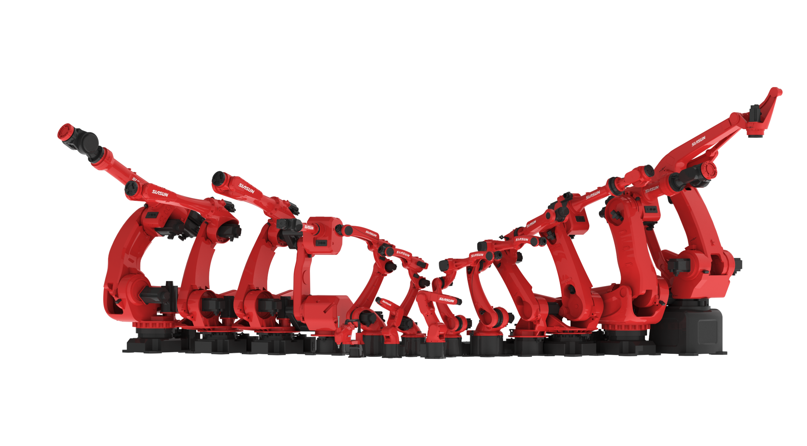

感谢您使用新松机器人产品

在使用机器人之前，务必仔细阅读机器人安全使用须知，并在理解该内容的基础上使用机器人。

本公司致力于不断提升产品品质，本手册中与产品有关的规格和信息如有改动，恕不另行通知。

本手册中所有陈述、信息和建议均已经过慎重处理，但不保证完全正确。本公司对于因使用本手册而造成的直接或间接损失不负任何责任。

用户必须对其应用任何产品负全部责任，需谨慎使用本手册及产品。

本手册所有内容的解释权属沈阳新松机器人自动化有限公司。

| * 本手册未对任何一方授权许可，不得以任何方式复制和拷贝其中的全部或部分内容。 * 本机的外观及规格如需改良而变更，恕不另行通知。 |
| --- |

版权所有：沈阳新松机器人自动化有限公司

产品服务热线：400 800 8666

地址：辽宁省沈阳市全运路33号

新松微信服务号：siasunrobot

电子邮箱：market@siasun.com

# 安全须知

在使用机器人之前，务必熟读并理解本章节所载的内容。

使用新松工业机器人之前，必须充分考虑作业人员和系统的安全措施。并请用户通过说明书充分理解其规格。

使用前（安装、转运、保养、检修），请务必熟读并全部掌握本说明书和其他附属资料，在熟知全部设备知识、安全知识及注意事项后再开始使用。但是使用人员即使完全按照手册中给出的所有安全信息进行，新松公司也无法保证使用人员不会收到任何伤害。

1. 使用者的定义

使用人员定义如下所示。

—操作者

 进行机器人的电源ON/OFF操作。

 从操作面板启动机器人程序。

—程序员/示教作业者

 通过示教器，进行机器人的操作。

 在安全区域内进行机器人的示教等。

—维修人员

 通过示教器，进行机器人的操作。

 在安全区域进行机器人的示教等。

 进行机器人的维护（修理、调整、更换）作业。

操作人员不能安全区域内进行作业。

程序员和维修人员可以在安全区域内进行作业。

安全区域内的作业包括：搬运、设置、示教、调整、维修等。

| 要在安全区域内进行作业，必须接受过机器人的专业培训。 |
| --- |

在进行机器人的操作、编辑、维护时，操作者、程序人员、维修人员必须注意安全，至少应穿戴以下物品进行作业。

— 适合于作业内容的工作服

—安全鞋

—安全帽

—防护眼镜

1. 安全标识

本手册会在需要提示安全事项的地方做出明显的提示说明，以此来提醒设计或作业人员保证自身、同事及设备安全，我们在文中使用“危险”“警告”、“注意”、“注释”来描述这些安全注意事项，用户在使用机器人前，必须熟读理解这些安全注意事项所描述的内容，并必须严格遵守。

| 标识 | 定义 |
| --- | --- |
| 危险警告 | 如果错误操作，有可能导致作业人员死亡或严重人身伤害的紧急危险情况。 |
| 注意 | 如果错误操作，有可能导致作业人员死亡或者严重人身伤害的危险情况。 |
|  | 如果错误操作，有可能导致设备损坏或人员受伤。 |
| 注释 | 除了警告和注意之外的补充内容。 |

1. 使用人员的安全事项
2. 务必在机器人安装前划分出安全区域。机器人系统的周围务必要设置安全围栏和安全警示牌，并且安装安全门，工作人员则必须通过打开安全门，才能进入围栏内，安全围栏要完全封闭机器人，使工作人员不能通过除安全门外的其他地方进入安全围栏内部，防止闲杂人等进入以及防止机器人伤人。
3. 外围设备均需要接上符合相关标准的地线。
4. 将外围设备尽可能地设计在机器人的运动范围外。
5. 应根据现场实际情况，在电源处安装安全锁具，使机器人只可以通过特定人员接通电源。
6. 可燃性、爆炸性、辐射性环境下，请不要使用机器人。
7. 不可以在机器人上攀爬。
8. 在机器人系统运行的过程中，即使机器人处于或者看起来是停止运动的状态时，也有可能是机器人在等待启动运动的信号或者其他信号，使机器人或者周边设备处于一个即将运动的状态。在这种机器人随时可以启动的状态下，需要将机器人系统视为正在运动中。为了确保工作人员的安全，可以安装指示灯或响声，来让工作人员了解机器人系统正在处于运行状态中。
9. 如果需要单独调试机器人周围的设备时，请务必断开机器人的电源后，在执行操作。
10. 连接安全信号、停止运行等与机器人外部设备通讯的信号后，请务必确认这些信号是否可以有效控制机器人的停止（外部急停、安全门等信号），错误连接可能会造成严重的人身伤害。
11. 请不要带手套操作示教器。
12. 请定期备份机器人系统的各项参数、变量、作业等信息，预防意外的数据丢失情况。
13. 在机器人安装完成后的首次运行时，请务必以低速运动机器人，逐渐加快运动速度，并确认机器人是否有异常状态。
14. 在操作机器人运动前，请务必确认安全护栏内部是否还有操作人员。检测机器人系统是否还存在潜在的危险，请在排除全部的危险后，在操作机器人。
15. 搬运、安装机器人时，请务必按照新松所示的方法正确进行，避免由于错误的搬运、安装方法造成机器人、控制器翻倒、掉落，导致的工作人员重伤或者设备损坏。
16. 机器人上方不能有悬挂物，以防掉落砸坏机器人等设备。
17. 严禁倚靠电控柜，或者随意触动按钮，以防机器人产生未预料的动作，引起人身伤害或者设备损坏。
18. 拆分机器人时，注意机器人上可能掉落的零件砸伤人员。
19. 严禁搬动机器人各轴，否则可能造成人身伤害和设备损坏。
20. 在进行电控柜与机器人、外围设备间的配线及配管时须采取防护措施，如将管、线或电缆从坑内穿过或加保护盖予以遮盖，以免被人踩坏或被叉车辗压而坏。
21. 通过软件设定的动作范围及负载条件切勿超出产品规格表中的规定值，设置不当可能造成人员伤害或机器损坏。

| 危险在任何情况下，都不要站在机器人臂下方，以防机器人异常运动或者其他人连接使能而造成事故。 |
| --- |

* 安全围栏外操作的安全

日常启动、停止机器人集成设备时，可以在安全围栏的外面开关机器人系统的电源，并通过示教器或者机器人系统的人机接口来执行启动、停止机器人系统等操作。

1. 不需要操作机器人时，应该关断机器人的电源，或者按下急停按钮。
2. 机器人系统在设计时，要设置外部急停按钮，通过该按钮，可以紧急停止机器人的运动。请在操作人员伸手可以触碰的范围内，设置急停按钮。
3. 启动机器人系统前应观察安全围栏内是否有意外进入的工作人员，而且请务必设置安全围栏和带有安全锁的安全门。

表(a)表示安全围栏外的作业。各个机器人作业者可以执行在此表中的有\[〇]标示的作业项目。

表(a)安全围栏外的作业

| 作业内容 | 操作者 | 程序员/示教作业者 | 维修/维护人员 |
| --- | --- | --- | --- |
| 控制装置电源的ON/OFF | 〇 | 〇 | 〇 |
| 运行模式的选择（T1，T2） |  | 〇 | 〇 |
| 遥控/本地模式的选择 |  | 〇 | 〇 |
| 以示教器选择程序 |  | 〇 | 〇 |
| 以外部设备选择程序 |  | 〇 | 〇 |
| 以操作盘开始程序 | 〇 | 〇 | 〇 |
| 以示教器开始程序 |  | 〇 | 〇 |
| 以操作盘复位报警 |  | 〇 | 〇 |
| 以示教器复位报警 |  | 〇 | 〇 |
| 以示教器的数据设定 |  | 〇 | 〇 |
| 以示教器的示教 |  | 〇 | 〇 |
| 以操作盘的紧急停止 | 〇 | 〇 | 〇 |
| 以示教器的紧急停止 | 〇 | 〇 | 〇 |
| 操作盘的维修 |  |  | 〇 |
| 示教器的维修 |  |  | 〇 |

* 编程示教时的安全

对机器人进行示教、编程的程序人员，很多时候必须进入机器人的工作范围内进行工作，所以要非常注意自身的人身安全。

1. 如果可以不进入机器人的工作范围操作时，务必在机器人的运动范围外部进行操作。
2. 示教机器人时，请确认机器人及周围的集成设备不存在危险或者异常状态。
3. 如果需要进入机器人的运动范围内示教调试，请务必事先确定急停按钮、机器人及集成设备的安全开关的状态和位置。
4. 现场示教的工作人员有义务确保机器人的运动范围内，没有其他工作人员。
5. 在进入安全围栏进行示教、编程、调试时，需要注意以下事项：
6. 进入前仔细检查安全围栏内部情况，务必确认没有危险后在进入。
7. 要做到随时可以按下急停按钮。
8. 要以低速来示教、运行机器人运动。
9. 要确定机器人周围的集成设备的安全情况、信号接收情况，以免周围设备收到远程信号而动作，伤害工作人员或损坏设备。
10. 新松机器人在示教器上，提供急停按钮及用来选择执行模式、示教模式和远程的钥匙切换开关，需要进入安全护栏内进行示教时，应将钥匙切换到示教模式，并且应拔下钥匙，以免他人切换运转模式，并且在打开安全门之后进入，进入安全门后，安全门应保持开启状态，不能关闭。在自动运行情况下，开启安全门，机器人会停止运行。在开关切换到示教模式后，安全门就成为无效。
11. 我司示教器上除了急停开关，还配有三档使能开关:DEADMAN.
12. 急停按钮：只要按下急停按钮，机器人就会紧急停止。
13. DEADMAN:设有三个档的开关，开关处于中间时，机器人可以进行手动运动，松开或者握紧开关，机器人紧急停止。
14. 示教人员必须在DEADMAN在中间位置时，才可以使机器人运动，运动前应排除危险状态。
15. TI\\T2示教模式状态下，DEADMAN有效。
16. 使用示教器或者人机接口启动机器人时，应充分确保机器人运动范围内没有人员且无异常，再执行。
17. 在示教、调试、编程结束后，请按照低速单步、低速连续运行至少一次、中速连续运行一次、正常速度连续运行循环一次后，如果没有错误的地方，就可以自动运行了。
18. 进行自动运行时，工作人员需要全部到安全护栏外进行工作。
* 维修、保养时的安全

为了确保维修人员的安全，应充分注意下列事项。

1. 切勿在机器人运转过程中进入机器人的运动范围。
2. 维修、保养机器人时，尽可能关断机器人电源，并使用安全锁。如果需要开启电源维修、维护机器人，请务必按下急停按钮，并做好警示标识。
3. 在进入机器人安全围栏内工作时，要仔细了解机器人集成系统是否存在危险，确定系统的状态，小心谨慎的工作。
4. 要维护气动系统或元件时，应先将气压降为0，再进行作业。
5. 当机器人运动范围有人时，千万不要自动运行机器人。
6. 在狭小的地方多人维护时，要确保不要堵住其他的人的逃生通道。
7. 维修作业时，需要有另一个人在急停按钮附近，随时按下急停按钮，保证工作人员的安全。
8. 更换机器人部件时，请向新松公司售后部门咨询。千万不可以自行判断更换，这样会导致意外的事故，造成严重的后果。
9. 更换机器人部件时，不可以使异物进入机器人。
10. 检查维护机器人的控制柜内部时，应先断电15分钟以上，以确保驱动器不在高压充电状态，通电灯熄灭再进行。
11. 更换部件时，请一定使用新松公司提供的标准部件，不可以自行选择其他厂家的部件，这样做会导致机器人的损坏，而且很有可能引发火灾。
12. 当维护机器人完成后，需要启动机器人前，要确定安全围栏内部没有工作人员，同时确定机器人系统整体没有异常。
13. 在更换电机或抱闸时，要使用吊车等方式来固定机器人，以免机器人不会由于失去抱闸而下落，之后再进行作业。
14. 工作完毕后，要擦除留到地面上的油脂、润滑剂等，以免有人滑倒或者引发火灾。
15. 机器人的伺服电机、控制柜的内部、减速机、抱闸电阻等原件会发热，请勿在发热状态下触摸，如果需要触摸，请带好耐热手套等安全保护工具。
16. 在维护、维修设备时，请不要站在机器人上，以免发生危险。在登高作业时，确保手脚台安全，并戴好安全带。
17. 在更换维修时拆下来的部件，应该全部装回原位，如果发现不够或者有部分剩余，应重新检查是否安装正确。
18. 部件更换完毕后，请务必进行测试运行，并且工作人员在安全围栏外面。
19. 集成设备及工具的安全
20. 集成设备需要配置传感器、限位开关等装置，通过信号来识别外部设备的不同状态，确保危险时，机器人停止运动。当集成设备或者工具发生故障时，机器人也需要同时停止运动。
21. 当机器人与外部集成设备同时运行时，需要设置干涉区，以保证机器人与集成设备的运行安全。
22. 机器人的集成设备需要在不会受到油、水、粉尘等影响的环境下工作。
23. 机器人机械部分内部的线缆，需要遵守以下的事项，以免造成意想不到的危险。
24. 机械内部的线缆应使用装配好的接口。
25. 机械外部安装线缆时，应注意对机器人运动时的影响。
26. 机械露在外部有线缆时，请勿对露在外部线缆进行改造。
27. 将外部设备安装在机器人上时，应避免与机器人进行干涉。
28. 请不要在正常停止机器人时，使用急停按钮，这样做会使机器人受到损害。一般情况下，请先停止机器人运动，在使用急停按钮对机器人进行断电。
29. 机器人本体安全
* 操作时的注意事项
1. 当工作人员操作机器人时，应使机器人的运动速度调整到足够的慢，这样可以在发生危险时，工作人员有足够的时间做出反应，避免意外的发生。
2. 当操作机器人时，需要深入了解每次操作所带来的结果，每次按键后，机器人会做出怎样的动作后，再操作机器人。
* 编程有关注意事项
1. 多台机器人运动范围重叠时，请务必对机器人干涉的运动范围做好干涉区，保证机器人的运动过程中，不会互相碰撞发生损坏。
2. 示教程序机器人要设置原点，并使机器人的起点与终点都停在程序的原点上，使工作人员可以直接观察到程序的结束。
* 有关机械的注意事项

机器人的运动范围内要保持整洁，使用环境应该不会受到油、水、尘埃等影响。

* 末端执行器的安全

末端执行器应配备限位开关和传感器，通过信号使控制系统了解末端执行器所处的位置和状态，同时进行控制，防止危险的发生。

* 机器人的停止方法
1. 停止类别0（STOP0）

立即切断机器人伺服电源，同时各轴制动器制动，使机器人在一瞬间停止。由于断开伺服电源后， 各轴动作的轨迹得不到控制，机器人会偏离预先定义的运行轨迹，是一种不受控的停止方式。

1. 停止类别1（STOP1）

机器人基本会按照预定的轨迹执行减速，同时控制器和安全系统按照预见设定的时间切断伺服电源，是一种受控的停止方式。

1. 停止类别2（STOP2）

机器人基本会按照预定的轨迹执行减速，停止后不切断伺服电源，各轴电机仍处于通电状态。

1. 危险、警告、注意标签
2. 电击警示标识

图(a) 电击警示标识

内容：贴有此标签处有高压、电击危险，应予注意。

1. 高温警示标识

图(b) 高温警示标识

内容：贴有此标签处会发热，应予注意。在发热状态下必须接触设备时，应佩戴耐热手套等防护用具。

1. 禁止脚踩标识

图(c) 禁止脚踩标识

内容：贴有此标签处，不要将脚搭放在机器人上，或爬到机器人上面。踩踏会造成设备不良影响，也可能造成作业人员伤害事故。

1. 机器人伤人警示标识

图(d) 机器人伤人警示标识

内容：贴有此标签，在机器人动作范围内作业有受到机器人伤害的危险。

1. 禁止拆卸标识

图(e)禁止拆卸标识

内容：贴有此标签的部位禁止用户对其进行拆卸。应由专业人员使用专业工具进行拆卸。

1. 禁止擅自解抱闸标识

图(f)禁止擅自解抱闸标识

内容：贴有此标签之处，禁止擅自解抱闸。

目录

[安全须知 I](#_Toc21286)

[1 概述 7](#_Toc2449)

[1\.1 机器人运行环境 8](#_Toc30363)

[1\.2 机器人软件 8](#_Toc13203)

[1\.2\.1 对机器人设定 8](#_Toc4503)

[1\.2\.2 手动运动机器人 8](#_Toc5430)

[1\.2\.3 程序 9](#_Toc23558)

[1\.2\.4 测试程序运行 9](#_Toc21113)

[1\.2\.5 自动运行程序 9](#_Toc3754)

[1\.3 机器人本体 10](#_Toc15084)

[1\.4 控制器 10](#_Toc5464)

[1\.4\.1 示教器硬件 11](#_Toc9069)

[1\.4\.2 示教器窗口 19](#_Toc12370)

[1\.4\.3 I/O 27](#_Toc30381)

[1\.4\.4 远程I/O 28](#_Toc25900)

[1\.4\.5 机器人动作 28](#_Toc31469)

[1\.4\.6 急停按钮 29](#_Toc25631)

[1\.4\.7 外部轴 29](#_Toc32406)

[2 机器人各项设定 30](#_Toc27837)

[2\.1 I/O 30](#_Toc27284)

[2\.1\.1 数字I/O 31](#_Toc21848)

[2\.1\.2 组I/O 33](#_Toc28837)

[2\.1\.3 远程I/O 38](#_Toc12961)

[2\.1\.4 模拟量I\\O 42](#_Toc31990)

[2\.1\.5 自定义组IO 44](#_Toc18763)

[2\.2 设置坐标系 45](#_Toc3521)

[2\.2\.1 坐标系和轴运动键 48](#_Toc436)

[2\.2\.2 设定工具坐标系 50](#_Toc26828)

[2\.2\.3 设定用户坐标系 57](#_Toc5601)

[2\.2\.4 设定外部工具坐标系 60](#_Toc9722)

[2\.2\.5 当前坐标系 62](#_Toc13394)

[2\.3 设置原点 62](#_Toc32593)

[2\.3\.1 原位设定与标定 63](#_Toc26229)

[2\.4 各轴软限位 64](#_Toc6675)

[2\.5 干涉区 65](#_Toc16329)

[2\.5\.1 轴干涉区 66](#_Toc23019)

[2\.5\.2 空间干涉属性 69](#_Toc17126)

[2\.5\.3 空间形状设定 70](#_Toc5693)

[2\.6 执行开关 78](#_Toc5133)

[2\.7 负载设定 80](#_Toc2830)

[2\.8 循环方式 81](#_Toc3307)

[2\.9 系统信息 82](#_Toc27174)

[2\.9\.1 系统版本 82](#_Toc9134)

[2\.9\.2 系统时间 83](#_Toc22109)

[2\.10 软重启 84](#_Toc26535)

[2\.11 应用配置 86](#_Toc8754)

[2\.12 型号配置 86](#_Toc10248)

[2\.13 抑振参数 87](#_Toc13331)

[2\.14 自定义报警 88](#_Toc15742)

[2\.15 报警码输出配置 89](#_Toc17928)

[2\.16 用户权限设置 90](#_Toc30138)

[2\.17 柜体配置 91](#_Toc9122)

[2\.18 安全设置 91](#_Toc22566)

[2\.19 本体轴驱动器配置 92](#_Toc24657)

[2\.20 控制参数 94](#_Toc30041)

[2\.21 IO模块相关配置 95](#_Toc4506)

[2\.22 总线属性 99](#_Toc16129)

[2\.23 其他设定 101](#_Toc13244)

[2\.23\.1 本体方位 101](#_Toc5221)

[2\.23\.2 用户名 102](#_Toc21707)

[2\.23\.3 运动参数 102](#_Toc20394)

[2\.23\.4 快捷键 106](#_Toc16710)

[2\.23\.5 速度倍率 109](#_Toc17019)

[3 程序的说明 111](#_Toc1710)

[3\.1 作业列表界面 112](#_Toc17614)

[3\.1\.1 作业名与注释 113](#_Toc952)

[3\.1\.2 作业类型 113](#_Toc20173)

[3\.1\.3 作业界面菜单 114](#_Toc15105)

[3\.2 作业编辑页面 116](#_Toc7997)

[3\.3 变量的数据类型 120](#_Toc1137)

[3\.4 运动指令 123](#_Toc14800)

[3\.4\.1 运动类型 124](#_Toc23218)

[3\.4\.2 位置信息 131](#_Toc9536)

[3\.4\.3 移动速度 136](#_Toc11621)

[3\.4\.4 连续轨迹 137](#_Toc20276)

[3\.5 基础指令 139](#_Toc9726)

[3\.6 运算指令 152](#_Toc27694)

[3\.7 I/O指令 164](#_Toc31846)

[3\.8 控制类 167](#_Toc7193)

[3\.9 操作类 183](#_Toc8666)

[4 程序的示教 188](#_Toc8250)

[4\.1 动作设计 188](#_Toc31651)

[4\.1\.1 动作指令 188](#_Toc5504)

[4\.1\.2 原点设定 189](#_Toc29842)

[4\.2 开机并手动控制 189](#_Toc32399)

[4\.2\.1 启动机器人 189](#_Toc9070)

[4\.2\.2 3种运行模式 189](#_Toc767)

[4\.2\.3 机器人轴运动 191](#_Toc30128)

[4\.3 示教程序 198](#_Toc13727)

[4\.3\.1 新建作业 199](#_Toc2370)

[4\.3\.2 作业界面的设置 202](#_Toc442)

[4\.3\.3 示教动作指令 203](#_Toc29983)

[4\.3\.4 逻辑控制指令 204](#_Toc8119)

[4\.4 指令的编辑 205](#_Toc4)

[4\.4\.1 修改运动指令 205](#_Toc13198)

[4\.4\.2 修改逻辑、控制指令 206](#_Toc32144)

[4\.5 作业变换 206](#_Toc3031)

[5 程序的运行 212](#_Toc3465)

[5\.1 程序的停止和恢复 212](#_Toc28303)

[5\.1\.1 紧急停止和恢复运行 212](#_Toc5661)

[5\.1\.2 暂停和恢复 214](#_Toc2242)

[5\.1\.3 报警 215](#_Toc22873)

[5\.2 程序的执行 216](#_Toc181)

[5\.2\.1 如何启动程序运行 216](#_Toc18220)

[5\.2\.2 机器人按程序运行 217](#_Toc26193)

[5\.2\.3 从暂停恢复启动 219](#_Toc30898)

[5\.3 对程序进行测试 220](#_Toc23506)

[5\.3\.1 测试前需要确定的设置 221](#_Toc26263)

[5\.3\.2 单步测试程序 223](#_Toc24844)

[5\.3\.3 连续运行测试程序 225](#_Toc15312)

[5\.3\.4 程序确认和监控 226](#_Toc15815)

[5\.4 断点恢复 227](#_Toc28426)

[5\.5 自动运行 228](#_Toc11259)

[6 状态显示 231](#_Toc24684)

[6\.1 示教器的LED 231](#_Toc10488)

[6\.2 作业界面 231](#_Toc26284)

[6\.3 变量 232](#_Toc19642)

[6\.4 位置变量的值 234](#_Toc19843)

[6\.4\.1 位置变量获取 235](#_Toc16637)

[6\.4\.2 位置变量的用途 235](#_Toc6401)

[6\.5 实时显示 236](#_Toc32204)

[6\.6 用户/系统IO 243](#_Toc15448)

[6\.7 报警日志 244](#_Toc24475)

[6\.8 动作日志 245](#_Toc10255)

[7 备份、恢复资料 247](#_Toc2865)

[7\.1 参数备份恢复 247](#_Toc29372)

[7\.2 全局变量备份/恢复 248](#_Toc30194)

[7\.3 作业备份/恢复 248](#_Toc14527)

[7\.4 U盘卸载 250](#_Toc23867)

[7\.5 备份、恢复文件 250](#_Toc29325)

[8 应用与操作 252](#_Toc3575)

[8\.1 通讯设备的设置 252](#_Toc16007)

[8\.1\.1 Devicenet 252](#_Toc9629)

[8\.1\.2 Profinet 258](#_Toc17021)

[8\.1\.3 Modbus 262](#_Toc37)

[8\.1\.4 连接端口 284](#_Toc10822)

[8\.2 预约功能 285](#_Toc25285)

[8\.3 总线优化 292](#_Toc13332)

[8\.4 外部轴配置 292](#_Toc12656)

[8\.4\.1 系统轴数配置 293](#_Toc111)

[8\.4\.2 总线设备配置 293](#_Toc11628)

[8\.4\.3 外部轴\-轴配置 294](#_Toc19193)

[8\.4\.4 系统配置 296](#_Toc28027)

[8\.4\.5 滑台标定 297](#_Toc6762)

[8\.4\.6 滑台设定 298](#_Toc1131)

[8\.4\.7 转台设定 298](#_Toc10605)

[8\.4\.8 变位机标定 299](#_Toc12554)

[8\.4\.9 变位机设定 301](#_Toc5943)

[8\.4\.10 外部轴参数的设定 302](#_Toc2768)

[8\.5 零位 302](#_Toc9752)

[8\.5\.1 零位标定 304](#_Toc30906)

[8\.5\.2 零位设定 306](#_Toc16213)

[8\.5\.3 码盘清除 307](#_Toc27697)

[8\.6 设置机器人IP 308](#_Toc28424)

[8\.7 语言设置 309](#_Toc26608)

[8\.8 更换CFast卡 310](#_Toc24546)

[9 附录 315](#_Toc23360)

[9\.1 基础指令表 315](#_Toc24055)

[9\.1\.1 运动类 315](#_Toc23567)

[9\.1\.2 基础指令 316](#_Toc24835)

[9\.1\.3 运算指令 325](#_Toc24224)

[9\.1\.4 I/O指令 337](#_Toc25036)

[9\.1\.5 控制类 340](#_Toc16366)

[9\.1\.6 操作类 354](#_Toc7046)

[10 报警信息 360](#_Toc24567)

[10\.1 报警 360](#_Toc8549)

[10\.2 警告 419](#_Toc13193)

[10\.3 提示信息 436](#_Toc12742)

[修订记录 440](#_Toc12613)

# 概述

本章主要介绍机器人的RC软件、机械臂和控制柜。新松机器人主要由这三个部分组成。

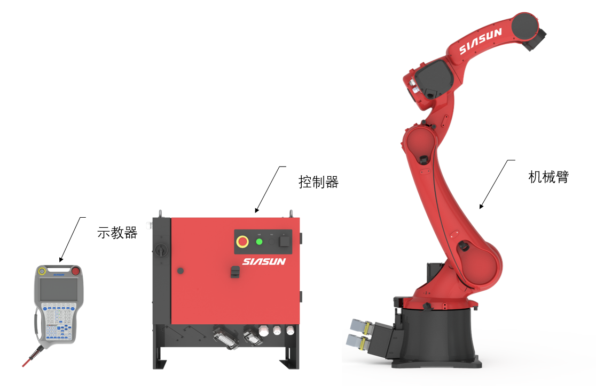

图 1‑1工业机器人组成

**RC软件：**

控制器内嵌入了控制机器人专用的RC软件。作业人员可以通过示教器上的按钮、菜单、指令、图标等接口，控制机器人进行现场所需的各种操作。机器人RC软件可以通过通讯对机器人外围设备，比如夹具、相机、安全设备等进行控制或信息采集。也可以对外围设备的输入或输出进行控制，比如外部传感器。

**机器人：**

机器人本体机械部分通过添加末端执行机构，完成现场作业。

**控制柜：**

机器人的控制柜可以为机器人本体的运行提供动力电源。

机器人控制柜内嵌控制软件，可以对示教器及外部设备进行控制。

外部设备，是指除了控制柜外，可以通过远程I\\O或总线通讯来控制的机器人的外围设备。例如：

1. 从控制柜以外的设备，对机器人的运行进行控制。
2. 控制柜通过I\\O或者现场总线来操作的末端执行机构及传感器。

## 机器人运行环境

在接近0℃的低温环境下，在休息日或者夜间低于0℃的环境下长时间让机器人停止运行的情况，在开始运转时，因为驱动部分旋转抵抗很大，可能会发生报警。此时，建议低速运行几分钟进行暖机。

## 机器人软件

为了使机器人可以完成现场环境下的各种作业，RC软件可以做到的工作有如下几点：

1. 设置机器人的各个项目以及输入项目所需的参数。
2. 编写机器人作业所需的程序。
3. 测试工作人员所编写的程序。
4. 自动运行测试完成的程序。
5. 对机器人的各项状态提供显示，以及检测界面。

### 对机器人设定

RC软件通过示教器，可以对工作人员操作所需各个项目进行设定。

RC软件也可以对除机器人本体和控制器外的外部装置，例如夹手、传感器等进行相应的操作，可以对现场自动运行所需的远程I\\O、坐标系、现场总线、外部轴、安全设备等，进行事先的设定。

### 手动运动机器人

工作人员可以通过示教器控制机器人进行手动运行，可以单轴运动机器人，也可以使用坐标系进行多轴的联动运动，使机器人运动到预期的目标位置和姿态上。

手动T1模式下，点动（JOG）运动机器人或者正、反向执行机器人作业，机器人TCP点的直线运动的速度被限制在250mm/s以下，关节运动的速度被限制在各轴设定的最大速度的20%以下。

手动T2模式下，可以点动（JOG）运动机器人，但是机器人TCP点的直线运动的速度被限制在250mm/s以下，关节运动的速度被限制在各轴设定的最大速度的20%以下。 但是当正、反向或使用快捷键方式，手动执行机器人作业时，机器人没有速度的限制，执行速度与指令速度和速度的倍率有关，机器人的速度可以达到100% 。

当示教机器人时，编辑动作指令，是通过手动运动机器人到达目标位置后，点击对应的运动指令，记录当前所在位置的值实现的。

### 程序

机器人运行的程序，是通过标准运动指令、基础指令、运算指令、IO指令、控制指令、操作指令等指令组合而成的。按照需求以及顺序输入这些指令，即可完成机器人现实作业的程序。编辑程序需要用户权限为高级/超级用户，普通用户无法编辑程序。

程序的构成如下：

**NOP：**程序起始符，程序创建时系统自动生成。

**指令：**程序中指令信息区，展示所有用户插入的指令。

**END：**程序结束符，程序创建时系统自动生成。

图 1\-2机器人程序

### 测试程序运行

测试程序的运行,是指当机器人各项配置设定完成,程序编程也完成后,对机器人的设定及编程进行手动的模拟运行测试，用以确定机器人可以按照预期正确运行，完成设计所需各项功能。通过对程序进行测试运行，可以发现各种情况下的问题，从而不断的优化程序。所以在程序进行自动执行前，请务必对程序进行测试运行。

### 自动运行程序

自动运行程序，代表机器人可以自动化运行作业。在自动运行中，可以执行如下操作:

1. 启动指定的程序。
2. 进行报警恢复和再启动步骤。

## 机器人本体

机器人本体主要由手臂的机械部分以及由伺服驱动的轴构成。通常工业机器人有6个关节。机器人对加载在腕端法兰上的末端执行器进行操作。

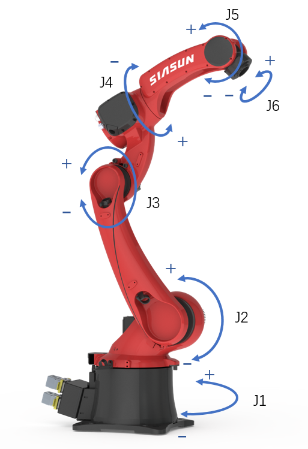

图 1\-3各轴的方向

## 控制器

机器人控制器由电源、控制单元、驱动器、用户接口、IO接口等构成。

用户对控制器进行操作时，需要使用示教器。

控制器通过CPU主板，对包括外部轴在内的所有伺服电机驱动器进行控制。

机器人的设定、数据及程序，被储存在CF卡中。

控制器可以通过IO模块或者现场总线进行输入和输出信号来获得和外部设备的通讯。

部分控制器支持示教器热插拔功能，具体使用方法查看《新松机器人电气使用及维护手册》。

| C:\Users\miaoxiangdi\AppData\Roaming\LarkShell\sdk_storage\409e8086ec761b170551fcd94e84b802\resources\images\img_v3_02c5_61a7842d-6df6-4d99-b960-adf61bc6a70g.jpg电源开关急停按钮示教器示教器接口启动按钮电源指示灯 |
| --- |

图 1\-4 S机器人控制器结构示意图（SRC M6\)

### 示教器硬件

示教器是控制软件与用户之间的主要的接口装置，并可以对机器人进行操作。示教器与控制器之间通过线缆相连。

**示教器可以进行的操作有：**

1. 手动运动机器人。
2. 程序的创建与编程。
3. 程序的测试执行。
4. 自动执行程序。
5. 确认各种状态。

**示教器由如下设备组成：**

1. 7英寸LED触摸显示屏。
2. 5个LED显示灯。
3. 功能按键。

**注意：**

1. **同时按下触摸屏上的多个部位时，系统有时会识别与所按下的位置不同的位置，因而请务必按触摸屏上的某一处；**
2. **触摸屏会因故障而识别与所按下的位置不同时，请使用按键进行操作；**
3. **请使用手指或者触控笔来操作触摸屏，不能使用前端锐利的器具来操作触摸屏，可能导致触摸屏故障；**

此外，示教器还有3个开关：

表格 1\-1示教器开关

| 开关 | 功能 |
| --- | --- |
| 模式选择开关 | 可以在示教模式，自动运行模式和远程模式间切换。注释：示教模式包括T1和T2模式，默认为T1模式。 |
| DEADMAN（安全开关） | 3档位置开关按到中间，即为有效，可以操作机器人运动，在两边的位置均为无效，机器人不会运动。 |
| 急停按钮 | 无论机器人处于任何状态，机器人均会停止运动。 |

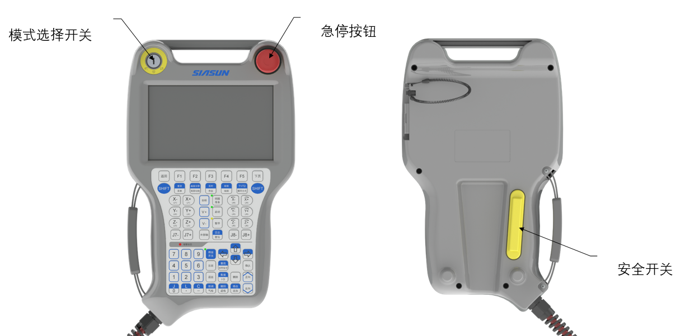

图 1‑5示教器开关

**示教模式:**可以对程序进行示教工作。对已经编辑的作业进行修改。也可对各项功能进行设置。

**执行模式：**可以自动运行已编辑的程序。

**远程模式：**可以通过外部输入、输出信号，对机器人进行远程逻辑控制。如伺服上电、调用主作业、启动、暂停等操作。

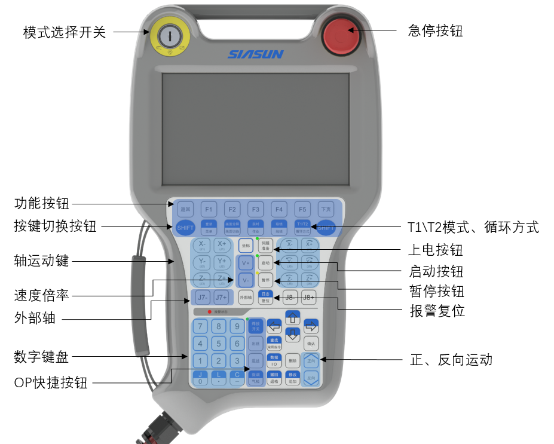

图 1‑6示教器按键布局

示教器按钮包括：

1. 与启动和停止有关的按钮。
2. 与轴运动和坐标系运动有关的按钮。
3. 与执行有关的按钮。
4. 数字键。
5. 特定的功能键。

表格 1\-2示教器按键说明

| 按键 | 功能 |
| --- | --- |
|  | 执行模式下，作业启动按钮。运行指示灯，运行状态下为绿色。 |
|  | 作业暂停按钮。暂停指示灯，作业状态暂停为黄色 |
|  | 与其他键作为组合键使用，实现各种不同功能； |
|  | 机器人本体轴和外部轴之间的控制切换。当前使用的轴组类型，可以在示教器上的图标显示出来。 |
|  | 返回上一级菜单栏； |
|  | 快捷功能键，分别对应当前显示屏上的快捷菜单中的功能； |
|  | 快捷功能菜单翻页（只针对F1\-F5快捷菜单翻页）； |
|  | 与SHIFT按键组合按下时：进入用户权限等级登录界面。单独按下按键时：打开菜单栏。 |
|  | 与SHIFT按键组合按下时：对画面进行分屏，创建新的窗口。单独按下按键时：存在多个窗口时，对画面进行切换。 |
|  | 与SHIFT按键组合按下时：打开实时显示页面。单独按下按键时：打开作业列表。 |
|  | 用来切换手动时的坐标系。坐标系在关节\-工具\-用户\-直角坐标系之间切换。 |
|  | 与SHIFT按键组合按下时：机器人T1和T2模式的切换。  | 警告：T2模式下，机器人的运动速度可以到达全速，如果不是不得不使用T2模式，请不要使用T2模式，以保证示教工程师的人身安全。 | | --- |  单独按下按键时：切换循环方式。分为：单步、单循环、自动。三种方式循环切换。  | 注意：请在手动或自动运行前，进行确认当前循环方式。 | | --- | |
|  | 与SHIFT按键组合按下时：机器人可以在手动时，通过联锁键切换是否执行或跳过逻辑指令。  | 注意：请在正向运动前，对联锁状态进行确认，确定是否在正向运动时，执行逻辑指令。反向运动不执行逻辑指令，逻辑指令自动跳过。 | | --- |  单独按下按键时：编辑上一次打开的作业 |
|  | 执行模式下按下该键，伺服被上电；示教模式下，伺服被准备好；该按键的左上角有LED小灯。机械臂未上电时，小灯熄灭。机械臂上动力电后，小灯闪烁。按下deadman或完成上电后，小灯常亮。未上电状态时，小灯熄灭。 |
|  | 与SHIFT按键组合按下时：显示与机器人运行相关的各项数据。如：关节值、Rpy、码盘值等。单独按下按键时：打开用户IO页面。 |
|  | 更改机器人的运行速度百分比。1\.执行模式通过点击V±键可设置速度倍率固定值：0\-0\.5\-1\-2\-3\-4\-5\-后续5%速度增长最高至100。2\.示教模式通过点击V±将可设置速度倍率固定值：寸动\-0\.1\-0\.5\-1\-2\-3\-4\-5\-后续5%速度增长最高至100。3\.SHIFT\+V±按照速度倍率页面配置的值进行循环切换（不区分执行与示教模式）。4\.当通过状态栏选择后再按V±或者SHIFT\+V±时按照速率范围切换到最近的值。 |
|  | 控制送丝机送丝，退丝按键；（目前绑定到弧焊应用功能） |
|  | 焊接允许开关；与SHIFT同时按切换焊接允许开关状态；焊接允许打开，LED灯亮提示焊接允许打开；焊接允许关闭，LED灯不亮提示焊接允许关闭；（目前绑定到弧焊应用功能） |
|  | 与SHIFT按键组合按下时：进入焊接参数微调整界面。单独按下按键时：气体检测；（目前绑定到弧焊应用功能） |
|  | 单独按上下键光标行单行跳转；对于一行中有多个参数框时，单独按左右键可左右单个跳转光标行位置。上下左右光标键与SHIFT键同时按可将光标移至当前页的最上下左右位置； |
|  | 在示教模式下，通过轴运动键可以对轴或机器人进行单轴或多轴同时运动。仅仅是轴操作键和DEADMAN同时按下时，机器人进行运动。机器人按已选的坐标系及速度倍率进行运动。在运动机器人前，请确认坐标系及速度。 |
|  | 控制机器人外部轴7轴、8轴的运动。 |
|  | 当正向运动和DEADMAN被同时按下时，机器人会按程序示教的运动点和指令进行运行；反向相同。运动前请确认联锁的功能是否有效。运动前请确认机器人的循环模式，确认机器人程序是否是单步执行或连续执行。机器人会按照所选择的速度运动，运动前请确定好机器人的运行速度。  | 警告：T2模式下，机器人的运动速度可达到设定的最大速度。如非必要，请不要使用T2模式，以保证示教工程师的人身安全。 | | --- | |
|  | 与SHIFT按键组合按下时：切换至报警日志页面。单独按下按键时：对机器人报警进行复位。如果报警没有被解除，则机器人会继续报警，直到报警被解除并复位。 |
|  | 可以通过数字键盘快速实现数字输入； |
|  | 与SHIFT按键组合按下时：可快速插入相应运动类型指令；（指令配置在作业列表页面的快捷指令页面内）单独按下按键时：可输入0、.、\-； |
|  | 与SHIFT按键组合按下时：输入行号、IO号、寄存器号后移动光标（若当前页面内有查找功能，则会被执行）；单独按下按键时：显示已登记的常用指令列表（只在作业界面中使用，并显示配置按钮可用于配置），方便使用者使用选择常用指令； |
|  | 与SHIFT按键组合按下时：只有在示教模式下作业编辑页面有效，可撤回最近一次编辑内容（包括插入、删除、复制、剪贴等作业编辑动作），可撤回的动作仅记录最近的一次操作。单独按下按键时：可删除在输入字或字符框中输入闪烁条前一个字或字符； |
|  | 仅在作业列表页面有效，删除光标所在行的作业。 |
|  | 与SHIFT按键组合按下时：光标在运动指令处时，将当前位置记录到光标所在运动指令中。单独按下按键时：可直接插入上一指令语句包含运动语句； |
|  | 确认键（完成参数修改需要与确认键配合使用，作业指令参数修改过后点击确认跳至下一可修改参数，如果当前指令无可修改参数，跳至下一行指令编号处） |
|  | 对机器人模式进行示教\\执行\\远程模式切换。 |
| 在示教模式下，使用示教器进行编程，可以进行手动的轴操作，及程序的正反向运动。 |
| 在执行模式下，可以本地启动，进行选定程序的自动运行。执行模式不能被外部启动信号启动。 |
| 在远程模式下，可以通过远程I\\O信号，对机器人进行外部控制。在远程模式下，机器人示教器上的启动信号无效。 |

### 示教器窗口

示教器窗口上方是状态栏，下方有提示栏，包含了机器人各种常用功能的状态信息。

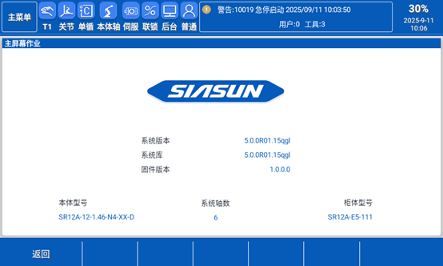

图 1\-7示教器窗口

**作业编辑界面**

在作业示教界面，可以进行指令的写入，复制，粘贴，删除，修改等常规操作。

另外，可以通过旁边的滚动条进行页面的滚动。

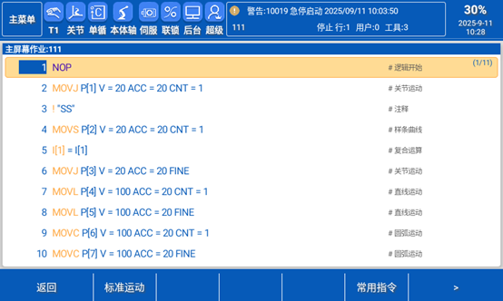

图 1\-8示教程序编辑窗口

**编辑光标与执行光标：**

光标分为编辑光标与执行光标，编辑光标为橙色、执行光标为绿色。

执行光标记录作业运行的指令位置，执行光标只随作业指令的执行而改变；编辑光标记录用户编辑操作后的指令位置。当连续打开同名作业时，可以自动恢复此作业的上一次执行光标和编辑光标位置（如果只有编辑光标，那么恢复编辑光标的位置，如果两种光标都有，那么恢复执行光标的位置），以便提示用户此作业的指令执行状况和指令编辑状况；只要连续打开的作业属于非同名（即不同名字），则编辑光标、执行光标全部恢复成作业首行，并且只显示橙色的编辑光标。

当执行光标与编辑光标重合时，观察作业只显示橙色的编辑光标；当执行光标与编辑光标位置不一致时，才会观察到作业页面的编辑光标与执行光标，如图所示。

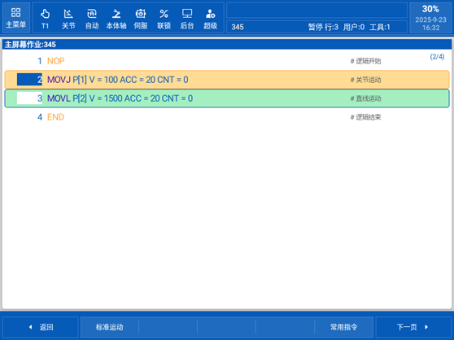

图 1\-9执行和编辑光标

作业启动（包括自动运行，正、反向运行）时编辑光标与执行光标必须一致，否则作业无法启动，会出现信息弹框并提示用户选择从编辑光标处启动作业还是执行光标处启动作业。

当前作业的执行光标与编辑光标一致。此时用户触发正、反向按键时，作业立即可以启动并执行。

机器人运动到该位置时，该指令上会显示@图标，表示机器人实际位置为该指令位置、远离后该图标消失。

当前作业的执行光标与编辑光标不一致。此时用户触发正、反向按键时，作业没有启动并观察出现提示弹框“当前作业的编辑光标与执行光标不一致，作业禁止启动”。选择“确认”后作业将会从编辑光标处启动；选择“取消”后作业将从执行光标处启动。当选择“确认”后，执行光标会自动移至编辑光标处，即两光标重合；当选择“取消”后，需要手动移动编辑光标至执行光标处，即确保两光标重合。无论选择如何，需要再次触发【正、反向按键】后作业才能正式从编辑光标或者执行光标处启动。同理，执行模式下启动作业也是如此。

**状态栏：**

机器人屏幕上方的状态栏，会显示和机器人状态有关的各项内容或数据。

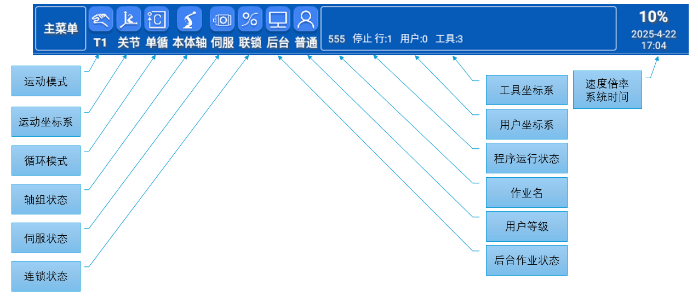

图 1\-10状态栏

表格 1\-4状态栏含义

| 图标 | 含义 |
| --- | --- |
|  | 机器人当前执行模式的状态显示图标。分别为T1\\T2模式、执行模式、远程模式。  | 警告：T2模式下，机器人的运动速度可以到达全速，如果不是不得不使用T2模式，请不要使用T2模式，以保证示教工程师的人身安全。 | | --- | |
|  | 用来切换手动时的坐标系，坐标系在关节\-用户\-工具\-直角坐标系间切换。 |
|  | 程序循环方式：单步执行、自动执行、单循环执行。这三种模式在自动\\手动运行时，都有效。  | 注意：由于循环方式在手动和自动运行时，都有效，所以请在手动或自动运行前，进行确认。 | | --- | |
|  | 不同的用户等级可以开放不同的使用权限，密码是：高级用户“00001111”（可配置），超级用户“12341111”（可配置）。 |
|  | 当手动运动机器人时,切换本体轴和外部轴时,图标进行相应的变更。 |
|  | 速度倍率显示的图标，当速度倍率变更时，对应数值变更，当处于执行模式时新增速率为0选项（速度为0的时候机器人停止，但不影响逻辑指令的执行）。 |
|  | 工具、外部工具图标，工具坐标系文件号变更时，图标上的数字相应的变更。  | 注意：工具坐标系号的改变，对机器人程序运动轨迹有影响，请在手动或自动执行程序前，进行确认。 | | --- | |
|  | 用户坐标系图标，用户坐标系文件号变更时，图标上的数字相应的变更。  | 注意：用户坐标系号的改变，在一些情况下，如偏移指令，对机器人程序运动轨迹有影响，请在手动或自动执行程序前，进行确认。 | | --- | |
|  | 伺服状态的图标：表示伺服下电、伺服上电、伺服使能。 |
|  | 后台作业状态图标，BG表示后台在运行状态，空白表示后台的停止状态。 |
|  | 显示作业在手动模式下，是否执行逻辑指令。两个都是圆圈时，代表正向运动执行逻辑指令和运动指令。一个圆圈，一个叉时，代表正向运动时不执行逻辑指令，只执行运动指令。  | 注意：请在正向运动前，对联锁状态进行确认，确定是否在正向运动时，执行逻辑指令。 | | --- | |

主菜单栏介绍：

主菜单在打开后位于界面左侧，是机器人各种操作的界面入口。

表格 1\-5机器人主菜单介绍

| 图标 | 说明 |
| --- | --- |
|  | 进入用户配置界面，对各项条件进行配置，包括示教、原点、外部设备通讯、干涉区、中断操作等功能的配置。 |
|  | 可以对机器人的各种坐标系进行查看、标定、设定等操作。 |
|  | 可以对输入、输出量进行查看、手动输出状态、组IO配置、远程IO映射、总线IO设置等操作。 |
|  | 可以对各种类型的变量进行查看、写入等操作。 |
|  | 显示机器人关节值、码盘值、姿态值、IO状态等数据。 |
|  | 对机器人的作业、参数等数据进行备份或恢复。 |
|  | 对机器人系统软件版本、系统时间等进行查看。 |
|  | 进入主菜单下一页。 |
|  | 进入作业列表界面，可进行新建程序，打开程序，作业管理作。同时，可以看到现有的作业列表和作业类型。 |
|  | 机器人的系统设置界面。 |
|  | 机器人系统参数界面 |

**文字输入操作：**

当点击触屏上需要输入字母或参数的地方（特指文本框），屏幕下方会弹出软件盘。可以通过软件盘输入所需要的内容。

**报警界面：**

点击屏幕下方的报警栏，机器人会弹出报警界面。可以显示报警信息。

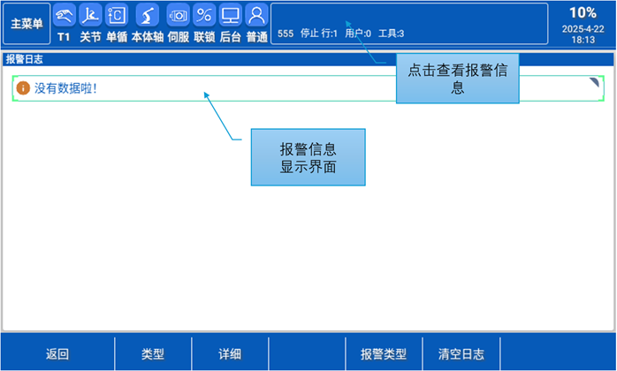

图1\-11报警界面

表格1\-6报警界面图标介绍

| 报警提示栏 | 显示报警、警告、提示信息。 |
| --- | --- |
|  | 机器人报警、警告、提示图标。 |

**菜单树结构：**

菜单树结构见下表。

表格1\-7主菜单列表

| 一级主菜单 | 二级主菜单 | 用户等级 |
| --- | --- | --- |
| 用户配置 | 原位记录 | 高级用户 |
| 预约 | 普通用户 |
| 干涉区 | 高级用户 |
| 本体方位 | 高级用户 |
| 用户名 | 高级用户 |
| 设置IP | 高级用户 |
| 负载设定 | 超级用户 |
| 抑振参数 | 超级用户 |
| 循环方式 | 高级用户 |
| 自定义报警 | 高级用户 |
| 报警码输出配置 | 高级用户 |
| 用户权限设置 | 超级用户 |
| 速度倍率 | 超级用户 |
| 后台配置 | 超级用户 |
| 快捷键 | 超级用户 |
| 坐标 | 用户坐标 | 高级用户 |
| 工具坐标 | 高级用户 |
| 外部工具 | 高级用户 |
| 当前坐标 | 普通用户 |
| IO | 手动 | 高级用户 |
| 组IO输入 | 高级用户 |
| 组IO输出 | 高级用户 |
| 远程IO映射 | 高级用户 |
| 总线IO映射 | 高级用户 |
| 模拟量IO配置 | 高级用户 |
| 自定义组IO | 高级用户 |
| 变量 | 用户整型 | 普通用户 |
| 用户实型 | 普通用户 |
| 用户字节 | 普通用户 |
| 用户短整型 | 普通用户 |
| 用户字符串型 | 普通用户 |
| 位置变量 | 普通用户 |
| 系统整型 | 超级用户 |
| 系统实型 | 超级用户 |
| 实时显示 | 实时显示 | 普通用户 |
| 用户IO输入 | 普通用户 |
| 用户IO输出 | 普通用户 |
| 系统IO输入 | 普通用户 |
| 系统IO输出 | 普通用户 |
| 动作日志 | 普通用户 |
| 报警日志 | 普通用户 |
| 备份恢复 | 参数 | 高级用户 |
| 全局变量 | 高级用户 |
| 作业备份 | 高级用户 |
| 作业恢复 | 高级用户 |
| 卸载USB | 高级用户 |
| 系统信息 | 系统版本 | 普通用户 |
| 系统时间 | 普通用户 |
| 证书 | 超级用户 |
| 示教盒设置 | 普通用户 |
| 作业 | 打开作业 | 普通用户 |
| 编辑作业 | 高级用户 |
| 系统设置 | 柜体配置 | 超级用户 |
| 系统轴数 | 高级用户 |
| 总线设备 | 超级用户 |
| 总线优化 | 超级用户 |
| 型号配置 | 超级用户 |
| 外部轴 | 高级用户 |
| 应用配置 | 高级用户 |
| 执行开关 | 高级用户 |
| 软重启 | 超级用户 |
| IO设备列表 | 超级用户 |
| 驱动器配置 | 超级用户 |
| 总线设备查看 | 高级用户 |
| 总线属性 | 超级用户 |
| 安全设置 | 超级用户 |
| 系统参数 | 运动参数 | 超级用户 |
| 控制参数 | 高级用户 |
| 零位 | 高级用户 |

### I/O

机器人输入、输出信号，即I/O信号，可通过用户I/O信号在机器人控制软件和外部设备之间进行数据的传输。

I/O的类型有：

1. 用户I/O信号。
2. 组I/O信号。
3. 模拟I/O。

用户I/O分为硬件直连线IO和总线通讯IO，共支持4096位输入与4096位输出。

硬件直连线IO，根据不同的控制柜有8位输入与8位输出，有16位输入与16位输出，可通过增加模块进行扩展，具体数量随硬件配置不同而不同，其中华太模块最多支持64位输出、64位输入。具体内容可查看《新松机器人电气使用及维护手册》。

### 远程I/O

远程I/O是机器人与外围设备之间进行通讯的信号，这些信号的需要被定义成专用的信号，通过软件界面来设定。

1. 调用主作业。
2. 启动或停止程序。
3. 取消报警。
4. 其他信号的交互。

### 机器人动作

把机器人的工具中心点（TCP点）从当前位置，移动到目标位置的运动，作为一个指令来处理，这样就可以完成机器人动作的编辑。机器人软件会自动处理相关的轨迹、加速度、速度、位置信息。

使机器人的运动有两种方式：手动通过按钮来控制和通过程序来执行动作。

可用通过示教器上的按钮手动控制机器人运动，机器人的动作由选择的坐标系和速度来确定。

机器人按照程序自动执行时，机器人的动作是通过程序指令中所给定的位置数据、运动类型、速度、加速度来确定。

动作类型有J（轴）运动、L（直线）运动、C（圆弧）运动，J运动时，TCP点在两个示教点之间不规则运动，运动轨迹是重复相同的轨迹。L运动时，TCP点按照两个示教点之间的直线进行运动。C运动时，TCP点在3个示教点之间的圆弧进行运动。

机器人运行时，可以开启或关闭连续轨迹：开启时在目标点并不停止，而是从目标点的附近快速滑过、关闭时是停止后再启动。

### 急停按钮

机器人具有如下急停按钮：

1. 示教器和控制柜上的急停按钮。
2. 用户自行配置的外部急停按钮。

当按下急停按钮时，机器人不管出于任何状态，都会触发急停状态，外部急停按钮的接口端子位于机器人的控制柜内部控制单元或接口面板。

### 外部轴

新松控制系统除了可以控制机器人本体的6轴外，还可以控制最多6个外部轴（其中1个外部轴支持2个电机驱动）。

1. 通常情况下，机器人和外部轴进行J运动。
2. 在特定情况下，机器人也可以与外部轴进行L运动或C运动。

# 机器人各项设定

使用机器人系统之前，需要对各项功能进行一定设置。

## I/O

机器人的I/O，即输入、输出信号，是机器人与外部设备，如末端执行器等，进行通讯的信号。新松机器人配有用户I/O和安全专用I/O供用户使用。

**用户I/O：**

用户I/O是由客户定义和使用的I/O。

1. 数字I/O DO和DI
2. 组I/O GOB和GIB、GOH和GIH、GOI和GII、GOF和GIF
3. 模拟I/O AO和AI

例如GOB\[]为8位输出组IO、GIH\[]为16位输入组IO等等，\[]内是IO号码或组号码。

**安全专用I/O：**

1. 安全门。
2. 外部急停。
3. 急停输出。

这些I/O的接口端子在控制柜内部或者控制柜外部，安全专用I/O具体位置可以查看《新松机器人电气使用及维护手册》。

**I/O的分配和映射：**

机器人用户I/O通常被称为逻辑信号，在程序的执行过程中，逻辑信号被控制系统根据指令进行处理。

而实际的I/O信号线是物理信号，这些物理信号要在I/O模块上进行接线。也可以通过工业总线来进行映射I/O。

**I/O的指令编号：**

I/O的指令编号，指的是I/O在指令中和物理对应的编号。

数字输入信号：DI 1、DI 2…

数字输出信号：DO 1、DO 2…

模拟输入信号：AI 1、AI 2…

模拟输出信号：AO 1、AO 2…

### 数字I/O

数字I/O，是I/O模块与外部设备进行输入、输出信息交换的数字信号，分别有4096位，数字信号的状态有ON和OFF两种状态。

**I/O信号的查看：**

在主菜单【实时显示】\-【用户I/O输出、输入】中，可以进行I/O信号的状态查看。

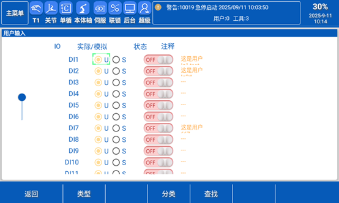

图2\-1用户I/O输入查看

| **注释：可以查看IO的注释（注释在手动操作IO界面设置）。****搜索：可以通过界面右下方的查找，来查找所需要的I\\O。** |
| --- |

**I/O信号的强制输出：**

在菜单【I/O】\-【手动输出】\-【用户输出】中，点击界面中ON或者OFF按钮，来改变I/O状态，进行用户I/O的强制输出。

图 2\-2用户I/O强制输出界面

| **注释：可以添加注释，用来描述这位I/O的含义。****查找：可以通过输入对应的IO号，来跳转到对应位置。** |
| --- |

| **警告：****通过示教器对I/O信号进行强制输出时，能够改变外围设备的状态，在某些情况下会给整个系统带来不良影响。所以请深入了解I/O信号改变带来的影响后，再进行强制I/O输出。** |
| --- |

**I/O 信号的模拟输出：**
 模拟输出功能是指在模拟状态下， 可以改变 IO 界面输出状态， 只有在手动模式才可以改变状态， 改变状态后不对外输出。 自动模式下， 模拟信号位，不能对外输出。 如需要机器人与外部进行 IO 交互， 请切换到非模拟状态。

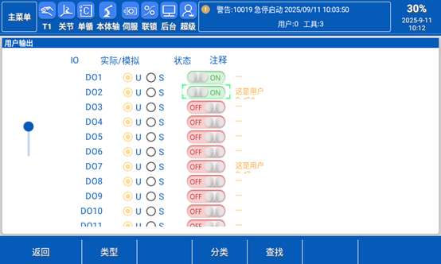

图2\-3 用户I/O的强制输出界面

**模拟：** 模拟为 S 时，改变 IO 状态。

**状态：** 改变的 IO 状态，只在手动模式下更改， 自动运行时， 模拟状态无效， 会恢复到改变前的原有状态，无法通过指令改变模拟位状态。

**I/O 信号的模拟输入：**模拟输入功能是指在模拟状态下， 可以改变 IO 界面输入状态， 只有在手动模式才可以改变状态， 改变状态后模拟输入有效。 自动模式下， 模拟信号位，不能更改输入状态。

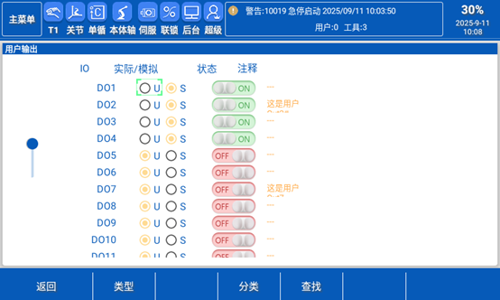

图2\-4 用户I/O的强制输出界面

**模拟：** 模拟为 S 时，改变 IO 状态。

**状态：** 改变的 IO 状态，只在手动模式下更改， 自动运行时， 模拟状态无效， 会恢复到改变前的原有状态，无法通过指令改变模拟位状态。

### 组I/O

#### 8位组I\\O

组I/O（GOB\[],GIB\[]等），是用8位I/O信号进行数据交换的一组数字信号。定义成一组的组I/O指令可以接收和发送10进制数字给外围设备，这些10进制数可以转换成2进制数，通过I/O信号来发送和接收。

8位组I/O可以配置16组，不同组中可以配置相同的I/O。

| **注意：****当不同组中，配置相同的I/O时，使用不同的组I/O输入、输出时，可以使相同的I/O产生变化，需要客户明确哪些I/O可以产生变化。** |
| --- |

**组I/O的配置：**

8位组I/O,需要对I/O进行配置。

**输出的执行：**

可以通过执行程序来进行组I/O的输出执行。

**步骤：**

点击【I/O】\-【组I/O配置】菜单，打开组I/O配置界面。配置完成之后按保存键保存。

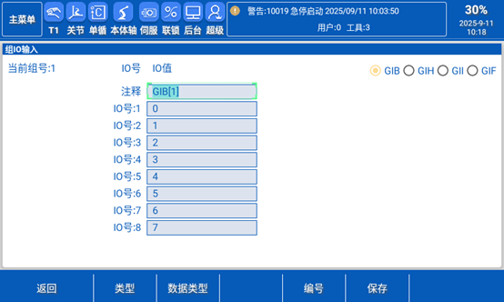

图 2\-5 8位组I/O配置界面

| **注意：****当不同组中，配置相同的I/O时，使用不同的组I/O输入、输出时，可以使相同的I/O产生变化，需要客户明确哪些I/O可以产生变化。** |
| --- |

| **注意:****请勿将用于其他用处的I/O，使用在组I/O中。比如远程I/O，或其他信号的I/O。在配置多个组IO时，请不要重复使用了在程序中已使用的或远程已配置的I/O。** |
| --- |

每一组I/O对应8位I/O点，I/O号从1到8代表二进制数字，从高位到低位。在I/O号下面写入对应的I/O点。

| **注意：****组I/O分配是对输入、输出分别进行的分配,就是说配置好一组组I/O后，输入和输出该组I/O，用的OUT\\IN逻辑编号不一定相同。** |
| --- |

1. 8位组IO输出：GOB\[1] 1、GOB\[2] 2
2. 8位组IO输入：GIB\[1] 1、GIB\[2] 2(逻辑编号可一致但不对应）

例如：指令OUT DO\[1] 139，相当于输出二进制数10001011。

表格 2\-1组IO输入映射IO举例1

| 组号 | IO号1 | IO号2 | IO号3 | IO号4 | IO号5 | IO号6 | IO号7 | IO号8 |
| --- | --- | --- | --- | --- | --- | --- | --- | --- |
| GOB\[1] | 1 | 2 | 3 | 4 | 5 | 6 | 7 | 8 |

如果进行如上的IO分配的话，机器人IO实际输出如下：

DI\[1]\=ON DI\[2]\=OFF DI\[3]\=OFF DI\[4]\=OFF DI\[5]\=ON DI\[6]\=OFF DI\[7]\=ON DI\[8]\=ON

| 注释IO号1到IO号8是从高位到低位。 |
| --- |

表格 2\-2组IO输入映射IO举例2

| 组号 | IO号1 | IO号2 | IO号3 | IO号4 | IO号5 | IO号6 | IO号7 | IO号8 |
| --- | --- | --- | --- | --- | --- | --- | --- | --- |
| GOB\[1] | 8 | 7 | 6 | 5 | 4 | 3 | 2 | 1 |

如果进行如上的IO分配的话，机器人IO实际输出如下：

DI\[8]\=ON DI\[7]\=OFF DI\[6]\=OFF DI\[5]\=OFF DI\[4]\=ON DI\[3]\=OFF DI\[2]\=ON DI\[1]\=ON

表格 2\-3组IO输入映射IO举例3

| 组号 | IO号1 | IO号2 | IO号3 | IO号4 | IO号5 | IO号6 | IO号7 | IO号8 |
| --- | --- | --- | --- | --- | --- | --- | --- | --- |
| GOB\[1] | 25 | 31 | 6 | 9 | 3 | 2 | 4 | 1 |
| 配置的信号不需要连续，不需要从大到小，上面的配置有效。 | | | | | | | | |

表格 2\-4组IO输入映射IO举例4

| 组号 | IO号1 | IO号2 | IO号3 | IO号4 | IO号5 | IO号6 | IO号7 | IO号8 |
| --- | --- | --- | --- | --- | --- | --- | --- | --- |
| GOB\[1] | 0 | 0 | 0 | 9 | 3 | 2 | 4 | 1 |
| 一组信号最多8位，可以小于8位，上面的配置有效。 | | | | | | | | |

表格 2\-5组IO输入映射IO举例（无效）

| 组号 | IO号1 | IO号2 | IO号3 | IO号4 | IO号5 | IO号6 | IO号7 | IO号8 |
| --- | --- | --- | --- | --- | --- | --- | --- | --- |
| GOB\[1] | 0 | 7 | 0 | 9 | 3 | 2 | 4 | 0 |
| 但是，配置时只能高位空缺，不能在中间或者低位空缺，上面的配置无效。指令执行时，检测到这样的配置，程序会停止运行，报：组IO配置有误错误。 | | | | | | | | |

表格 2\-6组IO输入映射IO举例（重复配置）

| 组号 | IO号1 | IO号2 | IO号3 | IO号4 | IO号5 | IO号6 | IO号7 | IO号8 |
| --- | --- | --- | --- | --- | --- | --- | --- | --- |
| GOB\[1] | 0 | 7 | 1 | 2 | 2 | 3 | 4 | 5 |
| 同一组中，配置不能重复。假如低位的2信号与高位2信号状态瞬时有差别，低位的2信号状态将覆盖高位的2信号状态，这样系统无法区分。 | | | | | | | | |

表格 2\-7组IO输入映射IO举例（范围超界）

| 组号 | IO号1 | IO号2 | IO号3 | IO号4 | IO号5 | IO号6 | IO号7 | IO号8 |
| --- | --- | --- | --- | --- | --- | --- | --- | --- |
| GOB\[1] | 0 | 0 | 0 | 0 | 3 | 2 | 4 | 1 |
| 指令不检测组I\\O输出范围超界，示教指令为OUT GOB\[1]\=25,25转换为二进制00011001，后4位IO的状态正常输出为1001，前4位不做任何处理。 | | | | | | | | |

8位组I/O支持常数范围是从0到255；

#### 16位组I\\O

16位组I/O指令为

1. 16位组IO输出：GOH\[1]、GOH\[2]
2. 16位组IO输入：GIH\[1]、GIH\[2](逻辑编号可一致但不对应）

16位的组IO需要进行分配，配置过程与8位组I/O基本相同.

16位组I/O，支持范围从0到65535\.

图2\-6 16组I/0配置界面

16位组I/O可以配置16组，不同组中可以配置相同的I/O。

| **注意：****当不同组中，配置相同的I/O时，使用不同的组I/O输入、输出时，可以使相同的I/O产生变化。** |
| --- |

| **注意:****请勿将用于其他用处的I/O，使用在组I/O中。比如远程I/O，或其他信号的I/O。在配置多个组IO时，请不要重复使用了在程序中已使用的或远程已配置的I/O。** |
| --- |

#### 32位组I\\O

32位组I\\O用途与8位或16位组I\\O相同。float或int型数据传至32位输入组IO，或将输入的32位组IO数据赋值给float或int型数据中。

32位组IO的第一组是IO位的1\-32，第二组32位组IO为33\-64，第三组32位组IO为65\-96，以此类推，最多支持128组。

以GOF\[1]配置为例，如下所示为从IO号116开始至147结束的32位组IO：

"ioindexs" :\[

140,141,142,143,144,145,146,147,

132,133,134,135,136,137,138,139,

124,125,126,127,128,129,130,131,

116,117,118,119,120,121,122,123

],

"comments" : "GOF\[1]"

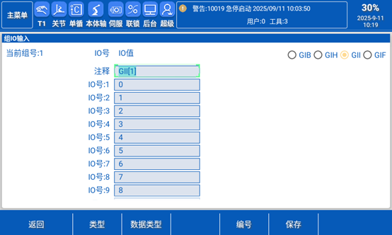

图2\-7 32位整型组I/O配置

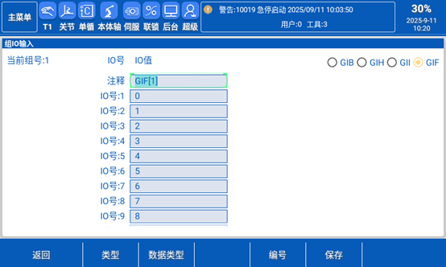

图2\-8 32位浮点型组I/O配置

32位组I/O可以配置8组，不同组中可以配置相同的I/O。

| **注意:****请勿将用于其他用处的I/O，使用在组I/O中。比如远程I/O，或其他信号的I/O。在配置多个组IO时，请不要重复使用了在程序中已使用的或远程已配置的I/O。** |
| --- |

### 远程I/O

机器人自动运行过程不仅可以通过示教器按钮来实现，还可以通过外围设备控制实现，这就是控制器的远程控制功能。示教器的模式选择开关旋转到远程时，远程功能才有效。

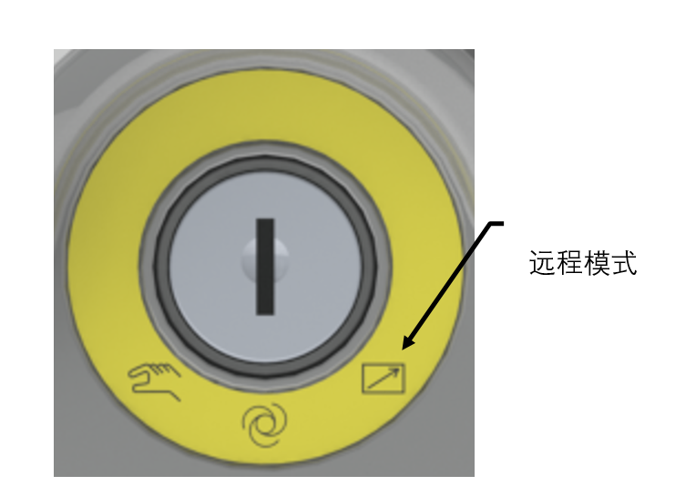

图 2\-9示教器模式选择开关

用户可以根据自己的需要进行重新配置。

例如：外部启动信号有默认IO地址，如果用户需要输入IO地址10来进行外部启动时，可以在远程IO配置中外部启动后输入10，并按保存。当系统检测到输入信号10的上升沿后，就启动运行程序。

| **注意:**1. **配置到远程I/O上的I/O被当成系统I/O进行处理，该信号不可以在程序中使用，也不可以再配置到组I/O中。如果客户进行了以上操作，在程序执行时将报警。** 2. **远程模式下，示教器停止键和V\-键、V\+键有效，其他按键都无效。示教器界面的内容可供用户查看。** |
| --- |

#### 远程输入的映射

在菜单中打开【IO】\-【远程IO映射】\-【输入】。即可打开远程输入配置界面。配置完成后，点击保存。

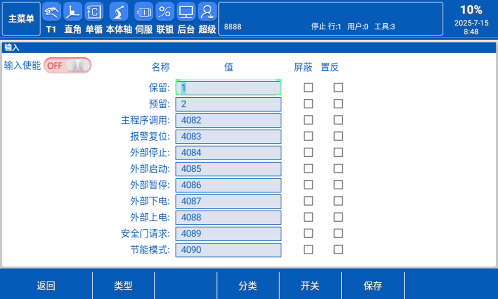

图 2‑10远程输入配置

**信号说明：**

主程序调用:此信号用来打开机器人设置好的主程序，此信号由上升沿触发。

报警复位：机器人报警复位信号，此信号由上升沿触发。

外部停止：使机器人瞬间停止，不掉电。

外部启动：使用此信号来通过外围设备启动机器人程序，此信号由上升沿触发。

外部暂停：使用此信号来暂停机器人。

外部下电：使机器人瞬间停止并下动力电。

外部上电：使用此信号来对机器人进行伺服上电操作，此信号由上升沿触发。

安全门请求：收到外部请求信号后机器人暂停。

节能模式：由外部IO信号（上升沿触发）来控制系统进入节能状态，而不采用由RC自动（计时方式）控制节能动作。如果切换屏蔽，则远程模式的节能控制与自动模式下一致，即采用计时方式节能下电（目前此功能未开发）。

开关：开启或关闭远程输入I/O的使能。

**功能说明：**

屏蔽：可以把远程IO输入的某项功能进行屏蔽，勾选进行屏蔽。

置反：默认信号ON有效，若置反勾选，则信号OFF有效。

#### 远程输出的映射

在菜单中打开【IO】\-【远程IO映射】\-【输出】。即可打开远程输出配置界面。配置完成后，点击保存。

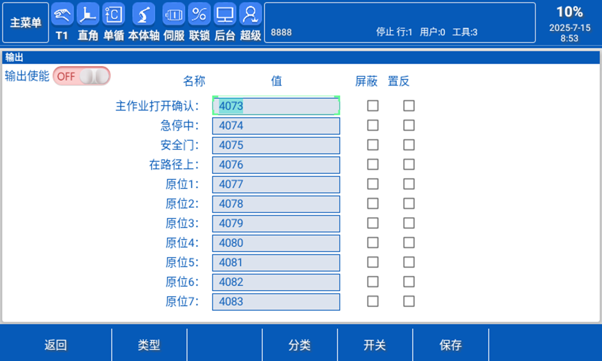

图 2\-11远程输出配置界面1

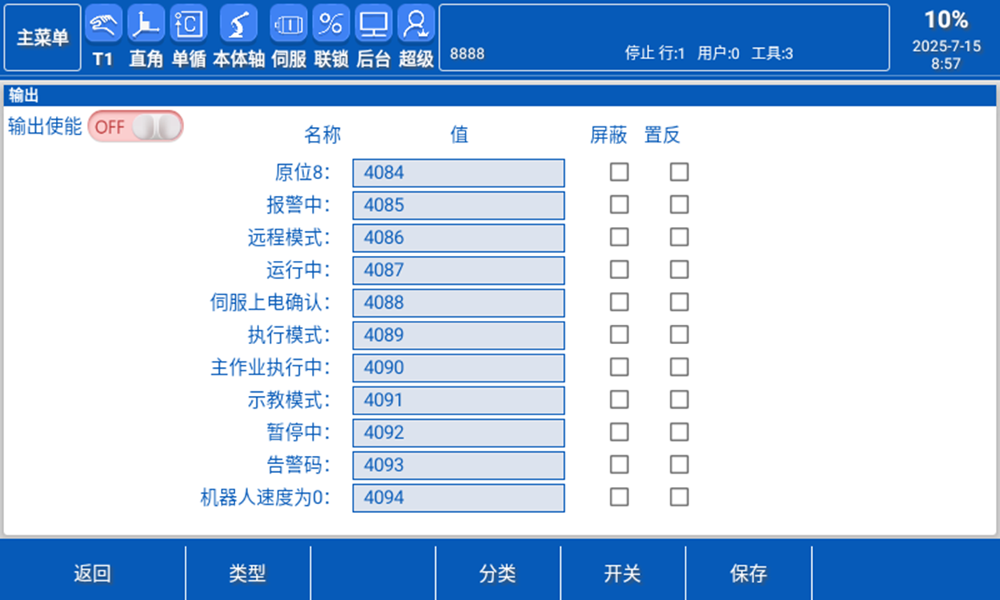

图 2\-12远程输出配置界面2

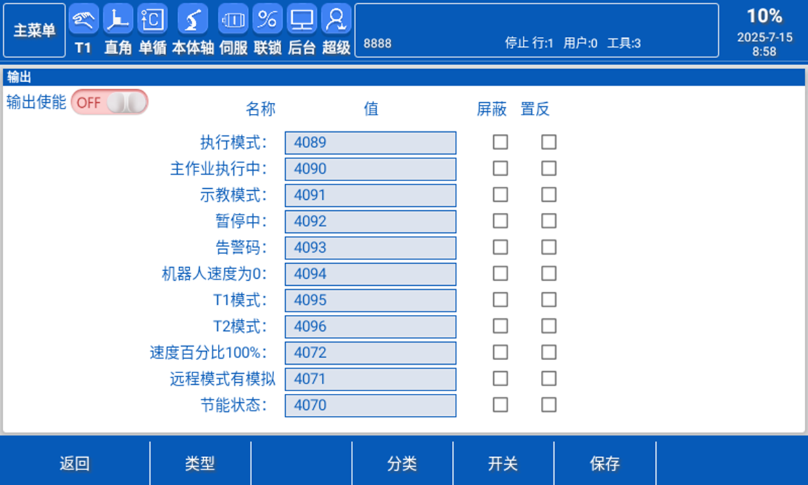

图 2\-13远程输出配置界面3

**信号说明**

开关：开启或关闭远程输出I/O的使能。

主作业打开确认:当主作业打开时，发出上升沿信号。

急停中:当急停输入信号触发时，发出上升沿信号。

安全门:当安全门信号断开时，发出上升沿信号。

在路径上:当机器人在程序执行的轨迹路径上时，发出此信号。

原位1:当机器人在原点1位置时，发出此信号。

原位2:当机器人在原点2位置时，发出此信号。

原位3:当机器人在原点3位置时，发出此信号。

原位4:当机器人在原点4位置时，发出此信号。

原位5:当机器人在原点5位置时，发出此信号。

原位6:当机器人在原点6位置时，发出此信号。

原位7:当机器人在原点7位置时，发出此信号。

原位8:当机器人在原点8位置时，发出此信号。

报警中:机器人有报警时，发出此信号。

远程模式:当机器人处于远程模式时，发出此信号。

运行中:当机器人程序在自动执行时，发出此信号。

伺服上电确认:当机器人伺服上电后，发出此信号。

执行模式:机器人在执行模式时，发出对应的信号。

主作业执行中：当机器人主作业执行中时，发出此信号。

示教模式：机器人在示教模式时，发出对应的信号。

暂停中：机器人收到暂停信号后，进行暂停时对外输出信号。

告警码：机器人收到报警消息后，对外输出信号。

机器人速度为0：机器人暂停后，实际速度为0时，对外输出信号。

T1模式：机器人在T1模式时，发出对应的信号。

T2模式：机器人在T2模式时，发出对应的信号。

速度百分比100%：机器人速度百分比为100时，发出对应的信号。

远程模式有模拟：在远程模式下，有模拟IO时，发出对应的信号。

节能状态：远程模式和执行模式下，作业执行中，机器人处于节能下电时远程输出IO状态ON，其他情况为OFF。

**功能说明：**

屏蔽：可以把远程IO输入的某项功能进行屏蔽，勾选进行屏蔽。

置反：默认信号ON有效，若置反勾选，则信号OFF有效。

### 模拟量I\\O

模拟量输入输出功能是指通过IO模块将外部设备输入的电压或者电流的模拟量值转换为数字量输出到机器人端，使得机器人端能够看到电压电流值代表的实际含义，或者将实际的数字量数据通过I\\O模块转换为电流或电压输出给外部设备。通过界面的配置以及指令实现该功能。

模拟量IO配置：点击主菜单【IO】\-【模拟量IO配置】\-【IO配置】。

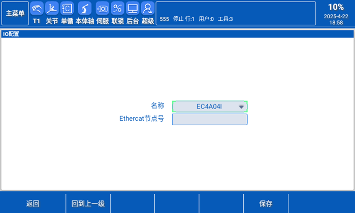

图 2‑14模拟量IO设置页面

模拟量输入IO映射：点击主菜单【IO】\-【模拟量IO配置】\-【输入IO映射】。

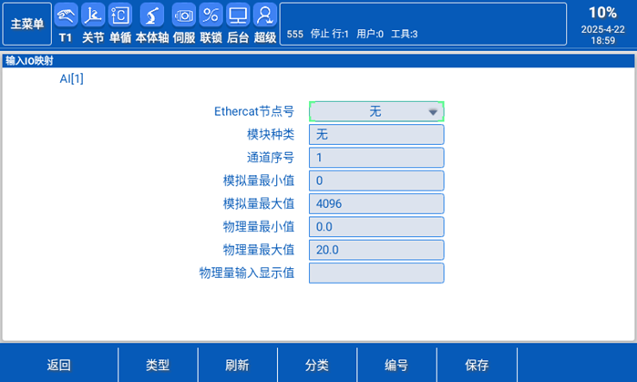

图2\-15 模拟量输入I/O映射

模拟量输出IO映射：点击主菜单【IO】\-【模拟量IO配置】\-【输出IO映射】。

图2\-16 模拟量输出I/O映射

EtherCAT节点号：根据实际连接的模拟量输入模块确定，与总线设备配置中的EtherCAT节点一致。

模块种类：对应模块的种类类型。

通道序号:对应模块中的通道号。

模拟量最小值:模拟量模块支持的最小值，模拟量最小值不能大于或等于模拟量最大值。

模拟量最大值:模拟量模块支持的最大值，模拟量最大值不能小于或等于模拟量最小值。

物理量最小值:外围设备支持的最小值，物理量最小值不能大于或等于物理量最大值。

物理量最大值:外围设备支持的最大值，物理量最大值不能小于或等于物理量最小值。

物理量输入/输出显示值：外围设备输入/输出实时显示值。

刷新:刷新物理量输入显示值。（仅在输入页面出现）

发送:发送物理量输出测试值。（仅在输出页面出现）

保存:上述参数配置好后，若数据无误，点击保存，则数据写入，若数据有误，点击保存时提示报警。

注:修改完参数后，先点【保存】按钮，然后再点【刷新】按钮，物理量实时显示值才是修改完参数后对应的数值。

模拟量输入配置：点击主菜单【IO】\-【模拟量IO配置】\-【输入IO映射】

模拟量输出配置：点击主菜单【IO】\-【模拟量IO配置】\-【输出IO映射】。

### 自定义组IO

自定义组 IO， 目前只能在弧焊应用通用焊机功能上使用。 不能在其它情况下使用。

点击组菜单\-【IO】\-【自定义组IO】，进入自定义组IO界面。按【分类】按钮可以分别进入输入、输出界面。

| **注意：****使用自定义组IO时，要避免自定义组IO点与其他系统IO和用户IO重复使用，导致IO被错误的输入或者输出。** |
| --- |

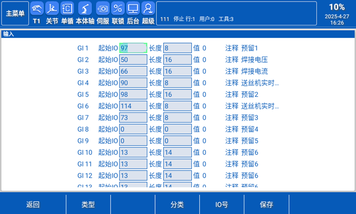

图2\-17 自定义组IO输入界面

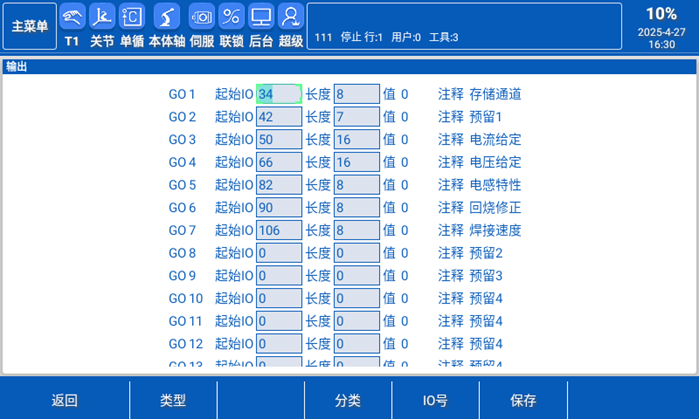

图2\-18 自定义组IO输出界面

## 设置坐标系

工业机器人的坐标系系统可以分为，表示六个轴关节值的关节坐标系，表示空间内某直角坐标系位置和姿态值的笛卡尔坐标系。

**关节坐标系：**

机器人的关节坐标系，是指每个轴以该轴的零点为基准，旋转后得到各个关节值。

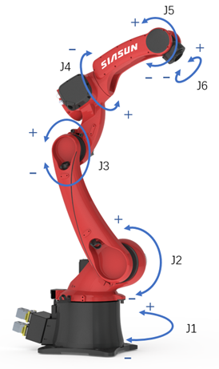

图 2‑19关节坐标系

**笛卡尔坐标系：**

笛卡尔坐标系，就是指空间上的某一个确定好的直角坐标系，其原点位置到工具坐标系的TCP点的距离X，Y，Z值，和这个直角坐标系本身X、Y、Z轴与工具坐标系的旋转角RX,RY,RZ值来确定。

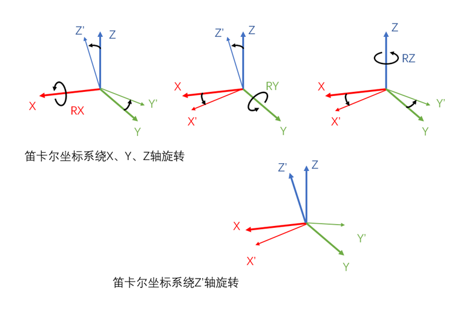

图 2‑20（Rx、Ry、Rz）含义

**坐标系的分类：**

机器人软件支持的笛卡尔坐标系有：直角坐标系，工具坐标系，用户坐标系。这三种坐标系，其实都是一种X、Y、Z轴互相垂直的直角坐标系。

**直角坐标系**

直角坐标系的原点在机器人1轴的轴线与2轴所在水平面的交点上，X轴方向指向机器人正前方，Y轴方向指向机器人水平向左的方向，Z轴方向指向底座垂直向上的方向。用户坐标系是以直角坐标系为基坐标系，进行偏移和旋转得到的。

**工具坐标系**

工具坐标系默认是在机器人腕端法兰的中心点上，当机器人在零位时，默认工具坐标系的X轴方向水平底座向右，Y轴方向垂直底座向下，Z轴方向垂直法兰面向前。可以通过标定或者设定来改变工具坐标系的TCP位置和方向。

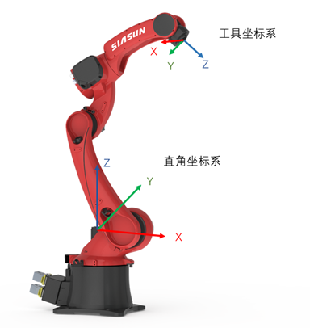

图 2‑21直角、工具坐标系

**用户坐标系：**

用户坐标系是通过对直角坐标系进行偏移和旋转而得到的、在空间上被定义的直角坐标系，默认用户坐标系在直角坐标系上。

图 2‑22用户坐标系

| **警告：****工具、用户坐标系对示教程序的轨迹有影响，如果改变坐标系的设置值，则必须对程序的运动范围重新进行设定、示教和测试，以免损坏设备。** |
| --- |

**外部工具坐标系：**

当工具装在机器人以外的位置时，标定的工具坐标系称为外部坐标系，标定方法同用户坐标系。

### 坐标系和轴运动键

**关节坐标系：**

可以控制机器人的每个轴单独进行正向、反向转动。

表格 2\-8关节坐标系下机器人的运动

| 轴名称 | 轴操作键 | 动作 |
| --- | --- | --- |
| 1轴 |  | J1轴左右转动。 |
| 2轴 |  | J2轴前后运动。 |
| 3轴 |  | J3轴上下运动。 |
| 4轴 |  | J4轴旋转。 |
| 5轴 |  | J5轴上下运动。 |
| 6轴 |  | J6轴旋转。 |

**直角坐标系：**

在直角坐标系下，机器人TCP点会在平行于直角坐标系的X、Y、Z轴的直线进行运动。也可以以TCP点为中心，保持TCP位置不变的同时，按平行于直角坐标系X、Y、Z轴的直线（方向与各轴相同）的方向进行旋转运动，从而改变机器人姿态。

表格 2\-9直角坐标系下机器人的运动

| 轴名称 | 轴操作键 | 动作 |
| --- | --- | --- |
| X轴 |  | TCP平行于X轴移动。 |
| Y轴 |  | TCP平行于Y轴移动。 |
| Z轴 |  | TCP平行于Z轴移动。 |
| Rx轴 |  | TCP沿X轴旋转，改变姿态。 |
| Ry轴 |  | TCP沿Y轴旋转，改变姿态。 |
| Rz轴 |  | TCP沿Z轴旋转，改变姿态。 |

**工具坐标系：**

在工具坐标系下，机器人TCP点会在工具定义的X、Y、Z轴的方向进行直线运动。也可以以TCP点为中心，保持TCP位置不变的同时，按工具坐标系X、Y、Z轴的方向进行旋转运动，从而改变机器人姿态。

表格 2\-10工具坐标系下机器人的运动

| 轴名称 | 轴操作键 | 动作 |
| --- | --- | --- |
| X轴 |  | TCP平行于X轴移动。 |
| Y轴 |  | TCP平行于Y轴移动。 |
| Z轴 |  | TCP平行于Z轴移动。 |
| Rx轴 |  | TCP沿X轴旋转，改变姿态。 |
| Ry轴 |  | TCP沿Y轴旋转，改变姿态。 |
| Rz轴 |  | TCP沿Z轴旋转，改变姿态。 |

**用户坐标系：**

在用户坐标系下，机器人TCP点会在平行于用户系定义的X、Y、Z轴的直线进行运动。也可以以TCP点为中心，保持TCP位置不变的同时，按平行于用户坐标系X、Y、Z轴的直线（方向与各轴相同）的方向进行旋转运动，从而改变机器人姿态。

表格 2\-11直角坐标系下机器人的运动

| 轴名称 | 轴操作键 | 动作 |
| --- | --- | --- |
| X轴 |  | TCP平行于X轴移动。 |
| Y轴 |  | TCP平行于Y轴移动。 |
| Z轴 |  | TCP平行于Z轴移动。 |
| Rx轴 |  | TCP沿X轴旋转，改变姿态。 |
| Ry轴 |  | TCP沿Y轴旋转，改变姿态。 |
| Rz轴 |  | TCP沿Z轴旋转，改变姿态。 |

### 设定工具坐标系

工具坐标系，可以表示工具中心点（TCP点）相对法兰的位置值和姿态值。一般情况下，工具坐标系的Z轴方向，就是工具指向的方向。

工具坐标系由6个值来定义，包含TCP点的位置值（X，Y，Z）和TCP各轴的旋转角度值（RX，RY，RZ）。

TCP点相对于法兰中心点的距离由X，Y，Z值来确定，TCP各轴相对于于法兰坐标系的旋转角度由RX，RY，RZ值来确定。

当工具坐标系设置或者标定成功后，手动机器人直线运动时，会以TCP点作为移动的点，也会以TCP点作为旋转的中心点，并按照所选择的坐标系方向进行运动。

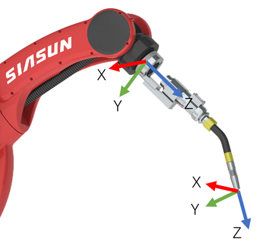

图 2‑23工具坐标系

| **注意：****在关节坐标系下使用轴运动键单轴运动轴时，轴运动关节值不会随着工具坐标系或用户坐标系的变化而变化，但程序自动运行或手动正向运动时，机器人的位置和姿态都会受到工具和用户坐标系的影响。** |
| --- |

坐标系的TCP由下面的方法确定：

工具坐标系设定。

工具坐标原点标定有两种方法：5点法、20点法。

20点法与5点法的区别：20点法改变机器人原零位。

20点法与5点法相同点：可以标定出机器人工具坐标原点，使用同一个工具坐标系号标定时,后标定的值会覆盖先标定的值。

**20点工具坐标系标定：**

20点法可以确定

* 1. 工具中心点，即工具坐标原点相对于法兰中心点的x，y，z值。
	2. 更新机器人零位。

| **注意：在标定前，请确认机器人零位，各轴零位偏差基于标签位置要小于5°，否则20点标定后计算时会出现标定失败。零位补偿最大值是5度。外部标定针尖要高于直角坐标原点（一轴与二轴交叉的点）。** |
| --- |

20点法标定步骤：

* 1. 点击主菜单中的【坐标】\-【工具坐标】\-【20点标定】，进入标定界面。

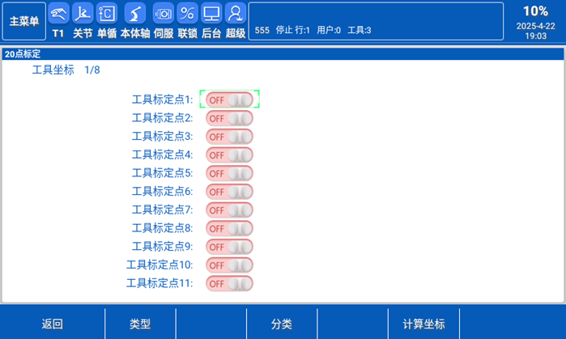

图 2‑24 20点工具标定界面

* 1. 标定工具需要，选择标定针与选择一个固定的参考点（针尖）。如图所示，工具标定针安装到机器人上，标定参考针固定到机器人外，保证标定的时候位置固定。

图 2‑25标定工具

* 1. 依次以20个不同姿态对准参考点，并点击OFF，当OFF变成ON后，此点即被成功标定，点击ON，当ON变OFF后，此点即被取消。工具坐标一共8个。编号显示在界面左上方的工具号上。
	2. 每个点的选择，20个点差异越大越好。建议20个点的选择，使用直角坐标系进行标定，第1点工具针姿态垂直向下，第2\-4点走Rx\+每30°选一个点，回到垂直，第5\-7点走Rx\-每30°选一个点，回到垂直，第8\-10点走Ry\+每30°选一个点，回到垂直，第11\-13点走Ry\-每30°选一个点，回到垂直，第14\-17点走Rz\+每40°选一个点，回到垂直，第18\-20点走Rz\-每50°选一个点。

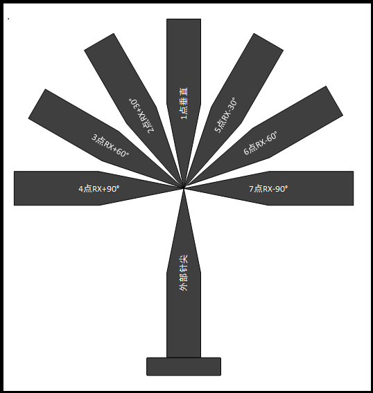

图 2‑26 1\-16点标定示意图

* 1. 保存标定结果，松开使能按键，点击【保存】会提示保存成功，同时标定信息更新完成。
	2. 标定的结果，显示在对应文件号的设定界面，为Px、Py、Pz的值。

| **注意**1. **标定点不完整，点击【计算坐标】会弹出【工具坐标系标定计算失败】，请补充没有标定的点或重新标定。** 2. **点击取消，标定结果不保存，零位不更新，标定的位置与状态不变。** 3. **20点标定会改变零位，保存后会对零位进行更新，从而影响原程序位置点。保存前请确认。** 4. **使用20点标定，之前标定的文件号中点位数据清空，由ON变成OFF。** 5. **标定点状态保存，在页面关闭后，重新打开，状态为关闭前的状态。标定并计算结果完成后，ON也不变成OFF。** |
| --- |

**5点法进行标定：**

5点法可以确定工具中心点，即工具坐标原点相对于法兰中心点的x，y，z值。使用手动运动机器人，使机器人工具中心点以5种不同的姿态指向同一点。系统将自动计算TCP位置值。请在示教时，尽量使5个不同方向的姿态来接近目标点。

**注意：**

**目标点要高于直角坐标原点（一轴与二轴交叉的点）。**

5点法标定之后 ，只能确定工具的TCP点（x，y，z），此时工具的姿态值(Rx，Ry，Rz)是默认的（0,0,0）。

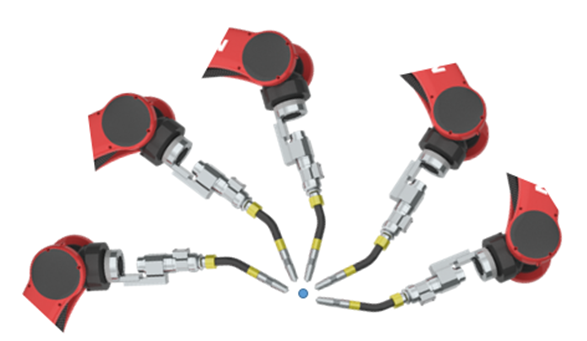

图 2‑27通过5点法进行标定工具TCP

5点法标定步骤：

1. 点击主菜单中的【坐标】\-【工具坐标】\-【标定】，进入工具坐标系标定界面。

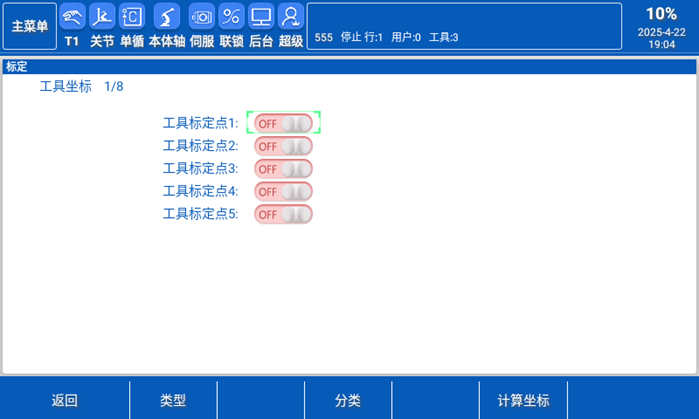

图 2‑28工具坐标系标定界面

1. 依次以五个不同姿态接近同一个目标点，并点击OFF，当OFF变成ON后，此点即被成功标定，按计算坐标结束标定。工具坐标一共8个。编号显示在界面左上方的工具号上。
2. 标定的结果，显示在对应文件号的设定界面，为Px、Py、Pz的值。

**工具姿态标定：**

先使用5点法标定工具TCP，然后标定姿态。标定工具姿态在空间的任意一点，再沿着X轴平行方向标定工具的X方向，最后在工具Z轴正方向XZ平面上的一点标定工具Z正方向。

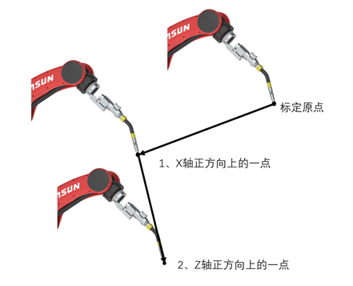

图 2‑29标定用具坐标系方向

姿态标定步骤：

| **注意：****如果标定好的坐标号之前有标定过工具坐标，那么这个工具坐标的姿态值有可能不****为（0,0,0），请到工具设定中，重新改为（0,0,0），之后再进行重新标定姿态。** |
| --- |

1. 点击主菜单上的【坐标】\-【工具坐标】\-【姿态标定】。

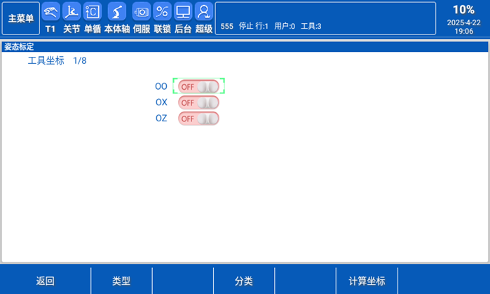

图 2‑30工具坐标系姿态标定界面

1. 首先标定TCP在空间上的选定点，再标定工具坐标X轴正方向上的一点和Z轴正方向XZ平面上的一点。在三个点处,点击OFF/ON，进行标定。
2. 标定结束后，按计算坐标。
3. 标定的结果，显示在对应文件号的设定界面，为Rx、Ry、Rz的值。

| **注意：****同一坐标的TCP和姿态需要在同一个工具号下进行标定。** |
| --- |

工具坐标系的设定步骤：

1. 点击主菜单【坐标】\-【工具坐标】\-【设定】。

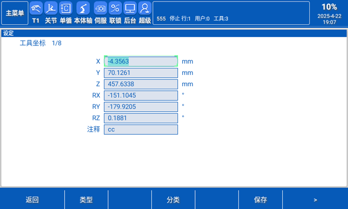

图 2‑31工具坐标系的设置界面

1. 依次填入X、Y、Z、Rx、Ry、Rz值，完成后点击保存。

注释：可以添加注释。

工具坐标系的选择对作业的影响：

示教作业时可以选择需要使用的工具坐标系号，在选择完工具坐标系后，位置变量获取的数值会受其影响；

如果工具坐标系发生了改变，在该工具坐标系下示教完成的作业可能无法正确的在执行模式下自动运行。如需要运行该作业，则要使用新设定的坐标系对作业位置变量重新进行示教。

| **注意：*** + 1. **为了避免工具坐标系的混乱，建议在使用已有的位置变量时确认其使用的工具坐标系是否符合预期，避免因位置变量内保存的工具坐标系有误，造成执行作业时的机器人轨迹错误。** 		2. **使用多个工具坐标系的情况下，添加和插入指令前需要确定当前位置变量使用的坐标系号为客户想要使用的工具坐标系号。** 		3. **如果需要改变作业中使用的工具坐标系文件（例如重新标定），则需要确认该作业内所有的点所使用的工具坐标系文件，并对该作业内使用新工具坐标系号的所有点使用正向运动进行验证。具体的验证方法为：确认或更改当前位置变量内工具坐标系号为新设定的工具坐标系号，再使用正向运动进行验证。** |
| --- |

### 设定用户坐标系

用户坐标系是建立在空间上的一个直角坐标系，是以直角坐标系为基坐标系，进行偏移和旋转而得到。用户坐标系默认是在直角坐标系上，用户坐标系0在直角坐标系上不可以修改。

用户坐标系的有位置值(X,Y,Z)和姿态值（RX,RY,RZ）构成，其中位置值是用户坐标系原点距离直角坐标系的距离，姿态值是用户坐标系各轴相对于直角坐标系各轴的旋转角度。用户坐标系数量为0\-8，可根据情况进行切换。

| **注意：****在关节坐标系下使用轴运动键单轴运动轴时，轴运动关节值不会随着工具坐标系或用户坐标系的变化而变化，但程序自动运行或手动正向运动时，机器人的位置和姿态都会受到工具和用户坐标系的影响。** |
| --- |

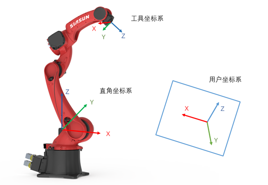

图 2‑32用户坐标系

直接设置

在设置界面直接输入相对于直角坐标系下的用户坐标系的位置与姿态。

3点法示教：

对用户坐标系的原点，X轴方向的点、XY平面上的点进行3点进行示教。

 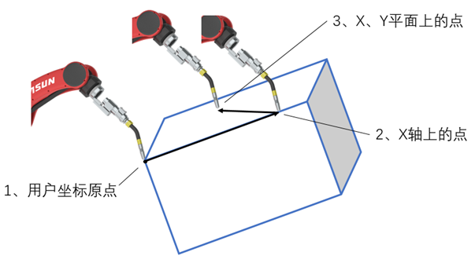

图 2‑33 3点法示教用户坐标系

用户坐标系标定步骤：

1. 点击主菜单【坐标】\-【用户坐标】\-【标定】。

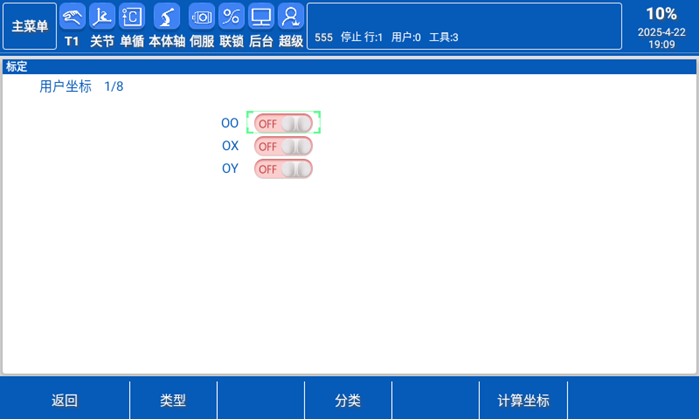

图 2‑34用户坐标系标定界面

1. 移动机器人到用户坐标的原点、X轴上的点，XY平面上的点，依次点击位置对应的OFF，记录当前位置，3点都显示为ON后，点击计算坐标，标定完成。

**用户坐标系设定步骤：**

1. 点击主菜单【坐标】\-【用户坐标】\-【设定】。打开用户坐标系设置界面。

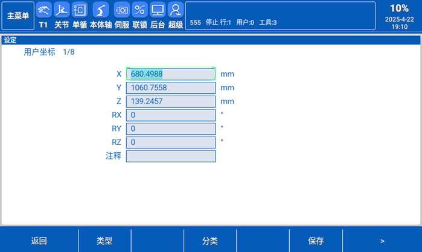

图 2‑35用户坐标系设置界面

1. 在对应的位置填入正确的参数，按保存即可设定好用户坐标系。同时标定好的用户坐标系也可以在这里进行查看。

注释：可以添加注释。

**用户坐标系旋转标定步骤：**

旋转标定用户系功能适用于通过旋转的方式标定圆盘形状物体的用户系，标定的用户系原点在圆心，用户系X方向沿圆盘径向方向，Z方向为圆盘法向量方向。

1. 点击主菜单【坐标】\-【用户坐标】\-【旋转标定】

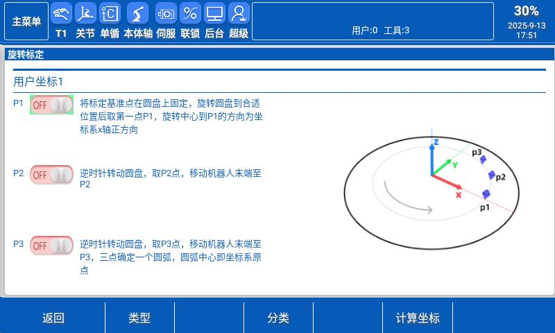

图 2‑36用户坐标系设置界面

1. 将标定基准点在圆盘上固定，旋转圆盘到合适的位置后取第一点P1，旋转中心到P1的方向为用户系X轴正方向。
2. 逆时针转动圆盘，标定基准点运动到P2点，取P2点。
3. 逆时针转动圆盘，标定基准点运动到P3点，取P3点。
4. 点击计算坐标按钮可完成用户系的标定。

**用户坐标系的选择对作业的影响：**

示教作业时可以选择需要使用的用户坐标系号，在选择完用户坐标系后，位置变量获取的数值会受其影响；

如果用户坐标系发生了改变，在该用户坐标系下示教完成的作业可能无法正确的在执行模式下自动运行。如需要运行该作业，则要使用新设定的坐标系对作业位置变量重新进行示教。

| **注意：*** + 1. **为了避免用户坐标系的混乱，建议在使用已有的位置变量时确认其使用的用户坐标系是否符合预期，避免因位置变量内保存的用户坐标系有误，造成执行作业时的机器人轨迹错误。** 		2. **使用多个用户坐标系的情况下，添加和插入指令前需要确定当前位置变量使用的坐标系号为客户想要使用的用户坐标系号。** 		3. **如果需要改变作业中使用的用户坐标系文件（例如重新标定），则需要确认该作业内所有的点所使用的用户坐标系文件，并对该作业内使用新用户坐标系号的所有点使用正向运动进行验证。具体的验证方法为：确认或更改当前位置变量内用户坐标系号为新设定的用户坐标系号，再使用正向运动进行验证。** |
| --- |

### 设定外部工具坐标系

通常情况下，都是在机器人法兰盘上安装夹具，然后对工件进行取放等一些操作。但有些特殊情况，需要将工具安装到机器人外部，机器人夹取工件到外部工具上进行加工。例如打磨，一般砂带机都安装在地面上，与机器人分开，机器人夹取工件到砂带上进行打磨。

实现外部工具标定需要做一下几项：

1. 对机器人进行工具坐标系标定，5点法标定（详见2\.2\.2设定工具坐标系说明）。
2. 需要已标定的工具坐标系TCP点去标定外部工具坐标系。
3. 以机器人TCP点对上外部TCP标定外部工具的00点。
4. 外部工具标定。

外部工具坐标系标定步骤：

按照路径【坐标】\-【外部工具】\-【标定】可以打开外部工具标定界面。

外部工具标定方法与用户坐标系标定方法相同，最多支持3组外部工具的标定与设定。

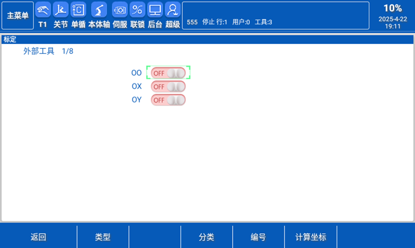

图 2\-37外部工具标定页面

工具坐标系设定步骤：

按照路径【坐标】\-【外部工具】\-【设定】可以打开外部工具设定界面。

外部工具设定页面直接输入外部工具数值设定。

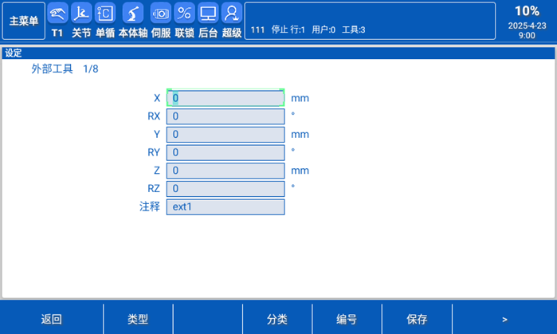

图 2\-38外部工具设定页面

标定完成后，如果使用外部TCP，需要把外部工具进行使能ON。

示教操作机器人：

关节坐标：

外部TCP与本体TCP运动无区别。

世界坐标：

外部TCP与本体TCP运动无区别。

用户坐标：

外部TCP与本体TCP运动无区别。

工具坐标：

外部工具使能时：按X/Y/Z键，机器人本体TCP按照外部TCP的X/Y/Z方向运动；

按Rx/Ry/Rz键，机器人本体TCP绕着外部TCP的原点旋转；

| **注释：****外部TCP使能，只对工具坐标系的轴运动有效，对其他轴操作无效，对自动执行的指令也无效。即使外部TCP没有使能，如果示教了MOVL P2 VL\=1000 CP0 ACC100 ET\#1指令，也执行外部TCP运动规划轨迹。** |
| --- |

### 当前坐标系

按照路径【坐标】\-【当前坐标】可以进入当前坐标系设定界面。

当前坐标系页面可选择当前使用的工具坐标系号和用户坐标系号,点击刷新可以同步机械臂当前坐标系使用情况至本页面，点击工具保存和用户保存后将坐标系设定同步至机械臂并显示于状态栏。

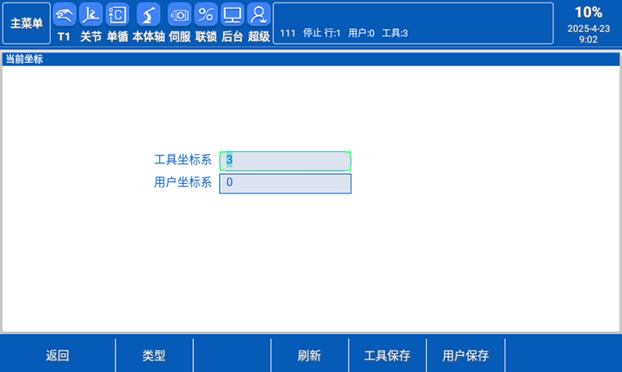

图 2\-39当前坐标设定页面

## 设置原点

原点是机器人在程序中经常使用的固定位置。原点通常是在外围设备的干涉区外，有一定运动空间的安全位置。

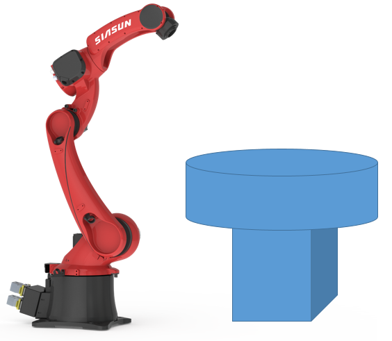

图 2\-40原点位置

当机器人位于原点位置时，会输出一个信号给外围设备，这个信号可以在远程IO中配置。

### 原位设定与标定

原为设定与标定步骤：

1. 点击主菜单【用户配置】\-【原位记录】\-【原位】，进入原位设定界面。

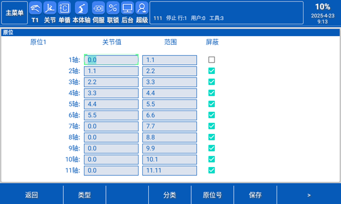

图 2\-41原位设定与标定界面

1. 也可以通过在界面直接输入各轴关节值，来设定原点位置。
2. 按保存键保存。
3. 范围：在对应轴的输入框后面可设置各轴原点有效范围的值，原位有限范围的阈值为0～50°。比如原位1的2轴原点值为20°，2轴范围设为2°时，则机器人2轴处于18°～22°范围内时，2轴即在原点范围内。
4. 屏蔽：屏蔽该轴的原位设定。

## 各轴软限位

各轴的软限位，是控制系统通过软件，来限制机器人各轴的运动范围的一种功能。机器人软限位默认值出厂已经设置好，如果需要改变，则可以通过此功能进行变更。

| **注释：机器人软限位设置，只能将机器人的运动范围比默认的小，不能扩大机器人的运动范围。** |
| --- |

最大值：

表示机器人轴运动范围的最大值。

最小值：

表示机器人轴运动范围的最小值。

进入软限位界面步骤：

* 1. 点击主菜单【系统参数】\-【控制参数】\-【软限位】，进入软限位界面。

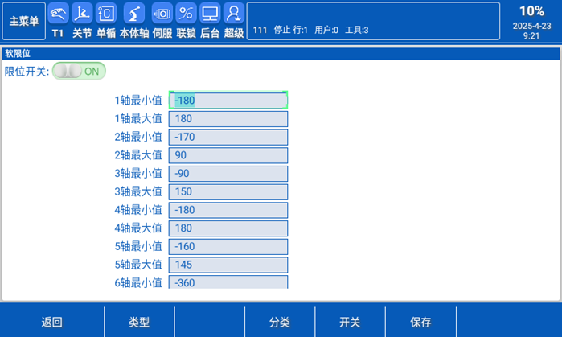

图 2\-42软限位界面

* 1. 输入希望的各轴最大、最小值。
	2. 点击保存并重启机器人。

| **警告****要使软限位设定值生效，务必重新启动机器人，以免造成意外的伤害和损失。** |
| --- |

限位开关：

机器人刚到现场，或者调试时，容易使机器人的轴超出软件限位而报警，导致机器人无法运动。所以请按照需求决定是否释放开软限位。

使能或释放软限位步骤：

* 1. 点击主菜单【系统参数】\-【控制参数】\-【软限位】，进入软限位界面。

图 2\-43限位开关界面

* 1. 点击限位开关ON\\OFF或下方的“开关”按钮，即可使能或释放软限位。两个开关，一个是通过屏幕来改变状态，一个是通过对应的按键改变状态。

| **注释：****使能是使软限位有效，释放是使软限位无效。** |
| --- |

| **警告：****释放软限位后，机器人只能向限位内运动，操作者向限位外运动时报警，必须谨慎、慢速操作机器人，以免发生碰撞，同时操作结束后，要重新使软限位有效。** |
| --- |

## 干涉区

干涉区是为了防止同一工位上的不同机器人之间，或者机器人与周围设备之间发生干涉，而设置的干涉区功能。

干涉区的设定有四种方式：球体干涉区、圆柱体干涉区、立方体干涉区、轴干涉区。

机器人系统会根据TCP点的位置、或者各轴的关节角度来判断，机器人是否在干涉区内，或者在干涉区外，并将判断结果转化为IO信号，对外部接收设备进行输出。

### 轴干涉区

轴干涉区，是以机器人当前关节角度来判断机器人是否在干涉区内、或者在干涉区外的一种干涉区设置方式。

轴干涉区，需要在界面中设定好机器人各轴干涉区的最大角度值和最小角度值。并判断机器人当前各轴的关节值是否在设定值的范围内或者范围外，并且根据设置的方式，来判定是否需要输出IO信号，以及是否需要停止机器人并报警，或者只发出提示信息。

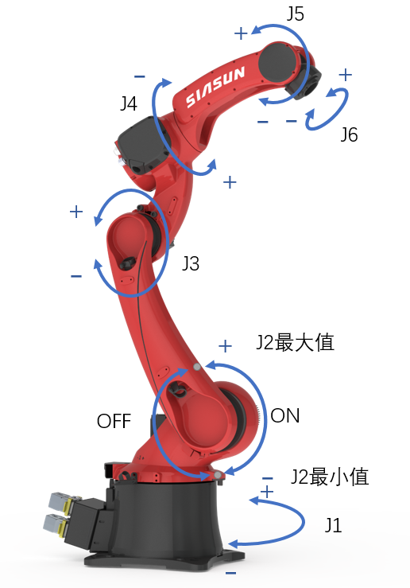

图2\-44 轴干涉区信号（J2轴）

轴干涉区设置步骤：

1. 点击主菜单【用户配置】\-【干涉区】\-【轴干涉】，进入轴干涉区配置界面。

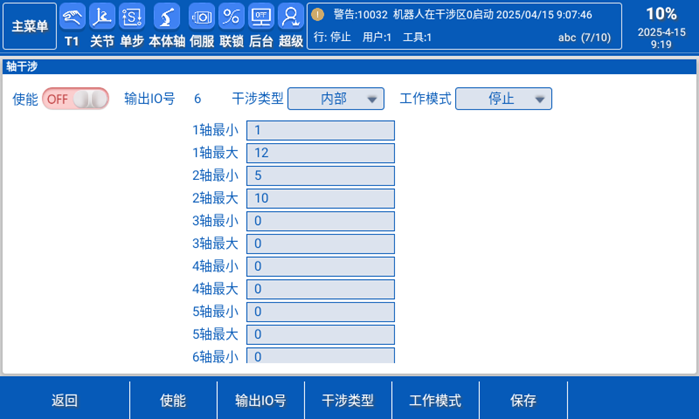

图 2\-45轴干涉区配置界面

1. 在界面里输入各项参数，保存即可完成轴干涉区的配置。

**参数说明：**

**使能：**

通过使能按钮来激活轴干涉区，状态为ON和OFF两种。ON为轴干涉区被激活，OFF为轴干涉区没有被激活。

**干涉类型：**

可选择内部干涉和外部干涉两种。

内部：最大值和最小值范围内为干涉区域。

外部：最大值和最小值范围外为干涉区域。

**工作模式：**

工作模式支持通知、停止两种。

通知型：机器人TCP进入干涉区，输出IO置ON。

停止型：机器人TCP进入干涉区，输出IO置ON，同时机器人停止运动，报警2290：禁止进入干涉区。

**具体执行方式：**

轴干涉的模式供分为4种，根据不同的值代表不同的意义；

1：机器人在干涉区内时，对应的输出信号输出ON。

2：机器人在干涉区外时，对应的输出信号输出ON。

3: 机器人在干涉区内时，对应的输出信号输出ON，机器人暂停并报警。

4: 机器人在干涉区外时，对应的输出信号输出ON，机器人暂停并报警。

**最小值：**

表示机器人关节运动的下限值。

**最大值：**

表示机器人关节运动的上限值。

**输出I\\O:**

当机器人达到干涉区判定条件时，输出的具体IO点。这个值可以在【空间干涉属性】界面中，进行修改，也可以是使用【轴干涉区】\-【输出IO号】按钮进行修改，当修改输出IO号时，所有的干涉区的输出IO号都一起被修改。

| **注意：****1）新增的干涉区必须按下立即生效按钮后，或者重启后，该干涉区才有效。****2）干涉区生效后，机器人会开始监控tcp位置，在满足干涉区条件后，对设定的输出IO产生相应IO信号输出。****3）触发干涉区后，会依照设定的通知、停止型工作模式，进行触发。如果设定为停止型，则需要首先关闭干涉区系统的使能，取消报警，才能继续移动机器人。** |
| --- |

| **警告：****输出IO号有两个地方可以进行修改，轴干涉区界面\-【输出IO号】按钮，和空间干涉区属性界面\-【输出IO号】框，两个地方修改是同步的，并且是对所有干涉区的输出IO进行修改，务必仔细确定IO信号的交互后，再进行修改。** |
| --- |

| **警告：****1）如果将模式设置为暂停并发出报警时，当机器人到达干涉区后，会开始停止运动，并停止在干涉区内的一段距离中，所以设置空间形状干涉区时，需要比实际的干涉形状更大一些，这样可以保证机器人完全停止时，不会与实际物体发生碰撞。****2）当两个机器人或者设备，因为干涉区相互卡死时，手动使机器人进入或离开干涉区前，需要将互通干涉信号的机器人或者外围设备按下急停按钮，并关闭相关机器人的干涉区功能的使能，以防止当移动其中一台机器人进入或离开干涉区时，干涉区输出信号改变，使等待干涉信号的外围设备或机器人运动，造成人员伤亡或设备损坏。****3）即使在机器人之间或者机器人与外部设备之间，使用了干涉区功能，也需要在程序中，对互相干涉的机器人或设备之间进行信号交互，而不能仅仅使用干涉区的输出信号进行交互，要使程序中的信号与干涉区输出信号都满足条件时，机器人或外部设备才可以进入干涉区。****4\)干涉区生效后，需要进行测试有效后，才可以投入使用。** |
| --- |

### 空间干涉属性

空间干涉属性用于配置该干涉区系统的输出信号、干涉类型、工作模式。

空间干涉区设置步骤：

1. 点击【用户配置】\-【干涉区】\-【空间干涉属性】，进入空间干涉区属性配置界面。

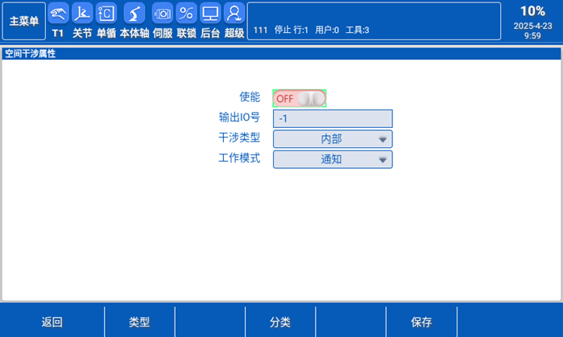

图 2\-46空间干涉区属性配置界面

1. 输入各项参数后，点击保存。

参数说明：

使能：

配置该干涉区属性是否生效，ON生效，OFF无效。

| **注意：****当使能按钮开启后，所有的空间形状干涉区功能，都被设置为有效。** |
| --- |

输出IO：

配置该干涉区的输出IO号，当RC判断机器人干涉条件满足后，输出该IO信号。

干涉类型：

可选择内部干涉和外部干涉两种。

内部：空间形状的内部为干涉区域。

外部：空间形状的外部为干涉区域。

工作模式：

工作模式支持通知、停止两种。

通知型：机器人TCP进入干涉区，输出IO置ON。

停止型：机器人TCP进入干涉区，输出IO置ON，同时机器人停止运动，报警2290：禁止进入干涉区。

| **注意：**1. **新增的干涉区必须按下立即生效按钮后，该干涉区才有效。** 2. **干涉区生效后，机器人会开始监控tcp位置，在满足干涉区条件后，对设定的输出IO产生相应IO信号输出。** 3. **触发干涉区后，会依照设定的通知、停止型工作模式，进行触发。如果设定为停止型，则需要首先关闭干涉区系统的使能，取消报警，才能继续移动机器人。** |
| --- |

### 空间形状设定

设定空间形状干涉区有3种方式：立方体干涉区、圆柱体干涉区、球体干涉区。支持通过若干个独立形状的干涉区进行叠加、并列，从而获得较为复杂的干涉区。RC会根据机器人TCP点当前所在的位置，来判定机器人是否在这些空间区域内，或者区域外，并且根据设置的方式，来判定是否需要输出IO信号，以及是否需要停止机器人并报警，或者只发出信号。

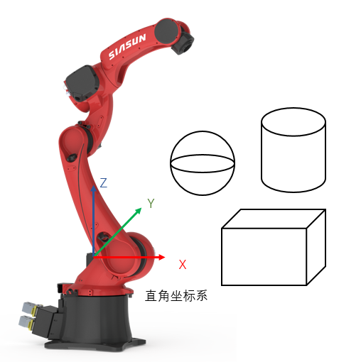

图2\-47空间形状干涉区

立方体干涉区标定步骤：

1. 点击【用户配置】\-【干涉区】\-【立方体设定】，进入立方体设定页面。

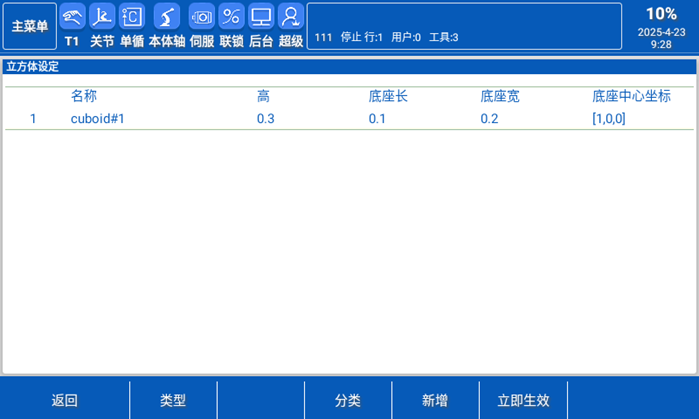

图 2\-48立方体干涉区配置界面

1. 按下新增按钮，进入设定页面，输入各项参数后，点击保存。

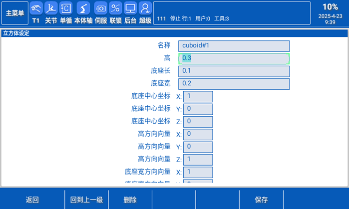

图 2\-49立方体干涉区新增界面

1. 点击“回到上一级”按钮回到设定页面，按下“立即生效”按钮使列表内的干涉区生效。

参数说明：

名称：立方体干涉区的名称。

高：立方体的高（单位：米）。

底座长：立方体底座的长（单位：米）。

底座宽：立方体底座的宽（单位：米）。

底座中心坐标系：立方体干涉区底座中心点相对于机器人基坐标系的X、Y、Z的坐标值。

高方向向量X\\Y\\Z：高方向的向量X\\Y\\Z值。

底座宽方向向量X\\Y\\Z：底座宽方向的向量X\\Y\\Z值。

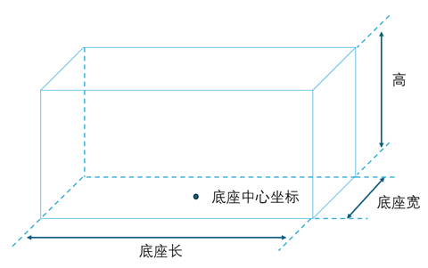

图 2\-50立方体干涉区

| **注意：**1. **点击立即生效按钮后，不仅仅只是当前形状的干涉区会生效，其他形状的干涉区设定如果被修改，也会在点击这个按钮后，一起生效。重启也会使修改过的干涉区设定生效。** 2. **干涉区生效后，需要进行测试后，才可以投入使用。** |
| --- |

| **警告：**1. **如果将模式设置为暂停并发出报警时，当机器人到达干涉区后，会开始停止运动，并停止在干涉区内的一段距离中，所以设置空间形状干涉区时，需要比实际的干涉形状更大一些，这样可以保证机器人完全停止时，不会与实际物体发生碰撞。** 2. **当两个机器人或者设备，因为干涉区相互卡死时，手动使机器人进入或离开干涉区前，需要将互通干涉信号的机器人或者外围设备按下急停按钮，并关闭相关机器人的干涉区功能的使能，以防止当移动其中一台机器人进入或离开干涉区时，干涉区输出信号改变，使等待干涉信号的外围设备或机器人运动，造成人员伤亡或设备损坏。** 3. **即使在机器人之间或者机器人与外部设备之间，使用了干涉区功能，也需要在程序中，对互相干涉的机器人或设备之间进行信号交互，而不能仅仅使用干涉区的输出信号进行交互，要使程序中的信号与干涉区输出信号都满足条件时，机器人或外部设备才可以进入干涉区。** 4. **干涉区生效后，需要进行测试后，才可以投入使用。** |
| --- |

圆柱体干涉区标设定步骤：

1. 点击【用户配置】\-【干涉区】\-【圆柱体设定】，进入圆柱体设定页面。

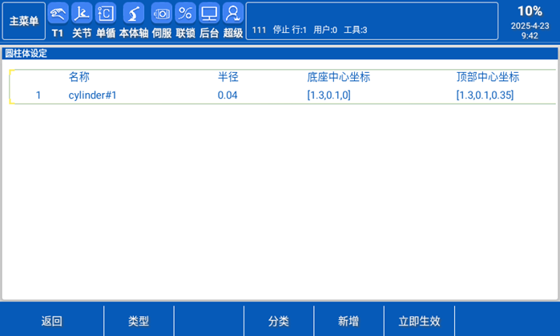

图 2\-51圆柱体干涉区配置界面

1. 按下新增按钮，进入设定页面，输入各项参数后，点击保存。

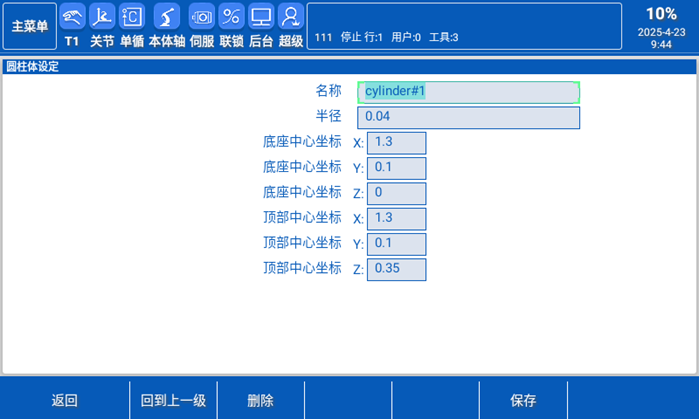

图 2\-52圆柱体干涉区

1. 点击“回到上一级”按钮回到设定页面，按下“立即生效”按钮使列表内的干涉区生效。

参数说明：

名称：圆柱干涉区的名称。

半径：圆柱干涉区的底面圆的半径（单位：米）。

底座中心坐标：圆柱干涉区底座中心相对于机器人基坐标系的X、Y、Z值（单位：米）。

顶部中心坐标：圆柱干涉区顶部中心相对于机器人基坐标系的X、Y、Z值（单位：米）。

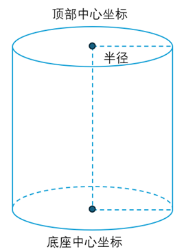

图2\-53 立方体干涉区

| **注意：**1. **点击立即生效按钮后，不仅仅只是当前形状的干涉区会生效，其他形状的干涉区设定如果被修改，也会在点击这个按钮后，一起生效。重启也会使修改过的干涉区设定生效。** 2. **干涉区生效后，需要进行测试后，才可以投入使用。** |
| --- |

| **警告：**1. **如果将模式设置为暂停并发出报警时，当机器人到达干涉区后，会开始停止运动，并停止在干涉区内的一段距离中，所以设置空间形状干涉区时，需要比实际的干涉形状更大一些，这样可以保证机器人完全停止时，不会与实际物体发生碰撞。** 2. **当两个机器人或者设备，因为干涉区相互卡死时，手动使机器人进入或离开干涉区前，需要将互通干涉信号的机器人或者外围设备按下急停按钮，并关闭相关机器人的干涉区功能的使能，以防止当移动其中一台机器人进入或离开干涉区时，干涉区输出信号改变，使等待干涉信号的外围设备或机器人运动，造成人员伤亡或设备损坏。** 3. **即使在机器人之间或者机器人与外部设备之间，使用了干涉区功能，也需要在程序中，对互相干涉的机器人或设备之间进行信号交互，而不能仅仅使用干涉区的输出信号进行交互，要使程序中的信号与干涉区输出信号都满足条件时，机器人或外部设备才可以进入干涉区。** 4. **干涉区生效后，需要进行测试后，才可以投入使用。** |
| --- |

球体干涉区标定步骤：

1. 点击【用户配置】\-【干涉区】\-【球体设定】，进入球体设定页面。

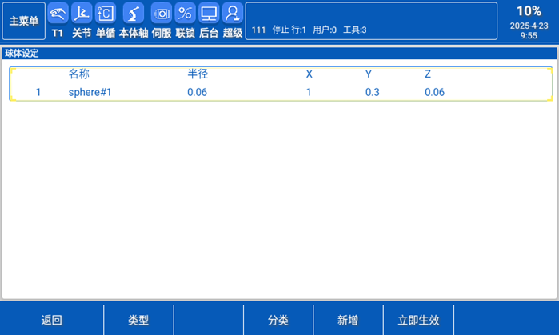

图 2\-54球体干涉区配置界面

1. 按下新增按钮，进入设定页面，输入各项参数后，点击保存。

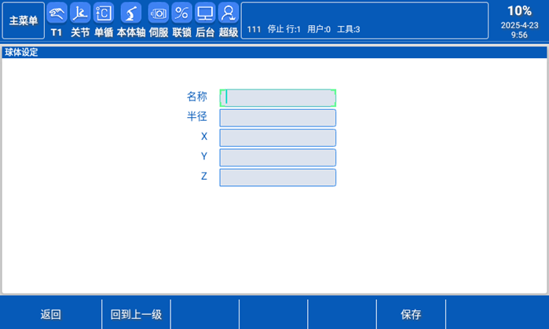

图 2\-55球体干涉区

1. 点击“回到上一级”按钮回到设定页面，按下“立即生效”按钮使列表内的干涉区生效。

参数说明：

名称：球形干涉区的名称。

半径：球形干涉区的半径（单位：米）。

X、Y、Z值：球形干涉区中心点相对于机器人基坐标系的X、Y、Z值（单位：米）。

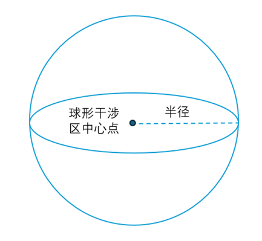

图2\-56 球体干涉区

| **注意：**1. **点击立即生效按钮后，不仅仅只是当前形状的干涉区会生效，其形状的干涉区设定如果被修改，也会在点击这个按钮后，一起生效。重启也会使修改过的干涉区设定生效。** 2. **干涉区生效后，需要进行测试后，才可以投入使用。** |
| --- |

| **警告：**1. **如果将模式设置为暂停并发出报警时，当机器人到达干涉区后，会开始停止运动，并停止在干涉区内的一段距离中，所以设置空间形状干涉区时，需要比实际的干涉形状更大一些，这样可以保证机器人完全停止时，不会与实际物体发生碰撞。** 2. **当两个机器人或者设备，因为干涉区相互卡死时，手动使机器人进入或离开干涉区前，需要将互通干涉信号的机器人或者外围设备按下急停按钮，并关闭相关机器人的干涉区功能的使能，以防止当移动其中一台机器人进入或离开干涉区时，干涉区输出信号改变，使等待干涉信号的外围设备或机器人运动，造成人员伤亡或设备损坏。** 3. **即使在机器人之间或者机器人与外部设备之间，使用了干涉区功能，也需要在程序中，对互相干涉的机器人或设备之间进行信号交互，而不能仅仅使用干涉区的输出信号进行交互，要使程序中的信号与干涉区输出信号都满足条件时，机器人或外部设备才可以进入干涉区。** 4. **干涉区生效后，需要进行测试后，才可以投入使用。** |
| --- |

## 执行开关

点击主菜单【系统设置】\-【执行开关】进行执行开关界面。ON为激活该开关，OFF为关闭。

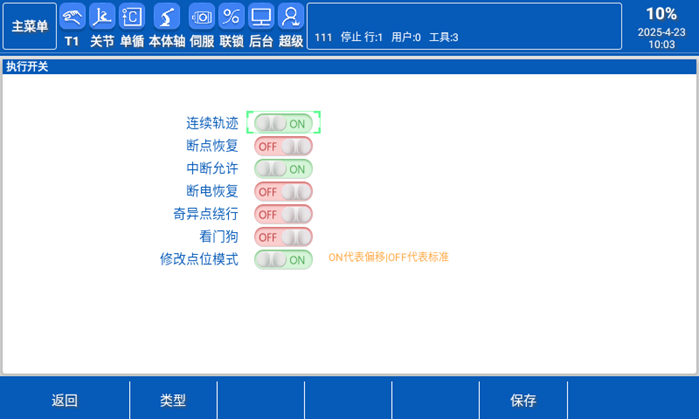

图 2\-57执行开关重置界面

执行开关说明：

连续轨迹：

当设为ON时，运动指令与运动指令之间为连续运行。

未开连续轨迹，机器人精确到达目标位置点。在目标点前后有减速与加速过程。

开启连续轨迹，机器人不会精确到达目标位置点。在目标位置点附近的快速划过。

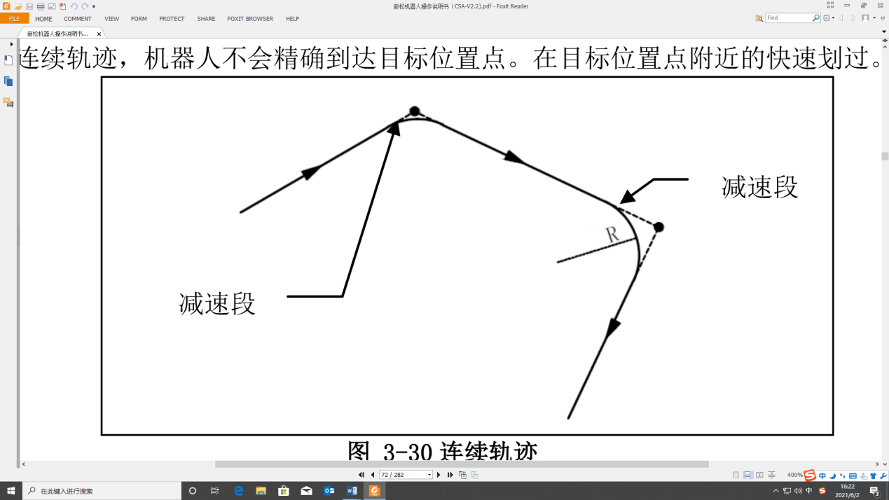

图 2‑57连续轨迹

| 注释：连续轨迹开启后，有一些情况是打断运动连续的。1. 逻辑指令，如：  CALL指令DELAY T \=1\.0WAIT DI\[1] 30 \= 0 T \= 1\.000 与其他WAIT指令GOTO L10MACRO 11. 不同类型的运动指令是不能相互连续的。如：  MOVJ、MOVL、MOVC指令之间无法连续1. 基础指令和应用指令之间不能连续。如：  例1：基础运动指令之间有应用指令，打断连续。例2：应用运动指令之间有基础指令，打断连续。应用指令为配置完各应用所带的指令。如：弧焊指令、点焊指令、码垛指令等 |
| --- |

| **警告：****连续轨迹功能在复合段的轨迹半径会随着机器人运行速度的改变而改变，在首次打开连续轨迹功能之后和再连续轨迹功能打开时更改机器人运行速度这两种情况下，必须重新验证一遍作业，验证过程中需要注意安全，防止机器人的轨迹变化造成碰撞。** |
| --- |

断点恢复：设置断点恢复功能是否使能。

中断允许：设置中断功能是否使能。

断电恢复：断电恢复功能开启后，机器人重启后，会恢复重启前打开的作业与最后一次打开的界面。

奇异点绕行：设置奇异点绕行功能是否使能。

看门狗：设置看门狗功能是否使能。

修改点位模式：设置点位是否偏移，ON代表偏移OFF代表标准。

## 负载设定

负载设定是设定安装在机器人的负载相关的信息。如质量、质心、转动惯量等参数。输入合适的负载信息可以带来如下效果。

减小机器人抖动，提高机器人动作循环时间。

设定好负载参数，可以更好的配合动力学技术的发挥。如重力补偿、碰撞检测功能。

如果负载信息和实际有过大的偏差，则有可能导致抖动过大，错误报警等结果。

动力学相关功能的使用需要准确设置机器人末端负载的参数，可以手动将负载参数输入。

负载仅是指安装在机器人法兰盘末端的工具，其他位置无法辨识。

负载设定步骤：

1. 点击【用户配置】\-【负载设定】,进入负载设定配置界面。

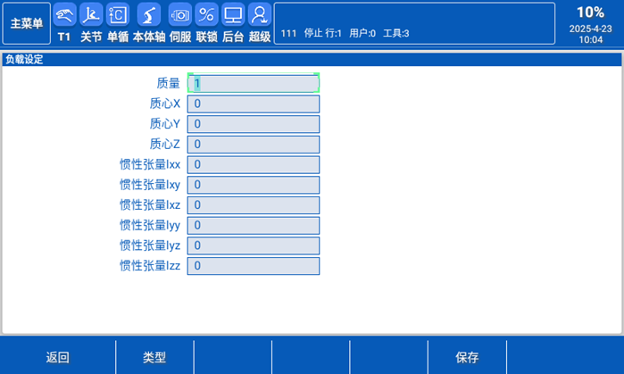

图 2\-59负载设定配置界面

1. 进入负载设定界面，进行负载参数的配置，配置完成后点击【保存】按钮保存界面配置。

界面配置参数含义如下：

质量（kg）：负载的质量；

质心X（mm）：负载质心在机械接口坐标系下的X坐标；

质心Y（mm）：负载质心在机械接口坐标系下的Y坐标；

质心Z（mm）：负载质心在机械接口坐标系下的Z坐标；

惯性张量Ixx（kg\*mm2）：负载基于质心，对齐机械接口坐标系的惯量矩Ixx；

惯性张量Ixy（kg\*mm2）：负载基于质心，对齐机械接口坐标系的惯量矩Ixy；

惯性张量Ixz（kg\*mm2）：负载基于质心，对齐机械接口坐标系的惯量矩Ixz；

惯性张量Iyy（kg\*mm2）：负载基于质心，对齐机械接口坐标系的惯量矩Iyy；

惯性张量Iyz（kg\*mm2）：负载基于质心，对齐机械接口坐标系的惯量矩Iyz；

惯性张量Izz（kg\*mm2）：负载基于质心，对齐机械接口坐标系的惯量矩Izz；

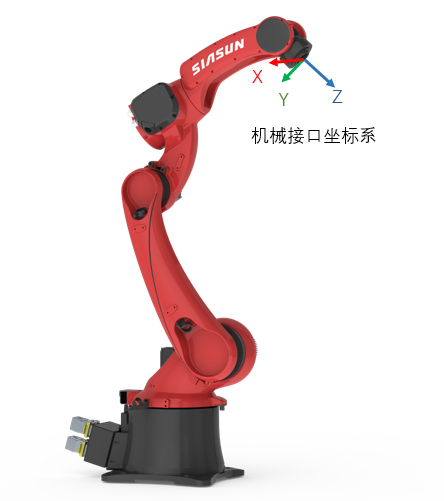

图 2\-60负载设定\-机械接口坐标系方向

| **注意：**1. **这里输入的负载参数是以六轴法兰盘默认的工具坐标系为基准，方向与默认的法兰坐标系保持一致。** 2. **完成负载设定后，当前数值会保存为有效的负载参数。** |
| --- |

## 循环方式

机器人运行方式为三种：自动（AUTO）、单循环（CYCLE）、单步（STEP）。示教模式、执行模式下用户均可通过状态栏的下拉列表或者【循环】实体按键进行各自模式下进行运行方式的选择。也可以通过循环方式设定来选择。

循环方式设置步骤：

1. 点击主菜单【用户配置】\-【循环方式】进入循环方式默认值设定界面。

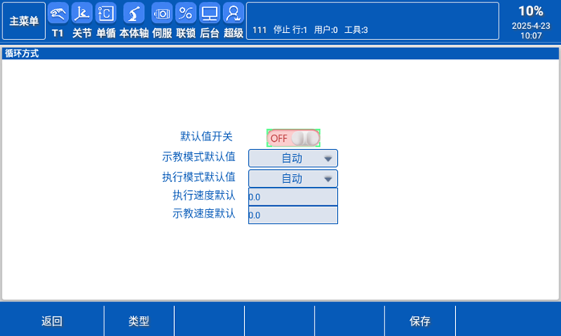

图 2\-61界面循环方式设定界面

1. 设置完成后，点击【保存】保存。

参数说明：

* + - 1. 默认值开关on为有效、off为无效。
			2. 当默认值开关为off时，机器人模式切换后恢复其模式下的前一次运行方式。例如：当前示教模式下前一次运行方式为单步，执行模式下当前运动方式为自动方式，用户由执行模式切换到示教模式后，恢复其示教模式的运行方式为前一次的单步方式。反之，由示教模式切换至执行模式时，恢复执行模式下运行方式为前一次的自动运行方式。
			3. 当默认值开关为on时，机器人在模式切换后恢复当前模式下已经设定的运行方式。
			4. 执行模式的默认速度。
			5. 示教模式的默认速度。

## 系统信息

系统信息，存储机器人系统相关信息。方便技术支持和售后服务了解系统当前软件版本等信息，方便对机器人进行软件升级等。

### 系统版本

点击主菜单【系统信息】\-【系统版本】,进入到查看软件版本与系统库版本、固件版本的信息界面，同时，这个界面可以升级软件版本。

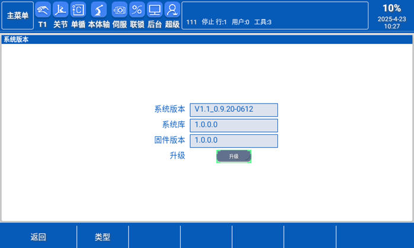

图 2\-64系统版本界面

### 系统时间

点击主菜单【系统信息】\-【系统时间】,进入到设置系统时间的界面。

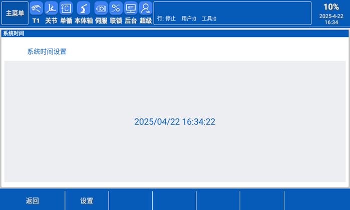

图 2\-65系统时间设置界面

设置方式：

1. 点击【设置】按钮进入设置界面。
2. 输入系统时间。

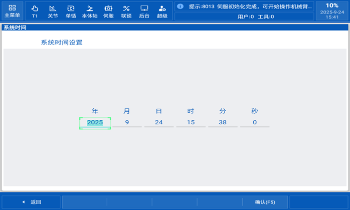

图 2\-66系统时间设置界面

1. 点击【确认】按钮完成设置。

## 软重启

重启功能使机器人控制器重启，又名软启动，系统中的伺服、IO模块等不会重启。

点击主菜单【系统信息】\-【软重启】，进入到重启界面。

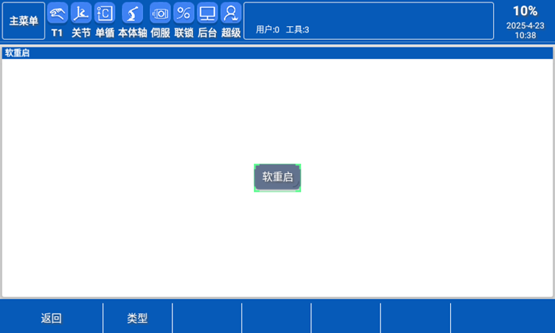

图 2\-67软重启功能界面

点击“重启”按键，会弹出窗口进行二次确认，避免误操作的发生；

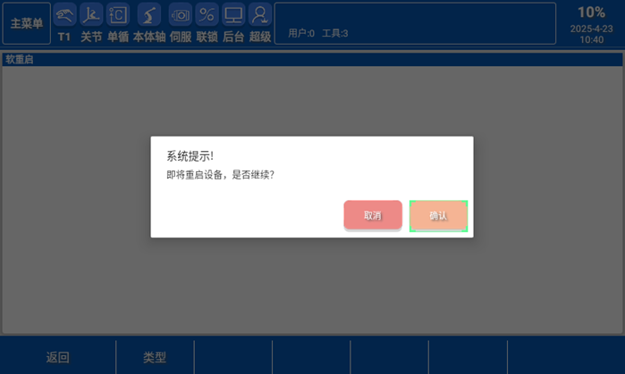

图 2\-68界面

点击【确认】按键。控制器开始重启，并弹框提示“机器人重启中，请稍后”。

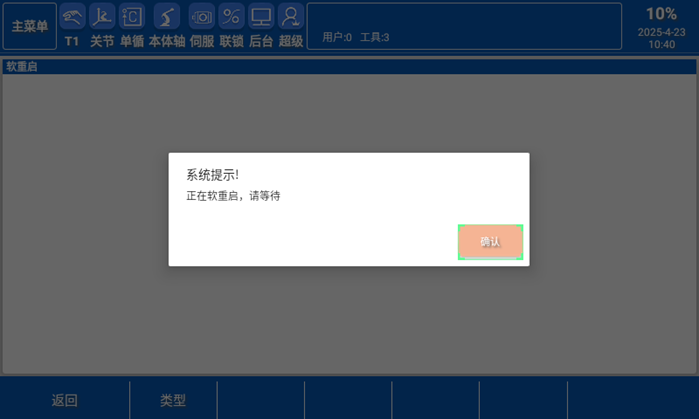

图 2\-69控制器重启中界面

如果系统动力电已上电，则无法进行重启，并会弹出提示框如下。

| **注意：****“系统处于上电状态，禁止重启”。如需要重启，请让机器人处于下电状态。** |
| --- |

## 应用配置

点击主菜单【系统设置】\-【应用配置】，输入密码：sysiasun，进入应用配置界面，可查看机器人选择了哪些应用，在系统用户下才允许修改应用配置项。此参数项出厂前已配置好，无需用户更改，如需更改请联系售后人员。

图 2\-70系统应用配置界面

## 型号配置

点击主菜单【系统设置】\-【型号配置】，输入密码：sysiasun，进入机器人型号配置界面，可查看及重新选择此机器人的型号。

选择好型号后，点击保存，会提示重启，重启后自动清除系统参数。保存或重启之前确认之前的系统配置，或提前做系统参数的备份。

此参数项出厂前已配置好，无需用户更改。

注：此参数型号一定与实际连接的本体型号一致。

图 2\-71机器人型号配置界面

## 抑振参数

该功能主要是调整机器人使用特殊功能运行时的抖动，通过调整该参数可以减小运行抖动。

点击主菜单【用户配置】\-【抑振参数】，进入抑振参数配置界面。

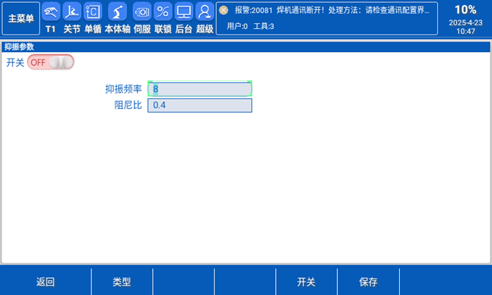

图 2\-72抑振参数配置界面

参数说明：

抑振开关：是否打开抑振功能；参数范围OFF或ON。OFF为关闭软抑振，ON为打开软抑振。

抑振频率：频率越大，机器人加加速度越大，机器人速度越快，相应越抖。频率越小，速度越慢，抖动越小。参数范围 1\-30。加加速度和抑振频率成正比。切换机器人型号，该值会根据型号进行切换。不需要修改。

阻尼比：机器人本体的阻尼比，参数范围 0\.01\-0\.99。默认值为0\.4，不建议修改。

| **注意：****该功能配置完成后，需要重启，重启后生效。** |
| --- |

## 自定义报警

用户自定义报警功能，用户可以根据自身需求，满足条件时，通过执行报警指令，发送相应的报警通知。用户自定义报警总条目有160条，每条可进行报警级别与报警信息及弹窗的设置。

点击主菜单【用户配置】\-【用户报警定义】，可对这项功能进行配置。

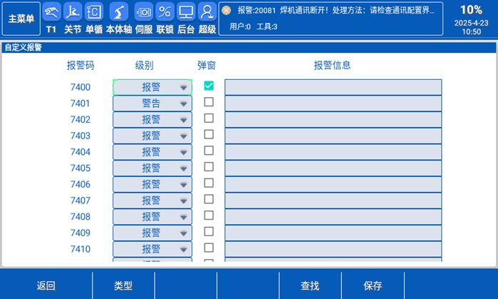

图 2\-73用户报警定义界面

级别：共3种，分别为提示/警告/报警。

警告类，机器人暂停（不下电）；

报警类，机器人立即停止（下电）；

提示类，机器人继续运行。

弹窗： 勾选后执行报警指令会有弹窗提示； 不勾选会在报警栏提示（ 无弹窗提示）。

报警信息：报警信息可输入任意字符，长度为100字节，当进行相应报警时，示教器会显示报警LOG日志，其内容即为用户设置好的报警信息内容；

报警取消：按复位可以对报警进行取消，任何级别报警都可以取消掉；

 报警指令：如图所示，选择自定义报警指令；

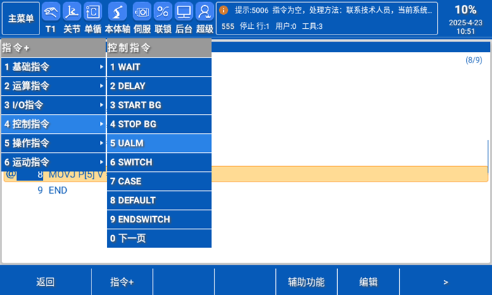

图 2\-74报警指令添加界面

表格2\-14 自定义报警指令及参数说明

| UALM | 功能 | 自定义报警指令。 | |
| --- | --- | --- | --- |
| 格式 | UALM CODE \= \<参数1\> | |
| 说明 | 参数1 | 常数I\[]：32位整型变量H\[]：16位整型变量B\[]：8位整型变量 |
| 举例 | UALM CODE \= I\[2] | |

## 报警码输出配置

可以对外输出报警码。 以组 IO 的形式对外输出， 组 IO 号可以自行配置；

点击主菜单【用户配置】 \-【报警码输出配置】， 可对这项功能进行配置。

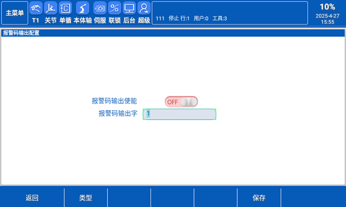

 图2\-75 组IO配置界面

报警码输出使能：ON,表示可以输出报警码； OFF， 表示不输出报警码；

报警码输出字：以 16 位信号组成的字进行输出， 填写 16 位组 IO 的第几组。

举例： 报警码输出字填写 3则表示： 使用的是第 3 组用户输出 16 位组 IO,组IO由用户自定义配置。

## 用户权限设置

可以修改机器人密码，可以重置密码，可以在一段时间不操作机器人的情况，对用户权限自动注销回到普通用户。

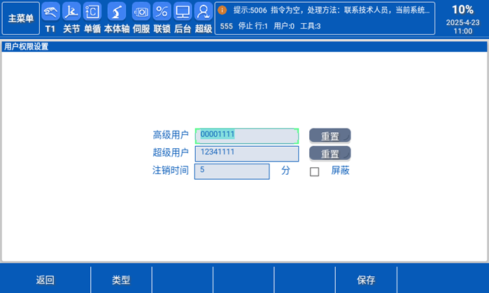

图 2\-76用户权限设置界面

高级用户：设置高级用户密码。

超级用户：设置超级用户密码。

注销时间：设置用户权限注销时间。

重置：对应的密码恢复到默认值（高级：00001111，超级：12341111）。

屏蔽：注销用户权限功能是否屏蔽，若勾选则不会注销，若未勾选则时间达到后权限注销。

保存：保存页面设置。

## 柜体配置

点击主菜单【系统设置】\-【柜体配置】，输入密码：sysiasun，进入机器人柜体型号配置界面，可查看及重新选择此机器人的柜体型号，此参数项出厂前已配置好，无需用户更改。注：此参数型号一定与实际的柜体型号一致。

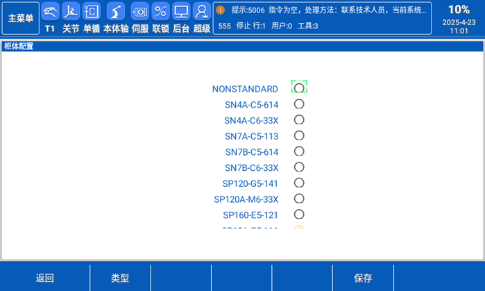

图 2\-77机器人柜体型号配置界面

## 安全设置

主要用于安全门及上下电逻辑参数配置。其中驱动器报闸延时与延时急停时间默认不可配置；

点击主菜单【系统设置】\-【安全设置】，对该项进行设置。通常使用默认参数就可以。

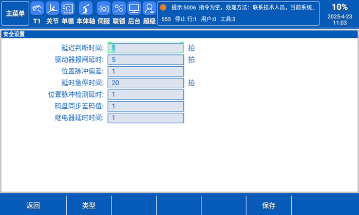

图 2\-78安全设置界面

延迟判断时间：延迟判断时间为0\-999999之间整数。安全门延迟判断时间若小于30拍，则限定在30。

驱动器抱闸延时：延迟判断时间为0\-999999之间整数。驱动器抱闸延迟判断时间若小于30拍，则限定在30。

位置脉冲偏差：位置脉冲偏差范围为0\-999999之间整数。

延时急停时间：位置脉冲偏差范围为0\-999999之间整数。

位置脉冲检测延时：位置脉冲偏差范围为0\-999999之间整数。

码盘同步差码值：码盘同步差码值范围为0\-999999之间整数。松开deadman时，enco与enci同步的差码判断值，初始没有赋值时强制为500。

继电器延时时间：继电器延时时间范围为0\-700之间整数。

## 本体轴驱动器配置

总线配置界面：【主菜单】\-【系统设置】\-【下一页】\-【驱动器配置】

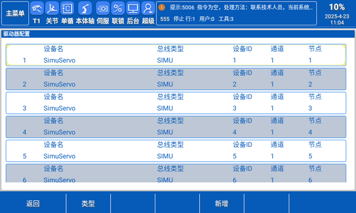

图 2\-79驱动器配置界面1

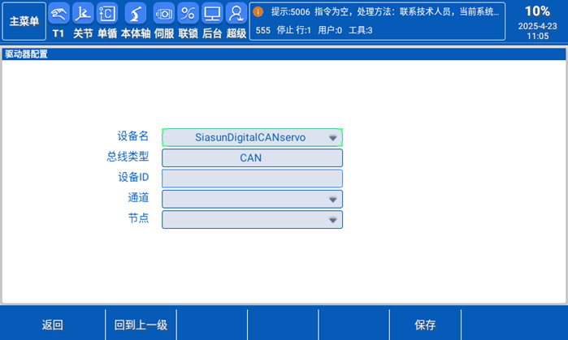

图 2\-80驱动器配置界面2

此页面配置本体轴的伺服参数，包含以下各项内容：

设备名：驱动器名称

清能RC6\-CoolDriverEthercatServo。

清能RA\-CoolDriverRaEthercatServo。

清能RD\-CoolDriverRDEthercatServo。

清能RD2\-CoolDriverRD2EthercatServo。

清能RDCS\-CoolDriverRDCSEthercatServo。

禾川X6\-HcfaEthercatServo。

禾川Y7\-HcfaY7EthercatServo。

松下\-PanasonicEthercatServo。

总线类型：

驱动器支持的总线，当选择设备名时，此项就已确定。

设备ID：

即EtherCAT总线伺服节点ID，如一轴ID为1，二轴ID为2，依次类推。

通道：

CAN总线通道，如CAN1 CAN2。

节点：

总线节点ID，以实际物理节点顺序进行配置。

## 控制参数

点击主菜单【系统参数】 \-【控制参数】。 控制参数中包含软限位、杆长补偿、安全保护。

杆长补偿：

主菜单\-【系统参数】\-【控制参数】\-【分类】\-【杆长补偿】进入杆长补偿界面。

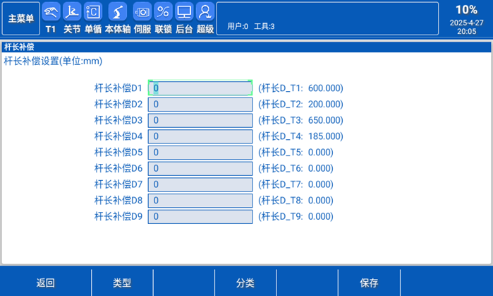

图2\-81杆长补偿

杆长补偿D1\-D9：补偿值，用户输入。

杆长D\_T1\-T9：实际杆长值，标准杆长加补偿值后的实际值。

保存：保存用户配置。

安全保护：

主菜单\-【系统参数】\-【控制参数】\-【分类】\-【安全保护】进入安全保护界面。安全保护可设置机器人本体轴 1\-6 轴的跟踪差。

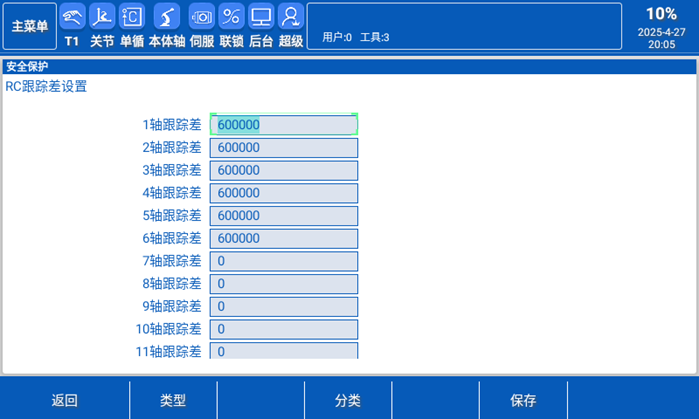

图2\-82 安全保护

1轴\-N轴跟踪差：设置各轴跟踪差。

保存：保存用户配置。

## IO模块相关配置

IO设备列表

IO设备列表界面：【主菜单】\-【系统设置】\-【下一页】\-【IO设备列表】

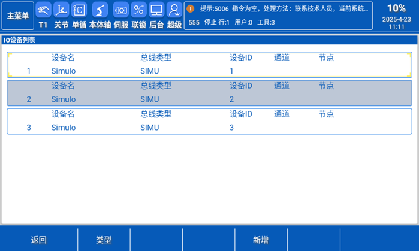

图 2\-83 IO设备列表界面1

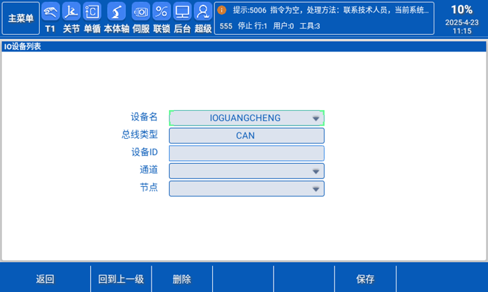

图 2\-84 IO设备列表界面2

此页面进行IO模块的配置，包括系统IO、用户IO。包含以下内容：

设备名：

选取IO模块名称，目前支持以下IO设备，

广成、模拟Io、EtherCATSCB、WellLinkCNN1、WellLinkC0NN、ModbusIo、华泰IO、ProfinetIO、SCB\_ISA、DeviceNetIO、串口IO、SPI系统IO。

总线类型：IO模块的通讯类型，目前支持CAN、EtherCAT、SIMU、ISA、PN\_IOD、MB\_TCP\_M、MB\_TCP\_S、MB\_RTU\_M、MB\_RTU\_S。

设备ID：IO设备的ID唯一，需要与IO映射配置的ID一致，后面介绍。

通道：CAN总线通道，CAN1、CAN2。

节点：总线节点号（不同类型总线节点号可相同）,需根据实际物理节点进行配置。

输入IO映射

进入输入IO界面：【主菜单】\-【IO】\-【总线IO映射】\-【输入IO映射】。

图 2\-85输入IO映射界面1

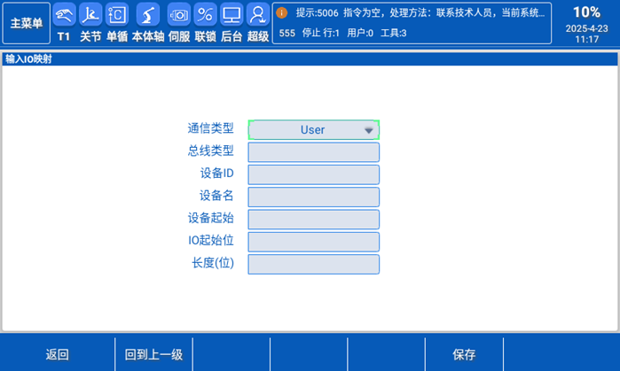

图 2\-86输入IO映射界面2

通讯类型：系统System、用户User。

总线类型：IO模块的通讯类型，目前支持CAN、EtherCAT、SIMU、ISA、PN\_IOD、MB\_TCP\_M、MB\_TCP\_S、MB\_RTU\_M、MB\_RTU\_S。

设备ID：要与IO设备列表中的设备ID匹配。

设备名：选取IO模块名称，目前支持以下IO设备，

广成、模拟Io、EtherCATSCB、WellLinkCNN1、WellLinkC0NN、ModbusIo、华泰IO、ProfinetIO、SCB\_ISA、DeviceNetIO、串口IO、SPI系统IO。

设备起始：模块的起始IO点，如64位IO则从0\-63。

IO起始字：逻辑IO起始点，如两块用户IO板（0\-63，64\-127）。

长度：64位则长度为64。

输出IO映射

进入输出IO界面：【主菜单】\-【IO】\-【总线IO映射】–【输出IO映射】。

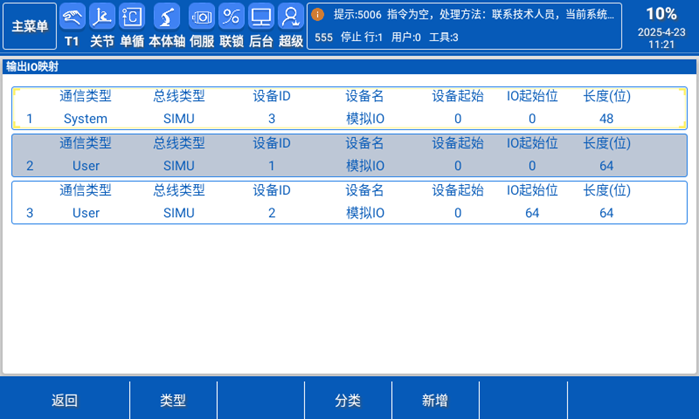

图2\-87输出IO映射界面1

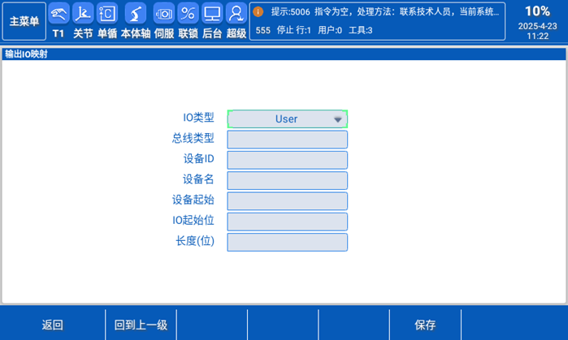

图2\-88输出IO映射界面2

IO类型：系统System、用户User。

总线类型：IO模块的通讯类型，目前支持CAN、EtherCAT、SIMU、ISA、PN\_IOD、MB\_TCP\_M、MB\_TCP\_S、MB\_RTU\_M、MB\_RTU\_S。

设备ID：要与IO设备列表中的设备ID匹配。

设备名：选取IO模块名称，目前支持以下IO设备，

广成、模拟Io、EtherCATSCB、WellLinkCNN1、WellLinkC0NN、ModbusIo、华泰IO、ProfinetIO、SCB\_ISA、DeviceNetIO、串口IO、SPI系统IO。

设备起始：模块的起始IO点，如64位IO则从0\-63。

IO起始字：逻辑IO起始点，如两块用户IO板（0\-63，64\-127）。

长度：64位则长度为64。

## 总线属性

点击主菜单\-【系统设置】\-【总线属性】，进入总线属性界面，可以对总线属性进行设置。

CAN界面：

点击【CAN】进入CAN界面，包含CAN1与CAN2口的相关配置。

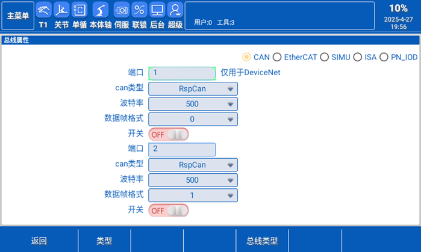

图2\-89 CAN总线属性

EtherCAT：

点击【EtherCAT】进入EtherCAT界面。

图2\-90 EtherCAT总线属性

SIMU界面：

点击【SIMU】进入SIMU界面。

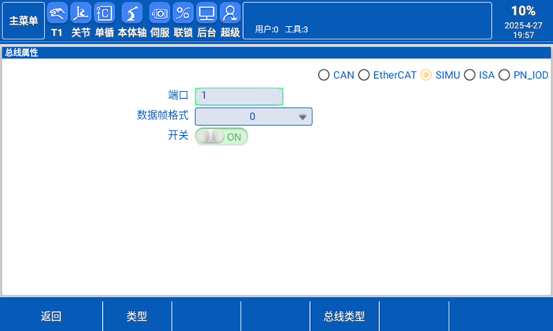

图2\-91 SIMU总线属性

ISA界面：

点击【ISA】进入ISA界面。

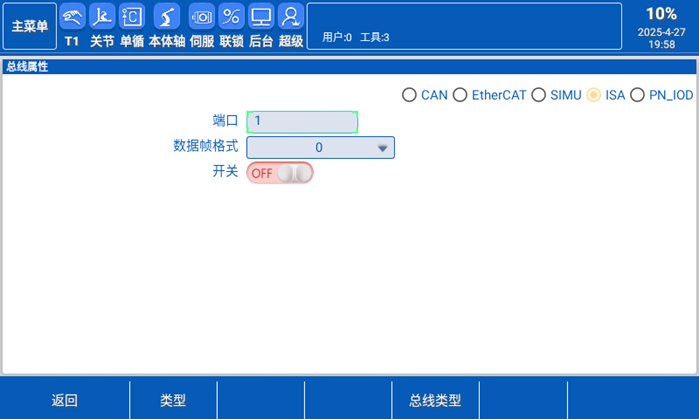

图2\-92 ISA总线属性

PN\_IOD界面：

点击【PN\_IOD】进入PN\_IOD界面。

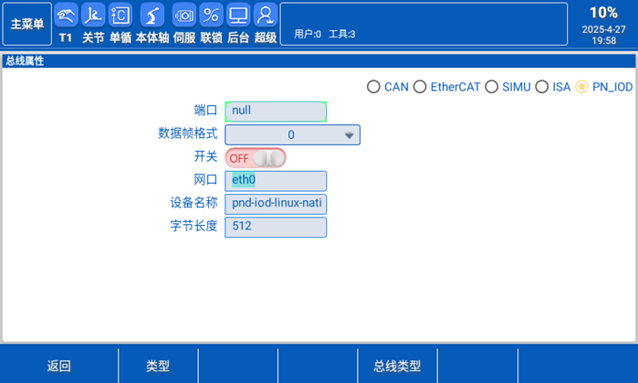

图2\-93 PN\_IOD总线属性

## 其他设定

### 本体方位

点击主菜单【用户配置】\-【本体方位】，进入底座安装方向设置页面。可设置机器人底座的安装角度，设置好相关参数后，点击【保存】键完成配置，此页面参数用于确定重力方向出场前配置好，无需用户配置。

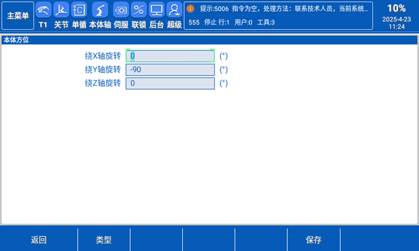

图 2\-94底座安装方向设置界面

### 用户名

点击主菜单【用户配置】\-【用户名】，进入用户名设置页面。可显示和更改机器人用户名，设置好相关参数后，点击【保存】键，设置参数有效，如图所示。

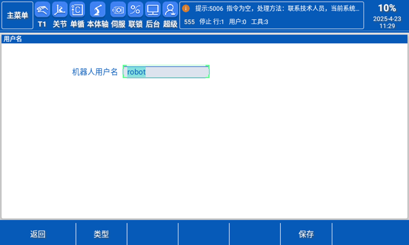

图 2\-95用户名设置界面

### 运动参数

点击主菜单【系统参数】\-【运动参数】，运动参数中包含直线配置、速度、减速比和码盘数相关参数。运动参数项中的本体轴参数为出厂默认设置，无需用户设置，外部轴参数用户可配置。

直线配置：

直线配置中显示有直线最大速度、直线最大加速度、直线最大加加速度，如图所示：

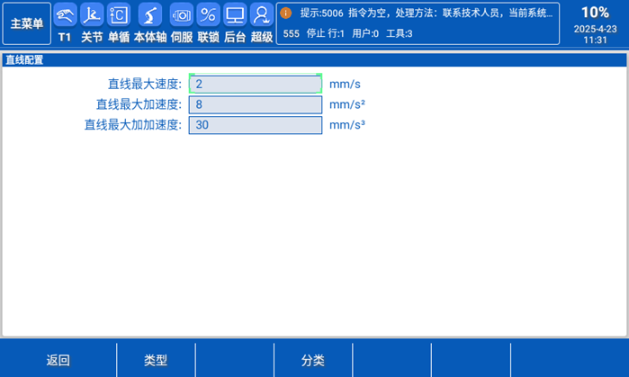

图 2\-96直线规划数据显示画面

速度：

速度中包含机器人本体轴1\-6轴的最大速度、1\-6轴的最大加速度、1\-6轴的加加速度，如图所示：

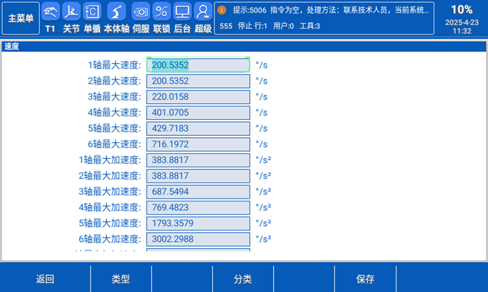

图 2\-97速度参数显示画面1

加速度:

加速度中包含机器人本体轴1\-6轴的各轴加速度，如图所示：

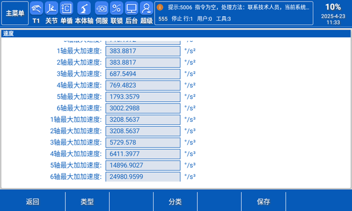

图 2\-98加速度显示画面

加加速度:

加加速度中包含机器人本体轴1\-6轴的各轴加加速度，如图所示：

图 2\-99加加速度显示画面

减速比:

减速比中包含机器人本体轴1\-6轴的各轴减速比，如图所示：

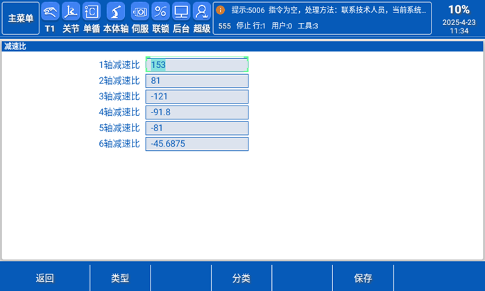

图 2\-100减速比显示画面

码盘数:

码盘数中包含机器人本体轴1\-6轴的各轴每圈码盘数，如图所示：

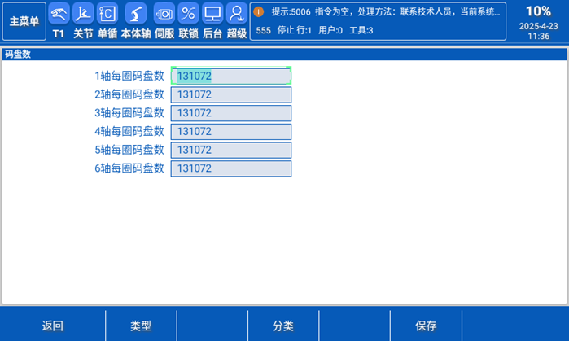

图 2\-101码盘数显示画面

### 快捷键

点击主菜单【用户配置】\-【快捷键】，进入快捷键配置界面,目前支持作业、IO输出、功能、页面四大类配置可选。页面内可以对OP1\-4\\SHIFT\+OP1\-4\\SHIFT\+1\-9这几种快捷键进行配置。

1. 作业：示教模式下作业的单次执行；
2. IO输出：用户IO输出功能；
3. 功能：功能命令的执行；
4. 页面呼出：页面快捷打开功能。

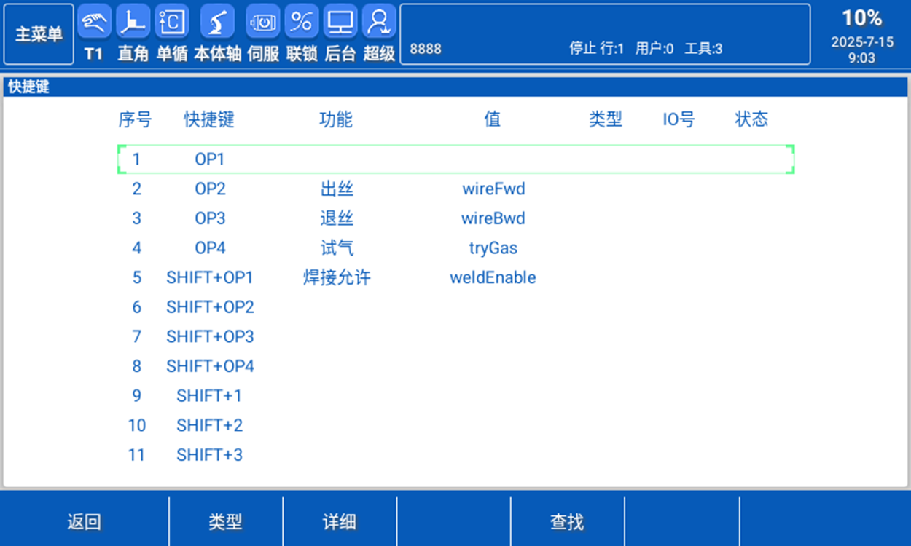

图2\-103 快捷键界面1

点击对应的快捷键或调整光标点击【详细】，进入对应的设置界面，配置完按下【保存】完成配置，其中【清除】按键可删除当前配置。【查找】可以通过序号快速找到对应的快捷键。

点击【功能】下拉菜单可以弹出蓝色菜单。

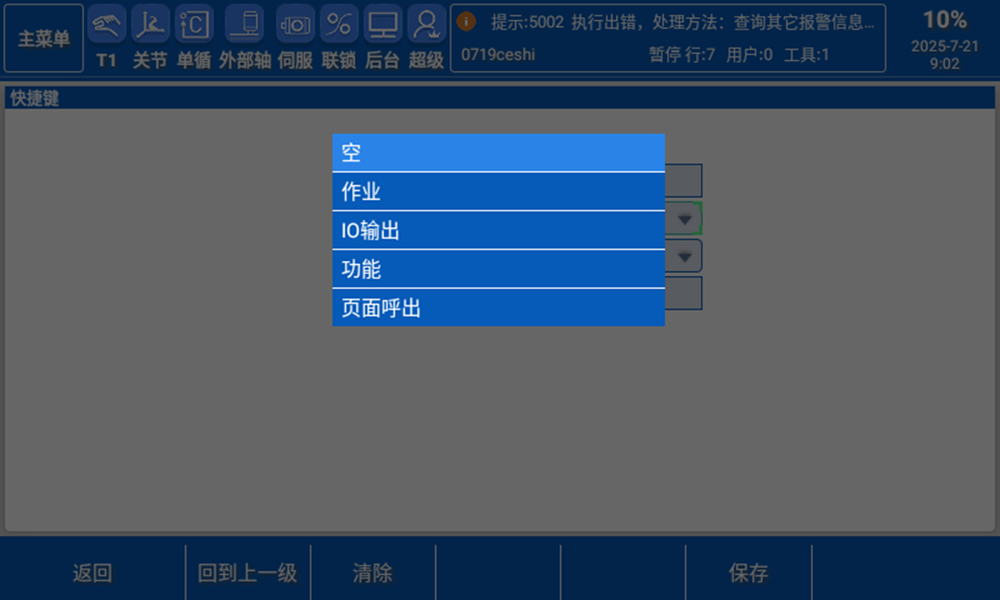

图2\-104 快捷键【详细】\-【功能】菜单界面

作业：

示教模式下，系统上电后用户按住SHIFT\+数字键进行作业的隐式执行，作业只以单循环的方式进行执行，任意按键松开作业执行停止。

| **注意：****T2模式的速度可以达到100%，详细情况4\.2节内容。** |
| --- |

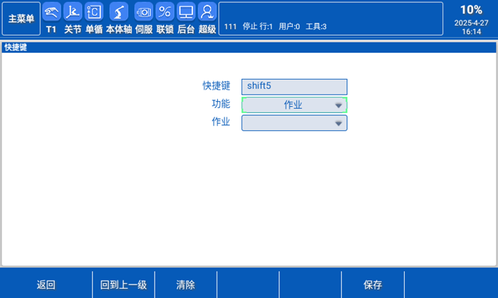

图2\-105 快捷键作业设置界面

IO输出：

示教模式下，用户按下快捷键进行IO信号ON/OFF的持续输出，直至按键抬起。

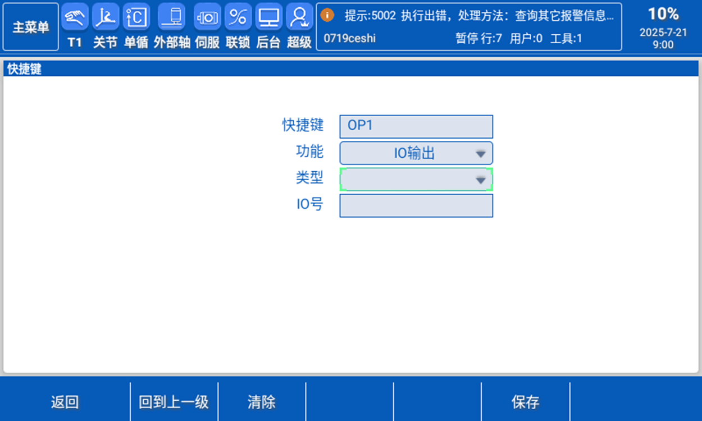

图2\-106 快捷键IO输出设置界面1

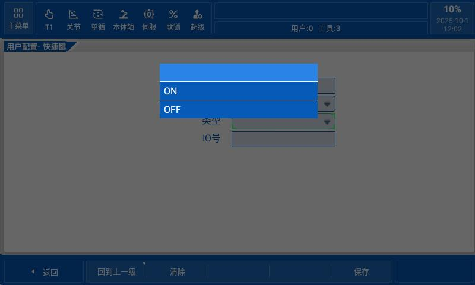

图2\-107 快捷键IO输出设置界面2

 功能：

示教模式下，用户按下按键进行功能执行，如弧焊应用的出丝，焊枪会执行出丝动作，按键抬起则停止出丝。

 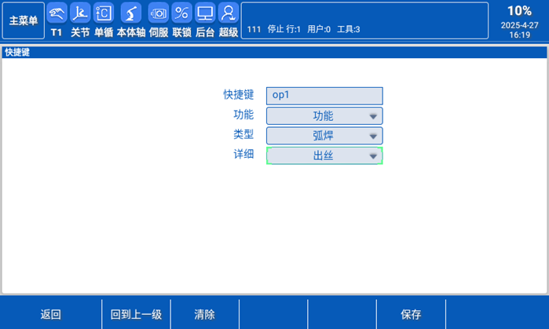

图2\-108 快捷键功能设置界面

页面呼出：

示教模式下，用户操作快捷键快速打开做配置的页面。

 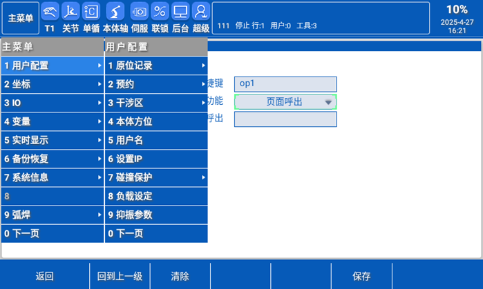

图2\-109 快捷键页面呼出设置界面

### 速度倍率

点击主菜单【用户配置】\-【速度倍率】，进入如下配置页面。此页面配置是供SHIFT\+V±切换速度使用。

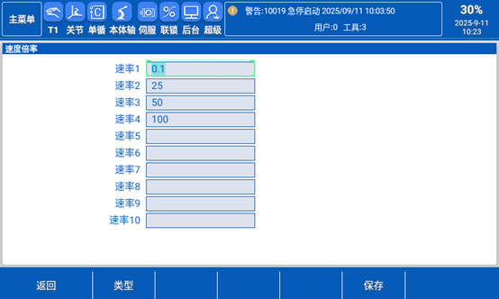

图2\-110 速度倍率设置界面

页面至多包含10项速率的配置，配置可以少于10个，并且速率值递增，不足10个时，文本框为空，按键操作时在已存在的配置中进行切换。

# 程序的说明

工业机器人的示教程序，是由编程工程师通过示教器编辑的各项指令和相关的附加信息构成，机器人按照调试完成的程序进行特定的作业。

| 注释：本章对程序的构成及程序的相关信息、指令的功能、参数信息等进行说明，如何创建和示教程序的详细操作由下一章进行说明。 |
| --- |

作业界面

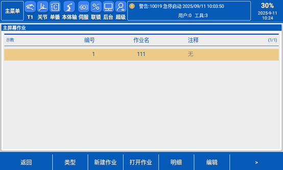

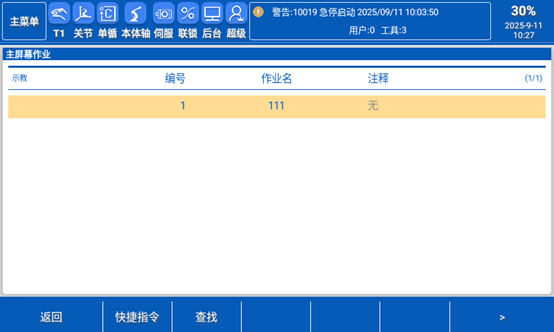

图 3\-1作业界面和菜单

作业界面作业信息和菜单构成：

1. 作业信息可以显示作业的名称、注释。
2. 菜单可以进行按作业类型显示作业、新建作业、打开作业、查看作业明细、编辑作业（删除、复制、隐藏/显示、作业变换）。

示教作业界面：

打开选中的程序后，进入作业编辑界面。

图 3\-2示教作业界面

示教作业主要由下列各项信息组成：

1. 作业的行号。
2. 可以进行关节运动、直线运动、圆弧运动、样条运动的动作指令。
3. 除了运动指令之外的逻辑指令，包括：
	* + 对变量进行操作基础指令。
		+ 对变量进行数学运算的运算指令。
		+ 与外部设备进行I\\O信号交互的I\\O输入、输出指令。
		+ 在特定条件下，对机器人运行流程进行控制或改变的逻辑指令（IF\\ELSE\\GOTO\\LABEL等），延迟机器人程序运行的等待指令（DELAY）等。
		+ 对程序进行中断、定时、注释、补偿等逻辑指令。
		+ 运动指令的附加指令。
		+ 其他指令。
4. 代表程序结束的符号。

## 作业列表界面

本章节主要介绍作业列表界面中的作业信息和菜单功能。点击主菜单【作业】按钮，可以进入作业列表界面。

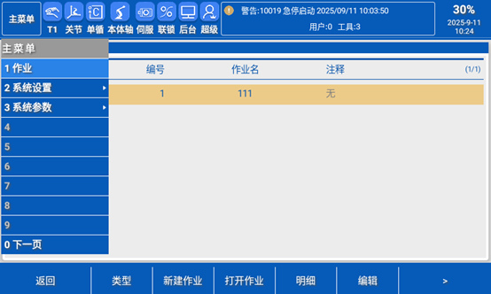

图 3\-3主菜单【作业】按钮

### 作业名与注释

每个程序都有一个程序名，不能重复命名，可用数字、大写字母、下划线进行命名。可以为程序添加中文/英文字母/字母等注释。

图 3\-4作业列表页面

### 作业类型

可以按照作业类型查看机器人程序。

1\) 示教程序：机器人执行时，按照示教程序来执行动作和逻辑控制指令。

2\) 后台程序：在后台进行的程序，开启后可以时刻监控状态，并完成逻辑控制指令。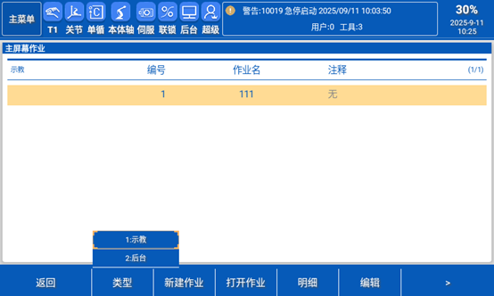

图 3\-5作业的【类型】按钮

可以通过选择作业类型来打开这个类型作业的窗口。

| **注释： 作业可以在新建时，可以对程序类型进行设定。** |
| --- |

### 作业界面菜单

作业界面的菜单可以对机器人示教作业进行常规的操作。

图 3\-6作业界面的菜单

1. 类型：可以按类型查看作业，包括：示教、后台程序。
2. 新建作业：创建新的作业。
3. 打开作业：可以打开已选定的作业。
4. 明细：查看作业属性信息等。
5. 重命名：可以对作业进行重命名操作。
6. 注释：编辑作业注释信息。
7. 锁定、解锁：锁定作业，可以使作业不能被修改，解锁后，可以使作业被修改
8. 主作业：设置或取消设置主作业。

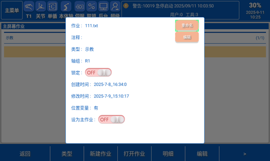

图 3\-7作业明细页面

1. 复制、删除:对已选定的作业进行复制、删除操作。
2. 隐藏、显示：可以使作业在普通用户下被隐藏，高级和超级用户才能被看见，显示可以解除隐藏状态。
3. 作业变换：对作业各种变换操作，后面会有详细介绍。

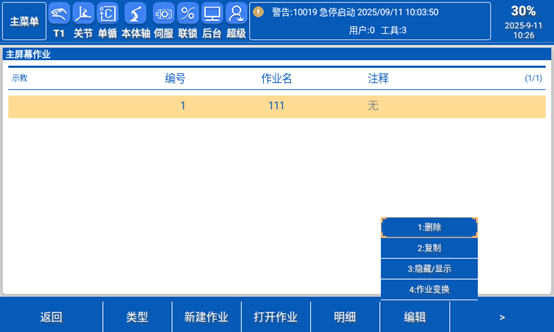

图 3\-8作业编辑操作页面

1. 快捷指令：目前支持一下三种指令，可以进行指令参数的编辑，可通过SHIFT\+J、SHIFT\+L、SHIFT\+C进行快捷插入指令。

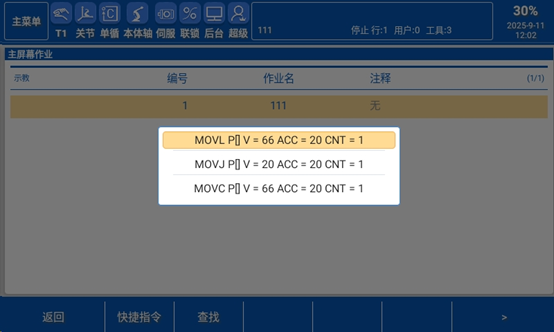

图 3\-9快捷指令窗口

1. 查找：作业模糊查找，用户可输入作业名关键字或者注释关键字进行查找。

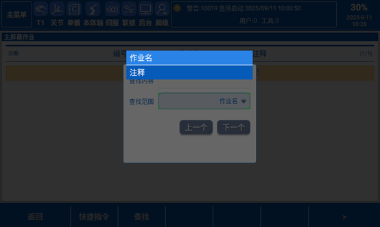

图 3\-10查找窗口

## 作业编辑页面

行号：

表示程序指令行的编号。

行号会自动添加到我们在程序上写入的指令前，在删除，插入等变换程序指令时，行号自动改变，使整个程序的行号至始至终都从1\.2\.3…。

NOP符号：

NOP符号标识作业的起始位置。

END符号：

END符号显示在程序最后一行，增加或删除指令时，END始终保持在这个位置。当光标到达这个符号时，表示程序本次执行的结束。

参数：

参数是编程指令中需要用户添加并使用的数据。当使用指令菜单键插入指令时，大多数指令需要工程师自己选择/输入参数值。

操作方法：

1. 进入需要编辑的作业。
2. 通过上下按钮或触屏选择需要操作的指令行。
3. 通过右键或者触屏点击选定需要变更的参数项。
4. 输入数值，或使用下方菜单按钮进行其他编辑操作。

图 3\-11程序编辑窗口

在示教程序中，指令需要通过菜单点击选择，并不是直接写代码编程，所以指令选择后，相关的参数会通过指令界面填写，用户需要根据实际情况自行添加参数即可。

1. 标准运动：标准运动指令入口。
2. 常用指令：用户可根据需要新增、删除常用指令，可实现快捷插入指令的操作。

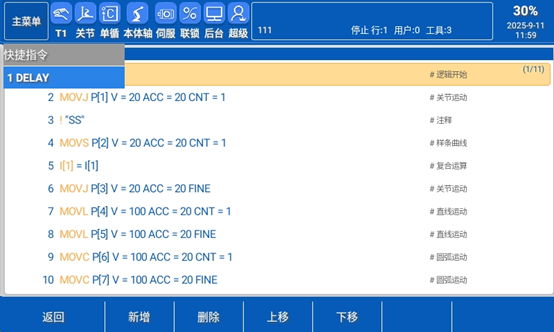

图 3\-12快捷指令编辑窗口

1. 指令\+：指令入口。
2. 查找：用户可通过输入行号、IO号、位置变量号、其他变量、注释、LABEL、指令名，快速跳至当前光标后的第一个指令处，上一个与下一个光标可移动到查到的信息下一条或上一条。

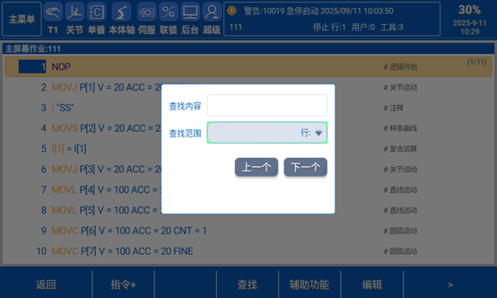

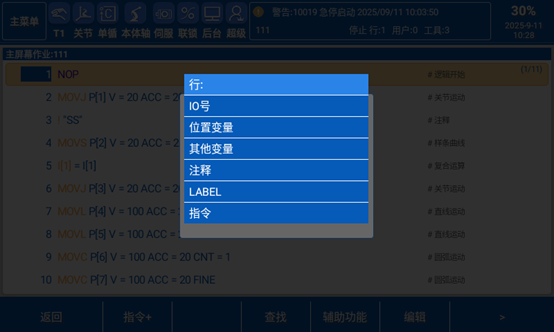

图 3\-13查找功能窗口

1. 清空堆栈：进行清空堆栈操作。
2. 变量：查看作业中的所有变量信息，并且可以分类显示。

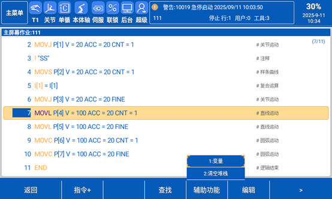

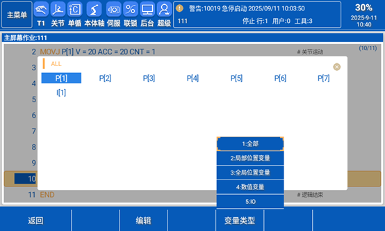

图 3\-14辅助功能窗口

1. 编辑：指令的删除、复制、粘贴等操作。

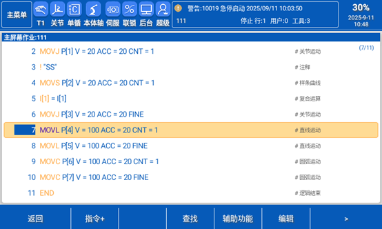

图 3\-15编辑功能窗口

## 变量的数据类型

RC软件中，变量包括：全局变量、局部变量、系统变量、外部变量\\标识X、IO变量、变量索引、P变量；操作符包括运算符和特殊符号。

下面是对变量的数据类型和操作符进行说明。

全局变量：

全局变量，包括以下类型：

| 名称 | 说明 |
| --- | --- |
| I | 32位整型变量 |
| H | 16位整型变量 |
| B | 8位整型变量 |
| R | 64位浮点型变量 |
| PR | 位姿变量，能直接赋值 |
| S | 字符型变量，能直接赋值 |

局部变量：

局部变量，目前仅有P变量，标识为P。

系统变量：

系统变量，标识S，包括以下类型：

| 名称 | 说明 |
| --- | --- |
| SI | 32位整型变量 |
| SH | 16位整型变量 |
| SB | 8位整型变量 |
| SR | 64位浮点型变量 |

IO变量：

IO变量分为输入与输出，支持IO组，见如下描述：

| 名称 | 说明 |
| --- | --- |
| IO输入 | 标识DO |
| 组IO输入 | 支持8位组IO（GIB）、16位组（GIH）、32位组IO（GII整型）、32位组IO （GIF浮点型） |
| IO输出 | 标识DI |
| 组IO输出 | 支持8位组IO（GOB）、16位组（GOH）、32位组IO（GOI整型）、32位组IO （GOF浮点型） |
| 模拟量输入AI |  |
| 模拟量输出AO |  |

变量索引：

例：I\[I\[1]]，其中索引只能是I变量，间接索引仅支持二级。且索引指向的数据，如果为局部变量需要在局部变量表中声明最终索引参数，如I\[1]等于4，则需要声明I\[4]。

P变量：

P变量分为全局P变量用PR表示，局部P变量用P表示，其有多种表现方式：

| 名称 | 说明 |
| --- | --- |
| P\[1] | 表示局部P变量1 |
| P\[1].x | 表示局部P变量x变量，同理包括，x,y,z,roll,pitch,yaw |
| P\[1].j1 | 表示局部P变量第一个轴关节值，本体轴数由模型确定，可为1\-N(至多6\) |
| P\[1].e1 | 表示局部P变量第一个外部轴轴关节值，外部轴轴数由配置确定，可为1\-N(至多6\) |

运算符：

系统包括以下几种运算符，即算数运算符、位操作运算符、关系运算符，具体见如下描述，同时有部分特殊符号的说明。

算数运算符

| 运算符 | 说明 |
| --- | --- |
| \+ | 变量相加 |
| \- | 变量相减 |
| \* | 变量相乘 |
| / | 变量相除 |

位操作运算符

| 运算符 | 说明 |
| --- | --- |
| \>\> | 右移 |
| \<\< | 左移 |
| \& | 位与 |
| \| | 位或 |

关系运算符

| 运算符 | 说明 |
| --- | --- |
| \> | 大于 |
| \< | 小于 |
| \=\= | 等于 |
| !\= | 不等于 |
| \>\= | 大于等于 |
| \<\= | 小于等于 |

特殊符号

| 符号 | 说明 |
| --- | --- |
| \= | 赋值 |
| （ ） | 括号 |
| \[ ] | 内部动态索引，索引仅支持I变量，且仅支持一级索引 |
| \| | P变量分割符，用来区分mword和外部轴 |
| . | P变量分量 |
| : | 附加指令 |

变量一般查看、操作方法：

1. 打开【主菜单】\-【变量】菜单。

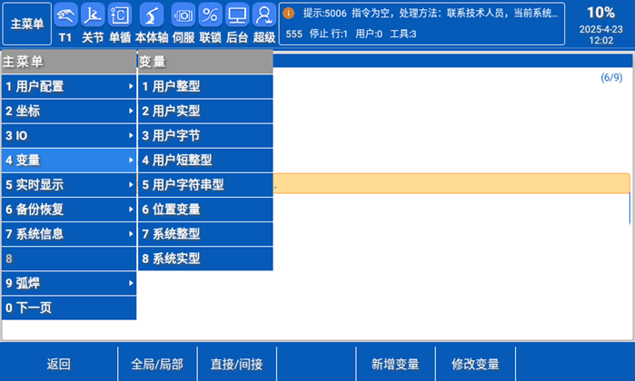

图 3\-16变量菜单

1. 打开不同类型的变量，就可以看到这个类型的界面，可以修改变量的值，通过下方按钮可以改变变量类型或进行其他操作。

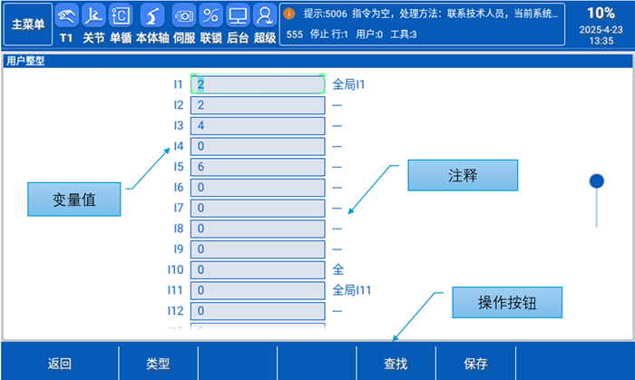

图 3\-17不同的变量界面

## 运动指令

运动指令，是通过不同的运动类型、以特定的速度使机器人移动到目标点的指令。一个运动指令包括下列内容：

1. 运动类型：机器人移动到目标点的不同方式，其规划轨迹因类型也不同。
2. 位置变量：存储位置信息的变量,分为局部变量与全局变量。
3. 运动速度：机器人直线或者轴运动的移动速度。
4. 加速度百分比：执行运动语句的加速度参数。
5. 连续轨迹：是否在目标点停止或者在目标点附近快速滑过。
6. 附加指令：运动指令中，可添加的附加指令。

运动类型

包括：关节运动MOVJ；直线运动MOVL；圆弧运动MOVC；样条运动：MOVS。

位置变量

位置变量有两种：局部位置变量P\[]；全局位置变量PR\[]。

位置数据

包含：X、Y、Z、RX、RY、R值，工具TF\[]和用户UF\[]值，MWORD值，关节值。

运动速度

 直线运动速度、圆弧运动速度mm/s，关节运动速度1\~100%。

加速度

 默认加速度的百分比。

连续轨迹

 运动轨迹的逼近等级0\~100和FINE(精确到点)。

 附加指令

 实现特定功能的可选指令。

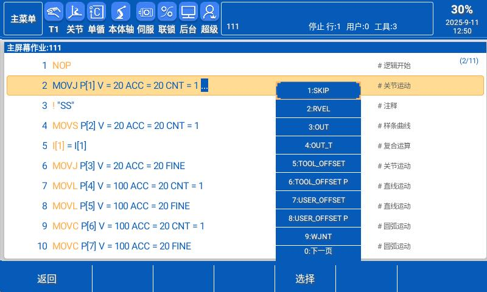

图 3\-18运动指令

### 运动类型

运动类型是指机器人从当前位置，移动到目标位置的方式。运动类型包括：各轴同时开始运动、同时停止运动，运动轨迹在示教完成前不能确定的关节运动；运动轨迹按照直线或圆弧进行规划，运动轨迹可以确定的直线运动和圆弧运动；可以生成样条轨迹的样条运动。

* 关节运动 MOVJ
* 直线运动 MOVL
* 圆弧运动 MOVC
* 样条曲线 MOVS

**关节运动MOVJ**

关节运动是机器人移动到目标位置的一种方法，是机器人所有轴同时加速到达程序指定速度，然后同时减速，达到目标点的一种方法，轴运动的轨迹一般非线性。轴运动的速度是电机额定转速的百分比，在示教时输入。

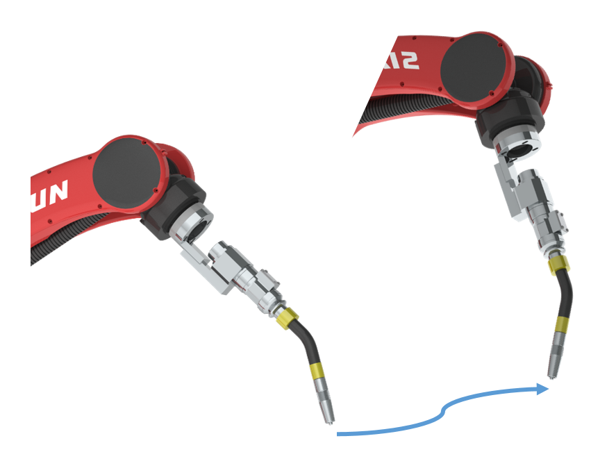

图 3\-19关节运动

**MOVJ指令：**

功能说明：两点之间以关节插补方式进行运动；

格式1：MOVJ P\<参数1\> V\=\<参数2\> ACC\=\<参数3\> CNT\=\<参数4\>

参数说明：

\<参数1\>含义：位置变量号。

\<参数2\>含义：关节运动的运行速度，单位%，范围1\-100。

\<参数3\>含义：最大加速度百分比，单位：%，范围1\-120。

\<参数4\>含义：轨迹连续的逼近等级，可输入0\-100。

举例说明：MOVJ P\[1] V\=10 ACC\=100 CNT\=100。

格式2：MOVJ P\<参数1\> V\=\<参数2\> ACC\=\<参数3\> FINE\<参数4\>

参数说明：

\<参数1\>含义：位置变量号。

\<参数2\>含义：关节运动的运行速度，单位%，范围1\-100。

\<参数3\>含义：最大加速度百分比，单位：%，范围1\-120。

\<参数4\>含义：关节运动精准到达。

举例说明：MOVJ P\[1] \=10 ACC\=100 FINE。

**MOVJ附加指令：**

* SKIP
* OUT
* OUTT\_T
* TOOL\_OFFSET
* TOOL\_OFFSET P
* USER\_OFFSET
* USER\_OFFSET P
* RVEL

注：目前仅列出支持的基础指令清单，具体指令使用查看指令介绍。

**直线运动MOVL**

直线运动是机器人的TCP点，以直线运动的方式，从机器人运动的起始点，移动到目标点的运动方法，运动过程中，可以控制机器人TCP点的移动速度和运动位姿。运动速度的单位是mm/s。

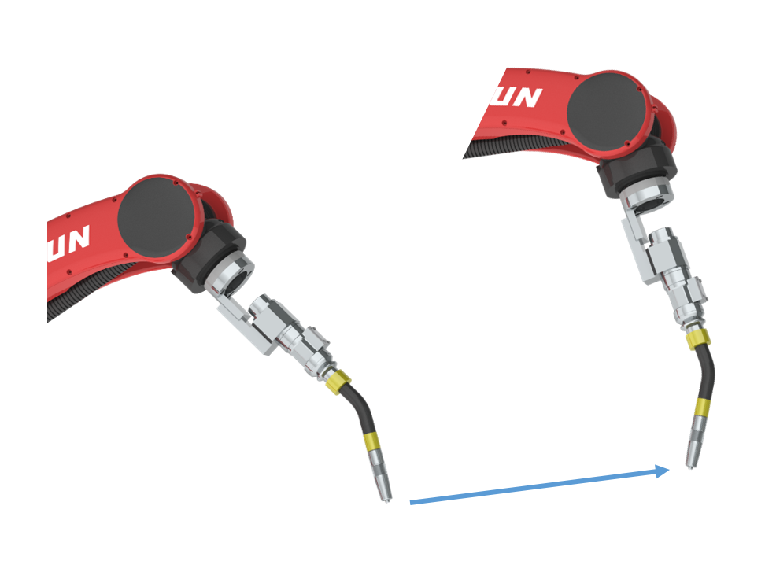

图 3\-20直线运动轨迹

机器人的TCP点也可以在轴的方向上进行旋转运动。使工具的姿态从开始姿态以TCP点为中心进行旋转。移动方式通过直线运动进行控制。

**MOVL指令**：

功能说明：两点之间以直线插补方式进行运动。

格式1：MOVL P\<参数1\> V\=\<参数2\> ACC\=\<参数3\> CNT\=\<参数4\>

参数说明：

\<参数1\>含义：位置变量号。

\<参数2\>含义：直线运动的运行速度，单位mm/s。

\<参数3\>含义：最大加速度百分比，单位：%。，范围1\-120。

\<参数4\>含义：轨迹连续，范围：0\-100,0为轨迹不连续，100最远离目标的点。

举例说明：MOVL P\[1] V\=600 ACC\=20 CNT\=100

格式2：MOVL P\<参数1\> V\=\<参数2\> ACC\=\<参数3\> FINE\=\<参数4\>

参数说明：

\<参数1\>含义：位置变量号。

\<参数2\>含义：直线运动的运行速度，单位mm/s。

\<参数3\>含义：最大加速度百分比，单位：%。，范围1\-120。

\<参数4\>含义：直线运动精准到达。

举例说明：MOVL P\[1] V\=600 ACC\=20 FINE

**MOVL指令的附加指令：**

* SKIP
* OUT
* OUT\_T
* TOOL\_OFFSET
* TOOL\_OFFSET P
* USER\_OFFSET
* USER\_OFFSET P
* RVEL
* WJNT

**注：**具体指令使用查看指令介绍。

**圆弧运动**

圆弧运动时机器人TCP在起始点，通过2个点进行圆弧运动的一种移动方式。需要对经过点和目标点进行示教。圆弧运动的速度是mm/s。

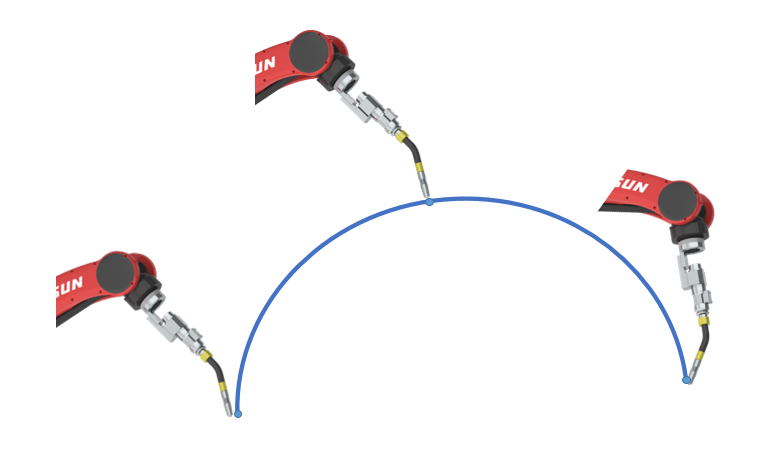

图 3\-21圆弧动作

**MOVC 指令：**

功能说明：三点之间以圆弧插补方式进行运动。

格式1：MOVC P\<参数1\> V\=\<参数2\> ACC\=\<参数3\> CNT\<参数4\>

参数说明：

\<参数1\>含义：位置变量号。

\<参数2\>含义：圆弧运动的运行速度，单位mm/s。

\<参数3\>含义：最大加速度百分比，单位：%，范围：1\-120,120%为最大加速度。

\<参数4\>含义：轨迹连续，范围：0\-100,0为轨迹不连续，100最远离目标的点。

举例说明：MOVC P\[3] V \= 100 ACC \= 20 CNT \= 20

格2：MOVC P\<参数1\> V\=\<参数2\> ACC\=\<参数3\> FINE\<参数4\>

参数说明：

\<参数1\>含义：位置变量号。

\<参数2\>含义：圆弧运动的运行速度，单位mm/s。

\<参数3\>含义：最大加速度百分比，单位：%，范围：1\-120,120%为最大加速度。

\<参数4\>含义：圆弧运动精准到达。

举例说明：MOVC P\[3] V \= 100 ACC \= 20 FINE

**MOVC指令的附加指令：**

* SKIP
* OUT
* OUT\_T
* TOOL\_OFFSET
* TOOL\_OFFSET P
* USER\_OFFSET
* USER\_OFFSET P
* RVEL
* WJNT
* SET TYPE

**注：具体指令使用查看指令介绍。**

其中SET TYPE指令说明如下：

通过附加指令SET变更类型，例MOVC P\[3] V \= 100 ACC \= 20 CNT \= 20 ：SET TYPE \= 1

Type \= 0 圆弧过辅助点，姿态不变

Type \= 1 圆弧不过辅助点，姿态不变

Type \= 2 圆弧过辅助点，姿态绕旋转轴旋转

Type \= 3 圆弧不过辅助点，姿态绕旋转轴旋转

Type \= 4 圆弧过辅助点，姿态绕旋转轴旋转，最终为作业指定姿态

Type \= 5 圆弧不过辅助点，姿态绕旋转轴旋转，最终为作业指定姿态

样条曲线MOVS：

样条曲线即将多点规划时进行圆滑过渡，轨迹中的任意一点位置变更都会导致规划的路径发生变化。

**RVEL指令**:姿态变换倍率，调整机器人姿态变换时快慢的参数。仅可作为运动指令的附加指令存在，指令格式为RVEL 0\.01(常数)。

**WJNT指令**:奇异点绕行，表示机器人轨迹遇到奇异点时是否绕行。仅可作为运动指令的附加指令存在，指令格式为WJNT。

MOJ、MOVL，MOVC指令可以增加附加指令，附加指令个数不限，但同类型附加指令只能是一个。

SKIP附加指令说明

| 指令说明 | 配合SKIP CONDITON指令，满足条件执行跳转 |
| --- | --- |
| 指令格式 | SKIP \<参数1\> |
| 指令 | 参数1\-跳转标签名 |
| SKIP | 字符串常量 |
| 指令示例 | MOVJ P\[1] V \= 20 ACC \= 80 CNT \= 1 : SKIP “1” |

RVEL附加指令说明

| 指令说明 | 设置姿态旋转速度 |
| --- | --- |
| 指令格式 | RVEL \<参数1\> |
| 指令 | 参数1\-速度 |
| RVEL | 实型常量默认0\.01 |
| 指令示例 | MOVJ P\[1] V \= 20 ACC \= 80 CNT \= 1 : RVEL 0\.01 |

OUT附加指令请参考3\.7章OUT指令说明部分。

OUT\_T附加指令请参考3\.7章OUT\_T指令说明部分。

TOOL\_OFFSET附加指令说明

| 指令说明 | 工具条件补偿 |
| --- | --- |
| 指令格式 | TOOL\_OFFSET |
| 指令示例 | MOVJ P\[1] V \= 20 ACC \= 80 CNT \= 1 : TOOL\_OFFSET |

USER\_OFFSET附加指令说明

| 指令说明 | 用户条件补偿 |
| --- | --- |
| 指令格式 | USER\_OFFSET |
| 指令示例 | MOVJ P\[1] V \= 20 ACC \= 80 CNT \= 1 : USER\_OFFSET |

TOOL\_OFFSE\_P附加指令说明

| 指令说明 | 带点位的工具坐标系补偿 | |
| --- | --- | --- |
| 指令格式 | TOOL\_OFFSET \<参数1\> \<参数2\> | |
| 指令 | 参数1 | 参数2 |
| TOOL\_OFFSET | P/PR | 工具坐标系号TF\[N]（0\-8） |
| 指令示例 | MOVL LP\[3] V \= 20 ACC \= 80 CNT \= 100 ：TOOL\_OFFSET P\[1] TF\[1] | |

USER\_OFFSE\_P附加指令说明

| 指令说明 | 带点位的用户坐标系补偿 | |
| --- | --- | --- |
| 指令格式 | USER\_OFFSET \<参数1\> \<参数2\> | |
| 指令 | 参数1 | 参数2 |
| TOOL\_OFFSET | P/PR | 工具坐标系号UF\[N]（0\-8） |
| 指令示例 | MOVL LP\[3] V \= 20 ACC \= 80 CNT \= 100 ：USER\_OFFSET P\[1] UF\[1] | |

WJNT附加指令说明

| 指令说明 | 奇异点规避 |
| --- | --- |
| 指令格式 | WJNT |
| 指令示例 | MOVL P\[1] V \= 20 ACC \= 80 CNT \= 1 : WJNT |

SET TYPE附加指令说明

| 指令说明 | 设置圆弧过辅助点姿态 |
| --- | --- |
| 指令格式 | SET TYPE \= \<参数1\> |
| 指令 | 参数1 |
| SET TYPE | 常量取值如下：Type \= 0 圆弧过辅助点，姿态不变Type \= 1 圆弧不过辅助点，姿态不变Type \= 2 圆弧过辅助点，姿态绕旋转轴旋转Type \= 3 圆弧不过辅助点，姿态绕旋转轴旋转Type \= 4 圆弧过辅助点，姿态绕旋转轴旋转，最终为作业指定姿态Type \= 5 圆弧不过辅助点，姿态绕旋转轴旋转，最终为作业指定姿态 |
| 指令示例 | MOVC P\[1] V \= 20 ACC \= 80 CNT \= 1 : SET TYPE \= 0 |

### 位置信息

位置、姿态信息被记录在位置变量中。可以通过示教的方式，记录机器人的当前位置信息。位置信息有两种记录形式，一种是使用各轴关节值的形式来记录位置信息，另一种是在机器人工作空间中TCP的位置坐标值和姿态值，来记录位置信息，这种方式我们叫做笛卡尔坐标系值。

一个笛卡尔坐标系值，需要通过四组参数来定义，工具坐标系的工具中心点（TCP）在用户坐标系的位置，工具中心点（TCP）的方向，机器人的位型（MWORD），当前使用的用户坐标系。

默认情况下，我们使用正交值来记录位置变量信息。

P变量内容：

P\[]\= X, Y, Z, RX, RY, RZ \| MWORD \| 外部轴关节值 \| 工具坐标系TF\[] 用户坐标系UF\[]

外部工具坐标系ET\

X，Y，Z ：

表示机器人工具中心点（TCP）在当前用户坐标系中的位置。

RX, RY, RZ：

表示机器人当前的姿态，使用X、Y、Z轴的旋转角度表示。

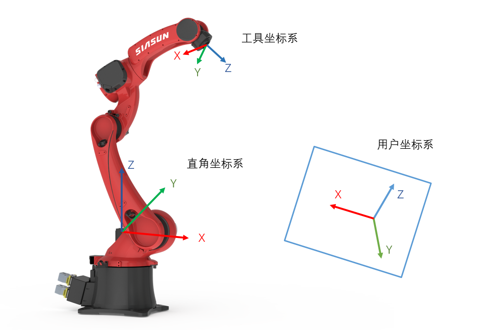

图 3\-22直角、工具、用户坐标系

坐标系号的核对：

在机器人开始执行程序之前，系统会对当前选择的坐标系号进行核对。如果工具坐标系号0\-8，用户坐标系号0\-8，与该位置点在示教时所选择的坐标系号不同时，系统对发出报警，而不执行程序。

工具坐标系号：

0：默认的腕端法兰坐标系。

1\-8：用来选择指定的工具坐标系号。

用户坐标系号：

0：默认的机器人基坐标系，在二轴所在水平面与一轴轴线的交点处。

1\-8：用来选择指定的用户坐标系号。

关节坐标值：

使用关节值来记录位置变量，以机器人零位作为基准，以各轴旋转的关节角来表示位置值。本体轴：J1, J2, J3, J4, J5, J6, 外部轴：E1, E2, E3, E4, E5, E6。

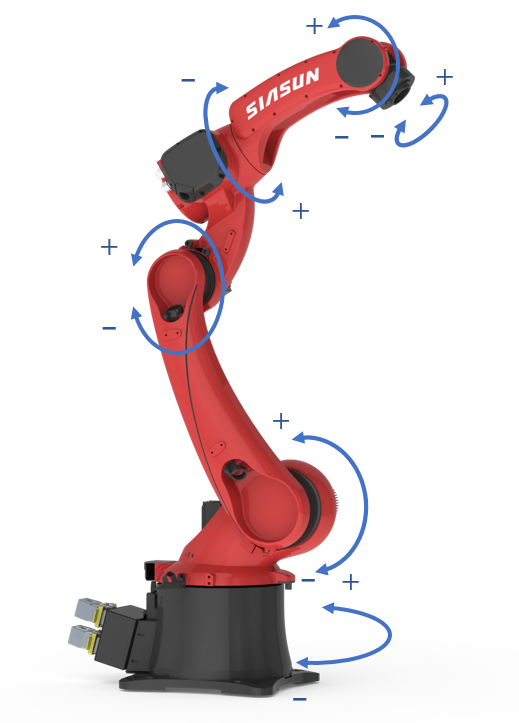

图 3\-23关节坐标系

局部位置变量和全局位置变量：

在运动指令中，位置变量可以选择局部位置变量P\[值]或者全局位置变量PR\[值]，默认输入时，选择局部位置变量。P\[值]或者PR\[值]可以选择直接输入位置变量号，或者选择间接输入\[I\[]]值。

例： 1 MOVJ P\[1] V \= 30 ACC \= 100 CNT \= 0

 2 MOVL PR\[2] V \= 500 ACC \= 100 CNT \= 100

 3 MOVL P\[I\[1]] V \= 500 ACC \= 100 CNT \= 100

局部位置变量 – P\[值]

局部位置变量是机器人默认的位置变量记录信息，当示教位置值时，输入运动指令，就可以记录当前位置信息。

示教时，会选择下列坐标系号对局部变量位置信息进行记录。

当前选择的工具坐标系（UT:0\~8）。

当前选择的工具坐标系（UF:0\~8）。

执行时，会按照下列坐标系号运行作业。

当前选择的工具坐标系（UT:0\~8）。

当前选择的工具坐标系（UF:0\~8）。

全局位置变量 – PR\[值]

全局位置变量，是值可以在任何作业中使用的通用位置变量。

 位置变量编号 – P\[值]

位置变量的编号可以却分每一个示教点，在示教位置时，会自动进行排序，p\[1],p\[2],p\[3]。

如果删除某个运动指令，或者修改了位置变量的编号，新增的编号依然会自动向后进行排序。

局部位置变量菜单

局部位置变量可以通过示教界面下方的按钮菜单进行操作。将光标移动到p\[]上，就可以看到下方的菜单按钮。

图 3\-24局部位置变量的菜单按钮

局部/全局：可以需改位置变量类型，P\[]或这PR\[]。

直接：可以在\[]中直接输入数值。

间接：可以在\[]中输入I\[]值。

新增变量：可以将\[]中的值变成最新的位置变量的值，再次按下会切换回原来的变量。

修改变量：可以对变量进行坐标–关节值进行转换，记录当前位置，修改位置变量值，保存位置变量（编辑同下面全局变量）。

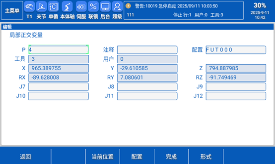

图 3\-25修改变量界面

全局位置变量界面

通过【主菜单】\-【位置变量】进入全局位置变量界，页面内点击位置则进入信息详细页面。

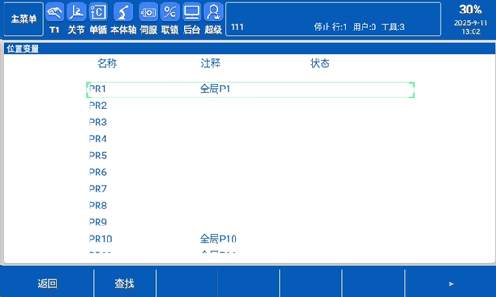

图 3\-26全局位置变量界面

注释：可以对该变量进行备注。

状态：表示位置变量是否有值（有值显示有记录，无值显示空）。

记录：记录当前位置信息到选择的位置变量中。

位置：点击后进入到下图详细页面中。

清除：清除当前选中都得位置变量信息。

查找：输入变量号快速查找位置变量。

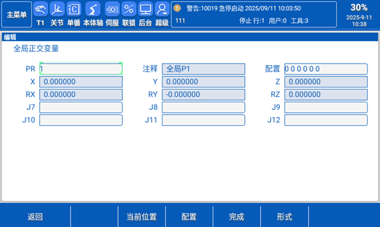

图 3\-27全局位置变量界面

位置变量号：可以查看其他位置变量号，对位置变量号进行选择。

注释：为当前位置变量添加注释。

当前位置：记录当前位置信息到此变量。

配置：对MWORD进行配置。

完成：保存当前位置变量值。

形式：位置信息以2正交或者关节值的方式展示。

### 移动速度

在程序中可以确定机器人的移动速度。在程序自动执行过程中，移动速度受到指定的百分比，以及移动速度的单位和指定的运动方式影响而不同。

MOVJ P\[1] V\=10 ACC\=100 CNT\=0

动作类型为关节运动时，运动速度V表示最大移动速度的百分之几。

MOVL P\[1] V\=600 ACC\=20 CNT\=100

动作类型为直线运动时，单位为mm/s。

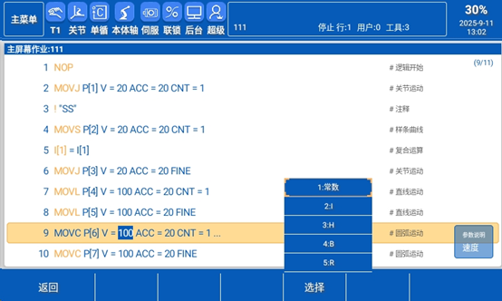

图 3\-28运动指令速度输入

V：

在指令中修改机器人的速度。

ACC：

在指令中修改加速度的百分比。

CNT\&FINE：

CNT:修改机器人的连续轨迹等级。

可以通过【选择】菜单，选择运动指令参数的数据类型，来指定这些值。

FINE：精准到点,机器人实际位置与规划位置达到一致。

### 连续轨迹

机器人到达指定位置有两种定位方法：

1. CNT定位类型
2. FINE定位类型

CNT定位类型：

1. 关闭连续轨迹；
2. 开启连续轨迹；

连续轨迹的开启和关闭需要在执行开关中配置，点击主菜单【系统设置】\-【执行开关】。

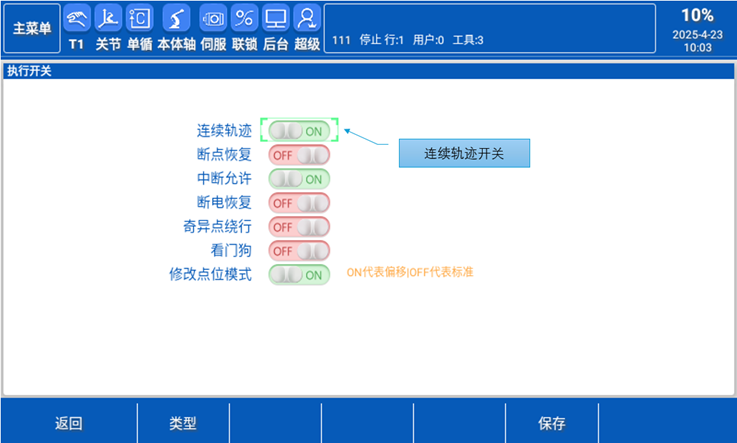

图 3\-29执行开关界面

关闭连续轨迹：

连续轨迹关闭时（CNT\=0），机器人在目标点完全停止住，再向下一点移动。

|  |
| --- |

图 3\-30没有开启连续轨迹

连续轨迹：

连续轨迹开关开启时。

MOVL P\[1] V\=200 ACC\=100 CNT\=（1\-100）

机器人靠近目标位置时，不会到达目标点之后完全停止，而是在目标点周围进行圆滑过渡，然后向一下点移动。

机器人靠近目标位置到什么程度,由0\-100之间的值来确定。

CNT值为0时,机器人在最靠近目标位置处动作，但是不在目标位置定位而开始下一个动作。CNT值为100时,机器人在目标位置附近不减速而马上向着下一个点开始动作,并通过最过远离目标位置的点。

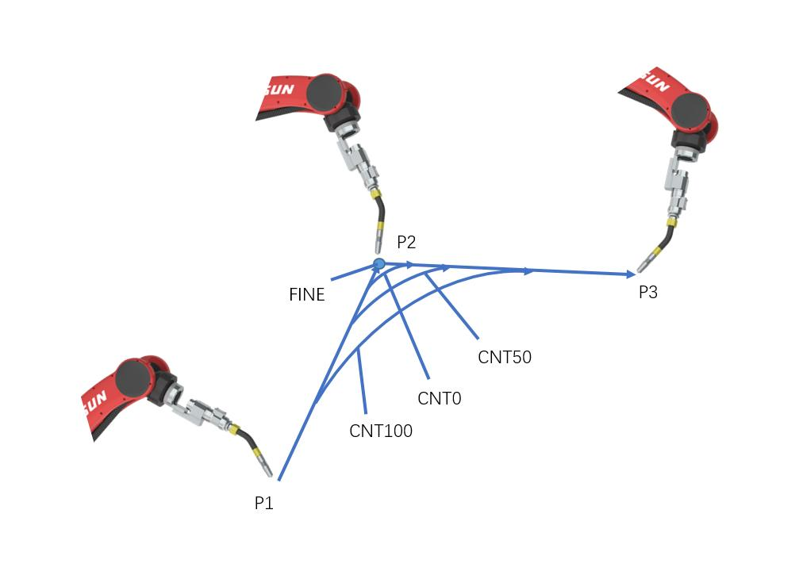 图 3\-31连续轨迹开启时的轨迹

FINE定位类型：

当为FINE定位类型时，机器人在目标位置停止（定位）后，向着下一个目标位置移动。

## 基础指令

基础指令菜单中，包含下列指令：

| 类别 | 指令 | 功能简述 | |
| --- | --- | --- | --- |
| 基础指令 | NOTES | 备注 | |
| SET | 赋值 | |
| SETP | 修改P变量MWORD和坐标系号 | |
| GETP | 获取当前 | |
| SETFRAME | 切换坐标系 | |
| SETEXTAXIS | 修改外部轴关节值 | |
| CLEAR | 清除变量值 | |
| STRING | STRLEN | 获取字符长度 |
| STRFIND | 字符查找 |
| STRSUB | 截取部分字符 |
| STRCMP | 字符比较 |
| GETAT | 获取字符串单个字符 |
| STRFINDEND | 字符串逆向查找 |
| STRREVERSE | 字符串翻转 |
| STRSPLIT | 字符串分割 |
| SPRINTF | 字符串格式化 |
| STR2I | 将字符串转换为整形 |
| STR2R | 将字符串转换为实形 |
| I2STR | 将整形转换成字符串 |
| R2STR | 将实型转换成字符串 |

基础指令的菜单：

点击【主菜单】\-【基础指令】，可以打开基础指令菜单。

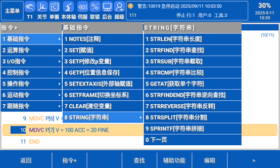

图3\-32 基础指令菜单

参数操作按钮：

当选择参数后，界面下方会变成按钮菜单，可以改变参数的形式，直接或是间接表示，选择变量类型，修改变量值。

图 3\-33参数按钮菜单

NOTES(！) 指令：

备注指令，用户可在作业任意位置添加备注信息。

例：！ 开启夹具

SET指令：

变量赋值操作。

| SET | 功能 | 赋值指令 | |
| --- | --- | --- | --- |
| 格式 | SET \<参数1\> \<参数2\> | |
| 说明 | 参数1 | I\[]：32位整型变量 |
| H\[]：16位整型变量 |
| B\[]：8位整型变量 |
| R\[]：64位浮点型变量 |
| P\[]：位姿变量，能直接赋值 |
| S\[]：字符型变量，能直接赋值 |
| P\[].X P\[].Y P\[].ZP\[].roll P\[].pitch P\[].yaw |
| P\[].j1 P\[].j2 P\[].j3P\[].j4 P\[].j5 P\[].j6 |
| P\[].e1 P\[].e2 P\[].e3P\[].e4 P\[].e5 P\[].e6 |
| 参数2 | 常数 |
| I\[]：32位整型变量 |
| H\[]：16位整型变量 |
| B\[]：8位整型变量 |
| R\[]：64位浮点型变量 |
| P\[]：位姿变量，能直接赋值 |
| S\[]：字符型变量，能直接赋值 |
| P\[].X P\[].Y P\[].ZP\[].roll P\[].pitch P\[].yaw |
| P\[].j1 P\[].j2 P\[].j3P\[].j4 P\[].j5 P\[].j6 |
| P\[].e1 P\[].e2 P\[].e3P\[].e4 P\[].e5 P\[].e6 |
| 举例 | SET I\[1] I\[3]SET R\[I\[1]] 5 | |

**注：P变量只能与P变量做赋值运算，S变量只能与S变量做赋值运算。**

SETP 指令：

修改P\[]\\PR\[]变量的MWORD值或坐标系号。

| SETP | 功能 | 修改P\[]\\PR\[]变量的MWORD值或坐标系号，修改mword前三个值，代表关节配置。 | |
| --- | --- | --- | --- |
| 格式 | SETP \<参数1\> \<参数2\> | |
| 说明 | 参数1 | P\[值]/PR\[值] |
| 参数2 | CFG ：关节配置，三个字母分别代表5、3、1轴的控制点位于控制面的哪一侧。 |
| 参数3 | F U TN U TF D TF U BN D TF D BN U BN D B注释： 1、FLIP\\NOFLIP,代表手腕的上下；2、UP\\DOWN,代表手臂的上下；3、BACK\\FRONT代表手臂的前后。具体位姿见下图。 |
| 每一个字母代表的位姿图片 |  |
| 举例 | SETP P\[1] CFG FUT | |

| SETP | 功能 | 修改P\[]\\PR\[]变量的MWORD值或坐标系号，修改mword后三个值，代表回转数 | |
| --- | --- | --- | --- |
| 格式 | SETP \<参数1\> \<参数2\> | |
| 说明 | 参数1 | P\[值]/PR\[值] |
| 参数2 | TN ：回转数 |
| 参数3 | 1:1 J1轴2:4 J4轴3:6 J6轴 |
| 参数4 | \-1：关节在\-540°到\-180°之间取值。0：关节在\-180°到180°区间取值。1：关节在180°到540°之间取值。 |
| 举例 | SETP PR\[1] TN 1 1 | |

| STEP | 功能 | 修改P\[]\\PR\[]变量的MWORD值或这坐标系号，修改坐标系号 | |
| --- | --- | --- | --- |
| 格式 | SETP \<参数1\> \<参数2\> | |
| 说明 | 参数1 | P\[值]/PR\[值] |
| 参数2 | FRAME |
| 参数3 | TF 工具坐标系号UF 用户坐标系号ET 外部工具坐标系号 |
| 参数4 | 常数I\[]：32位整型变量H\[]：16位整型变量B\[]：8位整型变量 |
| 举例 | SETP P\[1] FRAME TF 1 | |

SETFRAME指令：

| SETFRAME | 功能 | 切换坐标系指令。 | |
| --- | --- | --- | --- |
| 格式 | SETFRAME \<参数1\> | |
| 说明 | 参数1 | TF 工具坐标系号（1\-8） |
| 参数2 | UF 用户坐标系号(1\-8\) |
| 参数3 | ET 外部工具坐标系号(1\-8\) |
| 举例 | SETFRAME TF 1 | |

GETP 指令：

| GETP | 功能 | 获取当前位置信息，保存到P\[值]/PR\[值]变量中。 | |
| --- | --- | --- | --- |
| 格式 | GETP \<参数1\> | |
| 说明 | 参数1 | P\[常数]/PR\[常数] |
| 举例 | GETP PR\[1] | |

SETEXTAXIS 指令：

| SETEXTAXIS | 功能 | 对一个位置变量P\[]/PR\[]中的一个外部轴进行赋值。 | |
| --- | --- | --- | --- |
| 格式 | SETEXTAXIS \<参数1\> \<参数2\> \<参数3\> | |
| 说明 | 参数1 | P\[值]/PR\[值] |
| 参数2 | e\[] |
| 参数3 | 常数I\[]：32位整型变量H\[]：16位整型变量B\[]：8位整型变量R\[]：64位浮点型变量 |
| 举例 | SETEXTAXIS P\[1] e1 50 | |

**注：通过此指令变更外部轴关节值，保证tcp不变得情况下，机器人会发生轨迹变化。**

CLEAR 指令：

| CLEAR | 功能 | 清空指定范围的变量值。 | |
| --- | --- | --- | --- |
| 格式 | CLEAR \<参数1\> \<参数2\> | |
| 说明 | 参数1 | I\[]：32位整型变量H\[]：16位整型变量B\[]：8位整型变量R\[]：64位浮点型变量 |
| 参数2 | I\[]：32位整型变量H\[]：16位整型变量B\[]：8位整型变量R\[]：64位浮点型变量 |
| 举例 | CLEAR I\[1] I\[100]CLEAR B\[I\[1]] B\[I\[100]] | |

STRLEN 指令：

| STRLEN | 功能 | 将参数1的长度值，存入参数2中。 | |
| --- | --- | --- | --- |
| 格式 | STRLEN \<参数1\> \<参数2\> | |
| 说明 | 参数1 | S\[常数]/S\[I\[常数]]直接/间接S\[]:字符型变量，能直接赋值 |
| 参数2 | I\[常数]/I\[I\[常数]]直接/间接I\[]：32位整型变量 |
| 举例 | STRLEN S\[1] I\[1]STRLEN S\[I\[2]] I\[I\[2]] | |

STRFIND 指令：

| STRFIND | 功能 | 查找部分字符串，从参数1中查找参数2出现的索引值，结果放参数3中。 | |
| --- | --- | --- | --- |
| 格式 | STRFIND \<参数1\> \<参数2\> \<参数3\> | |
| 说明 | 参数1 | S\[常数]/S\[I\[常数]]直接/间接S:字符型变量，能直接赋值 |
| 参数2 | S\[常数]/S\[I\[常数]]直接/间接S:字符型变量，能直接赋值 |
|  | 参数3 | I\[常数]/I\[I\[常数]]直接/间接I：32位整型变量 |
| 举例 | STRFIND S\[1] S\[10] I\[1]STRFIND S\[I\[1]] S\[I\[1]] I\[I\[2]] | |

STRSUB 指令：

| STRSUB | 功能 | 获取部分字符串，从参数1中获取参数2与参数3长度的字符串，结果放参数4中。 | |
| --- | --- | --- | --- |
| 格式 | STRSUB \<参数1\> \<参数2\> \<参数3\> \<参数4\> | |
| 说明 | 参数1 | S\[常数]/S\[I\[常数]]直接/间接S:字符型变量，能直接赋值 |
| 参数2 | I\[常数]/I\[I\[常数]]直接/间接I：32位整型变量 |
| 参数3 | I\[常数]/I\[I\[常数]]直接/间接I：32位整型变量 |
| 参数4 | S\[常数]/S\[I\[常数]]直接/间接S:字符型变量，能直接赋值 |
| 举例 | STRSUB S\[1] I\[1] I\[2] S\[2]STRSUB S\[I\[1]] I\[I\[2]] I\[I\[3]] S\[I\[2] | |

STRCMP 指令：

| STRCMP | 功能 | 字符串比较，从参数1与参数2进行比较，结果放参数3。比较结果相同为1，不同为0。 | |
| --- | --- | --- | --- |
| 格式 | STRCMP \<参数1\> \<参数2\> \<参数3\> | |
| 说明 | 参数1 | S\[常数]/S\[I\[常数]]直接/间接S:字符型变量，能直接赋值 |
| 参数2 | S\[常数]/S\[I\[常数]]直接/间接S:字符型变量，能直接赋值 |
| 参数3 | I\[常数]/I\[I\[常数]]直接/间接I：32位整型变量 |
| 举例 | STRCMP S\[1] S\[2] I\[1] STRCMP S\[I\[1]] S\[I\[2]] I\[I\[2]] | |

GETAT 指令：

| GETAT | 功能 | 获取字符串单个字符，将参数1中索引为参数2的字符放到参数3中。 | |
| --- | --- | --- | --- |
| 格式 | STRCMP \<参数1\> \<参数2\> \<参数3\> | |
| 说明 | 参数1 | S\[常数]/S\[I\[常数]]直接/间接S:字符型变量，能直接赋值 |
| 参数2 | I\[常数]/I\[I\[常数]]直接/间接I：32位整型变量 |
| 参数3 | S\[常数]/S\[I\[常数]]直接/间接S:字符型变量，能直接赋值 |
| 举例 | GETAT S\[1] I\[1] S\[2] GETAT S\[I\[1]] I\[I\[1]] S\[I\[2]] | |

STRFINDEND 指令：

| STRFINDEND | 功能 | 字符串逆向查找，以逆序从参数1中查找参数2，并将参数2出现的索引存入参数3 | |
| --- | --- | --- | --- |
| 格式 | STRFINDEND \<参数1\> \<参数2\> \<参数3\> | |
| 说明 | 参数1 | S\[常数]/S\[I\[常数]]直接/间接S:字符型变量，能直接赋值 |
| 参数2 | S\[常数]/S\[I\[常数]]直接/间接S:字符型变量，能直接赋值 |
| 参数3 | I\[常数]/I\[I\[常数]]直接/间接I：32位整型变量 |
| 举例 | STRFINDEND S\[1] S\[1] I\[1] STRFINDEND S\[I\[1]] S\[I\[1]] I\[I\[1]] | |

STRREVERSE 指令：

| STRREVERSE | 功能 | 字符串翻转功能,翻转参数1内容并存储到参数2。 | |
| --- | --- | --- | --- |
| 格式 | STRREVERSE \<参数1\> \<参数2\> | |
| 说明 | 参数1 | S\[常数]/S\[I\[常数]]直接/间接S\[]:字符型变量，能直接赋值 |
| 参数2 | S\[常数]/S\[I\[常数]]直接/间接S\[]:字符型变量，能直接赋值 |
| 举例 | STRREVERSE S\[1] S\[1]STRREVERSE S\[I\[2]] S\[I\[2]] | |

STRSPLIT 指令：

| STRSPLIT | 功能 | 字符串分割功能，将参数1为源字符串，以参数2为分隔符分割，分割结果为一个字符串数组，存储在参数3为起始索引的若干个局部字符串变量中参数4为分割后的字符串数量 | |
| --- | --- | --- | --- |
| 格式 | STRSPLIT \<参数1\> \<参数2\> \<参数3\> \<参数4\> | |
| 说明 | 参数1 | S\[常数]/S\[I\[常数]]直接/间接S:字符型变量，能直接赋值 |
| 参数2 | S\[常数]/S\[I\[常数]]直接/间接S:字符型变量，能直接赋值 |
| 参数3 | 常数 |
| 参数4 | I\[常数]/I\[I\[常数]]直接/间接I：32位整型变量 |
| 举例 | STRSPLIT S\[1] S\[1] 0 I\[1]STRSPLIT S\[I\[1]] S\[I\[1]] 0 1\[I\[1]] | |

SPRINTF 指令：

| SPRINTF | 功能 | 字符串格式化功能,将参数1之后的内容合并成一个字符串，并存储到参数1中。 | |
| --- | --- | --- | --- |
| 格式 | SPRINTF \<参数1\> \<参数2\> | |
| 说明 | 参数1 | S\[常数]/S\[I\[常数]]直接/间接S\[]:字符型变量，能直接赋值 |
| 参数2 | S\[常数]/S\[I\[常数]]直接/间接S\[]:字符型变量，能直接赋值 |
| 举例 | SPRINTF S\[1] S\[2]SPRINTF S\[I\[1]] S\[I\[2]] | |

STR2I指令

| STR2I | 功能 | 将字符串转换成整形。 | |
| --- | --- | --- | --- |
| 格式 | STR2I \<参数1\> \<参数2\> | |
| 说明 | 参数1 | S\[常数]/S\[I\[常数]]直接/间接S\[]:字符型变量，能直接赋值 |
| 参数2 | I\[常数]/I\[I\[常数]]直接/间接 |
| 举例 | STR2I S\[1] I\[1]STR2I S\[I\[1]] I\[I\[2]] | |

STR2R指令

| STR2R | 功能 | 将字符串转换成实形。 | |
| --- | --- | --- | --- |
| 格式 | STR2R \<参数1\> \<参数2\> | |
| 说明 | 参数1 | S\[常数]/S\[I\[常数]]直接/间接S\[]:字符型变量，能直接赋值 |
| 参数2 | R\[常数]/R\[I\[常数]]直接/间接 |
| 举例 | STR2I S\[1] R\[1]STR2I S\[I\[1]] R\[I\[2]] | |

I2STR指令

| I2STR | 功能 | 将整形转换成字符串。 | |
| --- | --- | --- | --- |
| 格式 | I2STR \<参数1\> \<参数2\> | |
| 说明 | 参数1 | I\[常数]/I\[I\[常数]]直接/间接 |
| 参数2 | S\[常数]/S\[I\[常数]]直接/间接S\[]:字符型变量，能直接赋值 |
| 举例 | I2STR S\[1] I\[1]I2STR S\[I\[1]] R\[I\[2]] | |

R2STR指令

| R2STR | 功能 | 将实形转换成字符串。 | |
| --- | --- | --- | --- |
| 格式 | R2STR \<参数1\> \<参数2\> | |
| 说明 | 参数1 | R\[常数]/R\[I\[常数]]直接/间接 |
| 参数2 | S\[常数]/S\[I\[常数]]直接/间接S\[]:字符型变量，能直接赋值 |
| 举例 | R2STR R\[1] S\[1]I2STR S\[I\[1]] R\[I\[2]] | |

## 运算指令

运算类指令包括：

| 类别 | 指令 | 功能简述 |
| --- | --- | --- |
| 运算指令 | COP | 复合运算\+、\-、\*、/、\>\>、\<\<、\&、\| |
| NOT | 变量按位取反 |
| ATAN | 求atan运算 |
| INV | 变量取逆 |
| SQRT | 开平方 |
| SIN | 正弦 |
| COS | 余弦 |
| TAN | 正切 |
| ATAN2 | 反正切 |
| MAX | 最大值 |
| MIN | 最小值 |
| ABS | 绝对值 |
| LOG | 自然对数 |
| POW | 指数函数 |

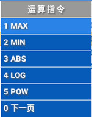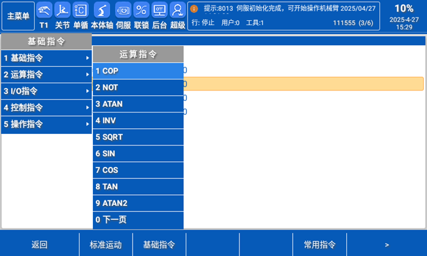

图 3\-34运算类指令菜单

COP指令：

| COP | 功能 | 运算类符合指令，支持各种运算的组合，组合没有长度限制。 | |
| --- | --- | --- | --- |
| 格式 | \<参数1\> \= \<参数2\> \[运算符] \<参数3\> … | |
| 说明 | 参数1 | I\[]：32位整型变量H\[]：16位整型变量B\[]：8位整型变量R\[]：64位浮点型变量S\[]:字符型变量，能直接赋值P\[]：位姿变量，能直接赋值P\[].X P\[].Y P\[].ZP\[].RX P\[].RY P\[].RZP\[].j1 P\[].j2 P\[].j3P\[].j4 P\[].j5 P\[].j6P\[].e1 P\[].e2 P\[].e3P\[].e4 P\[].e5 P\[].e6 |
| 参数2 | 常数I\[]：32位整型变量H\[]：16位整型变量B\[]：8位整型变量R\[]：64位浮点型变量P\[]：位姿变量，能直接赋值P\[].X P\[].Y P\[].ZP\[].RX P\[].RY P\[].RZP\[].j1 P\[].j2 P\[].j3P\[].j4 P\[].j5 P\[].j6P\[].e1 P\[].e2 P\[].e3P\[].e4 P\[].e5 P\[].e6 |
| 运算符 | \+ \- \* / \>\> \<\< \& \| \&\& \|\| ^ | |

| 注释：1. 针对P\[1].1轴关节值的修改会修改整个P的姿态值。 2. P只支持\+运算即实现P的增量变换（矩阵运算），如p\[0] \= p\[1] \+ p\[2]。 |
| --- |

下面针对各个运算支持的数据类型做阐述。

例 I\[1] \= I\[2] \+ I\[3]

| 运算类型 | 变量类型 |
| --- | --- |
| ADD | 常数I H R B S P P. |
| SUB | 常数I H R B P. |
| MUL | 常数I H R B P. |
| DIV | 常数I H R B P. |
| AND | 常数I H B |
| OR | 常数I H B |
| RIGHTSHIFT | 常数I H B |
| LEFTSHIFT | 常数I H B |

NOT 指令

| NOT | 功能 | 按位取反运算。 | |
| --- | --- | --- | --- |
| 格式 | \<参数1\> \= NOT \<参数2\> | |
| 说明 | 参数1 | I：32位整型变量H：16位整型变量B：8位整型变量 |
| 参数2 | 常数I\[]：32位整型变量H\[]：16位整型变量B\[]：8位整型变量R\[]：64位浮点型变量 |
| 举例 | I\[1] \= NOT I\[2] | |

 ATAN 指令

| ATAN | 功能 | 求参数2的反正切值，结果到参数1。 | |
| --- | --- | --- | --- |
| 格式 | R\[值] \= ATAN \<参数2\> | |
| 说明 | 参数1 | R\[]：64位浮点型变量 |
| 参数2 | 常数I\[]：32位整型变量H\[]：16位整型变量B\[]：8位整型变量R\[]：64位浮点型变量P\[].X P\[].Y P\[].ZP\[].RX P\[].RY P\[].RZP\[].j1 P\[].j2 P\[].j3P\[].j4 P\[].j5 P\[].j6P\[].e1 P\[].e2 P\[].e3P\[].e4 P\[].e5 P\[].e6 |
| 举例 | R\[1] \= ATAN R\[2] | |

 TAN指令：

| TAN | 功能 | 求参数2的正切值，结果保存到参数1中。 | |
| --- | --- | --- | --- |
| 格式 | R\[值] \= ATAN \<参数2\> | |
| 说明 | 参数1 | R\[]：64位浮点型变量 |
| 参数2 | 常数I\[]：32位整型变量H\[]：16位整型变量B\[]：8位整型变量R\[]：64位浮点型变量P\[].X P\[].Y P\[].ZP\[].RX P\[].RY P\[].RZP\[].j1 P\[].j2 P\[].j3P\[].j4 P\[].j5 P\[].j6P\[].e1 P\[].e2 P\[].e3P\[].e4 P\[].e5 P\[].e6 |
| 举例 | R\[1] \= TAN R\[2] | |

 INV指令：

| INV | 功能 | 对P变量取逆。 | |
| --- | --- | --- | --- |
| 格式 | INV \<参数1\> | |
| 说明 | 参数1 | P\[常数] / PR\[I\[常数]]直接 / 间接 |
| 举例 | INV P\[1]INV PR\[1] | |

 SQRT 指令：

| SQRT | 功能 | 开平方指令，对参数2进行开方运算，结果存入参数1中。 | |
| --- | --- | --- | --- |
| 格式 | R\[值] \= SQRT \<参数2\> | |
| 说明 | 参数1 | R\[]：64位浮点型变量 |
| 参数2 | 常数I\[]：32位整型变量H\[]：16位整型变量B\[]：8位整型变量R\[]：64位浮点型变量P\[].X P\[].Y P\[].ZP\[].RX P\[].RY P\[].RZP\[].j1 P\[].j2 P\[].j3P\[].j4 P\[].j5 P\[].j6P\[].e1 P\[].e2 P\[].e3P\[].e4 P\[].e5 P\[].e6 |
| 举例 | OUT DO\[1] 1 T \= \-1 | |

 SIN 指令：

| SIN | 功能 | 对参数2进行正弦计算，将得到的结果存入到参数1。 | |
| --- | --- | --- | --- |
| 格式 | R\[值] \= SIN \<参数2\> | |
| 说明 | 参数1 | R\[]：64位浮点型变量 |
| 参数2 | 常数I\[]：32位整型变量H\[]：16位整型变量B\[]：8位整型变量R\[]：64位浮点型变量P\[].X P\[].Y P\[].ZP\[].RX P\[].RY P\[].RZP\[].j1 P\[].j2 P\[].j3P\[].j4 P\[].j5 P\[].j6P\[].e1 P\[].e2 P\[].e3P\[].e4 P\[].e5 P\[].e6 |
| 举例 | R\[1] \= SIN R\[1] | |

 COS 指令：

| COS | 功能 | 对参数2进行余弦计算，将得到的结果存入参数1。 | |
| --- | --- | --- | --- |
| 格式 | R\[值] \= COS \<参数2\> | |
| 说明 | 参数1 | R\[]：64位浮点型变量 |
| 参数2 | 常数I\[]：32位整型变量H\[]：16位整型变量B\[]：8位整型变量R\[]：64位浮点型变量P\[].X P\[].Y P\[].ZP\[].RX P\[].RY P\[].RZP\[].j1 P\[].j2 P\[].j3P\[].j4 P\[].j5 P\[].j6P\[].e1 P\[].e2 P\[].e3P\[].e4 P\[].e5 P\[].e6 |
| 举例 | R\[1] \= COS R\[1] | |

ATAN2 指令：

| ATAN2 | 功能 | 四象限反正切计算，将得到的结果存入参数1中。 | |
| --- | --- | --- | --- |
| 格式 | R\[值] \= ATAN2 \<参数2\> \<参数3\> | |
| 说明 | 参数1 | R\[]：64位浮点型变量 |
| 参数2 | 常数I\[]：32位整型变量H\[]：16位整型变量B\[]：8位整型变量R\[]：64位浮点型变量P\[].X P\[].Y P\[].ZP\[].RX P\[].RY P\[].RZP\[].j1 P\[].j2 P\[].j3P\[].j4 P\[].j5 P\[].j6P\[].e1 P\[].e2 P\[].e3P\[].e4 P\[].e5 P\[].e6 |
| 参数3 | 常数I\[]：32位整型变量H\[]：16位整型变量B\[]：8位整型变量R\[]：64位浮点型变量P\[].X P\[].Y P\[].ZP\[].RX P\[].RY P\[].RZP\[].j1 P\[].j2 P\[].j3P\[].j4 P\[].j5 P\[].j6P\[].e1 P\[].e2 P\[].e3P\[].e4 P\[].e5 P\[].e6 |
| 举例 | R\[1] \= ATAN2 R\[1] R\[2] | |

MAX 指令：

| MAX | 功能 | 求最大值，比较参数2和参数3的值，并将结果放入参数1中。 | |
| --- | --- | --- | --- |
| 格式 | R\[值] \= MAX \<参数2\> \<参数3\> | |
| 说明 | 参数1 | I\[]：32位整型变量H\[]：16位整型变量B\[]：8位整型变量R\[]：64位浮点型变量P\[].X P\[].Y P\[].ZP\[].RX P\[].RY P\[].RZP\[].j1 P\[].j2 P\[].j3P\[].j4 P\[].j5 P\[].j6P\[].e1 P\[].e2 P\[].e3P\[].e4 P\[].e5 P\[].e6 |
| 参数2 | 常数I\[]：32位整型变量H\[]：16位整型变量B\[]：8位整型变量R\[]：64位浮点型变量P\[].X P\[].Y P\[].ZP\[].RX P\[].RY P\[].RZP\[].j1 P\[].j2 P\[].j3P\[].j4 P\[].j5 P\[].j6P\[].e1 P\[].e2 P\[].e3P\[].e4 P\[].e5 P\[].e6 |
| 参数3 | 常数I\[]：32位整型变量H\[]：16位整型变量B\[]：8位整型变量R\[]：64位浮点型变量P\[].X P\[].Y P\[].ZP\[].RX P\[].RY P\[].RZP\[].j1 P\[].j2 P\[].j3P\[].j4 P\[].j5 P\[].j6P\[].e1 P\[].e2 P\[].e3P\[].e4 P\[].e5 P\[].e6 |
| 举例 | R\[1] \= MAX R\[1] R\[2] | |

 MIN 指令：

| MIN | 功能 | 求最小值，比较参数2和参数3的值，并将结果放入参数1中。 | |
| --- | --- | --- | --- |
| 格式 | \<参数1\> \= MIX \<参数2\> \<参数3\> | |
| 说明 | 参数1 | I\[]：32位整型变量H\[]：16位整型变量B\[]：8位整型变量R\[]：64位浮点型变量P\[].X P\[].Y P\[].ZP\[].RX P\[].RY P\[].RZ |
| 参数2 | 常数I\[]：32位整型变量H\[]：16位整型变量B\[]：8位整型变量R\[]：64位浮点型变量P\[].X P\[].Y P\[].ZP\[].RX P\[].RY P\[].RZP\[].j1 P\[].j2 P\[].j3P\[].j4 P\[].j5 P\[].j6P\[].e1 P\[].e2 P\[].e3P\[].e4 P\[].e5 P\[].e6 |
| 参数3 | 常数I\[]：32位整型变量H\[]：16位整型变量B\[]：8位整型变量R\[]：64位浮点型变量P\[].X P\[].Y P\[].ZP\[].RX P\[].RY P\[].RZP\[].j1 P\[].j2 P\[].j3P\[].j4 P\[].j5 P\[].j6P\[].e1 P\[].e2 P\[].e3P\[].e4 P\[].e5 P\[].e6 |
| 举例 | R\[1] \= MIX R\[1] R\[2] | |

 ABS 指令：

| ABS | 功能 | 求绝对值运算，将计算结果存到参数1中。 | |
| --- | --- | --- | --- |
| 格式 | \<参数1\> \= ABS \<参数2\> | |
| 说明 | 参数1 | I\[]：32位整型变量H\[]：16位整型变量B\[]：8位整型变量 |
| 参数2 | 常数I\[]：32位整型变量H\[]：16位整型变量B\[]：8位整型变量R\[]：64位浮点型变量P\[].X P\[].Y P\[].ZP\[].RX P\[].RY P\[].RZP\[].j1 P\[].j2 P\[].j3P\[].j4 P\[].j5 P\[].j6P\[].e1 P\[].e2 P\[].e3P\[].e4 P\[].e5 P\[].e6 |
| 举例 | R\[1] \= ABS R\[2] | |

LOG 指令：

| LOG | 功能 | 求以参数2为底数的对数，并将结果存入到参数1中。 | |
| --- | --- | --- | --- |
| 格式 | \<参数1\> \= LOG \<参数2\> \<参数3\> | |
| 说明 | 参数1 | I\[]：32位整型变量H\[]：16位整型变量B\[]：8位整型变量R\[]：64位浮点型变量 |
| 参数2 | 常数I\[]：32位整型变量H\[]：16位整型变量B\[]：8位整型变量R\[]：64位浮点型变量P\[].X P\[].Y P\[].ZP\[].RX P\[].RY P\[].RZP\[].j1 P\[].j2 P\[].j3P\[].j4 P\[].j5 P\[].j6P\[].e1 P\[].e2 P\[].e3P\[].e4 P\[].e5 P\[].e6 |
| 参数3 | 常数I\[]：32位整型变量H\[]：16位整型变量B\[]：8位整型变量R\[]：64位浮点型变量P\[].X P\[].Y P\[].ZP\[].RX P\[].RY P\[].RZP\[].j1 P\[].j2 P\[].j3P\[].j4 P\[].j5 P\[].j6P\[].e1 P\[].e2 P\[].e3P\[].e4 P\[].e5 P\[].e6 |
| 举例 | R\[1] \= LOG R\[2] R\[3] | |

POW 指令：

| POW | 功能 | 求指数运算，计算参数2的参数3次方，并将结果存入到参数1中。 | |
| --- | --- | --- | --- |
| 格式 | \<参数1\> \= POW \<参数2\> \<参数3\> | |
| 说明 | 参数1 | I\[]：32位整型变量H\[]：16位整型变量B\[]：8位整型变量R\[]：64位浮点型变量 |
| 参数2 | 常数I\[]：32位整型变量H\[]：16位整型变量B\[]：8位整型变量R\[]：64位浮点型变量P\[].X P\[].Y P\[].ZP\[].RX P\[].RY P\[].RZP\[].j1 P\[].j2 P\[].j3P\[].j4 P\[].j5 P\[].j6P\[].e1 P\[].e2 P\[].e3P\[].e4 P\[].e5 P\[].e6 |
| 参数3 | 常数I\[]：32位整型变量H\[]：16位整型变量B\[]：8位整型变量R\[]：64位浮点型变量P\[].X P\[].Y P\[].ZP\[].RX P\[].RY P\[].RZP\[].j1 P\[].j2 P\[].j3P\[].j4 P\[].j5 P\[].j6P\[].e1 P\[].e2 P\[].e3P\[].e4 P\[].e5 P\[].e6 |
| 举例 | R\[1] \= POW R\[2] R\[3] | |

## I/O指令

I/O类指令，可以改变对外部设备输出信号的状态，或者读取输入设备状态的指令。

I/O类指令包括：

| 类别 | 指令 | 功能简述 |
| --- | --- | --- |
| I/O指令 | ANIN | 模拟量IO输入 |
| ANOUT | 模拟量IO输出 |
| IN | IO输入 |
| OUT | IO输出 |
| OUT\_T | 时间或者距离达到后IO组或IO输出 |

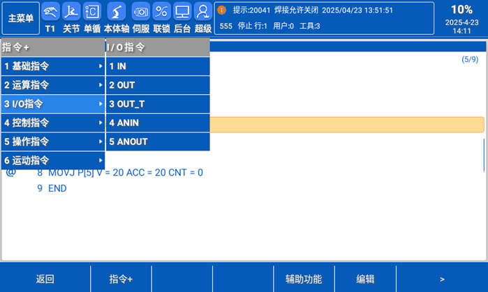

图 3\-35 I\\O类指令

组I/O设置：

使用组I/O之前，需要对组I/O进行配置，具体配置方式，需要参考第二章内容。

IN 指令：

| IN | 功能 | 将I/O赋给变量I\[值] | |
| --- | --- | --- | --- |
| 格式 | IN I\[值] \= \<参数2\> | |
| 说明 | 参数1 | I\[]：32位整型变量 |
| 参数2 | DIGIB ：8位组IOGIH ：16位组IOGII ：32位组IOGIF ：32位组IODOGOB ：8位组IOGOH ：16位组IOGOI ：32位组IOGOF ：32位组IO |
| 举例 | IN I\[值] \= GOB\[值] | |

OUT 指令：

| OUT | 功能 | 对I/O和组I/O进行输出。 | |
| --- | --- | --- | --- |
| 格式 | OUT \<参数1\> \= \<参数2\> | |
| 说明 | 参数1 | DOGOB ：8位组IOGOH ：16位组IOGOI ：32位组IOGOF ：32位组IO |
| 参数2 | 常数I\[]：32位整型变量H\[]：16位整型变量B\[]：8位整型变量 |
| 举例 | OUT DO\[0] \= 1OUT GOB\[0] \= I\[1] | |

 OUT\_T 指令：

| OUT | 功能 | 当到达参数3指定的时间或距离后，输出I/O指令。 | |
| --- | --- | --- | --- |
| 格式 | OUT \<参数1\> \= \<参数2\> \<参数3\> \<参数4\> | |
| 说明 | 参数1 | DOGOB ：8位组IOGOH ：16位组IOGOI ：32位组IOGOF ：32位组IO |
| 参数2 | 常数I\[]：32位整型变量H\[]：16位整型变量B\[]：8位整型变量 |
| 参数3 | T(单位s)DIS（单位mm） |
| 参数4 | 常数I\[]：32位整型变量H\[]：16位整型变量B\[]：8位整型变量 |
| 举例 | R\[1] \= SQRT R\[1] | |

| **注释：T时间参数支持正、负，负数时，指令仅可作为附加指令存在，\-T表示当前剩余时间开始输出。** |
| --- |

模拟量I/O指令：

模拟量输入信号，是连续的信号，一般表示电压、电流等数据。

使用模拟量I/0指令，需要对模拟量模块进行设置，具体方法需要在第二章了解。

| ANIN | 功能 | 模拟量输出信号，是连续的信号，一般表示电压、电流等数据。将模拟量输入I/O赋值给I变量。 | |
| --- | --- | --- | --- |
| 格式 | ANIN \<参数1\> \= \<参数2\> | |
| 说明 | 参数1 | R\[]：64位浮点型变量 |
| 参数2 | AI\[值] |
| 举例 | ANIN R\[值] \= AI \[值] | |

| ANOUT | 功能 | 模拟量输出信号，是连续的信号，一般表示电压、电流等数据。将变量值转换成模拟量输出到指定的I/0中。 | |
| --- | --- | --- | --- |
| 格式 | ANOUT \<参数1\> \= \<参数2\> | |
| 说明 | 参数1 | AO\[值] |
| 参数2 | 常数I\[]：32位整型变量H\[]：16位整型变量B\[]：8位整型变量R\[]：64位浮点型变量P\[].X P\[].Y P\[].ZP\[].RX P\[].RY P\[].RZP\[].j1 P\[].j2 P\[].j3P\[].j4 P\[].j5 P\[].j6P\[].e1 P\[].e2 P\[].e3P\[].e4 P\[].e5 P\[].e6 |
| 举例 | ANOUT AO\[值] \= I\[值] | |

## 控制类

控制类指令包括：

对程序流程进行选择、跳转、循环、等待、延时、调用等控制类指令。

| 类别 | 指令 | 功能简述 |
| --- | --- | --- |
| 控制指令 | IF | IF 跳转指令 |
| ELSEIF |
| ELSE |
| ENDIF |
| WHILE | WHILE循环指令 |
| ENDWHILE |
| FOR | FOR循环指令 |
| ENDFOR |
| LABEL | 标签 |
| GOTO | 跳转 |
| SKIP CONDITON | 跳过 |
| CALL | 调用 |
| WAIT | 等待 |
| DELAY | 延时 |
| START BG | 调用后台程序 |
| STOP BG | 停止后台程序的调用 |
| UALM | 自定义报警 |
| SWITCH | SWITCH跳转指令 |
| BREAK | BREAK指令 |
| CONTINUE | CONTINUE指令 |
| PAUSE | 暂停指令 |

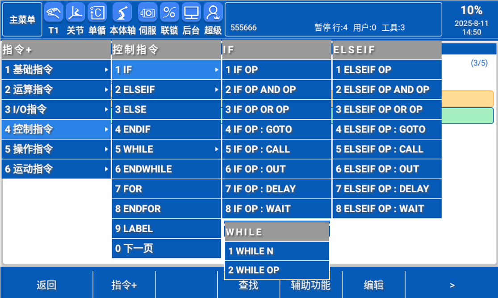

图3\-36 控制类指令菜单

IF OP …指令：

| IF OP | 功能 | 条件判断指令，对条件进行判断，并根据结果进行后续指令的执行。 |
| --- | --- | --- |
| 格式 | IF \<参数1\> 操作符 \<参数2\> \<附加指令\> |

| 说明 | 参数1参数2 | 常数I\[]：32位整型变量H\[]：16位整型变量B\[]：8位整型变量R\[]：64位浮点型变量P\[].X P\[].Y P\[].ZP\[].RX P\[].RY P\[].RZDI\[值]GIB ：8位组IOGIH ：16位组IOGII ：32位组IOGIF ：32位组IODO\[值]GOB ：8位组IOGOH ：16位组IOGOI ：32位组IOGOF ：32位组IO |
| --- | --- | --- |
| 操作符 | \>\<\>\=\<\=\=\=!\= |
| 附加指令 | GOTO : 跳转CALL : 调用作业OUT\_T : 到达指定时间、距离后输出I/OOUT : 输出IODELAY : 等待时间WAIT : 等待信号 |
| 举例 | IF I\[1] \< I\[2] | |

IF OP AND\\OR OP …指令：

| IF OP AND\\OR OP … | 功能 | 条件判断指令，对条件进行判断，并根据结果进行后续指令的执行。在条件判断中，加入逻辑运算。 | |
| --- | --- | --- | --- |
| 格式 | IF \<参数1\> 操作符 \<参数2\> AND \<参数1\> 操作符 \<参数2\> \<附加指令\> | |
| 说明 | 参数1参数2 | 常数I\[]：32位整型变量H\[]：16位整型变量B\[]：8位整型变量R\[]：64位浮点型变量P\[].X P\[].Y P\[].ZP\[].RX P\[].RY P\[].RZDI\[值]GIB ：8位组IOGIH ：16位组IOGII ：32位组IOGIF ：32位组IODO\[值]GOB ：8位组IOGOH ：16位组IOGOI ：32位组IOGOF ：32位组IO |
| 操作符 | \>\<\>\=\<\=\=\=!\= |
| 逻辑符 | AND ：与 OR ： 或 |
| 附加指令 | GOTO ：跳转CALL ：调用作业OUT\_T ：到达指定时间、距离后输出I/OOUT ：输出IODELAY ：等待时间WAIT ：等待信号 |
| 举例 | IF I\[1] \< I\[2] AND I\[1] \< I\[2] | |

ELSEIF：

| ELSEIF OP | 功能 | 满足条件执行区间内指令。 | |
| --- | --- | --- | --- |
| 格式 | ELSEIF \<参数1\> 操作符 \<参数2\> AND \<参数1\> 操作符 \<参数2\> \<附加指令\> | |
| 说明 | 参数1参数2 | 常数I\[]：32位整型变量H\[]：16位整型变量B\[]：8位整型变量R\[]：64位浮点型变量P\[].X P\[].Y P\[].ZP\[].RX P\[].RY P\[].RZDI\[值]GIB ：8位组IOGIH ：16位组IOGII ：32位组IOGIF ：32位组IODO\[值]GOB ：8位组IOGOH ：16位组IOGOI ：32位组IOGOF ：32位组IO |
| 操作符 | \>\<\>\=\<\=\=\=!\= |
| 逻辑符 | AND ：与 OR ： 或 |
| 附加指令 | GOTO ：跳转CALL ：调用作业OUT\_T ：到达指定时间、距离后输出I/OOUT ：输出IODELAY ：等待时间WAIT ：等待信号 |
| 举例 | ELSEIF I\[1] \< I\[2] AND I\[1] \< I\[2] : GOTO “L0” | |

ELSE：

| ELSE | 功能 | 与IF指令一起使用，IF条件未满足，执行区间内指令。 | |
| --- | --- | --- | --- |
| 格式 | ELSE | |
| 说明 | 参数 | 无 |
| 举例 | IF I\[1] \< I\[2] …ELSE… | |

ENDIF：

| ENDIF | 功能 | 与IF指令一起使用，条件跳转指令结束。 | |
| --- | --- | --- | --- |
| 格式 | ENDIF | |
| 说明 | 参数 | 无 |
| 举例 | IF I\[1] \< I\[2] …ELSE…ENDIF | |

IF指令的附加指令：

GOTO：

| GOTO | 功能 | 跳转到标签行。 | |
| --- | --- | --- | --- |
| 格式 | IF I\[1] \< I\[2] : GOTO “参数1” | |
| 说明 | 参数1 | S：字符型变量，能直接赋值。 |
| 举例 | IF I\[1] \< I\[2] : GOTO “L0” | |

CALL：

| CALL | 功能 | 调用作业。 | |
| --- | --- | --- | --- |
| 格式 | IF I\[1] \< I\[2] : CALL \<参数1\> | |
| 说明 | 参数1 | 作业名 |
| 举例 | IF I\[1] \< I\[2] : CALL zuoye.txt | |

OUT\_T：

| OUT\_T | 功能 | 到达指定时间、距离后输出I/O | |
| --- | --- | --- | --- |
| 格式 | IF I\[1] \< I\[2] : OUT \<参数1\> \<参数2\> \<参数3\> \= \<参数4\> | |
| 说明 | 参数1 | DO\[值]GOB ：8位组IOGOH ：16位组IOGOI ：32位组IOGOF ：32位组IO |
| 参数2 | 常数I\[]：32位整型变量H\[]：16位整型变量B\[]：8位整型变量 |
| 参数3 | T(单位s)DIS（单位mm） |
| 参数4 | 常数I\[]：32位整型变量H\[]：16位整型变量B\[]：8位整型变量 |
| 举例 | IF I\[1] \< I\[2] : OUT DO\[1] 1 T \= 0 | |

OUT：

| OUT | 功能 | 输出IO | |
| --- | --- | --- | --- |
| 格式 | IF I\[1] \< I\[2] : OUT \<参数1\> \<参数2\> | |
| 说明 | 参数1 | DO\[值]GOB ：8位组IOGOH ：16位组IOGOI ：32位组IOGOF ：32位组IO |
| 参数2 | 常数I\[]：32位整型变量H\[]：16位整型变量B\[]：8位整型变量 |
| 举例 | IF I\[1] \< I\[2] : OUT DO\[1] 1 | |

DELAY：

| DELAY | 功能 | 等待一段时间(单位s)。 | |
| --- | --- | --- | --- |
| 格式 | IF I\[1] \< I\[2] : DELAY T \= \<参数1\> | |
| 说明 | 参数1 | 常数I\[]：32位整型变量H\[]：16位整型变量B\[]：8位整型变量R\[]：64位浮点型变量 |
| 举例 | IF I\[1] \< I\[2] : OUT DO\[1] 1 | |

WAIT：

| WAIT | 功能 | 等待指令，等待一个信号一段时间(单位s)，到时间后，执行后续指令。T\=\-1是一直等待信号。 | |
| --- | --- | --- | --- |
| 格式 | IF I\[1] \< I\[2] : WAIT \<参数1\> \= \<参数2\> T \= \<参数3\> | |
| 说明 | 参数1 | DI\[值]GIB ：8位组IOGIH ：16位组IOGII ：32位组IOGIF ：32位组IODO\[值]GOB ：8位组IOGOH ：16位组IOGOI ：32位组IOGOF ：32位组IO |
| 参数2 | 常数I\[]：32位整型变量H\[]：16位整型变量B\[]：8位整型变量 |
| 参数3 | 常数I\[]：32位整型变量H\[]：16位整型变量B\[]：8位整型变量 |
| 举例 | IF I\[1] \< I\[2] : WAIT DI\[1] \= 1 T \= 10 | |

WHILE N指令：

| WHILE N | 功能 | 与ENDWHILE指令一起使用，在循环区间内，执行N次。 | |
| --- | --- | --- | --- |
| 格式 | ANOUT \<参数1\> \= \<参数2\> | |
| 说明 | 参数1 | 常数I\[]：32位整型变量H\[]：16位整型变量B\[]：8位整型变量 |
| 举例 | WHILE N……ENDWHILE | |

WHILE OP指令：

| WHILE OP | 功能 | 条件满足执行区间指令结束。 | |
| --- | --- | --- | --- |
| 格式 | WHILE \<参数1\> 操作符 \<参数2\> | |
| 说明 | 参数1 | 常数I\[]：32位整型变量H\[]：16位整型变量B\[]：8位整型变量R\[]：64位浮点型变量P\[].X P\[].Y P\[].ZP\[].RX P\[].RY P\[].RZDI\[值]GIB ：8位组IOGIH ：16位组IOGII ：32位组IOGIF ：32位组IODO\[值]GOB ：8位组IOGOH ：16位组IOGOI ：32位组IOGOF ：32位组IO |
| 操作符 | \>\<\>\=\<\=\=\=!\= |
| 参数2 | 常数I\[]：32位整型变量H\[]：16位整型变量B\[]：8位整型变量R\[]：64位浮点型变量P\[].X P\[].Y P\[].ZP\[].RX P\[].RY P\[].RZP\[].j1 P\[].j2 P\[].j3P\[].j4 P\[].j5 P\[].j6P\[].e1 P\[].e2 P\[].e3P\[].e4 P\[].e5 P\[].e6 |
| 举例 | WHILE I\[1]\>I\[2]…ENDWHILE | |

LABEL 指令：

| LABER | 功能 | 标签指令 | |
| --- | --- | --- | --- |
| 格式 | LABEL \<参数1\> | |
| 说明 | 参数1 | S：字符型变量，能直接赋值 |
| 举例 | LABER L10 | |

GOTO 指令：

| GOTO | 功能 | 跳转指令，跳转至标签位置。 | |
| --- | --- | --- | --- |
| 格式 | GOTO \<参数1\> | |
| 说明 | 参数1 | S：字符型变量 |
| 举例 | GOTO L10 | |

SKIP CONDITON 指令：

| SKIP CONDITON | 功能 | 跳过指令。与运动指令的附加指令SKIP“S”一起使用，当满足指令条件时，跳过带有SKIP附加指令的运动指令。 | |
| --- | --- | --- | --- |
| 格式 | SKIP CONDITON \<参数1\> \=\= \<参数2\> | |
| 说明 | 参数1 | DI\[值]GIB ：8位组IOGIH ：16位组IOGII ：32位组IOGIF ：32位组IODO\[值]GOB ：8位组IOGOH ：16位组IOGOI ：32位组IOGOF ：32位组IO |
| 参数2 | 常数I\[]：32位整型变量H\[]：16位整型变量B\[]：8位整型变量 |
| 举例 | SKIP CONDITON DI \[1] \=\= 1 MOVJ P\[1] V\=20 ACC\=20 CNT\=1 : SKIP”1”MONJ P\[2] V\=20 ACC\=20 CNT\=1 | |

CALL 指令：

| CALL | 功能 | 调用子作业指令。 | |
| --- | --- | --- | --- |
| 格式 | CALL \<参数1\> | |
| 说明 | 参数1 | S：字符型变量，能直接赋值 |
| 举例 | GOTO 123\.txt | |
| 注：作业名称需要附带.txt后缀；CALL不能调用自身；如果系统除当前正在编辑的作业外无其他作业，此时插入CALL指令时，参数默认为null.txt作为占位，否则会按照字典顺序排序的第一个作业名做为参数。 | | | |

 WAIT 指令：

| WAIT | 功能 | 等待指令，等待一个信号一段时间，到时间后，执行后续指令。T \= \-1是一直等待信号。 | |
| --- | --- | --- | --- |
| 格式 | WAIT \<参数1\> \= \<参数2\> T \= \<参数3\> | |
| 说明 | 参数1 | DI\[值]GIB ：8位组IOGIH ：16位组IOGII ：32位组IOGIF ：32位组IODO\[值]GOB ：8位组IOGOH ：16位组IOGOI ：32位组IOGOF ：32位组IO |
| 参数2 | 常数I\[]：32位整型变量H\[]：16位整型变量B\[]：8位整型变量 |
| 参数3 | 常数I\[]：32位整型变量H\[]：16位整型变量B\[]：8位整型变量 |
| 举例 | WAIT DI\[0] \= 1 T \= 10 | |

DELAY 指令：

| DELAY | 功能 | 延时等待一段时间。 | |
| --- | --- | --- | --- |
| 格式 | DELAY T \= \<参数1\> | |
| 说明 | 参数1 | 常数I\[]：32位整型变量H\[]：16位整型变量B\[]：8位整型变量R\[]：64位浮点型变量 |
| 举例 | DELAY T \= 1 | |

START BG 指令：

| START BG | 功能 | 调用后台作业。 | |
| --- | --- | --- | --- |
| 格式 | START\_BG \<参数1\> | |
| 说明 | 参数1 | 选择后台作业，默认为null.txt |
| 举例 | START\_BG 123\.txt | |
| 注：本指令调用的作业不能是自身；参数1指定的作业类型必须为后台作业；如果系统除当前正在编辑的作业外无其他后台作业，此时插入本指令时，参数默认为null.txt作为占位，否则会按照字典顺序排序的第一个后台作业名做为参数。 | | | |

STOP BG 指令：

| STOP BG | 功能 | 停止调用后台作业。 | |
| --- | --- | --- | --- |
| 格式 | STOP\_BG \<参数1\> | |
| 说明 | 参数1 | 选择后台作业，默认为null.txt |
| 举例 | STOP\_BG 123\.txt | |

UALM 指令：

| UALM | 功能 | 自定义报警指令。 | |
| --- | --- | --- | --- |
| 格式 | UALM CODE \= \<参数1\> | |
| 说明 | 参数1 | 常数I\[]：32位整型变量H\[]：16位整型变量B\[]：8位整型变量 |
| 举例 | UALM CODE \= I\[2] | |

FOR...ENDFOR指令：

| FOR...ENDFOR | 功能 | FOR循环指令。 | |
| --- | --- | --- | --- |
| 格式 | FOR\<参数1\>\=\<参数2\>\<参数3\>\<参数4\>\<参数5\>\<参数6\> | |
| 说明 | 参数1 | I\[]：32位整型变量H\[]：16位整型变量B\[]：8位整型变量 |
| 参数2 | 常数I\[]：32位整型变量H\[]：16位整型变量B\[]：8位整型变量 |
| 参数3 | I\[]：32位整型变量H\[]：16位整型变量B\[]：8位整型变量 |
| 参数4 | \>\<\> \=\< \= |
| 参数5 | 常数I\[]：32位整型变量H\[]：16位整型变量B\[]：8位整型变量 |
| 参数6 | 常数 |
| 举例 | FOR I\[1] \= 0 I\[1] \< 4 STEP 1ENDFOR | |
| ENDFOR | 说明 | 与FOR 指令组合使用，表示 FOR指令执行完成。 | |
| 举例 | FOR I\[1] \= 0 I\[1] \< 4 STEP 1ENDFOR | |
| 注：参数3需要与参数1变量类型相同，ENDFOR指令与FOR配对出现。 | | | |

SWITCH…CASE…DEFAULT…ENDSWITCH指令

| SWITCH | 功能 | 条件跳转指令，当某一个条件满足时，将程序跳转到指定的地方运行。 | |
| --- | --- | --- | --- |
| 格式 | SWITCH \<参数1\> | |
| 说明 | 参数1 | I\[]：32位整型变量H\[]：16位整型变量B\[]：8位整型变量R\[]：64位浮点型变量S\[]：字符型变量，能直接赋值 |
| 举例 | SWITCH I\[5]CASE I\[1]BREAKCASE I\[2]BREAKDEFAULTBREAKENDSWITCH | |
| CASE | 格式 | CASE\<参数1\> | |
| 说明 | 与SWITCH 指令组合使用，表示 SWITCH ... CASE...指令执行完成。 | |
| 参数1 | I\[]：32位整型变量H\[]：16位整型变量B\[]：8位整型变量R\[]：64位浮点型变量S\[]：字符型变量，能直接赋值 |
| 举例 | SWITCH I\[5]CASE I\[1]BREAKCASE I\[2]BREAKDEFAULTBREAKENDSWITCH | |
| DEFAULT | 说明 | 与SWITCH ... CASE...在一起使用，当CASE条件没有满足，则执行DEFAULT。 | |
| 举例 | SWITCH S\[5]CASE S\[1]BREAKCASE S\[2]BREAKDEFAULTBREAKENDSWITCH | |
| ENDSWITCH | 说明 | 与SWITCH ... CASE...DEFAULT在一起使用，代表程序结束。 | |
| 举例 | SWITCH S\[5]CASE S\[1]BREAKCASE S\[2]BREAKDEFAULTBREAKENDSWITCH | |
| 注：DEFAULT、ENDSWITCH指令必须存在 | | | |

BREAK 指令

| BREAK | 功能 | BREAK语句。 |
| --- | --- | --- |
| 格式 | BREAK |
| 说明 | 用在SWITCH、WHILE、FOR语句中，代表跳出循环。 |
| 举例 | SWITCH S\[5]CASE S\[1]BREAKCASE S\[2]BREAKDEFAULTBREAKENDSWITCH |

 CONTINUE 指令

| CONTINUE | 功能 | CONTINUE语句。 |
| --- | --- | --- |
| 格式 | CONTINUE |
| 说明 | 用在WHILE、FOR指令中，代表继续下次循环 |
| 举例 | WHILE N……CONTINUEENDWHILE |

 PAUSE 指令

| PAUSE | 功能 | 暂停语句。 |
| --- | --- | --- |
| 格式 | PAUSE |
| 说明 | 机器人执行到这个位置暂停。 |
| 举例 | MOVJ P\[1]V \= 20 ACC \= 20 CNT \= 0MOVJ P\[2]V \= 20 ACC \= 20 CNT \= 0PAUSEMOVJ P\[3]V \= 20 ACC \= 20 CNT \= 0 |

## 操作类

操作类包括：中断、跳转、定时、补偿等指令。

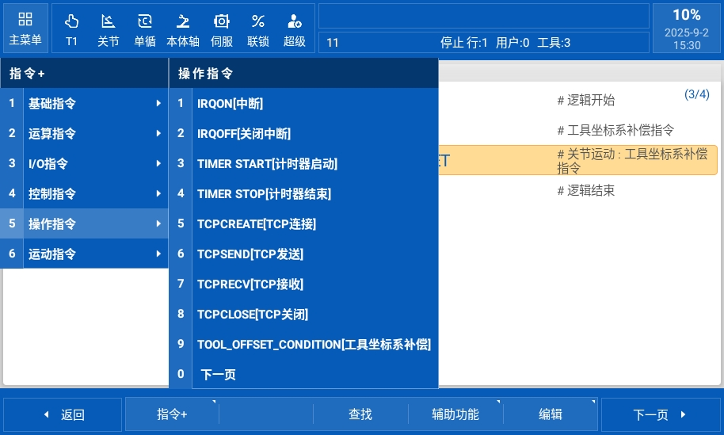

图3\-37 操作类指令菜单

IRQON 指令

| IRQON LEV | 功能 | 中断开启指令。 | |
| --- | --- | --- | --- |
| 格式 | IRQON LEV \= \<参数1\> \<参数2\> \[运算符] \<参数3\> \[作业名] | |
| 说明 | 参数1 | 常数（1\-100） |
| 参数2 | DI\[]I\[]：32位整型变量 |
| 运算符 | \=\= |
| 参数3 | 常数（最大值为1） |
| 参数4 | 作业名S：字符型变量，能直接赋值 |
| 举例 | IRQON LEV \= 1 DI\[1] \=\= 1 123\.txt | |

 IRQOFF 指令

| IRQOFF | 功能 | 中断结束指令。 | |
| --- | --- | --- | --- |
| 格式 | IRQOFF LEV \= \<参数1\> | |
| 说明 | 参数1 | 常数（1\-100） |
| 举例 | IRQOFF LEV \= 20 | |

TIMER START指令

| TIMER START | 功能 | 计时器启动。 | |
| --- | --- | --- | --- |
| 格式 | TIMER START INDEX \= \<参数1\> | |
| 说明 | 参数1 | 常数（0\-19） |
| 举例 | TIMER START INDEX \= 0 | |

 TIMER STOP 指令

| TIMER STOP | 功能 | 计时器结束。 | |
| --- | --- | --- | --- |
| 格式 | TIMER STOP INDEX \= \<参数1\> \<参数2\> | |
| 说明 | 参数1 INDEX \= | 常数（0\-19） |
| 参数2 GI | I\[]：32位整型变量R\[]：64位浮点型变量 |
| 举例 | TIMER STOP INDEX \= 0 I\[0] | |

 TCPCREATE 指令

| TCPCREATE | 功能 | TCP创建客户端连接指令。 | |
| --- | --- | --- | --- |
| 格式 | TCPCREATE \<参数1\> SERVERIP \= \<参数2\> PORT \= \<参数3\> | |
| 说明 | 参数1 | TCP连接名称，字符串常量 |
| 参数2 | 服务端 ip地址 |
| 参数3 | Port：端口号常数I\[]：32位整型变量H\[]：16位整型变量B\[]：8位整型变量 |
| 举例 | TCPCREATE SS SERVERIP \= 192\.168\.252\.191 PORT \= 1234 | |

 TCPSEND 指令

| TCPSEND | 功能 | TCP发送指令，向服务端发送字符串数据。 | |
| --- | --- | --- | --- |
| 格式 | TCPSEND \<参数1\> \<参数2\> | |
| 说明 | 参数1 | TCP连接名称，字符串常量 |
| 参数2 | 发送数据，字符型变量 |
| 举例 | TCPSEND SS S\[2] | |

 TCPRECV 指令

| TCPRECV | 功能 | TCP消息接收并存储至S变量，超时返回0，异常返回0，正常返回1结果存至参数5中。 | |
| --- | --- | --- | --- |
| 格式 | TCPRECV \<参数1\> \<参数2\> \<参数3\> TIMEOUT \= \<参数4\> \<参数5\> | |
| 说明 | 参数1 | TCP连接名称，字符串常量 |
| 参数2 | 存储接收到服务端数据的字符型变量 |
| 参数3 | 接收数据的最大长度常数（1\-9999）I\[]：32位整型变量H\[]：16位整型变量B\[]：8位整型变量 |
| 参数4 | 超时时间（单位：秒）常数（1\-9999）I\[]：32位整型变量H\[]：16位整型变量B\[]：8位整型变量 |
| 参数5 | 接收结果I\[]：32位整型变量 |
| 举例 | TCPRECV SS S\[1] 128 TIMEOUT \= 3 I\[1] | |

 TCPCLOSE 指令

| TCPCLOSE | 功能 | TCP关闭指令。 | |
| --- | --- | --- | --- |
| 格式 | TCPCLOSE \<参数1\> | |
| 说明 | 参数1 | SS：字符串类型 |
| 举例 | TCPCLOSE SS | |

TOOL\_OFFSET\_CONDITION 指令

| TOOL\_OFFSET\_CONDITION | 功能 | 工具坐标系补偿指令 | |
| --- | --- | --- | --- |
| 格式 | TOOL\_OFFSET\_CONDITION \<参数1\> \<参数2\> | |
| 说明 | 参数1 | P\[]\\PR\[] |
| 参数2 | TF\[] : 工具坐标系号 |
| 举例 | TOOL\_OFFSET\_CONDITION P\[22] TF\[3] | |

 USER\_OFFSET\_CONDITION 指令

| USER\_OFFSET\_CONDITION | 功能 | 用户坐标系补偿指令 | |
| --- | --- | --- | --- |
| 格式 | USER\_OFFSET\_CONDITION \<参数1\> \<参数2\> | |
| 说明 | 参数1 | P\[]\\PR\[] |
| 参数2 | UF\[] : 工具坐标系号 |
| 举例 | USER\_OFFSET\_CONDITION PR\[1] UF\[0] | |

RECORDMOTIONSTART 指令

| RECORDMOTIONSTART | 功能 | 开始进行运动数据采集 | |
| --- | --- | --- | --- |
| 格式 | RECORDMOTIONSTART T \= \<参数1\> | |
| 说明 | 参数1 | 时间常数（1\-9999）I\[]：32位整型变量H\[]：16位整型变量B\[]：8位整型变量 |
| 举例 | RECORDMOTIONSTART T \= 40 | |

RECORDMOTIONSTOP 指令

| RECORDMOTIONSTOP | 功能 | 采集数据结束 | |
| --- | --- | --- | --- |
| 格式 | RECORDMOTIONSTOP F \= \<参数1\> | |
| 说明 | 参数1 | 常数：文件号I\[]：32位整型变量H\[]：16位整型变量B\[]：8位整型变量 |
| 举例 | RECORDMOTIONSTOP F \= 1 | |

# 程序的示教

本章介绍机器人运动、程序的创建和修改。

程序指令，是指控制系统发给本体或外围设备的一系列控制指令。这些指令可以指示机器人或外围设备按指令进行动作。比如

1. 使机器人按照预期的轨迹在空间内移动。
2. 对工件进行抓取搬运。
3. 对外围设备发出信号。
4. 对外围设备输入的信号进行处理。

程序创建前，要对程序进行一些概要性的设计，要考虑机器人完成作业最有效的方法。

通过机器人的菜单和指令来创建程序，在示教机器人位置时，先通过手动方法将机器人移动到希望的位置，再通过指令记录位置点。

程序创建后，有需要对程序进行修改时，根据菜单指令修改程序。

## 动作设计

### 动作指令

抓取工件位置：

抓取工件位置要在该位置定位完成后，进行抓取。

在工件周围运动：

机器人在工件周围运行时，可以开启连续轨迹。开启后，机器人不在示教点上停留，而是在点附近滑过，可以加快机器人运行周期。

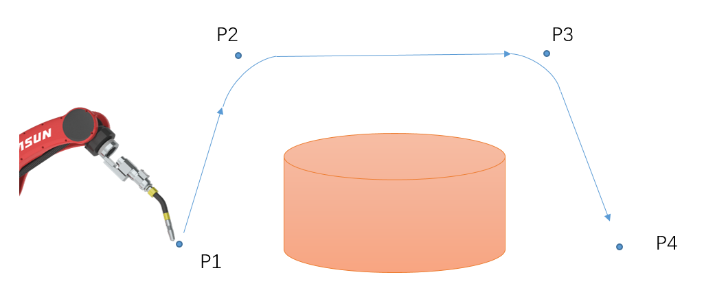

图 4\-1在工件周围移动

| **注释：****上图为机器人未开启连续轨迹时的移动轨迹，当机器人开启连续时，机器人会在运动点附近快速划过，但运动轨迹在运动点附近会有很小的改变，需要进行测试验证，轨迹是否会和周围工件产生干涉。** |
| --- |

机器人姿态：

机器人示教时，应尽量采用平顺的姿态规划轨迹。最初的点选择正确的姿态，可以确保后续的点可以由较小的变化达到目标点。示教时可以采取关节或直线坐标进行手动移动机器人，并达到正确位置和姿态，进行示教。程序示教完成后，需要手动慢速正向运动程序，确保程序的轨迹正确。

### 原点设定

原点位置是机器人所有程序执行的基础位置，这个位置是和周围所有外围设备没有干涉的安全位置。可以在远程I\\O中设定输出信号。

## 开机并手动控制

### 启动机器人

启动步骤：

1. 正确接好电源后，启动机器人。
2. 开机后，可以根据示教器上方的状态栏了解机器人各种状态。

### 3种运行模式

示教器左上方的钥匙开关可以选择合适的机器人运行模式。

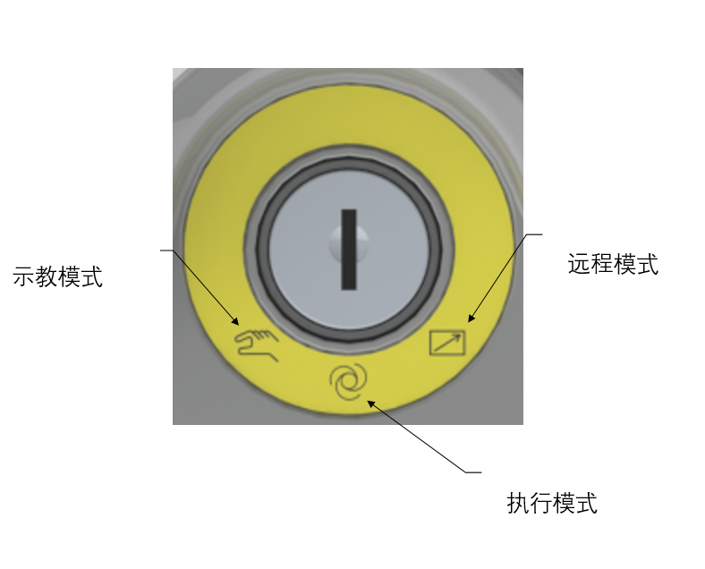

图 4\-2模式开关

1. **T1(手动低速)模式：**

在机器人进行示教和手动测试时，可以选择T1模式。在T1模式下，机器人的TCP点的直线运动的速度被限制在250mm/s以下，关节运动的速度被限制在各轴设定的最大速度的20%以下。

1. 正、反向运动

程序可以通过正向运动或反向运动手动运行。

1. 正、反向运动时的速度

正、反向运动时，即使把程序速度调整至100%，TCP点的直线运动的速度被限制在250mm/s以下，关节运动的速度被限制在各轴设定的最大速度的20%以下。

1. 安全门

在T1或者T2模式，可以在安全门开启的情况下手动操作机器人。必须在DEADMAN被按下的情况下，才可以运动机器人，DEADMAN没有按下时，机器人不能运动。

1. 保持该模式

拔出开关钥匙即可保持在示教(T1\\T2\)模式。

1. **T2(手动高速)模式：**

T2模式是用来确认机器人在正常速度下的运动。由于T1模式下，速度受到限制，不能完全模拟全速下的机器人运动。所以有时候需要T2模式来确认机器人全速的动作和节拍。

1. 点动（JOG)运动

T2模式下，可以点动（JOG)运动机器人，但是机器人TCP点的直线运动的速度被限制在250mm/s以下，关节运动的速度被限制在各轴设定的最大速度的20%以下。

1. 正、反向运动

程序可以通过正向运动或反向运动手动运行。

| **注意：****如果不是特殊需要的情况下，请不要在T2模式下，反向连续运行程序，以免由于速度过快，发生意想不到的危险。造成设备损坏或人员伤亡。** |
| --- |

1. 正、反向运动时的速度

当正、反向执行机器人作业时，机器人没有速度的限制，执行速度与指令速度和速度的倍率有关，机器人的速度可以达到100% 全速。

切换到T2模式时，出于安全考虑机器人速度百分比会变为10%，需要手动提高速度。

1. 安全门

在T1或者T2模式，可以在安全门开启的情况下手动操作机器人。必须在DEADMAN被按下的情况下，才可以运动机器人，DEADMAN没有按下时，机器人不能运动。

1. 保持该模式

拔出开关钥匙即可保持在示教(T1\\T2\)模式。

| **警告：**1. **T2模式是比较危险的测试方式，如果不是不得不使用T2模式，请不要使用T2模式运行机器人。** 2. **机器人启动前，必须确认机器人运动范围内没有人员，并且对按下正向运动后，对机器人发生的任何行为要有深入的了解。** |
| --- |

1. **执行模式**

执行模式是机器人在自动化生产时使用的一种模式。

1. 程序执行

机器人程序仅仅可以通过示教的上电、启动、暂停、复位来控制。

1. 速度

机器人速度可以是全速。

1. 手动运动

机器人不能被手动运动。

1. **远程模式**

远程模式是机器人在自动化生产时使用的一种模式。

1. 机器人速度

机器人速度可以是全速。

### 机器人轴运动

机器人可以通过示教器右侧的轴运动键进行手动运动。在机器人进行程序示教时，需要将机器人移动到目标位置。

| **警告：**1. **为了在示教过程中，保障工程师的人身安全，请在整个示教过程中，将机器人设置为手动模式，拔下模式钥匙，保持安全门是开启并且无法被关闭的状态，以免误按开始按钮，或意外收到外部启动信号而启动机器人。** 2. **尽可能使用T1模式进行示教，以免由于机器人运动速度太快，造成人员伤亡或设备损坏。** |
| --- |

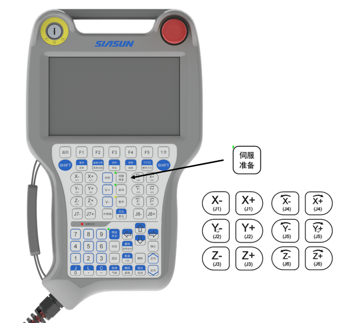

图 4\-3手动轴运动键

使用轴运动键控制机器人和下列两个要素有关：

机器人速度；

机器人的坐标系；

| **注释：****使用轴运动机器人之前,需要使用伺服上电按钮,将伺服状态准备好。** |
| --- |

速度倍率：

速度倍率是设置机器人运动时最大速度的百分比。显示在机器人上方的状栏内。

图 4\-4速度倍率显示

手动倍率可以通过示教器触屏来点击修改，可以通过按键来修改，最小速度倍率为0。

表格 4\-1手动倍率切换

| 手动倍率 | 存动\-0\.1\-0\.5\-1\-5\-10\-50\-80\-100倍率（示教模式）0\-0\.5\-1\-5\-10\-50\-80\-100倍率（执行模式） |
| --- | --- |

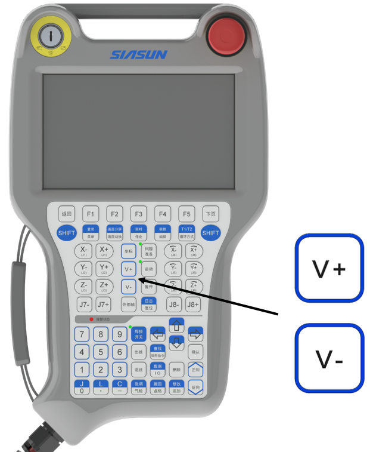

图 4\-5修改速度倍率位置

手动运动的坐标系：

机器人手动运动一共有4种坐标系可以选择。分别是关节坐标系\-直角坐标系\-工具坐标系\-用户坐标系。

关节坐标系下手动运动：

使用轴运动键，可以使机器人按照每个轴的方向单轴运行。箭头方向即是机器人按下对应的轴运动键后的轴转动方向。

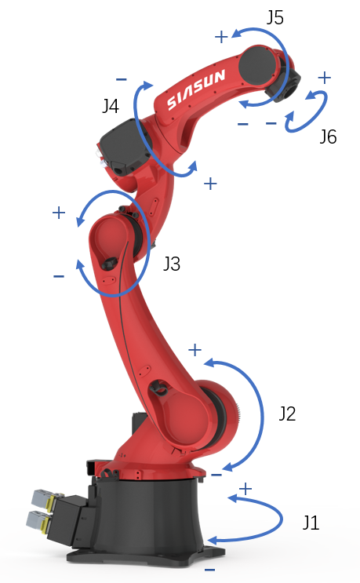

图 4\-6关节坐标系

直角坐标系下手动运动：

在直角坐标系运动中，机器人TCP点会沿着平行于坐标轴方向X,Y,Z运动，同时，旋转时，机器人TCP也会绕着平行于直角坐标系X,Y,Z轴的平行线旋转。

在直角坐标系下，当按下机器人示教器对应的方向键按钮后，机器人TCP会按照对应的箭头平行的方向移动，或TCP为中心绕着直角坐标系轴的平行线进行旋转。

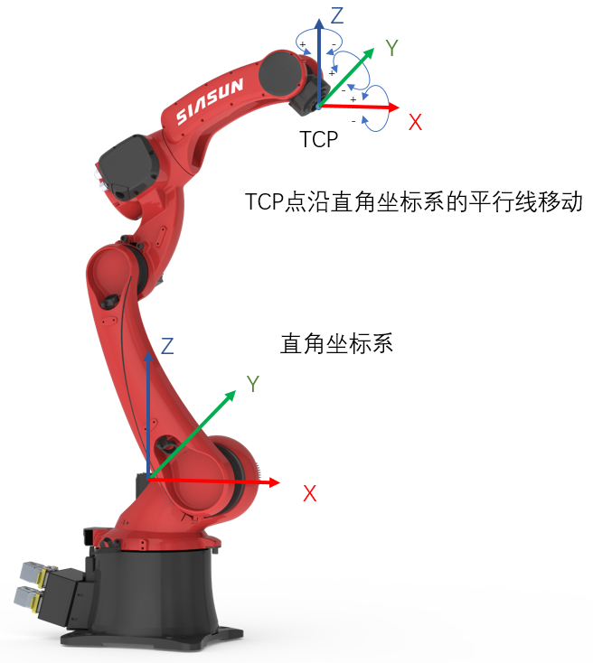

图 4\-7直角坐标系

**Y**

工具坐标系下手动运动：

在工具坐标系下手动运动机器人，TCP点沿着机器人定义的工具坐标系的X,Y,Z进行运动。此外，工具坐标系还可以使机器人绕着工具坐标系的X,Y,Z轴旋转。

在工具坐标系下，按下示教器的轴运动键后，机器人TCP会按照工具坐标指向的方向运动，或按照工作坐标方向以TCP为中心进行旋转。

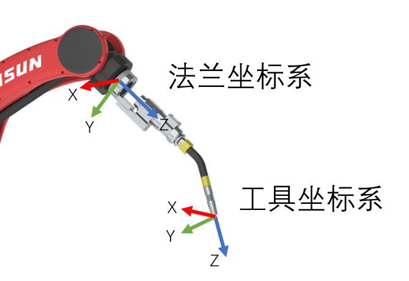

图 4\-8工具坐标

用户坐标系下手动运动：

在用户坐标系下手动运动机器人，TCP点沿着机器人定义的用户坐标系的X,Y,Z轴的平行线进行运动。此外，用户坐标系还可以使机器人TCP绕着用户坐标系的X,Y,Z轴的平行线旋转。

在用户坐标系下，按下示教器的轴运动键后，机器人TCP会按照用户坐标指向的方向运动，或按照用户坐标轴方向的平行线以TCP为中心进行旋转。

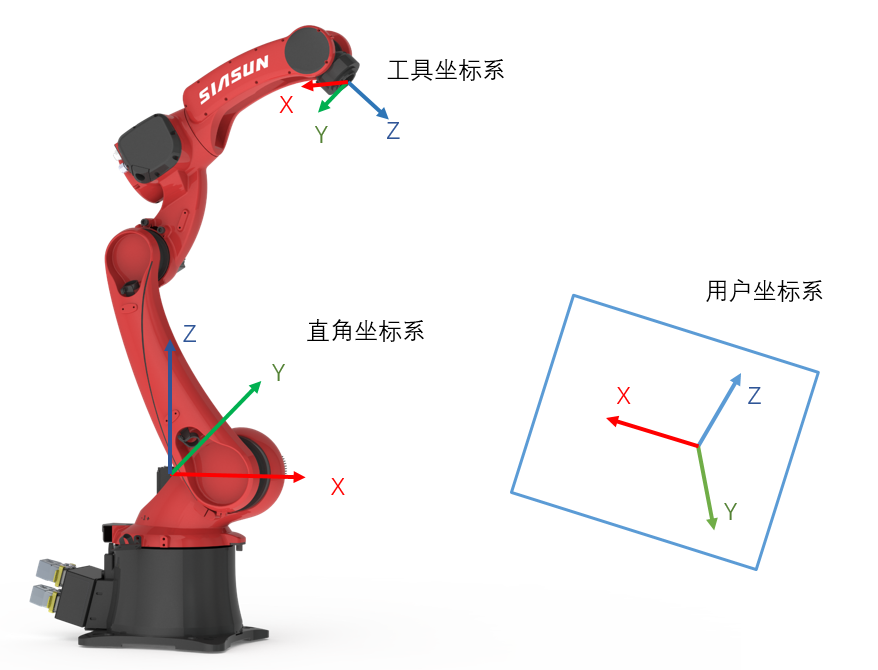

图 4\-9用户坐标系

坐标系的切换：

机器人坐标系可以在示教器上方的状态栏中选择。

切换坐标系

图 4\-10坐标系选择

也可以通过示教器上的坐标按钮选择。

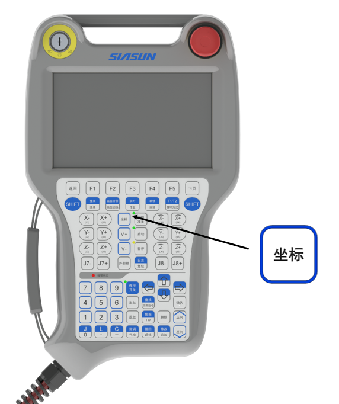

图 4\-11坐标按钮

表格 4\-2坐标系切换

| 坐标系切换 | 关节坐标系\-工具坐标系\-用户坐标系\-直角坐标系 |
| --- | --- |

使用外部轴：

按示教器的轴组键，可以切换运动外部轴。7、8轴可以直接在示教器上运动，7\-12轴可以在切换至外部轴后，用轴运动键运动，分别对应J1\-J6轴。在示教器屏幕上可以显示轴组状态。

外部轴只能通过手动切换，操作7、8轴不会将操作模式切换至外部轴。

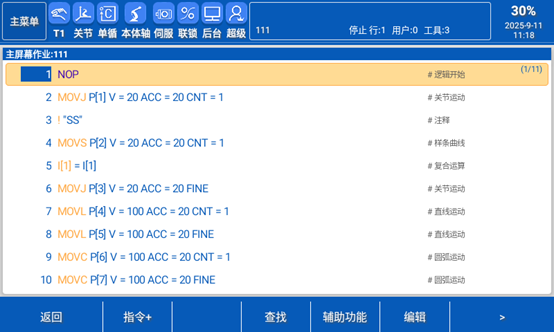

本体轴/外部轴

图 4\-12外部轴本体轴显示图标

使用轴运动键可以控制外部轴，如图4\-13所示。

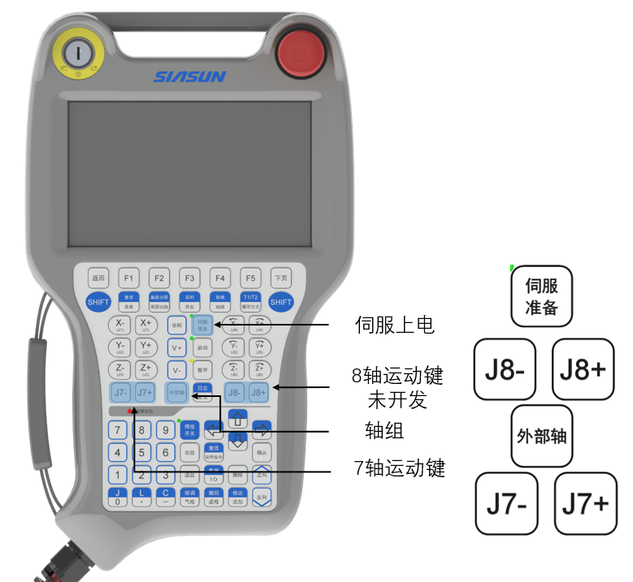

图 4\-13轴组和轴运动键

使用轴运动键移动机器人条件：

在手动启动机器人前，请确定机器人包括末端执行机构运动范围内，没有任何人或任何物品。

使用轴运动键移动机器人步骤：

1. 通过【坐标】按钮或者点击图标，选择手动机器人的坐标系。
2. 通过【V\+\\V\-】或速率图标，调节速率。
3. 左手拿住示教器，并将DEADMAN按到中间位置，并在机器人运动期间始终按住该开关。
4. 按住DEADMAN的同时，按住轴运动键按钮，控制机器人按照预期的方向运动。

| **警告：****在手动运行时，为了避免危险情况发生而希望紧急停止机器人时，可松开DEADMAN键或按下急停按钮即可。** |
| --- |

奇异点说明：

机器人运动学中，有3个奇异点，需要特别对待。他们分别是顶部奇异点、延伸奇异点、腕部奇异点。这些奇异点，并没有办法规划轨迹。所以机器人在奇异点附近，会停止运动并报警。

开启奇异点绕行功能之后，在机器人执行作业，或者正向运动的过程中，会对腕端奇异点位置进行绕行，顶部奇异点、延伸奇异点依然会报警，手动直线运动时，任何情况下遇到奇异点，会停止并报警。

顶部奇异点：

关节中心点为4、5、6轴交点时，当其位于一轴轴线上方时机器人处于顶部奇异点。

延伸奇异点：

当J2\-J3延长线经过腕关节中心点时，机器人处于延伸奇异点。

腕部奇异点：

当4轴与6轴平行，即5轴关节值为0附近时，机器人处于腕部奇异点。

## 示教程序

新建程序：

新建一个程序，并记录程序名。

设定程序信息：

设定程序类型和外部轴组关系。

示教动作和逻辑指令：

对机器人程序进行示教。

### 新建作业

新建一个示教程序。

新建程序步骤：

1. 点击【新建作业】，可以打开新建作业界面。

 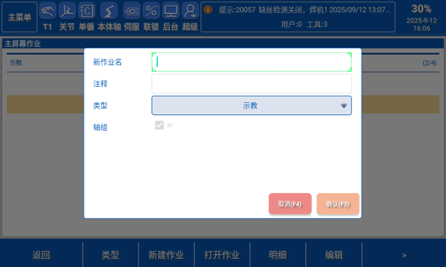

图 4\-14新建作业界面

作业名：支持大写字母、数字和下划线，作业名不能超过50个字符。

注释：可输入注释，并显示在作业名后，注释不能超过37个字符。

作业类型：示教/后台。

轴组：本体/本体\+外部轴系统。

新建后台作业：

在新建作业界面中，选择作业类型中的后台作业，即可新建后台作业。

后台程序不能处理动作指令、应用指令、CALL、IRQON、IRQOFF、OUT\_T指令。在启动后台时，系统会检查后台程序，如果有无法处理的指令，报警2237指令非法，行号:n。后台程序不能启动。

后台程序可以新建多个，最多同时允许4个后台程序执行。后台程序启动通过START\_BG指令，关闭通过STOP\+BG指令。后台作业图标为BG状态，表示机器人后台作业启动成功，图标无变化，表示后台程序处于关闭状态。

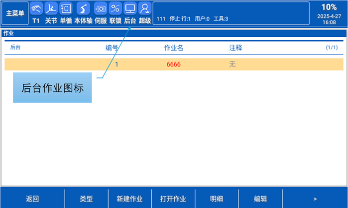

图 4\-15后台程序列表

启动的后台程序，如果不关闭，则一直为启动状态，和机器人模式无关，和机器人示教程序是否启动无关，和机器人是否伺服上电无关。如果下电前后台程序处于启动状态，则下电重启后后台程序自动启动运行。

后台配置：

通过主菜单:【用户配置】\-【后台配置】进入后台配置界面。可以通过后台配置对后台程序进行设置与启动和关闭。

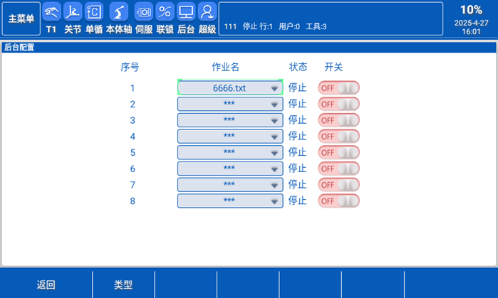

图 4\-16后台配置界面

作业名： 输入后台程序名称。（ 如上图， 作业中可以使用 START\_BG/STOP\_BG 开启/关闭后台作业）

状态： 显示当前运行状态。

开关：查看与强制后台启动/关闭。

启动的后台程序，如果不关闭，则一直为启动状态，和机器人模式无关，和机器人示教程序是否启动无关，和机器人是否伺服上电无关。不希望后台程序执行时，可以通过菜单关闭后台程序，后台程序关闭后屏幕右上角的图标显示 OFF。如果下电前后台程序处于启动状态，则下电重启后后台程序自动启动。

后台程序的关闭与再启动除了使用菜单外，还可以在前台作业（示教程序）中使用指令控制，指令为：

START BG:启动后台；

STOP BG:关闭后台；

分别对应再启动和关闭后台作业。当前台作业执行到该控制指令时，后台作业关闭或再启动。

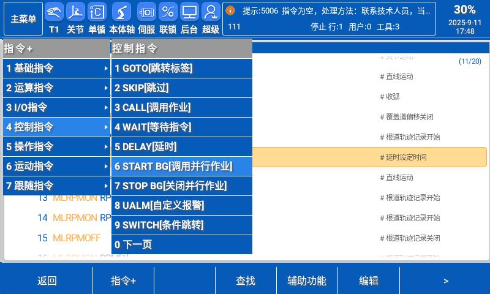

图4\-17 后台指令界面

| START BG | 功能 | 调用后台作业。 | |
| --- | --- | --- | --- |
| 格式 | START\_BG \<参数1\> | |
| 说明 | 参数1 | 选择后台作业。 |
| 举例 | START\_BG 123\.txt | |

| STOP BG | 功能 | 停止调用后台作业。 | |
| --- | --- | --- | --- |
| 格式 | STOP\_BG \<参数1\> | |
| 说明 | 参数1 | 选择后台作业。 |
| 举例 | STOP\_BG 123\.txt | |

### 作业界面的设置

示教前，需要设置示教作业所需要的各项功能。

确认作业行号

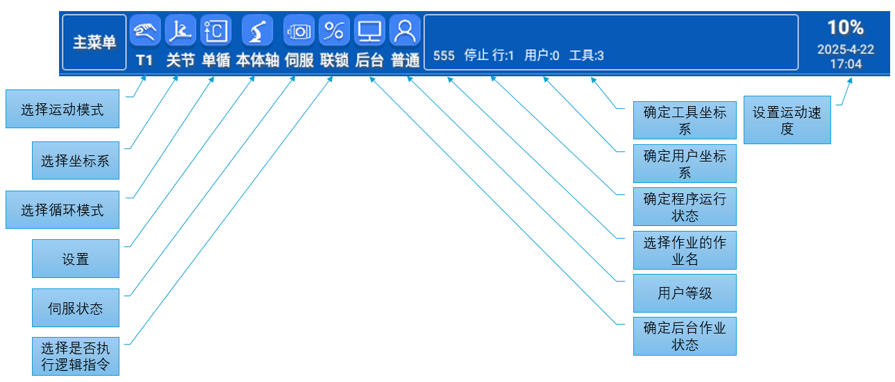

图4\-18需要设置的功能项

模式选择：

在工程师示教时，请始终保持机器人处于T1模式。

| **警告****为了在示教过程中，保障工程师的人身安全，请在整个示教过程中，将机器人设置为示教模式，拔下模式钥匙，保持安全门开启并且无法关闭状态，以免误按开始按钮，或外收到外部启动信号而启动机器人。** |
| --- |

坐标系选择：

选择坐标系关系到机器人以怎样的轨迹和方式做单轴或多轴联动动作。

选择循环模式：

选择不同的循环模式，机器人正向运动时，循环的模式是不同的。

单步：每按一下正向运动并按住后，机器人仅仅执行一条运动指令或逻辑指令。

单循环：按住正向运动后，机器人连续执行运动或逻辑指令，直到作业结束。

自动：按住正向运动后，机器人连续执行运动或逻辑指令，并一直循环指令作业。

| **注意：反向运动时，机器人根据设定可以连续或单步执行程序，但是不能执行逻辑指令。** |
| --- |

选择轴组：

选择机器人按下轴运动键后，示教器控制本体轴或者外部轴。

确定速度：

确定机器人轴运动时的速度。

选择坐标系号：

选择机器人运动时的工具、用户坐标系编号。

联锁：

确定机器人是否执行逻辑指令，或者仅仅执行动作指令，跳过逻辑指令。

O/o图标表示正向运动时，机器人执行运动指令和逻辑指令。

O/x图标表示正向运动时，机器人仅仅执行运动指令，不执行逻辑指令。

### 示教动作指令

动作指令，是以指定的运动类型和速度，使机器人从当前位置移动到目标位置的指令。

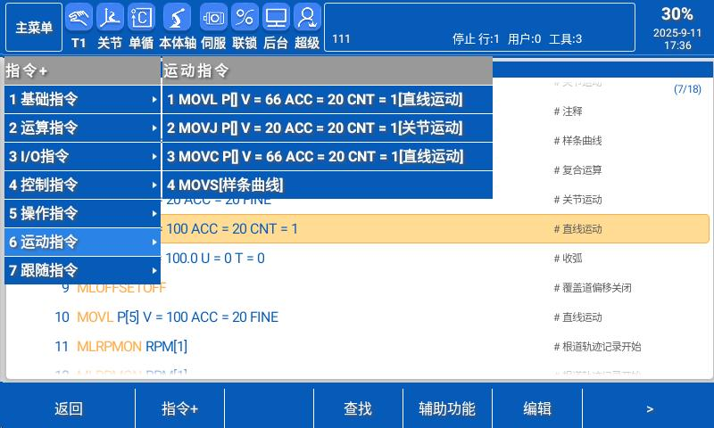

图 4\-19运动指令菜单

在菜单中选择希望的运动类型，需要改变运动参数可移动光标至参数处，即可实现修改。

图 4\-20输入运动指令参数

输入参数后点击确定。

### 逻辑控制指令

逻辑控制指令是机器人除了运动指令之外的总称，包含：

I/O指令；

控制指令；

运算指令；

操作指令；

这些指令，可以直接在示教器点击相应的菜单进行调用，写入参数即可添加。

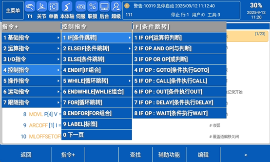

图 4\-21指令菜单控制指令部分

## 指令的编辑

编辑菜单可以对已经编辑完成的指令进行删除、修改等操作。

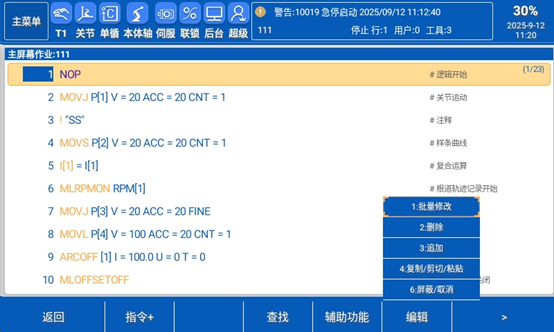

图 4\-22程序指令编辑菜单

### 修改运动指令

修改运动指令，可以修改运动指令类型、局部/全局变量、变量号、相关参数、获取当前位置、也可以查看与修改位置值。光标在需要修改的运动指令上点击【修改变量】，弹出修改界面，即修改该运动指令。

 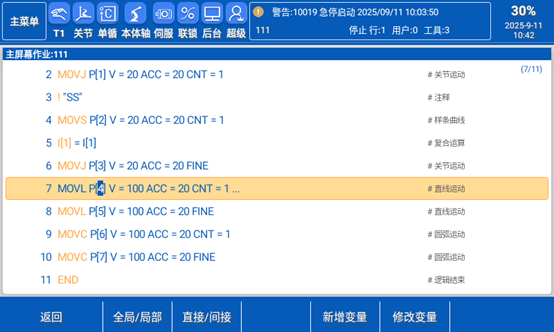

图4\-23修改指令

1. 可修改P/PR。
2. 可修改速度。
3. 可修改ACC加速度百分比。
4. 可修改逼近等级。

### 修改逻辑、控制指令

1. 修改逻辑控制指令，即可对指令的参数进行修改。光标在需要修改的指令，然后点击【修改变量】，弹出修改指令界面。

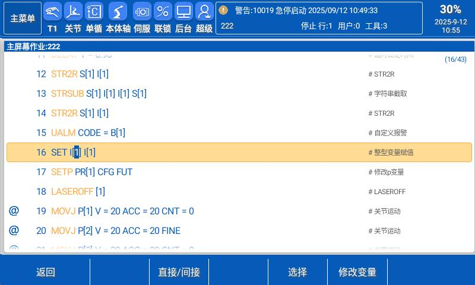

图 4\-24修改指令

进入该状态后，即可修改逻辑指令的参数。

## 作业变换

作业变换是对所选择的作业位置点变换。

作业镜像变换步骤：

点击主菜单【作业】\-【镜像】，进入作业镜像变换设置界面。

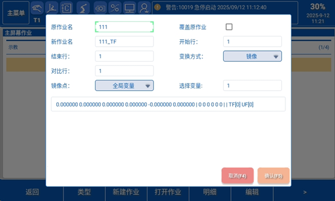

图 4\-25作业镜像变换配置界面

1. 原作业名：

为作业列表选中的程序名。

1. 新作业名：

新程序名，变换成功后会生成一个该名的新作业。

1. 覆盖原作业：是否覆盖原作业。
2. 开始行，结束行，对比行：

为需要执行变换的作业行数，开始行最小为1；结束行填写的行数若大于原程序最大行数则视作变换至原作业最后一条指令；对比行为选择的运动点位行号，用来与全局镜像点做对比。

1. 变换方式：

目前有镜像、偏移、关节，选择镜像。

1. 镜像点：

可选择镜像变换依据的点，目前仅限全局变量。

1. 选择变量：镜像点的所选变量号。

| **注意：****生成新作业后，局部变量号重新排列，会出现与之前变量编号不一致。** |
| --- |

镜像变换方式如图所示，将示教好的位置以面对称的方式变换到其他位置。

图 4\-26镜像变换配置界面

作业偏移\-直接输入方式变换步骤：

点击主菜单【作业】\-【镜像】，进入作业变换设置界面，更改变换方式为偏移。

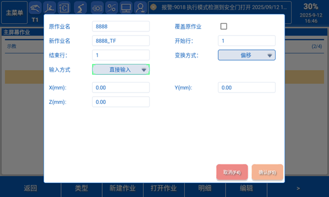

图 4\-27作业偏移变换直接输入配置界面

1. 原作业名：

为作业列表选中的程序名。

1. 新作业名：

新程序名，变换成功后会生成一个该名的新作业。

1. 覆盖原作业：是否覆盖原作业。
2. 开始行，结束行：

为需要执行变换的作业行数，开始行最小为1；结束行填写的行数若大于原程序最大行数则视作变换至原作业最后一条指令。

1. 变换方式：

选择偏移。

1. 输入方式：

输入方式，包括直接输入、示教输入，上图选择直接输入。

1. X/Y/Z：

三方向的偏移量。

**注：此类型偏移是X、Y、Z三方向的直接加运算。**

作业偏移\-示教输入方式变换步骤1：

点击主菜单【作业】\-【镜像】，进入作业变换设置界面，更改变换方式为偏移。

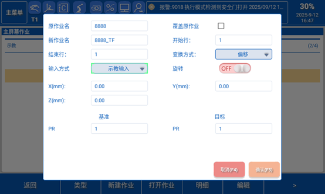

图 4\-28作业偏移变换示教输入配置界面

1. 原作业名：

为作业列表选中的程序名。

1. 新作业名：

新程序名，变换成功后会生成一个该名的新作业。

1. 覆盖原作业：是否覆盖原作业。
2. 开始行，结束行：

为需要执行变换的作业行数，开始行最小为1；结束行填写的行数若大于原程序最大行数则视作变换至原作业最后一条指令。

1. 变换方式：

选择偏移。

1. 输入方式：

包括直接输入、示教输入，上图选择示教输入。

1. 旋转：

选择OFF。

1. X/Y/Z:

当基准点与目前点确定后，三方向偏移量会自动显示。

1. 基准：

偏移基准点。

1. 目标：

偏移目标点。

**注：此类型偏移是X、Y、Z三方向的直接加运算。**

作业偏移\-示教输入方式变换步骤2：

点击主菜单【作业】\-【镜像】，进入作业变换设置界面，更改变换方式为偏移。

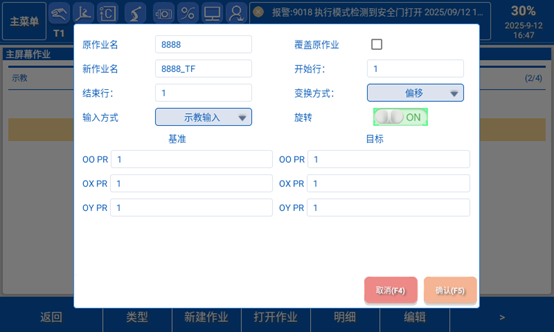

图 4\-29作业偏移变换示教输入配置界面

1. 原作业名：

为作业列表选中的程序名。

1. 新作业名：

新程序名，变换成功后会生成一个该名的新作业。

1. 覆盖原作业：是否覆盖原作业。
2. 开始行，结束行：

为需要执行变换的作业行数，开始行最小为1；结束行填写的行数若大于原程序最大行数则视作变换至原作业最后一条指令。

1. 变换方式：

选择偏移。

1. 输入方式：

包括直接输入、示教输入，上图选择示教输入。

1. 旋转：

选择ON。

1. 基准：

偏移基准点。

1. 目标：

偏移目标点,又基准和目前联合给出00/0X/0Y，供偏移使用。

**注：此类型旋转变换是先进行矩阵相乘后转换回RPY格式存储到位置信息中。**

作业关节值变换步骤：

点击主菜单【作业】\-【镜像】，进入作业变换设置界面，更改变换方式为关节。

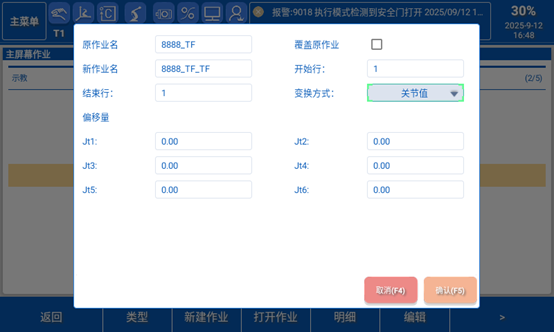

图 4\-30作业偏移变换配置界面

1. 原作业名：

为作业列表选中的程序名。

1. 新作业名：

新程序名，变换成功后会生成一个该名的新作业。

1. 覆盖原作业：是否覆盖原作业。
2. 开始行，结束行：

为需要执行变换的作业行数，开始行最小为1；结束行填写的行数若大于原程序最大行数则视作变换至原作业最后一条指令。

1. 变换方式：

选择关节值。

1. 偏移量：

输入6轴的偏移量。

**注：此类型变换是直接进行6个关节值得加运算。**

# 程序的运行

本章对程序的手动测试、自动运行进行说明。

## 程序的停止和恢复

程序的停止，是指停止运行机器人正在执行的作业。可以通过暂停或急停进行人为的停止操作，也可以由于报警而引发的停止。

机器人停止过程中，减速的方式有两种：

1. 瞬时停止：机器人立即减速停止运动。
2. 减速停止：机器人按一定的加速度进行减速，并停止运动。

可以通过以下几种方式停止机器人：

1. 按下示教器上的暂停按钮、手动时按下或松开安全安全开关。
2. 按下示教器、控制器上的急停按钮，断开控制器电源。
3. 通过远程I/O的映射，对机器人进行外部暂停、外部停止、外部下电，来停止机器人的程序。
4. 按下外部急停按钮、或打开安全门。

### 紧急停止和恢复运行

按下示教器、控制器上的紧急停止按钮，或者按下外部的紧急停止按钮，都会使机器人紧急停止，并报出紧急停止报警。

紧急停止

1. 按下示教器、控制器上的急停按钮，或者按下外部紧急停止按钮，都可以立即使机器人急停，程序停止运行。这是紧急停止按钮会被锁住，同时示教器报警。

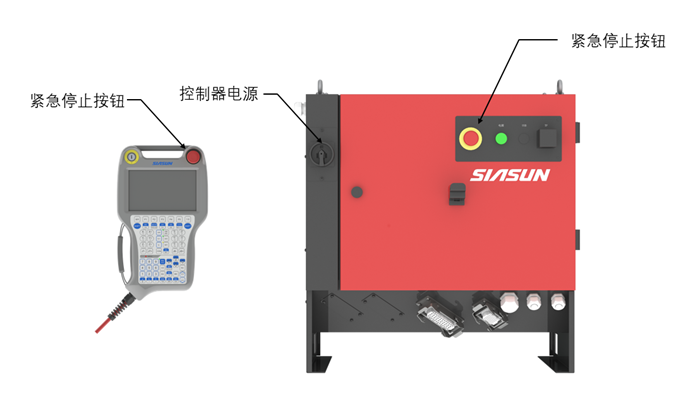

图5\-1 机器人急停按钮

从急停中恢复：

1. 先排除导致紧急停止的原因。
2. 旋转急停按钮，解除急停按钮的锁定。

图5\-4 急停按钮

1. 按示教器的RESET（报警解除）按键、远程控制I/O的报警复位信号。示教器画面上的报警显示消失。示教器上的报警灯消失。

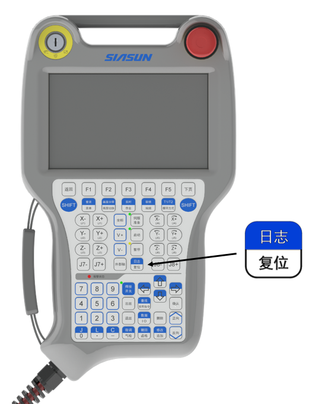

图 5\-5 RESET键

### 暂停和恢复

通过按下暂停按钮，可以使运行中的机器人程序停止运行。

暂停：

可以通过三种方式停止机器人程序的运行： 按下示教器上的暂停按钮，远程I/O暂停，程序的暂停指令。

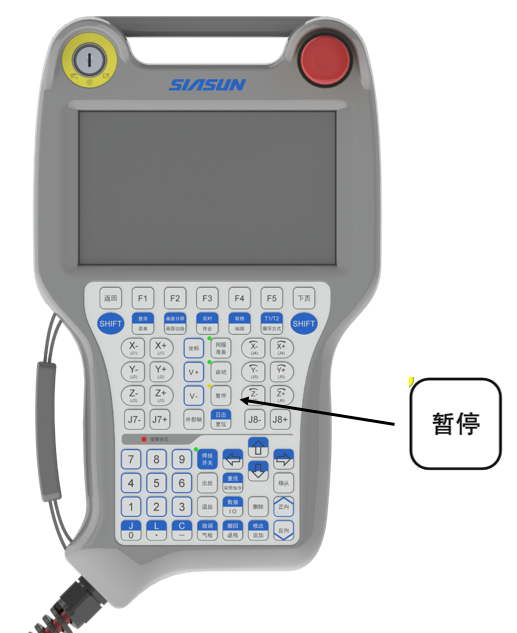

图 5\-6停止键

恢复方法：

可以通过两种方式，恢复机器人的程序运行：按下示教器的启动按钮，使用远程I\\O启动机器人程序。

### 报警

当机器人程序运行过程中，检测到异常状态，或者通过远程I/O，传递报警或急停信号，则机器人程序报警，并停止运行。报警信息会在示教器中显示。

显示报警：

报警信息会显示在机器人右上方的报警信息栏中，点击报警信息会打开机器人报警界面。同时示教器LED灯变成红色。

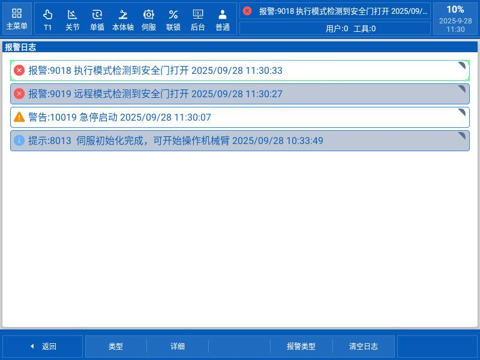

图 5\-7报警界面

报警日志可以显示报警的全部信息，以规定颜色区分重要程度：报警为红色，警告为橙色色，提示为蓝色。

表5\-1 报警重要程度对应LED灯颜色表

| 颜色 | 重要程度 |
| --- | --- |
| 红色 | 警告 |
| 橙色 | 报警 |
| 蓝色 | 提示 |

解除报警：

按示教器的RESET（报警解除）按键、远程控制IO的报警复位信号。示教器画面上的报警显示消失。示教器上的报警灯消失。

## 程序的执行

执行程序，就是机器人重复运行已经编辑好的程序，机器人会按照程序指定的指令，进行执行。执行程序分为3种循环方式：单步、单循环、自动（无限循环）。

### 如何启动程序运行

三种方式可以开启程序执行：

1. 手动模式：通过示教器上的正向运动或反向运动即可手动执行程序。
2. 执行模式：通过示教器上的开始按钮，可以自动开启程序运行。（M6/C6控制柜/ARM板卡，先按示教器上的开始按钮，再按控制柜上的启动按钮，可以自动开启程序运行。）
3. 远程模式：通过远程I\\O，使用外围设备，远程控制机器人启动程序。

图 5\-8 模式选择开关

机器人示教器上有模式选择钥匙，在不同的模式下，使用对应的启动方式。

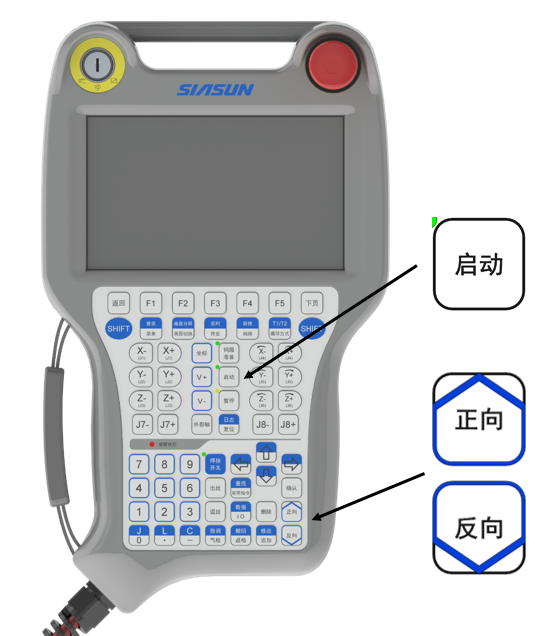

图 5\-9开始键、正向反向运动键

### 机器人按程序运行

当机器人正向运动执行作业时，程序会按照从上到下的顺序执行指令，运动指令会指示机器人按怎样的运动方式到达预期的位置。

在启动机器人进行动作前，务必对机器人的一些要素进行确认，以保证机器人按照预期的轨迹和速度进行运动，同时确认机器人是否按照希望的逻辑和循环方式运行。

机器人速度：机器人运动的速度\=指令速度×速度倍率/100。机器人速度提升会改变机器人运动的轨迹变化,请缓慢提升,和提速时要保证机器人与外部有间算,防止由提速引起的

轨迹变化后与工件发生碰撞。

机器人坐标系：确认当前所选择的坐标系、检查程序中有切换坐标系的指令都是正确的。（在不同坐标系下执行程序，机器人的运动会发生变化。）

逻辑指令是否被执行:在手动正向运动机器人时,通过联锁图标查看连锁功能是否打开。打开连锁，执行逻辑指令、运动指令。不开连锁，不执行逻辑指令，只执行运动指令。

确定机器人的循环状态：单步运行时，机器人启动后只执行一条指令。单循环时，机器人启动后连续执行，直到作业结束。自动运行时，机器人启动后连续循环执行作业。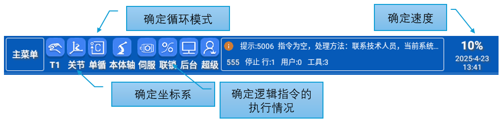

图 5\-10手动运行程序界面

速度倍率：

机器人的速度是根据示教器指定速度的比率来运行。

当倍率为100%时，机器人会按照程序指令的速度运行。

通过示教器上的加减速按钮，可以改变运行速度，通过触屏点击图标也可以改变速度。

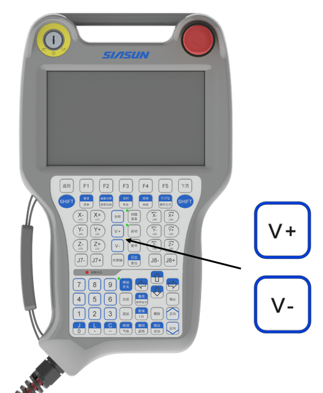

图 5\-11机器人加减速

| **警告:****在T1和T2模式下，机器人在相同的速度倍率的情况下，实际运行的速度是不同的。T1模式最大的速度TCP不超过安全速度，T2模式下，机器人是按照实际运行最大速度的百分比进行动作。请确认在周围无人，没有无关物品的情况下，进行运动机器人，以免造成严重的人身伤亡或设备损坏。** |
| --- |

坐标系的确定：

在执行机器人程序前，请确认机器人的坐标系，要使机器人执行时所使用的坐标系与示教时使用的坐标系保持一致，否则机器人本体位置会因为坐标系的不同而报警，停止运行程序。

1. 工具坐标系号码（TF）：

RC软件可以定义8个工具坐标系，使用工具坐标系1\-8号进行区分，可以通过点击示教右上方的工具坐标系图标进行切换。

1. 用户坐标系号码（UF）：

RC软件可以定义8个用户坐标系，使用用户坐标系1\-8号进行区分，可以通过点击示教右上方的用户坐标系图标进行切换。

| **警告：****机器人程序启动时，会按照示教器上方的坐标系图标所选择的坐标系进行运动，如果选择的坐标系不是示教时所对应的坐标系号，那么机器人程序运行时，机器人本体移动的位置与姿势会和示教时不同，请务必确定好坐标系号之后，再进行移动。** |
| --- |

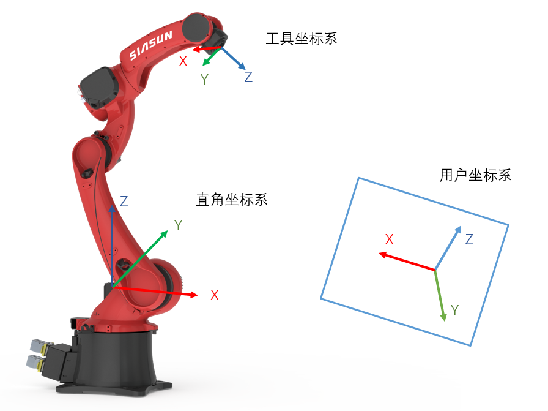

图 5\-12工具、用户坐标系的选择

### 从暂停恢复启动

当机器人正向运行中断后，重新按正向运动，即可继续按程序运动。

当机器人自动运行暂停后，重新按启动按钮，或外部启动，即可继续按照程序运动。

## 对程序进行测试

测试已示教完成的程序，是在机器人完全自动运行之前，通过测试运行，保证程序的动作及逻辑完全正确的过程。测试程序对机器人安全运转有着非常重要的意义。

程序测试分为两个步骤：

1. 使用示教器，循环方式选择单步，手动（按正向运动）进行测试。主要验证位置点是否正确，运动轨迹与周围设备是否有干涉。
2. 使用示教器，循环方式选择单循环，手动运行（选择手动模式并打开连锁开关）或自动运行（选择执行模式并选择低速），进行测试。验证位置连贯性、程序逻辑是否正确。

可以通过示教器上循环状态图标的下拉菜单进行选择循环方式，或可以通过示教器上循环按键来切换循环方式。机器人的循环方式分为3种：

1. 单步，机器人单步执行每条指令。
2. 单循环，机器人连续运动一个循环。
3. 自动，机器人一直连续循环运行。

可以通过联锁图标，来改变机器人是否执行逻辑指令。

1. o/o是联锁开关开启状态，逻辑指令与运动指令都执行。
2. o/x是联锁开关，关闭状态，逻辑指令不执行、运动指令执行。

要通过外部启动来测试机器人，则需要选择远程模式。

此外，机器人如果需要和外部设备进行I\\O通讯，并实现对外围设备的控制，则需要确定外围设备可以正常运转，I\\O都处于有效状态，并没有报警显示。

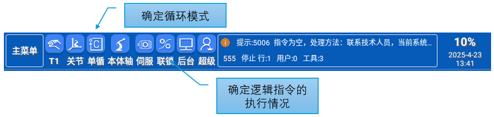

图 5\-13循环模式、连锁图标

| **警告：****测试机器人前请确保选定的坐标系号和示教时所使用的坐标系号是否保持一致。** |
| --- |

### 测试前需要确定的设置

表格 5‑2测试需要确认的项目

| 设定项目 | 说明 |
| --- | --- |
| 循环状态 | 运行前请确认机器人执行的循环状态：单步，机器人单步执行每条指令。单循环，按住【正向运动】，机器人连续运动一个循环。自动，按住【正向运动】，机器人一直连续循环运行。  | 警告：联锁开启并且连续执行时，逻辑指令也是连续执行。请在手动运行时注意确认，以免周围的设备因信号触发运动，造成设备损坏或人员伤亡。 | | --- | |
| 联锁 | 联锁状态，代表机器人在手动运行时，是否跳过逻辑指令：o/o是联锁指令开启状态，逻辑指令都执行。o/x代表逻辑指令不执行。 |

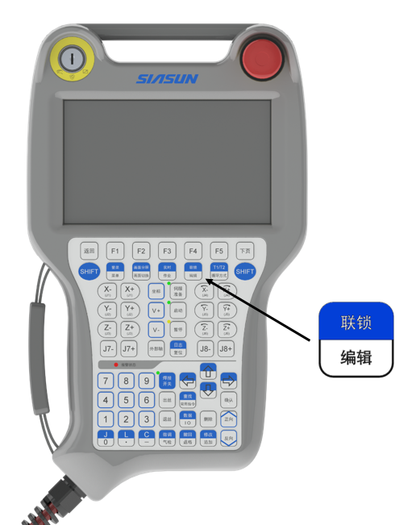

图 5\-14机器人联锁按钮

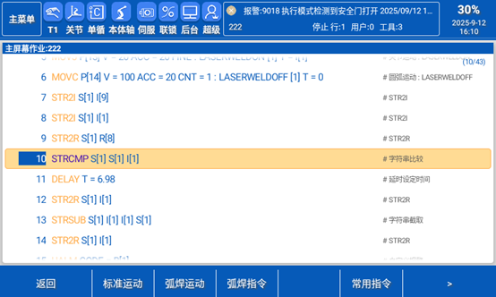

图 5\-15逻辑指令

确认上述项后，可以按下面的方法进行测试：

开启连锁功能，逐个测试程序每条指令，观察运动和逻辑是否按预期的设计执行，机器人运动是否与周围的设备产生干涉，程序逻辑是否在任何可预期的情况下，正确运行，并避免危险，实测中，考虑程序逻辑中没有想到的地方，并进行修改。

机器人逻辑指令是否执行需要通过联锁开关是否打开来确认。

| **注意：****调用子作业不加条件的CALL指令，在执行运动指令时是有效的。可以在执行该指令时，调用子作业进行执行。** |
| --- |

### 单步测试程序

单步测试程序，机器人逐条执行程序，执行完一条程序后，机器人暂停，光标会停在这条指令上，再次执行后，光标会自动跳到下一条语句执行。

设定机器人运行方式：

通过机器人示教器界面的按钮，可以改变机器人的运行方式。

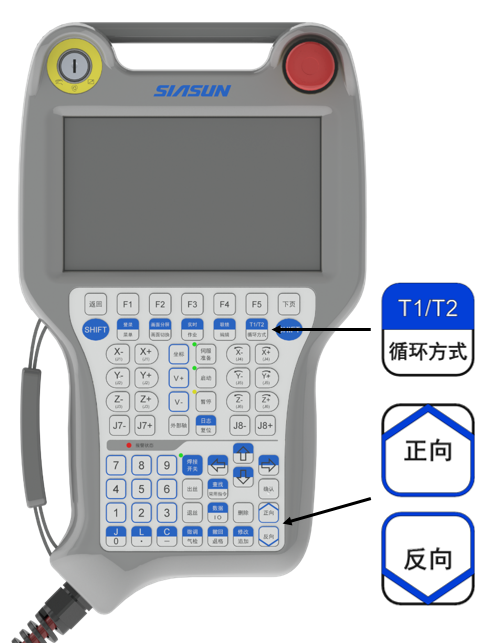

图 5\-16单步运行设置与执行

程序可以通过正向或反向运动来进行。

正向运动：

正向运动，指的是按从上到下的顺序正向执行机器人程序指令。需要同时按住机器人的安全开关【DEADMAN】和【正向】键，松开任意键机器人停止。

机器人从程序光标所在行执行，完成后暂停。但是，在子程序的末尾按下【正向】键，机器人将返回上一层主程序，并会运动到CALL指令上，再次正向，向下运动。

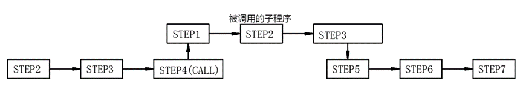

图 5\-17单步运行设置与执行

| **警告：****运行机器人前，需要确认机器人运动范围内，没有人员以及不必要的设备，以免发生意想不到的问题，造成人员伤亡或设备损坏。** |
| --- |

反向运动：

反向运动，指的是机器人逆向执行程序。需要同时按住机器人的安全开关【DEADMAN】和【反向】键，松开任意键机器人停止。

反向运动，机器人只执行运动指令，不执行逻辑指令（与联锁开关状态无关）。重新打开一个子程序，反向运行是无法返回上一级程序的。

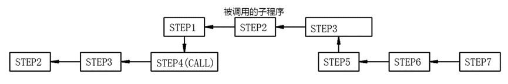

图 5\-18程序反向运动示意图

| **注意：****反向运动时，机器人根据设定可以连续或单步执行程序，但是不能执行逻辑指令。** |
| --- |

| **警告：****运行机器人前，需要确认机器人运动范围内，没有人员以及不必要的设备，以免发生意想不到的问题，造成人员伤亡或设备损坏。** |
| --- |

当机器人在进行圆弧运动时，中间停下来，在机器人的位置点没动的情况下，继续按下【正向】和【反向】键，机器人仍进行原始的圆弧运动。但是，在机器人的位置点移动的情况下，继续按下【正向】键，机器人的运动轨迹会重新规划。

单步执行的步骤：

1. 确定机器人运动范围内，没有人员。
2. 选择机器人单步运行方式。
3. 确定机器人执行时的各种状态。
4. 将光标移动到程序的开始。
5. 按上电按钮，对机器人上电，并一直按下【DEADMAN】不松开。
6. 运行程序：按住安全开关\[DEADMAN]和【正向】或【反向】、单步执行程序。
7. 在执行完一行程序后，程序暂停，再按【正向】或【反向】，继续执行。
8. 完成后，松开DEANMAN按钮。

### 连续运行测试程序

连续运行测试，是指机器人自动执行程序，测试程序是否可以按预期进行运动和执行逻辑指令。

使用单循环和自动运行两种方式来进行连续测试。

使用示教器手动进行连续运行程序时，按下【DEADMAN】和【正向】，程序会从当前行开始执行。机器人自动运行连续测试程序时，使用示教器上的【启动】或远程启动来使机器人程序执行 。

| **警告：****运行机器人前，需要确认机器人运动范围内，没有工作人员以及存在干涉的设备，以免发生意想不到的问题，造成人员伤亡或设备损坏。** |
| --- |

**使用示教器手动连续测试步骤：**

1. 查看机器人运动范围内没有人和有干涉的外部设备。
2. 选择单循环或自动运行方式。
3. 确定机器人执行时的速度、坐标系号、联锁等状态。
4. 按上电按钮，给机器人伺服上电。
5. 在按下【DEADMAN】的状态下，同时按【正向】，连续执行程序。在程序结束之前，一直按住【DEADMAN】与【正向】。如果松开任意一键，程序在执行的中途暂停。

**使用开始按钮或远程启动进行连续测试步骤：**

1. 确定机器人运行范围内没有人。
2. 选择单循环或自动的循环方式。
3. 确定各项设置（循环模式、速度、坐标系号）是否正确。
4. 将执行模式改为执行或者远程。

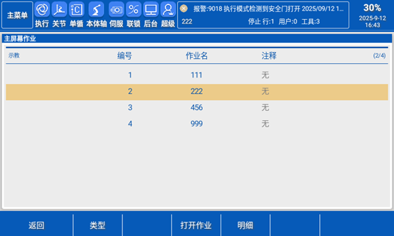

图 5‑19执行模式下作业列表

1. 将光标移动到第一行。
2. 按【开始】或远程启动执行程序。

| **注意：****堆栈内存放作业名、行号、光标、在路径上标志、补偿标志位、偏移、中断等信息。清空后，与这些信息有关的限制或记录将被取消。请避免因为这些限制被取消后，造成的机器人不按预期移动造成的危险。以免发生人员伤害或设备损坏。** |
| --- |

### 程序确认和监控

当程序在运行时，示教器上的作业界面，即是对程序运行过程监控的主要媒体。在作业执行画面上，光标随着作业的执行而移动到正在执行的行，执行模式下，作业不能被编辑。

 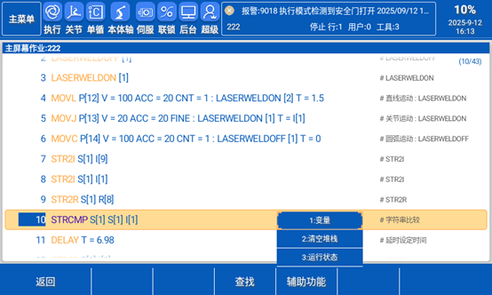

图 5‑20程序的执行

## 断点恢复

断点恢复功能,是在程序动作的暂停中机器人移动的情况下,为在重新开始时首先恢复到暂停时位置的一种功能。

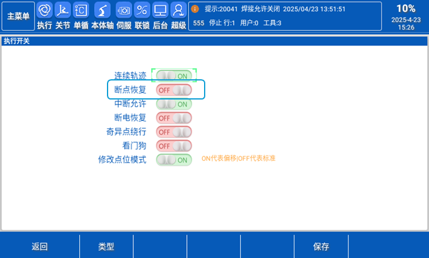

图 5\-22断点恢复设置界面

在暂停后通过点动等方式使得机器人移动的情况下,由于在程序再继续运行时首先使其返回通过点动移动前的位置,继续进行之后的动作,所以可以使其以与原先的轨迹相同的方式进行后续的动作。

图 5\-23开启断点恢复时的运动轨迹

停止后,移动机械臂使其位置发生变化后，再次开始执行作业，运动轨迹如上图所示。

**注：断电恢复功能使能后，重启机器人也支持断点恢复功能，可以按以上逻辑执行。**

## 自动运行

通过程序的自动运行，由本地的启动按钮或外部远程I/O控制自动启动程序，由此来实现生产线的自动。

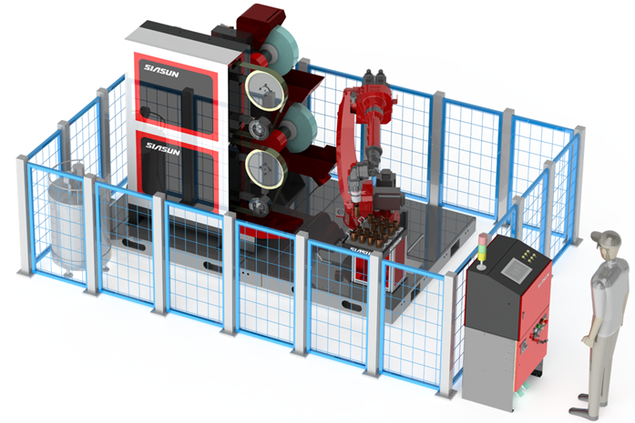

图 5\-24机器人系统的自动运行

自动执行前注意事项：

1. 1机器人各项设置完成。
2. 2机器人处于执行或远程模式下。
3. 3作业空间内没有人。没有其他物体。

自动执行操作步骤：

1. 通过钥匙选择模式，选择执行模式或者远程模式。
2. 在执行模式下按下开始按键。

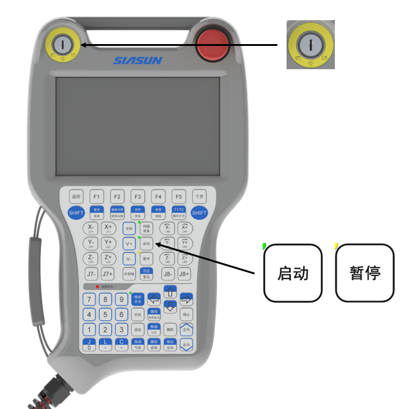

图 5\-25开始停止按钮和模式选择开关

1. 远程模式，根据远程I/O的配置，使用外部启动信号，启动机器人。
2. 在执行模式下，可以使用暂停按键停止机器人。
3. 在远程模式下，可以使用外部暂停停止机器人。

| **注意****在远程模式下，通过外部信号启动时，是需要一些前提条件的，这些前提条件需要考虑时序问题，目的是保证机器人启动后不会发生事故。** |
| --- |

堆栈：

堆栈中存放有执行作业的作业名、行号、光标、在路径上标志、补偿标志位、偏移、中断等信息。 机器人正常启动前会判断机器人当前位置与程序中光标所在行的位置是否在同一个位置，如不在同一个位置则无法启动并会有相关提示信息。所以请谨慎使用清空堆栈功能。【清空堆栈】按钮在执行模式中，作业列表的下方，如图所示。

图 5\-26清空堆栈按钮

| **注意：****堆栈中存放有作业名、行号、光标、在路径上标志、补偿标志位、偏移、中断等信息。清空后，与这些信息有关的限制或记录将被取消。请避免因为这些限制被取消后，造成的机器人不按预期移动造成的危险。以免发生人员伤害或设备损坏。** |
| --- |

# 状态显示

机器人示教器可以对机器人本身的各种状态和数据进行显示。

## 示教器的LED

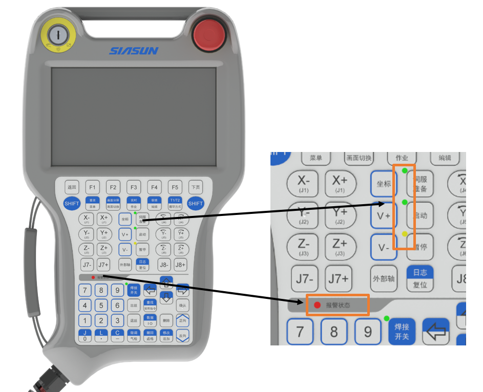

图 6\-1示教器LED

表格 6\-1 LED状态

| 序号 | 功能 | LED颜色 | 说明 |
| --- | --- | --- | --- |
| 1 | 私服准备 | 绿色 | 机器人系统上电状态 |
| 2 | 启动 | 绿色 | 机器人得程序处于启动状态。 |
| 3 | 暂停 | 橙色 | 机器人的程序处于暂停状态。 |
| 4 | 报警状态 | 红色 | 机器人处于报警状态。 |
| 5 | OP1 | 用户自定义 | 用户自定义 |

## 作业界面

执行中的程序指令信息会显示在作业界面上。

图 6\-2作业显示界面

## 变量

可以在示教器变量界面查看、写入需要的变量值。这些变量都是全局变量。

点击主菜单【变量】选择希望查看的变量值。

**用户整型**

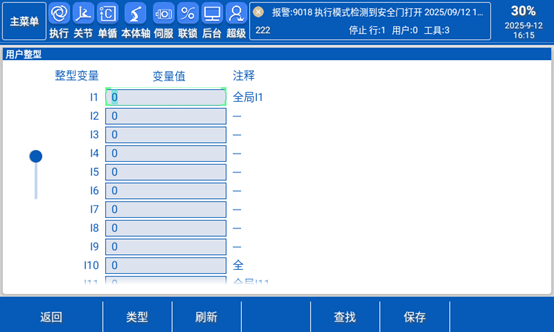

图 6\-3用户整形变量界面

用户整形变量共有512个，I1\-I512,存储值的范围是\-2147483648–2147483648。

**用户实型**

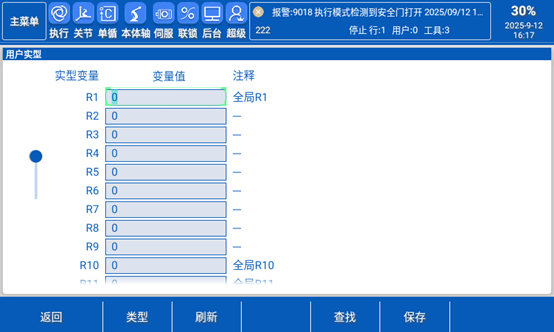

图 6\-4 用户实型变量界面

用户实型变量共有512个，R1\-R512，存储值的范围是\-9999\.999\-9999\.999，小数点后可以保存3位。

**用户字节**

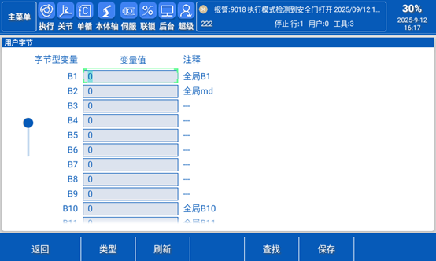

图 6\-5 用户字节型变量界面

用户字节型变量共有512个，B1\-B512，存储值的范围是0\-255。

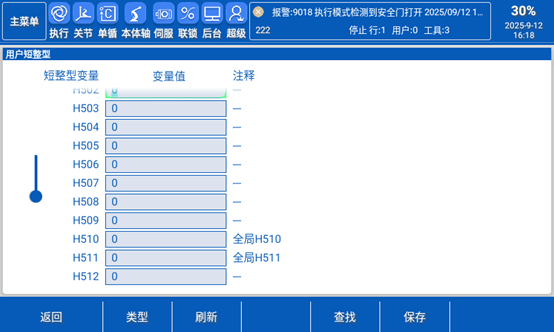

图 6\-6短整型变量界面

短整型变量共有512个，H1\-H512,输入长度的范围是0\-36个字符。

**用户字符串型变量**

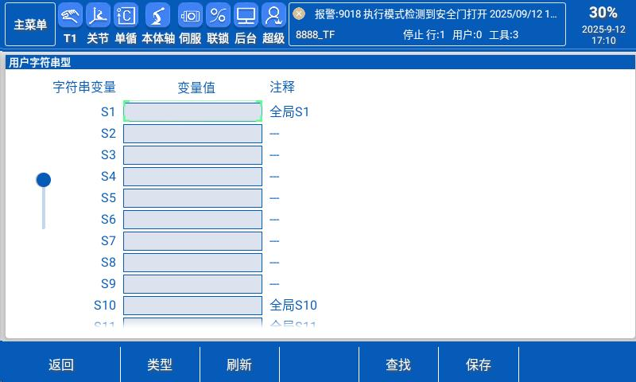

图6\-7用户字符串型

用户字符串型变量工512个，S1\-S512\.

注释：可以添加注释。

查找：可以快速查找到变量。

类型：可以选择查看变量的类型。

保存：保存当前界面上的变量值。

## 位置变量的值

位置变量，是用来储存位置信息的变量。共有1024个位置变量。

位置变量界面，可以查看位置变量里面的值，可以把机器人当前位置存储到位置变量中。

在菜单中点击【变量】\-【位置变量】，打开位置变量界面。

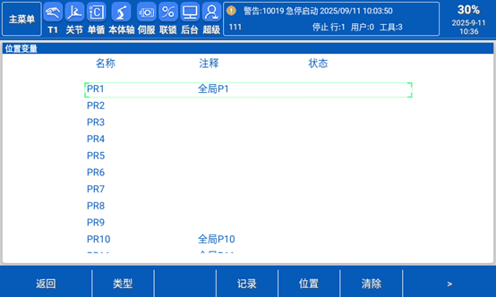

图 6\-8位置变量界面1

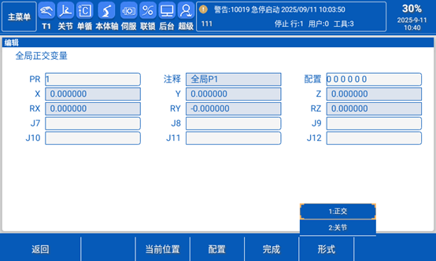

图 6\-9位置变量界面2

### 位置变量获取

在变量列表界面中，点击【记录】，会记录机器人在当前工具和用户坐标系下的位置变量值，在【位置】详细页面中通过【当前位置】或者手动输入可得到变量值。

### 位置变量的用途

位置变量可在程序中通过MOVJ 、MOVL 等使用，具体指令用途可查看指令表。

带位置变量的运动指令，不受位置变量存储的形式所限制，均可执行。

如MOVJ存储的位置，也可以使用MOVL形式运动。

如MOVL存储的位置，也可以使用MOVJ形式运动。

## 实时显示

通过示教器上【数据】按键或者主菜单里进入实时显示界面，可以查看机器人当前关节值、用户RPY值等常用信息。

点击主菜单【实时显示】\-【实时显示】，即能打开实时显示界面。

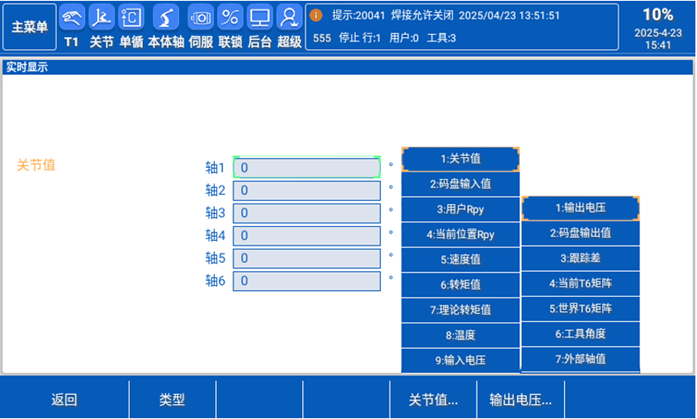

图 6\-10实时显示界面

参数说明：

1. 关节值：显示机器人当前各关节的角度值，单位是度。

图6\-11 关节值界面

1. 码盘输入值：码盘输入是从驱动器读上来的驱动器的实际码盘值。

图6\-12 码盘输入值

1. 码盘输出值：码盘输出是指机器人下发给驱动器的码盘值。

图6\-13 码盘输出值

1. 码盘跟踪差：显示机器人码盘输入值和输出值之间的差值。

图6\-14 跟踪差

1. 世界位置的T6阵 ：在世界坐标系下，机器人位置的T6阵，N、O、A为矩阵，P代表位置，单位是m。

图6\-15世界T6矩阵

1. 用户Rpy：在用户坐标系下，TCP点的位置和姿态值，位置单位为mm，姿态单位为度。

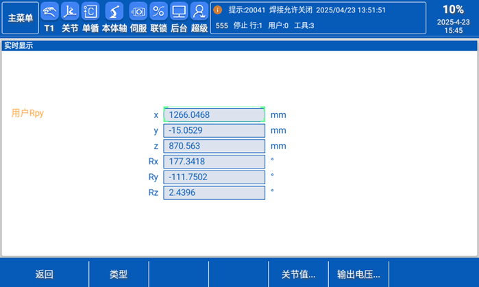

图6\-16 用户RPY

1. 当前位置T6阵：机器人的当前位置在直角坐标系下的T6阵。

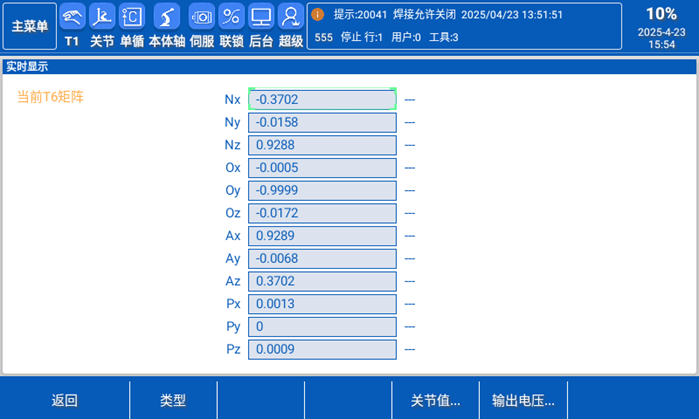

图6\-17 当前T6阵

1. 当前位置的Rpy：机器人当前位置的TCP点在直角坐标系下的位置与姿态值。

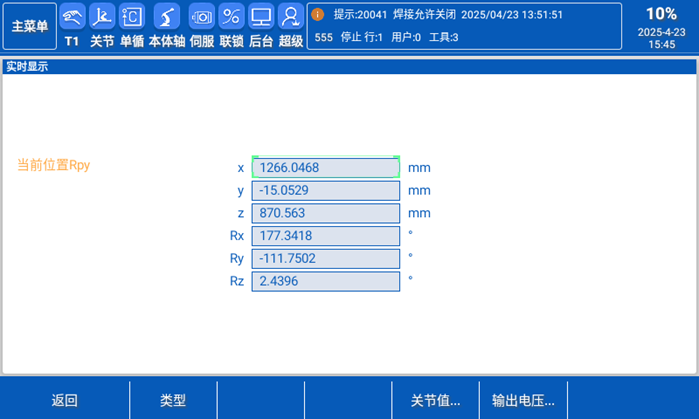

图6\-18当前位置RPY

1. 速度值：显示机器人运动时每个轴的实时速度。

图6\-19 速度值

1. 转矩值：显示机器人运动时每个轴的转矩值。

图6\-20 转矩值

1. 输入电压：用来检查电机外部输入电压。（根据特殊项目制定，想要使用这项功能联系新松技术人员。）

图6\-21 输入电压

1. 输出电压：用来检查电机输出电压。（根据特殊项目制定，想要使用这项功能联系新松技术人员。）

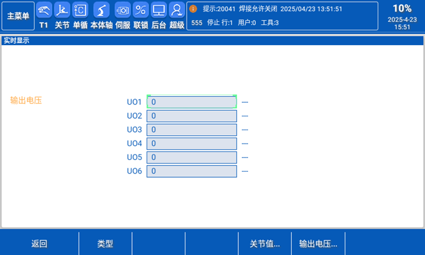

图6\-22 输出电压

1. 伺服温度：现在只支持使用清能驱动器的机器人查看伺服温度。

图6\-23 温度

1. 外部轴码盘真实值：显示外部轴的编码器值。（配置外部轴后有效）
2. 工具角度：显示TCP点在直角坐标系的位置和当前工具坐标系Z方向的夹角，角度1：工具在O\-YZ面投影与Y轴夹角；角度2：工具在O\-XZ面投影与X轴夹角；角度3：工具在O\-XY面投影与X轴夹角；角度4：工具与O\-XY面夹角；

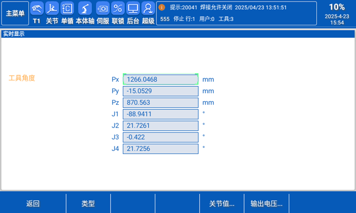

图6\-24 工具角度

1. 理论转矩值：机器人出厂前测试时使用，转矩的规划值。

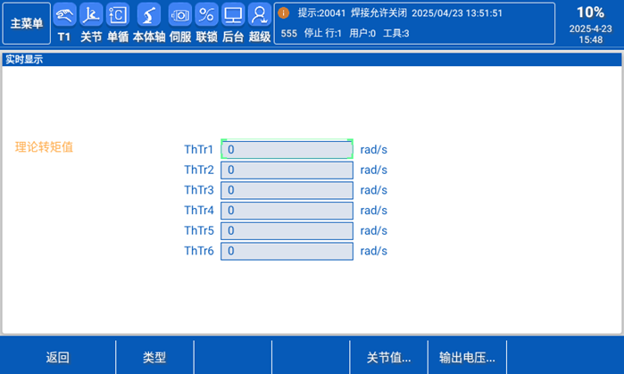

图6\-25 理论转矩值

## 用户/系统IO

系统IO分为输入与输出，主要是可通过界面查看到IO状态。

点击主菜单【实时显示】\-【系统IO输入/输出】即能打开界面。

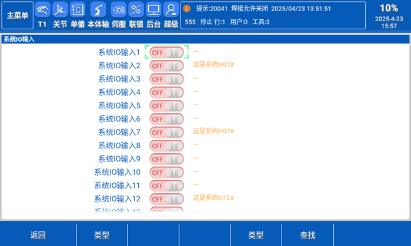

图 6\-26系统IO输入界面

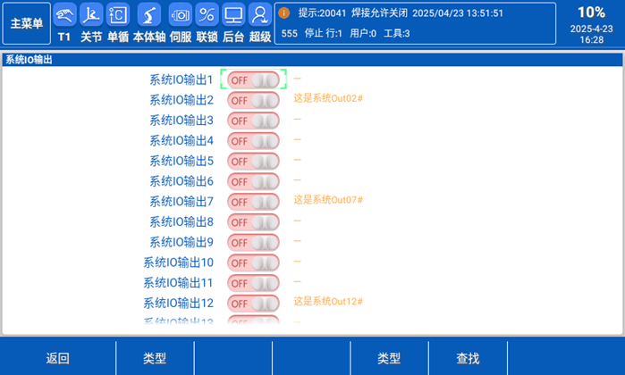

图 6\-27系统IO输出界面

可以通过这个界面查看系统IO状态，存在含义的系统IO会显示代表的含义。

## 报警日志

点击屏幕上方的报警提示栏，或在主菜单中依次点击【实时显示】\-【报警日志】可以打开报警日志。报警日志（报警、警告、提示）可以通过【报警类型】按钮对不同的报警信息进行查看。

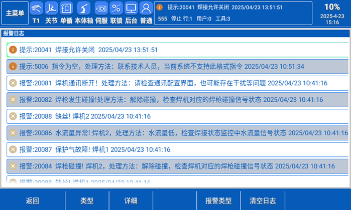

图 6\-28报警日志

报警类型以标签显示型式，包含：

1. 全部：全部信息（报警、警告、提示）按照时间由新到旧显示；
2. 报警、警告、提示：各分类信息按照时间由新到旧显示；
3. 历史记录：全部信息（报警、警告、提示）按照时间由新到旧显示；

| **注意：清空按钮点击后，会使报警复位，同时报警只记录在历史记录中。** |
| --- |

点击【清空日志】按钮，清除打开的报警页面中的全部、报警、警告、信息中的信息，历史记录不清空；且该按钮操作同时会触发RESET，如果有新的报警信息会报出。

## 动作日志

可以查看历史的操作记录。最多可存储500条记录，采用循环保存方式，保存最新的500条记录。

动作记录包含以下内容：作业编辑、伺服上电、启动、暂停、急停、坐标系切换、手动操作、模式切换、零位、参数编辑、备份恢复、内存清除等；

可以通过U盘对操作记录进行备份（详见7\.1参数备份恢复介绍）。

点击主菜单【实时显示】\-【动作日志】即能打开操作日志界面。

点击【查询】按钮，可以查看今日、前一天、后一天的内容。

点击【编号】按钮，可以查看对应的日志。

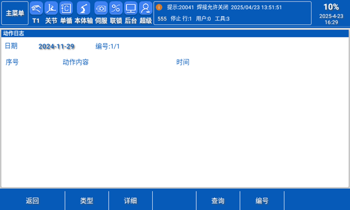

图 6\-29操作日志界面

通过操作日志界面，可以查看到历史都进行了哪些操作。

# 备份、恢复资料

可以将机器人控制系统中存储的系统参数、用户参数、模型参数、动作日志、IO注释、应用参数，通过控制器上的USB口存储到U盘中保存与查看。

## 参数备份恢复

参数中对系统参数、用户参数、模型参数、动作日志、IO注释、应用参数进行备份和对系统参数、用户参数、模型参数、IO注释、应用参数进行恢复。

参数备份恢复步骤：

1. 插好U盘。

| **注意：****请使用新松公司出厂提供的U盘，以免存储过程中发生数据丢失，同时避免对板卡的伤害。U盘必须为FAT32格式。在备份和恢复时会提示备份是否成功，如没插U盘或搜索到U盘，会提示系统处于卸载状态。** |
| --- |

1. 点击主菜单【备份恢复】\-【参数】，进入参数恢复界面。
2. 对参数进行备份和恢复，备份和恢复完成后，会有恢复成功、需要重启机器人的提示。这时，对机器人进行重启即可。

图 7\-1参数备份恢复界面

| **注意：****在U盘正确挂载后，备份的文件会放置于backup\_program/路径下，如U盘内没有该路径，备份时会自动生成此路径；** **机器人参数备份后请确认一下U盘中是否存在这些文件，文件大小不能为0，查看所备份的这些文件是否成功。** |
| --- |

## 全局变量备份/恢复

全局变量的备份恢复步骤：

1. 插好U盘。
2. 点击主菜单【备份恢复】\-【全局变量】，进入位置变量界面。
3. 对全局变量进行备份和恢复。

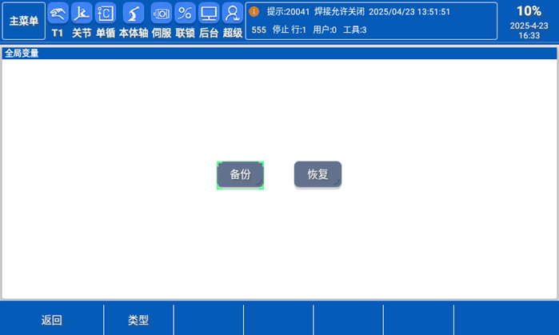

图 7\-2全局变量备份恢复界面

| **注意：****机器人参数备份后请确认一下U盘中是否存在这个文件，文件大小不能为0，查看所备份的这些文件是否成功！** |
| --- |

## 作业备份/恢复

作业备份步骤：

1. 插好U盘
2. 点击主菜单【备份恢复】\-【作业备份】，进入作业备份界面，会显示机器人所有作业，包含示教程序、宏程序、后台程序。
3. 选择作业名，点击【单独备份】对单个作业进行备份。

整体上传是将机器人作业整体打包备份。备份作业需选择【整体备份】按钮。 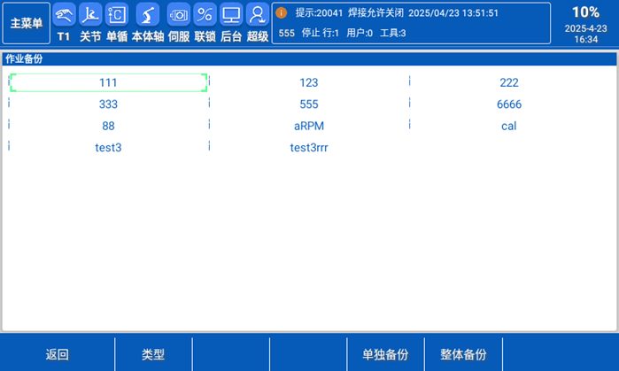

图 7‑3作业备份界面

| **注意：****机器人参数备份后请确认一下U盘中是否存在这些文件，文件大小不能为0，查看所备份的这些文件是否成功！** |
| --- |

作业恢复步骤：

1. 插好U盘
2. 点击主菜单【备份恢复】\-【作业恢复】，进入作业恢复界面。
3. 选择作业名，点击【单独恢复】对单个作业进行恢复。（点击下载，提示是否下载该作业，点击确认，提示下载完成。如机器人里有这个作业名，提示下载作业已存在，是否覆盖，确认后提示已成功覆盖。）
4. 整体下载是将U盘中通过机器人整体上传的作业整体下载到机器人中。恢复作业需选择【整体恢复】按钮。（点击整体下载，如有同名文件需要恢复，系统提示目标位置已存在同名文件，是否覆盖，点击确认即会覆盖同名作业，提示作业文件恢复完成，请卸载后重启。）
5. 恢复后同名程序都将被U盘中的程序覆盖，不同名文件被系统保留，请确认后使用。

| **注意：****作业下载需要满足以下条件，应用、型号、轴数相同才能下载成功。** |
| --- |

图 7‑4作业恢复界面

## U盘卸载

在文件全部备份完成后，可以通过该界面卸载U盘来保护备份的文件。

点击主菜单【备份恢复】\-【卸载USB】进入界面。

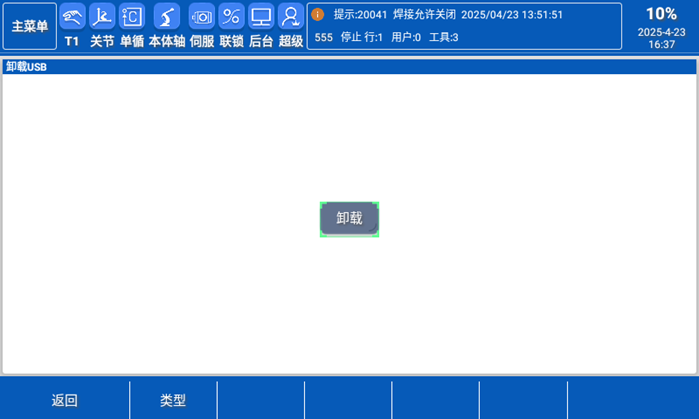

图 7\-5 USB卸载界面

## 备份、恢复文件

系统备份和恢复时的文件，记录在下面的表格中：

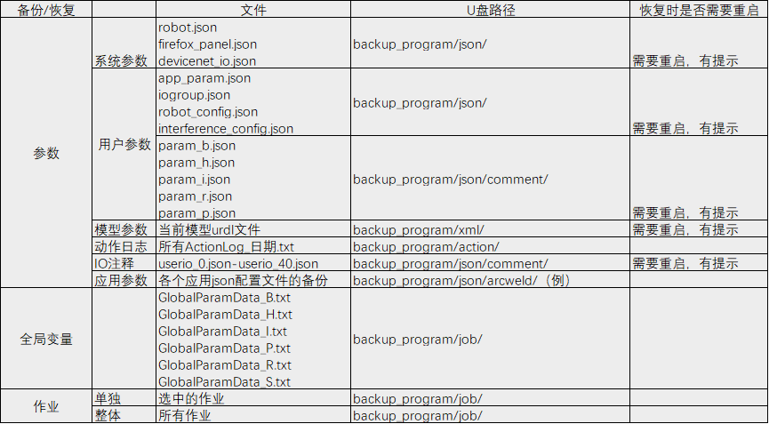

# 应用与操作

## 通讯设备的设置

机器人的通讯配置方式及接口有以下几种:

1. Devicenet；
2. EtherCat；
3. Profinet；
4. LAN；
5. Modbus TCP/RTU；

### Devicenet

进入Devicenet界面：【主菜单】\-【IO】\-【总线IO映射】\-【Devicenet】。目前至多支持8个文件配置。

图8\-1 Devicent界面

Devicent参数：

1. 文件号：对应文件的标号。
2. 使能状态：使能为ON时，与配置的从站进行连接，通讯执行。使能为OFF时，配置的从站不进行连接。
3. Mac ID：DeviceNet 从站的ID，支持1\~64。
4. 波特率：与从站的通讯速率，支持125、250、500。
5. 触发方式：支持位选通、轮询、多点轮询；推荐配置为轮询。

6）连接方式：UCMM、Group2、Group3；根据所用网关模块进行选择，anybus 网关选择UCMM 方式，赫优讯网关选择Group2 方式。

7）连接状态：查看连接状态，无法设置。ON 为DeviceNet 建立通讯连接，OFF 为

DeviceNet 通讯连接断开。

1. 输入长度：DeviceNet 从站\-\>机器人控制器的数据长度，单位为字节。
2. 输出长度：机器人控制器\-\>DeviceNet 从站的数据长度，单位为字节。

Devicenet配置IO映射：

1. IO设备配置：

进入IO设备列表界面：【主菜单】\-【系统设置】\-【IO设备列表】\-【新增】 。

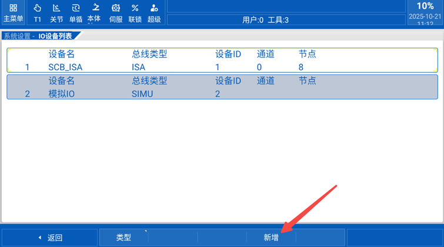

图 8\-1 IO设备列表界面

* 1. 设备名：选择DeviceNetIO。
	2. 总线类型：选择CAN。
	3. 设备ID：输入与其他设备不重复的ID。
	4. 通道：选择0或1。
	5. 节点：需根据实际物理节点进行配置。

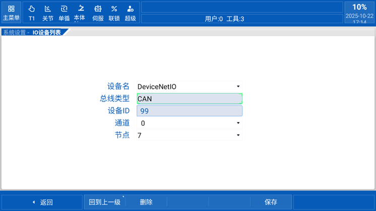

图 8‑2 IO设备列表配置界面

1. CAN总线属性配置：

进入总线属性界面：【主菜单】\-【系统设置】\-【总线属性】\-【CAN】 。

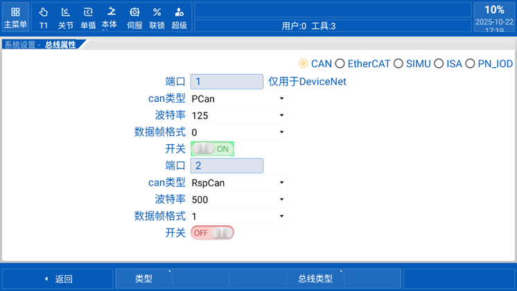

图 8‑3 总线属性界面

* 1. 端口：默认端口1和端口2。
	2. Can类型：可选PCan和RspCan（注：E3845板卡用PCan，A40i板卡用RspCan）。
	3. 波特率：下拉选125、250、500默认125。
	4. 数据帧格式：下拉选0、1、2默认0。
	5. 开关：置为ON。
1. DeviceNet配置：

进入Devicenet界面：【主菜单】\-【IO】\-【总线IO映射】\-【Devicenet】。目前至多支持8个文件配置。

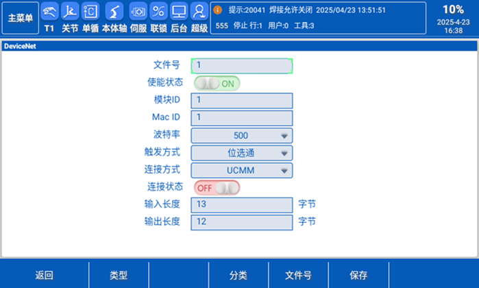

图 8‑5 Devicent界面

* 1. 文件号：对应文件的标号。
	2. 使能状态：使能为ON时，与配置的从站进行连接，通讯执行。使能为OFF时，配置的从站不进行连接。
	3. 模块ID：输入第一步IO设备配置的设备ID号（注：此参数用于标识从站设备的唯一 ID 号，必须与在 IO 设备配置中设置的设备 ID 一致）。
	4. Mac ID：DeviceNet 从站的ID，支持1\~64。
	5. 波特率：与从站的通讯速率，支持125、250、500。
	6. 触发方式：支持位选通、轮询、多点轮询；推荐配置为轮询。
	7. 连接方式：UCMM、Group2、Group3；根据所用网关模块进行选择，anybus 网关选择UCMM 方式，赫优讯网关选择Group2 方式。
	8. 连接状态：查看连接状态，无法设置。ON 为DeviceNet 建立通讯连接，OFF 为DeviceNet 通讯连接断开。
	9. 输入长度：DeviceNet 从站\-\>机器人控制器的数据长度，单位为字节。
	10. 输出长度：机器人控制器\-\>DeviceNet 从站的数据长度，单位为字节。
1. 输入IO映射配置：

进入输入IO映射界面：【主菜单】\-【IO】\-【总线IO映射】\-【输入IO映射】\-【新增】。

图 8‑6输入IO映射 界面

* 1. 通信类型：选择User。
	2. 总线类型：设备ID输入后保存自动填充。
	3. 设备ID：输入第一步IO设备配置的设备ID号（注：此参数用于标识从站设备的唯一 ID 号，必须与在 IO 设备配置中设置的设备 ID 一致）。
	4. 设备名：设备ID输入后保存自动填充。
	5. 设备起始：输入0。
	6. IO起始位：可输入任意值（注：避免和通信类型为System的IO或其他IO冲突，建议顺序设置IO起始）。
	7. 长度（位）：预留IO长度（注：这里等于devicenet配置的输入长度乘以8）。

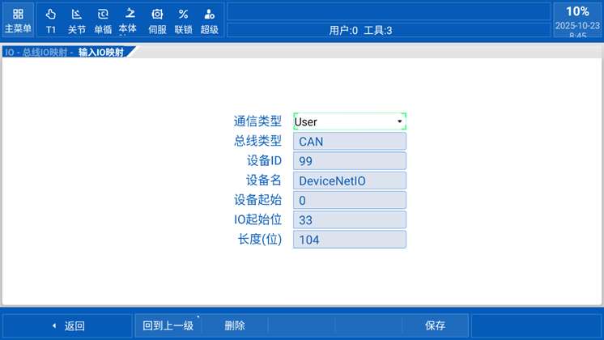

图 8‑7输入IO映射 界面

1. 输出IO映射配置：

进入输出IO映射界面：【主菜单】\-【IO】\-【总线IO映射】\-【输出IO映射】\-【新增】。

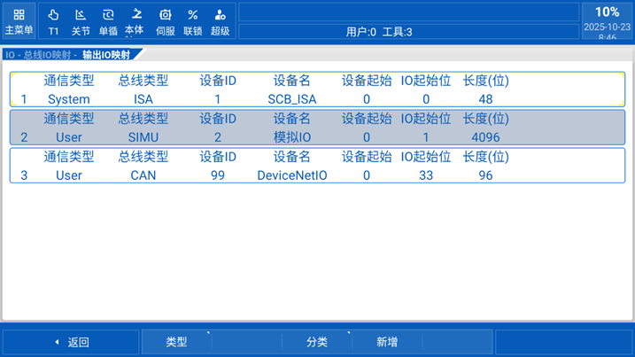

图 8‑8输出IO映射 界面

* 1. 通信类型：选择User。
	2. 总线类型：设备ID输入后保存自动填充。
	3. 设备ID：输入第一步IO设备配置的设备ID号（注：此参数用于标识从站设备的唯一 ID 号，必须与在 IO 设备配置中设置的设备 ID 一致）。
	4. 设备名：设备ID输入后保存自动填充。
	5. 设备起始：输入0。
	6. IO起始位：可输入任意值（注：避免和通信类型为System的IO或其他IO冲突，建议顺序设置IO起始）。
	7. 长度（位）：预留IO长度（注：这里等于devicenet配置的输出长度乘以8）。

 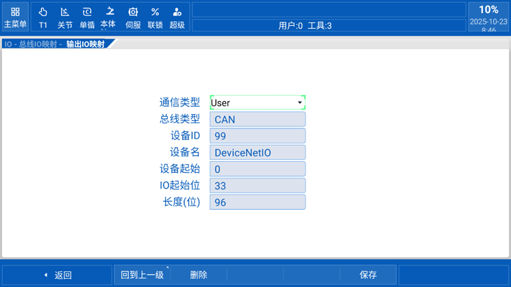

图 8‑9输出IO映射配置 界面

### Profinet

进入Profinet界面：【主菜单】\-【IO】\-【总线IO映射】\-【Profinet】。

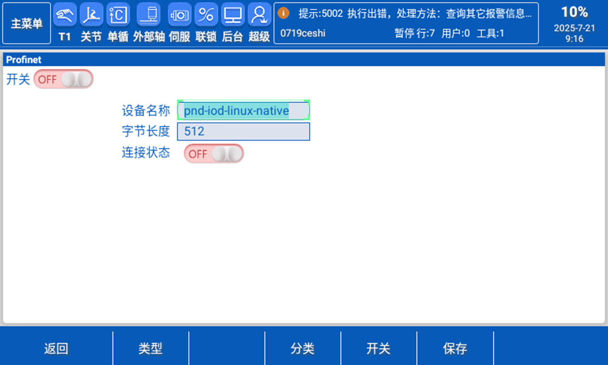

图 8\-311Profinet界面

Profinet参数：

1）设备名称：主站指定的从站用户名，需手动设置为主站配置的用户名（主站

与从站的用户名需要相同）。

2）字节长度：8\-512单位byte。

3）连接状态：ON/OFF 显示，显示当前连接状态。

Profinet配置IO映射：

1. IO设备配置：

进入IO设备列表界面：【主菜单】\-【系统设置】\-【IO设备列表】\-【新增】。

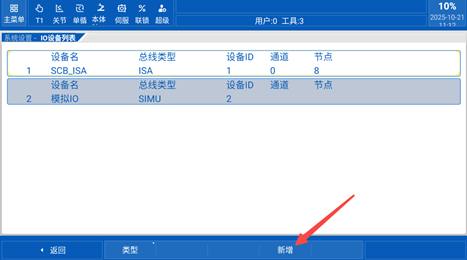

图 8‑\-12O设备列表 界面

* 1. 设备名：选择ProfinetIO。
	2. 总线类型：选择PN\_IOD。
	3. 设备ID：输入与其他设备不重复的ID。
	4. 通道：选择0或1。
	5. 节点：需根据实际物理节点进行配置。

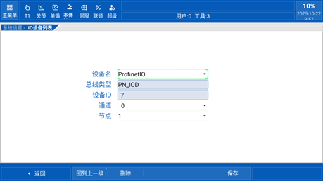

图 8‑\-13O设备列表配置 界面

1. Profinet配置：

进入Profinet界面：【主菜单】\-【IO】\-【总线IO映射】\-【Profinet】。

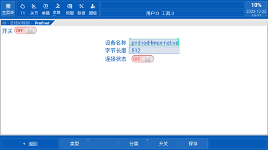

图 8‑\-14rofinet界面

* 1. 设备名称：主站指定的从站用户名，需手动设置为主站配置的用户名（主站与从站的用户名需要相同）。
	2. 字节长度：8\-512单位byte。
1. 输入IO映射配置：

进入输入IO映射界面：【主菜单】\-【IO】\-【总线IO映射】\-【输入IO映射】\-【新增】。

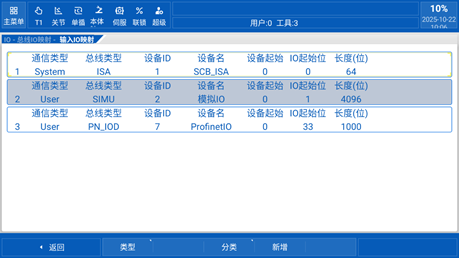

图 8‑\-15入IO映射界面

* 1. 通信类型：选择User。
	2. 总线类型：设备ID输入后保存自动填充。
	3. 设备ID：输入第一步IO设备配置的设备ID号（注：此参数用于标识从站设备的唯一 ID 号，必须与在 IO 设备配置中设置的设备 ID 一致）。
	4. 设备名：设备ID输入后保存自动填充。
	5. 设备起始：输入0。
	6. IO起始位：可输入任意值（注：避免和通信类型为System的IO或其他IO冲突，建议顺序设置IO起始）。
	7. 长度（位）：预留IO长度。

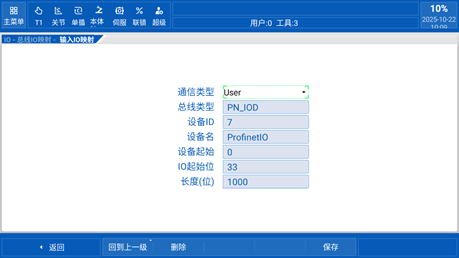

图 8‑\-16入IO映射界面

1. 输出IO映射配置：

进入输出IO映射界面：【主菜单】\-【IO】\-【总线IO映射】\-【输出IO映射】\-【新增】。

图 8‑\-17出IO映射界面

* 1. 通信类型：选择User。
	2. 总线类型：设备ID输入后保存自动填充。
	3. 设备ID：输入第一步IO设备配置的设备ID号（注：此参数用于标识从站设备的唯一 ID 号，必须与在 IO 设备配置中设置的设备 ID 一致）。
	4. 设备名：设备ID输入后保存自动填充。
	5. 设备起始：输入0。
	6. IO起始位：可输入任意值（注：避免和通信类型为System的IO或其他IO冲突，建议顺序设置IO起始）。
	7. 长度（位）：预留IO长度。

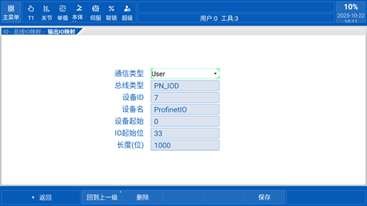

图 8‑\-18出IO映射配置界面

### Modbus

#### TcpSlave配置（ModbusTCP从站）

进入Modbus界面：【主菜单】\-【IO】\-【总线IO映射】\-【Modbus】。

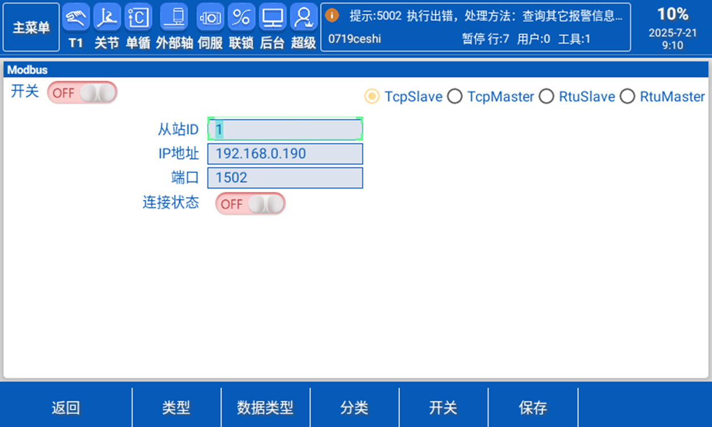

图 8\-119Modbus TcpSlave界面

Modbus TcpSlave参数：

1. 开关：开关置为ON。
2. 从站ID：输入从站ID，从站没有ID 可输入任意数。
3. IP地址：输入modbus tcp 从站IP 地址。

3）端口：可配置任意端口号，Modbus 默认端口号为1502（注意：如果同时配置了主站 和从站需要不同的端口号）。 。

4）状态：ON/OFF 显示，显示当前连接状态。

Modbus TcpSlave配置连接：

1. IO设备配置：

进入IO设备列表界面：【主菜单】\-【系统设置】\-【IO设备列表】\-【新增】。

图 8‑\-20IO设备列表界面

1. 设备名：选择MODULEBUS。
2. 总线类型：选择MB\_TCP\_S。
3. 设备ID：输入与其他设备不重复的ID。
4. 通道：选择0或1。
5. 节点：需根据实际物理节点进行配置。

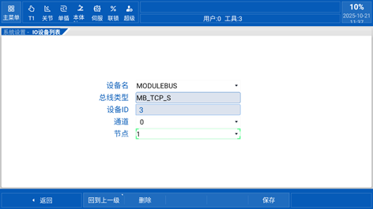

图 8‑\-21O设备列表配置界面

1. Modbus 数据类型配置：

进入Modbus数据类型界面：【主菜单】\-【IO】\-【总线IO映射】\-【modbus数据类型】。

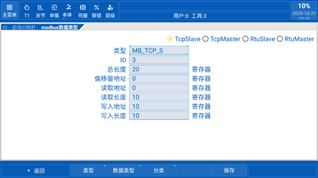

图 8\-\-22Modbus 数据类型界面

1. 类型：默认为MB\_TCP\_S不可更改。
2. ID：输入第一步IO设备配置的设备ID号（注：此参数用于标识从站设备的唯一 ID 号，必须与在 IO 设备配置中设置的设备 ID 一致）。
3. 总长度：等于读取和写入长度总和（注：此参数表示从站设备在一次通信中需要处理的寄存器总数，包括读取和写入操作。在主站配置中，Quantity 值应与此参数匹配）。
4. 偏移量地址：读取或写入寄存器地址起始位置偏移（注：此参数用于指定从站设备寄存器地址的起始位置偏移量，即从指定的寄存器地址开始读取或写入数据）。
5. 读取地址：输入IO映射寄存器地址的起始位置（注：此参数用于指定从站设备中读取操作的寄存器地址起始位置，即从该地址开始读取数据）。
6. 读取长度：输入IO映射对应的寄存器数目（注：此参数用于指定从站设备中读取操作涉及的寄存器数量，即从读取地址开始连续读取的寄存器数目）。
7. 写入地址：输出IO映射寄存器地址的起始位置（注：此参数用于指定从站设备中写入操作的寄存器地址起始位置，即从该地址开始写入数据）。
8. 写入长度：输出IO映射对应的寄存器数目（注：此参数用于指定从站设备中写入操作涉及的寄存器数量，即从写入地址开始连续写入的寄存器数目）。
9. 输入IO映射配置：

进入输入IO映射界面：【主菜单】\-【IO】\-【总线IO映射】\-【输入IO映射】\-【新增】。

图 8\-\-21入IO映射界面

1. 通信类型：选择User。
2. 总线类型：设备ID输入后保存自动填充。
3. 设备ID：输入第一步IO设备配置的设备ID号（注：此参数用于标识从站设备的唯一 ID 号，必须与在 IO 设备配置中设置的设备 ID 一致）。
4. 设备名：设备ID输入后保存自动填充。
5. 设备起始：输入0。
6. IO起始位：可输入任意值（注：避免和通信类型为System的IO或其他IO冲突，建议顺序设置IO起始）。
7. 长度（位）：每个寄存器对应的IO映射位数乘以modbus数据类型配置填写的读取长度，即16\*读取长度。

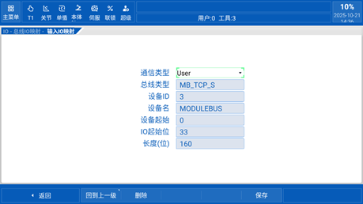

图 8\-\-22入IO映射配置界面

| **注释：参数值需要参考《新松机器人电气使用及维护手册》的说明，不要以图片上的参数为输入参数。** |
| --- |

1. 输出IO映射配置：

进入输出IO映射界面：【主菜单】\-【IO】\-【总线IO映射】\-【输出IO映射】\-【新增】。

图 8\-\-23出IO映射界面

1. 通信类型：选择User。
2. 总线类型：设备ID输入后保存自动填充。
3. 设备ID：输入第一步IO设备配置的设备ID号（注：此参数用于标识从站设备的唯一 ID 号，必须与在 IO 设备配置中设置的设备 ID 一致）。
4. 设备名：设备ID输入后保存自动填充。
5. 设备起始：输入0。
6. IO起始位：可输入任意值（注：避免和通信类型为System的IO或其他IO冲突，建议顺序设置IO起始）。
7. 长度（位）：每个寄存器对应的IO映射位数乘以modbus数据类型配置填写的读取长度，即16\*读取长度。

图 8\-\-24出IO映射配置 界面

#### TcpMaster（ModbusTCP主站）

进入Modbus界面：【主菜单】\-【IO】\-【总线IO映射】\-【Modbus】。

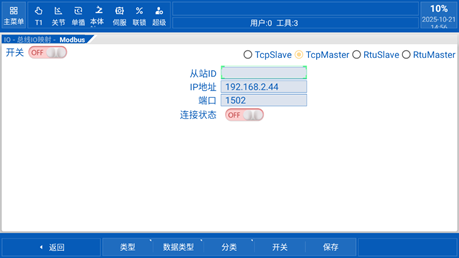

图 8\-\-25Modbus TcpMaster界面

Modbus TcpMaster参数：

1. 从站ID：输入从站ID，从站没有ID 可输入任意数。
2. IP地址：输入modbus Tcp/IP Server地址（注：IP地址要求与机器人IP地址同网段）。
3. 端口：可配置任意端口号，Modbus 默认端口号为1502（注意：如果同时配置了主站和从站需要不同的端口号）。
4. 状态：ON/OFF 显示，显示当前连接状态。

Modbus TcpMaster配置连接：

1. IO设备配置：

进入IO设备列表界面：【主菜单】\-【系统设置】\-【IO设备列表】\-【新增】。

图 8\-\-26 IO设备列表 界面

1. 设备名：选择MODULEBUS。
2. 总线类型：选择MB\_TCP\_M。
3. 设备ID：输入与其他设备不重复的ID。
4. 通道：选择0或1。
5. 节点：需根据实际物理节点进行配置。

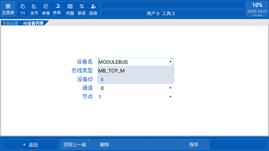

图 8\-217IO设备列表配置 界面

1. Modbus TcpMaster配置：

进入Modbus界面：【主菜单】\-【IO】\-【总线IO映射】\-【Modbus】。

图 8\-228Modbus TcpMaster界面

1. 开关：开关置为ON。
2. 从站ID：可配置任意值（与Modbus从站中的Slave ID匹配即可）。
3. IP地址：可配置与机器人相同网段IP（注：可配置2，3，4网段，e3845板卡网线需接入对应网口LAN1，LAN2，LAN1）。
4. 端口：可配置任意端口号（注意：如果同时配置了主站和从站需要不同的端口号）。
5. Modbus 数据类型配置：

进入Modbus数据类型界面：【主菜单】\-【IO】\-【总线IO映射】\-【modbus数据类型】。

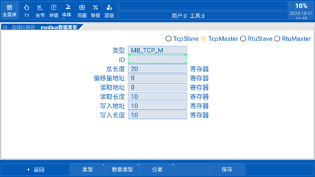

图 8\-239Modbus 数据类型界面

1. 类型：默认为MB\_TCP\_M不可更改。
2. ID：输入第一步IO设备配置的设备ID号（注：此参数用于标识从站设备的唯一 ID 号，必须与在 IO 设备配置中设置的设备 ID 一致）。
3. 总长度：等于读取和写入长度总和（注：此参数表示从站设备在一次通信中需要处理的寄存器总数，包括读取和写入操作。在主站配置中，Quantity 值应与此参数匹配）。
4. 偏移量地址：读取或写入寄存器地址起始位置偏移（注：此参数用于指定从站设备寄存器地址的起始位置偏移量，即从指定的寄存器地址开始读取或写入数据）。
5. 读取地址：输入IO映射寄存器地址的起始位置（注：此参数用于指定从站设备中读取操作的寄存器地址起始位置，即从该地址开始读取数据）。
6. 读取长度：输入IO映射对应的寄存器数目（注：此参数用于指定从站设备中读取操作涉及的寄存器数量，即从读取地址开始连续读取的寄存器数目）。
7. 写入地址：输出IO映射寄存器地址的起始位置（注：此参数用于指定从站设备中写入操作的寄存器地址起始位置，即从该地址开始写入数据）。
8. 写入长度：输出IO映射对应的寄存器数目（注：此参数用于指定从站设备中写入操作涉及的寄存器数量，即从写入地址开始连续写入的寄存器数目）。
9. 输入IO映射配置：

进入输入IO映射界面：【主菜单】\-【IO】\-【总线IO映射】\-【输入IO映射】\-【新增】。

图 8\-\-30入IO映射界面

1. 通信类型：选择User。
2. 总线类型：设备ID输入后保存自动填充。
3. 设备ID：输入第一步IO设备配置的设备ID号（注：此参数用于标识从站设备的唯一 ID 号，必须与在 IO 设备配置中设置的设备 ID 一致）。
4. 设备名：设备ID输入后保存自动填充。
5. 设备起始：输入0。
6. IO起始位：可输入任意值（注：避免和通信类型为System的IO或其他IO冲突，建议顺序设置IO起始）。
7. 长度（位）：每个寄存器对应的IO映射位数乘以modbus数据类型配置填写的读取长度，即16\*读取长度。

图 8\-\-31入IO映射配置界面

1. 输出IO映射配置：

进入输出IO映射界面：【主菜单】\-【IO】\-【总线IO映射】\-【输出IO映射】\-【新增】。

图 8\-\-32出IO映射界面

1. 通信类型：选择User。
2. 总线类型：设备ID输入后保存自动填充。
3. 设备ID：输入第一步IO设备配置的设备ID号（注：此参数用于标识从站设备的唯一 ID 号，必须与在 IO 设备配置中设置的设备 ID 一致）。
4. 设备名：设备ID输入后保存自动填充。
5. 设备起始：输入0。
6. IO起始位：可输入任意值（注：避免和通信类型为System的IO或其他IO冲突，建议顺序设置IO起始）。
7. 长度（位）：每个寄存器对应的IO映射位数乘以modbus数据类型配置填写的读取长度，即16\*读取长度。

图 8\-\-33出IO映射配置界面

#### RtuSlave（ModbusRTU从站）

进入Modbus界面：【主菜单】\-【IO】\-【总线IO映射】\-【Modbus】。

图 8\-\-34Modbus RtuSlave界面

Modbus RtuSlave参数：

1. 从站ID：输入从站ID，从站没有ID 可输入任意数。
2. 串口名称：e3845板卡默认串口/dev/ttyS0，arm板卡默认串口/dev/ttyS4。
3. 波特率：默认9600。
4. 状态：ON/OFF 显示，显示当前连接状态。

Modbus RtuSlave配置连接：

1. IO设备配置：

进入IO设备列表界面：【主菜单】\-【系统设置】\-【IO设备列表】\-【新增】。

图 8\-\-35IO设备列表界面

1. 设备名：选择MODULEBUS。
2. 总线类型：选择MB\_RTU\_S。
3. 设备ID：输入与其他设备不重复的ID。
4. 通道：选择0或1。
5. 节点：需根据实际物理节点进行配置。

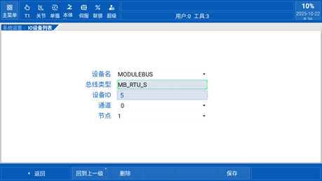

图 8\-\-36IO设备列表配置界面

1. Modbus RtuSlave配置：

进入Modbus界面：【主菜单】\-【IO】\-【总线IO映射】\-【Modbus】。

图 8\-\-37 odbus RtuSlave界面

1. 开关：开关置为ON。
2. 从站ID：可配置任意值（与Modbus从站中的Slave ID匹配即可）。
3. 串口名称：E3845板卡默认/dev/ttyS0，A40i板卡默认/dev/ttyS4。
4. 波特率：默认9600。
5. Modbus 数据类型配置：

进入Modbus数据类型界面：【主菜单】\-【IO】\-【总线IO映射】\-【modbus数据类型】。

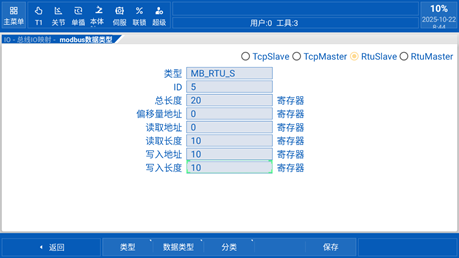

图 8\-\-38Modbus 数据类型界面

1. 类型：默认为MB\_RTU\_S不可更改。
2. ID：输入第一步IO设备配置的设备ID号（注：此参数用于标识从站设备的唯一 ID 号，必须与在 IO 设备配置中设置的设备 ID 一致）。
3. 总长度：等于读取和写入长度总和（注：此参数表示从站设备在一次通信中需要处理的寄存器总数，包括读取和写入操作。在主站配置中，Quantity 值应与此参数匹配）。
4. 偏移量地址：读取或写入寄存器地址起始位置偏移（注：此参数用于指定从站设备寄存器地址的起始位置偏移量，即从指定的寄存器地址开始读取或写入数据）。
5. 读取地址：输入IO映射寄存器地址的起始位置（注：此参数用于指定从站设备中读取操作的寄存器地址起始位置，即从该地址开始读取数据）。
6. 读取长度：输入IO映射对应的寄存器数目（注：此参数用于指定从站设备中读取操作涉及的寄存器数量，即从读取地址开始连续读取的寄存器数目）。
7. 写入地址：输出IO映射寄存器地址的起始位置（注：此参数用于指定从站设备中写入操作的寄存器地址起始位置，即从该地址开始写入数据）。
8. 写入长度：输出IO映射对应的寄存器数目（注：此参数用于指定从站设备中写入操作涉及的寄存器数量，即从写入地址开始连续写入的寄存器数目）。
9. 输入IO映射配置：

进入输入IO映射界面：【主菜单】\-【IO】\-【总线IO映射】\-【输入IO映射】\-【新增】。

图 8\-339入IO映射界面

1. 通信类型：选择User。
2. 总线类型：设备ID输入后保存自动填充。
3. 设备ID：输入第一步IO设备配置的设备ID号（注：此参数用于标识从站设备的唯一 ID 号，必须与在 IO 设备配置中设置的设备 ID 一致）。
4. 设备名：设备ID输入后保存自动填充。
5. 设备起始：输入0。
6. IO起始位：可输入任意值（注：避免和通信类型为System的IO或其他IO冲突，建议顺序设置IO起始）。
7. 长度（位）：每个寄存器对应的IO映射位数乘以modbus数据类型配置填写的读取长度，即16\*读取长度。

图 8\-\-40入IO映射配置界面

1. 输出IO映射配置：

进入输出IO映射界面：【主菜单】\-【IO】\-【总线IO映射】\-【输出IO映射】\-【新增】。

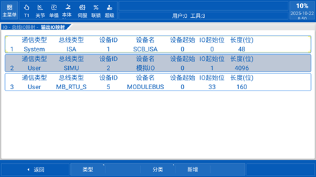

图 8\-35输出IO映射界面

1. 通信类型：选择User。
2. 总线类型：设备ID输入后保存自动填充。
3. 设备ID：输入第一步IO设备配置的设备ID号（注：此参数用于标识从站设备的唯一 ID 号，必须与在 IO 设备配置中设置的设备 ID 一致）。
4. 设备名：设备ID输入后保存自动填充。
5. 设备起始：输入0。
6. IO起始位：可输入任意值（注：避免和通信类型为System的IO或其他IO冲突，建议顺序设置IO起始）。
7. 长度（位）：每个寄存器对应的IO映射位数乘以modbus数据类型配置填写的读取长度，即16\*读取长度。

图 8\-\-41出IO映射配置界面

#### RtuMaster（ModbusRTU主站）

进入Modbus界面：【主菜单】\-【IO】\-【总线IO映射】\-【Modbus】。

图 8\-\-42Modbus RtuMaster界面

Modbus RtuMaster参数：

1. 从站ID：输入从站ID，从站没有ID 可输入任意数。
2. 串口名称：e3845板卡默认串口/dev/ttyS0，arm板卡默认串口/dev/ttyS4。
3. 波特率：默认9600。
4. 状态：ON/OFF 显示，显示当前连接状态。

Modbus RtuMaster配置连接：

1. IO设备配置：

进入IO设备列表界面：【主菜单】\-【系统设置】\-【IO设备列表】\-【新增】。

图 8\-\-43IO设备列表 界面

1. 设备名：选择MODULEBUS。
2. 总线类型：选择MB\_RTU\_M。
3. 设备ID：输入与其他设备不重复的ID。
4. 通道：选择0或1。
5. 节点：需根据实际物理节点进行配置。

图 8\-\-44O设备列表配置 界面

1. Modbus RtuMaster配置：

进入Modbus界面：【主菜单】\-【IO】\-【总线IO映射】\-【Modbus】。

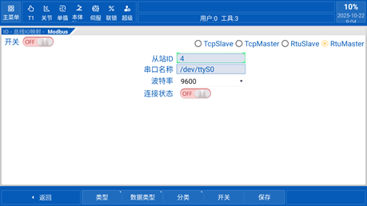

图 8\-405Modbus RtuMaster界面

1. 开关：开关置为ON。
2. 从站ID：可配置任意值（与Modbus从站中的Slave ID匹配即可）。
3. 串口名称：E3845板卡默认/dev/ttyS0，A40i板卡默认/dev/ttyS4。
4. 波特率：默认9600。
5. Modbus 数据类型配置：

进入Modbus数据类型界面：【主菜单】\-【IO】\-【总线IO映射】\-【modbus数据类型】。

图 8\-416Modbus 数据类型界面

1. 类型：默认为MB\_RTU\_M不可更改。
2. ID：输入第一步IO设备配置的设备ID号（注：此参数用于标识从站设备的唯一 ID 号，必须与在 IO 设备配置中设置的设备 ID 一致）。
3. 总长度：等于读取和写入长度总和（注：此参数表示从站设备在一次通信中需要处理的寄存器总数，包括读取和写入操作。在主站配置中，Quantity 值应与此参数匹配）。
4. 偏移量地址：读取或写入寄存器地址起始位置偏移（注：此参数用于指定从站设备寄存器地址的起始位置偏移量，即从指定的寄存器地址开始读取或写入数据）。
5. 读取地址：输入IO映射寄存器地址的起始位置（注：此参数用于指定从站设备中读取操作的寄存器地址起始位置，即从该地址开始读取数据）。
6. 读取长度：输入IO映射对应的寄存器数目（注：此参数用于指定从站设备中读取操作涉及的寄存器数量，即从读取地址开始连续读取的寄存器数目）。
7. 写入地址：输出IO映射寄存器地址的起始位置（注：此参数用于指定从站设备中写入操作的寄存器地址起始位置，即从该地址开始写入数据）。
8. 写入长度：输出IO映射对应的寄存器数目（注：此参数用于指定从站设备中写入操作涉及的寄存器数量，即从写入地址开始连续写入的寄存器数目）。
9. 输入IO映射配置：

进入输入IO映射界面：【主菜单】\-【IO】\-【总线IO映射】\-【输入IO映射】\-【新增】。

图 8\-427入IO映射界面

1. 通信类型：选择User。
2. 总线类型：设备ID输入后保存自动填充。
3. 设备ID：输入第一步IO设备配置的设备ID号（注：此参数用于标识从站设备的唯一 ID 号，必须与在 IO 设备配置中设置的设备 ID 一致）。
4. 设备名：设备ID输入后保存自动填充。
5. 设备起始：输入0。
6. IO起始位：可输入任意值（注：避免和通信类型为System的IO或其他IO冲突，建议顺序设置IO起始）。
7. 长度（位）：每个寄存器对应的IO映射位数乘以modbus数据类型配置填写的读取长度，即16\*读取长度。

图 8\-438入IO映射配置界面

1. 输出IO映射配置：

进入输出IO映射界面：【主菜单】\-【IO】\-【总线IO映射】\-【输出IO映射】\-【新增】。

图 8\-44输出IO映射界面

1. 通信类型：选择User。
2. 总线类型：设备ID输入后保存自动填充。
3. 设备ID：输入第一步IO设备配置的设备ID号（注：此参数用于标识从站设备的唯一 ID 号，必须与在 IO 设备配置中设置的设备 ID 一致）。
4. 设备名：设备ID输入后保存自动填充。
5. 设备起始：输入0。
6. IO起始位：可输入任意值（注：避免和通信类型为System的IO或其他IO冲突，建议顺序设置IO起始）。
7. 长度（位）：每个寄存器对应的IO映射位数乘以modbus数据类型配置填写的读取长度，即16\*读取长度。

图 8\-449出IO映射配置界面

### 连接端口

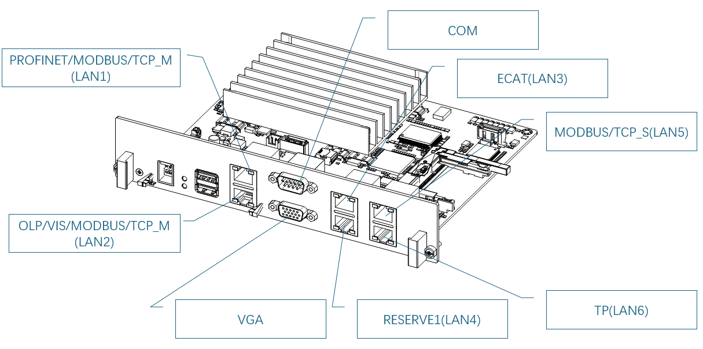

图 8\-150制器主板接口面板

| 序号 | 端口 | 说明 |
| --- | --- | --- |
| 1 | VGA接口 | 用来连接显示器 |
| 2 | COM 接口 | ModbusRTU 接口 |
| 3 | PROFINET/MODBUS/TCP\_M (LAN1\) | Profinet 接口、ModbusTCP\_M接口 |
| 4 | OLP/VIS/MODBUS/TCP\_M (LAN2\) | 离线编程、视觉接口、ModbusTCP\_M接口 |
| 5 | ECAT(LAN3\) | 内部 ethercat 通讯 |
| 6 | RESERVE1(LAN4\) | 预留（离线编程、视觉接口） |
| 7 | MODBUS/TCP\_S(LAN5\) | ModbusTCP\_S 接口 |
| 8 | TP(LAN6\) | 示教器通讯 |

## 预约功能

使用预约功能，需要设计专用的控制台（多个）对应多个工位，每个控制台有启动按钮，每个按钮对应一个作业，机器人会以用户按下按钮的先后顺序，去启动对应按钮的机器人作业（预约作业数量没有限制）。

当一个机器人需要对应三个工位进行作业时：

在工位1的作业记录为JOB1；

在工位2的作业记录为JOB2；

在工位3的作业记录为JOB3；

当工位1工件准备完毕后，即可输出设定好的IO信号，机器人执行JOB1。在执行JOB1的过程中，可以陆续准备工位2与工位3的工件，并按照预期输出相对应的IO信号。这时候工位1的作业依然在执行过程中，但会按照按IO信号接受顺序预约JOB2,JOB3。

预约功能需要注意的事项与流程：

1. 支持远程模式。
2. 需要具备的前提条件为，预约作业开关需要打开，配置机器人原点位置（可以在预约设置界面中设置或者取消使用原点位置，详细见本节说明）。

| **注意：**1. **这里指的原点位置，是预约功能可以设置每个预约作业的所使用的原点位置，需要在预约功能设置界面内配置好所使用的原点编号（详见在本节说明），原点位置本身在【原位记录】界面内设置（详见2\.3节说明）。** 2. **如果使用预约功能没有设置原点位置，那么要确保各个作业间，相互切换时的运动路径与任何设备都不存在干涉，否则会发生碰撞危险。** 3. **如果预约作业使用了原点位置，也要保证各个作业原点位置之间的路径，或原点与没有设置原点位置的作业起始点间的路径，与任何设备都不存在干涉，否则会发生碰撞危险。** |
| --- |

操作步骤与执行流程：

如果在预约功能内，预约作业设置了原点位置，则需要机器人在原点位置上开启作业（原点标定和设定详见2\.3设置原点说明），机器人上电，在点击预约按钮机器人会进入对应的预约程序，对应的程序会运行一个循环，在机器人没有停止时，在次按其它预约按钮，对应的程序会被预约上，会按照预约的先后顺序执行。

执行当前预约程序时，再次按这个程序的预约，这样的预约不生效，可以预约其它程序，不能预约当前执行的程序。预约没有执行完的程序，暂停后也不能直接执行其它预约程序，必须把原有程序执行完，或把预约状态清除，机器人回原点位置（如果设置原位） ，才能进行执行其它预约程序。如果预约功能没有设置原点，则开启下一个作业时，机器人从当前位置直接执行预约作业。

| **注意：****如果使用预约功能而没有设置原点位置，那么要确保各个作业间，相互切换时的运动路径与任何设备都不存在干涉，开启前也需要确保机器人当前位置与预约作业的开始点的运动路径上没有任何设备干涉，否则会发生碰撞危险。** |
| --- |

机器人执行预约程序中途停止时，不关闭这个预约程序（与模式切换无关），再次上电\-按预约，就可以从当前停止的位置继续运行。机器人执行预约程序中途停止时，关闭了这个预约程序，再上电按预约，机器人无法执行预约程序（提示：请手动切换回预约作业），我们需要手动打开之前的预约作业，如果没有在之间打开过其它程序，就可以从当前停止的位置继续运行。如果打开过其它程序，系统提示预约清除，预约程序就需要从程序头执行。

以下为执行预约作业在不同情况下的处理过程：

1. 没有预约状态时，打开任何作业和对其进行修改后，预约A作业后，机器人会从A作业头开始执行（如果预约作业设置了原点，则判断机器人是否在原点启动）。
2. 没有预约状态时，允许通过启动键运行机器人（不考虑预约开关状态）。在运行过程中预约按钮不起作用，预约不上作业。
3. 有预约状态时，不允许通过启动键运行机器人。
4. 有预约状态时，想通过启动键运行机器人，需要先把所有预约状态取消掉后，才能通过启动键运行机器人。
5. 对有预约状态的作业进行编辑后，该作业预约状态自动消失。

该工位被预约后，没有执行前，再次按下该工位的预约按钮，该工位预约则被取消。

预约功能开关：

使用预约功能需要在执行开关界面开启使能。点击【用户配置】\-【预约】\-【预约设置】进入预约设置界面。

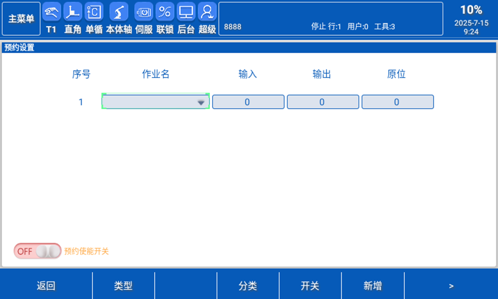

图 8\-151约设置界面

| **注意：**1. **当预约作业开关变成ON时，机器人预约功能有效，可以正常使用，作业开关为OFF时，机器人预约功能无效。** 2. **使用预约功能启动作业后，作业仅单循环执行一次，执行完成后停止。** |
| --- |

预约作业名与输入输出配置：

在预约配置界面设置各个工位的作业名，及启动时的输入、输出信号，这样可以通过工位上的启动按钮启动作业。

点击【用户配置】\-【预约】\-【预约设置】，进入预约功能设置界面。

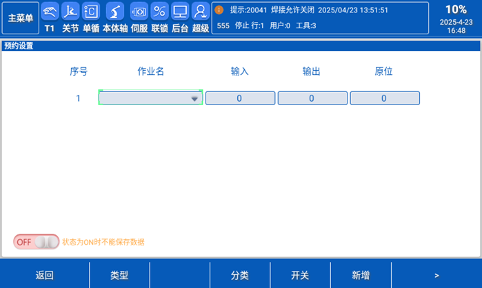

图 8\-152约功能设置界面

用户根据需要进行配置，预约配置个数没有限制，IO号不可重复配置，如序号1与序号2的输入IO号不可重复。

新增：点击\<新增\>进行配置的增加，输入作业名、启动作业的输入、输出信号、原位号。

编辑：选中点击或者按\<确认\>键，进入详细页面进行配置项的修改。

删除：选中后按下\<删除\>即可删除当前配置。

保存：按下\<保存\>后完成配置的变更。

其中原位填写范围0\-8，代表原位序号。填写0，代表该程序预约，不判断机器人当前是否在原位。填写1\-8，代表该程序预约，判断机器人当前位置是否为对应的原位位置，如果不在原位位置，不允许机器人启动。

| **注意：****当进行某预约作业的作业名、输入IO、输出IO、原位配置时，需要该行信息全部配置完整，否则该预约作业配置无效（重新打开页面可观察到参数恢复默认\*\*\*或0）。****0表示该预约作业执行前不进行原位比较。1\-8表示当前预约作业执行前应进行机器人当前位置与原位x(页面配置原位号)比较，若在原位范围内则允许该预约作业执行，否则不执行。** |
| --- |

清除预约设置可以清除掉设置的全部作业名，输入及输出。点击【用户配置】\-【预约】\-【预约设置】,预约设置后面的【全部清除】按钮，会出现弹框，确认后执行清除预约设置操作，取消后保持不变。

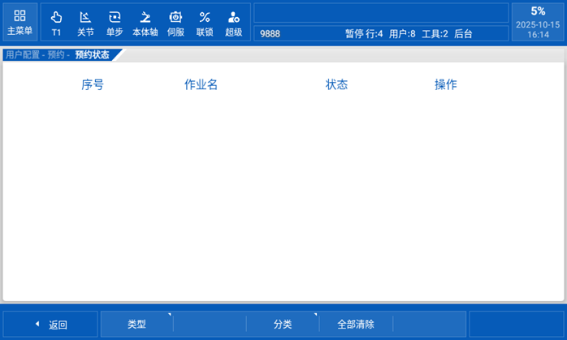

图 8\-153约设置全部清除功能

预约功能的规程：

1. 在执行中的作业，其对应工位的启动按钮需要常亮，作为提示。
2. 当机器人在执行作业的过程中，按下其他工位的启动按钮，那么其它工位的作业将被预约，进入等待运行的状态。
3. 预约作业的启动按钮会闪烁，作为提示。
4. 按下正在执行的作业，不会对该作业进行重复预约。
5. 在执行中停止机器人，需要按下暂停操作。

作业预约状态：

可以在预约状态界面，查看现阶段机器人预约的状态。点击【用户配置】\-【预约】\-【预约状态】，进入预约状态界面。如图所示。

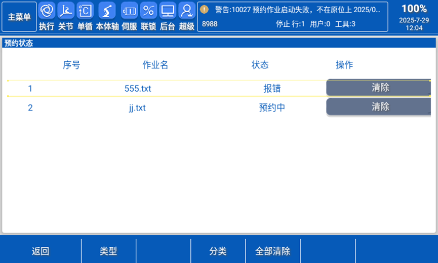

图 8\-154约状态界面

用户可查看当前预约的作业名与状态。

预约状态的清除：

【清除】按钮，可以清除单个作业对应的预约状态。

【全部清除】按钮，可以全部清除已经按下预约启动按钮的作业状态。

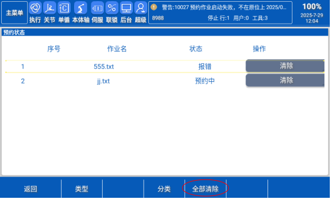

图 8\-155约状态清除功能

用户通过【全部清除】按键，会出现弹框提示操作是否成功。

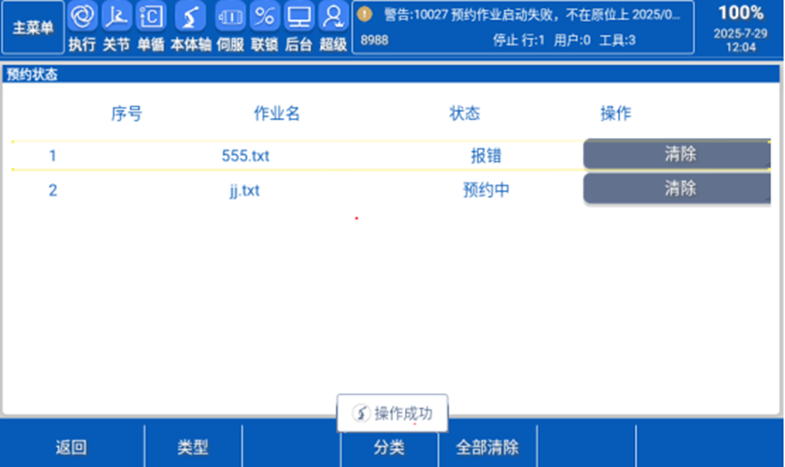

图 8\-156约状态全部清除确认弹框

【清除】按钮，可以清除掉该序号行预约作业状态。

用户通过【清除】按键可以逐条清除该序号行预约状态，会出现弹框，确认后执行清除本条预约作业状态操作，取消后保持不变。

图 8\-157约状态清除确认弹框

预约功能中的暂停操作：

当机器人被预约启动，程序在执行中，收到下列暂停信号，会暂停机器人动作。

暂停的两种方式：

1. 通过示教器上停止按键来暂停；
2. 远程I\\O外部暂停信号来暂停；

| **注意：****使用预约功能，请务必在控制台上，连接外部暂停功能，以保证在每个工位可以暂停机器人。** |
| --- |

恢复启动，需要当前无暂停信号，没有手动打开过其它程序，机器人在暂停的工位上，如机器人没在上电状态，需要给上电信号，按预约启动按钮，机器人就可以从暂停的位置启动作业。

## 总线优化

总线优化界面内，显示了驱动器参数等信息。

点击【主菜单】\-【系统设置】\-【总线优化】，可以进入总线优化界面。

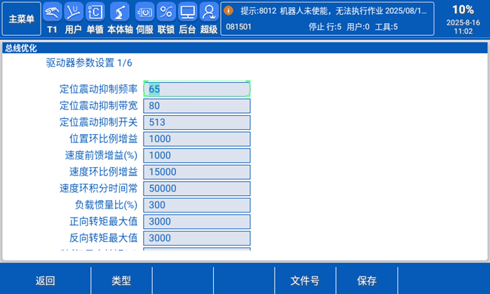

**图 8\-258线优化设置页面**

| **注意：****驱动器参数随机器人出厂已经被设置完成，不允许自行更改驱动器参数。** |
| --- |

## 外部轴配置

新松机器人控制软件最多支持6个外部轴模型系统，每个外部轴的使用，都是基于该外部轴系统的。每个使用的外部轴系统最少由一个外部轴节点、最多3个外部轴节点组成，每个滑台外部轴系统只能包含一个外部轴节点，变位机外部轴系统可以包含1\-3个外部轴节点。

要使用外部轴，需要进行外部轴配置：

1. 系统轴数配置；
2. 总线设备通讯配置；
3. 轴配置；
4. 系统配置；

### 系统轴数配置

把需要添加的外部轴数，配置到系统中。

系统轴数配置步骤：

1. 点击主菜单【系统设置】\-【系统轴数】进入系统轴数界面，在外部轴轴数位置填写增加的轴数。
2. 改变外部轴轴数，点击保存，会提示系统轴数已变更，请重启。

| **注意：如果配置的轴数与实际情况不符，则可能导致机器人无法正常启动，改变系统轴数，作业会被清除，请确认实际轴数后，再进行外部轴数量的配置。** |
| --- |

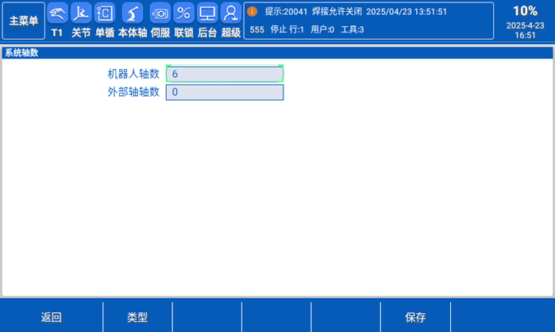

图 8\-259统轴数配置界面

### 总线设备配置

总线设备配置是机器人整体硬件的通讯配置，包含驱动器、IO板，这些设备是通过网线进行连接的，我们在配置时，需要打开控制柜，查看网线连接设备顺序，根据连接顺序与所使用的设备品牌名称进行配置。所以我们添加外部轴时，需要把外部轴驱动器与机器人进行通讯配置。

总线设备配置步骤：

1. 点击主菜单【系统设置】\-【总线设备】输入密码“sysiasun”。进入总线设备界面。

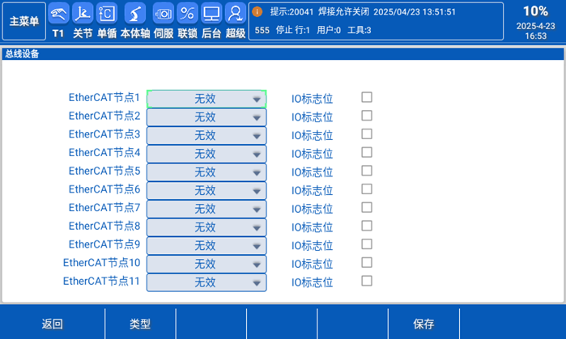

图 8\-260线设备配置界面

确定好系统通讯顺序与使用品牌，选择驱动器品牌，选择IO模块品牌。用户IO模块节点需要开启IO标志位。

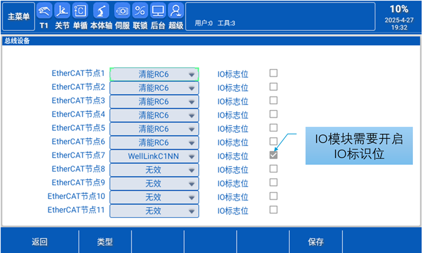

图 8\-261线设备配置界面

1. 点击保存后，重启生效。

### 外部轴\-轴配置

对外部轴进行配置。

点击主菜单【系统设置】\-【外部轴】\-【外部轴配置】，进入到配置界面。

1. 点击\<新增\>按钮新增外部轴配置，进入详细页面进行配置；
2. 选中已有的配置，按下\<确认\>键或者点击即可进入到详细页面，进行修改；
3. 详细页面，点击\<保存\>完成新增或修改操作。

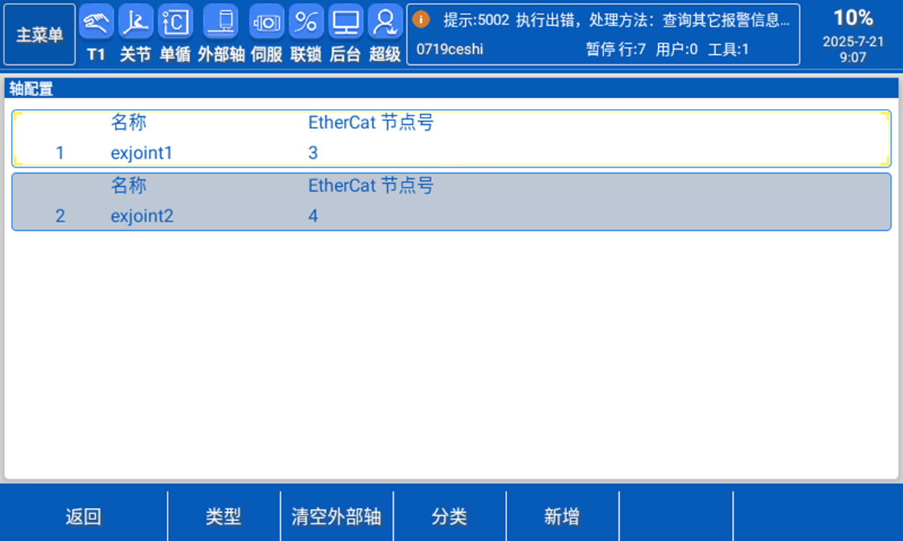

图 8\-262轴配置界面

功能按钮说明

清空外部轴，即清空外部轴配置。

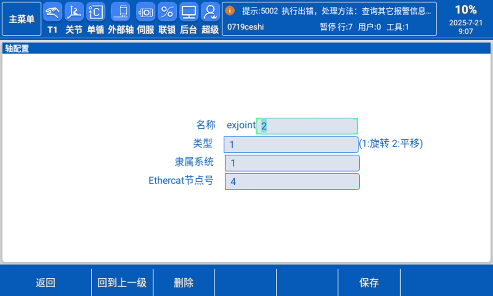

图 8\-263配置界面

参数说明

名称：

关键字“exjonint”不变，后面可配置外部轴号，轴号范围1\-6。

类型：

目前系统支持两种类型1：旋转2：平移。

隶属系统：

系统数最多支持6个，用户根据配置可任意设置。

Ethercat节点号：

实际物理轴在总线的节点号。

### 系统配置

外部轴系统配置。

点击主菜单【系统设置】\-【外部轴】\-【外部轴配置】，点击\<分类\>选择【系统配置】，进入到配置界面。

1. 通过\<编号\>进入想要配置的系统；
2. 配置系统类型，设置此系统所属外部轴类型；
3. 点击\<保存\>完成配置；
4. 逻辑轴号通过外部轴配置自动识别。

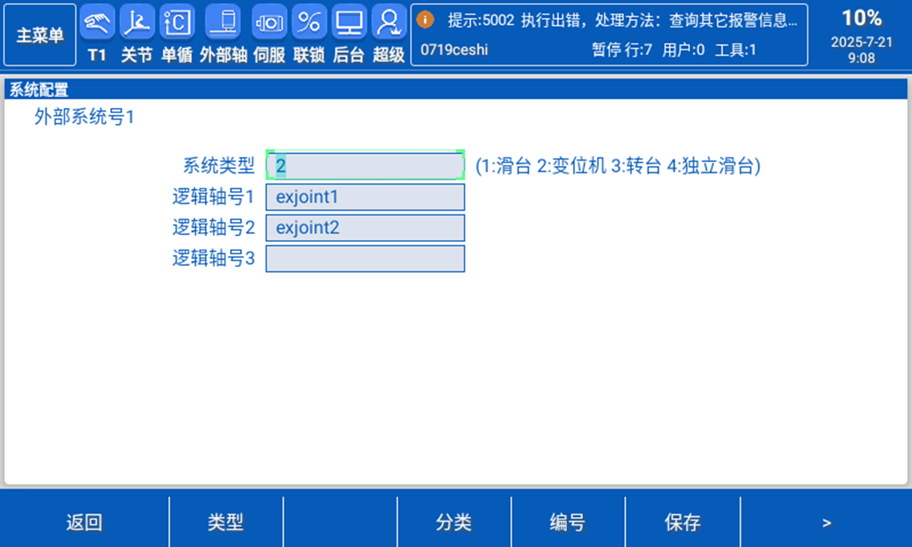

图 8\-264部轴系统配置界面

参数说明

系统类型：

支持1：滑台2：变位机3：转台4：独立滑台。

逻辑轴号1：

通过外部轴配置识别，不可编辑。

逻辑轴号2：

通过外部轴配置识别，不可编辑。

逻辑轴号3：

通过外部轴配置识别，不可编辑。

### 滑台标定

滑台坐标系标定前请先标定工具坐标系，确定出工具TCP点（详见2\.2\.2设定工具坐标系说明）。当前基于滑台的应用，通常是将机器人坐立在滑台上，机器人与滑台联动完成一组动作来实现具体的功能。默认的滑台坐标系在滑台零位上，与机器人直角坐标系重合，使用滑台前必须标定滑台坐标系。标定完成后滑台的运动方向为滑台坐标系的X轴方向。

假设某机器人系统的第8轴为滑台，在关节坐标系下轴运动滑台时，按下滑台所对应的轴运动键【Y\+（J2）】键，滑台沿滑台坐标系X轴正向运动，按下【Y\-（J2）】键，滑台沿其滑台坐标系X轴负向运动，关节坐标系下轴运动滑台，机器人各关节不动。在直角坐标系下，轴运动滑台，按下滑台所对应的轴运动键【Y\+（J2）】键，滑台沿滑台坐标系X轴正向运动，同时机器人各关节运动以保证工具TCP点相对于空间某参照点不动；按下【Y\-（J2）】键，滑台沿其滑台坐标系X轴负向运动，同时机器人各关节运动以保证工具TCP点相对于空间某参照点不动。

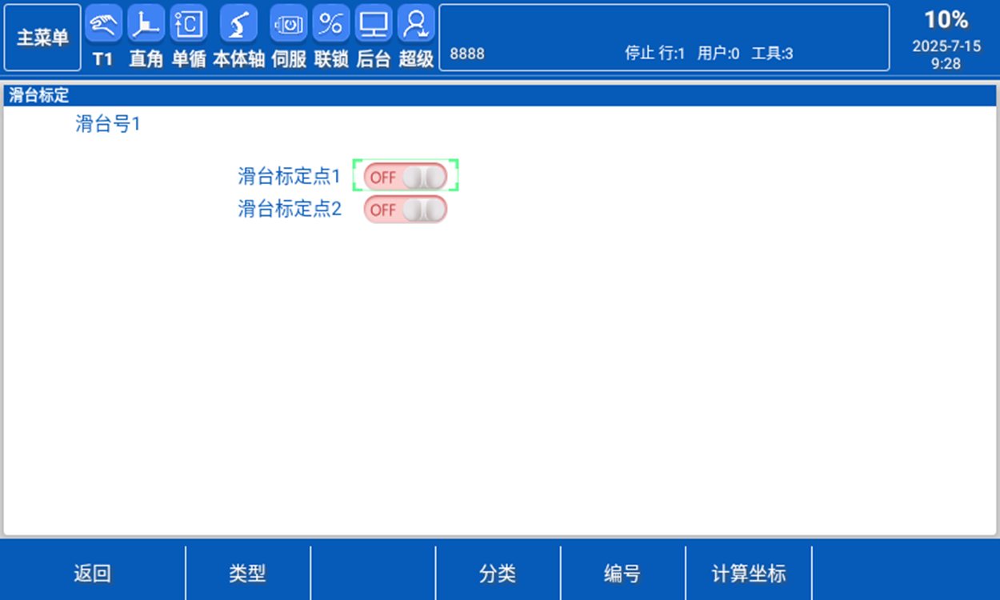

图8\-265滑台标定

滑台坐标系的标定操作步骤：

1. 点击主菜单【系统设置】\-【外部轴】\-【滑台标定】,进入滑台标定界面。滑台号1\-6，最多可标定6个坐标系。
2. 将工具中心点对准滑台上的参考点，按OFF键标定第一点，该点的状态随即切换至ON。改变滑台位置，切换关节坐标和外部轴系统正方向移动要标定的滑台轴一段距离，其它外部轴不动，然后切换回直角坐标和本体轴系统使用直角坐标系改变机器人XYZ坐标值，（不可改变机器人Rx，Ry，Rz坐标值），使工具中心点仍对准滑台上的参考点，标定第二点，按\[计算坐标]，保存上两个标定点的坐标，滑台被标定。

| **注意：****标定过程中改变滑台位置时必须正方向运动滑台到第二个点。****滑台标定尽量选择较远的距离，否则影响精度。** |
| --- |

验证滑台坐标系标定成功的方法：

前提是已正确标定出工具坐标系和滑台坐标系。

1. 空间任意找一参考点，移动机器人TCP点对准该参考点；
2. 示教模式下切换到直角坐标系，按下示教器\[轴组]键切换到外部轴；
3. 先伺服上电，同时按下Deadman键和轴运动键（滑台所对应的轴）进行滑台轴运动，若机器人TCP点始终对准空间上的参考点，则滑台坐标系标定正确。

### 滑台设定

滑台坐标系的设定步骤：

若已知滑台坐标系相对于机器人工具坐标系的变换关系，则可以直接设定滑台坐标系。其含义与标定一致，只是实现的方式不同。

1. 点击主菜单【系统设置】\-【外部轴】\-【滑台设定】,进入滑台设定界面。
2. 输入设置值，按保存。

图8\-266滑台设定

### 转台设定

若已知转台坐标系相对于机器人直角坐标系的变换关系，则可以直接设定转台坐标系。默认的转台坐标系与机器人直角坐标系重合，在使用转台时根据情况设定转台坐标系。转台号有1\-6，根据外部轴是转台，依次根据轴号进行设定。当前基于转台的应用，通常是将机器人固定在转台上，机器人与转台联动完成一组动作来实现具体的功能。

点击主菜单【系统设置】\-【外部轴】\-【转台设定】,进入转台设定界面。

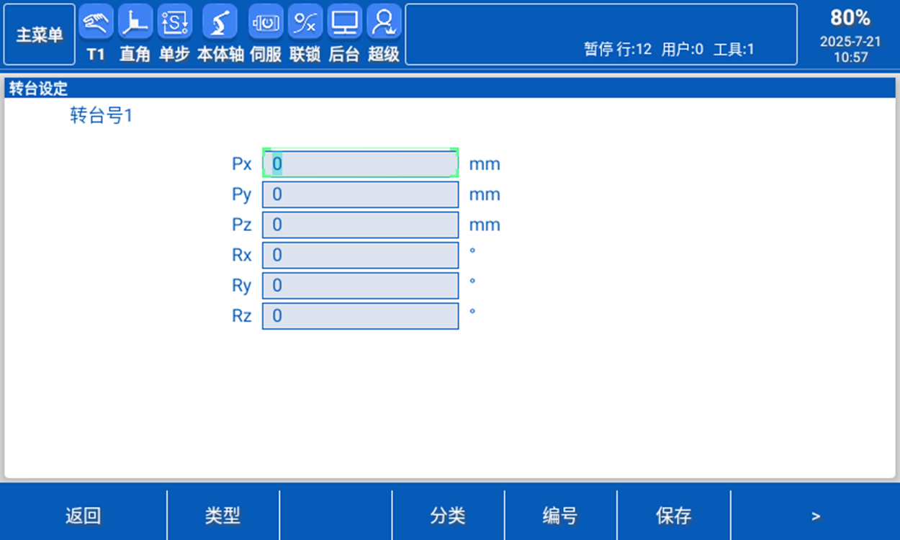

图8\-267转台设定

### 变位机标定

标定变位机前请先建立工具坐标系，确定出工具的TCP点。默认的变位机坐标系与机器人直角坐标系重合，在使用变位机前必须标定变位机坐标系。若是多轴变位机，则每个轴都需要标定或设定坐标系，变位机各轴坐标系的Z轴垂直于变位机的各个面。坐标系创建完成后，各轴变位机绕其坐标系的Z轴进行转动。

单轴变位机标定操作步骤：

1. 点击主菜单【系统设置】\-【外部轴】\-【变位机标定】,进入变位机标定界面。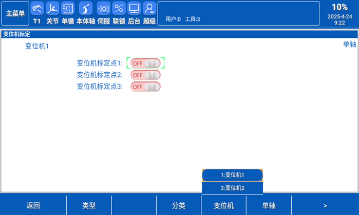

图 8\-368位机标定界面

1. 变位机标定方法：将工具中心点对准变位机上的参考点，标定第一点，该点的状态随即切换至ON。切换为关节坐标和外部轴系统，正方向运动改变当前标定节点变位机角度（其他非标定节点禁止运动），旋转角度大于20度，切换回直角坐标和本体轴系统再移动机器人本体，使用直角坐标改变机器人XYZ坐标值，（不可改变机器人Rx，Ry，Rz坐标值），使工具中心点仍对准参考点，依次标定其余两点，按保存，变位机被标定。

**双轴变位机的标定操作步骤：**

1. 点击主菜单【系统设置】\-【外部轴】\-【变位机标定】,进入变位机标定界面。
2. 点击【下一页】\-【双轴】即可进入双轴变位机标定界面。

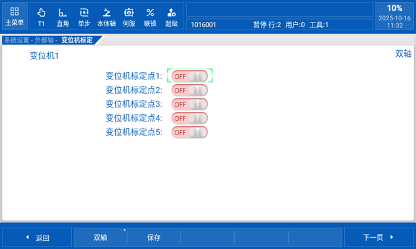

图 8\-369轴变位机标定界面

| **注意：****当配置双轴变位机时，需要把主动轴（一般是翻转轴）设置为逻辑轴1，把从动轴（一般旋转轴）设置为逻辑轴2。** |
| --- |

1. 变位机标定方法：

整个标定过程，机器人的Rx，Ry，Rz值都不可以改变，所以需要以一个适合的初始姿态，保证标定两个轴时，姿态都能保持一致。首先标定主动轴的3个点，将工具中心点对准变位机上主动轴（逻辑轴1）的参考点，标定第一点，该点的状态随即切换至ON。切换为关节坐标和外部轴系统，正方向运动改变当前标定节点变位机角度（其他非标定节点禁止运动），旋转角度大于20度，切换回直角坐标和本体轴系统再移动机器人本体，使用直角坐标改变机器人XYZ坐标值，（不可改变机器人Rx，Ry，Rz坐标值），使工具中心点仍对准主动参考点，依次标定第二、三点。

同样的方法，标定随动轴（逻辑轴2）：切换为关节坐标和外部轴系统，正方向运动改变随动轴变位机角度（其他非标定节点禁止运动），在不改变机器人Rx,Ry,Rz情况下，将工具中心点对准变位机上随动轴（逻辑轴2）的参考点，标定第四点，该点的状态随即切换至ON。切换为关节坐标和外部轴系统，正方向运动改变随动轴变位机角度（其他非标定节点禁止运动），旋转角度大于20度，切换回直角坐标和本体轴系统再移动机器人本体，使用直角坐标改变机器人XYZ坐标值，（不可改变机器人Rx，Ry，Rz坐标值），使工具中心点仍对准随动参考点，标定第五点。

| **注意：****这里的主动轴在运动时会改变随动轴的位置，但是随动轴移动时，主动轴不会跟随移动，逻辑上，主动轴是随动轴的父节点，所以设置时，主动轴必须是逻辑轴1，随动轴必须是逻辑轴2。** |
| --- |

验证变位机坐标系标定成功的方法：

前提是已正确标定出工具坐标系和变位机坐标系。

1. 变位机上找一参考点，移动机器人TCP点对准该参考点；
2. 示教模式下切换到直角坐标系，按下示教器【外部轴】键切换到外部轴；
3. 先伺服上电，同时按下Deadman键和轴运动键（变位机所对应的轴）进行变位机轴运动，若机器人TCP点始终对准变位机上的参考点，则变位机坐标系标定正确。
4. 变位机标定尽量选择较远的距离，否则影响精度。

### 变位机设定

若已知变位机坐标系相对于机器人直角坐标系的变换关系，则可以直接设定变位机坐标系。其含义与标定一致，只是实现的方式不同。

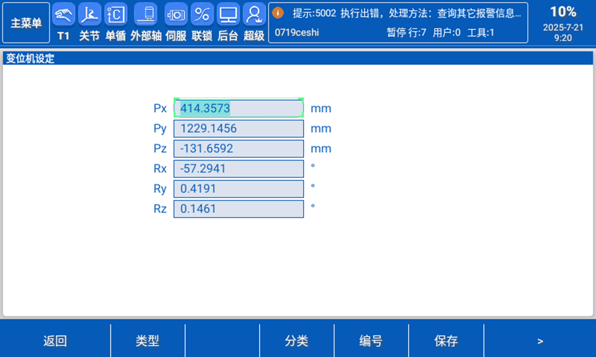

图 8\-370位机设定界面

变位机系统坐标系设置步骤：

1. 点击主菜单【系统设置】\-【外部轴】\-【变位机设定】,进入变位机设定界面。
2. 按照给定值，设定变为坐标系，按保存键。

### 外部轴参数的设定

**外部轴校零：**

使用零位单轴校零的方式实现（详见8\.5零位说明）。外部轴的零位可以标定在任意位置， 校零前先清除外部轴驱动器码盘圈数。

外部轴校零后，记录零位码盘值、贴零位标签或记号用以在机械件上记录零位位置，便于在零位丢失时找回零位。

**外部轴零位设定：**

使用零位设定的方式实现（详见8\.5零位说明）。使用在外部轴校零后，记录下的零位码盘值对外部轴零位进行设定。

## 零位

零位的含义：机器人进行位置运算使用关节值等相对数值，相对数值的基准就是零位码盘值。将电机的哪个位置（编码器数值）设定为零位码盘值的过程就是校零。零位码盘值设定的合适位置应该尽可能与软件中使用的虚拟模型对应上，即保证一些平行和垂直的关系。

机器人现在的位置，通过各轴的脉冲编码器计数值来确定。

重新校零即改变软件的计算基准，结果是导致已经示教好的作业的本体实际位置点发生改变。

工厂出货时，已经对机器人零位进行零位标定，所以在日常操作中并不需要进行零位标定。但是下列情况，则需要零位标定。

机器人在哪个位置进行校零不明确的，可根据《新松工业机器人安装及维护手册》进行操作。

**注意：在教零时，需要松开使能按键。**

表8\-1 下列情况需要重新校零

| 以下情况需要重新校零 | 所用的方法 |
| --- | --- |
| 改变机器人与控制柜的组合后 | 零位设定，不论机器人在什么位置，直接输入数值。 |
| 更换主板或更换CF卡。 | 零位设定，不论机器人在什么位置，直接输入数值。 |
| 驱动器码盘报警，码盘圈数清零后。 | 对准工具（机械）校零位置或零位标签，进行码盘清除。 |
| 拆装、更换电机、减速机、机械传动部件后。 | 对零位标签/对准工具（机械）校零位置的方式用单轴校零/全轴校零。使用专业的校零工具，进行单轴校零/全轴校零。 |
| 当机器人发生碰撞后，造成编码器和轴角度偏移时。 | 对零位标签/对准工具（机械）校零位置的方式用单轴校零/全轴校零。使用专业的校零工具，进行单轴校零/全轴校零。 |
| 本体内码盘电池没电或码盘供电线路有过断开时，驱动器因为码盘圈数丢失报警。（注：电池电压下降时，系统会发生报警通知客户。） | 解除报警后，对准工具（机械）校零位置或零位标签，进行码盘清除。 |

表8\-2 零位标定的种类

| 零位标定操作 | 含义及内容 |
| --- | --- |
| 全轴校零 | 把机器人全部轴一起进行零位校准。通过零位标签/对准工具（机械）校零位置，将机器人所有轴移动到对齐位置。 |
| 单轴校零 | 把机器人单个轴进行零位校准。通过零位标签/对准工具（机械）校零位置，将机器人所有轴移动到对齐位置。 |
| 零位设定 | 把本体上的零位码盘标签的数值，填写到零位设定中。 |

零位码盘标签放在机器人本体一轴上，格式如下：

表8\-3零位标签

| 本体号 | SN0000001 |
| --- | --- |
| 控制柜号 | SN0000001 |
| 零位码盘数值 | |
| 1轴 | 10000 |
| 2轴 | 10005 |
| 3轴 | 22222 |
| 4轴 | 33333 |
| 5轴 | 44444 |
| 6轴 | 55555 |

### 零位标定

全轴校零步骤：

1. 移动机器人到零位标签对齐的位置。

| **注意：因为一些型号机器人4轴、6轴可移动范围为360度，移动4、6轴前需要确定4轴的当前位置，4轴应该向“使零位标签对齐且旋转角度不要差360度”的方向旋转。** |
| --- |

1. 点击主菜单【系统参数】\-【零位】\-【校零】进入校零界面，在校零方式处选择全轴校零，并确认校零，即可完成校准工作。

图 8\-371零界面

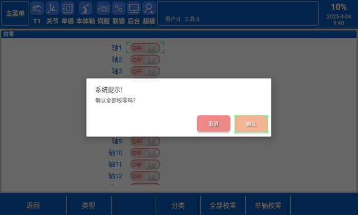

图 8\-372零界面

1. 校零成功后，需要重新启动机器人。进入【系统设置】\-【零位】\-【零位设定】界面,记录下零位码盘,方便下次进行零位设定。

| **注意：****一些特殊机型较完零后个别轴关节值不是0。可在表9\-4查看特殊机型。****其它机型校零后关节值都为0。****校零成功后，需要重新启动机器人，设置才能生效。** |
| --- |

单轴校零步骤：

| **注意：由于机器人部分结构采用的是随动结构，所以在单轴校零的时候要按从小到大的顺序单轴校零，例如需要对4、5、6轴进行单轴校零，则需先对4轴单轴校零，在对5轴进行校零、最后对6轴进行校零，不按照从小到大的顺序单轴校零，可能造成零位不准。** |
| --- |

1. 将需要校零的轴，手动调整至零位标签对齐。
2. 点击主菜单【系统设置】\-【零位】\-【校零】进入校零界面，选择单轴校零，点击需要校准的轴后面的OFF按钮，变成ON后，即可单轴校零。

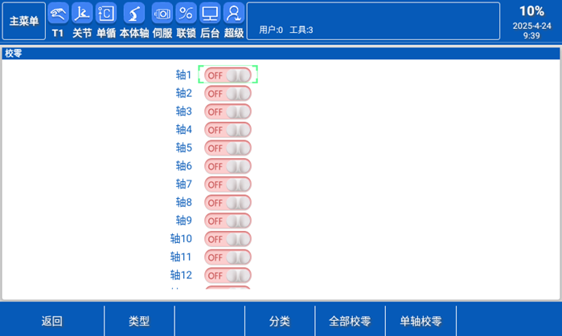

图 8\-373轴校零界面

1. 校零成功后，需要重新启动机器人，进入【系统设置】\-【校零】\-【零位设定】界面,记录下零位码盘,更新到零位标签上，方便下次进行零位设定。

| **注意：****校零成功后，需要重新启动机器人，设置才能生效。** |
| --- |

### 零位设定

零位设定需要将零位标签的码盘数值对应输入。

零位设定步骤：

1. 查看机器人腰座上的零位码盘值标签。
2. 进入【系统参数】\-【校零】\-【零位设定】界面，按照码盘标签上的码盘值来输入。

图 8\-374位设置

1. 输入完成并按【保存】。

### 码盘清除

有时会遇到驱动器因故导致码盘丢失报警的情况。造成驱动器码盘报警的原因可能为本体码盘电池没电、不正确的更换电池等，在这种情况下，需要结合零位标签、零位设定等多种方法，恢复机器人的原来零位。

码盘清除是把电机的码盘圈数清除，码盘清除分为：单轴清除、全部所有轴清除。

码盘清除操作步骤：

1. 首先需要将机器人运行到各轴零位标签对齐的位置，按照下面方法清除电机的码盘圈数：点击主菜单【系统设置】\-【零位】\-【码盘清除】，进入码盘清除界面。

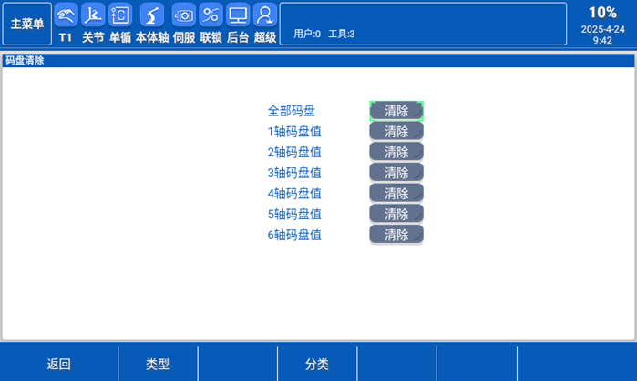

图 8\-375盘清除界面

1. 选择要清除的轴或者全部，并点击后面对应的按钮，会提示“是否清除全部码盘”或“是否清除轴n码盘”（n为对应的轴），再次点击【确定】按钮，会清除相应的码盘值。
2. 重启机器人后生效。

| **注意：****由于机器人部分结构采用的是随动结构，所以在单轴码盘清除的时候要按从小到大的顺序，例如需要对4、5、6轴进行单轴码盘清除，则需先对4轴单轴清除码盘，在对5轴进行码盘清除、最后对6轴进行码盘清除，不按照从小到大的顺序码盘清除，会造成零位不准。如对6轴进行码盘清除，需要把4,5轴移动到零位。如对5轴进行清除码盘，需要把4轴移动到零位。** |
| --- |

## 设置机器人IP

机器人控制器连接上位机、离线软件、视觉系统、PLC等，需要设置机器人IP。

设置机器人IP步骤：

1. 点击主菜单【用户配置】\-【设置IP】，进入设置IP界面。

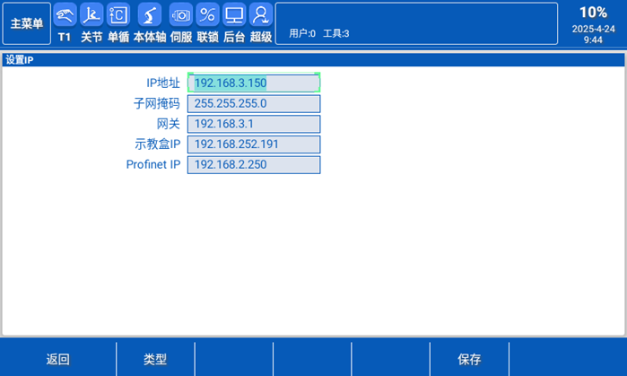

图 8\-376置机器人IP界面

1. 填好机器人IP，按保存。

## 语言设置

目前新松机器人示教器只支持中文。

设置语言操作步骤：

1. 点击主菜单【示教盒设置】页面,对语言类型进行选择。

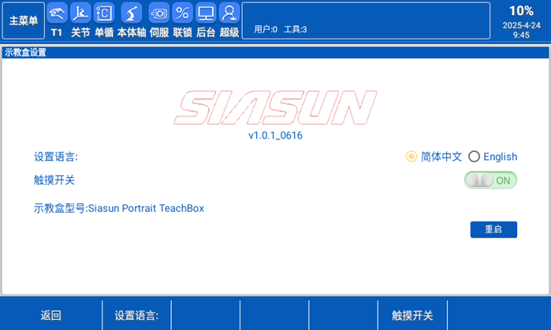.

图 8\-377教盒设置界面

1. 选择所需语言后，根据弹出的提示框来确认是否切换语言并重启，确认后示教器讲重启并切换到用户选择的语言。

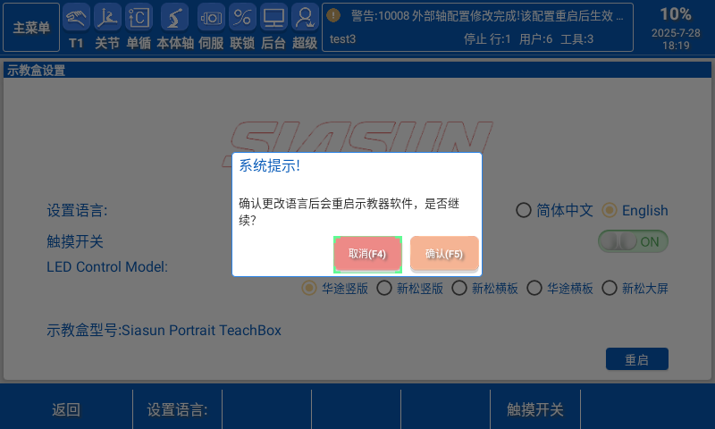

图 8\-478换语言确认界面

## 更换CFast卡

当机器人需要软件版本升级或者变更时，需要更换CF卡。在更换CFast卡之前，需要配置机器人信息，新卡插入机器人后，需要进行相应的配置。

机器人备份信息步骤：

1. 更换机器人CFast之前,应先对机器人各项参数进行备份.将原厂自带U盘插入USB接口.点击主菜单【备份恢复】。将此菜单下的各项子菜单内容全部进行备份，并将作业单独上传。

| **注意：备份信息请使用新松原厂自带的U盘，以保证数据安全，同时保证板卡安全。** |
| --- |

1. 插入U盘后，进入到备份的菜单，会提示系统挂载成功。

| 按这里弹出CFast卡USB接口 |
| --- |

图 8\-479板接口位置

1. 然后分别备份【参数】【全局变量】【作业备份】这三个界面的全部内容 (建议最好全部备份) 。

 

图 8\-480器人各项备份界面

| **注意：参数、位置变量、作业上传这三个界面的参数建议全部备份。** |
| --- |

1. 点击【作业上传】，按作业名分别上传每个作业（建议作业最好单个备份）。

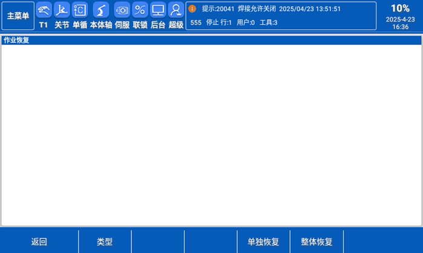

图 8\-481器人上传作业菜单

1. 进入【系统设置】\-【零位】\-【零位设定】界面，记录机器人零位码盘值（建议拍照存档）。

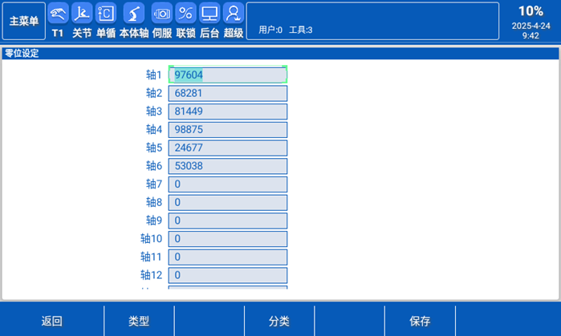

图 8\-482器人零位位置界面

1. 点击【系统设置】\-【应用配置】，输入密码“sysiasun”，进入应用配置界面，查看之前是否配置过应用（建议拍照存档）。

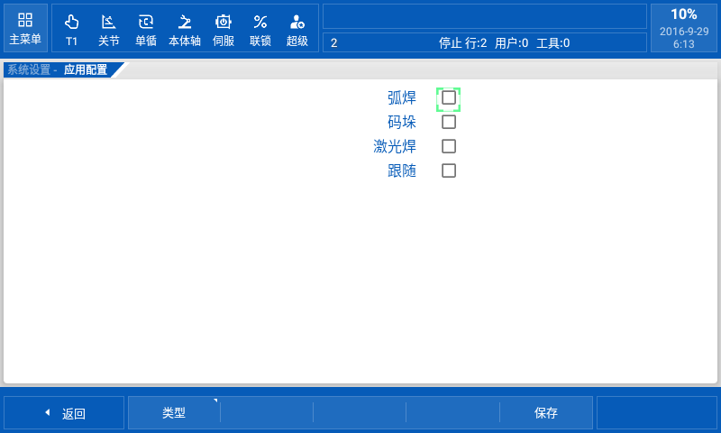

图 8\-483用配置界面

1. 点击【系统设置】\-【型号配置】，输入密码“sysiasun”，进入机器人型号配置界面。查看对应的型号。（建议拍照存档）

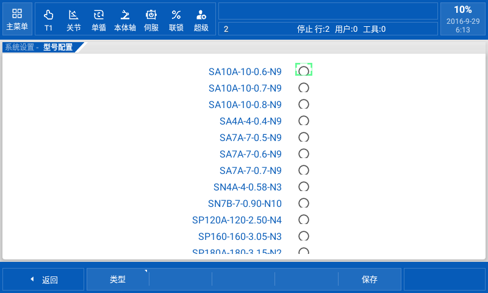

图 8\-484器人型号配置界面

机器人更换CFast卡步骤：

1. 将机器人电源关闭，打开控制柜门，将CFast卡拔出，并插入新卡。开机进入【超级用户】。
2. 将之前备份好参数的U盘插入主板，点击主菜单【备份恢复】，进入【参数】界面，单击系统参数的【恢复】按钮恢复系统参数。看到系统参数恢复成功提示后，重新启动机器人。重启后请查看机器人型号，是否与之前备份的型号一致。一致为系统参数恢复成功。

图 8\-485统参数恢复界面

1. 点击主菜单【系统设置】\-【柜体配置】，输入密码“sysiasun”，进入机器人控制柜型号配置界面。选择对应的型号，点击【保存】。提示成功后，重新启动机器人。

图 8\-486制柜型号配置界面

1. 点击主菜单【备份恢复】，进入【参数】界面，单击用户参数的【恢复】按钮恢复用户参数。看到用户参数恢复成功提示后，重新启动机器人。

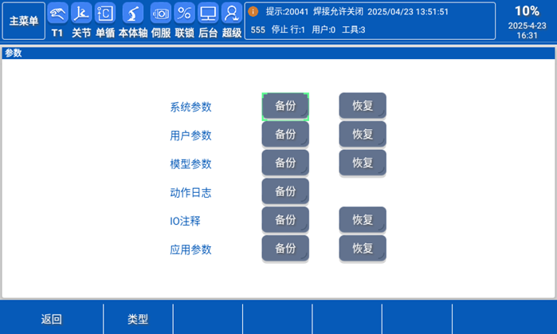

图 8\-488户参数恢复界面

1. 最后恢复动态参数、恢复位置变量、单个恢复作业，并重启机器人。

| **注意：以上步骤全部完成后，先查看一下机器人零位，查看与机器人本体上的标签数值是否相同。恢复作业后，要手动、慢速仔细检查每一行指令，在自动运行之前一定要确保安全。** |
| --- |

# 附录

## 基础指令表

### 运动类

| MOVJ | 功能 | 关节运动指令 | |
| --- | --- | --- | --- |
| 格式 | MOVJ P\[值]\\PR\[值] V \= \<参数2\> ACC \= \<参数3\> CNT \= \<参数4\> \\ FINE | |
| 说明 | 参数1 | P\[值]\\PR\[值] 位置变量号。 |
| 参数2 | 关节运动的运行速度，单位%，范围1\-100。 |
| 参数3 | 最大加速度百分比，单位：%，范围1\-120。 |
| 参数4 | CNT :轨迹连续的逼近等级，可输入0\-100。 \\FINE:关节运动精准到达。 |
| 举例 | MOVJ P\[1] V \= 100 ACC \= 20 CNT \= 1 | |

| MOVL | 功能 | 直线运动指令 | |
| --- | --- | --- | --- |
| 格式 | MOVL P\[值]\\PR\[值] V \= \<参数2\> ACC \= \<参数3\> CNT \= \<参数4\> \\ FINE | |
| 说明 | 参数1 | P\[值]\\PR\[值] 位置变量号。 |
| 参数2 | 直线运动的运行速度，单位mm/s，范围0\.1\-2500。 |
| 参数3 | 最大加速度百分比，单位：%，范围1\-120。 |
| 参数4 | CNT :轨迹连续的逼近等级，可输入0\-100。 \\FINE:关节运动精准到达。 |
| 举例 | MOVL P\[1] V \= 100 ACC \= 20 CNT \= 1 | |

| MOVC | 功能 | 圆弧运动指令 | |
| --- | --- | --- | --- |
| 格式 | MOVL P\[值]\\PR\[值] V \= \<参数2\> ACC \= \<参数3\> CNT \= \<参数4\> \\ FINE | |
| 说明 | 参数1 | P\[值]\\PR\[值] 位置变量号。 |
| 参数2 | 圆弧运动的运行速度，单位mm/s，范围0\.1\-2500。 |
| 参数3 | 最大加速度百分比，单位：%，范围1\-120。 |
| 参数4 | CNT :轨迹连续的逼近等级，可输入0\-100。 \\FINE:关节运动精准到达。 |
| 举例 | MOVL P\[1] V \= 100 ACC \= 20 CNT \= 1 | |

### 基础指令

| SET | 功能 | 赋值指令 | |
| --- | --- | --- | --- |
| 格式 | SET \<参数1\> \<参数2\> | |
| 说明 | 参数1 | I\[]：32位整型变量 |
| H\[]：16位整型变量 |
| B\[]：8位整型变量 |
| R\[]：64位浮点型变量 |
| P\[]：位姿变量，能直接赋值 |
| S\[]：字符型变量，能直接赋值 |
| P\[].X P\[].Y P\[].ZP\[].roll P\[].pitch P\[].yaw |
| P\[].j1 P\[].j2 P\[].j3P\[].j4 P\[].j5 P\[].j6 |
| P\[].e1 P\[].e2 P\[].e3P\[].e4 P\[].e5 P\[].e6 |
| 参数2 | 常数 |
| I\[]：32位整型变量 |
| H\[]：16位整型变量 |
| B\[]：8位整型变量 |
| R\[]：64位浮点型变量 |
| P\[]：位姿变量，能直接赋值 |
| S\[]：字符型变量，能直接赋值 |
| P\[].X P\[].Y P\[].ZP\[].roll P\[].pitch P\[].yaw |
| P\[].j1 P\[].j2 P\[].j3P\[].j4 P\[].j5 P\[].j6 |
| P\[].e1 P\[].e2 P\[].e3P\[].e4 P\[].e5 P\[].e6 |
| 举例 | SET I\[1] I\[3]SET R\[I\[1]] 5 | |
| 注：P指令只能与P做赋值运算。 | | | |

SETP 指令：

修改P\[]\\PR\[]变量的MWORD值或坐标系号。

| SETP | 功能 | 修改P\[]\\PR\[]变量的MWORD值或坐标系号，修改mword前三个值，代表关节配置。 | |
| --- | --- | --- | --- |
| 格式 | SETP \<参数1\> \<参数2\> | |
| 说明 | 参数1 | P\[值]/PR\[值] |
| 参数2 | CFG ：关节配置，三个字母分别代表5、3、1轴的控制点位于控制面的哪一侧。 |
| 参数3 | F U TN U TF D TF U BN D TF D BN U BN D B注释： 1、FLIP\\NOFLIP,代表手腕的上下；2、UP\\DOWN,代表手臂的上下；3、BACK\\FRONT代表手臂的前后。具体位姿见下图。 |
| 每一个字母代表的位姿图片 |  |
| 举例 | SETP P\[1] CFG FUT | |

| SETP | 功能 | 修改P\[]\\PR\[]变量的MWORD值或坐标系号，修改mword后三个值，代表回转数 | |
| --- | --- | --- | --- |
| 格式 | SETP \<参数1\> \<参数2\> | |
| 说明 | 参数1 | P\[值]/PR\[值] |
| 参数2 | TN ：回转数 |
| 参数3 | 1:1 J1轴2:4 J4轴3:6 J6轴 |
| 参数4 | \-1：关节在\-540°到\-180°之间取值。0：关节在\-180°到180°区间取值。1：关节在180°到540°之间取值。 |
| 举例 | SETP PR\[1] TN 1 1 | |

| STEP | 功能 | 修改P\[]\\PR\[]变量的MWORD值或这坐标系号，修改坐标系号 | |
| --- | --- | --- | --- |
| 格式 | SETP \<参数1\> \<参数2\> | |
| 说明 | 参数1 | P\[值]/PR\[值] |
| 参数2 | FRAME |
| 参数3 | TF 工具坐标系号UF 用户坐标系号ET 外部工具坐标系号 |
| 参数4 | 常数I\[]：32位整型变量H\[]：16位整型变量B\[]：8位整型变量 |
| 举例 | SETP P\[1] FRAME TF 1 | |

| SETFRAME | 功能 | 切换坐标系指令。 | |
| --- | --- | --- | --- |
| 格式 | SETFRAME \<参数1\> | |
| 说明 | 参数1 | TF 工具坐标系号（1\-8） |
| 参数2 | UF 用户坐标系号（1\-8） |
| 参数3 | ET 外部工具坐标系号（1\-8） |
| 举例 | SETFRAME TF 1 | |

| GETP | 功能 | 获取当前位置信息，保存到P\[值]/PR\[值]变量中。 | |
| --- | --- | --- | --- |
| 格式 | GETP \<参数1\> | |
| 说明 | 参数1 | P\[常数]/PR\[常数] |
| 举例 | GETP PR\[1] | |

| SETEXTAXIS | 功能 | 对一个位置变量P\[]/PR\[]中的一个外部轴进行赋值。 | |
| --- | --- | --- | --- |
| 格式 | SETEXTAXIS \<参数1\> \<参数2\> \<参数3\> | |
| 说明 | 参数1 | P\[值]/PR\[值] |
| 参数2 | e\[] |
| 参数3 | 常数I\[]：32位整型变量H\[]：16位整型变量B\[]：8位整型变量R\[]：64位浮点型变量 |
| 举例 | SETEXTAXIS P\[1] e1 50 | |
| 注：通过此指令变更外部轴关节值，保证tcp不变得情况下，机器人会发生轨迹变化。 | | | |

| CLEAR | 功能 | 清空指定范围的变量值。 | |
| --- | --- | --- | --- |
| 格式 | CLEAR \<参数1\> \<参数2\> | |
| 说明 | 参数1 | I\[]：32位整型变量H\[]：16位整型变量B\[]：8位整型变量R\[]：64位浮点型变量 |
| 参数2 | I\[]：32位整型变量H\[]：16位整型变量B\[]：8位整型变量R\[]：64位浮点型变量 |
| 举例 | CLEAR I\[1] I\[100]CLEAR B\[I\[1]] B\[I\[100]] | |
| 注：此指令参数1与参数2必须为同类型变量 | | | |

| STRLEN | 功能 | 将参数1的长度值，存入参数2中。 | |
| --- | --- | --- | --- |
| 格式 | STRLEN \<参数1\> \<参数2\> | |
| 说明 | 参数1 | S\[常数]/S\[I\[常数]]直接/间接S\[]:字符型变量，能直接赋值 |
| 参数2 | I\[常数]/I\[I\[常数]]直接/间接I\[]：32位整型变量 |
| 举例 | STRLEN S\[1] I\[1]STRLEN S\[I\[2]] I\[I\[2]] | |

| STRFIND | 功能 | 查找部分字符串，从参数1中查找参数2出现的索引值，结果放参数3中。 | |
| --- | --- | --- | --- |
| 格式 | STRFIND \<参数1\> \<参数2\> \<参数3\> | |
| 说明 | 参数1 | S\[常数]/S\[I\[常数]]直接/间接S:字符型变量，能直接赋值 |
| 参数2 | S\[常数]/S\[I\[常数]]直接/间接S:字符型变量，能直接赋值 |
|  | 参数3 | I\[常数]/I\[I\[常数]]直接/间接I：32位整型变量 |
| 举例 | STRFIND S\[1] S\[10] I\[1]STRFIND S\[I\[1]] S\[I\[1]] I\[I\[2]] | |

| STRSUB | 功能 | 获取部分字符串，从参数1中获取参数2与参数3长度的字符串，结果放参数4中。 | |
| --- | --- | --- | --- |
| 格式 | STRSUB \<参数1\> \<参数2\> \<参数3\> \<参数4\> | |
| 说明 | 参数1 | S\[常数]/S\[I\[常数]]直接/间接S:字符型变量，能直接赋值 |
| 参数2 | I\[常数]/I\[I\[常数]]直接/间接I：32位整型变量 |
| 参数3 | I\[常数]/I\[I\[常数]]直接/间接I：32位整型变量 |
| 参数4 | S\[常数]/S\[I\[常数]]直接/间接S:字符型变量，能直接赋值 |
| 举例 | STRSUB S\[1] I\[1] I\[2] S\[2]STRSUB S\[I\[1]] I\[I\[2]] I\[I\[3]] S\[I\[2] | |

| STRCMP | 功能 | 字符串比较，从参数1与参数2进行比较，结果放参数3。比较结果相同为1，不同为0。 | |
| --- | --- | --- | --- |
| 格式 | STRCMP \<参数1\> \<参数2\> \<参数3\> | |
| 说明 | 参数1 | S\[常数]/S\[I\[常数]]直接/间接S:字符型变量，能直接赋值 |
| 参数2 | S\[常数]/S\[I\[常数]]直接/间接S:字符型变量，能直接赋值 |
| 参数3 | I\[常数]/I\[I\[常数]]直接/间接I：32位整型变量 |
| 举例 | STRCMP S\[1] S\[2] I\[1] STRCMP S\[I\[1]] S\[I\[2]] I\[I\[2]] | |

| GETAT | 功能 | 获取字符串单个字符，将参数1中索引为参数2的字符放到参数3中。 | |
| --- | --- | --- | --- |
| 格式 | STRCMP \<参数1\> \<参数2\> \<参数3\> | |
| 说明 | 参数1 | S\[常数]/S\[I\[常数]]直接/间接S:字符型变量，能直接赋值 |
| 参数2 | I\[常数]/I\[I\[常数]]直接/间接I：32位整型变量 |
| 参数3 | S\[常数]/S\[I\[常数]]直接/间接S:字符型变量，能直接赋值 |
| 举例 | GETAT S\[1] I\[1] S\[2] GETAT S\[I\[1]] I\[I\[1]] S\[I\[2]] | |

| STRFINDEND | 功能 | 字符串逆向查找，以逆序从参数1中查找参数2，并将参数2出现的索引存入参数3 | |
| --- | --- | --- | --- |
| 格式 | STRFINDEND \<参数1\> \<参数2\> \<参数3\> | |
| 说明 | 参数1 | S\[常数]/S\[I\[常数]]直接/间接S:字符型变量，能直接赋值 |
| 参数2 | S\[常数]/S\[I\[常数]]直接/间接S:字符型变量，能直接赋值 |
| 参数3 | I\[常数]/I\[I\[常数]]直接/间接I：32位整型变量 |
| 举例 | STRFINDEND S\[1] S\[1] I\[1] STRFINDEND S\[I\[1]] S\[I\[1]] I\[I\[1]] | |

| STRREVERSE | 功能 | 字符串翻转功能,翻转参数1内容并存储到参数2。 | |
| --- | --- | --- | --- |
| 格式 | STRREVERSE \<参数1\> \<参数2\> | |
| 说明 | 参数1 | S\[常数]/S\[I\[常数]]直接/间接S\[]:字符型变量，能直接赋值 |
| 参数2 | S\[常数]/S\[I\[常数]]直接/间接S\[]:字符型变量，能直接赋值 |
| 举例 | STRREVERSE S\[1] S\[1]STRREVERSE S\[I\[2]] S\[I\[2]] | |

| STRSPLIT | 功能 | 字符串分割功能，将参数1为源字符串，以参数2为分隔符分割，分割结果为一个字符串数组，存储在参数3为起始索引的若干个局部字符串变量中参数4为分割后的字符串数量 | |
| --- | --- | --- | --- |
| 格式 | STRSPLIT \<参数1\> \<参数2\> \<参数3\> \<参数4\> | |
| 说明 | 参数1 | S\[常数]/S\[I\[常数]]直接/间接S:字符型变量，能直接赋值 |
| 参数2 | S\[常数]/S\[I\[常数]]直接/间接S:字符型变量，能直接赋值 |
| 参数3 | 常数 |
| 参数4 | I\[常数]/I\[I\[常数]]直接/间接I：32位整型变量 |
| 举例 | STRSPLIT S\[1] S\[1] 0 I\[1]STRSPLIT S\[I\[1]] S\[I\[1]] 0 1\[I\[1]] | |

| SPRINTF | 功能 | 字符串格式化功能,将参数1之后的内容合并成一个字符串，并存储到参数1中。 | |
| --- | --- | --- | --- |
| 格式 | SPRINTF \<参数1\> \<参数2\> | |
| 说明 | 参数1 | S\[常数]/S\[I\[常数]]直接/间接S\[]:字符型变量，能直接赋值 |
| 参数2 | S\[常数]/S\[I\[常数]]直接/间接S\[]:字符型变量，能直接赋值 |
| 举例 | SPRINTF S\[1] S\[2]SPRINTF S\[I\[1]] S\[I\[2]] | |

| STR2I | 功能 | 将字符串转换成整形。 | |
| --- | --- | --- | --- |
| 格式 | STR2I \<参数1\> \<参数2\> | |
| 说明 | 参数1 | S\[常数]/S\[I\[常数]]直接/间接S\[]:字符型变量，能直接赋值 |
| 参数2 | I\[常数]/I\[I\[常数]]直接/间接 |
| 举例 | STR2I S\[1] I\[1]STR2I S\[I\[1]] I\[I\[2]] | |

| STR2R | 功能 | 将字符串转换成实形。 | |
| --- | --- | --- | --- |
| 格式 | STR2R \<参数1\> \<参数2\> | |
| 说明 | 参数1 | S\[常数]/S\[I\[常数]]直接/间接S\[]:字符型变量，能直接赋值 |
| 参数2 | R\[常数]/R\[I\[常数]]直接/间接 |
| 举例 | STR2I S\[1] R\[1]STR2I S\[I\[1]] R\[I\[2]] | |

| I2STR | 功能 | 将整形转换成字符串。 | |
| --- | --- | --- | --- |
| 格式 | I2STR \<参数1\> \<参数2\> | |
| 说明 | 参数1 | I\[常数]/I\[I\[常数]]直接/间接 |
| 参数2 | S\[常数]/S\[I\[常数]]直接/间接S\[]:字符型变量，能直接赋值 |
| 举例 | I2STR S\[1] I\[1]I2STR S\[I\[1]] R\[I\[2]] | |

| R2STR | 功能 | 将实形转换成字符串。 | |
| --- | --- | --- | --- |
| 格式 | R2STR \<参数1\> \<参数2\> | |
| 说明 | 参数1 | R\[常数]/R\[I\[常数]]直接/间接 |
| 参数2 | S\[常数]/S\[I\[常数]]直接/间接S\[]:字符型变量，能直接赋值 |
| 举例 | R2STR R\[1] S\[1]I2STR S\[I\[1]] R\[I\[2]] | |

### 运算指令

| COP | 功能 | 运算类符合指令，支持各种运算的组合，组合没有长度限制。 | |
| --- | --- | --- | --- |
| 格式 | \<参数1\> \= \<参数2\> \[运算符] \<参数3\> … | |
| 说明 | 参数1 | I\[]：32位整型变量H\[]：16位整型变量B\[]：8位整型变量R\[]：64位浮点型变量S\[]:字符型变量，能直接赋值P\[]：位姿变量，能直接赋值P\[].X P\[].Y P\[].ZP\[].RX P\[].RY P\[].RZP\[].j1 P\[].j2 P\[].j3P\[].j4 P\[].j5 P\[].j6P\[].e1 P\[].e2 P\[].e3P\[].e4 P\[].e5 P\[].e6 |
| 参数2 | 常数I\[]：32位整型变量H\[]：16位整型变量B\[]：8位整型变量R\[]：64位浮点型变量P\[]：位姿变量，能直接赋值P\[].X P\[].Y P\[].ZP\[].RX P\[].RY P\[].RZP\[].j1 P\[].j2 P\[].j3P\[].j4 P\[].j5 P\[].j6P\[].e1 P\[].e2 P\[].e3P\[].e4 P\[].e5 P\[].e6 |
| 运算符 | \+ \- \* / \>\> \<\< \& \| \&\& \|\| ^ | |
| 注释：1．针对P\[1].1轴关节值的修改会修改整个P的姿态值。2\. P只支持\+运算即实现P的增量变换（矩阵运算），如p\[0] \= p\[1] \+ p\[2]。 | | | |

| 运算类型 | 变量类型 |
| --- | --- |
| ADD | 常数I H R B S P P. |
| SUB | 常数I H R B P. |
| MUL | 常数I H R B P. |
| DIV | 常数I H R B P. |
| AND | 常数I H B |
| OR | 常数I H B |
| RIGHTSHIFT | 常数I H B |
| LEFTSHIFT | 常数I H B |
| 例 | I\[1] \= I\[2] \+ I\[3] |

| NOT | 功能 | 按位取反运算。 | |
| --- | --- | --- | --- |
| 格式 | \<参数1\> \= NOT \<参数2\> | |
| 说明 | 参数1 | I：32位整型变量H：16位整型变量B：8位整型变量 |
| 参数2 | 常数I\[]：32位整型变量H\[]：16位整型变量B\[]：8位整型变量R\[]：64位浮点型变量 |
| 举例 | I\[1] \= NOT I\[2] | |
| ATAN | 功能 | 求参数2的反正切值，结果到参数1。 | |
| 格式 | R\[值] \= ATAN \<参数2\> | |
| 说明 | 参数1 | R\[]：64位浮点型变量 |
| 参数2 | 常数I\[]：32位整型变量H\[]：16位整型变量B\[]：8位整型变量R\[]：64位浮点型变量P\[].X P\[].Y P\[].ZP\[].RX P\[].RY P\[].RZP\[].j1 P\[].j2 P\[].j3P\[].j4 P\[].j5 P\[].j6P\[].e1 P\[].e2 P\[].e3P\[].e4 P\[].e5 P\[].e6 |
| 举例 | R\[1] \= ATAN R\[2] | |

| TAN | 功能 | 求参数2的正切值，结果保存到参数1中。 | |
| --- | --- | --- | --- |
| 格式 | R\[值] \= ATAN \<参数2\> | |
| 说明 | 参数1 | R\[]：64位浮点型变量 |
| 参数2 | 常数I\[]：32位整型变量H\[]：16位整型变量B\[]：8位整型变量R\[]：64位浮点型变量P\[].X P\[].Y P\[].ZP\[].RX P\[].RY P\[].RZP\[].j1 P\[].j2 P\[].j3P\[].j4 P\[].j5 P\[].j6P\[].e1 P\[].e2 P\[].e3P\[].e4 P\[].e5 P\[].e6 |
| 举例 | R\[1] \= TAN R\[2] | |

| INV | 功能 | 对P变量取逆。 | |
| --- | --- | --- | --- |
| 格式 | INV \<参数1\> | |
| 说明 | 参数1 | P\[常数] / PR\[I\[常数]]直接 / 间接 |
| 举例 | INV P\[1]INV PR\[1] | |

| SQRT | 功能 | 开平方指令，对参数2进行开方运算，结果存入参数1中。 | |
| --- | --- | --- | --- |
| 格式 | R\[值] \= SQRT \<参数2\> | |
| 说明 | 参数1 | R\[]：64位浮点型变量 |
| 参数2 | 常数I\[]：32位整型变量H\[]：16位整型变量B\[]：8位整型变量R\[]：64位浮点型变量P\[].X P\[].Y P\[].ZP\[].RX P\[].RY P\[].RZP\[].j1 P\[].j2 P\[].j3P\[].j4 P\[].j5 P\[].j6P\[].e1 P\[].e2 P\[].e3P\[].e4 P\[].e5 P\[].e6 |
| 举例 | R\[1] \= SQRT R\[1] | |

| SIN | 功能 | 对参数2进行正弦计算，将得到的结果存入到参数1。 | |
| --- | --- | --- | --- |
| 格式 | R\[值] \= SIN \<参数2\> | |
| 说明 | 参数1 | R\[]：64位浮点型变量 |
| 参数2 | 常数I\[]：32位整型变量H\[]：16位整型变量B\[]：8位整型变量R\[]：64位浮点型变量P\[].X P\[].Y P\[].ZP\[].RX P\[].RY P\[].RZP\[].j1 P\[].j2 P\[].j3P\[].j4 P\[].j5 P\[].j6P\[].e1 P\[].e2 P\[].e3P\[].e4 P\[].e5 P\[].e6 |
| 举例 | R\[1] \= SIN R\[1] | |

| COS | 功能 | 对参数2进行余弦计算，将得到的结果存入参数1。 | |
| --- | --- | --- | --- |
| 格式 | R\[值] \= COS \<参数2\> | |
| 说明 | 参数1 | R\[]：64位浮点型变量 |
| 参数2 | 常数I\[]：32位整型变量H\[]：16位整型变量B\[]：8位整型变量R\[]：64位浮点型变量P\[].X P\[].Y P\[].ZP\[].RX P\[].RY P\[].RZP\[].j1 P\[].j2 P\[].j3P\[].j4 P\[].j5 P\[].j6P\[].e1 P\[].e2 P\[].e3P\[].e4 P\[].e5 P\[].e6 |
| 举例 | R\[1] \= COS R\[1] | |

| ATAN2 | 功能 | 四象限反正切计算，将得到的结果存入参数1中。 | |
| --- | --- | --- | --- |
| 格式 | R\[值] \= ATAN2 \<参数2\> \<参数3\> | |
| 说明 | 参数1 | R\[]：64位浮点型变量 |
| 参数2 | 常数I\[]：32位整型变量H\[]：16位整型变量B\[]：8位整型变量R\[]：64位浮点型变量P\[].X P\[].Y P\[].ZP\[].RX P\[].RY P\[].RZP\[].j1 P\[].j2 P\[].j3P\[].j4 P\[].j5 P\[].j6P\[].e1 P\[].e2 P\[].e3P\[].e4 P\[].e5 P\[].e6 |
| 参数3 | 常数I\[]：32位整型变量H\[]：16位整型变量B\[]：8位整型变量R\[]：64位浮点型变量P\[].X P\[].Y P\[].ZP\[].RX P\[].RY P\[].RZP\[].j1 P\[].j2 P\[].j3P\[].j4 P\[].j5 P\[].j6P\[].e1 P\[].e2 P\[].e3P\[].e4 P\[].e5 P\[].e6 |
| 举例 | R\[1] \= ATAN2 R\[1] R\[2] | |

| MAX | 功能 | 求最大值，比较参数2和参数3的值，并将结果放入参数1中。 | |
| --- | --- | --- | --- |
| 格式 | R\[值] \= MAX \<参数2\> \<参数3\> | |
| 说明 | 参数1 | I\[]：32位整型变量H\[]：16位整型变量B\[]：8位整型变量R\[]：64位浮点型变量P\[].X P\[].Y P\[].ZP\[].RX P\[].RY P\[].RZP\[].j1 P\[].j2 P\[].j3P\[].j4 P\[].j5 P\[].j6P\[].e1 P\[].e2 P\[].e3P\[].e4 P\[].e5 P\[].e6 |
| 参数2 | 常数I\[]：32位整型变量H\[]：16位整型变量B\[]：8位整型变量R\[]：64位浮点型变量P\[].X P\[].Y P\[].ZP\[].RX P\[].RY P\[].RZP\[].j1 P\[].j2 P\[].j3P\[].j4 P\[].j5 P\[].j6P\[].e1 P\[].e2 P\[].e3P\[].e4 P\[].e5 P\[].e6 |
| 参数3 | 常数I\[]：32位整型变量H\[]：16位整型变量B\[]：8位整型变量R\[]：64位浮点型变量P\[].X P\[].Y P\[].ZP\[].RX P\[].RY P\[].RZP\[].j1 P\[].j2 P\[].j3P\[].j4 P\[].j5 P\[].j6P\[].e1 P\[].e2 P\[].e3P\[].e4 P\[].e5 P\[].e6 |
| 举例 | R\[1] \= MAX R\[1] R\[2] | |

| MIN | 功能 | 求最小值，比较参数2和参数3的值，并将结果放入参数1中。 | |
| --- | --- | --- | --- |
| 格式 | \<参数1\> \= MIX \<参数2\> \<参数3\> | |
| 说明 | 参数1 | I\[]：32位整型变量H\[]：16位整型变量B\[]：8位整型变量R\[]：64位浮点型变量P\[].X P\[].Y P\[].ZP\[].RX P\[].RY P\[].RZ |
| 参数2 | 常数I\[]：32位整型变量H\[]：16位整型变量B\[]：8位整型变量R\[]：64位浮点型变量P\[].X P\[].Y P\[].ZP\[].RX P\[].RY P\[].RZP\[].j1 P\[].j2 P\[].j3P\[].j4 P\[].j5 P\[].j6P\[].e1 P\[].e2 P\[].e3P\[].e4 P\[].e5 P\[].e6 |
| 参数3 | 常数I\[]：32位整型变量H\[]：16位整型变量B\[]：8位整型变量R\[]：64位浮点型变量P\[].X P\[].Y P\[].ZP\[].RX P\[].RY P\[].RZP\[].j1 P\[].j2 P\[].j3P\[].j4 P\[].j5 P\[].j6P\[].e1 P\[].e2 P\[].e3P\[].e4 P\[].e5 P\[].e6 |
| 举例 | R\[1] \= MIX R\[1] R\[2] | |

| ABS | 功能 | 求绝对值运算，将计算结果存到参数1中。 | |
| --- | --- | --- | --- |
| 格式 | \<参数1\> \= ABS \<参数2\> | |
| 说明 | 参数1 | I\[]：32位整型变量H\[]：16位整型变量B\[]：8位整型变量R\[]：64位浮点型变量 |
| 参数2 | 常数I\[]：32位整型变量H\[]：16位整型变量B\[]：8位整型变量R\[]：64位浮点型变量P\[].X P\[].Y P\[].ZP\[].RX P\[].RY P\[].RZP\[].j1 P\[].j2 P\[].j3P\[].j4 P\[].j5 P\[].j6P\[].e1 P\[].e2 P\[].e3P\[].e4 P\[].e5 P\[].e6 |
| 举例 | R\[1] \= ABS R\[2] | |

| LOG | 功能 | 求以参数2为底数的对数，并将结果存入到参数1中。 | |
| --- | --- | --- | --- |
| 格式 | \<参数1\> \= LOG \<参数2\> \<参数3\> | |
| 说明 | 参数1 | I\[]：32位整型变量H\[]：16位整型变量B\[]：8位整型变量R\[]：64位浮点型变量 |
| 参数2 | 常数I\[]：32位整型变量H\[]：16位整型变量B\[]：8位整型变量R\[]：64位浮点型变量P\[].X P\[].Y P\[].ZP\[].RX P\[].RY P\[].RZP\[].j1 P\[].j2 P\[].j3P\[].j4 P\[].j5 P\[].j6P\[].e1 P\[].e2 P\[].e3P\[].e4 P\[].e5 P\[].e6 |
| 参数3 | 常数I\[]：32位整型变量H\[]：16位整型变量B\[]：8位整型变量R\[]：64位浮点型变量P\[].X P\[].Y P\[].ZP\[].RX P\[].RY P\[].RZP\[].j1 P\[].j2 P\[].j3P\[].j4 P\[].j5 P\[].j6P\[].e1 P\[].e2 P\[].e3P\[].e4 P\[].e5 P\[].e6 |
| 举例 | R\[1] \= LOG R\[2] R\[3] | |
| 注：参数2、参数3必须为正数，并且参数2不能为1 | | | |

| POW | 功能 | 求指数运算，计算参数2的参数3次方，并将结果存入到参数1中。 | |
| --- | --- | --- | --- |
| 格式 | \<参数1\> \= POW \<参数2\> \<参数3\> | |
| 说明 | 参数1 | I\[]：32位整型变量H\[]：16位整型变量B\[]：8位整型变量R\[]：64位浮点型变量 |
| 参数2 | 常数I\[]：32位整型变量H\[]：16位整型变量B\[]：8位整型变量R\[]：64位浮点型变量P\[].X P\[].Y P\[].ZP\[].RX P\[].RY P\[].RZP\[].j1 P\[].j2 P\[].j3P\[].j4 P\[].j5 P\[].j6P\[].e1 P\[].e2 P\[].e3P\[].e4 P\[].e5 P\[].e6 |
| 参数3 | 常数I\[]：32位整型变量H\[]：16位整型变量B\[]：8位整型变量R\[]：64位浮点型变量P\[].X P\[].Y P\[].ZP\[].RX P\[].RY P\[].RZP\[].j1 P\[].j2 P\[].j3P\[].j4 P\[].j5 P\[].j6P\[].e1 P\[].e2 P\[].e3P\[].e4 P\[].e5 P\[].e6 |
| 举例 | R\[1] \= POW R\[2] R\[3] | |

### I/O指令

| IN | 功能 | 将I/O赋给变量I\[值] | |
| --- | --- | --- | --- |
| 格式 | IN I\[值] \= \<参数2\> | |
| 说明 | 参数1 | I\[]：32位整型变量 |
| 参数2 | DI\[值]GIB ：8位组IOGIH ：16位组IOGII ：32位组IOGIF ：32位组IODO\[值]GOB ：8位组IOGOH ：16位组IOGOI ：32位组IOGOF ：32位组IO |
| 举例 | IN I\[值] \= \[变量类型]\[值] | |

| OUT | 功能 | 对I/O和组I/O进行输出。 | |
| --- | --- | --- | --- |
| 格式 | OUT \<参数1\> \= \<参数2\> | |
| 说明 | 参数1 | DO\[值]GOB ：8位组IOGOH ：16位组IOGOI ：32位组IOGOF ：32位组IO |
| 参数2 | 常数I\[]：32位整型变量H\[]：16位整型变量B\[]：8位整型变量 |
| 举例 | OUT DO\[0] \= 1OUT GOB\[0] \= I\[1] | |

| OUT\_T | 功能 | 当到达参数3指定的时间或距离后，输出I/O指令。 | |
| --- | --- | --- | --- |
| 格式 | OUT \<参数1\> \= \<参数2\> \<参数3\> \<参数4\> | |
| 说明 | 参数1 | DO\[值]GOB ：8位组IOGOH ：16位组IOGOI ：32位组IOGOF ：32位组IO |
| 参数2 | 常数I\[]：32位整型变量H\[]：16位整型变量B\[]：8位整型变量 |
| 参数3 | T(单位s)DIS（单位mm） |
| 参数4 | 常数I\[]：32位整型变量H\[]：16位整型变量B\[]：8位整型变量 |
| 举例 | OUT DO\[1] \= 1 T \= \-1 | |
| 注释：T时间参数支持正、负，负数时，指令仅可作为附加指令存在，\-T表示当前剩余时间开始输出。 | | | |

| ANIN | 功能 | 模拟量输出信号，是连续的信号，一般表示电压、电流等数据。将模拟量输入I/O赋值给I变量。 | |
| --- | --- | --- | --- |
| 格式 | ANIN \<参数1\> \= \<参数2\> | |
| 说明 | 参数1 | R\[]：64位浮点型变量 |
| 参数2 | AI\[值] |
| 举例 | ANIN R\[值] \= AI \[值] | |

| ANOUT | 功能 | 模拟量输出信号，是连续的信号，一般表示电压、电流等数据。将变量值转换成模拟量输出到指定的I/0中。 | |
| --- | --- | --- | --- |
| 格式 | ANOUT \<参数1\> \= \<参数2\> | |
| 说明 | 参数1 | AO\[值] |
| 参数2 | 常数I\[]：32位整型变量H\[]：16位整型变量B\[]：8位整型变量R\[]：64位浮点型变量P\[].X P\[].Y P\[].ZP\[].RX P\[].RY P\[].RZP\[].j1 P\[].j2 P\[].j3P\[].j4 P\[].j5 P\[].j6P\[].e1 P\[].e2 P\[].e3P\[].e4 P\[].e5 P\[].e6 |
| 举例 | ANOUT AO\[值] \= I\[值] | |

### 控制类

| IF OP | 功能 | 条件判断指令，对条件进行判断，并根据结果进行后续指令的执行。 |
| --- | --- | --- |
| 格式 | IF \<参数1\> 操作符 \<参数2\> \<附加指令\> |

| 说明 | 参数1参数2 | 常数I\[]：32位整型变量H\[]：16位整型变量B\[]：8位整型变量R\[]：64位浮点型变量P\[].X P\[].Y P\[].ZP\[].RX P\[].RY P\[].RZDI\[值]GIB ：8位组IOGIH ：16位组IOGII ：32位组IOGIF ：32位组IODO\[值]GOB ：8位组IOGOH ：16位组IOGOI ：32位组IOGOF ：32位组IO |
| --- | --- | --- |
| 操作符 | \>\<\>\=\<\=\=\=!\= |
| 附加指令 | GOTO : 跳转CALL : 调用作业OUT\_T : 到达指定时间、距离后输出I/OOUT : 输出IODELAY : 等待时间WAIT : 等待信号 |
| 举例 | IF I\[5] \< 14DELAY T \= 1ELSEIF I\[5] \< 10DELAY T \= 5ENDIF | |

IF OP AND\\OR OP …指令

| IF OP AND\\OR OP … | 功能 | 条件判断指令，对条件进行判断，并根据结果进行后续指令的执行。在条件判断中，加入逻辑运算。 | |
| --- | --- | --- | --- |
| 格式 | IF \<参数1\> 操作符 \<参数2\> AND \<参数1\> 操作符 \<参数2\> \<附加指令\> | |
| 说明 | 参数1参数2 | 常数I\[]：32位整型变量H\[]：16位整型变量B\[]：8位整型变量R\[]：64位浮点型变量P\[].X P\[].Y P\[].ZP\[].RX P\[].RY P\[].RZDI\[值]GIB ：8位组IOGIH ：16位组IOGII ：32位组IOGIF ：32位组IODO\[值]GOB ：8位组IOGOH ：16位组IOGOI ：32位组IOGOF ：32位组IO |
| 操作符 | \>\<\>\=\<\=\=\=!\= |
| 逻辑符 | AND ：与 OR ： 或 |
| 附加指令 | GOTO ：跳转CALL ：调用作业OUT\_T ：到达指定时间、距离后输出I/OOUT ：输出IODELAY ：等待时间WAIT ：等待信号 |
| 举例 | IF I\[1] \< I\[2] AND I\[1] \< I\[2] | |

ELSEIF

| ELSEIF OP | 功能 | 满足条件执行区间内指令。 | |
| --- | --- | --- | --- |
| 格式 | ELSEIF \<参数1\> 操作符 \<参数2\> AND \<参数1\> 操作符 \<参数2\> \<附加指令\> | |
| 说明 | 参数1参数2 | 常数I\[]：32位整型变量H\[]：16位整型变量B\[]：8位整型变量R\[]：64位浮点型变量P\[].X P\[].Y P\[].ZP\[].RX P\[].RY P\[].RZDI\[值]GIB ：8位组IOGIH ：16位组IOGII ：32位组IOGIF ：32位组IODO\[值]GOB ：8位组IOGOH ：16位组IOGOI ：32位组IOGOF ：32位组IO |
| 操作符 | \>\<\>\=\<\=\=\=!\= |
| 逻辑符 | AND ：与 OR ： 或 |
| 附加指令 | GOTO ：跳转CALL ：调用作业OUT\_T ：到达指定时间、距离后输出I/OOUT ：输出IODELAY ：等待时间WAIT ：等待信号 |
| 举例 | ELSEIF I\[1] \< I\[2] AND I\[1] \< I\[2] : GOTO “L0” | |

ELSE

| ELSE | 功能 | 与IF指令一起使用，IF条件未满足，执行区间内指令。 | |
| --- | --- | --- | --- |
| 格式 | ELSE | |
| 说明 | 参数 | 无 |
| 举例 | IF I\[1] \< I\[2] …ELSE… | |

ENDIF

| ENDIF | 功能 | 与IF指令一起使用，条件跳转指令结束。 | |
| --- | --- | --- | --- |
| 格式 | ENDIF | |
| 说明 | 参数 | 无 |
| 举例 | IF I\[1] \< I\[2] …ELSE…ENDIF | |

IF指令的附加指令

GOTO

| GOTO | 功能 | 跳转到标签行。 | |
| --- | --- | --- | --- |
| 格式 | IF I\[1] \< I\[2] : GOTO “参数1” | |
| 说明 | 参数1 | 标签值 |
| 举例 | IF I\[1] \< I\[2] : GOTO “L0” | |

CALL

| CALL | 功能 | 调用作业。 | |
| --- | --- | --- | --- |
| 格式 | IF I\[1] \< I\[2] : CALL \<参数1\> | |
| 说明 | 参数1 | 作业名 |
| 举例 | IF I\[1] \< I\[2] : CALL zuoye.txt | |

OUT\_T

| OUT\_T | 功能 | 到达指定时间、距离后输出I/O | |
| --- | --- | --- | --- |
| 格式 | IF I\[1] \< I\[2] : OUT \<参数1\> \<参数2\> \<参数3\> \= \<参数4\> | |
| 说明 | 参数1 | DO\[值]GOB ：8位组IOGOH ：16位组IOGOI ：32位组IOGOF ：32位组IO |
| 参数2 | 常数I\[]：32位整型变量H\[]：16位整型变量B\[]：8位整型变量 |
| 参数3 | T(单位s)DIS（单位mm） |
| 参数4 | 常数I\[]：32位整型变量H\[]：16位整型变量B\[]：8位整型变量 |
| 举例 | IF I\[1] \< I\[2] : OUT DO\[1] 1 T \= 0 | |

OUT

| OUT | 功能 | 输出IO | |
| --- | --- | --- | --- |
| 格式 | IF I\[1] \< I\[2] : OUT \<参数1\> \<参数2\> | |
| 说明 | 参数1 | DO\[值]GOB ：8位组IOGOH ：16位组IOGOI ：32位组IOGOF ：32位组IO |
| 参数2 | 常数I\[]：32位整型变量H\[]：16位整型变量B\[]：8位整型变量 |
| 举例 | IF I\[1] \< I\[2] : OUT DO\[1] 1 | |

DELAY

| DELAY | 功能 | 等待一段时间。 | |
| --- | --- | --- | --- |
| 格式 | IF I\[1] \< I\[2] : DELAY T \= \<参数1\> | |
| 说明 | 参数1 | 常数I\[]：32位整型变量H\[]：16位整型变量B\[]：8位整型变量R\[]：64位浮点型变量 |
| 举例 | IF I\[1] \< I\[2] : OUT DO\[1] 1 | |

WAIT

| WAIT | 功能 | 等待指令，等待一个信号一段时间，到时间后，执行后续指令。T \= \- 1是一直等待。 | |
| --- | --- | --- | --- |
| 格式 | IF I\[1] \< I\[2] : WAIT \<参数1\> \= \<参数2\> T \= \<参数3\> | |
| 说明 | 参数1 | DI\[值]GIB ：8位组IOGIH ：16位组IOGII ：32位组IOGIF ：32位组IODO\[值]GOB ：8位组IOGOH ：16位组IOGOI ：32位组IOGOF ：32位组IO |
| 参数2 | 常数I\[]：32位整型变量H\[]：16位整型变量B\[]：8位整型变量 |
| 参数3 | 常数I\[]：32位整型变量H\[]：16位整型变量B\[]：8位整型变量 |
| 举例 | IF I\[1] \< I\[2] : WAIT DI\[1] \= 1 T \= 10 | |

WHILE N指令

| WHILE N | 功能 | 与ENDWHILE指令一起使用，在循环区间内，执行N次。 | |
| --- | --- | --- | --- |
| 格式 | ANOUT \<参数1\> \= \<参数2\> | |
| 说明 | 参数1 | 常数I\[]：32位整型变量H\[]：16位整型变量B\[]：8位整型变量 |
| 举例 | WHILE N……ENDWHILE | |

WHILE OP指令

| WHILE OP | 功能 | 条件满足执行区间指令结束。 | |
| --- | --- | --- | --- |
| 格式 | WHILE \<参数1\> 操作符 \<参数2\> | |
| 说明 | 参数1 | 常数I\[]：32位整型变量H\[]：16位整型变量B\[]：8位整型变量R\[]：64位浮点型变量P\[].X P\[].Y P\[].ZP\[].RX P\[].RY P\[].RZDI\[值]GIB ：8位组IOGIH ：16位组IOGII ：32位组IOGIF ：32位组IODO\[值]GOB ：8位组IOGOH ：16位组IOGOI ：32位组IOGOF ：32位组IO |
| 操作符 | \>\<\>\=\<\=\=\=!\= |
| 参数2 | 常数I\[]：32位整型变量H\[]：16位整型变量B\[]：8位整型变量R\[]：64位浮点型变量P\[].X P\[].Y P\[].ZP\[].RX P\[].RY P\[].RZP\[].j1 P\[].j2 P\[].j3P\[].j4 P\[].j5 P\[].j6P\[].e1 P\[].e2 P\[].e3P\[].e4 P\[].e5 P\[].e6 |
| 举例 | WHILE I\[1]\>I\[2]…ENDWHILE | |

| LABER | 功能 | 标签指令 | |
| --- | --- | --- | --- |
| 格式 | LABEL \<参数1\> | |
| 说明 | 参数1 | S：字符型变量，能直接赋值 |
| 举例 | LABER “L10” | |

| GOTO | 功能 | 跳转指令，跳转至标签位置。 | |
| --- | --- | --- | --- |
| 格式 | GOTO \<参数1\> | |
| 说明 | 参数1 | S：字符型变量，能直接赋值 |
| 举例 | GOTO L10 | |

| SKIP CONDITON | 功能 | 跳过指令。与运动指令的附加指令SKIP“S”一起使用，当满足指令条件时，跳过带有SKIP附加指令的运动指令。 | |
| --- | --- | --- | --- |
| 格式 | SKIP CONDITON \<参数1\> \=\= \<参数2\> | |
| 说明 | 参数1 | DI\[值]GIB ：8位组IOGIH ：16位组IOGII ：32位组IOGIF ：32位组IODO\[值]GOB ：8位组IOGOH ：16位组IOGOI ：32位组IOGOF ：32位组IO |
| 参数2 | 常数I\[]：32位整型变量H\[]：16位整型变量B\[]：8位整型变量 |
| 举例 | SKIP CONDITON DI \[1] \=\= 1 MOVJ P\[1] V\=20 ACC\=20 CNT\=1 : SKIP”1”MONJ P\[2] V\=20 ACC\=20 CNT\=1 | |

| CALL | 功能 | 调用子作业指令。 | |
| --- | --- | --- | --- |
| 格式 | CALL \<参数1\> | |
| 说明 | 参数1 | S：字符型变量，能直接赋值 |
| 举例 | GOTO 123\.txt | |
| 注：作业名称需要附带.txt后缀；CALL不能调用自身；如果系统除当前正在编辑的作业外无其他作业，此时插入CALL指令时，参数默认为null.txt作为占位，否则会按照字典顺序排序的第一个作业名做为参数。 | | | |

| WAIT | 功能 | 等待指令，等待一个信号一段时间，到时间后，执行后续指令。T \= \-1是一直等待一段时间。 | |
| --- | --- | --- | --- |
| 格式 | WAIT \<参数1\> \= \<参数2\> T \= \<参数3\> | |
| 说明 | 参数1 | DI\[值]GIB ：8位组IOGIH ：16位组IOGII ：32位组IOGIF ：32位组IODO\[值]GOB ：8位组IOGOH ：16位组IOGOI ：32位组IOGOF ：32位组IO |
| 参数2 | 常数I\[]：32位整型变量H\[]：16位整型变量B\[]：8位整型变量 |
| 参数3 | 常数I\[]：32位整型变量H\[]：16位整型变量B\[]：8位整型变量 |
| 举例 | WAIT DI\[0] \= 1 T \= 10 | |

| DELAY | 功能 | 延时等待一段时间。 | |
| --- | --- | --- | --- |
| 格式 | DELAY T \= \<参数1\> | |
| 说明 | 参数1 | 常数I\[]：32位整型变量H\[]：16位整型变量B\[]：8位整型变量R\[]：64位浮点型变量 |
| 举例 | DELAY T \= 1 | |

| START BG | 功能 | 调用后台作业。 | |
| --- | --- | --- | --- |
| 格式 | START\_BG \<参数1\> | |
| 说明 | 参数1 | 选择后台作业，默认为null.txt。 |
| 举例 | START\_BG 123\.txt | |
| 注：本指令调用的作业不能是自身；参数1指定的作业类型必须为后台作业；如果系统除当前正在编辑的作业外无其他后台作业，此时插入本指令时，参数默认为null.txt作为占位，否则会按照字典顺序排序的第一个后台作业名做为参数。 | | | |

| STOP BG | 功能 | 停止调用后台作业。 | |
| --- | --- | --- | --- |
| 格式 | STOP\_BG \<参数1\> | |
| 说明 | 参数1 | 选择后台作业，默认为null.txt。 |
| 举例 | STOP\_BG 123\.txt | |

| UALM | 功能 | 自定义报警指令。 | |
| --- | --- | --- | --- |
| 格式 | UALM CODE \= \<参数1\> | |
| 说明 | 参数1 | 常数I\[]：32位整型变量H\[]：16位整型变量B\[]：8位整型变量 |
| 举例 | UALM CODE \= I\[2] | |

| FOR...ENDFOR | 功能 | FOR循环指令。 | |
| --- | --- | --- | --- |
| 格式 | FOR\<参数1\>\=\<参数2\>\<参数3\>\<参数4\>\<参数5\>\<参数6\> | |
| 说明 | 参数1 | I\[]：32位整型变量H\[]：16位整型变量B\[]：8位整型变量 |
| 参数2 | 常数I\[]：32位整型变量H\[]：16位整型变量B\[]：8位整型变量 |
| 参数3 | I\[]：32位整型变量H\[]：16位整型变量B\[]：8位整型变量 |
| 参数4 | \>\<\> \=\< \= |
| 参数5 | 常数I\[]：32位整型变量H\[]：16位整型变量B\[]：8位整型变量 |
| 参数6 | 常数 |
| 举例 | FOR I\[1] \= 0 I\[1] \< 4 STEP 1ENDFOR | |
| ENDFOR | 说明 | 与FOR 指令组合使用，表示 FOR指令执行完成。 | |
| 举例 | FOR I\[1] \= 0 I\[1] \< 4 STEP 1ENDFOR | |
| 注：参数3需要与参数1变量类型相同，ENDFOR指令与FOR配对出现。 | | | |

| SWITCH | 功能 | 条件跳转指令，当某一个条件满足时，将程序跳转到指定的地方运行。 | |
| --- | --- | --- | --- |
| 格式 | SWITCH \<参数1\> | |
| 说明 | 参数1 | I\[]：32位整型变量H\[]：16位整型变量B\[]：8位整型变量R\[]：64位浮点型变量S\[]：字符型变量，能直接赋值 |
| 举例 | SWITCH I\[5]CASE I\[1]BREAKCASE I\[2]BREAKDEFAULTBREAKENDSWITCH | |
| CASE | 格式 | CASE\<参数1\> | |
| 说明 | 与SWITCH 指令组合使用，表示 SWITCH ... CASE...指令执行完成。 | |
| 参数1 | I\[]：32位整型变量H\[]：16位整型变量B\[]：8位整型变量R\[]：64位浮点型变量S\[]：字符型变量，能直接赋值 |
| 举例 | SWITCH I\[5]CASE I\[1]BREAKCASE I\[2]BREAKDEFAULTBREAKENDSWITCH | |
| DEFAULT | 说明 | 与SWITCH ... CASE...在一起使用，当CASE条件没有满足，则执行DEFAULT。 | |
| 举例 | SWITCH I\[5]CASE I\[1]BREAKCASE I\[2]BREAKDEFAULTBREAKENDSWITCH | |
| ENDSWITCH | 说明 | 与SWITCH ... CASE...DEFAULT在一起使用，代表程序结束。 | |
| 举例 | SWITCH I\[5]CASE I\[1]BREAKCASE I\[2]BREAKDEFAULTBREAKENDSWITCH | |
| 注：DEFAULT、ENDSWITCH指令必须存在。 | | | |

| BREAK | 功能 | BREAK语句。 |
| --- | --- | --- |
| 格式 | BREAK |
| 说明 | 用在SWITCH、WHILE、FOR语句中，代表跳出循环。 |
| 举例 | SWITCH I\[5]CASE S\[1]BREAKCASE S\[2]BREAKDEFAULTBREAKENDSWITCH |

| CONTINUE | 功能 | CONTINUE语句。 |
| --- | --- | --- |
| 格式 | CONTINUE |
| 说明 | 用在WHILE、FOR指令中，代表继续下次循环 |
| 举例 | WHILE N……CONTINUEENDWHILE |

 PAUSE 指令

| PAUSE | 功能 | 暂停语句。 |
| --- | --- | --- |
| 格式 | PAUSE |
| 说明 | 机器人执行到这个位置暂停。 |
| 举例 | MOVJ P\[1]V \= 20 ACC \= 20 CNT \= 0MOVJ P\[2]V \= 20 ACC \= 20 CNT \= 0PAUSEMOVJ P\[3]V \= 20 ACC \= 20 CNT \= 0 |

### 操作类

| IRQON LEV | 功能 | 中断开启指令。 | |
| --- | --- | --- | --- |
| 格式 | IRQON LEV \= \<参数1\> \<参数2\> \[运算符] \<参数3\> \[作业名] | |
| 说明 | 参数1 | 常数（1\-100） |
| 参数2 | DI\[]I\[]：32位整型变量 |
| 运算符 | \=\= |
| 参数3 | 常数（最大值为1） |
| 参数4 | 作业名S：字符型变量，能直接赋值 |
| 举例 | IRQON LEV \= 1 DI\[1] \=\= 1 123\.txt | |

| IRQOFF | 功能 | 中断结束指令。 | |
| --- | --- | --- | --- |
| 格式 | IRQOFF LEV \= \<参数1\> | |
| 说明 | 参数1 | 常数（1\-100） |
| 举例 | IRQOFF LEV \= 20 | |

| TIMER START | 功能 | 计时器启动，计数值存储SI\[INDEX]中。 | |
| --- | --- | --- | --- |
| 格式 | TIMER START INDEX \= \<参数1\> | |
| 说明 | 参数1 | 常数（0\-19） |
| 举例 | TIMER START INDEX \= 0 | |

| TIMER STOP | 功能 | 计时器结束，求取并将计时器结果存至GI中。 | |
| --- | --- | --- | --- |
| 格式 | TIMER STOP INDEX \= \<参数1\> \<参数2\> | |
| 说明 | 参数1 INDEX \= | 常数（0\-19） |
| 参数2 GI | I\[]：32位整型变量R\[]：64位浮点型变量 |
| 举例 | TIMER STOP INDEX \= 0 I\[0] | |

| TCPCREATE | 功能 | TCP创建客户端连接指令。 | |
| --- | --- | --- | --- |
| 格式 | TCPCREATE \<参数1\> SERVERIP \= \<参数2\> PORT \= \<参数3\> | |
| 说明 | 参数1 | TCP连接名称，字符串常量 |
| 参数2 | 服务端 ip地址 |
| 参数3 | Port：端口号常数I\[]：32位整型变量H\[]：16位整型变量B\[]：8位整型变量 |
| 举例 | TCPCREATE SS SERVERIP \= 192\.168\.252\.191 PORT \= 1234 | |

| TCPSEND | 功能 | TCP发送指令，向服务端发送字符串数据。 | |
| --- | --- | --- | --- |
| 格式 | TCPSEND \<参数1\> \<参数2\> | |
| 说明 | 参数1 | TCP连接名称，字符串常量 |
| 参数2 | 发送数据，字符型变量 |
| 举例 | TCPSEND SS S\[2] | |

| TCPRECV | 功能 | TCP接收指令并，接受服务端字符串数据，并存储至参数2中。 | |
| --- | --- | --- | --- |
| 格式 | TCPRECV \<参数1\> \<参数2\> \<参数3\> TIMEOUT \= \<参数4\> \<参数5\> | |
| 说明 | 参数1 | TCP连接名称，字符串常量 |
| 参数2 | 存储接收到服务端数据的字符型变量 |
| 参数3 | 接收数据的最大长度常数（1\-9999）I\[]：32位整型变量H\[]：16位整型变量B\[]：8位整型变量 |
| 参数4 | 超时时间（单位：秒）常数（1\-9999）I\[]：32位整型变量H\[]：16位整型变量B\[]：8位整型变量 |
| 参数5 | 接收结果I\[]：32位整型变量 |
| 举例 | TCPRECV SS S\[1] 128 TIMEOUT \= 3 I\[1] | |

| TCPCLOSE | 功能 | TCP关闭指令。 | |
| --- | --- | --- | --- |
| 格式 | TCPCLOSE \<参数1\> | |
| 说明 | 参数1 | TCP连接名称，字符串常量 |
| 举例 | TCPCLOSE SS | |

| TOOL\_OFFSET\_CONDITION | 功能 | 工具坐标系补偿指令 | |
| --- | --- | --- | --- |
| 格式 | TOOL\_OFFSET\_CONDITION \<参数1\> \<参数2\> | |
| 说明 | 参数1 | P\[]\\PR\[] |
| 参数2 | TF\[] : 工具坐标系号 |
| 举例 | TOOL\_OFFSET\_CONDITION P\[22] TF\[3] | |

| USER\_OFFSET\_CONDITION | 功能 | 用户坐标系补偿指令 | |
| --- | --- | --- | --- |
| 格式 | USER\_OFFSET\_CONDITION \<参数1\> \<参数2\> | |
| 说明 | 参数1 | P\[]\\PR\[] |
| 参数2 | UF\[] : 工具坐标系号 |
| 举例 | USER\_OFFSET\_CONDITION PR\[1] UF\[0] | |

| RECORDMOTIONSTART | 功能 | 开始进行运动数据采集 | |
| --- | --- | --- | --- |
| 格式 | RECORDMOTIONSTART T \= \<参数1\> | |
| 说明 | 参数1 | 时间常数（1\-9999）I\[]：32位整型变量H\[]：16位整型变量B\[]：8位整型变量 |
| 举例 | RECORDMOTIONSTART T \= 40 | |

| RECORDMOTIONSTOP | 功能 | 采集数据结束 | |
| --- | --- | --- | --- |
| 格式 | RECORDMOTIONSTOP F \= \<参数1\> | |
| 说明 | 参数1 | 常数：文件号I\[]：32位整型变量H\[]：16位整型变量B\[]：8位整型变量 |
| 举例 | RECORDMOTIONSTOP F \= 1 | |

# 报警信息

## 报警

下面列出的报警发生时，伺服驱动器会掉电，不允许直接启动。如果想伺服上电，必须保证系统没有报警，并按取消键取消报警。报警会列入到错误信息中。

| **报警码** | **报警信息** | **报警原因** | **解决措施** |
| --- | --- | --- | --- |
| 1286 | 时钟同步异常保护:SV | 松下驱动器报警，\[参数]为报警驱动器对应轴号 | 处理方法：驱动器报警代码80\.0，反复出现请联系新松售后人员 |
| 1287 | 参数设定异常保护:SV | 松下驱动器报警，\[参数]为报警驱动器对应轴号 | 处理方法：驱动器报警代码81\.0，反复出现请联系新松售后人员 |
| 1288 | PDO分配异常保护:SV | 松下驱动器报警，\[参数]为报警驱动器对应轴号 | 处理方法：驱动器报警代码85\.0，反复出现请联系新松售后人员 |
| 1289 | 控制动作异常:SV | 松下驱动器报警，\[参数]为报警驱动器对应轴号 | 处理方法：驱动器报警代码88\.0，反复出现请联系新松售后人员 |
| 1290 | 控制电源电压不足保护:SV | 松下驱动器报警，\[参数]为报警驱动器对应轴号 | 处理方法：驱动器报警代码11\.0，反复出现请联系新松售后人员 |
| 1291 | 过电压保护:SV | 松下驱动器报警，\[参数]为报警驱动器对应轴号 | 处理方法：驱动器报警代码12\.0，反复出现请联系新松售后人员 |
| 1292 | 主电源电压不足保护:SV | 松下驱动器报警，\[参数]为报警驱动器对应轴号 | 处理方法：驱动器报警代码13\.0，反复出现请联系新松售后人员 |
| 1293 | 过电流保护:SV | 松下驱动器报警，\[参数]为报警驱动器对应轴号 | 处理方法：驱动器报警代码14\.0，反复出现请联系新松售后人员 |
| 1294 | 过热保护:SV | 松下驱动器报警，\[参数]为报警驱动器对应轴号 | 处理方法：驱动器报警代码15\.0，反复出现请联系新松售后人员 |
| 1295 | 转矩异常保护:SV | 松下驱动器报警，\[参数]为报警驱动器对应轴号 | 处理方法：驱动器报警代码16\.0，反复出现请联系新松售后人员 |
| 1296 | 回生过载保护:SV | 松下驱动器报警，\[参数]为报警驱动器对应轴号 | 处理方法：驱动器报警代码18\.0，反复出现请联系新松售后人员 |
| 1297 | 编码器通信异常保护:SV | 松下驱动器报警，\[参数]为报警驱动器对应轴号 | 处理方法：驱动器报警代码21\.0，反复出现请联系新松售后人员 |
| 1298 | 编码器通信数据异常保护:SV | 松下驱动器报警，\[参数]为报警驱动器对应轴号 | 处理方法：驱动器报警代码23\.0，反复出现请联系新松售后人员 |
| 1299 | 位置偏差过大保护:SV | 松下驱动器报警，\[参数]为报警驱动器对应轴号 | 处理方法：驱动器报警代码24\.0，反复出现请联系新松售后人员 |
| 1300 | 混合偏差过大保护:SV | 松下驱动器报警，\[参数]为报警驱动器对应轴号 | 处理方法：驱动器报警代码25\.0，反复出现请联系新松售后人员 |
| 1301 | 过速度保护:SV | 松下驱动器报警，\[参数]为报警驱动器对应轴号 | 处理方法：驱动器报警代码26\.0，反复出现请联系新松售后人员 |
| 1302 | 指令异常保护:SV | 松下驱动器报警，\[参数]为报警驱动器对应轴号 | 处理方法：驱动器报警代码27\.0，反复出现请联系新松售后人员 |
| 1303 | 脉冲再生限制保护:SV | 松下驱动器报警，\[参数]为报警驱动器对应轴号 | 处理方法：驱动器报警代码28\.0，反复出现请联系新松售后人员 |
| 1304 | 计数器溢出保护:SV | 松下驱动器报警，\[参数]为报警驱动器对应轴号 | 处理方法：驱动器报警代码29\.0，反复出现请联系新松售后人员 |
| 1305 | 安全输入保护:SV | 松下驱动器报警，\[参数]为报警驱动器对应轴号 | 处理方法：驱动器报警代码30\.0，反复出现请联系新松售后人员 |
| 1306 | 输入功能异常保护:SV | 松下驱动器报警，\[参数]为报警驱动器对应轴号 | 处理方法：驱动器报警代码33\.0，反复出现请联系新松售后人员 |
| 1307 | 电机可移动范围异常保护:SV | 松下驱动器报警，\[参数]为报警驱动器对应轴号 | 处理方法：驱动器报警代码34\.0，反复出现请联系新松售后人员 |
| 1308 | EEPROM参数异常保护:SV | 松下驱动器报警，\[参数]为报警驱动器对应轴号 | 处理方法：驱动器报警代码36\.0，反复出现请联系新松售后人员 |
| 1309 | EEPROM确认代码异常保护:SV | 松下驱动器报警，\[参数]为报警驱动器对应轴号 | 处理方法：驱动器报警代码37\.0，反复出现请联系新松售后人员 |
| 1310 | 驱动禁止输入保护:SV | 松下驱动器报警，\[参数]为报警驱动器对应轴号 | 处理方法：驱动器报警代码38\.0，反复出现请联系新松售后人员 |
| 1311 | 绝对式系统关闭保护:SV | 松下驱动器报警，\[参数]为报警驱动器对应轴号 | 处理方法：驱动器报警代码40\.0，反复出现请联系新松售后人员 |
| 1312 | 绝对式计数器溢出保护:SV | 松下驱动器报警，\[参数]为报警驱动器对应轴号 | 处理方法：驱动器报警代码41\.0，反复出现请联系新松售后人员 |
| 1313 | 绝对式过速保护:SV | 松下驱动器报警，\[参数]为报警驱动器对应轴号 | 处理方法：驱动器报警代码42\.0，反复出现请联系新松售后人员 |
| 1314 | 增量式编码器异常保护:SV | 松下驱动器报警，\[参数]为报警驱动器对应轴号 | 处理方法：驱动器报警代码43\.0，反复出现请联系新松售后人员 |
| 1315 | 绝对式回转计数异常保护:SV | 松下驱动器报警，\[参数]为报警驱动器对应轴号 | 处理方法：驱动器报警代码44\.0，反复出现请联系新松售后人员 |
| 1316 | 绝对式多回转计数异常保护:SV | 松下驱动器报警，\[参数]为报警驱动器对应轴号 | 处理方法：驱动器报警代码45\.0，反复出现请联系新松售后人员 |
| 1317 | 绝对式状态异常保护:SV | 松下驱动器报警，\[参数]为报警驱动器对应轴号 | 处理方法：驱动器报警代码47\.0，反复出现请联系新松售后人员 |
| 1318 | 增量式编码器Z相保护:SV | 松下驱动器报警，\[参数]为报警驱动器对应轴号 | 处理方法：驱动器报警代码48\.0，反复出现请联系新松售后人员 |
| 1319 | 增量式编码器CS相保护:SV | 松下驱动器报警，\[参数]为报警驱动器对应轴号 | 处理方法：驱动器报警代码19\.0，反复出现请联系新松售后人员 |
| 1320 | 外部光栅尺异常保护:SV | 松下驱动器报警，\[参数]为报警驱动器对应轴号 | 处理方法：驱动器报警代码50\.0，反复出现请联系新松售后人员 |
| 1321 | 外部光栅尺ST异常保护:SV | 松下驱动器报警，\[参数]为报警驱动器对应轴号 | 处理方法：驱动器报警代码51\.0，反复出现请联系新松售后人员 |
| 1322 | 相位结线异常保护:SV | 松下驱动器报警，\[参数]为报警驱动器对应轴号 | 处理方法：驱动器报警代码55\.0，反复出现请联系新松售后人员 |
| 1323 | 同期建立初始化异常保护:SV | 松下驱动器报警，\[参数]为报警驱动器对应轴号 | 处理方法：驱动器报警代码84\.0，反复出现请联系新松售后人员 |
| 1324 | 强制报警输入保护:SV | 松下驱动器报警，\[参数]为报警驱动器对应轴号 | 处理方法：驱动器报警代码87\.0，反复出现请联系新松售后人员 |
| 1325 | 命令异常保护:SV | 松下驱动器报警，\[参数]为报警驱动器对应轴号 | 处理方法：驱动器报警代码91\.0，反复出现请联系新松售后人员 |
| 1326 | 编码器数据复原异常保护:SV | 松下驱动器报警，\[参数]为报警驱动器对应轴号 | 处理方法：驱动器报警代码92\.0，反复出现请联系新松售后人员 |
| 1327 | 参数设定异常保护:SV | 松下驱动器报警，\[参数]为报警驱动器对应轴号 | 处理方法：驱动器报警代码93\.0，反复出现请联系新松售后人员 |
| 1328 | 原点复位异常:SV | 松下驱动器报警，\[参数]为报警驱动器对应轴号 | 处理方法：驱动器报警代码94\.0，反复出现请联系新松售后人员 |
| 1329 | 电机自动识别异常保护:SV | 松下驱动器报警，\[参数]为报警驱动器对应轴号 | 处理方法：驱动器报警代码95\.0，反复出现请联系新松售后人员 |
| 1330 | 通信IC初始化异常:SV | 松下驱动器报警，\[参数]为报警驱动器对应轴号 | 处理方法：驱动器报警代码98\.0，反复出现请联系新松售后人员 |
| 1333 | 上电位置控制溢出:SV ,位置实际值溢出 | 位置实际值或位置目标值超出了允许的最大范围 | 处理方法：执行'编码器多圈清零'命令;开启无限位置控制功能 |
| 1334 | EtherCAT总线同步异常:SV | 1. 伺服参数0x20D3设置不合理 2. EtherCAT主站同步模式配置错误 | 处理方法：正确设置伺服参数0x20D3;正确配置同步模式 |
| 1335 | 位置规划运行错误:SV | 位置规划参数设置不合理,比如位置目标值,规划目标减速度(0x6084\) | 处理方法：正确设置位置规划参数 |
| 1336 | 驱动器抱闸电路异常:SV | 1. 驱动器抱闸输出短路 2. 驱动器抱闸输出电流过大导致过热 3. 驱动器抱闸输出断路 4\.驱动器内部检测电路异常 | 处理方法：检查驱动器抱闸输出接线并确保接线正确可靠 |
| 1337 | 多轴同步异常:SV | 驱动器内部电路异常 | 处理方法：更换驱动器 |
| 1338 | EtherCAT PDO配置错误:SV | PDO配置错误 | 处理方法：更正EtherCAT PDO配置 |
| 1339 | 驱动器旋变电路异常:SV | 1. 驱动器内部旋变电路异常 2. 驱动器旋变参数设置与实际旋变不匹配 | 处理方法：正确设置驱动器旋变参数,无效更换驱动器 |
| 1340 | 控制模式设定错误:SV | 伺服使能时,控制器设定了驱动器不支持的控制模式(各产品支持的控制模式,详见对象字典0x6502\) | 处理方法：伺服使能前,控制器先设定正确的控制模式 |
| 1341 | 驱动器短路:SV | 1\.驱动器UVW输出线缆发生短路或对地短路2\.电机UVW发生短路或对地短路3\.驱动器内部发生短路或对地短路4\.驱动器受干扰导致误报此故障 | 处理方法：电缆与接地短路，处理线缆；电机与接地短路，更换电机 |
| 1342 | 驱动器输出对地短路:SV | 1\.驱动器UVW输出线缆发生对地短路2\.电机UVW发生对地短路3\.驱动器内部发生短路或对地短路 | 处理方法：电缆与接地短路，处理线缆；电机与接地短路，更换电机 |
| 1343 | 驱动器UV短路:SV | 驱动损坏 | 处理方法：维修或更换驱动器 |
| 1344 | 驱动器VW短路:SV | 驱动损坏 | 处理方法：维修或更换驱动器 |
| 1345 | 驱动器WU短路:SV | 驱动损坏 | 处理方法：维修或更换驱动器 |
| 1346 | AD采样电路异常:SV | 驱动器损坏 | 处理方法：维修或更换驱动器 |
| 1347 | EEPROM数据异常:SV | 参数CRC校验错误； | 处理方法：检查驱动器硬件 |
| 1348 | 栈空间溢出:SV | 驱动器固件运行错误，栈空间溢出 | 处理方法：维修或更换驱动器 |
| 1349 | 参数未初始化:SV | 驱动损坏 | 处理方法：维修或更换驱动器 |
| 1350 | 编码器数据异常:SV | 1\.编码器接线错误；2\.编码器线缆损坏；3\.编码器损坏； 4\.编码器参数设置错误 | 处理方法：检查编码器接线、线缆；检查编码器参数；更换编码器 |
| 1351 | 转子(磁极)定位错误:SV | 驱动损坏 | 处理方法：维修或更换驱动器 |
| 1352 | 驱动器内部故障:SV | 1\.驱动器硬件异常 2\.参数设置异常 | 处理方法：检查参数设置；更换或维修驱动器 |
| 1353 | 电机抱闸输出异常:SV | 驱动损坏 | 处理方法：维修或更换驱动器 |
| 1354 | 充电继电器异常:SV | 驱动器硬件异常 | 处理方法：更换或维修驱动器 |
| 1355 | 能耗制动接线错误:SV | 1\.制动电阻接线不正确2\.驱动器硬件异常 | 处理方法：检查制动电阻接线；更换或维修驱动器 |
| 1356 | AD校正系数异常:SV | AD校正系数设置错误 | 处理方法：重新设置AD校正系数 |
| 1357 | 可编程器件固件匹配错误:SV | 驱动损坏 | 处理方法：维修或更换驱动器 |
| 1358 | 控制板与功率板匹配错误:SV | 驱动损坏 | 处理方法：维修或更换驱动器 |
| 1359 | 电机接线相序错误:SV | 驱动损坏 | 处理方法：维修或更换驱动器 |
| 1360 | 驱动器始化失败:SV | 驱动损坏 | 处理方法：维修或更换驱动器 |
| 1361 | 编码器内部通信异常:SV | 1\.编码器接线错误； 2\.编码器线缆损坏； 3\.编码器损坏；4\.编码器参数设置错误 | 处理方法：检查编码器接线、线缆；检查编码器参数；更换编码器 |
| 1362 | 编码器内部故障:SV | 1\.编码器接线错误；2\.编码器线缆损坏；3\.编码器损坏；4\.编码器参数设置错误 | 处理方法：检查编码器接线、线缆；检查编码器参数；更换编码器 |
| 1363 | 编码器类型变更:SV | 编码器类型发生变化； | 处理方法：重启驱动器或软复位 |
| 1364 | 驱动器过流U:SV | 1\.驱动器U相输出短路；2\. 负载过大；3\.电缆绝缘损坏；4\.电机绝缘不良；5\.驱动器U相过流检测电路故障； | 处理方法：检查U相接线；降低负载；检查U相电缆；测量电机绝缘 |
| 1365 | 驱动器过流V:SV | 1\.驱动器V相输出短路； 2\. 负载过大； 3\.电缆绝缘损坏； 4\.电机绝缘不良； 5\.驱动器V相过流检测电路故障； | 处理方法：检查V相接线；降低负载；检查V相电缆；测量电机绝缘 |
| 1366 | 驱动器过流W:SV | 1\.驱动器W相输出短路；2\.负载过大；3\.电缆绝缘损坏；4\.电机绝缘不良；5\.驱动器W相过流检测电路故障； | 处理方法：检查W相接线；降低负载；检查W相电缆；测量电机绝缘 |
| 1367 | 直流母线过压:SV | 1\.制动回路容量不足 2\.制动电阻容量不足 3\.基本电源模块故障 | 处理方法：降低启停频率;加大制动电阻功率;维修更换基本电源模块 |
| 1368 | 24V控制电源欠压:SV | 24V控制电源电压过低 | 处理方法：检查控制电源电压 |
| 1369 | 看门狗溢出:SV | 内部堆栈溢出； | 处理方法：重新上电;维修或更换驱动器 |
| 1370 | 驱动器持续过载:SV | 1\.机械故障；2\.电机负载过大；3\.电机故障；4\.驱动器故障； | 处理方法：检查机械传动;检查电机负载，或加大电机驱动模块容量 |
| 1371 | 编码器接线错误:SV | 1\.编码器接线错误； 2\.编码器线缆损坏； 3\.编码器损坏； | 处理方法：检查编码器接线、线缆；更换编码器 |
| 1372 | CPU过载:SV | 1\.控制指令超过CPU负载能力2\.驱动器损坏。 | 处理方法：降低控制指令操作频率；更换或维修驱动器 |
| 1373 | 驱动器输出缺相:SV | 1\.电机动力线断线 2\.电机损坏 3\.驱动器损坏 | 处理方法：检查电机接线；更换或维修电机；更换或维修驱动器 |
| 1374 | 编码器操作异常故障:SV | 1\.编码器接线错误；2\.编码器线缆损坏；3\.编码器损坏；4\.编码器参数设置错误 | 处理方法：检查编码器接线、线缆；检查编码器参数；更换编码器 |
| 1375 | 驱动器瞬时过载:SV | 1\.输出侧短路；； 2\.因干扰误动作； 3\.控制参数不合理； 4\.驱动器损坏； | 处理方法：检查输出侧电缆接线;接线可靠接地;重新调整控制参数 |
| 1376 | 编码器外部通信发送异常:SV | 1\.编码器接线错误；2\.编码器线缆损坏；3\.编码器损坏；4\.编码器参数设置错误 | 处理方法：检查编码器接线、线缆；检查编码器参数；更换编码器 |
| 1377 | 编码器外部通信接收异常:SV | 1\.编码器接线错误； 2\.编码器线缆损坏； 3\.编码器损坏； 4\.编码器参数设置错误 | 处理方法：检查编码器接线、线缆；检查编码器参数；更换编码器 |
| 1378 | 驱动器硬件过流:SV | 1\.编码器接线错误；2\.编码器线缆损坏；3\.编码器损坏；4\.编码器参数设置错误 | 处理方法：检查编码器接线、线缆；检查编码器参数；更换编码器 |
| 1379 | 输入缺相故障:SV | 1\.输入电源缺相；2\.驱动器输入缺相检测电路损坏； | 处理方法：检查电源电路，主电路在接通状态下某一相电压过低 |
| 1380 | 直流母线欠压:SV | 1\.电源电路输入电压过低； 2\.直流母线绝缘不良； 3\.负载过大； 4\.驱动器线缆绝缘不良； 5\.驱动器损坏 | 处理方法：检查电源电路、直流母线绝缘、驱动器线缆；降低负载 |
| 1381 | 逆变功率模块过热:SV | 1\.驱动器散热不良；2\.环境温度过热；3\.逆变负载过大；4\.驱动器输出线缆绝缘不良；5\.驱动器损坏； | 处理方法：检查驱动器散热系统，输出线缆；更换更大容量的逆变器 |
| 1382 | 逆变功率模块过冷:SV | 驱动器损坏 | 处理方法：维修或更换驱动器 |
| 1383 | 能耗制动过载:SV | 1\.制动回路容量不足；2\.驱动器损坏； | 处理方法：降低启停频率；增加加/减速时间常数；减小负载惯量 |
| 1384 | 电机持续过载:SV | 1\.电机机械卡死； 2\.超过电机额定转矩运行时间过长； 3\.电机不稳定震荡； 4\.电机输入缺相； | 处理方法：检查机械传动；检查负载，降低加减速度，或更换电机 |
| 1385 | 能耗制动电阻过热:SV | 1\.环境温度过高；2\.启动停止频繁；3\. 制动电阻容量不足； | 处理方法：增加外部散热。处理方法；延长加减速时间；更换制动电阻 |
| 1386 | 整流功率模块过热:SV | 1. 驱动器散热不良； 2. 环境温度过高； 3. 驱动器损坏； | 处理方法：检查驱动器散热系统；维修或更换驱动器 |
| 1387 | 电机U相瞬时过载:SV | 1. 转子补偿角设置不正确； 2. 电机加速度过大； 3. 控制参数设置不当； 4. 电机故障； 5. 驱动器损坏 | 处理方法：设置转子补偿角；降低电机加减速度；优化电机控制参数 |
| 1388 | 电机V相瞬时过载:SV | 1\.转子补偿角设置不正确；2\.电机加速度过大；3控制参数设置不当；4电机故障；5驱动器损坏； | 处理方法：设置转子补偿角；降低电机加减速度；优化电机控制参数 |
| 1389 | 电机W相瞬时过载:SV | 1. 转子补偿角设置不正确； 2. 电机加速度过大； 3. 控制参数设置不当； 4. 电机故障； 5. 驱动器损坏； | 处理方法：设置转子补偿角；降低电机加减速度；优化电机控制参数 |
| 1390 | 硬件STO1触发:SV | 外部急停输入 | 处理方法：查找外围故障 |
| 1391 | 硬件STO2触发:SV | 外部急停输入 | 处理方法：查找外围故障 |
| 1392 | STO配线异常:SV | .STO配线错误 | 处理方法：检查STO配线 |
| 1393 | 驱动器外部故障:SV | 当前轴之外的其它轴故障。 | 处理方法：检查其它轴，确定并排除故障 |
| 1394 | 参数数据异常:SV | 1\. 参数范围超限；2\. 位置单位设置错误； | 处理方法：检查参数设置是否超出设定的参数范围；检查位置单位设置 |
| 1395 | 位置跟随误差过大:SV | 1. 编码器接线错误或连接器接触不良； 2. 控制参数不合适； 3. 外部负载波动或干扰过大； | 处理方法：检查编码器接线；重新调整控制参数；增加抗干扰 |
| 1396 | 位置控制溢出:SV | 反馈位置或位置指令超过32位有符号数； | 处理方法：编码器清零后软复位或重启驱动器 |
| 1397 | 速度跟随误差过大:SV | 1. 编码器接线错误或连接器接触不良； 2. 控制参数不合适； 3. 外部负载波动或干扰过大； | 处理方法：检查编码器接线；重新调整控制参数；增加抗干扰 |
| 1398 | 控制周期参数设置错误:SV | EtherCAT通讯周期小于伺服控制周期 | 处理方法：调整EtherCAT通讯周期或伺服控制周期 |
| 1399 | EtherCAT过程数据错误:SV | 驱动器损坏 | 处理方法：维修或更换驱动器 |
| 1400 | 写EEPROM失败:SV | 驱动器损坏 | 处理方法：维修或更换驱动器 |
| 1401 | 寻原点失败:SV | 驱动器损坏 | 处理方法：维修或更换驱动器 |
| 1402 | EtherCAT总线指令非法:SV | 在伺服使能且EtherCAT主站获得控制权的前提下，如果EtherCAT通讯状态未处于OP状态； | 处理方法：主站误操作，故障复位 |
| 1403 | DriveStarter通讯异常:SV | 1\. 串口通讯线受到干扰； 2\.串口通讯线未可靠接地或接触不良。 | 处理方法：检查R485线缆，RS485转换器是否不正常 |
| 1404 | EtherCAT总线通讯异常:SV | 1\. EtherCAT网线断开；2．以太帧丢失超过参数“EtherCAT通讯超时检测设定”设定值； | 处理方法：检查总线接线；检查线缆接头是否压接正确 |
| 1405 | 位置硬超限:SV | 驱动器外接的位置限位开关触发； | 处理方法：检查位置指令规划范围 |
| 1406 | 正向软限位:SV | 位置反馈值超过（正向软限位值\+定位完成阈值）； | 处理方法：去掉正向软限位；检查位置指令规划范围 |
| 1407 | 负向软限位:SV | 位置反馈值超过（负向软限位值\-定位完成阈值）； | 处理方法：去掉反向软限位；检查位置指令规划范围 |
| 1408 | 上电位置偏差过大:SV | 驱动器上电时，与上一次掉电保存位置不一致，超过设定阈值。 | 处理方法：检查机械位置是否改变，确认机械零点无异常后可清除 |
| 1409 | 非法更改伺服参数:SV | 修改伺服参数超过了限制值。 | 处理方法：在伺服参数可修改范围内修改参数值 |
| 1410 | 编码器电池欠电压故障:SV | 编码器电池电压过低。 | 处理方法：更换编码器电池 |
| 1411 | 电机超速:SV | 1\.反馈速度超过预设定速度，误差超过设定阈值。2\.编码器异常。 | 处理方法：优化电机参数和控制参数；检查编码器设置和编码器接线 |
| 1412 | 电压限幅跟随误差过大:SV | 1. 电机负载变化过快，变化范围过大。 2. 驱动器损坏。 | 处理方法：降低电机负载变化率；维修或更换驱动器 |
| 1413 | 编码器超速故障:SV | 1\.反馈速度超过编码器最大允许转速。2\.编码器参数或电机控制参数设置不当。3\.编码器异常 | 处理方法：适当降低电机运行速度；检查编码器参数和电机控制参数 |
| 1414 | EEPROM版本变更:SV | 变更了EEPROM版本。 | 处理方法：重新启动驱动器或软复位 |
| 1415 | 电机过载告警:SV | 1. 电机负载率超过了设定阈值，缺省值为80%。 2. 电机负载过大。 | 处理方法：检查机械，是否有润滑不良或卡堵现象；更换电机 |
| 1416 | 能耗制动过载告警:SV | 能耗制动电阻功率过小。 | 处理方法：更换更大功率的能耗制动电阻 |
| 1417 | 转速限制告警:SV | 由于驱动器输入电源电压过低而导致电机转速被限制。 | 处理方法：检查输入电源电压 |
| 1418 | 直流母线欠压告警:SV | 直流母线电压过低。 | 处理方法：检查直流母线电压 |
| 1419 | 历史故障记录异常告警:SV | 1. 历史故障记录异常。 2. 驱动器损坏。 | 处理方法：重新启动驱动器或软复位；维修或更换驱动器 |
| 1420 | 不支持设定控制模式:SV | 驱动器控制模式设定超过允许范围。 | 处理方法：重新设定参数0x6060 |
| 1421 | 更改了重上电有效参数:SV | 更改了重新上电有效的参数 | 处理方法：重启驱动器或软复位 |
| 1422 | CPU过载告警:SV | 驱动器内部故障 | 处理方法：更换或维修驱动器 |
| 1423 | 编码器电池欠电压告警:SV | 检测到编码器电池电压过低。 | 处理方法：更换编码器电池 |
| 1424 | 驱动器内部告警:SV | 驱动器未经过出厂测试。 | 处理方法：更换驱动器 |
| 1425 | 机械原定未标定:SV | 机械原点未标定 | 处理方法：重新标定机械原点 |
| 1426 | 驱动器未准备好:SV | 驱动器内部故障 | 处理方法：维修或更换驱动器 |
| 1427 | 电源单元模块通讯异常:SV,位置目标值溢出 | 位置目标值的变化超出了允许的最大范围 | 处理方法：执行‘编码器多圈清零’命令；切换使能无限位置控制模式 |
| 1428 | 编码器外部通信接收告警:SV | 1\.电机编码器接线异常(比如断线,未采用屏蔽双绞线,与电机动力线耦合在一起) 2\.驱动器地线未可靠连接 3\.驱动器周围存在强干扰源 | 处理方法：检查电机编码器接线；编码器线缆,电机动力线缆增加磁环 |
| 1429 | 编码器外部通信发送告警:SV | 1\.电机编码器接线异常(比如断线,未采用屏蔽双绞线,与电机动力线耦合在一起) 2\.驱动器地线未可靠连接 3\.驱动器周围存在强干扰源 | 处理方法：检查电机编码器接线；编码器线缆,电机动力线缆增加磁环 |
| 1430 | 编码器内部通信告警:SV | 1\.编码器发生故障 2\.电机编码器接线异常(比如断线,未采用屏蔽双绞线，与电机动力线耦合在一起) 3\.驱动器地线未可靠连接 4\.驱动器周围存在强干扰源 | 处理方法：检查电机编码器接线；编码器线缆,电机动力线缆增加磁环 |
| 1431 | 软限位告警:SV | 位置实际值或者位置目标值超出了伺服参数0x2004和0x2005的范围 | 处理方法：适当增大伺服参数0x2004和0x2005设定值 |
| 1432 | AD校正系数无效告警:SV | 驱动器尚未进行AD校正 | 处理方法：重置驱动器AD校正系数 |
| 1433 | 位置规划参数异常告警:SV | 位置规划参数设置不合理 | 处理方法：正确设置位置规划参数 |
| 1434 | 上电位置偏差过大告警:SV | 驱动器掉电后,电机位置发生了偏移 | 处理方法：驱动器执行故障复位命令；驱动器重新上电或软复位 |
| 1501 | EEPROM信息初始化:SV | 驱动器对应轴号初始化 | 处理方法：联系技术人员。 |
| 1502 | 驱动器信息初始化:SV | 驱动器对应轴号初始化 | 处理方法：联系技术人员。 |
| 1503 | 对象字典链表初始化:SV | 对应轴号初始化 | 处理方法：联系技术人员。 |
| 1504 | 轴状态标志寄存器初始化:SV | 对应轴号初始化 | 处理方法：联系技术人员。 |
| 1505 | 轴伺服参数初始化:SV | 对应轴号初始化 | 处理方法：联系技术人员。 |
| 1506 | 轴重上电有效伺服参数初始化:SV | 对应轴号初始化 | 处理方法：联系技术人员。 |
| 1507 | 轴内部数据记录初始化:SV | 对应轴号初始化 | 处理方法：联系技术人员。 |
| 1508 | 轴电子铭牌选择初始化:SV | 对应轴号初始化 | 处理方法：联系技术人员。 |
| 1509 | 系统编码器初始化:SV | 对应轴号初始化 | 处理方法：联系技术人员。 |
| 1510 | 轴电机参数初始化:SV | 对应轴号初始化 | 处理方法：联系技术人员。 |
| 1511 | 轴基值参数初始化:SV | 对应轴号初始化 | 处理方法：联系技术人员。 |
| 1512 | 轴电机参数标幺值初始化:SV | 对应轴号初始化 | 处理方法：联系技术人员。 |
| 1513 | 轴驱动器参数初始化:SV | 对应轴号初始化 | 处理方法：联系技术人员。 |
| 1514 | 轴单位转换系数初始化:SV | 对应轴号初始化 | 处理方法：联系技术人员。 |
| 1515 | 轴控制周期初始化:SV | 对应轴号初始化 | 处理方法：联系技术人员。 |
| 1516 | 轴内部最高转速初始化:SV | 对应轴号初始化 | 处理方法：联系技术人员。 |
| 1517 | 轴故障保护阈值参数初始化:SV | 对应轴号初始化 | 处理方法：联系技术人员。 |
| 1518 | 轴伺服参数内部转换初始化:SV | 对应轴号初始化 | 处理方法：联系技术人员。 |
| 1519 | 轴内部过程数据初始化:SV | 对应轴号初始化 | 处理方法：联系技术人员。 |
| 1520 | 轴自适配调节器参数初始化:SV | 对应轴号初始化 | 处理方法：联系技术人员。 |
| 1521 | 轴调节器限幅值初始化:SV | 对应轴号初始化 | 处理方法：联系技术人员。 |
| 1522 | 轴滤波器类型初始化:SV | 对应轴号初始化 | 处理方法：联系技术人员。 |
| 1523 | 轴滤波器参数初始化:SV | 对应轴号初始化 | 处理方法：联系技术人员。 |
| 1524 | 轴PP控制模式初始化:SV | 对应轴号初始化 | 处理方法：联系技术人员。 |
| 1525 | 轴故障历史记录初始化:SV | 对应轴号初始化 | 处理方法：联系技术人员。 |
| 1526 | ADC应用初始化:SV | 对应轴号初始化 | 处理方法：联系技术人员。 |
| 1527 | PWM应用初始化:SV | 对应轴号初始化 | 处理方法：联系技术人员。 |
| 1528 | EtherCAT初始化:SV | 对应轴号初始化 | 处理方法：联系技术人员。 |
| 1529 | 版本信息初始化:SV | 对应轴号初始化 | 处理方法：联系技术人员。 |
| 1530 | EEPROM信息初始化:SV | 对应轴号初始化 | 处理方法：联系技术人员。 |
| 1531 | DriveStarter栈地址初始化:SV | 对应轴号初始化 | 处理方法：联系技术人员。 |
| 1532 | 伺服信息初始化:SV | 对应轴号初始化 | 处理方法：联系技术人员。 |
| 1533 | 历史故障记录初始化:SV | 对应轴号初始化 | 处理方法：联系技术人员。 |
| 1534 | 伺服参数上电初始化:SV | 对应轴号初始化 | 处理方法：联系技术人员。 |
| 1535 | 伺服参数版本初始化:SV | 对应轴号初始化 | 处理方法：联系技术人员。 |
| 1536 | 伺服参数读取初始化:SV | 对应轴号初始化 | 处理方法：联系技术人员。 |
| 1537 | 重上电有效参数初始化:SV | 对应轴号初始化 | 处理方法：联系技术人员。 |
| 1538 | 主回路类型初始化:SV | 对应轴号初始化 | 处理方法：联系技术人员。 |
| 1539 | 对象字典链表初始化:SV | 对应轴号初始化 | 处理方法：联系技术人员。 |
| 1540 | EtherCAT主功能初始化:SV | 对应轴号初始化 | 处理方法：联系技术人员。 |
| 1541 | EtherCAT中断初始化:SV | 对应轴号初始化 | 处理方法：联系技术人员。 |
| 1542 | EtherCAT主站选择初始化:SV | 对应轴号初始化 | 处理方法：联系技术人员。 |
| 1543 | I/O操作初始化:SV | 对应轴号初始化 | 处理方法：联系技术人员。 |
| 1544 | 系统编码器初始化:SV | 对应轴号初始化 | 处理方法：联系技术人员。 |
| 1545 | 上电位置偏差初始化:SV | 对应轴号初始化 | 处理方法：联系技术人员。 |
| 1546 | 电子铭牌初始化:SV | 对应轴号初始化 | 处理方法：联系技术人员。 |
| 1547 | 调节器参数初始化:SV | 对应轴号初始化 | 处理方法：联系技术人员。 |
| 1548 | 电机参数初始化:SV | 对应轴号初始化 | 处理方法：联系技术人员。 |
| 1549 | 电机参数转换初始化:SV | 对应轴号初始化 | 处理方法：联系技术人员。 |
| 1550 | AD校正系数初始化:SV | 对应轴号初始化 | 处理方法：联系技术人员。 |
| 1551 | 电流AD转换系数初始化:SV | 对应轴号初始化 | 处理方法：联系技术人员。 |
| 1552 | 固件版本匹配初始化:SV | 对应轴号初始化 | 处理方法：联系技术人员。 |
| 1553 | AD校正系数检查:SV | 对应轴号初始化 | 处理方法：联系技术人员。 |
| 1554 | 驱动器额定电流初始化:SV | 对应轴号初始化 | 处理方法：联系技术人员。 |
| 1555 | 驱动器最大电流初始化:SV | 对应轴号初始化 | 处理方法：联系技术人员。 |
| 1556 | 驱动器动力电源初始化:SV | 对应轴号初始化 | 处理方法：联系技术人员。 |
| 1557 | 电压AD转换系数初始化:SV | 对应轴号初始化 | 处理方法：联系技术人员。 |
| 1558 | 驱动器故障保护阈值初始化:SV | 对应轴号初始化 | 处理方法：联系技术人员。 |
| 1559 | 位置调节器限幅初始化:SV | 对应轴号初始化 | 处理方法：联系技术人员。 |
| 1560 | 速度调节器输入限幅初始化:SV | 对应轴号初始化 | 处理方法：联系技术人员。 |
| 1561 | 速度调节器输出限幅初始化:SV | 对应轴号初始化 | 处理方法：联系技术人员。 |
| 1562 | 电流调节器输出限幅初始化:SV | 对应轴号初始化 | 处理方法：联系技术人员。 |
| 1563 | 控制周期初始化:SV | 对应轴号初始化 | 处理方法：联系技术人员。 |
| 1564 | 电机瞬时过载参数初始化:SV | 对应轴号初始化 | 处理方法：联系技术人员。 |
| 1565 | 制动电阻过载参数初始化:SV | 对应轴号初始化 | 处理方法：联系技术人员。 |
| 1566 | 驱动器瞬时过载参数初始化:SV | 对应轴号初始化 | 处理方法：联系技术人员。 |
| 1567 | 驱动器持续过载参数初始化:SV | 对应轴号初始化 | 处理方法：联系技术人员。 |
| 1568 | 滤波器初始化:SV | 对应轴号初始化 | 处理方法：联系技术人员。 |
| 1569 | 伺服参数内部转换初始化:SV | 对应轴号初始化 | 处理方法：联系技术人员。 |
| 1570 | 系统中断配置初始化:SV | 对应轴号初始化 | 处理方法：联系技术人员。 |
| 1571 | 系统配置结束初始化:SV | 对应轴号初始化 | 处理方法：联系技术人员。 |
| 1572 | 主电源输入异常:SV | 主电源选择三相交流电，实际接入电源存在缺相现象 | 处理方法：检查三相交流电源确保输入电源正常 |
| 1573 | CPU1看门狗溢出:SV | 驱动器内部原因 | 处理方法：1\. 重启驱动器 2\. 更换驱动器 |
| 1574 | CPU2看门狗溢出:SV | 驱动器内部原因 | 处理方法：1\. 重启驱动器 2\. 更换驱动器 |
| 1575 | 第一编码器数据溢出:SV | 编码器多圈实际值的变化超出允许范围 | 处理方法：保证编码器多圈实际值的变化不超出允许范围 |
| 1576 | 第二编码器数据溢出:SV | 编码器多圈实际值的变化超出允许范围 | 处理方法：保证编码器多圈实际值的变化不超出允许范围 |
| 1577 | CPU1工作异常:SV | 驱动器内部原因 | 处理方法：1\. 重启驱动器 2\. 更换驱动器 |
| 1578 | CPU2工作异常:SV | 驱动器内部原因 | 处理方法：1\. 重启驱动器 2\. 更换驱动器 |
| 1579 | CPU1内存异常:SV | 驱动器内部原因 | 处理方法：1\. 重启驱动器 2\. 更换驱动器 |
| 1580 | CPU2内存异常:SV | 驱动器内部原因 | 处理方法：1\. 重启驱动器 2\. 更换驱动器 |
| 1581 | CPU内存冲突:SV | 驱动器内部原因 | 处理方法：1\. 重启驱动器 2\. 更换驱动器 |
| 1582 | 第一编码器数据异常:SV | 1. 编码器发生故障 2. 编码器接线错误 3. 驱动器内部原因 | 处理方法：更换编码器；检查编码器接线；重启驱动器；更换驱动器 |
| 1583 | 第一编码器通信异常:SV | 1. 编码器发生故障 2. 电机编码器接线异常（比如断线） 3. 电机编码器接线受到干扰（比如未采用屏蔽双绞线；与电机动力线耦合在一起；驱动器地线未可靠连接等） 4. 驱动器周围存在强干扰源 | 处理方法：检查电机编码器接线；编码器线缆，电机动力线缆增加磁环 |
| 1584 | 第一编码器通信超时:SV | 1. 编码器发生故障 2. 电机编码器接线异常（比如断线） | 处理方法：更换编码器；检查电机编码器接线并确保接线规范正确 |
| 1585 | 第一编码器内部异常1:SV | 编码器内部状态发生异常 | 处理方法：执行编码器清零操作；重启驱动器 |
| 1586 | 第二编码器数据异常:SV | 1. 编码器发生故障 2. Hiperface 编码器故障 3. 编码器接线错误 4. 驱动器内部原因 | 处理方法：更换编码器；检查编码器接线，并确保接线正确 |
| 1587 | 第二编码器通信异常:SV | 1. 编码器发生故障 2. 电机编码器接线异常（比如断线） 3. 电机编码器接线受到干扰（比如未采用屏蔽双绞线；与电机动力线耦合在一起；驱动器地线未可靠连接等） 4. 驱动器周围存在强干扰源 | 处理方法：检查电机编码器接线；编码器线缆，电机动力线缆增加磁环 |
| 1588 | 第二编码器通信超时:SV | 1. 编码器发生故障 2. 电机编码器接线异常（比如断线） | 处理方法：更换编码器；检查电机编码器接线并确保接线规范正确 |
| 1589 | 第二编码器内部异常1:SV | 编码器内部状态发生异常 | 处理方法：执行编码器清零操作；重启驱动器 |
| 1590 | 控制编码器超速:SV | 1. 驱动器调节器参数设置不合理导致速度跟踪超调较大 2. 编码器数据传输受到干扰 3. 编码器损坏 | 处理方法：优化调节器参数；加强编码器线缆的抗干扰；更换编码器 |
| 1591 | 驱动器输出缺相:SV | 1. 驱动器U，V，W 输出存在断线或接线不良等现象 2. 电机阻抗过大 3. 驱动器内部电流采样电路异常 | 处理方法：检查电机U，V，W 接线；更换电机；更换驱动器 |
| 1592 | 电机失速:SV | 1. 驱动器调节器参数设置不合理导致速度跟踪超调较大 2. 参数0x20A0设置过小 3. 编码器接线不良 4. 编码器数据传输受到干扰 5. 编码器损坏 6. 驱动器内部电路异常 | 处理方法：优化调节器参数；适当增大参数0x20A0设置值 |
| 1593 | 协处理器通讯异常:SV | 1\. 驱动器地线未可靠连接 2\. 驱动器周围存在强干扰源 | 处理方法：编码器线缆电机动力线缆增加磁环；可靠的连接驱动器地线 |
| 1594 | 编码器AB信号变化异常:SV | 1. 电机编码器接线异常（比如断线，虚焊） 2. 编码器线受到干扰 | 处理方法：检查电机编码器接线；编码器线缆，电机动力线缆增加磁环 |
| 1595 | 电流跟随误差过大:SV | 1. 电机机械负载存在卡死现象导致电机无法运动 2. 驱动器调节器参数设置不合理导致电流跟踪性能不理想 3. 驱动器内部电路异常 | 处理方法：检查机械负载传动方式；优化调节器参数；更换驱动器 |
| 1596 | 位置目标值异常:SV | 1. 位置目标值设置过大 2. 最大加速度设置过小 | 处理方法：合理规划位置目标值及加速度参数 |
| 1597 | 第一编码器上电数据溢出:SV | 上电时编码器多圈实际值的变化超出允许范围 | 处理方法：保证上电时电机实际值的位置变化不超出允许范围 |
| 1598 | 位置目标值溢出:SV | 位置目标值的变化超出了允许的最大范围 | 处理方法：执行编码器多圈清零命令，确保电机运行不超出最大范围 |
| 1599 | 电机抱闸异常:SV | 1. 电机抱闸本身出现异常 2. 电机在高速运行时突然停止 3. 电机抱闸线路存在短路现象 | 处理方法：更换电机抱闸；检查电机抱闸线路 |
| 1600 | 控制电源欠压:SV | 1. 控制电源异常 2. 控制电源接线错误，比如接线不良 3. 控制电源负载过大 4. 驱动器内部电路异常 | 处理方法：检查控制电源接线、控制电源负载；更换控制电源、驱动器 |
| 1601 | 正向硬线位开关触发:SV | 限位开关输入触发 | 处理方法：检查限位开关状态并确保限位开关未触发 |
| 1602 | 负向硬线位开关触发:SV | 限位开关输入触发 | 处理方法：检查限位开关状态并确保限位开关未触发 |
| 1603 | 急停输入开关触发:SV | 配置为“急停开关”的DI被触发 | 处理方法：确认配置为“急停开关”的DI未处于触发状态 |
| 1604 | 转矩监测饱和故障:SV | 实际转矩电流超过了故障限制值 | 处理方法：适当增加参数0x20A7和0x20A8的设置值 |
| 1605 | 速度跟随误差过大:SV | 1. 电机机械负载存在卡死现象导致电机无法运动 2. 上位机速度目标值规划加速度过高 3. 伺服参数0x20A3 和0x20A4 设置过小 4. 驱动器调节器参数设置不合理导致位置跟踪性能不理想 5. 驱动器内部电路异常 | 处理方法：检查机械负载传动方式；降低上位机速度目标值规划加速度 |
| 1606 | 全闭环位置偏差过大:SV | 1. 电机机械负载存在卡死现象导致电机无法运动 2. 上位机位置目标值规划加速度过高 3. 伺服参数0x2012 设置过小 4. 驱动器调节器参数设置不合理导致位置跟踪性能不理想 | 处理方法：检查机械负载传动方式；降低上位机速度目标值规划加速度 |
| 1607 | 寻原点失败:SV | 1. 寻原点参数设置不合理（0x6098，0x6099，0x609A） 2. 寻原点启动时，电机已处于限位开关触发状态 3. 寻原点过程中切换至非HM 模式 4. 寻原点开始时，电机处于运行状态 5. 寻原点方法设置错误 6\. 寻原点距离过长 | 处理方法：设置寻原点参数0x6098，0x6099，0x609A |
| 1608 | EtherCAT通讯周期错误:SV | 1. 位置控制模式下，EtherCAT通讯周期小于位置控制周期 2. 速度控制模式下，EtherCAT通讯周期小于速度控制周期 3. 转矩控制模式下，EtherCAT通讯周期小于转矩控制周期 4. EtherCAT通讯周期设置不是250us的2的整数次幂 | 处理方法：确保通讯周期大于位置控制周期速度控制周期转矩控制周期 |
| 1609 | 位置规划运行错误:SV | 位置规划参数设置不合理 | 处理方法：正确设置位置规划参数 |
| 1610 | EtherCAT非法同步模式:SV | 1. 驱动器EtherCAT通讯同步模式与上位机同步模式设置不匹配 2. 上位机同步模式配置为DC SYNC0模式但又未开启DC时钟 3. EtherCAT同步模式既不是DC SYNC0模式，也不是Free Run模式，即0x1C32\.01设定值错误 | 处理方法：确保驱动器和上位机同步模式设置一致 |
| 1611 | 位置目标值超出设定范围:SV | 位置指令值超出了允许设定范围 | 处理方法：避免位置指令值超出参数0x607B的范围 |
| 1612 | 散热器过热:SV | 1. 电机负载过大 2. 驱动器内部温度采样电路异常 3. 驱动器运行环境温度超出了允许工作范围 | 处理方法：减小电机实际机械负载；降低环境温度；更换驱动器 |
| 1613 | 限位开关异常:SV | 1. 电机正向运行时，检测到负限位开关触发 2. 电机反向运行时，检测到正限位开关触发 | 处理方法：检测接线和参数设置，确保限位开关的极性定义与接线正确 |
| 1614 | 接口编码器分辨率变更:SV | 驱动器当前接口编码器分辨率与上次掉电时保存的接口编码器分辨率不一致 | 处理方法：重启驱动器 |
| 1615 | 第一编码器过热:SV | 1. 驱动器内部温度采样电路异常 2. 驱动器运行环境温度超出了允许工作范围 | 处理方法：降低环境温度，比如改善机柜散热条件；更换驱动器 |
| 1616 | 第一编码器电池欠电压故障:SV | 1. 编码器未外接电池或电池接线不良 2. 编码器电池欠电压 | 处理方法：检查编码器电池接线；更换电池；执行编码器多圈清零命令 |
| 1617 | 第二编码器过热:SV | 1. 驱动器内部温度采样电路异常 2. 驱动器运行环境温度超出了允许工作范围 | 处理方法：降低环境温度，比如改善机柜散热条件；更换驱动器 |
| 1618 | 第二编码器电池欠电压故障:SV | 1. 编码器未外接电池或电池接线不良 2. 编码器电池欠电压 | 处理方法：检查编码器电池接线；更换电池；执行编码器多圈清零命令 |
| 1619 | 控制模式设定错误:SV | 1. 伺服使能时，控制器设定了驱动器不支持的控制模式 2. PP控制模式下，开启了无限位置控制模式 3. 控制模式切换错误 | 处理方法：伺服使能前，控制器先设定正确的控制模式 |
| 1620 | 上电位置偏差过大:SV | 1. 驱动器掉电后，电机位置发生了偏移 2. 对于带电池的电机编码器，未外接电池或电池欠电压 | 处理方法：对于带电池的电机编码器,确保已接入电池且电池电压正常 |
| 1621 | 第一编码器加速度异常故障:SV | 编码器加速度超出允许范围 | 处理方法：合理规划加速度;设置合理的伺服参数0x2037 |
| 1622 | 电机堵转:SV | 1. 机械负载存在卡死现象或堵转现象 2. 电机抱闸未释放 | 处理方法：排查机械卡死情况;检测抱闸回路是否正常 |
| 1623 | 电机过热:SV | 1. 驱动器内部温度采样电路异常 2. 电机运行环境温度超出了允许工作范围 | 处理方法：降低环境温度，比如改善电机散热条件;更换电机或驱动器 |
| 1624 | 增量式编码器Z信号异常:SV | 1. 电机编码器接线异常（比如断线，虚焊） 2. 编码器线受到干扰 | 处理方法：检查电机编码器接线;编码器线缆，电机动力线缆增加磁环 |
| 1625 | 写EEPROM数据异常:SV | 1\. 驱动器内部电路异常 2\. 驱动器受到干扰 | 处理方法：更换驱动器;驱动器重新上电，加强驱动器抗干扰 |
| 1626 | 读EEPROM数据异常:SV | 1\. 驱动器内部电路异常 2\. 驱动器受到干扰 | 处理方法：更换驱动器;驱动器重新上电，加强驱动器抗干扰 |
| 1627 | 能耗制动电路异常:SV | 1. 能耗制动电路异常 2. 能耗制动电路收到干扰 | 处理方法：更换驱动器;加强驱动器抗干扰。处理方法 |
| 1628 | 抱闸控制电路异常:SV | 1. 电机抱闸输出开路 2. 电机抱闸输出短路 3. 电机抱闸24V电源欠压 4. 电机抱闸输出过载 5. 驱动器内部抱闸电路异常 | 处理方法：检查抱闸电路接线、24V供电电压是否正常;更换驱动器 |
| 1629 | CPU过热:SV | 1. 驱动器内部温度采样电路异常 2. 驱动器运行环境温度超出了允许工作范围 | 处理方法：降低环境温度；重启或更换驱动器 |
| 1630 | CPU1过载:SV | 1. 驱动器运行受到干扰 2. 驱动器内部电路异常 3\. 调试软件功能使用过多 | 处理方法：规范驱动器外围布线,增加抗干扰。处理方法；更换驱动器 |
| 1631 | CPU2过载:SV | 1\. 驱动器运行受到干扰 2\. 驱动器内部电路异常 3\. 调试软件功能使用过多 | 处理方法：规范驱动器外围布线,增加抗干扰。处理方法；更换驱动器 |
| 1632 | CPU1握手失败:SV | 驱动器内部原因 | 处理方法：重启或更换驱动器 |
| 1633 | DriverMaster通讯超时:SV | 1\. 驱动器调试线缆断开或接触不良2\. 驱动器调试串口通讯受到干扰 | 处理方法：检查驱动器调试线缆接线； 更换隔离型口调试线缆 |
| 1634 | ESC内部访问错误:SV | 驱动器内部原因 | 处理方法：重启或更换驱动器 |
| 1635 | 伺服使能未准备好:SV | 驱动器收到伺服ON命令时，出现以下情况 1. 正常模式下，虚拟编码器且实际电机控制 2. 电机转速高于30r/min 3. STO未解除 4. 直流母线充电继电器未闭合 | 处理方法：确保驱动器选择实际编码器和电机控制；电机处于静止状态 |
| 1636 | CPU2握手失败:SV | 驱动器内部原因 | 处理方法：重启或更换驱动器 |
| 1637 | CPU1主任务超时:SV | 驱动器内部原因 | 处理方法：重启或更换驱动器 |
| 1638 | 主电源掉电:SV | 1\. 伺服ON时主电源断电 2\. 伺服ON时主电源接线出现接触不良现象 | 处理方法：检查主电源供电状态及接线，确保伺服ON时供电稳定 |
| 1639 | CPU内部错误:SV | 驱动器内部原因 | 处理方法：重启或更换驱动器 |
| 1640 | 位置实际值溢出:SV | 位置实际值或位置目标值超出了允许的最大范围 | 处理方法：执行‘编码器多圈清零’命令；开启无限位置控制功能 |
| 1641 | 第二编码器上电数据溢出:SV | 上电时编码器多圈实际值的变化超出允许范围 | 处理方法：保证上电时电机实际值不超出允许范围；开启无限位置控制 |
| 1642 | 第一编码器内部异常2:SV | 编码器内部状态发生异常 | 处理方法：执行编码器清零操作；重启驱动器 |
| 1643 | 第二编码器内部异常2:SV | 编码器内部状态发生异常 | 处理方法：执行编码器清零操作；重启驱动器 |
| 1644 | 第一编码器内部异常3:SV | 编码器内部状态发生异常 | 处理方法：执行编码器清零操作；重启驱动器 |
| 1645 | 第二编码器内部异常3:SV | 编码器内部状态发生异常 | 处理方法：执行编码器清零操作；重启驱动器 |
| 1646 | 第二编码器加速度异常故障:SV | 编码器加速度超出允许范围 | 处理方法：合理规划加速度；设置合理的伺服参数0x2037 |
| 1647 | STO1电路诊断异常:SV | STO1/STO2 接线不良 | 处理方法：检查 STO1/STO2接线并确保接线可靠 |
| 1648 | STO2电路诊断异常:SV | STO1/STO2 接线不良 | 处理方法：检查 STO1/STO2接线并确保接线可靠 |
| 1649 | 霍尔信号异常:SV | 1\. 霍尔信号接线存在异常 2\. 霍尔信号接线受到干扰 | 处理方法：霍尔信号接线增加磁环，与电机动力线分开布线 |
| 1650 | 编码器AB信号欠相异常:SV | 1. 编码器接线异常 2. 编码器接线受到干扰 | 处理方法：检查编码器接线；给接线增加磁环，与电机动力线分开布线 |
| 1651 | 第2位置跟随误差过大:SV | 1. 电机机械负载存在卡死现象导致电机无法运动 2. 上位机位置目标值规划加速度过高 3. 伺服参数0x21F7 设置过小 4. 驱动器调节器参数设置不合理导致位置跟踪性能不理想 5. 驱动器内部电路异常 | 处理方法：检查机械负载传动方式；降低上位机位置目标值规划加速度 |
| 1652 | 系统参数异常:SV | 1、控制电源电压瞬时下降；2、升级驱动器软件之后，部分参数的范围有改动，导致之前存储的参数超出上下限 | 处理方法：确保电源电压在规格范围内，恢复出厂参数 |
| 1653 | 产品型号选择故障:SV | 1、编码器连接线损坏或连接松动；2、无效的电机型号或驱动器型号 | 处理方法：检查编码器接线是否正常；更换成有效的电机或驱动器 |
| 1654 | 参数存储中故障:SV | 1、参数读写过于频繁；2、参数存储设备故障；3、控制电源不稳定；4、驱动器故障 | 处理方法：检查程序是否存在频繁修改参数并写入EEPROM的指令 |
| 1655 | FPGA故障:SV | 软件版本异常 | 处理方法：查看软件版本号是否正常 |
| 1656 | 产品匹配故障:SV | 1、编码器连接线损坏或连接松动；2、使用不支持的外部接口如编码器等；3、电机型号与驱动器型号功率不匹配；4、不存在的产品型号编码 | 处理方法：检查编码器接线是否良好；更换不匹配的产品 |
| 1657 | 程序异常:SV | 1、系统参数异常；2、驱动器内部故障 | 处理方法：恢复出厂参数（P20\.06设置为1），重上电 |
| 1658 | 编码器初始化失败:SV | 上电时检测到编码器信号异常 | 处理方法：检查编码器接线，或更换编码器线缆 |
| 1659 | 对地短路检测故障:SV | 1、UVW接线错误；2、电机损坏；3、驱动器故障 | 处理方法：检测线缆UVW是否与地短路，是则更换线缆；更换电机 |
| 1660 | 过流故障A:SV | 1、指令输入与接通伺服同步或指令输入过快；2、外接制动电阻过小或短路；3、电机电缆接触不良；4、电机电缆接地；5、电机UVW电缆短路；6、电机烧坏；7、软件检测出功率晶体管过电流 | 处理方法：检查指令输入时序，伺服接通“rdy”后输入指令 |
| 1661 | 过流故障B:SV | 1、指令输入与接通伺服同步或指令输入过快2、外接制动电阻过小或短路3、电机电缆接触不良4、电机电缆接地5、电机UVW电缆短路6、电机烧坏；7、软件检测出功率晶体管过电流 | 处理方法：检查指令输入时序，伺服接通“rdy”后输入指令 |
| 1662 | 绝对值编码器圈数异常:SV | 增量式编码器：1、Z信号接收异常，Z信号线接线不良或编码器故障导致Z信号丢失；绝对式编码器：2、绝对式编码器电池供电不足；3、参数P06\.47\=1(设置为绝对式系统)，未进行编码器初始化操作；4、在驱动器断电期间，编码器电机端接线有拔插 | 处理方法：重新接线或更换电缆，或更换编码器，重新上电4、将 P20\.06 \=7初始化圈数，重新上电 |
| 1663 | 编码器通讯异常:SV | 1、通信式编码器断线；2、编码器未接地；3、通信校验异常 | 处理方法：检查编码器接线，或者更换线缆；检查编码器是否接地良好 |
| 1664 | 编码器数据异常:SV | 1、串行编码器断线或接触不良；2、串行编码器存储数据读写异常 | 处理方法：检查接线，或者更换编码器线缆 |
| 1665 | 编码器电池电压过低异常:SV | 编码器电池电压低于P06\.48设定的阀值，并且P06\.47的十位设置为1 | 处理方法：更换编码器电池 |
| 1666 | 速度偏差过大:SV | 速度指令和实际测得的速度的绝对差值超过P06\.45设定的阀值 | 处理方法：提高P06\.45的设定值；延长位置指令的加减速时间 |
| 1667 | 转矩饱和超时:SV | 转矩长时间处于饱和状态，持续时间超过P06\.46设定的阀值 | 处理方法：提高参数P06\.46设定时长；检查UVW是否断线 |
| 1668 | 控制电欠压:SV | 控制电输入接线不良，或输入电源故障 | 处理方法：检查输入电源及接线；更换驱动器 |
| 1669 | 飞车故障:SV | 由于接线等错误，导致控制回路发散，导致电机飞车失速 | 处理方法：检查UVW以及编码器接线；检查驱动器、电机 |
| 1670 | 过电压:SV | 1、电源电压超过允许范围，AC280V；2、制动电阻断线，制动电阻不匹配，导致无法吸收再生能量；3、负载惯量超出允许范围；4、驱动器损坏 | 处理方法：输入正确的电压范围；检查是否已连接外置电阻 |
| 1671 | 欠电压:SV | 1、电源电压下降；2、发生瞬时停电；3、欠压保护阈值（P06\.36）设置偏高；4、驱动器损坏（注：这个故障默认不存储记录，可通过P07\.22设定是否存储 ） | 处理方法：提升电源电压容量，确保电源电压稳定；检查欠压保护阈值 |
| 1672 | 电流采样故障:SV | 驱动器内部电流采样故障 | 处理方法：更换伺服驱动器 |
| 1673 | AI采样电压过大:SV | 1、AI接线错误；2、外部输入电压偏高 | 处理方法：正确连接AI输入，将输入电压设定在±10V以内 |
| 1674 | 过速:SV | 未上使能情况下：1、驱 动器型号对不上2、编 码器接线错误上使能情况下：1、速度指令超过了最高转速设定值；2、UVW相序错误；3、速度响应严重超调；4、驱动器故障 | 处理方法：有使能，降低速度指令；检查UVW相序是否正确 |
| 1675 | 电角度辨识失败:SV | 1、负载或惯量太大；2、编码器接线有误 | 处理方法：减小负载或加大电流环增益；更换编码器线缆 |
| 1676 | 惯量辨识失败故障:SV | 1、负载或惯量太大，电机不能按照规定的曲线运行；2、辨识过程中出现其他故障导致辨识终止 | 处理方法：减小负载或加大电流环增益；保证辨识过程正常 |
| 1677 | DI端子参数设置故障:SV | 1、不同的物理DI端子重复分配了同一DI功能；2、物理DI端子与通信控制的DI功能同时存在分配 | 处理方法：有同一功能配置到多个物理DI端子 |
| 1678 | DO端子参数设置故障:SV | 不同的DO重复分配了同一输出 | 处理方法：有同一功能配置到多个DO，重新分配DO |
| 1679 | 伺服ON指令无效故障:SV | 伺服内部ON时，比如按键点动，按键惯量辨识,依然通过DI给定伺服使能 | 处理方法：改变不当的操作方式 |
| 1680 | 分频脉冲输出过速:SV | 超过了硬件允许的脉冲输出上限 | 处理方法：更改分频输出设置功能码，使得分频输出脉冲频率不会超限 |
| 1681 | 位置偏差过大故障:SV | 1、伺服电机的UVW接线；2、伺服驱动器增益较低；3、位置指令脉冲的频率较高；4、位置指令加速过大；5、位置偏差超出位置偏差过大故障值(P00\.19\)设置的值过小；6、伺服驱动器/电机故障；7、抱闸松开异常，电机堵转或者被外力驱动，如机械卡死、碰撞，重力或别的外力拖动。 | 处理方法：电机主电路电缆重新接线；提高伺服驱动器增益 |
| 1682 | 主回路输入缺相:SV | 1、三相输入线缆接触不良；2、缺相故障,即在主电源ON状态下,R\\S\\T相的某一相电压过低的状态持续了1秒以上3、1KW及以上的驱动器，电源使用的是单相220VAC输入 | 处理方法：检查三相电源输入线缆；确保输入电源三相平衡 |
| 1683 | 驱动器输出缺相:SV | 1、电机UVW接线不良；2、电机损坏，出现断路 | 处理方法：检查UVW接线；更换伺服电机 |
| 1684 | 驱动器过载:SV | 带载运行超过驱动器反时限曲线，原因如下：1、电机UVW线或编码器线不良或者连接松动；2、电机堵转或者被外力驱动，如机械卡死、碰撞，重力或别的外力拖动，或者机械制动器（抱闸）没有打开就运行；3、多台驱动器配线时，误将别的同一台电机UVW线和编码器线连接到不同的驱动器上；4、负载过大，驱动器或电机选型偏小；5、可能缺相或相序接错；6、驱动器或电机损坏 | 处理方法：确认电机UVW线和编码器接线；确认电机没有堵转 |
| 1685 | 电机过载:SV | 带载运行超过驱动器反时限曲线，原因如下：1、电机UVW线或编码器线不良或者连接松动；2、电机堵转或者被外力驱动，如机械卡死、碰撞，重力或别的外力拖动，或者机械制动器（抱闸）没有打开就运行；3、多台驱动器配线时，误将别的同一台电机UVW线和编码器线连接到不同的驱动器上；4、负载过大，驱动器或电机选型偏小；5、可能缺相或相序接错；6、驱动器或电机损坏 | 处理方法：确认电机UVW线和编码器接线；确认电机没有堵转 |
| 1686 | 电子齿轮设定错误:SV | 电子齿轮比超过规格范围\[编码器分辨率/10000000,编码器分辨率/2\.5] | 处理方法：设定正确的齿轮比范围 |
| 1687 | 散热器过热:SV | 1、风扇损坏；2、环境温度过高；3、过载后通过关闭电源对过载故障复位，并持续多次；4、伺服驱动器的安装方向、与其它伺服驱动器的间隔不合理；5、伺服驱动器故障；6、驱动器或电机损坏 | 处理方法：更换风扇或驱动器；改善伺服驱动器的冷却条件 |
| 1688 | 脉冲输入异常:SV | 1、输入频率大于脉冲输入最大频率设定值；2、输入脉冲受到干扰 | 处理方法：更改最大允许频率；确保线路可靠接地，采用双绞屏蔽线 |
| 1689 | 全闭环位置偏差过大:SV | 1、外部编码器异常；2、相关设置过于保守 | 处理方法：更换外部编码器；重新设置相关参数 |
| 1690 | 用户强制故障:SV | 通过DI功能32（FORCE\_ERR）强制进入故障状态 | 处理方法：正常的DI功能输入，配置了DI功能32且输入有效 |
| 1691 | 绝对位置复位故障:SV | 绝对位置编码器绝对位置复位故障 | 处理方法：联系厂家获取技术支持 |
| 1692 | 主电源断开:SV | 停电或主电源线路异常。（注：这个故障默认不存储记录，可通过P07\.22设定是否存储 ） | 处理方法：检查输入主电源是否有瞬间掉电,提升电源电压容量 |
| 1693 | 写入定制版程序后第一次启动:SV | 在已经有标准程序的驱动器下载入定制版程序之后第一次启动 | 处理方法：恢复出厂值，以便载入定制参数 |
| 1694 | CAN总线关闭:SV | CAN总线断开或者接收或发送异常 | 处理方法：检查接线，重新连接 |
| 1695 | 异常的NMT命令:SV | 伺服ON时收到NMT停止命令或复位命令 | 处理方法：NMT节点复位，不要在伺服ON时停止或复位CAN节点 |
| 1696 | CAN总线故障:SV | CAN总线断开或者接收或发送异常 | 处理方法：检查接线，重新连接 |
| 1697 | 节点保护或者心跳超时:SV | 节点保护和心跳监控到达设定的间没有收到相应的应答 | 处理方法：检查节点是否在线，NMT 节点复位 |
| 1698 | 同步失效:SV | CANOpen IP模式下与上位机同步失效 | 处理方法：NMT节点复位，或者6040发送故障复位命令 |
| 1699 | CANOpen 轨迹缓冲区下溢:SV | CANOpen IP 或 CSP模式时，同步时钟丢失2次以上 | 处理方法：确认上位机正常运行。NMT节点复位 |
| 1700 | CANOpen 轨迹缓冲区上溢:SV | CANOpen IP 或 CSP模式时，同步时钟过快，或者实际的时钟频率与配置值不一致 | 处理方法：确认上位机正常运行，时钟频率与配置值一致 |
| 1701 | 从站初始化失败:SV | EtherCAT从站初始化失败 | 处理方法：尝试重新刷入XML配置文件,然后重上电 |
| 1702 | 同步失败:SV | EtherCAT同步失败 | 处理方法：NMT 节点复位，或者 6040 发送故障复位命令 |
| 1703 | EtherCAT 通讯中断:SV | 通讯连续丢失最大次数超过设定值 | 处理方法：请检查网线是否插紧，或者更换网线；设大P09\.16值 |
| 1704 | 指令给定异常:SV | CSP模式运行速度指令超过电机最大速度 | 处理方法：NMT 节点复位，或者 6040 发送故障复位命令 |
| 1705 | 使能时无控制模式:SV | 伺服使能，6060h为不支持的控制模式 | 处理方法：NMT 节点复位，或者 6040 发送故障复位命令 |
| 1706 | 欠电压警告:SV | 母线电压较低时输出的警告状态 | 处理方法：检查输入主电源；调低欠压检测点参数P06\.36 |
| 1707 | 驱动器过载警告:SV | 带载运行超过驱动器反时限曲线，原因如下：1、电机UVW线或编码器线不良或者连接松动；2、电机堵转或者被外力驱动，如机械卡死、碰撞，重力或别的外力拖动，或者机械制动器（抱闸）没有打开就运行；3、多台驱动器配线时，误将别的同一台电机UVW线和编码器线连接到不同的驱动器上；4、负载过大，驱动器或电机选型偏小；5、可能缺相或相序接错；6、驱动器或电机损坏 | 处理方法：确认电机UVW线和编码器接线是否存在问题 |
| 1708 | 电机过载警告:SV | 带载运行超过驱动器反时限曲线，原因如下：1、电机UVW线或编码器线不良或者连接松动；2、电机堵转或者被外力驱动，如机械卡死、碰撞，重力或别的外力拖动，或者机械制动器（抱闸）没有打开就运行；3、多台驱动器配线时，误将别的同一台电机UVW线和编码器线连接到不同的驱动器上；4、负载过大，驱动器或电机选型偏小；5、可能缺相或相序接错；6、驱动器或电机损坏 | 处理方法：确认电机UVW线和编码器接线是否存在问题 |
| 1709 | 需要重新接通电源的参数变更:SV | 变更了需要重新接通电源方可生效的参数 | 处理方法：重新上电 |
| 1710 | 伺服未准备好:SV | 伺服未准备好时伺服ON | 处理方法：检测到伺服READY时 再给使能 |
| 1711 | 写E2PROM频繁操作警告:SV | 程序非正常频繁操作EEPROM | 处理方法：改用不存储EEPROM的通信写指令 |
| 1712 | 正向超程警告提示:SV | 1、Pot和Not同时有效,一般在工作台上不会同时出现的；2、伺服轴在某方向上出现超程状态，可自动解除 | 处理方法：检查运行模式，给负向指令或人工转动电机，离开正向限位 |
| 1713 | 负向超程警告提示:SV | 1、Pot和Not同时有效,一般在工作台上不会同时出现的；2、伺服轴在某方向上出现超程状态，可自动解除 | 处理方法：检查运行模式，给正向指令或人工转动电机，离开负向限位 |
| 1714 | 位置指令过速:SV | 1、电子齿轮比设置过大；2、脉冲频率过高 | 处理方法：减少设定的电子齿轮比；减少输入脉冲频率 |
| 1715 | 绝对值编码器角度初始化警告:SV | 编码器角度重新初始化时偏离过大(大于7\.2度电角度)警告 | 处理方法：更换电机 |
| 1716 | 能耗制动过载:SV | 能耗制动功率过载1、制动电阻接线错误或接触不良；2、使用内置电阻的情况有可能出现默认短接线脱落情况；3、制动电阻容量不足；4、制动电阻阻值过大导致长时间制动；5、输入电压超过规定；6、制动电阻阻值、容量、或发热时间常数设置错误；7、伺服驱动器故障 | 处理方法：检查制动电阻接线是否正常；检查内置电阻接线是否正常 |
| 1717 | 外接再生泄放电阻过小:SV | 1、外接再生泄放电阻小于驱动器要求的最小值；2、参数设置错误 | 处理方法：按规格配置电阻功率；查看参数是否正确 |
| 1718 | 紧急停止:SV | 触发了紧急停止 | 处理方法：正常的DI功能输入，断开输入即可解除警告 |
| 1719 | 原点回归错误:SV | 1、搜索原点的时间超过了P08\_95的设定值；2、P08\.90参数设置为3、4或 5，且碰到限位；3、不以限位为原点时，两次碰到限位 | 处理方法：加大P08\.95设定值；减小回原点搜索的速度 |
| 1720 | 编码器电池欠压:SV | 编码器电池电压低于P06\.48设定的阀值 | 处理方法：检查更换编码器电池 |
| 1721 | 限位对齐警告:SV | 同步周期位置模式下运行中碰到限位，导致位置反馈和指令没有对齐 | 处理方法：发反向指令退出限位区域，禁止人工转动电机 |
| 1722 | EEPROM 信息初始化失败:SV | 初始化失败 | 处理方法：联系技术人员 |
| 1723 | EEPROM 版本更新初始化失败:SV | 初始化失败 | 处理方法：联系技术人员 |
| 1724 | 从站模块地址初始化失败:SV | 初始化失败 | 处理方法：联系技术人员 |
| 1725 | 设备型号读取初始化失败:SV | 初始化失败 | 处理方法：联系技术人员 |
| 1726 | 设备型号配置初始化失败:SV | 初始化失败 | 处理方法：联系技术人员 |
| 1727 | 维护日期初始化失败:SV | 初始化失败 | 处理方法：联系技术人员 |
| 1728 | 设备序列号初始化失败:SV | 初始化失败 | 处理方法：联系技术人员 |
| 1729 | 设备名称初始化失败:SV | 初始化失败 | 处理方法：联系技术人员 |
| 1730 | 上电位置偏差标志初始化失败:SV | 初始化失败 | 处理方法：联系技术人员 |
| 1731 | 编码器保存值初始化失败:SV | 初始化失败 | 处理方法：联系技术人员 |
| 1732 | 故障配置版本初始化失败:SV | 初始化失败 | 处理方法：联系技术人员 |
| 1733 | 机械原点标定标志初始化失败:SV | 初始化失败 | 处理方法：联系技术人员 |
| 1734 | 接口编码器初始化失败:SV | 初始化失败 | 处理方法：联系技术人员 |
| 1735 | 板级测试标志初始化失败:SV | 初始化失败 | 处理方法：联系技术人员 |
| 1736 | 整机测试标志初始化失败:SV | 初始化失败 | 处理方法：联系技术人员 |
| 1737 | 伺服参数版本初始化失败:SV | 初始化失败 | 处理方法：联系技术人员 |
| 1738 | 用户备注信息初始化失败:SV | 初始化失败 | 处理方法：联系技术人员 |
| 1739 | 伺服参数数量初始化失败:SV | 初始化失败 | 处理方法：联系技术人员 |
| 1740 | 电机型号初始化失败:SV | 初始化失败 | 处理方法：联系技术人员 |
| 1741 | 编码器原点偏移值初始化失败 :SV | 初始化失败 | 处理方法：联系技术人员 |
| 1742 | AD校正系数初始化失败:SV | 初始化失败 | 处理方法：联系技术人员 |
| 1743 | 故障历史记录初始化失败:SV | 初始化失败 | 处理方法：联系技术人员 |
| 1744 | 运行统计信息初始化失败:SV | 初始化失败 | 处理方法：联系技术人员 |
| 1745 | COE通讯参数1初始化失败:SV | 初始化失败 | 处理方法：联系技术人员 |
| 1746 | COE通讯参数2初始化失败:SV | 初始化失败 | 处理方法：联系技术人员 |
| 1747 | COE通讯参数3初始化失败:SV | 初始化失败 | 处理方法：联系技术人员 |
| 1748 | COE通讯参数4初始化失败:SV | 初始化失败 | 处理方法：联系技术人员 |
| 1749 | COE通讯参数5初始化失败:SV | 初始化失败 | 处理方法：联系技术人员 |
| 1750 | COE通讯参数6初始化失败:SV | 初始化失败 | 处理方法：联系技术人员 |
| 1751 | COE通讯参数7初始化失败:SV | 初始化失败 | 处理方法：联系技术人员 |
| 1752 | COE通讯参数8初始化失败:SV | 初始化失败 | 处理方法：联系技术人员 |
| 1753 | COE通讯参数9初始化失败:SV | 初始化失败 | 处理方法：联系技术人员 |
| 1754 | 故障配置数据初始化失败:SV | 初始化失败 | 处理方法：联系技术人员 |
| 1755 | 伺服参数内容重新初始化失败:SV | 初始化失败 | 处理方法：联系技术人员 |
| 1756 | 伺服参数版本重新初始化失败:SV | 初始化失败 | 处理方法：联系技术人员 |
| 1757 | 伺服参数数量重新初始化失败:SV | 初始化失败 | 处理方法：联系技术人员 |
| 1758 | COE通信对象初始化失败:SV | 初始化失败 | 处理方法：联系技术人员 |
| 1759 | CiA402对象初始化失败:SV | 初始化失败 | 处理方法：联系技术人员 |
| 1760 | CoolDrive对象初始化失败:SV | 初始化失败 | 处理方法：联系技术人员 |
| 1761 | ESC芯片错误:SV | 初始化失败 | 处理方法：联系技术人员 |
| 1762 | ESC芯片初始化失败:SV | 初始化失败 | 处理方法：联系技术人员 |
| 1763 | EtherCAT中断初始化失败:SV | 初始化失败 | 处理方法：联系技术人员 |
| 1764 | EtherCAT PDO 映射初始化失败:SV | 初始化失败 | 处理方法：联系技术人员 |
| 1765 | 电机电压等级设定失败:SV | 初始化失败 | 处理方法：联系技术人员 |
| 1766 | 电机极对数设定失败:SV | 初始化失败 | 处理方法：联系技术人员 |
| 1767 | 电机额定功率设定失败:SV | 初始化失败 | 处理方法：联系技术人员 |
| 1768 | 电机额定转速设定失败:SV | 初始化失败 | 处理方法：联系技术人员 |
| 1769 | 电机最高转速设定失败:SV | 初始化失败 | 处理方法：联系技术人员 |
| 1770 | 电机额定电流设定失败:SV | 初始化失败 | 处理方法：联系技术人员 |
| 1771 | 电机最大电流设定失败:SV | 初始化失败 | 处理方法：联系技术人员 |
| 1772 | 电机额定转矩设定失败:SV | 初始化失败 | 处理方法：联系技术人员 |
| 1773 | 电机最大转矩设定失败:SV | 初始化失败 | 处理方法：联系技术人员 |
| 1774 | 电机线电阻设定失败:SV | 初始化失败 | 处理方法：联系技术人员 |
| 1775 | 电机线电感设定失败:SV | 初始化失败 | 处理方法：联系技术人员 |
| 1776 | 电机反电势系数设定失败:SV | 初始化失败 | 处理方法：联系技术人员 |
| 1777 | 电机转动惯量设定失败:SV | 初始化失败 | 处理方法：联系技术人员 |
| 1778 | 电机类型设定失败:SV | 初始化失败 | 处理方法：联系技术人员 |
| 1779 | 电机转矩常数设定失败:SV | 初始化失败 | 处理方法：联系技术人员 |
| 1780 | 功率板匹配错误:SV | 初始化失败 | 处理方法：联系技术人员 |
| 1781 | 控制板匹配错误:SV | 初始化失败 | 处理方法：联系技术人员 |
| 1782 | IO初始化失败:SV | 初始化失败 | 处理方法：联系技术人员 |
| 1783 | CPU2初始化失败:SV | 初始化失败 | 处理方法：联系技术人员 |
| 1784 | 编码器初始化失败:SV | 初始化失败 | 处理方法：联系技术人员 |
| 1785 | 位置控制初始化失败:SV | 初始化失败 | 处理方法：联系技术人员 |
| 1786 | 调节器参数初始化失败:SV | 初始化失败 | 处理方法：联系技术人员 |
| 1787 | 驱动器短路:SV%d |  |  |
| 1788 | U相输出电流过大:SV%d |  |  |
| 1789 | V相输出电流过大:SV%d |  |  |
| 1790 | W相输出电流过大:SV%d |  |  |
| 1791 | 驱动器硬件过流:SV%d |  |  |
| 1792 | 驱动器输出对地短路:SV%d |  |  |
| 1793 | 直流母线过压:SV%d |  |  |
| 1794 | 直流母线欠压:SV%d |  |  |
| 1795 | 功率模块过热:SV%d |  |  |
| 1796 | CPU1看门狗溢出:SV%d |  |  |
| 1797 | CPU2看门狗溢出:SV%d |  |  |
| 1798 | 能耗制动电阻过载:SV%d |  |  |
| 1799 | 电机持续过载:SV%d |  |  |
| 1800 | 位置跟随误差过大:SV%d |  |  |
| 1801 | 正向软限位:SV%d |  |  |
| 1802 | 负向软限位:SV%d |  |  |
| 1803 | 第一编码器数据溢出:SV%d |  |  |
| 1804 | CPU1工作异常:SV%d |  |  |
| 1805 | CPU2工作异常:SV%d |  |  |
| 1806 | CPU1内存异常:SV%d |  |  |
| 1807 | CPU2内存异常:SV%d |  |  |
| 1808 | CPU内存冲突:SV%d |  |  |
| 1809 | 磁极定位错误:SV%d |  |  |
| 1810 | 编码器数据异常:SV%d |  |  |
| 1811 | 编码器通信异常:SV%d |  |  |
| 1812 | 编码器通信超时:SV%d |  |  |
| 1813 | 编码器内部异常1:SV%d |  |  |
| 1814 | 驱动器其它轴异常:SV%d |  |  |
| 1815 | 电机抱闸断线:SV%d |  |  |
| 1816 | 保留:SV%d |  |  |
| 1817 | 控制编码器超速:SV%d |  |  |
| 1818 | 驱动器持续过载:SV%d |  |  |
| 1819 | 保留:SV%d |  |  |
| 1820 | 驱动器输出缺相:SV%d |  |  |
| 1821 | 电机失速:SV%d |  |  |
| 1822 | 电流跟随误差过大:SV%d |  |  |
| 1823 | 位置目标值异常:SV%d |  |  |
| 1824 | 编码器上电数据溢出:SV%d |  |  |
| 1825 | 位置目标值溢出:SV%d |  |  |
| 1826 | 电机抱闸异常:SV%d |  |  |
| 1827 | 控制电源欠压:SV%d |  |  |
| 1828 | STO1触发:SV%d |  |  |
| 1829 | STO2触发:SV%d |  |  |
| 1830 | 正向硬限位开关触发:SV%d |  |  |
| 1831 | 负向硬限位开关触发:SV%d |  |  |
| 1832 | 电机超速:SV%d |  |  |
| 1833 | 急停输入开关触发:SV%d |  |  |
| 1834 | 转矩监测饱和故障:SV%d |  |  |
| 1835 | 速度跟随误差过大:SV%d |  |  |
| 1836 | 驱动器短路2:SV%d |  |  |
| 1837 | 寻原点失败:SV%d |  |  |
| 1838 | EtherCAT过程数据错误:SV%d |  |  |
| 1839 | EtherCAT总线指令非法:SV%d |  |  |
| 1840 | EtherCAT通讯周期错误:SV%d |  |  |
| 1841 | 位置规划运行错误:SV%d |  |  |
| 1842 | EtherCAT非法同步模式:SV%d |  |  |
| 1843 | 位置目标值超出设定范围:SV%d |  |  |
| 1844 | 保留:SV%d |  |  |
| 1845 | 保留:SV%d |  |  |
| 1846 | 电机U相瞬时过载:SV%d |  |  |
| 1847 | 电机V相瞬时过载:SV%d |  |  |
| 1848 | 电机W相瞬时过载:SV%d |  |  |
| 1849 | 动态制动过载:SV%d |  |  |
| 1850 | 驱动器内部异常:SV%d |  |  |
| 1851 | 限位开关异常:SV%d |  |  |
| 1852 | EtherCAT总线通讯异常:SV%d |  |  |
| 1853 | 接口编码器分辨率变更:SV%d |  |  |
| 1854 | 编码器过热:SV%d |  |  |
| 1855 | 编码器电池欠电压故障:SV%d |  |  |
| 1856 | 控制模式设定错误:SV%d |  |  |
| 1857 | 上电位置偏差过大:SV%d |  |  |
| 1858 | 编码器加速度异常故障:SV%d |  |  |
| 1859 | 电机堵转:SV%d |  |  |
| 1860 | 写EEPROM数据异常:SV%d |  |  |
| 1861 | 读EEPROM数据异常:SV%d |  |  |
| 1862 | 能耗制动电路异常:SV%d |  |  |
| 1863 | 抱闸控制电路异常:SV%d |  |  |
| 1864 | CPU1过载:SV%d |  |  |
| 1865 | CPU2过载:SV%d |  |  |
| 1866 | CPU1握手失败:SV%d |  |  |
| 1867 | DriveMaster通讯超时:SV%d |  |  |
| 1868 | ESC配置EEPROM异常:SV%d |  |  |
| 1869 | ESC内部访问错误:SV%d |  |  |
| 1870 | 伺服使能未准备好:SV%d |  |  |
| 1871 | CPU2握手失败:SV%d |  |  |
| 1872 | CPU1主任务超时:SV%d |  |  |
| 1873 | 直流母线充电继电器异常:SV%d |  |  |
| 1874 | CPU内部错误:SV%d |  |  |
| 1875 | 位置实际值溢出:SV%d |  |  |
| 1876 | 编码器内部异常2:SV%d |  |  |
| 1877 | 编码器内部异常3:SV%d |  |  |
| 1878 | 第2位置跟随误差过大:SV%d |  |  |
| 1879 | STO接线异常:SV%d |  |  |
| 1880 | 第2速度跟随误差过大:SV%d |  |  |
| 1881 | 驱动器外部故障:SV%d |  |  |
| 1882 | 主电源掉电:SV%d |  |  |
| 1883 | 风机异常:SV%d |  |  |
| 3001 | 示教盒连接异常 | 示教盒连接异常 | 请进行复位，或重启系统，反复出现请联系新松售后人员 |
| 3002 | EtherCAT通讯异常:SV | Ethercat总线通讯异常 | 请进行复位，或重启系统，反复出现请联系新松售后人员 |
| 3003 | 伺服模块加载失败 | 伺服驱动器信息加载错误 | 请进行复位，或重启系统，反复出现请联系新松售后人员 |
| 3004 | 伺服模块名字错误 | 伺服驱动器信息加载错误 | 请进行复位，或重启系统，反复出现请联系新松售后人员 |
| 3005 | 伺服模块加载失败 | 伺服驱动器信息加载错误 | 请进行复位，或重启系统，反复出现请联系新松售后人员 |
| 3006 | 伺服模块配置失败 | 伺服驱动器信息加载错误 | 请进行复位，或重启系统，反复出现请联系新松售后人员 |
| 3007 | 伺服模块获取总线类型失败 | 伺服驱动器信息加载错误 | 请进行复位，或重启系统，反复出现请联系新松售后人员 |
| 3008 | 伺服模块注册失败 | 伺服驱动器信息加载错误 | 请进行复位，或重启系统，反复出现请联系新松售后人员 |
| 3009 | 设置了相同ID的IO | 模块配置错误 | 请进行复位，或重启系统，反复出现请联系新松售后人员 |
| 3010 | IO模块 %s 配置失败 | 设备类型配置错误 | 请进行复位，或重启系统，反复出现请联系新松售后人员 |
| 3011 | IO 注册总线 %d 失败 | IO映射配置错误 | 请进行复位，或重启系统，反复出现请联系新松售后人员 |
| 3012 | Ethercat配置容器检测到非连续节点号 | 节点号未按序排列 | 请进行复位，或重启系统，反复出现请联系新松售后人员 |
| 3013 | IO映射失败,物理起始 %d 结束 %d 实际总数 %d |  |  |
| 3014 | IO映射失败,逻辑起始 %d 结束 %d |  |  |
| 3015 | IO映射失败,逻辑点数 %d 与物理点数 %d 不匹配 |  |  |
| 3016 | Modbus IO %d 未读取到数据总长度或数据总长度为0 |  |  |
| 6002 | 外部轴数配置不匹配 | 外部轴配置错误 | 请进行复位，或重启系统，反复出现请联系新松售后人员 |
| 6003 | 外部轴描述文件名错误，处理方法：查看外部轴配置 | 外部轴配置错误 | 请进行复位，或重启系统，反复出现请联系新松售后人员 |
| 6004 | 查无此关节 |  | 请进行复位，或重启系统，反复出现请联系新松售后人员 |
| 6005 | 关节位置超限！axis: | 关节位置超限 | 请进行复位，或重启系统，反复出现请联系新松售后人员 |
| 6006 | 逆解失败！ | 运动解析失败 | 请进行复位，或重启系统，反复出现请联系新松售后人员 |
| 6007 | 关节 %d 速度超界 | 运动速度超限 | 请进行复位，或重启系统，反复出现请联系新松售后人员 |
| 6008 | 关节 %d 奇异点加速度超限 | 运动加速度超限 | 请进行复位，或重启系统，反复出现请联系新松售后人员 |
| 6009 | 机器人本体自碰撞预警 | 运动检测预警 | 请进行复位，或重启系统，反复出现请联系新松售后人员 |
| 6010 | 应用包配置失败，处理方法：查看应用配置，检查配置文件 | 扩展配置失败 | 请进行复位，或重启系统，反复出现请联系新松售后人员 |
| 6011 | 扩展设备配置失败，处理方法：联系技术人员，查看配置文件 | 扩展配置失败 | 请进行复位，或重启系统，反复出现请联系新松售后人员 |
| 6012 | xml路径配置错误，处理方法：联系技术人员，查看配置文件 | 文件路径错误 | 请进行复位，或重启系统，反复出现请联系新松售后人员 |
| 6013 | 外部轴xml路径配置错误，处理方法：联系技术人员，查看配置文件 | 文件路径错误 | 请进行复位，或重启系统，反复出现请联系新松售后人员 |
| 6014 | 工艺包 %d 加载失败 | 工艺包加载错误 | 请进行复位，或重启系统，反复出现请联系新松售后人员 |
| 6015 | 无法运算,计算变量格式不匹配 |  |  |
| 6016 | 运动出现奇异点 |  |  |
| 6017 | 创建运动出错 |  |  |
| 6018 | 运动预检错误 |  |  |
| 6019 | 示教关节限位报警！ |  |  |
| 6020 | 示教直线超过极限位置！ |  |  |
| 6021 | 示教直线经过奇异位置！ |  |  |
| 6022 | 示教直线运动报警！ |  |  |
| 6023 | 圆弧中心计算错误！ |  |  |
| 6024 | 前半段圆弧过大！ |  |  |
| 6025 | 后半段圆弧过大！ |  |  |
| 6026 | 圆弧起点计算失败！ |  |  |
| 6027 | 圆弧终点计算失败！ |  |  |
| 6028 | 圆弧中间点计算失败！ |  |  |
| 6029 | 前半段圆弧过小！ |  |  |
| 6030 | 后半段圆弧过小！ |  |  |
| 6031 | 本体轴数配置不匹配 |  |  |
| 6032 | 运动模型配置失败 |  |  |
| 6033 | 运动规划失败 |  |  |
| 6034 | 运动队列异常 |  |  |
| 6035 | 运动队列运动属运动类别错误 |  |  |
| 6036 | 运动队列计算时,关节值数量不匹配 |  |  |
| 6037 | 严重错误,获取的运动队列元素指针为空 |  |  |
| 6038 | 严重错误,获取的运动队列首个元素已经被其他线程删除了 |  |  |
| 6039 | 输入参数错误 |  |  |
| 6040 | 没有此报警码 |  |  |
| 6041 | 查询变量失败 |  |  |
| 6042 | 直线或圆弧运动mword不一致 |  |  |
| 9008 | panel 配置失败。处理方法：联系技术人员 | 初始配置失败 | 请进行复位，或重启系统，反复出现请联系新松售后人员 |
| 9009 | plugins 配置失败 | 初始配置失败 | 请进行复位，或重启系统，反复出现请联系新松售后人员 |
| 9010 | BUS管理器初始化失败，处理方法：联系技术人员，检查配置文件 | 初始化失败 | 请进行复位，或重启系统，反复出现请联系新松售后人员 |
| 9011 | IO管理器初始化失败，处理方法：联系技术人员，检查配置文件 | 初始化失败 | 请进行复位，或重启系统，反复出现请联系新松售后人员 |
| 9013 | 机器人远程IO配置失败，处理方法：联系技术人员，检查配置文件 | 远程IO配置错误 | 请检查配置是否正确 |
| 9014 | 机器人原位配置失败，处理方法：联系技术人员，检查配置文件 | 原位配置失败 | 请检查配置是否正确 |
| 9015 | 机器人复位失败,错误未清除 |  |  |
| 9016 | 跟踪差超出设定值:轴 %d |  |  |
| 9017 | Ethercat总线设备OP状态异常 |  |  |
| 9018 | 执行模式检测到安全门打开 |  |  |
| 9019 | 远程模式检测到安全门打开 |  |  |
| 9020 | 运动管理器配置驱动器失败 |  |  |
| 9021 | 已发送上电指令，但检测到驱动器状态异常。处理方法：请重新上电。 |  |  |

## 警告

下面列出的警告发生时，伺服驱动器不会掉电，机器人暂停、不允许直接启动。如果想运动机器人，必须保证系统没有警告，按取消键可以复位警告。警告会列入到错误信息中。

| **警告码** | **警告信息** | **报警原因** | **解决措施** |
| --- | --- | --- | --- |
| 4001 | CAN初始化错误 | CAN总线初始化失败 | 尝试重启机器人，仍然失败联系技术人员 |
| 4002 | profinet通信数据异常，请检查! | 通讯异常 | 联系技术人员 |
| 4003 | 查询最大转矩失败没有这个轴: SV %d |  | 提示信息 |
| 4004 | CAN打开成功 |  | 提示信息 |
| 4005 | CAN停止 |  | 提示信息 |
| 4006 | CAN开始 |  | 提示信息 |
| 4007 | offset %d |  | 提示信息 |
| 4008 | readAddress %d |  | 提示信息 |
| 4009 | TCP连接成功 |  | 提示信息 |
| 7001 | 当前状态禁止暂停恢复 |  | 提示信息 |
| 7002 | 当前状态禁止停止 |  | 提示信息 |
| 7003 | 当前状态禁止启动 |  | 提示信息 |
| 7004 | 检测到除数为0,暂停当前作业，处理方法：检查COP指令除法运算参数项 |  | 作业编写错误，请对其进行修改 |
| 7005 | 检测到被开方的数为负数,暂停当前作业，处理方法：检查SQRT指令参数项 |  | 作业编写错误，请对其进行修改 |
| 7006 | 并行作业已在执行中 |  | 作业编写错误，请对其进行修改 |
| 7007 | 该并行作业不存在，处理方法：检查PARACALL指令参数 |  | 作业编写错误，请对其进行修改 |
| 7008 | 检测到关闭不存在的中断LEV，处理方法：查看作业内容 |  | 作业编写错误，请对其进行修改 |
| 7009 | 作业没有END，处理方法：联系技术人员 |  | 作业编写错误，请对其进行修改 |
| 7010 | Call作业名与本作业名重复，检查CALL指令参数 |  | 作业编写错误，请对其进行修改 |
| 7011 | 检测到重复的中断LEV值，处理方法：查看作业内容 |  | 作业编写错误，请对其进行修改 |
| 7012 | ENDIF或ENDWHILE数量错误，处理方法：查看作业内容 |  | 作业编写错误，请对其进行修改 |
| 7013 | 跳转Lable错误，处理方法：查看作业内容 |  | 作业编写错误，请对其进行修改 |
| 7014 | 调用的子作业不存在，处理方法：检查CALL指令参数 |  | 作业编写错误，请对其进行修改 |
| 7015 | 作业预处理发生错误，处理方法：联系技术人员 |  | 作业编写错误，请对其进行修改 |
| 7016 | CALL错误,作业堆栈中已经此作业，处理方法：检查作业执行逻辑 |  | 作业编写错误，请对其进行修改 |
| 7017 | 中断触发错误,作业堆栈中已经此作业，处理方法：检查作业执行逻辑 |  | 作业编写错误，请对其进行修改 |
| 7018 | MOVC指令,起点与过程点同一位置!处理方法：检查MOVC示教运动点位信息 |  | 作业编写错误，请对其进行修改 |
| 7019 | MOVC指令,起点与终点在同一位置!处理方法：检查MOVC示教运动点位信息 |  | 作业编写错误，请对其进行修改 |
| 7020 | 模拟量调用错误，错误的Index，处理方法：检查模拟量调用index值 |  | 提示信息 |
| 7021 | 模拟量调用错误，输出范围超过模拟量限制，处理方法：检查模拟量输出配置 |  | 提示信息 |
| 7022 | 作业变换失败，没有原作业文件，处理方法：查看作业变换配置 |  | 提示信息 |
| 7023 | 作业变换失败，已存在生成的作业名，处理方法：查看作业变换配置 |  | 提示信息 |
| 7024 | 镜像作业创建失败，原作业使用的坐标系与当前不一致，处理方法：确认转换作业属性信息 |  | 提示信息 |
| 7025 | 镜像作业创建失败，输入的行数错误，处理方法：查看作业镜像变换配置 |  | 提示信息 |
| 7026 | 镜像作业创建失败，选择的镜像行不是运动指令，处理方法：查看作业镜像变换配置 |  | 提示信息 |
| 7027 | 变量已锁定,无法更改 | 操作错误 | 提示信息 |
| 7028 | 该变量外部轴数与本机器人不符，无法执行 |  | 提示信息 |
| 7029 | 作业if指令没有对应的endif，处理方法：查看作业内容 |  | 作业编写错误，请对其进行修改 |
| 7030 | 作业else/elseif/endif指令没有对应正确数量的if，处理方法：查看作业内容 |  | 作业编写错误，请对其进行修改 |
| 7031 | 作业while指令没有对应的endwhile。处理方法：查看作业内容 |  | 作业编写错误，请对其进行修改 |
| 7032 | 作业endwhile指令没有对应正确数量的while，处理方法：查看作业内容 |  | 作业编写错误，请对其进行修改 |
| 7033 | 作业goto跳转指令为空，处理方法：查看GOTO指令标签 |  | 作业编写错误，请对其进行修改 |
| 7034 | 作业label指令不唯一，处理方法：查看作业内容 |  | 作业编写错误，请对其进行修改 |
| 7035 | 作业levon中断指令不唯一，处理方法：查看作业内容 |  | 作业编写错误，请对其进行修改 |
| 7036 | 作业call指令调用不存在，处理方法：查看作业内容 |  | 作业编写错误，请对其进行修改 |
| 7037 | 作业结尾endn指令不存在，处理方法：联系技术人员 |  | 作业编写错误，请对其进行修改 |
| 7038 | CNT大于0的指令后面必须是运动指令，处理方法：查看作业内容 |  | 作业编写错误，请对其进行修改 |
| 7039 | 无法进行作业编辑，有作业在堆栈 | 操作错误 | 提示信息 |
| 7040 | 无法执行当前行指令，预编译失败，处理方法：联系技术人员 | 操作错误 | 提示信息 |
| 7041 | 该后台作业正在运行，无法编辑 | 操作错误 | 提示信息 |
| 7042 | 作业已锁定,不允许增删改 | 操作错误 | 提示信息 |
| 7043 | 调用传参出错，参数类型不匹配 | 操作错误 | 提示信息 |
| 7044 | 起始位置参数异常 |  |  |
| 7045 | 长度参数异常 |  |  |
| 7046 | MOVC指令,过程点与终点在同一位置! |  |  |
| 7047 | 圆弧角度过大! |  |  |
| 7048 | 作业switch指令没有对应的endswitch。处理方法：查看作业内容 |  |  |
| 7049 |  |  |  |
| 7050 | 作业for指令没有对应的endfor。处理方法：查看作业内容 |  |  |
| 7051 | 作业endfor指令没有对应的for。处理方法：查看作业内容 |  |  |
| 7052 | break指令跳转位置错误。处理方法：查看作业内容 |  |  |
| 7053 | continue指令跳转位置错误。处理方法：查看作业内容 |  |  |
| 7054 | 该后台作业含有非法指令，无法注册 |  |  |
| 7055 | 指令参数错误。处理方法：检查指令参数 |  |  |
| 7056 | 更改mword后 %d 轴的目标关节值超限。处理方法：检查机器人关节值 |  |  |
| 7057 | 作业变换失败，请检查所提供变量是否合理 |  |  |
| 7058 | MOVC指令不能作为第一条运动指令。处理方法：查看作业内容 |  |  |
| 7059 | MOVC指令缺少第三个运动位置点。处理方法：查看作业内容 |  |  |
| 7060 | 设置的外部轴关节值无法保持原来的位姿。 |  |  |
| 7061 | TCP连接失败。处理方法：检查网络连接 |  |  |
| 7062 | TCP连接超时。处理方法：检查网络连接 |  |  |
| 7063 | TCP连接不存在。处理方法：检查作业程序 |  |  |
| 7064 | TCP未连接。处理方法：检查网络连接 |  |  |
| 7065 | TCP网络断开。处理方法：检查网络连接 |  |  |
| 7066 | TCP指令参数错误。处理方法：检查作业指令参数 |  |  |
| 7067 | TCP接收发送超时。处理方法：检查网络连接 |  |  |
| 7068 | 设置外部轴值错误,没有这个外部轴 e %d |  |  |
| 7069 | 坐标系编号 %d 切换失败。处理方法：检查作业 |  |  |
| 7070 | IRQON指令优先级重复。处理方法：查看作业内容 |  |  |
| 7071 | 运动指令速度小于等于0。处理方法：查看作业内容 |  |  |
| 7072 | 当前作业不含外部轴，无法添加COORD。处理方法：查看作业内容 |  |  |
| 7073 | IRQON指令缺失IRQOFF。处理方法：检查作业 |  |  |
| 7074 | IRQOFF指令缺失IRQON。处理方法：检查作业 |  |  |
| 7076 | 该作业存在于作业堆栈中，如需变换，请清空堆栈 |  |  |
| 7077 | 无法启动/停止该后台作业，请检查后台作业配置。 |  |  |
| 7078 | 示教直线经过奇异位置！ |  |  |
| 7079 | 示教直线运动报警！ |  |  |
| 10006 | CAN写数据错误 |  | 提示信息 |
| 10008 | 直线运动配置修改完成! |  | 提示信息 |
| 10009 | 文件已保存! |  | 提示信息 |
| 10012 | set\_value: %d |  | 提示信息 |
| 10014 | 文件复制失败 |  | 提示信息 |
| 10015 | 动态加载失败 |  | 提示信息 |
| 10016 | 创建一个设备实例 |  | 提示信息 |
| 10017 | 文件配置成功 |  | 提示信息 |
| 10018 | 当前子状态: |  | 提示信息 |
| 10019 | 急停启动 |  | 提示信息 |
| 10020 | 主作业设置失败，没有此作业，处理方法：查看主作业配置 |  | 提示信息 |
| 10021 | 主作业设置失败，作业内有运动指令，处理方法：查看主作业配置 |  | 提示信息 |
| 10022 | 主作业设置失败，当前不是远程模式 |  | 提示信息 |
| 10023 | 远程IO作业设置失败，当前不是远程模式 |  | 提示信息 |
| 10024 | 反解计算失败，无法计算出位姿对应的关节值 |  | 提示信息 |
| 10025 | 预约作业调用失败，请打开预约作业开关 | 操作错误 | 提示信息 |
| 10026 | 预约作业开关已打开，无法执行其他作业 | 操作错误 | 提示信息 |
| 10027 | 预约作业启动失败，不在原位上 | 操作错误 | 提示信息 |
| 10028 | 预约作业启动失败，机器人未使能 | 操作错误 | 提示信息 |
| 10029 | 预约作业添加失败，没有这个作业或机器人状态错误 | 操作错误 | 提示信息 |
| 10030 | 预约作业添加失败，该作业正在执行 | 操作错误 | 提示信息 |
| 10031 | 预约作业添加失败，示教模式下不允许添加 | 操作错误 | 提示信息 |
| 10032 | 机器人在干涉区%d启动 | 操作错误 | 提示信息 |
| 10033 | 远程IO外部暂停触发 |  |  |
| 10034 | 远程IO外部停止触发 |  |  |
| 10035 | 远程IO外部下电触发 |  |  |
| 10036 | 坐标系切换失败，原因：正在运行中。 |  |  |
| 10037 | 继续预约作业错误，机器人未使能或处于警告状态 |  |  |
| 12001 | 控制电源欠压告警:轴 | 控制电源电压过低 | 处理方法：控制电源恢复正常电压 |
| 12002 | 环境温度过高:轴 | 环境温度过高 | 处理方法：降低环境温度 |
| 12003 | STO触发:轴 |  | 处理方法：急停开关恢复正常 |
| 12004 | 转矩监测饱和告警:轴, | 伺服参数0x20A7设定值大于零且实际转矩电流超出了0x20A7设定值 | 处理方法：实际转矩电流低于0x20A7设定值 |
| 12005 | CPU1过载告警:轴 | 驱动器内部原因 | 处理方法：检测驱动器温度，重启，多次出现联系技术人员。 |
| 12006 | CPU2过载告警:轴 | 驱动器内部原因 | 处理方法：检测驱动器温度，重启，多次出现联系技术人员。 |
| 12007 | 更改了重上电有效参数:轴 | 修改了重上电有效参数 | 处理方法：软复位或重启驱动器 |
| 12008 | 急停开关触发:轴 | 配置为“急停开关”的DI通道开关触发 | 处理方法：配置为“急停开关”的DI通道开关恢复 |
| 12009 | 机械原点未标定:轴 | 1\. 驱动器未成功执行寻原点2\. 发生上电位置偏差过大故障，且用户在清除故障时判定机械原点已丢失 | 处理方法：驱动器执行回原点操作,退出PP或CSP模式 |
| 12010 | 电机过载告警:轴, | 1\. 电机负载过大1）实际机械负载过大2）机械负载存在卡死现象3）电机抱闸未释放2\. 电机加减速时间设置过小3\. 电机参数设置错误4\. 驱动器内部电流采样电路异常5\. 驱动器抱闸电路异常 | 处理方法：减小电机负载， 增大运行时加减速时间等 |
| 12011 | 转速限制告警:轴 | 1\. 速度模式下，速度目标值超出了允许最高转速2\. 位置模式下，位置调节器输出超出了允许最高转速3\. 伺服参数设置不合理 | 处理方法：减小速度目标值或速度规划值 |
| 12012 | 直流母线欠压告警:轴 | 1\. 驱动器动力输入电源电压过低2\. 驱动器内部电压采样电路异常 | 处理方法：调整驱动器输入电源，更换驱动器 |
| 12013 | 故障历史记录异常:轴 | 驱动器内部原因 | 处理方法：软复位或重启驱动器 |
| 12014 | AD校正系数无效:轴 | 驱动器内部原因 | 处理方法：软复位或重启驱动器 |
| 12015 | CoE通讯参数异常:轴 | 驱动器内部原因 | 处理方法：软复位或重启驱动器 |
| 12016 | 伺服参数恢复默认值:轴 | 1\. 执行了恢复参数出厂值操作2\. 导入了伺服参数应用版本为0的参数 | 处理方法：确保使用的参数正确,伺服参数版本非0 |
| 12017 | 不支持设定控制模式:轴 | 1\. 控制器设定了驱动器不支持的控制模式2\. 控制器与伺服通讯建立后，未指定控制模式 | 处理方法：上位机设定正确的控制模式 |
| 12018 | 第一编码器电池欠电压告警:轴 |  | 处理方法：检查编码器电池接线并确保接线可靠 |
| 12019 | 第二编码器电池欠电压告警:轴 | 1\. 编码器未外接电池或电池接线不良2\. 编码器电池欠电压3\. 编码器电池线正负接反或者破皮对地短路 | 处理方法：检查编码器电池 |
| 12020 | 驱动器内部告警:轴 | 驱动器出厂测试未通过 | 处理方法：更换驱动器 |
| 12021 | 第一编码器通信异常告警:轴 | 1\. 编码器发生故障2\. 电机编码器接线异常（比如断线）3\. 电机编码器接线受到干扰（比如未采用屏蔽双绞线；与电机动力线耦合在一起；驱动器地线未可靠连接等）4\. 驱动器周围存在强干扰源 | 处理方法：检查编码器 |
| 12022 | 第二编码器通信异常告警:轴 | 1\. 编码器发生故障2\. 电机编码器接线异常（比如断线）3\. 电机编码器接线受到干扰（比如未采用屏蔽双绞线；与电机动力线耦合在一起；驱动器地线未可靠连接等）4\. 驱动器周围存在强干扰源 | 处理方法：检查编码器 |
| 12023 | 第一编码器通信超时告警:轴 | 1\. 编码器发生故障2\. 电机编码器接线异常（比如断线） | 处理方法：更换编码器或检查接线 |
| 12024 | 第二编码器通信超时告警:轴 | 1\. 编码器发生故障2\. 电机编码器接线异常（比如断线） | 处理方法：更换编码器或检查接线 |
| 12025 | 第一编码器数据异常告警:轴 | 1\. 编码器故障2\. 驱动器内部原因 | 处理方法：更换编码器或软复位，重启 |
| 12026 | 第二编码器数据异常告警:轴 | 1\. 编码器故障2\. 驱动器内部原因 | 处理方法：更换编码器或软复位，重启 |
| 12027 | 位置限位告警:轴 | 1\. 位置目标值超出了软限位范围2\. 触发了硬限位开关 | 处理方法：使位置值于软限位范围内，检查限位开关 |
| 12028 | 位置规划参数异常告警:轴 | 1\. 规划加速度，规划减速度，规划速度中任意一个设置为02\. 规划减速度设置过小 | 处理方法：设置规划加减速度、速度等参数 |
| 12029 | SDO写入失败告警:轴 | 写SDO对象失败 | 处理方法：执行故障清除命令 |
| 12030 | 寻原点配置错误:轴 | 寻原点相关参数设置错误 | 处理方法：正确设置寻原点相关参数 |
| 12031 | 编码器内部告警:轴 | 编码器电池电压过低或未接电池 | 处理方法：编码器电池电压恢复正常，执行编码器清零 |
| 12032 | 能耗制动电阻过载告警:轴 | 1\. 电机频繁进行快速停止操作导致能耗制动能量过大2\. 伺服参数0x2131，0x2132，0x2133等设置错误 | 处理方法：正确设置伺服参数 |
| 12033 | 控制电源欠压告警:SV%d |  |  |
| 12034 | 保留:SV%d |  |  |
| 12035 | STO触发:SV%d |  |  |
| 12036 | 转矩监测饱和告警:SV%d |  |  |
| 12037 | CPU1过载告警:SV%d |  |  |
| 12038 | CPU2过载告警:SV%d |  |  |
| 12039 | 更改了重上电有效参数:SV%d |  |  |
| 12040 | 急停开关触发:SV%d |  |  |
| 12041 | 机械原点未标定:SV%d |  |  |
| 12042 | 电机过载告警:SV%d |  |  |
| 12043 | 转速限制告警:SV%d |  |  |
| 12044 | 直流母线欠压告警:SV%d |  |  |
| 12045 | 故障历史记录异常:SV%d |  |  |
| 12046 | AD校正系数无效:SV%d |  |  |
| 12047 | CoE通讯参数异常:SV%d |  |  |
| 12048 | 伺服参数恢复默认值:SV%d |  |  |
| 12049 | 不支持设定控制模式:SV%d |  |  |
| 12050 | 编码器电池欠电压告警:SV%d |  |  |
| 12051 | 保留:SV%d |  |  |
| 12052 | 驱动器内部告警:SV%d |  |  |
| 12053 | 编码器通信异常告警:SV%d |  |  |
| 12054 | 保留:SV%d |  |  |
| 12055 | 编码器通信超时告警:SV%d |  |  |
| 12056 | 保留:SV%d |  |  |
| 12057 | 编码器数据异常告警:SV%d |  |  |
| 12058 | 保留:SV%d |  |  |
| 12059 | 位置限位告警:SV%d |  |  |
| 12060 | 位置规划参数异常告警:SV%d |  |  |
| 12061 | SDO写入失败告警:SV%d |  |  |
| 12062 | 寻原点配置错误:SV%d |  |  |
| 12063 | 编码器内部告警:SV%d |  |  |
| 12064 | 能耗制动电阻过载告警:SV%d |  |  |
| 25201 | profinet 通讯断开。处理方法：检查总线配置及总线设备是否正常开启 |  |  |
| 25202 | modbus tcp 连接断开。处理方法：检查总线配置及总线设备是否正常开启 |  |  |
| 25203 | devicenet 通讯断开。处理方法：检查总线配置及总线设备是否正常开启 |  |  |

## 提示信息

下面列出的提示发生时，机器人不受任何影响，示教器提示信息行有信息显示。提示不会列入到错误信息中。

| **报警码** | **提示信息** | **报警原因** | **解决措施** |
| --- | --- | --- | --- |
| 101 | 打开文件失败，处理方法：检查文件是否存在或者损坏 |  | 提示信息 |
| 102 | EtherCAT从站配置失败 |  | 提示信息 |
| 103 | Ethercat配置的设备数和总线上的不一样 |  | 提示信息 |
| 5001 | 输入参数错误 | 在示教器界面中，输入错误的数据 | 重新输入正确数据 |
| 5002 | 执行出错，处理方法：查询其它报警信息，确认报警原因 |  | 联系专业技术人员 |
| 5003 | 创建运动出错 |  | 提示信息 |
| 5004 | 混合运动规划值计算错误 |  | 提示信息 |
| 5005 | 逆解错误 |  | 提示信息 |
| 5006 | 指令为空，处理方法：联系技术人员，当前系统不支持此格式指令 |  | 提示信息 |
| 5007 | 运动状态出现错误 |  | 提示信息 |
| 5008 | 直线规划，逆解错误 |  | 提示信息 |
| 5009 | 指令为空: %s，处理方法：检查当前作业txt文本，指令格式错误 |  | 提示信息 |
| 5010 | 无法运行作业，存在无效指令: %s |  | 提示信息 |
| 5011 | 未开启中断开关，放弃执行中断指令 |  | 提示信息 |
| 5012 | SWITCH参数与CASE类型不匹配 |  | 提示信息 |
| 5013 | BREAK指令无跳转目标 |  | 提示信息 |
| 5014 | CONTINUE指令无跳转目标 |  | 提示信息 |
| 5015 | SWITCH指令无匹配 ENDSWITCH 指令 |  | 提示信息 |
| 5016 | SWITCH指令内只能有一个DEFAULT指令 |  | 提示信息 |
| 5017 | SWITCH指令内缺少DEFAULT指令 |  | 提示信息 |
| 8002 | 系统卸载失败，请稍后再试 | 操作过程中出现内部错误 | 重启控制器重新挂载 |
| 8003 | 文件上传失败 | 操作过程中出现内部错误 | 建议卸载后重新挂载并上传 |
| 8004 | USB打开文件失败 | 打开usb里面的作业文件失败 | 多次插入U盘，打开文件失败，请更换U盘或者联系技术人员 |
| 8005 | BUS管理器配置失败 |  | 联系专业技术人员 |
| 8006 | 机器人IO管理器配置失败，处理方法：检查IO设备以及映射配置 |  | 联系专业技术人员 |
| 8007 | 机器人在干涉区%d启动 |  |  |
| 8008 | 机器人伺服管理器配置失败，处理方法：检查驱动器配置 |  | 联系专业技术人员 |
| 8009 | 参数输入不完整,请重新输入 |  | 提示信息 |
| 8010 | 机器人铁电配置失败，处理方法：联系技术人员 |  | 联系专业技术人员 |
| 8011 | 文件语言配置失败，已选择默认语言，处理方法：联系技术人员，查看语言配置 |  | 提示信息 |
| 8012 | 机器人未使能，无法执行作业 |  | 提示信息 |
| 8013 | 伺服初始化完成，可开始操作机械臂 |  | 提示信息 |
| 8014 | 机械臂已上电，无需再按上电按钮 |  | 提示信息 |
| 8015 | 远程模式下，无法使用上电按钮上电 |  | 提示信息 |
| 8016 | 预约作业功能已开启，无法使用开始按键 |  | 提示信息 |
| 8017 | 不允许修改间接变量 |  | 提示信息 |
| 8018 | 机器人配置出错,无法操作,请修改配置 |  | 提示信息 |
| 8019 | 机器人初始化出错,无法操作 |  | 提示信息 |
| 8020 | 系统当前未配置应用包 |  | 提示信息 |
| 8021 | 预约状态已清除 |  | 提示信息 |
| 8022 | 正在切换至暂停状态中，请勿启动 |  | 提示信息 |
| 8023 | 快捷作业开始执行! |  | 提示信息 |
| 8024 | 快捷作业执行停止! |  | 提示信息 |
| 8025 | 快捷作业执行完成! |  | 提示信息 |
| 8026 | 机器人处于警告状态，无法执行作业，请Reset后重试 |  | 提示信息 |
| 8027 | 机器人运动状态机处于运行状态，无法开始执行作业 |  | 提示信息 |
| 11001 | 电机负载率较高，请注意:SV 。处理方法：联系新松售后人员 | 山洋驱动器警告，\[参数]为警告驱动器对应轴号 | 联系技术人员 |
| 11002 | 过再生警告，再生负载率过大:SV 。处理方法：联系新松售后人员 | 山洋驱动器警告，\[参数]为警告驱动器对应轴号 | 联系技术人员 |
| 11003 | 码盘电池即将用尽，请更换:SV 。处理方法：联系新松售后人员 | 山洋驱动器警告，\[参数]为警告驱动器对应轴号 | 联系技术人员 |
| 11004 | 驱动器风扇故障，请维护:SV 。处理方法：联系新松售后人员 | 松下驱动器警告，\[参数]为警告驱动器对应轴号 | 联系技术人员 |
| 11005 | 码盘通讯警告，异常次数过多:SV 。处理方法：联系新松售后人员 | 松下驱动器警告，\[参数]为警告驱动器对应轴号 | 联系技术人员 |
| 11006 | 电机温度较高，请注意:SV 。处理方法：联系新松售后人员 | 松下驱动器警告，\[参数]为警告驱动器对应轴号 | 联系技术人员 |
| 11007 | 振动检测警告，检测出振动:SV 。处理方法：联系新松售后人员 | 松下驱动器警告，\[参数]为警告驱动器对应轴号 | 联系技术人员 |
| 11008 | 驱动器部件老化，请维护:SV 。处理方法：联系新松售后人员 | 松下驱动器警告，\[参数]为警告驱动器对应轴号 | 联系技术人员 |
| 11009 | 光栅警告，检测出异常:SV 。处理方法：联系新松售后人员 | 松下驱动器警告，\[参数]为警告驱动器对应轴号 | 联系技术人员 |
| 11010 | 光栅通讯警告，异常次数过多:SV 。处理方法：联系新松售后人员 | 松下驱动器警告，\[参数]为警告驱动器对应轴号 | 联系技术人员 |
| 25002 | devicenet 通讯已连接。 |  |  |
| 25004 | profinet 通讯已连接。 |  |  |

# 修订记录

| 文件版本 | 修订日期 | 修订人 | 主要变化 |
| --- | --- | --- | --- |
| C/1 | 2025年10月23日 | 沙景超 | 初版完成 |