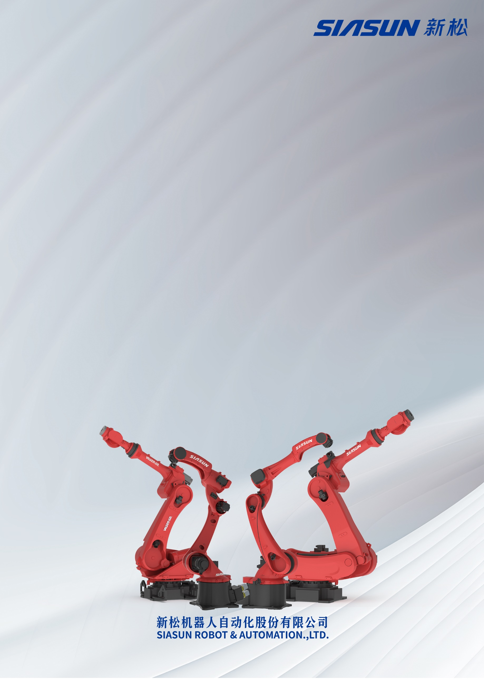

| S:\品牌与公共关系部\1.LOGO\SIASUN+新松透明底.png |
| --- |
| 新松机器人码垛应用操作手册 |
| 工业机器人 技术资料 |

|  |
| --- |

文件历次修订记录

| **文件版本** | **修订日期** | **修订人** | **主要变化** |
| --- | --- | --- | --- |
| V1\.0 | 2024年4月7日 | 沙景超 | 初版创建。 |
|  |  |  |  |
|  |  |  |  |
|  |  |  |  |
|  |  |  |  |
|  |  |  |  |

目录

[文件历次修订记录 1](#_Toc163461914)

[1 码垛操作 1](#_Toc163461915)

[**1\.1** 码垛功能介绍 1](#_Toc163461916)

[**1\.2** 码垛配置 1](#_Toc163461917)

[**1\.2\.1** 用户坐标系配置 1](#_Toc163461918)

[**1\.2\.2** 码垛属性文件配置 1](#_Toc163461919)

[**1\.2\.3** 计数器设置 4](#_Toc163461920)

[**1\.3** 码垛指令 6](#_Toc163461921)

[**1\.3\.1** PAL S指令中的模式含义 7](#_Toc163461922)

[**1\.3\.2** PAL L\&PAL J指令说明 8](#_Toc163461923)

[**1\.3\.3** PAL R指令 8](#_Toc163461924)

[**1\.3\.4** PAL E指令 8](#_Toc163461925)

[**1\.3\.5** PR指令 9](#_Toc163461926)

[**1\.3\.6** IF PR指令 9](#_Toc163461927)

[**1\.4** 码垛指令在RC界面中的位置的位置 9](#_Toc163461928)

[**1\.5** 码垛指令使用注意事项 10](#_Toc163461929)

[**1\.6** 码垛实例 11](#_Toc163461930)

[**1\.6\.1** 码垛三个托盘的工件实例 11](#_Toc163461931)

[**1\.6\.2** 码垛作业 11](#_Toc163461932)

# 码垛操作

本部分操作适合新松提供的码垛软件功能模块，客户在购买机器人时选择配置。

## 码垛功能介绍

码垛机器人提供快捷的码垛操作，客户可通过配置码垛的行列等属性利用码垛指令进行方便快捷的操作。

## 码垛配置

### 用户坐标系配置

用户坐标系配置是码垛功能的基础，码垛配置中的行码垛和列码垛就是参照用户坐标的X、Y方向进行定义的，码垛的动作是相对用户坐标系中的位移运动，所以在进行码垛位置示教前需要标定用户坐标系。

用户坐标系通常设定在托盘上平面的一角，标定的方法使用3点法，第一点确定用户坐标系的原点，第二点确定用户坐标系的X轴方向，第三点确定Y轴方向，Z轴方向由右手定则确定。

图1\-1 用户坐标系的标定

### 码垛属性文件配置

新松码垛机器人支持8个码垛设置文件，码垛设置（配置托盘属性）界面如下：

图1\-2码垛设置界面

1. 工件总数：该托盘需要码垛的工件总个数。根据工件总数和层高度，机器人会自动计算码垛的层数。
2. 每行工件数:用户坐标系X方向的工件数。
3. 每列工件数：用户坐标系Y方向的工件数。
4. 每行工件偏置：X方向上相邻码垛工件之间抓取点之间的距离。保证足够大，使得工件可以放置进去。每行工件偏置数值是工件宽（长）与工件之间相应方向的间隔距离的和。可以精确到0\.001mm。
5. 每列工件偏置：Y方向上相邻码垛工件之间抓取点之间的距离。保证足够大，使得工件可以放置进去。每列工件偏置数值是工件宽（长）与工件之间相应方向的间隔距离的和。可以精确到0\.001mm。
6. 层高度：每层的高度，单位为mm，可以精确到0\.001mm。

**注意**：工件数参数需要输入整数。

进入码垛设置的操作如下：

1. 点击应用

图1\-3机器人主界面

1. 点击简单码垛

图1\-4简单码垛配置界面

1. 点击码垛设置

图1\-5码垛设置界面

码垛设置（配置托盘属性）文件可以通过按上一页、下一页进行文件的切换。

不同的码垛设置文件不能一起修改。

托盘属性文件中的参数值必须是整数，且要大于或等于0，输入小于零的数值，系统会自动修改为0。

### 计数器设置

计数器设置的文件都有8个，分别对应8个码垛设置（配置托盘属性）文件，也就是说，码垛设置和计数器文件一一对应。

码垛过程中计数器自动计数，当系统断电计数器清零后或某些特殊情况，可以设置计数器，让机器人从特定位置开始码垛。

进入计数器设置界面的操作如下（接上面进入码垛设置操作步骤）：

图1\-6设置计数器界面

可以按下一页（上一页）进入各计数器文件：

1. 行数计数器数值：将要执行码垛的行数
2. 列数计数器数值：将要执行码垛的列数
3. 层数计数器数值：将要执行码垛的层数
4. 个数计数器数值：将要执行码垛的个数

如果行数计数器、列计数器、层计数器、个数计数器都被置成1，则码垛从头开始进行码垛。如果行计数器、层计数器、个数计数器被设置某个数值，例如设置成2,2,2，14则下一次码垛将从2,2,2，14进行码垛。

这里面注意的是个数计数器是为了表示码垛了多少个工件（实际为个数计数器中的数\-1）。可以设置成用户想表示的数值。但是不要超过要码垛的总的个数，如果超过，系统会自动进行复位操作。

不同文件号的计数器数值可以一起修改然后退出保存。

这里面的默认值从上至下是1、1、1、1，其原因如下，最初肯定码垛的时候是从第一行、第一列、第一层开始码垛的，默认设置1、1、1、1即可。如果你输入小于默认数值，系统会自动修改为默认值。

## 码垛指令

| PAL S | 功能 | 码垛开始标志指令 | | | | |
| --- | --- | --- | --- | --- | --- | --- |
| 格式 | PAL S \<参数项1\> \<参数项2\> | | | | |
| 说明 | 参数项1 | | 码垛模式：目前支持两种模式1\-2， 2两种模式分别为按照行码垛和按照列码垛。 | | |
| 参数项2 | | 码垛设置文件号：通常把码垛托盘当做一个单位，一个码垛托盘分配一组计数器和一组码垛设置，与用户坐标系绑定使用。 | | |
| 举例 | PAL S 1 2 | | | | |
| PAL L | 功能 | 码垛以直线移动到示教点，含位置点信息 | | | | |
| 格式 | PAL L VL\=\<参数项\> | | | | |
| 说明 | 参数项 | 含义：直线运动速度 数值范围 1\~1600 （mm/s）；数值范围可能因机器人型号不同而不同 | | | |
| 举例 | PAL L VL\=400 | | | | |
| PAL J | 功能 | 码垛以关节插补移动到示教点，含位置点信息 | | | | |
| 格式 | PAL J VJ\=\<参数项\> | | | | |
| 说明 | 参数项 | 含义：关节运动速度 数值范围: 1\~99　（%） | | | |
| 举例 | PAL J VJ\=50 | | | | |
| PAL E | 功能 | 码垛完成指令 | | | | |
| 格式 | PAL E \#\<参数项\> | | | | |
| 说明 | 参数项 | 含义：输出IO号，码垛结束（满载）的输出信号 | | | |
| 举例 | PAL E \#15 | | | | |
| PAL R | 功能 | 码垛计数器复位指令 | | | | |
| 格式 | PAL R \<参数项\> | | | | |
| 说明 | 参数项 | 含义：计数器文件号 | | | |
| 举例 | PAL R 1 | | | | |
| PR | 功能 | 设置码垛文件中计数器的数值 | | | | |
| 格式 | PR \#\<参数项\>\=\<参数项\>，\<参数项\>，\<参数项\> | | | | |
| 说明 | 参数项1 | | | 码垛文件号 | |
| 参数项2,3,4 | | | 根据PAL S中的码垛模式：如果按行码垛，则参数分别为行计数器数值，列计数器数值，层计数器数值；如果按列码垛，则参数项分别为列计数器数值，行计数器数值，层计数器数值 | |
| 举例 | PR \#01\=2,3,4 | | | | |
| IF PR | 功能 | 判断码垛文件中计数器的数值选择性跳转 | | | | |
| 格式 | IF PR\#\<参数项\>\=\<参数项\>，\<参数项\>，\<参数项\> L\<参数项\> | | | | |
| 说明 | 参数项1,2,3,4 | | | | 与PR中参数项含义相同 |
| 参数项5 | | | | 满足条件时跳转标签 |
| 举例 | IF PR\#01\=2,3,4 L10 | | | | |

### PAL S指令中的模式含义

目前支持两种模式1\-2，如图2，3两种模式分别为按照行码垛和按照列码垛。行码垛和列码垛是按照用户坐标系的X轴和Y轴方向定义的。

图1\-7行码垛（按X方向进行装载）

图1\-8列码垛（按Y方向进行装载）

### PAL L\&PAL J指令说明

PAL L和PAL J用于规划码垛运动过程，PAL L和PAL J指令为特殊逻辑指令，该指令因为没有步号，所以无法在示教模式下以正方向运动方式到达，但可以记录机器人位置点，通常作为托盘第一个件码垛时的动作示教点。

例： PAL S 1 1

 PAL J VJ\=30

 PAL L VL\=200

 OUT\[3]\=0

 OUT\[5]\=1 与上条指令结合假设为控制夹手放下工件的指令

 DELAY T\=1\.0

 PAL L VL\=200

 PAL E \#\[13]

如例中，3条指令：“PAL J”,“PAL L”,“PAL L”,记录的位置含义依次为：“托盘1首个码垛工件放置点的上方”“工件1放置点”“托盘1首个码垛工件放置点上方”旨在形成一个垂直放件的过程，在作业执行时，PAL S指令标志了码垛开始，在PAL S和PAL E之间的PAL J和PAL L指令的位置点，会以示教作业时编写的基准位置根据计数器和码垛设置的参数之间计算出的偏移量开始偏移，由放置单个工件的动作根据计数器的累加而成为整个码垛过程。

### PAL R指令

PAL R码垛复位指令：

PAL R \# \[文件号]

目前码垛复位指令暂时只能与条件判断指令配合，利用调用子作业或者跳转的方式实现，满足一定条件则进行计数器置位的操作。如果满足条件则对相应托盘号对应的计数器进行全部复位。

\[文件号]：输入文件号，使得文件号对应的托盘置位。

### PAL E指令

PAL E码垛结束指令：

PAL E \#\[信号]

码垛完成指令，与PAL S指令成对出现。

### PR指令

码垛文件计数器赋值指令：

PR \#\<参数项\>\=\<参数项\>，\<参数项\>，\<参数项\>

令码垛文件中的3个计数器等于设定值。如：“PR\#01\=1，2，3”，如果当前码垛模式是按行码垛，则指令含义为使码垛文件1中的行计数器值为1，列计数器值为2，层计数器值为3；如果当前码垛模式是按列码垛，则指令含义为使码垛文件1中的列计数器值为1，行计数器值为2，层计数器值为3。

### IF PR指令

条件判断跳转指令：

IF PR\#\<参数项\>\=\<参数项\>，\<参数项\>，\<参数项\> L\<参数项\>

当码垛文件计数器中的值等于当前值时跳转到标签。

## 码垛指令在RC界面中的位置的位置

码垛指令在菜单中编辑

图1\-9码垛应用指令

图1\-10简单码垛程序

## 码垛指令使用注意事项

 一个PALS指令后面有一个运动码垛指令PALL或者PALJ，最后必须有一个PALE结束指令。

## 码垛实例

### 码垛三个托盘的工件实例

如图1\-11，拿三个托盘码垛实例进行说明，机器人从货站取工件，放置到托盘1；然后再从货站取工件，再放置到托盘2；依次从货站再去工件，放置到托盘3；以此作为循环继续进行。

图1\-11 针对3个托盘进行的码垛

### 码垛作业

针对上图1\-11，进行编写作业如下。

| 000 | NOP |  |
| --- | --- | --- |
| 001 | MOVL VL\=300 | 固定位置取工件的位置点 |
| 002 | MOVL VL\=200 | 移动到接近托盘1一点 |
| 003 | **PALS 1 1** | 对托盘1，以模式1进行码垛开始 |
| 004 | PALL VL\=400 | 对托盘1，第一个工件的码垛点 |
| 005 | **PAL E \#1** | 码垛结束标志 |
| 006 | MOVL VL\=300 | 到货站取工件的位置点 |
| 007 | MOVL VL\=200 | 移动到接近托盘2一点 |
| 008 | **PALS 1 2** | 对托盘2，以模式1进行码垛开始 |
| 009 | PALL VL\=400 | 对托盘2，第一个工件的码垛点 |
| 010 | **PAL E \#2** | 码垛结束标志 |
| 011 | MOVL VL\=300 | 到货站取工件的位置点 |
| 012 | MOVL VL\=200 | 移动到接近托盘3一点 |
| 013 | **PALS 1 3** | 对托盘3，以模式1进行码垛开始 |
| 014 | PALL VL\=400 | 对托盘3，第一个工件的码垛点 |
| 015 | **PAL E \#3** | 码垛结束标志 |